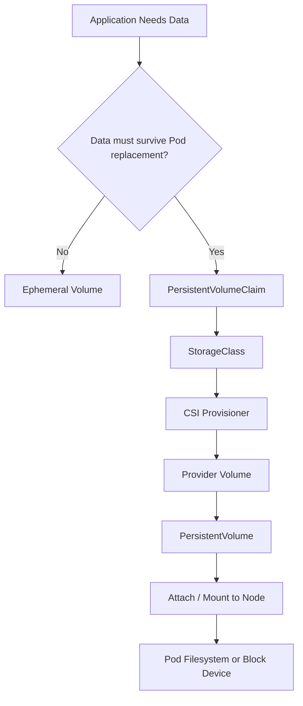
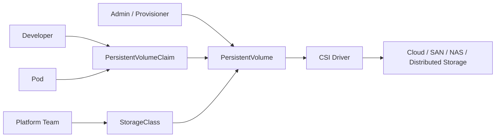
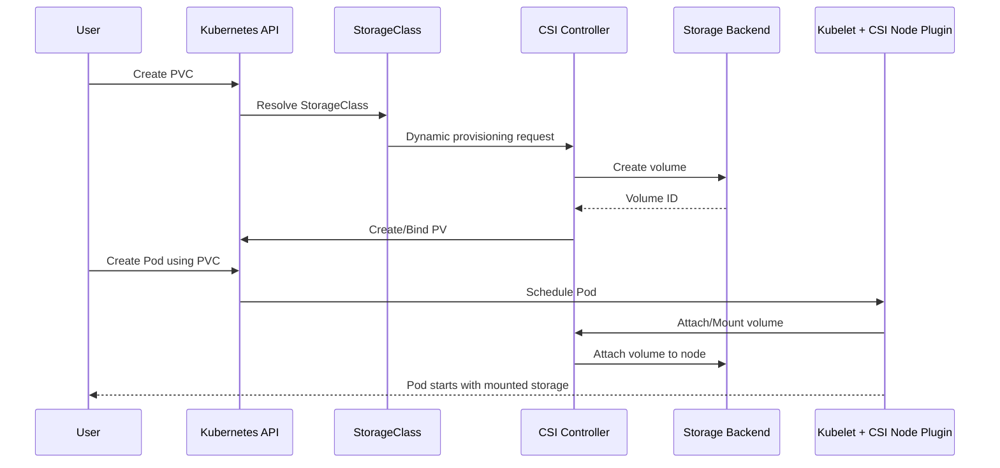
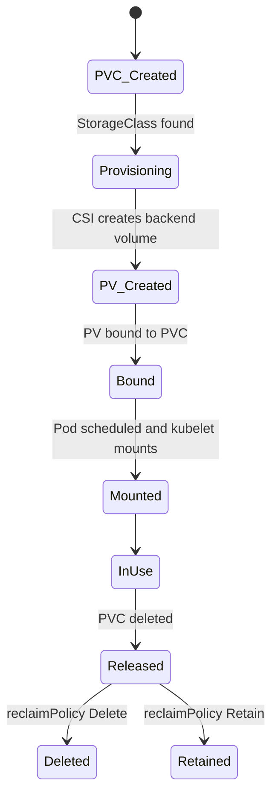
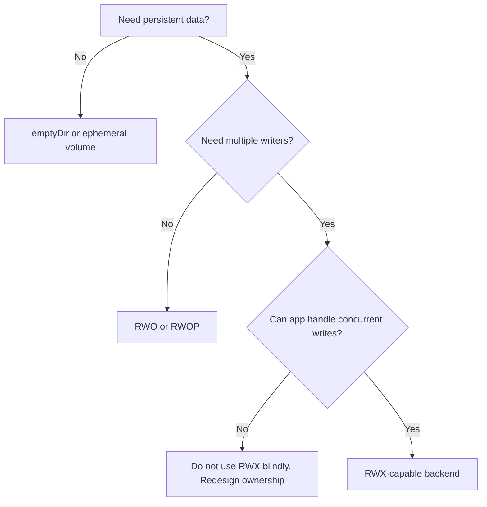
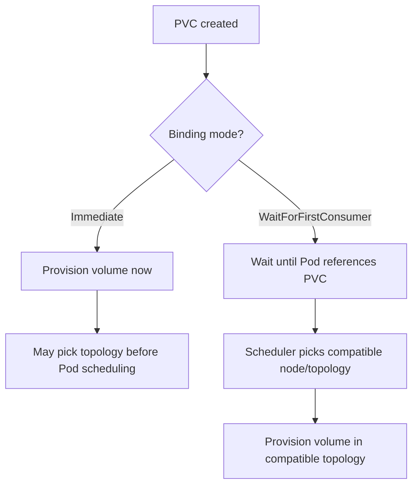
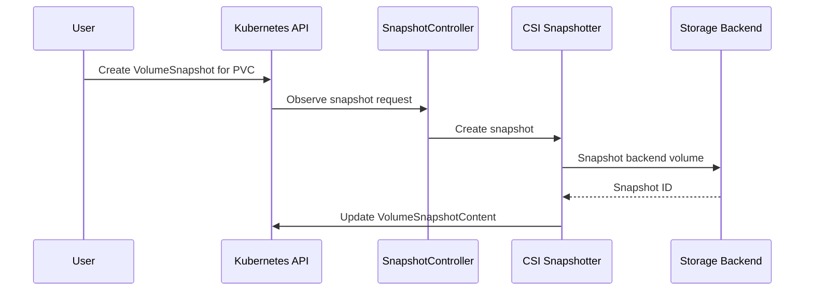

------
title: Learn Kubernetes, Deployment Model, and Cloud Native Platform Engineering - Part 019
description: Deep dive into Kubernetes storage model: volumes, PersistentVolumes, PersistentVolumeClaims, StorageClasses, CSI, snapshots, expansion, topology, failure modes, and production governance.
series: learn-kubernetes-deployment-model
seriesTitle: Learn Kubernetes, Deployment Model, and Cloud Native Platform Engineering
order: 19
partTitle: Kubernetes Storage Model: Volumes, PV, PVC, StorageClass, and CSI
tags:
  - kubernetes
  - storage
  - persistent-volume
  - pvc
  - storageclass
  - csi
  - platform-engineering
date: 2026-07-01
---

# Part 019 — Kubernetes Storage Model: Volumes, PV, PVC, StorageClass, and CSI

## 1. Tujuan Pembelajaran

Pada bagian sebelumnya kita sudah membahas traffic path: Service, DNS, EndpointSlice, Ingress, Gateway API, NetworkPolicy, dan service mesh. Sekarang kita masuk ke domain yang sering menjadi sumber incident paling mahal: **storage**.

Target setelah menyelesaikan part ini:

1. Memahami mengapa filesystem container bersifat ephemeral dan mengapa Kubernetes memisahkan lifecycle compute dari lifecycle storage.
2. Bisa membedakan `volume`, `PersistentVolume`, `PersistentVolumeClaim`, `StorageClass`, `CSI`, `VolumeSnapshot`, dan `VolumeAttributesClass`.
3. Bisa memilih storage pattern berdasarkan workload: stateless, cache, queue worker, upload service, database, search index, analytics, dan stateful platform service.
4. Bisa membaca failure mode: PVC `Pending`, volume tidak bisa attach, mount timeout, multi-attach error, wrong zone, reclaim policy salah, data loss setelah delete, dan backup yang tidak konsisten.
5. Bisa mendesain storage governance untuk environment enterprise: class taxonomy, backup policy, encryption, retention, topology, quota, ownership, dan operational runbook.

Kaufman lens:

- **Deconstruct**: pecah storage menjadi identity, capacity, access mode, lifecycle, topology, performance, durability, dan ownership.
- **Self-correct**: belajar membaca status PV/PVC/Pod/Event/CSI driver untuk menemukan akar masalah.
- **Remove barriers**: gunakan decision tree dan invariant agar tidak bergantung pada hafalan YAML.
- **Practice subskills**: binding, provisioning, reclaim, expansion, backup, restore, dan debugging.

---

## 2. Mental Model: Storage Bukan Sekadar Folder di Container

Kesalahan awal yang sering terjadi adalah menganggap storage Kubernetes sebagai “folder yang dimount ke container”. Itu terlalu sempit.

Mental model yang lebih akurat:

> Kubernetes storage adalah sistem kontrak antara workload, cluster, storage provider, scheduler, kubelet, dan driver storage untuk menyediakan filesystem atau block device dengan lifecycle yang bisa lebih panjang daripada Pod.

Container dapat mati. Pod dapat diganti. Node dapat drain. Replica dapat berpindah. Tetapi data tertentu harus bertahan.



Ada tiga lifecycle berbeda:

| Lifecycle | Owned By | Contoh | Hilang Saat |
|---|---|---|---|
| Container filesystem | Container runtime | writable layer image | container diganti |
| Pod volume ephemeral | Pod | `emptyDir`, projected config | Pod dihapus |
| Persistent storage | PV / provider backend | disk, network volume, block device | tergantung reclaim policy/provider |

Invariant penting:

> Data yang penting tidak boleh bergantung pada lifecycle Pod.

Jika data harus survive restart/replacement, gunakan persistent storage atau external managed service.

---

## 3. Object Model Storage Kubernetes

Kubernetes memakai beberapa object untuk memisahkan concern antara developer, platform team, dan storage backend.



### 3.1 `volume`

`volume` adalah definisi mount di dalam `Pod.spec.volumes`.

Contoh volume ephemeral:

```yaml
apiVersion: v1
kind: Pod
metadata:
  name: cache-worker
spec:
  containers:
    - name: worker
      image: example/worker:1.0.0
      volumeMounts:
        - name: scratch
          mountPath: /scratch
  volumes:
    - name: scratch
      emptyDir: {}
```

`emptyDir` dibuat ketika Pod ditempatkan ke Node dan dihapus ketika Pod dihapus. Cocok untuk scratch space, temporary cache, sort buffer, atau intermediate files.

Tidak cocok untuk:

- uploaded files yang harus bertahan,
- database files,
- queue state,
- search index yang mahal dibangun ulang tanpa recovery plan,
- audit logs yang wajib retain.

### 3.2 `PersistentVolume` atau PV

`PersistentVolume` adalah resource storage di cluster. Ia bisa dibuat manual oleh admin atau dibuat otomatis oleh provisioner.

PV mirip Node dalam satu hal: keduanya adalah resource cluster yang dapat diklaim oleh workload.

PV memiliki properti penting:

- capacity,
- access modes,
- volume mode,
- reclaim policy,
- storage class,
- backend driver/source,
- node affinity/topology,
- status phase.

Contoh PV manual jarang digunakan di platform modern, tetapi penting untuk memahami model:

```yaml
apiVersion: v1
kind: PersistentVolume
metadata:
  name: pv-manual-example
spec:
  capacity:
    storage: 100Gi
  accessModes:
    - ReadWriteOnce
  persistentVolumeReclaimPolicy: Retain
  storageClassName: slow-retain
  csi:
    driver: example.csi.driver
    volumeHandle: provider-volume-id-123
```

### 3.3 `PersistentVolumeClaim` atau PVC

`PersistentVolumeClaim` adalah permintaan storage dari user/workload.

Developer biasanya tidak membuat PV langsung. Developer membuat PVC:

```yaml
apiVersion: v1
kind: PersistentVolumeClaim
metadata:
  name: app-data
spec:
  accessModes:
    - ReadWriteOnce
  storageClassName: gp3-retain
  resources:
    requests:
      storage: 50Gi
```

PVC menyatakan:

- “Saya butuh storage sebesar X.”
- “Saya butuh akses mode Y.”
- “Saya ingin storage class Z.”
- “Saya ingin filesystem atau block device.”

PVC tidak seharusnya menyatakan detail provider rendah seperti disk ID, zone spesifik, atau API storage cloud. Detail itu milik platform/storage layer.

### 3.4 `StorageClass`

`StorageClass` mendeskripsikan kelas storage yang tersedia.

StorageClass adalah abstraction boundary antara app team dan platform team.

```yaml
apiVersion: storage.k8s.io/v1
kind: StorageClass
metadata:
  name: fast-retain
provisioner: ebs.csi.aws.com
parameters:
  type: gp3
  encrypted: "true"
reclaimPolicy: Retain
allowVolumeExpansion: true
volumeBindingMode: WaitForFirstConsumer
```

StorageClass bisa merepresentasikan:

- disk cepat vs murah,
- replicated vs zonal,
- encrypted vs non-encrypted,
- backup-enabled vs no-backup,
- retain vs delete,
- filesystem vs block default,
- storage backend berbeda,
- policy internal seperti compliance tier.

Kubernetes sendiri tidak menentukan makna bisnis StorageClass. Platform team yang harus membuat taxonomy yang jelas.

### 3.5 CSI Driver

CSI adalah Container Storage Interface. Dalam Kubernetes modern, CSI adalah cara utama storage provider mengintegrasikan provisioning, attach, mount, expansion, snapshot, dan operasi storage lain.

CSI memindahkan logika provider-specific keluar dari core Kubernetes.



---

## 4. Binding Model: Bagaimana PVC Mendapat PV

Binding adalah proses PVC dipasangkan dengan PV.

Ada dua pola:

1. **Static provisioning**: PV dibuat dulu, PVC memilih PV yang cocok.
2. **Dynamic provisioning**: PVC dibuat, provisioner membuat PV/backend volume secara otomatis.

Di platform modern, dynamic provisioning lebih umum.

### 4.1 Static Provisioning

Static provisioning cocok untuk:

- storage legacy,
- migration dari sistem lama,
- volume existing yang harus diadopsi,
- recovery manual dari backup/provider disk,
- environment dengan kontrol storage sangat ketat.

Risikonya:

- human error lebih tinggi,
- naming mismatch,
- reclaim policy salah,
- zone mismatch,
- sulit scale untuk banyak team.

### 4.2 Dynamic Provisioning

Dynamic provisioning cocok untuk platform self-service.

Flow:



Dynamic provisioning mengurangi beban admin, tetapi menuntut governance StorageClass yang kuat. Jika default StorageClass salah, seluruh organisasi bisa membuat volume dengan policy yang salah.

---

## 5. Access Modes

Access mode menjawab: berapa Node/Pod yang boleh mount volume, dan dengan mode apa?

| Access Mode | Meaning | Typical Use |
|---|---|---|
| `ReadWriteOnce` / RWO | volume bisa read-write oleh satu Node | database single-writer, app state lokal |
| `ReadOnlyMany` / ROX | volume bisa read-only oleh banyak Node | shared static dataset |
| `ReadWriteMany` / RWX | volume bisa read-write oleh banyak Node | shared file storage, CMS uploads, distributed app tertentu |
| `ReadWriteOncePod` / RWOP | volume bisa read-write oleh satu Pod saja | stronger single-writer guarantee |

Catatan penting:

- RWO bukan berarti hanya satu Pod. RWO berarti biasanya satu Node. Beberapa Pod di Node yang sama bisa saja mengakses volume tergantung backend dan mode mount.
- RWX membutuhkan backend yang mendukung multi-writer, biasanya network filesystem atau distributed filesystem.
- RWOP lebih ketat dan berguna untuk mencegah dua Pod menulis volume yang sama.

Decision point:



Top 1% lesson:

> Multi-writer storage does not magically make the application safe for concurrent writes.

Kubernetes can mount a volume. It cannot make your application’s file locking, transaction semantics, or consistency model correct.

---

## 6. Volume Mode: Filesystem vs Block

PVC dapat meminta `volumeMode`:

```yaml
spec:
  volumeMode: Filesystem
```

atau:

```yaml
spec:
  volumeMode: Block
```

| Volume Mode | Meaning | Use Case |
|---|---|---|
| `Filesystem` | Kubernetes mounts filesystem ke container | most apps, DB default, uploads |
| `Block` | raw block device exposed ke container | database/storage engine yang ingin manage filesystem sendiri |

Block mode lebih advanced. Gunakan jika aplikasi benar-benar butuh raw device dan tim memahami recovery, formatting, observability, dan backup implications.

---

## 7. Reclaim Policy: Delete vs Retain

Reclaim policy menentukan nasib PV/backend storage setelah PVC dihapus.

| Policy | Behavior | Cocok Untuk | Risiko |
|---|---|---|---|
| `Delete` | backend volume dihapus otomatis | ephemeral env, preview env, non-critical data | data loss jika PVC salah hapus |
| `Retain` | backend volume tetap ada | database, compliance data, migration | perlu cleanup manual |
| `Recycle` | deprecated/legacy | jangan digunakan | tidak relevan modern |

Production rule:

> Untuk data yang tidak boleh hilang karena kesalahan `kubectl delete`, gunakan `Retain` atau backup/restore policy yang benar-benar diuji.

Namun `Retain` bukan silver bullet. Ia menyelamatkan volume dari delete otomatis, tetapi bisa menciptakan orphaned volume, biaya tersembunyi, dan kebingungan ownership.

Governance pattern:

- `standard-delete`: default dev/test non-critical.
- `standard-retain`: production persistent state.
- `fast-retain`: production latency-sensitive.
- `shared-rwx-retain`: shared filesystem with backup.
- `scratch-delete`: disposable high-throughput scratch.

---

## 8. Volume Binding Mode: Immediate vs WaitForFirstConsumer

StorageClass memiliki `volumeBindingMode`.

### 8.1 `Immediate`

Volume dibuat dan di-bind segera saat PVC dibuat.

Masalah: scheduler belum tahu Pod akan ditempatkan di Node/zone mana.

Jika storage backend zonal, volume bisa dibuat di zone A, tetapi Pod hanya bisa schedule di zone B karena resource/affinity. Hasilnya Pod `Pending` atau attach gagal.

### 8.2 `WaitForFirstConsumer`

Volume provisioning/binding ditunda sampai Pod yang memakai PVC dijadwalkan.

Ini memungkinkan scheduler mempertimbangkan:

- node availability,
- zone/topology,
- affinity,
- taints/tolerations,
- storage topology.

Untuk storage zonal, `WaitForFirstConsumer` hampir selalu lebih aman.

```yaml
apiVersion: storage.k8s.io/v1
kind: StorageClass
metadata:
  name: zonal-retain
provisioner: example.csi.driver
volumeBindingMode: WaitForFirstConsumer
reclaimPolicy: Retain
allowVolumeExpansion: true
```

Mental model:



---

## 9. Storage Topology and Scheduling Interaction

Storage bukan resource global. Banyak storage backend bersifat:

- zonal,
- regional,
- node-local,
- rack-local,
- latency-sensitive,
- attach-limited.

Jika workload memakai persistent volume, scheduling tidak lagi hanya soal CPU/memory. Scheduler harus mempertimbangkan kompatibilitas volume.

Contoh failure:

```text
0/6 nodes are available: 3 node(s) had volume node affinity conflict, 3 Insufficient memory.
```

Artinya:

- sebagian Node tidak cocok dengan topology PV,
- sebagian Node kurang memory,
- Pod tidak punya lokasi valid.

Top 1% diagnosis:

Jangan langsung tambah node. Baca kombinasi constraint:

- PVC bound ke PV di zone mana?
- Pod punya nodeAffinity?
- StorageClass binding mode apa?
- Node pool tersebar di zone apa?
- Volume attach limit sudah penuh?
- Pod anti-affinity terlalu ketat?

---

## 10. Volume Expansion

Beberapa StorageClass mendukung expansion:

```yaml
allowVolumeExpansion: true
```

PVC dapat diperbesar:

```yaml
apiVersion: v1
kind: PersistentVolumeClaim
metadata:
  name: app-data
spec:
  resources:
    requests:
      storage: 200Gi
```

Important invariants:

- Expand biasanya one-way. Shrink volume umumnya tidak didukung secara langsung.
- Backend harus mendukung expansion.
- Filesystem resize mungkin terjadi online atau butuh remount/restart tergantung driver/filesystem.
- Expansion bukan pengganti capacity planning.

Failure mode:

```text
PVC requested size updated, but filesystem inside container still shows old size.
```

Diagnosis:

- cek PVC condition,
- cek events,
- cek CSI driver support,
- cek filesystem resize,
- cek Pod restart/mount requirement,
- cek storage provider quota.

---

## 11. VolumeAttributesClass

Pada Kubernetes modern, `VolumeAttributesClass` digunakan untuk merepresentasikan kelas atribut volume yang dapat dimodifikasi setelah volume dibuat, bergantung pada dukungan CSI driver.

Mental model:

- `StorageClass`: mostly provisioning-time class.
- `VolumeAttributesClass`: mutable operational characteristics setelah volume ada.

Contoh use case konseptual:

- mengubah performance tier,
- mengubah IOPS/throughput class,
- mengubah provider-specific mutable attributes.

Gunakan hati-hati. Atribut mutable yang salah bisa berdampak pada latency, cost, dan SLO.

Governance:

- jangan expose arbitrary provider parameters langsung ke app team,
- gunakan approved classes,
- audit perubahan,
- validasi lewat admission policy,
- dokumentasikan cost/performance implication.

---

## 12. Snapshots, Cloning, Backup, and Restore

Volume snapshot adalah copy point-in-time dari volume.

Namun ada jebakan besar:

> Snapshot storage-level tidak otomatis berarti backup aplikasi konsisten.

Untuk database, ada beberapa level konsistensi:

| Level | Meaning | Risiko |
|---|---|---|
| Crash-consistent | seperti mesin mati tiba-tiba | database perlu recovery log |
| Application-consistent | app flush/freeze sebelum snapshot | lebih aman |
| Transaction-consistent | snapshot sesuai boundary transaksi | butuh mekanisme DB/app |

Kubernetes menyediakan API snapshot, tetapi konsistensi aplikasi tetap tanggung jawab desain backup.

### 12.1 Snapshot Object Model

Typical objects:

- `VolumeSnapshotClass`,
- `VolumeSnapshot`,
- `VolumeSnapshotContent`.

Flow:



### 12.2 Clone

CSI volume cloning memungkinkan PVC baru dibuat dari PVC existing, jika driver mendukung.

Use case:

- test data clone,
- migration rehearsal,
- blue-green database copy dalam batas tertentu,
- forensic analysis,
- restore-like workflow.

Anti-pattern:

- clone production data ke namespace dev tanpa masking,
- clone database aktif tanpa consistency protocol,
- clone volume besar tanpa cost visibility.

### 12.3 Backup Strategy

Snapshot bukan seluruh strategi backup.

Checklist backup production:

- Apakah snapshot terenkripsi?
- Apakah snapshot disalin cross-zone/cross-region?
- Apakah restore diuji berkala?
- Apakah RPO/RTO jelas?
- Apakah ada application-consistent hook?
- Apakah secret/config version yang cocok ikut disimpan?
- Apakah schema migration compatibility diuji?
- Apakah backup retention memenuhi compliance?
- Apakah backup dapat dipulihkan ke cluster berbeda?

---

## 13. Ephemeral Volumes

Ephemeral volumes berguna untuk data sementara.

Jenis umum:

- `emptyDir`,
- `configMap`,
- `secret`,
- `downwardAPI`,
- `projected`,
- CSI ephemeral volumes,
- generic ephemeral volumes.

Gunakan ephemeral volume untuk:

- temporary cache,
- scratch work,
- socket sharing antar container dalam Pod,
- generated runtime files,
- short-lived processing output,
- injected config/secret.

Jangan gunakan untuk:

- source of truth,
- durable queue,
- audit trail,
- critical uploads,
- DB storage.

`emptyDir.medium: Memory` dapat memakai memory-backed storage. Ini cepat, tetapi mengonsumsi memory Node/Pod dan bisa menyebabkan eviction/OOM jika sizing buruk.

---

## 14. `subPath`: Berguna Tapi Berisiko Secara Operasional

`subPath` memungkinkan mount subdirectory dari volume ke path tertentu.

Contoh:

```yaml
volumeMounts:
  - name: app-data
    mountPath: /var/lib/app/config.yaml
    subPath: config.yaml
```

Masalah umum:

- update ConfigMap/Secret tidak terefleksi otomatis jika mounted via `subPath`,
- path collision,
- permission confusion,
- lifecycle mount lebih sulit dipahami,
- lebih sulit distandardisasi.

Rule:

> Gunakan `subPath` hanya jika memang perlu. Untuk config dinamis, prefer projected volume atau mount directory penuh dengan reload strategy yang jelas.

---

## 15. Permissions, Ownership, and Filesystem Security

Storage sering gagal bukan karena backend, tetapi karena permission.

Field penting:

```yaml
securityContext:
  runAsNonRoot: true
  runAsUser: 10001
  runAsGroup: 10001
  fsGroup: 10001
```

`fsGroup` dapat membantu container non-root menulis ke mounted volume. Namun efeknya tergantung driver, filesystem, dan policy.

Risiko:

- chown recursive lambat pada volume besar,
- mismatch UID/GID antar image,
- app berjalan root untuk “memperbaiki” permission,
- shared RWX volume menjadi terlalu permisif,
- backup/restore mengubah ownership.

Production guidance:

- standardisasi UID/GID image,
- dokumentasikan expected path ownership,
- gunakan init container permission fix hanya jika perlu dan bounded,
- hindari `chmod 777`,
- test restore permission, bukan hanya backup success.

---

## 16. Storage Performance Model

Kubernetes tidak menghapus fisika storage.

Sumber latency:

- disk latency,
- network latency,
- filesystem overhead,
- encryption overhead,
- replication overhead,
- noisy neighbor di backend,
- attach/mount delay,
- fsync pattern aplikasi,
- small random writes,
- metadata-heavy workload.

Storage metric penting:

| Metric | Meaning |
|---|---|
| IOPS | jumlah operasi IO per detik |
| throughput | data transfer per detik |
| latency p50/p95/p99 | waktu respons IO |
| queue depth | antrean operasi IO |
| fsync latency | penting untuk database |
| volume fullness | risiko write failure |
| inode usage | sering dilupakan untuk many-small-files |

Kubernetes resource requests/limits CPU/memory tidak otomatis mengatur IOPS. StorageClass/provider harus memberikan mekanisme performance class.

Top 1% lesson:

> Banyak incident “database lambat” sebenarnya adalah storage latency, bukan query planner.

---

## 17. StorageClass Taxonomy untuk Platform Engineering

Jangan memberi app team 20 StorageClass provider-specific seperti `gp3`, `io2`, `premium-rwo`, `managed-csi-xfs`, `nfs-client`, `cephfs-rwx-prod`. Itu membocorkan detail platform dan membuat decision buruk.

Buat taxonomy berbasis intent.

Contoh:

| StorageClass | Intent | Reclaim | Binding | Backup | Expansion |
|---|---|---|---|---|---|
| `dev-standard-delete` | dev/test non-critical | Delete | WaitForFirstConsumer | no | yes |
| `prod-standard-retain` | production general state | Retain | WaitForFirstConsumer | yes | yes |
| `prod-fast-retain` | latency-sensitive state | Retain | WaitForFirstConsumer | yes | yes |
| `prod-shared-rwx-retain` | shared file access | Retain | Immediate/driver-specific | yes | maybe |
| `scratch-delete` | temporary high-volume processing | Delete | WaitForFirstConsumer | no | no |

Tambahkan label/annotation:

```yaml
metadata:
  labels:
    platform.example.com/tier: production
    platform.example.com/data-class: persistent
  annotations:
    platform.example.com/backup-policy: daily-35d
    platform.example.com/encryption: required
    platform.example.com/owner-team: platform-storage
```

---

## 18. PVC Naming and Ownership Convention

PVC harus mudah ditelusuri.

Bad:

```text
data
storage
pvc1
app-volume
```

Better:

```text
orders-api-upload-data
postgres-primary-data
search-index-data
ledger-processor-checkpoint
```

Minimal labels:

```yaml
metadata:
  labels:
    app.kubernetes.io/name: orders-api
    app.kubernetes.io/component: upload-store
    app.kubernetes.io/part-of: commerce-platform
    app.kubernetes.io/managed-by: gitops
    platform.example.com/data-criticality: high
    platform.example.com/backup-required: "true"
```

Why it matters:

- cost attribution,
- backup selection,
- incident impact analysis,
- orphan cleanup,
- migration planning,
- compliance audit.

---

## 19. Common Design Patterns

### 19.1 Upload Service

Problem: app menerima file user.

Options:

| Option | Good For | Risk |
|---|---|---|
| PVC RWX | simple app migration | scaling/concurrency/backup complexity |
| Object storage external | cloud-native durable uploads | app must integrate object API |
| PVC RWO per replica | rarely correct for shared uploads | inconsistent view antar replica |

Recommendation:

- Prefer object storage for user uploads.
- Use PVC only when POSIX filesystem semantics benar-benar diperlukan.

### 19.2 Database

Options:

| Option | Good For | Risk |
|---|---|---|
| Managed DB outside Kubernetes | most production orgs | external dependency/cost |
| Operator-managed DB in Kubernetes | platform with strong DB ops maturity | high operational burden |
| DIY StatefulSet DB | learning/small internal | backup/upgrade/failover risk |

Rule:

> Kubernetes can run databases. That does not mean your organization should operate all databases inside Kubernetes.

### 19.3 Search Index

Search index bisa persistent atau rebuildable.

Ask:

- Apakah source of truth ada di tempat lain?
- Berapa lama rebuild?
- Apakah rebuild cost acceptable?
- Apakah index shard placement perlu stable identity?
- Apakah rolling restart aman?

Jika rebuild cepat dan data source valid, storage bisa lebih disposable. Jika rebuild lama, index perlu backup/snapshot atau replication strategy.

### 19.4 Queue Worker Checkpoint

Jika worker menyimpan checkpoint lokal:

- pastikan checkpoint durable,
- pastikan single-writer,
- pastikan restart semantics jelas,
- pertimbangkan external checkpoint store.

Jangan menyimpan checkpoint penting di `emptyDir` kecuali at-least-once replay aman.

---

## 20. Failure Modes and Diagnosis

### 20.1 PVC Stuck `Pending`

Symptoms:

```bash
kubectl get pvc
```

```text
NAME       STATUS    VOLUME   CAPACITY   ACCESS MODES   STORAGECLASS
app-data   Pending                                      prod-fast-retain
```

Diagnosis path:

```bash
kubectl describe pvc app-data
kubectl get storageclass prod-fast-retain -o yaml
kubectl get events --sort-by=.lastTimestamp
```

Likely causes:

- StorageClass tidak ada,
- provisioner/CSI tidak running,
- quota provider habis,
- invalid parameter,
- waiting for first consumer,
- no compatible topology,
- namespace ResourceQuota membatasi PVC/storage.

### 20.2 Pod Stuck `Pending` Due to Unbound PVC

Symptoms:

```text
pod has unbound immediate PersistentVolumeClaims
```

Meaning:

- Pod butuh PVC,
- PVC belum bound,
- scheduler tidak bisa lanjut.

Check:

```bash
kubectl describe pod <pod>
kubectl describe pvc <claim>
kubectl get sc
```

### 20.3 Multi-Attach Error

Symptoms:

```text
Multi-Attach error for volume "pvc-..." Volume is already exclusively attached to one node and can't be attached to another
```

Common causes:

- RWO volume masih attached ke Node lama,
- Pod lama stuck terminating,
- node unreachable,
- app scaled >1 dengan PVC sama,
- Deployment memakai satu PVC untuk banyak replica.

Fix thinking:

- Jangan sekadar force delete tanpa memahami data consistency.
- Pastikan hanya satu writer.
- Untuk stateful replica, gunakan StatefulSet + `volumeClaimTemplates`.
- Untuk shared writes, gunakan RWX backend dan aplikasi yang aman untuk concurrency.

### 20.4 Volume Node Affinity Conflict

Symptoms:

```text
node(s) had volume node affinity conflict
```

Cause:

- PV berada di topology tertentu,
- Pod schedule constraints mengarah ke topology lain.

Fix:

- gunakan `WaitForFirstConsumer`,
- align node pools and storage zones,
- review affinity/topology spread,
- recreate volume jika salah zone dan data bisa dimigrasi,
- restore snapshot ke zone yang benar jika perlu.

### 20.5 Mount Timeout

Symptoms:

- Pod stuck `ContainerCreating`,
- event `MountVolume.MountDevice failed`,
- CSI node plugin errors.

Check:

```bash
kubectl describe pod <pod>
kubectl -n kube-system get pods -l app=csi-node
kubectl -n kube-system logs <csi-node-pod> --all-containers
kubectl get volumeattachment
```

Potential causes:

- CSI node plugin down,
- provider API slow/unavailable,
- Node permission issue,
- kernel module missing,
- network path to storage backend broken,
- filesystem corruption.

### 20.6 Data Lost After PVC Delete

Root cause often:

- StorageClass reclaimPolicy `Delete`,
- no backup,
- preview/dev convention accidentally used in production,
- GitOps removed PVC,
- namespace delete cascaded.

Prevention:

- production StorageClass with `Retain`,
- backup policy admission check,
- namespace deletion guard,
- finalizer/governance for critical PVC,
- tested restore runbook.

---

## 21. Debugging Runbook

### 21.1 Inventory

```bash
kubectl get pvc -A
kubectl get pv
kubectl get storageclass
kubectl get volumeattachments
```

### 21.2 PVC Deep Inspect

```bash
kubectl describe pvc -n <namespace> <pvc>
kubectl get pvc -n <namespace> <pvc> -o yaml
```

Look for:

- `status.phase`,
- `spec.storageClassName`,
- `spec.volumeName`,
- `resources.requests.storage`,
- events,
- conditions.

### 21.3 PV Deep Inspect

```bash
kubectl describe pv <pv>
kubectl get pv <pv> -o yaml
```

Look for:

- capacity,
- claimRef,
- reclaimPolicy,
- nodeAffinity,
- CSI volumeHandle,
- finalizers,
- status.

### 21.4 Pod Mount Inspect

```bash
kubectl describe pod -n <namespace> <pod>
kubectl get events -n <namespace> --sort-by=.lastTimestamp
```

Look for:

- failed scheduling,
- failed attach,
- failed mount,
- permission denied,
- filesystem read-only,
- OOM/eviction side effects.

### 21.5 CSI Inspect

Names vary per provider, but generally:

```bash
kubectl -n kube-system get pods | grep -i csi
kubectl -n kube-system logs <csi-controller-pod> --all-containers
kubectl -n kube-system logs <csi-node-pod> --all-containers
```

Do not stop at Kubernetes object status. For deep incidents, provider logs/events often matter.

---

## 22. Reliability and Safety Controls

### 22.1 Use PodDisruptionBudget for Stateful Apps

Storage does not protect availability by itself. Stateful apps need disruption control.

PDB example:

```yaml
apiVersion: policy/v1
kind: PodDisruptionBudget
metadata:
  name: ledger-db-pdb
spec:
  minAvailable: 2
  selector:
    matchLabels:
      app.kubernetes.io/name: ledger-db
```

PDB does not protect against all failures. It helps with voluntary disruptions like drain/upgrade.

### 22.2 Use Topology Spread or Anti-Affinity

For replicated stateful systems, avoid all replicas on one Node/zone.

But remember: anti-affinity plus zonal volumes plus strict resource requests can make scheduling impossible.

### 22.3 Backup Before Dangerous Operations

Before:

- storage migration,
- database major upgrade,
- StatefulSet storage change,
- reclaim policy change,
- namespace cleanup,
- volume expansion for critical data,
- filesystem repair,

create a backup/snapshot and verify restore path.

---

## 23. Admission and Policy Ideas

Platform teams can enforce storage safety via admission policy.

Policy examples:

1. Production namespace cannot use `*-delete` StorageClass for critical labels.
2. PVC larger than threshold requires owner/cost-center label.
3. PVC with `platform.example.com/backup-required=true` must use backup-enabled class.
4. `ReadWriteMany` PVC requires explicit approval label.
5. StatefulSet in production must have PDB.
6. PVC cannot omit `storageClassName` unless namespace explicitly allows default.
7. Volume expansion allowed only for approved classes.
8. Namespace deletion blocked if critical PVC exists.

Governance goal:

> Prevent easy irreversible mistakes without forcing every team through a ticket queue.

---

## 24. Storage Design Checklist

Before approving a workload with persistent storage, answer:

### Data Semantics

- What data is stored?
- Is it source of truth or rebuildable cache?
- What consistency does it need?
- Single writer or multiple writers?
- Can concurrent file writes corrupt data?

### Lifecycle

- Should data survive Pod replacement?
- Should data survive namespace deletion?
- Who owns cleanup?
- What is the reclaim policy?

### Topology

- Is storage zonal, regional, or global?
- Can workload move across zones?
- Is `WaitForFirstConsumer` needed?
- Are node pools aligned with storage topology?

### Reliability

- What is RPO?
- What is RTO?
- Is backup tested?
- Is restore tested into separate namespace/cluster?
- Is snapshot crash-consistent or app-consistent?

### Performance

- Expected IOPS?
- Expected throughput?
- p99 latency requirement?
- Capacity growth rate?
- Inode usage?

### Security

- Is encryption required?
- Who can mount the PVC?
- What UID/GID writes data?
- Are backups encrypted?
- Are clones masked for lower environments?

### Operations

- How to expand?
- How to migrate?
- How to detach stuck volume?
- How to handle Node loss?
- How to test failover?

---

## 25. Common Anti-Patterns

### Anti-Pattern 1: Deployment with Shared RWO PVC and Multiple Replicas

```yaml
replicas: 3
volumes:
  - name: data
    persistentVolumeClaim:
      claimName: shared-rwo-data
```

This often causes multi-attach failure or unsafe writes.

Better:

- use StatefulSet with per-replica PVC,
- use RWX if application is multi-writer safe,
- externalize state.

### Anti-Pattern 2: Default StorageClass Is Production-Unsafe

If default StorageClass has `Delete` reclaim and no backup, production teams may accidentally create critical PVCs with delete-on-PVC-delete behavior.

Better:

- no default in production, or
- safe default with explicit labels/policies, or
- namespace-scoped guardrails.

### Anti-Pattern 3: Treating Snapshot as Backup

Snapshot without restore testing is hope, not backup.

Better:

- automated restore test,
- separate failure domain,
- app consistency protocol,
- retention policy,
- documented RPO/RTO.

### Anti-Pattern 4: Storage Provider Details Everywhere

If every app manifest contains provider-specific tuning, migration becomes painful.

Better:

- StorageClass abstraction,
- platform-owned classes,
- policy-controlled parameters,
- documented intent.

### Anti-Pattern 5: Stateful App Without Shutdown Semantics

Data corruption can happen when app receives SIGTERM but does not flush/close state.

Better:

- graceful termination,
- preStop if needed,
- adequate `terminationGracePeriodSeconds`,
- readiness fails before shutdown,
- app-level flush/leader transfer.

---

## 26. Minimal Production Example: PVC + Deployment for Single-Writer App

This is not a database recommendation. It is a minimal pattern for an app with one replica and durable local data.

```yaml
apiVersion: v1
kind: PersistentVolumeClaim
metadata:
  name: report-generator-data
  labels:
    app.kubernetes.io/name: report-generator
    platform.example.com/backup-required: "true"
spec:
  accessModes:
    - ReadWriteOncePod
  storageClassName: prod-standard-retain
  resources:
    requests:
      storage: 100Gi
---
apiVersion: apps/v1
kind: Deployment
metadata:
  name: report-generator
spec:
  replicas: 1
  strategy:
    type: Recreate
  selector:
    matchLabels:
      app.kubernetes.io/name: report-generator
  template:
    metadata:
      labels:
        app.kubernetes.io/name: report-generator
    spec:
      securityContext:
        runAsNonRoot: true
        runAsUser: 10001
        runAsGroup: 10001
        fsGroup: 10001
      containers:
        - name: app
          image: example/report-generator:1.4.2
          volumeMounts:
            - name: data
              mountPath: /var/lib/report-generator
      volumes:
        - name: data
          persistentVolumeClaim:
            claimName: report-generator-data
```

Why `Recreate`?

Because this app is single-writer and should not have old/new Pod writing the same storage during rolling transition.

---

## 27. Practice Lab

### Lab 1 — PVC Binding

1. Create PVC with a known StorageClass.
2. Observe PVC events.
3. Create Pod using PVC.
4. Delete Pod and confirm data remains.
5. Delete PVC in non-prod and observe PV behavior.

Questions:

- Was PV created dynamically?
- What reclaim policy applied?
- Was binding immediate or delayed?

### Lab 2 — WaitForFirstConsumer

1. Create StorageClass with `WaitForFirstConsumer`.
2. Create PVC.
3. Observe PVC remains pending.
4. Create Pod referencing PVC.
5. Observe binding after scheduling.

Questions:

- Why was PVC pending before Pod?
- What topology did the volume get?

### Lab 3 — Multi-Attach Failure

1. Create RWO PVC.
2. Create Deployment with two replicas using same PVC.
3. Observe failure.
4. Fix design.

Questions:

- Is the correct fix RWX, StatefulSet, or externalizing state?
- What does the app actually need?

### Lab 4 — Restore Drill

1. Create PVC with test data.
2. Create snapshot if driver supports it.
3. Restore to a new PVC.
4. Mount restored PVC in a debug Pod.
5. Verify data.

Question:

- Could this restore process meet your production RTO?

---

## 28. Summary

Kubernetes storage mastery requires more than knowing `PersistentVolumeClaim` syntax.

Core mental model:

- Pod is ephemeral.
- Data lifecycle must be explicit.
- PVC is workload demand.
- PV is cluster storage resource.
- StorageClass is platform contract.
- CSI is provider integration boundary.
- Binding, topology, access mode, reclaim policy, and backup define the real production behavior.

Most storage incidents come from mismatched assumptions:

- app assumes durable data, manifest uses ephemeral storage,
- team assumes snapshot is backup, restore was never tested,
- Deployment assumes multiple replicas, PVC supports single writer,
- scheduler assumes any Node, volume is zonal,
- platform assumes default class is safe, production deletes critical PVC.

Top 1% Kubernetes engineers do not treat storage as YAML. They treat it as **data lifecycle engineering**.

---

## 29. References

- Kubernetes Documentation — Persistent Volumes: https://kubernetes.io/docs/concepts/storage/persistent-volumes/
- Kubernetes Documentation — Storage Classes: https://kubernetes.io/docs/concepts/storage/storage-classes/
- Kubernetes Documentation — Volumes: https://kubernetes.io/docs/concepts/storage/volumes/
- Kubernetes Documentation — Dynamic Volume Provisioning: https://kubernetes.io/docs/concepts/storage/dynamic-provisioning/
- Kubernetes Documentation — Volume Snapshots: https://kubernetes.io/docs/concepts/storage/volume-snapshots/
- Kubernetes Documentation — VolumeSnapshotClasses: https://kubernetes.io/docs/concepts/storage/volume-snapshot-classes/
- Kubernetes Documentation — CSI Volume Cloning: https://kubernetes.io/docs/concepts/storage/volume-pvc-datasource/
- Kubernetes Documentation — Ephemeral Volumes: https://kubernetes.io/docs/concepts/storage/ephemeral-volumes/
- Kubernetes Documentation — VolumeAttributesClass: https://kubernetes.io/docs/concepts/storage/volume-attributes-classes/
