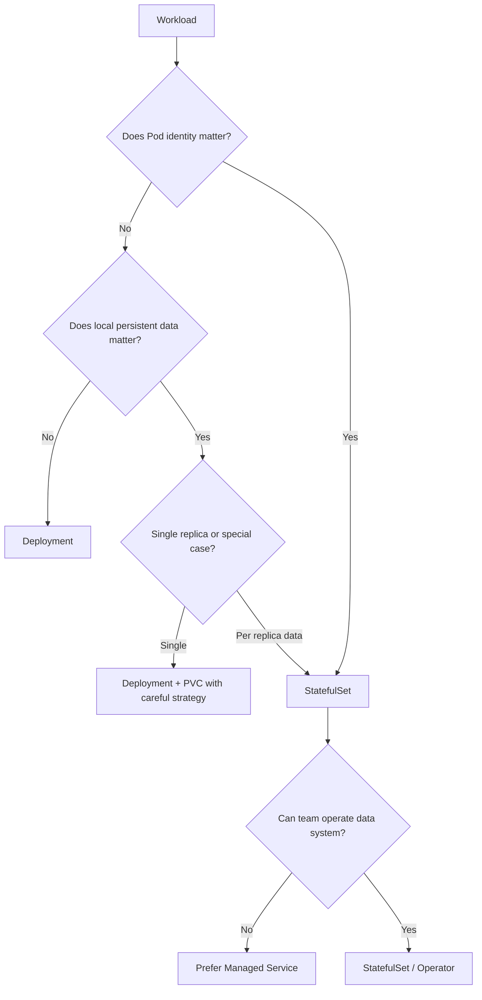
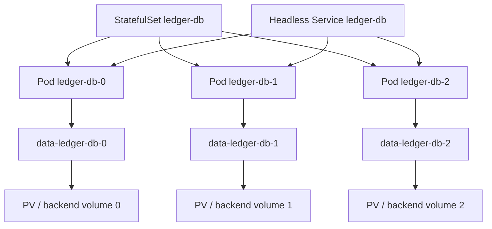
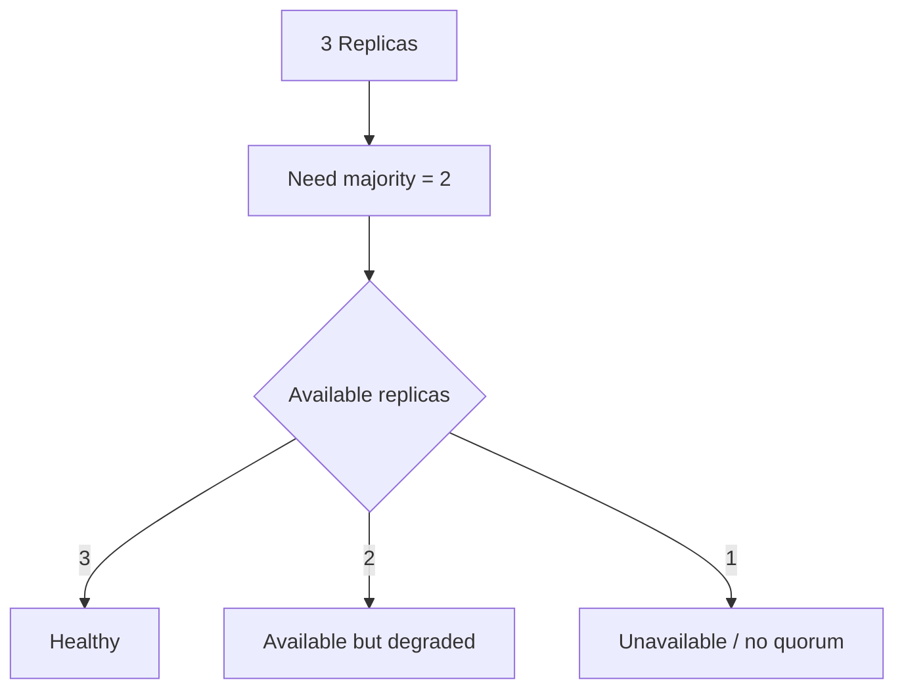
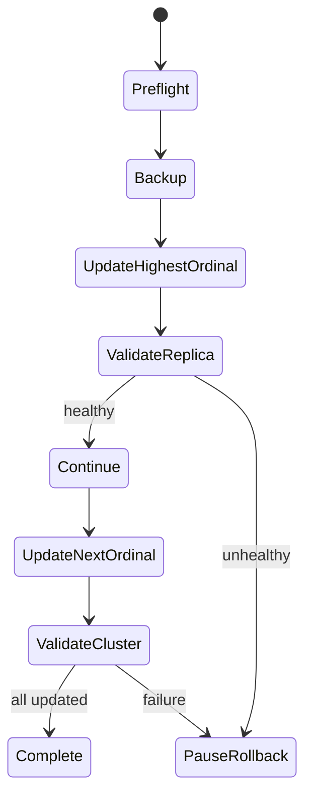
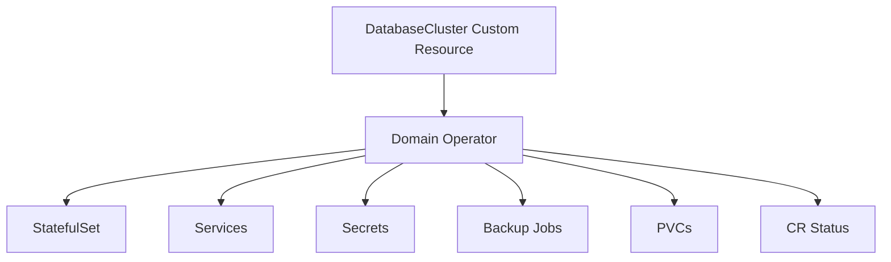

------
title: Learn Kubernetes, Deployment Model, and Cloud Native Platform Engineering - Part 020
description: Deep dive into Kubernetes StatefulSet, stable identity, persistent storage, ordered deployment, quorum-aware operations, data-aware rollout, and stateful workload failure modelling.
series: learn-kubernetes-deployment-model
seriesTitle: Learn Kubernetes, Deployment Model, and Cloud Native Platform Engineering
order: 20
partTitle: Stateful Workloads and Data-Aware Deployment Design
tags:
  - kubernetes
  - statefulset
  - stateful-workloads
  - persistent-storage
  - databases
  - reliability
  - platform-engineering
date: 2026-07-01
---

# Part 020 — Stateful Workloads and Data-Aware Deployment Design

## 1. Tujuan Pembelajaran

Part sebelumnya membahas storage model: volume, PV, PVC, StorageClass, CSI, reclaim policy, binding, snapshot, dan failure modes. Sekarang kita fokus pada workload yang membutuhkan **identity dan data continuity**.

Target setelah part ini:

1. Memahami kapan workload membutuhkan StatefulSet dan kapan tidak.
2. Memahami invariant StatefulSet: stable ordinal, stable network identity, stable storage identity, dan ordered lifecycle.
3. Bisa mendesain stateful workload dengan storage, DNS, readiness, graceful shutdown, PDB, anti-affinity, dan backup strategy.
4. Bisa membedakan “bisa dijalankan di Kubernetes” dari “layak dioperasikan di Kubernetes”.
5. Bisa menganalisis risiko database, quorum systems, leader election, shard, replica, dan data migration di Kubernetes.
6. Bisa membuat rollout dan scaling plan yang data-aware, bukan sekadar `kubectl scale`.

Kaufman lens:

- **Deconstruct**: stateful workload = identity + storage + ordering + consistency + recovery.
- **Self-correct**: baca gejala StatefulSet, PVC, DNS, readiness, quorum, dan rolling update.
- **Remove barriers**: gunakan decision tree untuk memilih managed service, operator, StatefulSet, atau redesign.
- **Practice subskills**: bootstrap, scale, update, restore, failover, drain, dan incident recovery.

---

## 2. Stateless vs Stateful: Perbedaan yang Sering Diremehkan

Stateless workload bisa diganti tanpa kehilangan state penting. Stateful workload tidak sesederhana itu.

| Dimension | Stateless Deployment | Stateful Workload |
|---|---|---|
| Pod identity | disposable | meaningful |
| Pod name | irrelevant | stable ordinal often matters |
| Storage | usually external/ephemeral | persistent per replica or external state |
| Scaling | mostly horizontal and symmetric | may require membership/rebalancing |
| Rollout | replace any instance | often ordered and health-gated |
| Failure recovery | create replacement | recover identity/data/quorum |
| Debugging | traffic, config, CPU/memory | plus data, replication, consistency |

Mental model:



Top 1% rule:

> StatefulSet solves Kubernetes identity and storage mapping. It does not solve database correctness, replication safety, backup, restore, failover, or schema migration.

---

## 3. What StatefulSet Actually Guarantees

StatefulSet manages Pods with stable identity.

For a StatefulSet named `ledger-db` with 3 replicas, Pods are named:

```text
ledger-db-0
ledger-db-1
ledger-db-2
```

These names are not random. The ordinal is part of the identity.

StatefulSet provides:

1. Stable network identity.
2. Stable storage identity.
3. Ordered deployment and scaling by default.
4. Ordered rolling updates by default.
5. Mapping between ordinal and PVC.

It does not provide:

- automatic database replication,
- automatic backup,
- automatic leader election,
- automatic split-brain prevention,
- automatic data repair,
- automatic cross-region disaster recovery,
- safe schema migration.

---

## 4. StatefulSet Object Graph

A StatefulSet typically uses:

- StatefulSet object,
- Headless Service,
- Pod template,
- `volumeClaimTemplates`,
- PVC per Pod ordinal,
- PV per PVC,
- optional ConfigMap/Secret,
- optional PDB,
- optional Service for clients,
- optional NetworkPolicy.



Important:

> StatefulSet deletion does not automatically delete PVCs created by `volumeClaimTemplates` in the same way people often expect. Treat PVC lifecycle explicitly.

Depending on Kubernetes features and retention policy configuration, PVC deletion behavior must be reviewed deliberately. Do not assume deleting StatefulSet means deleting data or preserving data without checking the object policy.

---

## 5. Stable Network Identity

StatefulSet commonly requires a Headless Service:

```yaml
apiVersion: v1
kind: Service
metadata:
  name: ledger-db
spec:
  clusterIP: None
  selector:
    app.kubernetes.io/name: ledger-db
  ports:
    - name: db
      port: 5432
```

With headless service, Pods can get stable DNS names like:

```text
ledger-db-0.ledger-db.default.svc.cluster.local
ledger-db-1.ledger-db.default.svc.cluster.local
ledger-db-2.ledger-db.default.svc.cluster.local
```

Why it matters:

- clustering systems often need stable peer addresses,
- replica membership can be ordinal-based,
- bootstrap scripts can reference known peers,
- diagnostics are easier,
- storage identity maps to network identity.

But DNS identity is not a health guarantee. A DNS name can resolve while the app is not ready or the replica is lagging.

---

## 6. Stable Storage Identity

StatefulSet uses `volumeClaimTemplates` to create PVC per ordinal.

Example:

```yaml
volumeClaimTemplates:
  - metadata:
      name: data
    spec:
      accessModes:
        - ReadWriteOnce
      storageClassName: prod-standard-retain
      resources:
        requests:
          storage: 200Gi
```

For StatefulSet `ledger-db`, Kubernetes creates PVCs like:

```text
data-ledger-db-0
data-ledger-db-1
data-ledger-db-2
```

Invariant:

> `ledger-db-0` should always map to `data-ledger-db-0`.

If Pod is recreated on another Node, it still gets the same PVC.

This is the key difference from Deployment, where replacement Pods have random names and should not carry identity-specific local state.

---

## 7. Ordered Lifecycle

By default, StatefulSet uses ordered behavior.

### 7.1 Creation

Pods are created in ordinal order:

```text
ledger-db-0 -> ledger-db-1 -> ledger-db-2
```

A later Pod is not created until the previous Pod is running and ready.

### 7.2 Deletion / Scale Down

Pods are terminated in reverse ordinal order:

```text
ledger-db-2 -> ledger-db-1 -> ledger-db-0
```

This is useful for systems where lower ordinals are more foundational or where bootstrap order matters.

### 7.3 Update

Rolling updates typically proceed in reverse ordinal order.

Why reverse?

Often the first ordinal is special in bootstrap/leader assumptions, so updating higher ordinals first can be safer. But application semantics vary.

---

## 8. `podManagementPolicy`: OrderedReady vs Parallel

StatefulSet supports `podManagementPolicy`:

```yaml
podManagementPolicy: OrderedReady
```

or:

```yaml
podManagementPolicy: Parallel
```

| Policy | Meaning | Use Case |
|---|---|---|
| `OrderedReady` | create/delete Pods with ordering and readiness gates | databases, quorum systems, ordered bootstrap |
| `Parallel` | create/delete Pods in parallel | independent stateful replicas, faster bootstrap |

Do not use `Parallel` merely to make things faster. Use it only if the application can tolerate unordered startup/shutdown.

---

## 9. Update Strategies

StatefulSet update strategies:

| Strategy | Meaning |
|---|---|
| `RollingUpdate` | update Pods gradually according to StatefulSet semantics |
| `OnDelete` | controller does not update Pods automatically; user deletes Pods manually |

### 9.1 RollingUpdate

Basic example:

```yaml
updateStrategy:
  type: RollingUpdate
```

RollingUpdate is appropriate when:

- app supports version-skew during rollout,
- replica replacement can happen safely,
- readiness probe accurately represents safety,
- data format is compatible,
- rollback story is known.

### 9.2 Partitioned Rolling Update

Partition can update only Pods with ordinal greater than or equal to partition.

```yaml
updateStrategy:
  type: RollingUpdate
  rollingUpdate:
    partition: 2
```

For 3 replicas:

- `ledger-db-2` may update,
- `ledger-db-0` and `ledger-db-1` remain old.

Use cases:

- canary one stateful replica,
- manual validation,
- staged database engine upgrade,
- controlled cluster membership changes.

### 9.3 OnDelete

```yaml
updateStrategy:
  type: OnDelete
```

Use when:

- operator controls update order externally,
- manual intervention is required,
- application has complex upgrade protocol,
- each Pod must be drained/promoted/demoted manually.

Trade-off:

- safer for complex systems,
- slower,
- more operational burden,
- easier to leave mixed versions accidentally.

---

## 10. Minimal StatefulSet Example

This example is intentionally generic. It is not a full production database manifest.

```yaml
apiVersion: v1
kind: Service
metadata:
  name: ledger-store
  labels:
    app.kubernetes.io/name: ledger-store
spec:
  clusterIP: None
  selector:
    app.kubernetes.io/name: ledger-store
  ports:
    - name: client
      port: 8080
---
apiVersion: apps/v1
kind: StatefulSet
metadata:
  name: ledger-store
spec:
  serviceName: ledger-store
  replicas: 3
  podManagementPolicy: OrderedReady
  selector:
    matchLabels:
      app.kubernetes.io/name: ledger-store
  updateStrategy:
    type: RollingUpdate
  template:
    metadata:
      labels:
        app.kubernetes.io/name: ledger-store
    spec:
      terminationGracePeriodSeconds: 120
      securityContext:
        runAsNonRoot: true
        runAsUser: 10001
        runAsGroup: 10001
        fsGroup: 10001
      containers:
        - name: app
          image: example/ledger-store:2.8.1
          ports:
            - name: client
              containerPort: 8080
          readinessProbe:
            httpGet:
              path: /ready
              port: client
            periodSeconds: 5
            failureThreshold: 3
          livenessProbe:
            httpGet:
              path: /live
              port: client
            periodSeconds: 10
            failureThreshold: 6
          volumeMounts:
            - name: data
              mountPath: /var/lib/ledger-store
  volumeClaimTemplates:
    - metadata:
        name: data
        labels:
          platform.example.com/backup-required: "true"
      spec:
        accessModes:
          - ReadWriteOnce
        storageClassName: prod-standard-retain
        resources:
          requests:
            storage: 200Gi
```

Key observations:

- `serviceName` points to the Headless Service.
- `volumeClaimTemplates` creates per-Pod PVC.
- `terminationGracePeriodSeconds` is intentionally not tiny.
- readiness and liveness are separated.
- storage class is production-retain.

---

## 11. StatefulSet vs Deployment + PVC

Use StatefulSet when each replica needs stable identity or stable per-replica storage.

Use Deployment + PVC only for narrow cases:

- exactly one replica,
- single writer,
- no ordinal identity needed,
- rollout strategy is `Recreate`,
- downtime or controlled replacement is acceptable.

| Requirement | Deployment | StatefulSet |
|---|---|---|
| random disposable replicas | excellent | unnecessary |
| stable per-replica name | poor | excellent |
| per-replica PVC | awkward | native |
| ordered rollout | limited | native |
| database-like identity | poor | better |
| horizontal stateless API | excellent | unnecessary |

Anti-pattern:

```text
Deployment replicas=3 + one RWO PVC
```

This is usually wrong.

---

## 12. Should This Database Run in Kubernetes?

This is a decision, not a religion.

Ask:

1. Does your team have database operations expertise?
2. Does the database have a mature Kubernetes operator?
3. Are backup/restore/failover tested?
4. Can you tolerate storage/provider failure modes?
5. Can you handle version upgrades and data migrations?
6. Can you monitor replication lag, quorum health, WAL, compaction, and disk pressure?
7. Is managed service available and acceptable?
8. Is data sovereignty/compliance easier or harder in Kubernetes?
9. What is the blast radius of operator bug or bad manifest?
10. What is the recovery plan if the cluster is lost?

Decision matrix:

| Situation | Recommended Direction |
|---|---|
| Common OLTP production database, managed service available | prefer managed DB |
| Edge/on-prem with no managed DB | StatefulSet/operator may be justified |
| Platform team has strong DB SRE maturity | operator-managed DB possible |
| Small internal tool, low criticality | simple StatefulSet may be acceptable |
| High criticality, no tested restore | do not self-host yet |
| Distributed system designed for Kubernetes | StatefulSet/operator likely appropriate |

Top 1% thinking:

> The question is not “Can Kubernetes run PostgreSQL/Kafka/Elasticsearch/etc?” The question is “Can this organization safely operate this data system under expected failure modes?”

---

## 13. Quorum-Aware Design

Many stateful systems use quorum: etcd, ZooKeeper-like systems, consensus databases, some message brokers, and distributed metadata stores.

For a 3-node quorum, losing 2 nodes breaks availability.



Kubernetes can restart Pods. It cannot override consensus math.

Design implications:

- use odd replica counts when appropriate,
- spread replicas across Nodes/zones,
- use PDB to avoid voluntary quorum loss,
- avoid draining too many Nodes at once,
- design upgrades one member at a time,
- monitor quorum health, not only Pod readiness,
- handle network partition deliberately.

---

## 14. PodDisruptionBudget for Stateful Systems

PDB helps control voluntary disruptions.

Example for 3-replica quorum system:

```yaml
apiVersion: policy/v1
kind: PodDisruptionBudget
metadata:
  name: ledger-store-pdb
spec:
  maxUnavailable: 1
  selector:
    matchLabels:
      app.kubernetes.io/name: ledger-store
```

This tells eviction workflows not to voluntarily make more than one matching Pod unavailable.

But PDB does not prevent:

- node crash,
- kernel panic,
- cloud zone outage,
- process crash,
- bad rollout,
- storage corruption,
- forced delete,
- operator bug.

PDB is one safety rail, not availability magic.

---

## 15. Probes for Stateful Workloads

Probes are dangerous if too shallow.

Bad readiness:

```text
process is listening on port
```

Better readiness for stateful systems may include:

- node joined cluster,
- replica caught up enough,
- not in recovery mode,
- not read-only if write traffic expected,
- leader/follower role accepted by routing policy,
- disk has sufficient free space,
- required peers reachable.

But readiness should not become too expensive or unstable.

Separate probe intent:

| Probe | Should Answer |
|---|---|
| Startup | Has process completed slow boot/recovery? |
| Readiness | Should this Pod receive traffic? |
| Liveness | Is process unrecoverably stuck and should be restarted? |

Stateful liveness probe must be conservative. Restarting a database during long recovery can create a crash loop and extend outage.

---

## 16. Graceful Shutdown

Stateful workloads need time to leave safely.

Shutdown steps may include:

1. fail readiness,
2. stop accepting new writes,
3. drain in-flight operations,
4. transfer leadership,
5. flush buffers,
6. close WAL/log files,
7. deregister membership,
8. exit process.

Kubernetes sends SIGTERM and waits `terminationGracePeriodSeconds` before SIGKILL.

Production guidance:

```yaml
terminationGracePeriodSeconds: 120
```

The right value depends on workload. Too short causes corruption or slow recovery. Too long can block rollout/drain.

If using `preStop`, keep it deterministic and bounded.

```yaml
lifecycle:
  preStop:
    exec:
      command: ["/bin/sh", "-c", "curl -fsS localhost:8080/drain || true; sleep 10"]
```

Do not hide broken shutdown behind long sleeps. Design real drain behavior.

---

## 17. Placement: Anti-Affinity and Topology Spread

Stateful replicas should avoid co-location when failure domain matters.

Example topology spread:

```yaml
spec:
  topologySpreadConstraints:
    - maxSkew: 1
      topologyKey: topology.kubernetes.io/zone
      whenUnsatisfiable: DoNotSchedule
      labelSelector:
        matchLabels:
          app.kubernetes.io/name: ledger-store
```

Example pod anti-affinity:

```yaml
spec:
  affinity:
    podAntiAffinity:
      requiredDuringSchedulingIgnoredDuringExecution:
        - labelSelector:
            matchLabels:
              app.kubernetes.io/name: ledger-store
          topologyKey: kubernetes.io/hostname
```

Trade-off:

- improves failure isolation,
- can make scheduling harder,
- interacts with PV topology,
- can block recovery if cluster lacks capacity.

Top 1% rule:

> Strong placement constraints must be paired with enough spare capacity.

---

## 18. StorageClass for StatefulSet

For StatefulSet, StorageClass should often use:

```yaml
volumeBindingMode: WaitForFirstConsumer
reclaimPolicy: Retain
allowVolumeExpansion: true
```

Why:

- `WaitForFirstConsumer` aligns volume topology with Pod scheduling.
- `Retain` protects data from accidental PVC deletion.
- expansion supports growth.

But this depends on workload criticality.

For disposable replicated caches where source data exists elsewhere, `Delete` may be acceptable. For primary data, `Retain` and backup are safer.

---

## 19. Scaling Stateful Workloads

Scaling stateless apps is often replica math. Scaling stateful systems is membership and data movement.

### 19.1 Scale Up

When increasing replicas:

```bash
kubectl scale statefulset ledger-store --replicas=5
```

Kubernetes creates:

```text
ledger-store-3
ledger-store-4
```

But application must handle:

- cluster membership,
- replication to new nodes,
- shard rebalancing,
- bootstrap from snapshot,
- catch-up lag,
- capacity pressure during rebalancing.

### 19.2 Scale Down

Scale down removes highest ordinals first.

Risks:

- removing a member with data not replicated,
- quorum loss,
- shard under-replication,
- data still assigned to removed node,
- PVC remains and confuses future scale-up.

Safe scale down plan:

1. mark member as draining,
2. move leadership/shards/partitions away,
3. wait until replication healthy,
4. remove member from cluster membership,
5. scale StatefulSet down,
6. decide PVC retention/deletion,
7. verify health.

Do not scale down stateful systems blindly.

---

## 20. Rolling Update for Stateful Workloads

A safe rolling update requires application-level compatibility.

Checklist:

- Can version N and N+1 communicate?
- Is data format backward compatible?
- Is schema migration expand/contract?
- Can old version read new writes?
- Can rollback happen after new version writes data?
- Is leader updated last or first?
- Does readiness check replication/role health?
- Does PDB allow only safe disruption?
- Is backup taken before upgrade?

Generic flow:



For complex systems, use an operator that understands the application’s domain.

---

## 21. Schema Migration and Data Compatibility

Stateful workloads often fail because deployment and data migration are coupled incorrectly.

Use expand/contract pattern:

1. **Expand**: add new schema fields/tables/indexes compatible with old app.
2. **Deploy**: app version writes both old/new or reads both.
3. **Backfill**: migrate data gradually.
4. **Switch**: app reads new path.
5. **Contract**: remove old schema only after safety window.

Do not deploy app that requires irreversible schema change without rollback plan.

Rollback types:

| Rollback | Meaning | Difficulty |
|---|---|---|
| binary rollback | revert app version | easy if data compatible |
| config rollback | revert feature/path | medium |
| data rollback | revert data/schema | hard |
| restore from backup | disaster recovery | slow, data loss possible |

Top 1% rule:

> The hardest rollback is not Pod rollback. It is data rollback.

---

## 22. Leader/Follower and Traffic Routing

Stateful systems may expose different roles:

- leader/primary,
- follower/replica,
- read-only replica,
- learner,
- draining node,
- bootstrap node.

Kubernetes Service selector alone may not understand these roles.

Options:

1. App-level client discovery.
2. Separate Services per role, updated by operator/controller.
3. Readiness endpoint returns ready only for appropriate role.
4. Service mesh/Gateway routing with app labels, if role labels are accurate.

Example labels:

```yaml
metadata:
  labels:
    app.kubernetes.io/name: ledger-store
    stateful.example.com/role: follower
```

Risk:

- stale role labels can route writes to wrong node,
- readiness too broad can send traffic to recovering replica,
- leader failover may need controller integration.

---

## 23. Operators: When StatefulSet Is Not Enough

StatefulSet is generic. Many stateful systems require domain-specific automation.

An operator can manage:

- bootstrap,
- cluster membership,
- failover,
- backup,
- restore,
- version upgrade,
- TLS rotation,
- scaling/rebalancing,
- role labels,
- Service updates,
- safe shutdown,
- repair.



But operators add risk:

- operator bug can affect data,
- CRD versioning complexity,
- hidden automation may surprise responders,
- upgrade path tied to operator lifecycle,
- backup restore may be operator-specific.

Evaluate operator maturity:

- active maintenance,
- documented failure recovery,
- tested upgrade matrix,
- backup/restore story,
- observability,
- safe defaults,
- production references,
- CRD compatibility policy.

---

## 24. Backup and Restore for StatefulSet

A StatefulSet without tested restore is not production-ready.

Backup must include:

- data volume contents or database-native backup,
- metadata needed to restore,
- secrets/certs or rotation plan,
- config version,
- application version compatibility,
- schema migration state,
- cluster membership information where relevant.

Restore questions:

- restore to same namespace or new namespace?
- restore to same cluster or different cluster?
- restore same ordinal identity?
- restore all replicas or one primary then rebuild replicas?
- restore from volume snapshot or database logical backup?
- how to avoid two primaries after restore?

For many databases, database-native backup is safer than raw volume snapshot alone.

---

## 25. Disaster Recovery Model

Stateful DR has levels.

| Level | Description | Example |
|---|---|---|
| Pod recovery | Pod recreated on same/other Node | simple restart |
| Node failure recovery | volume reattached elsewhere | zonal disk attach |
| Zone failure recovery | replicas survive in other zones | multi-zone quorum |
| Cluster loss recovery | restore into new cluster | backup-based restore |
| Region loss recovery | cross-region data replication | active-passive/active-active |

Kubernetes alone usually handles Pod recreation. It does not automatically solve region-level DR.

DR design must define:

- RPO,
- RTO,
- failover authority,
- data replication path,
- DNS/client cutover,
- secret/cert availability,
- bootstrap ordering,
- split-brain prevention,
- return-to-primary plan.

---

## 26. Draining Nodes with Stateful Pods

Node drain can be dangerous for stateful workloads.

Before drain:

```bash
kubectl get pdb
kubectl get pods -o wide
kubectl get pvc
kubectl describe statefulset <name>
```

Questions:

- Will PDB allow eviction?
- Does app tolerate one replica down?
- Is replacement Node in same volume topology?
- Is volume attach/detach fast enough?
- Is the replica leader/primary?
- Should it be manually demoted/drained first?

For quorum systems, coordinate drain with app-level health.

---

## 27. Debugging StatefulSet

### 27.1 Basic Inventory

```bash
kubectl get statefulset
kubectl get pods -l app.kubernetes.io/name=ledger-store -o wide
kubectl get pvc -l app.kubernetes.io/name=ledger-store
kubectl get pv
kubectl get svc ledger-store
```

### 27.2 StatefulSet Inspect

```bash
kubectl describe statefulset ledger-store
kubectl get statefulset ledger-store -o yaml
```

Look for:

- replicas vs readyReplicas,
- currentRevision,
- updateRevision,
- updateStrategy,
- podManagementPolicy,
- selector/template mismatch,
- events.

### 27.3 Pod Inspect

```bash
kubectl describe pod ledger-store-0
kubectl logs ledger-store-0
kubectl logs ledger-store-0 --previous
```

Look for:

- readiness failure,
- startup failure,
- mount failure,
- DNS resolution,
- permission denied,
- application recovery logs,
- replication lag,
- leader election failure.

### 27.4 DNS Check

```bash
kubectl run dns-debug --rm -it --image=busybox:1.36 -- nslookup ledger-store-0.ledger-store.default.svc.cluster.local
```

If DNS fails:

- check Headless Service,
- check selector,
- check namespace,
- check CoreDNS,
- check Pod readiness and DNS publication behavior.

### 27.5 PVC/PV Check

```bash
kubectl describe pvc data-ledger-store-0
kubectl describe pv <pv-name>
```

Look for:

- bound status,
- storage class,
- node affinity,
- reclaim policy,
- attach errors,
- capacity.

---

## 28. Common Failure Modes

### 28.1 StatefulSet Rollout Stuck

Symptoms:

```text
ledger-store-2 not ready, lower ordinals not updated
```

Cause:

- OrderedReady blocks progress,
- new version fails readiness,
- storage mount issue,
- app cannot join cluster,
- migration failed,
- probe too strict or too weak.

Fix:

- inspect failing ordinal,
- compare currentRevision/updateRevision,
- check app logs,
- check PVC/mount,
- decide pause/rollback/partition.

### 28.2 PVC Reused with Bad Data

Pod restarts and immediately fails because PVC contains incompatible/corrupt data.

Cause:

- previous version wrote incompatible format,
- partial migration,
- restore mismatch,
- manual test data left in retained PVC,
- scale-down then scale-up reused old PVC.

Fix:

- do not delete PVC blindly,
- snapshot before forensic operations,
- inspect data version,
- restore known-good backup,
- run repair if supported.

### 28.3 Split Brain

Two nodes believe they are leader/primary.

Kubernetes cannot fix this generically.

Potential contributors:

- network partition,
- stale lock,
- bad readiness routing,
- manual force operations,
- restore without fencing,
- duplicate cluster identity.

Prevention:

- consensus/fencing mechanism,
- single-writer enforcement,
- correct failover protocol,
- avoid force-starting old primary,
- operator with domain knowledge,
- clear incident runbook.

### 28.4 All Replicas on Same Failure Domain

Symptoms:

- single Node/zone failure takes down the system.

Cause:

- no anti-affinity/topology spread,
- scheduler had insufficient capacity,
- storage class topology limited,
- cluster autoscaler only one zone.

Fix:

- spread constraints,
- multi-zone node pools,
- storage topology support,
- capacity buffer,
- regular disruption testing.

### 28.5 CrashLoop During Recovery

Liveness probe kills app while it is recovering.

Fix:

- use `startupProbe`,
- make liveness conservative,
- increase thresholds,
- expose recovery-aware readiness,
- avoid killing long recovery processes.

---

## 29. Stateful Workload Production Checklist

### Identity

- Does each replica need stable identity?
- Are ordinal assumptions documented?
- Is Headless Service configured?
- Are DNS names used correctly?

### Storage

- Does each replica have its own PVC?
- Is StorageClass appropriate?
- Is reclaim policy correct?
- Is expansion supported?
- Is topology binding safe?

### Availability

- Is PDB configured?
- Are replicas spread across failure domains?
- Is spare capacity available?
- Is quorum math understood?

### Probes

- Does readiness mean safe to receive traffic?
- Is liveness conservative?
- Is startup probe needed?
- Do probes account for recovery mode?

### Shutdown

- Is termination grace adequate?
- Does app drain/flush/leave cluster safely?
- Is leader transfer handled?

### Upgrade

- Is version skew supported?
- Is data format backward compatible?
- Is rollback safe after writes?
- Are migrations expand/contract?
- Is backup taken before upgrade?

### Backup/Restore

- Is backup application-consistent where needed?
- Is restore tested?
- Is RPO/RTO documented?
- Can restore happen to another cluster?

### Operations

- Is scale-up documented?
- Is scale-down documented?
- Is node drain documented?
- Is failover documented?
- Is manual repair documented?

---

## 30. Anti-Patterns

### Anti-Pattern 1: StatefulSet Without Persistent Storage

Sometimes useful for stable network identity only, but often suspicious.

If there is no persistent storage and no ordinal identity requirement, use Deployment.

### Anti-Pattern 2: Running Critical DB Without Restore Test

Backup that has never been restored is not a backup.

### Anti-Pattern 3: Readiness Equals Process Alive

For stateful apps, process alive may be actively dangerous if replica is stale or recovering.

### Anti-Pattern 4: Scaling Down Without Data Movement

`kubectl scale --replicas=2` can remove a member that still owns data.

### Anti-Pattern 5: Ignoring Version Skew

Rolling update assumes mixed versions can coexist. Many data systems have strict upgrade ordering.

### Anti-Pattern 6: Force Deleting Stateful Pods During Incident

Force delete may create duplicate writers or corrupt data if old process is still alive or volume state is unclear.

### Anti-Pattern 7: Treating Operator as Magic

Operator is automation. It is not a substitute for understanding failure modes.

---

## 31. Example: Data-Aware Rollout Plan

Scenario: upgrade `ledger-store` from `2.8.1` to `2.9.0`.

Preflight:

1. Read release notes.
2. Confirm version skew support.
3. Confirm data format compatibility.
4. Confirm rollback behavior.
5. Confirm backup success.
6. Restore latest backup to staging.
7. Run load and recovery test.
8. Confirm PDB and spread.
9. Confirm alerts are active.

Execution:

1. Set partition to update only highest ordinal.
2. Update image.
3. Wait for `ledger-store-2` readiness.
4. Check replication lag and cluster health.
5. Reduce partition step by step.
6. Update remaining replicas.
7. Watch p99 latency, error rate, disk, replication.
8. Confirm no data migration backlog.

Rollback:

- If no incompatible writes: binary rollback may be possible.
- If data format changed: rollback may require app-specific downgrade or restore.
- If corruption suspected: stop, snapshot, preserve evidence, restore/repair according to runbook.

---

## 32. Practice Lab

### Lab 1 — StatefulSet Identity

1. Create a 3-replica StatefulSet with Headless Service.
2. Observe Pod names.
3. Query DNS for each ordinal.
4. Delete `pod-1`.
5. Confirm replacement uses same name.

Questions:

- What stayed stable?
- What changed?
- What happens to PVC?

### Lab 2 — Per-Replica PVC

1. Create StatefulSet with `volumeClaimTemplates`.
2. Write unique data from each Pod.
3. Delete one Pod.
4. Confirm data remains for that ordinal.

Questions:

- Which PVC maps to which Pod?
- What happens after scale down/up?

### Lab 3 — Ordered Rollout

1. Deploy version v1.
2. Update image to v2.
3. Watch rollout order.
4. Break readiness for one ordinal.
5. Observe rollout stop.

Questions:

- Why did rollout stop?
- How would you recover?

### Lab 4 — PDB and Drain

1. Add PDB `maxUnavailable: 1`.
2. Try draining a Node.
3. Observe allowed/disallowed evictions.

Questions:

- Did PDB protect quorum?
- What failures does it not protect?

---

## 33. Summary

StatefulSet is Kubernetes’ native abstraction for workloads requiring stable identity and storage mapping.

Core invariants:

- Pod identity is ordinal and stable.
- Network identity can be stable through Headless Service.
- Storage identity maps to ordinal through `volumeClaimTemplates`.
- Lifecycle is ordered by default.
- Scaling and rollout must respect data semantics.

The deeper lesson:

> Stateful workload engineering is not YAML engineering. It is data lifecycle, consistency, recovery, and operational safety engineering.

A strong engineer knows how to create a StatefulSet. A top-tier engineer knows when not to, when to use a managed service, when to require an operator, how to test restore, how to preserve quorum, and how to prevent irreversible data mistakes.

---

## 34. References

- Kubernetes Documentation — StatefulSets: https://kubernetes.io/docs/concepts/workloads/controllers/statefulset/
- Kubernetes API Reference — StatefulSet: https://kubernetes.io/docs/reference/kubernetes-api/apps/stateful-set-v1/
- Kubernetes Tutorial — StatefulSet Basics: https://kubernetes.io/docs/tutorials/stateful-application/basic-stateful-set/
- Kubernetes Documentation — Persistent Volumes: https://kubernetes.io/docs/concepts/storage/persistent-volumes/
- Kubernetes Documentation — Storage Classes: https://kubernetes.io/docs/concepts/storage/storage-classes/
- Kubernetes Documentation — Pod Disruption Budgets: https://kubernetes.io/docs/tasks/run-application/configure-pdb/
- Kubernetes Documentation — Assigning Pods to Nodes: https://kubernetes.io/docs/concepts/scheduling-eviction/assign-pod-node/
- Kubernetes Documentation — Topology Spread Constraints: https://kubernetes.io/docs/concepts/scheduling-eviction/topology-spread-constraints/
