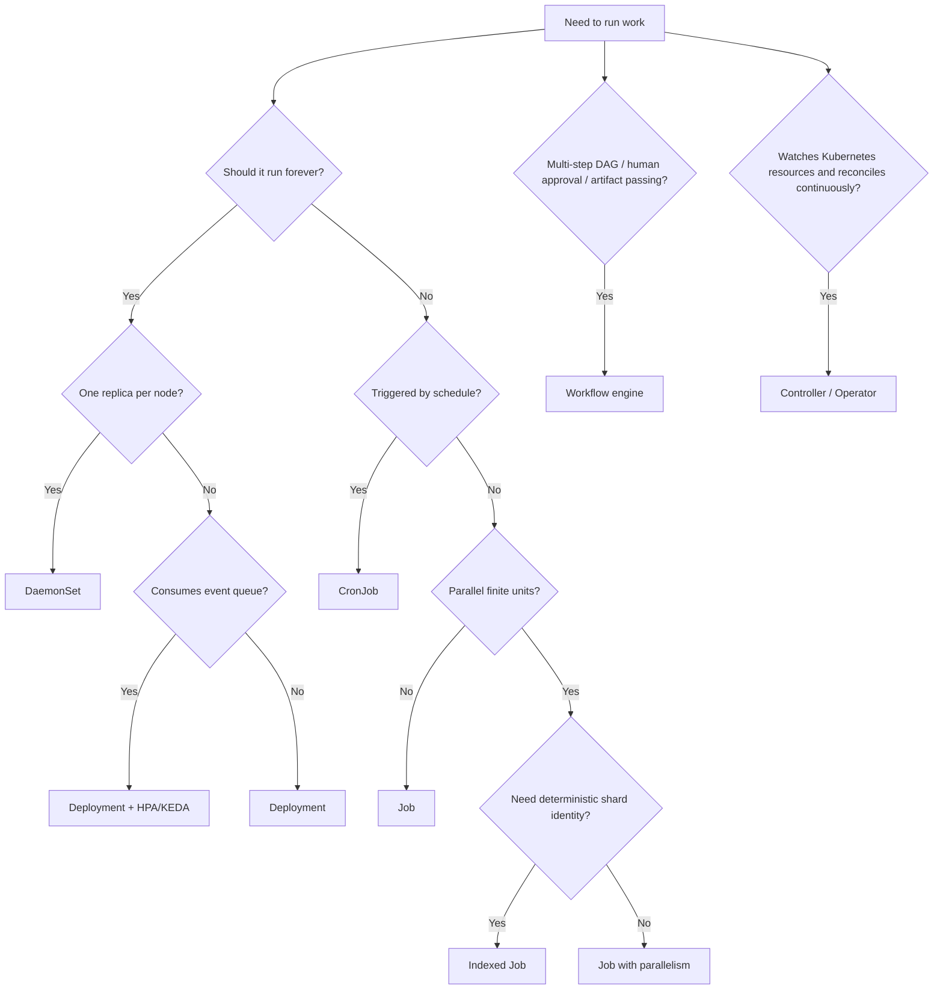
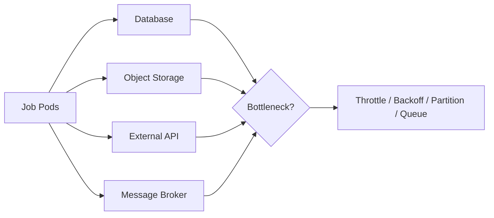
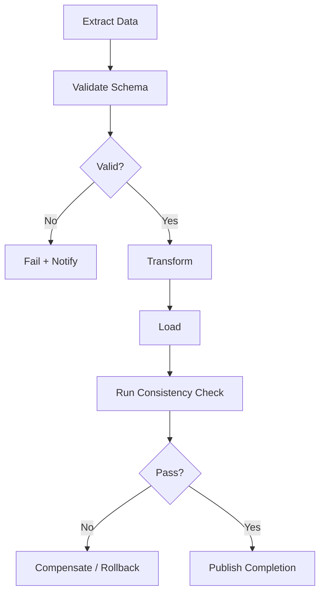

------
title: Learn Kubernetes, Deployment Model, and Cloud Native Platform Engineering - Part 021
description: Deep dive into Kubernetes batch, scheduled, and event-driven workload design using Job, CronJob, queue workers, idempotency, retry policy, failure semantics, and operational governance.
series: learn-kubernetes-deployment-model
seriesTitle: Learn Kubernetes, Deployment Model, and Cloud Native Platform Engineering
order: 21
partTitle: Batch, Event-Driven, and Scheduled Workloads
tags:
  - kubernetes
  - jobs
  - cronjobs
  - batch-processing
  - event-driven
  - reliability
  - platform-engineering
date: 2026-07-01
---

# Part 021 — Batch, Event-Driven, and Scheduled Workloads

## 1. Tujuan Pembelajaran

Part sebelumnya membahas StatefulSet dan data-aware deployment. Sekarang kita masuk ke workload yang **tidak selalu hidup selamanya**: batch, scheduled, one-off, migration, reconciliation, maintenance, queue consumer, dan event-driven processing.

Target setelah part ini:

1. Memahami perbedaan workload long-running, finite, scheduled, dan event-driven.
2. Bisa memilih antara `Job`, `CronJob`, `Deployment` queue worker, workflow engine, atau controller/operator.
3. Memahami semantics penting Job: `completions`, `parallelism`, `completionMode`, `backoffLimit`, `activeDeadlineSeconds`, `ttlSecondsAfterFinished`, `podFailurePolicy`, dan Indexed Job.
4. Bisa mendesain batch job yang aman terhadap retry, duplicate execution, partial failure, dan concurrent execution.
5. Bisa mendesain CronJob yang tidak rusak karena clock, missed schedule, overlap, timezone, dan backlog.
6. Bisa membangun event-driven workload yang scalable tanpa menciptakan cascade failure.
7. Bisa melakukan debugging batch workload dari object graph, status condition, event, log, dan external side effect.

Kaufman lens:

- **Deconstruct**: finite work = trigger + unit-of-work + idempotency + retry + completion + cleanup.
- **Self-correct**: baca Job/CronJob status, Pod failure, missed schedule, duplicate execution, dan external effect.
- **Remove barriers**: gunakan decision tree agar tidak semua task dipaksa menjadi Deployment.
- **Practice subskills**: run, retry, cancel, resume, inspect, cleanup, and protect side effects.

---

## 2. Mental Model: Workload Tidak Selalu Berarti Server

Banyak engineer mengasosiasikan Kubernetes dengan HTTP service. Itu salah satu use case, bukan keseluruhan model.

Kubernetes workload dapat berupa:

| Workload Type | Lifespan | Owner Object | Primary Risk |
|---|---:|---|---|
| HTTP service | long-running | Deployment | rollout, traffic, latency |
| node-local agent | long-running per node | DaemonSet | node coverage, privilege |
| stateful replica | long-running with identity | StatefulSet | data correctness |
| one-off task | finite | Job | retry and duplicate side effect |
| scheduled task | repeated finite | CronJob | overlap and missed schedule |
| queue consumer | long-running event processor | Deployment + scaler | backlog and poison message |
| indexed batch | finite parallel shards | Indexed Job | partial index failure |
| workflow | multi-step finite graph | workflow engine/controller | orchestration complexity |

Top 1% mental model:

> Batch workload correctness is not defined by “the Pod exited 0”. It is defined by whether the intended external side effect happened exactly as safely as the business requires.

For example, a billing reconciliation Job may exit successfully while processing only half the input because the code swallowed errors. Kubernetes can observe process lifecycle. It cannot infer domain correctness unless you expose it through status, metrics, logs, external ledger, or explicit completion markers.

---

## 3. Decision Tree: Which Workload Model Should Own This?



Practical rule:

- Use **Job** when success/failure and completion matter.
- Use **CronJob** when Kubernetes should create Jobs according to time.
- Use **Deployment** for queue workers when work is continuous and scaling is backlog-driven.
- Use **Indexed Job** when each parallel unit needs a stable index.
- Use **workflow engine** when one task becomes a dependency graph.
- Use **controller/operator** when the task is actually reconciliation, not batch execution.

Anti-pattern:

```text
CronJob -> shell script -> kubectl apply -> random cleanup -> no status -> no idempotency -> no audit
```

That is not automation. It is an unaudited control plane mutation pipeline.

---

## 4. Job: Run-to-Completion Controller

A Kubernetes Job creates one or more Pods and tracks them until the specified completion condition is reached.

Minimal Job:

```yaml
apiVersion: batch/v1
kind: Job
metadata:
  name: ledger-reconciliation
  namespace: finance
spec:
  template:
    spec:
      restartPolicy: Never
      containers:
        - name: reconcile
          image: registry.example.com/finance/reconciler:2026.07.01
          args:
            - "--date=2026-07-01"
```

Important fields:

| Field | Meaning | Design Question |
|---|---|---|
| `parallelism` | how many Pods may run concurrently | How much concurrent pressure can downstream tolerate? |
| `completions` | how many successful completions are needed | How many units must finish? |
| `completionMode` | `NonIndexed` or `Indexed` | Does each unit need deterministic identity? |
| `backoffLimit` | retry limit before Job failure | Is failure transient or logical? |
| `activeDeadlineSeconds` | max total runtime | When should the work be considered stuck? |
| `ttlSecondsAfterFinished` | cleanup after finish | How long should objects remain inspectable? |
| `podFailurePolicy` | classify Pod failures | Which errors should fail fast vs retry? |

A Job is not just “a Pod with restart”. It is a controller-managed execution contract.

---

## 5. Restart Policy: `Never` vs `OnFailure`

Jobs support Pod `restartPolicy` values:

- `Never`
- `OnFailure`

For production debugging, `Never` is often clearer because each failed attempt becomes a failed Pod that can be inspected.

```yaml
spec:
  template:
    spec:
      restartPolicy: Never
```

With `OnFailure`, the container may restart inside the same Pod. This can be cheaper but may hide attempt boundaries if logging and metrics are weak.

Decision matrix:

| Policy | Use When | Avoid When |
|---|---|---|
| `Never` | you need clear attempt history | enormous number of short failed Pods would overload observability |
| `OnFailure` | retry inside same Pod is acceptable | debugging attempt-level state matters |

Top 1% rule:

> Choose retry visibility intentionally. Hidden retries create hidden side effects.

---

## 6. Retry Semantics and Backoff

`backoffLimit` controls how many failures Kubernetes tolerates before marking the Job failed.

Example:

```yaml
apiVersion: batch/v1
kind: Job
metadata:
  name: report-export
spec:
  backoffLimit: 3
  template:
    spec:
      restartPolicy: Never
      containers:
        - name: export
          image: registry.example.com/reports/exporter:1.4.2
```

A failed retry may mean:

1. A transient infrastructure issue.
2. A temporary downstream issue.
3. Bad input.
4. Bad code.
5. Permission denied.
6. External side effect partially happened.

Kubernetes cannot know which one unless you model failure.

Failure classification:

| Failure | Retry? | Reason |
|---|---|---|
| network timeout | maybe | transient |
| HTTP 429 | yes, with backoff | downstream throttling |
| invalid argument | no | logical/config error |
| schema mismatch | no | deployment/data contract error |
| node eviction | yes | infrastructure disruption |
| duplicate key | depends | maybe idempotency success |
| permission denied | no | IAM/RBAC/config error |

Use `podFailurePolicy` when exit codes or Pod conditions should affect retry behavior.

Example pattern:

```yaml
apiVersion: batch/v1
kind: Job
metadata:
  name: import-customer-ledger
spec:
  backoffLimit: 5
  podFailurePolicy:
    rules:
      - action: FailJob
        onExitCodes:
          containerName: importer
          operator: In
          values: [64, 65, 66]
      - action: Ignore
        onPodConditions:
          - type: DisruptionTarget
  template:
    spec:
      restartPolicy: Never
      containers:
        - name: importer
          image: registry.example.com/ledger/importer:2.8.0
```

Interpretation:

- Exit code `64/65/66` means deterministic input/config error.
- Disruption can be ignored so it does not consume logical retry budget.

This is where batch engineering becomes reliability engineering.

---

## 7. Idempotency: The Non-Negotiable Batch Invariant

Kubernetes documentation explicitly warns that a Job program may sometimes be started twice even with `parallelism=1`, `completions=1`, and `restartPolicy=Never`. Therefore, a Job must tolerate duplicate execution.

Idempotency means repeating the same operation does not corrupt the system.

Common strategies:

| Strategy | Example |
|---|---|
| natural key | `invoice_id` unique constraint |
| idempotency key | `job_name + unit_id + attempt_id` |
| external ledger | write `STARTED`, `COMMITTED`, `FAILED` states |
| compare-and-set | update only if current state is expected |
| atomic rename | write temp object then rename/promote |
| checkpoint | resume from last committed offset |
| lease/lock | only one worker owns shard for a time |

Bad pattern:

```text
for row in input:
  charge_customer(row.card, row.amount)
```

Better pattern:

```text
for row in input:
  idempotencyKey = "billing-cycle-2026-07:" + row.invoiceId
  if ledger.alreadyCommitted(idempotencyKey):
      continue
  result = payment.charge(row.card, row.amount, idempotencyKey)
  ledger.commit(idempotencyKey, result)
```

Top 1% rule:

> Job retry is a platform concern. Idempotency is an application/domain concern. You need both.

---

## 8. Parallel Jobs

A parallel Job runs multiple Pods concurrently.

```yaml
apiVersion: batch/v1
kind: Job
metadata:
  name: image-thumbnail-backfill
spec:
  parallelism: 10
  completions: 100
  template:
    spec:
      restartPolicy: Never
      containers:
        - name: worker
          image: registry.example.com/media/thumbnailer:3.2.1
```

Questions before enabling parallelism:

1. Is the input partitioned safely?
2. Can downstream systems handle concurrent load?
3. Does each unit have a unique idempotency key?
4. Is the job CPU-bound, IO-bound, or API-bound?
5. What happens if 30% of units fail?
6. Can we resume without reprocessing everything?
7. What metric tells us progress?

Concurrency is not free. It shifts bottlenecks.



---

## 9. Indexed Jobs

Indexed Jobs give each completion a stable index exposed to the Pod. This is useful for deterministic partitioning.

Example use cases:

- shard 0..999 of a backfill,
- data partition per date range,
- ML batch segment,
- static file generation chunk,
- test suite partition.

Example:

```yaml
apiVersion: batch/v1
kind: Job
metadata:
  name: partitioned-ledger-check
spec:
  completions: 20
  parallelism: 5
  completionMode: Indexed
  backoffLimitPerIndex: 2
  maxFailedIndexes: 3
  template:
    spec:
      restartPolicy: Never
      containers:
        - name: checker
          image: registry.example.com/finance/partition-checker:1.9.0
          env:
            - name: PARTITION_INDEX
              valueFrom:
                fieldRef:
                  fieldPath: metadata.annotations['batch.kubernetes.io/job-completion-index']
```

The application can use the index to determine its partition.

Pseudo-code:

```text
index = env.JOB_COMPLETION_INDEX
range = partitionTable[index]
process(range)
```

Design invariant:

> The index should map to stable work. Do not let each Pod randomly grab work if the reason you chose Indexed Job is deterministic partitioning.

---

## 10. Active Deadline and Stuck Work

A Job can fail because it exceeds `activeDeadlineSeconds`.

```yaml
spec:
  activeDeadlineSeconds: 3600
```

Use it when a task has a maximum useful runtime.

Examples:

| Workload | Deadline Rationale |
|---|---|
| daily reconciliation | must finish before next business day window |
| report generation | stale after reporting cutoff |
| data migration | should not run indefinitely during release |
| external API sync | token/window may expire |

Danger:

- Too short: false failures.
- Too long: stuck jobs waste capacity and hold locks.

Better pattern:

1. Application emits heartbeat/progress.
2. Job has deadline.
3. External ledger records partial progress.
4. Retry resumes from checkpoint.
5. Alert fires before deadline, not only after failure.

---

## 11. TTL and Object Cleanup

Completed Jobs and Pods can accumulate quickly.

Use TTL controller:

```yaml
spec:
  ttlSecondsAfterFinished: 86400
```

Retention strategy:

| Environment | Successful Job TTL | Failed Job TTL |
|---|---:|---:|
| dev | 1 hour | 1 day |
| staging | 1 day | 3 days |
| production | 1-7 days | 7-30 days or until archived |

But do not use Kubernetes object retention as your audit system.

Production audit should live in:

- application logs,
- metrics,
- object storage artifacts,
- database execution ledger,
- SIEM/audit stream,
- workflow metadata store.

Kubernetes object TTL is cleanup, not compliance.

---

## 12. CronJob: Time-Based Job Factory

A CronJob creates Jobs according to a schedule.

```yaml
apiVersion: batch/v1
kind: CronJob
metadata:
  name: daily-ledger-reconciliation
  namespace: finance
spec:
  schedule: "15 1 * * *"
  timeZone: "Etc/UTC"
  concurrencyPolicy: Forbid
  startingDeadlineSeconds: 900
  successfulJobsHistoryLimit: 3
  failedJobsHistoryLimit: 5
  jobTemplate:
    spec:
      backoffLimit: 2
      ttlSecondsAfterFinished: 604800
      template:
        spec:
          restartPolicy: Never
          containers:
            - name: reconcile
              image: registry.example.com/finance/reconciler:2026.07.01
```

Important fields:

| Field | Meaning |
|---|---|
| `schedule` | cron expression |
| `timeZone` | timezone for schedule interpretation |
| `concurrencyPolicy` | overlap behavior |
| `startingDeadlineSeconds` | how late a missed run can start |
| `suspend` | stop future scheduling |
| `successfulJobsHistoryLimit` | retained successful Jobs |
| `failedJobsHistoryLimit` | retained failed Jobs |
| `jobTemplate` | Job spec to create |

---

## 13. CronJob Concurrency Policy

`concurrencyPolicy` determines what happens if the previous run is still active.

| Policy | Behavior | Use Case | Risk |
|---|---|---|---|
| `Allow` | overlapping runs allowed | independent periodic tasks | duplicate pressure/side effect |
| `Forbid` | skip new run if previous active | reconciliation, report, cleanup | missed windows |
| `Replace` | replace current run with new one | only latest state matters | killing in-flight work |

Example:

```yaml
spec:
  concurrencyPolicy: Forbid
```

Use `Forbid` for most maintenance/reconciliation workloads unless overlap is explicitly safe.

But understand the trade-off: `Forbid` can skip scheduled runs. That is often better than duplicate financial or data mutations, but it must be monitored.

---

## 14. CronJob Timezone and Missed Schedule

Always specify `timeZone` explicitly.

```yaml
spec:
  schedule: "0 2 * * *"
  timeZone: "Asia/Jakarta"
```

But for cross-region or enterprise systems, prefer UTC unless the business domain truly needs local time.

Problems caused by vague time:

- cluster controller manager timezone differs from expectation,
- daylight saving changes,
- regional holiday/time window assumptions,
- operator confusion during incidents.

Use absolute business language in metadata:

```yaml
metadata:
  annotations:
    platform.example.com/business-window: "Daily settlement after Jakarta close, 02:00 Asia/Jakarta"
    platform.example.com/owner: "finance-platform"
    platform.example.com/runbook: "https://runbooks.example.com/finance/daily-settlement"
```

---

## 15. Event-Driven Workloads

Not all event-driven workloads should be CronJobs or Jobs.

Two common models:

1. **Continuous queue worker**: a Deployment consumes messages forever.
2. **Event-created Job**: each event creates a Job or scales a workload from zero.

Decision matrix:

| Situation | Prefer |
|---|---|
| high-throughput stream | Deployment worker |
| low-frequency heavyweight task | Job per event |
| queue backlog drives scale | Deployment + KEDA/HPA |
| each event must be separately auditable | Job or workflow |
| multi-step process | workflow engine |
| event changes Kubernetes desired state | controller/operator |

Typical queue worker Deployment:

```yaml
apiVersion: apps/v1
kind: Deployment
metadata:
  name: payment-event-worker
spec:
  replicas: 3
  selector:
    matchLabels:
      app.kubernetes.io/name: payment-event-worker
  template:
    metadata:
      labels:
        app.kubernetes.io/name: payment-event-worker
    spec:
      containers:
        - name: worker
          image: registry.example.com/payments/event-worker:4.1.0
          env:
            - name: QUEUE_NAME
              value: payment-events
          resources:
            requests:
              cpu: "500m"
              memory: "512Mi"
            limits:
              memory: "1Gi"
```

This is not a Job because it does not finish. It is a service whose protocol is a queue.

---

## 16. Queue Processing Correctness

A queue worker must define message semantics.

| Concept | Question |
|---|---|
| delivery model | at-most-once, at-least-once, exactly-once illusion? |
| ack timing | before or after external side effect? |
| visibility timeout | can work finish before message reappears? |
| poison message | how many retries before dead-letter? |
| ordering | per key, global, partitioned, or irrelevant? |
| idempotency | what key prevents duplicate effects? |
| backpressure | how do we slow down safely? |

Canonical processing loop:

```text
while true:
  msg = queue.receive()
  key = msg.idempotencyKey

  if ledger.committed(key):
      queue.ack(msg)
      continue

  try:
      result = process(msg)
      ledger.commit(key, result)
      queue.ack(msg)
  except TransientError:
      queue.nackWithDelay(msg)
  except PermanentError:
      ledger.fail(key)
      queue.deadLetter(msg)
```

Never ack before the durable side effect unless message loss is acceptable.

---

## 17. Event-Driven Scaling

Autoscaling event-driven workloads usually depends on external metrics:

- queue depth,
- oldest message age,
- Kafka consumer lag,
- stream backlog,
- pending task count,
- custom business latency.

Scaling by CPU alone is often wrong for queue consumers. A worker may be blocked on IO while backlog grows.

Better scaling signal:

```text
replicas_needed = ceil(backlog / target_messages_per_replica)
```

But production scaling must include constraints:

- downstream rate limits,
- database connection limits,
- max cost budget,
- cold start time,
- retry storm prevention,
- poison message isolation.

Top 1% rule:

> Scaling consumers without downstream capacity modelling converts backlog into outage amplification.

---

## 18. Batch Workload Resource Design

Batch workloads often create resource spikes.

Sizing questions:

1. What is the per-unit CPU/memory profile?
2. Does memory grow with input size?
3. Is the work parallelizable?
4. Is there a safe maximum parallelism?
5. Should batch run on separate node pool?
6. Does it compete with latency-sensitive workloads?
7. Can it be preempted?
8. What is the business deadline?

Pattern: dedicated batch node pool.

```yaml
spec:
  template:
    spec:
      nodeSelector:
        workload-tier: batch
      tolerations:
        - key: workload-tier
          operator: Equal
          value: batch
          effect: NoSchedule
```

This prevents heavy batch from starving customer-facing services.

---

## 19. Database Migration Jobs

Database migration is a special kind of Job and deserves stricter handling.

Bad pattern:

```text
Application starts -> runs migrations -> multiple replicas race -> partial schema change -> outage
```

Safer approaches:

| Pattern | Use When |
|---|---|
| pre-deploy migration Job | schema change must happen before app rollout |
| expand/contract migration | zero-downtime schema evolution |
| migration controller | complex multi-step migration governance |
| manual approved workflow | high-risk regulated change |

Migration Job checklist:

- single execution lock,
- idempotent migration scripts,
- versioned schema ledger,
- backup/restore plan,
- timeout and rollback/forward plan,
- application compatibility matrix,
- no destructive change in same deploy as code dependency,
- clear owner and approval trail.

Example skeleton:

```yaml
apiVersion: batch/v1
kind: Job
metadata:
  name: orders-schema-migration-20260701
  namespace: orders
  labels:
    app.kubernetes.io/name: orders
    platform.example.com/change-type: schema-migration
spec:
  backoffLimit: 0
  activeDeadlineSeconds: 900
  template:
    spec:
      restartPolicy: Never
      serviceAccountName: orders-migration
      containers:
        - name: migrate
          image: registry.example.com/orders/migrator:2026.07.01
          args:
            - "--target-version=2026_07_01_001"
```

For regulated systems, `backoffLimit: 0` may be preferable: fail once, inspect, decide. Blind retries on DDL can be dangerous.

---

## 20. Maintenance and Cleanup Jobs

Cleanup Jobs are deceptively risky.

Examples:

- delete expired sessions,
- purge temporary files,
- compact database records,
- archive audit logs,
- remove stale Kubernetes objects,
- clean object storage prefixes.

Risk model:

| Risk | Mitigation |
|---|---|
| accidental broad delete | dry-run mode and scoped filters |
| race with active workload | leases and freshness checks |
| irreversible loss | retention and backup window |
| API overload | rate limit and pagination |
| hidden partial cleanup | progress ledger |
| no audit | structured deletion log |

Strong cleanup pattern:

```text
1. Discover candidates.
2. Write candidate set to durable audit artifact.
3. Validate scope thresholds.
4. Delete in pages with rate limit.
5. Record each deletion.
6. Emit summary metric and artifact location.
```

Do not write cleanup jobs that silently delete unbounded resources.

---

## 21. Workflow Engines vs Native Jobs

Native Kubernetes Jobs are excellent for simple finite work. They become awkward when you need:

- DAG dependencies,
- artifact passing,
- human approval,
- retries per step,
- compensation steps,
- branch/merge logic,
- long-running workflows,
- visibility across many tasks,
- domain-level status.

At that point, use a workflow system or build a controller.

Examples of workflow-style needs:



Do not encode complex workflow state in shell scripts and Kubernetes annotations unless you are intentionally building a workflow engine.

---

## 22. Observability for Batch and Event Workloads

Batch observability must answer:

1. Did the work start?
2. Which version/image ran?
3. What input range was processed?
4. How many units succeeded, failed, skipped, retried?
5. What external side effects occurred?
6. Was the result complete?
7. Where is the artifact/report?
8. Who owns the failure?

Minimum signals:

| Signal | Example |
|---|---|
| logs | structured per unit-of-work |
| metrics | processed count, failed count, retry count, duration |
| traces | external API/database call path |
| events | Job/CronJob lifecycle |
| status | Job condition, completed/failed indexes |
| artifact | reconciliation report, output file |
| audit | execution ledger |

Metric examples:

```text
batch_job_duration_seconds{job="daily-ledger-reconciliation"}
batch_units_processed_total{job="daily-ledger-reconciliation",result="success"}
batch_units_failed_total{job="daily-ledger-reconciliation",reason="validation"}
batch_last_success_timestamp_seconds{job="daily-ledger-reconciliation"}
queue_oldest_message_age_seconds{queue="payment-events"}
queue_consumer_lag{consumer_group="payment-worker"}
```

Alert on business freshness, not only Pod failure.

Bad alert:

```text
Job failed
```

Better alert:

```text
Daily ledger reconciliation has not completed successfully by 03:00 UTC.
```

---

## 23. Debugging Job and CronJob Failures

Debugging sequence:

```bash
kubectl get cronjob -n finance
kubectl describe cronjob daily-ledger-reconciliation -n finance
kubectl get job -n finance --sort-by=.metadata.creationTimestamp
kubectl describe job daily-ledger-reconciliation-28766520 -n finance
kubectl get pods -n finance -l job-name=daily-ledger-reconciliation-28766520
kubectl logs -n finance job/daily-ledger-reconciliation-28766520
kubectl get events -n finance --sort-by=.lastTimestamp
```

Common symptoms:

| Symptom | Likely Cause |
|---|---|
| CronJob did not create Job | suspended, missed deadline, controller issue, invalid schedule |
| Job active forever | stuck process, no deadline, blocked downstream |
| Job repeatedly fails | bad input, missing secret, permission, bug |
| Many failed Pods | backoff/retry storm |
| Multiple Jobs overlap | `concurrencyPolicy: Allow` |
| Job succeeded but result missing | app bug, swallowed error, weak domain validation |
| CronJob suddenly creates many Jobs | unsuspended with missed schedules and no starting deadline |

Important distinction:

> Kubernetes status tells you execution state. Domain ledger tells you business completion.

You need both.

---

## 24. Governance for Enterprise Batch Workloads

Batch workloads should be governed because they mutate data, consume capacity, and often run with elevated permissions.

Required metadata:

```yaml
metadata:
  labels:
    app.kubernetes.io/name: daily-ledger-reconciliation
    app.kubernetes.io/part-of: finance-platform
    app.kubernetes.io/managed-by: gitops
    platform.example.com/workload-class: batch
    platform.example.com/data-classification: restricted
  annotations:
    platform.example.com/owner: finance-platform
    platform.example.com/runbook: https://runbooks.example.com/finance/ledger-reconciliation
    platform.example.com/slo: "complete by 03:00 UTC daily"
    platform.example.com/max-downstream-qps: "50"
```

Policy examples:

- CronJobs must specify `timeZone`.
- CronJobs must specify `concurrencyPolicy`.
- Jobs must specify resource requests.
- Production Jobs must specify owner/runbook annotations.
- Migration Jobs must use dedicated ServiceAccount.
- Cleanup Jobs must support dry-run or threshold guard.
- Failed Jobs must be retained long enough for debugging.
- Workloads with broad API access must run on trusted node pools.

---

## 25. Production Checklist

Before approving a Job/CronJob/event workload:

- [ ] Workload type is correct: Job, CronJob, Deployment worker, workflow, or controller.
- [ ] Idempotency key is defined.
- [ ] Retry policy distinguishes transient vs permanent failure.
- [ ] `backoffLimit` is intentional.
- [ ] `activeDeadlineSeconds` is set for bounded work.
- [ ] `ttlSecondsAfterFinished` or retention strategy exists.
- [ ] Resource requests/limits are defined.
- [ ] Downstream rate limits are understood.
- [ ] CronJob has explicit `timeZone`.
- [ ] CronJob has explicit `concurrencyPolicy`.
- [ ] Missed schedule behavior is understood.
- [ ] Logs are structured with unit-of-work identifiers.
- [ ] Metrics expose duration, success, failure, retry, and freshness.
- [ ] Failed execution has a runbook.
- [ ] Sensitive workloads use least-privilege ServiceAccount.
- [ ] Domain completion is recorded outside Kubernetes object status.

---

## 26. Latihan Praktis

### Latihan 1 — Design Review

Ambil satu scheduled task di sistem nyata. Jawab:

1. Apa trigger-nya?
2. Apa unit-of-work-nya?
3. Apa idempotency key-nya?
4. Apa yang terjadi jika task dijalankan dua kali?
5. Apa retry policy-nya?
6. Apa completion signal-nya?
7. Apa business freshness SLO-nya?

### Latihan 2 — CronJob Hardening

Ubah CronJob yang hanya punya `schedule` menjadi production-ready dengan:

- `timeZone`,
- `concurrencyPolicy`,
- `startingDeadlineSeconds`,
- `backoffLimit`,
- `activeDeadlineSeconds`,
- history limits,
- resource requests,
- owner/runbook annotations.

### Latihan 3 — Queue Worker Scaling

Untuk queue worker, tentukan:

- queue depth target per replica,
- maximum replicas,
- downstream QPS limit,
- poison message strategy,
- oldest-message-age alert,
- idempotency mechanism.

---

## 27. Ringkasan

Batch dan event-driven workload adalah area di mana Kubernetes menyediakan controller lifecycle, tetapi correctness tetap harus didesain di application/domain layer.

Key takeaways:

1. Job adalah run-to-completion controller, bukan sekadar Pod sekali jalan.
2. CronJob adalah Job factory berbasis waktu, bukan scheduler sempurna.
3. Workload finite harus idempotent karena duplicate execution mungkin terjadi.
4. Parallelism harus dimodelkan terhadap downstream capacity.
5. Event-driven scaling harus memakai backlog/freshness signal, bukan CPU saja.
6. Migration dan cleanup Jobs membutuhkan governance lebih ketat.
7. Observability batch harus mengukur domain completion, bukan hanya process exit.

Top 1% Kubernetes engineer tidak bertanya “YAML Job-nya seperti apa?” terlebih dahulu. Mereka bertanya:

> Apa unit-of-work, apa retry semantics, apa side effect, apa completion proof, dan apa failure boundary-nya?

---

## 28. Referensi

- Kubernetes Documentation — Jobs: https://kubernetes.io/docs/concepts/workloads/controllers/job/
- Kubernetes Documentation — CronJob: https://kubernetes.io/docs/concepts/workloads/controllers/cron-jobs/
- Kubernetes API Reference — Job `batch/v1`: https://kubernetes.io/docs/reference/kubernetes-api/workload-resources/job-v1/
- Kubernetes Documentation — Workloads: https://kubernetes.io/docs/concepts/workloads/
- Kubernetes Documentation — Horizontal Pod Autoscaling: https://kubernetes.io/docs/tasks/run-application/horizontal-pod-autoscale/
