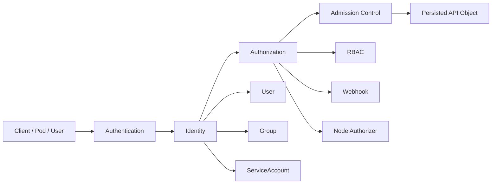
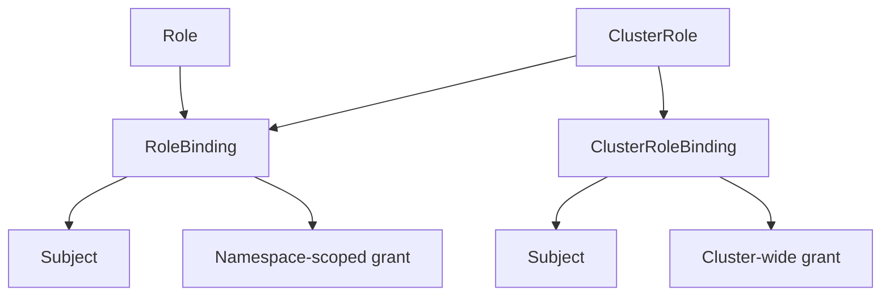
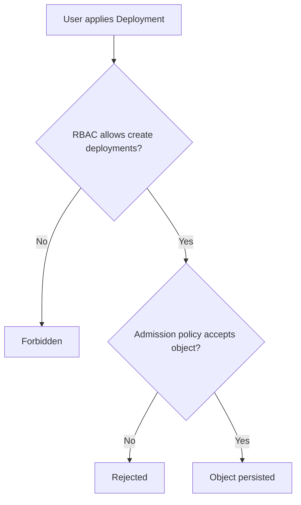

------
title: Learn Kubernetes, Deployment Model, and Cloud Native Platform Engineering - Part 022
description: Deep dive into Kubernetes RBAC, ServiceAccounts, workload identity, authorization boundaries, least privilege design, privilege escalation risks, token handling, and enterprise access governance.
series: learn-kubernetes-deployment-model
seriesTitle: Learn Kubernetes, Deployment Model, and Cloud Native Platform Engineering
order: 22
partTitle: RBAC, ServiceAccounts, and Identity Boundaries
tags:
  - kubernetes
  - security
  - rbac
  - serviceaccount
  - identity
  - authorization
  - platform-engineering
date: 2026-07-01
---

# Part 022 — RBAC, ServiceAccounts, and Identity Boundaries

## 1. Tujuan Pembelajaran

Part sebelumnya membahas batch, scheduled, dan event-driven workloads. Banyak workload seperti migration, controller, operator, CI/CD agent, dan cleanup Job membutuhkan akses ke Kubernetes API atau cloud API. Di sinilah identity dan authorization menjadi critical.

Target setelah part ini:

1. Memahami perbedaan authentication, authorization, identity, dan permission.
2. Memahami Kubernetes RBAC object model: `Role`, `ClusterRole`, `RoleBinding`, `ClusterRoleBinding`.
3. Bisa mendesain ServiceAccount per workload dengan least privilege.
4. Bisa membedakan human identity, workload identity, controller identity, dan CI/CD identity.
5. Memahami risiko privilege escalation melalui Secret access, workload creation, `bind`, `escalate`, `impersonate`, node proxy, admission webhook, dan wildcard permission.
6. Bisa melakukan debugging authorization dengan `kubectl auth can-i` dan audit reasoning.
7. Bisa mendesain governance model RBAC untuk multi-team platform.

Kaufman lens:

- **Deconstruct**: access = subject + verb + resource + scope + condition + audit.
- **Self-correct**: bisa membaca forbidden error dan melacak binding yang memberi akses.
- **Remove barriers**: gunakan permission matrix dan naming convention.
- **Practice subskills**: create least-privilege role, bind identity, verify access, detect escalation path.

---

## 2. Security Mental Model: Identity Before Permission

Sebelum membahas RBAC YAML, kita butuh model.



Definitions:

| Term | Meaning |
|---|---|
| Authentication | membuktikan siapa pemanggil API |
| Identity | nama principal setelah authenticated |
| Authorization | menentukan apakah principal boleh melakukan action |
| Admission | validasi/mutasi object sebelum disimpan |
| Audit | bukti siapa melakukan apa, kapan, terhadap resource apa |

Kubernetes RBAC menjawab pertanyaan:

```text
Can subject S perform verb V on resource R in scope X?
```

Contoh:

```text
Can serviceaccount:orders:orders-api list configmaps in namespace orders?
Can user:alice delete deployments in namespace payments?
Can group:platform-admins create clusterroles cluster-wide?
```

---

## 3. Subjects, Verbs, Resources, and Scope

RBAC rules terdiri dari:

| Element | Example |
|---|---|
| subject | user, group, serviceaccount |
| verb | get, list, watch, create, update, patch, delete |
| apiGroup | `""`, `apps`, `batch`, `networking.k8s.io` |
| resource | pods, deployments, jobs, secrets |
| resourceName | specific object name, optional |
| namespace scope | Role/RoleBinding |
| cluster scope | ClusterRole/ClusterRoleBinding |

RBAC is additive. Tidak ada deny rule native di RBAC.

Jika user mendapat permission dari 5 binding, effective access adalah gabungan semua allow rules.

Top 1% rule:

> In Kubernetes RBAC, debugging access means finding all paths that grant permission, not finding a single policy file.

---

## 4. RBAC Object Model

Kubernetes RBAC memiliki empat object utama.

| Object | Contains Permission Rules? | Namespaced? | Grants Access? |
|---|---:|---:|---:|
| `Role` | yes | yes | no, until bound |
| `ClusterRole` | yes | no | no, until bound |
| `RoleBinding` | no | yes | yes, within namespace |
| `ClusterRoleBinding` | no | no | yes, cluster-wide |

Mental model:



Important nuance:

- A `RoleBinding` can bind either a `Role` or a `ClusterRole` into one namespace.
- A `ClusterRoleBinding` binds a `ClusterRole` cluster-wide.
- A `Role` cannot grant cluster-scoped resource permissions.
- A `ClusterRole` can describe permission rules, but scope depends on the binding.

---

## 5. Role: Namespace Permission Set

Example: allow reading ConfigMaps in one namespace.

```yaml
apiVersion: rbac.authorization.k8s.io/v1
kind: Role
metadata:
  name: config-reader
  namespace: orders
rules:
  - apiGroups: [""]
    resources: ["configmaps"]
    verbs: ["get", "list", "watch"]
```

This Role does nothing until bound.

Bind it to a ServiceAccount:

```yaml
apiVersion: rbac.authorization.k8s.io/v1
kind: RoleBinding
metadata:
  name: orders-api-config-reader
  namespace: orders
subjects:
  - kind: ServiceAccount
    name: orders-api
    namespace: orders
roleRef:
  apiGroup: rbac.authorization.k8s.io
  kind: Role
  name: config-reader
```

Now Pods using ServiceAccount `orders-api` can read ConfigMaps in namespace `orders`.

---

## 6. ClusterRole: Reusable or Cluster-Scoped Permission Set

ClusterRole use cases:

1. Grant cluster-scoped resources.
2. Reuse common permissions across namespaces.
3. Aggregate permissions into built-in roles.
4. Define platform-level access profiles.

Example: read Nodes.

```yaml
apiVersion: rbac.authorization.k8s.io/v1
kind: ClusterRole
metadata:
  name: node-reader
rules:
  - apiGroups: [""]
    resources: ["nodes"]
    verbs: ["get", "list", "watch"]
```

Cluster-wide grant:

```yaml
apiVersion: rbac.authorization.k8s.io/v1
kind: ClusterRoleBinding
metadata:
  name: platform-observer-node-reader
subjects:
  - kind: ServiceAccount
    name: platform-observer
    namespace: platform-system
roleRef:
  apiGroup: rbac.authorization.k8s.io
  kind: ClusterRole
  name: node-reader
```

Namespace-scoped reuse:

```yaml
apiVersion: rbac.authorization.k8s.io/v1
kind: RoleBinding
metadata:
  name: orders-read-only
  namespace: orders
subjects:
  - kind: Group
    name: orders-developers
roleRef:
  apiGroup: rbac.authorization.k8s.io
  kind: ClusterRole
  name: view
```

Here, `view` is cluster-defined, but the grant applies only in the `orders` namespace because the binding is a RoleBinding.

---

## 7. ServiceAccount: Workload Identity

A ServiceAccount provides a Kubernetes identity for non-human actors, especially Pods.

Example:

```yaml
apiVersion: v1
kind: ServiceAccount
metadata:
  name: orders-api
  namespace: orders
```

Assign it to a Pod template:

```yaml
apiVersion: apps/v1
kind: Deployment
metadata:
  name: orders-api
  namespace: orders
spec:
  template:
    spec:
      serviceAccountName: orders-api
      containers:
        - name: app
          image: registry.example.com/orders/api:2.4.0
```

If no ServiceAccount is specified, Kubernetes uses the namespace's `default` ServiceAccount.

Production rule:

> Never rely on the default ServiceAccount for application workloads. Create one ServiceAccount per workload or per tightly related workload group.

Reason:

- permission boundary becomes explicit,
- audit attribution improves,
- blast radius shrinks,
- review becomes easier,
- token mounting can be controlled.

---

## 8. ServiceAccount Token Mounting

Pods can receive ServiceAccount credentials. That is powerful and dangerous.

If a workload does not call Kubernetes API, disable automatic token mounting.

At ServiceAccount level:

```yaml
apiVersion: v1
kind: ServiceAccount
metadata:
  name: public-web
  namespace: web
 automountServiceAccountToken: false
```

Correct YAML indentation:

```yaml
apiVersion: v1
kind: ServiceAccount
metadata:
  name: public-web
  namespace: web
automountServiceAccountToken: false
```

At Pod level:

```yaml
apiVersion: apps/v1
kind: Deployment
metadata:
  name: public-web
  namespace: web
spec:
  template:
    spec:
      serviceAccountName: public-web
      automountServiceAccountToken: false
      containers:
        - name: web
          image: registry.example.com/web/public:1.0.0
```

Use Pod-level override when you need more explicit control.

Top 1% rule:

> A mounted ServiceAccount token is an API credential. Treat it like a secret with blast radius.

---

## 9. Projected ServiceAccount Tokens

Modern Kubernetes supports projected ServiceAccount tokens that can be audience-bound and time-bound.

Example:

```yaml
apiVersion: v1
kind: Pod
metadata:
  name: api-client
  namespace: platform
spec:
  serviceAccountName: api-client
  automountServiceAccountToken: false
  containers:
    - name: client
      image: registry.example.com/platform/api-client:1.0.0
      volumeMounts:
        - name: k8s-api-token
          mountPath: /var/run/secrets/tokens
          readOnly: true
  volumes:
    - name: k8s-api-token
      projected:
        sources:
          - serviceAccountToken:
              path: token
              audience: kubernetes.default.svc
              expirationSeconds: 3600
```

Benefits:

- shorter-lived credentials,
- intended audience can be specified,
- token rotation is improved,
- less reliance on long-lived Secret-style tokens.

Use projected tokens for workloads that need controlled API access, especially controllers and platform agents.

---

## 10. Human Identity vs Workload Identity

Do not mix humans and workloads.

| Dimension | Human User | ServiceAccount |
|---|---|---|
| Represents | person or external IAM principal | workload/process |
| Lives in Kubernetes API | usually no | yes |
| Credential source | OIDC/IAM/cert/client auth | token projected/mounted/requested |
| Lifecycle | employee/team lifecycle | workload lifecycle |
| Audit question | who changed this? | which workload did this? |
| Permission pattern | role by team/job function | least privilege by runtime behavior |

Anti-pattern:

```text
CI/CD uses a human admin kubeconfig stored as secret.
```

Better:

```text
CI/CD has dedicated identity -> limited deploy permissions -> namespace/environment scope -> audited changes.
```

---

## 11. Least Privilege Design Method

Do not start by copying `cluster-admin` and removing a few verbs. Start from required behavior.

Process:

1. List API calls the workload must make.
2. Map each call to apiGroup/resource/verb/scope.
3. Prefer namespace scope.
4. Prefer `get` over `list`, `list` over `watch`, read over write.
5. Avoid `*` verbs and `*` resources.
6. Separate read and write roles.
7. Bind to a dedicated ServiceAccount.
8. Verify with `kubectl auth can-i`.
9. Add audit and periodic review.

Example requirement:

```text
The orders-controller must watch Orders CRs in namespace orders and update their status.
```

Possible Role:

```yaml
apiVersion: rbac.authorization.k8s.io/v1
kind: Role
metadata:
  name: orders-controller
  namespace: orders
rules:
  - apiGroups: ["commerce.example.com"]
    resources: ["orders"]
    verbs: ["get", "list", "watch"]
  - apiGroups: ["commerce.example.com"]
    resources: ["orders/status"]
    verbs: ["get", "update", "patch"]
```

Notice the use of `/status`. The controller does not need to update the entire spec.

---

## 12. Common Verbs and Their Risk

| Verb | Risk |
|---|---|
| `get` | can read sensitive object if resource is sensitive |
| `list` | can enumerate many objects; can reveal metadata/secrets at scale |
| `watch` | continuous visibility into changes |
| `create` | can introduce new workload/resource |
| `update` | can overwrite full object |
| `patch` | can mutate targeted fields, often used by controllers |
| `delete` | destructive action |
| `deletecollection` | bulk destructive action |
| `bind` | can bind roles, escalation risk |
| `escalate` | can create/update roles with permissions not currently held |
| `impersonate` | can act as another user/group/serviceaccount |

Sensitive resources:

- `secrets`,
- `serviceaccounts/token`,
- `pods/exec`,
- `pods/attach`,
- `pods/portforward`,
- `nodes/proxy`,
- `certificatesigningrequests`,
- RBAC resources,
- admission webhooks,
- CRDs that control infrastructure.

---

## 13. The Secret Access Trap

Access to Secrets is often equivalent to access to credentials.

Danger:

```yaml
rules:
  - apiGroups: [""]
    resources: ["secrets"]
    verbs: ["get", "list", "watch"]
```

Risks:

- read database password,
- read cloud credentials,
- read pull secrets,
- read ServiceAccount-related credentials in older patterns,
- exfiltrate TLS keys.

Better options:

- mount only required Secret into Pod,
- avoid API-level Secret read unless necessary,
- use external secret manager with identity-based access,
- limit by `resourceNames` when feasible,
- avoid `list/watch` Secrets,
- monitor Secret access in audit logs.

Example with `resourceNames`:

```yaml
rules:
  - apiGroups: [""]
    resources: ["secrets"]
    resourceNames: ["orders-api-config"]
    verbs: ["get"]
```

Caveat: `resourceNames` does not work for `list`/`watch` the way people often hope, because those operations are collection-level.

---

## 14. Workload Creation as Privilege Escalation

A subject that can create Pods may be able to mount ServiceAccounts, Secrets, host paths, or run privileged containers depending on admission policy.

Example risky permission:

```yaml
rules:
  - apiGroups: [""]
    resources: ["pods"]
    verbs: ["create"]
```

Why risky?

If the subject can create a Pod using a privileged ServiceAccount, it may gain that ServiceAccount's permissions.

Mitigations:

- restrict who can create workloads,
- enforce Pod Security Admission,
- prevent arbitrary `serviceAccountName`,
- use admission policy to restrict volume types and privilege,
- separate deployer identity from runtime identity,
- use namespace-level boundaries,
- avoid sharing privileged ServiceAccounts.

Top 1% rule:

> Permission to create workloads is often permission to execute code inside your trust boundary. Treat it as high-impact.

---

## 15. `bind`, `escalate`, and `impersonate`

These verbs are special.

### `bind`

Allows creating RoleBindings/ClusterRoleBindings to roles even if the user does not otherwise have all permissions in that role.

Risk:

```text
Can bind cluster-admin -> can become cluster-admin.
```

### `escalate`

Allows creating or updating Roles/ClusterRoles with permissions the caller does not already hold.

Risk:

```text
Can escalate roles -> can create powerful role -> can bind if also has bind path.
```

### `impersonate`

Allows acting as another user, group, or ServiceAccount.

Risk:

```text
Can impersonate privileged identity -> can perform privileged actions.
```

Production rule:

- Grant these only to tightly controlled platform/admin identities.
- Audit their use.
- Do not include them in application roles.

---

## 16. RBAC for Controllers and Operators

Controllers often need watch/list permissions and status update permissions.

Common pattern:

```yaml
rules:
  - apiGroups: ["platform.example.com"]
    resources: ["releases"]
    verbs: ["get", "list", "watch"]
  - apiGroups: ["platform.example.com"]
    resources: ["releases/status"]
    verbs: ["patch", "update"]
  - apiGroups: [""]
    resources: ["events"]
    verbs: ["create", "patch"]
```

Avoid giving operator `*` on `*` just because reconciliation failed during development.

Controller RBAC design questions:

1. What resource does it watch?
2. What resource does it create/update/delete?
3. Does it need namespace-wide or cluster-wide watch?
4. Does it update `status` or `spec`?
5. Does it need finalizers?
6. Can it affect workloads outside its ownership boundary?
7. What happens if the controller is compromised?

Operator anti-pattern:

```yaml
rules:
  - apiGroups: ["*"]
    resources: ["*"]
    verbs: ["*"]
```

This may be common in generated scaffolds but unacceptable as a default production posture.

---

## 17. RBAC for CI/CD and GitOps

CI/CD identity should not be a universal admin.

Deployment permissions are often narrower than assumed.

Example namespace deployer:

```yaml
apiVersion: rbac.authorization.k8s.io/v1
kind: Role
metadata:
  name: namespace-deployer
  namespace: orders
rules:
  - apiGroups: ["apps"]
    resources: ["deployments"]
    verbs: ["get", "list", "watch", "create", "update", "patch"]
  - apiGroups: [""]
    resources: ["services", "configmaps"]
    verbs: ["get", "list", "watch", "create", "update", "patch"]
  - apiGroups: ["batch"]
    resources: ["jobs", "cronjobs"]
    verbs: ["get", "list", "watch", "create", "update", "patch", "delete"]
```

But if deployer can update ServiceAccount, RoleBinding, Secret, or admission-relevant fields, the risk increases.

GitOps pattern:

- GitOps controller has cluster access according to its reconciliation scope.
- Human users merge changes, not manually mutate cluster.
- Admission policy validates dangerous changes.
- RBAC controls controller permissions.
- Git review controls intent.
- Audit connects Git commit to cluster mutation.

---

## 18. Namespace-Based Access Model

Enterprise multi-team clusters often start with namespace boundaries.

Example model:

| Team | Namespace | Human Access | Runtime Access |
|---|---|---|---|
| orders | `orders-dev` | edit | workload-specific SA |
| orders | `orders-prod` | view + controlled deploy | workload-specific SA |
| payments | `payments-dev` | edit | workload-specific SA |
| payments | `payments-prod` | view + controlled deploy | workload-specific SA |
| platform | `platform-system` | admin | controller SAs |

Rules:

1. Developers can inspect production but not directly mutate it.
2. Production mutation flows through GitOps/CI identity.
3. Workload identity is not shared across namespaces.
4. Platform controllers have narrowly-scoped cluster permissions.
5. Break-glass is separate, audited, and time-bounded.

---

## 19. Debugging Authorization Failures

Common error:

```text
Error from server (Forbidden): pods is forbidden: User "system:serviceaccount:orders:orders-api" cannot list resource "pods" in API group "" in the namespace "orders"
```

Parse it:

| Field | Value |
|---|---|
| subject | `system:serviceaccount:orders:orders-api` |
| verb | `list` |
| resource | `pods` |
| apiGroup | `""` core API |
| namespace | `orders` |

Check permission:

```bash
kubectl auth can-i list pods \
  --as=system:serviceaccount:orders:orders-api \
  -n orders
```

Check all useful variants:

```bash
kubectl auth can-i get pods --as=system:serviceaccount:orders:orders-api -n orders
kubectl auth can-i list pods --as=system:serviceaccount:orders:orders-api -n orders
kubectl auth can-i watch pods --as=system:serviceaccount:orders:orders-api -n orders
kubectl auth can-i update pods/status --as=system:serviceaccount:orders:orders-api -n orders
```

Inspect bindings:

```bash
kubectl get rolebinding -n orders
kubectl get clusterrolebinding
kubectl describe rolebinding orders-api-reader -n orders
kubectl describe clusterrolebinding some-binding
```

For service account token/identity issues:

```bash
kubectl get pod orders-api-abc123 -n orders -o jsonpath='{.spec.serviceAccountName}'
kubectl get serviceaccount orders-api -n orders -o yaml
```

---

## 20. Effective Permission Review

Ask these questions during review:

1. Why does this subject need this verb?
2. Why does it need this resource?
3. Why does it need this namespace or cluster scope?
4. Can this be split into read and write roles?
5. Can `watch` be avoided?
6. Can `resourceNames` constrain access?
7. Does this include secrets, workload creation, RBAC mutation, or impersonation?
8. Could this access create a path to another ServiceAccount?
9. Is token mounting disabled where not needed?
10. Is this permission temporary or permanent?

RBAC review should produce a threat model, not just approval.

---

## 21. RBAC Naming Convention

Use names that encode intent.

Examples:

```text
role/orders/config-reader
role/orders/release-deployer
role/orders/job-runner
clusterrole/platform/node-observer
clusterrole/platform/gateway-controller
rolebinding/orders/orders-api-config-reader
clusterrolebinding/platform/metrics-server-node-reader
```

Kubernetes object names cannot contain `/` in all contexts, so practical names might be:

```text
orders-config-reader
orders-release-deployer
platform-node-observer
orders-api-config-reader
metrics-server-node-reader
```

Metadata can hold richer meaning:

```yaml
metadata:
  labels:
    platform.example.com/rbac-scope: namespace
    platform.example.com/access-class: read-only
    platform.example.com/owner: orders-platform
  annotations:
    platform.example.com/justification: "orders-api reads its own runtime config"
    platform.example.com/review-cycle: "quarterly"
```

---

## 22. Permission Matrix Example

Example for `orders` namespace:

| Subject | Permission | Scope | Reason |
|---|---|---|---|
| `orders-api` SA | get `configmaps/orders-api-config` | namespace | runtime config read |
| `orders-api` SA | no Secret API read | namespace | secrets mounted, not read through API |
| `orders-controller` SA | watch `orders` CRs | namespace | reconciliation |
| `orders-controller` SA | patch `orders/status` | namespace | status update |
| `orders-migration` SA | get Secret `orders-db-migration` | namespace | migration credential |
| `orders-deployer` CI | patch deployments | namespace | release deployment |
| `orders-developers` group | view | namespace | debugging/read-only |
| `orders-developers` group | no prod write | production | separation of duties |

This table is often more important than YAML. YAML is implementation. Matrix is intent.

---

## 23. Break-Glass Access

Break-glass is emergency access outside normal flow.

Bad break-glass:

```text
Everyone in senior-engineers group has cluster-admin forever.
```

Better break-glass:

- separate identity,
- time-bounded access,
- approval workflow,
- mandatory reason,
- session logging,
- alert on use,
- post-incident review,
- no use for routine work.

Break-glass should be operationally possible but socially and procedurally expensive enough to discourage convenience use.

---

## 24. RBAC and Admission Control Boundary

RBAC answers:

```text
Are you allowed to submit this request?
```

Admission answers:

```text
Is this object acceptable according to policy?
```

Example:

- RBAC may allow a developer to create Deployment in dev.
- Admission may reject the Deployment if it uses privileged container, hostPath, missing resource requests, forbidden image registry, or default ServiceAccount.



Do not overload RBAC with things admission should enforce.

RBAC controls who can ask. Admission controls what shape is acceptable.

---

## 25. Production RBAC Checklist

For each workload:

- [ ] Dedicated ServiceAccount exists.
- [ ] Default ServiceAccount is not used for application workload.
- [ ] `automountServiceAccountToken: false` is set when API access is not needed.
- [ ] RBAC grants only required verbs/resources.
- [ ] Namespace RoleBinding is preferred over ClusterRoleBinding.
- [ ] Wildcards are avoided.
- [ ] Secret API access is avoided or narrowly scoped.
- [ ] Workload creation permission is treated as high risk.
- [ ] `bind`, `escalate`, and `impersonate` are not granted to app identities.
- [ ] Controller permissions use `/status` subresource where possible.
- [ ] CI/CD identity is separate from runtime identity.
- [ ] Production human write access is controlled.
- [ ] Break-glass is time-bound and audited.
- [ ] Permission matrix exists and is reviewed periodically.
- [ ] Audit logs can answer who/what changed critical resources.

---

## 26. Latihan Praktis

### Latihan 1 — Least-Privilege Role

Buat Role untuk workload yang hanya perlu:

- membaca ConfigMap `app-config`,
- membuat Event,
- tidak boleh membaca Secret,
- tidak boleh list Pods.

Kemudian verifikasi dengan:

```bash
kubectl auth can-i get configmap/app-config --as=system:serviceaccount:demo:app -n demo
kubectl auth can-i list secrets --as=system:serviceaccount:demo:app -n demo
kubectl auth can-i list pods --as=system:serviceaccount:demo:app -n demo
```

### Latihan 2 — Find the Escalation Path

Review permission ini:

```yaml
rules:
  - apiGroups: [""]
    resources: ["pods", "secrets"]
    verbs: ["*"]
  - apiGroups: ["rbac.authorization.k8s.io"]
    resources: ["rolebindings"]
    verbs: ["create", "update", "patch"]
```

Jawab:

1. Apa escalation path-nya?
2. Apa blast radius-nya?
3. Bagaimana memecahnya menjadi least-privilege rules?

### Latihan 3 — ServiceAccount Hygiene

Ambil satu namespace nyata. Buat inventory:

```bash
kubectl get deploy,statefulset,daemonset,job,cronjob -n <namespace> -o wide
kubectl get serviceaccount -n <namespace>
kubectl get role,rolebinding -n <namespace>
```

Untuk setiap workload, jawab:

1. ServiceAccount apa yang dipakai?
2. Apakah token otomatis dimount?
3. Apa permissions efektifnya?
4. Apakah workload benar-benar perlu Kubernetes API access?

---

## 27. Ringkasan

RBAC dan ServiceAccount adalah boundary utama antara workload dan Kubernetes API.

Key takeaways:

1. RBAC adalah additive allow model; tidak ada deny rule native.
2. Role/ClusterRole mendefinisikan permission; Binding memberikan permission ke subject.
3. ServiceAccount adalah workload identity, bukan sekadar object tambahan.
4. Default ServiceAccount sebaiknya tidak dipakai untuk aplikasi production.
5. Token mounting harus disengaja.
6. Secret access, workload creation, `bind`, `escalate`, dan `impersonate` adalah area escalation risk.
7. Least privilege dimulai dari behavior yang diperlukan, bukan dari template role.
8. RBAC dan admission policy saling melengkapi.

Top 1% Kubernetes engineer melihat RBAC bukan sebagai “izin agar aplikasi jalan”, tetapi sebagai model eksplisit dari trust boundary, blast radius, dan operational accountability.

---

## 28. Referensi

- Kubernetes Documentation — Using RBAC Authorization: https://kubernetes.io/docs/reference/access-authn-authz/rbac/
- Kubernetes Documentation — RBAC Good Practices: https://kubernetes.io/docs/concepts/security/rbac-good-practices/
- Kubernetes Documentation — Service Accounts: https://kubernetes.io/docs/concepts/security/service-accounts/
- Kubernetes Documentation — Configure Service Accounts for Pods: https://kubernetes.io/docs/tasks/configure-pod-container/configure-service-account/
- Kubernetes Documentation — Authorization: https://kubernetes.io/docs/reference/access-authn-authz/authorization/
