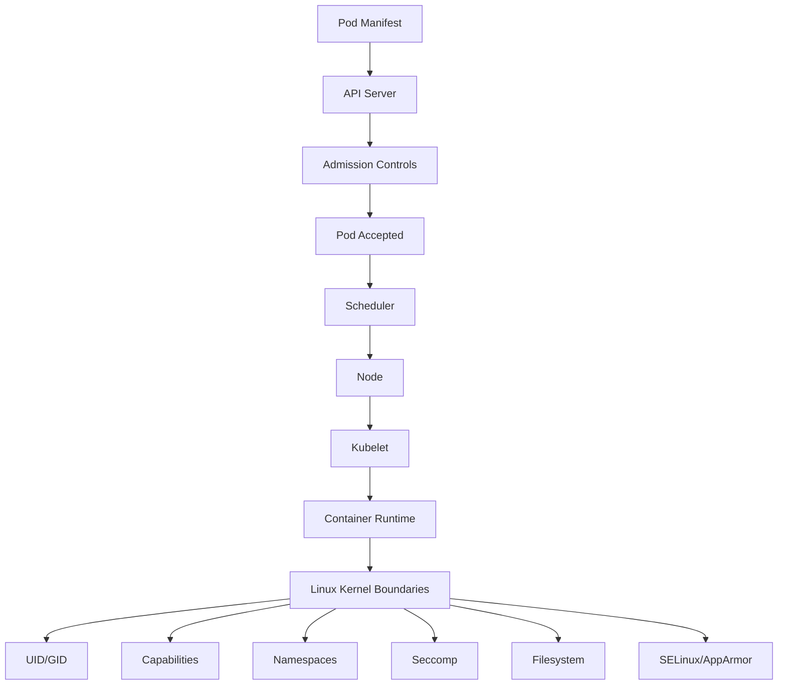

------
title: Learn Kubernetes, Deployment Model, and Cloud Native Platform Engineering - Part 023
description: Pod security, SecurityContext, runtime hardening, Pod Security Standards, seccomp, Linux capabilities, non-root execution, read-only filesystem, host namespace risk, and production hardening workflow.
series: learn-kubernetes-deployment-model
seriesTitle: Learn Kubernetes, Deployment Model, and Cloud Native Platform Engineering
order: 23
partTitle: Pod Security, SecurityContext, and Runtime Hardening
tags:
- kubernetes
- security
- pod-security
- security-context
- runtime-hardening
- platform-engineering
date: 2026-07-01
------

# Part 023 — Pod Security, SecurityContext, and Runtime Hardening

## 1. Why This Part Exists

By this point in the series, we already understand Pods, Deployments, Services, storage, scheduling, autoscaling, and workload identity.

Now we move into a different question:

> When the workload is already scheduled and running, how much power does it have over the node, the filesystem, the kernel, the network namespace, and nearby workloads?

This is the core of Pod runtime hardening.

A weak Kubernetes security model usually fails in one of these ways:

1. the application runs as root because the image default was never challenged;
2. the container keeps Linux capabilities it does not need;
3. privilege escalation is allowed by default;
4. the root filesystem is writable even though the app only needs temporary scratch space;
5. host namespaces, host ports, host paths, or privileged mode are used as convenience shortcuts;
6. a namespace claims to be "restricted" but has no enforceable admission boundary;
7. security rules exist in documentation but not in the API path.

Top-level engineers do not treat Pod security as a checklist. They treat it as a **runtime permission model**.

A hardened Pod answers these questions explicitly:

- Which Linux user does the process run as?
- Can the process become more privileged?
- Which kernel capabilities are available?
- Which syscalls are allowed?
- Can it write to its root filesystem?
- Can it see or modify the host?
- Can it mount sensitive paths?
- Can it escape the intended namespace boundary?
- Which security standard should reject this Pod before it reaches a node?

---

## 2. Kaufman Frame

### 2.1 Deconstruct the Skill

Pod runtime hardening decomposes into five sub-skills:

| Sub-skill | What You Must Understand |
|---|---|
| Runtime identity | UID, GID, `runAsUser`, `runAsGroup`, `runAsNonRoot`, `fsGroup` |
| Privilege boundary | `privileged`, `allowPrivilegeEscalation`, Linux capabilities |
| Filesystem boundary | `readOnlyRootFilesystem`, writable volumes, `emptyDir`, `hostPath` risk |
| Kernel boundary | seccomp, AppArmor, SELinux, syscalls, host namespace access |
| Admission boundary | Pod Security Standards, namespace labels, policy enforcement |

### 2.2 Learn Enough to Self-Correct

After this part, you should be able to diagnose:

- why a Pod is rejected by Pod Security Admission;
- why a container crashes after enabling `runAsNonRoot`;
- why an app fails after `readOnlyRootFilesystem: true`;
- why dropping all capabilities breaks a legacy binary;
- why `hostPath` is dangerous;
- why `privileged: true` is almost never acceptable for app workloads;
- why "root inside container" is not automatically "root on host" but is still a serious risk amplifier.

### 2.3 Remove Practice Barriers

Instead of memorizing every field, use this simple model:

```text
Start restricted.
Add only what the workload proves it needs.
Enforce defaults through admission.
Make exceptions explicit, reviewed, and temporary.
```

### 2.4 Practice the Important Sub-skills

The highest-value drills are:

1. convert a root-running Pod into a non-root Pod;
2. enforce Pod Security Standards on a namespace;
3. debug a `Permission denied` error caused by UID/GID mismatch;
4. harden an app with a read-only root filesystem;
5. remove capabilities until the app breaks, then add only the minimum;
6. compare `warn`, `audit`, and `enforce` modes for Pod Security Admission.

---

## 3. Mental Model: Runtime Power Is a Budget

A Pod specification is not only a deployment manifest. It is also a request for runtime power.



The Kubernetes API can allow or deny the request. The kubelet and container runtime eventually apply the low-level runtime constraints.

A strong platform treats these constraints as **default-deny**:

- no root unless justified;
- no privilege escalation unless justified;
- no host namespace unless justified;
- no host path unless justified;
- no added capabilities unless justified;
- no writable root filesystem unless justified.

---

## 4. SecurityContext: The Main Runtime Control Surface

Kubernetes exposes runtime security settings through `securityContext`.

There are two levels:

| Level | Location | Purpose |
|---|---|---|
| Pod-level | `spec.securityContext` | Defaults that apply to all containers where meaningful |
| Container-level | `spec.containers[*].securityContext` | Per-container override for controls such as capabilities, privilege, read-only root filesystem |

Example:

```yaml
apiVersion: v1
kind: Pod
metadata:
  name: app
spec:
  securityContext:
    runAsNonRoot: true
    runAsUser: 10001
    runAsGroup: 10001
    fsGroup: 10001
    seccompProfile:
      type: RuntimeDefault
  containers:
    - name: app
      image: ghcr.io/example/app:1.0.0
      securityContext:
        allowPrivilegeEscalation: false
        readOnlyRootFilesystem: true
        capabilities:
          drop:
            - ALL
```

This manifest says:

- processes should not run as root;
- the runtime UID/GID should be explicit;
- mounted volumes should be group-accessible through `fsGroup`;
- the runtime should use the default seccomp profile;
- the process cannot gain more privilege;
- the root filesystem is read-only;
- all Linux capabilities are dropped.

This is a strong baseline for normal application workloads.

---

## 5. Runtime Identity: UID, GID, and Non-Root Execution

### 5.1 The Problem

Many container images run as root by default.

This is convenient because root can write files, bind privileged ports, change ownership, and bypass some permission problems. But this convenience becomes a security liability.

In Kubernetes, running as non-root is usually expressed with:

```yaml
securityContext:
  runAsNonRoot: true
  runAsUser: 10001
  runAsGroup: 10001
```

### 5.2 `runAsNonRoot`

`runAsNonRoot: true` tells the runtime that the container must not run as UID 0.

Important nuance:

- If the image declares a numeric non-root user, Kubernetes can verify it.
- If the image declares a named user and the runtime cannot verify the numeric UID from the manifest alone, the Pod may fail depending on runtime behavior.
- The most predictable setup is to build the image with a numeric non-root user and also set `runAsUser`.

Example Dockerfile pattern:

```dockerfile
FROM eclipse-temurin:21-jre
RUN groupadd -g 10001 app && useradd -u 10001 -g app app
WORKDIR /app
COPY app.jar /app/app.jar
RUN chown -R 10001:10001 /app
USER 10001:10001
ENTRYPOINT ["java", "-jar", "/app/app.jar"]
```

Kubernetes manifest:

```yaml
securityContext:
  runAsNonRoot: true
  runAsUser: 10001
  runAsGroup: 10001
```

### 5.3 `fsGroup`

`fsGroup` helps with mounted volume permissions.

```yaml
spec:
  securityContext:
    fsGroup: 10001
```

This is useful when the application needs write access to a mounted PVC or `emptyDir`.

However, `fsGroup` is not a universal solution:

- it can slow down startup for large volumes if recursive ownership changes happen;
- CSI drivers may implement behavior differently;
- it should not be used as a substitute for clean image ownership;
- it does not fix every hostPath or storage backend permission problem.

### 5.4 Production Rule

For application workloads:

```text
Every container should declare non-root runtime identity explicitly.
Do not rely on image defaults.
```

---

## 6. Privilege Escalation

### 6.1 `allowPrivilegeEscalation`

`allowPrivilegeEscalation` controls whether a process can gain more privileges than its parent process.

Baseline:

```yaml
securityContext:
  allowPrivilegeEscalation: false
```

This is especially important with setuid binaries and file capabilities.

For most application containers, this should be false.

### 6.2 `privileged`

`privileged: true` gives the container broad access to host-level capabilities and device access.

```yaml
securityContext:
  privileged: true
```

For normal apps, this is almost always wrong.

Legitimate privileged use cases usually live in infrastructure namespaces:

- CNI plugins;
- CSI node plugins;
- low-level node agents;
- security agents;
- hardware device plugins.

Even then, privileged Pods should be:

- isolated by namespace;
- restricted by RBAC;
- reviewed by platform/security owners;
- pinned to expected service accounts;
- observable and auditable;
- excluded from normal developer namespaces.

### 6.3 Anti-pattern

```yaml
securityContext:
  privileged: true
```

used to "fix" a permission problem is not a fix. It is a security bypass.

The right debugging question is:

> Which exact permission does the workload need?

---

## 7. Linux Capabilities

Linux capabilities split root privileges into smaller units.

A container running as root with many capabilities is much more powerful than a non-root container with all capabilities dropped.

Baseline:

```yaml
securityContext:
  capabilities:
    drop:
      - ALL
```

Then add only what is required.

Example: binding to low ports historically required `NET_BIND_SERVICE`.

```yaml
securityContext:
  capabilities:
    drop:
      - ALL
    add:
      - NET_BIND_SERVICE
```

But for modern cloud-native services, prefer listening on high ports such as `8080` and let Service/Gateway/Ingress expose port 80 or 443 externally.

### 7.1 Common Capabilities

| Capability | Risk / Use |
|---|---|
| `NET_ADMIN` | Very powerful; can alter networking. Avoid for apps. |
| `SYS_ADMIN` | Extremely broad. Avoid except specialized infra. |
| `NET_BIND_SERVICE` | Bind ports below 1024. Often avoidable. |
| `CHOWN` | Change file ownership. Sometimes needed by legacy startup scripts. |
| `DAC_OVERRIDE` | Bypass file permission checks. High risk. |
| `SETUID`, `SETGID` | Change process identity. Usually unnecessary. |

### 7.2 Engineering Rule

```text
Drop ALL first.
Re-add one capability only when the failure proves it is needed.
```

---

## 8. Read-Only Root Filesystem

### 8.1 Why It Matters

A writable root filesystem allows the application or attacker to modify runtime files, write payloads, mutate scripts, or hide artifacts.

Baseline:

```yaml
securityContext:
  readOnlyRootFilesystem: true
```

But many applications write to:

- `/tmp`;
- `/var/tmp`;
- `/var/log`;
- framework cache directories;
- language runtime temporary paths;
- local upload directories.

The solution is not to make the entire root filesystem writable. The solution is to mount explicit writable scratch locations.

Example:

```yaml
apiVersion: apps/v1
kind: Deployment
metadata:
  name: web
spec:
  replicas: 3
  selector:
    matchLabels:
      app.kubernetes.io/name: web
  template:
    metadata:
      labels:
        app.kubernetes.io/name: web
    spec:
      securityContext:
        runAsNonRoot: true
        runAsUser: 10001
        runAsGroup: 10001
        fsGroup: 10001
        seccompProfile:
          type: RuntimeDefault
      containers:
        - name: web
          image: ghcr.io/example/web:1.0.0
          ports:
            - containerPort: 8080
          securityContext:
            allowPrivilegeEscalation: false
            readOnlyRootFilesystem: true
            capabilities:
              drop:
                - ALL
          volumeMounts:
            - name: tmp
              mountPath: /tmp
            - name: cache
              mountPath: /app/cache
      volumes:
        - name: tmp
          emptyDir: {}
        - name: cache
          emptyDir: {}
```

### 8.2 Hidden Contract

When you enable `readOnlyRootFilesystem`, you are forcing the application to declare its write paths.

That is good architecture.

A production app should not write randomly across the container filesystem.

---

## 9. Seccomp

Seccomp restricts the system calls a container can make.

Recommended baseline:

```yaml
securityContext:
  seccompProfile:
    type: RuntimeDefault
```

At Pod level:

```yaml
spec:
  securityContext:
    seccompProfile:
      type: RuntimeDefault
```

For most workloads, `RuntimeDefault` is the right starting point.

Custom seccomp profiles can be useful for highly sensitive workloads but are operationally more expensive:

- they require syscall knowledge;
- they can break after runtime or library upgrades;
- they must be distributed to nodes;
- they need testing per workload class.

### 9.1 Failure Pattern

Symptom:

```text
Operation not permitted
```

Possible causes:

- seccomp blocked a syscall;
- a Linux capability was dropped;
- non-root user lacks filesystem permission;
- AppArmor/SELinux blocked access;
- the container needs a writable path but root filesystem is read-only.

Do not assume immediately. Inspect events, logs, container runtime errors, and node-level audit data where available.

---

## 10. AppArmor and SELinux

AppArmor and SELinux are Linux kernel security modules that can further restrict process behavior.

At a high level:

| Mechanism | Model |
|---|---|
| AppArmor | Profile-based confinement |
| SELinux | Label/type-based mandatory access control |

For platform engineers:

- use the defaults provided by your managed Kubernetes environment unless you have a clear reason to customize;
- avoid disabling these systems to "fix" app compatibility;
- document node OS assumptions;
- ensure security context settings are tested across node image upgrades.

In highly regulated environments, these controls can become part of workload isolation policy.

---

## 11. Host Namespace and Host Resource Risk

Some Pod fields punch holes through isolation.

| Field / Feature | Risk |
|---|---|
| `hostNetwork: true` | Pod shares node network namespace; can bind host ports and see host networking. |
| `hostPID: true` | Pod can see host processes. |
| `hostIPC: true` | Pod shares host IPC namespace. |
| `hostPath` | Pod mounts host filesystem paths. |
| `hostPort` | Pod binds a port on the node. |
| `privileged: true` | Broad access to host devices/capabilities. |

These are not always forbidden. They are often required by node-level infrastructure. But they are rarely appropriate for application teams.

### 11.1 HostPath Risk

Example:

```yaml
volumes:
  - name: host
    hostPath:
      path: /var/run/docker.sock
```

Mounting container runtime sockets or host paths into app Pods can collapse the isolation boundary.

A safe platform should treat hostPath as exceptional.

Policy should answer:

- Which namespaces may use hostPath?
- Which paths are allowed?
- Are paths read-only?
- Which ServiceAccounts may run these Pods?
- Are the Pods pinned to infrastructure nodes?
- Is there audit coverage?

---

## 12. Pod Security Standards

Kubernetes defines three broad Pod Security Standards:

| Level | Meaning |
|---|---|
| `privileged` | Unrestricted. Suitable only for trusted infrastructure workloads. |
| `baseline` | Prevents known privilege escalations while allowing common workloads. |
| `restricted` | Strongly hardened profile for least-privilege Pods. |

A practical enterprise default:

| Namespace Type | Suggested Standard |
|---|---|
| Application dev/test | `baseline` enforce, `restricted` warn/audit |
| Application production | `restricted` enforce where feasible |
| Platform infrastructure | Explicit exemptions, tightly scoped |
| Security/observability agents | Privileged only where justified |
| Sandbox | At least `baseline`; often `restricted` |

Pod Security Admission can apply these standards using namespace labels.

Example namespace:

```yaml
apiVersion: v1
kind: Namespace
metadata:
  name: payments
  labels:
    pod-security.kubernetes.io/enforce: restricted
    pod-security.kubernetes.io/enforce-version: latest
    pod-security.kubernetes.io/audit: restricted
    pod-security.kubernetes.io/audit-version: latest
    pod-security.kubernetes.io/warn: restricted
    pod-security.kubernetes.io/warn-version: latest
```

Rollout approach:

1. start with `warn` and `audit`;
2. collect violations;
3. fix workload manifests;
4. introduce exceptions only for justified workloads;
5. switch to `enforce`;
6. monitor rejections and developer experience.

---

## 13. Baseline Hardened Deployment Template

This is a reasonable starting point for a stateless application:

```yaml
apiVersion: apps/v1
kind: Deployment
metadata:
  name: orders-api
  namespace: payments
  labels:
    app.kubernetes.io/name: orders-api
    app.kubernetes.io/part-of: payments
spec:
  replicas: 3
  selector:
    matchLabels:
      app.kubernetes.io/name: orders-api
  template:
    metadata:
      labels:
        app.kubernetes.io/name: orders-api
        app.kubernetes.io/part-of: payments
    spec:
      serviceAccountName: orders-api
      automountServiceAccountToken: false
      securityContext:
        runAsNonRoot: true
        runAsUser: 10001
        runAsGroup: 10001
        fsGroup: 10001
        seccompProfile:
          type: RuntimeDefault
      containers:
        - name: app
          image: ghcr.io/example/orders-api:1.8.3
          imagePullPolicy: IfNotPresent
          ports:
            - name: http
              containerPort: 8080
          securityContext:
            allowPrivilegeEscalation: false
            readOnlyRootFilesystem: true
            capabilities:
              drop:
                - ALL
          volumeMounts:
            - name: tmp
              mountPath: /tmp
          resources:
            requests:
              cpu: 250m
              memory: 512Mi
            limits:
              memory: 512Mi
      volumes:
        - name: tmp
          emptyDir: {}
```

Notes:

- `automountServiceAccountToken: false` is safe only if the app does not call the Kubernetes API.
- If the app needs Kubernetes API access, use a dedicated ServiceAccount with minimal RBAC and allow token mount intentionally.
- The memory limit equals request here to reduce eviction/OOM ambiguity for a sensitive service.
- CPU limit is omitted intentionally; this follows the earlier resource-management discussion where CPU limits can cause throttling.
- Writable filesystem is restricted to `/tmp`.

---

## 14. Debugging Runtime Hardening Failures

### 14.1 Pod Rejected by Pod Security Admission

Command:

```bash
kubectl apply -f pod.yaml
```

Possible output:

```text
Error from server (Forbidden): pods "debug" is forbidden:
violates PodSecurity "restricted:latest": allowPrivilegeEscalation != false
```

Diagnosis:

```bash
kubectl get ns payments --show-labels
kubectl describe ns payments
```

Fix:

- set required `securityContext`;
- remove forbidden host access;
- move infrastructure workload to a properly controlled namespace only if justified.

### 14.2 CrashLoop After Non-Root

Symptoms:

```text
permission denied
```

or:

```text
java.io.FileNotFoundException: /app/logs/app.log (Permission denied)
```

Diagnosis:

```bash
kubectl logs deploy/orders-api
kubectl describe pod <pod-name>
kubectl exec -it <pod-name> -- id
```

Fix options:

- change image ownership at build time;
- set `runAsUser` and `runAsGroup`;
- set `fsGroup` for mounted volumes;
- mount writable `emptyDir` for temp/cache paths;
- avoid writing logs to local files; prefer stdout/stderr.

### 14.3 App Breaks With Read-Only Root Filesystem

Diagnosis:

```bash
kubectl logs <pod>
```

Look for write attempts to paths such as:

- `/tmp`;
- `/var/cache`;
- `/var/run`;
- `/home/app`;
- language-specific cache directories.

Fix:

```yaml
volumes:
  - name: tmp
    emptyDir: {}
volumeMounts:
  - name: tmp
    mountPath: /tmp
```

Do not disable `readOnlyRootFilesystem` unless there is a strong reason.

### 14.4 App Breaks After Dropping Capabilities

Diagnosis:

```text
Operation not permitted
```

Investigation:

- Which syscall or operation failed?
- Is the app binding a privileged port?
- Is the app changing ownership?
- Is the app modifying network settings?
- Is a startup script doing unnecessary privileged work?

Fix hierarchy:

1. remove privileged operation from the app;
2. change the port or filesystem design;
3. add one narrowly scoped capability;
4. never add `privileged: true` for convenience.

---

## 15. SecurityContext Design Matrix

| Workload Class | Recommended Baseline |
|---|---|
| Normal HTTP API | non-root, drop all capabilities, no privilege escalation, read-only root FS, RuntimeDefault seccomp |
| JVM service | same as above; explicitly mount `/tmp` if needed |
| Node.js service | same as above; check cache/temp paths |
| Python worker | same as above; avoid writing bytecode/cache to root FS unless configured |
| Batch Job | same as service; add writable `emptyDir` for scratch |
| Database | non-root where supported; PVC permissions require careful fsGroup/storage testing |
| CNI/CSI/Node agent | may require privileged/host access; isolate and govern |
| Debug Pod | time-boxed, restricted namespace, explicit approval if elevated |

---

## 16. Engineering Invariants

Use these as platform policy candidates:

1. Application Pods must not run privileged.
2. Application Pods must not use host namespaces.
3. Application Pods must not mount arbitrary hostPath volumes.
4. Application containers must set `allowPrivilegeEscalation: false`.
5. Application containers must drop all Linux capabilities by default.
6. Application Pods must use `seccompProfile: RuntimeDefault`.
7. Application containers should run as non-root.
8. Production namespaces should enforce at least `baseline`; sensitive namespaces should enforce `restricted`.
9. Exceptions must be explicit, owned, reviewed, and observable.
10. Debug access must not become a permanent privileged backdoor.

---

## 17. Anti-Patterns

### 17.1 SecurityContext Cargo Cult

Copying a hardened template without understanding the app's write paths creates fragile deployments.

Correct approach:

- understand runtime write paths;
- mount explicit volumes;
- build image ownership correctly;
- test under the same security context used in production.

### 17.2 Privileged Debugging

Using privileged Pods for debugging is sometimes necessary at the node level, but it must not become normal app troubleshooting.

Correct approach:

- use `kubectl debug` and ephemeral containers where possible;
- use least-privilege debug images;
- isolate privileged node debugging to platform operators.

### 17.3 Namespace Without Security Labels

A namespace without Pod Security labels is an implicit policy gap.

Correct approach:

- every namespace should declare `enforce`, `audit`, and `warn` posture;
- default namespace creation should be governed by automation or admission policy.

### 17.4 Root Image With Non-Root Runtime Patch

Setting `runAsUser` at runtime helps, but the image should also be designed for non-root execution.

Correct approach:

- create non-root user in image;
- set ownership at build time;
- test image locally as non-root;
- avoid runtime `chown` startup scripts.

---

## 18. Production Readiness Checklist

A workload is not production-hardened until the answer to each question is clear:

| Question | Expected Answer |
|---|---|
| Does it run as non-root? | Yes, with explicit UID/GID. |
| Can it escalate privileges? | No. |
| Does it run privileged? | No, unless infra exception. |
| Are capabilities dropped? | Yes, `ALL` dropped, minimal add-backs only. |
| Is root filesystem read-only? | Yes, with explicit writable mounts. |
| Does it use host namespaces? | No, unless infra exception. |
| Does it use hostPath? | No, unless reviewed exception. |
| Does it use seccomp? | `RuntimeDefault` or stricter. |
| Is namespace protected by Pod Security Admission? | Yes. |
| Are exceptions documented and auditable? | Yes. |

---

## 19. Practice Lab

### Lab 1 — Harden a Weak Pod

Start with this weak Pod:

```yaml
apiVersion: v1
kind: Pod
metadata:
  name: weak-nginx
spec:
  containers:
    - name: nginx
      image: nginx:1.27
      ports:
        - containerPort: 80
```

Tasks:

1. run it in a namespace with `restricted` warning;
2. inspect warnings;
3. convert it to non-root compatible behavior;
4. expose it through Service port mapping instead of relying on privileged internal port;
5. add `allowPrivilegeEscalation: false`;
6. drop capabilities;
7. set seccomp;
8. make root filesystem read-only;
9. mount `/tmp` if needed;
10. enforce Pod Security on the namespace.

### Lab 2 — Debug Read-Only Filesystem Failure

1. create a container that writes to `/var/cache/app`;
2. enable `readOnlyRootFilesystem`;
3. observe failure;
4. mount an `emptyDir` at `/var/cache/app`;
5. confirm recovery.

### Lab 3 — Capability Minimization

1. run a container that requires binding to port `80`;
2. drop all capabilities;
3. observe failure;
4. change the app to listen on `8080`;
5. expose port `80` through Service/Gateway;
6. confirm no capability add-back is needed.

---

## 20. Summary

Pod security is the boundary between declarative deployment and runtime power.

The simplest useful mental model:

```text
A Pod asks for permission to run code on a node.
SecurityContext limits what that code can do.
Pod Security Admission decides whether the request is acceptable.
```

The production-grade default is:

```yaml
runAsNonRoot: true
allowPrivilegeEscalation: false
readOnlyRootFilesystem: true
capabilities:
  drop:
    - ALL
seccompProfile:
  type: RuntimeDefault
```

But the real skill is not copying those fields.

The real skill is knowing:

- what each field protects;
- what breaks when you enable it;
- how to debug the breakage;
- how to enforce it consistently;
- when an exception is legitimate;
- how to prevent exceptions from becoming the platform.

---

## 21. References

- Kubernetes Documentation — Pod Security Standards: https://kubernetes.io/docs/concepts/security/pod-security-standards/
- Kubernetes Documentation — Configure a Security Context for a Pod or Container: https://kubernetes.io/docs/tasks/configure-pod-container/security-context/
- Kubernetes Documentation — Linux kernel security constraints for Pods and containers: https://kubernetes.io/docs/concepts/security/linux-kernel-security-constraints/
- Kubernetes Documentation — Enforce Pod Security Standards by Configuring the Built-in Admission Controller: https://kubernetes.io/docs/tasks/configure-pod-container/enforce-standards-admission-controller/
- Kubernetes Documentation — Enforce Pod Security Standards with Namespace Labels: https://kubernetes.io/docs/tasks/configure-pod-container/enforce-standards-namespace-labels/
- Kubernetes Documentation — Seccomp tutorial: https://kubernetes.io/docs/tutorials/security/seccomp/
- Kubernetes Documentation — Security Checklist: https://kubernetes.io/docs/concepts/security/security-checklist/
