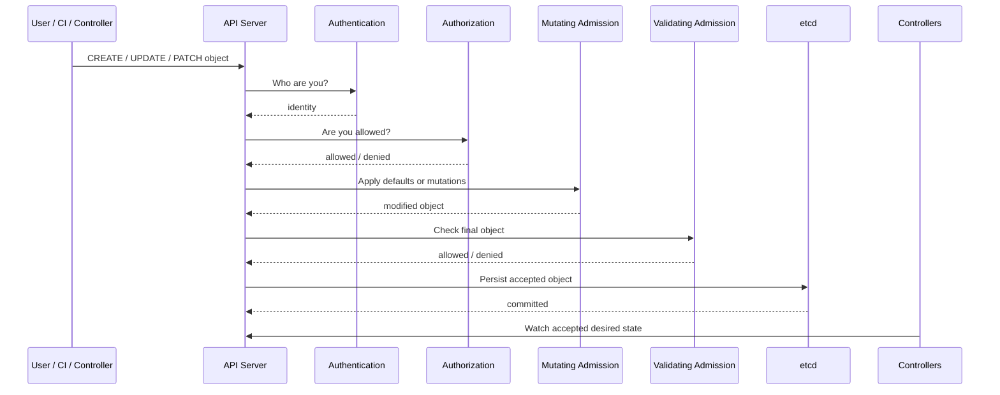
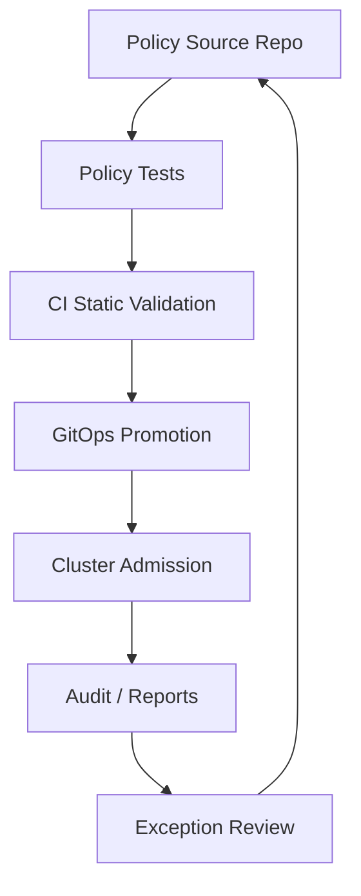
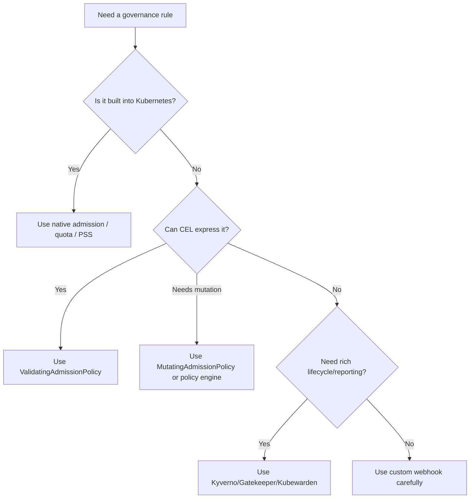
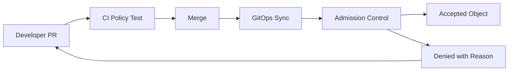

------
title: Learn Kubernetes, Deployment Model, and Cloud Native Platform Engineering - Part 024
description: Admission control, policy-as-code, validating admission policy, mutating admission policy, admission webhooks, Pod Security Admission, OPA Gatekeeper, Kyverno, governance rollout, exception handling, and failure modelling.
series: learn-kubernetes-deployment-model
seriesTitle: Learn Kubernetes, Deployment Model, and Cloud Native Platform Engineering
order: 24
partTitle: Admission Control, Policy-as-Code, and Governance
tags:
- kubernetes
- admission-control
- policy-as-code
- governance
- validating-admission-policy
- mutating-admission-policy
- gatekeeper
- kyverno
date: 2026-07-01
------

# Part 024 — Admission Control, Policy-as-Code, and Governance

## 1. Why This Part Exists

Security fields inside a manifest are useful only if teams consistently apply them.

In a real organization, they usually do not.

A team forgets `runAsNonRoot`.  
Another team uses `latest` image tags.  
A migration job asks for `privileged: true`.  
A debug Pod mounts `/var/run/containerd/containerd.sock`.  
A namespace is created without Pod Security labels.  
A Helm chart from a vendor bypasses internal conventions.  
A CI pipeline validates YAML but production accepts something else.

This is why Kubernetes needs admission control and policy-as-code.

The key question is:

> What is allowed to enter the cluster API?

Admission control is the guardrail between "someone submitted a manifest" and "the cluster accepted that object as desired state."

---

## 2. Mental Model: Admission Is the API Write Gate

A Kubernetes write request follows a pipeline.



The important detail:

```text
Admission happens before persistence.
Controllers reconcile only objects that pass admission.
```

This means admission policy is stronger than documentation and stronger than CI-only validation.

CI can be bypassed.  
Admission cannot be bypassed by any normal API client that writes to the cluster.

---

## 3. Kaufman Frame

### 3.1 Deconstruct the Skill

Admission and governance decomposes into six skills:

| Sub-skill | What You Must Understand |
|---|---|
| Admission pipeline | authentication, authorization, mutation, validation, persistence |
| Built-in controls | Pod Security Admission, ResourceQuota, LimitRange, NodeRestriction |
| Declarative admission | ValidatingAdmissionPolicy, MutatingAdmissionPolicy, CEL |
| Webhooks | validating/mutating webhook design, availability, failure policy |
| Policy engines | Kyverno, OPA Gatekeeper, policy reports, audit, exceptions |
| Governance | rollout mode, exception lifecycle, ownership, compliance evidence |

### 3.2 Learn Enough to Self-Correct

After this part, you should be able to answer:

- why a manifest was rejected before reaching etcd;
- whether a rule belongs in Pod Security Admission, CEL, webhook, Kyverno, Gatekeeper, CI, or documentation;
- why a webhook outage can block API writes;
- why mutation can make debugging harder;
- how to roll out policy without breaking delivery;
- how to design exceptions that do not become permanent backdoors.

---

## 4. Admission Control Layers

Kubernetes has several admission mechanisms.

| Layer | Example | Strength |
|---|---|---|
| Built-in admission controllers | `ResourceQuota`, `LimitRanger`, `ServiceAccount`, `PodSecurity` | Native, stable operational model |
| Pod Security Admission | Enforce Pod Security Standards | Simple namespace-based Pod hardening |
| ValidatingAdmissionPolicy | CEL-based validation inside API server | Declarative, no webhook service required |
| MutatingAdmissionPolicy | CEL-based mutation/defaulting inside API server | Declarative mutation without webhook service |
| Dynamic admission webhooks | Custom validating/mutating HTTP callbacks | Most flexible, more operational risk |
| Policy engines | Kyverno, OPA Gatekeeper, Kubewarden | Higher-level policy lifecycle and reporting |

A mature platform usually combines multiple layers.

Example:

```text
Pod Security Admission:
  broad namespace-level Pod safety

ValidatingAdmissionPolicy:
  simple cluster-wide rules

Policy engine:
  complex governance, mutation, exceptions, audit reports

CI validation:
  fast feedback before manifests reach the cluster

Runtime detection:
  catch drift and behavior not visible in static manifests
```

---

## 5. Built-in Admission Controllers

Admission controllers are compiled into the API server and enabled through API server configuration.

Common examples:

| Controller | Purpose |
|---|---|
| `NamespaceLifecycle` | Prevents invalid operations on terminating/nonexistent namespaces |
| `ServiceAccount` | Handles ServiceAccount admission behavior |
| `ResourceQuota` | Enforces namespace resource quotas |
| `LimitRanger` | Applies/enforces LimitRange constraints |
| `NodeRestriction` | Limits kubelet permissions on Node/Pod objects |
| `PodSecurity` | Enforces Pod Security Standards |
| `MutatingAdmissionWebhook` | Enables mutating webhook admission |
| `ValidatingAdmissionWebhook` | Enables validating webhook admission |

Production engineers should know which controllers are active because policy behavior depends on this chain.

Managed Kubernetes usually abstracts API server flags, but the behavior still matters.

---

## 6. Pod Security Admission

Pod Security Admission is the built-in way to enforce Kubernetes Pod Security Standards.

Namespace labels define policy mode:

```yaml
apiVersion: v1
kind: Namespace
metadata:
  name: payments
  labels:
    pod-security.kubernetes.io/enforce: restricted
    pod-security.kubernetes.io/enforce-version: latest
    pod-security.kubernetes.io/audit: restricted
    pod-security.kubernetes.io/audit-version: latest
    pod-security.kubernetes.io/warn: restricted
    pod-security.kubernetes.io/warn-version: latest
```

Modes:

| Mode | Behavior |
|---|---|
| `enforce` | Rejects violating Pods |
| `audit` | Records audit annotation for violations |
| `warn` | Warns client without rejecting |

Levels:

| Level | Use |
|---|---|
| `privileged` | Trusted infrastructure only |
| `baseline` | Prevent known privilege escalation while keeping compatibility |
| `restricted` | Strong least-privilege profile |

### 6.1 Rollout Strategy

Do not jump straight to `restricted` enforce on all namespaces without visibility.

Safer rollout:

```text
Phase 1: warn restricted, audit restricted
Phase 2: enforce baseline, warn restricted, audit restricted
Phase 3: fix workloads
Phase 4: enforce restricted for suitable namespaces
Phase 5: govern exceptions
```

### 6.2 Namespace Taxonomy

| Namespace Type | Enforcement |
|---|---|
| `app-*` production | `restricted` enforce where possible |
| `app-*` development | `baseline` enforce, `restricted` warn |
| `platform-*` | explicit exception model |
| `observability` | baseline or exception-reviewed |
| `security` | exception-reviewed |
| `kube-system` | platform-owned, not developer writable |

---

## 7. ValidatingAdmissionPolicy

`ValidatingAdmissionPolicy` lets you express validation rules using CEL.

Use it when:

- the rule is based on object fields;
- the rule can be expressed declaratively;
- you do not need external service calls;
- you want to avoid webhook availability risk;
- you want API-server-native validation.

Example: reject Deployments using `:latest`.

```yaml
apiVersion: admissionregistration.k8s.io/v1
kind: ValidatingAdmissionPolicy
metadata:
  name: disallow-latest-image-tag
spec:
  failurePolicy: Fail
  matchConstraints:
    resourceRules:
      - apiGroups: ["apps"]
        apiVersions: ["v1"]
        operations: ["CREATE", "UPDATE"]
        resources: ["deployments"]
  validations:
    - expression: >
        object.spec.template.spec.containers.all(c,
          !c.image.endsWith(":latest")
        )
      message: "Images must not use the :latest tag."
---
apiVersion: admissionregistration.k8s.io/v1
kind: ValidatingAdmissionPolicyBinding
metadata:
  name: disallow-latest-image-tag-binding
spec:
  policyName: disallow-latest-image-tag
  validationActions: ["Deny"]
```

### 7.1 Why CEL Matters

CEL policies are useful for rules such as:

- required labels;
- forbidden image tags;
- required resource requests;
- disallowing host namespace access;
- preventing deletion of protected namespaces;
- requiring specific annotations;
- validating field relationships.

They are less ideal for rules requiring:

- external registry lookups;
- complex inventory queries;
- cross-resource state beyond available admission context;
- organization-specific exception workflows;
- rich reporting dashboards.

For those, a policy engine or webhook may be better.

---

## 8. MutatingAdmissionPolicy

Mutation changes an object before it is stored.

Examples:

- add default labels;
- inject environment-specific annotations;
- set default `seccompProfile`;
- set default resource requests in limited cases;
- normalize fields before validation.

Example: add a default label when missing.

```yaml
apiVersion: admissionregistration.k8s.io/v1
kind: MutatingAdmissionPolicy
metadata:
  name: default-platform-label
spec:
  matchConstraints:
    resourceRules:
      - apiGroups: [""]
        apiVersions: ["v1"]
        operations: ["CREATE"]
        resources: ["pods"]
  mutations:
    - patchType: ApplyConfiguration
      applyConfiguration:
        expression: >
          Object{
            metadata: Object.metadata{
              labels: has(object.metadata.labels)
                ? object.metadata.labels
                : {"platform.example.com/managed": "true"}
            }
          }
```

Mutation is powerful but dangerous.

### 8.1 Mutation Risks

| Risk | Example |
|---|---|
| Hidden behavior | User applies manifest A, cluster stores manifest B |
| Debugging confusion | CI output differs from runtime object |
| Ordering issues | Multiple mutators interact unexpectedly |
| Security ambiguity | Mutator adds permissions or mounts |
| Upgrade risk | Mutation expression changes object shape unexpectedly |

Use mutation for safe defaults, not for surprising business logic.

---

## 9. Dynamic Admission Webhooks

Dynamic admission webhooks are HTTP callbacks called by the API server.

There are two types:

| Type | Behavior |
|---|---|
| Mutating webhook | Can modify the object |
| Validating webhook | Can accept or reject the final object |

Common use cases:

- service mesh sidecar injection;
- policy engines;
- image verification;
- custom org-specific validation;
- defaulting custom resources;
- advanced governance workflows.

### 9.1 Webhook Failure Model

Admission webhooks are operational dependencies of the API server write path.

Failure modes:

| Failure | Impact |
|---|---|
| Webhook Pod down | Creates/updates may fail or delay |
| TLS certificate expired | Admission calls fail |
| DNS failure | API server cannot reach webhook service |
| Slow webhook | API write latency increases |
| Bad match rules | Webhook intercepts too much |
| Recursive dependency | Webhook blocks its own repair |
| Fail-open misused | Unsafe objects enter cluster |
| Fail-closed misused | Cluster operations freeze |

Webhook configuration must be engineered like production infrastructure.

### 9.2 Webhook Design Rules

1. Keep webhook logic deterministic.
2. Keep latency low.
3. Scope match rules narrowly.
4. Avoid calling unstable external systems.
5. Set timeouts intentionally.
6. Choose `failurePolicy` based on blast radius.
7. Exclude the webhook's own namespace where needed.
8. Monitor admission latency and rejection rates.
9. Version webhook behavior.
10. Test upgrade and rollback paths.

---

## 10. Policy Engines

Policy engines add a higher-level lifecycle around admission.

Common choices:

| Tool | Model |
|---|---|
| Kyverno | Kubernetes-native YAML/CEL policy model; validate, mutate, generate, cleanup, image verification |
| OPA Gatekeeper | OPA/Rego-based policy with ConstraintTemplates and Constraints |
| Kubewarden | WebAssembly-based policy engine |

This series will not turn into a vendor-specific manual, but a top engineer should understand the architectural trade-off.

### 10.1 Kyverno Mental Model

Kyverno policies are Kubernetes resources.

Typical capabilities:

- validate resources;
- mutate resources;
- generate resources;
- cleanup resources;
- verify images;
- report policy results.

Example validation pattern:

```yaml
apiVersion: kyverno.io/v1
kind: ClusterPolicy
metadata:
  name: require-resource-requests
spec:
  validationFailureAction: Enforce
  rules:
    - name: require-cpu-memory-requests
      match:
        any:
          - resources:
              kinds:
                - Pod
      validate:
        message: "CPU and memory requests are required."
        pattern:
          spec:
            containers:
              - resources:
                  requests:
                    cpu: "?*"
                    memory: "?*"
```

Kyverno is often attractive for Kubernetes teams because policies are authored as Kubernetes YAML.

### 10.2 Gatekeeper Mental Model

Gatekeeper uses:

| Concept | Meaning |
|---|---|
| ConstraintTemplate | Defines policy schema and Rego logic |
| Constraint | Instantiates policy with parameters and match scope |
| Audit | Scans existing resources for violations |
| Admission | Rejects violating API requests |

Example conceptual shape:

```yaml
apiVersion: templates.gatekeeper.sh/v1
kind: ConstraintTemplate
metadata:
  name: k8srequiredlabels
spec:
  crd:
    spec:
      names:
        kind: K8sRequiredLabels
      validation:
        openAPIV3Schema:
          type: object
          properties:
            labels:
              type: array
              items:
                type: string
  targets:
    - target: admission.k8s.gatekeeper.sh
      rego: |
        package k8srequiredlabels

        violation[{"msg": msg}] {
          required := input.parameters.labels[_]
          not input.review.object.metadata.labels[required]
          msg := sprintf("missing required label: %v", [required])
        }
```

Then a Constraint applies it:

```yaml
apiVersion: constraints.gatekeeper.sh/v1beta1
kind: K8sRequiredLabels
metadata:
  name: namespace-must-have-owner
spec:
  match:
    kinds:
      - apiGroups: [""]
        kinds: ["Namespace"]
  parameters:
    labels:
      - owner
```

Gatekeeper is attractive when the organization already uses OPA/Rego or needs mature constraint patterns.

---

## 11. Policy-as-Code Architecture

A strong governance model treats policy as productized platform code.



The lifecycle:

1. write policy in Git;
2. unit-test policy logic;
3. run against sample manifests;
4. deploy in audit/warn mode;
5. observe impact;
6. fix workloads;
7. enforce gradually;
8. track exceptions;
9. review violations regularly;
10. evolve policy with platform maturity.

---

## 12. Governance Taxonomy

Not all policies have the same severity.

| Class | Example | Recommended Action |
|---|---|---|
| Safety-critical | Disallow privileged app Pods | Enforce |
| Compliance-critical | Required ownership labels | Enforce after migration |
| Reliability-critical | Require resource requests | Enforce or warn during adoption |
| Cost-control | Require team/cost-center labels | Enforce on namespace/workload |
| Hygiene | Prefer non-latest tags | Warn then enforce |
| Recommendation | Prefer topology spread | Audit/warn |
| Experimental | New platform convention | Audit only |

A mature platform avoids treating every rule as equally urgent.

---

## 13. Policy Rollout Strategy

### 13.1 The Wrong Way

```text
Write 40 policies.
Turn all to enforce.
Break deployments.
Create emergency bypass.
Teams lose trust.
Policies get disabled.
```

### 13.2 The Right Way

```text
Start with non-negotiable safety policies.
Run broad policies in audit/warn mode.
Publish violation reports.
Provide remediation examples.
Fix high-volume offenders.
Enforce namespace by namespace.
Keep exceptions visible.
```

### 13.3 Safe Rollout Phases

| Phase | Mode | Goal |
|---|---|---|
| Discover | Audit | Measure current violations |
| Educate | Warn | Make developers see problems early |
| Remediate | Warn + targeted enforce | Fix common failures |
| Enforce | Deny | Block unsafe changes |
| Optimize | Enforce + reports | Reduce exceptions and improve UX |

---

## 14. Exception Handling

Every serious platform needs exceptions.

The question is not whether exceptions exist.

The question is whether exceptions are governed.

### 14.1 Bad Exception Model

```text
"Just add this namespace to the exclude list forever."
```

Problems:

- no owner;
- no expiry;
- no risk classification;
- no compensating control;
- no audit trail.

### 14.2 Better Exception Model

An exception should have:

| Field | Purpose |
|---|---|
| Owner | Who is accountable? |
| Namespace/workload scope | What exactly is exempted? |
| Policy name | Which control is bypassed? |
| Reason | Why is this necessary? |
| Expiry date | When must it be revisited? |
| Risk level | What is the blast radius? |
| Compensating control | What reduces the risk? |
| Approval | Who accepted the risk? |

Example exception record:

```yaml
apiVersion: platform.example.com/v1alpha1
kind: PolicyException
metadata:
  name: legacy-agent-hostpath-exception
  namespace: platform-security
spec:
  policy: disallow-hostpath
  target:
    namespace: observability
    serviceAccount: legacy-agent
  reason: "Vendor agent requires read-only access to /var/log until replacement rollout completes."
  expiresAt: "2026-09-30"
  risk: high
  compensatingControls:
    - "readOnly hostPath only"
    - "dedicated node pool"
    - "restricted RBAC"
    - "runtime monitoring enabled"
  approvedBy:
    - "platform-security"
    - "sre-lead"
```

Even if your policy engine does not support this exact object, the governance model is still useful.

---

## 15. Common Policies for Production Platforms

### 15.1 Required Labels

Workloads should declare ownership and system identity.

Recommended labels:

```yaml
app.kubernetes.io/name: orders-api
app.kubernetes.io/part-of: payments
app.kubernetes.io/component: api
platform.example.com/team: payments
platform.example.com/environment: production
platform.example.com/data-classification: confidential
```

Why:

- cost allocation;
- incident ownership;
- dependency mapping;
- policy scoping;
- auditability.

### 15.2 Disallow `latest`

```text
Images must be immutable and traceable.
```

Reject:

```yaml
image: ghcr.io/example/orders-api:latest
```

Prefer:

```yaml
image: ghcr.io/example/orders-api:1.8.3
```

Even better, use digest pinning where practical:

```yaml
image: ghcr.io/example/orders-api@sha256:...
```

### 15.3 Require Resource Requests

Require CPU/memory requests for schedulability and capacity planning.

```text
No request means the scheduler cannot make reliable placement decisions.
```

### 15.4 Disallow Privileged App Pods

Normal application namespaces should reject:

```yaml
securityContext:
  privileged: true
```

### 15.5 Disallow Host Namespaces

Reject:

```yaml
hostNetwork: true
hostPID: true
hostIPC: true
```

except for controlled infrastructure namespaces.

### 15.6 Restrict hostPath

If hostPath is allowed at all, restrict:

- namespace;
- service account;
- path prefix;
- read-only mode;
- node pool;
- approval.

### 15.7 Require Pod Security Namespace Labels

Every namespace should declare Pod Security posture.

### 15.8 Require ServiceAccount Discipline

Reject workloads using `default` ServiceAccount in production.

```text
A workload identity should be intentional, not inherited by accident.
```

---

## 16. Admission Policy Decision Framework

Use this decision tree:



Prefer simpler mechanisms first.

Do not deploy a complex webhook when a native policy can solve the problem.

---

## 17. Failure Modelling

### 17.1 Policy Too Strict

Symptoms:

- deployments fail broadly;
- teams bypass platform;
- emergency cluster-admin access increases;
- platform team becomes bottleneck.

Mitigation:

- audit/warn first;
- publish remediation guide;
- enforce by namespace maturity;
- create reviewed exceptions.

### 17.2 Policy Too Weak

Symptoms:

- privileged Pods exist in app namespaces;
- `latest` images reach production;
- workloads have no resources;
- namespaces lack ownership;
- incident response cannot identify owners.

Mitigation:

- define non-negotiable controls;
- enforce minimum safety baseline;
- report drift;
- make ownership labels mandatory.

### 17.3 Webhook Availability Failure

Symptoms:

```text
failed calling webhook
context deadline exceeded
x509: certificate has expired
```

Mitigation:

- monitor webhook latency and error rate;
- set proper timeouts;
- avoid unnecessary external dependencies;
- manage certificates;
- use HA deployment;
- scope webhook rules;
- choose fail-open/fail-closed intentionally.

### 17.4 Mutation Surprise

Symptoms:

- manifest in Git differs from live object;
- developers do not understand why fields appear;
- server-side apply conflicts increase.

Mitigation:

- keep mutation minimal;
- document mutated fields;
- expose dry-run previews;
- prefer validation over mutation for critical rules.

---

## 18. Debugging Admission Failures

### 18.1 Read the Error

Example:

```text
Error from server (Forbidden): admission webhook "validate.platform.example.com" denied the request:
container app must set resources.requests.cpu
```

Do not immediately blame Kubernetes.

Admission errors usually tell you:

- which webhook or policy denied the object;
- which field is invalid;
- which message was returned.

### 18.2 Use Server-Side Dry Run

```bash
kubectl apply --server-side --dry-run=server -f deployment.yaml
```

This sends the object through API validation and admission without persistence.

### 18.3 Inspect Namespace Labels

```bash
kubectl get ns payments --show-labels
```

### 18.4 Inspect Admission Policies

```bash
kubectl get validatingadmissionpolicies
kubectl get validatingadmissionpolicybindings
kubectl get mutatingadmissionpolicies
kubectl get mutatingadmissionpolicybindings
kubectl get validatingwebhookconfigurations
kubectl get mutatingwebhookconfigurations
```

### 18.5 Inspect Webhook Health

```bash
kubectl get pods -n platform-policy
kubectl logs -n platform-policy deploy/policy-webhook
kubectl get events -n platform-policy --sort-by=.lastTimestamp
```

### 18.6 Use Audit/Warn Signals

If Pod Security Admission is configured with `warn`, `kubectl` can surface warnings during apply.

Use warnings as early remediation signals, not as noise.

---

## 19. Admission and GitOps

GitOps changes the policy problem.

If a GitOps controller applies manifests into the cluster, then:

- the GitOps controller identity must be governed;
- policies apply to GitOps writes too;
- failed admission means sync failure;
- policy errors must be visible in GitOps status;
- exceptions should live in Git, not in ad-hoc cluster edits.

A good platform creates this feedback loop:



Do not rely only on GitOps validation. The cluster API is still the final enforcement point.

---

## 20. Platform Governance Model

A mature Kubernetes governance system has four lanes:

| Lane | Purpose |
|---|---|
| Prevent | Admission denies unsafe objects |
| Detect | Audit/reporting finds existing violations |
| Educate | Warnings, docs, examples, PR feedback |
| Govern | Exceptions, ownership, review, maturity tracking |

Without education, policy feels hostile.

Without prevention, policy is optional.

Without detection, old violations remain.

Without governance, exceptions become permanent loopholes.

---

## 21. Example Platform Policy Baseline

A reasonable first baseline:

### Cluster-wide

- every namespace must have owner/environment labels;
- every namespace must declare Pod Security mode;
- default ServiceAccount use forbidden in production namespaces;
- privileged Pods forbidden outside infrastructure namespaces;
- hostPath forbidden outside approved namespaces;
- host network/PID/IPC forbidden outside approved namespaces.

### Workload-level

- images must not use `latest`;
- resource requests required;
- `allowPrivilegeEscalation: false` required;
- capabilities must drop `ALL`;
- `seccompProfile: RuntimeDefault` required;
- production workloads must define readiness probes;
- app workloads must not run as root.

### Delivery-level

- policy tested in CI;
- admission enforced in cluster;
- exceptions stored in Git;
- violation reports reviewed regularly.

---

## 22. Policy Authoring Principles

Good policies are:

1. explicit;
2. understandable;
3. scoped;
4. testable;
5. observable;
6. versioned;
7. documented;
8. reversible;
9. paired with remediation;
10. aligned with real risk.

Bad policies are:

1. surprising;
2. overly broad;
3. slow;
4. untested;
5. undocumented;
6. impossible to override safely;
7. dependent on unstable external services;
8. enforced before migration planning;
9. written only for compliance theater;
10. ignored by platform owners.

---

## 23. Practice Lab

### Lab 1 — Enforce Pod Security Gradually

1. create namespace `payments`;
2. set `warn` and `audit` to `restricted`;
3. apply a weak Pod;
4. observe warnings;
5. fix the Pod;
6. set `enforce` to `restricted`;
7. retry weak Pod and confirm rejection.

### Lab 2 — Create a ValidatingAdmissionPolicy

Policy requirement:

```text
Deployments must not use :latest image tags.
```

Tasks:

1. write `ValidatingAdmissionPolicy`;
2. bind it with `validationActions: ["Warn"]`;
3. test with `kubectl apply --dry-run=server`;
4. switch to `Deny`;
5. test rejection;
6. document remediation.

### Lab 3 — Policy Rollout Simulation

Take ten manifests from different teams.

For each:

1. run static policy checks;
2. classify violation severity;
3. decide audit/warn/enforce;
4. create remediation PR comments;
5. identify exceptions;
6. propose enforcement timeline.

### Lab 4 — Webhook Failure Drill

In a non-production cluster:

1. deploy a test validating webhook;
2. configure `failurePolicy: Fail`;
3. scale webhook to zero;
4. attempt to create a matched object;
5. observe failure;
6. change `failurePolicy: Ignore`;
7. repeat;
8. document the difference.

---

## 24. Summary

Admission control turns platform rules into API reality.

The mental model:

```text
Authentication says who you are.
Authorization says what verbs you may attempt.
Admission says whether this specific object is acceptable.
```

Policy-as-code is not merely security. It is the operating system for platform governance.

Use native controls first:

- Pod Security Admission for broad Pod safety;
- ResourceQuota and LimitRange for resource governance;
- ValidatingAdmissionPolicy for declarative API-server-native validation;
- MutatingAdmissionPolicy for safe defaulting;
- webhooks and policy engines when you need richer behavior.

The production-grade pattern:

```text
warn -> audit -> remediate -> enforce -> govern exceptions
```

The strongest platform is not the one with the most policies.

It is the one where:

- policies map to real risks;
- developers understand remediation;
- exceptions are visible;
- enforcement is reliable;
- feedback is fast;
- governance improves the system without blocking delivery unnecessarily.

---

## 25. References

- Kubernetes Documentation — Admission Control in Kubernetes: https://kubernetes.io/docs/reference/access-authn-authz/admission-controllers/
- Kubernetes Documentation — Dynamic Admission Control: https://kubernetes.io/docs/reference/access-authn-authz/extensible-admission-controllers/
- Kubernetes Documentation — Validating Admission Policy: https://kubernetes.io/docs/reference/access-authn-authz/validating-admission-policy/
- Kubernetes Documentation — Mutating Admission Policy: https://kubernetes.io/docs/reference/access-authn-authz/mutating-admission-policy/
- Kubernetes Documentation — Manifest-Based Admission Control: https://kubernetes.io/docs/reference/access-authn-authz/manifest-admission-control/
- Kubernetes Documentation — Pod Security Standards: https://kubernetes.io/docs/concepts/security/pod-security-standards/
- Kubernetes Documentation — Enforce Pod Security Standards with Namespace Labels: https://kubernetes.io/docs/tasks/configure-pod-container/enforce-standards-namespace-labels/
- Kubernetes Documentation — Resource Quotas: https://kubernetes.io/docs/concepts/policy/resource-quotas/
- Kyverno Documentation — Introduction: https://kyverno.io/docs/introduction/
- OPA Gatekeeper Documentation — ConstraintTemplates: https://open-policy-agent.github.io/gatekeeper/website/docs/constrainttemplates/
