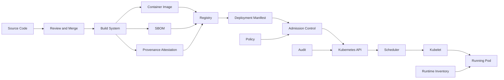
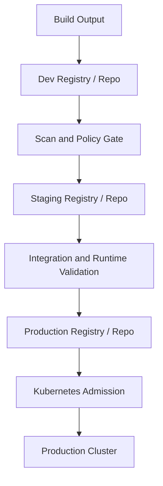
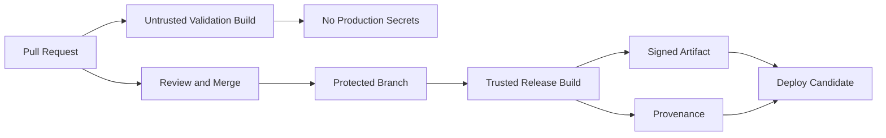
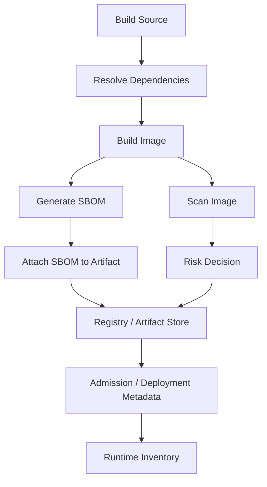
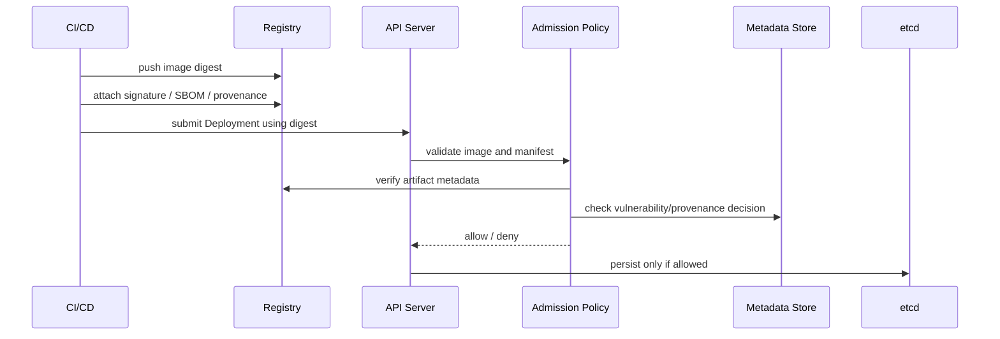
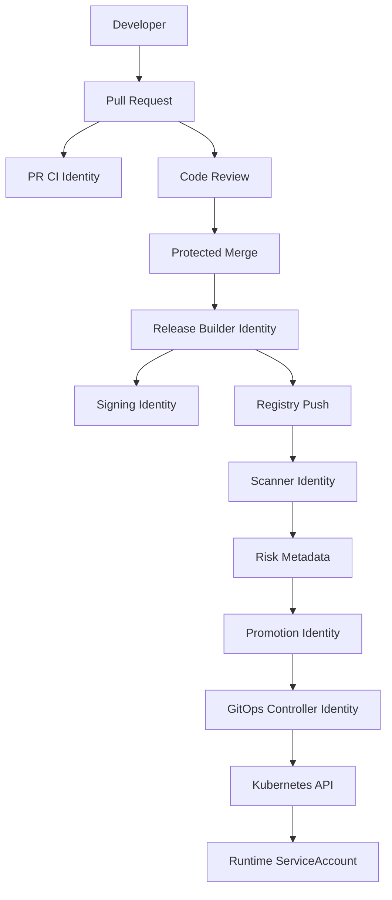
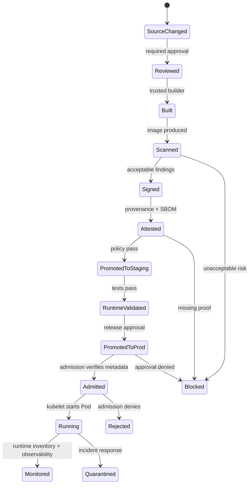
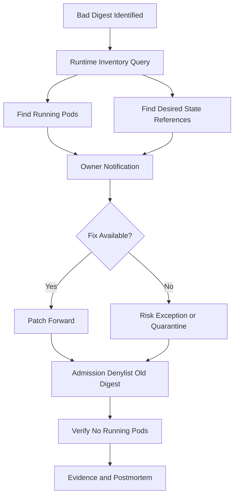

------
title: Learn Kubernetes, Deployment Model, and Cloud Native Platform Engineering - Part 025
description: Supply chain security for Kubernetes delivery, image identity, digest pinning, SBOM, provenance, SLSA, signing, attestation, admission enforcement, vulnerability policy, CI/CD identity, registry trust, and deployment governance.
series: learn-kubernetes-deployment-model
seriesTitle: Learn Kubernetes, Deployment Model, and Cloud Native Platform Engineering
order: 25
partTitle: Supply Chain Security for Kubernetes Delivery
tags:
- kubernetes
- supply-chain-security
- container-image-security
- slsa
- sbom
- sigstore
- cosign
- admission-control
- policy-as-code
date: 2026-07-01
------

# Part 025 — Supply Chain Security for Kubernetes Delivery

## 1. Why This Part Exists

Kubernetes is very good at running accepted desired state.

That is also the risk.

If the cluster accepts a malicious image, a mutable tag, an unsigned artifact, a compromised CI output, or a manifest generated by an untrusted deployment actor, Kubernetes will faithfully reconcile that state.

The control plane does not automatically know whether an image was built from reviewed source code, whether the dependency graph contains known critical issues, whether the artifact was replaced in the registry, whether the build system was isolated, or whether the manifest came from an approved promotion path.

Kubernetes gives us enforcement points.

It does not give us a complete supply chain by default.

This part teaches how to think about supply chain security as an end-to-end deployment integrity problem:

```text
Can we prove that the workload running in the cluster is the workload we intended to run?
```

That question has several sub-questions:

```text
Who changed the source?
Who reviewed it?
What dependencies were included?
Where was it built?
What artifact was produced?
Was the artifact signed?
Was provenance attached?
Was the manifest promoted through an approved path?
Did admission verify the artifact before accepting it?
Can runtime evidence prove which digest is actually running?
```

A top-tier engineer does not treat supply chain security as a scanner bolted onto CI.

They model it as a chain of custody from source to runtime.

---

## 2. Mental Model: Kubernetes Runs Artifacts, Not Intent

A Git commit is intent.

A Dockerfile is intent.

A Helm chart is intent.

A CI workflow is intent.

A container image digest is an artifact.

A Kubernetes object stored in etcd is desired runtime state.

A Pod running on a node is actual runtime state.

Supply chain security connects those layers.



The dangerous assumption is:

```text
If it passed CI, it is safe to run.
```

The production-grade assumption is:

```text
Every transition between source, build, registry, deployment, and runtime must be verifiable or constrained.
```

---

## 3. What Kubernetes Can and Cannot Do

Kubernetes can help enforce:

- allowed registries
- image pull credentials
- digest pinning conventions
- signed image requirements through admission integrations
- SBOM or attestation requirements through policy engines
- runtime identity through ServiceAccounts
- deployment actor accountability through audit logs
- namespace-level policy boundaries
- Pod runtime hardening
- admission-time validation and mutation

Kubernetes does not automatically provide:

- trustworthy source review
- hermetic builds
- dependency integrity
- vulnerability triage
- SBOM generation
- image signing
- provenance generation
- registry immutability
- exploitability analysis
- business approval for risk exceptions
- proof that a running process is semantically safe

So the correct boundary is:

```text
Kubernetes is the runtime enforcement surface, not the whole supply chain system.
```

---

## 4. The Core Invariant

A secure Kubernetes delivery system should preserve this invariant:

```text
Only approved, immutable, traceable, policy-compliant artifacts may become cluster desired state.
```

Break it down:

| Word | Meaning |
|---|---|
| Approved | The change passed review, tests, risk gates, and release policy. |
| Immutable | The deployed image is identified by digest, not only by mutable tag. |
| Traceable | Runtime workload can be traced back to source, build, deployer, and promotion event. |
| Policy-compliant | Admission verifies required constraints before persistence. |
| Artifact | The exact container image, SBOM, and provenance metadata. |
| Desired state | The object accepted into Kubernetes API storage. |

This invariant is much stronger than:

```text
All images are scanned.
```

Scanning is useful.

It is not sufficient.

---

## 5. Threat Model for Kubernetes Delivery

Supply chain security starts with threat modelling.

### 5.1 Common attack paths

| Attack Path | Example | Control |
|---|---|---|
| Source tampering | Malicious commit merged without review | branch protection, mandatory review, signed commits where useful |
| Dependency confusion | Internal package name resolved from public registry | package source pinning, private registry controls |
| Base image compromise | Trusted app built on vulnerable or malicious base | curated base images, rebuild automation, image policy |
| CI credential theft | Attacker pushes images from build pipeline | short-lived credentials, workload identity, least privilege |
| Build script injection | Pipeline executes untrusted build steps | isolated builders, reviewed pipeline changes, provenance |
| Mutable tag substitution | `prod:v1.2.3` points to a new digest | deploy by digest, registry immutability, admission checks |
| Registry compromise | Image replaced or metadata altered | signature verification, transparency logs, digest pinning |
| Manifest tampering | Deployment changed outside GitOps path | admission policy, audit, drift detection |
| Privilege escalation | Image runs as root with broad ServiceAccount | Pod security, RBAC, runtime hardening |
| Vulnerability acceptance drift | Critical CVE ignored due to weak process | policy gates, risk exception lifecycle, SLA tracking |

### 5.2 The Kubernetes-specific risk

Kubernetes turns accepted manifests into running processes.

So the most important attack boundary is the API write path:

```text
Who or what is allowed to create/update workload objects, and what validations run before those objects are persisted?
```

That means supply chain security and admission control are tightly connected.

---

## 6. Image Identity: Tag Is a Name, Digest Is Identity

A container image tag is a human-friendly reference.

A digest is a content-addressed identity.

```yaml
# Mutable reference
image: ghcr.io/acme/payment-api:1.4.7

# Immutable reference
image: ghcr.io/acme/payment-api@sha256:2d4f0b...
```

The tag can be moved.

The digest identifies the exact image manifest.

For production workloads, the secure pattern is:

```text
Build tag for humans.
Deploy digest for machines.
```

### 6.1 Why `imagePullPolicy: Always` is not enough

`imagePullPolicy: Always` tells the kubelet to check the registry for the image reference each time it starts a container.

That improves freshness.

It does not turn a mutable tag into an immutable identity.

If the tag now points to a different digest, the node can pull a different artifact than the one you previously tested.

So the production rule is:

```text
Use digest pinning for workload identity.
Use imagePullPolicy intentionally for cache/freshness behavior.
Do not confuse pull policy with artifact integrity.
```

### 6.2 Recommended image reference policy

| Environment | Allowed Image Reference | Reason |
|---|---|---|
| Local dev | tag allowed | fast iteration |
| Shared dev | tag plus digest preferred | debugging and reproducibility |
| Staging | digest required | pre-prod must match prod candidate |
| Production | digest required | immutable runtime proof |
| Regulated workload | digest plus signature plus provenance required | audit and non-repudiation |

---

## 7. Registry Trust Model

A container registry is not just storage.

It is part of the deployment control plane.

A production registry should support:

- access control per repository
- immutable tags for release repositories
- audit logs
- vulnerability metadata integration
- retention policy
- replication policy
- signing and attestation storage
- promotion boundaries between dev, staging, and prod
- emergency blocklist or quarantine

### 7.1 Registry topology



The important decision:

```text
Should promotion copy artifacts, retag artifacts, or only promote metadata?
```

For strong integrity, prefer promoting the same digest through environments.

```text
same digest + different environment config > rebuild per environment
```

Rebuilding per environment creates ambiguity:

```text
Did production run the artifact we tested, or only a similar artifact built later?
```

---

## 8. Build System Security

The build system is one of the highest-risk components in the supply chain.

It can transform trusted source into a malicious artifact.

### 8.1 Build system requirements

A mature build system should provide:

- isolated build workers
- short-lived credentials
- no long-lived registry push secrets in repo variables
- reviewed pipeline definitions
- restricted network access where possible
- deterministic or reproducible build discipline where practical
- dependency pinning
- provenance generation
- artifact signing
- audit logs
- separation between PR build and trusted release build

### 8.2 PR build vs trusted release build

A pull request build is often untrusted.

It may run code submitted by someone who should not receive production credentials.

A release build is trusted only if:

- the source ref is protected
- required checks passed
- reviewers approved
- the build runner is trusted
- secrets are scoped
- outputs are signed
- provenance binds artifact to source and builder



### 8.3 Build anti-patterns

Avoid:

```text
kubectl apply from developer laptops
manual docker push to production repositories
long-lived registry credentials in CI variables
same identity for build and deployment
running release builds from unreviewed PR code
using mutable latest tags in production
ignoring base image rebuilds
scanner-only security without provenance
```

---

## 9. SBOM: Inventory Is Not Security, But Security Needs Inventory

An SBOM, or Software Bill of Materials, records software components and metadata.

It helps answer:

```text
What is inside this artifact?
Which packages and versions are present?
Which license obligations exist?
Which components are affected by a new vulnerability?
Which runtime workloads contain a vulnerable package?
```

Two widely used SBOM formats are:

- SPDX
- CycloneDX

The practical distinction:

| Format | Strong Fit |
|---|---|
| SPDX | license compliance, broad supply chain metadata, standardized exchange |
| CycloneDX | application security, vulnerability management, cyber risk use cases |

Do not turn this into a religious decision.

The important part is that the organization can generate, store, query, and trust the SBOM.

### 9.1 SBOM lifecycle



### 9.2 SBOM quality criteria

An SBOM is useful only if it is:

- generated close to build time
- tied to the exact image digest
- stored in a retrievable location
- machine-readable
- complete enough for incident response
- updated when the artifact changes
- protected from tampering
- queryable by security and platform teams

### 9.3 Common SBOM failures

| Failure | Consequence |
|---|---|
| SBOM generated from source only | misses OS packages or final image contents |
| SBOM not tied to digest | cannot prove which artifact it describes |
| SBOM stored only in CI logs | unavailable during incident response |
| SBOM never consumed | compliance artifact only |
| SBOM includes false positives/noise | teams ignore results |
| SBOM lacks transitive dependency detail | misses real exposure |

---

## 10. Provenance: How Was This Artifact Produced?

SBOM answers:

```text
What is inside?
```

Provenance answers:

```text
How was it produced?
```

A useful provenance statement can include:

- source repository
- commit SHA
- branch or tag
- builder identity
- build workflow
- build parameters
- build timestamp
- materials/input artifacts
- output image digest

This is essential for Kubernetes because production manifests often only reference the final artifact.

Without provenance, the cluster sees:

```text
ghcr.io/acme/payment-api@sha256:abc...
```

With provenance, the organization can answer:

```text
Which source commit produced sha256:abc?
Which build system produced it?
Was that builder trusted?
Was the source protected?
Were required controls present?
```

---

## 11. SLSA as a Maturity Framework

SLSA stands for Supply-chain Levels for Software Artifacts.

Use it as a structured way to reason about build integrity and provenance.

Do not use it as a logo exercise.

A useful internal interpretation:

| Maturity | Practical Meaning |
|---|---|
| No SLSA discipline | Artifacts exist, but their origin is mostly based on trust and convention. |
| Provenance exists | Artifacts include metadata describing how they were built. |
| Provenance is trustworthy | Metadata is generated by the build platform, not handwritten by the app team. |
| Build system is hardened | Build process resists tampering and unauthorized modification. |
| Deployment enforces provenance | Admission can reject artifacts that do not meet provenance policy. |

The Kubernetes-relevant endpoint is not only:

```text
We generate provenance.
```

It is:

```text
The cluster refuses artifacts without acceptable provenance.
```

---

## 12. Signing and Attestation

Image signing provides integrity and authenticity evidence.

Attestation attaches additional claims to an artifact.

Examples:

```text
This image was built by workflow X.
This image was built from commit Y.
This image has SBOM Z.
This image passed vulnerability gate A.
This image passed integration test suite B.
```

### 12.1 Signature is not approval

A signature proves that a key or identity signed something.

It does not automatically prove the artifact is safe.

You still need policy:

```text
Which signer is trusted?
Which repository is allowed?
Which build workflow is trusted?
Which branch is allowed for production?
Which vulnerability threshold is acceptable?
Which environments require manual approval?
```

### 12.2 Key-based vs keyless signing

| Model | Description | Risk |
|---|---|---|
| Key-based signing | A private key signs artifacts | key custody becomes critical |
| KMS-backed signing | key lives in managed key service | cloud/KMS policy becomes critical |
| Keyless signing | identity provider and certificate flow bind signing to identity | identity and transparency verification become critical |

The best model depends on organizational identity maturity.

For most modern cloud-native teams, keyless or KMS-backed signing reduces the risk of unmanaged private keys.

---

## 13. Admission Enforcement Model

Supply chain policy becomes real only when Kubernetes enforces it.

Admission is where we can reject workload objects before they become desired state.



### 13.1 Admission policy categories

| Policy | Purpose |
|---|---|
| Registry allowlist | Prevent arbitrary external images. |
| Digest required | Prevent mutable tag deployment. |
| No `latest` tag | Prevent ambiguous image identity. |
| Signature required | Ensure artifact was signed by trusted identity. |
| Provenance required | Ensure artifact came from trusted source and builder. |
| SBOM required | Ensure artifact inventory exists. |
| Vulnerability threshold | Block unacceptable known risk. |
| Runtime hardening | Ensure Pod cannot run with unsafe privileges. |
| ServiceAccount boundary | Prevent broad workload identity by default. |
| Namespace ownership | Enforce tenant/platform metadata. |

### 13.2 Example: deny mutable production images

A simplified `ValidatingAdmissionPolicy` style rule can express image reference constraints.

```yaml
apiVersion: admissionregistration.k8s.io/v1
kind: ValidatingAdmissionPolicy
metadata:
  name: require-digest-images
spec:
  failurePolicy: Fail
  matchConstraints:
    resourceRules:
      - apiGroups: [""]
        apiVersions: ["v1"]
        operations: ["CREATE", "UPDATE"]
        resources: ["pods"]
      - apiGroups: ["apps"]
        apiVersions: ["v1"]
        operations: ["CREATE", "UPDATE"]
        resources: ["deployments", "statefulsets", "daemonsets"]
  validations:
    - expression: >-
        !has(object.spec.template) ||
        object.spec.template.spec.containers.all(c, c.image.contains('@sha256:'))
      message: "Production workloads must use image digests."
```

This is intentionally simplified.

Real policies must handle:

- init containers
- ephemeral containers
- Jobs and CronJobs
- nested Pod templates
- exempt namespaces
- warning vs enforce phase
- failure policy
- rollout order

### 13.3 Example: Kyverno-style image verification concept

Policy engines such as Kyverno can verify image signatures and attestations.

A conceptual policy may say:

```yaml
apiVersion: kyverno.io/v1
kind: ClusterPolicy
metadata:
  name: verify-signed-images
spec:
  validationFailureAction: Enforce
  webhookConfiguration:
    failurePolicy: Fail
  rules:
    - name: verify-payment-images
      match:
        any:
          - resources:
              kinds:
                - Pod
              namespaces:
                - payments
      verifyImages:
        - imageReferences:
            - "ghcr.io/acme/payment-*"
          required: true
          verifyDigest: true
          attestors:
            - entries:
                - keyless:
                    subject: "https://github.com/acme/payments/.github/workflows/release.yaml@refs/heads/main"
                    issuer: "https://token.actions.githubusercontent.com"
```

The exact syntax depends on Kyverno version and policy design.

The mental model is stable:

```text
Admission should verify artifact metadata, not just validate YAML shape.
```

---

## 14. Vulnerability Management Is a Risk Workflow

A vulnerability scanner is an input.

It is not a decision-making system.

A production-grade vulnerability workflow includes:

- severity
- exploitability
- package reachability when available
- workload exposure
- compensating controls
- environment criticality
- business owner
- SLA
- exception expiry
- rebuild path
- base image owner
- runtime inventory

### 14.1 Simple gate matrix

| Finding | Dev | Staging | Production |
|---|---:|---:|---:|
| Critical with known exploit | warn | block | block |
| Critical no exploit, fix available | warn | require approval | block or timed exception |
| High fix available | warn | warn or block | require SLA |
| Medium | record | record | record |
| No fix available | record | risk review | exception with expiry |
| Base image issue | open platform ticket | rebuild base | rebuild dependent images |

### 14.2 Why naive blocking fails

Naive policy:

```text
Block all critical CVEs.
```

This often fails because:

- scanner results may include unreachable packages
- base images may contain packages unused by the app
- no fixed version may exist
- teams may need emergency deployment for unrelated incident fixes
- false positives create alert fatigue
- policy exceptions become informal if the system is too rigid

Better policy:

```text
Block unacceptable risk, require explicit accountable exception for tolerated risk, and ensure expiry.
```

---

## 15. CI/CD Identity and Kubernetes Identity

Supply chain security fails when all automation shares one powerful identity.

Separate identities:

| Actor | Should Be Able To |
|---|---|
| PR validation CI | run tests, no production secret access |
| Release builder | build and sign artifacts |
| Scanner | read artifacts and produce risk metadata |
| Promotion controller | approve or promote artifact metadata |
| GitOps controller | apply manifests from approved repo/path |
| Runtime workload | access only its own runtime dependencies |
| Human operator | perform controlled break-glass actions |

The deployment identity should not also be the build identity.

The runtime ServiceAccount should not also be the deployment identity.

The scanner should not be able to mutate production manifests.

### 15.1 Identity graph



The key invariant:

```text
No single compromised identity should silently move untrusted code from source to production runtime.
```

---

## 16. Runtime Inventory: What Is Actually Running?

Admission tells us what was accepted.

Runtime inventory tells us what is running.

You need both.

A useful runtime inventory maps:

```text
cluster
namespace
workload kind/name
pod name
container name
image reference
resolved image ID / digest
node
ServiceAccount
owner team
source repo
commit SHA
SBOM reference
provenance reference
risk decision
```

Without runtime inventory, vulnerability response becomes guesswork:

```text
Which clusters are running the vulnerable digest?
Which namespaces use that base image?
Which team owns those workloads?
Are the Pods still running or only the Deployment spec references it?
```

### 16.1 Runtime inventory query examples

Questions an internal platform should answer quickly:

```text
Show all running Pods using log4j vulnerable digest X.
Show all workloads built from commit Y.
Show all production images without SBOM reference.
Show all namespaces using images from external registries.
Show all workloads with unsigned images admitted in the last 24 hours.
Show all workloads whose running imageID differs from declared deploy artifact metadata.
```

---

## 17. Supply Chain Policy as a State Machine

Treat release security as a state machine, not a checklist.



This model makes exception handling explicit.

An exception is not a bypass.

It is a controlled state transition with owner, reason, expiry, and audit trail.

---

## 18. Kubernetes Manifest Supply Chain

Images are not the only artifacts.

Kubernetes manifests are also supply chain artifacts.

A compromised manifest can:

- mount host paths
- run privileged containers
- attach a powerful ServiceAccount
- disable probes
- change resource limits
- expose a Service externally
- add unsafe environment variables
- route traffic to a malicious backend
- create broad RBAC bindings

So manifest generation must be controlled.

### 18.1 Manifest sources

Common sources:

| Source | Risk |
|---|---|
| Handwritten YAML | drift and copy-paste errors |
| Helm chart | template complexity and hidden defaults |
| Kustomize overlay | patch ordering and environment drift |
| Generated manifests | generator bugs and opaque output |
| Vendor chart | broad privileges and unsafe defaults |
| GitOps repo | powerful if protected, dangerous if weakly governed |

### 18.2 Manifest integrity controls

Use:

- protected Git branches
- CODEOWNERS
- environment directories with ownership
- policy checks in CI
- admission checks in cluster
- GitOps drift detection
- separate app config from platform policy
- generated manifest diff review
- pinned chart versions
- chart provenance where available

---

## 19. Supply Chain Layers and Controls

| Layer | Asset | Primary Risk | Control |
|---|---|---|---|
| Source | repo, branch, commit | unauthorized change | review, branch protection, signed release refs |
| Dependency | package graph | malicious/vulnerable dependency | lockfiles, registry policy, SBOM, scanning |
| Build | pipeline, runner | tampered artifact | isolated builder, provenance, restricted credentials |
| Artifact | image, SBOM, attestation | substitution or tampering | digest, signature, registry immutability |
| Manifest | Kubernetes YAML | unsafe desired state | CI policy, admission policy, GitOps |
| Admission | API write path | bad object accepted | validating/mutating policy, image verification |
| Runtime | Pod/process | privilege misuse | Pod security, RBAC, NetworkPolicy, observability |
| Response | inventory/evidence | slow incident scope | runtime inventory, audit logs, SBOM query |

---

## 20. Practical Production Baseline

A pragmatic baseline for a serious Kubernetes platform:

```text
1. Production images must come from approved registries.
2. Production workloads must use image digests.
3. Mutable tags such as latest are denied in shared and production namespaces.
4. Release images must be signed by trusted build identities.
5. Release images must have provenance tied to protected source.
6. Release images must have an SBOM tied to the image digest.
7. Critical vulnerability policy must be enforced with accountable exceptions.
8. Runtime workloads must use namespace-scoped ServiceAccounts.
9. CI/CD deploy identity must be separate from runtime identity.
10. All workload writes must be audited.
11. Break-glass deployment must be time-limited and reviewed.
12. Runtime inventory must map image digest to owner and source.
```

This baseline is intentionally smaller than a full enterprise program.

It is enough to prevent many high-impact failures.

---

## 21. Advanced Production Model

For highly regulated or high-risk platforms, add:

- hermetic builds where practical
- isolated trusted builders
- keyless signing with identity-bound certificates
- transparency log verification
- reproducible build targets for critical artifacts
- provenance policy in admission
- dependency source restrictions
- internal base image program
- workload-level risk tiering
- per-environment promotion attestations
- continuous runtime image verification
- automatic quarantine of blocked digests
- SBOM search across runtime fleet
- emergency denylist synced to admission
- evidence export for audits

---

## 22. Failure Modes

### 22.1 Policy unavailable blocks deployments

If admission image verification calls an external service and that service is down, deployments may fail.

Decide deliberately:

| Failure Policy | Behavior | Use For |
|---|---|---|
| Fail closed | safer, may block deploys | production critical controls |
| Fail open | available, may admit risk | non-critical advisory controls |

Production supply chain gates usually fail closed.

But fail-closed requires high availability of the verifier and registry metadata path.

### 22.2 Scanner blocks emergency patch

A team needs to deploy a fix, but the image has an unrelated critical CVE with no fix.

Bad process:

```text
Disable the scanner.
```

Good process:

```text
Create an audited, time-limited exception tied to digest, namespace, risk owner, and expiry.
```

### 22.3 Signature is trusted but builder is not

An attacker compromises a signing key or CI identity.

The cluster admits malicious signed images.

Control:

- restrict who can trigger trusted builds
- bind provenance to protected source
- monitor signing identity usage
- rotate credentials
- use keyless identity with policy constraints
- require multiple independent controls for high-risk services

### 22.4 Digest is pinned but vulnerable

Digest pinning proves immutability.

It does not prove safety.

Need scanning, SBOM, and rebuild workflow.

### 22.5 SBOM exists but cannot be queried

A compliance team stores SBOM artifacts, but incident responders cannot search them.

SBOM is then archival, not operational.

Need SBOM ingestion and runtime mapping.

---

## 23. Incident Response Playbook: Bad Image Digest

Scenario:

```text
A signed production image digest is discovered to contain a critical exploitable dependency.
```

Response flow:

```text
1. Identify digest.
2. Query runtime inventory for all running Pods using digest.
3. Query manifests for all workloads referencing digest.
4. Identify owning teams and business criticality.
5. Check whether fixed base/app image exists.
6. Block new admissions of the digest.
7. Decide whether to restart, roll back, patch forward, or quarantine.
8. Track all namespaces until no running Pods use the digest.
9. Preserve evidence: SBOM, provenance, admission logs, audit logs.
10. Run post-incident review: why was it admitted, detected, and remediated at that speed?
```

### 23.1 Mermaid flow



---

## 24. Enterprise Governance Model

Supply chain governance needs clear ownership.

| Responsibility | Owner |
|---|---|
| Base image curation | platform/security engineering |
| Build system hardening | platform/DevSecOps |
| Source review policy | engineering org |
| SBOM generation | build platform |
| SBOM consumption | security/platform |
| Vulnerability triage | app owner + security |
| Signing identity policy | platform/security |
| Admission enforcement | platform engineering |
| Exception approval | risk owner + security |
| Runtime inventory | platform engineering |
| Audit evidence | platform/security/compliance |

The anti-pattern is unclear ownership:

```text
Security says platform owns it.
Platform says app teams own it.
App teams say CI owns it.
CI says the registry owns it.
```

Production maturity requires explicit control ownership.

---

## 25. Maturity Model

| Level | Behavior |
|---:|---|
| 0 | Any user or pipeline can deploy mutable images from many registries. |
| 1 | Approved registries and basic vulnerability scanning exist. |
| 2 | Production deploys use digests and protected GitOps paths. |
| 3 | Images are signed, SBOMs are generated, provenance exists. |
| 4 | Admission verifies signatures, digests, registry policy, and basic provenance. |
| 5 | Runtime inventory, SBOM query, exception lifecycle, and incident response are integrated. |
| 6 | Build isolation, advanced provenance policy, continuous verification, and evidence automation exist across fleets. |

Target for strong teams:

```text
Level 4 minimum for production platform.
Level 5 for serious enterprise operations.
Level 6 for regulated/high-risk environments.
```

---

## 26. Checklist: Production Supply Chain Gate

Before a workload reaches production:

```text
[ ] Source repository is owned and protected.
[ ] Release branch/tag is controlled.
[ ] Build pipeline is reviewed and protected.
[ ] Build identity is separate from deploy identity.
[ ] Artifact is built in trusted environment.
[ ] Image digest is produced and recorded.
[ ] SBOM is generated for the exact digest.
[ ] Provenance is generated for the exact digest.
[ ] Image is signed by trusted identity.
[ ] Vulnerability decision is recorded.
[ ] Manifest references digest, not mutable tag.
[ ] Manifest is stored in protected GitOps path.
[ ] Admission verifies image and manifest policy.
[ ] Runtime inventory captures actual imageID.
[ ] Owner metadata links workload to team/service.
[ ] Audit trail can reconstruct deployment.
```

---

## 27. Kaufman Practice Plan

### 27.1 Deconstruct

The skill splits into:

```text
image identity
registry trust
build provenance
SBOM lifecycle
signing and attestation
admission enforcement
vulnerability risk workflow
runtime inventory
incident response
```

### 27.2 Learn enough to self-correct

You should be able to explain why each statement is wrong:

```text
We use imagePullPolicy Always, so tags are safe.
We scanned the image, so supply chain security is done.
The image is signed, so it is safe.
SBOM is only compliance paperwork.
Admission policy is optional because CI already validates manifests.
Developer laptops can deploy to prod if RBAC allows it.
```

### 27.3 Practice deliberately

Lab sequence:

```text
1. Deploy a workload using a mutable tag.
2. Replace the tag digest in the registry.
3. Observe why runtime reproducibility is weak.
4. Deploy by digest.
5. Add a policy that denies images without digest.
6. Generate an SBOM for an image.
7. Sign the image.
8. Attach provenance or an attestation.
9. Enforce signature verification in a test namespace.
10. Simulate a vulnerable digest incident and query runtime usage.
```

---

## 28. Common Misconceptions

### Misconception 1: Kubernetes pulls what CI tested

Only true if deployment references the exact tested digest.

### Misconception 2: Private registry means trusted registry

Private only means access is restricted.

It does not prove artifacts are safe or immutable.

### Misconception 3: Signed images remove the need for scanning

Signing proves authenticity/integrity.

Scanning analyzes known risk.

They answer different questions.

### Misconception 4: SBOM means vulnerability management is solved

SBOM improves visibility.

You still need matching, triage, prioritization, and remediation.

### Misconception 5: Admission controls are too late

Admission is late in the pipeline, but it is the last authoritative write gate before desired state is stored.

CI can be bypassed.

Admission cannot be bypassed by normal Kubernetes clients if correctly configured.

---

## 29. Design Review Questions

Ask these in architecture review:

```text
Can a developer deploy directly from a laptop?
Can a mutable tag reach production?
Can an external registry image run in production?
Can a PR build access production signing credentials?
Can a compromised scanner mutate deployment state?
Can we prove which commit produced a running digest?
Can we find all workloads affected by a vulnerable dependency?
Can we block a bad digest within minutes?
Can an exception expire automatically?
Can platform engineers explain why an image was admitted?
Can auditors reconstruct who approved a high-risk deployment?
```

If the answer is unclear, the system is not production-grade yet.

---

## 30. Summary

Supply chain security for Kubernetes is about preserving artifact integrity from source to runtime.

The central invariant is:

```text
Only approved, immutable, traceable, policy-compliant artifacts may become cluster desired state.
```

To get there:

- deploy by digest
- restrict registries
- secure build identities
- generate SBOMs
- generate provenance
- sign artifacts
- enforce policy at admission
- separate build, deploy, and runtime identities
- maintain runtime inventory
- create audited exception workflows
- prepare incident response around image digests

The strongest teams do not ask:

```text
Did the scanner pass?
```

They ask:

```text
Can we prove what is running, where it came from, who approved it, why it was allowed, and how quickly we can revoke it?
```

---

## References

- Kubernetes Documentation — Images: `https://kubernetes.io/docs/concepts/containers/images/`
- Kubernetes Documentation — Pull an Image from a Private Registry: `https://kubernetes.io/docs/tasks/configure-pod-container/pull-image-private-registry/`
- Kubernetes Documentation — Admission Controllers: `https://kubernetes.io/docs/reference/access-authn-authz/admission-controllers/`
- Kubernetes Documentation — Extending Kubernetes: `https://kubernetes.io/docs/concepts/extend-kubernetes/`
- SLSA — Supply-chain Levels for Software Artifacts: `https://slsa.dev/`
- SLSA Specification — Security Levels: `https://slsa.dev/spec/v1.0/levels`
- SPDX: `https://spdx.dev/`
- CycloneDX: `https://cyclonedx.org/`
- Sigstore Cosign: `https://github.com/sigstore/cosign`
- Sigstore Policy Controller: `https://docs.sigstore.dev/policy-controller/overview/`
- Kyverno Verify Images: `https://kyverno.io/docs/policy-types/cluster-policy/verify-images/sigstore/`
