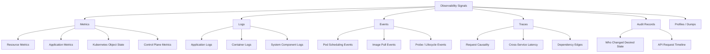
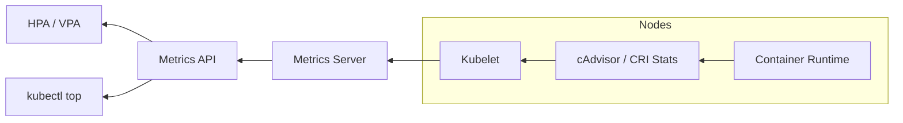
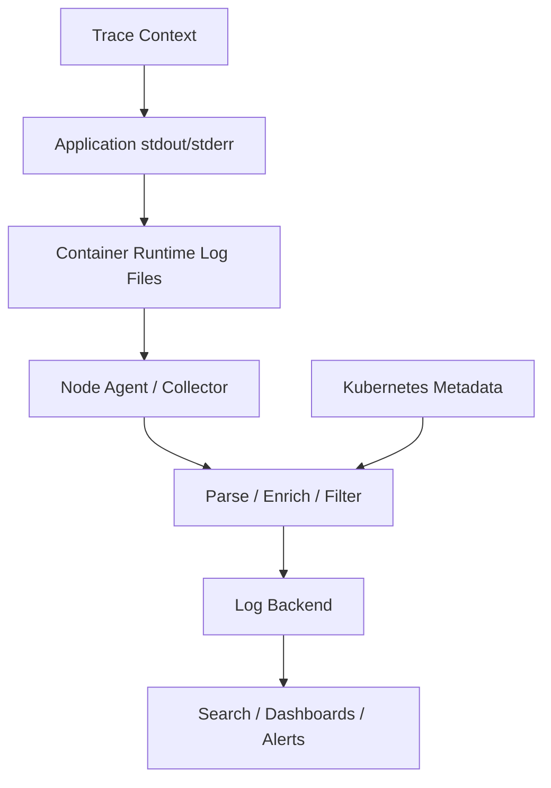
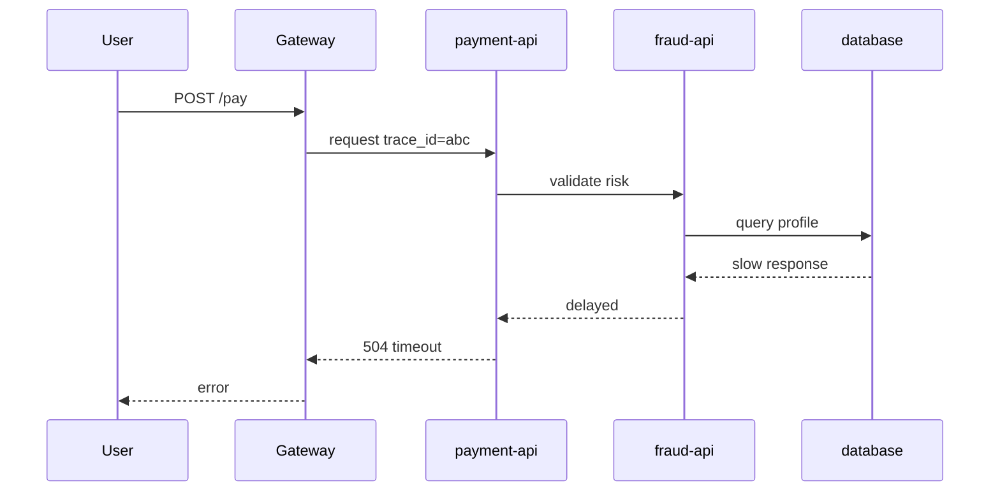
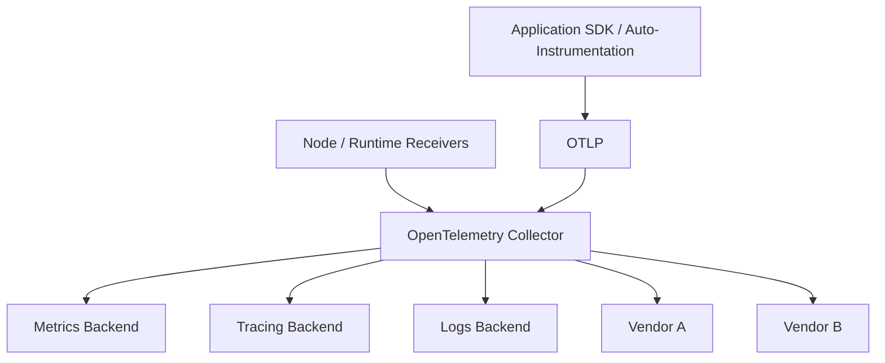
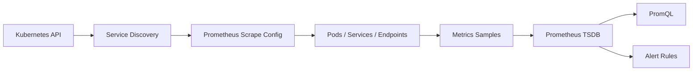
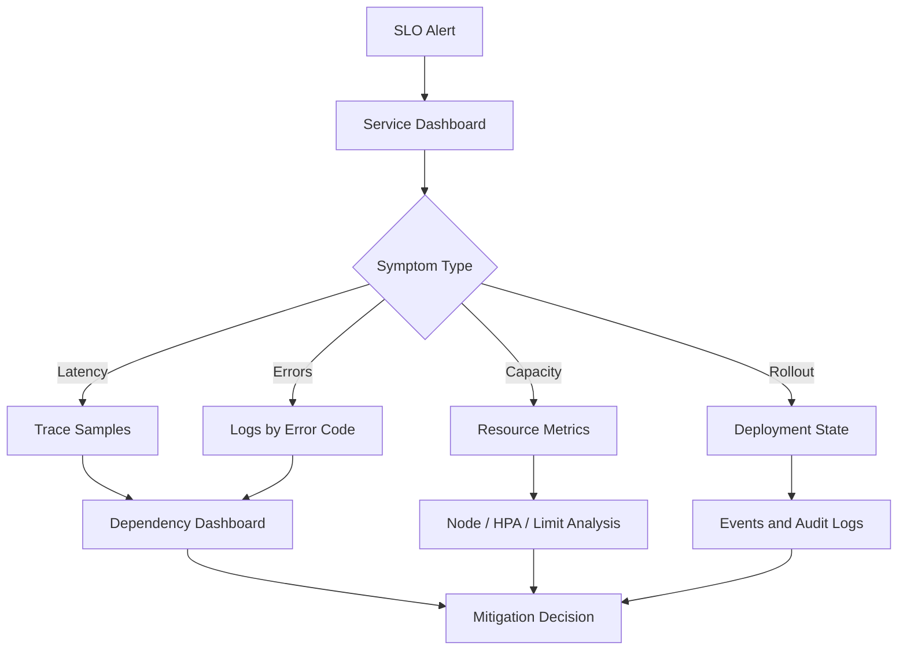

------
title: Learn Kubernetes, Deployment Model, and Cloud Native Platform Engineering - Part 026
description: Observability foundations for Kubernetes, including metrics, logs, events, traces, audit records, resource metrics pipeline, kube-state-metrics, OpenTelemetry, Prometheus, dashboard design, alerting, correlation, and production signal strategy.
series: learn-kubernetes-deployment-model
seriesTitle: Learn Kubernetes, Deployment Model, and Cloud Native Platform Engineering
order: 26
partTitle: Observability Foundations: Logs, Metrics, Events, Traces
tags:
- kubernetes
- observability
- metrics
- logs
- traces
- events
- opentelemetry
- prometheus
- sre
date: 2026-07-01
------

# Part 026 — Observability Foundations: Logs, Metrics, Events, Traces

## 1. Why This Part Exists

Kubernetes makes systems more dynamic.

Pods come and go.  
IP addresses change.  
Nodes drain.  
Controllers replace replicas.  
Autoscalers modify capacity.  
Ingress controllers route traffic.  
Admission policies reject objects.  
Schedulers make placement decisions.  
Kubelets restart containers.  
Storage attachments move.  
Network policies silently block traffic if misconfigured.

In this environment, logs alone are not enough.

Dashboards alone are not enough.

`kubectl get pods` is not enough.

The real skill is building an evidence system that lets you infer:

```text
What is happening?
Why is it happening?
Who or what changed it?
How bad is the user impact?
Which layer owns the failure?
What should we do next?
```

Observability is not tool installation.

It is the ability to infer internal system state from external signals.

---

## 2. Mental Model: Kubernetes Has Many States

A Kubernetes system has at least five state layers:

| Layer | Example Questions |
|---|---|
| Desired state | What did users/controllers ask Kubernetes to run? |
| Control-plane state | Did API server, scheduler, controller manager, and admission behave correctly? |
| Node/runtime state | Did kubelet, container runtime, CNI, CSI, and OS resources behave correctly? |
| Workload state | Did the application start, serve traffic, and handle dependencies? |
| User/business state | Did users experience latency, errors, or data loss? |

A production incident may involve any combination of these.

Example:

```text
Users see 5xx errors.
Application logs show database timeouts.
Metrics show request latency rising.
Kubernetes Events show Pods being rescheduled.
Node metrics show memory pressure.
Audit logs show a recent Deployment update.
Traces show downstream calls timing out after rollout.
```

A weak engineer reads one signal.

A strong engineer correlates layers.

---

## 3. Signal Taxonomy

Kubernetes observability uses several signal types.



The classic three pillars are:

```text
metrics
logs
traces
```

For Kubernetes, add:

```text
events
audit records
object state
```

These are not optional add-ons.

They are core to understanding a reconciler-driven platform.

---

## 4. Metrics: Numbers Over Time

Metrics are structured time-series data.

They answer questions like:

```text
How many requests per second?
What is p95 latency?
How much CPU is used?
How many Pods are not ready?
How many scheduler attempts fail?
How many API requests return 5xx?
How many queue items are waiting?
```

Metrics are strong for:

- alerting
- trend analysis
- capacity planning
- SLO measurement
- saturation detection
- anomaly detection
- comparative analysis

Metrics are weak for:

- explaining unique request behavior
- reconstructing exact causality
- showing rich contextual payloads
- debugging one-off data issues

### 4.1 Metric categories in Kubernetes

| Category | Examples | Source |
|---|---|---|
| Resource metrics | CPU, memory | metrics-server, kubelet, cAdvisor/CRI |
| Object state metrics | Pod ready, Deployment replicas, PVC phase | kube-state-metrics |
| Control-plane metrics | API latency, scheduler queue, workqueue depth | Kubernetes components |
| Application metrics | request count, latency, errors | app instrumentation |
| Business metrics | checkout success, payment authorization failures | app/domain instrumentation |
| Infrastructure metrics | disk, network, node pressure | node exporter, cloud provider, OS agents |

---

## 5. Kubernetes Resource Metrics Pipeline

Kubernetes has a resource metrics pipeline for basic autoscaling and `kubectl top` use cases.

A simplified flow:



Important boundary:

```text
Metrics Server is not a complete observability platform.
```

It provides basic CPU and memory metrics for autoscaling and lightweight inspection.

It does not replace Prometheus, OpenTelemetry, logs, traces, dashboards, or long-term storage.

### 5.1 Common mistake

```text
We installed metrics-server, so monitoring is done.
```

Correct view:

```text
metrics-server enables Kubernetes resource metrics consumers. It is only one small part of observability.
```

---

## 6. Kubernetes System Metrics

Kubernetes components expose metrics, commonly in Prometheus format.

Important components include:

| Component | Useful Signals |
|---|---|
| API server | request rate, latency, errors, admission latency, etcd interaction |
| Scheduler | scheduling attempts, pending Pods, queue duration, plugin latency |
| Controller manager | workqueue depth, reconciliation errors, leader election |
| Kubelet | Pod/container lifecycle, runtime operations, volume stats, node health |
| etcd | request latency, leader changes, database size, fsync latency |
| CoreDNS | DNS request rate, latency, errors, cache hit/miss |
| Ingress/Gateway controller | request rate, status codes, upstream latency, config reload errors |
| CNI plugin | packet drops, policy enforcement errors, IP allocation |
| CSI driver | volume attach/mount latency, errors, capacity |

The platform must observe both:

```text
application behavior
platform behavior
```

If you observe only applications, you miss cluster causes.

If you observe only cluster components, you miss user impact.

---

## 7. Kubernetes Object State Metrics

Kubernetes stores desired and observed object state in the API.

Object state metrics make that queryable over time.

Examples:

```text
Deployment desired replicas vs available replicas
Pod phase
Pod readiness condition
container restart count
Job completion state
PVC bound/pending state
DaemonSet unavailable Pods
HPA desired replicas
```

`kube-state-metrics` exposes Kubernetes object state as metrics.

This is different from resource metrics.

Resource metrics say:

```text
How much CPU/memory is used?
```

Object state metrics say:

```text
What does Kubernetes think about this object?
```

### 7.1 Useful object-state alerts

```text
DeploymentAvailable false for > 10m
Pod CrashLoopBackOff count > threshold
Pod not ready for > 10m
Job failed
CronJob missed schedule
PVC pending for > 5m
HPA at max replicas while latency is high
DaemonSet unavailable on node pool
Namespace quota nearly exhausted
```

### 7.2 Object-state anti-pattern

Do not alert on every transient state.

Kubernetes is eventually consistent.

Pod creation, rollout, rescheduling, and image pulling are normal transient operations.

Alert on sustained bad state or user-impacting symptoms.

---

## 8. Logs: Events With Context

Logs are timestamped records emitted by applications or system components.

They answer:

```text
What happened around this time?
What did this request do?
What error message was produced?
Which input or dependency caused failure?
Which code path was executed?
```

### 8.1 Kubernetes logging model

Containers normally write logs to `stdout` and `stderr`.

The node/container runtime stores them locally.

A production cluster should ship them to a separate backend.

Why?

Pods die.

Nodes fail.

Containers restart.

Local files are not durable enough for production investigation.

So the invariant is:

```text
Cluster-level logs must have storage and lifecycle independent of nodes, Pods, and containers.
```

### 8.2 Logging architecture



### 8.3 Structured logging baseline

Prefer structured logs:

```json
{
  "timestamp": "2026-07-01T09:17:23.112Z",
  "level": "ERROR",
  "service": "payment-api",
  "env": "prod",
  "namespace": "payments",
  "pod": "payment-api-7f6d9c9c8b-rn2p5",
  "trace_id": "9a2f...",
  "span_id": "1b7c...",
  "request_id": "req-123",
  "customer_tier": "enterprise",
  "error_code": "PAYMENT_GATEWAY_TIMEOUT",
  "message": "Payment authorization timed out"
}
```

Do not rely on free-text logs alone.

A good log record supports filtering, grouping, joining, and correlation.

---

## 9. Kubernetes Events: Short-Lived Operational Facts

Kubernetes Events are records about object-related activity.

They are useful for questions like:

```text
Why is this Pod Pending?
Why did image pulling fail?
Why was this container restarted?
Why did scheduling fail?
Why is volume mount failing?
```

Common examples:

```text
FailedScheduling
Pulling
Pulled
Failed
BackOff
Unhealthy
Killing
FailedMount
NodeNotReady
```

Events are excellent for immediate troubleshooting.

They are not a durable audit or logging system by default.

### 9.1 Event debugging commands

```bash
kubectl describe pod payment-api-xxx -n payments
kubectl get events -n payments --sort-by=.lastTimestamp
kubectl get events -A --field-selector type=Warning
```

### 9.2 Events vs logs

| Signal | Best For |
|---|---|
| Kubernetes Events | object lifecycle and cluster actions |
| Application logs | application behavior and errors |
| System logs | component internals and node/control-plane debugging |
| Audit logs | who did what to the Kubernetes API |

---

## 10. Traces: Causality Across Services

Distributed traces show request flow across service boundaries.

They answer:

```text
Where did this request spend time?
Which downstream service failed?
Which retry amplified latency?
Was the database slow or the gateway slow?
Did the new version create extra calls?
```

Metrics can say:

```text
p95 latency increased.
```

Traces can show:

```text
latency increased because payment-api now calls fraud-api twice and fraud-api waits on redis.
```

### 10.1 Trace model



### 10.2 Trace instrumentation baseline

Every service should propagate:

```text
trace_id
span_id
parent span
service name
operation name
status
latency
error attributes
resource attributes
```

For Kubernetes, also add resource attributes:

```text
k8s.cluster.name
k8s.namespace.name
k8s.pod.name
k8s.container.name
k8s.deployment.name
service.name
service.version
```

---

## 11. OpenTelemetry as the Instrumentation Layer

OpenTelemetry provides vendor-neutral APIs, SDKs, agents, collectors, and protocols for telemetry.

In a Kubernetes platform, a common model is:



The collector is valuable because it separates application instrumentation from backend choice.

It can:

- receive telemetry
- enrich with Kubernetes metadata
- sample traces
- batch exports
- filter noisy signals
- route signals to multiple backends
- normalize attributes

### 11.1 Collector deployment models

| Model | Description | Use Case |
|---|---|---|
| Sidecar | collector per Pod | strong isolation, high overhead |
| DaemonSet | collector per node | node-local collection, log collection |
| Gateway | shared collector deployment | centralized routing and processing |
| Agent + Gateway | node collectors forward to central collectors | common production model |

### 11.2 Anti-pattern

Do not instrument only the edge gateway.

That shows ingress latency but hides internal causality.

A microservice platform needs end-to-end trace propagation.

---

## 12. Prometheus Model

Prometheus is widely used for metrics collection in Kubernetes.

Its core model:

```text
scrape targets
store time series
query with PromQL
alert with alert rules
send alerts to Alertmanager
```

Prometheus fits Kubernetes because targets are dynamic and can be discovered through Kubernetes service discovery.

### 12.1 Scrape model



### 12.2 Cardinality risk

Prometheus can fail operationally if metric cardinality explodes.

Dangerous labels:

```text
user_id
request_id
session_id
email
full URL with IDs
raw exception message
payload hash
```

Good labels:

```text
service
namespace
route template
status code class
method
region
cluster
version
```

Rule:

```text
Use logs/traces for high-cardinality facts.
Use metrics for bounded dimensions.
```

---

## 13. Golden Signals, RED, and USE

### 13.1 Golden signals

For user-facing services:

| Signal | Meaning |
|---|---|
| Latency | how long requests take |
| Traffic | demand/load |
| Errors | failed requests |
| Saturation | resource pressure |

### 13.2 RED method

For request-driven services:

```text
Rate
Errors
Duration
```

Example metrics:

```text
http_requests_total
http_request_duration_seconds
http_requests_errors_total
```

### 13.3 USE method

For resources:

```text
Utilization
Saturation
Errors
```

Example:

| Resource | Utilization | Saturation | Errors |
|---|---|---|---|
| CPU | usage | throttling / run queue | kernel errors |
| Memory | working set | OOM / pressure | allocation failures |
| Disk | throughput | queue depth | IO errors |
| Network | bandwidth | drops / retransmits | packet errors |

Kubernetes needs both RED and USE.

Applications fail due to user-facing behavior and resource constraints.

---

## 14. Correlation: The Real Superpower

A single signal rarely explains an incident.

Correlation does.

A production observability platform should correlate by:

```text
cluster
namespace
workload
pod
container
node
image digest
service version
trace ID
request ID
deployment revision
Git SHA
ServiceAccount
team owner
```

### 14.1 Example correlation path

Incident:

```text
checkout latency increased after deployment.
```

Investigation path:

```text
1. SLO alert fires on checkout latency.
2. Dashboard shows errors only for version 2.8.0.
3. Deployment metrics show rollout started 12 minutes ago.
4. Traces show new call to tax-api.
5. Logs show tax-api timeout.
6. Kubernetes Events show no scheduling or probe failures.
7. Resource metrics show checkout Pods are not CPU saturated.
8. Audit logs show GitOps controller applied the new ReplicaSet.
9. Rollback is safe because old version remains compatible.
```

No single dashboard gives that full story.

The platform must make the joins possible.

---

## 15. Kubernetes Audit Records

Audit logs answer:

```text
Who did what to the Kubernetes API, when, and from where?
```

They are security-relevant and operationally useful.

Examples:

```text
Who changed the Deployment image?
Who created a privileged Pod?
Which controller updated this object?
Who deleted the NetworkPolicy?
Which identity created a ClusterRoleBinding?
```

### 15.1 Audit vs application logs

| Signal | Question |
|---|---|
| Audit logs | who changed desired state? |
| Application logs | what did the app do? |
| Kubernetes Events | what did Kubernetes report about object lifecycle? |
| Metrics | how much/how often/how bad? |
| Traces | where did request time go? |

Audit logs are essential for change correlation.

During incidents, many teams ask:

```text
What changed?
```

Kubernetes audit logs are one of the best sources for API-level change evidence.

---

## 16. Dashboard Design

A dashboard is not a wall of graphs.

A dashboard is a decision surface.

### 16.1 Good dashboard hierarchy

| Dashboard Type | Purpose |
|---|---|
| Executive/SLO | user impact and availability |
| Service | RED metrics, version, dependency health |
| Workload | Pods, replicas, restarts, resource pressure |
| Cluster | nodes, API server, scheduler, controller health |
| Network | ingress, DNS, CNI, policy drops |
| Storage | PVCs, volume latency, attach/mount errors |
| Release | rollout progress, version comparison, error budget impact |

### 16.2 Service dashboard baseline

A good service dashboard includes:

```text
request rate
error rate
latency percentiles
saturation
current version
recent deployments
Pod readiness
restart count
HPA status
dependency latency
top error codes
trace exemplars
log drill-down links
```

### 16.3 Bad dashboard smells

```text
CPU-only dashboard for user-facing service
average latency without percentiles
no version dimension
no namespace/workload filtering
hundreds of panels with no decision path
alerts that link to empty dashboards
graphs with no owner
metrics that nobody understands
```

---

## 17. Alerting Principles

Alerts should represent actionable risk.

Not every anomaly deserves a page.

### 17.1 Page on symptoms, ticket on causes

Page when:

```text
users are impacted
SLO burn is high
data safety is at risk
critical capacity is exhausted
security boundary is breached
```

Ticket or notify when:

```text
one Pod restarted but service remains healthy
a Deployment is temporarily progressing
CPU is high but latency and errors are normal
non-critical vulnerability has SLA window
```

### 17.2 Alert quality checklist

```text
[ ] Does the alert indicate user impact or imminent risk?
[ ] Is there a clear owner?
[ ] Is there a runbook?
[ ] Is the threshold based on real behavior?
[ ] Is it stable enough to avoid flapping?
[ ] Does it include cluster/namespace/service/version?
[ ] Does it link to relevant dashboard/logs/traces?
[ ] Is it tested?
[ ] Can it be silenced safely?
[ ] Does it expire if no longer useful?
```

### 17.3 Multi-window burn-rate alerting

For SLO-based systems, alert on error budget burn rather than raw error rate alone.

Conceptual example:

```text
Fast burn: high error rate over short window -> page.
Slow burn: moderate error rate over longer window -> ticket or lower priority page.
```

This prevents both delayed detection and noisy paging.

---

## 18. Observability for Rollouts

Every rollout should be observable.

At minimum:

```text
old version vs new version request rate
old version vs new version error rate
old version vs new version latency
new version logs
new version traces
Pod readiness
restart count
resource usage
HPA behavior
external dependency behavior
```

### 18.1 Version labeling

Add version labels consistently:

```yaml
metadata:
  labels:
    app.kubernetes.io/name: payment-api
    app.kubernetes.io/part-of: payments
    app.kubernetes.io/version: "2.8.0"
    app.kubernetes.io/managed-by: argocd
    acme.io/git-sha: "c4f9a2b"
    acme.io/team: payments-platform
```

Without version labels, canary analysis becomes weak.

You cannot compare old vs new behavior if telemetry does not include version identity.

---

## 19. Observability for Kubernetes Controllers

Kubernetes itself is controller-driven.

Your own platform may also introduce controllers:

- ingress controllers
- certificate controllers
- external secret controllers
- GitOps controllers
- autoscalers
- policy controllers
- operators

Controller observability should include:

```text
reconcile duration
reconcile errors
queue depth
queue latency
workqueue retries
API request errors
leader election status
last successful sync time
object generation vs observedGeneration
```

The key field pattern:

```text
metadata.generation
status.observedGeneration
status.conditions
```

If `observedGeneration` lags behind `generation`, the controller has not processed the latest desired state.

---

## 20. Logs, Metrics, and Traces Together

A good incident workflow moves between signals.



Do not force responders to manually jump across five systems with inconsistent labels.

Correlation should be engineered.

---

## 21. Data Retention and Cost

Observability can become expensive.

Control cost with intentional retention:

| Signal | Hot Retention | Long Retention | Notes |
|---|---:|---:|---|
| High-resolution metrics | days/weeks | downsampled months | keep SLO and capacity aggregates longer |
| Logs | days/weeks | selected archives | filter noisy debug logs |
| Traces | sampled days/weeks | exemplars or important traces | use tail/head sampling strategies |
| Audit logs | compliance dependent | often longer | security and regulatory evidence |
| Events | short | optional aggregation | useful for troubleshooting but high churn |

Do not collect everything forever.

Do not collect nothing because storage is expensive.

Design retention by use case.

---

## 22. Security and Privacy in Observability

Telemetry can leak sensitive data.

Risks:

- secrets in logs
- tokens in URLs
- PII in trace attributes
- request bodies in error logs
- customer identifiers as metric labels
- audit logs containing sensitive object fields
- broad access to observability backend

Controls:

```text
structured logging policy
redaction at source
collector-level filtering
backend access control
tenant separation
encryption in transit and at rest
PII classification
sampling policies
retention limits
break-glass access audit
```

The rule:

```text
Observability data is production data.
Treat it with security discipline.
```

---

## 23. Example: Minimal Service Observability Contract

Every production service should expose or provide:

```text
health endpoint for liveness/startup where appropriate
readiness endpoint with dependency-aware readiness where appropriate
metrics endpoint or instrumentation
structured JSON logs
trace propagation
version label
owner label
runbook link
SLO definition
error taxonomy
business-critical operation metrics
```

### 23.1 Contract example

```yaml
apiVersion: apps/v1
kind: Deployment
metadata:
  name: payment-api
  labels:
    app.kubernetes.io/name: payment-api
    app.kubernetes.io/part-of: payments
    app.kubernetes.io/version: "2.8.0"
    acme.io/team: payments-platform
    acme.io/tier: "1"
spec:
  template:
    metadata:
      labels:
        app.kubernetes.io/name: payment-api
        app.kubernetes.io/version: "2.8.0"
      annotations:
        observability.acme.io/runbook: "https://runbooks.acme.internal/payment-api"
        observability.acme.io/slo: "99.9% successful payment authorization"
    spec:
      containers:
        - name: app
          image: ghcr.io/acme/payment-api@sha256:abc...
          ports:
            - name: http
              containerPort: 8080
            - name: metrics
              containerPort: 9090
          readinessProbe:
            httpGet:
              path: /ready
              port: http
          livenessProbe:
            httpGet:
              path: /live
              port: http
```

This manifest does not create observability by itself.

It provides metadata and endpoints that observability systems can use.

---

## 24. Platform-Level Observability Contract

The platform should provide:

```text
cluster component metrics
node metrics
object state metrics
central logs
Kubernetes Events access
Kubernetes audit logs
trace collection path
OpenTelemetry Collector or equivalent
dashboards by service and cluster
alert routing
runbook linkage
ownership metadata
retention policy
cost controls
security controls
```

App teams should not have to reinvent the signal pipeline.

They should only have to instrument their service and follow the contract.

---

## 25. Failure Mode Examples

### 25.1 Service down but all Pods Running

Possible causes:

```text
readiness probe too weak
app accepts TCP but fails business operation
Service selector points to wrong Pods
NetworkPolicy blocks dependency
downstream outage
Ingress route misconfigured
DNS issue
```

Signals:

```text
SLO metrics
Service endpoints
Ingress metrics
traces
application logs
NetworkPolicy/CNI metrics
Kubernetes Events
```

### 25.2 Pods CrashLoopBackOff

Signals:

```text
container logs from previous instance
Pod Events
restart count
exit code
OOMKilled reason
resource metrics
recent rollout metadata
```

### 25.3 HPA scales but latency remains high

Possible causes:

```text
wrong scaling metric
startup latency too high
readiness delays
database bottleneck
queue partition hot spot
CPU limit throttling
node autoscaler lag
```

Signals:

```text
HPA desired/current replicas
Pod readiness over time
CPU throttling
queue depth
traces to dependencies
node pending Pods
```

### 25.4 API server latency spike

Possible causes:

```text
etcd latency
expensive list/watch clients
controller storm
admission webhook slowness
API Priority and Fairness saturation
```

Signals:

```text
API server metrics
etcd metrics
audit logs
admission metrics
controller workqueue metrics
```

---

## 26. Observability Anti-Patterns

Avoid:

```text
only collecting logs
only collecting infrastructure metrics
no service/version labels
metrics with unbounded cardinality
alerts without runbooks
dashboards without owners
debug logs enabled in production by default
PII in logs
traces sampled so aggressively that incidents disappear
collector as single point of failure
no audit logs
no runtime correlation between image digest and telemetry
no SLOs
alerting on Kubernetes transients instead of sustained symptoms
```

---

## 27. Kaufman Practice Plan

### 27.1 Deconstruct

The skill splits into:

```text
signal taxonomy
metrics model
logs model
events model
traces model
audit model
correlation strategy
dashboards
alerts
retention and cost
security and privacy
incident workflow
```

### 27.2 Learn enough to self-correct

You should be able to correct these statements:

```text
metrics-server is our monitoring system.
logs are enough for debugging distributed systems.
all warnings should page someone.
CPU high means the service is unhealthy.
average latency is enough.
traces are optional for microservices.
Kubernetes Events are durable audit records.
cardinality does not matter.
observability is the SRE team's problem.
```

### 27.3 Practice deliberately

Lab sequence:

```text
1. Deploy a service with metrics, logs, readiness, and liveness.
2. Add version labels to telemetry.
3. Generate normal load and record baseline RED metrics.
4. Break a downstream dependency and inspect logs/traces/metrics.
5. Trigger a CrashLoopBackOff and inspect Events plus previous logs.
6. Create a bad rollout and compare old vs new version telemetry.
7. Create a cardinality explosion metric and observe impact.
8. Configure one actionable alert with a runbook.
9. Query audit logs for a Deployment image change.
10. Write an incident timeline using at least four signal types.
```

---

## 28. Design Review Questions

Ask these before declaring a platform observable:

```text
Can we detect user impact before users report it?
Can we distinguish app failure from platform failure?
Can we compare old and new versions during rollout?
Can we correlate logs, metrics, and traces by trace ID and version?
Can we find which Deployment revision introduced a symptom?
Can we see why a Pod was not scheduled?
Can we identify API server or admission webhook latency?
Can we query all Pods not ready by namespace/team?
Can we inspect workload changes through audit records?
Can app teams onboard without building their own telemetry stack?
Can we control telemetry cost and cardinality?
Can we prevent sensitive data leakage through logs/traces?
```

---

## 29. Summary

Kubernetes observability is not a dashboard collection.

It is an evidence system for a dynamic, reconciler-driven platform.

The essential signals are:

```text
metrics
logs
events
traces
audit records
object state
```

A strong observability design:

- separates resource metrics from full monitoring
- collects application and platform signals
- ships logs outside nodes
- uses traces for causality
- uses events for object lifecycle debugging
- uses audit logs for API change evidence
- correlates by service, version, namespace, Pod, node, trace ID, and image digest
- alerts on actionable symptoms
- supports rollout safety
- controls cost, cardinality, retention, and privacy

The real question is not:

```text
Do we have Prometheus and Grafana?
```

The real question is:

```text
When production fails, can we build a correct causal story quickly enough to protect users?
```

---

## References

- Kubernetes Documentation — Observability: `https://kubernetes.io/docs/concepts/cluster-administration/observability/`
- Kubernetes Documentation — Resource Metrics Pipeline: `https://kubernetes.io/docs/tasks/debug/debug-cluster/resource-metrics-pipeline/`
- Kubernetes Documentation — Metrics for Kubernetes Object States: `https://kubernetes.io/docs/concepts/cluster-administration/kube-state-metrics/`
- Kubernetes Documentation — Metrics for Kubernetes System Components: `https://kubernetes.io/docs/concepts/cluster-administration/system-metrics/`
- Kubernetes Documentation — Kubernetes Metrics Reference: `https://kubernetes.io/docs/reference/instrumentation/metrics/`
- Kubernetes Documentation — Logging Architecture: `https://kubernetes.io/docs/concepts/cluster-administration/logging/`
- Kubernetes Documentation — System Logs: `https://kubernetes.io/docs/concepts/cluster-administration/system-logs/`
- Kubernetes Documentation — Auditing: `https://kubernetes.io/docs/tasks/debug/debug-cluster/audit/`
- Kubernetes Documentation — Traces for Kubernetes System Components: `https://kubernetes.io/docs/concepts/cluster-administration/system-traces/`
- OpenTelemetry Documentation: `https://opentelemetry.io/docs/`
- Prometheus Configuration Documentation: `https://prometheus.io/docs/prometheus/latest/configuration/configuration/`
