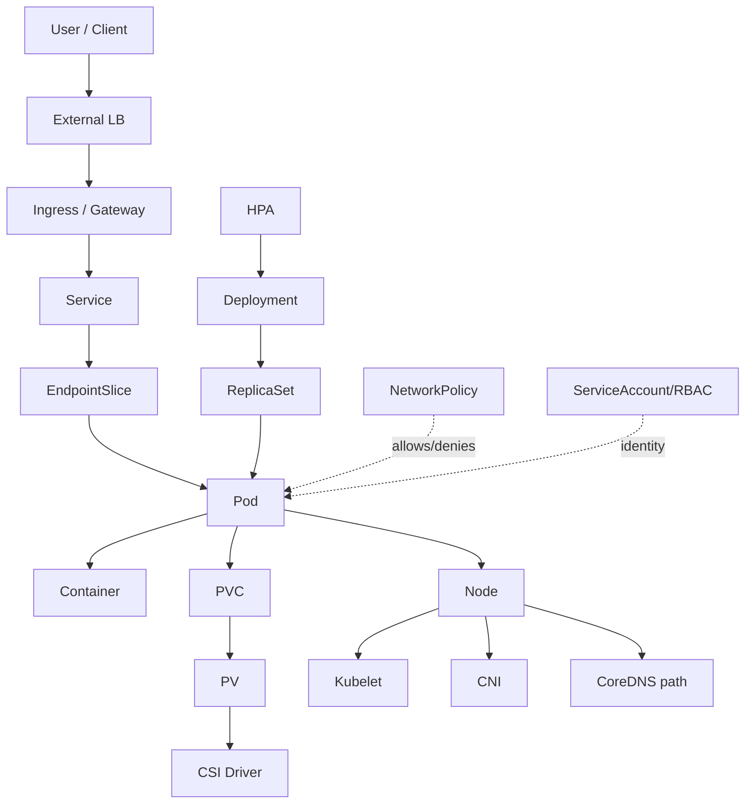
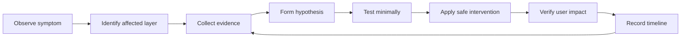
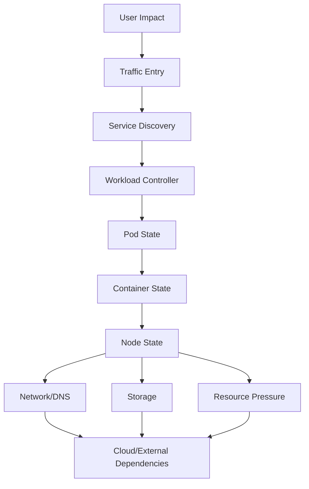
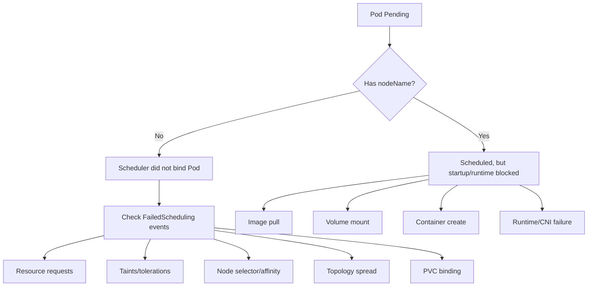
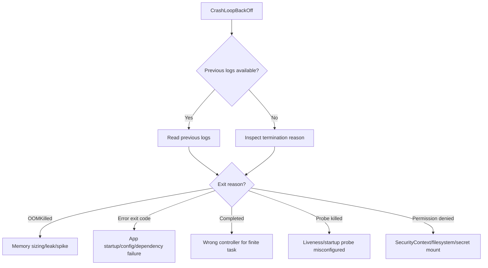
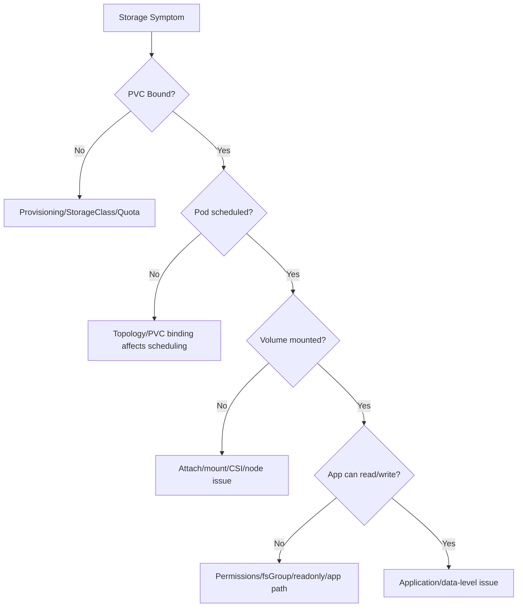

------
title: Learn Kubernetes, Deployment Model, and Cloud Native Platform Engineering - Part 027
description: Production debugging for Kubernetes systems, including a systematic triage method across Pods, Nodes, Services, DNS, networking, storage, resources, rollout state, events, logs, ephemeral containers, and incident evidence collection.
series: learn-kubernetes-deployment-model
seriesTitle: Learn Kubernetes, Deployment Model, and Cloud Native Platform Engineering
order: 27
partTitle: Production Debugging: Pods, Nodes, Network, DNS, Storage
tags:
- kubernetes
- debugging
- troubleshooting
- production
- pods
- nodes
- networking
- dns
- storage
- sre
date: 2026-07-01
------

# Part 027 — Production Debugging: Pods, Nodes, Network, DNS, Storage

## 1. Why This Part Exists

A top-tier Kubernetes engineer is not defined by how quickly they can write YAML.

They are defined by how quickly and safely they can answer this question during production pressure:

```text
What changed, where is the failure, what is the blast radius, and what is the safest next action?
```

Kubernetes gives you many moving parts:

- API server
- admission controllers
- scheduler
- controller manager
- kubelet
- container runtime
- CNI
- CSI
- CoreDNS
- Services
- EndpointSlices
- Ingress or Gateway controllers
- autoscalers
- policy engines
- mesh sidecars
- application containers

Because the system is distributed, a symptom rarely tells you the root cause directly.

A `CrashLoopBackOff` is not a root cause.

A `Pending` Pod is not a root cause.

A `503` from an Ingress is not a root cause.

A `Forbidden` error is not a root cause.

A missing endpoint is not always a networking problem.

Production debugging is the skill of turning symptoms into evidence, evidence into hypotheses, and hypotheses into safe interventions.

This part is deliberately practical. It teaches a repeatable debugging method that works across Kubernetes clusters, cloud providers, ingress controllers, service meshes, CSI drivers, and workload types.

---

## 2. Kaufman Skill Target

Based on *The First 20 Hours*, the target is not to memorize every possible failure.

The target is to acquire enough structure to self-correct under ambiguity.

After this part, you should be able to:

1. Triage a Kubernetes incident without randomly changing manifests.
2. Map symptoms to Kubernetes layers.
3. Read object state from `spec`, `status`, conditions, events, and logs.
4. Debug `Pending`, `CrashLoopBackOff`, `ImagePullBackOff`, `Running but not Ready`, `Service has no endpoints`, DNS failures, network blocks, and storage mount failures.
5. Distinguish workload failure from platform failure.
6. Use `kubectl debug` and ephemeral containers safely.
7. Produce an incident evidence timeline.
8. Decide when to rollback, scale, drain, patch, restart, or escalate.

The first 20 hours should be spent mostly on the debugging loop, not on memorizing commands.

---

## 3. The Core Mental Model

Kubernetes debugging has one invariant:

```text
Never debug a Kubernetes symptom at only one layer.
```

A Kubernetes workload is an object graph.



When a user reports failure, you must locate the broken edge in the graph.

Examples:

| Symptom | Possible Broken Edge |
|---|---|
| HTTP 503 from ingress | Ingress -> Service, Service -> EndpointSlice, readiness, backend crash, Gateway route attachment |
| Pod stuck `Pending` | Pod -> Node scheduling, resource requests, affinity, taints, PVC binding |
| Pod `Running` but not receiving traffic | Pod readiness -> EndpointSlice, Service selector mismatch, NetworkPolicy, mesh sidecar readiness |
| DNS timeout | Pod -> CoreDNS, NetworkPolicy egress, node DNS config, CoreDNS overload |
| PVC stuck `Pending` | PVC -> StorageClass, provisioner, topology, quota, unavailable zone |
| App slow | CPU throttling, memory pressure, dependency latency, node pressure, autoscaling lag |

The object graph is the debugging map.

---

## 4. Debugging Is a Control Loop

Do not debug by jumping directly to a fix.

Debug like Kubernetes itself: observe, compare, act, verify.



A weak debugging loop looks like this:

```text
Symptom -> random restart -> maybe works -> unknown cause -> repeats later
```

A strong debugging loop looks like this:

```text
Symptom -> layer map -> evidence -> hypothesis -> minimal test -> safe action -> verified recovery -> post-incident hardening
```

The difference is not speed.

The difference is whether the organization learns.

---

## 5. First 10 Minutes of Production Triage

When the incident starts, do not begin with a deep dive.

First, answer four questions:

```text
1. Who is affected?
2. What changed recently?
3. Which Kubernetes object graph owns the traffic path?
4. Is the system getting better, worse, or stable?
```

### 5.1 Minimal Triage Commands

```bash
# Identify namespace and workload
kubectl get deploy,sts,ds,job,cronjob -n <namespace>

# Get high-level Pod health
kubectl get pods -n <namespace> -o wide

# Inspect rollout state
kubectl rollout status deployment/<name> -n <namespace>
kubectl rollout history deployment/<name> -n <namespace>

# Inspect workload details
kubectl describe deployment/<name> -n <namespace>
kubectl describe pod/<pod> -n <namespace>

# Check recent events
kubectl get events -n <namespace> --sort-by=.lastTimestamp

# Check services and endpoints
kubectl get svc,endpointslice -n <namespace>

# Check logs
kubectl logs deployment/<name> -n <namespace> --all-containers --tail=200

# Check previous crashed container logs
kubectl logs pod/<pod> -n <namespace> -c <container> --previous --tail=200
```

### 5.2 What You Are Looking For

| Evidence | Why It Matters |
|---|---|
| `RESTARTS` increasing | Runtime failure, probe failure, OOM, crash |
| `READY 0/1` | Pod exists but is not serving traffic |
| `Pending` | Scheduler, resources, taints, affinity, PVC |
| `ImagePullBackOff` | Registry, credentials, tag/digest, image not found |
| `OOMKilled` | Memory limit too low, leak, spike, wrong sizing |
| `FailedScheduling` event | Scheduler explains why no node was selected |
| Empty EndpointSlice | Service has no ready matching Pod |
| Rollout stuck | Deployment progress deadline, readiness, resource, image, admission |
| Node pressure | Platform capacity or noisy neighbor |

Do not treat `kubectl get pods` as the full truth. It is only a summary.

The real evidence is in:

- conditions
- events
- status fields
- container states
- controller status
- metrics
- logs
- recent changes

---

## 6. The Debugging Stack

A useful production debugging stack is ordered from user-visible symptom down to infrastructure.



Each layer has a different evidence source.

| Layer | Primary Evidence |
|---|---|
| User impact | SLI dashboards, error rate, latency, support signal |
| Traffic entry | Ingress/Gateway status, controller logs, LB health |
| Service discovery | Service, EndpointSlice, DNS lookup |
| Controller | Deployment/StatefulSet/DaemonSet/Job status |
| Pod | Pod phase, conditions, events |
| Container | state, lastState, exitCode, logs, probes |
| Node | node conditions, kubelet events, pressure signals |
| Network | NetworkPolicy, CNI logs, DNS behavior, connectivity tests |
| Storage | PVC/PV status, events, CSI logs, mount errors |
| Resource | metrics, throttling, OOM, eviction, quota |

---

## 7. Debugging `Pending` Pods

A `Pending` Pod means Kubernetes accepted the object, but it has not successfully become a running container.

There are two broad states:

```text
Pod exists but is not scheduled.
Pod is scheduled but containers are not running.
```

### 7.1 First Commands

```bash
kubectl get pod <pod> -n <namespace> -o wide
kubectl describe pod <pod> -n <namespace>
kubectl get events -n <namespace> --sort-by=.lastTimestamp
```

Look for these event reasons:

| Event Reason | Likely Cause |
|---|---|
| `FailedScheduling` | No node satisfies constraints |
| `Insufficient cpu` | Requests exceed available allocatable CPU |
| `Insufficient memory` | Requests exceed available allocatable memory |
| `node(s) had untolerated taint` | Missing toleration |
| `didn't match Pod's node affinity/selector` | Placement constraints too narrow |
| `pod has unbound immediate PersistentVolumeClaims` | PVC not bound before scheduling |
| `max node group size reached` | Cluster autoscaler cannot add capacity |

### 7.2 Scheduling Debugging Tree



### 7.3 Common Root Causes

#### Too-large requests

```yaml
resources:
  requests:
    cpu: "8"
    memory: "32Gi"
```

A Pod with huge requests may be unschedulable even if the cluster has enough total free capacity distributed across many nodes.

Kubernetes schedules a Pod to one node. It does not split a single Pod across nodes.

#### Taints without tolerations

Dedicated nodes often use taints:

```bash
kubectl describe node <node> | grep -i taints
```

If the Pod does not tolerate the taint, it will not schedule there.

#### Over-constrained affinity

Node affinity, pod anti-affinity, and topology constraints can combine into impossible placement.

Example bad pattern:

```text
Require zone A.
Require node pool GPU.
Require anti-affinity across hostname.
Require PVC bound in zone B.
```

No scheduler can satisfy contradictory constraints.

#### PVC topology mismatch

A PVC may bind to a volume in one zone while the Pod is constrained to another zone.

This is why `volumeBindingMode: WaitForFirstConsumer` is commonly important for topology-aware dynamic provisioning.

### 7.4 Safe Fixes

| Cause | Safer Fix |
|---|---|
| Requests too large | Reduce request based on observed usage, or add node capacity |
| Missing toleration | Add explicit toleration only for intended workload class |
| Bad node selector | Relax selector, use node affinity with clear labels |
| PVC pending | Fix StorageClass/provisioner/quota before recreating workload |
| Topology impossible | Remove contradictory constraints |

Do not simply delete and recreate Pods repeatedly. If the scheduler cannot place the Pod, recreation only creates new unschedulable Pods.

---

## 8. Debugging `ImagePullBackOff` and `ErrImagePull`

Image pull failures happen before application code runs.

### 8.1 Evidence

```bash
kubectl describe pod <pod> -n <namespace>
kubectl get secret -n <namespace>
kubectl get serviceaccount <sa> -n <namespace> -o yaml
```

Look at events:

```text
Failed to pull image
manifest unknown
unauthorized
no basic auth credentials
i/o timeout
x509: certificate signed by unknown authority
```

### 8.2 Failure Taxonomy

| Error Pattern | Meaning |
|---|---|
| `manifest unknown` | Tag/digest does not exist in registry |
| `unauthorized` | Missing or wrong imagePullSecret/workload identity |
| `no basic auth credentials` | Runtime cannot authenticate to registry |
| `x509` | Registry certificate trust issue |
| `i/o timeout` | Node cannot reach registry or DNS/proxy issue |
| `not found` | Repository path or registry hostname wrong |

### 8.3 Production Advice

Use immutable image references for production:

```yaml
image: registry.example.com/team/app@sha256:<digest>
```

Tags are convenient for humans.

Digests are safer for release evidence.

If an incident involves a bad image, the digest tells you exactly what binary content ran.

---

## 9. Debugging `CrashLoopBackOff`

`CrashLoopBackOff` means the container repeatedly starts and exits, and Kubernetes backs off restart attempts.

It does not tell you why.

### 9.1 First Commands

```bash
kubectl describe pod <pod> -n <namespace>
kubectl logs <pod> -n <namespace> -c <container> --previous --tail=200
kubectl get pod <pod> -n <namespace> -o jsonpath='{.status.containerStatuses[*]}'
```

### 9.2 Important Fields

Look for:

```yaml
state:
  waiting:
    reason: CrashLoopBackOff
lastState:
  terminated:
    reason: Error
    exitCode: 1
    startedAt: ...
    finishedAt: ...
restartCount: 12
```

### 9.3 CrashLoop Decision Tree



### 9.4 Common Root Causes

| Root Cause | Evidence |
|---|---|
| Bad config | Logs show missing env/config file; ConfigMap/Secret mismatch |
| Missing secret | Mount error, env var absent, app auth failure |
| OOMKilled | `lastState.terminated.reason=OOMKilled` |
| Bad command/args | Immediate exit, shell error, file not found |
| Dependency unavailable | DB/cache/API timeout during startup |
| Liveness probe too aggressive | Container killed while still starting |
| Wrong controller | Batch process exits successfully but Deployment restarts it |
| Read-only filesystem issue | App tries to write to root filesystem |

### 9.5 Exit Codes

| Exit Code | Typical Meaning |
|---:|---|
| 0 | Process completed successfully; wrong if managed by Deployment expecting long-running process |
| 1 | General application error |
| 2 | Shell/builtin misuse or application-specific error |
| 126 | Command found but not executable |
| 127 | Command not found |
| 137 | Killed, often SIGKILL/OOM |
| 143 | SIGTERM, often graceful termination path |

Exit codes are not universal truth, but they narrow the hypothesis.

### 9.6 Safe Fixes

| Cause | Fix |
|---|---|
| App exits after completing work | Use Job/CronJob instead of Deployment |
| OOMKilled | Increase memory limit, fix leak, reduce concurrency, tune JVM/runtime |
| Liveness kills during startup | Add `startupProbe`, relax liveness threshold |
| Config missing | Fix ConfigMap/Secret reference and rollout |
| Dependency required at startup | Add retry/backoff, avoid fatal boot dependency when possible |

---

## 10. Debugging `Running` but Not `Ready`

A Pod can be running and still not serve traffic.

This is usually correct.

`Running` means containers exist.

`Ready` means the Pod should receive traffic through Services.

### 10.1 First Commands

```bash
kubectl get pod <pod> -n <namespace>
kubectl describe pod <pod> -n <namespace>
kubectl get endpointslice -n <namespace> -l kubernetes.io/service-name=<service>
```

### 10.2 Common Causes

| Cause | Evidence |
|---|---|
| Readiness probe failing | Pod events show readiness failures |
| App listening on different port | Probe connection refused |
| Dependency check too strict | Readiness fails because DB/cache temporarily unavailable |
| Sidecar not ready | Multi-container Pod readiness blocked |
| Service selector mismatch | Pod ready but not in EndpointSlice |
| Port name mismatch | Service targetPort does not match Pod port name |

### 10.3 Probe Semantics

Use probes intentionally:

| Probe | Purpose | Bad Use |
|---|---|---|
| `startupProbe` | Protect slow startup from liveness kill | Using huge liveness delay instead |
| `livenessProbe` | Restart deadlocked process | Checking downstream dependency |
| `readinessProbe` | Remove unready Pod from traffic | Failing on optional dependency |

A common outage pattern:

```text
Database has short blip.
Readiness probe checks database strictly.
All Pods mark NotReady.
Service loses all endpoints.
Ingress returns 503.
Application could have degraded, but readiness removed all capacity.
```

Readiness should indicate whether the instance can serve useful traffic.

It should not blindly mirror every dependency state.

---

## 11. Debugging Service and EndpointSlice Failures

A Service is a stable virtual access point.

It does not guarantee backends exist.

### 11.1 First Commands

```bash
kubectl get svc <service> -n <namespace> -o yaml
kubectl get endpointslice -n <namespace> -l kubernetes.io/service-name=<service> -o yaml
kubectl get pods -n <namespace> --show-labels
```

### 11.2 Key Questions

```text
Does the Service selector match the intended Pods?
Are matching Pods Ready?
Does targetPort match containerPort or named port?
Are EndpointSlices created?
Are endpoints marked ready?
Is traffic blocked by NetworkPolicy or mesh policy?
```

### 11.3 Selector Debugging

Service selector:

```yaml
selector:
  app.kubernetes.io/name: payments
  app.kubernetes.io/component: api
```

Pod labels:

```yaml
labels:
  app.kubernetes.io/name: payment
  app.kubernetes.io/component: api
```

One missing `s` can remove all backends.

To test selector match:

```bash
kubectl get pods -n <namespace> -l app.kubernetes.io/name=payments,app.kubernetes.io/component=api
```

### 11.4 Service Failure Taxonomy

| Symptom | Likely Cause |
|---|---|
| Service exists, no EndpointSlices | Selector mismatch or no Pods |
| EndpointSlices exist, endpoints not ready | Readiness failure |
| Endpoints ready, connection refused | Wrong targetPort or app not listening |
| Endpoints ready, timeout | NetworkPolicy, CNI, app hang, node path |
| Works from same Pod, fails cross-namespace | NetworkPolicy or DNS naming |
| Works by Pod IP, fails by Service name | DNS or kube-proxy/data plane issue |

---

## 12. Debugging DNS

Kubernetes DNS enables workloads to discover Services by name.

DNS failures often look like application failures.

### 12.1 Test DNS from Inside the Cluster

Run a temporary debug Pod:

```bash
kubectl run dns-debug -n <namespace> --rm -it --restart=Never \
  --image=busybox:1.36 -- nslookup kubernetes.default
```

Test the service:

```bash
nslookup <service>.<namespace>.svc.cluster.local
wget -qO- http://<service>.<namespace>.svc.cluster.local:<port>/health
```

### 12.2 Inspect CoreDNS

```bash
kubectl get pods -n kube-system -l k8s-app=kube-dns
kubectl logs -n kube-system -l k8s-app=kube-dns --tail=200
kubectl get configmap coredns -n kube-system -o yaml
```

Label names vary by distro. Some clusters use different labels.

### 12.3 DNS Failure Taxonomy

| Symptom | Possible Cause |
|---|---|
| `NXDOMAIN` | Wrong service name/namespace, Service does not exist |
| Timeout | CoreDNS unreachable, NetworkPolicy egress block, CNI issue |
| Slow lookup | CoreDNS overload, upstream resolver latency, high search path expansion |
| Works by FQDN, fails by short name | Namespace/search path issue |
| Works in one namespace only | NetworkPolicy or namespace-specific DNS behavior |

### 12.4 DNS Search Path Trap

Inside namespace `payments`, resolving `orders` usually searches:

```text
orders.payments.svc.cluster.local
orders.svc.cluster.local
orders.cluster.local
...
```

If the real Service is in namespace `commerce`, use:

```text
orders.commerce.svc.cluster.local
```

Do not rely on short names across namespaces.

---

## 13. Debugging NetworkPolicy and Connectivity

NetworkPolicy failures are often silent.

A denied packet usually does not produce a clean Kubernetes event.

### 13.1 Important Mental Model

NetworkPolicy is additive.

Once a Pod is selected by an ingress or egress policy, only explicitly allowed traffic is permitted for that direction.

No matching allow rule means deny.

### 13.2 First Commands

```bash
kubectl get networkpolicy -n <namespace>
kubectl describe networkpolicy <policy> -n <namespace>
kubectl get pods -n <namespace> --show-labels
```

Connectivity test:

```bash
kubectl run net-debug -n <namespace> --rm -it --restart=Never \
  --image=nicolaka/netshoot -- bash
```

Inside the debug container:

```bash
curl -v http://<service>.<namespace>.svc.cluster.local:<port>
dig <service>.<namespace>.svc.cluster.local
nc -vz <host> <port>
```

### 13.3 Common NetworkPolicy Mistakes

| Mistake | Effect |
|---|---|
| Default-deny egress without DNS allow | Apps cannot resolve names |
| Label mismatch in `podSelector` | Policy does not select intended Pods |
| Namespace selector missing | Cross-namespace traffic blocked |
| Allows Pod port but not dependency port | App timeout |
| CNI does not enforce NetworkPolicy | Policy object exists but has no effect |
| Service mesh also has authz policy | NetworkPolicy permits but mesh denies |

### 13.4 DNS Allow Example

If you use default-deny egress, explicitly allow DNS to CoreDNS.

```yaml
apiVersion: networking.k8s.io/v1
kind: NetworkPolicy
metadata:
  name: allow-dns
spec:
  podSelector: {}
  policyTypes:
  - Egress
  egress:
  - to:
    - namespaceSelector:
        matchLabels:
          kubernetes.io/metadata.name: kube-system
    ports:
    - protocol: UDP
      port: 53
    - protocol: TCP
      port: 53
```

This is a baseline pattern, not a universal manifest. Your DNS labels may differ.

---

## 14. Debugging Ingress and Gateway Failures

Ingress/Gateway failures sit between external traffic and internal Service discovery.

### 14.1 Debugging Path

```text
Client -> DNS -> External LB -> Ingress/Gateway listener -> Route -> Service -> EndpointSlice -> Pod
```

### 14.2 Commands

```bash
kubectl get ingress -A
kubectl describe ingress <name> -n <namespace>

kubectl get gatewayclass,gateway,httproute -A
kubectl describe gateway <name> -n <namespace>
kubectl describe httproute <name> -n <namespace>

kubectl get svc,endpointslice -n <namespace>
```

Controller logs are critical:

```bash
kubectl logs -n <controller-namespace> deployment/<controller-deployment> --tail=200
```

### 14.3 Failure Taxonomy

| Symptom | Possible Cause |
|---|---|
| External DNS resolves wrong IP | DNS/LB provisioning issue |
| TLS handshake failure | Wrong certificate, SNI, secret, listener config |
| 404 | Host/path route does not match |
| 503 | Route matches but backend unavailable |
| 502 | Backend connection error, protocol mismatch |
| Works internally but not externally | Gateway/Ingress/LB/firewall issue |
| HTTPRoute not attached | ParentRef/namespace policy/listener mismatch |

### 14.4 Gateway API-Specific Checks

For Gateway API, inspect conditions.

```bash
kubectl get httproute <name> -n <namespace> -o yaml
kubectl get gateway <name> -n <namespace> -o yaml
```

Look for:

```yaml
status:
  parents:
  - conditions:
    - type: Accepted
    - type: ResolvedRefs
```

If a route is not accepted, the traffic path is broken before it reaches the Service.

---

## 15. Debugging Storage

Storage failures are often stateful, slow, and expensive to fix incorrectly.

Be careful.

Never delete a PVC during an incident unless you fully understand the reclaim policy, backup status, and workload data model.

### 15.1 Debugging PVC Pending

```bash
kubectl get pvc -n <namespace>
kubectl describe pvc <pvc> -n <namespace>
kubectl get storageclass
kubectl get pv
kubectl get events -n <namespace> --sort-by=.lastTimestamp
```

Possible causes:

| Symptom | Cause |
|---|---|
| PVC `Pending` | No default StorageClass, wrong StorageClass, provisioner failure, quota |
| Pod pending with unbound PVC | Immediate binding or provisioning failure |
| Volume zone conflict | PV exists in different topology zone than Pod |
| Mount timeout | CSI/node plugin failure, cloud attach issue |
| Permission denied | `fsGroup`, UID/GID, read-only volume, filesystem ownership |
| Multi-attach error | RWO volume attached to another node |

### 15.2 Attach/Mount Debugging

```bash
kubectl describe pod <pod> -n <namespace>
kubectl describe pvc <pvc> -n <namespace>
kubectl describe pv <pv>
kubectl get pods -n kube-system | grep -i csi
kubectl logs -n kube-system <csi-controller-or-node-pod> --tail=200
```

CSI component names vary by driver.

### 15.3 The Dangerous Shortcut

Bad incident reaction:

```text
PVC mount failed.
Delete PVC.
Recreate workload.
Data lost.
```

Better reaction:

```text
Identify whether failure is provisioning, attach, mount, permissions, or application data corruption.
Check reclaim policy.
Check snapshot/backup.
Check whether PV still exists.
Only mutate storage after evidence and owner approval.
```

### 15.4 Storage Debugging Tree



---

## 16. Debugging Node-Level Problems

Node problems can create many Pod symptoms at once.

### 16.1 First Commands

```bash
kubectl get nodes -o wide
kubectl describe node <node>
kubectl top node
kubectl get pods -A -o wide --field-selector spec.nodeName=<node>
```

Look for node conditions:

| Condition | Meaning |
|---|---|
| `Ready=False` | Node cannot run Pods reliably |
| `MemoryPressure=True` | Node memory pressure |
| `DiskPressure=True` | Node disk pressure |
| `PIDPressure=True` | Too many processes |
| `NetworkUnavailable=True` | Network not configured/available |

### 16.2 Node Event Patterns

| Event | Possible Meaning |
|---|---|
| Evicted Pods | Node pressure |
| FailedMount | CSI or volume path issue |
| ContainerGCFailed | Runtime garbage collection issue |
| ImageGCFailed | Disk pressure/image cleanup issue |
| NodeNotReady | kubelet/node/network problem |

### 16.3 Node Remediation Options

| Action | Use When | Risk |
|---|---|---|
| Cordon | Stop new Pods from scheduling | Existing Pods remain |
| Drain | Evict workloads for maintenance | May violate availability without PDB/capacity |
| Reboot | Node-level stuck condition | Disruptive |
| Replace node | Cloud/node image corruption | Requires capacity and automation |
| Scale node pool | Capacity pressure | Cost, placement shifts |

Commands:

```bash
kubectl cordon <node>
kubectl drain <node> --ignore-daemonsets --delete-emptydir-data
kubectl uncordon <node>
```

Do not drain blindly during a capacity incident. Draining reduces available capacity before the cluster is healthy.

---

## 17. Debugging Resource Pressure

Resource issues are not always visible as crashes.

They can appear as:

- latency spikes
- timeouts
- slow startup
- probe failures
- OOM kills
- evictions
- noisy-neighbor behavior
- autoscaling lag

### 17.1 CPU Throttling

A container can be under CPU limit throttling while not obviously failing.

Symptoms:

```text
Latency increases.
Readiness probes timeout.
Thread pools saturate.
Garbage collection takes longer.
Autoscaler sees average CPU too late.
```

Check metrics:

```bash
kubectl top pod -n <namespace>
kubectl top pod -n <namespace> --containers
```

For deeper analysis, use Prometheus/container runtime metrics if available.

### 17.2 Memory Pressure

Memory failures are more abrupt.

Evidence:

```bash
kubectl describe pod <pod> -n <namespace>
# Look for OOMKilled
```

Node pressure may evict lower QoS Pods before killing individual containers.

### 17.3 Resource Debugging Questions

```text
Are requests realistic?
Are limits too tight?
Did traffic increase?
Did deployment change runtime memory behavior?
Did autoscaling react?
Did node pressure affect unrelated workloads?
Is this workload in the right QoS class?
```

---

## 18. Debugging Rollout Incidents

Many incidents start with a deployment.

### 18.1 Commands

```bash
kubectl rollout status deployment/<name> -n <namespace>
kubectl rollout history deployment/<name> -n <namespace>
kubectl describe deployment/<name> -n <namespace>
kubectl get rs -n <namespace> -l app.kubernetes.io/name=<name>
kubectl get pods -n <namespace> --show-labels
```

### 18.2 Rollout Failure Modes

| Failure | Evidence |
|---|---|
| New Pods fail readiness | Deployment stuck, unavailable replicas |
| Image pull fails | New ReplicaSet Pods ImagePullBackOff |
| Bad config | New Pods CrashLoopBackOff |
| Capacity unavailable | New Pods Pending |
| `maxUnavailable` too high | Too much capacity removed |
| HPA conflict | Replica count changes during rollout |
| PDB too strict | Old Pods cannot be evicted |
| Dependency incompatible | New version errors under real traffic |

### 18.3 Rollback Decision

Rollback is usually safer when:

```text
The previous version is known good.
The failure is tied to a recent rollout.
The data/schema contract remains backward compatible.
The current version is causing user impact.
No irreversible migration has occurred.
```

Command:

```bash
kubectl rollout undo deployment/<name> -n <namespace>
```

Rollback is not magic.

It only changes workload version. It cannot undo data corruption, external side effects, or incompatible migrations.

---

## 19. Using Ephemeral Containers Safely

Ephemeral containers are useful when:

- the app image has no shell or tools
- `kubectl exec` is impossible
- the target container crashed too quickly
- you need network tools in the same Pod namespace

Command:

```bash
kubectl debug -it pod/<pod> -n <namespace> \
  --image=nicolaka/netshoot \
  --target=<container> -- bash
```

### 19.1 What Ephemeral Containers Are Good For

| Task | Example |
|---|---|
| Network testing | `curl`, `dig`, `nc`, `tcpdump` if permitted |
| File inspection | Check mounted config/secret paths |
| Process namespace inspection | If process namespace sharing is available |
| DNS testing | Validate resolver/search path |
| TLS testing | Verify certificate chain/SNI |

### 19.2 What They Are Not For

Do not use ephemeral containers to:

- hotfix production binaries
- modify application state casually
- bypass security controls
- run long-lived admin processes
- install untracked debugging agents

A debug container is evidence collection tooling, not a deployment mechanism.

---

## 20. Safe Production Debugging Rules

### 20.1 The Rule of Minimal Mutation

Prefer read-only actions first.

Order of safety:

```text
Observe -> query -> describe -> logs -> metrics -> temporary debug Pod -> ephemeral container -> scale/rollback -> patch -> drain/delete
```

Mutating actions should have a hypothesis and rollback path.

### 20.2 Dangerous Commands

| Command | Why Dangerous |
|---|---|
| `kubectl delete pvc` | Potential data loss |
| `kubectl delete namespace` | Massive destructive scope |
| `kubectl delete pod` | Can worsen capacity or hide evidence |
| `kubectl drain` | Can reduce capacity and trigger cascading failure |
| `kubectl scale --replicas=0` | Full outage if wrong workload |
| `kubectl apply -f random.yaml` | Unknown drift and ownership |
| `kubectl edit` | Unreviewed, hard-to-audit mutation |

### 20.3 Evidence Preservation

Before destructive action, capture:

```bash
kubectl get all -n <namespace> -o wide
kubectl get events -n <namespace> --sort-by=.lastTimestamp
kubectl describe pod <pod> -n <namespace>
kubectl logs <pod> -n <namespace> --all-containers --tail=500
kubectl get pod <pod> -n <namespace> -o yaml
```

For severe incidents, export objects:

```bash
kubectl get deploy,rs,pod,svc,endpointslice,ingress,gateway,httproute,pvc -n <namespace> -o yaml > incident-state.yaml
```

---

## 21. Debugging Playbooks by Symptom

### 21.1 `Pod Pending`

```text
1. describe Pod
2. inspect FailedScheduling events
3. check resource requests vs node allocatable
4. check taints/tolerations
5. check node selector/affinity/topology spread
6. check PVC binding
7. check cluster autoscaler events if available
8. fix constraints or capacity
```

### 21.2 `CrashLoopBackOff`

```text
1. get previous logs
2. inspect lastState.terminated
3. check exit code and reason
4. check config/secret mounts/env
5. check liveness/startup probes
6. check OOMKilled/resource metrics
7. compare with previous ReplicaSet version
8. rollback or patch
```

### 21.3 `Service Returns 503`

```text
1. identify ingress/gateway/backend service
2. inspect route conditions
3. inspect Service selector
4. inspect EndpointSlices
5. inspect Pod readiness
6. test from inside cluster
7. inspect NetworkPolicy/mesh policy
8. inspect ingress/gateway controller logs
```

### 21.4 `DNS Failure`

```text
1. test FQDN from debug Pod
2. test kubernetes.default
3. check CoreDNS Pods and logs
4. check NetworkPolicy egress to DNS
5. check node resolver behavior
6. check service existence and namespace
7. inspect DNS search path assumptions
```

### 21.5 `PVC Mount Failure`

```text
1. inspect Pod events
2. inspect PVC/PV status
3. inspect StorageClass
4. inspect CSI controller/node logs
5. check access mode and multi-attach
6. check topology/zone
7. check fsGroup/permissions
8. do not delete PVC without backup/reclaim review
```

### 21.6 `Latency Spike`

```text
1. check user-facing latency and error SLIs
2. correlate deployment timeline
3. check CPU/memory/network/storage metrics
4. check throttling and GC behavior
5. check dependency latency
6. check HPA state and scaling lag
7. inspect node pressure and noisy neighbors
8. reduce load, rollback, scale, or degrade gracefully
```

---

## 22. Incident Timeline Template

During debugging, write a timeline.

```text
Incident: <name>
Namespace: <namespace>
Workload: <workload>
Started: <timestamp>
Detected by: <alert/user/report>
User impact: <errors/latency/unavailable/data risk>

Timeline:
- HH:MM: Alert fired: <signal>
- HH:MM: Recent deployment detected: <version/digest>
- HH:MM: Pods in new ReplicaSet show CrashLoopBackOff
- HH:MM: Previous logs show missing env var PAYMENT_DB_URL
- HH:MM: Rolled back Deployment to revision 18
- HH:MM: Error rate returned to baseline

Evidence:
- kubectl rollout history: <summary>
- pod events: <summary>
- logs: <summary>
- metrics: <summary>

Root cause hypothesis:
- <hypothesis>

Confirmed root cause:
- <after validation>

Preventive actions:
- <tests/policy/alerts/runbook/platform guardrail>
```

The timeline turns debugging into organizational memory.

---

## 23. Anti-Patterns

### 23.1 Restart-Driven Debugging

```text
It failed.
Restart it.
It works.
Done.
```

This hides root cause and destroys evidence.

Restarts are acceptable as mitigation, but not as analysis.

### 23.2 Debugging Only the Pod

Many incidents are outside the Pod:

- bad Service selector
- missing EndpointSlice
- NetworkPolicy deny
- CoreDNS overload
- node pressure
- CSI mount problem
- Gateway route not accepted
- admission mutation

The Pod is only one object in the graph.

### 23.3 Treating Readiness as Health of the Entire Universe

Readiness is a traffic eligibility signal.

If readiness checks every dependency strictly, a dependency blip can remove all application capacity even when partial service could continue.

### 23.4 Deleting Stateful Objects During Pressure

Deleting Pods may be fine.

Deleting PVCs, PVs, and namespaces is fundamentally different.

Storage actions require data ownership, backup awareness, and reclaim policy understanding.

### 23.5 Ignoring Recent Change

Most incidents have a trigger:

- deployment
- config change
- secret rotation
- node upgrade
- policy change
- autoscaler event
- certificate renewal
- dependency deploy
- traffic spike

Always build the change timeline.

---

## 24. Production Debugging Rubric

| Level | Behavior |
|---|---|
| Beginner | Reads Pod status and restarts Pods |
| Intermediate | Uses describe/logs/events and can fix common workload failures |
| Senior | Maps Service/EndpointSlice/Node/DNS/Storage/NetworkPolicy relationships |
| Staff | Builds incident hypotheses, minimizes mutation, protects evidence, manages blast radius |
| Principal | Improves platform guardrails so whole classes of incidents cannot recur |

The goal is not to be the person who knows the most commands.

The goal is to be the person who finds the safest path from uncertainty to recovery.

---

## 25. Practice Labs

### Lab 1 — Pending Pod

Create a Pod with impossible nodeSelector.

Expected skill:

```text
Use describe/events to identify scheduler constraint failure.
Fix the selector or labels.
```

### Lab 2 — CrashLoopBackOff

Deploy an app with a missing required env var.

Expected skill:

```text
Use previous logs and container lastState to identify app startup failure.
Fix ConfigMap/Secret and rollout.
```

### Lab 3 — Empty EndpointSlice

Create a Service with selector typo.

Expected skill:

```text
Show that Pods are ready but not selected.
Fix selector/labels.
```

### Lab 4 — DNS Blocked by NetworkPolicy

Apply default-deny egress without DNS allow.

Expected skill:

```text
Test DNS from debug Pod.
Add explicit DNS egress rule.
```

### Lab 5 — PVC Permission Error

Run app as non-root writing to mounted volume without correct permissions.

Expected skill:

```text
Identify permission denied from logs.
Fix securityContext/fsGroup or storage ownership.
```

### Lab 6 — Rollout-Induced 503

Deploy version with failing readiness.

Expected skill:

```text
Trace Ingress -> Service -> EndpointSlice -> Pod readiness.
Rollback safely.
```

---

## 26. Field Checklist

Before applying a fix, answer:

```text
What is the user impact?
What changed recently?
Which object graph is affected?
What evidence supports the hypothesis?
Is this a workload, platform, network, storage, or dependency failure?
What is the safest reversible action?
What evidence should be preserved first?
How will recovery be verified?
What guardrail prevents recurrence?
```

If you cannot answer these, you are not ready for a destructive action.

---

## 27. Key Takeaways

1. Kubernetes debugging is object-graph debugging.
2. Symptoms are not root causes.
3. `describe`, events, conditions, status, logs, and metrics must be read together.
4. `Pending` means scheduling/startup path failure.
5. `CrashLoopBackOff` means repeated container exit, not the root cause.
6. `Running` does not mean ready for traffic.
7. Service failures often come from selectors, readiness, EndpointSlices, policy, or routes.
8. DNS and NetworkPolicy failures often masquerade as application failures.
9. Storage debugging requires extra caution because data loss is possible.
10. Production debugging should minimize mutation and preserve evidence.

---

## 28. References

- Kubernetes Documentation — Debug Running Pods: https://kubernetes.io/docs/tasks/debug/debug-application/debug-running-pod/
- Kubernetes Documentation — Debug Pods: https://kubernetes.io/docs/tasks/debug/debug-application/debug-pods/
- Kubernetes Documentation — Debug Services: https://kubernetes.io/docs/tasks/debug/debug-application/debug-service/
- Kubernetes Documentation — Debugging DNS Resolution: https://kubernetes.io/docs/tasks/administer-cluster/dns-debugging-resolution/
- Kubernetes Documentation — Ephemeral Containers: https://kubernetes.io/docs/concepts/workloads/pods/ephemeral-containers/
- Kubernetes Documentation — kubectl debug: https://kubernetes.io/docs/reference/kubectl/generated/kubectl_debug/
- Kubernetes Documentation — Pod Lifecycle: https://kubernetes.io/docs/concepts/workloads/pods/pod-lifecycle/
- Kubernetes Documentation — Services: https://kubernetes.io/docs/concepts/services-networking/service/
- Kubernetes Documentation — Network Policies: https://kubernetes.io/docs/concepts/services-networking/network-policies/
- Kubernetes Documentation — Persistent Volumes: https://kubernetes.io/docs/concepts/storage/persistent-volumes/
