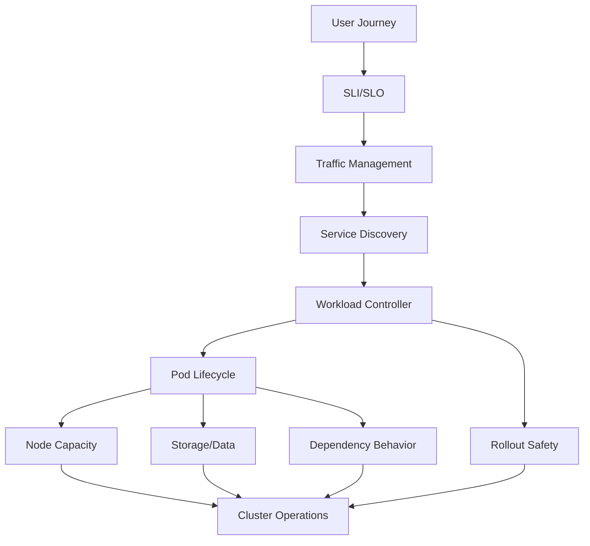
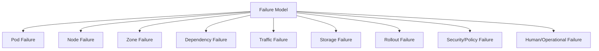
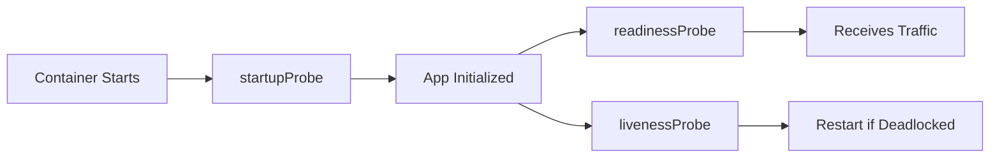
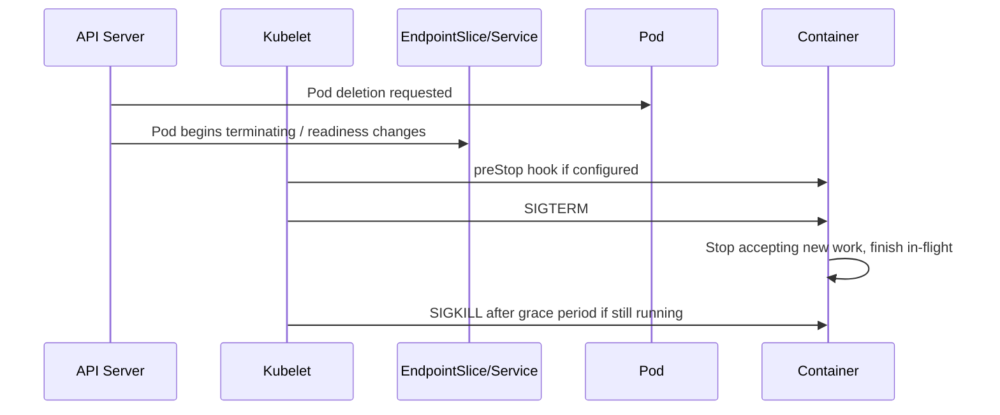
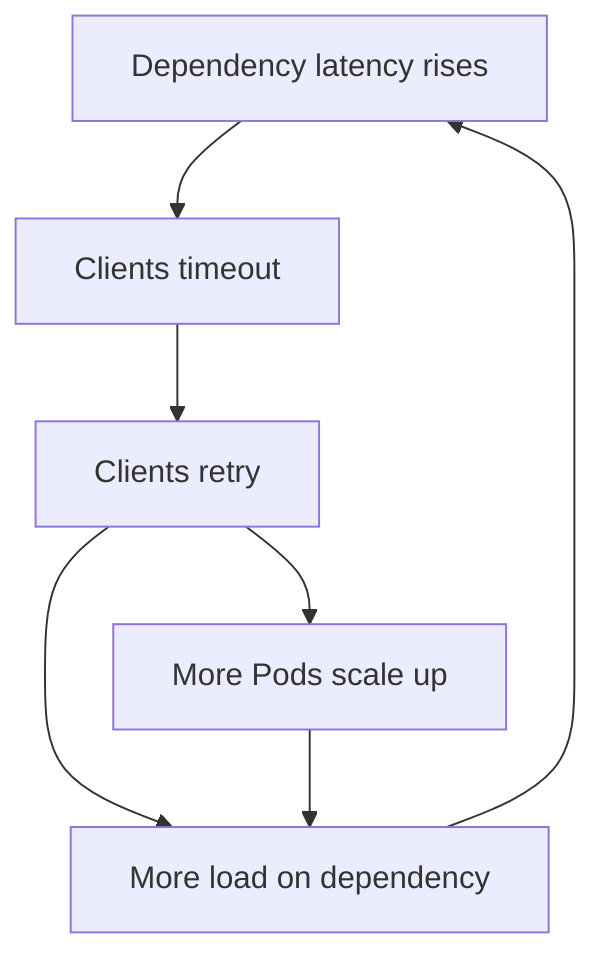

------
title: Learn Kubernetes, Deployment Model, and Cloud Native Platform Engineering - Part 028
description: Reliability engineering for Kubernetes platforms, including SLOs, SLIs, error budgets, availability thinking, probes, graceful shutdown, disruption budgets, rollout reliability, dependency failure, blast radius, resilience patterns, and failure modelling.
series: learn-kubernetes-deployment-model
seriesTitle: Learn Kubernetes, Deployment Model, and Cloud Native Platform Engineering
order: 28
partTitle: Reliability Engineering, SLOs, and Failure Modelling
tags:
- kubernetes
- reliability
- sre
- slo
- sli
- error-budget
- failure-modelling
- pod-disruption-budget
- rollout
- resilience
date: 2026-07-01
------

# Part 028 — Reliability Engineering, SLOs, and Failure Modelling

## 1. Why This Part Exists

Kubernetes can restart containers.

That does not make your system reliable.

Kubernetes can reschedule Pods.

That does not make your system available.

Kubernetes can roll out new versions.

That does not make deployment safe.

Kubernetes can autoscale replicas.

That does not guarantee latency, correctness, or user trust.

Reliability is not the absence of failure. In distributed systems, failure is normal.

Reliability is the ability to keep user-visible behavior within an acceptable boundary while parts of the system fail, change, overload, restart, move, or degrade.

This part connects Kubernetes primitives to reliability engineering:

- SLI
- SLO
- error budget
- blast radius
- graceful shutdown
- readiness and liveness
- disruption budget
- redundancy
- rollout safety
- dependency failure
- capacity margin
- failure modelling
- operational maturity

The goal is to stop thinking:

```text
Is the Pod running?
```

And start thinking:

```text
Is the user journey reliable under expected failure modes?
```

---

## 2. Kaufman Skill Target

The practical skill target is:

```text
Given a Kubernetes workload and deployment model, identify the reliability objective, map failure modes, choose Kubernetes controls, and design a safe operating envelope.
```

After this part, you should be able to:

1. Define meaningful SLIs and SLOs for Kubernetes workloads.
2. Connect error budgets to release and operations decisions.
3. Model failure at Pod, Node, Zone, dependency, rollout, and traffic layers.
4. Use probes without creating cascading outages.
5. Design graceful shutdown so Pod termination does not drop requests.
6. Use PodDisruptionBudget correctly and understand its limits.
7. Evaluate rollout strategy against user impact and rollback safety.
8. Reason about availability, redundancy, quorum, capacity, and blast radius.
9. Build reliability checklists for platform and application teams.

The aim is not academic SRE theory.

The aim is operational judgment.

---

## 3. Mental Model: Kubernetes Reliability Is Layered

A reliable Kubernetes application is not reliable because one object is configured well.

It is reliable because several layers cooperate.



A Deployment with three replicas can still be unreliable if:

- all replicas are on the same node
- readiness probes remove every Pod during a dependency blip
- liveness probes restart healthy-but-slow Pods
- shutdown drops in-flight requests
- rollout introduces incompatible schema changes
- HPA reacts too late
- PDB blocks node maintenance or allows too much disruption
- dependency timeouts exceed request deadlines
- retries amplify overload
- logs exist but no user-facing SLI exists

Reliability emerges from system design, not from replica count alone.

---

## 4. From Pod Health to User Reliability

Kubernetes has object health.

Users experience journey health.

These are not the same.

| Kubernetes Signal | What It Tells You | What It Does Not Tell You |
|---|---|---|
| Pod `Running` | Container process exists | App is useful to users |
| Pod `Ready` | Pod is eligible for traffic | User journey succeeds end-to-end |
| Deployment available replicas | Controller has minimum availability | Latency/error budget is healthy |
| HPA scaled replicas | Metric crossed threshold | Capacity is enough for SLO |
| Node `Ready` | Node can run Pods | Workload is correctly distributed |
| PDB healthy | Voluntary disruption is bounded | Involuntary failures are handled |

Reliability must be measured at the boundary users care about.

For a payment API, the SLI is not:

```text
Number of running Pods.
```

It is closer to:

```text
Percentage of valid payment authorization requests completed successfully within 500 ms.
```

---

## 5. SLI, SLO, and Error Budget

### 5.1 Definitions

| Term | Meaning |
|---|---|
| SLI | Service Level Indicator: measured signal of service behavior |
| SLO | Service Level Objective: target value for an SLI over a window |
| Error budget | Allowed unreliability before the SLO is violated |
| SLA | External contractual promise, often with business/legal consequences |

### 5.2 Example

```text
SLI:
  successful HTTP requests under 300 ms / all valid HTTP requests

SLO:
  99.9% over 30 rolling days

Error budget:
  0.1% of valid requests may fail or exceed latency threshold
```

### 5.3 Why Error Budget Matters

Without an error budget, teams argue emotionally:

```text
Can we deploy faster?
Is this system reliable enough?
Should we stop feature work?
Was the incident bad?
```

With an error budget, the decision becomes grounded:

```text
If we are burning budget too fast, reduce release risk and prioritize reliability.
If budget is healthy, controlled risk is acceptable.
```

Kubernetes does not create the error budget.

Kubernetes gives you mechanisms to protect it.

---

## 6. Good SLIs for Kubernetes Workloads

Choose SLIs close to user outcomes.

### 6.1 HTTP API

| SLI | Notes |
|---|---|
| Availability rate | Successful valid requests / total valid requests |
| Latency percentile | Usually p95 or p99, not average |
| Error rate | 5xx, selected 4xx, dependency-mapped errors |
| Saturation | CPU, memory, queue depth, connection pool, worker utilization |

### 6.2 Async Worker

| SLI | Notes |
|---|---|
| Queue lag | Age of oldest unprocessed message |
| Processing success rate | Successful jobs / attempted jobs |
| Retry rate | High retry may indicate hidden failure |
| Dead-letter rate | Data loss or manual repair indicator |
| End-to-end processing time | User/business outcome delay |

### 6.3 Batch Job

| SLI | Notes |
|---|---|
| Completion success | Job finishes successfully |
| Completion time | Meets expected window |
| Correctness | Output count/checksum/reconciliation |
| Retry exhaustion | Jobs that hit retry limit |

### 6.4 Stateful Service

| SLI | Notes |
|---|---|
| Read/write availability | Separate read and write paths |
| Replication lag | Data freshness |
| Commit latency | User-visible write performance |
| Quorum health | Minimum members for consistency |
| Backup freshness | Recovery guarantee |

---

## 7. Availability Math Without Illusions

Availability percentage feels abstract.

Translate it into downtime budget.

Approximate monthly downtime:

| SLO | Monthly Error Budget |
|---:|---:|
| 99% | ~7h 18m |
| 99.5% | ~3h 39m |
| 99.9% | ~43m 49s |
| 99.95% | ~21m 54s |
| 99.99% | ~4m 23s |

The trap is assuming Kubernetes makes high availability cheap.

A 99.99% user-facing SLO requires:

- fast detection
- safe rollout
- redundancy
- dependency reliability
- capacity margin
- tested rollback
- minimal manual recovery
- zone/provider failure strategy
- strong observability
- operational discipline

Replica count alone cannot buy four nines.

---

## 8. Failure Modelling Framework

For each workload, model failures by layer.



Use this table:

| Failure Mode | Detection | Impact | Existing Control | Missing Control | Recovery |
|---|---|---|---|---|---|
| Pod crash | Restart count, logs | Reduced capacity | Deployment replicas | Startup probe | Auto restart / rollback |
| Node lost | Node condition | Pods unavailable | Replica spread | Topology spread | Reschedule |
| Bad rollout | Error SLI, rollout status | User errors | Rolling update | Canary metric gate | Rollback |
| DNS failure | DNS SLI, CoreDNS metrics | Dependency discovery fails | CoreDNS replicas | DNS egress policy test | Fix CoreDNS/policy |
| DB latency | App latency SLI | Slow requests | Timeouts | Circuit breaker | Degrade/read-only |
| PVC mount failure | Pod events | Stateful Pod unavailable | CSI | Runbook/snapshot | Remount/failover |

The purpose is not to predict everything.

The purpose is to discover the most dangerous unhandled failures before production does.

---

## 9. Kubernetes Primitives as Reliability Controls

Kubernetes features are reliability controls only when mapped to a failure mode.

| Primitive | Reliability Use | Does Not Solve |
|---|---|---|
| Deployment | Maintains stateless replicas and rollout | Bad code, bad dependency, bad schema |
| StatefulSet | Stable identity/storage | Data correctness, quorum design |
| Readiness probe | Removes unready Pods from Service | Dependency architecture |
| Liveness probe | Restarts deadlocked processes | Startup slowness, downstream outage |
| Startup probe | Protects slow startup | Runtime deadlock after startup |
| PDB | Limits voluntary disruption | Involuntary node failure |
| HPA | Adds/removes replicas | Bad metric, cold start, dependency bottleneck |
| Topology spread | Reduces correlated node/zone failure | App-level quorum/capacity math |
| Resource requests | Enables scheduling/capacity planning | Runtime leaks or overload alone |
| Limits | Bounds noisy behavior | CPU throttling risk |
| PriorityClass | Protects critical workloads | Infinite capacity |
| NetworkPolicy | Reduces network blast radius | App authz, mesh policy, DNS correctness |
| Rollback | Restores previous template | Data corruption or incompatible migration |

---

## 10. Probe Design for Reliability

Probes are one of the most powerful and most dangerous reliability tools in Kubernetes.

### 10.1 Correct Probe Roles



| Probe | Reliability Meaning |
|---|---|
| Startup | “Do not judge liveness until boot is complete.” |
| Readiness | “Should this instance receive traffic now?” |
| Liveness | “Is this process unrecoverably broken and should be restarted?” |

### 10.2 Bad Probe Patterns

#### Liveness checks a dependency

Bad:

```text
If database is slow, liveness fails.
Kubelet restarts all API Pods.
Startup storms increase database load.
Outage worsens.
```

A liveness probe should usually check local process health, not downstream dependency health.

#### Readiness removes all replicas simultaneously

Bad:

```text
All Pods depend on same downstream service.
Downstream service has 10-second blip.
All Pods fail readiness.
Service has zero endpoints.
Ingress returns 503.
```

Readiness must be designed with degradation semantics.

#### Probe timeouts too low

A strict timeout during CPU throttling or GC pauses can trigger false failure.

### 10.3 Probe Configuration Example

```yaml
startupProbe:
  httpGet:
    path: /health/startup
    port: http
  failureThreshold: 30
  periodSeconds: 2

readinessProbe:
  httpGet:
    path: /health/ready
    port: http
  periodSeconds: 5
  timeoutSeconds: 2
  failureThreshold: 3

livenessProbe:
  httpGet:
    path: /health/live
    port: http
  periodSeconds: 10
  timeoutSeconds: 2
  failureThreshold: 3
```

This is not a universal template.

The thresholds must reflect real startup time, request latency, runtime pauses, and dependency behavior.

---

## 11. Graceful Shutdown and Request Draining

Pod termination is a reliability event.

If termination is not designed, rolling update, node drain, autoscaling, and eviction can drop requests.

### 11.1 Termination Flow



The exact behavior depends on application, kubelet, endpoints, and traffic infrastructure, but the design goal is simple:

```text
Stop new traffic before killing existing work.
```

### 11.2 Application Requirements

A reliable application should:

- handle SIGTERM
- stop accepting new requests
- fail readiness quickly on shutdown
- finish in-flight requests within grace period
- close connections cleanly
- commit or rollback work safely
- avoid starting new long-running tasks after termination begins

### 11.3 Kubernetes Configuration

```yaml
terminationGracePeriodSeconds: 60
lifecycle:
  preStop:
    exec:
      command: ["/bin/sh", "-c", "sleep 10"]
```

A `sleep` preStop can give load balancers time to stop routing, but it is not enough by itself.

The application should participate in draining.

### 11.4 Common Failure

```text
Deployment rollout starts.
Old Pod receives SIGTERM.
App exits immediately.
External LB still has connection.
User request drops.
Rollout looks healthy, but users see intermittent failures.
```

This is why graceful shutdown must be tested, not assumed.

---

## 12. PodDisruptionBudget

A PodDisruptionBudget limits voluntary disruption for a set of Pods.

It helps during:

- node drain
- cluster maintenance
- autoscaler scale-down
- upgrade operations
- administrator-initiated eviction

It does not prevent:

- node hardware failure
- kernel crash
- cloud zone outage
- process crash
- OOM kill
- forced deletion

### 12.1 Example

```yaml
apiVersion: policy/v1
kind: PodDisruptionBudget
metadata:
  name: payments-api
spec:
  minAvailable: 2
  selector:
    matchLabels:
      app.kubernetes.io/name: payments-api
```

For three replicas, `minAvailable: 2` allows one voluntary disruption at a time.

### 12.2 PDB Design Rules

| Workload | Possible PDB |
|---|---|
| Stateless API, 3 replicas | `minAvailable: 2` |
| Stateless API, 10 replicas | `maxUnavailable: 10%` or `minAvailable: 90%` |
| Singleton | Usually no meaningful PDB; fix architecture |
| Quorum system, 5 members | Keep quorum available, usually at least 3 |
| DaemonSet | PDB semantics may not match operational needs |

### 12.3 PDB Anti-Patterns

#### `minAvailable: 100%`

This can block node drains and upgrades indefinitely.

Use only when you fully understand the operational cost.

#### PDB selector matches wrong Pods

A selector bug can protect nothing or block too much.

#### PDB without spare capacity

If the cluster has no spare capacity, a PDB can prevent maintenance from completing.

Reliability requires both policy and capacity.

---

## 13. Replica, Topology, and Blast Radius

Three replicas do not guarantee high availability if they all run on the same node.

### 13.1 Bad Placement

```text
Node A:
  payments-api-1
  payments-api-2
  payments-api-3
```

Node A failure removes all replicas.

### 13.2 Better Placement

```text
Node A:
  payments-api-1
Node B:
  payments-api-2
Node C:
  payments-api-3
```

Use topology spread constraints or anti-affinity to reduce correlated failure.

### 13.3 Zone-Aware Placement

For regional clusters:

```text
Zone A: 2 replicas
Zone B: 2 replicas
Zone C: 2 replicas
```

But zone-aware placement must account for capacity.

If Zone A fails, remaining zones must absorb traffic.

### 13.4 The N+1 Capacity Rule

A service is not resilient to a node/zone failure unless remaining capacity can handle the load.

```text
Availability = replicas + placement + capacity + dependency survival
```

---

## 14. Rollout Reliability

Every deployment is a controlled failure injection.

It replaces working code with new code under live traffic.

### 14.1 Native Rolling Update Controls

Deployment rolling update knobs:

```yaml
strategy:
  type: RollingUpdate
  rollingUpdate:
    maxSurge: 1
    maxUnavailable: 0
```

Interpretation:

| Field | Meaning |
|---|---|
| `maxSurge` | Extra Pods above desired replicas during rollout |
| `maxUnavailable` | How many desired replicas may be unavailable |

`maxUnavailable: 0` protects capacity, but requires surge capacity.

### 14.2 Rollout Risk Dimensions

| Risk | Example |
|---|---|
| Code risk | New bug causes 500s |
| Config risk | Missing env var crashes Pods |
| Schema risk | New version writes incompatible data |
| Dependency risk | New version calls dependency differently |
| Capacity risk | New version uses more CPU/memory |
| Startup risk | Cold start too slow for rollout deadline |
| Traffic risk | Canary receives unrepresentative traffic |
| Rollback risk | Old version cannot read new data |

### 14.3 Rollout Safety Ladder

```text
Unit/integration tests
-> container build verification
-> admission policy
-> staging environment
-> one replica smoke
-> canary traffic
-> metric gate
-> gradual promotion
-> rollback automation
```

Kubernetes Deployment handles only part of this ladder.

Progressive delivery tools and platform process fill the rest.

---

## 15. Dependency Failure and Graceful Degradation

Most user-visible incidents are not pure Kubernetes failures.

They happen at boundaries:

- database
- cache
- queue
- object storage
- identity provider
- payment provider
- DNS
- third-party API
- internal service

### 15.1 Dependency Control Toolkit

| Control | Purpose |
|---|---|
| Timeout | Bound waiting time |
| Retry with backoff | Recover from transient errors |
| Circuit breaker | Stop amplifying overload |
| Bulkhead | Isolate resource pools |
| Fallback | Serve degraded response |
| Cache | Reduce dependency load |
| Queue | Decouple request path from processing |
| Rate limit | Protect downstream service |
| Load shedding | Preserve core traffic under overload |

### 15.2 Retry Storm Pattern



Autoscaling can worsen dependency overload if the bottleneck is downstream.

Scaling clients is not always the answer.

### 15.3 Degradation Example

For a product catalog:

```text
If recommendation service fails:
  Serve product page without recommendations.

If review service fails:
  Serve cached rating or hide review section.

If payment authorization fails:
  Do not fake success; fail safely.
```

Reliability is not always “return success.”

Sometimes reliability means failing clearly, safely, and recoverably.

---

## 16. Stateful Reliability

Stateful workloads require different reliability thinking.

A stateless API can often be rolled back or replaced.

A database cannot be treated as disposable.

### 16.1 Stateful Failure Questions

```text
What is the quorum requirement?
What is the replica placement model?
What is the backup frequency?
What is the restore time objective?
What is the restore point objective?
Can old and new versions read the same data?
What happens during node drain?
What happens during zone failure?
Can the system tolerate split brain?
```

### 16.2 RPO and RTO

| Term | Meaning |
|---|---|
| RPO | Recovery Point Objective: acceptable data loss window |
| RTO | Recovery Time Objective: acceptable recovery duration |

Example:

```text
RPO: 5 minutes
RTO: 30 minutes
```

This means the system may lose up to 5 minutes of data and must recover within 30 minutes.

If you do not test restore, you do not have a backup strategy.

You have a backup hope.

### 16.3 Quorum and PDB

For a 5-member quorum system, losing 2 may still preserve quorum.

But planned disruption should avoid dropping below quorum.

A PDB can help with voluntary disruptions, but it cannot save the system from correlated node/zone failure if placement is wrong.

---

## 17. Capacity Reliability

Capacity is a reliability feature.

### 17.1 Capacity Failure Modes

| Failure | Description |
|---|---|
| No scheduling headroom | New Pods cannot start during rollout/failure |
| CPU throttling | Latency increases while Pods appear healthy |
| Memory pressure | OOM kills and evictions occur |
| Disk pressure | Node becomes unhealthy, image pulls fail |
| Connection pool saturation | App threads wait despite CPU being low |
| Queue backlog | Async system misses processing SLO |
| Autoscaling lag | Replicas arrive after user impact |
| Cold start | New replicas not useful quickly enough |

### 17.2 Headroom Questions

```text
Can we lose one node and still serve traffic?
Can we lose one zone and still serve priority traffic?
Can we roll out with maxSurge without Pending Pods?
Can HPA scale before saturation?
Can dependencies handle scaled clients?
```

### 17.3 Requests and Limits

Resource requests define scheduling assumptions.

If requests are too low, the scheduler overpacks nodes and runtime pressure appears later.

If requests are too high, utilization is poor and Pods may remain Pending.

Reliability needs realistic requests based on observed behavior, not arbitrary defaults.

---

## 18. Reliability of Cluster Operations

Cluster operations are reliability events:

- node drain
- node image upgrade
- Kubernetes version upgrade
- CNI upgrade
- CSI upgrade
- ingress controller upgrade
- certificate rotation
- policy rollout
- autoscaler configuration change

Treat platform changes like application deployments.

### 18.1 Operational Safety Checklist

```text
What workloads are affected?
Are PDBs configured correctly?
Is there enough spare capacity?
Are system components redundant?
Are add-on versions compatible?
Can we roll back?
Are alerts temporarily noisy or blind?
Is there a maintenance window or progressive rollout?
```

### 18.2 Node Drain Reliability

A node drain is safe only if:

- workloads have enough replicas
- PDB allows controlled eviction
- other nodes have capacity
- storage can detach/attach if needed
- topology constraints can be satisfied
- critical DaemonSets are healthy

Otherwise, a node drain can become an outage.

---

## 19. Failure Mode and Effects Analysis for Kubernetes

Use FMEA-style reasoning.

| Component | Failure Mode | Effect | Detection | Control |
|---|---|---|---|---|
| Pod | Crash loop | Reduced capacity | Restart count, SLI | Replicas, rollback, probes |
| Node | NotReady | Pod loss | Node condition | Spread, reschedule, capacity |
| Zone | Unavailable | Regional capacity loss | Cloud/K8s metrics | Multi-zone placement, spare capacity |
| Service | No endpoints | 503 | EndpointSlice alert | Readiness, selector tests |
| DNS | Resolution timeout | Dependency failure | DNS probe | CoreDNS scaling, NetworkPolicy allow |
| CSI | Mount failure | Stateful outage | Pod events | Storage runbook, snapshots |
| Rollout | Bad version | Errors/latency | SLI burn | Canary, rollback, schema discipline |
| HPA | Scales too late | Latency spike | Saturation | Better metrics, min replicas |
| NetworkPolicy | Blocks dependency | Timeouts | Synthetic test | Policy tests, staged rollout |
| Secret rotation | App auth failure | Errors | Auth metrics/logs | Rotation runbook, dual credentials |

The strongest engineers do this before incident review, not only after.

---

## 20. Reliability Design Patterns

### 20.1 Redundancy

Run multiple instances across failure domains.

But redundancy without capacity is weak.

### 20.2 Bulkheads

Separate resource pools so one failure does not consume everything.

Examples:

- separate Deployments for public API and internal batch workers
- separate node pools for critical workloads
- separate connection pools per dependency
- separate queues for high-priority traffic

### 20.3 Circuit Breakers

Stop calling a failing dependency temporarily.

Without circuit breakers, retries can amplify failure.

### 20.4 Load Shedding

Reject low-priority work to preserve core service.

Example:

```text
Drop recommendation enrichment before dropping checkout.
```

### 20.5 Backpressure

Make overload visible to callers instead of hiding it until collapse.

### 20.6 Idempotency

Critical for retries, Jobs, queue consumers, and rollout recovery.

### 20.7 Compatibility Windows

During rollout, old and new versions may run simultaneously.

APIs, events, and database schemas must support overlap.

---

## 21. Reliability Anti-Patterns

### 21.1 Replica Count as Religion

```text
We have 3 replicas, so we are highly available.
```

Not if all replicas share the same node, dependency, storage bottleneck, or bad release.

### 21.2 Liveness as a Hammer

Restarting a process is not always healing.

Sometimes it creates more load and loses evidence.

### 21.3 PDB as Decoration

A PDB with the wrong selector protects nothing.

A PDB with impossible constraints blocks operations.

### 21.4 Autoscaling as Reliability Strategy

Autoscaling is not instant and may scale the wrong bottleneck.

### 21.5 Ignoring Shutdown

If the app ignores SIGTERM, every rollout and node drain can drop traffic.

### 21.6 SLO Without Ownership

An SLO nobody reviews does not change behavior.

Error budgets must influence release and reliability decisions.

---

## 22. Reliability Review Template

Use this before promoting a workload to production.

```text
Workload: <name>
Owner: <team>
Criticality: <tier>
User journey: <journey>

SLI:
- Availability:
- Latency:
- Correctness:
- Freshness/lag:

SLO:
- Target:
- Window:
- Error budget:

Failure domains:
- Pod:
- Node:
- Zone:
- Dependency:
- Storage:
- Rollout:
- Policy/security:

Kubernetes controls:
- Replicas:
- Readiness:
- Liveness:
- Startup:
- Resources:
- HPA/VPA:
- PDB:
- Topology spread:
- NetworkPolicy:
- Rollout strategy:

Recovery:
- Rollback method:
- Data restore method:
- Escalation owner:
- Runbook:

Known risks:
- <risk>

Required before launch:
- <guardrail>
```

---

## 23. SLO-Driven Alerting

Alert on user impact and fast burn, not only infrastructure symptoms.

### 23.1 Weak Alerts

```text
Pod restarted once.
CPU > 80%.
Memory > 80%.
One node NotReady.
```

These may be useful signals, but they are not always pages.

### 23.2 Stronger Alerts

```text
Checkout availability SLO burn rate > threshold.
P99 latency exceeds SLO for 10 minutes.
Queue oldest message age exceeds processing SLO.
No ready endpoints for critical service.
Error budget burn indicates page-worthy impact.
```

A good alert says:

```text
Users are or soon will be affected, and human action is needed.
```

### 23.3 Platform Alerts

Platform alerts are still needed:

- API server unavailable
- CoreDNS failure
- ingress controller down
- CNI failure
- CSI failure
- node pool capacity exhausted
- certificate expiration
- admission webhook failure

But they should be tied to likely user or workload impact.

---

## 24. Reliability Maturity Rubric

| Level | Behavior |
|---|---|
| 1 — Reactive | Fixes incidents manually after users complain |
| 2 — Basic | Has replicas, probes, and dashboards |
| 3 — Managed | Defines SLOs, PDBs, rollout checks, and runbooks |
| 4 — Proactive | Uses error budgets, canaries, failure testing, capacity planning |
| 5 — Platformized | Provides golden paths, policy guardrails, automated rollback, and reliability scorecards |

Top engineers move systems from Level 2 to Level 4/5.

They do not merely add more YAML.

---

## 25. Practice Labs

### Lab 1 — Readiness Failure Blast Radius

Create three replicas where readiness checks a shared dependency.

Simulate dependency failure.

Observe whether all endpoints disappear.

Improve readiness semantics.

### Lab 2 — Graceful Shutdown

Deploy an HTTP server with long-running requests.

Roll out a new version.

Observe dropped requests.

Add SIGTERM handling, readiness drain, and termination grace period.

### Lab 3 — PDB and Node Drain

Create a Deployment with three replicas and a PDB `minAvailable: 2`.

Drain a node.

Observe controlled disruption.

Then test bad PDB settings.

### Lab 4 — Topology Spread

Force all replicas onto one node.

Simulate node loss.

Then add topology spread constraints and compare impact.

### Lab 5 — Bad Rollout and Rollback

Deploy a version that fails readiness.

Watch Deployment rollout status.

Rollback and verify SLO recovery.

### Lab 6 — Retry Storm

Create a service that calls a slow dependency with aggressive retries.

Increase dependency latency.

Observe client amplification.

Add timeout, backoff, and circuit breaker.

---

## 26. Production Checklist

Before declaring a Kubernetes workload production-ready:

```text
Does it have user-centered SLIs?
Does it have an SLO and owner?
Does it have realistic resource requests?
Does it have startup, readiness, and liveness probes with correct semantics?
Does it handle SIGTERM gracefully?
Does it have enough replicas for the failure model?
Are replicas spread across nodes/zones?
Does it have a PDB where appropriate?
Can it roll out without reducing capacity below safe levels?
Can it roll back safely?
Are dependencies protected by timeouts and backoff?
Is autoscaling based on the right signal?
Are dashboards and alerts tied to user impact?
Is storage backed up and restore tested?
Is the runbook tested?
```

If the answer to most of these is no, the workload is not production-grade.

It is merely deployed.

---

## 27. Key Takeaways

1. Kubernetes health is not the same as user reliability.
2. SLOs convert reliability from opinion into an operating constraint.
3. Error budgets should influence release speed and reliability investment.
4. Probes can improve reliability or create outages depending on semantics.
5. Graceful shutdown is mandatory for safe rollout, drain, and scale-down.
6. PDBs protect against voluntary disruptions, not all failures.
7. Replica count only matters when combined with placement and capacity.
8. Autoscaling is useful but cannot fix every bottleneck.
9. Stateful reliability requires backup, restore, quorum, RPO, and RTO thinking.
10. Failure modelling is the bridge between Kubernetes primitives and production resilience.

---

## 28. References

- Kubernetes Documentation — Liveness, Readiness, and Startup Probes: https://kubernetes.io/docs/concepts/configuration/liveness-readiness-startup-probes/
- Kubernetes Documentation — Configure Liveness, Readiness and Startup Probes: https://kubernetes.io/docs/tasks/configure-pod-container/configure-liveness-readiness-startup-probes/
- Kubernetes Documentation — Pod Lifecycle: https://kubernetes.io/docs/concepts/workloads/pods/pod-lifecycle/
- Kubernetes Documentation — Container Lifecycle Hooks: https://kubernetes.io/docs/concepts/containers/container-lifecycle-hooks/
- Kubernetes Documentation — Disruptions: https://kubernetes.io/docs/concepts/workloads/pods/disruptions/
- Kubernetes Documentation — Specifying a Disruption Budget for your Application: https://kubernetes.io/docs/tasks/run-application/configure-pdb/
- Kubernetes Documentation — PodDisruptionBudget API: https://kubernetes.io/docs/reference/kubernetes-api/policy/pod-disruption-budget-v1/
- Kubernetes Documentation — Safely Drain a Node: https://kubernetes.io/docs/tasks/administer-cluster/safely-drain-node/
- Kubernetes Documentation — Deployments: https://kubernetes.io/docs/concepts/workloads/controllers/deployment/
- Kubernetes Documentation — Resource Management for Pods and Containers: https://kubernetes.io/docs/concepts/configuration/manage-resources-containers/
- Google SRE Book — Service Level Objectives: https://sre.google/sre-book/service-level-objectives/
- Google SRE Workbook — Alerting on SLOs: https://sre.google/workbook/alerting-on-slos/
