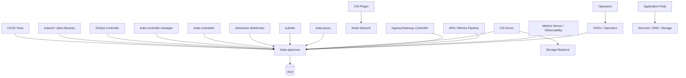
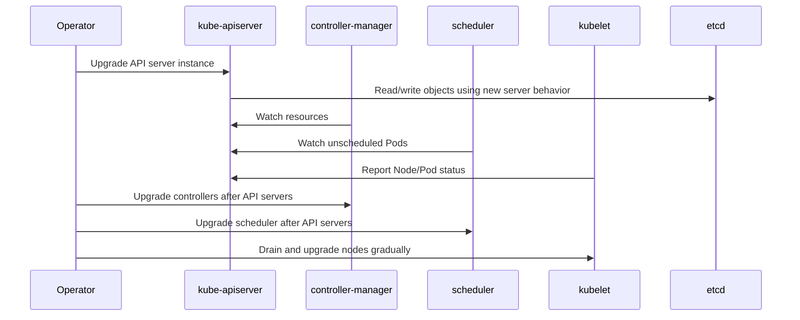
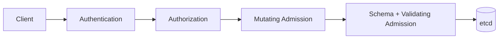
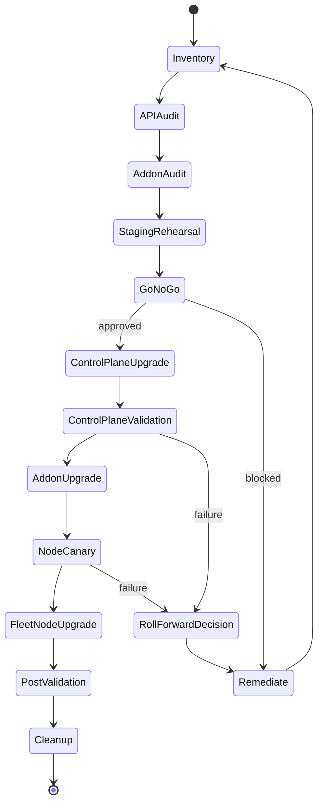

------
title: Learn Kubernetes, Deployment Model, and Cloud Native Platform Engineering - Part 029
description: Kubernetes upgrade engineering, version skew, API deprecation, compatibility management, control-plane upgrade sequencing, node upgrade strategy, add-on compatibility, preflight validation, rollback limits, and enterprise upgrade governance.
series: learn-kubernetes-deployment-model
seriesTitle: Learn Kubernetes, Deployment Model, and Cloud Native Platform Engineering
order: 29
partTitle: Kubernetes Upgrades, Version Skew, and Compatibility Management
tags:
- kubernetes
- upgrade
- version-skew
- compatibility
- deprecation
- api-migration
- control-plane
- node-upgrade
- operations
- sre
date: 2026-07-01
------

# Part 029 — Kubernetes Upgrades, Version Skew, and Compatibility Management

## 1. Why This Part Exists

A Kubernetes upgrade is not a package update.

It is a coordinated compatibility change across:

- API server behavior
- stored objects
- admission chain
- controllers
- scheduler
- kubelet
- kube-proxy or CNI data plane
- CSI drivers
- ingress or Gateway controllers
- autoscalers
- observability agents
- security policies
- CRDs and operators
- workload manifests
- client libraries
- CI/CD automation
- kubectl versions

The weak mental model is:

```text
Upgrade the cluster to the next version.
```

The production mental model is:

```text
Move a distributed control system through a bounded compatibility window while preserving workload availability, API compatibility, security posture, and rollback options.
```

This part teaches upgrades as an engineering discipline.

You should finish this part able to answer:

- What must be upgraded first?
- Which component may be newer or older?
- Which APIs will break?
- Which workloads depend on removed APIs?
- Which admission webhooks may fail against new API versions?
- Which add-ons are tied to Kubernetes minor versions?
- Which rollback paths are real and which are wishful thinking?
- How do we test the upgrade before touching production?
- How do we operate mixed-version clusters safely?
- How do we prevent upgrade debt from accumulating?

---

## 2. Kaufman Skill Target

The skill target for this part is:

```text
Given an existing Kubernetes cluster and target minor version, design and execute a safe upgrade plan that respects version-skew policy, identifies deprecated API usage, validates add-on compatibility, protects workloads during node rotation, and leaves auditable evidence of readiness and success.
```

This requires five sub-skills:

1. **Compatibility reading** — understand version-skew rules and component coupling.
2. **API migration analysis** — detect removed/deprecated APIs before upgrade.
3. **Operational sequencing** — upgrade control plane, nodes, add-ons, and clients in safe order.
4. **Workload protection** — use readiness, PDBs, topology, and drain discipline.
5. **Evidence-based go/no-go** — decide based on observed signals, not confidence.

---

## 3. Upgrade as a Compatibility Graph

A Kubernetes cluster is a graph of components that communicate through APIs.



An upgrade changes one or more edges in this graph.

For example:

- API server upgrade changes request validation, defaulting, discovery, API availability, warning behavior, feature gates, admission payloads, and storage version behavior.
- Kubelet upgrade changes node-level runtime behavior, Pod lifecycle edge cases, eviction behavior, and feature support.
- CNI upgrade changes traffic enforcement, NetworkPolicy support, service routing behavior, and sometimes kube-proxy replacement behavior.
- CSI upgrade changes volume provisioning, attach/detach, expansion, snapshot, topology, and failure semantics.
- CRD/operator upgrade changes custom resource schemas and reconciliation behavior.

The upgrade unit is not only `kubeadm upgrade apply` or a cloud-provider version selector. The real unit is:

```text
component + API contract + workload dependency + rollback boundary
```

---

## 4. Kubernetes Versioning Model

Kubernetes versions use the form:

```text
major.minor.patch
```

Example:

```text
1.36.2
```

Meaning:

| Segment | Meaning |
|---|---|
| `1` | Major version. Kubernetes has remained on major version 1 for a long time. |
| `36` | Minor version. Most compatibility and feature changes are discussed here. |
| `2` | Patch version. Bug fixes and security fixes within a minor line. |

For production operations, distinguish:

| Upgrade Type | Example | Risk Profile |
|---|---:|---|
| Patch upgrade | `1.36.1` to `1.36.2` | Usually lower risk, still must test. |
| Minor upgrade | `1.35.x` to `1.36.x` | Requires version-skew, API deprecation, add-on, and workload checks. |
| Skipped minor upgrade | `1.34.x` to `1.36.x` | Generally unsafe/unsupported for core Kubernetes control plane upgrade flow. Avoid. |
| Add-on upgrade | CNI, CSI, ingress, metrics, GitOps | Often as risky as cluster upgrade because it controls network/storage/traffic. |
| API migration | `v1beta1` to `v1` | Can break manifests, clients, CRDs, admission logic, dashboards, and automation. |

The dangerous mistake is treating all minor upgrades as equal. A minor upgrade with an API removal, admission behavior change, CNI constraint, or storage driver incompatibility can be materially riskier than the version number suggests.

---

## 5. Version-Skew Mental Model

Version skew is the allowed difference between Kubernetes component versions.

Why skew exists:

- HA control planes are upgraded one instance at a time.
- Nodes are upgraded gradually.
- kubelets may lag behind the control plane.
- kubectl/client tools may run from engineer machines or CI systems.
- add-ons often move on their own release cadence.

Why skew is dangerous:

- Newer clients may ask for fields older servers do not understand.
- Older clients may miss defaults or warnings from newer servers.
- Controllers may observe API behavior that differs from their assumptions.
- Nodes may not support features used by the control plane or Pod specs.
- Webhooks may reject new fields or new API versions.

A useful invariant:

```text
No component should assume it can use a feature until every component on the critical path understands it.
```

### 5.1 Core Skew Rules to Internalize

For modern Kubernetes clusters, the official skew policy can be summarized operationally as:

| Component | Operational Rule |
|---|---|
| `kube-apiserver` in HA cluster | Newest and oldest API server instances must be within one minor version. |
| `kubelet` | Must not be newer than `kube-apiserver`; may lag by a bounded number of minor versions. |
| `kube-proxy` | Must not be newer than `kube-apiserver`; has bounded skew relative to API server and local kubelet. |
| `kube-controller-manager` | Must not be newer than the API server it talks to; expected to match, may lag one minor during live upgrades. |
| `kube-scheduler` | Same pattern as controller manager. |
| `cloud-controller-manager` | Same pattern as controller manager. |
| `kubectl` | Supported within one minor version older or newer than `kube-apiserver`. |

Do not memorize this table as a replacement for checking the official policy for the exact target version. Treat it as a mental guardrail.

### 5.2 Practical Consequence

If upgrading from `1.35` to `1.36`, the sequence is roughly:

```text
1. Bring current 1.35 components to latest 1.35 patch.
2. Validate APIs, add-ons, webhooks, CRDs, and workloads.
3. Upgrade kube-apiserver instances within HA skew limit.
4. Upgrade controller-manager, scheduler, cloud-controller-manager.
5. Upgrade kubelets node by node, draining where required.
6. Upgrade kube-proxy / CNI / CSI / add-ons according to vendor compatibility.
7. Upgrade kubectl and CI/CD client versions.
8. Remove temporary compatibility flags, exceptions, and upgrade controls.
```

The exact command path depends on whether you use:

- kubeadm
- managed Kubernetes service
- Cluster API
- kOps
- Rancher
- OpenShift
- Talos
- custom bare-metal automation

But the compatibility shape remains the same.

---

## 6. Upgrade Order as Control-Plane Risk Management

A Kubernetes control plane is not a monolith.



The API server sits at the center. Many other components depend on it.

This means the API server upgrade is the compatibility pivot.

Before upgrading the API server, verify:

- etcd health and backups
- admission webhooks can tolerate new API versions and fields
- removed APIs are not used by stored manifests or clients
- clients can tolerate warning headers and server-side validation changes
- CRDs are structurally valid
- metrics/audit/logging are functioning
- at least one rollback or fail-forward strategy exists
- control-plane load balancer behavior is understood
- HA API servers can operate safely in mixed version mode during rollout

### 6.1 Mixed-Version Control Plane

During an HA upgrade, some API server instances may be old while others are new. That is normal within policy, but it has consequences:

- Discovery can differ between API server instances.
- New API resources/versions may not exist on every instance yet.
- Clients behind a load balancer may see inconsistent behavior if requests route to different versions.
- Admission webhooks may receive shapes they have not seen before.
- Controllers may watch resources while API availability changes underneath them.

Modern Kubernetes has features designed to make mixed-version API server operation safer, but this does not remove the need for upgrade discipline.

---

## 7. API Deprecation and Removal

Kubernetes is API-driven. Therefore, an upgrade is partly an API migration exercise.

The API lifecycle roughly looks like:

```text
alpha -> beta -> stable
```

But old versions can be deprecated and later removed.

The key production rule:

```text
A manifest that applies today can become invalid after a future upgrade if it uses an API version that is no longer served.
```

Examples of affected areas across Kubernetes history include:

- Ingress API version migrations
- PodDisruptionBudget API version migrations
- CronJob API version migrations
- Admission webhook API version migrations
- Flow control API version migrations
- Endpoint/EndpointSlice migration pressure
- CRD schema and validation changes

The exact removed APIs depend on target version. Never rely on memory. Always check the deprecation guide for the target minor version.

### 7.1 Three Kinds of API Risk

| Risk | Meaning | Example |
|---|---|---|
| Deprecated but served | API works but emits warnings and may be removed later. | A manifest still uses an old beta version. |
| Removed/not served | API request fails. | `kubectl apply` returns no matches for kind/version. |
| Semantically changed | API exists but field behavior/defaulting changed. | Field default or validation differs in stable API. |

The last one is often the most subtle.

Migration is not only replacing strings like:

```yaml
apiVersion: extensions/v1beta1
```

with:

```yaml
apiVersion: networking.k8s.io/v1
```

You must also validate field-level semantics.

---

## 8. Finding Deprecated API Usage

You need to inspect both desired state and actual usage.

### 8.1 Desired State Sources

Search:

- Git repositories
- Helm charts
- Kustomize overlays
- Jsonnet libraries
- Terraform Kubernetes provider resources
- CI/CD generated manifests
- Argo CD/Flux application repos
- platform templates
- documentation examples
- internal starter kits

Useful patterns:

```bash
rg "apiVersion:" ./deploy ./charts ./platform
rg "extensions/v1beta1|apps/v1beta1|networking.k8s.io/v1beta1|policy/v1beta1" .
```

But text search is insufficient because templates may generate API versions dynamically.

Render before scanning:

```bash
helm template my-app ./chart -f values-prod.yaml > rendered.yaml
kustomize build overlays/prod > rendered.yaml
kubectl kustomize overlays/prod > rendered.yaml
```

Then inspect rendered output.

### 8.2 Live Cluster Sources

Check live API resources:

```bash
kubectl api-resources
kubectl api-versions
```

List objects by known risky API groups:

```bash
kubectl get ingress --all-namespaces -o yaml
kubectl get pdb --all-namespaces -o yaml
kubectl get cronjob --all-namespaces -o yaml
kubectl get validatingwebhookconfiguration -o yaml
kubectl get mutatingwebhookconfiguration -o yaml
kubectl get crd -o yaml
```

Look for API warnings during dry runs:

```bash
kubectl apply --server-side --dry-run=server -f rendered.yaml
```

A warning is not noise. In upgrade engineering, a warning is future failure trying to be helpful.

### 8.3 Audit and Metrics

In mature clusters, track deprecated API requests from:

- API server request metrics
- audit logs
- API warning headers
- managed-service upgrade insight reports
- policy engines
- GitOps controller events

The important question is not only:

```text
Do our manifests contain deprecated APIs?
```

It is also:

```text
Who is still calling deprecated APIs at runtime?
```

That may include:

- old operators
- old controllers
- old CI jobs
- old kubectl binaries
- custom dashboards
- scripts
- Terraform providers
- service catalogs
- internal CLIs

---

## 9. Admission Webhook Upgrade Risk

Admission webhooks are a common upgrade failure point.

Why?

They sit on the write path.



If an admission webhook fails closed and cannot handle the new API server behavior, new objects may stop being created or updated.

Before upgrade, verify every webhook:

- has healthy backing Pods
- has correct Service endpoints
- has short and sane timeout settings
- has appropriate `failurePolicy`
- uses `matchPolicy: Equivalent` where appropriate
- handles new API versions and added fields
- does not reject unknown fields incorrectly
- is covered by alerting
- has an emergency bypass plan
- has ownership clearly assigned

Common failure modes:

| Failure | Impact |
|---|---|
| Webhook Service has no endpoints | All matching API writes fail if failurePolicy is Fail. |
| Webhook TLS cert expired | Writes fail. |
| Webhook rejects new fields | Upgrade appears to break unrelated deployments. |
| Webhook timeout too high | API writes stall. |
| Webhook selector too broad | System namespaces or controllers are accidentally blocked. |
| Webhook has no owner | Incident response becomes political archaeology. |

The upgrade readiness question:

```text
Can the cluster keep accepting safe changes if one webhook misbehaves?
```

---

## 10. CRD and Operator Compatibility

Kubernetes upgrades often succeed at the core layer but fail at the extension layer.

CRDs and operators are effectively your own APIs and controllers.

Before upgrading Kubernetes, inventory:

```bash
kubectl get crd
kubectl get deployments,statefulsets -A | rg -i "operator|controller"
```

For each operator, record:

| Field | Example |
|---|---|
| Owner | Platform team / vendor / app team |
| Namespace | `cert-manager`, `monitoring`, `external-secrets` |
| Version | Controller image tag and chart version |
| Managed APIs | CRDs it owns |
| Kubernetes compatibility | Supported Kubernetes minor range |
| Upgrade dependency | Must upgrade before/after cluster? |
| Rollback behavior | Can CRD schema downgrade safely? |
| Data plane impact | Does it affect certs, secrets, traffic, storage? |

Operators to treat as critical:

- CNI operators
- CSI operators
- ingress/Gateway controllers
- cert-manager
- external-secrets
- service mesh control plane
- policy engines
- GitOps controllers
- monitoring stack
- autoscaling controllers
- cloud provider controllers
- cluster lifecycle controllers

### 10.1 CRD Schema Risk

CRD risk is not only controller image version.

CRD schema changes can affect:

- validation
- defaulting
- pruning unknown fields
- conversion webhooks
- stored versions
- client compatibility
- GitOps diff behavior
- backup/restore behavior

Checklist:

```bash
kubectl get crd <name> -o yaml
kubectl get crd <name> -o jsonpath='{.status.storedVersions}'
kubectl get crd <name> -o jsonpath='{.spec.versions[*].name}'
```

If a CRD has conversion webhooks, treat the upgrade like an API server extension upgrade.

---

## 11. Node Upgrade Strategy

Node upgrades are workload disruptions disguised as infrastructure operations.

A node upgrade normally involves:

1. Cordon node.
2. Drain workloads.
3. Upgrade kubelet/runtime/node OS.
4. Reboot or restart services.
5. Validate node readiness.
6. Uncordon node.
7. Observe workload recovery.

Typical commands:

```bash
kubectl cordon <node>
kubectl drain <node> --ignore-daemonsets --delete-emptydir-data
# upgrade node components through your platform mechanism
kubectl uncordon <node>
```

### 11.1 What Drain Actually Means

Drain does not move containers.

It evicts Pods and relies on controllers to create replacements elsewhere.

That means drain safety depends on:

- workload has a controller
- enough spare capacity exists elsewhere
- PDB allows disruption
- readiness gates work
- storage can attach elsewhere
- topology constraints can be satisfied
- node selectors/affinity do not overconstrain placement
- application shutdown is graceful
- connection draining exists at traffic layer

Drain exposes latent design flaws.

### 11.2 Node Pool Upgrade Patterns

| Pattern | When to Use | Risk |
|---|---|---|
| In-place node upgrade | Smaller clusters, simple workloads, controlled maintenance. | Node-level rollback may be hard. |
| Blue-green node pool | Managed clusters, larger upgrades, safer rollback. | Needs capacity and scheduling discipline. |
| Surge node upgrade | Cloud-managed node groups with extra temporary capacity. | Cost spike, quota constraints. |
| Canary node pool | Validate one pool before fleet upgrade. | Requires workload placement strategy. |
| Immutable node replacement | Strongest hygiene for OS/runtime changes. | Requires automation maturity. |

The top 1% habit:

```text
Upgrade nodes by replacing cattle, not nursing pets.
```

But reality matters. Some bare-metal, GPU, data, or regulated environments require in-place maintenance. The principle is not “always immutable”; it is “know your rollback and disruption boundary.”

---

## 12. Workload Readiness Before Node Rotation

Before a node upgrade, check whether workloads can tolerate movement.

### 12.1 Controller Coverage

Avoid unmanaged Pods:

```bash
kubectl get pods -A -o custom-columns=NS:.metadata.namespace,NAME:.metadata.name,OWNER:.metadata.ownerReferences[*].kind
```

Pods without owners may disappear permanently during drain.

### 12.2 PodDisruptionBudgets

Check PDBs:

```bash
kubectl get pdb -A
```

A PDB should protect availability but not deadlock operations.

Bad PDB example:

```yaml
minAvailable: 100%
```

This can block voluntary disruption forever for a small replica set.

Better pattern:

```yaml
apiVersion: policy/v1
kind: PodDisruptionBudget
metadata:
  name: checkout-api
spec:
  minAvailable: 2
  selector:
    matchLabels:
      app.kubernetes.io/name: checkout-api
```

But this only works if there are enough replicas and capacity.

### 12.3 Graceful Shutdown

Check:

- `terminationGracePeriodSeconds`
- `preStop` hook if needed
- app signal handling
- load balancer deregistration
- readiness flips before shutdown
- queue worker lease release
- transaction handling
- idempotency

Kubernetes can send SIGTERM. It cannot make your application handle it correctly.

### 12.4 Storage Mobility

Before draining stateful workloads, ask:

- Is the volume `ReadWriteOnce`?
- Can it detach and reattach quickly?
- Is the new node in the same zone/topology?
- Does the StatefulSet require ordered termination?
- Does the database require manual failover?
- Is quorum preserved?
- Does backup exist and has restore been tested?

Never assume stateful workloads are safe to evict just because Kubernetes lets you try.

---

## 13. Add-On Compatibility Matrix

A production cluster is only as upgradeable as its least-maintained add-on.

Create a matrix before the upgrade:

| Add-on | Current Version | Target Version | K8s Support Range | Upgrade Before/After | Owner | Risk |
|---|---:|---:|---|---|---|---|
| CNI |  |  |  | Before/after | Network team | High |
| CSI |  |  |  | Before/after | Storage team | High |
| Ingress/Gateway |  |  |  | Usually before | Edge team | High |
| cert-manager |  |  |  | Before | Platform | High |
| External Secrets |  |  |  | Before | Platform/Sec | Medium |
| Metrics Server |  |  |  | After/before | Platform | Medium |
| Cluster Autoscaler |  |  | Match cluster minor/provider | After control plane | Platform | High |
| Argo CD/Flux |  |  |  | Before | Platform | Medium |
| Policy engine |  |  |  | Before | Security/platform | High |
| Service mesh |  |  |  | Separate plan | Platform/network | High |
| Observability agents |  |  |  | Before/after | SRE | Medium |

High-risk add-ons are those that affect:

- node readiness
- Pod networking
- service routing
- volume attach/mount
- admission path
- certificates
- identity
- autoscaling
- GitOps reconciliation

---

## 14. Preflight Upgrade Review

A serious upgrade has a preflight packet.

### 14.1 Cluster State

```bash
kubectl version
kubectl get nodes -o wide
kubectl get componentstatuses # legacy in many clusters; use health endpoints/managed checks where applicable
kubectl get --raw='/readyz?verbose'
kubectl get --raw='/livez?verbose'
kubectl get events -A --sort-by=.lastTimestamp | tail -100
```

Check:

- API server ready
- etcd healthy
- no unexplained API latency spike
- no widespread node pressure
- no broken DNS
- no failing critical add-ons
- no degraded storage driver
- no webhook failure loops
- no certificate expiration risk

### 14.2 Workload State

```bash
kubectl get pods -A
kubectl get deploy,statefulset,daemonset,job,cronjob -A
kubectl get pdb -A
kubectl top nodes
kubectl top pods -A
```

Check:

- critical workloads have enough replicas
- PDBs are not impossible
- workloads are not already degraded
- pending Pods are explained
- autoscaling has headroom
- node pools have spare capacity
- tenants know maintenance windows

### 14.3 API State

```bash
kubectl api-resources
kubectl get crd
kubectl get validatingwebhookconfiguration
kubectl get mutatingwebhookconfiguration
```

Check:

- deprecated API usage
- old CRD versions
- conversion webhooks
- APIService health
- aggregated API availability

### 14.4 GitOps State

For GitOps-managed clusters:

- ensure apps are synced or intentionally out-of-sync
- pause automation only when the runbook says so
- prevent GitOps from reverting temporary upgrade changes unexpectedly
- ensure platform repo branch is stable
- ensure drift is known before upgrade

A cluster with unknown drift is a bad upgrade candidate.

---

## 15. Upgrade Execution State Machine

Use a state machine instead of a heroic checklist.



Each transition should have an exit criterion.

Example:

| State | Exit Criteria |
|---|---|
| Inventory | All cluster components, add-ons, APIs, owners, and versions identified. |
| APIAudit | No removed APIs used by desired state or active clients. |
| AddonAudit | All critical add-ons confirmed compatible with target version. |
| StagingRehearsal | Upgrade completed in representative environment. |
| GoNoGo | SRE/platform/app owners approve with known risks. |
| ControlPlaneUpgrade | API servers upgraded within skew policy. |
| ControlPlaneValidation | API health, admission, GitOps, metrics, controllers healthy. |
| NodeCanary | One node/pool upgraded and monitored. |
| FleetNodeUpgrade | All nodes upgraded or intentionally left within skew window. |
| PostValidation | SLO, errors, latency, events, and workload health stable. |
| Cleanup | Temporary exceptions removed; docs and inventories updated. |

---

## 16. Staging Rehearsal

A staging rehearsal is useful only if it is representative.

Representative means:

- same Kubernetes minor starting point
- similar add-on versions
- same policy engines
- same admission webhooks
- same CNI/CSI class when possible
- real rendered manifests
- representative StatefulSets
- representative traffic patterns
- representative GitOps model
- enough nodes to test drain/topology behavior

A fake staging cluster with one node and no real policies proves very little.

### 16.1 What to Test

Test:

- API server upgrade
- admission webhook behavior
- CRD conversion
- GitOps sync
- Helm/Kustomize apply
- rollout/rollback
- node drain
- PDB behavior
- DNS resolution
- Service/EndpointSlice updates
- ingress/Gateway routing
- volume attach/detach
- autoscaler behavior
- metrics/logs/traces continuity
- alert noise

### 16.2 Upgrade Test Cases

Minimum test pack:

| Test | Expected Result |
|---|---|
| Apply all rendered manifests with server dry-run | No removed API failures. |
| Restart critical Deployment | Replacement Pods become ready. |
| Drain one node | Workloads reschedule safely. |
| Reschedule stateful Pod | Storage behavior understood. |
| Trigger HPA metric path | Scaling still works. |
| Create/renew certificate | cert-manager path works. |
| Sync GitOps app | Drift detection and sync still work. |
| Create blocked Pod | Policy engine still enforces intended rule. |
| Create allowed Pod | Policy engine does not overblock. |
| Exercise ingress route | Edge routing and TLS work. |

---

## 17. Rollback Reality

Rollback is often misunderstood.

For stateless application deployment, rollback usually means:

```text
apply previous manifest/image
```

For cluster upgrade, rollback is harder.

Why:

- etcd may have seen writes from a newer API server.
- CRDs may have been migrated.
- add-on versions may have changed data plane behavior.
- nodes may have been replaced.
- managed service providers may not support downgrade.
- control-plane downgrade may be unsupported or risky.

Therefore, a cluster upgrade plan should prefer:

```text
fail forward with bounded blast radius
```

rather than assuming easy downgrade.

### 17.1 Realistic Recovery Options

| Failure Point | Recovery Option |
|---|---|
| API server health issue during one HA instance upgrade | Stop rollout; repair or replace instance; keep within skew. |
| Admission webhook breakage | Disable/narrow webhook if approved by emergency policy; fix webhook. |
| Add-on incompatibility | Upgrade/downgrade add-on if supported; isolate affected data plane. |
| Node pool issue | Stop node rollout; shift workloads away; create new node pool. |
| Workload API incompatibility | Migrate manifests; apply fixed version; pause GitOps if needed. |
| CNI data plane issue | High-severity incident; may require provider/vendor runbook. |
| CSI volume issue | Stop stateful drain; protect data; engage storage owner. |

### 17.2 Backup Requirements

Before upgrade:

- etcd snapshot or managed control-plane backup equivalent
- cluster resource export for critical objects
- Git repositories known-good commit
- Helm release history if Helm is used
- CRD and custom resource backup
- storage backups for critical stateful workloads
- runbook for certificate/key recovery

But backup without restore test is hope.

---

## 18. Upgrade Observability

During upgrade, observe both platform and user impact.

### 18.1 Platform Signals

Monitor:

- API server availability
- API server latency
- API request error rate
- admission webhook latency/error rate
- etcd latency and leader changes
- controller-manager errors
- scheduler errors and pending Pods
- node readiness
- kubelet errors
- CNI errors
- CoreDNS error rate and latency
- CSI attach/mount errors
- GitOps sync status
- policy engine deny/error rates

### 18.2 Workload Signals

Monitor:

- SLO burn rate
- HTTP/gRPC error rate
- p95/p99 latency
- queue depth
- consumer lag
- database connection errors
- retry storms
- Pod restarts
- readiness flapping
- HPA behavior
- rollout stuck conditions

Upgrade success is not:

```text
kubectl get nodes shows Ready.
```

Upgrade success is:

```text
The platform and user journeys remain within expected operating boundaries after the upgrade.
```

---

## 19. Managed Kubernetes Upgrade Notes

Managed Kubernetes services simplify some parts and hide others.

They may manage:

- control-plane upgrade
- etcd backup
- API server availability
- node image versions
- add-on marketplace versions
- automated insights

They usually do not fully manage:

- your workload API compatibility
- your admission webhooks
- your CRDs/operators
- your GitOps repos
- your PDBs
- your application graceful shutdown
- your storage data correctness
- your SLO impact
- your tenant coordination

Do not confuse managed control plane with managed platform outcome.

### 19.1 Cloud Provider Specifics

Each managed provider has its own rules for:

- supported Kubernetes versions
- forced upgrade windows
- add-on version compatibility
- node image rollout
- autoscaler compatibility
- IAM/workload identity behavior
- load balancer controller behavior
- CNI version requirements
- deprecation warnings

For real execution, always check provider-specific docs for:

- EKS
- GKE
- AKS
- OpenShift
- Rancher
- VMware Tanzu
- other platform distribution

This series teaches the general model; provider execution must be validated against provider documentation.

---

## 20. Enterprise Upgrade Governance

At scale, upgrades are not one-off projects. They are lifecycle management.

### 20.1 Upgrade Calendar

Maintain:

- current version per cluster
- support end date per version
- target version per quarter
- freeze windows
- regulatory blackout periods
- tenant communication windows
- add-on compatibility deadlines
- forced provider upgrade dates

### 20.2 Upgrade Policy

Example policy:

```text
All clusters must be no more than one supported minor version behind the organization target version.
All patch upgrades for security fixes must be applied within 14 days unless an exception is approved.
All minor upgrades require staging rehearsal, deprecated API scan, add-on compatibility sign-off, and production go/no-go record.
No production cluster may start a minor upgrade while critical SLO burn-rate alerts are active.
```

### 20.3 Exception Model

Every exception needs:

- owner
- reason
- risk
- expiry date
- mitigation
- renewal process

Bad exception:

```text
Team X cannot upgrade.
```

Good exception:

```text
Team X depends on Operator Y version 2.4, which does not support Kubernetes 1.36. Exception approved until 2026-08-15. Mitigation: isolated cluster, no new tenants, weekly vendor tracking, migration to Operator 2.7 in progress.
```

---

## 21. Upgrade Runbook Template

Use this as a starting point.

```md
# Kubernetes Upgrade Runbook

## Cluster
- Cluster name:
- Environment:
- Region/zone:
- Current version:
- Target version:
- Upgrade window:
- Upgrade owner:
- Incident commander:
- Rollback/fail-forward owner:

## Scope
- Control plane:
- Node pools:
- Add-ons:
- CRDs/operators:
- Exclusions:

## Preflight Evidence
- Deprecated API scan:
- Add-on compatibility matrix:
- Webhook health:
- CRD stored versions:
- etcd/backup status:
- Staging rehearsal result:
- SLO status:
- Capacity headroom:
- PDB review:
- Tenant communication:

## Execution Steps
1. Freeze or coordinate high-risk deployments.
2. Confirm observability dashboard and alert routing.
3. Upgrade control plane.
4. Validate API server and admission health.
5. Upgrade critical add-ons if required.
6. Upgrade canary node/pool.
7. Validate canary workloads.
8. Upgrade remaining node pools.
9. Validate workloads and SLOs.
10. Remove temporary exceptions.

## Go/No-Go Gates
- Gate 1: preflight complete
- Gate 2: control plane healthy
- Gate 3: canary node pool healthy
- Gate 4: workload SLO stable

## Abort Conditions
- API server request error spike
- etcd instability
- admission failure above threshold
- widespread node NotReady
- critical workload SLO burn
- CNI/CSI systemic failure

## Post-Upgrade
- Update inventory
- Update runbooks
- Record issues
- Create follow-up tasks
- Remove deprecated API usage discovered during upgrade
```

---

## 22. Common Anti-Patterns

### 22.1 Upgrading Because the Console Says So

Managed providers often show an upgrade button.

That button does not know your application correctness model.

### 22.2 Ignoring Deprecated API Warnings

Warnings are part of the migration interface.

Ignoring them converts cheap planned work into expensive outage work.

### 22.3 Treating Add-ons as Secondary

CNI, CSI, ingress, policy, cert-manager, and GitOps controllers are platform-critical.

An add-on incompatibility can break the cluster more dramatically than a core patch.

### 22.4 No Staging Rehearsal

A non-rehearsed production upgrade is a live experiment.

Sometimes reality forces that, but it should be named as risk, not hidden as confidence.

### 22.5 No Owner for Webhooks

A broken webhook owned by nobody can freeze deployments across the cluster.

### 22.6 Impossible PDBs

PDBs that block all voluntary disruption are not reliability; they are operational deadlocks.

### 22.7 No Capacity Headroom

Node upgrades need spare capacity. Without headroom, drain creates pending Pods and cascading risk.

### 22.8 Skipping Minor Versions

Skipping minor versions can violate supported upgrade assumptions and API migration paths.

### 22.9 Assuming Rollback Is Easy

Cluster rollback is not application rollback. Prefer tested fail-forward plans.

---

## 23. Debugging Upgrade Failures

### 23.1 API Server Failing

Check:

```bash
kubectl get --raw='/readyz?verbose'
kubectl get --raw='/livez?verbose'
kubectl get events -A --sort-by=.lastTimestamp | tail -100
```

If API is partially available, inspect:

- API server logs
- etcd health
- admission webhook errors
- aggregated API services
- certificates
- load balancer health

### 23.2 Pods Stuck Pending After Node Upgrade

Check:

```bash
kubectl describe pod <pod> -n <namespace>
kubectl get nodes --show-labels
kubectl get events -n <namespace> --sort-by=.lastTimestamp
```

Likely causes:

- insufficient resources
- node selector mismatch
- affinity/anti-affinity unsatisfied
- topology spread unsatisfied
- taints without tolerations
- PVC topology conflict
- image pull issue on new nodes
- CNI not ready

### 23.3 Workloads Failing After API Upgrade

Check:

- GitOps sync errors
- Helm apply errors
- server-side validation errors
- removed APIs
- admission webhook rejections
- CRD schema validation
- controller logs

### 23.4 Networking Broken After Node Upgrade

Check:

- CNI DaemonSet readiness
- kube-proxy or eBPF replacement health
- Node conditions
- CoreDNS
- Service endpoints
- NetworkPolicy behavior
- route tables/security groups/firewalls

### 23.5 Storage Broken After Node Upgrade

Check:

- CSI node plugin DaemonSet
- CSI controller logs
- VolumeAttachment objects
- PV/PVC events
- zone/topology constraints
- node permissions/IAM
- kernel/module requirements

---

## 24. Practical Lab: Simulated Upgrade Review

Use a non-production cluster.

### Step 1 — Inventory

```bash
kubectl version
kubectl get nodes -o wide
kubectl get crd
kubectl get validatingwebhookconfiguration
kubectl get mutatingwebhookconfiguration
kubectl get pdb -A
kubectl get deploy,sts,ds -A
```

### Step 2 — Render Manifests

```bash
helm template sample ./chart > /tmp/sample.yaml
kubectl apply --dry-run=server -f /tmp/sample.yaml
```

### Step 3 — Test Drain

```bash
kubectl cordon <node>
kubectl drain <node> --ignore-daemonsets --delete-emptydir-data
kubectl get pods -A -o wide
kubectl uncordon <node>
```

### Step 4 — Inspect Failure

Pick one workload that failed or moved slowly.

Answer:

- Was it blocked by PDB?
- Was it blocked by capacity?
- Was it blocked by topology?
- Was it blocked by storage?
- Was readiness correct?
- Was traffic protected?

### Step 5 — Write Upgrade Readiness Note

```md
## Upgrade Readiness Note

- Target version:
- Deprecated APIs found:
- Add-on blockers:
- Webhook risks:
- Node drain risks:
- Stateful workload risks:
- SLO risk:
- Recommendation: Go / No-Go / Go with constraints
```

The goal is not to memorize commands. The goal is to see upgrade as compatibility management.

---

## 25. Mental Checklist

Before any Kubernetes upgrade, ask:

1. Are we on the latest patch of the current minor?
2. Are we upgrading only one minor at a time?
3. Do all add-ons support the target minor?
4. Are deprecated/removed APIs eliminated from desired state?
5. Are deprecated APIs still being called at runtime?
6. Are admission webhooks healthy and compatible?
7. Are CRDs and operators compatible?
8. Do nodes have an upgrade strategy?
9. Can workloads survive drain?
10. Do PDBs protect without blocking operations?
11. Is there spare capacity?
12. Are stateful workloads explicitly reviewed?
13. Is staging rehearsal representative?
14. Are dashboards and alerts ready?
15. Is rollback/fail-forward realistic?
16. Are owners present during the window?
17. Is post-upgrade validation defined?
18. Are temporary exceptions removed after success?

---

## 26. Summary

A Kubernetes upgrade is a compatibility migration across a distributed platform.

The core ideas:

- Version skew is a bounded compatibility contract.
- The API server is the upgrade pivot.
- Deprecated APIs must be migrated before they become removed APIs.
- Admission webhooks are critical write-path dependencies.
- CRDs and operators extend the upgrade surface.
- Node upgrades are workload disruption events.
- PDBs, readiness, capacity, topology, and storage determine drain safety.
- Add-ons are platform-critical, not optional accessories.
- Managed Kubernetes does not eliminate application/platform responsibility.
- Rollback is limited; fail-forward must be planned.
- Upgrade success is measured by platform and user-facing health, not only version number.

The mature stance is:

```text
We do not upgrade clusters by hope. We upgrade them by evidence, compatibility windows, rehearsals, and controlled blast radius.
```

---

## 27. References

- Kubernetes Documentation — Version Skew Policy: https://kubernetes.io/releases/version-skew-policy/
- Kubernetes Documentation — Releases: https://kubernetes.io/releases/
- Kubernetes Documentation — Deprecated API Migration Guide: https://kubernetes.io/docs/reference/using-api/deprecation-guide/
- Kubernetes Documentation — Deprecation Policy: https://kubernetes.io/docs/reference/using-api/deprecation-policy/
- Kubernetes Documentation — Safely Drain a Node: https://kubernetes.io/docs/tasks/administer-cluster/safely-drain-node/
- Kubernetes Documentation — Kubernetes API: https://kubernetes.io/docs/concepts/overview/kubernetes-api/
- Kubernetes Blog — Kubernetes v1.36 Release: https://kubernetes.io/blog/2026/04/22/kubernetes-v1-36-release/
