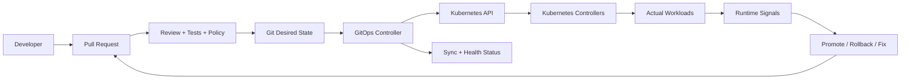
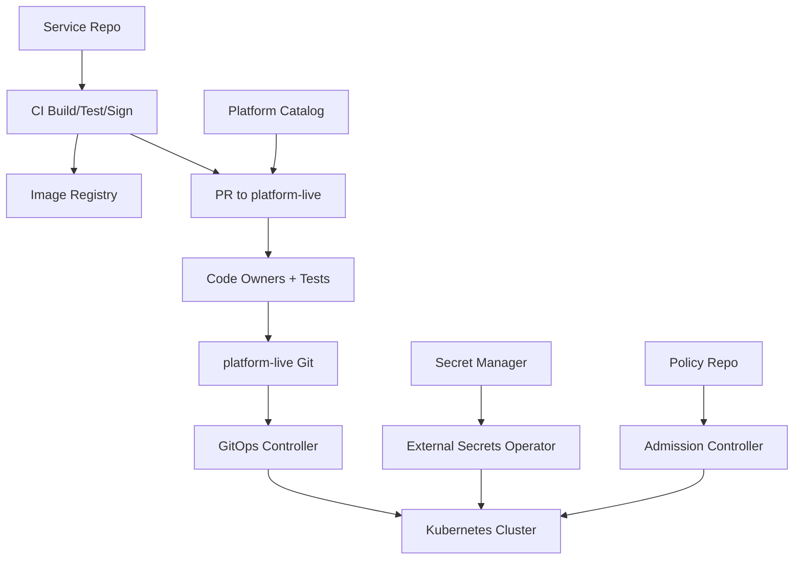
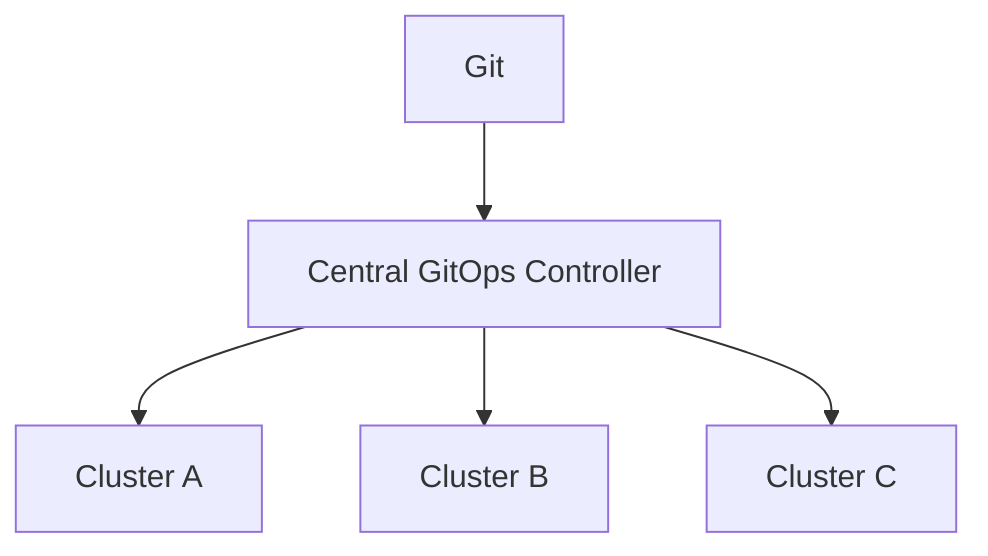
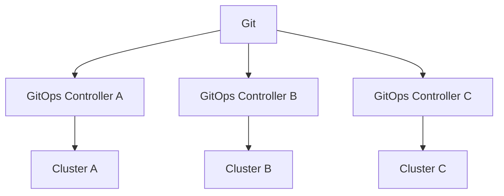

------
title: Learn Kubernetes, Deployment Model, and Cloud Native Platform Engineering - Part 030
description: GitOps delivery model for Kubernetes, including declarative desired state, source of truth, pull-based reconciliation, drift detection, promotion strategy, environment topology, secret handling, policy integration, rollback, multi-cluster delivery, and enterprise operating model.
series: learn-kubernetes-deployment-model
seriesTitle: Learn Kubernetes, Deployment Model, and Cloud Native Platform Engineering
order: 30
partTitle: GitOps Delivery Model: Declarative Operations at Scale
tags:
- kubernetes
- gitops
- delivery
- argocd
- flux
- reconciliation
- deployment
- platform-engineering
- ci-cd
- operations
date: 2026-07-01
------

# Part 030 — GitOps Delivery Model: Declarative Operations at Scale

## 1. Why This Part Exists

Kubernetes is declarative.

But many teams still operate it imperatively:

```bash
kubectl apply -f production.yaml
helm upgrade --install app ./chart
kubectl edit deployment checkout-api
```

That works for learning and emergencies.

It does not scale well for regulated, multi-team, multi-cluster, auditable production platforms.

The GitOps mental model is:

```text
Git stores the desired state. A controller continuously reconciles the cluster toward that desired state. Humans and pipelines change Git, not the cluster directly.
```

GitOps matters because Kubernetes already runs on reconciliation. GitOps extends that reconciliation boundary outward:

```text
Git desired state -> GitOps controller -> Kubernetes API -> Kubernetes controllers -> actual workload state
```

This part teaches GitOps as an operating model, not as a tool tutorial.

You should finish this part able to design:

- repository structure
- application definitions
- promotion strategy
- environment separation
- secret handling
- policy gates
- drift management
- rollback model
- multi-cluster topology
- emergency procedure
- platform/team ownership boundary

---

## 2. Kaufman Skill Target

The skill target for this part is:

```text
Given several Kubernetes services, environments, and clusters, design a GitOps delivery model that makes desired state auditable, promotion explicit, drift detectable, rollback practical, and platform guardrails enforceable without turning the platform team into a deployment bottleneck.
```

This requires seven sub-skills:

1. **Declarative state design** — define what belongs in Git and at what abstraction level.
2. **Repository topology** — organize manifests, overlays, apps, clusters, and ownership boundaries.
3. **Reconciliation reasoning** — understand sync, drift, health, pruning, and failure modes.
4. **Promotion modelling** — move changes across environments deliberately.
5. **Security and policy integration** — protect secrets, RBAC, admission, and approvals.
6. **Rollback and incident handling** — recover using Git history and controller behavior.
7. **Scale governance** — support many teams and clusters without chaos.

---

## 3. GitOps Is Not Just “Put YAML in Git”

Weak GitOps:

```text
We keep Kubernetes YAML in a repository.
```

Strong GitOps:

```text
The repository is the authoritative desired state. Changes are reviewed, versioned, immutable after merge, automatically pulled by an agent, continuously reconciled, observable, and governed.
```

OpenGitOps defines four core principles:

| Principle | Practical Meaning |
|---|---|
| Declarative | Desired state is expressed declaratively. |
| Versioned and immutable | Desired state is stored with version history and immutability. |
| Pulled automatically | Agents pull desired state from the source. |
| Continuously reconciled | Agents compare actual state to desired state and attempt convergence. |

In Kubernetes terms:

```text
GitOps = external desired-state reconciliation around Kubernetes desired-state reconciliation.
```

---

## 4. GitOps Control Loop



The important boundary:

```text
CI builds artifacts. GitOps deploys desired state.
```

A clean model:

1. CI builds image.
2. CI tests image.
3. CI signs/provenances image.
4. CI updates desired state repository or opens a PR.
5. GitOps controller pulls approved desired state.
6. Kubernetes reconciles workload.
7. Observability validates runtime behavior.

Avoid giving CI broad cluster-admin access just to deploy.

---

## 5. Push-Based CD vs Pull-Based GitOps

| Dimension | Push-Based CD | Pull-Based GitOps |
|---|---|---|
| Actor | CI/CD system pushes to cluster. | In-cluster or platform agent pulls from Git. |
| Cluster credentials | Often stored in CI. | Mostly held by GitOps controller. |
| Drift detection | Usually separate/manual. | Core controller capability. |
| Audit trail | Pipeline logs + Git. | Git history + controller events. |
| Failure mode | Pipeline may partially apply and exit. | Controller keeps reconciling or reports out-of-sync. |
| Multi-cluster | CI needs access to many clusters. | Each cluster can pull its assigned state. |
| Security posture | Larger external credential surface. | Smaller ingress credential surface, but controller becomes critical. |

Push-based deployment is not automatically bad.

But at scale, pull-based reconciliation usually gives better:

- auditability
- blast-radius control
- drift visibility
- environment consistency
- credential isolation
- cluster autonomy

---

## 6. Tooling Landscape

Common Kubernetes GitOps tools:

| Tool | Model | Notes |
|---|---|---|
| Argo CD | Application-centric controller and UI. | Strong visualization, sync/health, app projects, multi-cluster, broad ecosystem. |
| Flux CD | Toolkit of controllers. | Strong Kubernetes-native composability, source/kustomize/helm/image automation controllers. |
| Fleet / Rancher GitOps | Fleet management model. | Useful in Rancher-centered environments. |
| OpenShift GitOps | Argo CD-based distribution. | Integrated with OpenShift ecosystem. |

This series does not prescribe one tool.

The invariant is:

```text
The tool must implement a safe reconciliation model aligned with your organization boundaries.
```

---

## 7. Argo CD Mental Model

Argo CD is implemented as a Kubernetes controller. It watches desired application state from Git and compares it with live cluster state.

Core concepts:

| Concept | Meaning |
|---|---|
| Application | A desired-state unit mapped from source repo/path/chart to destination cluster/namespace. |
| AppProject | Boundary for allowed repos, destinations, namespaces, and resources. |
| Sync | Apply desired state to target cluster. |
| Health | Resource-level interpretation of runtime health. |
| OutOfSync | Live state differs from desired Git state. |
| Prune | Delete live resources no longer in desired state. |
| Sync waves/hooks | Order complex rollouts or supporting resources. |
| Auto-sync | Controller applies changes automatically. |

Argo CD is good when you need:

- UI for app/platform visibility
- manual and automatic sync modes
- application health view
- RBAC and multi-tenancy through projects
- multi-cluster app management
- clear operational workflow

---

## 8. Flux Mental Model

Flux is a set of controllers that reconcile sources and Kubernetes resources.

Common concepts:

| Concept | Meaning |
|---|---|
| GitRepository | Source artifact from Git. |
| HelmRepository | Source artifact from Helm repo. |
| OCIRepository | Source artifact from OCI registry. |
| Kustomization | Reconcile a path/artifact into cluster. |
| HelmRelease | Reconcile Helm chart release. |
| Image automation | Detect image updates and update Git. |

Flux is strong when you want:

- Kubernetes-native composition
- controller-per-responsibility architecture
- Git/OCI/Helm source automation
- less UI-centered operation
- fine-grained reconciliation primitives

---

## 9. What Belongs in Git?

A common mistake is putting either too little or too much in Git.

### 9.1 Good Candidates

Put these in Git:

- namespaces
- RBAC
- NetworkPolicies
- ResourceQuotas
- LimitRanges
- Deployments
- StatefulSets
- Services
- Ingress/Gateway routes
- ConfigMaps without secrets
- ExternalSecret definitions
- sealed/encrypted secret objects if using that model
- Helm values
- Kustomize overlays
- policy definitions
- monitoring rules
- dashboards as code
- Argo CD Applications or Flux Kustomizations
- tenant/platform abstractions

### 9.2 Usually Not in Plain Git

Avoid plain-text Git storage for:

- raw secret values
- private keys
- long-lived credentials
- generated runtime status
- high-churn generated objects
- large binary artifacts
- node-specific ephemeral data

### 9.3 Sometimes in Git, Carefully

Be careful with:

- certificate material
- database migration jobs
- one-time break-glass resources
- emergency patches
- generated Helm chart lockfiles
- environment-specific replica counts
- feature flags
- tenant-specific overrides

The guiding question:

```text
Is this desired state that should be reviewed, versioned, reconciled, and recoverable?
```

If yes, Git is a good candidate.

---

## 10. Repository Topologies

There is no universal repo structure. There are trade-offs.

### 10.1 Mono-Repo for Platform State

```text
platform-live/
  clusters/
    prod-eu-1/
    prod-us-1/
    staging-1/
  apps/
    checkout/
    payment/
  infrastructure/
    ingress/
    cert-manager/
    observability/
  policies/
  tenants/
```

Pros:

- one global view
- simple cross-cutting changes
- centralized governance
- easier dependency ordering

Cons:

- repo permissions can become hard
- noisy PRs
- merge contention
- teams may feel blocked
- blast radius of mistaken change can be large

Good for:

- smaller platform teams
- regulated environments
- high governance needs
- central platform ownership

### 10.2 App Repo Owns App Manifests

```text
checkout-service/
  src/
  Dockerfile
  deploy/
    base/
    overlays/
      dev/
      staging/
      prod/
```

Pros:

- app team owns deployment config
- changes close to source code
- easier service-specific review
- developer autonomy

Cons:

- platform standards can drift
- cross-service consistency harder
- app repos need Kubernetes maturity
- environment promotion can get messy

Good for:

- mature service teams
- lower central bottleneck
- strong templates/policies

### 10.3 Separate App Source and Environment State

```text
checkout-service/
  src/
  Dockerfile

platform-live/
  environments/
    dev/checkout.yaml
    staging/checkout.yaml
    prod/checkout.yaml
```

Pros:

- application code and deployment state separated
- production change control centralized
- promotion is explicit
- easier audit for environment state

Cons:

- two-repo workflow
- PR automation needed
- developers may lose context

Good for:

- enterprise production controls
- regulated systems
- platform teams providing paved roads

### 10.4 App-of-Apps / Root Application

```text
root-app/
  clusters/prod/apps.yaml
  clusters/prod/platform.yaml
```

The root GitOps object points to child applications.

Pros:

- bootstrap-friendly
- hierarchical ownership
- cluster composition visible

Cons:

- dependency ordering must be explicit
- large root apps can become fragile
- accidental prune risk if not managed carefully

---

## 11. Recommended Enterprise Shape

For complex organizations, a clean shape is often:

```text
service-repo       -> source code, tests, Dockerfile, app-local defaults
artifact-registry  -> signed images, SBOMs, provenance
platform-catalog   -> reusable deployment templates/golden paths
platform-live      -> environment/cluster desired state
secrets-manager    -> actual secret values
policy-repo        -> admission and compliance policies
```

Flow:



This separates concerns:

| Concern | Owner |
|---|---|
| Source code | App team |
| Build and artifact | App team + platform controls |
| Deployment template | Platform team |
| Environment state | App/platform depending on governance |
| Secret value | Security/platform/application owner |
| Policy | Security/platform |
| Runtime operation | App + platform shared |

---

## 12. Promotion Models

Promotion is how desired state moves from one environment to another.

### 12.1 Branch-Based Promotion

```text
main -> staging branch -> prod branch
```

Pros:

- easy to understand
- branch protections can map to environment controls

Cons:

- cherry-pick complexity
- drift between branches
- merges can be unclear

### 12.2 Directory-Based Promotion

```text
environments/
  dev/
  staging/
  prod/
```

Promotion is a PR changing prod files to match staging.

Pros:

- environment state visible side-by-side
- simple audit
- good for Kustomize/Helm values

Cons:

- PR automation needed
- duplicated values if poorly factored

### 12.3 Tag or Commit Pinning

```yaml
image: registry.example.com/checkout@sha256:abc...
```

or:

```yaml
sourceRevision: abc123
```

Pros:

- immutable releases
- strong auditability
- rollback to known commit/digest

Cons:

- more automation needed
- humans dislike digest-heavy diffs

### 12.4 Environment Controller Promotion

A promotion controller updates environment state after checks pass.

Pros:

- scalable
- consistent
- integrates SLO gates

Cons:

- more platform engineering complexity
- controller bugs become delivery bugs

### 12.5 Recommended Baseline

For production:

```text
Promote immutable artifact references through PRs to environment-specific desired state.
```

Do not rebuild images per environment.

Build once. Promote the same artifact.

---

## 13. Image Update Strategies

Weak pattern:

```yaml
image: checkout-api:latest
```

Strong pattern:

```yaml
image: registry.example.com/checkout-api@sha256:4f3c...
```

or at least:

```yaml
image: registry.example.com/checkout-api:1.42.7
```

Digest pinning gives precise identity.

Trade-off:

- tags are human-readable
- digests are immutable and audit-friendly

A common production compromise:

```yaml
image: registry.example.com/checkout-api:1.42.7@sha256:4f3c...
```

### 13.1 Who Updates the Image?

Options:

| Actor | Pattern |
|---|---|
| CI pipeline | Build image, open PR updating manifest. |
| Image automation controller | Detect new image, update Git. |
| Release manager | Manually promote specific image. |
| Deployment platform | Promote after policy/SLO gates. |

For regulated systems, automatic merge to production is often too aggressive. Automatic PR creation plus approval gates is safer.

---

## 14. Sync Policy

GitOps controllers usually support manual or automated sync.

### 14.1 Manual Sync

Pros:

- human control
- easier during early adoption
- good for high-risk apps

Cons:

- drift can persist
- humans become bottleneck
- emergency changes may bypass Git

### 14.2 Auto Sync

Pros:

- Git merge means deployment
- drift repaired automatically
- better consistency

Cons:

- bad Git commit deploys quickly
- pruning mistakes can be dangerous
- requires strong pre-merge validation

### 14.3 Auto Sync with Guardrails

Recommended mature model:

- auto-sync for lower environments
- auto-sync for low-risk services
- manual or gated sync for high-risk production services
- automated validation before merge
- progressive delivery for risky changes
- emergency pause capability

### 14.4 Prune Policy

Prune means deleting live resources that no longer exist in Git.

Prune is powerful and dangerous.

Rules:

- enable prune only when repo ownership is clean
- use resource exclusions carefully
- avoid broad apps that own too much
- label resources clearly
- test deletion in non-prod
- protect namespaces and CRDs separately

The failure mode:

```text
A bad commit removes a directory. GitOps prunes production resources.
```

Design against this.

---

## 15. Drift Management

Drift means live state differs from desired state.

Drift can be:

| Drift Type | Example |
|---|---|
| Emergency drift | On-call patched replicas during incident. |
| Human drift | Someone used `kubectl edit`. |
| Controller drift | HPA changes replicas. |
| Defaulting drift | API server defaults fields. |
| Mutating webhook drift | Admission injected sidecar or labels. |
| Runtime status drift | Status fields naturally change. |
| External controller drift | cert-manager updates Secret/cert status. |

Not all drift is bad.

The skill is to distinguish:

```text
managed desired-state drift vs expected controller-owned runtime change
```

### 15.1 Ignore Differences

GitOps tools often allow ignoring specific diffs.

Use this for:

- fields owned by HPA
- status fields
- injected sidecars
- generated annotations
- cert-manager-generated fields

Do not use ignore rules to hide real ownership confusion.

### 15.2 Emergency Drift Procedure

If someone must patch production directly:

1. Record reason in incident channel.
2. Apply minimal patch.
3. Pause GitOps sync if needed.
4. Open PR to reconcile Git with intended post-incident state.
5. Resume GitOps.
6. Close incident action item only when drift is resolved.

Emergency patching is allowed. Invisible persistent drift is not.

---

## 16. Secrets in GitOps

GitOps and secrets require careful design.

Bad pattern:

```yaml
apiVersion: v1
kind: Secret
metadata:
  name: db-password
data:
  password: cGFzc3dvcmQ=
```

Base64 is not encryption.

### 16.1 Common Secret Models

| Model | Description | Trade-off |
|---|---|---|
| External Secrets | Git stores reference; secret manager stores value. | Strong separation, operational dependency on secret manager. |
| Sealed Secrets | Git stores encrypted Secret decryptable by cluster controller. | Simple Git workflow, controller/key management critical. |
| SOPS + KMS | Git stores encrypted YAML; decrypted by controller/tool with KMS. | Strong and flexible, needs key management discipline. |
| CSI Secret Store | Secrets mounted from external store at runtime. | Good for runtime mount, may not create native Secret unless configured. |
| Manual Secret | Operator creates Secret outside Git. | Simple, but poor audit and drift unless tightly controlled. |

### 16.2 Recommended Baseline

For enterprise platforms:

```text
Store secret values in a dedicated secret manager. Store only secret references and access policy in Git.
```

Example:

```yaml
apiVersion: external-secrets.io/v1beta1
kind: ExternalSecret
metadata:
  name: checkout-db
spec:
  refreshInterval: 1h
  secretStoreRef:
    name: platform-secret-store
    kind: ClusterSecretStore
  target:
    name: checkout-db
  data:
  - secretKey: password
    remoteRef:
      key: prod/checkout/db
      property: password
```

Governance questions:

- Who can change secret reference?
- Who can change secret value?
- Who can grant workload access?
- How is rotation tested?
- How is revocation performed?
- How are secret reads audited?

---

## 17. Policy Integration

GitOps should integrate with policy at two levels:

1. **Pre-merge policy** — catch bad desired state before it enters Git.
2. **Admission policy** — block unsafe state from entering the cluster.

### 17.1 Pre-Merge Checks

Run:

- schema validation
- Kubernetes server-side dry-run against representative cluster
- policy tests
- image signature/provenance checks
- resource request checks
- forbidden capability checks
- NetworkPolicy baseline checks
- ownership label checks
- diff preview

Example pipeline:

```text
PR -> render -> validate -> policy test -> security scan -> preview diff -> approve -> merge
```

### 17.2 Admission Enforcement

Admission protects against:

- direct kubectl bypass
- compromised CI
- mistaken GitOps controller permission
- stale repo validation
- unknown clients

Pre-merge checks improve developer feedback. Admission is the final guardrail.

You need both.

---

## 18. RBAC and Multi-Tenancy

GitOps controllers need permissions to apply resources.

The dangerous shortcut:

```text
Give GitOps cluster-admin everywhere.
```

Sometimes a bootstrap controller needs broad power. But application-level GitOps should be constrained.

### 18.1 Permission Boundaries

Boundary options:

| Boundary | Description |
|---|---|
| Namespace per team | Controller/app can manage only team namespace. |
| AppProject / project boundary | Restrict repo, destination, namespace, resource kinds. |
| Cluster-scoped platform app | Only platform repo manages CRDs, ClusterRoles, admission, ingress classes. |
| Tenant app | Tenant repo manages Deployments, Services, ConfigMaps inside namespace. |
| Separate controller per tenant | Stronger isolation, more overhead. |

### 18.2 Resource Kind Segmentation

App teams usually should not freely manage:

- ClusterRole
- ClusterRoleBinding
- ValidatingWebhookConfiguration
- MutatingWebhookConfiguration
- CRD
- StorageClass
- IngressClass/GatewayClass
- PriorityClass
- Namespace labels controlling Pod Security

They may manage, under policy:

- Deployment
- StatefulSet in approved patterns
- Service
- ConfigMap
- ExternalSecret reference
- HPA
- PDB
- NetworkPolicy in their namespace
- HTTPRoute attached to approved Gateway

---

## 19. Environment Strategy

Environment design is a source of hidden complexity.

### 19.1 Common Models

| Model | Shape | Strength | Weakness |
|---|---|---|---|
| Namespace per environment | One cluster, many env namespaces. | Cheap, simple. | Weak isolation. |
| Cluster per environment | dev/staging/prod clusters. | Better isolation. | More platform overhead. |
| Cluster per region | prod-us, prod-eu. | Regional blast-radius control. | Promotion complexity. |
| Cluster per tenant | Strong isolation. | Expensive and operationally heavy. |
| Ephemeral preview env | PR creates temporary env. | Great feedback. | Needs automation and cleanup. |

### 19.2 Production Recommendation

For serious systems:

```text
Use separate production clusters or node pools where failure, compliance, or tenant isolation demands it. Use namespaces for logical organization, not as the only hard security boundary.
```

GitOps should make environment boundaries explicit.

---

## 20. Multi-Cluster GitOps

Multi-cluster delivery introduces fleet concerns.

Questions:

- Does each cluster pull its own desired state?
- Is there one central GitOps control plane managing many clusters?
- How are cluster credentials stored?
- What happens if central GitOps is down?
- How do you roll out platform changes by wave?
- How do you prevent global bad commits?
- How do you handle regional differences?

### 20.1 Topologies

#### Central Controller



Pros:

- centralized UI/control
- easy fleet view
- consistent policy

Cons:

- central controller is high-value target
- cluster credentials centralized
- failure can affect many clusters

#### Per-Cluster Controller



Pros:

- cluster autonomy
- smaller blast radius
- no central credential concentration

Cons:

- harder global visibility
- more controllers to manage
- policy consistency requires discipline

### 20.2 Wave-Based Rollout

For fleet changes:

```text
wave 0: dev/internal cluster
wave 1: staging cluster
wave 2: one low-risk production cluster
wave 3: 25% production fleet
wave 4: remaining production fleet
```

Each wave needs:

- health gates
- stop condition
- rollback/fail-forward path
- owner approval
- time for observation

---

## 21. Rollback in GitOps

GitOps rollback means reverting desired state.

Options:

| Method | Use Case |
|---|---|
| Git revert commit | Most auditable default. |
| Revert image digest/tag | Fast application rollback. |
| Revert Helm values | Config rollback. |
| Argo CD rollback to previous app revision | Operational shortcut, must reconcile with Git history. |
| Disable auto-sync temporarily | Incident control, not final state. |
| Roll forward with fix | When state/data/API migration prevents rollback. |

The core invariant:

```text
After incident recovery, Git must represent the desired production state.
```

Otherwise, the next reconciliation may reintroduce the incident.

### 21.1 Rollback Is Not Always Safe

Rollback may fail when:

- database migration is not backward-compatible
- API/event contract changed incompatibly
- CRD schema migrated
- StatefulSet storage format changed
- external dependency changed
- feature flag state changed
- traffic policy changed outside Git

Therefore GitOps rollback must be combined with deployment compatibility design from earlier parts.

---

## 22. Progressive Delivery with GitOps

GitOps does not replace progressive delivery.

It coordinates desired state. Progressive delivery controls exposure and promotion.

Common pattern:

```text
Git change -> GitOps sync -> Rollout controller starts canary -> metrics analysis -> promotion or rollback
```

With Argo Rollouts, Flagger, service mesh, Gateway API, or ingress integrations, GitOps can declare rollout strategy while another controller manages traffic progression.

Example shape:

```yaml
apiVersion: argoproj.io/v1alpha1
kind: Rollout
metadata:
  name: checkout-api
spec:
  strategy:
    canary:
      steps:
      - setWeight: 10
      - pause: {duration: 10m}
      - setWeight: 50
      - pause: {duration: 20m}
```

The important separation:

| Layer | Responsibility |
|---|---|
| GitOps | Desired rollout object exists. |
| Rollout controller | Gradually changes exposure. |
| Metrics system | Supplies objective health signals. |
| Policy | Blocks unsafe changes. |
| Human/platform | Defines risk appetite. |

---

## 23. GitOps Failure Modes

### 23.1 Bad Commit Syncs Everywhere

Cause:

- shared base changed without wave rollout
- auto-sync enabled globally
- insufficient validation

Mitigation:

- wave rollout
- branch/path protections
- environment-specific approval
- policy tests
- progressive delivery
- app segmentation

### 23.2 GitOps Controller Deletes Resources

Cause:

- prune enabled
- directory removed
- ownership boundary too broad

Mitigation:

- narrow application scope
- careful prune enablement
- protect critical resources
- app-of-apps review
- dry-run/diff preview

### 23.3 Drift Hidden by Ignore Rules

Cause:

- broad ignoreDifferences
- unclear field ownership

Mitigation:

- ignore only expected controller-owned fields
- review ignore rules
- add ownership documentation

### 23.4 Secret Decryption Failure

Cause:

- KMS/key issue
- sealed secret controller key lost
- external secret store unavailable
- RBAC changed

Mitigation:

- key backup/rotation procedure
- secret-store SLO
- bootstrap recovery docs
- alerting on sync failures

### 23.5 Git Provider Outage

Cause:

- GitHub/GitLab/internal Git unavailable

Mitigation:

- controllers continue with last known desired state where possible
- avoid requiring Git for steady-state runtime
- know cache behavior
- avoid unnecessary resync during outage

### 23.6 Controller Compromise

Cause:

- GitOps controller has broad cluster credentials

Mitigation:

- least privilege
- separate controllers/projects
- admission policy
- signed commits/artifacts
- audit logs
- network isolation

---

## 24. Bootstrap Problem

How does GitOps manage the cluster before GitOps exists?

This is bootstrap.

Options:

| Method | Description |
|---|---|
| Manual install | Install GitOps controller once, then hand over to Git. |
| Terraform/bootstrap pipeline | Infrastructure tool creates cluster and installs GitOps. |
| Cluster API | Cluster lifecycle plus GitOps bootstrap. |
| Immutable cluster image | Pre-baked baseline for specialized environments. |

Bootstrap should be minimal:

1. Create cluster.
2. Install GitOps controller.
3. Point controller to platform desired-state repo.
4. GitOps installs everything else.

The anti-pattern:

```text
Half the cluster is managed by Terraform, half by Helm manually, half by GitOps.
```

Yes, that is three halves. That is how it feels operationally.

### 24.1 Ownership Split with Terraform

A common clean boundary:

| Terraform Owns | GitOps Owns |
|---|---|
| Cloud network | Kubernetes namespaces |
| Cluster resource | Workloads |
| Node pools | RBAC within cluster |
| IAM roles | NetworkPolicy |
| Managed databases | ExternalSecret references |
| DNS zones base | Ingress/Gateway routes |
| Initial GitOps install | Platform add-ons after bootstrap |

Do not let Terraform and GitOps fight over the same Kubernetes object.

---

## 25. Application Definition Example

A simple Argo CD Application shape:

```yaml
apiVersion: argoproj.io/v1alpha1
kind: Application
metadata:
  name: checkout-api-prod
  namespace: argocd
spec:
  project: payments
  source:
    repoURL: https://git.example.com/platform/platform-live.git
    targetRevision: main
    path: environments/prod/apps/checkout-api
  destination:
    server: https://kubernetes.default.svc
    namespace: checkout-prod
  syncPolicy:
    automated:
      prune: false
      selfHeal: true
    syncOptions:
    - CreateNamespace=false
```

Design notes:

- `project` should restrict allowed destinations and resources.
- `targetRevision` for production may be branch, tag, or commit depending on governance.
- `prune` should not be enabled casually.
- namespace creation may be owned by platform, not app.
- source path should be narrow enough to avoid accidental ownership expansion.

---

## 26. Repository Example

```text
platform-live/
  clusters/
    prod-jakarta-1/
      root.yaml
      platform/
        ingress-controller.yaml
        cert-manager.yaml
        external-secrets.yaml
        observability.yaml
        policies.yaml
      tenants/
        payments.yaml
        enforcement.yaml
      apps/
        checkout-api.yaml
        case-management-api.yaml
    staging-jakarta-1/
      root.yaml
  environments/
    prod/
      apps/
        checkout-api/
          kustomization.yaml
          deployment.yaml
          service.yaml
          httproute.yaml
          hpa.yaml
          pdb.yaml
          externalsecret.yaml
          networkpolicy.yaml
    staging/
      apps/
        checkout-api/
          kustomization.yaml
  policies/
    baseline/
    restricted/
  README.md
```

This structure makes cluster composition and app desired state explicit.

---

## 27. GitOps for Regulated Systems

In regulated or enforcement lifecycle systems, GitOps is attractive because it provides:

- change history
- review evidence
- separation of duties
- reproducible desired state
- audit trail
- rollback trail
- environment promotion record
- policy enforcement
- reduced direct production access

But the platform must also handle:

- emergency access records
- approval mapping
- incident exceptions
- data migration evidence
- configuration provenance
- tenant impact analysis
- retention requirements

A production change record can include:

```md
# Production Deployment Record

- Service:
- Image digest:
- Git commit:
- PR:
- Approvers:
- Policy checks:
- Security checks:
- Migration included: yes/no
- Rollback plan:
- SLO dashboard:
- Deployment window:
- Incident link if emergency:
```

GitOps makes this easier, not automatic.

---

## 28. GitOps Adoption Strategy

Do not migrate everything at once.

### Phase 1 — Observe

- install GitOps in non-prod
- manage one low-risk app
- use manual sync
- learn diff/health/prune behavior

### Phase 2 — Standardize

- define repo structure
- define labels/annotations
- define AppProject/RBAC model
- add pre-merge validation
- add policy checks

### Phase 3 — Expand

- onboard more apps
- add auto-sync for non-prod
- integrate secrets model
- define promotion workflow
- build dashboards

### Phase 4 — Productionize

- production app onboarding
- incident procedure
- SLO-based rollback/promotion
- audit evidence
- multi-cluster model
- platform catalog integration

### Phase 5 — Optimize

- self-service onboarding
- golden paths
- progressive delivery
- fleet waves
- drift analytics
- cost/security/reliability guardrails

---

## 29. GitOps Readiness Checklist

Before production GitOps:

1. Is the source of truth clearly defined?
2. Are direct cluster changes restricted?
3. Is repo ownership clear?
4. Are CODEOWNERS or equivalent approvals configured?
5. Are manifests rendered and validated before merge?
6. Are policies tested before merge and enforced at admission?
7. Are secrets handled safely?
8. Are GitOps controller permissions bounded?
9. Are app/platform resource boundaries clear?
10. Is prune strategy safe?
11. Are drift rules reviewed?
12. Is rollback procedure tested?
13. Is emergency patch procedure documented?
14. Are sync failures alerted?
15. Are app health checks meaningful?
16. Is promotion explicit?
17. Are production changes auditable?
18. Is multi-cluster blast radius controlled?

---

## 30. Practical Lab: Build a Minimal GitOps Operating Model

Use a non-production cluster.

### Step 1 — Define Desired State Repo

```text
gitops-lab/
  apps/
    hello-api/
      deployment.yaml
      service.yaml
      kustomization.yaml
  clusters/
    local/
      hello-api-application.yaml
```

### Step 2 — Add Application Manifest

```yaml
apiVersion: apps/v1
kind: Deployment
metadata:
  name: hello-api
  labels:
    app.kubernetes.io/name: hello-api
spec:
  replicas: 2
  selector:
    matchLabels:
      app.kubernetes.io/name: hello-api
  template:
    metadata:
      labels:
        app.kubernetes.io/name: hello-api
    spec:
      containers:
      - name: app
        image: registry.k8s.io/echoserver:1.10
        ports:
        - containerPort: 8080
        readinessProbe:
          httpGet:
            path: /
            port: 8080
```

### Step 3 — Reconcile Through GitOps Tool

Install Argo CD or Flux in the lab cluster, then point it to the repo/path.

Observe:

- sync status
- health status
- live object diff
- events
- controller logs

### Step 4 — Create Drift

```bash
kubectl scale deployment hello-api --replicas=5
```

Observe whether GitOps reports drift and whether self-heal restores the desired state.

### Step 5 — Change Git

Update replicas in Git:

```yaml
replicas: 3
```

Merge and observe reconciliation.

### Step 6 — Write Learning Note

Answer:

- What is the source of truth?
- What drift was detected?
- What changed automatically?
- What required human approval?
- What would be dangerous in production?
- What guardrail would you add first?

---

## 31. Common Anti-Patterns

### 31.1 GitOps Without Ownership

A repo without ownership becomes shared mutable infrastructure soup.

### 31.2 GitOps With Cluster-Admin Everywhere

This centralizes risk and weakens tenant isolation.

### 31.3 Auto-Prune Too Early

Prune should come after ownership boundaries are proven.

### 31.4 Ignoring Rendered Output

Helm/Kustomize source is not enough. Validate rendered manifests.

### 31.5 Environment Drift by Copy-Paste

If dev/staging/prod diverge unintentionally, promotion becomes guesswork.

### 31.6 Secret Values in Plain Git

Base64 is not encryption.

### 31.7 Manual Hotfix Never Reconciled Back

Emergency patches must become Git state or be intentionally reverted.

### 31.8 GitOps as a Platform Bottleneck

If every app change requires platform engineers to edit YAML, GitOps has become centralized ops with better logs.

### 31.9 No Stop Button

Every auto-sync system needs a safe pause/emergency procedure.

### 31.10 No Runtime Feedback Loop

GitOps can deploy broken desired state perfectly. You still need metrics, SLOs, and progressive delivery.

---

## 32. Summary

GitOps is the operating model that aligns Kubernetes with Git-based change control.

The core ideas:

- Git is the desired-state source of truth.
- Controllers pull and reconcile state continuously.
- CI builds artifacts; GitOps deploys desired state.
- Promotion should move immutable artifacts across environments.
- Drift must be visible and intentionally managed.
- Secrets require a dedicated strategy.
- Pre-merge policy and admission policy solve different problems.
- Controller RBAC must match tenant/platform boundaries.
- Multi-cluster GitOps needs wave rollout and blast-radius design.
- Rollback is Git history plus compatibility discipline.
- GitOps does not replace observability, progressive delivery, or incident response.

The mature stance is:

```text
GitOps is not YAML in Git. It is auditable, reconciled, policy-governed desired-state operation.
```

---

## 33. References

- OpenGitOps — Principles: https://opengitops.dev/
- Argo CD Documentation — Declarative GitOps CD for Kubernetes: https://argo-cd.readthedocs.io/en/stable/
- Argo CD Documentation — Declarative Setup: https://argo-cd.readthedocs.io/en/stable/operator-manual/declarative-setup/
- Flux Documentation: https://fluxcd.io/flux/
- Kubernetes Documentation — Declarative Management of Kubernetes Objects: https://kubernetes.io/docs/tasks/manage-kubernetes-objects/declarative-config/
- Kubernetes Documentation — Server-Side Apply: https://kubernetes.io/docs/reference/using-api/server-side-apply/
- Kubernetes Documentation — Secrets: https://kubernetes.io/docs/concepts/configuration/secret/
- External Secrets Operator Documentation: https://external-secrets.io/
