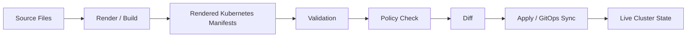
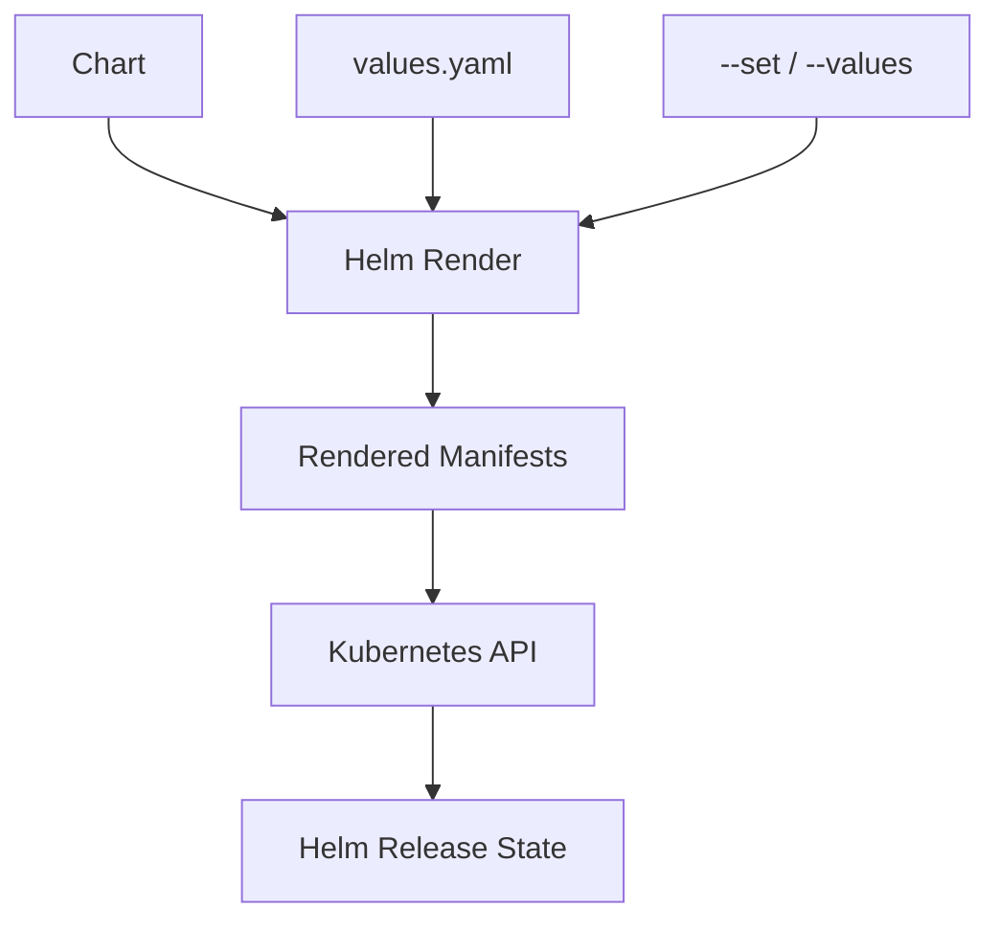
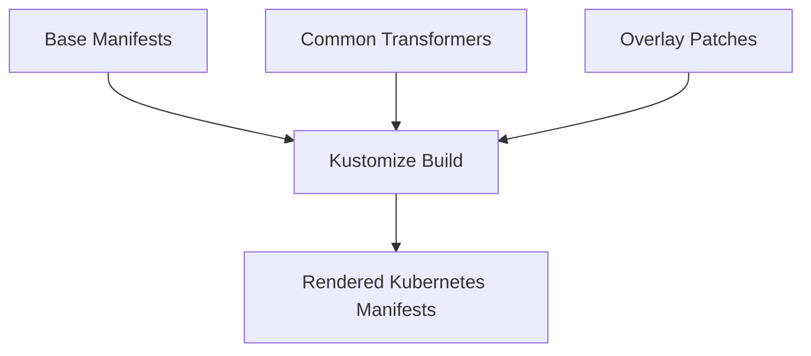
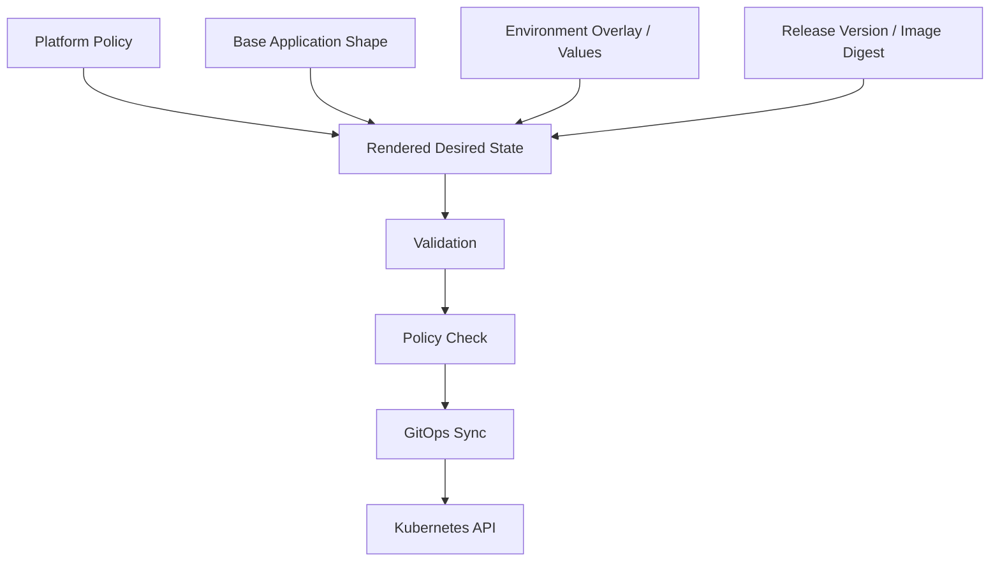

------
title: Learn Kubernetes, Deployment Model, and Cloud Native Platform Engineering - Part 031
description: Helm, Kustomize, and Kubernetes package management for production platforms, including chart design, values contracts, overlays, templating boundaries, GitOps integration, governance, testing, anti-patterns, and decision frameworks.
series: learn-kubernetes-deployment-model
seriesTitle: Learn Kubernetes, Deployment Model, and Cloud Native Platform Engineering
order: 31
partTitle: Helm, Kustomize, and Kubernetes Package Management
tags:
- kubernetes
- helm
- kustomize
- package-management
- manifests
- gitops
- platform-engineering
- deployment
- governance
- configuration
- ci-cd
date: 2026-07-01
------

# Part 031 — Helm, Kustomize, and Kubernetes Package Management

## 1. Why This Part Exists

By this point in the series, we already understand Kubernetes as a declarative API and GitOps as an external reconciliation model.

But there is still a practical problem:

```text
How do we manage hundreds or thousands of Kubernetes objects across many applications, environments, clusters, tenants, regions, and release variants without producing unreviewable YAML chaos?
```

Raw Kubernetes YAML is explicit, but it does not scale by itself.

Large organizations quickly need answers to questions like:

- How do we reuse common deployment structure without copy-pasting every manifest?
- How do we vary image tags, resource requests, ingress hosts, feature flags, and replicas per environment?
- How do we package third-party applications consistently?
- How do we prevent every team from inventing a different manifest layout?
- How do we make generated YAML reviewable before it reaches the cluster?
- How do we govern configuration without blocking delivery?

This is where Kubernetes package management enters.

The two dominant native approaches are:

```text
Helm      -> package + template + release lifecycle
Kustomize -> compose + patch + overlay existing Kubernetes resources
```

They solve overlapping but different problems.

The mistake is treating them as mutually exclusive religions.

The correct mental model is:

```text
Helm packages parameterized applications.
Kustomize customizes concrete Kubernetes resources.
GitOps reconciles rendered desired state into the cluster.
```

This part teaches how to choose and design these tools as production engineering primitives.

---

## 2. Kaufman Deconstruction

Following Josh Kaufman's *The First 20 Hours*, we deconstruct package management into subskills that can be practiced independently.

| Subskill | What You Need to Be Able to Do |
|---|---|
| Manifest literacy | Read rendered YAML and understand exactly what will be applied. |
| Variability modelling | Separate invariant app structure from environment-specific configuration. |
| Helm chart design | Build charts with stable values contracts and predictable rendered output. |
| Kustomize overlay design | Compose bases and overlays without hidden procedural logic. |
| Release state awareness | Understand what Helm tracks and what GitOps tracks. |
| CRD packaging awareness | Handle CRDs carefully because their lifecycle differs from ordinary resources. |
| Testing and validation | Render, lint, schema-check, policy-check, and diff manifests before deployment. |
| Governance | Standardize packaging patterns across teams without destroying autonomy. |

The goal is not to memorize every template function.

The goal is to develop this reflex:

```text
Before I package something, I identify:
1. who owns the base shape,
2. who owns environment variation,
3. who owns release lifecycle,
4. who reviews rendered output,
5. what cannot be safely templated,
6. what must be governed centrally.
```

---

## 3. The Core Problem: Kubernetes YAML Is an API Contract, Not a Text File

A Kubernetes manifest is not just text.

It is an API request body.

```yaml
apiVersion: apps/v1
kind: Deployment
metadata:
  name: checkout-api
spec:
  replicas: 3
```

When this is applied, the API server validates and stores desired state.

That means package management must preserve API clarity.

A bad packaging system makes it hard to answer:

```text
What object will exist in production after this change?
Why did this field change?
Who owns this configuration?
What will be deleted?
What will be mutated by defaults, webhooks, or controllers?
```

For senior engineers, the most important artifact is not the template.

It is the rendered object graph.



A production-grade packaging model must make every stage inspectable.

---

## 4. Helm Mental Model

Helm is commonly described as the Kubernetes package manager.

That is mostly correct, but incomplete.

Helm combines three concepts:

```text
Chart       -> package definition
Values      -> user-provided configuration input
Release     -> installed instance tracked by Helm
```

A Helm chart is a directory containing templates and metadata.

A values file supplies parameters.

Helm renders templates into Kubernetes manifests.

Then Helm can install, upgrade, rollback, or uninstall a release.



Helm is powerful because it can package applications with many resources:

- Deployment
- Service
- ServiceAccount
- RBAC
- ConfigMap
- Secret reference
- Ingress or Gateway resources
- NetworkPolicy
- PodDisruptionBudget
- HorizontalPodAutoscaler
- ServiceMonitor
- CRDs

Helm becomes dangerous when teams hide too much logic inside templates.

The litmus test:

```text
If a reviewer cannot predict the rendered YAML from values, the chart is too clever.
```

---

## 5. Helm Chart Anatomy

A typical chart looks like this:

```text
checkout-api/
  Chart.yaml
  values.yaml
  values.schema.json
  templates/
    deployment.yaml
    service.yaml
    serviceaccount.yaml
    configmap.yaml
    ingress.yaml
    hpa.yaml
    pdb.yaml
    _helpers.tpl
    NOTES.txt
  crds/
    example.example.com_widgets.yaml
  charts/
    dependency-chart/
```

### 5.1 `Chart.yaml`

`Chart.yaml` describes the package.

```yaml
apiVersion: v2
name: checkout-api
description: Checkout API Kubernetes chart
type: application
version: 1.4.2
appVersion: "2.8.1"
```

Important distinction:

| Field | Meaning |
|---|---|
| `version` | Chart version. Changes when packaging changes. |
| `appVersion` | Application version. Often maps to image/app release. |

Do not conflate them.

A chart may change without changing application code.

Application code may change without changing chart structure.

### 5.2 `values.yaml`

`values.yaml` is the chart's configuration interface.

Example:

```yaml
replicaCount: 3

image:
  repository: registry.example.com/payments/checkout-api
  tag: "2.8.1"
  pullPolicy: IfNotPresent

resources:
  requests:
    cpu: 250m
    memory: 512Mi
  limits:
    memory: 1Gi

service:
  type: ClusterIP
  port: 8080

ingress:
  enabled: true
  host: checkout.example.com
```

A good values file is a stable API.

Treat it like a public contract.

Bad values design:

```yaml
extraStuff: {}
magic: true
production: false
mode: advanced
```

Good values design:

```yaml
replicaCount: 3
resources:
  requests:
    cpu: 250m
    memory: 512Mi
rollout:
  maxUnavailable: 0
  maxSurge: 1
podDisruptionBudget:
  enabled: true
  minAvailable: 2
```

The second design exposes real operational intent.

### 5.3 `values.schema.json`

A production chart should validate its values.

Example:

```json
{
  "$schema": "https://json-schema.org/draft-07/schema#",
  "type": "object",
  "properties": {
    "replicaCount": {
      "type": "integer",
      "minimum": 1
    },
    "image": {
      "type": "object",
      "required": ["repository", "tag"],
      "properties": {
        "repository": { "type": "string" },
        "tag": { "type": "string" }
      }
    }
  },
  "required": ["replicaCount", "image"]
}
```

Without schema, invalid values fail late.

With schema, invalid values fail before rendering or deployment.

### 5.4 `templates/`

Templates generate Kubernetes manifests.

Example:

```yaml
apiVersion: apps/v1
kind: Deployment
metadata:
  name: {{ include "checkout-api.fullname" . }}
  labels:
    {{- include "checkout-api.labels" . | nindent 4 }}
spec:
  replicas: {{ .Values.replicaCount }}
  selector:
    matchLabels:
      app.kubernetes.io/name: {{ include "checkout-api.name" . }}
  template:
    metadata:
      labels:
        app.kubernetes.io/name: {{ include "checkout-api.name" . }}
    spec:
      containers:
      - name: checkout-api
        image: "{{ .Values.image.repository }}:{{ .Values.image.tag }}"
        ports:
        - containerPort: {{ .Values.service.port }}
```

Templates should generate boring YAML.

If a template starts resembling application logic, it is likely wrong.

---

## 6. Helm Values as an API Surface

For internal platform charts, the values file is an API surface between platform and application teams.

This means values need design discipline.

### 6.1 Values Should Express Intent, Not Implementation Leakage

Poor design:

```yaml
podSpecPatch:
  containers:
  - name: app
    lifecycle:
      preStop:
        exec:
          command: ["sleep", "20"]
```

Better design:

```yaml
gracefulShutdown:
  enabled: true
  preStopSleepSeconds: 20
```

But there is a trade-off.

Too much abstraction hides Kubernetes.

Too little abstraction causes copy-paste.

The correct boundary depends on ownership.

| Situation | Better Values Shape |
|---|---|
| Platform-owned golden path | Intent-level values. |
| Expert team chart | Kubernetes-shaped values may be acceptable. |
| Shared third-party chart | Keep close to upstream conventions. |
| Regulated production | Prefer explicit, validated, auditable values. |

### 6.2 Avoid Environment Logic Inside Templates

Bad pattern:

```yaml
{{- if eq .Values.environment "prod" }}
replicas: 6
{{- else }}
replicas: 1
{{- end }}
```

This hides environment policy inside the chart.

Better:

```yaml
# values-prod.yaml
replicaCount: 6

# values-dev.yaml
replicaCount: 1
```

The chart should define structure.

Environment values should define environment-specific desired state.

### 6.3 Avoid Unbounded `extra*` Escape Hatches

Many charts expose fields like:

```yaml
extraEnv: []
extraVolumes: []
extraVolumeMounts: []
extraContainers: []
extraObjects: []
```

These are useful but dangerous.

They bypass chart design.

Use them carefully.

| Escape Hatch | Risk |
|---|---|
| `extraEnv` | Secret leakage, config sprawl. |
| `extraContainers` | Sidecar governance bypass. |
| `extraVolumes` | HostPath/security risk. |
| `extraObjects` | Chart becomes uncontrolled manifest transport. |

For platform charts, prefer explicit supported extension points.

---

## 7. Helm Templating Rules for Production

### 7.1 Render Locally Before Trusting Anything

Always inspect output:

```bash
helm template checkout-api ./charts/checkout-api \
  --values values-prod.yaml
```

A Helm chart is not what the templates say.

It is what `helm template` renders.

### 7.2 Use `required` for Critical Values

```yaml
image: "{{ required "image.repository is required" .Values.image.repository }}:{{ required "image.tag is required" .Values.image.tag }}"
```

Failing early is better than deploying an incomplete workload.

### 7.3 Quote Strings Deliberately

```yaml
value: {{ .Values.featureFlag | quote }}
```

YAML type coercion can surprise you.

A string like `on`, `off`, `yes`, `no`, or numeric-looking values may not behave as intended.

### 7.4 Keep Helpers Stable

Typical helpers:

```yaml
{{- define "checkout-api.name" -}}
{{- default .Chart.Name .Values.nameOverride | trunc 63 | trimSuffix "-" -}}
{{- end -}}

{{- define "checkout-api.labels" -}}
app.kubernetes.io/name: {{ include "checkout-api.name" . }}
app.kubernetes.io/instance: {{ .Release.Name }}
app.kubernetes.io/managed-by: {{ .Release.Service }}
helm.sh/chart: {{ .Chart.Name }}-{{ .Chart.Version | replace "+" "_" }}
{{- end -}}
```

Consistent labels enable selection, ownership, dashboards, cost allocation, and policy.

### 7.5 Avoid `lookup` in GitOps-Oriented Charts

Helm supports looking up live cluster data.

That can be useful in some imperative Helm workflows.

But it harms deterministic rendering.

A chart that renders differently depending on live cluster state is harder to review, test, and reconcile.

For GitOps, prefer deterministic manifests.

### 7.6 Be Careful With Hooks

Helm hooks run at lifecycle points such as pre-install or post-upgrade.

They are useful for tasks like migrations or cleanup.

They are also a common source of hidden side effects.

Ask:

```text
Can this hook safely run twice?
Can it fail without corrupting release state?
Is the output visible in GitOps?
Does it need rollback behavior?
Who owns cleanup?
```

For regulated systems, avoid hooks for irreversible operations unless you have explicit governance and runbook coverage.

---

## 8. Helm Release State and GitOps Tension

Helm can manage release state.

GitOps controllers can also manage desired state.

That creates a conceptual tension:

```text
Is Helm the deployer, or is Helm only the renderer?
```

### 8.1 Imperative Helm Model

```bash
helm upgrade --install checkout-api ./chart \
  --namespace payments \
  --values values-prod.yaml
```

Helm talks directly to Kubernetes.

Pros:

- simple for small teams
- native release history
- easy rollback command
- widely supported

Cons:

- harder to audit if humans run commands
- cluster state may drift from Git
- release access often requires broad credentials
- rollback may ignore external dependencies or schema compatibility

### 8.2 GitOps Helm Model

A GitOps controller renders or invokes Helm and applies output.

```text
Git -> GitOps Controller -> Helm Render -> Kubernetes API
```

Pros:

- Git remains source of truth
- drift can be detected
- access can be centralized
- changes are reviewable

Cons:

- Helm release semantics may differ by controller
- hook behavior needs careful review
- chart upgrades require GitOps-specific understanding
- generated output may not be stored unless explicitly captured

### 8.3 Enterprise Rule

For production platforms:

```text
Humans should rarely run Helm directly against production clusters.
```

Prefer:

```text
Human / CI changes Git -> GitOps reconciles -> cluster changes
```

Emergency break-glass is allowed, but must be logged and followed by Git reconciliation.

---

## 9. Kustomize Mental Model

Kustomize customizes Kubernetes YAML without templating.

It works by composing resources and applying transformations or patches.

The core idea:

```text
Base resources define common shape.
Overlays patch the base for specific environments or variants.
```



Kustomize is strong when your resources are already valid Kubernetes objects.

It is weaker when you need package-level abstraction, dependency metadata, versioned distribution, or conditional generation.

---

## 10. Kustomize Directory Structure

Example:

```text
apps/checkout-api/
  base/
    kustomization.yaml
    deployment.yaml
    service.yaml
    pdb.yaml
  overlays/
    dev/
      kustomization.yaml
      patch-replicas.yaml
      patch-resources.yaml
    staging/
      kustomization.yaml
      patch-replicas.yaml
      patch-ingress.yaml
    prod/
      kustomization.yaml
      patch-replicas.yaml
      patch-resources.yaml
      patch-topology-spread.yaml
```

### 10.1 Base

```yaml
# base/kustomization.yaml
resources:
- deployment.yaml
- service.yaml
- pdb.yaml

commonLabels:
  app.kubernetes.io/name: checkout-api
  app.kubernetes.io/part-of: payments
```

The base should be deployable or close to deployable.

It should not be full of placeholders.

### 10.2 Overlay

```yaml
# overlays/prod/kustomization.yaml
resources:
- ../../base

patches:
- path: patch-replicas.yaml
- path: patch-resources.yaml
- path: patch-topology-spread.yaml

images:
- name: registry.example.com/payments/checkout-api
  newTag: "2.8.1"
```

Example patch:

```yaml
apiVersion: apps/v1
kind: Deployment
metadata:
  name: checkout-api
spec:
  replicas: 6
```

Kustomize lets reviewers see exactly what differs per environment.

---

## 11. Kustomize Transformers and Patches

Kustomize supports several transformations.

| Capability | Use Case |
|---|---|
| `resources` | Compose manifests. |
| `patches` | Change specific fields. |
| `images` | Change image tags or names. |
| `namePrefix` / `nameSuffix` | Variant naming. |
| `namespace` | Set namespace for namespaced resources. |
| `commonLabels` | Apply common labels. |
| `commonAnnotations` | Apply annotations. |
| `configMapGenerator` | Generate ConfigMaps from files/literals. |
| `secretGenerator` | Generate Secrets from files/literals. |
| `components` | Reusable optional groups of resources/patches. |

### 11.1 Strategic Merge Patch

```yaml
apiVersion: apps/v1
kind: Deployment
metadata:
  name: checkout-api
spec:
  template:
    spec:
      containers:
      - name: checkout-api
        resources:
          requests:
            cpu: 500m
            memory: 1Gi
```

Strategic merge understands Kubernetes merge semantics for some built-in types.

### 11.2 JSON 6902 Patch

```yaml
- op: replace
  path: /spec/replicas
  value: 6
```

JSON patch is explicit and precise.

Use it when strategic merge becomes ambiguous.

### 11.3 Image Transformer

```yaml
images:
- name: checkout-api
  newName: registry.example.com/payments/checkout-api
  newTag: "2.8.1"
```

This is cleaner than patching container image strings manually.

---

## 12. Helm vs Kustomize Decision Framework

There is no universal winner.

Use the tool whose abstraction matches the ownership model.

| Need | Prefer |
|---|---|
| Distribute reusable application package | Helm |
| Install third-party software | Helm |
| Parameterized templates with optional resources | Helm |
| Release lifecycle with install/upgrade/uninstall | Helm |
| Environment overlays over concrete YAML | Kustomize |
| Minimal abstraction over native Kubernetes objects | Kustomize |
| Clear diff between environment variants | Kustomize |
| Patching vendor output | Kustomize |
| GitOps app composition | Either, depending on controller support |

A practical rule:

```text
If you are publishing a product-like package, use Helm.
If you are customizing known Kubernetes resources per environment, use Kustomize.
```

But many mature platforms use both.

---

## 13. Common Combination Patterns

### 13.1 Helm Only

```text
chart + values-dev.yaml + values-prod.yaml
```

Works well when:

- the chart is well-designed
- variations are values-driven
- the team accepts Helm as packaging boundary
- GitOps controller handles Helm rendering

Risks:

- values files become huge
- templates become too conditional
- environment differences are hidden in values
- rendered diffs may be hard to review

### 13.2 Kustomize Only

```text
base + overlays
```

Works well when:

- resources are mostly native YAML
- differences are small patches
- teams want explicit object-level diffs
- there is no need for package distribution

Risks:

- overlays can become patch spaghetti
- large optional feature sets are awkward
- duplication grows if bases are poorly designed

### 13.3 Helm Rendered, Then Kustomize Patched

```text
Helm chart -> rendered YAML -> Kustomize overlay -> GitOps apply
```

Works when:

- you consume a third-party Helm chart
- you need organizational patches not exposed by chart values
- you need consistent labels, policies, or ingress modifications

Risks:

- generated output may change across chart upgrades
- patches may silently stop matching
- review becomes harder if rendering is not captured

### 13.4 Platform Chart + Team Values

A platform team owns the chart.

Application teams own values.

```text
platform/chart/web-service
teams/payments/checkout-api/values-prod.yaml
```

Works well for golden paths.

Risks:

- platform chart becomes too generic
- teams request endless extension points
- chart maintainers become deployment bottleneck

A golden path chart should support common cases extremely well and reject unsafe customizations by default.

---

## 14. Manifest Layering Model

A clean enterprise deployment stack often looks like this:



Keep layers separate.

| Layer | Owns |
|---|---|
| Platform policy | Required labels, security baseline, resource defaults, allowed ingress classes. |
| Base application shape | Workload, service, probes, PDB, HPA, config interfaces. |
| Environment overlay | Replicas, hostnames, resource sizes, topology, feature flags. |
| Release version | Image digest, chart version, app version. |
| Cluster mutation | Admission defaults, sidecar injection, policy enforcement. |

If these layers are mixed, debugging becomes difficult.

---

## 15. Production Naming and Labeling

Package managers must not destroy object identity.

Use standard labels consistently:

```yaml
app.kubernetes.io/name: checkout-api
app.kubernetes.io/instance: checkout-api-prod
app.kubernetes.io/version: "2.8.1"
app.kubernetes.io/component: api
app.kubernetes.io/part-of: payments
app.kubernetes.io/managed-by: Helm
```

Labels are not decoration.

They power:

- Service selectors
- NetworkPolicy selectors
- dashboards
- cost allocation
- ownership
- incident triage
- policy matching
- inventory

Never let Helm/Kustomize generate labels that break selectors accidentally.

Remember the invariant from Part 006:

```text
Changing selector labels can orphan or replace workloads.
```

---

## 16. CRD Packaging With Helm

CRDs are special.

A CRD changes the Kubernetes API itself.

Helm supports putting CRDs in the `crds/` directory, but CRD lifecycle should be treated differently from normal application resources.

Why?

Because CRDs:

- define new API types
- may be required before custom resources can be applied
- may have conversion webhooks
- may affect many namespaces
- may be shared by many releases
- are often cluster-scoped
- are dangerous to delete accidentally

Production rule:

```text
Install and upgrade CRDs deliberately, separately, and with compatibility review.
```

Avoid allowing every application release to casually upgrade shared CRDs.

Safer patterns:

| Pattern | Description |
|---|---|
| Platform-owned CRD bundle | Platform team manages CRDs centrally. |
| CRD-only chart | CRDs are installed separately from app instances. |
| Version compatibility matrix | Controllers declare supported CRD versions. |
| Pre-upgrade API migration test | Existing CRs are validated before storage version changes. |

Do not treat CRDs like ordinary Deployments.

Part 032 goes deep on this.

---

## 17. Testing Rendered Manifests

A mature packaging pipeline checks manifests before they reach the cluster.

### 17.1 Helm Render

```bash
helm template checkout-api ./charts/checkout-api \
  --values environments/prod/values.yaml \
  > rendered.yaml
```

### 17.2 Helm Lint

```bash
helm lint ./charts/checkout-api
```

### 17.3 Kustomize Build

```bash
kubectl kustomize overlays/prod > rendered.yaml
```

or:

```bash
kustomize build overlays/prod > rendered.yaml
```

### 17.4 Server Dry Run

```bash
kubectl apply --dry-run=server -f rendered.yaml
```

Server dry run catches API-server-side validation and admission behavior better than pure client-side checks.

### 17.5 Diff

```bash
kubectl diff -f rendered.yaml
```

Diff answers:

```text
What live object fields would change?
```

### 17.6 Policy Check

Examples of policy assertions:

```text
No privileged Pods.
All containers define resource requests.
All production workloads have PDBs.
Ingress host must match approved domain.
Image must be pinned by digest.
No LoadBalancer Service outside platform namespace.
No wildcard RBAC in application namespace.
```

### 17.7 Schema Validation

Validate rendered manifests against Kubernetes schemas and organizational policies.

Do not validate only templates.

Validate rendered output.

---

## 18. Review Strategy

Large template changes are hard to review.

Make review concrete.

For every packaging change, reviewers should see:

```text
1. Source change
2. Rendered manifest diff
3. Policy result
4. Server dry-run result
5. Rollback plan
```

A pull request that only changes Helm templates without rendered diff is incomplete for production-critical workloads.

For regulated environments, consider committing rendered output or generating it in CI as an artifact.

Trade-off:

| Approach | Pros | Cons |
|---|---|---|
| Store source only | Less duplication, cleaner repo. | Harder audit of exact rendered state. |
| Store rendered manifests | Strong auditability, review clarity. | More generated noise, merge conflict risk. |
| Store source and CI artifact | Balanced. | Requires artifact retention discipline. |

---

## 19. Environment Strategy

### 19.1 Bad Environment Strategy

```text
values.yaml
values-prod.yaml
values-prod-real.yaml
values-prod-hotfix.yaml
values-prod-new-new.yaml
```

This creates uncontrolled drift.

### 19.2 Better Strategy

```text
environments/
  dev/
    values.yaml
  staging/
    values.yaml
  prod/
    values.yaml
```

or with Kustomize:

```text
overlays/
  dev/
  staging/
  prod/
```

### 19.3 Explicit Promotion

Do not let environments silently diverge.

Promotion should answer:

```text
What artifact moves from staging to production?
```

Possible promotion units:

| Unit | Description |
|---|---|
| Image digest | Same chart/config, new application build. |
| Chart version | Packaging changes. |
| Values change | Environment config change. |
| Overlay patch | Environment-specific object change. |
| Full rendered bundle | Exact desired state promoted. |

For high-assurance deployment, promote immutable image digests rather than mutable tags.

---

## 20. Secrets and Package Management

Do not put plaintext secrets in Helm values or Kustomize overlays.

Unsafe:

```yaml
postgresPassword: super-secret-password
```

Safer options:

- reference pre-existing Kubernetes Secret
- use External Secrets Operator or similar secret sync controller
- use Secrets Store CSI Driver
- use sealed/encrypted secret workflows
- inject through platform-managed secret binding

A chart should prefer secret references:

```yaml
secretRef:
  name: checkout-api-db
  key: password
```

Instead of accepting raw secret values.

Reason:

```text
Package configuration should describe what secret is needed, not contain the secret itself.
```

---

## 21. Third-Party Chart Governance

Third-party Helm charts are convenient.

They are also supply-chain and operations risks.

Before adopting a chart, evaluate:

| Area | Questions |
|---|---|
| Maintainer trust | Who maintains it? How active is it? |
| Kubernetes compatibility | Which Kubernetes versions are supported? |
| Security posture | Does it require privileged containers or broad RBAC? |
| Upgrade path | Are breaking changes documented? |
| CRDs | Are CRDs installed, upgraded, or deleted? |
| Values surface | Is configuration explicit and validated? |
| Observability | Are metrics, probes, and logs supported? |
| Multi-tenancy | Can it be safely scoped to namespaces? |
| GitOps compatibility | Does it rely on hooks or live lookup? |

Never install a third-party chart into production without rendering and reviewing its manifests.

```bash
helm template vendor-app repo/vendor-app \
  --values values-prod.yaml \
  > vendor-rendered.yaml
```

Then inspect:

```bash
less vendor-rendered.yaml
```

---

## 22. Anti-Patterns

### 22.1 Template Everything

Bad:

```text
Every Kubernetes field becomes a Helm value.
```

This produces an unmaintainable abstraction that is worse than raw YAML.

### 22.2 Hide Real Kubernetes Concepts

Bad:

```yaml
productionSafe: true
```

Better:

```yaml
podDisruptionBudget:
  minAvailable: 2
rollout:
  maxUnavailable: 0
resources:
  requests:
    cpu: 500m
    memory: 1Gi
```

Expose operational facts.

### 22.3 Environment Logic in Templates

Do not encode `if prod then...` inside templates.

Use separate values or overlays.

### 22.4 Unreviewed Rendered Output

Templates are not enough.

Review what will actually be applied.

### 22.5 Chart as Platform Garbage Drawer

Do not keep adding generic escape hatches until the chart can produce anything.

At that point, it has no platform value.

### 22.6 Patch Spaghetti

Too many Kustomize overlays can become impossible to reason about.

If an overlay requires many patches to transform the base, the base is wrong or the variant deserves its own base.

### 22.7 Mutable Tags

Bad:

```yaml
image:
  tag: latest
```

Better:

```yaml
image:
  digest: sha256:...
```

At minimum, use immutable version tags.

### 22.8 Helm Hooks for Critical Business Migrations

Do not hide irreversible database migrations in chart hooks without explicit workflow ownership.

Use a controlled migration pipeline or a dedicated Job with idempotency, observability, and rollback planning.

---

## 23. Packaging Model for Internal Developer Platforms

A platform team can provide deployment abstractions at different layers.

### 23.1 Raw Kubernetes Manifests

Maximum flexibility.

Minimum governance.

Good for expert teams.

Bad for standardization.

### 23.2 Shared Helm Chart

Platform owns deployment shape.

Teams provide values.

Good for golden paths.

Risk: abstraction becomes too broad.

### 23.3 Kustomize Bases

Platform provides common bases.

Teams patch as needed.

Good for teams that understand Kubernetes.

Risk: overlays drift.

### 23.4 Higher-Level Platform API

Platform exposes a CRD such as:

```yaml
apiVersion: platform.example.com/v1
kind: WebService
metadata:
  name: checkout-api
spec:
  image: registry.example.com/payments/checkout-api@sha256:...
  port: 8080
  replicas: 3
  publicRoute:
    host: checkout.example.com
```

A controller generates lower-level Kubernetes resources.

This is powerful, but now you are designing an API and operator.

Part 032 explains the cost.

---

## 24. Senior-Level Decision Matrix

Use this when reviewing a packaging proposal.

| Question | Why It Matters |
|---|---|
| What is the rendered object graph? | Determines actual cluster impact. |
| Who owns the chart/base? | Determines support and change control. |
| Who owns values/overlays? | Determines environment accountability. |
| Are rendered outputs deterministic? | Required for review and GitOps. |
| Are values schema-validated? | Prevents late runtime failures. |
| Are CRDs managed separately? | Avoids unsafe API mutation. |
| Are hooks used? | Hidden side effects and rollback risk. |
| Are secrets kept out of source? | Prevents data exposure. |
| Are selectors stable? | Prevents orphaned or replaced workloads. |
| Are policies applied to rendered output? | Validates real desired state. |
| Is rollback meaningful? | Package rollback may not reverse data/API changes. |

---

## 25. Example: Production Web Service Chart Contract

A useful platform chart might expose:

```yaml
nameOverride: checkout-api

image:
  repository: registry.example.com/payments/checkout-api
  digest: sha256:abc123

replicaCount: 4

ports:
  http: 8080

probes:
  readiness:
    path: /ready
    initialDelaySeconds: 5
  liveness:
    path: /live
    initialDelaySeconds: 30

resources:
  requests:
    cpu: 500m
    memory: 1Gi
  limits:
    memory: 2Gi

rollout:
  maxUnavailable: 0
  maxSurge: 1

podDisruptionBudget:
  enabled: true
  minAvailable: 3

autoscaling:
  enabled: true
  minReplicas: 4
  maxReplicas: 20
  targetCPUUtilizationPercentage: 60

networkPolicy:
  enabled: true
  ingressFrom:
  - namespaceSelector:
      matchLabels:
        platform.example.com/zone: edge

route:
  enabled: true
  host: checkout.example.com
  gateway: public-http

serviceAccount:
  create: true
  annotations:
    cloud.example.com/workload-identity: checkout-api
```

This exposes production intent without requiring every team to write all objects by hand.

But the chart must still render inspectable Kubernetes objects.

---

## 26. Example: Kustomize Overlay for Production

Base Deployment:

```yaml
apiVersion: apps/v1
kind: Deployment
metadata:
  name: checkout-api
spec:
  replicas: 1
  template:
    spec:
      containers:
      - name: checkout-api
        image: checkout-api:dev
        ports:
        - containerPort: 8080
```

Production overlay:

```yaml
resources:
- ../../base

images:
- name: checkout-api
  newName: registry.example.com/payments/checkout-api
  digest: sha256:abc123

patches:
- path: patch-prod-replicas.yaml
- path: patch-prod-resources.yaml
- path: patch-prod-topology.yaml
```

`patch-prod-replicas.yaml`:

```yaml
apiVersion: apps/v1
kind: Deployment
metadata:
  name: checkout-api
spec:
  replicas: 6
```

This is readable and auditable.

---

## 27. Operational Runbook: Packaging Change Review

When reviewing a packaging change:

```text
1. Render the manifests.
2. Inspect changed object kinds.
3. Check selectors and labels.
4. Check RBAC changes.
5. Check Service, Ingress, Gateway, and NetworkPolicy changes.
6. Check resource requests/limits.
7. Check securityContext changes.
8. Check CRD or webhook changes.
9. Run schema validation.
10. Run policy validation.
11. Run server dry-run.
12. Produce diff against live or previous desired state.
13. Confirm rollback semantics.
```

If the change modifies only a template, but reviewers cannot see the rendered diff, stop the review.

---

## 28. Practice Drills

### Drill 1 — Render and Explain

Take a Helm chart and run:

```bash
helm template app ./chart --values values-prod.yaml
```

Explain every generated object:

```text
Why does it exist?
Who owns it?
What happens if it is deleted?
What labels select it?
What policy applies to it?
```

### Drill 2 — Convert Copy-Paste YAML to Kustomize

Start with three duplicated environment directories.

Extract a base.

Create dev, staging, and prod overlays.

Your success criteria:

```text
The production overlay shows only production-specific differences.
```

### Drill 3 — Values Contract Review

Given a values file, classify each value:

```text
required, optional, unsafe, redundant, implementation leak, platform-owned, team-owned
```

Refactor it.

### Drill 4 — Third-Party Chart Threat Review

Render a third-party chart.

Find:

- cluster-scoped RBAC
- privileged containers
- CRDs
- hooks
- LoadBalancer Services
- hostPath volumes
- missing resource requests
- mutable image tags

### Drill 5 — GitOps Packaging Diff

Create a pull request that changes only one value.

Generate the rendered diff.

Check whether the actual cluster change matches your expectation.

---

## 29. Production Checklist

Before approving Helm/Kustomize usage for production:

- [ ] rendered manifests are reviewable
- [ ] values are schema-validated where possible
- [ ] image tags/digests are immutable
- [ ] secrets are not stored in plaintext
- [ ] CRDs are managed separately or explicitly reviewed
- [ ] hooks are minimized and governed
- [ ] selectors are stable
- [ ] standard labels are present
- [ ] resources requests are defined
- [ ] security context baseline is enforced
- [ ] NetworkPolicy behavior is understood
- [ ] server dry-run passes
- [ ] policy checks pass
- [ ] GitOps sync behavior is understood
- [ ] rollback limitations are documented

---

## 30. Mental Model Summary

The mature Kubernetes packaging model is not:

```text
Use Helm everywhere.
```

It is also not:

```text
Use Kustomize everywhere.
```

The mature model is:

```text
Represent Kubernetes desired state in a way that is reusable, reviewable, deterministic, governable, and compatible with the ownership boundaries of the organization.
```

Helm is best when you need package-level abstraction.

Kustomize is best when you need object-level customization.

GitOps is best when you need continuous reconciliation and auditability.

For top-level engineering judgment, always inspect the rendered object graph.

That is the truth that reaches Kubernetes.

---

## 31. References

- Kubernetes Documentation — Declarative Management of Kubernetes Objects Using Kustomize: https://kubernetes.io/docs/tasks/manage-kubernetes-objects/kustomization/
- Kustomize Documentation: https://kustomize.io/
- Helm Documentation — Chart Template Guide: https://helm.sh/docs/chart_template_guide/
- Helm Documentation — Values Files: https://helm.sh/docs/chart_template_guide/values_files/
- Helm Documentation — `helm template`: https://helm.sh/docs/helm/helm_template/
- Kubernetes Documentation — Kubernetes Objects: https://kubernetes.io/docs/concepts/overview/working-with-objects/
- Kubernetes Documentation — Recommended Labels: https://kubernetes.io/docs/concepts/overview/working-with-objects/common-labels/
- Kubernetes Documentation — Custom Resources: https://kubernetes.io/docs/concepts/extend-kubernetes/api-extension/custom-resources/
