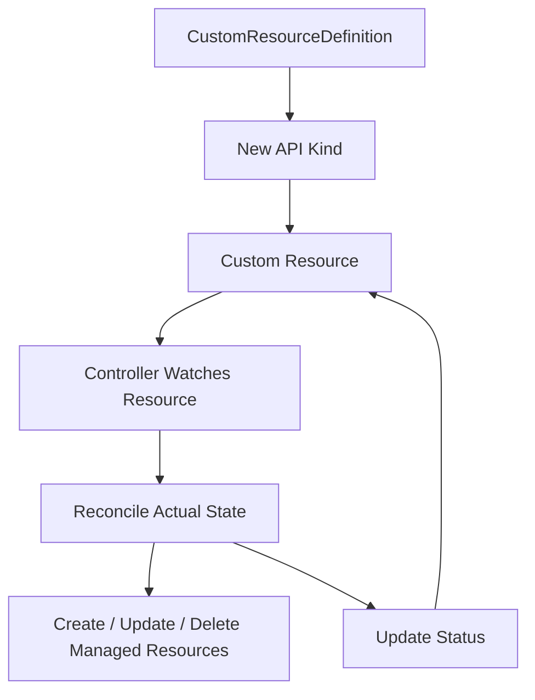
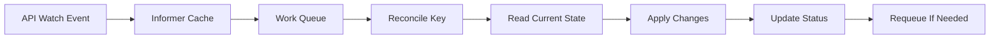
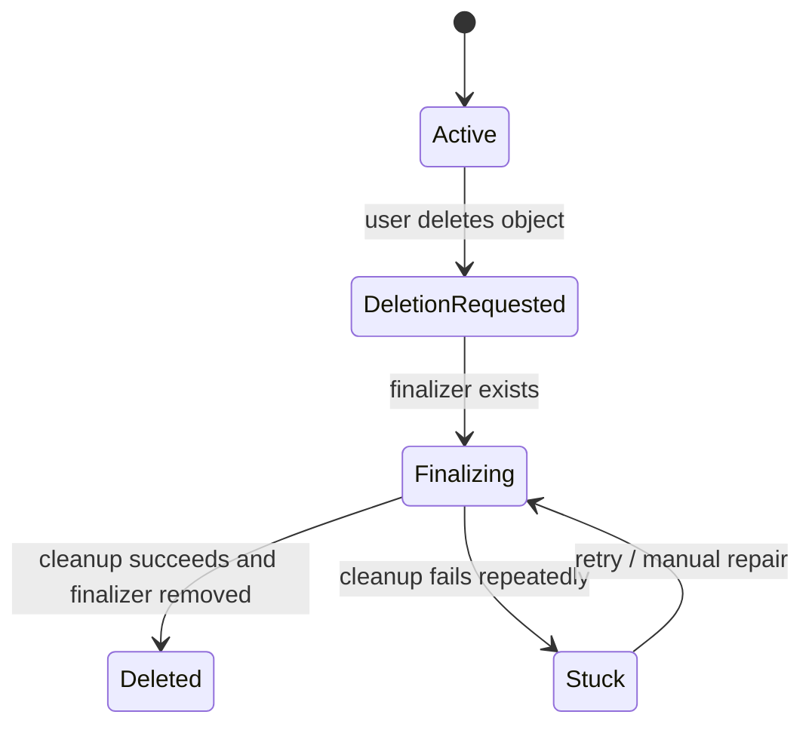
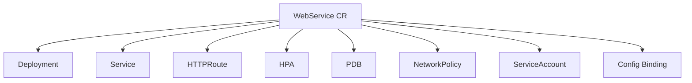
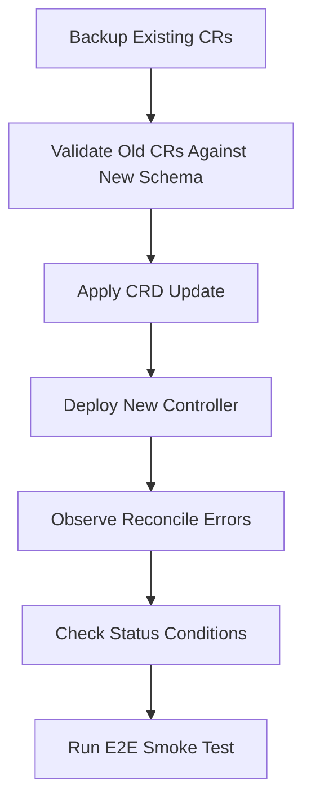

------
title: Learn Kubernetes, Deployment Model, and Cloud Native Platform Engineering - Part 032
description: CustomResourceDefinitions, custom controllers, operators, and platform APIs, including Kubernetes API extension design, spec/status contracts, reconciliation loops, finalizers, conditions, conversion, governance, testing, and operator anti-patterns.
series: learn-kubernetes-deployment-model
seriesTitle: Learn Kubernetes, Deployment Model, and Cloud Native Platform Engineering
order: 32
partTitle: CRDs, Operators, and Platform APIs
tags:
- kubernetes
- crd
- operators
- controllers
- api-design
- platform-api
- reconciliation
- platform-engineering
- extensibility
- governance
- custom-resources
date: 2026-07-01
------

# Part 032 — CRDs, Operators, and Platform APIs

## 1. Why This Part Exists

Kubernetes is not only a container orchestrator.

It is also an API platform.

This is the point where many senior engineers cross from:

```text
I deploy applications on Kubernetes.
```

into:

```text
I can extend Kubernetes safely to encode platform-level workflows, policies, and abstractions.
```

CustomResourceDefinitions, custom controllers, and operators let you add new API types to Kubernetes.

That is extremely powerful.

It is also dangerous.

A bad CRD creates another YAML format that nobody trusts.

A good CRD becomes a stable internal platform API.

A bad operator is an unreliable script running forever with cluster credentials.

A good operator is a deterministic reconciliation controller that encodes operational expertise.

This part teaches the difference.

---

## 2. The Mental Model

Kubernetes works through this loop:

```text
User declares desired state -> API server stores object -> controller observes object -> controller reconciles actual state -> controller updates status
```

A CRD adds a new kind of object.

A controller gives that object behavior.

An operator is a controller that encodes domain-specific operational knowledge.



Example:

```yaml
apiVersion: platform.example.com/v1
kind: WebService
metadata:
  name: checkout-api
spec:
  image: registry.example.com/payments/checkout-api@sha256:abc123
  port: 8080
  replicas: 4
  publicRoute:
    host: checkout.example.com
```

This object is not useful by itself.

It becomes useful when a controller reconciles it into lower-level resources:

```text
WebService -> Deployment + Service + HTTPRoute + HPA + PDB + NetworkPolicy + ServiceAccount
```

The platform API hides repetitive complexity while preserving operational intent.

---

## 3. Vocabulary Precision

These terms are often mixed incorrectly.

| Term | Meaning |
|---|---|
| Custom Resource | An instance of an API type added to Kubernetes. |
| CustomResourceDefinition | The API object that defines a new custom resource type. |
| Controller | A process that watches state and reconciles actual state toward desired state. |
| Operator | A controller that automates domain-specific operational tasks. |
| Platform API | A higher-level internal API exposed to developers or platform users. |
| Operand | The thing managed by an operator, often an application or infrastructure component. |
| Reconciler | The function/loop that compares desired and actual state and takes action. |

A CRD without a controller is mostly structured storage.

A controller without a clear API contract is hidden automation.

A platform API without governance becomes another unmanaged interface.

---

## 4. When Should You Create a CRD?

Do not create a CRD just because YAML is repetitive.

Use a CRD when you need a real API abstraction.

Good reasons:

- You need to expose a stable self-service API to application teams.
- You need to encode lifecycle automation.
- You need status and conditions visible through Kubernetes.
- You need ownership, RBAC, admission, and audit through the Kubernetes API.
- You need controllers to reconcile external or internal resources.
- You need to compose multiple Kubernetes primitives behind one domain object.
- You need declarative management of operational workflows.

Bad reasons:

- You want to hide all Kubernetes concepts from engineers.
- You want to avoid writing documentation.
- You want to replace Helm values with another unvalidated YAML blob.
- You need a one-time script.
- You need complex transactional workflows better handled outside Kubernetes.
- You do not have a team willing to own API compatibility.

Decision test:

```text
If users can declare intent and a controller can continuously reconcile it, a CRD may fit.
If the operation is one-shot, interactive, or highly transactional, a CRD may be the wrong abstraction.
```

---

## 5. CRD as API Design, Not YAML Design

A CRD is an API.

That means you must design it like an API.

Ask:

```text
Who are the users?
What intent do they declare?
What invariants must always hold?
What fields are stable?
What fields are implementation details?
What status do users need?
How will versions evolve?
How will invalid specs be rejected?
How will deletion behave?
```

Bad CRD:

```yaml
apiVersion: platform.example.com/v1
kind: App
spec:
  deploymentYaml: |
    apiVersion: apps/v1
    kind: Deployment
    ...
```

This adds no useful abstraction.

Better CRD:

```yaml
apiVersion: platform.example.com/v1
kind: WebService
spec:
  image: registry.example.com/payments/checkout-api@sha256:abc123
  port: 8080
  replicas: 4
  exposure:
    type: public
    host: checkout.example.com
  resources:
    tier: standard
  reliability:
    minAvailable: 3
```

This expresses domain-level intent.

The controller maps intent to Kubernetes primitives.

---

## 6. CRD Anatomy

A simplified CRD:

```yaml
apiVersion: apiextensions.k8s.io/v1
kind: CustomResourceDefinition
metadata:
  name: webservices.platform.example.com
spec:
  group: platform.example.com
  scope: Namespaced
  names:
    plural: webservices
    singular: webservice
    kind: WebService
    shortNames:
    - ws
  versions:
  - name: v1
    served: true
    storage: true
    schema:
      openAPIV3Schema:
        type: object
        required:
        - spec
        properties:
          spec:
            type: object
            required:
            - image
            - port
            properties:
              image:
                type: string
              port:
                type: integer
                minimum: 1
                maximum: 65535
              replicas:
                type: integer
                minimum: 1
          status:
            type: object
            properties:
              observedGeneration:
                type: integer
              conditions:
                type: array
                items:
                  type: object
                  properties:
                    type:
                      type: string
                    status:
                      type: string
                    reason:
                      type: string
                    message:
                      type: string
    subresources:
      status: {}
    additionalPrinterColumns:
    - name: Ready
      type: string
      jsonPath: .status.conditions[?(@.type=="Ready")].status
    - name: Image
      type: string
      jsonPath: .spec.image
```

Important pieces:

| Field | Purpose |
|---|---|
| `group` | API group, usually domain-owned. |
| `scope` | `Namespaced` or `Cluster`. |
| `names` | Kind, plural, singular, short names. |
| `versions` | Served/storage API versions. |
| `schema` | Validation schema. |
| `subresources.status` | Allows status to be updated separately from spec. |
| `additionalPrinterColumns` | Improves `kubectl get` usability. |

---

## 7. `spec` and `status` Contract

This is the most important API rule.

```text
spec   -> user-owned desired state
status -> controller-owned observed state
```

Users write `spec`.

Controllers write `status`.

Do not mix them.

### 7.1 Good `spec`

```yaml
spec:
  image: registry.example.com/payments/checkout-api@sha256:abc123
  replicas: 4
  port: 8080
  publicRoute:
    host: checkout.example.com
```

This describes desired state.

### 7.2 Good `status`

```yaml
status:
  observedGeneration: 7
  conditions:
  - type: Ready
    status: "True"
    reason: ResourcesAvailable
    message: Deployment, Service, and HTTPRoute are ready
  endpoint: https://checkout.example.com
  managedResources:
  - kind: Deployment
    name: checkout-api
  - kind: Service
    name: checkout-api
```

This describes observed state.

### 7.3 `observedGeneration`

`metadata.generation` changes when `spec` changes.

A controller should copy the generation it has processed into status:

```yaml
status:
  observedGeneration: 7
```

This lets users know whether status reflects the latest desired state.

If:

```text
metadata.generation != status.observedGeneration
```

then status may be stale.

---

## 8. Conditions

Conditions are a standard way to communicate status.

A condition should answer:

```text
What aspect of the resource is true, false, or unknown?
Why?
Since when?
What should the user know?
```

Example:

```yaml
status:
  conditions:
  - type: Ready
    status: "False"
    reason: DeploymentUnavailable
    message: Deployment checkout-api has 0 available replicas
    observedGeneration: 8
    lastTransitionTime: "2026-07-01T10:00:00Z"
  - type: RouteReady
    status: "True"
    reason: HTTPRouteAccepted
    message: Gateway accepted the route
```

Useful condition types:

| Condition | Meaning |
|---|---|
| `Ready` | Overall resource is ready. |
| `Accepted` | Spec is accepted by the controller. |
| `Progressing` | Reconciliation is in progress. |
| `Degraded` | Resource exists but is unhealthy. |
| `Available` | Backing service is available. |
| `Provisioned` | External or dependent resource exists. |

Avoid vague conditions like:

```text
Status: Failed
```

Explain why and where.

---

## 9. Reconciliation Loop

The controller's job is not to run commands.

Its job is to reconcile.

Pseudocode:

```text
on event or resync:
  read custom resource
  if resource is being deleted:
    run finalization if needed
    remove finalizer
    return

  validate / default assumed state
  read existing managed resources
  compare desired state to actual state
  create/update/delete managed resources as needed
  update status
  requeue if waiting for external readiness
```

A reconciler must be:

| Property | Meaning |
|---|---|
| Idempotent | Running it multiple times produces the same desired outcome. |
| Level-triggered | It reacts to current state, not only events. |
| Eventually consistent | It assumes operations may complete later. |
| Observable | It writes useful status and emits events. |
| Safe under retries | Failure and retry do not corrupt state. |
| Permission-scoped | It has only the access it needs. |

Bad reconciler:

```text
When object is created, run imperative script once.
```

Good reconciler:

```text
At every reconcile, compare desired and actual state and repair drift.
```

---

## 10. Controller Work Queue Mental Model

Controllers usually use informers/watchers and a rate-limited work queue.



Important point:

```text
Events tell the controller something changed.
The controller must still read current state from the API/cache.
```

Never assume the event contains everything you need.

Events can be missed, compressed, delayed, or superseded.

The reconciler must converge from current state.

---

## 11. Ownership and Managed Resources

A controller often creates child resources.

Example:

```text
WebService checkout-api
  owns Deployment checkout-api
  owns Service checkout-api
  owns HTTPRoute checkout-api
  owns HPA checkout-api
  owns PDB checkout-api
```

Use `ownerReferences` for Kubernetes-owned child resources where appropriate.

```yaml
metadata:
  ownerReferences:
  - apiVersion: platform.example.com/v1
    kind: WebService
    name: checkout-api
    uid: ...
    controller: true
    blockOwnerDeletion: true
```

Owner references enable garbage collection.

But they have scope rules and security implications.

For external resources, Kubernetes garbage collection does not apply.

You need finalizers.

---

## 12. Finalizers and Deletion Semantics

Finalizers delay deletion until cleanup is complete.

Example:

```yaml
metadata:
  finalizers:
  - platform.example.com/finalizer
```

Deletion flow:



Use finalizers when:

- external cloud resources must be deleted or detached
- DNS records must be removed
- certificates must be revoked
- backup/export must happen before deletion
- business lifecycle rules require cleanup

Finalizers are dangerous when:

- cleanup is not idempotent
- external API is unavailable
- controller is uninstalled
- permissions are revoked
- there is no manual recovery runbook

Production rule:

```text
Every finalizer must have a documented stuck-finalizer recovery procedure.
```

Never add finalizers casually.

---

## 13. Validation and Defaulting

CRDs support schema validation through OpenAPI v3 schema.

Use it aggressively.

Bad:

```yaml
spec:
  replicas: -1
  port: 999999
```

Schema should reject this before it reaches the controller.

Example:

```yaml
replicas:
  type: integer
  minimum: 1
  maximum: 100
port:
  type: integer
  minimum: 1
  maximum: 65535
```

Defaulting can fill safe defaults.

Example:

```yaml
replicas:
  type: integer
  minimum: 1
  default: 2
```

But defaults are part of the API contract.

Changing a default can change behavior for future objects.

Be explicit about defaults in documentation.

---

## 14. API Versioning

CRDs can serve multiple versions.

Example:

```yaml
versions:
- name: v1alpha1
  served: true
  storage: false
- name: v1beta1
  served: true
  storage: false
- name: v1
  served: true
  storage: true
```

Concepts:

| Concept | Meaning |
|---|---|
| Served version | API server accepts requests for this version. |
| Storage version | Version used to persist objects in etcd. |
| Conversion | Translation between versions. |
| Deprecation | Version remains served but should not be used. |

API evolution rule:

```text
Do not break existing users silently.
```

Safe changes:

- add optional fields
- add status fields
- add enum values if clients tolerate them
- strengthen documentation

Dangerous changes:

- rename fields
- change meaning of existing fields
- remove fields
- make optional fields required
- change default behavior
- change status semantics relied on by automation

For serious platform APIs, design upgrade paths before exposing v1.

---

## 15. Conversion Webhooks

When versions diverge structurally, you may need conversion webhooks.

Example:

```text
v1alpha1.spec.public: true
```

becomes:

```text
v1.spec.exposure.type: Public
```

A conversion webhook converts between versions.

Risks:

- API availability may depend on webhook availability
- conversion bugs can corrupt meaning
- webhook certificates expire
- storage migration can be complex
- rollout order matters

Production rule:

```text
Avoid conversion webhooks unless the API value justifies the operational cost.
```

If you need them, test upgrade and downgrade paths thoroughly.

---

## 16. Designing Platform APIs

A platform API should expose developer intent while preserving platform control.

Example domain:

```yaml
apiVersion: platform.example.com/v1
kind: WebService
metadata:
  name: case-review-api
  namespace: enforcement
spec:
  image: registry.example.com/enforcement/case-review-api@sha256:abc123
  port: 8080
  replicas: 3
  exposure:
    type: internal
  reliability:
    minAvailable: 2
  resources:
    class: standard
  dependencies:
  - name: enforcement-db
    type: postgres
```

This CRD hides:

- Deployment shape
- Service wiring
- NetworkPolicy baseline
- HPA defaults
- PDB setup
- Gateway/Route details
- ServiceAccount annotations
- standard labels

But it exposes:

- image
- port
- scale intent
- exposure intent
- reliability intent
- dependency declarations

Good platform APIs remove accidental complexity, not essential operational responsibility.

---

## 17. Platform API Layering

A platform API can reconcile to multiple layers:



But every generated object should still be inspectable.

A platform API should not become a black box.

Users should be able to answer:

```text
What did my WebService create?
Why is it not ready?
What field do I change to fix it?
What policy blocked it?
Who owns the generated Deployment?
```

---

## 18. Operator Maturity Model

Not all operators are equal.

| Level | Capability |
|---|---|
| 1 | Install managed resources. |
| 2 | Upgrade managed resources safely. |
| 3 | Monitor health and update status. |
| 4 | Backup, restore, and recover. |
| 5 | Scale, fail over, and self-heal complex failures. |

For simple platform APIs, Level 1-3 may be enough.

For databases or stateful systems, Level 4-5 may be required.

Do not call something a production-grade operator if it only creates a Deployment.

That is a controller, not necessarily an operator with operational expertise.

---

## 19. External Resource Operators

Many operators manage external resources:

- cloud databases
- DNS records
- certificates
- queues
- buckets
- identity bindings
- SaaS integrations

Example:

```yaml
apiVersion: platform.example.com/v1
kind: DatabaseClaim
metadata:
  name: enforcement-db
spec:
  engine: postgres
  size: medium
  backupPolicy: gold
  retentionDays: 35
```

Controller actions:

```text
create cloud database
create Kubernetes Secret reference
write status endpoint
enforce backup policy
handle deletion finalizer
```

External resources add risks:

| Risk | Example |
|---|---|
| Partial failure | Cloud DB created but Secret update failed. |
| Rate limit | Cloud API throttles reconcile. |
| Cost leak | Deleted CR leaves external resource. |
| Destructive cleanup | Finalizer deletes data unexpectedly. |
| Credential scope | Controller has broad cloud permissions. |
| Drift | External resource manually changed. |

Operators managing external resources need stronger lifecycle governance than operators managing only Kubernetes objects.

---

## 20. Reconciliation Failure Modes

### 20.1 Non-Idempotent Reconcile

Bad:

```text
Every reconcile creates a new database.
```

Good:

```text
Reconcile checks whether the desired database exists, then creates only if missing.
```

### 20.2 Status Lies

Bad:

```yaml
status:
  ready: true
```

while managed Deployment has zero available replicas.

Good:

```yaml
conditions:
- type: Ready
  status: "False"
  reason: DeploymentUnavailable
```

### 20.3 Finalizer Deadlock

The object cannot be deleted because the controller is gone or cleanup always fails.

Mitigation:

- documented manual finalizer removal procedure
- external resource inventory
- cleanup idempotency
- alert on stuck finalizers

### 20.4 Infinite Reconcile Loop

Controller keeps updating the same field, triggering itself again.

Causes:

- non-deterministic generated fields
- timestamp written to spec/metadata each loop
- server defaulting not accounted for
- fighting with another controller

### 20.5 Ownership Conflict

Two controllers manage the same field or object.

Mitigation:

- clear owner labels
- ownerReferences
- server-side apply field ownership awareness
- documented generated resources

### 20.6 Privilege Explosion

Controller needs broad permissions and becomes a high-value attack target.

Mitigation:

- namespace scoping where possible
- narrow RBAC
- separate controllers per responsibility
- admission constraints
- audit logs

---

## 21. Controller Design Invariants

A high-quality controller should satisfy these invariants:

```text
1. Reconcile is idempotent.
2. Spec is user-owned.
3. Status is controller-owned.
4. Status reflects observedGeneration.
5. Finalizers are idempotent and recoverable.
6. Managed resources are deterministic.
7. Child resource names are stable.
8. Controller handles missing children by recreating them.
9. Controller handles extra unknown objects safely.
10. Controller can restart without losing correctness.
11. Controller permissions are least privilege.
12. API versioning is planned.
13. Conditions explain readiness and failure.
```

If these are not true, the operator is not production-ready.

---

## 22. RBAC for Controllers

Controllers often need permissions to watch custom resources and manage children.

Example Role:

```yaml
apiVersion: rbac.authorization.k8s.io/v1
kind: Role
metadata:
  name: webservice-controller
rules:
- apiGroups: ["platform.example.com"]
  resources: ["webservices"]
  verbs: ["get", "list", "watch"]
- apiGroups: ["platform.example.com"]
  resources: ["webservices/status"]
  verbs: ["patch", "update"]
- apiGroups: ["apps"]
  resources: ["deployments"]
  verbs: ["get", "list", "watch", "create", "patch", "update", "delete"]
- apiGroups: [""]
  resources: ["services"]
  verbs: ["get", "list", "watch", "create", "patch", "update", "delete"]
```

Avoid:

```yaml
verbs: ["*"]
resources: ["*"]
```

unless there is a very strong reason.

An operator is automation with credentials.

Treat it like a privileged production service.

---

## 23. Admission Policy Around CRDs

CRD schema validation is not always enough.

Use admission policy when rules depend on:

- namespace labels
- user identity
- environment
- organization policy
- cross-field constraints beyond schema
- external policy sources

Example policies:

```text
Only platform team can create Cluster-scoped platform APIs.
Production WebService must use image digest.
Public exposure requires approved domain.
DatabaseClaim retentionDays must be >= 30 in regulated namespaces.
Only approved resource classes are allowed.
```

This links Part 024 to CRD design.

A platform API without admission governance is too easy to misuse.

---

## 24. Observability for Operators

An operator should expose:

- reconcile count
- reconcile error count
- reconcile duration
- queue depth
- requeue count
- external API error count
- managed resource readiness
- stuck finalizer count
- condition distribution

Useful logs:

```text
resource namespace/name
generation
operation
managed resource
reason
error
correlation id
```

Do not log secrets.

Operator observability should support questions like:

```text
Which resources are degraded?
Why did reconciliation fail?
Is the controller falling behind?
Is an external API degraded?
Did a new controller version increase reconcile errors?
```

---

## 25. Testing Strategy

Testing an operator requires multiple layers.

| Test Type | What It Verifies |
|---|---|
| Unit tests | Pure transformation logic. |
| Reconcile tests | Desired child resources are produced. |
| API schema tests | Invalid specs are rejected. |
| Envtest/integration tests | Controller works against API server behavior. |
| Kind/e2e tests | Real cluster behavior. |
| Upgrade tests | Old CRs still work after new controller/CRD. |
| Failure tests | External errors, API conflicts, missing resources. |
| Security tests | RBAC scope, admission policies, secret handling. |

Test scenarios:

```text
Create CR -> children created -> status Ready.
Change spec -> children updated -> observedGeneration updated.
Delete child -> controller recreates child.
Delete CR -> finalizer cleanup runs -> CR removed.
External API fails -> status Degraded -> retry.
Invalid spec -> API rejects before reconcile.
Old version object -> conversion/defaulting works.
```

Do not test only the happy path.

Controllers live in failure states.

---

## 26. Upgrade Strategy for Operators

Operator upgrades are risky because they change automation logic.

Review:

```text
1. CRD schema changes
2. storage version changes
3. conversion webhook changes
4. default changes
5. controller RBAC changes
6. managed resource naming changes
7. finalizer changes
8. status condition changes
9. generated child resource changes
10. external API behavior changes
```

Safe upgrade flow:



Do not upgrade CRD, controller, and dependent applications blindly in one step.

---

## 27. Operator Anti-Patterns

### 27.1 CRD as YAML Wrapper

If the CRD only embeds raw Deployment YAML, it adds little value.

### 27.2 Hidden Irreversible Actions

If setting a field deletes production data, the API is unsafe.

Make destructive actions explicit and guarded.

### 27.3 No Status

A CRD without useful status forces users to inspect implementation details.

### 27.4 Controller Fights Human Changes Without Explanation

If a human changes a managed Deployment, the controller may revert it.

That is fine only if ownership is clear and status/events explain it.

### 27.5 One Giant Platform CRD

A `PlatformApplication` CRD that manages everything becomes a distributed monolith.

Prefer smaller composable APIs.

### 27.6 Meta-Operator Explosion

An operator that installs other operators, which install other operators, creates lifecycle ambiguity.

Be very careful with operators managing operators.

### 27.7 No Compatibility Promise

If users build workflows on your CRD, you own compatibility.

Treat it like an API product.

### 27.8 Broad Cluster Admin Permissions

Controllers with cluster-admin access are easy to build and hard to justify.

Use least privilege.

### 27.9 Finalizers Without Escape Hatch

Every finalizer must have an emergency recovery story.

### 27.10 Reconcile Logic Depends on Wall-Clock Luck

Controllers should not rely on exact event timing.

They should converge from observed state.

---

## 28. Platform API Example: Regulated Case Management

Suppose a regulatory enforcement platform deploys multiple case-management services.

Teams need:

- audit-safe deployment
- consistent mTLS/network policy
- standard resource classes
- approved ingress routing
- database binding
- observability defaults
- rollout safety
- regulated namespace controls

A platform CRD could expose:

```yaml
apiVersion: platform.example.com/v1
kind: RegulatedService
metadata:
  name: investigation-workflow-api
  namespace: enforcement-prod
spec:
  image: registry.example.com/enforcement/investigation-workflow-api@sha256:abc123
  port: 8080
  classification: restricted
  exposure:
    type: internal
  reliability:
    minAvailable: 3
    maxUnavailable: 0
  dataAccess:
    databaseClaim: enforcement-case-db
    auditTopic: enforcement-audit-events
  observability:
    sloProfile: critical-api
```

Controller output:

```text
Deployment
Service
HTTPRoute or internal route
NetworkPolicy
ServiceAccount
PodDisruptionBudget
HorizontalPodAutoscaler
Config binding
Audit annotations
SLO/monitoring resources
```

This is a strong platform API because it encodes domain constraints.

But the platform team must own:

- versioning
- documentation
- migration
- support
- operational readiness
- policy enforcement
- incident response

A CRD is not a shortcut around platform responsibility.

It is a formalization of it.

---

## 29. API Shape Review Checklist

Before exposing a CRD:

- [ ] the user persona is clear
- [ ] the declared intent is clear
- [ ] spec fields are not implementation leakage
- [ ] required fields are minimal but sufficient
- [ ] default behavior is documented
- [ ] validation schema is strict enough
- [ ] status has useful conditions
- [ ] observedGeneration is used
- [ ] deletion behavior is documented
- [ ] finalizers are recoverable
- [ ] versioning strategy exists
- [ ] RBAC model is defined
- [ ] admission policies are defined
- [ ] generated resources are documented
- [ ] observability exists
- [ ] test strategy covers failure modes
- [ ] support ownership is explicit

---

## 30. Controller Readiness Checklist

Before running a controller in production:

- [ ] idempotent reconcile
- [ ] deterministic child resources
- [ ] safe retry behavior
- [ ] conflict handling
- [ ] rate limiting
- [ ] useful status conditions
- [ ] events for important transitions
- [ ] metrics for reconcile health
- [ ] least-privilege RBAC
- [ ] leader election if highly available
- [ ] graceful shutdown
- [ ] stuck finalizer alerts
- [ ] upgrade tests
- [ ] downgrade or rollback plan
- [ ] external API failure handling
- [ ] backup/restore plan for CRs

---

## 31. Practice Drills

### Drill 1 — CRD or Not?

For each scenario, decide whether a CRD is appropriate:

```text
1. Deploying a web service with standard platform controls.
2. Running a one-time data migration.
3. Provisioning a cloud database with backup policy.
4. Setting five environment variables differently in staging.
5. Managing tenant onboarding workflow.
6. Installing a third-party monitoring stack.
```

Explain your answer using:

```text
intent, lifecycle, reconciliation, status, ownership, compatibility
```

### Drill 2 — Design `spec` and `status`

Design a `DatabaseClaim` CRD.

Include:

- engine
- size class
- backup policy
- retention
- status endpoint
- status conditions
- deletion policy

Then identify which fields are user-owned and which are controller-owned.

### Drill 3 — Reconcile Failure Simulation

Given a `WebService`, simulate:

```text
Deployment creation succeeds.
Service creation succeeds.
HTTPRoute creation fails.
```

What should status say?

What should the controller retry?

What event should be emitted?

### Drill 4 — Finalizer Recovery

Design a runbook for:

```text
A DatabaseClaim is stuck deleting because the cloud database API is unavailable.
```

Include:

- evidence to collect
- safe manual actions
- external resource check
- when to remove finalizer
- audit record

### Drill 5 — Version Evolution

You have:

```yaml
v1alpha1.spec.public: true
```

You want:

```yaml
v1.spec.exposure.type: Public
```

Design a migration path.

Explain whether you need conversion webhook, migration job, or manual transition.

---

## 32. Senior-Level Mental Model

CRDs and operators are not advanced because the YAML is complex.

They are advanced because they turn Kubernetes into an API extension platform.

That means you are now responsible for:

```text
API design
compatibility
reconciliation correctness
security
status semantics
failure recovery
delete behavior
upgrade safety
multi-team governance
```

The best operator feels boring.

It watches desired state, compares actual state, performs minimal safe changes, records status, and retries until convergence.

The best platform API gives users a small, stable language for declaring intent while the platform handles repetitive operational details.

The worst platform API hides complexity without removing it.

The top 1% engineering standard is this:

```text
Do not extend Kubernetes unless the abstraction creates a safer, clearer, more governable operating model than the primitives it replaces.
```

---

## 33. References

- Kubernetes Documentation — Custom Resources: https://kubernetes.io/docs/concepts/extend-kubernetes/api-extension/custom-resources/
- Kubernetes Documentation — Extend the Kubernetes API with CustomResourceDefinitions: https://kubernetes.io/docs/tasks/extend-kubernetes/custom-resources/custom-resource-definitions/
- Kubernetes Documentation — Operator Pattern: https://kubernetes.io/docs/concepts/extend-kubernetes/operator/
- Kubernetes Documentation — Controllers: https://kubernetes.io/docs/concepts/architecture/controller/
- Kubernetes Documentation — API Concepts: https://kubernetes.io/docs/reference/using-api/api-concepts/
- Kubernetes Documentation — Finalizers: https://kubernetes.io/docs/concepts/overview/working-with-objects/finalizers/
- Kubernetes Documentation — Garbage Collection: https://kubernetes.io/docs/concepts/architecture/garbage-collection/
- Operator SDK Documentation: https://sdk.operatorframework.io/
- Operator SDK Best Practices — Common Recommendations: https://sdk.operatorframework.io/docs/best-practices/common-recommendation/
