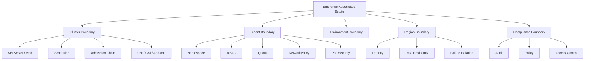
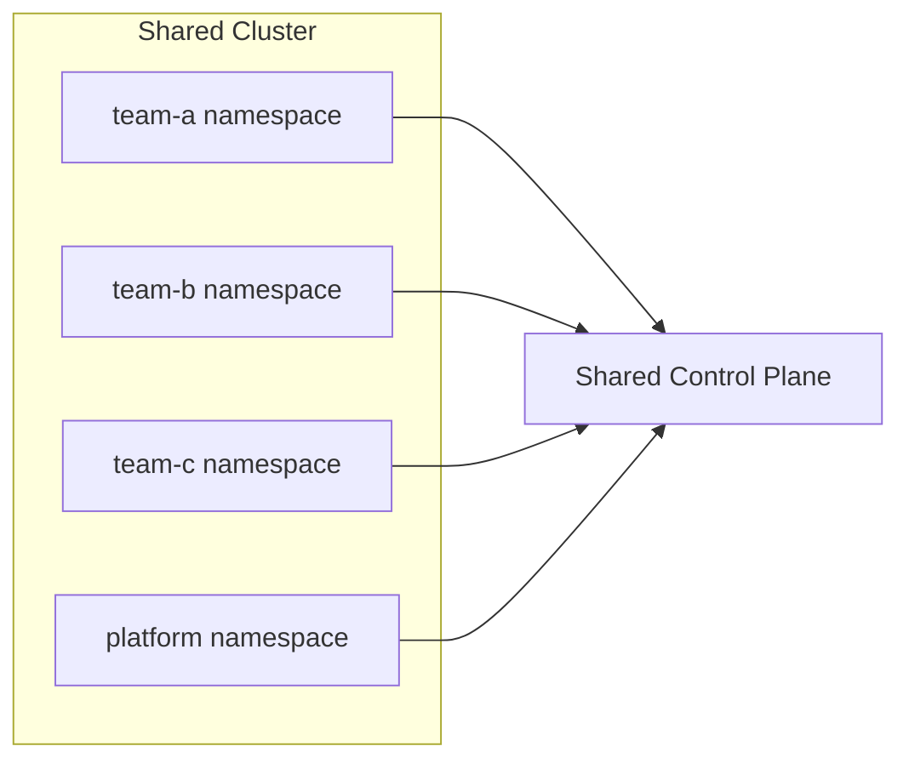
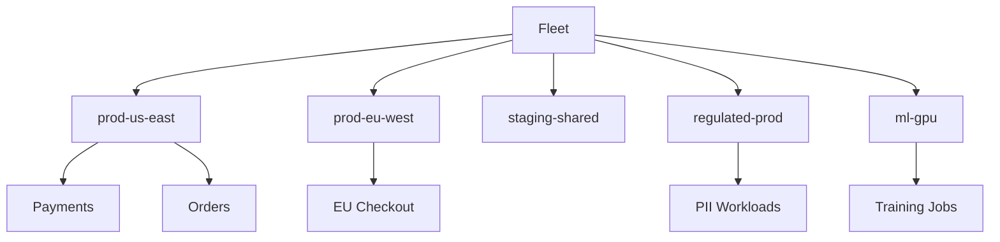
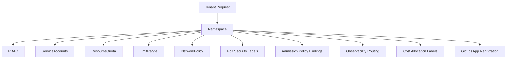
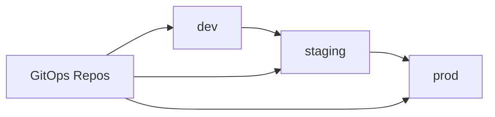
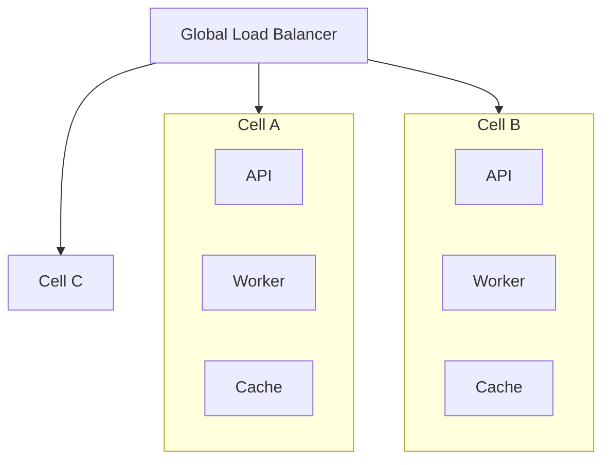
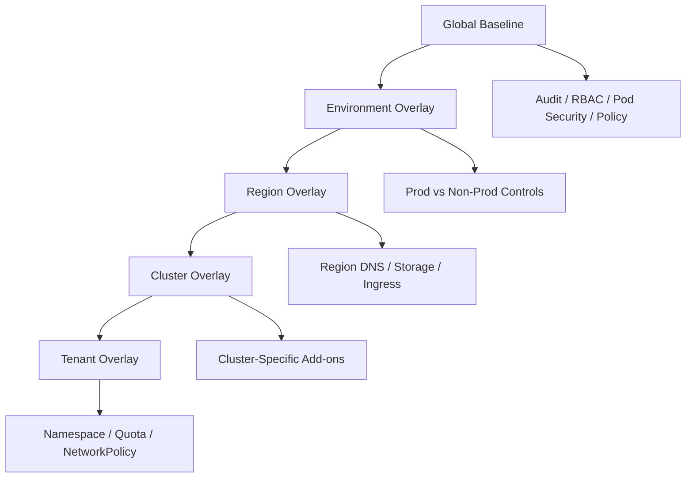
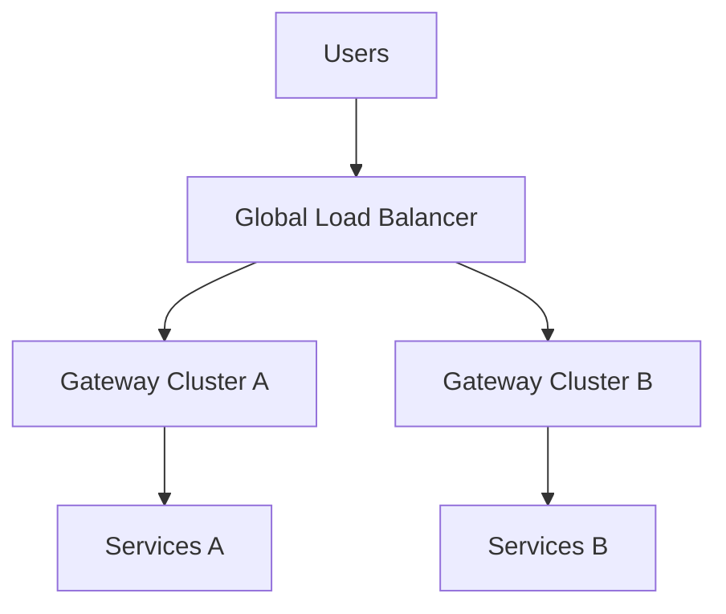
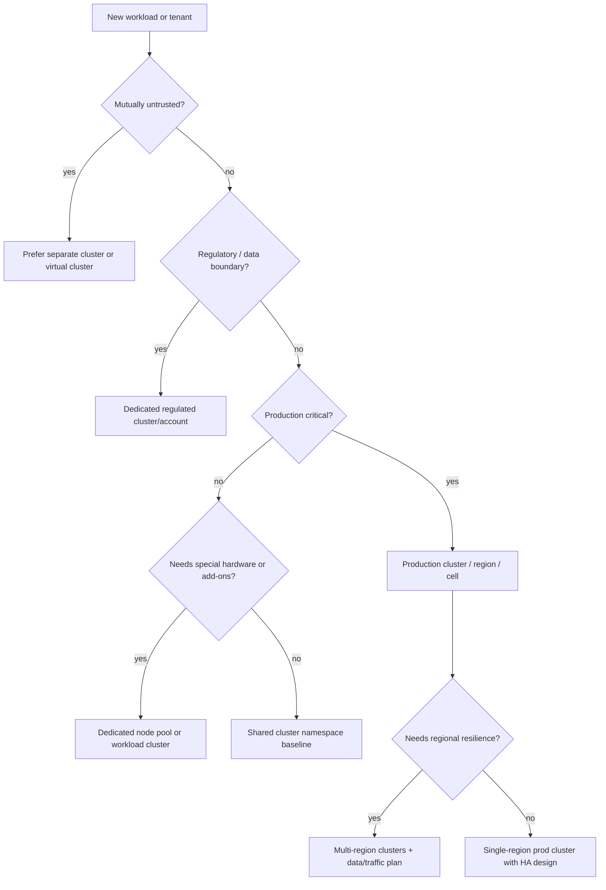
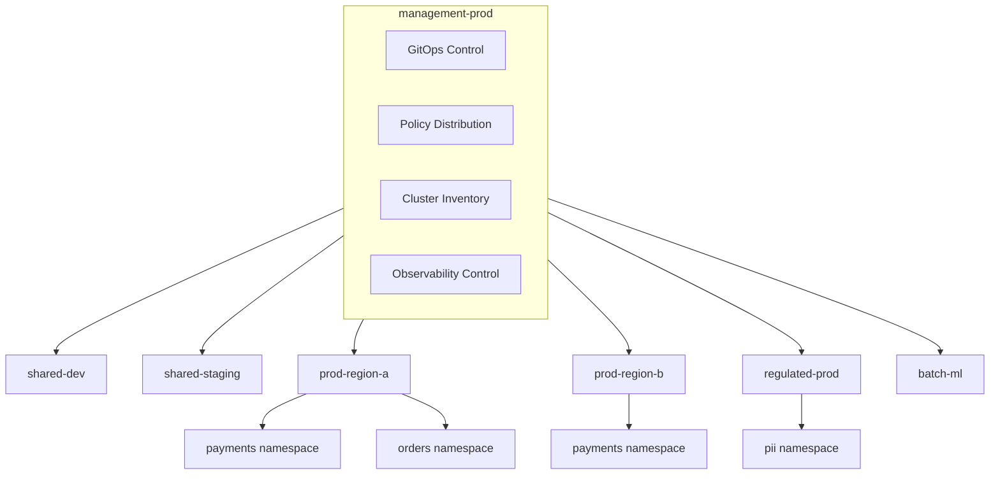

------
title: Learn Kubernetes, Deployment Model, and Cloud Native Platform Engineering - Part 033
description: Multi-cluster, multi-tenant, and enterprise Kubernetes topology design, including tenancy isolation models, fleet governance, namespace architecture, cluster-per-boundary decisions, multi-region strategy, policy distribution, and operational failure modelling.
series: learn-kubernetes-deployment-model
seriesTitle: Learn Kubernetes, Deployment Model, and Cloud Native Platform Engineering
order: 33
partTitle: Multi-Cluster, Multi-Tenant, and Enterprise Topologies
tags:
- kubernetes
- multi-cluster
- multi-tenant
- enterprise-architecture
- platform-engineering
- fleet-management
- governance
- namespaces
- rbac
- network-policy
- resource-quota
- topology
- reliability
date: 2026-07-01
------

# Part 033 — Multi-Cluster, Multi-Tenant, and Enterprise Topologies

## 1. Why This Part Exists

A production Kubernetes platform eventually stops being a single cluster problem.

At small scale, the question is:

```text
How do I deploy this application?
```

At enterprise scale, the question becomes:

```text
Where should this workload live, who is allowed to affect it, what failure domain contains it, and how do we operate hundreds of similar boundaries consistently?
```

That is the real topic of this part.

Multi-cluster and multi-tenant architecture is not about showing that we can run many clusters.

It is about deciding where isolation boundaries should exist.

A cluster is a technical object.

A topology is an operating model.

A tenant is not always a customer. A tenant can be:

- a product team
- a business unit
- a regulatory domain
- an environment
- a customer segment
- an internal platform service
- a region
- a workload class
- a data-sensitivity category

Kubernetes gives primitives: namespaces, RBAC, ResourceQuota, NetworkPolicy, admission policy, Pod Security Admission, storage classes, service accounts, node pools, and clusters.

It does not automatically give a safe tenancy model.

That model must be designed.

---

## 2. Kaufman Skill Target

Using Kaufman's learning frame, this part targets the subskill:

```text
Design Kubernetes cluster and tenant topology based on isolation, failure domain, governance, cost, and operational complexity.
```

After this part, you should be able to:

1. Decide when a namespace boundary is enough.
2. Decide when a separate cluster is justified.
3. Recognize false economy in over-shared clusters.
4. Recognize operational waste in cluster-per-everything designs.
5. Design a tenant baseline that includes identity, quota, policy, network, and observability.
6. Design multi-cluster topology around region, environment, compliance, and blast radius.
7. Explain why Kubernetes federation is not a universal answer.
8. Build a fleet governance model that scales beyond one cluster.

The point is not to memorize every product in the multi-cluster ecosystem.

The point is to reason from invariants.

---

## 3. The Core Mental Model

A Kubernetes cluster is simultaneously:

| Dimension | Meaning |
|---|---|
| API boundary | Objects are stored and reconciled in one API server/etcd system. |
| Failure boundary | Control-plane, add-on, node, and policy failures may affect workloads inside it. |
| Security boundary | RBAC, admission, Pod Security, and audit configuration apply inside it. |
| Scheduling boundary | Pods are scheduled only onto nodes in that cluster. |
| Network boundary | Service discovery and cluster IP networking are local unless extended. |
| Upgrade boundary | Kubernetes version, add-ons, CNI, CSI, and admission policy versions move together. |
| Governance boundary | Platform policy can be applied and audited per cluster. |

A tenant topology chooses how much of those boundaries tenants share.



The key design question:

```text
Which risks are acceptable to share, and which risks require a harder boundary?
```

---

## 4. Vocabulary Precision

| Term | Meaning |
|---|---|
| Tenant | A logical consumer of platform capacity and policy. It may be a team, product, customer, or domain. |
| Namespace tenancy | Multiple tenants share one cluster and are separated mainly by namespace-scoped controls. |
| Cluster tenancy | Each tenant or tenant group gets a separate cluster. |
| Soft multi-tenancy | Tenants are mostly trusted or organizationally aligned. Namespace controls may be sufficient. |
| Hard multi-tenancy | Tenants are mutually untrusted. Stronger isolation is required; often separate clusters or virtual clusters. |
| Fleet | A managed set of clusters operated as one estate. |
| Cell | A repeatable deployment unit containing app, infra dependencies, and capacity boundaries. |
| Control-plane isolation | Separation of Kubernetes API server, etcd, admission, and controller effects. |
| Data-plane isolation | Separation of workload runtime, network path, nodes, storage, and resource contention. |
| Blast radius | The maximum scope affected by a failure, misconfiguration, exploit, or noisy neighbor. |

---

## 5. The Dangerous Misframing

A weak Kubernetes topology discussion asks:

```text
How many clusters should we have?
```

A better question is:

```text
Which boundaries do we need, and what is the cheapest reliable primitive that enforces each boundary?
```

Examples:

| Requirement | Weak Answer | Better Reasoning |
|---|---|---|
| Team separation | One namespace per team | Add RBAC, quota, network policy, Pod Security, admission, cost attribution, audit, and ownership labels. |
| Production isolation | One prod namespace | Decide whether staging and prod may share API, control plane, CNI, admission, node pools, and add-ons. |
| Compliance isolation | Separate namespace | Often insufficient if control plane, admin roles, node pools, storage, and logging are shared. |
| Regional availability | Multi-cluster | Only useful if data replication, traffic routing, release promotion, and incident procedures exist. |
| Tenant fairness | ResourceQuota | Also need LimitRange, priority, autoscaling policy, per-tenant observability, and escalation workflow. |

Namespaces are useful.

Namespaces are not magic security containers.

Clusters are stronger boundaries.

Clusters are not free.

---

## 6. Single Cluster vs Multiple Clusters

### 6.1 Single Shared Cluster

A shared cluster can be effective when:

- teams are part of the same organization
- workloads have similar trust levels
- compliance boundaries are not strict
- platform team can enforce namespace baselines
- cost efficiency matters
- add-on and upgrade cadence can be shared
- tenants accept shared control-plane fate



Benefits:

| Benefit | Why It Matters |
|---|---|
| Better bin packing | More workloads share node capacity. |
| Lower operational overhead | Fewer clusters to upgrade, monitor, and secure. |
| Easier internal service discovery | Service-to-service communication can stay inside one cluster. |
| Faster platform rollout | Add-ons and policies can be deployed once. |

Risks:

| Risk | Consequence |
|---|---|
| Shared control plane | API outage affects many teams. |
| Misconfigured admission policy | Bad policy may block many tenants. |
| Noisy neighbor | One tenant can pressure node, API, DNS, CNI, or storage. |
| Permission leakage | RBAC mistake can expose other tenants. |
| Network lateral movement | Missing default-deny policy can allow unintended access. |
| Upgrade coupling | All tenants inherit the same cluster upgrade schedule. |

### 6.2 Multiple Clusters

Multiple clusters are justified when boundaries matter more than operational simplicity.

Common drivers:

| Driver | Why a Separate Cluster May Be Needed |
|---|---|
| Production vs non-production | Avoid test workloads affecting production API/control plane/add-ons. |
| Regulatory domain | Separate audit, admin access, logging, data residency, and policy. |
| Region | Latency, availability, data residency, and disaster recovery. |
| Tenant hard isolation | Reduce blast radius between mutually untrusted tenants. |
| Upgrade independence | Allow different lifecycle windows and compatibility matrices. |
| Workload class | GPU, batch, edge, regulated, low-latency, or high-risk workloads. |
| Organization boundary | Different teams own cluster lifecycle and budget. |



Benefits:

| Benefit | Why It Matters |
|---|---|
| Stronger blast-radius control | Cluster-level incidents are contained. |
| Better compliance posture | Separate audit, admin, data, and network boundaries. |
| Independent upgrades | Clusters can move on different schedules. |
| Regional deployment | Workloads can run near users/data. |
| Dedicated add-ons | CNI, CSI, ingress, mesh, and policy can differ. |

Costs:

| Cost | Impact |
|---|---|
| Operational overhead | More clusters to patch, monitor, govern, and inventory. |
| Fragmented capacity | Lower bin-packing efficiency. |
| More complex networking | Cross-cluster service discovery and routing required. |
| Tooling complexity | GitOps, observability, secrets, policy, and identity must become fleet-aware. |
| Inconsistent configuration risk | Drift increases without automation. |

---

## 7. Tenancy Isolation Models

### 7.1 Namespace-per-Team

```text
One cluster, one namespace per team or application group.
```

Typical baseline:

- namespace
- service account per workload
- RoleBinding per team
- ResourceQuota
- LimitRange
- NetworkPolicy default-deny
- Pod Security Admission label
- cost allocation labels
- standard observability labels
- policy exceptions registered in Git

This works for soft multi-tenancy.

It is not enough for hostile or legally separated tenants.

### 7.2 Namespace-per-Application

```text
One namespace per application or bounded service group.
```

Useful when:

- each app has separate release ownership
- app-specific secrets and policy matter
- blast radius must be narrow
- service accounts should not be shared across apps
- quota should be attributed per application

Trade-off:

- more namespaces
- more policy objects
- more GitOps inventory
- more onboarding automation required

This is often better than one namespace per large team because teams tend to grow into many applications with different risk levels.

### 7.3 Namespace-per-Environment

```text
dev, test, staging, prod namespaces in one cluster.
```

This is common, but risky.

For small systems, it is convenient.

For serious production, sharing dev and prod in one cluster often creates unnecessary coupling.

Risks:

- dev workload can pressure shared DNS/CNI/control plane
- aggressive experiments can hit admission or API limits
- broad admin rights leak into prod
- noisy CI workloads affect prod node pools
- upgrade testing cannot represent isolated prod behavior

A better pattern:

```text
Non-prod shared cluster + production cluster(s)
```

### 7.4 Cluster-per-Environment

```text
One or more clusters for dev/staging/prod.
```

This is the default mature enterprise pattern.

Example:

```text
shared-dev
shared-staging
prod-region-a
prod-region-b
regulated-prod
```

Benefits:

- production protected from non-prod activity
- upgrade canary starts in lower environment
- policy can be stricter in prod
- cost attribution is clearer
- rollback and incident operations are less ambiguous

### 7.5 Cluster-per-Tenant

Useful for:

- external customers with hard isolation needs
- strict compliance domains
- high-risk workloads
- high-value customers
- tenant-specific add-ons or versioning

Costs:

- many clusters
- automation required
- fleet management is mandatory
- per-tenant observability and cost are required
- underutilization risk

This pattern only works if cluster creation, baseline policy, upgrade, secret distribution, and audit are automated.

Manual cluster-per-tenant becomes operational debt.

### 7.6 Virtual Clusters

A virtual cluster provides an isolated Kubernetes API surface while sharing underlying host cluster resources.

This can help when:

- tenants need Kubernetes API autonomy
- namespace-only tenancy is too weak
- physical cluster-per-tenant is too expensive
- platform wants stronger control-plane separation experience

But virtual clusters do not remove all shared infrastructure risk.

You must evaluate:

- host cluster data-plane isolation
- storage isolation
- network isolation
- admission and policy ownership
- observability boundaries
- privileged workload restrictions
- escape and admin risk

---

## 8. Soft vs Hard Multi-Tenancy

### 8.1 Soft Multi-Tenancy

Soft multi-tenancy assumes tenants are not malicious, but they can make mistakes.

Controls focus on preventing accidents:

- namespace isolation
- least-privilege RBAC
- ResourceQuota
- LimitRange
- default-deny NetworkPolicy
- Pod Security restricted baseline
- admission validation
- standardized labels
- cost allocation
- self-service guardrails

Example:

```text
Internal product teams sharing a production platform.
```

### 8.2 Hard Multi-Tenancy

Hard multi-tenancy assumes tenants may be mutually untrusted or legally separated.

Controls require stronger boundaries:

- separate clusters
- dedicated node pools or nodes
- strict workload identity separation
- strong network isolation
- restricted privileged access
- separate logging/audit domains
- separate secrets and KMS boundaries
- policy exception approval
- administrative separation
- sometimes separate accounts/projects/subscriptions

Example:

```text
External customer workloads in a SaaS platform where one customer must not affect or observe another customer.
```

A useful rule:

```text
If tenant compromise must not expose control-plane, node, network, storage, audit, or admin surface used by another tenant, namespace isolation alone is probably insufficient.
```

---

## 9. The Tenant Baseline Pack

A production tenant should not be created as an empty namespace.

It should be created as a complete baseline.



### 9.1 Namespace

The namespace is the primary scoping unit for many Kubernetes resources.

Recommended labels:

```yaml
apiVersion: v1
kind: Namespace
metadata:
  name: payments-prod
  labels:
    platform.example.com/tenant: payments
    platform.example.com/environment: prod
    platform.example.com/data-classification: confidential
    platform.example.com/owner: payments-platform
    pod-security.kubernetes.io/enforce: restricted
    pod-security.kubernetes.io/audit: restricted
    pod-security.kubernetes.io/warn: restricted
```

### 9.2 RBAC

Do not bind broad cluster-admin rights to tenant teams.

A reasonable tenant role gives application teams control over their workload objects but not platform-critical objects.

Example capabilities:

| Allowed | Usually Restricted |
|---|---|
| Deployments | Nodes |
| StatefulSets | PersistentVolumes |
| Jobs | ClusterRoles |
| CronJobs | ValidatingWebhookConfiguration |
| Services | MutatingWebhookConfiguration |
| ConfigMaps | CustomResourceDefinitions |
| Secrets, with caution | StorageClasses |
| HorizontalPodAutoscalers | Namespaces |
| Events/read | PodSecurity admission labels |

Do not assume every team needs write access to Secrets.

Secret write access often equals privilege escalation because workloads can mount secrets and run with associated identity.

### 9.3 ResourceQuota

ResourceQuota constrains aggregate consumption in a namespace.

Example:

```yaml
apiVersion: v1
kind: ResourceQuota
metadata:
  name: tenant-quota
  namespace: payments-prod
spec:
  hard:
    requests.cpu: "20"
    requests.memory: 80Gi
    limits.cpu: "40"
    limits.memory: 120Gi
    pods: "100"
    services: "30"
    secrets: "100"
    configmaps: "100"
```

Quota is not just cost control.

It protects the control plane and other tenants from object explosion and capacity monopolization.

### 9.4 LimitRange

LimitRange provides defaults and per-object constraints.

Example:

```yaml
apiVersion: v1
kind: LimitRange
metadata:
  name: default-container-limits
  namespace: payments-prod
spec:
  limits:
    - type: Container
      defaultRequest:
        cpu: 100m
        memory: 128Mi
      default:
        cpu: 500m
        memory: 512Mi
      max:
        cpu: "2"
        memory: 4Gi
      min:
        cpu: 25m
        memory: 64Mi
```

Without defaults, tenants can create unschedulable or unbounded workloads.

Without maximums, one bad deployment can distort scheduling and capacity.

### 9.5 Default-Deny NetworkPolicy

A namespace should not start open by default.

```yaml
apiVersion: networking.k8s.io/v1
kind: NetworkPolicy
metadata:
  name: default-deny-all
  namespace: payments-prod
spec:
  podSelector: {}
  policyTypes:
    - Ingress
    - Egress
```

Then add explicit allows.

Example DNS egress allow:

```yaml
apiVersion: networking.k8s.io/v1
kind: NetworkPolicy
metadata:
  name: allow-dns
  namespace: payments-prod
spec:
  podSelector: {}
  policyTypes:
    - Egress
  egress:
    - to:
        - namespaceSelector:
            matchLabels:
              kubernetes.io/metadata.name: kube-system
      ports:
        - protocol: UDP
          port: 53
        - protocol: TCP
          port: 53
```

Exact DNS selectors vary by cluster labels and CNI behavior.

The key invariant is:

```text
Default deny first, explicit allows second, tests always.
```

### 9.6 Pod Security Admission

A tenant baseline should set Pod Security admission labels.

For most application namespaces:

```yaml
pod-security.kubernetes.io/enforce: restricted
pod-security.kubernetes.io/audit: restricted
pod-security.kubernetes.io/warn: restricted
```

Some platform namespaces may need baseline or privileged, but those exceptions must be visible and approved.

### 9.7 Observability Routing

Each tenant needs visibility into:

- workload logs
- workload metrics
- Kubernetes events
- deployment status
- error budget signals
- resource pressure
- policy denials
- admission failures
- network policy drops, if supported
- cost allocation

A tenant without observability will ask for broad cluster access.

Good observability reduces the pressure to overgrant privileges.

---

## 10. Cluster Topology Patterns

### 10.1 Environment-Separated Topology

```text
dev cluster -> staging cluster -> prod cluster
```

Good default for many organizations.



Pros:

- clean promotion path
- safer upgrade testing
- prod isolated from dev noise
- simpler policy differences

Cons:

- staging may drift from prod
- more clusters than a single shared environment
- promotion automation required

### 10.2 Region-Separated Topology

```text
prod-us-east
prod-us-west
prod-eu-west
prod-ap-southeast
```

Use when:

- latency matters
- data residency matters
- regional failure isolation matters
- global load balancing exists
- data replication model exists

Do not create regional clusters before solving data and traffic routing.

A regional Kubernetes cluster without data strategy is not disaster recovery.

### 10.3 Cell-Based Topology

A cell is a repeatable unit of capacity and blast radius.



Cell topology is useful when:

- customer traffic can be partitioned
- blast radius must be bounded
- scaling by replication is easier than scaling one giant cluster
- operational runbooks can operate per cell

Key question:

```text
Can a cell fail without taking every tenant/customer down?
```

### 10.4 Hub-and-Spoke Fleet

```text
central management cluster + workload clusters
```

The management cluster often hosts:

- GitOps controllers
- policy distribution
- cluster inventory
- observability control plane
- secrets integration controllers
- fleet automation

Workload clusters run applications.

Risk:

The management cluster becomes a high-value target.

It needs strict access control, backup, audit, and recovery.

### 10.5 Dedicated Regulated Cluster

```text
regulated-prod cluster separate from general-prod
```

Used when:

- audit requirements differ
- admin access differs
- logging retention differs
- encryption/KMS differs
- network path differs
- workload admission policy differs
- vendor/tooling approval differs

This often maps not only to separate Kubernetes clusters, but also to separate cloud accounts/projects/subscriptions.

### 10.6 Edge Cluster Topology

Edge clusters are constrained by:

- intermittent connectivity
- smaller node count
- local failover needs
- physical access risk
- remote upgrade complexity
- limited observability bandwidth

Edge topology requires a different operating model:

- local autonomy
- delayed reconciliation tolerance
- local logs and buffering
- staged rollout rings
- remote recovery playbooks
- stronger image preloading strategy

---

## 11. Fleet Management

Multi-cluster without fleet management becomes entropy.

Fleet management answers:

```text
Which clusters exist, what version are they on, what policy is installed, what workloads run there, and who owns them?
```

### 11.1 Fleet Inventory

Minimum inventory fields:

| Field | Why It Matters |
|---|---|
| cluster name | Human and automation identity. |
| environment | dev/staging/prod/regulated. |
| region | Traffic, residency, latency. |
| owner | Escalation and accountability. |
| Kubernetes version | Upgrade and skew management. |
| CNI/CSI versions | Compatibility and debugging. |
| ingress/gateway implementation | Traffic behavior. |
| policy version | Governance consistency. |
| GitOps revision | Drift analysis. |
| compliance tier | Audit controls. |
| node pools | Capacity and workload class. |
| critical add-ons | Operational dependency map. |

### 11.2 Baseline Configuration Layers

A fleet should be configured in layers.



Avoid copy-paste cluster configuration.

Copy-paste guarantees drift.

### 11.3 Policy Distribution

Fleet-level policy distribution should answer:

- which policies are mandatory everywhere?
- which policies vary by environment?
- who can grant exceptions?
- how are exceptions audited?
- how are policy changes tested before prod?
- what happens if a policy controller fails?

Common pattern:

```text
policy repo -> GitOps -> cluster admission policy -> audit/reporting
```

### 11.4 Upgrade Rings

Upgrade all clusters at once only if you want all clusters to fail together.

Use rings:

```text
ring-0: disposable dev
ring-1: shared dev
ring-2: staging
ring-3: low-risk prod
ring-4: critical prod
ring-5: regulated prod
```

Each ring must define:

- entry criteria
- soak time
- rollback/mitigation strategy
- test workload suite
- control-plane metrics
- add-on validation
- workload compatibility checks

---

## 12. Multi-Cluster Networking

Multi-cluster networking is where architecture often becomes hand-wavy.

Be precise.

Kubernetes Services are cluster-local unless you add something else.

Cross-cluster connectivity usually needs one or more of:

- global DNS
- global load balancer
- cloud load balancing
- service mesh multi-cluster
- Multi-Cluster Services implementation
- API gateway per region
- explicit client routing
- event bus or queue
- database replication/failover

### 12.1 North-South Multi-Cluster

User traffic enters via external routing.



Good when:

- user-facing traffic can be routed by region/health
- clusters expose region-local gateways
- failover health checks are reliable

### 12.2 East-West Multi-Cluster

Service in cluster A calls service in cluster B.

This is harder.

Problems:

- identity propagation
- mTLS/trust domains
- latency
- retries causing cross-region amplification
- partial failure
- service discovery freshness
- observability correlation
- network policy consistency

Rule:

```text
Prefer local dependency closure. Cross-cluster synchronous calls should be explicit architecture exceptions.
```

### 12.3 Global DNS Pattern

Service gets regional endpoints:

```text
api.example.com -> region-aware load balancer -> cluster gateway
```

Simple and robust for user-facing traffic.

Weak for service-to-service discovery if many internal services need dynamic cross-cluster addressing.

### 12.4 Service Mesh Multi-Cluster

Useful when:

- workload identity across clusters matters
- mTLS across clusters matters
- traffic policy must be centrally expressed
- observability must correlate service-to-service traffic

But mesh multi-cluster adds complexity:

- control-plane trust
- certificate rotation
- sidecar/ambient operations
- failure modes at the mesh layer
- debugging overhead
- version compatibility

Do not adopt multi-cluster mesh because it sounds advanced.

Adopt it when the operational problem justifies the new failure modes.

---

## 13. Data and Stateful Boundaries

Kubernetes can schedule Pods.

It does not automatically solve distributed data correctness.

For multi-cluster systems, ask:

| Question | Why It Matters |
|---|---|
| Where is the source of truth? | Failover depends on authoritative data. |
| Is replication synchronous or asynchronous? | Determines RPO and latency. |
| What is the RPO? | How much data loss is acceptable? |
| What is the RTO? | How quickly must service recover? |
| Can writes happen in multiple regions? | Requires conflict strategy. |
| Who promotes a replica? | Human, operator, database controller, or managed service. |
| How are secrets and credentials rotated during failover? | Prevents stuck recovery. |
| How is DNS/global routing changed? | Determines traffic restoration. |

A second cluster with no tested data failover plan is not disaster recovery.

It is expensive hope.

---

## 14. Enterprise Access Model

At fleet scale, avoid direct human mutation in production clusters.

Recommended access layers:

| Access Type | Preferred Pattern |
|---|---|
| Normal application changes | GitOps pull-based reconciliation. |
| Deployment promotion | Pull request or release automation. |
| Read-only debugging | Scoped viewer roles. |
| Sensitive debugging | Time-bound elevated access. |
| Emergency mutation | Break-glass with audit and post-incident review. |
| Platform add-on changes | Platform repo + staged rollout rings. |
| Tenant onboarding | Self-service workflow that creates baseline pack. |

Break-glass is not bad.

Unlogged permanent admin access is bad.

### 14.1 Break-Glass Requirements

A real break-glass process includes:

- who can request it
- who approves it
- how long access lasts
- what exact permissions are granted
- where commands are audited
- how changes are reconciled back to Git
- post-incident review
- automatic expiration

---

## 15. Cost and Capacity Architecture

Multi-tenant Kubernetes fails politically if cost is invisible.

Minimum cost labels:

```yaml
metadata:
  labels:
    platform.example.com/team: payments
    platform.example.com/application: checkout
    platform.example.com/environment: prod
    platform.example.com/cost-center: cc-1234
```

Cost model should track:

- CPU requests
- memory requests
- actual usage
- persistent volumes
- load balancers
- egress
- GPU usage
- logging/metrics volume
- managed add-on cost
- idle node capacity

### 15.1 Chargeback vs Showback

| Model | Meaning | When Useful |
|---|---|---|
| Showback | Teams see cost but are not billed. | Early maturity. |
| Chargeback | Teams are billed internally. | Mature financial governance. |
| Budget guardrail | Teams get limits and alerts. | Prevents surprise cost. |
| Quota-based allocation | Teams receive platform capacity envelopes. | Multi-tenant shared clusters. |

A platform that hides cost encourages inefficient requests.

A platform that weaponizes cost discourages reliability margin.

Balance is required.

---

## 16. Failure Modes

### 16.1 Namespace Tenancy Failure Modes

| Failure | Symptom | Prevention |
|---|---|---|
| Overbroad RBAC | Tenant can read/update other tenant resources. | Namespace-scoped roles, audit, policy checks. |
| Missing quota | Tenant creates too many Pods/PVCs/Secrets. | ResourceQuota and object quotas. |
| Missing LimitRange | Pods have no requests or unreasonable limits. | Default requests and max bounds. |
| Open network | Lateral traffic possible. | Default-deny NetworkPolicy. |
| Weak Pod Security | Privileged workloads or host mounts. | Restricted Pod Security baseline. |
| Shared ServiceAccount | Workloads inherit excessive permissions. | ServiceAccount per workload. |
| No ownership labels | Incidents cannot find accountable team. | Mandatory label policy. |

### 16.2 Multi-Cluster Failure Modes

| Failure | Symptom | Prevention |
|---|---|---|
| Cluster drift | Same app behaves differently across clusters. | GitOps, conformance tests, inventory. |
| Version skew surprise | Add-on or workload breaks after upgrade. | Compatibility matrix and upgrade rings. |
| Global routing misfire | Traffic sent to unhealthy region. | Synthetic checks and failover tests. |
| Data failover untested | App starts but writes fail or data is stale. | DR drills and database-specific runbooks. |
| Policy rollout outage | Admission blocks critical deploys. | Audit mode, staged rollout, break-glass. |
| Observability fragmentation | Incident cannot correlate events across clusters. | Central correlation with cluster labels. |
| Fleet admin compromise | Attacker can affect many clusters. | Strong identity, least privilege, audit. |

---

## 17. Decision Framework

Use this sequence.



### 17.1 Cluster Boundary Decision Table

| Requirement | Namespace | Node Pool | Virtual Cluster | Separate Cluster | Separate Cloud Account |
|---|---:|---:|---:|---:|---:|
| Team soft isolation | Good | Optional | Optional | Overkill | Overkill |
| Production vs dev | Weak | Medium | Medium | Strong | Strong |
| Hard tenant isolation | Weak | Medium | Medium/Strong | Strong | Strongest |
| Regulatory isolation | Weak | Medium | Medium | Strong | Strongest |
| Dedicated hardware | Weak | Strong | Optional | Strong | Optional |
| API autonomy | Weak | Weak | Strong | Strong | Strong |
| Cost efficiency | Strong | Medium | Medium | Lower | Lower |
| Operational simplicity | Strong | Medium | Medium | Lower | Lower |
| Blast-radius control | Weak | Medium | Medium | Strong | Strongest |

No row is universal.

The table forces the trade-off into the open.

---

## 18. Reference Enterprise Topology

For many mature organizations, a reasonable starting topology is:

```text
management-prod
shared-dev
shared-staging
prod-region-a
prod-region-b
regulated-prod-region-a
batch-or-ml-cluster
```

With these rules:

1. No production workload in dev/staging clusters.
2. No untrusted tenant sharing production cluster without hard controls.
3. Every namespace created by automation.
4. Every tenant has quota, RBAC, NetworkPolicy, Pod Security, cost labels, and observability routing.
5. Every cluster has inventory, owner, version, add-on matrix, and GitOps root.
6. Every production cluster follows upgrade rings.
7. Every regional failover claim has a tested traffic and data runbook.
8. Direct production mutation is exceptional and audited.



---

## 19. Operational Runbooks

### 19.1 Tenant Onboarding Runbook

1. Validate tenant owner and business context.
2. Classify environment and data sensitivity.
3. Choose cluster based on decision framework.
4. Create namespace from baseline template.
5. Create ServiceAccounts and RBAC.
6. Apply ResourceQuota and LimitRange.
7. Apply default-deny NetworkPolicy.
8. Apply Pod Security labels.
9. Register GitOps application path.
10. Register observability dashboards and alerts.
11. Register cost allocation labels.
12. Run conformance checks.
13. Hand off tenant documentation.

### 19.2 Cluster Onboarding Runbook

1. Register cluster identity.
2. Install base CNI/CSI/DNS components.
3. Install GitOps controller.
4. Install policy controller/admission configuration.
5. Install observability agents.
6. Install ingress/gateway layer.
7. Apply baseline RBAC.
8. Apply audit configuration.
9. Apply Pod Security defaults.
10. Run conformance tests.
11. Register version and add-on matrix.
12. Attach to fleet dashboards.
13. Add to upgrade ring.

### 19.3 Cluster Decommission Runbook

1. Freeze new deployments.
2. Identify workloads and owners.
3. Migrate or delete workloads.
4. Snapshot or backup persistent data.
5. Drain traffic.
6. Remove DNS/global load balancer routing.
7. Verify no active dependencies.
8. Archive audit/log records according to retention policy.
9. Remove GitOps target.
10. Remove cluster credentials.
11. Delete infrastructure.
12. Mark inventory as decommissioned.

---

## 20. Practical YAML: Tenant Baseline Example

This is intentionally minimal.

In production, generate it with platform automation.

```yaml
apiVersion: v1
kind: Namespace
metadata:
  name: orders-prod
  labels:
    platform.example.com/tenant: orders
    platform.example.com/environment: prod
    platform.example.com/owner: orders-platform
    platform.example.com/data-classification: internal
    pod-security.kubernetes.io/enforce: restricted
    pod-security.kubernetes.io/audit: restricted
    pod-security.kubernetes.io/warn: restricted
---
apiVersion: v1
kind: ResourceQuota
metadata:
  name: namespace-quota
  namespace: orders-prod
spec:
  hard:
    requests.cpu: "10"
    requests.memory: 40Gi
    limits.cpu: "20"
    limits.memory: 80Gi
    pods: "60"
    services: "20"
    secrets: "50"
    configmaps: "50"
---
apiVersion: v1
kind: LimitRange
metadata:
  name: default-limits
  namespace: orders-prod
spec:
  limits:
    - type: Container
      defaultRequest:
        cpu: 100m
        memory: 128Mi
      default:
        cpu: 500m
        memory: 512Mi
---
apiVersion: networking.k8s.io/v1
kind: NetworkPolicy
metadata:
  name: default-deny
  namespace: orders-prod
spec:
  podSelector: {}
  policyTypes:
    - Ingress
    - Egress
```

---

## 21. Anti-Patterns

### 21.1 One Giant Production Cluster Forever

A large shared cluster can be efficient.

But if every workload, team, risk class, and region goes into one cluster, the cluster becomes organizational single-point-of-failure.

Symptoms:

- upgrades become terrifying
- policy changes are blocked by edge cases
- incidents affect unrelated teams
- cluster-admin access becomes politically hard to reduce
- capacity planning becomes opaque
- noisy neighbors are normalized

### 21.2 Cluster-per-Microservice

This creates strong isolation but usually destroys operational efficiency.

Symptoms:

- too many clusters to patch
- poor utilization
- fragmented observability
- inconsistent policy
- excessive networking complexity
- platform team becomes cluster janitor

Use cluster-per-service only for exceptional risk, hardware, compliance, or operational boundary reasons.

### 21.3 Namespace as Security Theater

A namespace with no RBAC, quota, NetworkPolicy, Pod Security, or admission controls is not a serious tenant boundary.

It is a naming convention.

### 21.4 Multi-Cluster Before Single-Cluster Discipline

If a team cannot operate one cluster with GitOps, policy, observability, and upgrade discipline, adding more clusters multiplies chaos.

### 21.5 Disaster Recovery by Diagram

A diagram with two regions is not DR.

DR requires:

- traffic failover
- data replication
- credential availability
- dependency failover
- tested runbooks
- defined RPO/RTO
- operational drills

---

## 22. Review Questions

1. What risk are you trying to isolate: human mistake, malicious tenant, workload crash, capacity pressure, control-plane outage, regional outage, or compliance exposure?
2. Is namespace isolation enough for that risk?
3. Which Kubernetes objects form your tenant baseline?
4. What cluster-level components are shared by tenants?
5. Who can mutate admission policy?
6. Who can grant cluster-admin?
7. Can one tenant exhaust API server object count or node capacity?
8. Can one tenant reach another tenant over the network?
9. Can staging affect production?
10. Can a regional cluster fail without global outage?
11. Does data failover match traffic failover?
12. How do you know which clusters are drifting?
13. What is your upgrade ring model?
14. What is your break-glass model?
15. What cost signal does each tenant see?

---

## 23. Practice Lab

### Lab 1 — Design Tenant Baseline

Create a namespace baseline for a fictional `billing-prod` tenant.

Include:

- namespace labels
- ResourceQuota
- LimitRange
- default-deny NetworkPolicy
- RBAC Role and RoleBinding
- ServiceAccount
- Pod Security labels

Then answer:

```text
What can this tenant still do that may be risky?
```

### Lab 2 — Cluster Boundary Decision

Given three workloads:

1. Public marketing website
2. Payments API with PCI-like constraints
3. GPU training batch jobs

Decide whether they should share a cluster, node pool, or namespace.

Justify based on:

- compliance
- hardware
- latency
- operational owner
- failure domain
- upgrade cadence
- cost

### Lab 3 — Multi-Region Reality Check

Design a two-region production topology.

You must specify:

- traffic routing
- service discovery
- database replication
- RPO/RTO
- failover trigger
- rollback trigger
- observability signals
- runbook owner

If any item is missing, the design is not production-ready.

---

## 24. Summary

Multi-cluster and multi-tenant Kubernetes is boundary design.

Namespaces are useful but incomplete.

Clusters are stronger but expensive.

Node pools, NetworkPolicy, RBAC, Pod Security, admission policy, quotas, and GitOps all participate in the boundary model.

The best topology is not the one with the most clusters.

It is the one where each boundary has a reason, each shared component has an owner, each tenant has guardrails, and each failure has a contained blast radius.

A top-level engineer does not ask only:

```text
Can Kubernetes support this?
```

They ask:

```text
What does this topology allow to fail, who can affect whom, and how will we prove the boundary works?
```

---

## 25. References

- Kubernetes Documentation — Multi-tenancy: https://kubernetes.io/docs/concepts/security/multi-tenancy/
- Kubernetes Documentation — Namespaces: https://kubernetes.io/docs/concepts/overview/working-with-objects/namespaces/
- Kubernetes Documentation — Resource Quotas: https://kubernetes.io/docs/concepts/policy/resource-quotas/
- Kubernetes Documentation — Network Policies: https://kubernetes.io/docs/concepts/services-networking/network-policies/
- Kubernetes Documentation — RBAC Authorization: https://kubernetes.io/docs/reference/access-authn-authz/rbac/
- Kubernetes Documentation — Pod Security Standards: https://kubernetes.io/docs/concepts/security/pod-security-standards/
- CNCF Platforms White Paper: https://tag-app-delivery.cncf.io/whitepapers/platforms/
