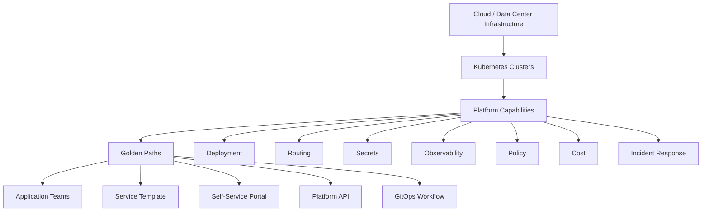
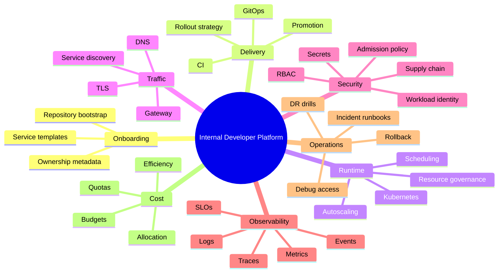
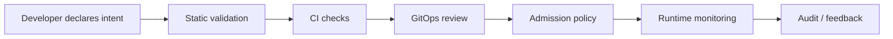
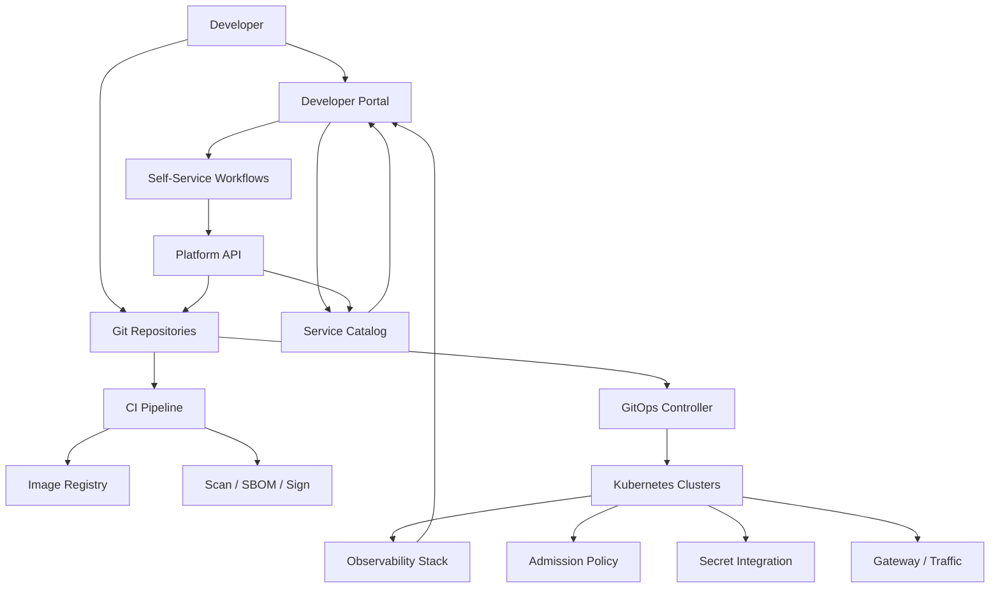
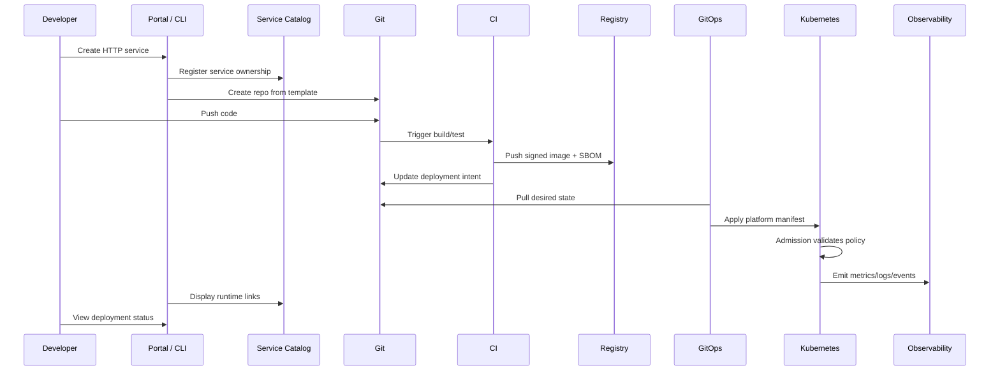
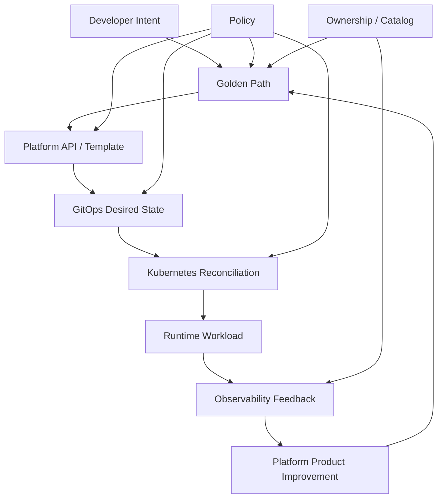

------
title: Learn Kubernetes, Deployment Model, and Cloud Native Platform Engineering - Part 034
description: Platform engineering and Internal Developer Platform design for Kubernetes, including golden paths, paved roads, self-service workflows, platform APIs, developer experience, governance without bottlenecks, reliability, security, cost, and product operating model.
series: learn-kubernetes-deployment-model
seriesTitle: Learn Kubernetes, Deployment Model, and Cloud Native Platform Engineering
order: 34
partTitle: Platform Engineering and Internal Developer Platforms
tags:
- kubernetes
- platform-engineering
- internal-developer-platform
- idp
- developer-experience
- golden-path
- self-service
- governance
- platform-api
- cloud-native
- reliability
- security
- delivery
date: 2026-07-01
------

# Part 034 — Platform Engineering and Internal Developer Platforms

## 1. Why This Part Exists

Kubernetes adoption often starts as infrastructure modernization.

It should mature into platform engineering.

The difference is important.

A Kubernetes cluster gives teams a place to run workloads.

A platform gives teams a safe, understandable, repeatable way to deliver software.

A weak platform says:

```text
Here is a cluster. Here is kubectl access. Good luck.
```

A strong platform says:

```text
Here is a paved path for deploying, observing, securing, scaling, and operating your service with clear ownership and guardrails.
```

This part is about turning Kubernetes from a powerful substrate into an internal product.

The goal is not to hide all complexity.

The goal is to hide accidental complexity, expose meaningful decisions, and enforce critical invariants.

---

## 2. Kaufman Skill Target

Using Kaufman's learning frame, this part targets the subskill:

```text
Design a Kubernetes-based platform that lets application teams ship safely with low cognitive load and high operational accountability.
```

After this part, you should be able to:

1. Explain the difference between Kubernetes usage and platform engineering.
2. Define golden paths and paved roads.
3. Design an Internal Developer Platform around user journeys, not tools.
4. Identify which decisions should be self-service and which should be governed.
5. Create platform APIs that expose intent instead of raw infrastructure complexity.
6. Design developer workflows for service onboarding, deployment, rollback, secrets, observability, and incident response.
7. Avoid turning the platform team into a ticket queue.
8. Measure platform success with product, reliability, security, and cost metrics.

---

## 3. Platform Engineering Mental Model

Platform engineering sits between raw infrastructure and application delivery.



A platform is not a portal.

A portal may be part of the platform.

A platform is the integrated collection of capabilities that helps users deliver and operate software.

The platform must be treated as a product.

That means:

- users are known
- user journeys are mapped
- capabilities are intentionally designed
- feedback is collected
- reliability is measured
- adoption friction is reduced
- docs and examples are maintained
- deprecations are managed
- support load is analyzed

---

## 4. Kubernetes Is Not the Developer Interface

Kubernetes YAML is too low-level for most application delivery decisions.

A developer often wants to express:

```text
Deploy my HTTP service with 4 replicas, expose it internally, autoscale safely, give it a database secret, and show me SLO dashboards.
```

Raw Kubernetes asks them to compose:

- Deployment
- Service
- HTTPRoute or Ingress
- ConfigMap
- Secret or ExternalSecret
- ServiceAccount
- RoleBinding
- NetworkPolicy
- HPA
- PodDisruptionBudget
- ServiceMonitor
- alerts
- dashboards
- labels
- policy annotations
- image update rules
- rollout strategy

That raw power is useful for platform engineers.

It is cognitive load for application teams.

The platform should decide which complexity is reusable.

---

## 5. Golden Paths and Paved Roads

### 5.1 Golden Path

A golden path is the recommended, supported way to accomplish a common engineering task.

Example:

```text
Create a new Spring Boot HTTP service with standard build, container image, deployment, route, autoscaling, observability, and security baseline.
```

A golden path should be:

- documented
- automated
- tested
- observable
- secure by default
- easy to start
- easy to extend safely
- versioned
- owned by the platform team

### 5.2 Paved Road

A paved road is a broader set of supported patterns.

Example:

- HTTP API service
- async worker
- scheduled job
- stateful service
- internal admin app
- public edge service
- event consumer
- batch pipeline

A paved road is less rigid than a golden path but still provides guardrails.

### 5.3 Guardrails vs Gates

| Approach | Meaning | Risk |
|---|---|---|
| Gate | Blocks progress until central approval. | Creates bottlenecks. |
| Guardrail | Prevents unsafe choices automatically. | Requires careful policy design. |
| Golden path | Makes the safe path easiest. | Must stay useful or teams bypass it. |
| Escape hatch | Allows advanced cases with accountability. | Can become loophole if unmanaged. |

The best platform makes the right thing easy and the dangerous thing explicit.

---

## 6. Platform User Journeys

Do not start with tools.

Start with journeys.

### 6.1 Service Creation Journey

Developer need:

```text
I need to create a new service that can be deployed safely.
```

Platform capabilities:

- service template
- repository bootstrap
- CI pipeline
- container build
- vulnerability scan
- SBOM generation
- GitOps registration
- namespace creation
- default deployment contract
- observability scaffold
- ownership metadata
- documentation

Success criteria:

- service deploys to dev without manual platform ticket
- required metadata is present
- dashboards exist
- alerts have sane defaults
- rollback path exists

### 6.2 Deployment Journey

Developer need:

```text
I need to promote a version from dev to staging to prod safely.
```

Platform capabilities:

- immutable image reference
- environment promotion
- approval policy where needed
- canary or rolling strategy
- metric-based health gate
- rollback mechanism
- release audit trail
- deployment notifications

Success criteria:

- deployment is reproducible
- rollback does not require tribal knowledge
- production changes are auditable
- policy exceptions are visible

### 6.3 Debugging Journey

Developer need:

```text
Something is failing in production. I need evidence quickly.
```

Platform capabilities:

- workload status view
- logs by service/version/pod
- metrics dashboards
- trace search
- Kubernetes events
- rollout history
- recent config changes
- dependency health
- runbook links
- safe debug access

Success criteria:

- no cluster-admin required for normal diagnosis
- evidence is correlated
- common failures have runbooks
- access elevation is time-bound and audited

### 6.4 Secrets Journey

Developer need:

```text
My service needs a credential without exposing it in Git or logs.
```

Platform capabilities:

- external secret integration
- workload identity
- secret naming convention
- rotation strategy
- least-privilege access
- audit logs
- environment scoping

Success criteria:

- secrets are not committed to Git
- rotation is possible without redeploy chaos
- access is scoped per workload
- leaks can be traced

### 6.5 Incident Journey

Developer need:

```text
We have an incident. I need to understand scope, mitigate, and communicate.
```

Platform capabilities:

- service ownership registry
- SLO dashboards
- error budget status
- dependency map
- recent deployments
- rollback action
- traffic shifting
- feature flag linkage
- incident templates
- postmortem data export

Success criteria:

- owner can be found quickly
- blast radius is visible
- mitigation is safe
- timeline evidence is preserved

---

## 7. The Platform Capability Map

A Kubernetes-based Internal Developer Platform usually includes these capabilities.



The map is not a requirement to buy or build every category immediately.

It is a way to reason about platform completeness.

---

## 8. Platform API Design

A strong platform exposes intent.

A weak platform exposes all implementation details.

### 8.1 Raw Kubernetes Interface

```yaml
apiVersion: apps/v1
kind: Deployment
metadata:
  name: checkout-api
spec:
  replicas: 4
  strategy:
    rollingUpdate:
      maxUnavailable: 0
      maxSurge: 1
  template:
    spec:
      containers:
        - name: app
          image: registry.example.com/checkout@sha256:abc123
          ports:
            - containerPort: 8080
          resources:
            requests:
              cpu: 250m
              memory: 512Mi
            limits:
              memory: 1Gi
```

This is precise, but incomplete.

It says nothing about:

- route
- SLO
- team ownership
- secret source
- network access
- policy tier
- release strategy
- dashboard
- alerting
- cost center

### 8.2 Platform Intent Interface

```yaml
apiVersion: platform.example.com/v1
kind: WebService
metadata:
  name: checkout-api
spec:
  owner: payments
  tier: critical
  image: registry.example.com/checkout@sha256:abc123
  port: 8080
  replicas:
    min: 4
    max: 20
  exposure:
    type: internal
    host: checkout.internal.example.com
  reliability:
    availabilitySLO: 99.9
    rollout: canary
  dataClassification: confidential
```

The platform reconciles this into:

- Deployment
- Service
- HTTPRoute
- HPA
- PDB
- ServiceAccount
- NetworkPolicy
- ExternalSecret binding
- ServiceMonitor
- alert rules
- dashboard registration
- cost labels
- policy annotations

This is the same idea from CRDs/operators, but with a product mindset.

The API should be designed around user intent and platform invariants.

---

## 9. What to Abstract and What Not to Abstract

### 9.1 Good Abstractions

Abstract things that are:

- repetitive
- error-prone
- policy-heavy
- cross-cutting
- not domain-specific to application logic
- required for every service
- expensive to debug when wrong

Examples:

| Area | Good Platform Default |
|---|---|
| Labels | Ownership, app, environment, cost center. |
| Security | Non-root, restricted Pod Security, minimal capabilities. |
| Rollout | Safe rolling/canary default. |
| Observability | Logs, metrics, traces, dashboards. |
| Network | Default-deny with explicit dependency model. |
| Secrets | External secret reference, no raw secrets in Git. |
| Resources | Sensible defaults and request sizing guidance. |
| SLO | Standard alert templates. |

### 9.2 Bad Abstractions

Do not abstract away meaningful engineering decisions.

Examples:

| Decision | Why It Should Remain Explicit |
|---|---|
| State ownership | Data correctness is application-specific. |
| Consistency model | Platform cannot guess business tolerance. |
| Public exposure | Security and product decision. |
| Dependency access | Affects blast radius and data flow. |
| SLO target | Business and reliability trade-off. |
| Resource profile | Needs measurement and workload knowledge. |
| Rollback compatibility | Depends on schema/API/event contracts. |

A dangerous platform makes everything look easy while hiding risk.

A good platform makes common paths easy and high-risk choices visible.

---

## 10. Self-Service Without Chaos

Self-service does not mean everyone can do everything.

Self-service means authorized users can perform safe, predefined actions without waiting for a human ticket.

Examples:

| Self-Service Action | Guardrail |
|---|---|
| Create service | Template requires owner, tier, data classification. |
| Create namespace | Baseline includes quota, RBAC, NetworkPolicy, Pod Security. |
| Deploy version | Image must be signed/scanned and referenced by digest. |
| Promote to prod | Requires environment policy and release checks. |
| Request secret | Bound to workload identity and audit trail. |
| Increase quota | Budget and approval thresholds. |
| Enable public route | Security review or policy gate. |
| Request debug access | Time-bound role and audit. |

A platform should remove waiting, not remove accountability.

---

## 11. Governance Without Bottlenecks

Traditional governance often says:

```text
Open a ticket and wait for the platform/security/network team.
```

Platform governance should say:

```text
Declare intent. The platform will allow safe cases, reject unsafe cases, and route exceptional cases with evidence.
```

### 11.1 Policy Flow



Controls should exist at multiple points.

| Control Point | Example |
|---|---|
| Template | Required ownership metadata. |
| CI | Unit tests, image scan, SBOM. |
| Pull request | Human review for high-risk change. |
| GitOps | Drift detection and reconciliation. |
| Admission | Enforce cluster safety invariants. |
| Runtime | Alert on behavior and policy violations. |
| Audit | Record who changed what and why. |

### 11.2 Exception Management

Exceptions are normal.

Invisible exceptions are dangerous.

A good exception has:

- owner
- reason
- scope
- expiration date
- risk acceptance
- compensating control
- approval trail
- periodic review

Example:

```yaml
apiVersion: policy.example.com/v1
kind: PolicyException
metadata:
  name: allow-hostnetwork-for-node-exporter
spec:
  namespace: monitoring
  policy: disallow-host-network
  resourceSelector:
    matchLabels:
      app.kubernetes.io/name: node-exporter
  reason: Node-level metrics collection requires host network access.
  expiresAt: "2026-10-01"
  approvedBy: platform-security
```

---

## 12. Platform Product Operating Model

The platform is an internal product.

That changes how it is built.

### 12.1 Users

Typical platform users:

| User | Needs |
|---|---|
| Application developer | Create, deploy, debug, observe. |
| Tech lead | Own service reliability, cost, and release risk. |
| SRE | Operate incidents, SLOs, capacity, and rollout safety. |
| Security engineer | Enforce policy, identity, secrets, and audit. |
| Compliance officer | Evidence, retention, approval trail. |
| Finance/FinOps | Cost allocation, budgets, waste reduction. |
| Platform engineer | Maintain platform reliability and developer experience. |

If you design only for platform engineers, you create infrastructure.

If you design for all user journeys, you create a platform.

### 12.2 Platform Backlog

Platform backlog items should be written like product work.

Weak backlog item:

```text
Install Argo CD.
```

Better backlog item:

```text
Application teams can promote a signed image from staging to production through a GitOps workflow with audit trail, rollback, and deployment health visibility.
```

Weak backlog item:

```text
Add dashboards.
```

Better backlog item:

```text
Service owners can identify whether a production incident is caused by rollout, dependency, resource saturation, or network failure within five minutes using standard dashboards.
```

### 12.3 Platform SLIs

A platform has reliability too.

Useful SLIs:

| SLI | Meaning |
|---|---|
| Deployment success rate | Percentage of platform-mediated deployments that complete successfully. |
| Deployment lead time | Time from approved change to live workload. |
| Rollback time | Time to restore previous healthy version. |
| Onboarding time | Time to create a new service or tenant. |
| Platform API availability | Availability of portal/API/GitOps/control components. |
| Admission latency | Time added by policy enforcement. |
| Policy false positive rate | Safe changes incorrectly blocked. |
| Incident evidence time | Time to gather basic evidence for a service. |
| Golden path adoption | Percentage of services using supported patterns. |
| Support ticket rate | Manual intervention needed per team/service. |
| Drift rate | Number of live-state deviations from Git. |
| Cost allocation coverage | Percentage of workload cost attributed to owner. |

The platform should not only make developers faster.

It should make delivery safer and easier to operate.

---

## 13. Internal Developer Portal vs Internal Developer Platform

These terms are often confused.

| Thing | Meaning |
|---|---|
| Portal | UI/catalog layer that helps users discover and trigger platform capabilities. |
| Platform | Actual integrated capabilities, workflows, APIs, policies, and operational systems. |
| Platform API | Programmatic contract for declaring intent. |
| Golden path | Recommended supported journey. |
| Service catalog | Inventory of software ownership, metadata, dependencies, and lifecycle. |

A portal without platform capabilities becomes a dashboard.

A platform without discoverability becomes tribal knowledge.

The strongest systems combine both.

---

## 14. Service Catalog

A service catalog should answer:

```text
What services exist, who owns them, where do they run, what do they depend on, and how healthy are they?
```

Minimum fields:

| Field | Why It Matters |
|---|---|
| service name | Stable identity. |
| owner team | Incident routing and accountability. |
| repository | Source of truth. |
| runtime clusters | Where it runs. |
| environments | dev/staging/prod. |
| tier | Criticality and SLO expectation. |
| data classification | Security/compliance policy. |
| dependencies | Incident blast-radius analysis. |
| APIs/events | Contract visibility. |
| dashboards | Observability entry point. |
| runbooks | Incident response. |
| cost center | Financial attribution. |
| lifecycle status | active/deprecated/decommissioning. |

Without a catalog, platform teams cannot answer basic operational questions during incidents.

---

## 15. Reference Platform Architecture



Important point:

The portal is not the source of truth for deployment state.

Git and Kubernetes are usually better sources of truth for declarative state.

The portal can orchestrate workflows and display status.

---

## 16. Golden Path: HTTP Service

A mature HTTP service golden path might include:

### 16.1 Inputs

```yaml
service:
  name: checkout-api
  owner: payments
  language: java
  framework: spring-boot
  tier: critical
  dataClassification: confidential
  exposure: internal
  port: 8080
  slo:
    availability: 99.9
    latencyP95Ms: 300
```

### 16.2 Generated Artifacts

- repository skeleton
- Dockerfile or buildpack config
- CI workflow
- unit/integration test scaffold
- Kubernetes/platform API manifest
- GitOps app registration
- default dashboards
- alert rules
- runbook template
- service catalog entry
- ownership metadata
- API contract folder

### 16.3 Runtime Defaults

- non-root container
- read-only root filesystem where possible
- resource requests
- liveness/readiness/startup probes
- PodDisruptionBudget
- HPA
- safe rolling or canary rollout
- NetworkPolicy
- ServiceAccount
- external secret binding
- HTTPRoute
- OpenTelemetry instrumentation guidance

### 16.4 Developer Escape Hatches

Allow controlled overrides for:

- resource profile
- scaling bounds
- rollout strategy
- route exposure
- dependency access
- JVM/runtime parameters
- probe tuning
- SLO target

But require explicit justification for:

- privileged mode
- hostPath
- hostNetwork
- public internet exposure
- wildcard egress
- secret broad access
- disabling probes
- running as root

---

## 17. Platform API Example

```yaml
apiVersion: platform.example.com/v1
kind: ServiceDeployment
metadata:
  name: checkout-api
  namespace: payments-prod
spec:
  owner: payments
  runtime:
    image: registry.example.com/payments/checkout-api@sha256:abc123
    port: 8080
    language: java
  scaling:
    minReplicas: 4
    maxReplicas: 20
    targetCPUUtilization: 65
  exposure:
    type: internal
    hostname: checkout.payments.internal.example.com
  reliability:
    tier: critical
    availabilitySLO: 99.9
    rolloutStrategy: canary
    maxUnavailable: 0
  security:
    dataClassification: confidential
    egressPolicy: explicit
    secretRefs:
      - name: checkout-db
        providerRef: vault-prod
  observability:
    traces: enabled
    dashboard: standard-http-service
```

A controller or GitOps generator can translate this into lower-level resources.

But the platform API itself must be versioned, documented, validated, and tested.

Otherwise it becomes another unstable abstraction.

---

## 18. Build vs Buy vs Assemble

Platform engineering is usually assemble-first, build-where-differentiating.

| Capability | Common Approach |
|---|---|
| Kubernetes runtime | Managed Kubernetes or standardized self-managed clusters. |
| GitOps | Argo CD, Flux, or equivalent. |
| CI | Existing CI system. |
| Registry | Cloud or enterprise registry. |
| Policy | Kubernetes admission, Kyverno, Gatekeeper, ValidatingAdmissionPolicy. |
| Secrets | External secrets manager and CSI/operator integration. |
| Observability | Prometheus-compatible metrics, logs, traces, OpenTelemetry. |
| Portal/catalog | Backstage or internal system. |
| Platform API | Often custom because organization workflows differ. |
| Workflows | Internal automation around approvals, ownership, cost, compliance. |

Build custom only when:

- the workflow is organization-specific
- existing tools cannot encode the policy
- integration creates significant leverage
- the platform team can maintain it
- API compatibility is planned

Do not build a custom orchestrator because YAML feels annoying.

First understand which user journey is actually broken.

---

## 19. Platform Maturity Model

### Level 0 — Cluster Access

```text
Teams use kubectl and raw YAML.
```

Symptoms:

- high cognitive load
- inconsistent manifests
- weak ownership labels
- manual debugging
- policy gaps
- platform team answers many tickets

### Level 1 — Templates

```text
Teams copy service templates.
```

Better than raw YAML, but drift appears quickly.

### Level 2 — GitOps Baseline

```text
Cluster state is declared in Git and reconciled automatically.
```

Good for audit and drift, but developer experience may still be fragmented.

### Level 3 — Golden Paths

```text
Common service types have supported paved roads.
```

Developers can onboard and deploy with less platform knowledge.

### Level 4 — Platform APIs and Self-Service

```text
Developers declare intent through stable platform contracts.
```

The platform reconciles common infrastructure and policy.

### Level 5 — Product Operating Model

```text
The platform is continuously improved based on adoption, reliability, support load, cost, and developer feedback.
```

This is where the platform becomes a durable internal product.

---

## 20. Reliability of the Platform Itself

A platform can become a dependency of every production deployment.

Therefore, it needs reliability engineering.

### 20.1 Critical Platform Components

| Component | Failure Impact |
|---|---|
| Git hosting | Blocks changes and promotion. |
| CI | Blocks build/test/signing. |
| Registry | Blocks image pull or rollout. |
| GitOps controller | Blocks reconciliation or drift correction. |
| Admission policy | Can block all workload creation/update. |
| Secrets integration | Can break startup or rotation. |
| Gateway/Ingress | Can take down traffic. |
| Observability | Can blind incident response. |
| Developer portal | May block self-service workflows if tightly coupled. |

### 20.2 Design Principle

```text
The platform should fail safe, but not fail closed for every class of outage.
```

Examples:

| Failure | Desired Behavior |
|---|---|
| Portal down | Existing workloads continue; GitOps path still possible. |
| GitOps down | Existing workloads continue; alert platform team. |
| Admission webhook down | Critical policies should define explicit failure policy. |
| Registry down | Existing Pods continue; new Pods may fail image pull. |
| Observability down | Workloads continue, but incident risk increases. |
| Secret provider down | Existing mounted secrets may continue; new starts may fail. |

Platform components need SLOs too.

---

## 21. Security Model for the Platform

The platform is a privileged system.

If compromised, it may affect many workloads.

Controls:

- least-privilege automation identities
- separation of CI identity and runtime identity
- signed commits or protected branches for production repos
- image signing and provenance
- admission policy for immutable image references
- audited break-glass
- secret access by workload identity
- policy exception expiration
- RBAC review
- dependency scanning
- regular disaster recovery tests

### 21.1 Avoid Platform Superuser Sprawl

Common mistake:

```text
Every platform controller gets cluster-admin because it is easier.
```

Better:

- scope each controller to required resources
- separate controllers by domain
- use namespace-scoped controllers where possible
- audit permission usage
- review ClusterRole wildcard permissions
- avoid long-lived static credentials

---

## 22. Cost Model for the Platform

The platform should make cost visible without making teams afraid to request reliable capacity.

Track:

- requested CPU/memory
- actual CPU/memory
- unused requests
- idle node capacity
- persistent volume cost
- load balancer cost
- egress cost
- observability cost
- build minutes
- registry storage
- per-team cost trends

Cost guardrails:

- default requests/limits
- namespace quota
- autoscaling bounds
- environment TTLs
- preview environment expiration
- log retention by tier
- rightsizing recommendations
- budget alerts

Bad cost optimization removes all headroom.

Good cost optimization removes invisible waste while preserving reliability margin.

---

## 23. Developer Experience Metrics

Measure actual friction.

| Metric | What It Reveals |
|---|---|
| Time to first deploy | Onboarding friction. |
| Time to create new service | Golden path effectiveness. |
| Deployment frequency | Delivery throughput. |
| Change failure rate | Release safety. |
| Mean rollback time | Operational recoverability. |
| Number of required manual tickets | Self-service maturity. |
| Documentation search failure | Knowledge gap. |
| Repeated support questions | Platform usability issue. |
| Policy denial false positives | Bad governance design. |
| Adoption of golden paths | Whether platform is useful. |

Developer experience is not about making everything pleasant.

It is about reducing unnecessary friction while preserving engineering discipline.

---

## 24. Platform Team Responsibilities

The platform team should own:

- paved roads
- Kubernetes baseline
- cluster lifecycle
- policy baseline
- GitOps model
- self-service workflows
- platform APIs
- service catalog integration
- observability standards
- security defaults
- tenant onboarding automation
- platform reliability
- documentation
- support model

The platform team should not own:

- application business logic
- every deployment approval
- every service configuration decision
- every incident resolution
- every YAML file for every team

The platform team enables application ownership.

It should not absorb all ownership.

---

## 25. Organizational Failure Modes

### 25.1 Platform as Ticket Queue

Symptoms:

- every change requires platform team action
- backlog grows faster than capacity
- developers bypass platform
- platform team becomes bottleneck

Fix:

- self-service workflows
- documented golden paths
- policy automation
- clear support boundaries

### 25.2 Platform as Tool Dump

Symptoms:

- many tools, no coherent journey
- developers do not know where to start
- each team reinvents delivery
- observability and policy are inconsistent

Fix:

- journey mapping
- capability map
- integrated workflows
- service catalog

### 25.3 Platform as Over-Abstraction

Symptoms:

- developers cannot debug generated resources
- platform hides meaningful decisions
- escape hatches are undocumented
- incidents require platform-only knowledge

Fix:

- transparent generated resources
- documentation
- debug views
- platform API status conditions
- teach the underlying model

### 25.4 Platform as Security Theater

Symptoms:

- policies exist but exceptions are permanent
- privileged workloads spread
- cluster-admin is common
- production changes happen outside Git
- audit evidence is incomplete

Fix:

- exception lifecycle
- RBAC review
- break-glass process
- admission enforcement
- supply-chain controls

---

## 26. Platform Design Checklist

### 26.1 For a New Golden Path

Ask:

1. Who is the user?
2. What job are they trying to complete?
3. What decisions are repetitive and safe to default?
4. What decisions must remain explicit?
5. What policies must be enforced?
6. What artifacts are generated?
7. What status is shown?
8. How is rollback handled?
9. How is observability provided?
10. How are secrets handled?
11. How is cost attributed?
12. How are exceptions requested?
13. How is the path versioned?
14. How are breaking changes communicated?
15. How will adoption be measured?

### 26.2 For a Platform API

Ask:

1. Is the API intent-based?
2. Is `spec` stable and understandable?
3. Is `status` useful for debugging?
4. Are conditions standardized?
5. Are defaults safe?
6. Are validations clear?
7. Are errors actionable?
8. Can users escape safely?
9. Is versioning planned?
10. Can generated resources be inspected?
11. Does RBAC match responsibility?
12. Does admission enforce invariants?

### 26.3 For Self-Service

Ask:

1. What can the user do without asking a human?
2. What guardrails apply automatically?
3. What requires approval?
4. What is the approval evidence?
5. What is audited?
6. What is the rollback path?
7. What is the support path?

---

## 27. Reference Golden Path Architecture



The journey is integrated.

The developer does not need to understand every controller on day one.

But the platform still preserves transparency and operational evidence.

---

## 28. Practical Implementation Roadmap

### Phase 1 — Stabilize the Substrate

- standardize cluster baseline
- install GitOps
- define namespace baseline
- define RBAC model
- define Pod Security baseline
- centralize logs/metrics/events
- document deployment model

### Phase 2 — Create Golden Paths

- HTTP service
- worker service
- scheduled job
- internal service
- public edge service

Each golden path includes:

- template
- CI
- deployment manifest
- observability
- runbook
- ownership metadata

### Phase 3 — Add Guardrails

- admission policy
- image signature verification
- required labels
- network baseline
- quota baseline
- secret integration
- policy exceptions

### Phase 4 — Build Self-Service

- namespace creation workflow
- service creation workflow
- quota request workflow
- secret request workflow
- route exposure workflow
- debug access workflow

### Phase 5 — Platform Productization

- service catalog
- developer portal
- platform API
- adoption metrics
- support analytics
- product roadmap
- maturity reviews

Do not start with the portal if the underlying workflows are chaotic.

A portal over chaos makes chaos clickable.

---

## 29. Anti-Patterns

### 29.1 “Developers Should Learn Kubernetes” as the Whole Strategy

Developers should understand the platform enough to operate their services.

But making every team become Kubernetes experts is usually wasteful.

The platform should encode common expertise.

### 29.2 “No YAML Ever”

Hiding all declarative state can reduce transparency.

A good platform may generate YAML, but users should be able to inspect what exists and why.

### 29.3 “One Tool Equals Platform”

Backstage alone is not a platform.

Argo CD alone is not a platform.

Kubernetes alone is not a platform.

A platform is integrated capability aligned to user journeys.

### 29.4 “Self-Service Means No Governance”

Ungoverned self-service recreates shadow IT inside Kubernetes.

Self-service must include policy, ownership, audit, and cost controls.

### 29.5 “Platform Team Owns Production for Everyone”

This destroys accountability.

Application teams must own their service behavior.

The platform team owns the paved road and shared substrate.

---

## 30. Final Mental Model

Platform engineering is the discipline of turning repeated operational knowledge into reliable product capabilities.

Kubernetes is the substrate.

GitOps is a reconciliation operating model.

Admission policy is a governance mechanism.

Observability is the feedback system.

Golden paths are the developer interface.

Platform APIs encode intent.

The service catalog provides ownership and discovery.

Self-service removes waiting.

Guardrails preserve safety.



The best internal platform does not make engineers ignorant.

It makes the safe, observable, reliable path the easiest path.

---

## 31. Review Questions

1. What are your top three developer journeys?
2. Which parts of those journeys require tickets today?
3. Which decisions are repetitive and safe to default?
4. Which decisions must remain explicit?
5. What is your first golden path?
6. What platform capabilities are missing for that golden path?
7. Where is your source of truth?
8. How does a developer roll back production safely?
9. How does a developer find logs, metrics, traces, and events?
10. How are secrets requested and rotated?
11. How are public routes approved?
12. How are policy exceptions tracked?
13. How do you measure adoption?
14. How do you detect platform friction?
15. Does the platform team own enablement or become a bottleneck?

---

## 32. Practice Lab

### Lab 1 — Design a Golden Path

Design a golden path for an HTTP API service.

Specify:

- required inputs
- generated artifacts
- runtime defaults
- security controls
- observability outputs
- rollback path
- ownership metadata
- cost labels
- escape hatches

### Lab 2 — Platform API Review

Design a `WebService` custom resource.

Define:

- `spec` fields
- defaults
- validations
- `status.conditions`
- generated Kubernetes resources
- policy constraints
- versioning plan

Then identify what should not be abstracted.

### Lab 3 — Ticket Elimination

List the top ten platform tickets application teams open today.

For each ticket, classify:

| Ticket | Automate | Document | Policy Gate | Keep Manual |
|---|---|---|---|---|

The goal is not to eliminate all manual processes.

The goal is to remove unnecessary waiting while preserving safety.

---

## 33. Summary

An Internal Developer Platform is not a UI, a cluster, or a tool purchase.

It is a productized delivery system that combines Kubernetes, GitOps, policy, observability, security, workflows, and documentation into usable paths for engineering teams.

The platform must reduce cognitive load without hiding meaningful risk.

It must enable self-service without removing accountability.

It must enforce governance without becoming a bottleneck.

It must be operated with its own reliability, security, cost, and product metrics.

A top 1% engineer can use Kubernetes.

A stronger engineer can turn Kubernetes into a platform that improves how many teams ship, operate, and learn.

---

## 34. References

- CNCF Platforms White Paper: https://tag-app-delivery.cncf.io/whitepapers/platforms/
- CNCF Blog — What is Platform Engineering?: https://www.cncf.io/blog/2025/11/19/what-is-platform-engineering/
- OpenGitOps Principles: https://opengitops.dev/
- Kubernetes Documentation — Custom Resources: https://kubernetes.io/docs/concepts/extend-kubernetes/api-extension/custom-resources/
- Kubernetes Documentation — Admission Controllers: https://kubernetes.io/docs/reference/access-authn-authz/admission-controllers/
- Kubernetes Documentation — Observability: https://kubernetes.io/docs/concepts/cluster-administration/observability/
- Kubernetes Documentation — RBAC Authorization: https://kubernetes.io/docs/reference/access-authn-authz/rbac/
