------
title: Learn Kubernetes, Deployment Model, and Cloud Native Platform Engineering - Part 035
description: Capstone design for a production-grade Kubernetes deployment platform, including architecture synthesis, invariants, workload onboarding, GitOps delivery, security, observability, reliability, governance, maturity assessment, and final review checklist.
series: learn-kubernetes-deployment-model
seriesTitle: Learn Kubernetes, Deployment Model, and Cloud Native Platform Engineering
order: 35
partTitle: Capstone Production Grade Platform
tags:
- kubernetes
- deployment-model
- production-platform
- platform-engineering
- internal-developer-platform
- gitops
- reliability
- slo
- observability
- security
- governance
- multi-cluster
- capstone
- cloud-native
- series-final

date: 2026-07-01
------

# Part 035 — Capstone: Designing a Production-Grade Kubernetes Deployment Platform

## 1. Why This Part Exists

This is the final part of the series.

The previous parts decomposed Kubernetes into focused subskills: API model, Pods, controllers, scheduling, deployment strategy, configuration, resources, networking, storage, security, policy, observability, debugging, reliability, upgrades, GitOps, packaging, CRDs, multi-tenancy, and platform engineering.

This part recomposes those pieces into one production-grade platform design.

That matters because Kubernetes knowledge is often learned in fragments:

```text
I know Deployments.
I know Services.
I know Ingress.
I know Helm.
I know RBAC.
I know Prometheus.
```

That is useful, but insufficient.

A top engineer can connect those fragments into a coherent operating system for delivery:

```text
A team can safely introduce a service, deploy it across environments, expose traffic, rotate secrets, observe behavior, respond to failure, recover from incidents, prove compliance, and evolve the platform without losing control.
```

A production platform is not a pile of YAML.

It is a set of enforced invariants, operating boundaries, feedback loops, and human workflows.

The goal of this capstone is to make that architecture visible.

---

## 2. Kaufman Skill Target

Using Josh Kaufman's learning model, this capstone targets the final synthesis skill:

```text
Design, review, and evolve a Kubernetes-based deployment platform that is safe, observable, scalable, secure, governable, and usable by many product teams.
```

After this part, you should be able to:

1. Design a production-grade Kubernetes deployment platform from first principles.
2. Explain why each platform layer exists.
3. Define platform invariants that prevent unsafe deployments.
4. Classify workloads and map them to the correct Kubernetes primitives.
5. Design a GitOps delivery model for multi-environment and multi-cluster deployment.
6. Define security controls from image build to runtime and API access.
7. Design observability around debugging and SLOs, not dashboards alone.
8. Model failure domains and blast radius.
9. Create review checklists for production readiness.
10. Identify platform maturity gaps and plan the next improvement cycle.

The expected outcome is not memorization.

The expected outcome is architectural fluency.

---

## 3. The Capstone Scenario

Assume the following enterprise context.

You are designing a Kubernetes-based platform for an organization with:

- 80 engineering teams.
- 400 services.
- Several regulatory workloads.
- Public APIs, internal APIs, async workers, scheduled jobs, and stateful workloads.
- Multiple environments: `dev`, `test`, `staging`, `prod`.
- Multiple regions for production.
- A mix of Java, Go, Node.js, Python, and frontend services.
- A compliance requirement for auditability, least privilege, vulnerability management, change traceability, and production incident evidence.
- A platform team that must enable delivery without becoming a manual ticket queue.

The business goal:

```text
Enable teams to ship safely and independently while the organization retains operational, security, cost, and compliance control.
```

The engineering goal:

```text
Create a platform where the safe path is the easiest path.
```

---

## 4. Production Platform Mental Model

A production Kubernetes platform has four major loops.

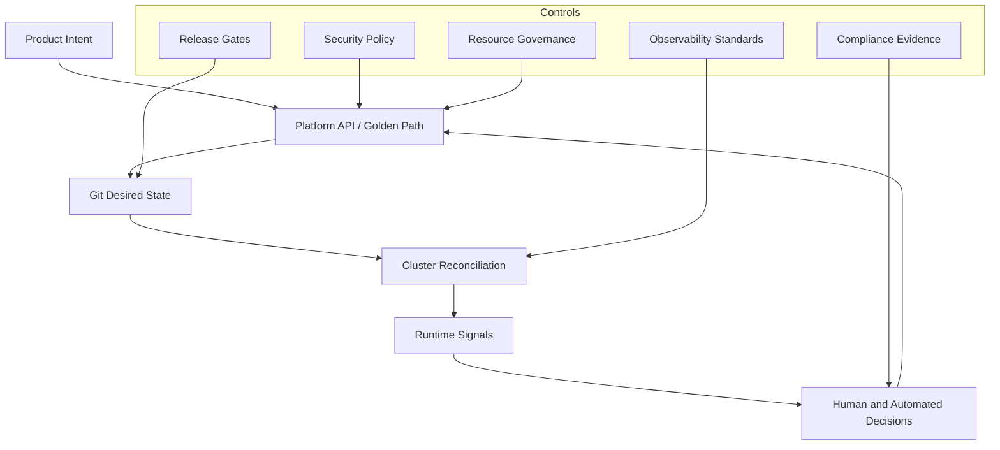

The platform is not simply the cluster.

It is the complete loop from developer intent to runtime feedback.

| Layer | Question It Answers |
|---|---|
| Product intent | What does the team want to run? |
| Platform API | What safe abstraction should the team use? |
| Git desired state | What versioned declaration represents that intent? |
| Kubernetes reconciliation | What actual state does the cluster converge toward? |
| Runtime signals | Is the system healthy, secure, efficient, and compliant? |
| Decision loop | What should humans or automation do next? |

A weak platform optimizes only the cluster layer.

A strong platform optimizes the full loop.

---

## 5. Non-Negotiable Platform Invariants

Before choosing tools, define invariants.

Invariants are rules that must hold even when teams move fast, people make mistakes, or systems partially fail.

| Invariant | Why It Exists | Example Enforcement |
|---|---|---|
| Every workload has an owner | Incident routing and accountability | Required `owner`, `team`, `service` labels |
| Every workload has resource requests | Scheduling and capacity safety | Admission policy rejects missing requests |
| Every public route has TLS | Traffic confidentiality | Gateway policy and certificate automation |
| Every production change is traceable | Audit and rollback | GitOps commit, PR, deployment metadata |
| Every workload has health semantics | Rollout safety | Readiness/startup/liveness probes where appropriate |
| Every production service has SLO metadata | Reliability management | Service catalog contract |
| Every secret has an external source of truth | Rotation and auditability | External secret integration |
| No workload runs privileged by default | Runtime hardening | Pod Security Admission / policy engine |
| No namespace is network-open by default | Blast-radius reduction | Default-deny NetworkPolicy baseline |
| Every deployment has rollback semantics | Incident recovery | Git revert, rollout rollback, traffic rollback |
| Every cluster emits standard signals | Operability | Metrics/logs/traces/events/audit pipeline |
| Every exception expires | Governance hygiene | Exception CRD or policy annotation with expiry |

A common mistake is to start with tool selection:

```text
Should we use Argo CD, Flux, Helm, Kustomize, Kyverno, Gatekeeper, Istio, Linkerd, Backstage, Crossplane, Terraform, or something else?
```

That is backwards.

Start with invariants.

Then select the smallest toolset that can enforce and observe those invariants.

---

## 6. Reference Platform Architecture

A production-grade Kubernetes platform can be represented as layered capabilities.

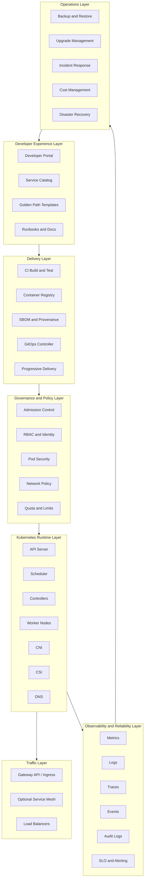

Each layer must be owned.

A platform fails when ownership is vague.

For each capability, define:

1. Who owns the default?
2. Who can override it?
3. How is override approved?
4. How is behavior observed?
5. How is failure handled?
6. How is cost attributed?
7. How is compliance evidence produced?

---

## 7. Platform Design From First Principles

A production Kubernetes deployment platform has to satisfy six forces.

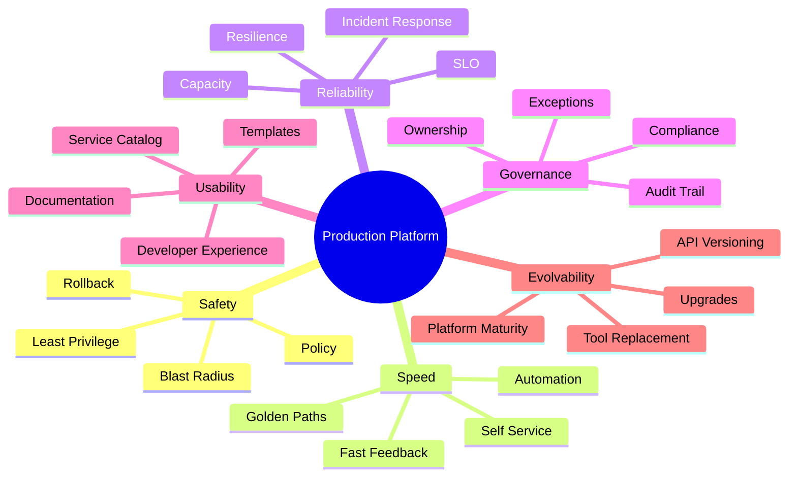

These forces compete.

For example:

- More policy can improve safety but slow delivery.
- More abstraction can reduce cognitive load but hide important operational details.
- More shared infrastructure can reduce cost but increase blast radius.
- More self-service can improve autonomy but increase governance risk.
- More automation can reduce toil but amplify bad assumptions.

The architecture must balance these forces explicitly.

A top engineer does not say:

```text
Let's automate everything.
```

A top engineer asks:

```text
Which decisions are safe to automate, under which constraints, with what rollback and observability?
```

---

## 8. Workload Classification Model

Before onboarding a service, classify it.

Do not let every workload enter the platform as a generic Deployment.

| Workload Type | Kubernetes Primitive | Key Risk | Required Controls |
|---|---|---|---|
| Stateless HTTP API | Deployment + Service + Gateway/Ingress | Bad rollout affects users | Probes, PDB, HPA, canary, SLO alerts |
| Internal API | Deployment + Service | Dependency cascade | NetworkPolicy, retries/timeouts, SLO |
| Async queue worker | Deployment or KEDA ScaledObject | Backlog growth, duplicate processing | Idempotency, queue metrics, HPA/KEDA |
| Scheduled task | CronJob | Duplicate/missed execution | Concurrency policy, idempotency, alerting |
| Migration job | Job | Data corruption | Explicit approval, backup, one-shot semantics |
| Node agent | DaemonSet | Node instability | Toleration review, resource limits, priority |
| Stateful database | StatefulSet or operator | Data loss, split brain | Quorum model, backups, PDB, storage class |
| ML/batch compute | Job/Indexed Job | Cost explosion | Quota, priority, node pool isolation |
| Edge/gateway service | Deployment + Gateway | Public exposure risk | TLS, WAF/integration, auth policy, rate limits |

A good platform asks classification questions during onboarding.

Example onboarding form:

```yaml
service:
  name: payments-api
  ownerTeam: payments-platform
  workloadType: stateless-http-api
  criticality: tier-1
  dataClassification: confidential
  exposure: public
  runtime: java
  expectedRps: 500
  p95LatencyTargetMs: 250
  availabilityTarget: 99.9
  dependencies:
    - postgres-payments
    - fraud-service
    - kafka-payments
  requiresPersistentStorage: false
  requiresPublicIngress: true
  requiresExternalSecrets: true
  deploymentStrategy: canary
```

This metadata should drive defaults.

A public tier-1 API should not receive the same deployment policy as an internal experimental worker.

---

## 9. Environment and Cluster Topology

A common enterprise topology is:

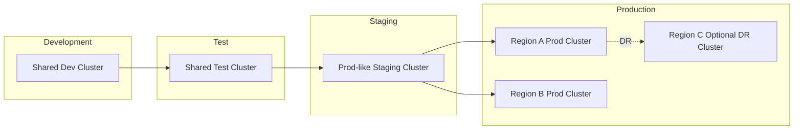

The topology should reflect failure domains and governance needs.

| Environment | Main Purpose | Design Bias |
|---|---|---|
| Dev | Fast feedback | Low friction, safe defaults, cheap capacity |
| Test | Integration validation | Representative dependencies and policy checks |
| Staging | Production rehearsal | Prod-like routing, policy, SLO, observability |
| Prod | User-facing operations | Strict governance, high availability, progressive delivery |
| DR | Business continuity | Recovery validation, backup restore, failover drills |

Avoid the trap of calling staging production-like when it lacks:

- Same admission policies.
- Same routing model.
- Same secret integration.
- Same observability signals.
- Same deployment controller behavior.
- Same resource constraints.
- Same failure injection or rollback practice.

A staging cluster that cannot detect production rollout failures is mostly theater.

---

## 10. Namespace and Tenant Model

Namespace design is one of the highest-leverage platform choices.

A practical model:

```text
<environment>-<team>-<domain>
```

Examples:

```text
dev-payments-api
staging-payments-api
prod-payments-api
prod-risk-engine
prod-observability
prod-platform-system
```

Each tenant namespace should receive a baseline pack.

```yaml
baseline:
  rbac:
    team-admin: controlled
    deployer: gitops-only
    viewer: read-only
  quota:
    cpu: required
    memory: required
    objectCount: required
  security:
    podSecurity: restricted
    serviceAccountAutoMount: disabled-by-default
    privilegedPods: denied
  network:
    defaultDenyIngress: true
    defaultDenyEgress: true
    dnsEgress: allowed
  observability:
    metricsScrape: enabled
    logCollection: enabled
    tracePropagation: required-for-tier1
  cost:
    labels: required
```

Namespace is not a perfect security boundary.

For strong isolation, use separate clusters or node pools with stronger controls.

Decision guide:

| Requirement | Prefer Namespace | Prefer Dedicated Cluster |
|---|---:|---:|
| Same trust zone | Yes | No |
| Different regulatory boundary | No | Yes |
| Different admin group | Usually no | Yes |
| Noisy batch workload | Maybe | Often yes |
| Different upgrade cadence | No | Yes |
| Strong blast-radius isolation | No | Yes |
| Cost-sensitive shared services | Yes | Maybe |

---

## 11. GitOps Desired-State Model

GitOps should not be treated as a magic deployment button.

It is a control model:

```text
Git stores desired state.
A controller compares desired state to live state.
Differences are surfaced or reconciled.
Human changes outside Git become drift.
```

Reference repo topology:

```text
platform-gitops/
  clusters/
    dev/
      cluster-a/
        apps/
        platform-addons/
        policies/
    staging/
      cluster-a/
        apps/
        platform-addons/
        policies/
    prod/
      region-a/
        apps/
        platform-addons/
        policies/
      region-b/
        apps/
        platform-addons/
        policies/
  base/
    services/
      payments-api/
      fraud-service/
    platform/
      ingress/
      observability/
      policy/
  overlays/
    dev/
    staging/
    prod/
```

A simpler alternative is app-per-repo with environment folders.

There is no universal answer.

Use the topology that optimizes for ownership and review boundaries.

| Repo Model | Strength | Weakness |
|---|---|---|
| Monorepo GitOps | Global visibility, easier fleet review | Large blast radius, PR noise |
| App repo owns manifests | Team autonomy | Harder platform-wide governance |
| Environment repo | Clear promotion path | Cross-repo coordination |
| Generated manifests from platform API | Low cognitive load | Requires platform maturity |

A mature platform often evolves toward:

```text
Developer submits intent through platform API.
Platform generates or updates desired state.
GitOps reconciles it.
Policy validates it.
Runtime signals verify it.
```

---

## 12. Deployment State Machine

Every production deployment should have an explicit state machine.

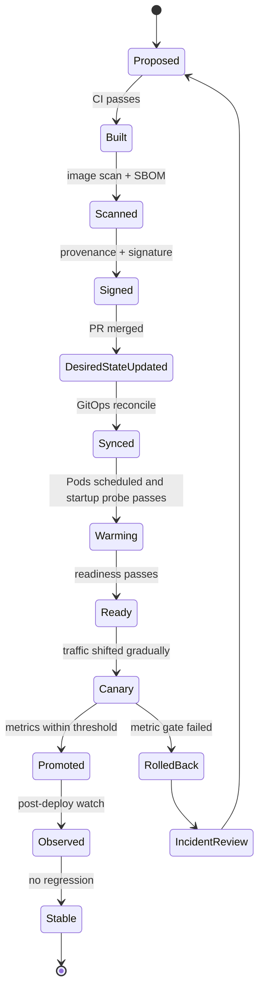

Each transition should have evidence.

| Transition | Evidence |
|---|---|
| Proposed → Built | CI logs, test report, commit SHA |
| Built → Scanned | vulnerability report, SBOM |
| Scanned → Signed | image signature, provenance attestation |
| Signed → DesiredStateUpdated | approved PR, change ticket if required |
| DesiredStateUpdated → Synced | GitOps sync status |
| Synced → Ready | Deployment conditions, Pod readiness |
| Ready → Canary | traffic split configuration |
| Canary → Promoted | metrics analysis, error rate, latency, saturation |
| Canary → RolledBack | rollback event, failing signal |
| Promoted → Stable | post-deploy observation window |

A deployment platform without evidence is hard to defend during incidents and audits.

---

## 13. Service Golden Path

The golden path is the default path from service creation to production operation.

It should not ask every team to rediscover platform architecture.

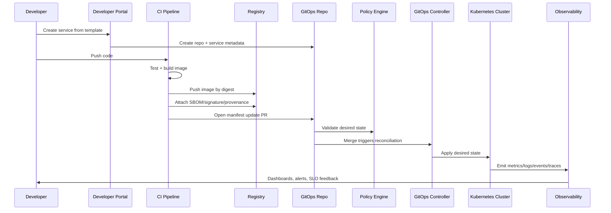

A good golden path includes:

1. Repository template.
2. Build pipeline.
3. Container image rules.
4. Service metadata contract.
5. Default Kubernetes manifests or platform API object.
6. Secrets integration.
7. Observability setup.
8. SLO template.
9. Runbook template.
10. Deployment strategy defaults.
11. Security baseline.
12. Cost attribution labels.
13. Rollback instructions.
14. Ownership and escalation metadata.

The developer should not need to know every cluster detail to deploy safely.

But the developer must know enough to operate responsibly.

---

## 14. Example Platform API

A platform API can expose workload intent rather than raw Kubernetes complexity.

Example custom resource:

```yaml
apiVersion: platform.example.com/v1alpha1
kind: ServiceDeployment
metadata:
  name: payments-api
  namespace: prod-payments-api
  labels:
    platform.example.com/team: payments
    platform.example.com/tier: tier-1
spec:
  image:
    repository: registry.example.com/payments-api
    digest: sha256:abc123
  runtime:
    type: java
    port: 8080
  exposure:
    type: public-http
    host: payments.example.com
    tls: required
  reliability:
    availabilitySLO: "99.9"
    latencyP95Ms: 250
    errorRateThreshold: "1%"
  scaling:
    minReplicas: 4
    maxReplicas: 30
    metric: cpu-and-request-rate
  rollout:
    strategy: canary
    steps:
      - weight: 5
        duration: 5m
      - weight: 25
        duration: 10m
      - weight: 50
        duration: 10m
      - weight: 100
  resources:
    requests:
      cpu: "500m"
      memory: "768Mi"
    limits:
      memory: "1536Mi"
  secrets:
    - name: database-credentials
      source: external-secret-store
  dependencies:
    outbound:
      - fraud-service
      - kafka-payments
```

The platform controller or generator can translate this into:

- Deployment.
- Service.
- HTTPRoute.
- HPA/KEDA object.
- NetworkPolicy.
- ServiceMonitor or equivalent.
- Alert rules.
- Dashboard links.
- ExternalSecret.
- PodDisruptionBudget.
- Policy annotations.

This is how Kubernetes becomes a platform substrate.

Do not expose raw Kubernetes complexity unless the team needs it.

Do expose enough intent to allow safe governance.

---

## 15. Production Workload Baseline

For most stateless production services, baseline objects include:

```text
Namespace
ResourceQuota
LimitRange
ServiceAccount
Role / RoleBinding
Secret reference or ExternalSecret
ConfigMap
Deployment
Service
HTTPRoute or Ingress
NetworkPolicy
HorizontalPodAutoscaler
PodDisruptionBudget
ServiceMonitor / PodMonitor / telemetry config
Alert rules
Dashboard metadata
Runbook link
```

The minimum Deployment contract:

```yaml
apiVersion: apps/v1
kind: Deployment
metadata:
  name: payments-api
  labels:
    app.kubernetes.io/name: payments-api
    app.kubernetes.io/part-of: payments
    app.kubernetes.io/managed-by: gitops
    platform.example.com/team: payments
    platform.example.com/tier: tier-1
spec:
  replicas: 4
  revisionHistoryLimit: 5
  strategy:
    type: RollingUpdate
    rollingUpdate:
      maxUnavailable: 0
      maxSurge: 25%
  selector:
    matchLabels:
      app.kubernetes.io/name: payments-api
  template:
    metadata:
      labels:
        app.kubernetes.io/name: payments-api
        platform.example.com/team: payments
    spec:
      serviceAccountName: payments-api
      automountServiceAccountToken: false
      securityContext:
        runAsNonRoot: true
        seccompProfile:
          type: RuntimeDefault
      containers:
        - name: app
          image: registry.example.com/payments-api@sha256:abc123
          ports:
            - containerPort: 8080
          resources:
            requests:
              cpu: 500m
              memory: 768Mi
            limits:
              memory: 1536Mi
          startupProbe:
            httpGet:
              path: /health/startup
              port: 8080
            failureThreshold: 30
            periodSeconds: 2
          readinessProbe:
            httpGet:
              path: /health/ready
              port: 8080
            periodSeconds: 5
          livenessProbe:
            httpGet:
              path: /health/live
              port: 8080
            periodSeconds: 10
          lifecycle:
            preStop:
              httpGet:
                path: /shutdown/drain
                port: 8080
          securityContext:
            allowPrivilegeEscalation: false
            readOnlyRootFilesystem: true
            capabilities:
              drop:
                - ALL
```

This is still not enough by itself.

The surrounding platform controls determine whether this service is production-grade.

---

## 16. Traffic and Exposure Model

Traffic design should separate four concerns:

1. Service identity.
2. Routing.
3. Security.
4. Progressive delivery.

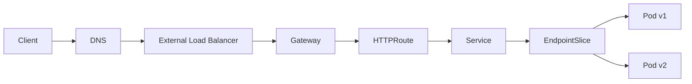

Guidelines:

| Concern | Platform Decision |
|---|---|
| Public HTTP route | Use Gateway API where available; Ingress only when simpler or already standardized |
| Internal service discovery | Use Service DNS name, not Pod IP |
| Canary | Prefer traffic splitting at route/mesh/progressive delivery layer |
| TLS | Automate certificates and make TLS default for public routes |
| East-west auth | Use workload identity or mesh only when requirement justifies complexity |
| Egress | Govern with NetworkPolicy, egress gateway, firewall, or cloud-native controls |
| External dependencies | Make dependency ownership and failure behavior explicit |

Public exposure should require stricter review than internal-only services.

Example exposure policy:

```yaml
publicExposurePolicy:
  required:
    - ownerTeam
    - dataClassification
    - tls
    - authenticationModel
    - rateLimitPlan
    - abuseMonitoring
    - accessLogRetention
    - incidentRunbook
    - rollbackPlan
```

---

## 17. Security Architecture

Security must span the full lifecycle.

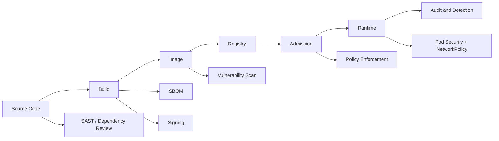

Security controls by stage:

| Stage | Controls |
|---|---|
| Source | branch protection, dependency review, secret scanning |
| Build | isolated builder, reproducible pipeline, provenance, SBOM |
| Registry | private registry, digest references, retention, vulnerability scan |
| Admission | image signature verification, policy-as-code, Pod Security, quota |
| Runtime | non-root, seccomp, read-only root filesystem, NetworkPolicy, RBAC |
| Operations | audit logs, incident evidence, patching, key rotation, exception expiry |

A strong default-deny platform posture:

```text
Deny privileged pods by default.
Deny hostPath by default.
Deny hostNetwork by default.
Deny containers without resource requests.
Deny mutable image tags in production.
Deny public ingress without TLS.
Deny missing owner labels.
Deny service account token auto-mount unless explicitly required.
Deny workloads in production without readiness semantics.
```

Exceptions must be explicit, reviewed, time-bounded, and observable.

---

## 18. Observability Architecture

Observability should be designed around questions.

Not around tools.

Core questions:

1. Is the service available?
2. Is latency within SLO?
3. Is error rate increasing?
4. Is saturation approaching a limit?
5. Is a rollout causing regression?
6. Which dependency is failing?
7. Which version is affected?
8. Which node, zone, cluster, tenant, or route is involved?
9. What changed recently?
10. What evidence is needed for incident review?

Signal model:

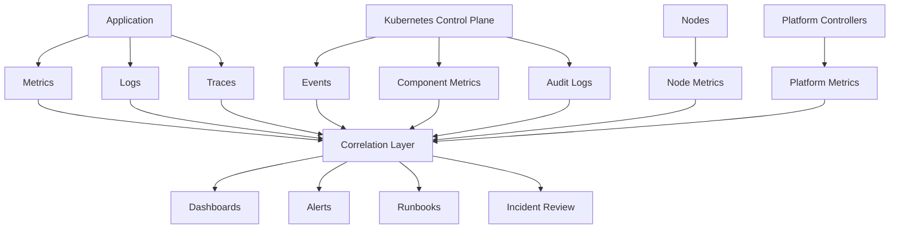

Minimum production telemetry contract:

| Signal | Required Fields |
|---|---|
| Metrics | service, namespace, cluster, version, status, route, dependency |
| Logs | timestamp, severity, trace ID, request ID, service, version |
| Traces | service graph, spans, dependency latency, errors |
| Events | object, reason, message, involved object, timestamp |
| Audit | user, verb, resource, namespace, decision, source IP |
| Deployment events | commit SHA, image digest, rollout ID, strategy, approver |

Alerting should be symptom-first.

Bad alert:

```text
Pod restarted once.
```

Better alert:

```text
payments-api availability burn rate is consuming the error budget too fast in prod-region-a.
```

Platform teams should still monitor platform internals, but product teams should be alerted primarily on user-impacting symptoms.

---

## 19. Reliability and Failure Model

Reliability is not achieved by adding replicas randomly.

It is achieved by understanding failure domains.

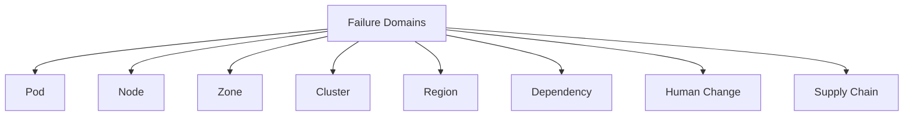

Map controls to failure domains.

| Failure Domain | Failure Example | Control |
|---|---|---|
| Pod | crash loop, OOM, bad config | probes, limits, rollout rollback |
| Node | disk pressure, kubelet issue | replicas across nodes, eviction handling |
| Zone | zone outage | topology spread, multi-zone node pools |
| Cluster | API/control plane or CNI failure | multi-cluster strategy, DR plan |
| Region | regional outage | active-active or active-passive design |
| Dependency | database outage | circuit breaker, fallback, queue buffering |
| Human change | bad manifest, wrong secret | GitOps review, policy, progressive delivery |
| Supply chain | malicious or vulnerable image | signing, scanning, admission verification |

Reliability checklist for a tier-1 HTTP service:

```yaml
reliability:
  replicas:
    minimum: 3
    spreadAcrossNodes: true
    spreadAcrossZones: true
  probes:
    startup: required
    readiness: required
    liveness: conservative
  rollout:
    progressive: required
    rollback: automatic-or-fast-manual
    maxUnavailable: 0
  disruption:
    podDisruptionBudget: required
    gracefulTermination: required
  autoscaling:
    hpa: required
    metric: cpu-plus-traffic-or-custom
    scaleDownStabilization: required
  observability:
    slo: required
    burnRateAlerts: required
    dashboard: required
    runbook: required
  dependencies:
    timeout: required
    retryBudget: required
    fallbackOrDegradedMode: reviewed
```

The important principle:

```text
A platform should not only deploy workloads. It should preserve service behavior under expected failure.
```

---

## 20. Capacity and Cost Model

Capacity management in Kubernetes has two layers.

1. Workload resource declarations.
2. Cluster/node capacity supply.

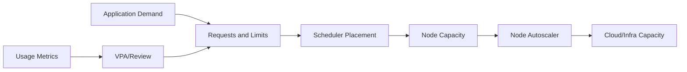

Cost control requires both technical and organizational mechanisms.

Technical controls:

- Resource requests required.
- Memory limits required for most workloads.
- CPU limits used carefully, not blindly.
- Namespace ResourceQuota.
- LimitRange defaults only when safe.
- Dedicated node pools for expensive workload classes.
- Autoscaling with scale-down stabilization.
- Idle workload detection.
- Object count quotas.
- Storage lifecycle policy.

Organizational controls:

- Required cost labels.
- Team-level reporting.
- Environment-level budgets.
- Expensive workload approval.
- Capacity review for tier-1 systems.
- Regular rightsizing review.

Example cost labels:

```yaml
metadata:
  labels:
    cost.example.com/team: payments
    cost.example.com/product: billing
    cost.example.com/environment: prod
    cost.example.com/criticality: tier-1
```

A platform that cannot attribute cost will eventually lose trust.

---

## 21. Stateful and Data-Aware Platform Design

Stateful workloads require stricter review.

A platform can support stateful systems, but should not pretend that StatefulSet alone solves data safety.

Stateful review questions:

1. What is the consistency model?
2. What is the quorum model?
3. What happens during node drain?
4. What happens during zone loss?
5. What is the backup frequency?
6. Has restore been tested?
7. What is RPO?
8. What is RTO?
9. Can storage be expanded safely?
10. Can the workload tolerate rescheduling?
11. Does it require local SSD or topology-aware placement?
12. Is the operator mature and understood?
13. How are schema migrations performed?
14. How is split brain prevented?

Data platform baseline:

```yaml
statefulBaseline:
  backup:
    required: true
    restoreTested: true
    frequency: workload-specific
  disruption:
    pdb: required
    nodeDrainRunbook: required
  storage:
    storageClass: approved-only
    volumeExpansion: reviewed
    reclaimPolicy: explicit
  topology:
    zoneSpread: reviewed
    quorumAware: true
  security:
    encryptionAtRest: required
    secretRotation: required
  operations:
    runbook: required
    upgradePlan: required
```

For many enterprises, the best platform decision is not to run every database directly on Kubernetes.

Sometimes the right answer is managed database plus Kubernetes application layer.

Top engineers optimize for system reliability, not tool purity.

---

## 22. Upgrade and Lifecycle Management

A platform is a living system.

Cluster upgrades, API deprecations, CRD changes, CNI upgrades, CSI upgrades, policy engine upgrades, GitOps controller upgrades, and node OS patching all affect safety.

Upgrade operating model:

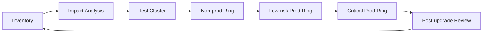

Required upgrade controls:

| Control | Purpose |
|---|---|
| API deprecation scan | Detect manifests using removed APIs |
| Add-on compatibility matrix | Prevent CNI/CSI/ingress/GitOps breakage |
| Webhook inventory | Avoid admission outage during upgrade |
| CRD conversion review | Protect custom resources |
| Node drain simulation | Validate workload disruption controls |
| Backup validation | Recover etcd/config/platform state |
| Rollback reality check | Know what can and cannot be rolled back |
| Communication plan | Prevent surprise operational impact |

Never treat upgrades as purely infrastructure maintenance.

They are product-impacting changes.

---

## 23. Incident Response Model

A production platform should make incident response faster.

Incident flow:

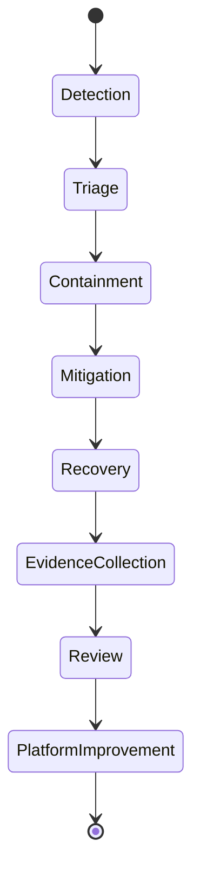

Incident evidence checklist:

```text
What changed?
Which commit/image/manifest version?
Which cluster/namespace/service/version?
Which user-facing SLO degraded?
Which dependency showed errors?
Which Kubernetes events appeared?
Were Pods rescheduled, killed, throttled, or OOMKilled?
Was traffic shifted?
Did readiness remove bad Pods?
Was autoscaling involved?
Was NetworkPolicy, DNS, storage, or admission involved?
Which rollback path was used?
What prevention should become policy or automation?
```

Runbook template:

```md
# Runbook: <service-name>

## Ownership
- Team:
- Slack/channel:
- Escalation:

## Service Summary
- Workload type:
- Criticality:
- Public/internal:
- Dependencies:

## SLO
- Availability:
- Latency:
- Error budget policy:

## Dashboards
- Service dashboard:
- Deployment dashboard:
- Dependency dashboard:

## Common Failure Modes
- Rollout regression:
- Dependency outage:
- Database saturation:
- Queue backlog:
- DNS/network issue:

## First 10 Minutes
1. Check SLO dashboard.
2. Check recent deployments.
3. Check error rate and latency by version.
4. Check Kubernetes events.
5. Check dependency health.
6. Decide rollback, traffic shift, scale, or dependency mitigation.

## Rollback
- Command/process:
- Expected duration:
- Risks:

## Post-Incident Evidence
- Logs:
- Metrics:
- Traces:
- Events:
- Git commits:
```

A platform should generate much of this automatically from service metadata.

---

## 24. Governance Without Becoming a Bottleneck

Governance should be encoded into the platform where possible.

Manual review should be reserved for high-risk decisions.

| Decision | Automate | Require Review |
|---|---:|---:|
| Deploy patch version to dev | Yes | No |
| Deploy low-risk internal service to staging | Yes | Maybe no |
| Expose public route | Partly | Yes |
| Add privileged container | No | Yes |
| Add hostPath mount | No | Yes |
| Increase production max replicas 10x | Partly | Yes |
| Create new stateful database | No | Yes |
| Rotate secret | Yes | No, if standard path |
| Rollback bad deployment | Yes | No, if approved strategy |
| Add new cluster-wide controller | No | Yes |

Governance anti-patterns:

```text
Everything requires a ticket.
Every exception is permanent.
Policy is documented but not enforced.
Security approval happens after deployment.
Platform team manually edits YAML for teams.
Production access is broad because it is convenient.
Nobody owns cost after launch.
Runbooks are created once and never tested.
```

Better model:

```text
Low-risk path is automated.
High-risk path is reviewable.
Unsafe path is blocked.
Exceptions expire.
Evidence is captured automatically.
```

---

## 25. Production Readiness Review

Use this checklist before approving a service for production.

### 25.1 Ownership

- [ ] Service has an owning team.
- [ ] Escalation channel exists.
- [ ] Service catalog entry exists.
- [ ] Criticality tier is declared.
- [ ] Runbook is linked.

### 25.2 Deployment

- [ ] Image uses digest, not mutable tag, for production.
- [ ] Deployment strategy is explicit.
- [ ] Rollback path is tested.
- [ ] Readiness semantics are correct.
- [ ] Startup behavior is understood.
- [ ] Graceful shutdown is implemented.
- [ ] Deployment metadata includes commit SHA and image digest.

### 25.3 Resource and Scaling

- [ ] CPU and memory requests are set.
- [ ] Memory limits are set.
- [ ] HPA/KEDA/VPA strategy is defined where needed.
- [ ] Scale-up and scale-down behavior are tested.
- [ ] Quota impact is understood.
- [ ] Cost labels are present.

### 25.4 Networking

- [ ] Service type is correct.
- [ ] Public exposure is reviewed.
- [ ] TLS is configured.
- [ ] NetworkPolicy baseline is applied.
- [ ] Egress dependencies are declared.
- [ ] DNS behavior is understood.

### 25.5 Security

- [ ] ServiceAccount is least privilege.
- [ ] Service account token is not auto-mounted unless needed.
- [ ] Pod runs as non-root.
- [ ] Privilege escalation is disabled.
- [ ] Capabilities are dropped.
- [ ] Root filesystem is read-only where possible.
- [ ] Secrets come from approved source.
- [ ] Image has SBOM/signature/provenance where required.
- [ ] Vulnerability threshold is accepted or exception is approved.

### 25.6 Observability

- [ ] Metrics are emitted.
- [ ] Logs are structured and correlated.
- [ ] Traces exist for tier-1 request paths.
- [ ] Kubernetes events are visible.
- [ ] Dashboard exists.
- [ ] Alerts map to user impact.
- [ ] Deployment regression can be detected by version.

### 25.7 Reliability

- [ ] SLO exists.
- [ ] Error budget policy exists for tier-1 service.
- [ ] PodDisruptionBudget is configured where needed.
- [ ] Topology spread is configured where needed.
- [ ] Dependency failure behavior is defined.
- [ ] Load test or capacity estimate exists.
- [ ] Backup/restore exists for stateful dependencies.

### 25.8 Operations

- [ ] On-call team understands runbook.
- [ ] Incident evidence can be collected.
- [ ] Rollback is practiced.
- [ ] Upgrade compatibility is understood.
- [ ] DR behavior is known for critical services.

Production readiness is not a one-time checklist.

It should become a recurring review cycle.

---

## 26. Platform Maturity Model

Use this model to assess the platform.

| Level | Description | Symptoms |
|---:|---|---|
| 0 | Cluster-as-a-service | Teams get kubeconfig and write their own YAML |
| 1 | Standard manifests | Templates exist, but enforcement is weak |
| 2 | Guardrailed delivery | GitOps, RBAC, policy, observability baseline exist |
| 3 | Golden path platform | Self-service onboarding, service catalog, standard SLO/runbook patterns |
| 4 | Productized platform | Platform APIs, user research, measured adoption, exception governance |
| 5 | Adaptive platform | Automated remediation, SLO-aware rollout, predictive capacity, mature fleet governance |

Most organizations should not jump directly to level 5.

A practical improvement sequence:

```text
1. Inventory what runs.
2. Standardize labels and ownership.
3. Require resources and security baseline.
4. Centralize GitOps delivery.
5. Add observability baseline.
6. Introduce production readiness review.
7. Add progressive delivery for critical services.
8. Build developer portal/golden path.
9. Introduce platform APIs for common workload classes.
10. Mature fleet, cost, and compliance automation.
```

Do not build advanced abstractions before you have operational visibility.

---

## 27. Architecture Decision Records

A production platform needs recorded decisions.

Example ADR topics:

```text
ADR-001: Kubernetes environment and cluster topology
ADR-002: Namespace and tenant model
ADR-003: GitOps repository model
ADR-004: Standard label taxonomy
ADR-005: Default Pod security profile
ADR-006: Public traffic routing model
ADR-007: Service mesh adoption or non-adoption
ADR-008: Secret management architecture
ADR-009: Image signing and verification policy
ADR-010: Observability data retention
ADR-011: SLO and alerting standards
ADR-012: Stateful workload policy
ADR-013: Upgrade and version-skew process
ADR-014: Exception governance model
ADR-015: Platform API evolution strategy
```

ADR template:

```md
# ADR: <title>

## Status
Proposed | Accepted | Deprecated | Superseded

## Context
What problem are we solving?

## Decision
What did we choose?

## Alternatives Considered
What else did we evaluate?

## Consequences
Positive and negative outcomes.

## Operational Impact
How does this affect deployment, security, reliability, cost, or incident response?

## Review Date
When should this decision be revisited?
```

Without ADRs, platform decisions become folklore.

Folklore does not scale.

---

## 28. Capstone Exercise

Design a production Kubernetes platform for this target state:

```text
- 3 production clusters across 2 active regions and 1 DR region.
- 1 staging cluster.
- 2 non-prod shared clusters.
- 80 teams.
- 400 services.
- 30 tier-1 services.
- 60 public routes.
- 20 stateful workloads.
- Regulatory audit requirement.
```

Your deliverables:

### 28.1 Architecture Diagram

Create a Mermaid diagram showing:

- Developer portal.
- CI.
- Registry.
- SBOM/signing/provenance.
- GitOps desired-state repo.
- Policy engine.
- Clusters.
- Gateway layer.
- Observability stack.
- Incident response loop.

### 28.2 Workload Taxonomy

Classify at least five workload types:

- Public HTTP API.
- Internal API.
- Queue worker.
- CronJob.
- Stateful workload.

For each, define:

- Kubernetes primitives.
- Required policies.
- Observability contract.
- Rollback model.
- Failure modes.

### 28.3 GitOps Model

Define:

- Repository layout.
- Promotion process.
- Review rules.
- Drift handling.
- Secret handling.
- Rollback process.

### 28.4 Security Baseline

Define:

- RBAC model.
- Pod Security profile.
- NetworkPolicy baseline.
- Image policy.
- Secret management.
- Admission controls.
- Exception process.

### 28.5 Reliability Model

Define:

- SLO taxonomy.
- Alerting rules.
- PDB policy.
- Topology spread policy.
- Progressive delivery standard.
- Dependency failure behavior.
- Incident response process.

### 28.6 Platform Product Model

Define:

- Golden paths.
- Self-service flows.
- Platform API scope.
- Service catalog metadata.
- Developer documentation.
- Platform success metrics.

The exercise is complete when another senior engineer can review the design and understand:

```text
What is safe by default?
What is self-service?
What requires review?
What is blocked?
What is observable?
What fails where?
Who owns each decision?
```

---

## 29. Final Integrated Review Template

Use this as a final platform review.

```md
# Kubernetes Platform Review

## 1. Scope
- Clusters:
- Environments:
- Teams:
- Workload classes:
- Critical systems:

## 2. Architecture
- Cluster topology:
- Network topology:
- Traffic ingress:
- Delivery architecture:
- Observability architecture:
- Security architecture:

## 3. Invariants
- Ownership:
- Resource governance:
- Security baseline:
- Deployment traceability:
- SLO requirements:
- Secret handling:
- Exception expiry:

## 4. Workload Standards
- Stateless HTTP:
- Internal service:
- Worker:
- Batch:
- Stateful:
- Daemon:

## 5. Delivery
- CI:
- Registry:
- GitOps:
- Promotion:
- Rollback:
- Progressive delivery:

## 6. Security
- Identity:
- RBAC:
- Admission:
- Pod security:
- Network policy:
- Supply chain:
- Audit:

## 7. Reliability
- SLOs:
- Alerts:
- PDB:
- Topology:
- Capacity:
- DR:
- Incident response:

## 8. Operations
- Upgrade process:
- Add-on lifecycle:
- Backup and restore:
- Cost review:
- Runbooks:
- On-call:

## 9. Platform Product
- Golden paths:
- Developer portal:
- Service catalog:
- Feedback loops:
- Adoption metrics:
- Roadmap:

## 10. Risks and Next Actions
- Critical risks:
- Near-term improvements:
- Long-term improvements:
- Decision records required:
```

---

## 30. Common Production Anti-Patterns

### 30.1 YAML as Platform

Having many manifests is not the same as having a platform.

If every team copies YAML and edits it independently, you have distributed configuration drift.

### 30.2 Dashboards Without SLOs

Dashboards are useful for investigation.

They are not a reliability strategy.

Without SLOs and alert policy, dashboards become wall decoration.

### 30.3 Security by Documentation

A security standard that is only written in a wiki will eventually be bypassed.

Critical standards must become admission policy, CI checks, or runtime detection.

### 30.4 GitOps Without Ownership

GitOps can make bad desired state converge faster.

It does not replace ownership, review, testing, or policy.

### 30.5 Platform Team as YAML Helpdesk

If the platform team spends most of its time editing manifests for application teams, the platform is not self-service.

### 30.6 Service Mesh by Default

Service mesh can be powerful.

It can also add operational load, latency, debugging complexity, and upgrade risk.

Adopt it for clear requirements, not because it looks mature.

### 30.7 StatefulSet as Database Strategy

StatefulSet gives stable identity and storage association.

It does not automatically solve backup, quorum, restore, consistency, failover, or schema migration.

### 30.8 Autoscaling Without Backpressure

Autoscaling can help with demand changes.

It cannot fix unbounded queues, slow dependencies, bad retry storms, or inefficient code by itself.

### 30.9 Production and Staging Drift

If staging does not share production-like policy, routing, observability, and resource constraints, it cannot validate production behavior.

### 30.10 Permanent Exceptions

Exceptions that never expire become the real policy.

---

## 31. What a Top 1% Engineer Sees

A beginner sees Kubernetes as YAML.

An intermediate engineer sees Kubernetes as workloads and networking.

A strong senior engineer sees Kubernetes as reconciliation, scheduling, and runtime contracts.

A top engineer sees Kubernetes as an organizational operating system for software delivery.

They ask:

```text
What is the desired state?
Who is allowed to change it?
What validates it?
What reconciles it?
What observes it?
What happens when it fails?
Who owns recovery?
How is the decision audited?
How does the platform evolve safely?
```

They do not over-index on tools.

They reason in invariants, failure domains, control loops, and human workflows.

---

## 32. Final Mental Model

The entire series can be compressed into this model:

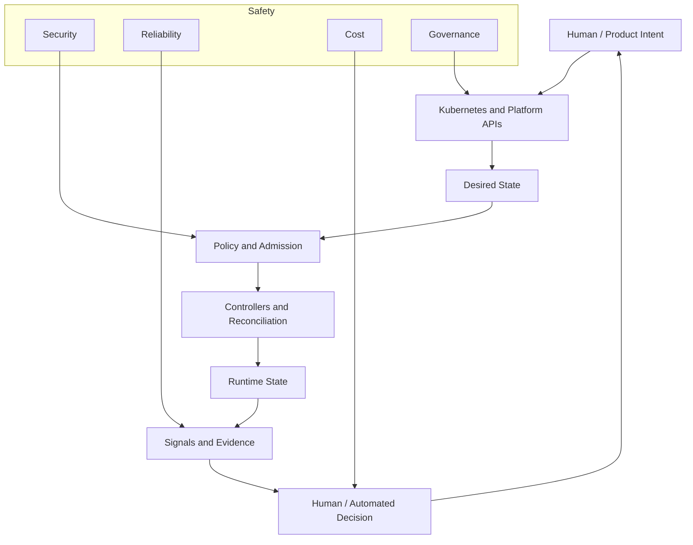

Kubernetes is powerful because it separates intent from execution.

A platform is valuable because it makes that separation safe for humans, teams, and organizations.

---

## 33. Final Series Completion Note

This is the final part of the series:

```text
learn-kubernetes-deployment-model-part-035-capstone-production-grade-platform.mdx
```

The series is now complete.

You should now have a full advanced map of Kubernetes and deployment model knowledge from first principles through production platform design.

The next step is not to read more Kubernetes concepts randomly.

The next step is to apply the model to a real platform design:

1. Choose a representative service.
2. Classify its workload type.
3. Write its platform intent contract.
4. Generate its Kubernetes desired state.
5. Add policy, observability, SLO, rollback, and runbook.
6. Simulate failure.
7. Review what the platform made easy and what it failed to support.

That is where knowledge becomes engineering judgment.

---

## 34. References

- Kubernetes Documentation — Production Environment: https://kubernetes.io/docs/setup/production-environment/
- Kubernetes Documentation — Concepts Overview: https://kubernetes.io/docs/concepts/
- Kubernetes Documentation — Kubernetes Components: https://kubernetes.io/docs/concepts/overview/components/
- Kubernetes Documentation — Workloads: https://kubernetes.io/docs/concepts/workloads/
- Kubernetes Documentation — Services, Load Balancing, and Networking: https://kubernetes.io/docs/concepts/services-networking/
- Kubernetes Documentation — Storage: https://kubernetes.io/docs/concepts/storage/
- Kubernetes Documentation — Security: https://kubernetes.io/docs/concepts/security/
- Kubernetes Documentation — RBAC: https://kubernetes.io/docs/reference/access-authn-authz/rbac/
- Kubernetes Documentation — Admission Controllers: https://kubernetes.io/docs/reference/access-authn-authz/admission-controllers/
- Kubernetes Documentation — Observability: https://kubernetes.io/docs/concepts/cluster-administration/observability/
- Kubernetes Documentation — Version Skew Policy: https://kubernetes.io/releases/version-skew-policy/
- OpenGitOps Principles: https://opengitops.dev/
- CNCF TAG App Delivery — Platforms White Paper: https://tag-app-delivery.cncf.io/whitepapers/platforms/
- SLSA Framework: https://slsa.dev/
- Sigstore Cosign Documentation: https://docs.sigstore.dev/cosign/
- OpenTelemetry Documentation: https://opentelemetry.io/docs/
- Prometheus Documentation: https://prometheus.io/docs/
