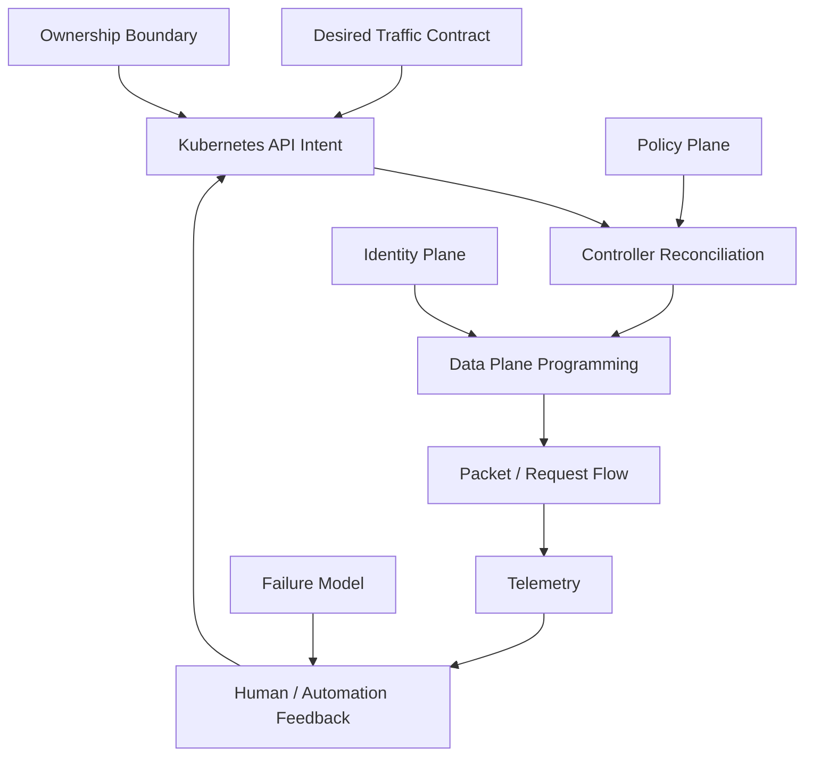
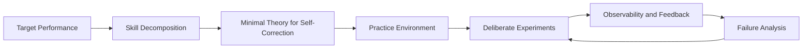
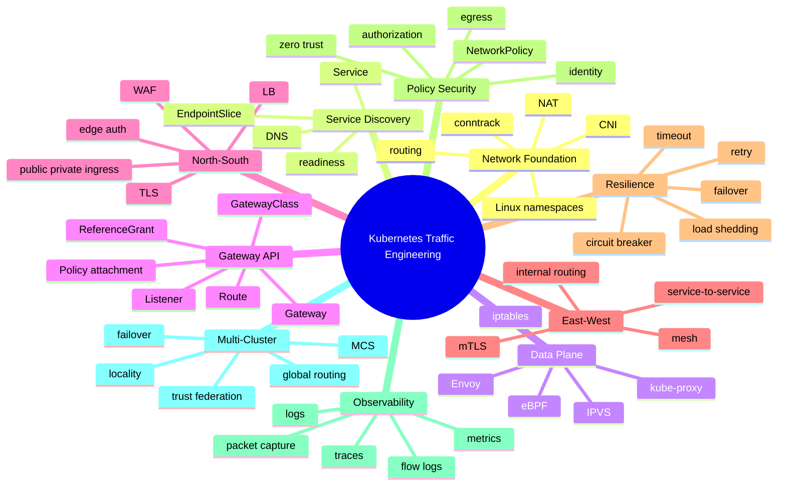
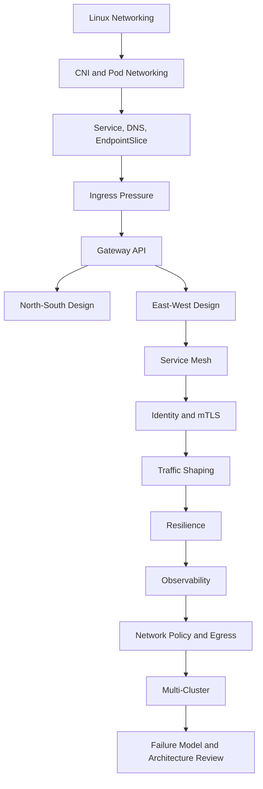
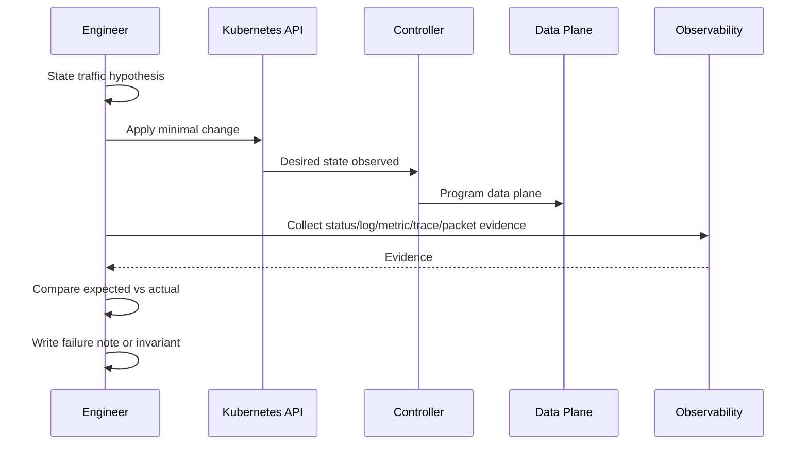
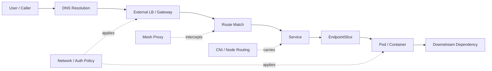

# Part 001 — Kaufman Skill Map and Operating Model

## 1. Tujuan Part Ini

Part ini adalah peta belajar untuk seluruh seri. Fokusnya bukan menjelaskan semua detail Kubernetes networking sekaligus, tetapi membangun **operating model**: bagaimana cara berpikir, apa target performa, bagaimana memecah skill, bagaimana berlatih, dan bagaimana mengukur apakah pemahaman sudah cukup untuk membuat keputusan produksi.

Seri ini diasumsikan sebagai lanjutan dari materi Kubernetes, deployment model, Docker, containerization, dan operational Kubernetes dasar. Karena itu, kita tidak akan mengulang definisi panjang tentang Pod, Deployment, ReplicaSet, container image, atau cara menjalankan `kubectl apply`. Kita hanya akan menyentuh konsep dasar jika konsep tersebut diperlukan untuk memahami traffic path, control plane, data plane, security boundary, atau failure mode.

Target akhirnya: Anda tidak hanya bisa menulis YAML Gateway, Service, Ingress, VirtualService, atau NetworkPolicy. Anda harus mampu menjawab pertanyaan seperti:

- Mengapa traffic dari user tertentu masuk ke backend versi lama, padahal HTTPRoute sudah diperbarui?
- Mengapa Service terlihat sehat, tetapi request gagal hanya pada node tertentu?
- Mengapa DNS lookup berhasil, tetapi TLS handshake gagal?
- Mengapa canary 5% menghasilkan error rate 40% pada subset user?
- Mengapa mTLS aktif, tetapi masih ada plaintext path?
- Mengapa failover multi-cluster memperburuk outage?
- Mengapa policy “deny all egress” tidak benar-benar menutup semua jalur keluar?
- Mengapa controller A dan controller B sama-sama mengklaim Gateway API compliant, tetapi perilaku production berbeda?

Itulah level yang kita kejar: **traffic reasoning under uncertainty**.

---

## 2. Premis Utama: Kubernetes Networking Adalah Traffic Engineering, Bukan Connectivity Checklist

Banyak engineer memulai Kubernetes networking dengan checklist seperti:

- Pod bisa ping Pod lain.
- Service bisa resolve DNS.
- Ingress bisa expose HTTP.
- TLS certificate valid.
- NetworkPolicy sudah diterapkan.
- Gateway API route sudah accepted.

Checklist seperti itu berguna, tetapi belum cukup. Di production, masalah yang berbahaya sering terjadi di celah antar-layer:

- DNS benar, tetapi client cache salah.
- Service punya endpoint, tetapi endpoint belum siap melayani request nyata.
- Gateway route accepted, tetapi belum programmed ke data plane.
- Certificate valid, tetapi trust boundary salah.
- Retry policy terlihat aman, tetapi memperparah overload.
- Mesh policy benar, tetapi ada traffic bypass lewat path lain.
- Multi-cluster failover bekerja, tetapi data dependency tidak siap menerima traffic lintas region.

Karena itu, seri ini melihat Kubernetes networking sebagai gabungan dari beberapa plane:



Seorang engineer level tinggi tidak berhenti pada “manifest sudah benar”. Ia bertanya:

1. **Intent-nya apa?** Traffic seharusnya bergerak dari mana ke mana, dengan identitas apa, melalui policy apa, dan dengan fallback apa?
2. **API object mana yang menyatakan intent itu?** Service, Gateway, Route, NetworkPolicy, mesh policy, cloud LB annotation, DNS record, atau policy eksternal?
3. **Controller mana yang bertanggung jawab menerjemahkan intent?** Gateway controller, ingress controller, kube-proxy, CNI agent, mesh control plane, cloud controller, external-dns, cert-manager, atau yang lain?
4. **Data plane mana yang benar-benar mengeksekusi?** iptables, IPVS, eBPF, Envoy, cloud load balancer, node routing, DNS resolver, atau proxy eksternal?
5. **Apa bukti bahwa intent sudah menjadi realitas?** Status condition, endpoint list, dataplane config dump, metrics, logs, packet capture, traces, atau synthetic check?
6. **Apa failure mode-nya?** Apa yang terjadi jika satu controller stale, satu node kehilangan route, satu trust bundle salah, satu region gagal, atau DNS cache menahan record lama?

Inilah operating model seri ini.

---

## 3. Anchor Faktual yang Harus Dipegang

Sebelum masuk ke skill map, kita perlu beberapa anchor faktual dari dokumentasi resmi agar mental model tidak dibangun di atas asumsi.

### 3.1 Kubernetes Services dan EndpointSlices

Kubernetes Service menyediakan alamat stabil untuk sekumpulan Pod yang dapat berubah dari waktu ke waktu. Kubernetes mengelola EndpointSlice untuk merepresentasikan endpoint backend yang mendukung Service. Artinya, Service bukan backend itu sendiri; Service adalah indirection layer yang mengarah ke endpoint aktual.

Implikasi production:

- Service yang ada belum tentu punya endpoint.
- Endpoint yang ada belum tentu siap menerima traffic.
- EndpointSlice yang stale dapat membuat routing terlihat “misterius”.
- Load balancing Service bergantung pada implementasi data plane seperti kube-proxy, IPVS, eBPF, atau cloud/controller-specific behavior.

Sumber primer: [Kubernetes Services, Load Balancing, and Networking](https://kubernetes.io/docs/concepts/services-networking/) dan [Kubernetes Service](https://kubernetes.io/docs/concepts/services-networking/service/).

### 3.2 Kubernetes DNS

Kubernetes membuat DNS record untuk Service dan Pod agar workload dapat menemukan Service menggunakan nama yang stabil, bukan IP yang berubah-ubah.

Implikasi production:

- DNS adalah dependency kritis, bukan detail kecil.
- `ndots`, search domain, cache, timeout, dan resolver behavior dapat memengaruhi latency dan error rate.
- DNS success tidak membuktikan backend healthy.

Sumber primer: [DNS for Services and Pods](https://kubernetes.io/docs/concepts/services-networking/dns-pod-service/).

### 3.3 NetworkPolicy

NetworkPolicy mengatur traffic yang diizinkan menuju atau keluar dari Pod yang dipilih berdasarkan selector dan rule. NetworkPolicy bekerja jika CNI yang digunakan memang mendukung enforcement.

Implikasi production:

- Policy bersifat additive.
- Default behavior biasanya allow sebelum ada policy yang memilih Pod tersebut.
- “Deny all” harus dirancang secara eksplisit.
- DNS, egress, health check, dan control-plane dependency sering terblokir tanpa sengaja.

Sumber primer: [Kubernetes Network Policies](https://kubernetes.io/docs/concepts/services-networking/network-policies/).

### 3.4 Gateway API

Gateway API adalah keluarga API Kubernetes untuk dynamic infrastructure provisioning dan advanced traffic routing. Gateway API bersifat role-oriented, protocol-aware, dan dirancang untuk menggantikan banyak keterbatasan Ingress berbasis annotation.

Implikasi production:

- Gateway API bukan hanya “Ingress versi baru”.
- Ada separation of concerns antara infrastructure provider, cluster/platform operator, dan application owner.
- Status condition seperti `Accepted`, `ResolvedRefs`, dan `Programmed` harus dibaca sebagai bagian dari contract.
- Conformance matters, tetapi conformance tidak otomatis berarti semua extension dan policy portable.

Sumber primer: [Kubernetes Gateway API](https://kubernetes.io/docs/concepts/services-networking/gateway/) dan [Gateway API Overview](https://gateway-api.sigs.k8s.io/docs/concepts/api-overview/).

### 3.5 ReferenceGrant

Gateway API menggunakan ReferenceGrant untuk mengizinkan cross-namespace reference secara eksplisit. Ini penting karena cross-namespace reference adalah security boundary problem.

Implikasi production:

- Route dari namespace A tidak boleh sembarang menunjuk backend atau Secret di namespace B.
- Delegasi harus eksplisit.
- ReferenceGrant adalah alat governance, bukan sekadar YAML tambahan.

Sumber primer: [Gateway API ReferenceGrant](https://gateway-api.sigs.k8s.io/api-types/referencegrant/).

### 3.6 Multi-Cluster Services API

MCS API memperluas konsep Service ke banyak cluster melalui ServiceExport dan ServiceImport. Ini memungkinkan Service dengan nama yang sama diekspor dan ditemukan lintas cluster dalam ClusterSet.

Implikasi production:

- Namespace sameness menjadi asumsi penting.
- Service identity dan failover lintas cluster harus dirancang, bukan diasumsikan.
- Cross-cluster routing membawa latency, consistency, DNS, security, dan observability problem baru.

Sumber primer: [SIG Multicluster — ServiceExport](https://multicluster.sigs.k8s.io/api-types/service-export/).

---

## 4. Menerjemahkan Framework Kaufman ke Kubernetes Networking

Buku *The First 20 Hours* dari Josh Kaufman menekankan bahwa belajar skill baru secara efektif membutuhkan:

1. Menentukan target performa konkret.
2. Memecah skill menjadi subskill kecil.
3. Belajar cukup untuk bisa memperbaiki diri sendiri.
4. Menghapus hambatan latihan.
5. Berlatih secara sengaja selama waktu yang cukup intens.

Untuk domain ini, kita terjemahkan menjadi engineering loop berikut:



### 4.1 Target Performance

Target kita bukan “bisa menggunakan Kubernetes networking”. Targetnya lebih presisi:

> Mampu mendesain, mengimplementasikan, mengamankan, mengobservasi, dan men-debug traffic platform Kubernetes untuk workload production, termasuk Gateway API, service mesh, policy, egress, dan multi-cluster routing, dengan pemahaman control-plane/data-plane serta failure mode yang eksplisit.

Skill ini punya tiga level:

#### Level 1 — Operator

Mampu menjalankan manifest dan memahami object dasar:

- Service
- EndpointSlice
- Ingress
- Gateway
- HTTPRoute
- NetworkPolicy
- basic mesh CRD

Level ini belum cukup untuk arsitektur production.

#### Level 2 — Diagnostician

Mampu men-debug berdasarkan path:

- DNS path
- Service selection path
- Endpoint readiness path
- proxy route path
- TLS path
- policy path
- node/CNI path
- application protocol path

Level ini membuat Anda jauh lebih efektif saat incident.

#### Level 3 — Traffic Architect

Mampu merancang sistem traffic dengan eksplisit:

- ownership boundary
- platform guardrails
- tenant isolation
- progressive delivery
- mTLS identity
- egress control
- multi-cluster failover
- observability model
- cost model
- disaster behavior

Level inilah yang kita targetkan.

---

## 5. Skill Decomposition: 10 Subskill Inti

Kubernetes networking terlalu besar jika dipelajari sebagai satu blok. Kita pecah menjadi 10 subskill.



### 5.1 Subskill 1 — Network Foundation

Anda tidak harus menjadi kernel engineer, tetapi harus cukup paham Linux networking untuk menghindari debugging buta.

Minimum yang harus dikuasai:

- network namespace
- veth pair
- bridge
- routing table
- iptables/nftables
- conntrack
- NAT/SNAT/DNAT
- TCP lifecycle
- MTU
- packet capture

Pertanyaan performa:

- Bisa menjelaskan bagaimana packet keluar dari container menuju node?
- Bisa membedakan routing failure, DNS failure, TLS failure, dan application failure?
- Bisa membaca `ss`, `ip route`, `tcpdump`, dan conntrack secara cukup untuk menguji hipotesis?

### 5.2 Subskill 2 — Service Discovery

Service discovery adalah gabungan dari object API, DNS, endpoint readiness, dan client behavior.

Minimum yang harus dikuasai:

- Service selector
- EndpointSlice
- CoreDNS
- search domain
- headless Service
- StatefulSet DNS
- readiness gate
- terminating endpoint

Pertanyaan performa:

- Bisa menjelaskan mengapa Service resolve tetapi connection refused?
- Bisa menjelaskan mengapa headless Service berbeda dari ClusterIP?
- Bisa mendeteksi apakah problem berada di DNS, EndpointSlice, kube-proxy/eBPF, atau app?

### 5.3 Subskill 3 — Data Plane

Data plane adalah bagian yang benar-benar memindahkan packet/request.

Minimum yang harus dikuasai:

- kube-proxy iptables
- kube-proxy IPVS
- eBPF load balancing
- node routing
- CNI overlay/underlay
- Envoy sebagai L7 proxy
- cloud load balancer path

Pertanyaan performa:

- Bisa membedakan “API object benar” dari “data plane sudah terprogram”?
- Bisa menjelaskan mengapa traffic hanya gagal pada node tertentu?
- Bisa menjelaskan dampak conntrack terhadap Service load balancing?

### 5.4 Subskill 4 — Gateway API

Gateway API adalah interface modern untuk routing dan infra provisioning di Kubernetes.

Minimum yang harus dikuasai:

- GatewayClass
- Gateway
- Listener
- HTTPRoute
- GRPCRoute
- TCPRoute/UDPRoute/TLSRoute
- BackendRef
- ReferenceGrant
- status conditions
- policy attachment
- conformance

Pertanyaan performa:

- Bisa menjelaskan mengapa HTTPRoute tidak attached?
- Bisa membaca status condition dan membedakan Accepted vs Programmed?
- Bisa mendesain shared Gateway untuk banyak namespace tanpa route hijacking?

### 5.5 Subskill 5 — North-South Traffic

North-south traffic adalah traffic dari luar cluster ke workload, atau dari cluster ke luar melalui jalur edge tertentu.

Minimum yang harus dikuasai:

- cloud load balancer
- public/private ingress
- TLS termination
- WAF placement
- API gateway vs Gateway API
- externalTrafficPolicy
- source IP preservation
- CDN integration
- health check semantics

Pertanyaan performa:

- Bisa menjelaskan full path dari internet user sampai Pod?
- Bisa menentukan di mana TLS harus terminate?
- Bisa mendesain public dan private exposure dengan blast radius terpisah?

### 5.6 Subskill 6 — East-West Traffic

East-west traffic adalah service-to-service traffic internal. Di microservices, ini sering lebih besar dan lebih kompleks daripada ingress.

Minimum yang harus dikuasai:

- ClusterIP routing
- mesh routing
- internal Gateway/Route
- service identity
- mTLS
- authorization policy
- traffic splitting internal
- internal canary

Pertanyaan performa:

- Bisa menjelaskan request path service A ke service B tanpa dan dengan mesh?
- Bisa membedakan connectivity, identity, authentication, authorization, dan routing?
- Bisa mencegah canary internal bocor ke caller yang salah?

### 5.7 Subskill 7 — Resilience

Resilience bukan “menambahkan retry”. Retry yang buruk sering lebih merusak daripada tidak ada retry.

Minimum yang harus dikuasai:

- timeout taxonomy
- retry budget
- retry amplification
- circuit breaker
- outlier detection
- load shedding
- backpressure
- connection draining
- graceful shutdown

Pertanyaan performa:

- Bisa menyusun timeout hierarchy dari edge sampai dependency?
- Bisa menjelaskan kapan retry aman dan kapan berbahaya?
- Bisa mendesain rollback yang tidak membuat in-flight request rusak?

### 5.8 Subskill 8 — Policy and Security

Security networking bukan hanya NetworkPolicy. Ia mencakup identity, TLS, egress, authorization, namespace boundary, dan supply of trust.

Minimum yang harus dikuasai:

- NetworkPolicy
- CNI-specific policy
- mTLS
- SPIFFE/SPIRE concept
- Gateway ReferenceGrant
- AuthN/AuthZ placement
- egress gateway
- DNS/FQDN policy
- certificate rotation

Pertanyaan performa:

- Bisa mendesain default-deny tanpa mematikan DNS dan telemetry?
- Bisa menjelaskan mengapa IP-based identity lemah untuk workload dinamis?
- Bisa memverifikasi bahwa tidak ada plaintext bypass path?

### 5.9 Subskill 9 — Observability

Tanpa observability, Kubernetes networking berubah menjadi superstition.

Minimum yang harus dikuasai:

- access log
- controller log
- Gateway status
- Envoy config dump
- RED metrics
- USE metrics
- DNS metrics
- CNI flow logs
- distributed tracing
- packet capture

Pertanyaan performa:

- Bisa menghubungkan satu request failure ke route, backend, endpoint, node, dan proxy?
- Bisa membedakan high-level SLO dari low-level packet evidence?
- Bisa menghindari cardinality explosion saat mengobservasi traffic?

### 5.10 Subskill 10 — Multi-Cluster Traffic

Multi-cluster bukan sekadar “punya dua cluster”. Ini adalah distributed traffic problem.

Minimum yang harus dikuasai:

- ClusterSet
- ServiceExport
- ServiceImport
- namespace sameness
- global DNS
- locality-aware routing
- active-active
- active-passive
- failover
- cross-cluster identity
- trust federation

Pertanyaan performa:

- Bisa menjelaskan bagaimana request berpindah cluster saat failover?
- Bisa membedakan cluster failure, regional dependency failure, dan data consistency failure?
- Bisa menjelaskan kapan multi-cluster justru meningkatkan risiko?

---

## 6. Learning Path Seri Ini

Seri ini sengaja bergerak dari bawah ke atas:



Kenapa urutannya seperti ini?

- Gateway API sulit dipahami jika belum paham Service, endpoint, dan listener semantics.
- Service mesh sulit dipahami jika belum paham perbedaan L4 dan L7 traffic.
- mTLS sulit dipahami jika belum paham identity boundary.
- Multi-cluster sulit dipahami jika single-cluster service discovery belum kuat.
- Failure modelling mustahil jika packet path dan API intent path belum jelas.

---

## 7. Apa yang Tidak Akan Kita Lakukan

Agar efisien, seri ini tidak akan menjadi kumpulan tutorial dangkal.

Kita tidak akan banyak menghabiskan waktu untuk:

- menjelaskan apa itu Pod dari nol;
- menjelaskan cara install Kubernetes dari nol;
- menjelaskan Dockerfile basic;
- mengulang YAML Deployment dan Service dasar secara panjang;
- membandingkan semua vendor secara marketing;
- menghafal field API tanpa mental model;
- membuat demo “hello world” tanpa failure analysis;
- menyatakan pattern sebagai best practice tanpa trade-off.

Kita akan fokus pada:

- invariants;
- packet/request path;
- API reconciliation;
- ownership boundary;
- policy semantics;
- failure mode;
- observability proof;
- decision framework;
- production trade-off.

---

## 8. Performance Standard: Apa Artinya “Menguasai”

Menguasai Kubernetes networking berarti mampu bekerja pada empat mode:

### 8.1 Design Mode

Anda diberi requirement:

> Platform harus melayani public API, private internal API, tenant berbeda, canary deployment, mTLS internal, audit egress, dan failover region.

Anda bisa menghasilkan:

- traffic architecture diagram;
- object ownership model;
- Gateway/API boundary;
- mesh or non-mesh decision;
- NetworkPolicy baseline;
- egress control design;
- observability plan;
- failure mode table;
- migration plan.

### 8.2 Implementation Mode

Anda bisa mengubah design menjadi resource:

- Service;
- Gateway;
- HTTPRoute/GRPCRoute;
- ReferenceGrant;
- policy attachment;
- mesh policy;
- NetworkPolicy;
- certificate resource;
- monitoring config;
- runbook.

Tetapi implementation mode tidak berhenti pada `kubectl apply`. Anda harus memverifikasi status dan behavior.

### 8.3 Debugging Mode

Anda bisa memulai dari gejala:

- `curl` timeout;
- HTTP 503;
- TLS handshake failure;
- gRPC unavailable;
- DNS intermittent timeout;
- route accepted but no traffic;
- canary wrong split;
- mTLS authorization denied;
- cross-cluster failover stale.

Lalu Anda membentuk hipotesis berurutan, bukan random editing.

### 8.4 Review Mode

Anda bisa menilai design orang lain:

- Apakah blast radius jelas?
- Apakah trust boundary jelas?
- Apakah route delegation aman?
- Apakah timeout/retry hierarchy benar?
- Apakah observability cukup untuk incident?
- Apakah failover behavior realistis?
- Apakah controller-specific extension menciptakan lock-in?
- Apakah biaya cross-zone/cross-region dipahami?

---

## 9. Traffic Contract: Unit Berpikir Utama

Dalam seri ini, kita akan sering memakai istilah **traffic contract**.

Traffic contract adalah pernyataan eksplisit tentang bagaimana traffic boleh bergerak:

```txt
Caller identity:
  siapa yang memulai traffic?

Entry point:
  traffic masuk lewat mana?

Protocol:
  HTTP, gRPC, TCP, UDP, TLS, mTLS?

Route intent:
  host, path, method, header, weight, mirror, rewrite?

Backend selection:
  Service mana, subset mana, versi mana, cluster mana?

Security:
  TLS termination, mTLS, authN, authZ, NetworkPolicy, egress policy?

Resilience:
  timeout, retry, circuit breaker, load shedding, failover?

Observability:
  metric, log, trace, flow evidence apa yang membuktikan behavior?

Failure behavior:
  apa yang terjadi jika backend, node, zone, cluster, DNS, cert, atau controller gagal?
```

Manifest Kubernetes hanya salah satu cara mengekspresikan traffic contract. Jika contract tidak jelas, YAML yang terlihat benar tetap bisa salah secara sistemik.

---

## 10. Invariants yang Harus Dibawa Sepanjang Seri

Invariant adalah prinsip yang tetap benar meskipun implementasi berubah.

### 10.1 API Object Tidak Sama Dengan Data Plane State

Service, Gateway, Route, dan NetworkPolicy adalah desired state. Traffic aktual bergantung pada controller dan data plane yang merekonsiliasi desired state tersebut.

Konsekuensi:

- Manifest valid belum tentu data plane valid.
- `kubectl apply` sukses belum tentu listener siap.
- Route `Accepted=True` belum tentu traffic sudah diprogram.
- Status condition adalah evidence, bukan dekorasi.

### 10.2 DNS Success Tidak Sama Dengan Service Health

DNS hanya menjawab nama menjadi alamat atau record tertentu. DNS tidak membuktikan backend siap.

Konsekuensi:

- `nslookup service` sukses tidak cukup.
- Masalah bisa berada di endpoint, kube-proxy, CNI, policy, TLS, atau app.
- DNS caching dapat membuat perubahan topology terasa lambat.

### 10.3 Connectivity Tidak Sama Dengan Authorization

Traffic bisa reach backend tetapi tetap ditolak oleh layer lain:

- TLS verification;
- mTLS identity;
- JWT validation;
- AuthorizationPolicy;
- application auth;
- network policy;
- WAF.

Konsekuensi:

- `tcp connect success` hanya membuktikan L4 path terbuka.
- HTTP 403 bisa berarti policy bekerja benar.
- HTTP 503 bisa berasal dari proxy, bukan aplikasi.

### 10.4 Load Balancing Tidak Sama Dengan Fairness

Traffic splitting 50/50 tidak selalu berarti setiap user, request type, connection, atau byte terbagi rata.

Konsekuensi:

- Long-lived connection dapat membuat distribusi berat sebelah.
- Sticky session mengubah distribusi.
- HTTP/2 multiplexing mengubah makna “request count”.
- Outlier detection dan retry dapat mengubah effective traffic.

### 10.5 Multi-Cluster Tidak Otomatis Meningkatkan Availability

Multi-cluster dapat meningkatkan availability jika dependency, data consistency, routing, identity, observability, dan operational process siap. Jika tidak, ia hanya menambah failure surface.

Konsekuensi:

- Failover harus diuji, bukan diasumsikan.
- Global DNS TTL dan client cache penting.
- Cross-cluster traffic dapat melanggar latency budget.
- Data dependency sering menjadi bottleneck availability sebenarnya.

---

## 11. Practice Environment yang Disarankan

Seri ini bisa dipelajari secara konseptual, tetapi skill tidak akan tajam tanpa lab. Untuk latihan lokal, minimal gunakan satu cluster lokal. Untuk multi-cluster, gunakan dua atau tiga cluster lokal jika resource cukup.

### 11.1 Minimum Local Lab

Komponen minimum:

- Kubernetes lokal: `kind`, `k3d`, atau environment sejenis.
- CNI yang bisa diamati.
- Gateway API CRD.
- Satu Gateway controller.
- Sample services:
  - `frontend`
  - `orders`
  - `payments`
  - `inventory`
  - `audit`
- Observability minimal:
  - metrics scraping;
  - logs;
  - simple tracing jika memungkinkan.

### 11.2 Advanced Lab

Untuk bagian lanjutan:

- dua cluster lokal untuk multi-cluster;
- service mesh sidecar mode;
- service mesh ambient/sidecarless mode jika resource memungkinkan;
- CNI dengan NetworkPolicy enforcement;
- egress gateway atau proxy;
- certificate manager;
- chaos experiments.

### 11.3 Sample Domain yang Akan Dipakai

Kita akan sering memakai domain konseptual berikut:

```txt
api.example.internal
public-api.example.com
orders.default.svc.cluster.local
payments.finance.svc.cluster.local
inventory.supply.svc.cluster.local
audit.compliance.svc.cluster.local
```

Tujuannya bukan membangun aplikasi bisnis lengkap, tetapi memberikan konteks traffic realistis:

- public API;
- internal service-to-service;
- sensitive payment path;
- audit egress;
- canary rollout;
- multi-cluster failover;
- tenant isolation.

---

## 12. Deliberate Practice Loop

Setiap topik harus dilatih dengan loop berikut:



Contoh deliberate practice yang baik:

> “Saya akan membuat HTTPRoute dengan dua backend 90/10. Saya prediksi 10% request baru masuk backend v2. Saya akan menguji dengan 1000 request non-sticky, melihat Gateway status, controller logs, backend access logs, dan metric per backend. Jika hasilnya tidak 90/10, saya akan mencari apakah penyebabnya connection reuse, header routing, backend readiness, atau controller-specific behavior.”

Contoh practice yang buruk:

> “Saya apply YAML canary lalu lihat apakah kira-kira jalan.”

Bedanya adalah hypothesis, measurement, dan learning extraction.

---

## 13. Debugging Operating Model

Saat incident networking, jangan mulai dari edit YAML. Mulai dari klasifikasi gejala.

### 13.1 Symptom Classification

```txt
1. Name resolution failure
   - NXDOMAIN
   - timeout
   - wrong IP
   - intermittent DNS latency

2. Connection failure
   - timeout
   - connection refused
   - no route to host
   - reset by peer

3. TLS failure
   - certificate expired
   - SAN mismatch
   - unknown authority
   - handshake timeout
   - mTLS identity mismatch

4. HTTP/gRPC routing failure
   - 404 from gateway
   - 503 from proxy
   - 504 timeout
   - gRPC unavailable
   - wrong backend

5. Authorization failure
   - 401
   - 403
   - RBAC/policy denied
   - mTLS principal mismatch

6. Performance failure
   - high latency
   - uneven load
   - retry storm
   - queueing
   - saturation
```

### 13.2 Path-Oriented Debugging

Gunakan path, bukan object list.



Setiap node di path harus punya evidence:

| Segment | Evidence |
|---|---|
| DNS | query result, CoreDNS logs, resolver config, latency metric |
| Edge LB | health check, listener, target status, source IP |
| Gateway | Gateway status, listener status, route attachment, controller logs |
| Route | match rule, precedence, backend ref, policy attachment |
| Service | selector, ClusterIP, ports, internal/external traffic policy |
| EndpointSlice | endpoint addresses, readiness, topology hints, terminating state |
| Pod | readiness, container port, app logs, socket state |
| CNI/node | route table, iptables/eBPF state, conntrack, packet capture |
| Mesh | proxy config, mTLS status, auth policy, access log |
| App | protocol response, dependency behavior, timeout budget |

---

## 14. Decision Records sebagai Kebiasaan

Untuk setiap pilihan arsitektur traffic, biasakan menulis Architecture Decision Record (ADR). Ini bukan birokrasi; ini alat menghindari keputusan kabur.

Template singkat:

```md
# ADR: <decision title>

## Context
Apa masalah traffic/security/operability yang sedang diselesaikan?

## Decision
Apa pilihan yang diambil?

## Alternatives Considered
Pilihan lain apa yang dievaluasi?

## Consequences
Apa konsekuensi positif dan negatifnya?

## Failure Modes
Apa failure mode utama?

## Observability
Evidence apa yang membuktikan sistem bekerja?

## Rollback / Migration
Bagaimana cara mundur jika keputusan salah?
```

Contoh keputusan yang wajib ADR:

- memilih Gateway controller;
- memakai atau tidak memakai service mesh;
- sidecar vs ambient/sidecarless;
- public dan private Gateway dipisah atau digabung;
- egress lewat NAT, proxy, atau egress gateway;
- default-deny NetworkPolicy baseline;
- active-active multi-cluster;
- mTLS trust domain design.

---

## 15. Platform Ownership Model

Kubernetes networking sering gagal bukan karena teknologi, tetapi karena ownership blur.

### 15.1 Role Umum

| Role | Tanggung Jawab |
|---|---|
| Infrastructure team | cloud LB, VPC, routing, firewall, DNS public/private, cluster networking substrate |
| Platform team | GatewayClass, Gateway, Gateway controller, mesh control plane, policy baseline, observability platform |
| Application team | Route, Service, app readiness, timeout config, traffic split intent, app-level auth behavior |
| Security team | trust model, certificate policy, mTLS posture, NetworkPolicy baseline, egress governance |
| SRE team | SLO, incident response, capacity, failure testing, runbook, alerting |

### 15.2 Boundary yang Harus Jelas

- Siapa boleh membuat Gateway public?
- Siapa boleh attach route ke shared Gateway?
- Siapa boleh refer Secret TLS?
- Siapa boleh expose backend lintas namespace?
- Siapa boleh mengubah retry policy?
- Siapa boleh export Service lintas cluster?
- Siapa bertanggung jawab saat route accepted tetapi backend tidak siap?

Gateway API membantu separation of concerns, tetapi tidak otomatis menyelesaikan governance. Anda tetap harus mendesain RBAC, admission policy, naming convention, dan review process.

---

## 16. Failure Modelling Baseline

Setiap part nanti akan punya failure mode, tetapi baseline-nya sebagai berikut.

| Failure Area | Typical Cause | Observable Symptom | First Questions |
|---|---|---|---|
| DNS | CoreDNS overload, bad search domain, stale cache | intermittent lookup timeout | Apakah nama resolve dari Pod yang sama? Apakah latency DNS naik? |
| Service | selector salah, port mismatch | no endpoint atau connection refused | Service memilih Pod yang benar? TargetPort benar? |
| EndpointSlice | readiness salah, stale watch | 503 atau traffic ke Pod tidak siap | Endpoint ready? Terminating? Zone-local? |
| CNI | route/overlay problem, policy enforcement | pod-to-pod gagal antar-node | Node tertentu saja? Cross-node saja? |
| kube-proxy/eBPF | stale rules/map, conntrack issue | Service IP gagal, Pod IP bisa | Apakah ClusterIP path saja yang gagal? |
| Gateway | listener/route conflict, invalid ref | route not attached, 404/503 | Status Accepted/Programmed? ResolvedRefs? |
| TLS | cert/SNI/trust mismatch | handshake error | Cert SAN cocok? CA trusted? Termination di mana? |
| Mesh | stale config, mTLS mismatch, proxy overload | 503 UC/UF, 403 policy denied | Apakah proxy config sesuai? Identity benar? |
| NetworkPolicy | selector salah, default deny | timeout | Policy memilih Pod yang dimaksud? DNS dibolehkan? |
| Egress | NAT exhaustion, firewall, proxy | external timeout | Source IP stabil? Port exhausted? |
| Multi-cluster | stale import, DNS failover, identity mismatch | failover gagal atau wrong region | Cluster mana yang menerima traffic? Endpoint import valid? |

---

## 17. Anti-Patterns yang Akan Kita Lawan

### 17.1 YAML-First Thinking

Gejala:

- mencari template dulu;
- apply manifest tanpa memahami controller;
- menganggap status object tidak penting;
- debugging dengan mengubah field acak.

Obat:

- mulai dari traffic contract;
- gambar path;
- buat hipotesis;
- verifikasi status dan data plane.

### 17.2 “Ingress/Gateway Adalah API Gateway” Confusion

Gateway API mengatur routing Kubernetes, tetapi tidak otomatis menggantikan semua kemampuan API gateway seperti developer portal, monetization, advanced auth productization, API lifecycle management, atau client subscription. Beberapa implementation bisa menyediakan fitur tersebut, tetapi konsepnya harus dipisah.

Obat:

- bedakan Kubernetes Gateway, edge API gateway, service mesh gateway, dan cloud load balancer;
- tentukan ownership dan responsibility masing-masing.

### 17.3 “Service Mesh Akan Menyelesaikan Semua”

Mesh bisa membantu reliability, mTLS, telemetry, dan traffic control, tetapi juga menambah control plane, proxy, resource overhead, upgrade complexity, dan failure surface.

Obat:

- mulai dari problem statement;
- pilih mesh hanya jika value lebih besar dari operational cost;
- desain observability dan rollback sebelum adopsi.

### 17.4 “Multi-Cluster = HA”

Multi-cluster tanpa data strategy, identity federation, routing policy, and tested failover sering hanya menambah kompleksitas.

Obat:

- definisikan failure scenario;
- uji failover;
- hitung latency dan consistency;
- pastikan observability lintas cluster.

---

## 18. Cara Membaca Seri Ini

Setiap part akan mengikuti pola:

1. **Problem framing** — masalah nyata yang ingin diselesaikan.
2. **Mental model** — cara berpikir yang tahan terhadap variasi vendor.
3. **Core concepts** — konsep API/data plane yang harus dipahami.
4. **Production semantics** — konsekuensi di sistem nyata.
5. **Failure modes** — cara sistem gagal.
6. **Debugging model** — bagaimana membuktikan penyebab.
7. **Design patterns** — kapan dan bagaimana menggunakan konsep tersebut.
8. **Anti-patterns** — jebakan umum.
9. **Exercises** — latihan deliberate practice.
10. **Review checklist** — pertanyaan audit untuk diri sendiri.

Gaya penulisan akan dibuat seperti engineering handbook: ringkas, sistematis, tetapi tetap cukup detail untuk dipakai sebagai referensi kerja.

---

## 19. 20-Hour Practice Plan untuk Seri Ini

Walaupun seri terdiri dari 35 part, Kaufman-style deliberate practice bisa dimulai dengan 20 jam pertama.

| Jam | Fokus | Output |
|---:|---|---|
| 1 | Map traffic path single cluster | Diagram Pod-Service-DNS-Endpoint |
| 2 | Linux networking observation | `ip`, `ss`, route, tcpdump notes |
| 3 | Service and EndpointSlice | Failure notes: no endpoint, wrong targetPort |
| 4 | DNS behavior | ndots/search/cache experiment |
| 5 | kube-proxy/eBPF model | Service VIP path notes |
| 6 | Ingress limitation | Annotation and ownership problem notes |
| 7 | Gateway API core | Gateway + HTTPRoute status reading |
| 8 | Route matching | host/path/header/weight experiment |
| 9 | TLS | termination and SNI experiment |
| 10 | Cross-namespace delegation | ReferenceGrant experiment |
| 11 | North-south architecture | edge-to-pod diagram |
| 12 | East-west route | internal routing experiment |
| 13 | Mesh basics | proxy path observation |
| 14 | mTLS and identity | identity and auth policy notes |
| 15 | Traffic shaping | canary and mirror experiment |
| 16 | Timeout/retry | retry amplification experiment |
| 17 | Observability | metrics/logs/traces correlation |
| 18 | NetworkPolicy | default-deny and DNS exception |
| 19 | Egress | source IP and proxy control experiment |
| 20 | Multi-cluster thought exercise | failover design and failure table |

Tujuan 20 jam pertama bukan menjadi ahli penuh, tetapi mencapai titik di mana Anda bisa belajar mandiri dengan feedback yang benar.

---

## 20. Self-Assessment Baseline

Sebelum melanjutkan ke Part 002, ukur diri dengan pertanyaan berikut.

### 20.1 Conceptual

- Bisakah Anda menjelaskan perbedaan control plane dan data plane dalam satu request path?
- Bisakah Anda menjelaskan mengapa Service bukan backend?
- Bisakah Anda menjelaskan mengapa Gateway API bukan sekadar Ingress baru?
- Bisakah Anda menjelaskan mengapa NetworkPolicy bukan firewall global sederhana?
- Bisakah Anda menjelaskan mengapa multi-cluster tidak otomatis berarti HA?

### 20.2 Diagnostic

- Jika HTTP 503 muncul dari gateway, apa 10 kemungkinan penyebabnya?
- Jika DNS resolve tetapi request timeout, layer mana yang akan Anda cek?
- Jika request hanya gagal antar-node, apa hipotesis awal Anda?
- Jika canary 10% menghasilkan 70% error, data apa yang Anda cari?
- Jika route `Accepted=True` tetapi traffic tidak mengalir, status atau evidence apa yang kurang?

### 20.3 Design

- Bagaimana Anda memisahkan public dan private ingress?
- Bagaimana Anda mengizinkan app team mengelola route tanpa mengizinkan mereka mengambil alih TLS Secret namespace lain?
- Bagaimana Anda mendesain default-deny egress tetapi tetap mengizinkan DNS, telemetry, dan approved external API?
- Bagaimana Anda memilih antara sidecar mesh dan sidecarless/ambient mesh?
- Bagaimana Anda membuktikan failover multi-cluster benar-benar aman?

Jika banyak jawaban masih kabur, itu normal. Seri ini akan mengisi celah tersebut.

---

## 21. Ringkasan Part 001

Part ini menetapkan cara belajar dan cara berpikir:

- Kubernetes networking harus dipahami sebagai traffic engineering discipline.
- Manifest adalah desired state, bukan bukti behavior.
- Skill utama adalah memetakan intent ke API, controller, data plane, telemetry, dan failure mode.
- Framework Kaufman diterjemahkan menjadi target performa, subskill decomposition, minimal theory, deliberate practice, dan feedback loop.
- Traffic contract menjadi unit berpikir utama.
- Seri ini akan bergerak dari Linux/CNI foundation ke Service/DNS, Gateway API, service mesh, resilience, policy, egress, multi-cluster, dan capstone architecture.

Pada Part 002, kita mulai membangun mental model Kubernetes networking secara lebih teknis: bagaimana traffic bergerak dari Pod ke Pod, Pod ke Service, luar cluster ke backend, service ke external dependency, serta bagaimana layer DNS, Service, EndpointSlice, CNI, Gateway, mesh, dan policy saling berinteraksi.
