# Part 002 — Kubernetes Networking Mental Model

## 1. Tujuan Part Ini

Part ini membangun mental model Kubernetes networking sebelum kita masuk ke detail CNI, Service, DNS, Gateway API, service mesh, dan multi-cluster. Tujuannya adalah membuat Anda bisa melihat sebuah request sebagai perjalanan lintas beberapa layer, bukan sebagai hasil dari satu object YAML.

Setelah part ini, Anda harus bisa menjelaskan:

- bagaimana Pod-to-Pod traffic bergerak;
- bagaimana Pod-to-Service traffic berbeda dari Pod-to-Pod;
- bagaimana DNS, Service, dan EndpointSlice bekerja sebagai discovery chain;
- bagaimana external traffic masuk ke cluster;
- bagaimana service-to-external traffic keluar dari cluster;
- mengapa control plane state dan data plane state bisa berbeda;
- bagaimana policy, identity, proxy, dan observability memotong request path;
- bagaimana mengklasifikasikan failure berdasarkan layer.

Kita tidak akan menulis banyak manifest di part ini. Kita akan membangun peta jalan mental yang akan dipakai di semua part berikutnya.

---

## 2. Kubernetes Networking: Satu Kalimat yang Menyesatkan

Kalimat umum yang sering terdengar:

> “Kubernetes networking memungkinkan Pod saling berkomunikasi.”

Kalimat itu benar, tetapi terlalu dangkal. Untuk production, definisi yang lebih berguna adalah:

> Kubernetes networking adalah sistem koordinasi antara API object, controller, node data plane, service discovery, policy, identity, proxy, dan observability yang bersama-sama menentukan bagaimana packet dan request bergerak antar workload, antar namespace, keluar-masuk cluster, dan lintas cluster.

Perbedaan ini penting. Jika Anda hanya berpikir “Pod bisa berkomunikasi”, Anda akan cenderung men-debug dengan `ping`, `curl`, dan `kubectl get svc`. Jika Anda berpikir dalam bentuk sistem koordinasi, Anda akan men-debug dengan pertanyaan yang lebih tepat:

- API object apa yang menyatakan intent?
- Controller mana yang harus merekonsiliasi intent?
- Data plane mana yang harus diprogram?
- Apakah endpoint ready?
- Apakah DNS mengarah ke nama yang benar?
- Apakah traffic melewati proxy?
- Apakah identity diketahui?
- Apakah policy mengizinkan?
- Apakah telemetry membuktikan request sampai layer yang dimaksud?

---

## 3. Traffic Path vs Resource Graph

Kubernetes memberi kita resource graph:

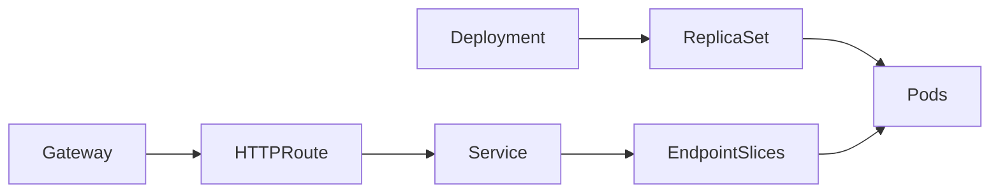

Tetapi user mengalami traffic path:

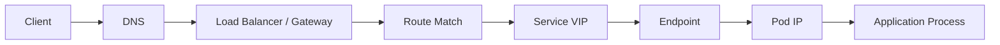

Resource graph menjelaskan ownership dan desired state. Traffic path menjelaskan runtime behavior. Keduanya berhubungan, tetapi tidak sama.

Contoh:

- Deployment dapat sehat, tetapi Service selector salah.
- Service dapat benar, tetapi EndpointSlice kosong.
- EndpointSlice dapat berisi endpoint, tetapi Pod belum siap secara application-level.
- HTTPRoute dapat accepted, tetapi Gateway listener belum programmed.
- Gateway dapat menerima traffic, tetapi backend TLS verification gagal.
- Mesh policy dapat benar, tetapi traffic bypass lewat path non-mesh.

Engineer kuat selalu memetakan resource graph ke traffic path.

---

## 4. Empat Jenis Traffic Utama

Kita akan memakai empat traffic shape dasar.

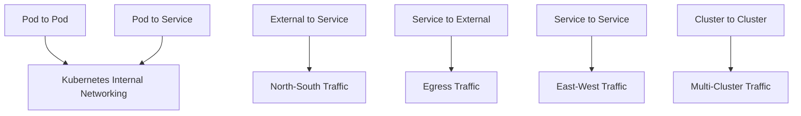

### 4.1 Pod-to-Pod

Pod-to-Pod adalah koneksi langsung dari Pod IP ke Pod IP. Ini paling dekat dengan network model dasar Kubernetes.

Pertanyaan kunci:

- Apakah Pod berada di node yang sama atau node berbeda?
- Apakah CNI memakai overlay atau native routing?
- Apakah NetworkPolicy mengizinkan?
- Apakah MTU cocok?
- Apakah route di node benar?

### 4.2 Pod-to-Service

Pod-to-Service adalah koneksi dari Pod ke Service virtual address atau Service DNS name. Ini melewati indirection:

- DNS name;
- Service object;
- Service VIP atau ClusterIP;
- kube-proxy/IPVS/eBPF load balancing;
- EndpointSlice;
- Pod IP.

Pertanyaan kunci:

- Apakah DNS resolve ke Service yang benar?
- Apakah Service punya endpoint ready?
- Apakah targetPort benar?
- Apakah data plane Service sudah sinkron?
- Apakah conntrack memengaruhi koneksi lama?

### 4.3 External-to-Service

External-to-Service adalah traffic dari luar cluster menuju workload internal.

Path-nya bisa melibatkan:

- public DNS;
- CDN;
- WAF;
- cloud load balancer;
- NodePort;
- LoadBalancer Service;
- Ingress controller;
- Gateway API controller;
- Envoy/NGINX/HAProxy/Kong/Cilium/Istio gateway;
- Service;
- EndpointSlice;
- Pod.

Pertanyaan kunci:

- Di mana TLS terminate?
- Apakah source IP dipertahankan?
- Siapa pemilik route?
- Apakah public dan private path terpisah?
- Apakah health check benar-benar menguji backend yang relevan?

### 4.4 Service-to-External

Service-to-External adalah traffic dari workload di cluster ke dependency luar:

- database managed service;
- SaaS API;
- payment gateway;
- object storage;
- queue eksternal;
- partner system;
- internet endpoint.

Pertanyaan kunci:

- Source IP apa yang terlihat oleh external system?
- Apakah traffic keluar lewat NAT, egress gateway, proxy, atau private link?
- Apakah DNS/FQDN policy diterapkan?
- Apakah ada audit trail?
- Apakah NAT port exhaustion mungkin terjadi?

---

## 5. Model Layer: L3, L4, L7, Identity, Policy

Kubernetes networking sering membingungkan karena beberapa layer saling menumpuk.

| Layer | Contoh | Pertanyaan |
|---|---|---|
| L3 | Pod IP, node route, overlay, underlay | Apakah packet bisa diroute? |
| L4 | TCP/UDP port, Service port, targetPort | Apakah koneksi transport terbuka? |
| L5/L6-ish | TLS, mTLS, SNI, certificate | Apakah channel aman dan identitas valid? |
| L7 | HTTP path/header, gRPC method, retry, auth | Apakah request diarahkan dan diproses benar? |
| Identity | ServiceAccount, SPIFFE ID, cert identity | Siapa caller dan callee? |
| Policy | NetworkPolicy, AuthZ, Gateway policy | Apakah traffic boleh lewat? |
| Observability | logs, metrics, traces, flow logs | Apa bukti runtime behavior? |

Jangan mencampur bukti antar-layer.

Contoh:

- `ping` sukses hanya membuktikan sebagian L3 path; banyak cluster bahkan tidak menjadikan ICMP sebagai sinyal relevan.
- `nc -vz host port` sukses membuktikan L4 connect, bukan HTTP routing atau auth.
- HTTP 200 membuktikan satu path berhasil, bukan semua route aman.
- TLS valid membuktikan certificate cocok, bukan authorization.
- Route `Accepted=True` membuktikan controller menerima intent, bukan selalu membuktikan request sampai backend.

---

## 6. Control Plane vs Data Plane

Ini adalah pemisahan paling penting dalam Kubernetes networking.

### 6.1 Control Plane

Control plane adalah sistem yang menyimpan dan merekonsiliasi desired state.

Contoh:

- Kubernetes API server;
- Service controller;
- EndpointSlice controller;
- kube-proxy watcher;
- CNI agent/controller;
- Gateway controller;
- ingress controller;
- mesh control plane;
- cloud controller manager;
- cert-manager;
- external-dns.

Control plane menjawab:

> “Apa yang seharusnya terjadi?”

### 6.2 Data Plane

Data plane adalah sistem yang menjalankan traffic aktual.

Contoh:

- Linux routing table;
- iptables/nftables;
- IPVS;
- eBPF maps/programs;
- Envoy;
- NGINX;
- HAProxy;
- cloud load balancer;
- node network interface;
- DNS resolver cache;
- application socket.

Data plane menjawab:

> “Apa yang benar-benar terjadi pada packet/request?”

### 6.3 Reconciliation Gap

Gap terjadi ketika desired state sudah berubah, tetapi data plane belum atau gagal mengikuti.

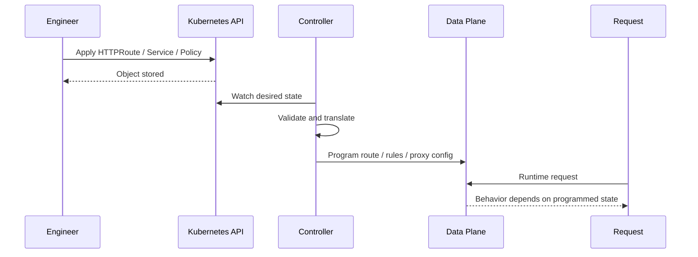

Failure di reconciliation gap dapat muncul sebagai:

- object ada, tetapi status belum ready;
- status accepted, tetapi not programmed;
- controller crashloop;
- stale proxy config;
- data plane update partial;
- node tertentu belum menerima rule;
- cloud LB belum selesai provisioning;
- DNS record belum propagated.

Karena itu, “sudah apply” bukan bukti.

---

## 7. Pod-to-Pod Mental Model

Pod-to-Pod traffic adalah fondasi. Walaupun production sering memakai Service, semua akhirnya menuju Pod IP.

### 7.1 Same-Node Pod-to-Pod

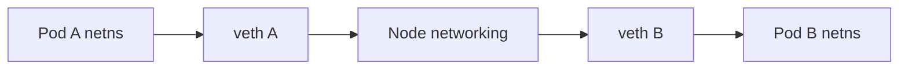

Pada node yang sama, traffic biasanya tetap di host networking stack. Detailnya bergantung CNI, tetapi mental model-nya:

1. Process di Pod A membuka socket ke IP Pod B.
2. Packet keluar lewat interface Pod A.
3. veth membawa packet ke node namespace.
4. Node routing/bridge/eBPF/CNI logic menentukan arah.
5. Packet masuk ke veth Pod B.
6. Process di Pod B menerima koneksi.

Failure umum:

- Pod B tidak listen pada port yang benar.
- NetworkPolicy deny.
- CNI rule salah.
- Local route salah.
- App bind ke `127.0.0.1`, bukan `0.0.0.0`.

### 7.2 Cross-Node Pod-to-Pod

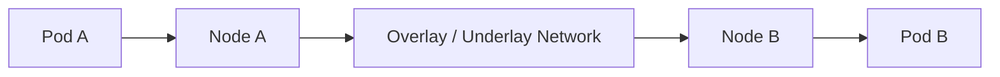

Pada node berbeda, CNI harus memastikan Pod CIDR dapat diroute.

Implementasi dapat berupa:

- overlay encapsulation;
- native routing;
- cloud VPC integration;
- BGP route distribution;
- eBPF-based forwarding;
- hybrid model.

Failure umum:

- hanya gagal antar-node;
- hanya gagal antar-zone;
- MTU mismatch;
- encapsulation blocked;
- route missing;
- security group/firewall antar-node menolak traffic;
- CNI daemon pada salah satu node bermasalah.

### 7.3 Diagnostic Heuristic

Jika Pod A bisa reach Pod B di node yang sama tetapi tidak di node berbeda, hipotesis awal adalah:

- CNI cross-node path;
- node routing;
- overlay/underlay;
- MTU;
- firewall/security group;
- NetworkPolicy dengan selector/topology tertentu.

Jika Pod A tidak bisa reach Pod B bahkan di node yang sama, hipotesis awal adalah:

- app tidak listen;
- port salah;
- local network namespace issue;
- NetworkPolicy;
- CNI local datapath.

---

## 8. Pod-to-Service Mental Model

Service menambahkan satu layer indirection.

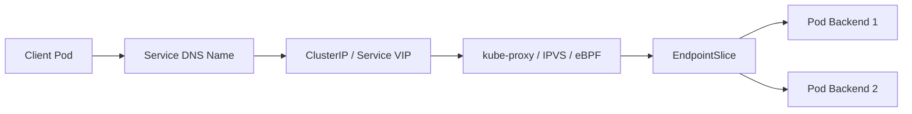

### 8.1 Apa yang Terjadi Saat Client Memanggil Service Name

Contoh:

```txt
orders.default.svc.cluster.local
```

Langkah konseptual:

1. Client resolver mencari nama Service.
2. CoreDNS mengembalikan ClusterIP untuk Service normal, atau daftar Pod IP untuk headless Service.
3. Client membuka koneksi ke ClusterIP dan port Service.
4. Node data plane menangkap traffic ke ClusterIP.
5. kube-proxy/IPVS/eBPF memilih endpoint backend.
6. Traffic diteruskan ke Pod IP target.
7. Return traffic mengikuti conntrack/routing yang sesuai.

### 8.2 Service Bukan Load Balancer Biasa

Service adalah API abstraction. Load balancing aktual dilakukan oleh data plane implementation.

Konsekuensi:

- behavior bisa berbeda antara iptables, IPVS, eBPF, atau cloud-specific datapath;
- connection reuse dan conntrack dapat membuat distribusi tidak intuitif;
- endpoint readiness menentukan backend candidate;
- source IP preservation bergantung path dan policy;
- Service tanpa endpoint akan menghasilkan gejala berbeda tergantung caller dan proxy.

### 8.3 Port Semantics

Service punya beberapa konsep port:

```yaml
ports:
  - port: 80        # port yang diekspos Service
    targetPort: 8080 # port container/backend yang dituju
    nodePort: 30080  # hanya untuk NodePort/LoadBalancer tertentu
```

Failure umum:

- `port` benar, `targetPort` salah;
- Pod listen di 8080, Service target ke 80;
- named targetPort tidak cocok dengan container port name;
- app bind localhost;
- Service selector memilih Pod yang tidak relevan.

### 8.4 Service Debugging Questions

Saat Pod-to-Service gagal:

1. Apakah DNS resolve?
2. Apakah Service ada di namespace yang benar?
3. Apakah Service selector memilih Pod yang benar?
4. Apakah EndpointSlice berisi endpoint ready?
5. Apakah Service port dan targetPort cocok?
6. Apakah direct Pod IP connect berhasil?
7. Apakah ClusterIP connect gagal tetapi Pod IP connect berhasil?
8. Apakah hanya node tertentu yang gagal?
9. Apakah NetworkPolicy mengizinkan client ke backend?
10. Apakah mesh sidecar mengubah path?

Pertanyaan 6 dan 7 sangat penting. Jika Pod IP berhasil tetapi ClusterIP gagal, masalah kemungkinan di Service datapath. Jika Pod IP juga gagal, masalah mungkin di backend app, CNI, atau policy.

---

## 9. DNS Mental Model

DNS di Kubernetes adalah service discovery layer, bukan source of truth tunggal.

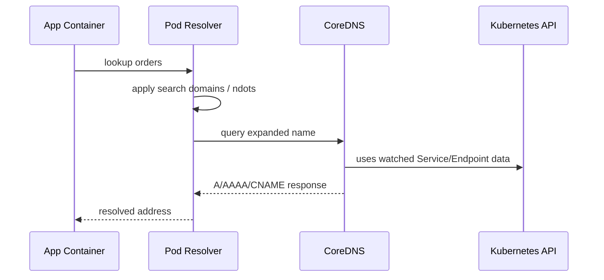

### 9.1 Search Domain dan `ndots`

Nama pendek seperti `orders` tidak selalu langsung menjadi satu query. Resolver dapat mencoba beberapa search domain:

```txt
orders.<current-namespace>.svc.cluster.local
orders.svc.cluster.local
orders.cluster.local
orders
```

Dengan konfigurasi `ndots`, nama yang terlihat sederhana dapat menghasilkan beberapa query. Pada traffic tinggi, ini bisa menjadi latency multiplier.

### 9.2 Service Normal vs Headless

Service normal:

- DNS mengembalikan ClusterIP;
- load balancing dilakukan data plane Service.

Headless Service:

- tidak punya ClusterIP;
- DNS dapat mengembalikan alamat endpoint langsung;
- sering dipakai untuk StatefulSet atau client-side discovery.

### 9.3 DNS Failure Tidak Selalu Total

DNS failure sering intermittent:

- CoreDNS overloaded;
- NodeLocal DNSCache bermasalah;
- upstream DNS lambat;
- search domain menghasilkan query berlebih;
- client resolver timeout terlalu pendek;
- aplikasi cache record terlalu lama;
- negative caching.

### 9.4 DNS Debugging Questions

- Nama apa yang sebenarnya di-query oleh client?
- Dari namespace mana query dilakukan?
- Apakah FQDN berhasil tetapi short name gagal?
- Berapa latency DNS?
- Apakah failure terjadi pada semua node atau node tertentu?
- Apakah CoreDNS melihat query?
- Apakah DNS blocked oleh NetworkPolicy?
- Apakah aplikasi memakai custom resolver/cache?

---

## 10. EndpointSlice Mental Model

EndpointSlice adalah representasi endpoint backend yang mendukung Service.

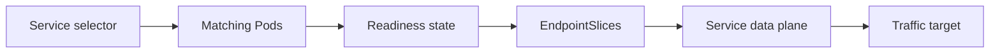

### 10.1 Mengapa EndpointSlice Penting

Service selector tidak langsung berarti traffic akan dikirim ke semua Pod matching. Kubernetes perlu mengetahui endpoint yang layak menerima traffic.

Endpoint eligibility dipengaruhi oleh:

- Pod IP;
- readiness;
- port mapping;
- terminating state;
- topology hints;
- controller watch freshness;
- implementation-specific routing policy.

### 10.2 Readiness Adalah Traffic Contract

Readiness probe bukan health check kosmetik. Ia adalah sinyal apakah Pod seharusnya menerima traffic Service.

Anti-pattern:

- readiness hanya mengecek process hidup;
- readiness tidak mengecek dependency minimal;
- readiness terlalu cepat true sebelum app warm;
- readiness tetap true saat app sedang draining;
- readiness dan graceful shutdown tidak sinkron.

Konsekuensi:

- traffic masuk terlalu awal;
- request gagal saat rollout;
- canary tampak buruk padahal readiness salah;
- backend dipilih walaupun belum siap.

### 10.3 EndpointSlice Debugging Questions

- Apakah EndpointSlice ada?
- Apakah endpoint address benar?
- Apakah endpoint ready?
- Apakah port endpoint cocok?
- Apakah endpoint berada di zone/node tertentu?
- Apakah endpoint terminating?
- Apakah controller stale?
- Apakah backend ada tetapi tidak dipilih karena topology-aware routing?

---

## 11. External-to-Service Mental Model

External-to-Service path adalah path paling banyak ownership boundary.

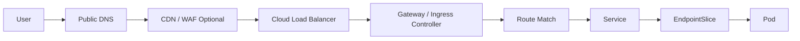

Beberapa deployment tidak memakai semua komponen. Tetapi mental model ini membantu audit.

### 11.1 Entry Point

Entry point bisa berupa:

- LoadBalancer Service;
- NodePort;
- Ingress controller;
- Gateway API Gateway;
- service mesh ingress gateway;
- cloud-native L7 load balancer;
- API gateway eksternal.

Jangan menyamakan semuanya. Tiap entry point punya ownership, policy, logging, TLS, dan scaling model berbeda.

### 11.2 TLS Boundary

Pertanyaan TLS harus eksplisit:

- TLS terminate di CDN?
- TLS terminate di cloud LB?
- TLS terminate di Gateway?
- Apakah traffic dari Gateway ke backend plaintext?
- Apakah backend memakai TLS ulang?
- Apakah mTLS internal?
- Siapa yang mengelola certificate?
- Apa trust store-nya?

Tanpa peta TLS boundary, compliance dan debugging menjadi kabur.

### 11.3 Source IP

Source IP bisa berubah karena:

- SNAT di load balancer;
- NodePort path;
- kube-proxy behavior;
- proxy headers seperti `X-Forwarded-For`;
- PROXY protocol;
- eBPF/cloud-specific path;
- externalTrafficPolicy.

Untuk audit dan rate limiting, source IP preservation harus didesain, bukan diasumsikan.

### 11.4 External Path Failure

Failure umum:

- DNS public masih menunjuk LB lama;
- CDN cache menyembunyikan backend failure;
- WAF menolak request valid;
- cloud LB health check terlalu dangkal;
- Gateway listener belum programmed;
- route conflict;
- backend Service tidak punya endpoint;
- TLS SNI mismatch;
- source IP hilang;
- NetworkPolicy memblokir ingress controller ke backend.

---

## 12. East-West Mental Model

East-west traffic adalah internal service-to-service traffic.

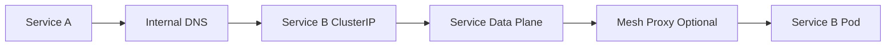

Tanpa mesh, routing biasanya berdasarkan Service discovery dan L3/L4 datapath.

Dengan mesh, request dapat melewati proxy:

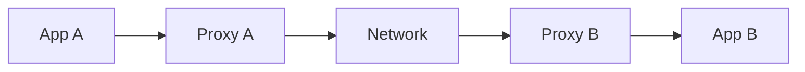

### 12.1 Apa yang Ditambahkan Mesh

Service mesh dapat menambahkan:

- mTLS;
- workload identity;
- L7 routing;
- retries;
- timeouts;
- circuit breaking;
- telemetry;
- authorization;
- traffic splitting;
- fault injection;
- outlier detection.

Tetapi mesh juga menambahkan:

- proxy resource overhead;
- control plane dependency;
- config propagation delay;
- debugging layer baru;
- version compatibility concern;
- bypass risk;
- policy complexity.

### 12.2 East-West Failure

Failure umum:

- Service A resolve Service B, tetapi mesh intercept mengubah destination;
- mTLS strict menolak workload tanpa sidecar/identity;
- AuthorizationPolicy deny karena principal mismatch;
- retry storm antar-service;
- timeout hierarchy salah;
- canary internal hanya bekerja untuk HTTP, bukan TCP;
- telemetry missing karena traffic bypass;
- sidecar readiness berbeda dari app readiness.

---

## 13. Service-to-External / Egress Mental Model

Egress sering lebih sulit dari ingress karena destination tidak berada dalam kontrol penuh cluster.

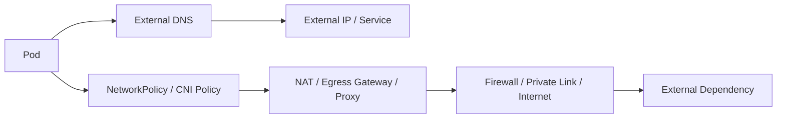

### 13.1 Egress Questions

- Apakah workload boleh keluar langsung ke internet?
- Apakah source IP harus fixed?
- Apakah egress harus lewat proxy?
- Apakah egress harus melalui private connectivity?
- Apakah FQDN-based policy diperlukan?
- Apakah DNS dan IP dapat drift?
- Apakah audit log tersedia?
- Apakah NAT port exhaustion mungkin?

### 13.2 Egress Failure

Failure umum:

- external firewall allowlist salah karena source IP berubah;
- NAT gateway kehabisan port;
- DNS resolve ke IP baru yang tidak diizinkan;
- proxy CONNECT tidak mendukung protocol tertentu;
- NetworkPolicy deny DNS;
- route table cloud salah;
- private endpoint hanya tersedia di region tertentu;
- service mesh ServiceEntry/external service config salah.

---

## 14. Policy Plane Mental Model

Policy plane menentukan traffic mana yang boleh lewat. Tetapi ada banyak jenis policy.

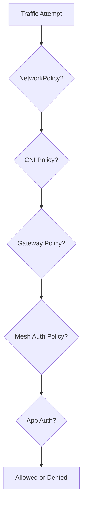

### 14.1 Policy Bisa Berlaku di Layer Berbeda

| Policy Type | Layer | Scope |
|---|---|---|
| NetworkPolicy | L3/L4 | Pod ingress/egress |
| CNI extended policy | L3-L7 tergantung CNI | Pod, namespace, FQDN, HTTP, DNS |
| Gateway policy | L4/L7 edge routing | Gateway, Route, Backend |
| Mesh authorization | L4/L7 identity-aware | workload/service identity |
| Application auth | L7 business logic | user/client/resource |
| Cloud firewall/security group | L3/L4 infrastructure | node, subnet, LB |

Masalah umum muncul ketika tim menganggap satu policy layer menggantikan semua layer lain.

Contoh:

- NetworkPolicy tidak memahami HTTP path standar Kubernetes.
- Mesh auth tidak otomatis menutup traffic yang bypass mesh.
- Gateway auth tidak melindungi internal direct Service call.
- Cloud firewall tidak memahami workload identity.
- App auth tidak mengontrol network exfiltration.

### 14.2 Default-Deny Thinking

Default-deny yang matang harus menjawab:

- DNS diizinkan ke mana?
- telemetry diizinkan ke mana?
- kubelet/control-plane dependency apa yang dibutuhkan?
- ingress controller boleh ke backend mana?
- mesh control plane boleh ke proxy mana?
- certificate issuer butuh egress ke mana?
- app boleh ke dependency mana?
- emergency debugging path bagaimana?

Default-deny tanpa dependency map akan menciptakan incident.

---

## 15. Identity Plane Mental Model

IP address bukan identity yang kuat dalam Kubernetes.

Mengapa?

- Pod IP ephemeral.
- Pod bisa diganti saat rollout.
- Banyak Pod bisa mewakili Service yang sama.
- Node-level NAT dapat menghilangkan original source.
- Cross-cluster IP bisa overlap.
- Multi-tenant cluster membutuhkan identity yang lebih eksplisit.

Identity yang lebih berguna:

- Kubernetes ServiceAccount;
- namespace;
- workload label;
- SPIFFE ID;
- mTLS certificate subject;
- JWT subject;
- cloud workload identity;
- application-level principal.

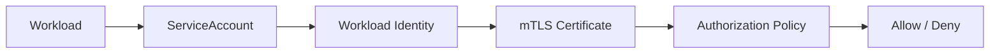

Identity plane menjawab:

- siapa caller?
- siapa callee?
- siapa issuer identity?
- trust domain apa?
- bagaimana rotation?
- bagaimana federation lintas cluster?
- apa yang terjadi jika identity tidak tersedia?

---

## 16. Observability Plane Mental Model

Observability bukan dashboard setelah sistem jadi. Observability adalah cara membuktikan traffic contract.

### 16.1 Evidence by Layer

| Layer | Evidence |
|---|---|
| DNS | query count, error, latency, CoreDNS logs |
| L3/L4 | flow logs, tcpdump, conntrack, socket state |
| Service | endpoint readiness, load balancing metrics |
| Gateway | listener status, route status, access logs |
| Mesh | proxy access logs, mTLS metrics, config dump |
| App | HTTP/gRPC metrics, error codes, business result |
| Policy | deny logs, auth decision logs, audit events |
| Multi-cluster | cluster label, locality, failover event, imported service state |

### 16.2 RED and USE

Untuk request-driven services, gunakan RED:

- Rate;
- Errors;
- Duration.

Untuk infrastructure resources, gunakan USE:

- Utilization;
- Saturation;
- Errors.

Traffic platform membutuhkan keduanya. Gateway dapat terlihat sehat dari sisi CPU, tetapi error rate route tertentu naik. Sebaliknya, app bisa sehat tetapi proxy saturation tinggi.

### 16.3 Trace Tidak Cukup

Distributed trace sangat berguna, tetapi tidak selalu cukup:

- trace sampling bisa melewatkan failure;
- trace dimulai setelah DNS dan TCP connect;
- trace tidak selalu melihat NetworkPolicy deny;
- trace bisa hilang jika request gagal sebelum app menerima;
- proxy-generated 503 mungkin tidak punya span app.

Karena itu, gabungkan trace dengan access log, metrics, flow log, dan status object.

---

## 17. Multi-Cluster Mental Model

Multi-cluster menambah dimensi baru: cluster menjadi bagian dari routing decision.

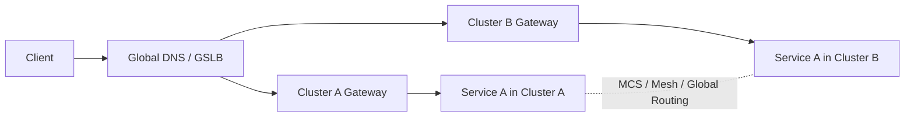

### 17.1 Single-Cluster Assumption yang Rusak di Multi-Cluster

| Single Cluster Assumption | Multi-Cluster Reality |
|---|---|
| Service name unik dalam cluster | Butuh namespace sameness atau discovery federation |
| Pod CIDR tidak overlap cukup | Cluster CIDR bisa overlap jika tidak dirancang |
| Latency relatif kecil | Cross-region latency bisa dominan |
| Trust domain tunggal | Butuh federation atau shared trust |
| One control plane | Banyak control plane dengan propagation delay |
| Failover lokal | Failover global bergantung DNS/LB/client cache/data |

### 17.2 Multi-Cluster Failure

Failure multi-cluster sering partial:

- Cluster A gateway sehat, tetapi backend dependency region A mati.
- Global DNS memindahkan traffic, tetapi client cache masih ke region lama.
- ServiceImport masih menampilkan endpoint stale.
- mTLS trust domain cluster B tidak dipercaya cluster A.
- Active-active menerima write conflict.
- Observability tidak bisa menggabungkan request lintas cluster.

Karena itu, multi-cluster harus dimulai dari failure scenario, bukan dari tooling.

---

## 18. Status Conditions sebagai Runtime Contract

Banyak resource Kubernetes modern menggunakan status conditions untuk menjelaskan reconciliation state.

Dalam Gateway API misalnya, status dapat menunjukkan apakah route accepted, reference resolved, atau gateway programmed. Mental model penting:

```txt
spec  = apa yang diminta user
status = apa yang diketahui controller tentang hasil rekonsiliasi
```

Status bukan formalitas.

Saat men-debug:

- baca `metadata.generation`;
- baca `status.observedGeneration`;
- baca condition type;
- baca condition status;
- baca reason;
- baca message;
- lihat apakah controller memperbarui status terbaru.

Jika `observedGeneration` tertinggal dari `metadata.generation`, controller mungkin belum memproses perubahan terbaru.

---

## 19. Request Path Walkthrough: Dari User ke Pod

Mari gabungkan mental model untuk public HTTP request.

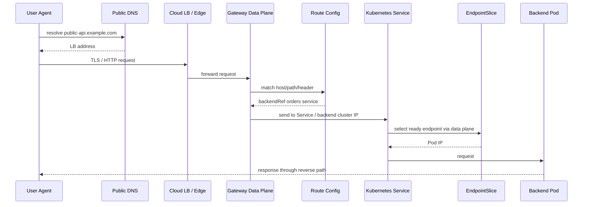

Potential failure by step:

| Step | Failure Example |
|---|---|
| DNS | stale record, wrong LB, NXDOMAIN |
| LB | health check wrong, listener closed, source IP lost |
| Gateway | listener not programmed, route conflict, TLS SNI mismatch |
| Route | wrong path precedence, invalid backendRef, missing ReferenceGrant |
| Service | selector wrong, port mismatch, no endpoint |
| EndpointSlice | not ready, stale, topology mismatch |
| Pod | app not listening, readiness too optimistic, dependency down |
| Reverse path | conntrack issue, SNAT, asymmetric routing |

---

## 20. Request Path Walkthrough: Service A ke Service B dengan Mesh

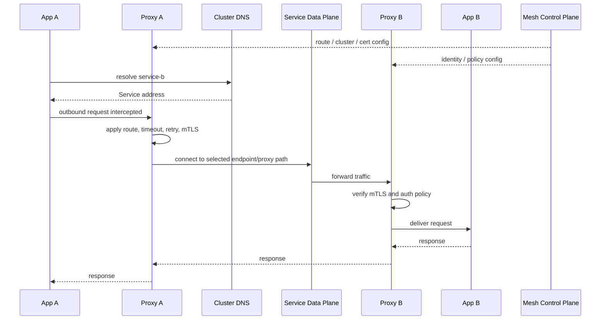

Potential failure:

- Proxy A stale config.
- Proxy B lacks identity cert.
- mTLS strict rejects plain workload.
- AuthorizationPolicy denies ServiceAccount.
- DNS resolves but mesh route overrides destination.
- retry policy amplifies backend failure.
- proxy resource saturation.
- app receives unexpected header/rewrite.

---

## 21. Debugging Decision Tree

Gunakan decision tree sederhana berikut saat traffic gagal.

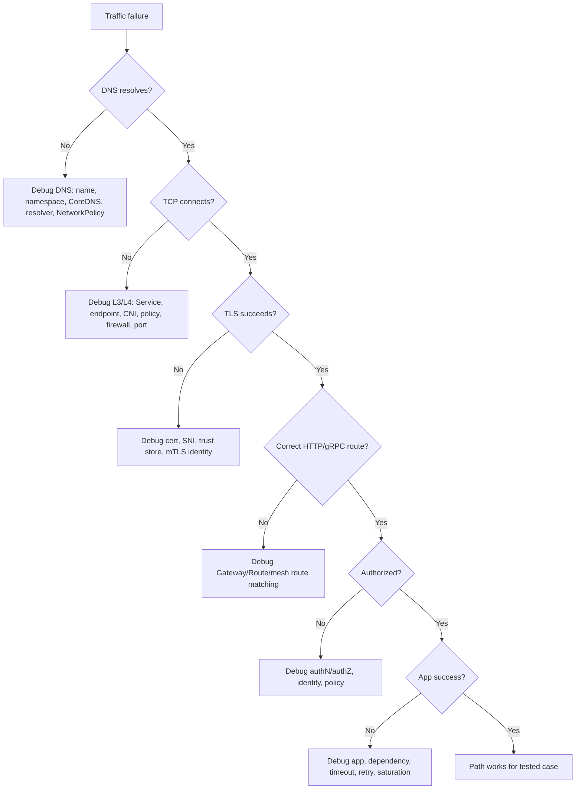

Ini bukan pengganti debugging detail, tetapi mencegah lompatan liar.

---

## 22. Common Misreadings

### 22.1 “Service Ada Berarti Backend Ada”

Salah. Service bisa ada tanpa endpoint.

Yang harus dicek:

- selector;
- EndpointSlice;
- readiness;
- targetPort;
- namespace.

### 22.2 “DNS Resolve Berarti Network Aman”

Salah. DNS hanya discovery. L4/L7/policy bisa tetap gagal.

Yang harus dicek:

- connect ke resolved address;
- Service datapath;
- NetworkPolicy;
- TLS;
- app behavior.

### 22.3 “HTTP 503 Berarti App Down”

Tidak selalu. 503 bisa berasal dari:

- Gateway;
- Envoy;
- ingress controller;
- Service no endpoint;
- upstream reset;
- circuit breaker;
- outlier detection;
- backend TLS failure;
- app memang down.

Baca response headers dan proxy logs.

### 22.4 “NetworkPolicy Deny Akan Muncul sebagai 403”

Biasanya tidak. NetworkPolicy L3/L4 deny sering terlihat sebagai timeout atau connection failure, bukan HTTP status.

### 22.5 “mTLS Aktif Berarti Semua Traffic Aman”

Belum tentu. Anda harus memastikan:

- semua workload masuk mesh atau policy path;
- plaintext bypass tidak ada;
- permissive mode tidak menyembunyikan gap;
- trust domain benar;
- authorization policy tidak terlalu longgar.

---

## 23. Mental Model Checklist

Gunakan checklist ini untuk setiap desain traffic.

### 23.1 Intent

- Siapa caller?
- Siapa callee?
- Protocol apa?
- Host/path/header/method apa?
- Traffic harus masuk lewat entry point mana?
- Apakah traffic boleh lintas namespace/cluster?

### 23.2 Discovery

- Nama apa yang dipakai caller?
- Apakah DNS normal atau headless?
- Apakah discovery lintas cluster?
- Apakah cache/TTL memengaruhi behavior?

### 23.3 Routing

- Apakah memakai Service, Gateway, mesh route, atau external LB?
- Bagaimana backend dipilih?
- Apakah ada weight/canary/mirror?
- Apakah route precedence jelas?

### 23.4 Security

- Di mana TLS terminate?
- Apakah mTLS dipakai?
- Identity apa yang dipercaya?
- Policy layer mana yang enforce?
- Apakah egress dikontrol?

### 23.5 Resilience

- Timeout di setiap hop berapa?
- Apakah retry aman?
- Apakah ada circuit breaker?
- Bagaimana drain saat rollout?
- Apa failover behavior?

### 23.6 Observability

- Apa metric utama?
- Di mana access log tersedia?
- Apakah trace mencakup hop penting?
- Apakah flow log tersedia?
- Apakah status object dibaca?

### 23.7 Failure

- Apa yang terjadi jika DNS gagal?
- Apa yang terjadi jika endpoint kosong?
- Apa yang terjadi jika Gateway controller down?
- Apa yang terjadi jika cert expired?
- Apa yang terjadi jika satu node/zone/cluster gagal?

---

## 24. Practical Exercise: Gambar Traffic Path Sebelum YAML

Sebelum menulis konfigurasi, tulis traffic contract seperti ini:

```txt
Use case:
  Public user calls POST /orders on public-api.example.com.

Caller:
  external authenticated user.

Entry:
  public DNS -> cloud LB -> public Gateway.

TLS:
  TLS terminates at Gateway.
  Gateway to backend uses internal mTLS later when mesh enabled.

Routing:
  Host public-api.example.com.
  Path /orders.
  95% to orders-v1, 5% to orders-v2 canary.

Backend:
  Service orders in namespace commerce.

Policy:
  Only public Gateway may call orders Service.
  orders may call payments and inventory.
  orders may not call arbitrary external internet.

Observability:
  Gateway access log by route/backend/version.
  orders RED metrics.
  trace from Gateway to orders to payments.

Failure behavior:
  If orders-v2 error rate > threshold, route weight returns to v1.
  If payments unavailable, orders returns controlled business error, not retry storm.
```

Lalu gambar path:

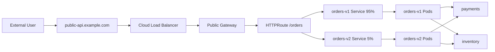

Baru setelah itu tulis manifest. Ini membalik kebiasaan YAML-first menjadi contract-first.

---

## 25. Practical Exercise: Layered Failure Classification

Ambil gejala berikut:

```txt
User mendapatkan HTTP 503 saat memanggil /orders.
Hanya terjadi untuk sebagian user.
Deployment orders-v2 baru saja dirilis.
Gateway route memakai weight 95/5.
```

Jangan langsung rollback. Buat hipotesis:

| Hypothesis | Layer | Evidence |
|---|---|---|
| v2 backend error | App | backend logs, error rate by version |
| weight tidak sesuai | Route/data plane | Gateway access logs by backend |
| sticky connection mengarahkan subset user | L7/client | request distribution by session/IP |
| v2 endpoint belum ready | EndpointSlice/readiness | endpoint ready state, rollout event |
| mesh policy deny v2 | Identity/policy | proxy logs, authz deny metrics |
| timeout ke payments hanya dari v2 | dependency | traces, downstream metrics |
| route mirror/write side-effect | routing config | route filter review, backend logs |

Top engineer tidak hanya bertanya “apa yang rusak?”, tetapi “layer mana yang menghasilkan bukti paling cepat untuk membedakan hipotesis?”.

---

## 26. Review Questions

Sebelum lanjut ke Part 003, pastikan Anda bisa menjawab dengan jelas.

### 26.1 Path Reasoning

- Jelaskan path Pod A memanggil `orders.default.svc.cluster.local`.
- Jelaskan perbedaan path Pod-to-Pod dan Pod-to-Service.
- Jelaskan path user external menuju Pod melalui Gateway.
- Jelaskan path Service A ke Service B dengan mesh sidecar.
- Jelaskan path Pod menuju API eksternal melalui NAT/proxy.

### 26.2 Layer Reasoning

- Apa bukti bahwa DNS layer sehat?
- Apa bukti bahwa L4 connect berhasil?
- Apa bukti bahwa TLS trust benar?
- Apa bukti bahwa HTTPRoute match benar?
- Apa bukti bahwa NetworkPolicy bukan penyebab?
- Apa bukti bahwa endpoint ready benar-benar menerima traffic?

### 26.3 Failure Reasoning

- Jika Pod IP connect berhasil tetapi ClusterIP gagal, di mana kemungkinan masalah?
- Jika ClusterIP berhasil tetapi DNS name gagal, di mana kemungkinan masalah?
- Jika TCP connect berhasil tetapi TLS gagal, layer mana yang harus dicek?
- Jika route accepted tetapi request 404 dari Gateway, apa hipotesisnya?
- Jika hanya cross-node traffic gagal, apa hipotesisnya?
- Jika multi-cluster failover lambat, apa saja penyebabnya?

---

## 27. Ringkasan Part 002

Part ini membangun mental model awal:

- Kubernetes networking adalah sistem koordinasi antara API intent, controller reconciliation, data plane, service discovery, policy, identity, dan observability.
- Resource graph tidak sama dengan traffic path.
- Ada beberapa traffic shape utama: Pod-to-Pod, Pod-to-Service, external-to-Service, service-to-external, east-west, dan multi-cluster.
- Control plane menjelaskan desired state; data plane menjalankan packet/request aktual.
- Service adalah indirection menuju EndpointSlice dan backend Pod, bukan backend itu sendiri.
- DNS adalah discovery layer, bukan bukti health.
- Endpoint readiness adalah traffic contract.
- Gateway, mesh, policy, dan egress menambahkan layer ownership dan failure baru.
- Debugging harus path-oriented dan evidence-driven.

Pada Part 003, kita turun ke fondasi Linux networking: network namespace, veth, routing, NAT, conntrack, iptables/nftables, TCP state, MTU, dan tools yang perlu dikuasai agar Kubernetes networking tidak terasa seperti black box.
