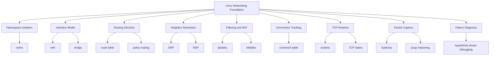
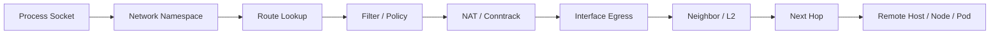
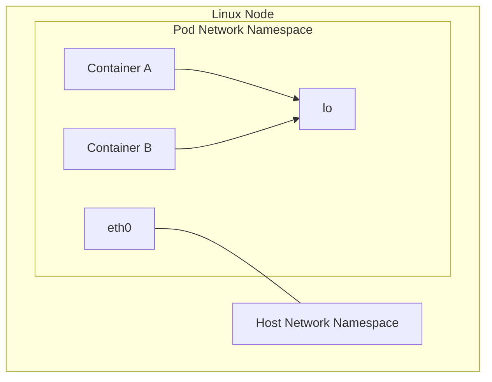
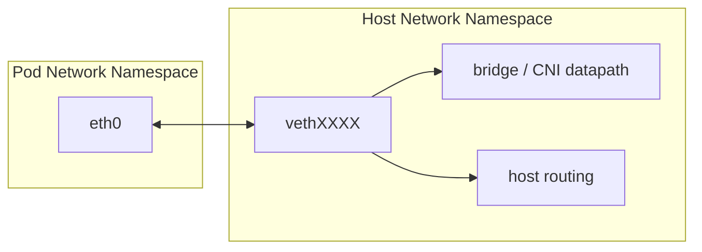
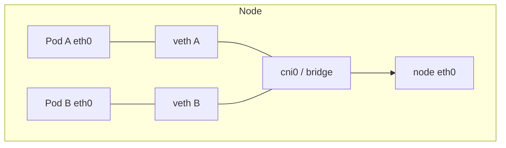
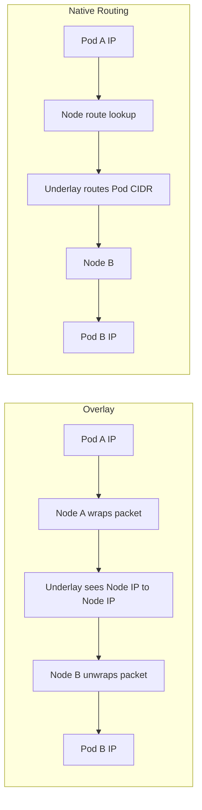
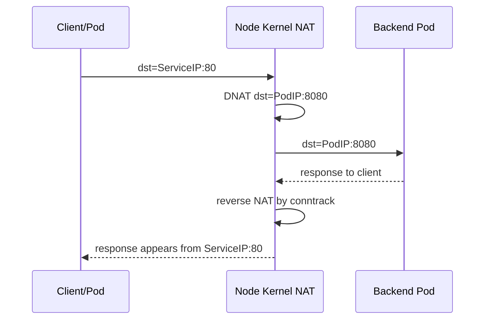
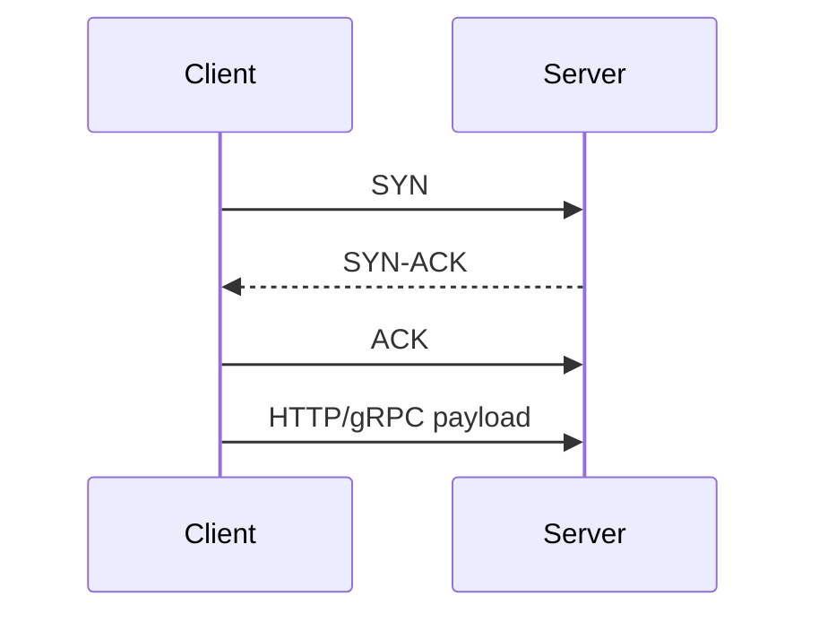
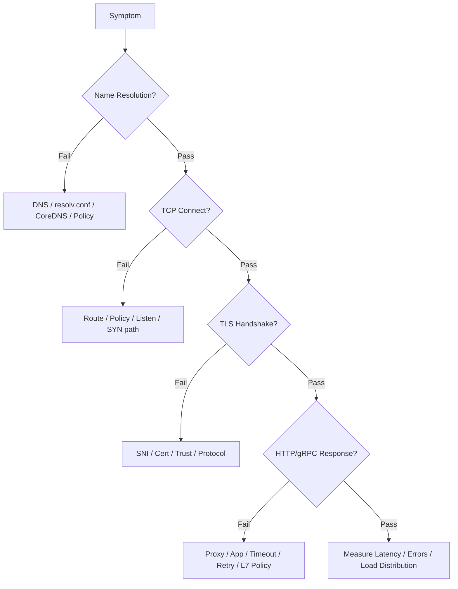

# Part 003 — Linux Networking Foundation for Kubernetes

## 1. Tujuan Part Ini

Part ini membangun fondasi yang sering dilewati engineer ketika belajar Kubernetes networking: **Linux networking yang benar-benar mengeksekusi packet path**.

Di Kubernetes, kita sering melihat abstraksi seperti Pod, Service, EndpointSlice, Gateway, NetworkPolicy, dan Service Mesh. Namun, ketika traffic benar-benar berjalan, paket tetap melewati primitive Linux seperti:

- network namespace;
- virtual Ethernet pair;
- bridge;
- routing table;
- ARP atau neighbor discovery;
- iptables atau nftables;
- conntrack;
- NAT;
- TCP state machine;
- MTU dan fragmentation;
- socket listen backlog;
- kernel receive/transmit queue.

Tujuan part ini bukan menjadikan Anda network engineer tradisional, tetapi membuat Anda cukup kuat untuk **membaca gejala produksi sampai ke packet path**.

Target setelah part ini:

- Anda bisa menjelaskan mengapa Pod memiliki network namespace sendiri.
- Anda bisa mengikuti paket dari container ke host.
- Anda memahami peran veth, route, bridge, NAT, dan conntrack.
- Anda bisa membedakan masalah DNS, routing, policy, TCP, TLS, dan aplikasi.
- Anda bisa memakai tools dasar seperti `ip`, `ss`, `tcpdump`, `iptables`, `nft`, dan `conntrack` secara terarah.
- Anda tidak debugging Kubernetes networking dengan menebak-nebak YAML.

---

## 2. Kaufman Deconstruction: Skill Yang Harus Dipecah

Mengikuti pendekatan Josh Kaufman, skill besar “memahami Kubernetes networking” harus dipecah menjadi sub-skill yang bisa dilatih secara terpisah.

Untuk Linux networking, skill-nya seperti ini:



Kita akan fokus pada **minimum effective depth**: cukup dalam untuk production debugging, tidak terlalu melebar ke semua detail kernel networking.

---

## 3. Mental Model: Network Path Adalah Serangkaian Keputusan

Paket tidak “mengalir” secara magis. Setiap hop mengambil keputusan.

Saat proses di dalam container melakukan HTTP request, kernel harus menjawab pertanyaan ini:

1. Socket mana yang membuat paket?
2. Paket keluar dari network namespace mana?
3. Interface mana yang dipakai?
4. Route mana yang cocok?
5. Apakah destination ada di link lokal atau butuh gateway?
6. Perlu neighbor resolution?
7. Apakah ada rule filter yang menolak?
8. Apakah ada NAT?
9. Apakah conntrack membuat entry baru atau memakai entry lama?
10. Apakah paket bisa dikirim sesuai MTU?
11. Apakah response bisa kembali melalui path yang konsisten?

Itulah reasoner yang harus Anda bangun.

Model sederhananya:



Kubernetes menambahkan controller dan API di atas model ini, tetapi tidak menghapus model ini.

---

## 4. Network Namespace

### 4.1 Apa Itu Network Namespace

Network namespace adalah boundary Linux untuk isolasi networking. Setiap namespace dapat memiliki:

- interface sendiri;
- IP address sendiri;
- routing table sendiri;
- firewall rule sendiri;
- socket table sendiri;
- neighbor table sendiri;
- loopback interface sendiri.

Pod di Kubernetes biasanya berjalan dalam satu network namespace yang dipakai bersama oleh semua container di Pod tersebut. Karena itu, container dalam Pod yang sama dapat saling mengakses via `localhost`.

Mental model:



Implikasi penting:

- `localhost` di dalam container berarti loopback namespace Pod, bukan node.
- Dua container dalam Pod yang sama berbagi port namespace. Jika container A listen di `:8080`, container B tidak bisa listen di port sama pada IP yang sama.
- Pod IP melekat ke namespace Pod, bukan ke container individual.
- NetworkPolicy biasanya menarget Pod, bukan container individual.

### 4.2 Kenapa Ini Penting Untuk Debugging

Banyak kesalahan debugging terjadi karena engineer menjalankan command dari namespace yang salah.

Contoh:

```bash
ip route
ss -lntp
cat /etc/resolv.conf
```

Hasil command tersebut berbeda jika dijalankan:

- di host node;
- di container aplikasi;
- di debug container dalam Pod;
- di container sidecar;
- di container hostNetwork;
- di network namespace Pod lewat `nsenter`.

Pertanyaan pertama saat debugging adalah:

> “Saya sedang mengamati network dari namespace mana?”

Tanpa itu, data observasi bisa menyesatkan.

---

## 5. veth Pair: Kabel Virtual Antar Namespace

### 5.1 Konsep veth Pair

`veth` adalah pasangan interface virtual. Paket yang masuk ke satu sisi akan keluar dari sisi lainnya.

Dalam container networking umum, satu sisi veth berada di network namespace Pod, sisi lain berada di host namespace.



Di dalam Pod, interface terlihat sebagai `eth0`. Di host, interface terlihat sebagai nama seperti `vethabc123`, `lxc...`, atau nama lain tergantung CNI.

### 5.2 Cara Membaca veth

Dari dalam Pod:

```bash
ip addr show eth0
ip link show eth0
ip route
```

Dari node:

```bash
ip link
ip addr
ip route get <pod-ip>
```

Pada cluster modern, mapping Pod ke veth dapat tidak selalu jelas karena CNI memiliki naming strategy berbeda. Namun mental model-nya tetap: Pod namespace membutuhkan jalan keluar ke node datapath.

### 5.3 Failure Mode veth

Beberapa gejala yang bisa terkait veth atau namespace:

| Gejala | Kemungkinan |
|---|---|
| Pod tidak bisa keluar sama sekali | interface belum dibuat, CNI gagal, route default hilang |
| Pod bisa akses localhost tapi tidak Service | Pod namespace hidup, tetapi path keluar bermasalah |
| Hanya Pod pada node tertentu gagal | node datapath atau CNI agent bermasalah |
| Pod baru gagal networking, Pod lama sehat | CNI ADD gagal saat Pod creation |

Debugging awal:

```bash
kubectl get pod <pod> -o wide
kubectl describe pod <pod>
kubectl get events --sort-by=.lastTimestamp
kubectl logs -n kube-system <cni-agent-pod>
```

Lalu masuk ke Pod:

```bash
kubectl exec -it <pod> -- sh
ip addr
ip route
cat /etc/resolv.conf
```

---

## 6. Bridge, Routing, Overlay, dan Underlay

### 6.1 Bridge Model

Bridge adalah virtual switch di Linux. Beberapa CNI lama/sederhana menghubungkan veth Pod ke bridge pada node.



Bridge cocok untuk menjelaskan konsep dasar, tetapi tidak semua CNI modern memakai bridge sederhana. Cilium misalnya banyak memanfaatkan eBPF, sedangkan cloud CNI seperti AWS VPC CNI dapat memberi Pod IP dari VPC/subnet cloud.

### 6.2 Routing Model

Routing table menjawab pertanyaan:

> “Untuk destination IP ini, paket keluar lewat interface mana dan next hop mana?”

Command penting:

```bash
ip route
ip route get <destination-ip>
```

Contoh pola:

```bash
ip route get 10.244.2.15
```

Hasilnya bisa menunjukkan:

- interface keluar;
- source IP yang dipakai;
- gateway atau next hop;
- apakah route lokal atau via tunnel.

### 6.3 Overlay vs Underlay

Ada dua keluarga besar pendekatan Pod networking.

#### Overlay

Overlay membuat network virtual di atas network fisik/cloud yang sudah ada. Paket Pod dapat dibungkus dalam paket lain.

Contoh encapsulation:

- VXLAN;
- Geneve;
- IP-in-IP.

Kelebihan:

- lebih mudah berjalan di infrastruktur yang tidak tahu Pod CIDR;
- mengurangi kebutuhan route Pod di jaringan fisik;
- cocok untuk cluster portabel.

Kekurangan:

- overhead encapsulation;
- MTU lebih kompleks;
- packet capture lebih sulit;
- troubleshooting butuh memahami outer packet dan inner packet.

#### Underlay / Native Routing

Pod IP dirutekan langsung oleh jaringan underlying.

Kelebihan:

- lebih natural untuk observability jaringan;
- overhead lebih rendah;
- source/destination lebih jelas.

Kekurangan:

- butuh integrasi route dengan network/cloud;
- lebih banyak batasan IPAM;
- risiko CIDR conflict lebih tinggi;
- multi-cluster lebih sulit jika alamat overlap.

### 6.4 Mental Model Perbandingan



---

## 7. ARP, Neighbor Table, dan L2 Reality

### 7.1 ARP/NDP

Untuk mengirim paket ke IP pada link lokal, host perlu mengetahui MAC address tujuan. IPv4 memakai ARP, IPv6 memakai Neighbor Discovery Protocol.

Command:

```bash
ip neigh
arp -n
```

Di Kubernetes, Anda jarang harus mengelola ARP langsung, tetapi beberapa kasus membuatnya penting:

- bare metal load balancer seperti MetalLB layer 2 mode;
- duplicate IP;
- stale neighbor entry;
- node replacement;
- virtual IP advertisement;
- CNI yang memakai L2 announcement.

### 7.2 Gejala Neighbor Problem

| Gejala | Interpretasi Awal |
|---|---|
| intermittent packet loss ke IP tertentu | neighbor entry flapping |
| node baru tidak menerima traffic VIP | ARP announcement belum diterima |
| traffic masuk ke node lama | stale ARP cache di upstream |
| hanya subnet tertentu gagal | L2/L3 boundary issue |

Debugging:

```bash
ip neigh show
ip route get <ip>
tcpdump -ni <iface> arp
```

---

## 8. iptables dan nftables: Filtering dan NAT

### 8.1 Kenapa iptables Muncul Dalam Kubernetes

Banyak komponen Kubernetes historis memakai iptables untuk:

- Service virtual IP translation;
- NodePort routing;
- masquerade/SNAT;
- NetworkPolicy enforcement oleh sebagian CNI;
- traffic interception untuk service mesh sidecar;
- egress gateway atau transparent proxying.

Pada Linux modern, nftables menjadi backend yang semakin umum. Namun banyak tooling dan mental model masih menggunakan istilah iptables.

### 8.2 Chains dan Tables Yang Penting

Tables umum:

| Table | Fungsi |
|---|---|
| `filter` | allow/drop traffic |
| `nat` | DNAT/SNAT/masquerade |
| `mangle` | modify packet metadata |
| `raw` | pengecualian conntrack atau marking awal |

Chains umum:

| Chain | Kapan Dipakai |
|---|---|
| `PREROUTING` | sebelum routing decision utama |
| `INPUT` | traffic menuju host lokal |
| `FORWARD` | traffic melewati host |
| `OUTPUT` | traffic yang dibuat oleh host lokal |
| `POSTROUTING` | setelah routing decision, sebelum keluar interface |

### 8.3 NAT Dalam Kubernetes

NAT sering terjadi pada:

- ClusterIP Service: destination IP Service diterjemahkan ke Pod endpoint;
- NodePort: node port diterjemahkan ke backend Pod;
- egress Pod ke luar cluster: source IP Pod di-masquerade menjadi node IP;
- externalTrafficPolicy tertentu: memengaruhi source IP preservation;
- service mesh transparent interception: traffic dialihkan ke proxy local.

Mental model NAT:



Kunci penting: NAT bukan hanya rule translation, tetapi juga bergantung pada conntrack agar response bisa diterjemahkan balik secara konsisten.

### 8.4 Command Dasar

iptables:

```bash
iptables-save
iptables -t nat -S
iptables -t filter -S
iptables -t mangle -S
```

nftables:

```bash
nft list ruleset
```

Untuk cluster besar, output bisa sangat panjang. Jangan mulai dari membaca seluruh ruleset. Mulai dari hipotesis:

- Apakah masalah terjadi pada traffic masuk atau keluar?
- Apakah source/destination berubah?
- Apakah Service IP terlibat?
- Apakah NodePort terlibat?
- Apakah mesh intercept terlibat?
- Apakah CNI policy terlibat?

---

## 9. Conntrack: Ingatan Kernel Tentang Flow

### 9.1 Apa Itu Conntrack

Conntrack menyimpan state koneksi/flow. Untuk TCP, state ini relatif jelas: SYN, ESTABLISHED, FIN, TIME_WAIT, dan sebagainya. Untuk UDP, conntrack tetap membuat flow state meskipun UDP connectionless.

Conntrack penting karena:

- NAT membutuhkan reverse translation;
- firewall rule bisa mengizinkan `ESTABLISHED,RELATED`;
- stale conntrack bisa menyebabkan traffic tetap mengikuti backend lama;
- table penuh bisa menyebabkan koneksi baru gagal;
- timeout conntrack bisa memengaruhi long-lived connection.

Command:

```bash
conntrack -L
conntrack -S
conntrack -L -p tcp
conntrack -L | grep <ip>
```

### 9.2 Service Load Balancing dan Conntrack

Misalnya Service `10.96.10.20:80` memilih backend `10.244.2.15:8080`. Conntrack menyimpan mapping itu. Selama flow masih aktif, paket berikutnya cenderung tetap memakai mapping yang sama.

Implikasi:

- Mengubah Service endpoints tidak selalu memindahkan koneksi existing.
- Canary weight dapat berbeda dari distribusi request aktual jika koneksi long-lived.
- gRPC atau HTTP/2 multiplexing dapat membuat traffic split tampak tidak sesuai harapan.
- Stale conntrack dapat mempertahankan backend yang sudah tidak ideal.

### 9.3 Conntrack Failure Modes

| Failure | Gejala |
|---|---|
| Conntrack table full | koneksi baru intermittent gagal |
| Stale NAT entry | traffic menuju endpoint lama |
| UDP timeout terlalu pendek | DNS atau protocol UDP intermittent |
| Long-lived connection | rollout terlihat tidak mengikuti traffic weight |
| Asymmetric routing | response tidak cocok entry conntrack |

Debugging:

```bash
conntrack -S
sysctl net.netfilter.nf_conntrack_max
sysctl net.netfilter.nf_conntrack_count
```

Pada beberapa sistem, metrik conntrack tersedia dari node exporter atau CNI observability.

---

## 10. TCP State: Jangan Semua Dianggap “Network Down”

### 10.1 TCP Handshake

TCP connection dimulai dengan three-way handshake:



Failure pada tahap berbeda memberi sinyal berbeda:

| Gejala | Kemungkinan |
|---|---|
| SYN tidak dibalas | route, policy, server tidak listen, packet drop |
| SYN-ACK balik tapi ACK hilang | asymmetric routing, firewall, conntrack issue |
| connect berhasil tapi request timeout | aplikasi, proxy, L7 timeout, upstream overload |
| connection reset | server/proxy menolak, policy reset, app crash |
| TLS handshake gagal | cert, SNI, trust, protocol mismatch |

### 10.2 Tools: ss

`ss` menggantikan banyak penggunaan `netstat`.

```bash
ss -lntp
ss -antp
ss -s
```

Gunakan untuk menjawab:

- Apakah proses listen pada port yang benar?
- Apakah bind ke `127.0.0.1`, Pod IP, atau `0.0.0.0`?
- Berapa banyak connection dalam state tertentu?
- Apakah backlog penuh?

Contoh kesalahan umum:

Aplikasi listen hanya di loopback:

```bash
LISTEN 0 128 127.0.0.1:8080
```

Service mengarah ke Pod IP, tetapi aplikasi hanya bind ke `127.0.0.1`, maka traffic dari luar Pod namespace tidak akan masuk.

Yang biasanya diinginkan:

```bash
LISTEN 0 128 0.0.0.0:8080
```

atau bind eksplisit ke Pod IP.

### 10.3 TCP Backlog dan Overload

Tidak semua timeout berarti network path rusak. Bisa saja:

- aplikasi overload;
- accept queue penuh;
- SYN backlog penuh;
- proxy worker penuh;
- CPU throttling;
- thread pool backend habis.

Command yang membantu:

```bash
ss -s
ss -lnt
cat /proc/net/sockstat
```

Di Kubernetes, kombinasikan dengan:

```bash
kubectl top pod
kubectl top node
kubectl describe pod <pod>
```

---

## 11. MTU dan Fragmentation

### 11.1 Kenapa MTU Sering Menyakitkan di Kubernetes

MTU adalah ukuran maksimum frame/paket yang bisa lewat tanpa fragmentasi pada link tertentu. Overlay networking menambah header tambahan. Jika MTU tidak disesuaikan, paket besar bisa gagal walaupun paket kecil berhasil.

Gejala klasik:

- `curl` kecil berhasil, response besar gagal;
- TCP connect berhasil, TLS handshake timeout;
- gRPC stream intermittent;
- hanya cross-node traffic gagal;
- hanya path lewat VPN/peering tertentu gagal;
- ping berhasil untuk payload kecil, gagal untuk payload besar dengan DF bit.

### 11.2 Overlay Header Overhead

Secara konseptual:

```txt
underlay MTU = 1500
outer IP/UDP/VXLAN headers = sekitar puluhan byte
inner packet effective MTU < 1500
```

Jika Pod mengirim packet seolah-olah MTU 1500 tetapi path efektif lebih kecil, packet dapat drop jika fragmentation tidak berjalan atau ICMP “fragmentation needed” diblokir.

### 11.3 Debugging MTU

Command:

```bash
ip link show
tracepath <destination>
ping -M do -s <size> <destination>
```

Contoh:

```bash
ping -M do -s 1472 10.244.2.15
ping -M do -s 1400 10.244.2.15
```

Untuk IPv4, `1472` + 28 byte header mendekati 1500. Tetapi pada overlay, ukuran aman bisa lebih kecil.

### 11.4 Production Rule

Jika masalah hanya muncul untuk payload besar, TLS handshake, image pull, gRPC stream, atau cross-zone path tertentu, masukkan MTU ke hipotesis awal. Jangan hanya melihat Service dan Endpoint.

---

## 12. Packet Capture Dengan tcpdump

### 12.1 tcpdump Bukan Langkah Pertama, Tapi Bukti Terkuat

`tcpdump` membantu menjawab pertanyaan faktual:

- Apakah packet keluar dari Pod?
- Apakah packet sampai di node?
- Apakah SYN dibalas SYN-ACK?
- Apakah DNS query keluar?
- Apakah response kembali?
- Apakah packet di-drop sebelum atau sesudah NAT?
- Apakah source/destination berubah?

Namun, packet capture tanpa hipotesis menghasilkan noise. Gunakan setelah Anda tahu flow mana yang dicari.

### 12.2 Capture Basic

Di Pod:

```bash
tcpdump -ni any host <ip>
```

Di node:

```bash
tcpdump -ni any host <pod-ip>
tcpdump -ni <iface> port 53
tcpdump -ni <iface> tcp port 8080
```

Untuk menyimpan pcap:

```bash
tcpdump -ni any host <ip> -w /tmp/capture.pcap
```

### 12.3 Packet Capture Interpretation

| Observasi | Arti Awal |
|---|---|
| SYN keluar, tidak ada SYN-ACK | server unreachable/drop/server not listening |
| SYN-ACK terlihat di server, tidak terlihat di client | return path problem |
| DNS query keluar, no response | DNS server, policy, UDP path |
| DNS response masuk, app tetap gagal | client resolver/cache/app issue |
| RST dari backend | backend/proxy actively rejecting |
| ICMP fragmentation needed | MTU path issue |

### 12.4 Capture Dalam Service Mesh

Pada mesh sidecar, traffic path bisa melewati loopback dan proxy listener. Anda mungkin melihat:

- app -> local proxy;
- proxy -> remote proxy;
- proxy -> app;
- mTLS connection antar proxy;
- plaintext local loopback;
- encrypted remote leg.

Jangan salah menyimpulkan plaintext local leg sebagai plaintext network leg. Bedakan namespace dan interface.

---

## 13. NAT, Source IP, dan Auditability

### 13.1 Source IP Bisa Berubah

Dalam Kubernetes, source IP dapat berubah karena:

- Pod egress di-SNAT menjadi node IP;
- external load balancer melakukan SNAT;
- kube-proxy melakukan masquerade;
- service mesh proxy membuat koneksi baru ke upstream;
- egress gateway mengganti source;
- NAT Gateway cloud mengganti source menjadi public/static IP.

Implikasi:

- audit log backend mungkin tidak melihat IP user asli;
- allowlist eksternal mungkin perlu node IP/NAT IP, bukan Pod IP;
- per-user rate limiting berdasarkan source IP bisa salah;
- security investigation perlu header, trace ID, identity, dan proxy metadata.

### 13.2 Source IP Preservation

Kubernetes memiliki beberapa mekanisme yang memengaruhi source IP, seperti `externalTrafficPolicy`. Tetapi preservation memiliki trade-off:

- traffic hanya bisa dikirim ke node yang punya endpoint lokal;
- load balancing bisa tidak merata;
- health check harus benar;
- cross-node forwarding bisa berubah;
- operational model lebih kompleks.

Rule praktis:

> Source IP preservation bukan setting kosmetik. Ia mengubah failure domain dan routing behavior.

---

## 14. Policy Routing dan Advanced Routing

Sebagian kasus production memakai policy routing, multiple routing tables, atau marks.

Contoh pemicu:

- service mesh transparent proxy;
- egress gateway;
- multi-homed node;
- cloud CNI dengan multiple ENI;
- IPv4/IPv6 dual-stack;
- node-local DNS;
- traffic steering berbasis mark.

Tools:

```bash
ip rule
ip route show table all
ip route get <ip> mark <mark>
```

Jika route default terlihat benar tetapi traffic tetap keluar lewat interface tak terduga, cek `ip rule` dan table tambahan.

---

## 15. Host Network Namespace vs Pod Network Namespace

### 15.1 hostNetwork

Pod dengan `hostNetwork: true` memakai network namespace node. Ini mengubah banyak asumsi:

- Pod tidak punya Pod network namespace terpisah.
- Port bind bersaing dengan proses host dan Pod hostNetwork lain.
- DNS policy bisa berbeda.
- NetworkPolicy bisa tidak berlaku seperti Pod biasa, tergantung CNI.
- Observability dan security boundary berubah.

### 15.2 Kapan hostNetwork Dipakai

Biasanya untuk:

- CNI daemon;
- node agent;
- DNS local cache;
- ingress/gateway tertentu;
- monitoring agent;
- low-latency atau special network workload.

### 15.3 Failure Mode

| Masalah | Penyebab Umum |
|---|---|
| port conflict | Pod hostNetwork bind port node yang sudah dipakai |
| DNS berbeda | dnsPolicy tidak sesuai |
| policy tidak apply | workload tidak melewati Pod datapath normal |
| privilege boundary bocor | host namespace terlalu luas |

---

## 16. Debugging Workflow: Dari Gejala Ke Layer

### 16.1 Jangan Mulai Dari YAML

YAML adalah intent, bukan bukti runtime. Mulai dari gejala dan packet path.

Pertanyaan awal:

1. Siapa client?
2. Siapa server?
3. Namespace mana?
4. Protocol apa?
5. Port apa?
6. Destination name/IP apa?
7. Gagal selalu atau intermittent?
8. Gagal semua node atau node tertentu?
9. Gagal semua Pod atau subset?
10. Gagal connect, handshake, request, atau response?

### 16.2 Layered Debugging



### 16.3 Minimal Command Set

Dari Pod client:

```bash
cat /etc/resolv.conf
nslookup <service-name>
getent hosts <service-name>
curl -v http://<service-name>:<port>/health
curl -vk https://<service-name>:<port>/health
ip addr
ip route
ss -ant
```

Dari Pod server:

```bash
ss -lntp
curl -s localhost:<port>/health
ip addr
ip route
```

Dari node:

```bash
ip route get <pod-ip>
ip neigh
ss -s
conntrack -S
iptables-save | grep <service-or-port>
tcpdump -ni any host <pod-ip>
```

Dari Kubernetes API:

```bash
kubectl get pod -o wide
kubectl get svc -o wide
kubectl get endpointslices
kubectl describe pod <pod>
kubectl describe svc <service>
kubectl get events --sort-by=.lastTimestamp
```

---

## 17. Common Failure Pattern: DNS Works, TCP Fails

DNS hanya membuktikan nama berhasil diterjemahkan menjadi IP. DNS tidak membuktikan:

- route ke IP benar;
- server listen;
- NetworkPolicy mengizinkan;
- Service punya endpoint sehat;
- kube-proxy/eBPF datapath benar;
- TLS benar;
- aplikasi menerima request.

Debug:

```bash
getent hosts my-service.my-ns.svc.cluster.local
curl -v --connect-timeout 2 http://<resolved-ip>:<port>
```

Jika DNS resolve ke ClusterIP, test Service path. Jika resolve ke Pod IP/headless, test direct endpoint path.

Pertanyaan:

- Apakah ClusterIP reachable?
- Apakah Pod IP reachable?
- Apakah port benar?
- Apakah aplikasi listen di interface benar?

---

## 18. Common Failure Pattern: TCP Connect Works, Request Timeout

Jika TCP connect berhasil, maka L3/L4 path dasar sudah ada. Timeout request berarti kemungkinan:

- aplikasi lambat;
- proxy menunggu upstream;
- L7 route salah;
- TLS ALPN/protocol mismatch;
- request body besar terkena MTU;
- backend thread pool penuh;
- retry storm;
- circuit breaker queue;
- gRPC stream blocked.

Debug:

```bash
curl -v --max-time 5 http://service:port/path
ss -antp
kubectl logs <pod>
kubectl top pod
```

Dengan mesh/gateway, cek juga access log proxy.

---

## 19. Common Failure Pattern: Hanya Cross-Node Yang Gagal

Jika Pod pada node yang sama bisa saling akses tetapi Pod lintas node gagal, fokus ke:

- CNI route;
- overlay tunnel;
- MTU;
- node security group/firewall;
- IP forwarding;
- reverse path filtering;
- node-to-node connectivity;
- encapsulation port blocked;
- CNI agent pada node tertentu.

Debug:

```bash
kubectl get pod -o wide
ip route
ip route get <remote-pod-ip>
tcpdump -ni any host <remote-pod-ip>
```

Cek node firewall/cloud security group untuk protocol CNI. Misalnya VXLAN biasanya butuh UDP port tertentu, tetapi detail tergantung CNI.

---

## 20. Common Failure Pattern: Intermittent Network Error

Intermittent failure lebih sulit karena sering terkait state:

- conntrack penuh;
- endpoint churn;
- DNS cache;
- overloaded node;
- CNI agent restart;
- packet loss;
- MTU edge;
- load balancer health check race;
- readiness salah;
- rolling update;
- autoscaling;
- cross-zone imbalance.

Langkah efektif:

1. Kelompokkan failure berdasarkan node, zone, Pod, endpoint, route, atau time window.
2. Cek apakah failure berkorelasi dengan deployment/scale event.
3. Cek conntrack dan node pressure.
4. Cek EndpointSlice churn.
5. Cek metrics network drops/retransmits.
6. Ambil tcpdump pendek pada window failure.

---

## 21. Practice Loop 20 Jam Untuk Part Ini

### Jam 1–3: Namespace dan veth

Latihan:

- Jalankan Pod sederhana.
- Lihat `ip addr`, `ip route`, `ss` di dalam Pod.
- Bandingkan dengan node.
- Identifikasi Pod IP dan node tempat Pod berjalan.

Pertanyaan evaluasi:

- Apa bedanya `localhost` di Pod dan node?
- Di mana routing table yang dipakai aplikasi?
- Mengapa dua container dalam satu Pod berbagi port namespace?

### Jam 4–6: Routing dan Service Path

Latihan:

- Buat client Pod dan server Pod.
- Test direct Pod IP.
- Test Service ClusterIP.
- Bandingkan packet path.

Pertanyaan:

- Apakah path Pod IP dan Service IP sama?
- Di mana NAT terjadi?
- Apakah source IP berubah?

### Jam 7–9: tcpdump dan TCP State

Latihan:

- Capture SYN/SYN-ACK/ACK.
- Matikan server port dan lihat perbedaannya.
- Bind app ke `127.0.0.1`, lalu test dari Pod lain.

Pertanyaan:

- Apa beda timeout dan connection refused?
- Apa arti RST?
- Apa arti SYN tanpa SYN-ACK?

### Jam 10–12: conntrack dan NAT

Latihan:

- Observe conntrack entry untuk request Service.
- Ubah backend endpoint.
- Amati behavior connection existing vs new connection.

Pertanyaan:

- Mengapa koneksi lama tidak selalu pindah backend?
- Apa dampaknya untuk canary?

### Jam 13–15: MTU dan payload size

Latihan:

- Cek MTU interface Pod dan node.
- Test ping payload size.
- Simulasikan response besar.

Pertanyaan:

- Mengapa request kecil bisa berhasil tetapi request besar gagal?
- Apa hubungan overlay dan MTU?

### Jam 16–18: Cross-node failure simulation

Latihan:

- Jadwalkan Pod di node berbeda.
- Test Pod-to-Pod lintas node.
- Capture dari kedua node.

Pertanyaan:

- Apakah packet keluar dari node source?
- Apakah packet masuk node destination?
- Apakah response kembali?

### Jam 19–20: Debugging Drill

Buat 5 skenario:

1. DNS salah.
2. App bind ke loopback.
3. Port Service salah.
4. NetworkPolicy drop.
5. MTU-like large payload failure.

Untuk setiap skenario, tulis:

- symptom;
- hypothesis;
- command;
- evidence;
- root cause;
- fix;
- prevention.

---

## 22. Production Checklist: Linux Networking Readiness

Gunakan checklist ini saat review cluster atau incident.

### Node Data Plane

- Apakah node punya route ke Pod CIDR yang relevan?
- Apakah CNI agent sehat di semua node?
- Apakah encapsulation port dibuka di firewall/security group?
- Apakah IP forwarding benar?
- Apakah reverse path filtering sesuai kebutuhan CNI?
- Apakah MTU Pod sesuai underlay/overlay?

### Runtime State

- Apakah conntrack table mendekati limit?
- Apakah socket backlog penuh?
- Apakah interface drop/error meningkat?
- Apakah retransmit meningkat?
- Apakah node mengalami CPU/memory pressure?

### Debuggability

- Apakah tim punya akses ke debug Pod?
- Apakah tcpdump tersedia melalui ephemeral container atau node debug workflow?
- Apakah CNI metrics dikumpulkan?
- Apakah flow logs tersedia?
- Apakah runbook membedakan DNS/TCP/TLS/L7 failure?

---

## 23. Anti-Pattern Yang Harus Dihindari

### Anti-Pattern 1: Menganggap Kubernetes Networking Murni API Problem

Jika hanya melihat Service YAML, Anda bisa melewatkan route, NAT, conntrack, MTU, dan node firewall.

### Anti-Pattern 2: Debugging Dari Namespace Yang Salah

Command dari node tidak selalu mewakili view dari Pod. Command dari sidecar tidak selalu mewakili app container.

### Anti-Pattern 3: Menganggap Ping Sebagai Bukti Aplikasi Sehat

ICMP success tidak membuktikan TCP port open, TLS valid, HTTP route benar, atau application dependency sehat.

### Anti-Pattern 4: Menghapus Pod Sebagai Fix Utama

Restart Pod bisa membersihkan gejala seperti stale connection, tetapi tidak menjelaskan root cause.

### Anti-Pattern 5: Tidak Mencatat Packet Path

Arsitektur tanpa packet path diagram akan sulit dioperasikan. Setiap production platform harus punya diagram actual path, bukan hanya logical architecture.

---

## 24. Mini Architecture Decision Record

Gunakan template ini ketika memilih atau mengubah CNI/datapath.

```md
# ADR: Kubernetes Node Data Plane Strategy

## Context
Cluster menjalankan workload ... dengan kebutuhan latency, policy, observability, dan multi-cluster ...

## Decision
Kami memilih ... sebagai CNI/datapath.

## Reasoning
- Pod IP model:
- Service LB model:
- NetworkPolicy support:
- eBPF/iptables/IPVS behavior:
- Overlay/underlay:
- MTU impact:
- Source IP preservation:
- Observability:
- Failure recovery:

## Consequences
Positive:
- ...

Negative:
- ...

## Operational Requirements
- Metrics:
- Logs:
- Debug tools:
- Runbook:
- Upgrade plan:
```

---

## 25. Ringkasan

Linux networking adalah fondasi konkret dari Kubernetes traffic path. Kubernetes menambahkan API dan controller, tetapi paket tetap melewati namespace, veth, route, NAT, conntrack, TCP state, MTU, dan interface nyata.

Yang harus dibawa ke part berikutnya:

- Pod networking bukan konsep abstrak; ia adalah network namespace plus interface plus datapath.
- Service, Gateway, dan Mesh pada akhirnya harus memprogram packet/request path.
- NAT dan conntrack menjelaskan banyak perilaku “aneh” pada Service dan rollout.
- MTU menjelaskan failure yang hanya muncul pada payload besar atau cross-node path.
- Debugging efektif dimulai dari symptom dan layer, bukan dari menebak YAML.

Part berikutnya akan masuk ke **Pod Networking, CNI, and Node Data Plane**: bagaimana Kubernetes mendelegasikan network setup ke CNI, bagaimana IPAM bekerja, bagaimana overlay/underlay dipilih, dan bagaimana CNI seperti Calico, Cilium, Flannel, dan cloud CNI memengaruhi arsitektur produksi.

---

## References

- Kubernetes Documentation — Cluster Networking: https://kubernetes.io/docs/concepts/cluster-administration/networking/
- Kubernetes Documentation — Network Plugins: https://kubernetes.io/docs/concepts/extend-kubernetes/compute-storage-net/network-plugins/
- Kubernetes Documentation — DNS Debugging Resolution: https://kubernetes.io/docs/tasks/administer-cluster/dns-debugging-resolution/
- CNI Specification: https://github.com/containernetworking/cni/blob/main/SPEC.md
- CNI Project Documentation: https://www.cni.dev/docs/
- Cilium Documentation — eBPF Datapath: https://docs.cilium.io/en/stable/network/ebpf/
