# Part 004 — Pod Networking, CNI, and Node Data Plane

## 1. Tujuan Part Ini

Part ini menjelaskan bagaimana Pod benar-benar mendapat konektivitas jaringan di Kubernetes.

Kita akan membahas:

- apa yang dijanjikan Kubernetes network model;
- bagaimana Pod IP dialokasikan;
- apa itu CNI dan apa yang bukan tanggung jawab CNI;
- bagaimana kubelet, container runtime, dan CNI berinteraksi;
- perbedaan overlay, underlay, native routing, dan cloud-native Pod IP;
- bagaimana node data plane berubah ketika memakai iptables, IPVS, atau eBPF;
- trade-off CNI populer seperti Flannel, Calico, Cilium, dan cloud CNI;
- failure mode yang muncul ketika network intent tidak sama dengan runtime state.

Part ini adalah jembatan antara Linux networking di Part 003 dan Service virtual IP/kube-proxy/eBPF di Part 005.

Target setelah part ini:

- Anda memahami CNI sebagai contract, bukan produk tunggal.
- Anda bisa menjelaskan packet path Pod-to-Pod pada node sama dan node berbeda.
- Anda bisa membedakan IPAM, routing, encapsulation, policy, observability, dan service load balancing.
- Anda bisa mengevaluasi CNI dari sisi production architecture, bukan popularitas.
- Anda bisa membaca failure Pod networking tanpa langsung menyalahkan Kubernetes API.

---

## 2. Kubernetes Network Model: Janji Yang Harus Dipenuhi CNI

Kubernetes network model memiliki beberapa prinsip penting:

1. Pod dapat berkomunikasi dengan Pod lain tanpa NAT pada jalur Pod-to-Pod normal.
2. Node dapat berkomunikasi dengan Pod.
3. Pod melihat dirinya memiliki IP yang sama seperti yang dilihat komponen lain.
4. Service memberi abstraction stable endpoint di atas Pod yang ephemeral.

Poin penting: Kubernetes mendefinisikan **model dan expectation**, tetapi implementasi aktual diserahkan ke network plugin.

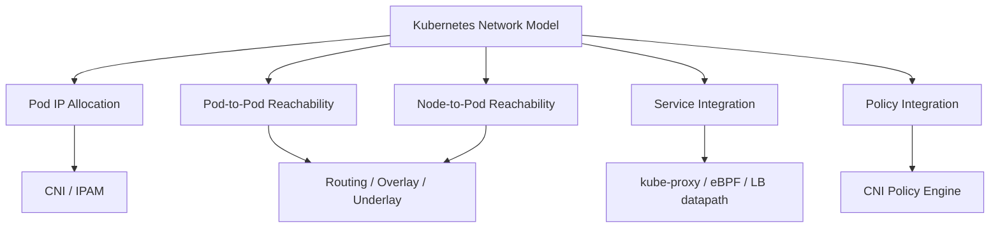

Kubernetes tidak mengatakan semua cluster harus memakai VXLAN, BGP, eBPF, iptables, atau cloud ENI. Kubernetes hanya membutuhkan hasil akhirnya sesuai model.

---

## 3. Pod IP: Identitas Lokasi, Bukan Identitas Aplikasi

Pod IP adalah alamat runtime. Ia bukan identitas stabil aplikasi.

Karakteristik Pod IP:

- berubah saat Pod dibuat ulang;
- biasanya unik dalam cluster;
- melekat ke network namespace Pod;
- dipakai EndpointSlice sebagai backend Service;
- dapat berasal dari Pod CIDR, VPC subnet, overlay IPAM, atau mekanisme cloud/CNI lain;
- tidak boleh dijadikan kontrak jangka panjang oleh client.

Mental model:

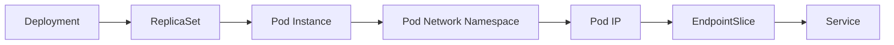

Pod IP adalah **attachment point** untuk traffic, bukan identity business. Untuk identity production, gunakan Service identity, workload identity, SPIFFE identity, mTLS identity, atau application-level identity sesuai konteks.

---

## 4. CNI: Contract Antara Runtime dan Network Plugin

### 4.1 Apa Itu CNI

CNI, Container Network Interface, adalah specification dan library untuk mengonfigurasi network interface pada Linux container. Dalam Kubernetes, CNI plugin dipanggil untuk menyiapkan atau membersihkan networking ketika Pod sandbox dibuat atau dihapus.

CNI menjawab pertanyaan:

- interface apa yang dibuat di namespace container?
- IP address apa yang diberikan?
- route apa yang dipasang?
- DNS config apa yang relevan?
- resource apa yang perlu dibersihkan saat container dihapus?

CNI bukan service mesh, bukan load balancer L7, bukan API gateway. Beberapa produk CNI memiliki fitur tambahan, tetapi contract dasarnya tetap network attachment.

### 4.2 CNI Lifecycle Sederhana

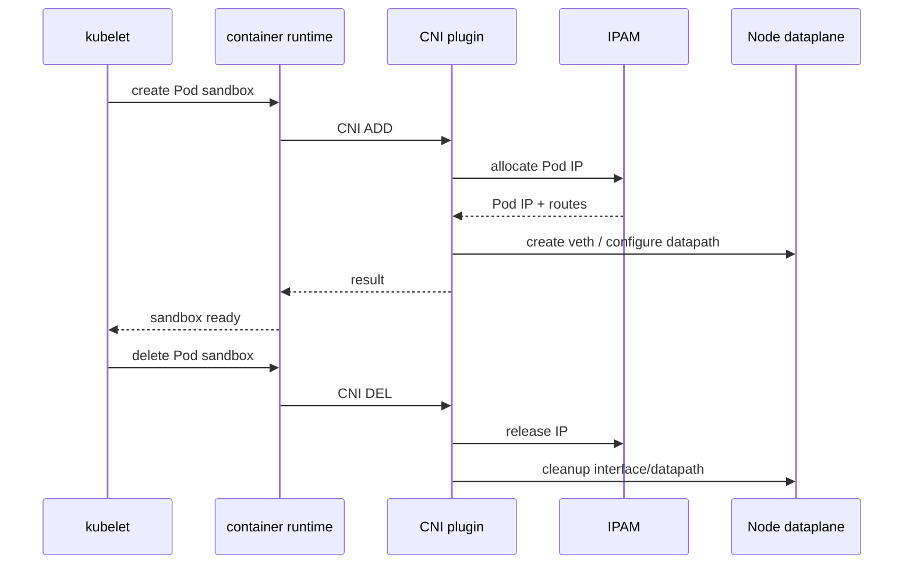

Kubernetes tidak memanggil CNI untuk setiap container aplikasi secara terpisah dalam Pod. Yang penting adalah Pod sandbox/network namespace.

### 4.3 CNI ADD dan DEL Failure

Jika `ADD` gagal:

- Pod bisa stuck di `ContainerCreating`;
- event menyebut network plugin error;
- Pod tidak mendapatkan IP;
- kubelet retry;
- CNI agent/node condition bisa menjadi root cause.

Jika `DEL` gagal:

- IP bisa leak;
- veth bisa tertinggal;
- route atau policy entry bisa stale;
- IPAM exhaustion bisa muncul setelah churn tinggi.

Production implication:

> CNI failure bukan hanya traffic failure. Ia bisa menjadi scheduling, capacity, dan lifecycle failure.

---

## 5. Komponen Dalam Pod Networking

Pod networking bukan satu komponen. Minimal terdiri dari beberapa responsibility.

| Responsibility | Penjelasan |
|---|---|
| IPAM | Mengalokasikan dan melepas IP Pod |
| Interface setup | Membuat veth atau attachment lain ke namespace Pod |
| Routing | Membuat Pod IP reachable dari node/Pod lain |
| Encapsulation | Membungkus paket jika memakai overlay |
| Policy enforcement | Mengizinkan/menolak traffic berdasarkan policy |
| Service integration | Menghubungkan Pod path dengan Service LB datapath |
| Observability | Memberi metrics, flow logs, drop reason, debug visibility |
| Cleanup | Membersihkan state saat Pod dihapus |

Tidak semua CNI mengimplementasikan semua responsibility dengan cara yang sama. Beberapa CNI fokus sederhana pada connectivity, beberapa menjadi platform network/security penuh.

---

## 6. Node Data Plane: Di Mana Paket Diputuskan

Node data plane adalah mekanisme runtime yang memproses packet forwarding, filtering, NAT, load balancing, dan sometimes observability.

Tiga keluarga umum:

1. iptables-based datapath;
2. IPVS-based service datapath;
3. eBPF-based datapath.

Catatan: CNI datapath dan Service datapath tidak selalu komponen yang sama. Misalnya, satu cluster bisa memakai CNI tertentu untuk Pod routing dan kube-proxy iptables untuk Service. Cluster lain bisa memakai Cilium untuk CNI sekaligus eBPF kube-proxy replacement.

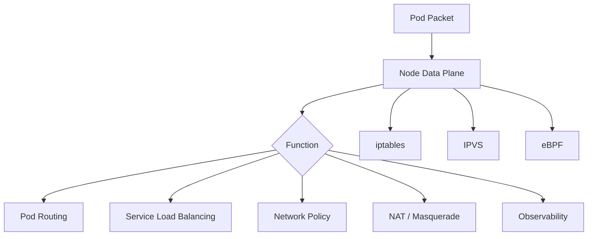

---

## 7. Pod-to-Pod Pada Node Yang Sama

Jika dua Pod berada pada node yang sama, traffic tidak perlu keluar node. Namun tetap melewati namespace dan datapath node.

Generic path:

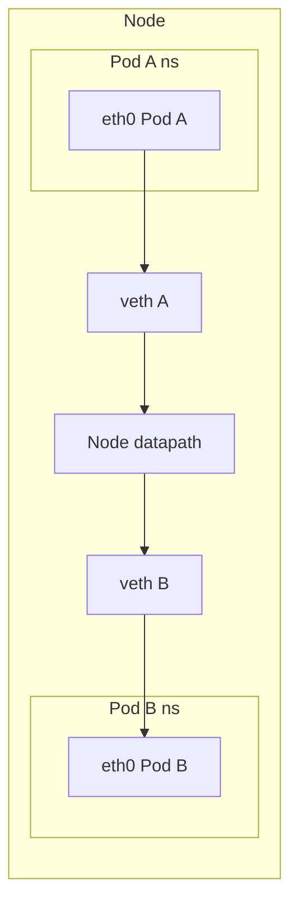

Pada CNI bridge-based, DP dapat berupa Linux bridge. Pada eBPF datapath, forwarding bisa terjadi dengan program eBPF di hook tertentu. Pada CNI lain, route dan virtual device bisa berbeda.

Yang harus diperhatikan:

- Apakah policy mengizinkan Pod A ke Pod B?
- Apakah aplikasi di Pod B listen pada port/interface yang benar?
- Apakah route dalam Pod A mengarah ke interface yang benar?
- Apakah reply path kembali ke Pod A?
- Apakah sidecar/mesh intercept mengubah path?

---

## 8. Pod-to-Pod Lintas Node

Lintas node lebih kompleks karena membutuhkan node-to-node connectivity.

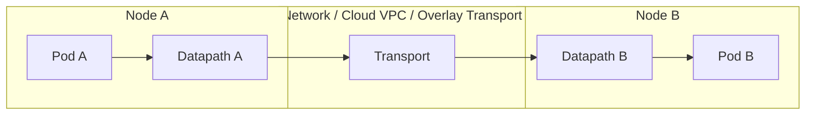

Pertanyaan penting:

- Bagaimana Node A tahu route ke Pod B?
- Apakah Pod CIDR Node B dirutekan di underlay?
- Apakah packet dibungkus overlay?
- Apakah firewall/security group mengizinkan transport CNI?
- Apakah MTU cukup?
- Apakah reverse path kembali lewat jalur yang benar?

---

## 9. IPAM: Sumber Kebenaran Alokasi IP

### 9.1 Mengapa IPAM Penting

IPAM, IP Address Management, menentukan alamat Pod. Kegagalan IPAM dapat menyebabkan:

- Pod tidak bisa dibuat;
- IP conflict;
- Pod IP overlap;
- route salah;
- capacity subnet habis;
- multi-cluster overlap;
- security policy salah target.

### 9.2 Model IPAM Umum

#### Node Pod CIDR

Setiap node mendapat range Pod CIDR. Pod di node itu mengambil IP dari range tersebut.

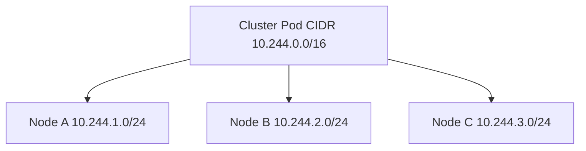

Kelebihan:

- sederhana;
- predictable;
- cocok untuk overlay/native routing tertentu.

Risiko:

- node Pod density dibatasi ukuran CIDR;
- perubahan CIDR sulit;
- multi-cluster overlap bisa menyulitkan.

#### Cloud Subnet IPAM

Pod mendapat IP dari subnet cloud/VPC.

Kelebihan:

- Pod IP terlihat native di cloud network;
- integrasi security group/routing bisa lebih natural;
- tanpa overlay untuk path tertentu.

Risiko:

- subnet IP exhaustion;
- ENI/IP per node limit;
- scaling dipengaruhi cloud API;
- IP planning menjadi kritikal.

#### Cluster-wide IPAM

CNI mengelola IP pool global dan mengalokasikan ke node/Pod sesuai kebijakan.

Kelebihan:

- fleksibel;
- bisa multi-pool;
- bisa disesuaikan topology.

Risiko:

- control plane CNI menjadi penting;
- state corruption atau split-brain IPAM sangat berbahaya;
- audit alokasi harus baik.

---

## 10. Overlay Networking

### 10.1 Bagaimana Overlay Bekerja

Overlay membungkus packet Pod di dalam packet node-to-node.

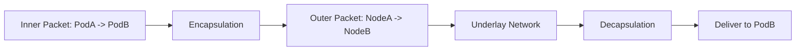

Underlay hanya perlu tahu cara mengirim packet dari Node A ke Node B. Ia tidak harus tahu Pod IP.

### 10.2 Kelebihan Overlay

- cepat diadopsi di banyak environment;
- tidak memerlukan route Pod CIDR di jaringan fisik;
- mengurangi coupling dengan cloud/VPC/router;
- cocok untuk cluster yang harus portable.

### 10.3 Kekurangan Overlay

- overhead header;
- MTU harus direncanakan;
- packet capture lebih sulit;
- performance bergantung encapsulation dan offload;
- security group/firewall harus mengizinkan protocol/port overlay;
- troubleshooting membutuhkan melihat outer dan inner packet.

### 10.4 Failure Mode Overlay

| Failure | Gejala |
|---|---|
| Encapsulation port blocked | cross-node Pod traffic gagal total |
| MTU mismatch | payload besar gagal, kecil berhasil |
| Tunnel endpoint stale | node tertentu unreachable |
| Overlay control state rusak | traffic salah route |
| Underlay packet loss | intermittent cross-node failure |

---

## 11. Native Routing / Underlay Routing

### 11.1 Konsep

Pada native routing, jaringan underlying mengetahui route ke Pod CIDR atau Pod IP.

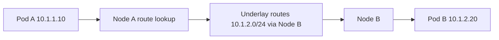

### 11.2 Kelebihan

- tidak ada overhead encapsulation besar;
- packet visibility lebih natural;
- sering lebih baik untuk latency dan throughput;
- source/destination Pod IP bisa terlihat di network layer.

### 11.3 Kekurangan

- membutuhkan route management;
- bergantung pada kemampuan network/cloud;
- lebih sensitif terhadap CIDR planning;
- multi-cluster overlap lebih bermasalah;
- route scale bisa menjadi concern.

### 11.4 Failure Mode

| Failure | Gejala |
|---|---|
| Route Pod CIDR hilang | node tertentu tidak bisa mencapai Pod tertentu |
| Route propagation delay | Pod baru intermittent unreachable |
| CIDR overlap | traffic menuju cluster/wilayah salah |
| Asymmetric routing | SYN sampai, response hilang |
| Cloud route table limit | cluster scale dibatasi routing infra |

---

## 12. Cloud-Native Pod Networking

Cloud CNI sering memberikan Pod IP dari jaringan cloud, misalnya dari subnet VPC. Ini membuat Pod menjadi first-class-ish di jaringan cloud, tetapi membawa konsekuensi cloud-specific.

Pertanyaan evaluasi:

- Apakah Pod IP berasal dari subnet yang sama dengan node?
- Apakah Pod IP routable dari VPC lain?
- Apakah security group berlaku ke node, ENI, atau Pod?
- Berapa limit IP per node?
- Bagaimana warm IP pool bekerja?
- Apa yang terjadi saat subnet habis?
- Apakah secondary CIDR dibutuhkan?
- Apakah IPv6 membantu atau menambah kompleksitas?

Failure mode khas:

- Pod stuck karena IP exhaustion;
- autoscaling gagal karena subnet penuh;
- node punya CPU/memory cukup tetapi tidak bisa menerima Pod baru karena IP limit;
- external firewall melihat Pod IP, bukan node IP, atau sebaliknya;
- policy cloud dan NetworkPolicy Kubernetes tidak selaras.

---

## 13. CNI dan NetworkPolicy

Kubernetes NetworkPolicy adalah API. Enforcement dilakukan oleh CNI/plugin yang mendukungnya.

Implikasi penting:

> NetworkPolicy object dapat ada di cluster, tetapi tidak berarti policy enforced jika CNI tidak mendukung enforcement.

CNI dapat menerapkan policy dengan berbagai cara:

- iptables rules;
- eBPF programs;
- Open vSwitch flows;
- userspace/proxy integration;
- cloud security primitives;
- hybrid model.

NetworkPolicy akan dibahas mendalam di Part 028, tetapi dari sisi CNI, pertanyaan review adalah:

- Apakah CNI mendukung Kubernetes NetworkPolicy?
- Apakah mendukung egress policy?
- Apakah mendukung default deny secara reliable?
- Apakah mendukung namespace selector dan pod selector sesuai expectation?
- Apakah ada policy audit/dry-run?
- Apakah ada L7 policy extension?
- Apakah policy berlaku untuk hostNetwork Pod?
- Bagaimana policy berlaku untuk traffic node-local seperti DNS?

---

## 14. CNI dan Service Load Balancing

Service load balancing bisa dilakukan oleh kube-proxy atau diganti oleh CNI/eBPF datapath.

Pemisahan penting:

| Concern | Komponen Umum |
|---|---|
| Pod interface/IP/routing | CNI |
| Service ClusterIP/NodePort LB | kube-proxy atau eBPF replacement |
| L7 routing | Gateway/Ingress/Mesh |
| NetworkPolicy | CNI policy engine |

Beberapa CNI modern menggabungkan lebih banyak responsibility. Misalnya, Cilium dapat menyediakan CNI, network policy, eBPF datapath, kube-proxy replacement, observability, dan service mesh capability tertentu.

Risikonya:

- platform menjadi lebih powerful;
- tetapi failure domain produk itu juga lebih besar;
- upgrade harus lebih hati-hati;
- debugging butuh mengerti implementation-specific datapath.

---

## 15. eBPF Dalam Kubernetes Networking

### 15.1 Mental Model eBPF

eBPF memungkinkan program kecil yang diverifikasi berjalan di hook kernel tertentu. Dalam networking, eBPF dapat dipakai untuk:

- packet forwarding;
- service load balancing;
- policy enforcement;
- observability;
- connection tracking alternative/augmentation;
- socket-level routing;
- transparent encryption;
- host firewall.

### 15.2 Mengapa eBPF Populer

- menghindari rule explosion iptables pada skala besar;
- bisa memberi visibility lebih kaya;
- bisa melakukan keputusan lebih dekat ke packet path;
- mendukung identity-aware policy pada beberapa implementation;
- dapat mengganti kube-proxy untuk Service LB.

### 15.3 Trade-off eBPF

- debugging lebih spesifik ke implementation;
- butuh kernel compatibility;
- observability harus memahami maps/programs;
- operational blast radius besar jika datapath bermasalah;
- skill requirement tim lebih tinggi.

### 15.4 Pertanyaan Review

- Kernel version apa yang dibutuhkan?
- Apakah cloud provider mendukung mode yang dipilih?
- Apakah kube-proxy replacement aktif penuh atau partial?
- Bagaimana rollback jika eBPF datapath bermasalah?
- Bagaimana cara melihat drop reason?
- Bagaimana upgrade CNI dilakukan tanpa traffic interruption?

---

## 16. Flannel: Simple Overlay Connectivity

Flannel sering dipahami sebagai CNI sederhana untuk Pod networking. Fokusnya connectivity, bukan full security platform.

Karakteristik umum:

- mudah dipahami;
- sering memakai overlay seperti VXLAN;
- cocok untuk lab atau cluster sederhana;
- tidak menjadi full policy engine seperti Calico/Cilium;
- operational surface relatif kecil.

Kapan masuk akal:

- learning environment;
- cluster sederhana;
- workload low-complexity;
- policy/security dilakukan di layer lain;
- tidak butuh advanced observability dari CNI.

Kapan kurang cocok:

- butuh NetworkPolicy kuat;
- butuh egress control detail;
- butuh flow visibility mendalam;
- butuh high-scale service LB optimization;
- butuh identity-aware enforcement.

Failure mode yang perlu diwaspadai:

- VXLAN/overlay port blocked;
- MTU mismatch;
- node route/subnet lease stale;
- tidak ada policy enforcement sesuai asumsi tim.

---

## 17. Calico: Routing dan Policy-First Thinking

Calico dikenal kuat di area policy dan routing. Tergantung mode, Calico dapat menggunakan BGP/native routing, overlay, atau kombinasi.

Karakteristik arsitektural:

- kuat untuk NetworkPolicy dan policy extension;
- dapat memakai BGP untuk route distribution;
- mendukung overlay mode jika diperlukan;
- sering dipilih ketika microsegmentation dan policy governance penting.

Pertanyaan review:

- Apakah memakai BGP atau overlay?
- Siapa route reflector?
- Bagaimana route scale?
- Apakah policy Kubernetes cukup atau butuh Calico-specific policy?
- Bagaimana default deny diterapkan?
- Bagaimana policy audit dan staged rollout dilakukan?

Failure mode:

- BGP session down;
- route tidak terdistribusi;
- policy terlalu luas atau terlalu sempit;
- namespace selector tidak sesuai intensi;
- overlay/native mode tidak dipahami operator.

---

## 18. Cilium: eBPF, Identity, Observability, dan Platform Networking

Cilium memakai eBPF sebagai fondasi networking, security, dan observability. Ia sering dipakai bukan hanya sebagai CNI, tetapi sebagai networking/security platform.

Capability yang sering relevan:

- CNI Pod networking;
- eBPF datapath;
- kube-proxy replacement;
- Kubernetes NetworkPolicy;
- CiliumNetworkPolicy;
- identity-aware enforcement;
- Hubble flow observability;
- Gateway API support;
- service mesh/Envoy integration;
- transparent encryption;
- multi-cluster connectivity melalui Cluster Mesh.

Trade-off:

- sangat powerful;
- learning curve lebih tinggi;
- implementation-specific behavior harus dipahami;
- upgrade dan kernel compatibility penting;
- platform team harus punya debugging skill eBPF/Cilium.

Pertanyaan review:

- Apakah mode tunneling atau native routing?
- Apakah kube-proxy replacement aktif?
- Apakah Hubble diaktifkan?
- Apakah L7 policy memakai Envoy?
- Apakah identity allocation stabil?
- Bagaimana cluster mesh dipakai?
- Apa rollback strategy?

Failure mode:

- eBPF map pressure;
- identity allocation issue;
- Cilium agent restart memengaruhi datapath programming;
- Envoy L7 proxy issue;
- policy drop yang sulit terlihat tanpa Hubble/drop metrics;
- kernel feature mismatch.

---

## 19. AWS VPC CNI dan Cloud CNI Pattern

AWS VPC CNI adalah contoh penting cloud-native Pod networking. Pod dapat mendapat IP dari VPC subnet melalui ENI/secondary IP model.

Konsekuensi arsitektural:

- Pod IP native dalam VPC;
- routing cloud lebih natural;
- security group/subnet/NACL menjadi relevan;
- kapasitas Pod per node terkait limit IP/ENI instance;
- subnet planning menjadi critical;
- IP exhaustion dapat menghambat scheduling.

Pattern ini juga berlaku secara konseptual ke cloud CNI lain: jangan hanya melihat Kubernetes. Lihat cloud network quota, IP space, route table, security primitive, dan API rate limits.

Pertanyaan review:

- Berapa Pod density per instance type?
- Apakah subnet cukup besar untuk autoscaling?
- Apakah warm IP target disetel tepat?
- Apakah secondary CIDR dipakai?
- Apakah IPv6 dipertimbangkan?
- Apakah NetworkPolicy enforcement tersedia dan kompatibel dengan environment?
- Bagaimana observability IP allocation?

Failure mode:

- `Insufficient pods` karena IP, bukan CPU/memory;
- subnet exhausted saat scale event;
- EC2/API throttling memengaruhi attachment;
- security group terlalu longgar karena Pod dianggap node-level;
- egress source IP tidak sesuai ekspektasi.

---

## 20. CNI Selection Framework

Jangan memilih CNI karena “populer”. Pilih berdasarkan constraint.

### 20.1 Decision Matrix

| Dimensi | Pertanyaan |
|---|---|
| Connectivity | Overlay, native routing, atau cloud-native IP? |
| Policy | Butuh Kubernetes NetworkPolicy saja atau extension? |
| Scale | Berapa node, Pod, Service, endpoint churn? |
| Performance | Latency/throughput target? |
| Cloud fit | Apakah harus native dengan VPC/security group? |
| Observability | Butuh flow logs, drop reason, identity-aware telemetry? |
| Service LB | Pakai kube-proxy, IPVS, atau eBPF replacement? |
| Multi-cluster | Butuh cluster mesh, global service, cross-cluster identity? |
| Operations | Tim siap debugging datapath ini? |
| Upgrade risk | Bagaimana rollback dan compatibility? |
| Compliance | Butuh audit egress, segmentation, identity? |

### 20.2 Scenario-Based Choice

#### Scenario A: Lab atau cluster sederhana

Prioritas:

- simplicity;
- setup cepat;
- low operational complexity.

CNI sederhana bisa cukup.

#### Scenario B: Enterprise microsegmentation

Prioritas:

- default deny;
- policy governance;
- namespace/team isolation;
- audit;
- staged policy rollout.

CNI dengan policy kuat lebih cocok.

#### Scenario C: High-scale platform

Prioritas:

- service LB scale;
- endpoint churn handling;
- observability;
- performance;
- controlled upgrade.

eBPF-based datapath mungkin menarik, tetapi harus disertai skill operasional.

#### Scenario D: Cloud-native VPC integration

Prioritas:

- Pod IP routable di VPC;
- cloud firewall integration;
- no overlay;
- private connectivity.

Cloud CNI sering masuk akal, dengan konsekuensi IP planning.

#### Scenario E: Multi-cluster service platform

Prioritas:

- non-overlapping CIDR atau translation strategy;
- identity federation;
- service discovery lintas cluster;
- cross-cluster policy;
- failure isolation.

CNI harus dievaluasi bersama service mesh/global traffic design.

---

## 21. Packet Path: Pod-to-Pod Direct vs Service Path

Jangan campur Pod-to-Pod direct path dengan Service path.

### Direct Pod IP

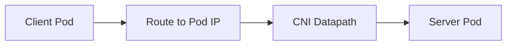

### Service ClusterIP

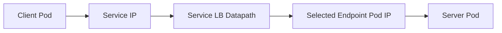

Perbedaannya:

- Service path melibatkan load balancing;
- Service path dapat melibatkan DNAT/conntrack/eBPF map;
- Direct Pod IP tidak melewati Service selection;
- NetworkPolicy bisa berlaku berbeda tergantung source/destination identity/IP;
- mesh/gateway internal route bisa menambah layer lagi.

Debugging rule:

> Jika Service gagal, selalu test direct Pod endpoint untuk memisahkan Service LB problem dari Pod reachability problem.

---

## 22. Endpoint Churn dan CNI/Data Plane Pressure

Kubernetes workload dinamis. Pod datang dan pergi. EndpointSlice berubah. Service datapath harus mengikuti.

Peristiwa yang menyebabkan churn:

- Deployment rollout;
- HPA scale up/down;
- node drain;
- spot interruption;
- readiness flap;
- crash loop;
- topology rebalance;
- cluster autoscaler.

Dampaknya:

- datapath update sering;
- conntrack entry lama tetap ada;
- load balancing map berubah;
- DNS/headless service record berubah;
- mesh endpoint discovery berubah;
- gateway backend health berubah.

Failure mode:

- request ke terminating Pod;
- stale endpoint masih dipilih;
- new endpoint belum siap;
- route update delay;
- controller backlog;
- proxy config push storm.

Ini alasan readiness, terminationGracePeriod, preStop, connection draining, dan endpoint condition sangat penting.

---

## 23. Node Failure dan CNI Behavior

Ketika node gagal, pertanyaannya bukan hanya “Pod dipindahkan ke mana?”. Pertanyaan network-nya:

- Apakah Pod IP lama masih diroute?
- Apakah endpoint lama sudah dihapus?
- Apakah conntrack entry masih mengarah ke IP lama?
- Apakah load balancer masih menganggap node sehat?
- Apakah CNI membersihkan state node?
- Apakah route ke Pod CIDR node gagal sudah dicabut?
- Apakah DNS/headless record masih menyimpan IP lama?

Pada cluster besar, node failure bisa membuat traffic blackhole sementara. Desain harus mengurangi blast radius dan waktu convergence.

---

## 24. Readiness: Network Ready Tidak Sama Dengan App Ready

CNI ADD sukses berarti Pod punya network attachment. Itu tidak berarti aplikasi siap.

Timeline:

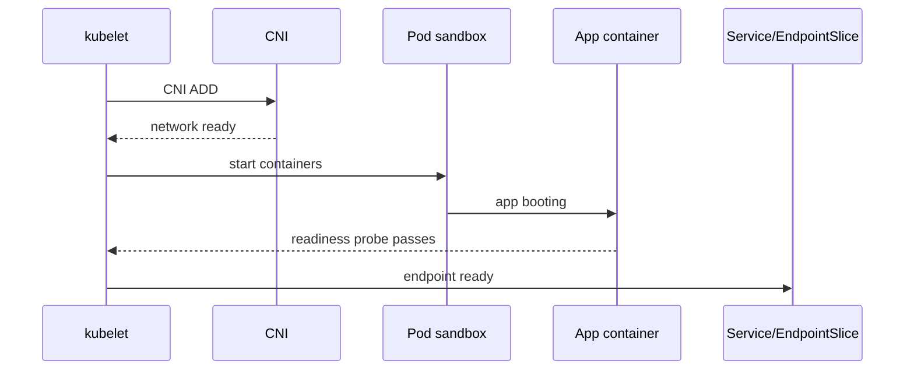

Jika readiness terlalu optimistis, Service dapat mengirim traffic ke Pod yang secara network reachable tetapi belum siap secara aplikasi.

Failure pattern:

- Pod IP reachable;
- TCP port open;
- app dependency belum siap;
- request gagal setelah rollout;
- error spike saat scale-up.

Solusi:

- readiness probe merepresentasikan kemampuan melayani request nyata;
- startup probe untuk aplikasi lambat;
- graceful shutdown;
- drain sebelum terminate;
- observability per endpoint.

---

## 25. Security Boundary Dalam Pod Networking

Pod network bukan security boundary kuat jika tidak dilengkapi policy.

Pertanyaan kritis:

- Apakah semua Pod bisa saling akses by default?
- Apakah namespace punya default deny?
- Apakah DNS diizinkan eksplisit?
- Apakah egress ke metadata service/cloud API dibatasi?
- Apakah hostNetwork Pod diaudit?
- Apakah CNI mencegah IP spoofing?
- Apakah workload bisa mengirim packet dengan source IP palsu?
- Apakah privileged Pod bisa mengubah network namespace?

CNI security bukan hanya NetworkPolicy. Termasuk:

- anti-spoofing;
- host firewall;
- encryption;
- identity;
- egress control;
- audit logs;
- isolation dari host/network control plane.

---

## 26. Observability Yang Harus Ada Di CNI Layer

Minimum production observability:

| Signal | Tujuan |
|---|---|
| CNI agent health | memastikan datapath programming berjalan |
| IPAM allocation | mencegah IP exhaustion |
| packet drops | mengetahui drop by policy/routing/kernel |
| flow logs | melihat source/destination/protocol |
| policy verdict | allow/drop reason |
| endpoint identity | menghubungkan IP ke workload |
| node-level errors | interface drops, retransmits, route issue |
| conntrack metrics | mendeteksi table pressure |

Tanpa observability CNI, incident akan turun ke tcpdump manual terlalu sering.

Idealnya tim bisa menjawab:

- Flow dari Pod A ke Pod B diizinkan atau ditolak?
- Ditolak karena policy mana?
- Paket drop di node source atau destination?
- Apakah Service LB memilih endpoint mana?
- Apakah source IP berubah?
- Apakah traffic cross-zone/cross-node?

---

## 27. Troubleshooting Pod Networking: Layered Playbook

### 27.1 Pod Tidak Mendapat IP

Command:

```bash
kubectl describe pod <pod>
kubectl get events --sort-by=.lastTimestamp
kubectl logs -n kube-system <cni-agent>
```

Hipotesis:

- CNI config missing;
- CNI binary missing;
- IPAM exhausted;
- cloud API throttled;
- CNI daemon unhealthy;
- node not ready;
- permission/RBAC issue pada CNI;
- conflicting CNI config.

### 27.2 Pod Dapat IP Tapi Tidak Bisa Keluar

Command dari Pod:

```bash
ip addr
ip route
cat /etc/resolv.conf
curl -v <target>
```

Command dari node:

```bash
ip route get <target-ip>
tcpdump -ni any host <pod-ip>
```

Hipotesis:

- default route hilang;
- policy drop;
- NAT/masquerade tidak bekerja;
- node firewall;
- egress gateway/proxy;
- DNS issue;
- route underlay.

### 27.3 Pod-to-Pod Same Node Berhasil, Cross Node Gagal

Hipotesis utama:

- node-to-node connectivity;
- overlay blocked;
- route missing;
- MTU;
- CNI agent node tertentu;
- cloud security group;
- asymmetric routing.

### 27.4 Direct Pod IP Berhasil, Service Gagal

Hipotesis:

- kube-proxy/eBPF service LB;
- Service selector salah;
- EndpointSlice kosong;
- port target salah;
- conntrack stale;
- NetworkPolicy terhadap ClusterIP path;
- topology-aware routing;
- session affinity.

Part 005 akan membahas Service path lebih dalam.

---

## 28. Failure Model: Pod Networking

Gunakan taxonomy berikut saat incident.

```mermaid
flowchart TD
    A[Pod Networking Failure] --> B[Provisioning Failure]
    A --> C[Reachability Failure]
    A --> D[Policy Failure]
    A --> E[Performance Failure]
    A --> F[State Failure]
    A --> G[Cloud/Infra Failure]

    B --> B1[CNI ADD fail]
    B --> B2[IPAM exhausted]
    B --> B3[CNI config missing]

    C --> C1[route missing]
    C --> C2[overlay blocked]
    C --> C3[neighbor issue]

    D --> D1[NetworkPolicy drop]
    D --> D2[host firewall]
    D --> D3[cloud SG/NACL]

    E --> E1[MTU]
    E --> E2[packet loss]
    E --> E3[CPU softirq pressure]

    F --> F1[stale conntrack]
    F --> F2[stale route]
    F --> F3[stale endpoint]

    G --> G1[subnet exhausted]
    G --> G2[cloud API throttle]
    G --> G3[route table limit]
```

---

## 29. Design Pattern: Separate Connectivity, Policy, and Routing Ownership

A mature platform separates concerns:

| Concern | Owner Umum | Artifact |
|---|---|---|
| Pod connectivity | Platform/network team | CNI config, node routing |
| Namespace isolation | Platform/security team | NetworkPolicy baseline |
| App exposure | App/platform team | Service, Gateway, Route |
| Service identity | Platform/security team | mTLS/SPIFFE/mesh identity |
| Egress | Platform/security/network team | egress gateway, firewall, policy |
| Observability | SRE/platform team | flow logs, metrics, traces |

Anti-pattern: app team diberi kebebasan penuh mengubah CNI-specific policy, Gateway exposure, egress path, dan mesh policy tanpa guardrail. Itu menciptakan security dan operability drift.

---

## 30. Design Pattern: CNI as Platform Primitive

CNI harus diperlakukan sebagai platform primitive, bukan add-on yang “dipasang sekali lalu dilupakan”.

Ia perlu:

- versioning policy;
- upgrade plan;
- compatibility matrix;
- performance baseline;
- failure drill;
- observability baseline;
- disaster recovery plan;
- rollback strategy;
- documented packet path.

Minimum dokumen yang harus ada:

1. Pod-to-Pod same-node path.
2. Pod-to-Pod cross-node path.
3. Pod-to-Service path.
4. Pod-to-external egress path.
5. External-to-Service ingress path.
6. NetworkPolicy enforcement point.
7. Source IP behavior.
8. MTU assumptions.
9. Node firewall/security group requirements.
10. Known failure modes and runbook.

---

## 31. Kaufman Practice Loop Untuk Part Ini

### Jam 1–2: CNI Inventory

Ambil cluster non-production.

```bash
kubectl get pods -n kube-system -o wide
kubectl get daemonset -n kube-system
kubectl get nodes -o wide
```

Jawab:

- CNI apa yang dipakai?
- Apakah kube-proxy aktif?
- Apakah ada CNI agent per node?
- Apakah ada observability component?

### Jam 3–5: Pod IP dan Node Mapping

```bash
kubectl get pod -A -o wide
kubectl get nodes -o wide
```

Latihan:

- mapping Pod IP ke node;
- lihat pola IP per node;
- cek apakah Pod IP berasal dari Pod CIDR atau subnet cloud;
- cek route dari node ke Pod IP.

### Jam 6–8: Same Node vs Cross Node

Jadwalkan client/server di node sama dan beda.

Test:

```bash
curl http://<pod-ip>:<port>
tcpdump -ni any host <pod-ip>
```

Catat perbedaan path.

### Jam 9–11: Overlay/Native Clue

Cari indikasi:

```bash
ip route
ip link
ip addr
```

Lihat apakah ada interface tunnel, bridge, atau route Pod CIDR.

### Jam 12–14: CNI Failure Reading

Baca log CNI agent.

Cari:

- IPAM allocation;
- policy regeneration;
- route programming;
- endpoint update;
- error/retry;
- health check.

### Jam 15–17: Policy Smoke Test

Buat namespace test, default deny, allow DNS, allow app-specific traffic.

Verifikasi:

- traffic allowed benar-benar allowed;
- traffic denied benar-benar denied;
- DNS tidak accidentally blocked;
- flow/drop visibility tersedia.

### Jam 18–20: Decision Memo

Tulis memo 1–2 halaman:

- CNI saat ini;
- datapath mode;
- IPAM model;
- policy support;
- observability;
- top 5 risks;
- recommended improvements.

---

## 32. Architecture Review Checklist

Gunakan checklist ini saat menilai CNI/Pod networking production.

### Connectivity

- Pod-to-Pod same node valid?
- Pod-to-Pod cross node valid?
- Node-to-Pod valid?
- Pod-to-node valid jika diperlukan?
- Pod-to-external valid?
- IPv4/IPv6/dual-stack jelas?

### IPAM

- Pod CIDR/subnet cukup?
- Node Pod density dihitung?
- Autoscaling tidak dibatasi IP?
- Multi-cluster CIDR tidak overlap?
- IP leak terdeteksi?

### Routing

- Overlay atau native routing terdokumentasi?
- Encapsulation protocol/port dibuka?
- Route propagation diketahui?
- MTU sesuai?
- Asymmetric routing dicegah?

### Policy

- NetworkPolicy enforced?
- Default deny baseline ada?
- DNS allowance eksplisit?
- Egress policy ada?
- HostNetwork behavior dipahami?
- CNI-specific policy governance ada?

### Observability

- Flow logs tersedia?
- Drop reason tersedia?
- CNI metrics dikumpulkan?
- IPAM metrics dikumpulkan?
- Node interface errors dipantau?
- Conntrack dipantau?

### Operations

- Upgrade plan ada?
- Rollback plan ada?
- Kernel compatibility jelas?
- Cloud quota dipantau?
- Runbook incident ada?
- Team memahami packet path?

---

## 33. Anti-Pattern

### Anti-Pattern 1: Memilih CNI Tanpa Packet Path Diagram

Jika tim tidak bisa menggambar packet path, tim belum siap mengoperasikan CNI itu.

### Anti-Pattern 2: Menganggap Semua CNI Sama

Semua CNI bisa memenuhi model Kubernetes, tetapi berbeda drastis dalam routing, policy, observability, scale, dan failure mode.

### Anti-Pattern 3: Mengaktifkan Advanced Feature Tanpa Ownership

eBPF replacement, L7 policy, encryption, cluster mesh, atau egress gateway membutuhkan ownership dan runbook.

### Anti-Pattern 4: Tidak Menghitung IP Capacity

Banyak outage scheduling sebenarnya IP exhaustion, bukan Kubernetes scheduler bug.

### Anti-Pattern 5: Menganggap NetworkPolicy Otomatis Berlaku

NetworkPolicy adalah API. Enforcement tergantung CNI.

---

## 34. Mini ADR: CNI Selection

```md
# ADR: CNI Selection for Kubernetes Platform

## Context
Platform menjalankan workload ... dengan kebutuhan traffic, security, observability, dan scale ...

## Options
1. Flannel / simple overlay
2. Calico
3. Cilium
4. Cloud-native CNI
5. Hybrid model

## Decision
Kami memilih ...

## Reasoning
Connectivity:
- ...

IPAM:
- ...

Routing:
- ...

Policy:
- ...

Service LB:
- ...

Observability:
- ...

Multi-cluster:
- ...

Operational readiness:
- ...

## Risks
- ...

## Mitigations
- ...

## Rollback
- ...

## Validation Plan
- same-node Pod-to-Pod
- cross-node Pod-to-Pod
- Pod-to-Service
- Pod-to-external
- NetworkPolicy allow/deny
- MTU large payload
- node drain
- CNI agent restart
```

---

## 35. Ringkasan

Pod networking adalah hasil kolaborasi kubelet, container runtime, CNI plugin, IPAM, node datapath, routing infrastructure, dan policy engine.

Hal utama yang harus dibawa:

- Kubernetes mendefinisikan network model, tetapi CNI mengimplementasikan realitasnya.
- Pod IP adalah runtime location, bukan identity stabil aplikasi.
- CNI tidak hanya soal “Pod bisa ping”; di production ia menjadi foundation untuk policy, observability, service load balancing, egress, dan multi-cluster.
- Overlay menyederhanakan routing underlay tetapi membawa MTU dan encapsulation complexity.
- Native/cloud routing mengurangi overlay overhead tetapi membutuhkan IP planning dan route/cloud integration matang.
- eBPF memberi kemampuan besar, tetapi membutuhkan skill operasional yang lebih tinggi.
- NetworkPolicy hanya efektif jika CNI melakukan enforcement.
- CNI harus dievaluasi sebagai platform primitive dengan ownership, runbook, metrics, dan upgrade strategy.

Part berikutnya akan membahas **Service, Virtual IP, kube-proxy, IPVS, and eBPF**: bagaimana ClusterIP, NodePort, LoadBalancer, session affinity, source IP preservation, internal/external traffic policy, dan service load balancing benar-benar bekerja.

---

## References

- Kubernetes Documentation — Cluster Networking: https://kubernetes.io/docs/concepts/cluster-administration/networking/
- Kubernetes Documentation — Network Plugins: https://kubernetes.io/docs/concepts/extend-kubernetes/compute-storage-net/network-plugins/
- Kubernetes Documentation — Services, Load Balancing, and Networking: https://kubernetes.io/docs/concepts/services-networking/
- CNI Specification: https://github.com/containernetworking/cni/blob/main/SPEC.md
- CNI Project Documentation: https://www.cni.dev/docs/
- Cilium Documentation — Kubernetes Networking Configuration: https://docs.cilium.io/en/stable/network/kubernetes/configuration/
- Cilium Documentation — eBPF Datapath: https://docs.cilium.io/en/stable/network/ebpf/
