# Part 005 — Service Virtual IP, kube-proxy, and eBPF

## 1. Tujuan Part Ini

Part ini membahas salah satu abstraksi paling penting dalam Kubernetes networking: **Service**. Di level basic, Service sering dijelaskan sebagai "stable IP dan DNS name untuk sekumpulan Pod". Penjelasan itu benar, tetapi terlalu dangkal untuk production engineering.

Di production, Service adalah **routing contract** antara client dan backend yang berubah secara dinamis. Contract itu tidak hanya melibatkan objek `Service`, tetapi juga:

- selector,
- EndpointSlice,
- kube-proxy atau service proxy lain,
- node dataplane,
- conntrack,
- NAT,
- source IP semantics,
- traffic policy,
- cloud load balancer,
- CNI behavior,
- dan observability.

Target setelah part ini:

1. Anda bisa menjelaskan packet path dari Pod ke ClusterIP hingga backend Pod.
2. Anda bisa membedakan Service API intent dengan rules aktual di node.
3. Anda bisa memahami perbedaan kube-proxy iptables, IPVS, dan eBPF service load balancing.
4. Anda bisa membuat keputusan tentang `internalTrafficPolicy`, `externalTrafficPolicy`, session affinity, dan source IP preservation.
5. Anda bisa men-debug Service yang terlihat benar di Kubernetes API tetapi gagal di dataplane.

Kaufman framing untuk part ini:

- **Deconstruct**: pisahkan Service menjadi API object, endpoint set, virtual IP, dataplane programming, dan client-visible behavior.
- **Learn enough to self-correct**: pahami observable signal yang membuktikan apakah masalah berada di selector, endpoint, proxy, NAT, policy, atau aplikasi.
- **Practice deliberately**: jangan hanya apply YAML; latih packet walk dan failure injection.

---

## 2. Mental Model Utama: Service Bukan Load Balancer Tunggal

Kubernetes Service sering membuat orang berpikir ada satu load balancer virtual di tengah cluster. Secara mental, itu berguna untuk pemula. Namun untuk engineer advance, mental model yang lebih akurat adalah:

> Service adalah deklarasi intent. Setiap node memiliki mekanisme lokal untuk mengubah traffic ke virtual Service address menjadi traffic ke salah satu endpoint backend.

Dengan kata lain, Service tidak selalu berarti ada satu proxy sentral. Pada mode kube-proxy iptables, setiap node memiliki rules yang menangkap traffic ke ClusterIP. Pada mode IPVS, kernel IPVS melakukan virtual server load balancing. Pada eBPF dataplane, program eBPF dapat mengintersep dan menerjemahkan traffic lebih awal di path kernel.

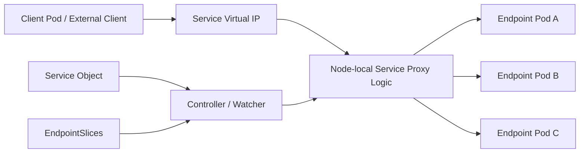

Critical insight:

- Service object adalah **intent**.
- EndpointSlice adalah **backend inventory**.
- kube-proxy/eBPF adalah **dataplane programmer**.
- iptables/IPVS/eBPF rules adalah **actual forwarding behavior**.
- conntrack adalah **state memory** yang sering membuat perubahan tidak langsung terlihat.

---

## 3. Service API Recap yang Tidak Basic

Service memiliki beberapa type umum:

| Service Type | Primary Use | Hidden Cost / Risk |
|---|---|---|
| `ClusterIP` | Stable internal virtual IP untuk cluster-local access | Bergantung pada node dataplane; source IP dan conntrack behavior penting |
| `NodePort` | Membuka port di setiap node | Attack surface lebih luas; node-level routing dan firewall harus dipahami |
| `LoadBalancer` | Meminta external/cloud LB | Behavior sangat tergantung cloud/provider/controller |
| `ExternalName` | DNS CNAME ke nama external | Tidak membuat proxy dataplane; dapat menipu asumsi observability/policy |
| Headless Service | DNS langsung ke endpoint | Client menjadi load balancer; DNS TTL dan client cache menjadi krusial |

Yang sering disalahpahami:

- `ClusterIP` bukan Pod IP.
- Service IP bukan interface biasa di node.
- Service tidak otomatis menjamin readiness benar.
- Service tidak otomatis menjamin traffic tersebar rata.
- Service tidak otomatis menjaga source IP.
- Service tidak otomatis mengerti HTTP, gRPC, retry, timeout, atau circuit breaking.

Service adalah L3/L4 abstraction. Untuk behavior L7, gunakan Gateway API, Ingress, service mesh, atau application-level logic.

---

## 4. Dari Service Selector ke EndpointSlice

Service biasanya memakai selector:

```yaml
apiVersion: v1
kind: Service
metadata:
  name: payments
  namespace: prod
spec:
  selector:
    app: payments
  ports:
    - name: http
      port: 80
      targetPort: 8080
```

Selector ini tidak mengirim traffic secara langsung. Selector digunakan untuk menemukan Pod yang cocok. Dari situ, control plane membuat/memperbarui EndpointSlice.

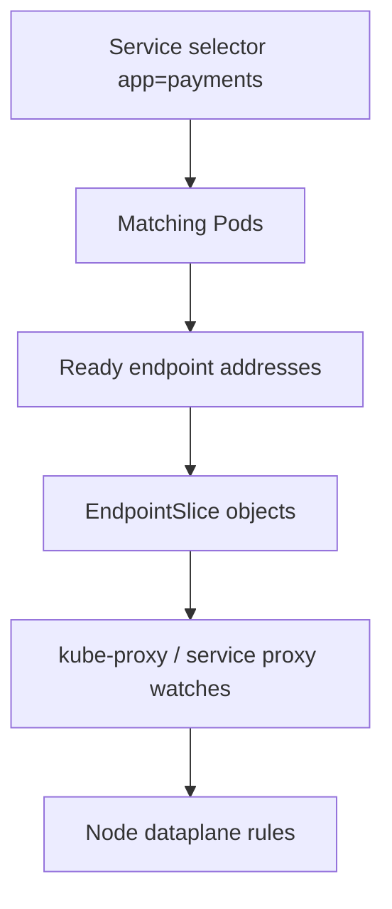

EndpointSlice adalah inventory endpoint yang dikonsumsi service proxy. Jika Service benar tetapi EndpointSlice kosong, dataplane tidak punya backend valid.

Checklist cepat:

```bash
kubectl get svc payments -n prod -o wide
kubectl get endpointslice -n prod -l kubernetes.io/service-name=payments
kubectl describe svc payments -n prod
kubectl get pod -n prod -l app=payments -o wide
```

Jika Service memiliki selector tetapi EndpointSlice kosong, pertanyaan debugging pertama:

1. Apakah label Pod cocok?
2. Apakah Pod Ready?
3. Apakah container port dan `targetPort` benar?
4. Apakah namespace benar?
5. Apakah EndpointSlice controller sehat?
6. Apakah ada terminating endpoints yang masih terlihat tetapi tidak seharusnya menerima traffic?

---

## 5. Port, targetPort, dan Named Port

Service port mapping terlihat sederhana, tetapi sering menjadi sumber bug.

```yaml
spec:
  ports:
    - name: http
      port: 80
      targetPort: app-http
```

Di sini:

- `port`: port Service yang dipakai client.
- `targetPort`: port backend Pod.
- `name`: nama port Service.
- named `targetPort`: mengacu ke port container yang bernama `app-http`.

Contoh Pod:

```yaml
apiVersion: v1
kind: Pod
metadata:
  labels:
    app: payments
spec:
  containers:
    - name: app
      image: example/payments
      ports:
        - name: app-http
          containerPort: 8080
```

Keuntungan named port:

- Service tidak perlu berubah ketika container port berubah.
- Beberapa workload dengan port number berbeda bisa tetap memenuhi Service contract jika nama port konsisten.

Risiko named port:

- Typo pada nama port menyebabkan endpoint port tidak sesuai harapan.
- Multi-container Pod dapat membuat interpretasi port menjadi lebih sulit.
- Observability sering menampilkan port number, bukan named abstraction.

Prinsip produksi:

> Gunakan named ports untuk contract yang stabil, tetapi validasi dengan EndpointSlice, bukan hanya manifest Service.

---

## 6. Packet Walk: Pod ke ClusterIP

Misalkan Pod `frontend` memanggil `http://payments.prod.svc.cluster.local`.

Langkah konseptual:

1. App melakukan DNS lookup.
2. CoreDNS mengembalikan ClusterIP Service `payments`.
3. App membuka TCP connection ke ClusterIP:port.
4. Packet keluar dari network namespace Pod.
5. Packet masuk ke node network path.
6. Service proxy logic menangkap destination ClusterIP:port.
7. Dataplane memilih endpoint.
8. Destination di-DNAT ke PodIP:targetPort.
9. Packet dirutekan ke backend Pod.
10. Conntrack menyimpan mapping agar reply path konsisten.

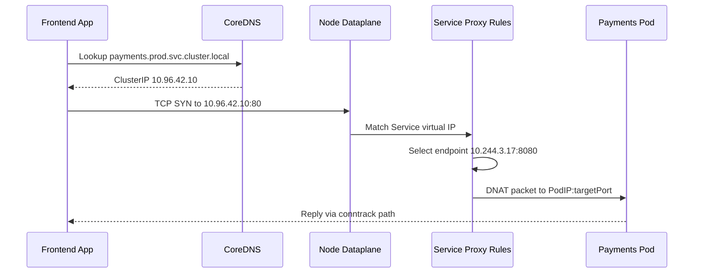

Key point:

- Client mengira berbicara ke ClusterIP.
- Backend menerima traffic ke PodIP:targetPort.
- Conntrack menjaga state translation.
- Packet path bisa berbeda jika endpoint berada di node yang sama vs node lain.

---

## 7. kube-proxy: Role dan Batasnya

`kube-proxy` adalah komponen node yang mengamati Service dan EndpointSlice lalu memprogram dataplane. Nama "proxy" agak menyesatkan karena pada mode modern, kube-proxy tidak selalu menjadi proxy userspace yang menerima dan meneruskan setiap byte aplikasi.

Role kube-proxy:

- watch Service,
- watch EndpointSlice,
- membuat rules untuk virtual IP,
- memilih backend,
- menangani NodePort,
- menghormati traffic policy tertentu,
- melakukan sync periodik atau event-driven updates.

Batas kube-proxy:

- Tidak memahami HTTP route.
- Tidak melakukan retry semantic.
- Tidak melakukan mTLS.
- Tidak melakukan circuit breaking L7.
- Tidak menggantikan service mesh atau Gateway API.
- Tidak menjamin aplikasi backend siap secara semantik.

Mental model:

> kube-proxy menghubungkan Service abstraction ke kernel dataplane. Ia bukan application gateway.

---

## 8. kube-proxy Mode: iptables

Pada mode iptables, kube-proxy menulis rules iptables untuk menangkap traffic Service dan melakukan DNAT ke endpoint.

Simplified model:

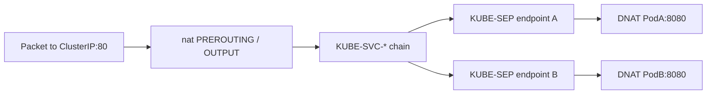

Karakteristik:

- Rules banyak ketika Service dan endpoint banyak.
- Pemilihan endpoint berbasis probabilistic iptables rules.
- Conntrack sangat penting.
- Debugging bisa dilakukan dengan `iptables-save` atau `nft` tergantung backend.
- Update skala besar dapat mahal karena ruleset besar.

Contoh inspeksi:

```bash
iptables-save -t nat | grep KUBE-SVC
iptables-save -t nat | grep payments
conntrack -L | grep 10.96.42.10
```

Namun di cluster modern, iptables mungkin menggunakan nftables backend. Jangan mengasumsikan semua node memakai iptables legacy.

Failure mode umum:

| Symptom | Kemungkinan Penyebab |
|---|---|
| Service kadang ke backend lama | Conntrack masih menyimpan mapping lama |
| Traffic tidak merata | Probabilistic selection + long-lived connections |
| Update endpoint lambat terasa | Ruleset besar atau sync pressure |
| Node tertentu gagal | Rules kube-proxy di node tersebut corrupt/stale |

---

## 9. kube-proxy Mode: IPVS

IPVS adalah Linux kernel load balancer. Dalam mode IPVS, kube-proxy membuat virtual server untuk Service dan real server untuk endpoint.

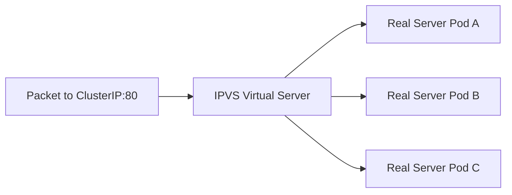

Karakteristik:

- Lebih eksplisit sebagai load balancer kernel.
- Mendukung beberapa scheduler algorithm.
- Cocok untuk Service/endpoint skala besar dibanding iptables di beberapa skenario.
- Tetap memakai iptables untuk beberapa handling tertentu.
- Tetap bergantung pada conntrack dan kernel behavior.

Inspeksi:

```bash
ipvsadm -Ln
ipvsadm -Ln --stats
ipvsadm -Ln --rate
```

Scheduler IPVS dapat memengaruhi distribusi traffic, tetapi jangan salah memahami: distribusi connection tidak selalu sama dengan distribusi request. Untuk HTTP/2, gRPC, persistent connections, dan connection pooling, satu connection bisa membawa banyak request.

Failure mode umum:

- IPVS table tidak sesuai EndpointSlice terbaru.
- Long-lived connection mempertahankan backend lama.
- Scheduler terlihat adil di connection count tetapi tidak adil di request volume.
- Health semantic hanya sebatas endpoint readiness, bukan aplikasi end-to-end.

---

## 10. nftables Mode dan Evolusi Service Proxy

Kubernetes networking terus berevolusi. Pada beberapa sistem, iptables rules sebenarnya diterjemahkan melalui nftables backend. Selain itu, Kubernetes memiliki dukungan service proxy berbasis nftables yang bertujuan mengurangi beberapa kelemahan iptables legacy.

Apa yang perlu diingat:

- Jangan men-debug berdasarkan asumsi tool lama saja.
- Cek mode kube-proxy dan backend rules aktual.
- Di cluster managed, mode dataplane dapat berbeda antar provider atau versi.
- Dokumentasi internal platform harus menyatakan mode service proxy yang berlaku.

Command berguna:

```bash
kubectl -n kube-system get cm kube-proxy -o yaml
kubectl -n kube-system get ds kube-proxy -o yaml
iptables --version
nft list ruleset | less
```

Production principle:

> Observability dan runbook harus mengikuti dataplane aktual, bukan textbook Kubernetes umum.

---

## 11. eBPF Service Load Balancing

Beberapa CNI modern seperti Cilium dapat menggantikan kube-proxy dengan eBPF service load balancing. Dalam model ini, program eBPF di kernel menangani Service translation dan load balancing.

Simplified flow:

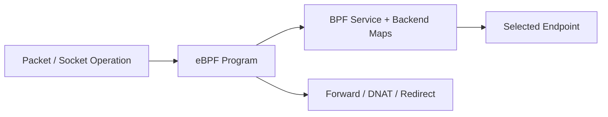

Potensi keuntungan:

- Menghindari rules iptables besar.
- Lebih dekat ke packet/socket path.
- Observability lebih kaya jika platform mendukung flow visibility.
- Bisa mengoptimalkan local endpoint routing.
- Bisa mengurangi overhead pada skala besar.

Trade-off:

- Debugging membutuhkan tool berbeda.
- Implementation-specific behavior lebih kuat.
- Skill kernel/eBPF menjadi lebih relevan.
- Portability antar CNI menurun.
- Policy dan service LB bisa terintegrasi sehingga failure domain berubah.

Contoh inspeksi pada Cilium-style environment:

```bash
cilium service list
cilium bpf lb list
cilium monitor
hubble observe --namespace prod
```

Jangan menyimpulkan "eBPF selalu lebih baik". Pertanyaan arsitektural yang lebih benar:

1. Apakah skala Service/endpoint menekan kube-proxy?
2. Apakah tim punya skill observability eBPF?
3. Apakah CNI menjadi single critical dataplane dependency?
4. Apakah fitur yang digunakan portable?
5. Apakah failure mode sudah masuk runbook?

---

## 12. ClusterIP Service Deep Dive

ClusterIP adalah default Service type. Ia menyediakan virtual IP internal cluster.

```yaml
apiVersion: v1
kind: Service
metadata:
  name: inventory
  namespace: prod
spec:
  type: ClusterIP
  selector:
    app: inventory
  ports:
    - name: http
      port: 80
      targetPort: 8080
```

ClusterIP cocok untuk:

- service-to-service internal calls,
- backend dependency internal,
- internal API behind Gateway/mesh,
- database proxy internal,
- control plane extension internal.

ClusterIP tidak cocok jika:

- client berasal dari luar cluster tanpa Gateway/Ingress/LB,
- perlu L7 routing native,
- perlu cross-cluster discovery tanpa MCS atau mesh,
- perlu stable source IP ke external firewall,
- perlu user-based routing.

Failure mode penting:

- ClusterIP allocated tetapi endpoint kosong.
- ClusterIP reachable dari satu node tetapi tidak dari node lain.
- DNS resolve benar tetapi TCP reset/refused.
- Service points ke wrong `targetPort`.
- Traffic ke ClusterIP terpengaruh NetworkPolicy/CNI policy di backend.

Debugging minimal:

```bash
kubectl get svc inventory -n prod -o yaml
kubectl get endpointslice -n prod -l kubernetes.io/service-name=inventory -o wide
kubectl run -it --rm netshoot --image=nicolaka/netshoot --restart=Never -- sh
curl -v http://inventory.prod.svc.cluster.local
curl -v http://<cluster-ip>:80
```

---

## 13. Headless Service: Ketika Client Menjadi Load Balancer

Headless Service dibuat dengan `clusterIP: None`.

```yaml
apiVersion: v1
kind: Service
metadata:
  name: cassandra
  namespace: data
spec:
  clusterIP: None
  selector:
    app: cassandra
  ports:
    - name: cql
      port: 9042
```

Dengan headless Service, DNS dapat mengembalikan endpoint records secara langsung. Ini umum untuk:

- StatefulSet,
- database cluster,
- quorum system,
- peer discovery,
- broker cluster,
- service yang butuh direct endpoint identity.

Trade-off:

| Aspek | ClusterIP | Headless |
|---|---|---|
| Load balancing | Node dataplane | Client library / DNS behavior |
| Stable virtual IP | Ya | Tidak |
| Per-endpoint identity | Tidak langsung | Lebih natural |
| Client complexity | Lebih rendah | Lebih tinggi |
| DNS cache sensitivity | Medium | Tinggi |

Failure mode:

- Client cache DNS terlalu lama.
- Client tidak melakukan retry ke endpoint lain.
- Endpoint terminating masih dipakai client.
- Uneven load karena client-side resolver behavior.
- Stateful workload scaling menyebabkan stale peer view.

Production principle:

> Gunakan headless Service ketika endpoint identity lebih penting daripada virtual IP abstraction.

---

## 14. NodePort: Useful Primitive, Dangerous Default Exposure

NodePort membuka port pada setiap node. Traffic ke `NodeIP:nodePort` diteruskan ke Service backend.

```yaml
apiVersion: v1
kind: Service
metadata:
  name: webhook
spec:
  type: NodePort
  selector:
    app: webhook
  ports:
    - port: 443
      targetPort: 8443
      nodePort: 30443
```

NodePort berguna sebagai primitive untuk:

- cloud LoadBalancer implementation,
- bare metal LB,
- external appliance integration,
- debugging terbatas,
- legacy integration.

Tetapi secara production, NodePort memiliki risiko:

- port terbuka di banyak node,
- firewall dan security group harus sinkron,
- source IP preservation tergantung traffic policy,
- node tanpa endpoint dapat tetap menerima traffic,
- exposure tidak selalu terlihat oleh app team.

Pertanyaan sebelum memakai NodePort langsung:

1. Apakah setiap node memang boleh menerima traffic ini?
2. Apakah firewall membatasi source?
3. Apakah `externalTrafficPolicy` sudah tepat?
4. Apakah health check tahu node mana yang punya endpoint?
5. Apakah port range diaudit?

---

## 15. LoadBalancer Service: Contract dengan Infrastructure Controller

Service type `LoadBalancer` meminta external load balancer dari provider/controller.

```yaml
apiVersion: v1
kind: Service
metadata:
  name: public-api
  annotations:
    service.beta.kubernetes.io/aws-load-balancer-scheme: internet-facing
spec:
  type: LoadBalancer
  selector:
    app: public-api
  ports:
    - name: https
      port: 443
      targetPort: 8443
```

Ini bukan hanya Kubernetes networking. Ini juga contract dengan cloud provider atau load balancer controller.

Hidden variables:

- LB type: NLB, ALB, GLB, internal LB, public LB.
- Health check behavior.
- Target type: node vs pod/IP.
- Cross-zone balancing.
- Security group/firewall.
- Source IP preservation.
- Proxy protocol.
- Annotation compatibility.
- Provider-specific lifecycle.

Failure mode:

- Kubernetes Service Ready, tetapi cloud LB belum provisioned.
- LB health check berbeda dari application readiness.
- LB targets node yang tidak punya local endpoint.
- Annotation berubah tetapi infrastructure tidak reconcile sesuai ekspektasi.
- Deleting Service menghapus LB lebih cepat dari DNS TTL.

Production principle:

> Treat `type: LoadBalancer` as infrastructure provisioning, not merely service exposure.

Untuk L7 public HTTP, sering lebih baik memakai Gateway API atau Ingress di atas LoadBalancer, bukan satu LB per Service.

---

## 16. ExternalName: DNS Alias, Bukan Network Proxy

ExternalName Service mengembalikan CNAME ke nama external.

```yaml
apiVersion: v1
kind: Service
metadata:
  name: external-billing
  namespace: prod
spec:
  type: ExternalName
  externalName: billing.partner.example.com
```

Ini tidak membuat endpoint, iptables, IPVS, atau proxy. Ia hanya DNS-level alias.

Cocok untuk:

- migrasi sementara,
- alias internal ke external dependency,
- standardizing service names.

Risiko:

- NetworkPolicy berbasis Pod/Service tidak otomatis mengontrol external target.
- TLS hostname mismatch jika client memakai nama Service tetapi server cert untuk external domain.
- Observability cluster melihat DNS alias, bukan actual backend semantics.
- Tidak ada Kubernetes readiness.
- Tidak ada endpoint health.

Production principle:

> ExternalName adalah naming convenience, bukan traffic management layer.

---

## 17. Session Affinity

Service mendukung session affinity berbasis client IP.

```yaml
spec:
  sessionAffinity: ClientIP
  sessionAffinityConfig:
    clientIP:
      timeoutSeconds: 10800
```

Ini membuat traffic dari client IP yang sama cenderung diarahkan ke endpoint yang sama selama timeout.

Gunakan dengan hati-hati.

Cocok untuk:

- legacy app yang masih menyimpan session lokal,
- cache affinity terbatas,
- transitional architecture.

Risiko:

- Load imbalance.
- Client NAT membuat banyak user terlihat sebagai satu IP.
- Rolling update lebih sulit drain.
- Affinity tidak memahami user/session application-level.
- Tidak cocok untuk traffic dari sidecar/proxy shared source.

Better architecture:

- stateless app,
- external session store,
- application-level consistent hashing jika benar-benar perlu,
- mesh/L7 routing jika affinity harus berdasarkan header/cookie.

---

## 18. InternalTrafficPolicy

`internalTrafficPolicy` mengatur bagaimana traffic internal cluster ke Service memilih endpoint.

```yaml
spec:
  internalTrafficPolicy: Local
```

Mode umum:

- `Cluster`: traffic bisa diarahkan ke endpoint mana pun di cluster.
- `Local`: traffic internal hanya diarahkan ke endpoint lokal pada node yang sama.

Manfaat `Local`:

- mengurangi cross-node traffic,
- menjaga locality,
- mengurangi latency,
- mengurangi biaya cross-zone pada beberapa environment,
- berguna untuk DaemonSet-style local services.

Risiko `Local`:

- jika tidak ada endpoint lokal, traffic gagal.
- availability menurun jika endpoint tidak tersebar merata.
- scheduler placement menjadi bagian dari availability contract.
- HPA/rollout dapat mengubah locality behavior.

Gunakan `Local` ketika:

- service memang node-local,
- setiap node yang menjadi client memiliki local endpoint,
- failure semantics sudah diterima,
- ada observability untuk endpoint locality.

Jangan gunakan hanya karena "lebih cepat" tanpa memahami consequence.

---

## 19. ExternalTrafficPolicy dan Source IP Preservation

`externalTrafficPolicy` penting untuk traffic dari luar cluster.

```yaml
spec:
  type: LoadBalancer
  externalTrafficPolicy: Local
```

Mode:

- `Cluster`: external traffic dapat diteruskan ke endpoint di node mana pun; source IP sering terkena SNAT.
- `Local`: node hanya mengirim ke local endpoints; source IP dapat dipertahankan pada banyak implementasi.

Trade-off utama:

| Mode | Availability | Source IP | Load Distribution | Risk |
|---|---|---|---|---|
| `Cluster` | Lebih mudah | Bisa hilang/SNAT | Lebih fleksibel | Audit source IP lemah |
| `Local` | Bergantung endpoint lokal | Lebih mungkin preserved | Bergantung LB target health | Node tanpa endpoint harus tidak menerima traffic |

ExternalTrafficPolicy Local sangat berguna untuk:

- audit log client IP,
- WAF/security analytics,
- rate limiting by client IP,
- compliance requirement,
- geo/source-aware app behavior.

Namun ia memerlukan health check yang benar. Cloud LB harus hanya mengirim traffic ke node yang punya local endpoint.

Failure mode:

- Source IP preserved, tetapi traffic drop pada node tanpa endpoint.
- LB health check tidak cocok dengan local endpoint availability.
- Rolling update mengurangi endpoint lokal dan menyebabkan blackhole sementara.
- Autoscaling mengubah node distribution dan mengganggu traffic balance.

---

## 20. Traffic Distribution: Connection, Request, dan Workload Reality

Banyak engineer berharap Service membagi traffic "rata". Ini asumsi lemah.

Service dataplane umumnya membagi pada level connection/flow, bukan request semantic.

Contoh:

- HTTP/1.1 keep-alive: banyak request lewat satu TCP connection.
- HTTP/2: banyak stream lewat satu connection.
- gRPC: long-lived connection sangat umum.
- Database connection pool: koneksi stabil ke endpoint tertentu.
- Kafka/client broker: client punya topology sendiri.

Akibatnya, 50/50 endpoint selection tidak berarti 50/50 request volume.

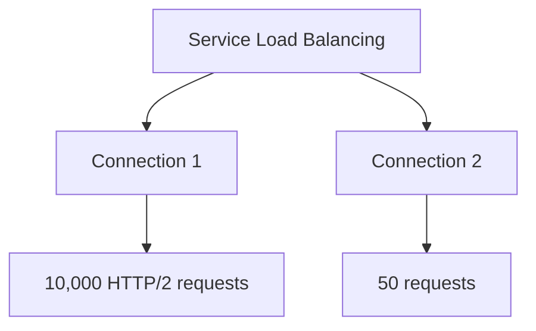

Untuk traffic splitting berbasis request, gunakan:

- Gateway API `HTTPRoute` weighted backend,
- service mesh traffic splitting,
- application-level routing,
- progressive delivery controller.

Service adalah primitive L4. Jangan memaksanya menjadi L7 rollout controller.

---

## 21. Conntrack: Memory yang Sering Dilupakan

Connection tracking menyimpan mapping NAT/flow. Ketika Service endpoint berubah, existing connections tidak selalu pindah ke endpoint baru.

Contoh incident:

1. Backend Pod lama seharusnya sudah tidak menerima traffic.
2. EndpointSlice sudah update.
3. kube-proxy rules sudah update.
4. Tetapi existing connection masih diarahkan ke backend lama karena conntrack.

Ini bukan selalu bug. Ini sering expected behavior.

Command:

```bash
conntrack -L | grep <service-ip>
conntrack -L | grep <pod-ip>
conntrack -S
```

Risiko conntrack:

- table penuh,
- stale mapping,
- UDP timeout surprises,
- long-lived TCP connection,
- asymmetric routing,
- NAT port exhaustion.

Monitoring penting:

- conntrack table usage,
- drops due to conntrack full,
- TCP retransmits,
- NAT errors,
- node-level packet drops.

Production principle:

> Endpoint update is not the same as connection migration.

---

## 22. Readiness, Termination, dan Draining

Service hanya sebaik endpoint readiness signal-nya.

Jika Pod marked Ready terlalu awal, Service akan mengirim traffic sebelum app benar-benar siap. Jika Pod termination tidak menangani draining, Service dapat terus mengirim traffic ke Pod yang sedang shutdown atau client connection bisa terputus.

Minimum production pattern:

```yaml
readinessProbe:
  httpGet:
    path: /ready
    port: 8080
  periodSeconds: 5
  failureThreshold: 2

lifecycle:
  preStop:
    exec:
      command: ["/bin/sh", "-c", "sleep 10"]
terminationGracePeriodSeconds: 45
```

Tetapi `sleep` bukan solusi universal. Better pattern:

1. App menerima shutdown signal.
2. App berhenti menerima request baru.
3. Readiness berubah false.
4. EndpointSlice update terjadi.
5. LB/proxy berhenti memilih endpoint.
6. Existing requests selesai.
7. Process exit sebelum grace timeout.

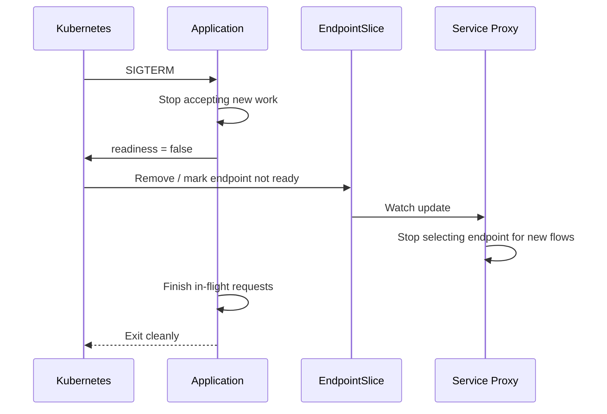

Key risk:

- Endpoint removal is eventually consistent.
- Cloud LB health check has its own delay.
- Mesh proxy has its own drain timeout.
- App shutdown timeout may be shorter than network drain.

---

## 23. Service Topology and Zone Awareness

Service traffic can cross node, rack, zone, or region boundaries depending on cluster topology and provider. Topology-aware routing attempts to keep traffic local where practical.

Why this matters:

- Cross-zone traffic may cost money.
- Cross-zone latency may hurt p99.
- Regional failure isolation requires locality awareness.
- Stateful dependency may prefer local replicas.

However, locality is not free:

- Local endpoints may be overloaded.
- Endpoint distribution may be uneven.
- Availability may drop if locality is too strict.
- Autoscaling can change endpoint topology dynamically.

Decision rule:

> Prefer locality as an optimization, not as a hidden correctness requirement, unless the architecture explicitly models locality as a hard invariant.

Questions:

1. Are endpoints evenly spread across zones?
2. Does HPA preserve zone balance?
3. Does rollout strategy preserve local capacity?
4. What happens if one zone has clients but no endpoints?
5. Is cross-zone fallback allowed?

---

## 24. Service Without Selector

A Service can exist without a selector. In that case, you can manually create EndpointSlices.

Use cases:

- external database represented as internal Service,
- migration from VM to Kubernetes,
- service abstraction over non-Pod backends,
- blue/green migration across platforms,
- static backend integration.

Example Service:

```yaml
apiVersion: v1
kind: Service
metadata:
  name: legacy-billing
  namespace: prod
spec:
  ports:
    - name: http
      port: 80
      targetPort: 8080
```

Manual EndpointSlice:

```yaml
apiVersion: discovery.k8s.io/v1
kind: EndpointSlice
metadata:
  name: legacy-billing-1
  namespace: prod
  labels:
    kubernetes.io/service-name: legacy-billing
addressType: IPv4
ports:
  - name: http
    protocol: TCP
    port: 8080
endpoints:
  - addresses:
      - "10.10.20.15"
```

Risks:

- Kubernetes does not manage backend lifecycle.
- Readiness must be represented manually or externally.
- Network reachability depends on routing outside Pod CIDR.
- Security policy may not apply like Pod endpoints.
- Observability attribution weaker.

Production principle:

> Selectorless Service is a migration/integration tool. Treat it as manually maintained routing state.

---

## 25. Service and NetworkPolicy Interaction

Service does not bypass NetworkPolicy. NetworkPolicy is typically enforced at Pod ingress/egress by the CNI.

Misleading scenario:

```bash
nslookup payments.prod.svc.cluster.local  # works
curl payments.prod.svc.cluster.local      # times out
```

Possible cause:

- DNS allowed,
- Service resolves,
- kube-proxy DNAT works,
- but NetworkPolicy blocks traffic to selected backend Pod.

Debug model:

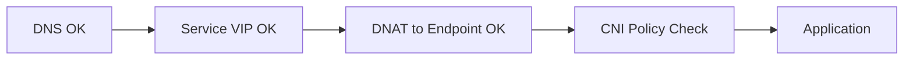

Questions:

1. Is egress from client namespace allowed?
2. Is ingress to backend namespace allowed?
3. Is DNS egress allowed?
4. Does policy select the intended Pod labels?
5. Does CNI enforce NetworkPolicy at all?
6. Are there CNI-specific policies with higher expressiveness?

NetworkPolicy will be covered deeply in Part 028, but remember from now: Service reachability and policy reachability are different layers.

---

## 26. Service and Gateway API

Gateway API routes usually point to Services via `backendRefs`.

```yaml
apiVersion: gateway.networking.k8s.io/v1
kind: HTTPRoute
metadata:
  name: payments
spec:
  parentRefs:
    - name: public-gateway
  rules:
    - backendRefs:
        - name: payments
          port: 80
```

Gateway API does not eliminate Service semantics. It builds on Service as backend abstraction.

Implication:

- If Service has no endpoints, HTTPRoute can attach but backend fails.
- If Service targetPort is wrong, Gateway routes to wrong port.
- If Service policy preserves/drops source IP differently, gateway behavior may differ.
- If mesh uses Service as backend identity, endpoint readiness still matters.

Mental model:

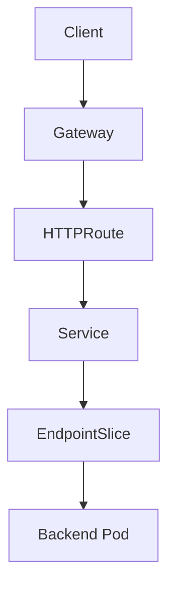

Gateway API adds L7 routing contract. Service remains L4 backend contract.

---

## 27. Service and Service Mesh

Service mesh also relies heavily on Kubernetes Service and EndpointSlice state. Mesh control planes watch Kubernetes resources and translate them into proxy configuration.

Typical flow:

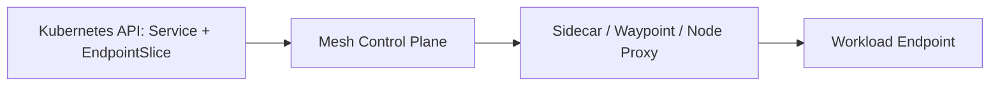

Mesh can add:

- mTLS,
- identity,
- retries,
- timeouts,
- circuit breaking,
- L7 routing,
- telemetry,
- authorization.

But mesh does not remove Service correctness problems:

- wrong selector still wrong,
- wrong port still wrong,
- endpoint readiness still important,
- DNS still relevant for many clients,
- conntrack may still matter depending dataplane.

In mesh environments, debugging must separate:

1. Kubernetes Service resolution.
2. Mesh service discovery.
3. Proxy configuration.
4. mTLS identity.
5. Authorization policy.
6. Backend application behavior.

---

## 28. Production Debugging Ladder for Service Issues

Gunakan ladder ini agar tidak debugging secara random.

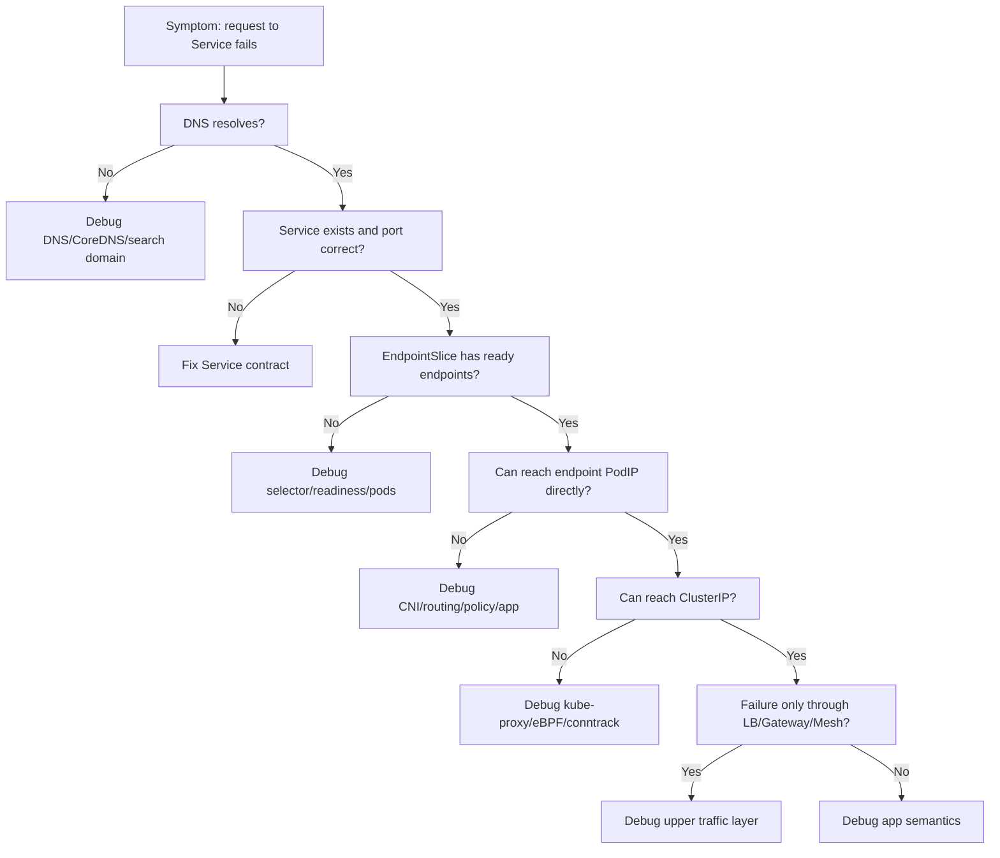

Commands:

```bash
# 1. Service contract
kubectl get svc -n prod payments -o yaml

# 2. Endpoint inventory
kubectl get endpointslice -n prod -l kubernetes.io/service-name=payments -o yaml

# 3. Pod readiness and placement
kubectl get pod -n prod -l app=payments -o wide

# 4. DNS from same namespace
kubectl run -n prod -it --rm debug --image=nicolaka/netshoot --restart=Never -- sh
nslookup payments
nslookup payments.prod.svc.cluster.local

# 5. Direct tests
curl -v http://payments:80/health
curl -v http://<cluster-ip>:80/health
curl -v http://<pod-ip>:8080/health

# 6. Node dataplane
kubectl -n kube-system logs ds/kube-proxy
iptables-save -t nat | grep KUBE-SVC | head
ipvsadm -Ln
conntrack -S
```

Rule:

> Always test DNS name, ClusterIP, and PodIP separately. Each proves a different layer.

---

## 29. Failure Catalogue

### 29.1 Service Has No Endpoints

Symptoms:

- DNS works.
- ClusterIP exists.
- Requests timeout, reset, or return 503 depending caller/proxy.
- `kubectl describe svc` shows no endpoints.

Root causes:

- selector typo,
- Pod labels changed,
- readiness probe failing,
- namespace mismatch,
- EndpointSlice controller issue,
- app not exposing target port.

Fix strategy:

1. Compare Service selector with Pod labels.
2. Check readiness.
3. Check container port/named port.
4. Check EndpointSlice labels.
5. Avoid patching Service blindly.

---

### 29.2 Service Routes to Wrong Version

Symptoms:

- Some requests hit old deployment.
- Rollout appears complete.
- EndpointSlice still includes old Pod or connection persists.

Root causes:

- label selector too broad,
- old ReplicaSet still has matching labels,
- conntrack existing connection,
- client connection pooling,
- mesh route still includes subset,
- Gateway weighted backend not updated.

Fix strategy:

- tighten labels,
- use version labels carefully,
- inspect EndpointSlice,
- inspect live connections,
- check Gateway/mesh config separately.

---

### 29.3 Source IP Missing

Symptoms:

- App logs node IP, proxy IP, or internal IP instead of real client.
- Rate limiting fails.
- Audit trail weak.

Root causes:

- `externalTrafficPolicy: Cluster`,
- SNAT by kube-proxy/CNI/cloud LB,
- proxy does not forward `X-Forwarded-For`,
- app trusts wrong header,
- multiple proxy layers.

Fix strategy:

- decide whether L4 source IP or L7 forwarded header is required,
- use `externalTrafficPolicy: Local` when appropriate,
- configure Gateway/proxy trusted hops,
- document audit boundary.

---

### 29.4 Uneven Load

Symptoms:

- One backend overloaded.
- Others idle.
- Service endpoint count looks healthy.

Root causes:

- long-lived connections,
- HTTP/2/gRPC multiplexing,
- session affinity,
- client connection pool imbalance,
- topology-local routing,
- insufficient endpoint distribution.

Fix strategy:

- analyze requests, not only connections,
- tune client pool,
- use L7 load balancing if needed,
- scale based on per-pod metrics,
- consider connection draining.

---

### 29.5 Node-Specific Service Failure

Symptoms:

- Same Service works from one node but fails from another.
- Pods on affected node fail all ClusterIP calls.

Root causes:

- kube-proxy failed on one node,
- eBPF maps stale,
- iptables rules corrupt,
- conntrack full,
- CNI route issue,
- node firewall drift.

Fix strategy:

1. Identify source node.
2. Compare kube-proxy logs.
3. Compare dataplane rules.
4. Check conntrack and kernel drops.
5. Cordon node if necessary.
6. Recycle dataplane agent only with controlled impact.

---

## 30. Decision Framework: Which Service Type?

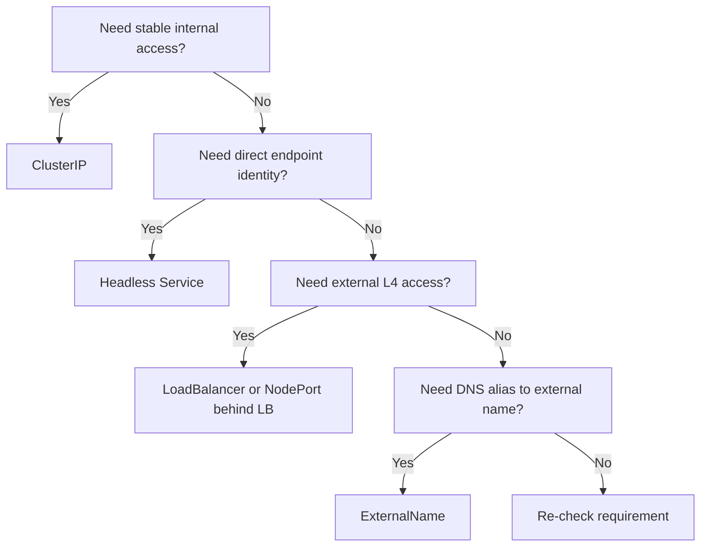

Better decision table:

| Requirement | Prefer | Avoid |
|---|---|---|
| Internal stateless API | ClusterIP | Headless unless client-side LB needed |
| Stateful peer discovery | Headless | ClusterIP-only abstraction |
| Public HTTP API | Gateway API + LB | Raw NodePort |
| External L4 protocol | LoadBalancer | Ingress-only model |
| Stable client IP audit | LB + externalTrafficPolicy Local or trusted L7 headers | Blind SNAT path |
| Legacy external dependency naming | ExternalName or selectorless Service | Pretending it has readiness |
| Cross-cluster service | MCS/mesh/global routing | Manual ExternalName sprawl |

---

## 31. Practice Lab: Service Dataplane Investigation

### 31.1 Setup

Create namespace:

```bash
kubectl create ns svc-lab
```

Deploy backend:

```yaml
apiVersion: apps/v1
kind: Deployment
metadata:
  name: echo
  namespace: svc-lab
spec:
  replicas: 3
  selector:
    matchLabels:
      app: echo
  template:
    metadata:
      labels:
        app: echo
    spec:
      containers:
        - name: echo
          image: hashicorp/http-echo:1.0
          args:
            - "-text=hello-from-echo"
          ports:
            - name: http
              containerPort: 5678
          readinessProbe:
            httpGet:
              path: /
              port: 5678
```

Create Service:

```yaml
apiVersion: v1
kind: Service
metadata:
  name: echo
  namespace: svc-lab
spec:
  selector:
    app: echo
  ports:
    - name: http
      port: 80
      targetPort: http
```

### 31.2 Observe API State

```bash
kubectl get svc -n svc-lab echo -o wide
kubectl get endpointslice -n svc-lab -l kubernetes.io/service-name=echo -o yaml
kubectl get pod -n svc-lab -l app=echo -o wide
```

### 31.3 Test from Client

```bash
kubectl run -n svc-lab -it --rm client --image=nicolaka/netshoot --restart=Never -- sh
curl -v http://echo
curl -v http://echo.svc-lab.svc.cluster.local
```

### 31.4 Break Selector

Patch Service selector to wrong label:

```bash
kubectl patch svc -n svc-lab echo -p '{"spec":{"selector":{"app":"wrong"}}}'
```

Observe:

```bash
kubectl get endpointslice -n svc-lab -l kubernetes.io/service-name=echo
curl -v http://echo
```

Learning:

- DNS and Service object can exist while backend inventory is empty.
- Failure is not DNS, not CNI, not app; it is selector-to-endpoint binding.

### 31.5 Restore and Break targetPort

```bash
kubectl patch svc -n svc-lab echo -p '{"spec":{"selector":{"app":"echo"}}}'
```

Edit `targetPort` to wrong value and observe:

```bash
kubectl edit svc -n svc-lab echo
```

Learning:

- Endpoint exists but traffic fails at application port.
- Endpoint inventory must be inspected with port detail.

---

## 32. Production Checklist

Before approving a Service change:

- [ ] Is Service type appropriate?
- [ ] Is selector intentionally narrow?
- [ ] Are Pod labels stable and owned?
- [ ] Are ports named consistently?
- [ ] Is `targetPort` correct?
- [ ] Are readiness probes semantically meaningful?
- [ ] Is traffic policy specified or default intentionally accepted?
- [ ] Is source IP requirement documented?
- [ ] Is external exposure reviewed?
- [ ] Is NetworkPolicy impact known?
- [ ] Is Gateway/mesh dependency known?
- [ ] Is observability available at Service, endpoint, and node dataplane layer?
- [ ] Is rollback safe with conntrack/long-lived connections?

---

## 33. Anti-Patterns

### 33.1 Broad Selector

Bad:

```yaml
selector:
  app: api
```

If multiple versions/environments share `app: api`, traffic can leak.

Better:

```yaml
selector:
  app.kubernetes.io/name: payments
  app.kubernetes.io/instance: payments-prod
```

---

### 33.2 Service Per Deployment Version Without Clear Routing Layer

Creating `payments-v1`, `payments-v2`, `payments-v3` Services without a clear Gateway/mesh/application routing model leads to client sprawl.

Better:

- stable Service for default path,
- Gateway API or mesh for controlled traffic split,
- version Services only when they represent intentional backend contracts.

---

### 33.3 NodePort as Public API

Bad:

- expose NodePort directly to internet,
- rely on node firewall manually,
- no TLS termination boundary,
- no L7 observability.

Better:

- cloud/bare-metal LB,
- Gateway API,
- explicit firewall/security group,
- TLS and auth boundary.

---

### 33.4 Assuming Service Load Balancing Means Request Balancing

Bad assumption:

> 10 Pods means each receives 10% of requests.

Reality:

- connection pooling,
- HTTP/2 multiplexing,
- session affinity,
- topology,
- client behavior.

Measure actual per-Pod request rate.

---

### 33.5 Debugging from Outside Only

Testing only through public endpoint hides layers.

Better:

- test DNS inside namespace,
- test ClusterIP,
- test PodIP,
- test NodePort/LB,
- test Gateway/mesh separately.

---

## 34. Key Invariants

Service engineering invariants:

1. A Service without ready endpoints is only a name and virtual IP.
2. DNS success does not prove backend reachability.
3. ClusterIP reachability does not prove Gateway/mesh correctness.
4. PodIP reachability does not prove Service dataplane correctness.
5. Endpoint updates do not migrate existing connections automatically.
6. Service load balancing is usually flow/connection-level, not request-level.
7. Source IP preservation is a design choice, not a default guarantee.
8. Traffic locality changes availability semantics.
9. LoadBalancer Service is infrastructure provisioning.
10. Service is L4 contract; L7 traffic management belongs elsewhere.

---

## 35. Self-Test

Jawab tanpa melihat catatan:

1. Mengapa Service bisa resolve DNS tetapi request tetap timeout?
2. Apa perbedaan `port`, `targetPort`, dan named port?
3. Mengapa EndpointSlice lebih penting daripada Service YAML saat debugging?
4. Bagaimana kube-proxy iptables memilih backend?
5. Apa perbedaan mental model iptables, IPVS, dan eBPF service load balancing?
6. Mengapa gRPC dapat membuat distribusi traffic tidak merata?
7. Kapan `externalTrafficPolicy: Local` berguna?
8. Risiko apa yang muncul dari `internalTrafficPolicy: Local`?
9. Mengapa conntrack dapat membuat backend lama masih menerima traffic?
10. Kapan headless Service lebih baik daripada ClusterIP?
11. Mengapa ExternalName bukan traffic management?
12. Bagaimana cara membuktikan masalah ada di DNS, Service, Endpoint, CNI, policy, atau app?

---

## 36. What Good Looks Like

Engineer yang kuat di topik ini tidak hanya berkata:

> "Cek Service dan endpoint."

Mereka bisa berkata:

> "Kita perlu memisahkan DNS resolution, Service VIP translation, EndpointSlice readiness, node-local dataplane, policy enforcement, dan application port. Saya akan test DNS name, ClusterIP, dan PodIP dari namespace yang sama; lalu bandingkan endpoint inventory dan rules/proxy state pada node sumber. Jika hanya external traffic yang gagal, saya akan lanjut ke externalTrafficPolicy, LB health check, source IP, dan Gateway layer."

Itulah level reasoning yang dibutuhkan untuk production-grade Kubernetes traffic engineering.

---

## 37. References

- Kubernetes Documentation — Services: `https://kubernetes.io/docs/concepts/services-networking/service/`
- Kubernetes Documentation — Virtual IPs and Service Proxies: `https://kubernetes.io/docs/reference/networking/virtual-ips/`
- Kubernetes Documentation — EndpointSlices: `https://kubernetes.io/docs/concepts/services-networking/endpoint-slices/`
- Kubernetes Documentation — Service Internal Traffic Policy: `https://kubernetes.io/docs/concepts/services-networking/service-traffic-policy/`
- Kubernetes Documentation — Topology Aware Routing: `https://kubernetes.io/docs/concepts/services-networking/topology-aware-routing/`
- Kubernetes Documentation — kube-proxy command reference: `https://kubernetes.io/docs/reference/command-line-tools-reference/kube-proxy/`
- Cilium Documentation — Kubernetes Service Load-Balancing and Service Mesh topics: `https://docs.cilium.io/`

---

## 38. Ringkasan

Service adalah abstraction yang terlihat sederhana tetapi berada di pusat Kubernetes traffic path. Untuk memahami Service secara production-grade, jangan berhenti pada YAML. Pahami bagaimana Service selector menghasilkan EndpointSlice, bagaimana service proxy memprogram node dataplane, bagaimana conntrack mempertahankan flow state, bagaimana traffic policy memengaruhi source IP dan locality, serta bagaimana Gateway API dan service mesh tetap bergantung pada Service sebagai backend contract.

Part berikutnya akan masuk ke **DNS, Service Discovery, and Identity Resolution**: dependency yang sering dianggap trivial, tetapi sering menjadi akar incident latency, intermittent timeout, dan service discovery drift.
