# Part 006 — DNS, Service Discovery, and Identity Resolution

## 1. Tujuan Part Ini

DNS di Kubernetes sering diperlakukan sebagai detail kecil: "Service punya nama DNS". Di production, itu pemahaman yang berbahaya. DNS adalah dependency kritis pada hampir semua service-to-service call. Jika DNS lambat, intermittent, salah cache, atau overloaded, seluruh platform bisa tampak seperti mengalami network instability padahal akar masalahnya adalah name resolution.

Target setelah part ini:

1. Anda memahami bagaimana Kubernetes membentuk DNS records untuk Service dan Pod.
2. Anda bisa menjelaskan hubungan antara kubelet, Pod `resolv.conf`, CoreDNS, Service, dan EndpointSlice.
3. Anda memahami `ClusterFirst`, search domains, dan `ndots` sebagai penyebab query amplification.
4. Anda bisa membedakan ClusterIP Service DNS, headless Service DNS, StatefulSet DNS, dan Pod DNS.
5. Anda bisa menilai kapan NodeLocal DNSCache dibutuhkan.
6. Anda bisa men-debug DNS timeout, wrong resolution, stale cache, dan external DNS dependency.

Kaufman framing:

- **Deconstruct** DNS menjadi client resolver, Pod DNS config, CoreDNS service, CoreDNS plugin chain, Kubernetes API watch, upstream resolver, dan cache.
- **Self-correct** dengan memisahkan failure pada name resolution, TCP connect, TLS hostname, dan application routing.
- **Deliberate practice** dengan membuat query dari namespace berbeda, memodifikasi `ndots`, membandingkan ClusterIP vs headless resolution, dan mengamati CoreDNS metrics/logs.

---

## 2. Mental Model: DNS adalah Control Plane Data yang Dikonsumsi Saat Runtime

Service discovery di Kubernetes berjalan melalui DNS dan API watch. Untuk mayoritas aplikasi, DNS adalah interface utama.

```mermaid
flowchart TD
    SVC[Service Object] --> API[Kubernetes API]
    POD[Pod / EndpointSlice] --> API
    API --> CoreDNS[CoreDNS Kubernetes Plugin]
    Kubelet[kubelet] --> Resolv[/etc/resolv.conf in Pod]
    App[Application] --> Resolver[libc/JVM/Go/Node Resolver]
    Resolver --> Resolv
    Resolver --> CoreDNS
    CoreDNS --> Answer[DNS Answer]
    Answer --> App
```

Key idea:

> Service discovery is not only "CoreDNS answers a name". It is an end-to-end contract involving Kubernetes API state, CoreDNS plugin behavior, Pod resolver config, client runtime caching, and network reachability to DNS endpoints.

Jika salah satu layer rusak, symptom bisa muncul sebagai:

- intermittent timeout,
- high p99 latency,
- connection refused ke IP lama,
- wrong service namespace,
- gRPC channel tidak reconnect,
- TLS hostname mismatch,
- atau cascading failure ketika semua Pod melakukan retry DNS bersamaan.

---

## 3. Kubernetes DNS Record Model

Kubernetes membuat DNS records untuk Service dan Pod.

Untuk Service normal:

```txt
<service>.<namespace>.svc.<cluster-domain>
```

Contoh:

```txt
payments.prod.svc.cluster.local
```

Dari Pod di namespace yang sama, biasanya bisa dipanggil dengan:

```txt
payments
```

Dari namespace lain:

```txt
payments.prod
payments.prod.svc
payments.prod.svc.cluster.local
```

Untuk ClusterIP Service, DNS record biasanya mengarah ke ClusterIP.

Untuk headless Service, DNS dapat mengarah ke endpoint Pod secara langsung.

Untuk Pod records, Kubernetes juga dapat menyediakan records tertentu, tetapi dalam desain aplikasi modern, jangan jadikan Pod DNS sebagai default abstraction kecuali Anda memang butuh endpoint identity.

---

## 4. Service DNS: ClusterIP Path

Service normal:

```yaml
apiVersion: v1
kind: Service
metadata:
  name: payments
  namespace: prod
spec:
  selector:
    app: payments
  ports:
    - name: http
      port: 80
      targetPort: 8080
```

Resolution:

```bash
nslookup payments.prod.svc.cluster.local
```

Expected conceptual answer:

```txt
payments.prod.svc.cluster.local -> 10.96.42.10
```

Packet path setelah DNS:

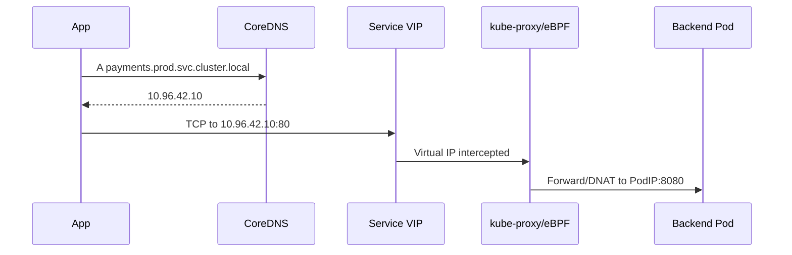

Important distinction:

- DNS only returns the Service virtual IP.
- DNS does not prove backend Pod is Ready.
- DNS does not prove Service dataplane works.
- DNS does not prove application protocol works.

---

## 5. Headless Service DNS: Endpoint Discovery

Headless Service:

```yaml
apiVersion: v1
kind: Service
metadata:
  name: kafka
  namespace: data
spec:
  clusterIP: None
  selector:
    app: kafka
  ports:
    - name: broker
      port: 9092
```

Resolution can return endpoint addresses rather than a virtual ClusterIP.

```bash
dig kafka.data.svc.cluster.local A
```

Headless Service is useful when clients need endpoint identity, such as:

- Kafka brokers,
- Cassandra nodes,
- ZooKeeper/etcd-style peers,
- StatefulSet members,
- custom sharded systems.

But this shifts responsibility:

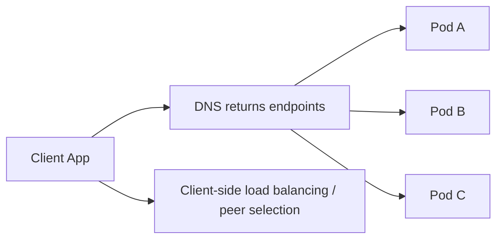

Risks:

- client resolver caching becomes load balancing behavior,
- stale DNS sends traffic to removed endpoint,
- uneven distribution,
- app must handle endpoint churn,
- endpoint identity and certificate identity must align.

Production principle:

> Use headless Service when direct endpoint identity is a requirement, not as a generic performance optimization.

---

## 6. StatefulSet DNS

StatefulSet commonly pairs with headless Service to give each replica a stable DNS identity.

Pattern:

```txt
<pod-name>.<headless-service>.<namespace>.svc.<cluster-domain>
```

Example:

```txt
kafka-0.kafka.data.svc.cluster.local
kafka-1.kafka.data.svc.cluster.local
kafka-2.kafka.data.svc.cluster.local
```

This matters for systems that require stable member identity.

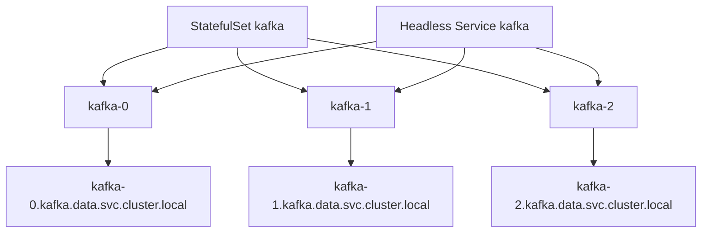

Failure mode:

- Application assumes identity persists, but storage or certificate does not.
- DNS record exists but Pod not semantically ready.
- Peer list stale after scale down.
- TLS SAN does not include stable DNS name.
- Client caches old endpoint after rescheduling.

Good practice:

- align DNS identity, workload identity, storage identity, and certificate identity,
- avoid using StatefulSet DNS as a shortcut for stateless apps,
- design peer discovery with churn and delayed propagation in mind.

---

## 7. Pod `/etc/resolv.conf`

Inside a Pod, kubelet configures DNS settings based on Pod `dnsPolicy`, cluster DNS, and node settings.

Typical Pod `resolv.conf`:

```txt
search prod.svc.cluster.local svc.cluster.local cluster.local example.internal
nameserver 10.96.0.10
options ndots:5
```

Fields:

- `nameserver`: usually Cluster DNS Service IP or NodeLocal DNS IP.
- `search`: suffixes tried for short names.
- `ndots`: threshold that determines whether a name is considered absolute before search expansion.

This file heavily influences runtime behavior.

Example:

```bash
kubectl exec -n prod deploy/frontend -- cat /etc/resolv.conf
```

Do not assume all Pods have identical DNS config. Differences can come from:

- `dnsPolicy`,
- `dnsConfig`,
- `hostNetwork`,
- node configuration,
- cluster DNS customization,
- admission controller mutation,
- service mesh sidecar DNS capture.

---

## 8. DNS Policy

Common `dnsPolicy` values:

| Policy | Meaning | Common Use |
|---|---|---|
| `ClusterFirst` | Use cluster DNS first; standard for normal Pods | Default service discovery |
| `Default` | Inherit node DNS config | Special workloads |
| `ClusterFirstWithHostNet` | Cluster DNS for hostNetwork Pods | DaemonSets needing host network |
| `None` | Custom DNS config required | Controlled resolver behavior |

Example custom DNS:

```yaml
spec:
  dnsPolicy: None
  dnsConfig:
    nameservers:
      - 10.96.0.10
    searches:
      - prod.svc.cluster.local
      - svc.cluster.local
      - cluster.local
    options:
      - name: ndots
        value: "2"
```

Use `dnsPolicy: None` carefully. It can make Pods non-portable across clusters.

Production principle:

> DNS customization is platform behavior. It should be standardized and reviewed, not copied per Deployment casually.

---

## 9. Search Domains and Short Names

From a Pod in namespace `prod`, lookup `payments` may expand into multiple candidates:

```txt
payments.prod.svc.cluster.local
payments.svc.cluster.local
payments.cluster.local
payments.<node-or-org-domain>
payments
```

This is convenient but dangerous.

Pros:

- short names are ergonomic,
- same-namespace calls are clean,
- manifests/configs are less verbose.

Cons:

- ambiguous cross-namespace calls,
- accidental dependency on namespace,
- query amplification,
- unexpected external lookup,
- slower failure for nonexistent names.

Recommendation:

| Scenario | Name Style |
|---|---|
| Same namespace internal call | `service-name` acceptable |
| Cross namespace call | `service.namespace.svc` or FQDN |
| Security-sensitive dependency | FQDN |
| Multi-cluster / mesh / federation | explicit naming contract |
| External dependency | real external FQDN, not ambiguous short name |

---

## 10. `ndots`: Small Option, Big Incident Surface

`ndots` controls whether resolver first treats a name as absolute or tries search domain expansion.

Default Kubernetes configs often use high `ndots`, commonly `ndots:5`.

Example query:

```txt
api.stripe.com
```

With high `ndots`, resolver may first try search-expanded names such as:

```txt
api.stripe.com.prod.svc.cluster.local
api.stripe.com.svc.cluster.local
api.stripe.com.cluster.local
api.stripe.com.example.internal
api.stripe.com
```

This can amplify DNS queries and add latency for external names.

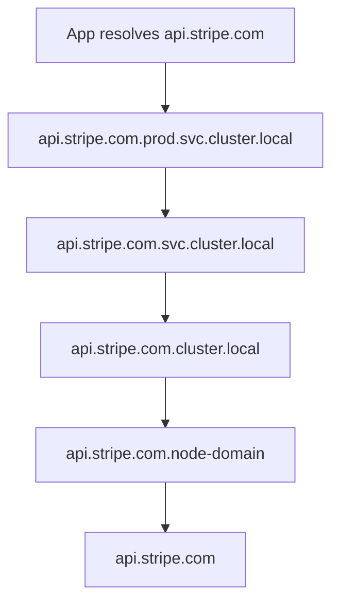

Mitigations:

- use trailing dot for absolute names in latency-sensitive configs:

```txt
api.stripe.com.
```

- tune `ndots` for specific workloads when justified,
- use NodeLocal DNSCache,
- reduce unnecessary external DNS calls,
- cache at application level carefully,
- prefer connection reuse after resolution.

Do not globally change `ndots` without testing. Some internal lookup behavior may depend on current search semantics.

---

## 11. CoreDNS Architecture

CoreDNS is plugin-based. In Kubernetes, it typically runs as a Deployment behind a Service such as `kube-dns` in `kube-system`.

Conceptual architecture:

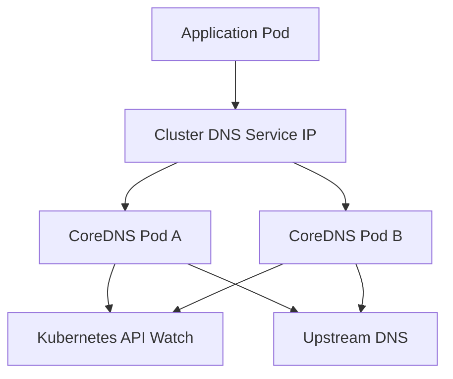

CoreDNS config is usually stored in a ConfigMap:

```bash
kubectl -n kube-system get cm coredns -o yaml
```

Typical Corefile concepts:

```txt
.:53 {
    errors
    health
    ready
    kubernetes cluster.local in-addr.arpa ip6.arpa {
       pods insecure
       fallthrough in-addr.arpa ip6.arpa
       ttl 30
    }
    prometheus :9153
    forward . /etc/resolv.conf
    cache 30
    loop
    reload
    loadbalance
}
```

Important plugins/concepts:

- `kubernetes`: serves cluster DNS records.
- `forward`: forwards unresolved names to upstream DNS.
- `cache`: caches responses.
- `loop`: detects forwarding loops.
- `reload`: reloads Corefile changes.
- `prometheus`: exposes metrics.
- `ready` / `health`: health endpoints.

Production principle:

> CoreDNS is both service discovery and recursive forwarding path for many workloads. Treat it as critical infrastructure.

---

## 12. CoreDNS Scaling and Availability

DNS availability is platform availability. If CoreDNS is overloaded, many services fail before application code is reached.

Signals:

- high DNS request latency,
- high SERVFAIL/NXDOMAIN rate,
- CoreDNS CPU saturation,
- CoreDNS memory pressure,
- upstream timeout,
- increased application connect latency,
- retry storms.

Basic checks:

```bash
kubectl -n kube-system get deploy coredns
kubectl -n kube-system get pod -l k8s-app=kube-dns -o wide
kubectl -n kube-system logs deploy/coredns
kubectl -n kube-system top pod -l k8s-app=kube-dns
```

Scaling options:

- increase CoreDNS replicas,
- tune resource requests/limits,
- use cluster-proportional autoscaler where appropriate,
- enable NodeLocal DNSCache,
- reduce query amplification,
- fix noisy clients,
- tune CoreDNS cache and forward behavior.

Warning:

> Scaling CoreDNS treats capacity symptoms. It does not automatically fix bad resolver behavior, retry storms, or upstream DNS instability.

---

## 13. NodeLocal DNSCache

NodeLocal DNSCache runs a DNS caching agent on each node. Pods send DNS queries to a node-local IP rather than always traversing Service IP load balancing to CoreDNS Pods.

Conceptual flow without NodeLocal DNSCache:

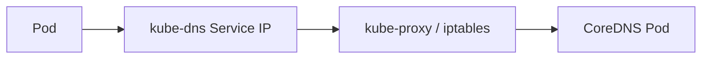

With NodeLocal DNSCache:

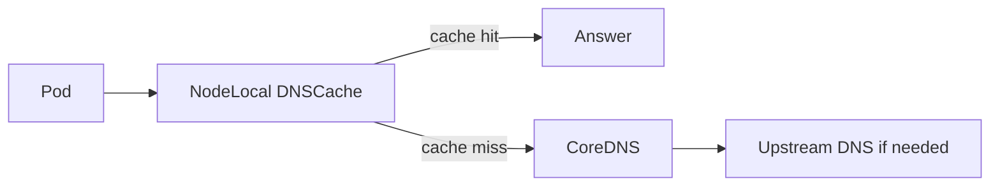

Benefits:

- lower DNS latency for cache hits,
- reduced CoreDNS load,
- less dependency on iptables DNAT path for DNS Service IP,
- reduced conntrack pressure for DNS traffic,
- better node-local failure visibility.

Trade-offs:

- another DaemonSet to operate,
- node-local agent failure can affect all Pods on node,
- cache can hide propagation timing,
- debugging has one more hop,
- configuration consistency matters.

Use when:

- DNS QPS is high,
- CoreDNS is overloaded,
- conntrack issues affect DNS,
- large cluster with many Pods,
- latency-sensitive services suffer DNS p99.

Do not use as substitute for fixing pathological clients that repeatedly resolve names for every request.

---

## 14. DNS Caching Layers

DNS caching can happen in many places:

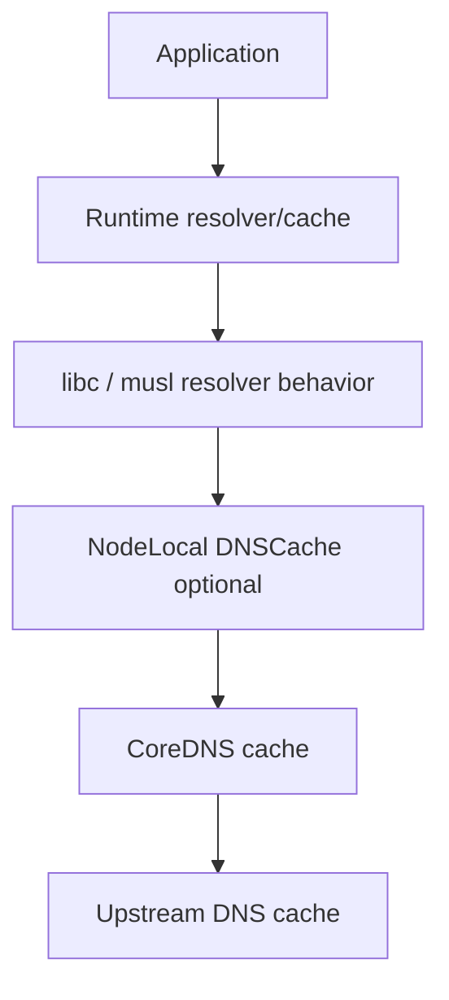

Examples:

- JVM DNS cache,
- Go resolver behavior,
- Node.js lookup behavior,
- nginx resolver cache,
- Envoy DNS refresh,
- CoreDNS cache,
- NodeLocal DNSCache,
- upstream corporate DNS cache.

Problems:

- stale IP after Service migration,
- negative caching hides newly-created Service,
- too-short TTL creates high QPS,
- too-long TTL delays failover,
- inconsistent cache between clients.

Production principle:

> DNS TTL is not only a DNS setting. It becomes application failover behavior once clients cache answers.

Questions to ask:

1. Does the runtime cache DNS forever?
2. Does connection pool reconnect after DNS change?
3. Are negative responses cached?
4. Is TTL honored?
5. Does proxy sidecar resolve DNS or does app resolve DNS?
6. Does mesh capture outbound DNS?

---

## 15. DNS and Application Runtime Behavior

Different runtimes behave differently.

### 15.1 JVM

The JVM may cache DNS answers according to security/networkaddress cache settings. In some environments, this can lead to stale DNS after backend changes.

Operational questions:

- What is `networkaddress.cache.ttl`?
- What is `networkaddress.cache.negative.ttl`?
- Does the HTTP client pool refresh connections?
- Does the service use long-lived gRPC channels?

### 15.2 Go

Go can use pure Go resolver or cgo resolver depending environment. Behavior may differ with `/etc/resolv.conf` complexity.

Questions:

- Is `GODEBUG=netdns=...` relevant?
- Does the app resolve per request or reuse connections?
- Are DNS errors wrapped as connection errors?

### 15.3 Node.js

Node.js lookup behavior can use OS resolver or custom DNS module behavior depending API.

Questions:

- Is `dns.lookup` or `dns.resolve` used?
- Is connection pooling enabled?
- Does the library cache DNS?

### 15.4 Envoy / Mesh

If service mesh is present, Envoy may resolve STRICT_DNS clusters, use EDS from control plane, or intercept outbound traffic depending mode.

Questions:

- Is service discovery DNS-based or xDS-based?
- Is app resolving Service DNS or proxy handling routing?
- Is DNS capture enabled?
- Are mesh ServiceEntries involved?

---

## 16. DNS Is Not Identity

A DNS name is a locator. It is not automatically a secure identity.

Example:

```txt
payments.prod.svc.cluster.local
```

This tells a client where to send traffic, but not necessarily:

- whether the server is truly `payments`,
- whether the server has valid workload identity,
- whether caller is authorized,
- whether mTLS is used,
- whether certificate SAN matches.

For identity, production systems use:

- mTLS,
- SPIFFE/SPIRE,
- service mesh identity,
- certificate SAN verification,
- workload identity,
- policy engines.

DNS + TLS issue:

- If client uses `payments` as hostname but server cert is for `payments.prod.svc.cluster.local`, TLS may fail unless SAN includes expected names.
- If ExternalName maps internal name to external domain, TLS may fail because SNI/hostname does not match external certificate.

Production principle:

> DNS answers "where". Identity and authorization answer "who" and "may they".

---

## 17. Cross-Namespace Resolution

Short name `payments` from namespace `frontend` means:

```txt
payments.frontend.svc.cluster.local
```

It does not mean:

```txt
payments.prod.svc.cluster.local
```

This can cause subtle bugs when a Service with same name exists in multiple namespaces.

Bad config:

```yaml
env:
  - name: PAYMENTS_URL
    value: http://payments
```

If deployed in namespace `prod`, it calls `payments.prod`. If deployed in namespace `staging`, it calls `payments.staging`. That may be intended or dangerous.

More explicit:

```yaml
env:
  - name: PAYMENTS_URL
    value: http://payments.prod.svc.cluster.local
```

Decision:

- Use short names for same-namespace locality when deployment namespace is part of the contract.
- Use FQDN for cross-namespace dependencies.
- Avoid relying on search order for critical dependencies.

---

## 18. External DNS Resolution from Pods

When a Pod resolves an external name:

```txt
api.partner.example.com
```

The query usually goes:

```mermaid
flowchart LR
    App --> CoreDNS
    CoreDNS --> Forward[forward plugin]
    Forward --> Upstream[/etc/resolv.conf upstream or configured DNS]
    Upstream --> InternetDNS[Authoritative / Recursive DNS]
```

Failure causes:

- CoreDNS cannot reach upstream,
- upstream DNS rate limits,
- corporate DNS issue,
- `ndots` amplification,
- NetworkPolicy blocks DNS egress,
- node resolver config broken,
- DNS loop,
- external domain intermittent.

Debug:

```bash
kubectl run -it --rm dns-debug --image=nicolaka/netshoot --restart=Never -- sh
cat /etc/resolv.conf
dig api.partner.example.com
dig @<coredns-service-ip> api.partner.example.com
dig +trace api.partner.example.com
```

Be careful with `dig +trace` from restricted environments; it may bypass normal resolver path and test something different from application behavior.

---

## 19. DNS and NetworkPolicy

DNS requires network access. If egress is default-deny, you must allow DNS.

Common policy pattern:

```yaml
apiVersion: networking.k8s.io/v1
kind: NetworkPolicy
metadata:
  name: allow-dns
  namespace: prod
spec:
  podSelector: {}
  policyTypes:
    - Egress
  egress:
    - to:
        - namespaceSelector:
            matchLabels:
              kubernetes.io/metadata.name: kube-system
          podSelector:
            matchLabels:
              k8s-app: kube-dns
      ports:
        - protocol: UDP
          port: 53
        - protocol: TCP
          port: 53
```

Important:

- DNS can use UDP and TCP.
- NodeLocal DNSCache may use a node-local IP, not CoreDNS Pod IP directly.
- Some CNIs require different policy expressions for node-local services.
- FQDN policies are CNI-specific, not standard Kubernetes NetworkPolicy.

Failure symptom:

```txt
Temporary failure in name resolution
```

But root cause may be policy, not CoreDNS.

---

## 20. CoreDNS Plugin Chain Failure Modes

CoreDNS behavior depends on plugin order and config.

Common failure categories:

| Failure | Symptom | Example Cause |
|---|---|---|
| Kubernetes plugin issue | Service names fail | API watch/list problem |
| Forward issue | external names fail | upstream DNS unavailable |
| Cache issue | stale or unexpected answer | TTL/caching behavior |
| Loop issue | CoreDNS crashloop or SERVFAIL | forward loop |
| Load issue | timeouts | too much QPS / CPU saturation |
| Config issue | partial domains fail | bad Corefile reload |

Debug Corefile:

```bash
kubectl -n kube-system get cm coredns -o yaml
kubectl -n kube-system logs deploy/coredns
kubectl -n kube-system describe deploy coredns
```

Metrics to observe:

- request count by type/rcode,
- request duration,
- cache hits/misses,
- forward latency,
- panic/reload errors,
- CoreDNS CPU/memory,
- DNS response code distribution.

---

## 21. DNS Query Amplification

A single application lookup can generate multiple DNS queries because of:

- search domains,
- high `ndots`,
- A and AAAA queries,
- retries,
- multiple resolver attempts,
- negative caching behavior,
- external dependency lookup per request.

Example:

```txt
api.partner.com
```

May produce:

- `A api.partner.com.prod.svc.cluster.local`
- `AAAA api.partner.com.prod.svc.cluster.local`
- `A api.partner.com.svc.cluster.local`
- `AAAA api.partner.com.svc.cluster.local`
- `A api.partner.com.cluster.local`
- `AAAA api.partner.com.cluster.local`
- `A api.partner.com`
- `AAAA api.partner.com`

Under outage, retries multiply this further.

Mitigation hierarchy:

1. Fix app behavior: do not resolve per request unnecessarily.
2. Use absolute names where appropriate.
3. Tune `ndots` for high-volume external clients.
4. Use connection pooling.
5. Enable NodeLocal DNSCache.
6. Scale CoreDNS.
7. Add observability and alerting.

Do not start with "add more CoreDNS replicas" if client behavior is pathological.

---

## 22. DNS and Latency Budget

DNS lookup is often hidden inside connect latency.

Request timeline:

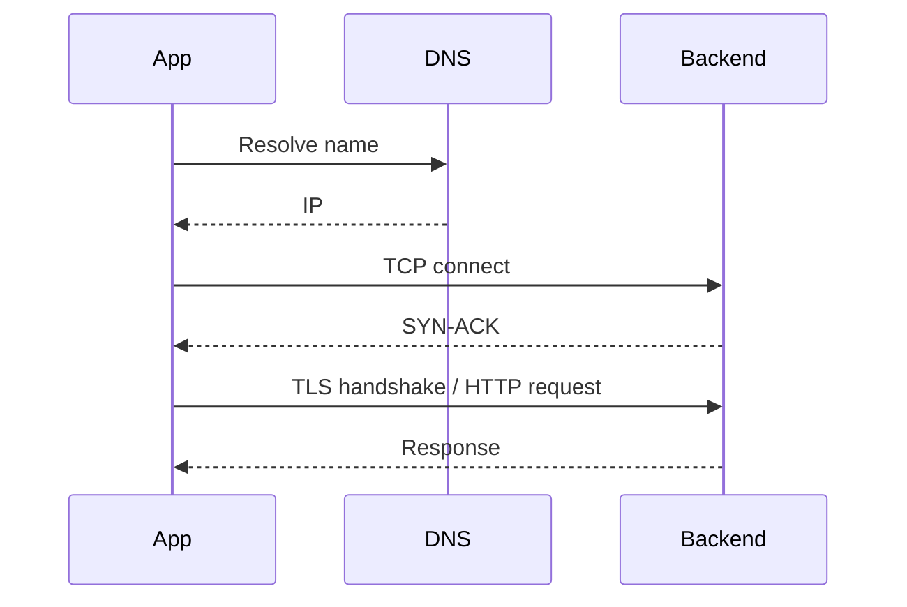

If DNS p99 is 300ms, every cold connection may pay that cost before TCP even starts.

Production measurement:

- DNS duration histogram,
- application connection establishment time,
- HTTP client pool hit/miss,
- CoreDNS request duration,
- NodeLocal DNSCache hit ratio,
- external upstream DNS latency.

Do not only observe application response time. Break it down:

```txt
name resolution -> connect -> TLS -> request write -> server processing -> response read
```

---

## 23. DNS During Rollouts and Failover

DNS-based discovery is eventually consistent and cache-sensitive.

During rollout:

1. Pods change readiness.
2. EndpointSlice updates.
3. CoreDNS answers change for headless Service.
4. Client caches may still use old answer.
5. Existing connections may remain open.

For ClusterIP Service, DNS answer usually remains same, because it returns Service IP. Endpoint changes happen behind Service dataplane.

For headless Service, DNS answers can change directly as endpoints change.

Implication:

| Service Type | DNS Answer During Pod Rollout | Client Impact |
|---|---|---|
| ClusterIP | Usually stable ClusterIP | Dataplane handles endpoint changes |
| Headless | Endpoint set changes | Client must handle DNS/endpoint churn |
| ExternalName | CNAME stable unless changed | External DNS controls target |

For failover design, ask:

- Is DNS the failover mechanism?
- What TTL do clients honor?
- What is negative cache TTL?
- Do clients keep long-lived connections?
- How fast must failover happen?
- Would Gateway/mesh/global LB be more appropriate?

---

## 24. DNS and Multi-Cluster Preview

Multi-cluster service discovery introduces additional complexity:

- same Service name across clusters,
- namespace sameness,
- cluster-local vs clusterset-local names,
- locality-aware answers,
- failover semantics,
- split brain risk,
- stale imported service records.

Example conceptual naming in MCS-style systems:

```txt
service.namespace.svc.clusterset.local
```

Do not treat multi-cluster DNS as "normal DNS but bigger". It is a distributed service discovery system with consistency, locality, identity, and failure semantics.

This will be covered deeply in Parts 030–032.

---

## 25. DNS and Service Mesh

Service mesh can change DNS behavior in several ways:

1. App resolves Kubernetes Service DNS normally, then sidecar intercepts traffic.
2. Sidecar/proxy uses xDS service discovery rather than DNS for mesh services.
3. Mesh captures DNS queries to implement smarter routing or external service control.
4. External services may be modeled as ServiceEntry-like resources.
5. Waypoint/ambient modes may alter where identity and routing decisions happen.

Debugging in mesh environment:

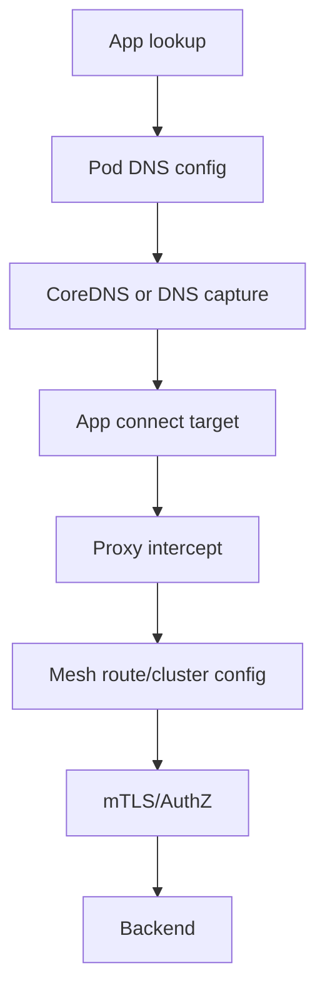

Questions:

- Is the application actually using DNS result?
- Does proxy override routing after DNS?
- Is DNS capture enabled?
- Does mesh config include the service?
- Is failure DNS, xDS, mTLS, or AuthorizationPolicy?

Production principle:

> In mesh, DNS may be only the first locator. Actual service selection may happen in proxy config.

---

## 26. Debugging Ladder for DNS Issues

Use this ladder.

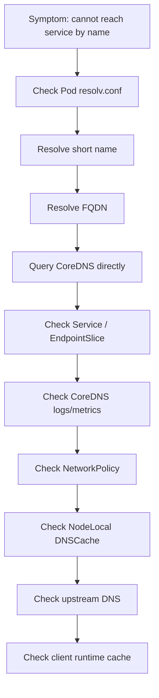

Commands:

```bash
# Create debug pod
kubectl run -it --rm dns-debug --image=nicolaka/netshoot --restart=Never -- sh

# Inside pod
cat /etc/resolv.conf
nslookup kubernetes.default
nslookup payments.prod.svc.cluster.local
dig payments.prod.svc.cluster.local A
dig payments.prod.svc.cluster.local SRV

# Query DNS service directly
kubectl -n kube-system get svc kube-dns -o wide
dig @<kube-dns-cluster-ip> payments.prod.svc.cluster.local A

# Check CoreDNS
kubectl -n kube-system get pod -l k8s-app=kube-dns -o wide
kubectl -n kube-system logs deploy/coredns --tail=200
kubectl -n kube-system get cm coredns -o yaml
```

Rule:

> Test short name and FQDN separately. Short-name failure can be search path/namespace behavior; FQDN failure is more likely DNS service or record issue.

---

## 27. Failure Catalogue

### 27.1 DNS Works in One Namespace but Not Another

Symptoms:

- `curl http://payments` works in `prod` but fails in `frontend`.

Root cause:

- short name resolves relative to caller namespace.

Fix:

- use `payments.prod.svc.cluster.local` for cross-namespace dependency,
- or create explicit local Service alias if intentional.

---

### 27.2 Intermittent DNS Timeout

Symptoms:

- occasional `Temporary failure in name resolution`,
- spikes in app latency,
- CoreDNS CPU high.

Root causes:

- CoreDNS overloaded,
- upstream DNS slow,
- conntrack pressure,
- network policy intermittent due to node path,
- noisy clients resolving too often,
- NodeLocal DNSCache unhealthy on subset of nodes.

Fix:

1. Check CoreDNS metrics.
2. Identify top querying workloads.
3. Check node locality of failures.
4. Enable/tune NodeLocal DNSCache if appropriate.
5. Fix app resolver behavior.

---

### 27.3 External DNS Slow Because of `ndots`

Symptoms:

- external API calls have high initial latency,
- CoreDNS receives many NXDOMAIN queries for cluster suffix variants.

Root cause:

- search domain expansion before absolute lookup.

Fix:

- use absolute FQDN with trailing dot where safe,
- tune workload `ndots`,
- reduce per-request resolution,
- improve caching.

---

### 27.4 Headless Service Sends Traffic to Removed Pod

Symptoms:

- client calls old Pod IP after rollout,
- only some clients affected.

Root causes:

- client DNS cache stale,
- connection pool not refreshed,
- negative/positive TTL behavior,
- endpoint removal delay.

Fix:

- reduce cache TTL carefully,
- make client handle endpoint failure,
- use ClusterIP if endpoint identity is not required,
- implement graceful shutdown/draining.

---

### 27.5 CoreDNS Cannot Resolve Kubernetes Service Names

Symptoms:

- external DNS may work,
- `kubernetes.default` fails,
- CoreDNS logs show API errors.

Root causes:

- CoreDNS cannot reach Kubernetes API,
- RBAC issue,
- CoreDNS config broken,
- API server issue,
- network policy blocks CoreDNS to API server.

Fix:

- inspect CoreDNS logs,
- check CoreDNS service account/RBAC,
- check API server connectivity,
- check Corefile `kubernetes` plugin,
- check cluster events.

---

### 27.6 NodeLocal DNSCache Node-Specific Failure

Symptoms:

- DNS fails only for Pods on one node.
- CoreDNS global metrics look fine.

Root causes:

- NodeLocal DNSCache Pod unhealthy on that node,
- iptables redirect issue,
- local agent cannot reach CoreDNS,
- node firewall issue.

Fix:

- compare failing and healthy node,
- check DaemonSet pod logs,
- query local DNS IP from affected Pod,
- restart/cordon node if necessary,
- investigate node-level dataplane.

---

## 28. Observability Model

Minimum DNS observability:

| Layer | Signal |
|---|---|
| Application | DNS error count, connect latency, request latency breakdown |
| Runtime | resolver/cache metrics if available |
| Pod | `/etc/resolv.conf`, DNS policy |
| Node | conntrack, NodeLocal DNSCache health |
| CoreDNS | QPS, latency, rcode, cache hit/miss, forward latency |
| Upstream | timeout, SERVFAIL, NXDOMAIN, rate limiting |
| Kubernetes API | Service/EndpointSlice watch health |

CoreDNS metrics commonly include:

- request count,
- response code count,
- request duration,
- cache hits/misses,
- forward request duration,
- plugin errors.

Dashboards should answer:

1. Which workloads generate most DNS QPS?
2. Which domains generate most NXDOMAIN?
3. Is latency cluster-wide or node-specific?
4. Are external lookups slower than cluster-local lookups?
5. Did DNS errors start after deployment/config change?

---

## 29. DNS Design Patterns

### 29.1 Same-Namespace Service Call

```txt
http://payments
```

Acceptable when:

- caller and callee are intentionally co-located in namespace,
- namespace is deployment boundary,
- no ambiguity with same service name elsewhere.

---

### 29.2 Cross-Namespace Service Call

```txt
http://payments.prod.svc.cluster.local
```

Better when:

- dependency is owned by another team/namespace,
- environment namespace varies,
- auditability matters.

---

### 29.3 Stateful Peer Identity

```txt
kafka-0.kafka.data.svc.cluster.local
```

Use when:

- peer identity matters,
- storage identity aligns,
- certificates include stable DNS names,
- client understands cluster membership.

---

### 29.4 External Dependency

```txt
https://api.partner.example.com.
```

Use absolute naming where DNS search expansion causes measurable overhead.

---

### 29.5 Internal Alias to External Service

ExternalName can be useful but should not hide security and TLS semantics.

Better alternative for serious production control:

- egress gateway,
- service mesh external service config,
- explicit proxy,
- DNS policy with audit.

---

## 30. Practice Lab: DNS Investigation

### 30.1 Create Namespace and Service

```bash
kubectl create ns dns-lab
```

```yaml
apiVersion: apps/v1
kind: Deployment
metadata:
  name: echo
  namespace: dns-lab
spec:
  replicas: 2
  selector:
    matchLabels:
      app: echo
  template:
    metadata:
      labels:
        app: echo
    spec:
      containers:
        - name: echo
          image: hashicorp/http-echo:1.0
          args: ["-text=dns-lab"]
          ports:
            - name: http
              containerPort: 5678
---
apiVersion: v1
kind: Service
metadata:
  name: echo
  namespace: dns-lab
spec:
  selector:
    app: echo
  ports:
    - name: http
      port: 80
      targetPort: http
```

### 30.2 Resolve from Same Namespace

```bash
kubectl run -n dns-lab -it --rm debug --image=nicolaka/netshoot --restart=Never -- sh
cat /etc/resolv.conf
nslookup echo
nslookup echo.dns-lab.svc.cluster.local
curl -v http://echo
```

Learning:

- short name works because namespace search path includes `dns-lab.svc.cluster.local`.

### 30.3 Resolve from Different Namespace

```bash
kubectl create ns other-lab
kubectl run -n other-lab -it --rm debug --image=nicolaka/netshoot --restart=Never -- sh
nslookup echo
nslookup echo.dns-lab
nslookup echo.dns-lab.svc.cluster.local
```

Learning:

- `echo` alone means `echo.other-lab.svc.cluster.local`, not `echo.dns-lab`.

### 30.4 Observe Search Expansion

Inside debug Pod:

```bash
dig api.example.com
# compare with
dig api.example.com.
```

If you have CoreDNS query logging enabled in a safe lab cluster, observe expanded queries. Do not enable verbose query logging in production without considering volume and privacy.

### 30.5 Headless Service

Patch Service:

```yaml
apiVersion: v1
kind: Service
metadata:
  name: echo-headless
  namespace: dns-lab
spec:
  clusterIP: None
  selector:
    app: echo
  ports:
    - name: http
      port: 80
      targetPort: http
```

Test:

```bash
dig echo-headless.dns-lab.svc.cluster.local A
```

Learning:

- headless Service exposes endpoint addresses directly.
- client behavior becomes more important.

---

## 31. Production Checklist

Before approving DNS/service discovery change:

- [ ] Is dependency same-namespace or cross-namespace?
- [ ] Are names explicit enough for the risk level?
- [ ] Does app resolve external names frequently?
- [ ] Is `ndots` behavior acceptable?
- [ ] Does runtime cache DNS? For how long?
- [ ] Are negative responses cached?
- [ ] Is CoreDNS capacity sufficient?
- [ ] Is NodeLocal DNSCache used or needed?
- [ ] Is DNS allowed by NetworkPolicy?
- [ ] Are both UDP and TCP 53 considered?
- [ ] Does service mesh alter DNS behavior?
- [ ] Does TLS identity match DNS name?
- [ ] Does failover depend on TTL? Do clients honor it?
- [ ] Are DNS errors visible in app metrics?

---

## 32. Anti-Patterns

### 32.1 Using Short Names Across Namespaces

Bad:

```txt
http://payments
```

from arbitrary namespace.

Better:

```txt
http://payments.prod.svc.cluster.local
```

for explicit cross-namespace dependency.

---

### 32.2 Resolving DNS Per Request

Bad:

```txt
resolve -> connect -> request -> close
resolve -> connect -> request -> close
resolve -> connect -> request -> close
```

Better:

- connection pooling,
- bounded DNS cache,
- retry with backoff,
- circuit breaking.

---

### 32.3 Treating CoreDNS as Infinite

Bad assumption:

> "DNS is just internal; it will handle it."

Reality:

- CoreDNS has CPU/memory limits,
- upstream DNS can fail,
- clients can amplify queries,
- node-local failures can be subtle.

---

### 32.4 ExternalName as Security Boundary

Bad:

```txt
internal-looking name -> external CNAME
```

without TLS/SNI/policy review.

Better:

- explicit egress model,
- TLS hostname verification,
- audit and policy,
- clear ownership.

---

### 32.5 Ignoring Client Runtime Caching

Kubernetes DNS records can be correct while application still uses old answers.

Always inspect runtime behavior for JVM, Go, Node.js, Envoy, nginx, and application libraries.

---

## 33. Key Invariants

DNS/service discovery invariants:

1. DNS success proves name resolution only, not service reachability.
2. Short names are namespace-relative.
3. `ndots` and search domains can multiply queries.
4. ClusterIP Service DNS is stable while endpoints change behind it.
5. Headless Service DNS exposes endpoint churn to clients.
6. DNS is locator, not identity.
7. Client caching can dominate failover behavior.
8. CoreDNS is critical infrastructure and needs SLOs.
9. NodeLocal DNSCache improves locality but adds node-local failure mode.
10. Service mesh may override or augment DNS-based discovery.

---

## 34. Self-Test

Jawab tanpa melihat catatan:

1. Apa perbedaan DNS answer untuk ClusterIP Service dan headless Service?
2. Mengapa `payments` bisa resolve ke service berbeda dari namespace berbeda?
3. Apa dampak `ndots:5` terhadap external DNS lookup?
4. Mengapa DNS success tidak membuktikan backend siap?
5. Kapan NodeLocal DNSCache membantu?
6. Apa failure mode baru dari NodeLocal DNSCache?
7. Mengapa DNS bukan identity?
8. Apa risiko ExternalName terhadap TLS?
9. Mengapa DNS TTL tidak cukup untuk menjamin failover cepat?
10. Apa saja caching layer antara app dan authoritative DNS?
11. Bagaimana NetworkPolicy bisa menyebabkan DNS failure?
12. Bagaimana service mesh bisa mengubah makna DNS lookup?

---

## 35. What Good Looks Like

Engineer yang kuat tidak berhenti pada:

> "CoreDNS error, restart CoreDNS."

Mereka akan berkata:

> "Kita perlu membedakan apakah failure terjadi pada short-name expansion, FQDN resolution, CoreDNS Kubernetes plugin, upstream forwarding, network policy, NodeLocal DNSCache, atau client runtime cache. Saya akan query short name dan FQDN dari namespace yang sama, cek `/etc/resolv.conf`, query CoreDNS Service IP langsung, lihat CoreDNS rcode/latency, cek endpoint Service, dan korelasikan dengan node sumber. Jika hanya external domain lambat, saya akan lihat `ndots`, NXDOMAIN amplification, forward latency, dan client resolver behavior."

Itulah operating model yang membuat DNS debugging terarah, bukan trial-and-error.

---

## 36. References

- Kubernetes Documentation — DNS for Services and Pods: `https://kubernetes.io/docs/concepts/services-networking/dns-pod-service/`
- Kubernetes Documentation — Debugging DNS Resolution: `https://kubernetes.io/docs/tasks/administer-cluster/dns-debugging-resolution/`
- Kubernetes Documentation — Using CoreDNS for Service Discovery: `https://kubernetes.io/docs/tasks/administer-cluster/coredns/`
- Kubernetes Documentation — Customizing DNS Service: `https://kubernetes.io/docs/tasks/administer-cluster/dns-custom-nameservers/`
- Kubernetes Documentation — NodeLocal DNSCache: `https://kubernetes.io/docs/tasks/administer-cluster/nodelocaldns/`
- Kubernetes Documentation — Autoscale the DNS Service: `https://kubernetes.io/docs/tasks/administer-cluster/dns-horizontal-autoscaling/`
- CoreDNS Project: `https://coredns.io/`

---

## 37. Ringkasan

DNS di Kubernetes bukan sekadar "nama Service". Ia adalah runtime dependency yang menghubungkan Kubernetes API state, CoreDNS, Pod resolver config, search domain, cache, upstream DNS, NetworkPolicy, dan client runtime behavior. Untuk production-grade engineering, Anda harus bisa membedakan DNS failure dari Service failure, memahami dampak `ndots`, memilih kapan short name aman, kapan FQDN wajib, kapan headless Service tepat, dan kapan NodeLocal DNSCache membantu.

Part berikutnya akan membahas **Endpoints, EndpointSlices, and Readiness-Aware Routing**: lapisan yang menentukan backend mana yang benar-benar boleh menerima traffic.
