# Part 007 — Endpoints, EndpointSlices, and Readiness-Aware Routing

## 1. Tujuan Part Ini

Pada Part 005 kita melihat Service sebagai virtual IP dan load-balancing contract. Pada Part 006 kita melihat DNS sebagai layer discovery. Sekarang kita masuk ke titik yang sering menjadi penyebab incident tersembunyi: **bagaimana Kubernetes memutuskan backend mana yang boleh menerima traffic**.

Service tidak mengirim traffic ke Pod secara abstrak. Service mengirim traffic ke sekumpulan endpoint. Endpoint adalah hasil dari banyak keputusan kecil:

- Apakah label Pod cocok dengan selector Service?
- Apakah Pod sudah memiliki IP?
- Apakah Pod ready?
- Apakah Pod sedang terminating?
- Apakah endpoint berada di node atau zone tertentu?
- Apakah consumer memahami kondisi `ready`, `serving`, dan `terminating`?
- Apakah controller, Gateway, mesh, atau kube-proxy sudah menerima update terbaru?

Di level basic, engineer sering melihat ini sebagai:

```bash
kubectl get endpoints
kubectl get endpointslices
```

Di level production, pertanyaannya lebih tajam:

> “Kapan workload dianggap eligible menerima traffic, oleh siapa, berdasarkan sinyal apa, dan apa yang terjadi ketika sinyal tersebut terlambat, salah, atau tidak dipahami oleh data plane?”

Itulah fokus part ini.

---

## 2. Premis Utama: Endpoint Adalah Traffic Eligibility Record

Endpoint bukan sekadar daftar IP. Endpoint adalah **record kelayakan traffic**.

Sebuah Pod bisa hidup tetapi tidak eligible menerima traffic. Sebuah Pod bisa terminating tetapi masih perlu melayani request yang sudah berjalan. Sebuah Pod bisa ready menurut Kubernetes tetapi belum warm menurut aplikasi. Sebuah Pod bisa tersedia di zone lain tetapi sebaiknya tidak dipilih karena biaya atau latency.

Mental model yang lebih akurat:

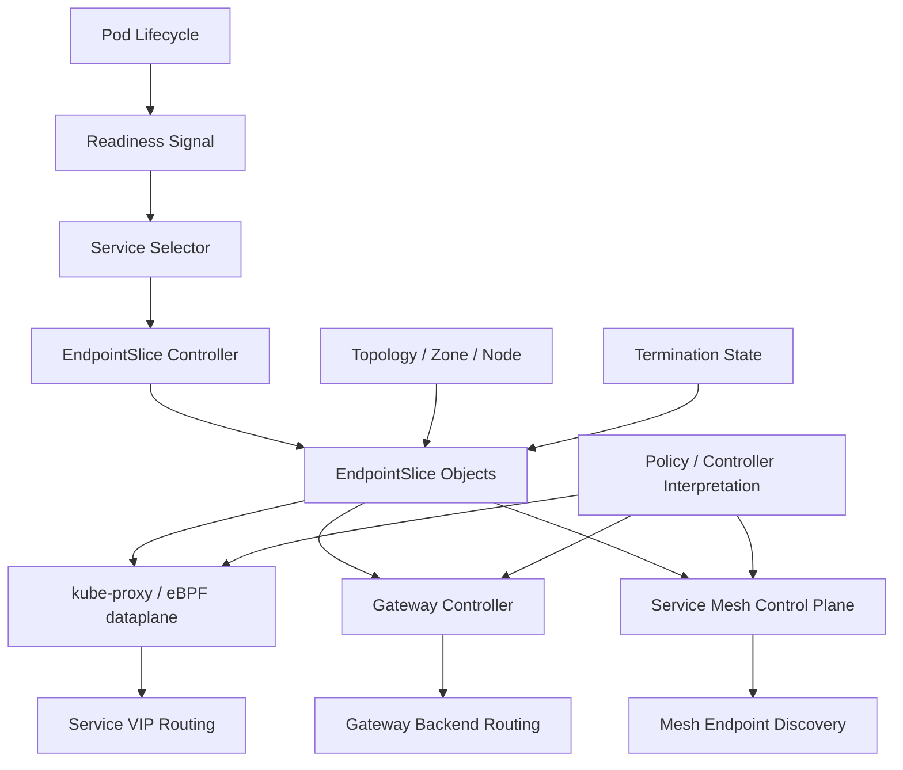

EndpointSlice menjadi bentuk modern dari data ini. EndpointSlice membawa informasi endpoint dalam bentuk yang lebih scalable dan lebih ekspresif daripada Endpoints lama.

---

## 3. Dari Service Selector ke EndpointSlice

Untuk Service dengan selector, Kubernetes melakukan pipeline seperti ini:

1. Service mendefinisikan selector.
2. Pod memiliki label.
3. EndpointSlice controller mencari Pod yang cocok.
4. Pod yang cocok dievaluasi status dan readiness-nya.
5. Controller membuat atau memperbarui EndpointSlice.
6. Data plane mengonsumsi EndpointSlice.
7. Traffic diarahkan ke endpoint yang dianggap eligible.

Contoh Service:

```yaml
apiVersion: v1
kind: Service
metadata:
  name: payment-api
  namespace: payments
spec:
  selector:
    app: payment-api
  ports:
    - name: http
      port: 80
      targetPort: 8080
```

Pod yang cocok:

```yaml
metadata:
  labels:
    app: payment-api
```

EndpointSlice yang dihasilkan kira-kira seperti ini:

```yaml
apiVersion: discovery.k8s.io/v1
kind: EndpointSlice
metadata:
  name: payment-api-abc12
  namespace: payments
  labels:
    kubernetes.io/service-name: payment-api
addressType: IPv4
ports:
  - name: http
    protocol: TCP
    port: 8080
endpoints:
  - addresses:
      - 10.42.1.17
    conditions:
      ready: true
      serving: true
      terminating: false
    nodeName: worker-a
    zone: ap-southeast-1a
    targetRef:
      kind: Pod
      namespace: payments
      name: payment-api-7c98d7f64d-2zv7x
```

Perhatikan bahwa endpoint menyimpan lebih dari IP:

- address type
- port
- readiness condition
- serving condition
- termination condition
- node
- zone
- target reference

Ini adalah inventory traffic candidate.

---

## 4. Endpoints Lama vs EndpointSlice

Kubernetes memiliki API lama bernama `Endpoints` dan API modern bernama `EndpointSlice`.

Secara historis, `Endpoints` menyimpan semua backend untuk satu Service dalam satu object besar. Ini bermasalah saat jumlah endpoint besar karena:

- object menjadi besar;
- update kecil memerlukan update object besar;
- watch traffic meningkat;
- controller dan kube-proxy menerima payload besar;
- API server terbebani;
- semantic condition terbatas.

EndpointSlice memperbaiki ini dengan membagi endpoint menjadi beberapa slice.

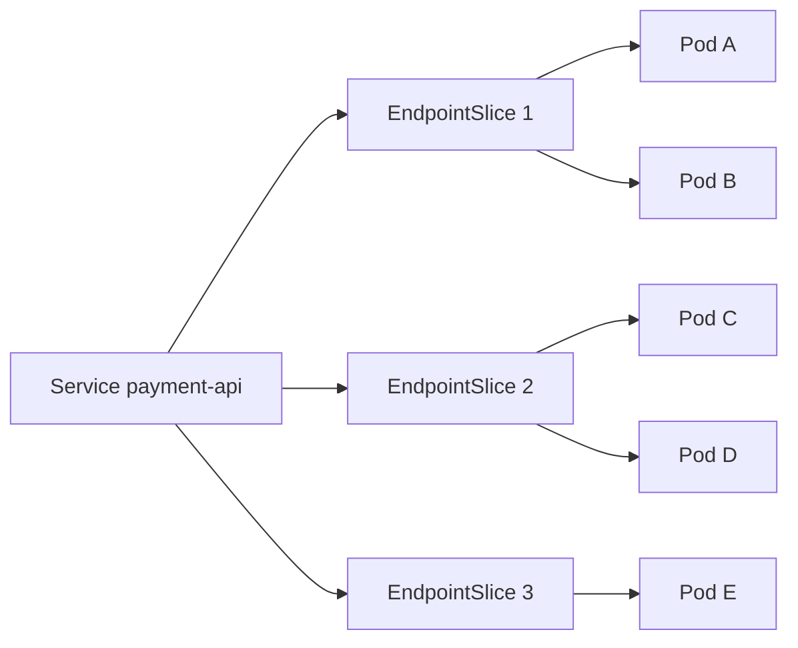

Konsekuensi engineering:

| Aspek | Endpoints Lama | EndpointSlice |
|---|---|---|
| Scale | Satu object besar | Banyak object kecil |
| Update | Berat pada Service besar | Lebih granular |
| Condition | Lebih terbatas | `ready`, `serving`, `terminating` |
| Topology | Terbatas | Mendukung hint/topology data |
| Consumer modern | Legacy-compatible | Preferred untuk controller modern |

Untuk sistem besar, EndpointSlice bukan detail implementation. Ia adalah primitive utama untuk traffic scalability.

---

## 5. EndpointSlice Address Type

EndpointSlice memiliki `addressType`. Umumnya:

- `IPv4`
- `IPv6`
- `FQDN`

Dalam cluster dual-stack, Service bisa memiliki EndpointSlice IPv4 dan IPv6 terpisah. Ini penting karena traffic path IPv4 dan IPv6 tidak selalu memiliki failure mode yang sama.

Contoh mental model:

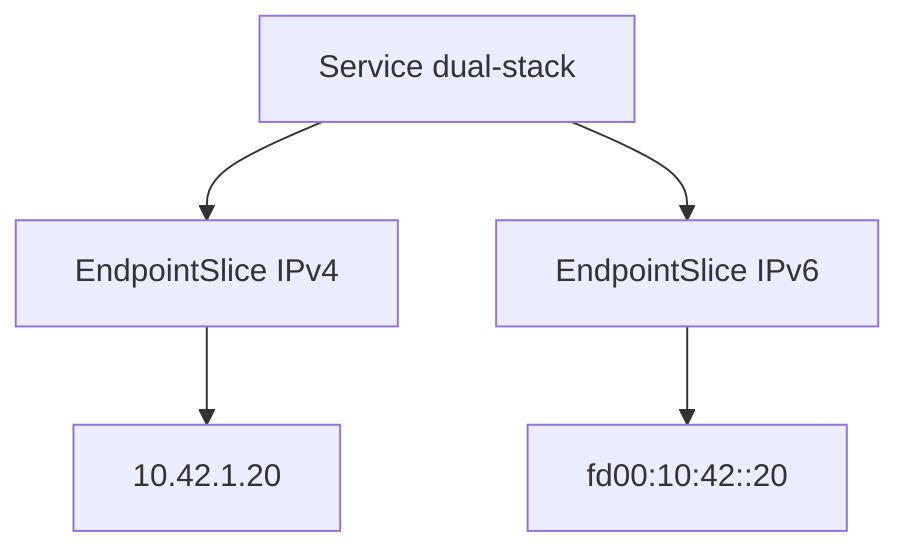

Failure mode yang sering terjadi:

- aplikasi bind hanya ke IPv4;
- client memilih IPv6 lebih dulu;
- NetworkPolicy hanya mengizinkan IPv4 range;
- observability pipeline tidak menormalisasi IPv6;
- load balancer external tidak mendukung dual-stack secara sama.

Checklist debug:

```bash
kubectl get endpointslice -n payments -l kubernetes.io/service-name=payment-api -o wide
kubectl get svc -n payments payment-api -o yaml
kubectl get pod -n payments -l app=payment-api -o wide
```

---

## 6. Endpoint Conditions: Ready, Serving, Terminating

EndpointSlice conditions adalah kunci readiness-aware routing.

Tiga condition penting:

| Condition | Makna Praktis |
|---|---|
| `ready` | Endpoint eligible untuk regular traffic menurut konsumen legacy-compatible. |
| `serving` | Endpoint masih mampu melayani traffic, termasuk saat terminating. |
| `terminating` | Endpoint berkaitan dengan Pod yang sedang dihentikan. |

Model sederhananya:

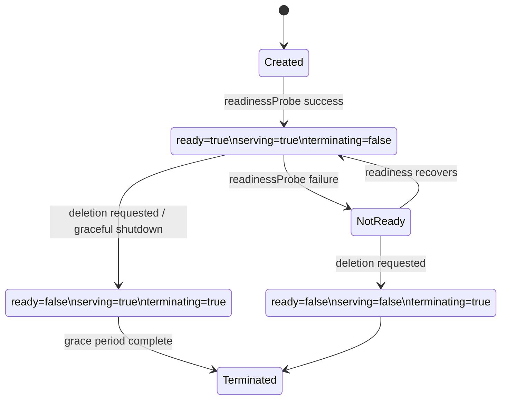

Hal penting: endpoint yang terminating biasanya memiliki `ready=false` untuk kompatibilitas dengan consumer lama. Namun `serving=true` bisa menunjukkan bahwa endpoint masih bisa menyelesaikan request selama draining.

Prinsip production:

> `ready=false` berarti jangan beri regular new traffic. `serving=true` bisa berarti endpoint masih sah untuk drain-aware behavior, tergantung consumer.

---

## 7. Readiness Probe Bukan Health Check Sempurna

Readiness probe sering diperlakukan sebagai indikator “aplikasi sehat”. Itu tidak cukup presisi.

Readiness probe menjawab pertanyaan:

> “Apakah Pod ini boleh dimasukkan ke endpoint set untuk menerima traffic?”

Bukan:

> “Apakah semua dependency bisnis siap?”  
> “Apakah cache sudah warm?”  
> “Apakah semua shard reachable?”  
> “Apakah tail latency aman?”  
> “Apakah workload siap menerima traffic canary?”

Readiness harus didesain sebagai **traffic admission signal**.

Contoh buruk:

```yaml
readinessProbe:
  httpGet:
    path: /health
    port: 8080
```

Jika `/health` hanya mengecek process up, Pod bisa dianggap ready terlalu dini.

Contoh lebih baik:

```yaml
readinessProbe:
  httpGet:
    path: /ready
    port: 8080
  initialDelaySeconds: 5
  periodSeconds: 5
  timeoutSeconds: 2
  failureThreshold: 3
```

Endpoint `/ready` sebaiknya memeriksa readiness yang relevan untuk menerima traffic, misalnya:

- HTTP server sudah bind;
- thread/event loop siap;
- connection pool minimum tersedia;
- schema migration compatibility aman;
- local cache minimum sudah warm jika cache wajib;
- dependency kritikal reachable, tetapi tidak terlalu agresif sampai menyebabkan flapping.

---

## 8. Startup Probe, Readiness Probe, dan Liveness Probe

Untuk traffic engineering, perbedaan probe harus jelas.

| Probe | Pertanyaan | Efek Traffic |
|---|---|---|
| Startup | Apakah aplikasi sudah berhasil start? | Melindungi app lambat dari liveness kill terlalu cepat. |
| Readiness | Apakah Pod boleh menerima traffic? | Mengontrol endpoint eligibility. |
| Liveness | Apakah process perlu direstart? | Bisa menyebabkan restart, bukan traffic gating langsung. |

Anti-pattern:

- readiness dan liveness memakai endpoint yang sama;
- liveness memeriksa dependency external;
- readiness terlalu mahal;
- readiness terlalu sensitif;
- readiness tidak berubah saat aplikasi melakukan graceful shutdown.

Production rule:

> Liveness harus konservatif. Readiness harus merepresentasikan kemampuan menerima request baru. Startup harus menutup fase boot yang lambat.

---

## 9. Readiness Gate dan Custom Conditions

Readiness probe bukan satu-satunya sinyal readiness. Kubernetes mendukung readiness gate yang memungkinkan condition tambahan mempengaruhi readiness Pod.

Use case:

- external load balancer target registration;
- service mesh sidecar readiness;
- custom admission/warmup controller;
- security agent siap;
- application-specific warmup selesai.

Mental model:

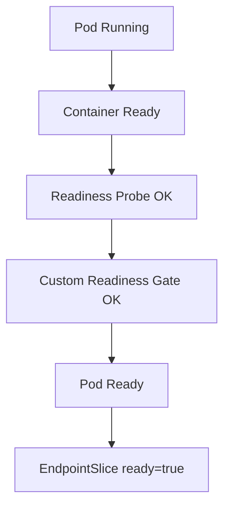

Kapan dipakai?

Gunakan readiness gate jika ada readiness yang tidak bisa diekspresikan dari dalam container utama saja. Namun jangan menjadikannya dependency control plane yang rapuh tanpa observability.

Failure mode:

- custom controller down membuat Pod tidak pernah ready;
- readiness gate condition typo;
- rollout stuck;
- HPA menambah Pod tetapi semua pending readiness;
- external LB sudah siap tetapi condition tidak diperbarui.

---

## 10. PublishNotReadyAddresses

Service memiliki field `publishNotReadyAddresses`. Jika diaktifkan, endpoint yang belum ready tetap dipublikasikan.

Ini sering dipakai untuk:

- StatefulSet peer discovery;
- database cluster bootstrap;
- consensus systems;
- aplikasi yang butuh menemukan peer sebelum ready.

Contoh:

```yaml
apiVersion: v1
kind: Service
metadata:
  name: postgres-headless
spec:
  clusterIP: None
  publishNotReadyAddresses: true
  selector:
    app: postgres
  ports:
    - name: postgres
      port: 5432
```

Risikonya besar jika dipakai untuk aplikasi request/response biasa:

- client bisa mengirim traffic ke Pod yang belum siap;
- DNS discovery terlihat berhasil padahal service belum bisa melayani;
- load balancer atau client-side balancing bisa memilih endpoint premature;
- startup storm terjadi ketika banyak client berebut endpoint yang belum warm.

Rule:

> `publishNotReadyAddresses` adalah alat bootstrap/stateful discovery, bukan shortcut untuk mempercepat exposure aplikasi.

---

## 11. Headless Service dan EndpointSlice

Headless Service (`clusterIP: None`) tidak menyediakan virtual IP biasa. DNS akan mengembalikan endpoint secara langsung.

Contoh:

```yaml
apiVersion: v1
kind: Service
metadata:
  name: cache
spec:
  clusterIP: None
  selector:
    app: cache
  ports:
    - name: redis
      port: 6379
```

Dampaknya:

- client melihat banyak IP backend;
- load balancing bisa terjadi di client;
- DNS caching menjadi lebih penting;
- readiness tetap mempengaruhi endpoint yang dipublikasikan, kecuali `publishNotReadyAddresses` digunakan;
- update endpoint tidak selalu langsung dilihat oleh client karena DNS cache.

Headless Service cocok untuk:

- StatefulSet;
- peer discovery;
- sharded system;
- client-side load balancing;
- service mesh tertentu yang butuh endpoint detail.

Tidak cocok jika:

- client tidak robust terhadap IP churn;
- connection pool menyimpan endpoint terlalu lama;
- aplikasi tidak punya retry/failover sehat;
- DNS cache TTL tidak dipahami.

---

## 12. EndpointSlice dan Port Naming

Service port name bukan kosmetik. Banyak controller, Gateway, mesh, dan observability pipeline menggunakan nama port untuk memahami protocol.

Contoh:

```yaml
ports:
  - name: http
    port: 80
    targetPort: 8080
```

Port name yang buruk:

```yaml
ports:
  - name: port1
    port: 80
```

Port name yang ambigu bisa membuat:

- mesh tidak mengenali protocol;
- telemetry salah label;
- HTTP routing tidak aktif;
- policy L7 tidak diterapkan;
- controller fallback ke TCP.

Prinsip:

| Protocol | Nama yang Disarankan |
|---|---|
| HTTP | `http`, `http-api`, `http-metrics` |
| HTTPS | `https`, `https-api` |
| gRPC | `grpc`, `grpc-public` |
| TCP custom | `tcp-<purpose>` |
| Metrics | `http-metrics` |

Untuk platform besar, port naming harus menjadi standar governance, bukan preferensi tim aplikasi.

---

## 13. EndpointSlice dan Application Warmup

Banyak incident terjadi karena Pod ready sebelum benar-benar siap.

Contoh timeline buruk:

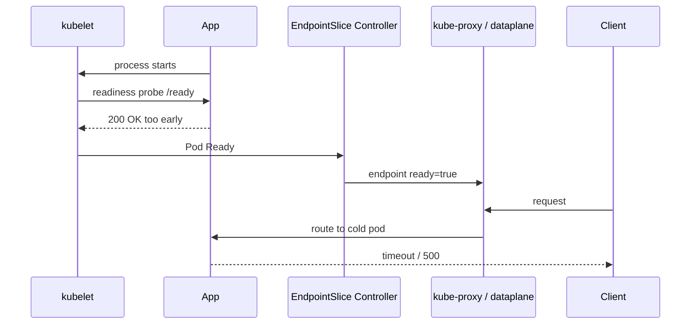

Aplikasi high-throughput sering butuh warmup:

- JIT compilation;
- cache loading;
- connection pool priming;
- schema metadata loading;
- ML model loading;
- TLS session establishment;
- local disk scan;
- service mesh sidecar sync.

Teknik mitigasi:

1. readiness endpoint hanya return OK setelah warmup minimum;
2. gunakan startup probe untuk boot panjang;
3. gunakan slow-start di load balancer/proxy jika tersedia;
4. gunakan canary ramp yang lambat;
5. gunakan preStop + graceful shutdown;
6. ukur first N request latency setelah Pod ready.

---

## 14. Terminating Endpoint dan Graceful Shutdown

Pod deletion bukan kejadian instan. Saat Pod dihentikan, traffic system harus memberi waktu bagi aplikasi menyelesaikan request.

Ideal shutdown sequence:

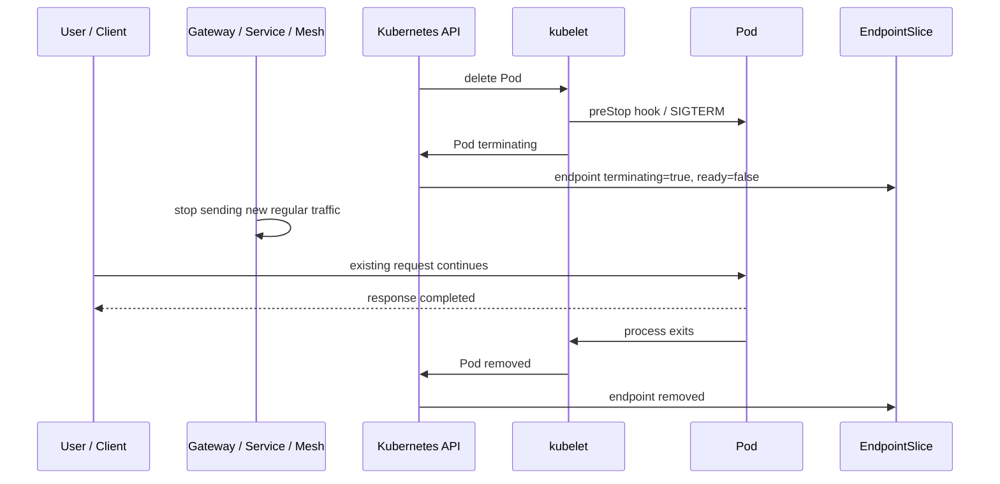

Kegagalan umum:

- aplikasi exit langsung saat SIGTERM;
- terminationGracePeriod terlalu pendek;
- readiness tidak berubah sebelum shutdown;
- preStop sleep dipakai tanpa memahami propagation delay;
- external load balancer masih mengirim traffic;
- client keep-alive connection tetap diarahkan ke Pod terminating;
- endpoint removed sebelum proxy selesai drain.

---

## 15. PreStop Hook: Alat Kasar, Bukan Solusi Utama

Banyak tim memakai `preStop: sleep 10` untuk memberi waktu endpoint propagation.

Contoh:

```yaml
lifecycle:
  preStop:
    exec:
      command: ["/bin/sh", "-c", "sleep 10"]
terminationGracePeriodSeconds: 45
```

Ini bisa membantu, tetapi harus dipahami sebagai kompensasi delay, bukan mekanisme shutdown lengkap.

Yang lebih benar:

1. aplikasi menerima SIGTERM;
2. aplikasi berhenti menerima request baru;
3. readiness menjadi false;
4. aplikasi menyelesaikan in-flight request;
5. aplikasi menutup listener setelah drain;
6. process exit sebelum grace period habis.

Pattern aplikasi:

```text
SIGTERM received
-> mark readiness=false
-> stop accepting new requests
-> wait in-flight requests complete or max drain timeout
-> close dependency clients
-> exit cleanly
```

Jika mesh/proxy digunakan, drain harus disejajarkan antara aplikasi dan proxy. Jika aplikasi sudah mati tetapi sidecar masih menerima request, hasilnya bisa 503. Jika sidecar mati duluan, aplikasi kehilangan outbound path.

---

## 16. Propagation Delay: Dari Pod State ke Data Plane

Endpoint update tidak instant sampai semua consumer.

Pipeline aktual:

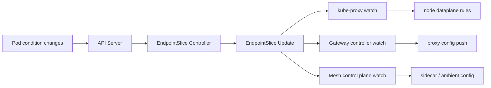

Masing-masing step punya latency:

- kubelet status update delay;
- API server write latency;
- controller reconciliation delay;
- watch delivery delay;
- kube-proxy sync delay;
- proxy config push delay;
- external load balancer health check delay;
- DNS/client cache delay.

Inilah sebabnya incident sering muncul saat rollout, scaling, dan node drain.

Rule:

> Jangan desain shutdown dengan asumsi “readiness false langsung menghentikan traffic”. Desain untuk propagation delay.

---

## 17. Topology Data di EndpointSlice

EndpointSlice dapat membawa informasi topology seperti `nodeName` dan `zone`. Consumer dapat menggunakan data ini untuk membuat routing lebih lokal.

Contoh:

```yaml
endpoints:
  - addresses: ["10.42.1.17"]
    nodeName: worker-a
    zone: ap-southeast-1a
    conditions:
      ready: true
```

Informasi ini penting untuk:

- mengurangi cross-zone traffic cost;
- mengurangi latency;
- menjaga locality;
- mengurangi blast radius;
- membuat failover lebih terkontrol.

Namun topology-aware behavior harus dipahami sebagai preferensi, bukan jaminan mutlak di semua mode dan implementasi.

---

## 18. Topology Aware Routing

Topology Aware Routing bertujuan memprioritaskan endpoint di zone yang sama dengan asal traffic. Ini berguna ketika cluster tersebar di beberapa zone.

Tanpa topology-aware routing:

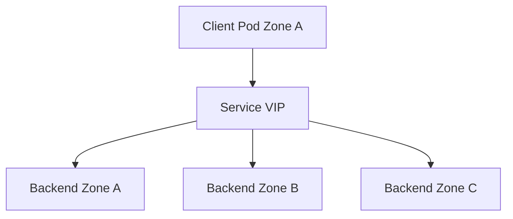

Dengan topology-aware routing:

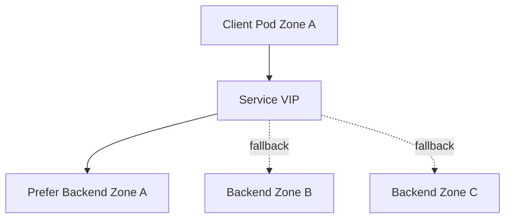

Manfaat:

- lower latency;
- lower cross-zone cost;
- better cache locality;
- zone failure isolation.

Risiko:

- load imbalance jika replica tidak tersebar rata;
- hot zone overload;
- client melihat behavior berbeda tergantung zone;
- failover lebih kompleks;
- observability harus memecah metrik per zone.

Rule:

> Topology-aware routing hanya aman jika workload placement, capacity, autoscaling, dan observability juga topology-aware.

---

## 19. Topology-Aware Routing dan Scheduling

Routing locality tidak bisa berdiri sendiri. Jika semua Pod backend ada di satu zone, topology-aware routing tidak dapat menciptakan locality.

Kombinasi yang sering diperlukan:

- topology spread constraints;
- pod anti-affinity;
- zone-aware autoscaling;
- per-zone capacity planning;
- per-zone SLO dashboard;
- cross-zone fallback policy.

Contoh spread constraint:

```yaml
apiVersion: apps/v1
kind: Deployment
metadata:
  name: payment-api
spec:
  replicas: 6
  selector:
    matchLabels:
      app: payment-api
  template:
    metadata:
      labels:
        app: payment-api
    spec:
      topologySpreadConstraints:
        - maxSkew: 1
          topologyKey: topology.kubernetes.io/zone
          whenUnsatisfiable: DoNotSchedule
          labelSelector:
            matchLabels:
              app: payment-api
```

Jika traffic locality penting, workload distribution harus menjadi bagian dari architecture review, bukan sekadar scheduler optimization.

---

## 20. InternalTrafficPolicy

`internalTrafficPolicy` mengatur bagaimana traffic internal cluster ke ClusterIP diperlakukan.

Nilai umum:

- `Cluster`: traffic bisa diarahkan ke endpoint mana pun dalam cluster.
- `Local`: traffic hanya diarahkan ke endpoint lokal pada node yang sama.

Contoh:

```yaml
apiVersion: v1
kind: Service
metadata:
  name: node-local-agent
spec:
  internalTrafficPolicy: Local
  selector:
    app: node-local-agent
  ports:
    - name: http
      port: 80
      targetPort: 8080
```

Cocok untuk:

- node-local agent;
- log collector;
- metrics agent;
- cache lokal;
- daemonset service.

Risiko:

- traffic drop jika tidak ada endpoint lokal;
- behavior berbeda antar-node;
- rollout DaemonSet bisa menyebabkan gap;
- client harus siap terhadap local unavailability.

Rule:

> `internalTrafficPolicy: Local` adalah locality enforcement, bukan load-balancing preference.

---

## 21. ExternalTrafficPolicy dan Endpoint Locality

Walaupun detail external load balancing akan dibahas di Part 008, kita perlu menyentuh hubungannya dengan endpoint.

`externalTrafficPolicy: Local` membuat node hanya meneruskan external traffic ke endpoint lokal. Ini sering digunakan untuk mempertahankan source IP.

Konsekuensinya:

- node tanpa endpoint lokal tidak boleh dianggap healthy untuk Service itu;
- load balancer perlu health check yang benar;
- replica placement mempengaruhi traffic distribution;
- traffic bisa tidak merata jika endpoint tidak tersebar di semua node/zone.

Mental model:

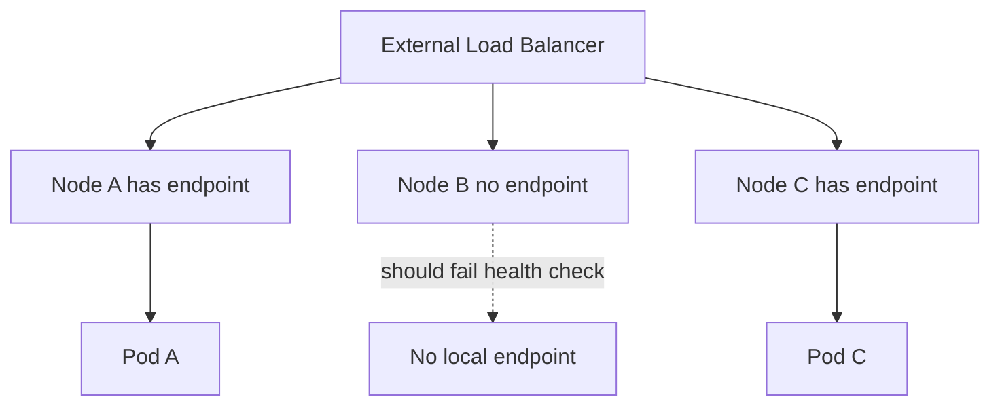

Jika health check salah, external LB bisa mengirim traffic ke node tanpa endpoint lokal, lalu traffic gagal.

---

## 22. EndpointSlice Consumer Tidak Selalu Sama

EndpointSlice dikonsumsi oleh berbagai komponen:

- kube-proxy;
- eBPF service dataplane;
- CoreDNS;
- Gateway controllers;
- Ingress controllers;
- service mesh control plane;
- custom controllers;
- monitoring agents.

Tidak semua consumer memperlakukan condition dan topology sama. Inilah sebabnya dua traffic path ke backend yang sama bisa berbeda.

Contoh:

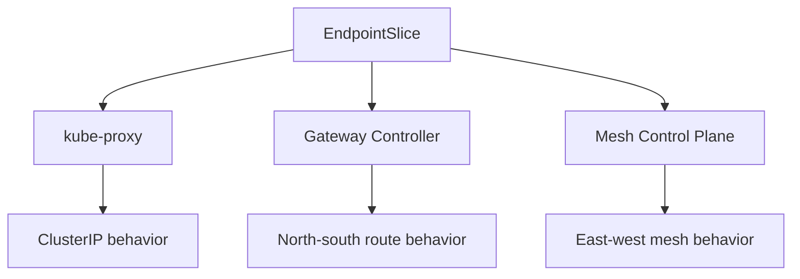

Pertanyaan review:

- Apakah Gateway controller menghormati readiness sama seperti Service path?
- Apakah mesh mengabaikan not-ready endpoint?
- Apakah terminating endpoint dipakai untuk drain?
- Apakah topology hint dipakai?
- Apakah controller punya lag saat watch reconnect?

Top 1% engineer tidak menganggap “Service endpoint ada” sebagai jawaban final. Ia bertanya: **consumer mana yang menggunakan endpoint ini dan bagaimana interpretasinya?**

---

## 23. EndpointSlice dan Gateway API BackendRef

Gateway API route biasanya mereferensikan Service melalui `backendRefs`.

Contoh:

```yaml
apiVersion: gateway.networking.k8s.io/v1
kind: HTTPRoute
metadata:
  name: payment-api
spec:
  parentRefs:
    - name: public-gateway
  rules:
    - backendRefs:
        - name: payment-api
          port: 80
```

Walaupun HTTPRoute menunjuk Service, controller tetap harus menerjemahkan Service ke backend endpoints.

Path konseptual:

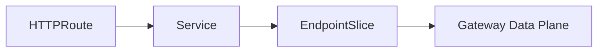

Failure mode:

- Route accepted tetapi Service tidak punya endpoint;
- Service port salah;
- targetPort tidak cocok;
- EndpointSlice terlambat update;
- Gateway controller tidak punya permission membaca EndpointSlice;
- route status tidak cukup diperiksa.

Debug minimal:

```bash
kubectl get httproute -n payments payment-api -o yaml
kubectl get svc -n payments payment-api -o yaml
kubectl get endpointslice -n payments -l kubernetes.io/service-name=payment-api -o yaml
```

---

## 24. EndpointSlice dan Service Mesh

Service mesh sering melakukan endpoint discovery dari Kubernetes API. Dalam sidecar mesh, control plane membaca Service dan EndpointSlice lalu mengirim konfigurasi ke proxy.

Path konseptual:

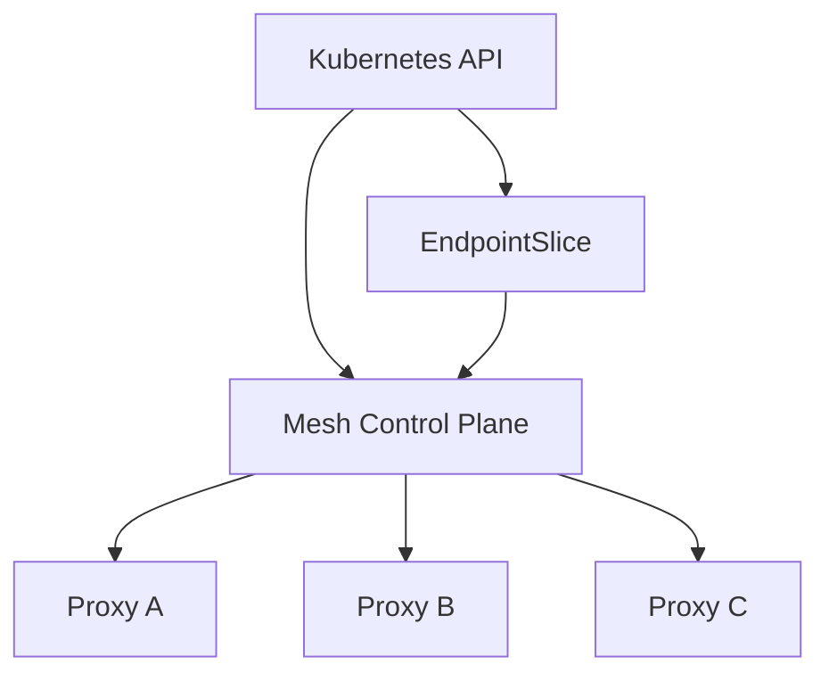

Masalah umum:

- EndpointSlice update benar tetapi proxy belum menerima config;
- proxy menerima endpoint tetapi TLS identity tidak cocok;
- mesh locality LB berbeda dari kube-proxy;
- mTLS policy membuat endpoint terlihat unavailable;
- sidecar resource pressure memperlambat config update.

Dengan mesh, endpoint eligibility tidak berhenti pada Kubernetes readiness. Ada tambahan:

- proxy readiness;
- identity certificate readiness;
- policy acceptance;
- xDS/config sync;
- locality/load-balancing config.

---

## 25. EndpointSlice dan Scale

Pada Service dengan ribuan endpoint, EndpointSlice mengurangi tekanan object besar tetapi tidak menghapus semua masalah scale.

Masalah yang tetap ada:

- banyak watch events saat rollout besar;
- kube-proxy/eBPF update burst;
- Gateway/mesh config push besar;
- DNS record besar untuk headless Service;
- client-side load balancing overload;
- observability cardinality tinggi.

Anti-pattern rollout:

```text
Scale deployment from 1000 old pods to 1000 new pods instantly
-> EndpointSlice churn
-> proxy config churn
-> DNS/cache churn
-> connection churn
-> tail latency spike
```

Mitigasi:

- rolling update yang realistis;
- maxUnavailable/maxSurge sesuai capacity;
- progressive delivery;
- endpoint-aware dashboards;
- controller performance testing;
- proxy config size budget;
- per-zone rollout.

---

## 26. Debugging Endpoint Path

Ketika Service tidak bekerja, jangan langsung edit YAML. Ikuti path evidence.

### 26.1 Cek Service Selector

```bash
kubectl get svc -n payments payment-api -o jsonpath='{.spec.selector}'
```

Bandingkan dengan Pod label:

```bash
kubectl get pod -n payments --show-labels
```

Masalah umum:

- label typo;
- selector terlalu broad;
- selector terlalu narrow;
- canary Pod masuk Service utama tanpa sengaja;
- old Pod masih cocok selector.

### 26.2 Cek EndpointSlice

```bash
kubectl get endpointslice -n payments -l kubernetes.io/service-name=payment-api -o wide
```

Untuk detail:

```bash
kubectl get endpointslice -n payments -l kubernetes.io/service-name=payment-api -o yaml
```

Cari:

- addresses;
- port;
- ready;
- serving;
- terminating;
- nodeName;
- zone;
- targetRef.

### 26.3 Cek Pod Readiness

```bash
kubectl get pod -n payments -l app=payment-api
kubectl describe pod -n payments <pod-name>
```

Cari event:

- readiness probe failed;
- startup probe failed;
- container not ready;
- image pull delay;
- sidecar not ready.

### 26.4 Cek Consumer

Untuk Service path:

```bash
kubectl get nodes
kubectl -n kube-system logs -l k8s-app=kube-proxy
```

Untuk Gateway path:

```bash
kubectl get gateway,httproute -A
kubectl describe httproute -n payments payment-api
```

Untuk mesh path:

```bash
istioctl proxy-status
istioctl proxy-config endpoints <pod>
```

Command mesh bergantung implementasi. Prinsipnya sama: validasi apakah endpoint sudah sampai ke proxy.

---

## 27. Failure Mode: Service Punya Pod, Tetapi Tidak Ada Endpoint

Gejala:

```bash
kubectl get pod -n payments
# Pods running

kubectl get endpointslice -n payments -l kubernetes.io/service-name=payment-api
# No resources found
```

Kemungkinan:

- selector Service tidak cocok;
- Pod belum memiliki IP;
- Pod belum ready;
- namespace salah;
- Service tanpa selector;
- EndpointSlice controller bermasalah;
- label berubah saat rollout.

Investigation:

```bash
kubectl get svc -n payments payment-api -o yaml
kubectl get pod -n payments --show-labels
kubectl get pod -n payments -l app=payment-api -o wide
kubectl describe pod -n payments <pod>
```

Fix bukan langsung membuat EndpointSlice manual. Fix root cause selector/readiness/lifecycle.

---

## 28. Failure Mode: Endpoint Ada, Tetapi Traffic Gagal

Gejala:

- EndpointSlice ada;
- `ready=true`;
- Service DNS resolve;
- request tetap gagal.

Kemungkinan:

- targetPort salah;
- container tidak listening pada port itu;
- NetworkPolicy block;
- kube-proxy/eBPF programming issue;
- app menerima TCP tetapi return 500;
- protocol mismatch;
- mesh mTLS/policy failure;
- node-specific routing issue.

Debug:

```bash
kubectl get endpointslice -n payments -l kubernetes.io/service-name=payment-api -o yaml
kubectl exec -n payments deploy/debug -- nc -vz payment-api 80
kubectl exec -n payments deploy/debug -- curl -v http://payment-api/ready
kubectl exec -n payments <pod> -- ss -lntp
```

Jika direct Pod IP berhasil tetapi Service gagal, curigai Service dataplane. Jika Service berhasil dari satu node tetapi gagal dari node lain, curigai node-level dataplane atau policy.

---

## 29. Failure Mode: Rollout 0-Downtime Tetap Menghasilkan 503

Gejala:

- Deployment rolling update;
- readinessProbe ada;
- maxUnavailable 0;
- tetap ada 503 saat rollout.

Kemungkinan:

- readiness terlalu cepat true;
- shutdown tidak graceful;
- endpoint propagation delay;
- external LB health check delay;
- proxy config push delay;
- connection draining tidak sejajar;
- app close listener sebelum endpoint hilang;
- sidecar drain order salah.

Perbaikan biasanya kombinasi:

```yaml
strategy:
  rollingUpdate:
    maxUnavailable: 0
    maxSurge: 1
```

```yaml
readinessProbe:
  httpGet:
    path: /ready
    port: 8080
  periodSeconds: 5
  failureThreshold: 2
```

```yaml
lifecycle:
  preStop:
    exec:
      command: ["/bin/sh", "-c", "wget -qO- http://127.0.0.1:8080/shutdown-readiness || true; sleep 10"]
terminationGracePeriodSeconds: 60
```

Namun lebih baik aplikasi menangani SIGTERM secara native, bukan hanya preStop sleep.

---

## 30. Failure Mode: Traffic Tidak Merata Karena Locality

Gejala:

- sebagian Pod overload;
- sebagian Pod idle;
- error rate hanya di zone tertentu;
- cross-zone traffic tinggi;
- autoscaling menambah Pod tetapi imbalance tetap terjadi.

Kemungkinan:

- topology-aware routing aktif;
- externalTrafficPolicy Local;
- replica tidak tersebar merata;
- node tanpa endpoint tidak menerima traffic;
- sticky connection;
- long-lived gRPC/WebSocket;
- HPA global tidak memahami zone hotspot.

Debug:

```bash
kubectl get pod -n payments -l app=payment-api -o wide
kubectl get endpointslice -n payments -l kubernetes.io/service-name=payment-api -o yaml | grep -E 'zone:|nodeName:|addresses:'
```

Observability yang dibutuhkan:

- request rate per Pod;
- request rate per node;
- request rate per zone;
- error rate per zone;
- load balancer target distribution;
- connection count per backend.

---

## 31. Designing Readiness for Real Services

Readiness endpoint sebaiknya dibagi dalam layer:

```text
/live   -> process is not deadlocked, should not be killed
/ready  -> safe to receive new user traffic
/startup -> boot completed enough for liveness to start
```

Untuk service biasa:

`/ready` boleh memeriksa:

- HTTP server ready;
- critical config loaded;
- DB connection pool can acquire connection quickly;
- migration compatibility confirmed;
- message producer initialized jika request path memerlukan producer.

`/ready` sebaiknya tidak memeriksa terlalu banyak dependency non-kritikal:

- optional analytics;
- metrics backend;
- tracing backend;
- recommendation service jika fallback tersedia;
- remote dependency lambat yang menyebabkan flapping.

Prinsip:

> Readiness harus menjawab apakah menerima traffic baru akan meningkatkan keberhasilan sistem. Bukan apakah dunia sempurna.

---

## 32. Designing Graceful Termination

Aplikasi sebaiknya memiliki lifecycle eksplisit:

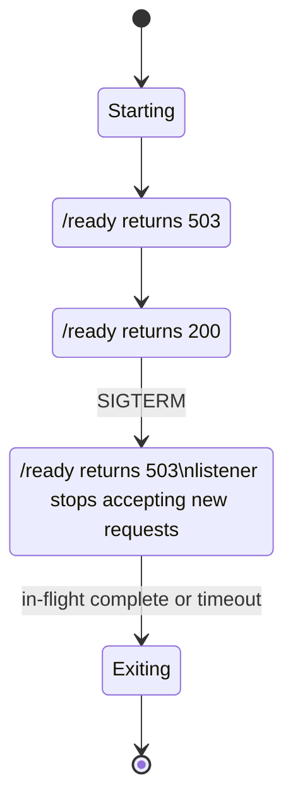

Pseudo-code:

```java
class LifecycleState {
    private final AtomicBoolean acceptingTraffic = new AtomicBoolean(false);
    private final AtomicBoolean shuttingDown = new AtomicBoolean(false);

    boolean ready() {
        return acceptingTraffic.get() && !shuttingDown.get() && dependenciesAreReady();
    }

    void markReady() {
        acceptingTraffic.set(true);
    }

    void beginShutdown() {
        shuttingDown.set(true);
        acceptingTraffic.set(false);
        stopAcceptingNewRequests();
        waitForInflightRequests(Duration.ofSeconds(30));
        closeResources();
    }
}
```

Untuk JVM service, pastikan shutdown hook dan server graceful shutdown benar-benar aktif.

---

## 33. Architecture Review Checklist

Gunakan checklist ini saat review Service production.

### 33.1 Selector dan Ownership

- Apakah Service selector terlalu broad?
- Apakah canary/preview Pod bisa masuk selector utama tanpa sengaja?
- Apakah label governance jelas?
- Apakah Service dimiliki platform atau app team?

### 33.2 Readiness

- Apakah readiness merepresentasikan traffic eligibility?
- Apakah readiness terlalu cepat true?
- Apakah readiness terlalu mudah flapping?
- Apakah readiness dependency-aware tanpa menjadi dependency bomb?
- Apakah startup probe diperlukan?

### 33.3 Endpoint Lifecycle

- Apakah terminating Pod drain dengan benar?
- Apakah grace period cukup?
- Apakah app menangani SIGTERM?
- Apakah mesh/proxy drain disejajarkan?
- Apakah external LB health check delay diperhitungkan?

### 33.4 Topology

- Apakah traffic locality diperlukan?
- Apakah replicas tersebar per zone?
- Apakah dashboard per-zone tersedia?
- Apakah fallback cross-zone aman?
- Apakah cost cross-zone dimonitor?

### 33.5 Consumer

- Consumer mana yang membaca EndpointSlice?
- Apakah kube-proxy/eBPF, Gateway, dan mesh punya behavior konsisten?
- Apakah route status dan endpoint status sama-sama dimonitor?
- Apakah controller lag dimonitor?

---

## 34. Practice Loop Kaufman

Tujuan latihan bukan menghafal field EndpointSlice. Tujuan latihan adalah bisa menghubungkan lifecycle workload ke traffic behavior.

### 34.1 Latihan 1 — Selector Mismatch

Buat Deployment dan Service dengan selector salah. Amati:

```bash
kubectl get svc
kubectl get endpointslice
kubectl get pod --show-labels
```

Target pemahaman:

- Service object bisa valid tanpa endpoint.
- DNS bisa resolve meskipun backend kosong.
- error bukan selalu DNS/network.

### 34.2 Latihan 2 — Readiness Delay

Buat aplikasi yang `/ready` baru OK setelah 30 detik. Amati EndpointSlice condition berubah.

Target pemahaman:

- readiness mempengaruhi endpoint set;
- Pod running tidak berarti menerima traffic;
- rollout behavior dipengaruhi readiness.

### 34.3 Latihan 3 — Graceful Termination

Buat endpoint lambat `/sleep?seconds=20`, lalu delete Pod saat request berjalan.

Target pemahaman:

- terminationGracePeriod;
- endpoint terminating;
- in-flight request;
- proxy/load balancer draining.

### 34.4 Latihan 4 — Topology Awareness

Deploy Pod di beberapa zone atau simulasi dengan labels. Amati endpoint zone dan routing behavior jika environment mendukung.

Target pemahaman:

- locality bergantung placement;
- topology-aware routing tidak otomatis menyelesaikan imbalance;
- observability per-zone wajib.

---

## 35. Key Takeaways

- Endpoint adalah traffic eligibility record, bukan sekadar IP list.
- EndpointSlice adalah primitive modern untuk scaling, conditions, dan topology-aware routing.
- `ready`, `serving`, dan `terminating` harus dipahami sebagai sinyal lifecycle traffic.
- Readiness probe adalah traffic admission signal, bukan health check umum.
- Termination harus didesain sebagai drain protocol antara aplikasi, kubelet, EndpointSlice, proxy, dan load balancer.
- Topology-aware routing hanya aman jika placement dan observability juga topology-aware.
- Gateway dan service mesh juga mengonsumsi endpoint state, tetapi interpretasinya bisa berbeda dari kube-proxy.
- Debugging endpoint harus berbasis evidence: selector → Pod readiness → EndpointSlice → consumer → data plane.

---

## 36. Referensi Utama

- Kubernetes Documentation — EndpointSlices: https://kubernetes.io/docs/concepts/services-networking/endpoint-slices/
- Kubernetes API Reference — EndpointSlice v1: https://kubernetes.io/docs/reference/kubernetes-api/discovery/endpoint-slice-v1/
- Kubernetes Documentation — Service: https://kubernetes.io/docs/concepts/services-networking/service/
- Kubernetes Documentation — Debug Services: https://kubernetes.io/docs/tasks/debug/debug-application/debug-service/
- Kubernetes Documentation — Pod Lifecycle: https://kubernetes.io/docs/concepts/workloads/pods/pod-lifecycle/
- Kubernetes Documentation — Topology Aware Routing: https://kubernetes.io/docs/concepts/services-networking/topology-aware-routing/
- Kubernetes Documentation — Service Internal Traffic Policy: https://kubernetes.io/docs/concepts/services-networking/service-traffic-policy/
