# Part 008 — Load Balancing Models: NodePort, LoadBalancer, and External Traffic

## 1. Tujuan Part Ini

Pada Part 005 kita membahas Service VIP. Pada Part 007 kita membahas EndpointSlice dan readiness-aware routing. Sekarang kita membahas jalur external traffic: bagaimana request dari luar cluster sampai ke backend Pod.

Bagian ini penting karena banyak incident production terjadi bukan karena aplikasi mati, melainkan karena salah satu asumsi external load balancing salah:

- source IP hilang karena SNAT;
- node dianggap healthy padahal tidak punya endpoint lokal;
- cloud load balancer mengirim traffic ke node yang salah;
- external health check tidak sama dengan application readiness;
- cross-zone load balancing menggandakan biaya;
- NodePort terbuka tanpa disadari;
- LoadBalancer Service memberi ilusi L7 behavior padahal hanya L4;
- bare metal load balancer memakai ARP/BGP dengan failure mode berbeda dari cloud.

Target part ini:

> Anda mampu menggambar packet/request path external-to-pod, menjelaskan siapa melakukan load balancing di tiap layer, dan memprediksi failure mode sebelum menjadi incident.

---

## 2. Load Balancing di Kubernetes: Banyak Layer, Bukan Satu Kotak

Kata “load balancer” sering dipakai terlalu umum. Dalam Kubernetes, load balancing bisa terjadi di beberapa tempat:

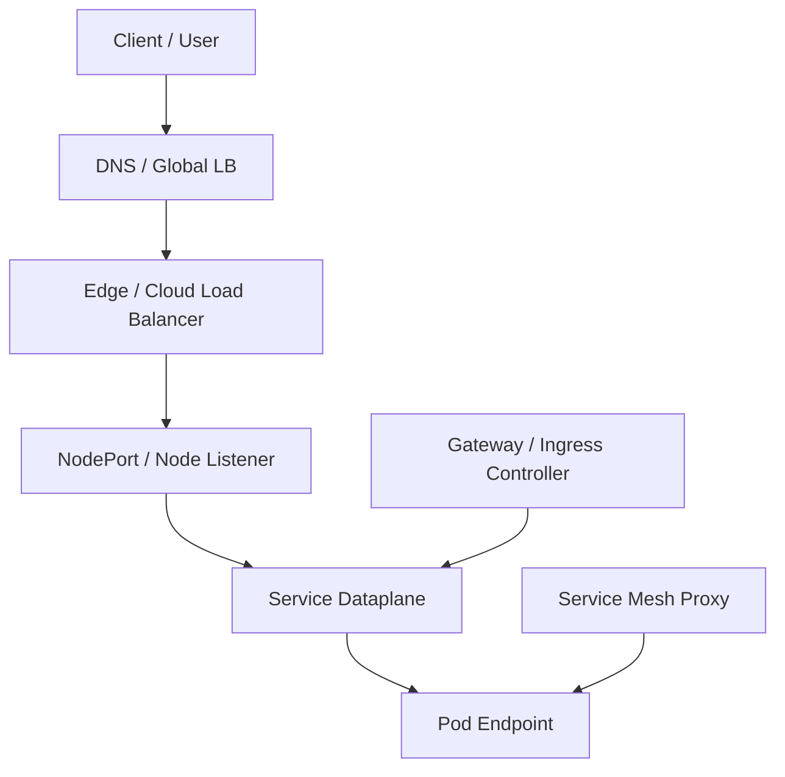

Setiap layer bisa punya algoritma, health check, timeout, dan policy sendiri.

| Layer | Contoh | Umumnya L4/L7 | Risiko Utama |
|---|---|---|---|
| DNS / Global LB | Route53, Cloud DNS, GSLB | DNS/global | slow failover, caching |
| Cloud LB | NLB, ALB, GLB, ELB, Azure LB | L4/L7 tergantung produk | health check mismatch |
| NodePort | kube-proxy/eBPF on node | L4 | exposed node surface |
| Service dataplane | ClusterIP rules | L4 | conntrack, endpoint mismatch |
| Gateway/Ingress | Envoy, NGINX, HAProxy, cloud controller | L7 | route/policy mismatch |
| Mesh | Envoy/Linkerd/Cilium | L4/L7 | proxy config, mTLS |

Top 1% engineer tidak bertanya “pakai load balancer apa?”. Ia bertanya:

> “Layer mana yang mengambil keputusan routing, health mana yang dipakai, dan apakah keputusan antar-layer konsisten?”

---

## 3. Service Type Recap dari Sudut External Traffic

Kubernetes Service punya beberapa type yang relevan untuk exposure.

| Type | Fungsi | External Use Case |
|---|---|---|
| `ClusterIP` | VIP internal cluster | Backend untuk Gateway/Ingress/mesh |
| `NodePort` | Membuka port di setiap node | Integrasi LB external/manual |
| `LoadBalancer` | Meminta provider membuat LB external | Cloud/bare metal external entry |
| `ExternalName` | DNS CNAME abstraction | External dependency alias, bukan traffic proxy |

Contoh `NodePort`:

```yaml
apiVersion: v1
kind: Service
metadata:
  name: payment-api
spec:
  type: NodePort
  selector:
    app: payment-api
  ports:
    - name: http
      port: 80
      targetPort: 8080
      nodePort: 30080
```

Contoh `LoadBalancer`:

```yaml
apiVersion: v1
kind: Service
metadata:
  name: payment-api
spec:
  type: LoadBalancer
  selector:
    app: payment-api
  ports:
    - name: http
      port: 80
      targetPort: 8080
```

Perbedaan penting:

- `NodePort` hanya membuka akses pada node.
- `LoadBalancer` melibatkan controller/provider yang membuat external load balancer.
- Banyak LoadBalancer Service tetap menggunakan NodePort di belakang layar, tergantung provider dan mode.

---

## 4. NodePort: Primitive yang Sering Diremehkan

NodePort membuka port statis pada setiap node cluster. Traffic ke `nodeIP:nodePort` akan diteruskan ke backend Service.

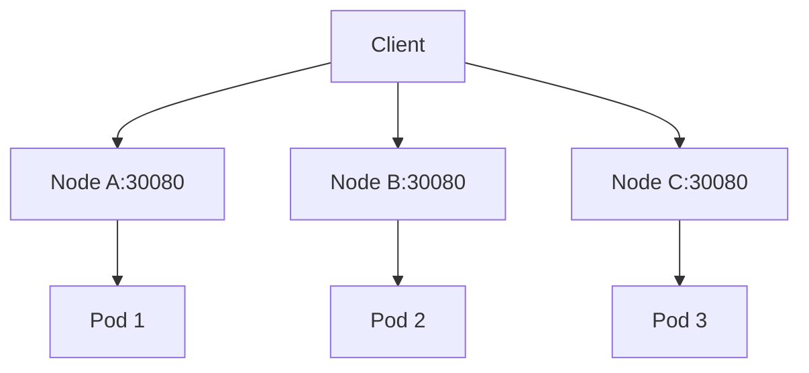

Dalam mode default, node yang menerima traffic tidak harus memiliki Pod backend lokal. Node bisa meneruskan traffic ke Pod di node lain.

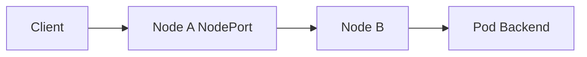

Keuntungan NodePort:

- sederhana;
- useful untuk bare metal/manual LB;
- base primitive untuk banyak LoadBalancer implementation;
- mudah diuji dengan `curl nodeIP:nodePort`.

Risiko NodePort:

- membuka port di semua node;
- memperbesar attack surface;
- tidak punya L7 routing;
- sulit governance jika banyak service;
- security group/firewall harus sinkron;
- source IP behavior bergantung traffic policy;
- node-level health menjadi rumit.

Rule:

> NodePort adalah infrastructure primitive, bukan application API boundary.

---

## 5. NodePort Allocation dan Governance

Kubernetes mengalokasikan NodePort dari range tertentu, umumya `30000-32767`, tetapi cluster dapat mengubahnya.

Masalah governance:

- port collision jika manual;
- firewall rules tidak sinkron;
- tim aplikasi mengekspos NodePort langsung;
- scanning/security posture memburuk;
- observability per-service sulit jika port tidak terdokumentasi.

Praktik yang lebih aman:

- hindari manual NodePort kecuali perlu;
- gunakan LoadBalancer/Gateway sebagai interface resmi;
- audit Service type secara berkala;
- restrict siapa boleh membuat NodePort;
- gunakan policy admission untuk mencegah exposure sembarang;
- dokumentasikan port range dan firewall stance.

Audit cepat:

```bash
kubectl get svc -A --field-selector spec.type=NodePort
```

Namun tidak semua field selector mendukung semua field di semua versi/konfigurasi. Alternatif:

```bash
kubectl get svc -A -o jsonpath='{range .items[?(@.spec.type=="NodePort")]}{.metadata.namespace}{"/"}{.metadata.name}{"\t"}{.spec.ports[*].nodePort}{"\n"}{end}'
```

---

## 6. LoadBalancer Service: Declarative Request to Infrastructure

`type: LoadBalancer` bukan load balancer itu sendiri. Ia adalah deklarasi ke provider/controller:

> “Tolong sediakan external load balancer untuk Service ini.”

Flow umum:

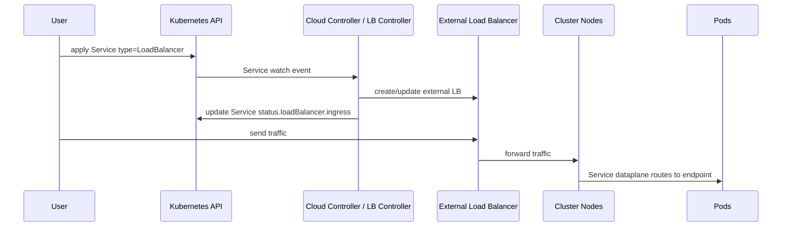

Yang sering disalahpahami:

- Kubernetes API tidak otomatis menjamin LB sudah siap saat Service object created.
- `EXTERNAL-IP` muncul berarti provider mengalokasikan address, bukan berarti semua backend healthy.
- Provider-specific annotation bisa mengubah behavior besar.
- LB bisa L4 atau L7, tergantung implementation.

---

## 7. LoadBalancer Service L4 vs Ingress/Gateway L7

Banyak LoadBalancer Service default bersifat L4: forwarding TCP/UDP ke Service port. Ia tidak memahami path HTTP, header, JWT, rate limit, atau route semantic aplikasi.

Contoh L4:

```text
TCP :443 -> NodePort -> Service -> Pod
```

Contoh L7 dengan Gateway:

```text
HTTPS :443
  host: api.example.com
  path: /payments
  header: x-user-tier=gold
-> backend payment-api-v2
```

Perbandingan:

| Aspek | LoadBalancer Service | Gateway/Ingress |
|---|---|---|
| Primary abstraction | Service | Route/listener/backend |
| Layer | Umumnya L4 | L7 untuk HTTP/gRPC |
| Path/header routing | Tidak native | Ya |
| TLS policy detail | Terbatas/provider-specific | Lebih eksplisit |
| Multi-team route delegation | Lemah | Lebih baik di Gateway API |
| Use case | expose one service/entrypoint | platform ingress/API routing |

Rule:

> Gunakan LoadBalancer Service untuk menyediakan entrypoint. Gunakan Gateway/Ingress untuk application routing jika butuh L7 semantics.

---

## 8. Packet Path: LoadBalancer Service Default Mode

Pada banyak cluster cloud, path default seperti ini:

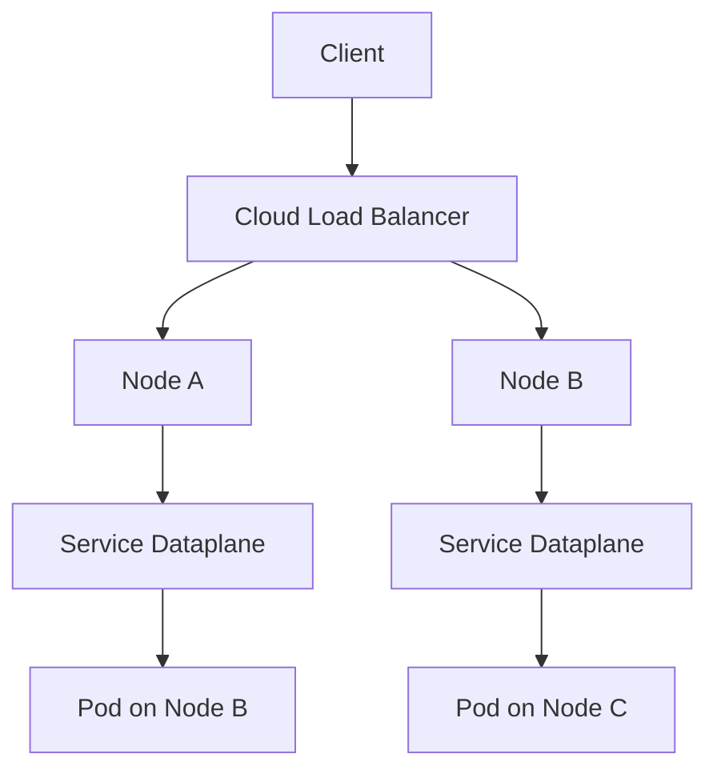

Node yang menerima traffic bisa meneruskan ke Pod di node lain. Ini berarti ada dua tahap load balancing:

1. external LB memilih node;
2. Kubernetes Service dataplane memilih endpoint.

Konsekuensi:

- source IP bisa berubah karena SNAT;
- traffic bisa cross-node;
- traffic bisa cross-zone;
- latency lebih tinggi;
- node health tidak sama dengan app health;
- overload bisa tersembunyi di hop kedua.

---

## 9. `externalTrafficPolicy: Cluster`

Default umumnya adalah `externalTrafficPolicy: Cluster`.

Makna:

- node boleh meneruskan external traffic ke endpoint mana pun di cluster;
- load distribution lebih fleksibel;
- tidak perlu Pod ada di node penerima;
- source IP client sering tidak dipertahankan karena SNAT.

Contoh:

```yaml
apiVersion: v1
kind: Service
metadata:
  name: payment-api
spec:
  type: LoadBalancer
  externalTrafficPolicy: Cluster
  selector:
    app: payment-api
  ports:
    - name: http
      port: 80
      targetPort: 8080
```

Cocok jika:

- source IP asli tidak diperlukan oleh aplikasi;
- ada layer lain yang menyediakan identity/audit;
- ingin traffic distribution fleksibel;
- workload tidak tersebar di semua node.

Risiko:

- audit berdasarkan client IP hilang;
- geo/IP allowlist di aplikasi salah;
- WAF/logging harus berada sebelum SNAT;
- cross-zone traffic bisa meningkat;
- tracing client identity harus pakai header terpercaya dari edge.

---

## 10. `externalTrafficPolicy: Local`

`externalTrafficPolicy: Local` membuat node hanya meneruskan traffic external ke endpoint lokal di node tersebut.

Contoh:

```yaml
apiVersion: v1
kind: Service
metadata:
  name: payment-api
spec:
  type: LoadBalancer
  externalTrafficPolicy: Local
  selector:
    app: payment-api
  ports:
    - name: http
      port: 80
      targetPort: 8080
```

Manfaat utama:

- source IP client bisa dipertahankan;
- menghindari extra hop node-to-node;
- bisa mengurangi cross-zone traffic jika LB target selection tepat;
- node health lebih terkait dengan local endpoint availability.

Risiko:

- node tanpa endpoint lokal harus tidak menerima traffic;
- traffic distribution bergantung placement Pod;
- Pod imbalance menyebabkan traffic imbalance;
- rollout bisa membuat node sementara tanpa endpoint;
- health check external menjadi sangat penting.

Mental model:

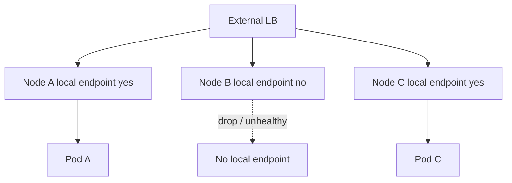

Rule:

> `externalTrafficPolicy: Local` menukar distribution flexibility dengan source IP preservation dan locality. Jangan aktifkan tanpa memastikan placement dan health check.

---

## 11. Source IP Preservation

Source IP penting untuk:

- audit trail;
- abuse detection;
- rate limiting per client;
- geo policy;
- allowlist/denylist;
- legal/compliance tracing;
- fraud detection.

Namun dalam Kubernetes, source IP dapat berubah di beberapa layer:

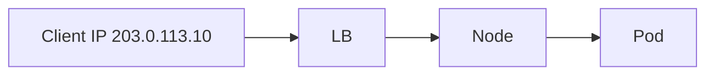

Kemungkinan yang dilihat aplikasi:

- IP client asli;
- IP load balancer;
- IP node;
- IP proxy;
- IP sidecar;
- IP NAT gateway.

Jika aplikasi butuh client IP, jangan hanya mengecek `remoteAddress`. Tentukan chain of custody:

- layer mana yang pertama menerima client traffic;
- apakah layer itu trusted;
- apakah ia menulis `X-Forwarded-For` atau `Forwarded` header;
- apakah header dari client dibersihkan sebelum dipakai;
- apakah source IP harus ada di network layer atau cukup di application header.

Rule:

> Source IP adalah security/audit contract. Perlakukan sebagai data sensitif yang bisa dipalsukan jika trust boundary salah.

---

## 12. Health Check: Node Health vs Service Health vs App Health

External LB perlu tahu target mana yang boleh menerima traffic. Pertanyaannya: health check mengukur apa?

Tiga level:

| Level | Menjawab | Risiko |
|---|---|---|
| Node health | Node reachable? | App bisa mati tetapi node healthy |
| Service health | Node punya endpoint local? | App readiness bisa terlalu dangkal |
| App health | App path ready? | Bisa terlalu mahal/fragile |

Untuk `externalTrafficPolicy: Local`, Kubernetes dapat mengalokasikan `healthCheckNodePort`. Port ini digunakan untuk health check node terkait Service.

Contoh inspeksi:

```bash
kubectl get svc -n payments payment-api -o yaml | grep -i healthCheckNodePort
```

Konsep:

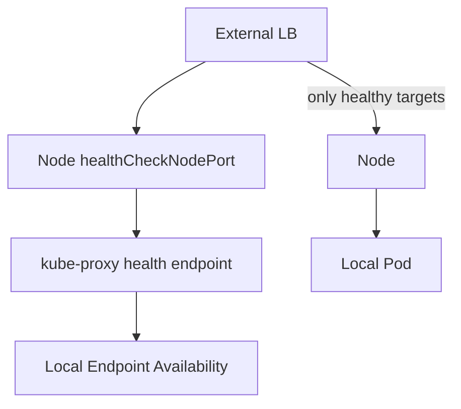

Masalah umum:

- health check terlalu shallow;
- health check port diblok firewall;
- LB health interval terlalu lambat;
- app not ready tetapi Service health still OK;
- node has endpoint but endpoint overloaded;
- external LB marks node healthy during rollout gap.

---

## 13. Cloud Load Balancer Integration

Cloud provider biasanya menyediakan controller yang mengubah Service menjadi resource cloud.

Yang perlu direview:

- type LB: network vs application;
- internal vs internet-facing;
- subnet selection;
- security group/firewall;
- target type: node vs pod/IP;
- health check protocol/path/port;
- cross-zone load balancing;
- idle timeout;
- proxy protocol;
- TLS termination;
- annotations/provider-specific config;
- deletion protection;
- static IP allocation.

Contoh generic annotation pattern:

```yaml
metadata:
  annotations:
    service.beta.kubernetes.io/<provider-specific-key>: "value"
```

Bahaya annotation:

- tidak portable;
- behavior bisa berubah antar provider/controller version;
- sulit diaudit oleh application team;
- bisa mengubah exposure public/private;
- bisa membuat drift dari standard platform.

Prinsip platform:

> Jangan biarkan semua tim menulis annotation load balancer bebas. Sediakan abstraction atau policy guardrail.

---

## 14. Target Type: Node Target vs Pod/IP Target

Beberapa provider/controller dapat menargetkan node, sementara yang lain dapat menargetkan Pod IP langsung.

### 14.1 Node Target

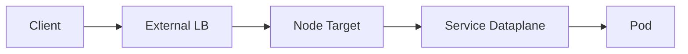

Kelebihan:

- cocok dengan NodePort;
- sederhana;
- tidak perlu LB mengetahui Pod IP dynamic;
- bekerja pada banyak CNI.

Kekurangan:

- extra hop;
- source IP/SNAT complexity;
- node health vs pod health mismatch;
- cross-zone/cross-node cost.

### 14.2 Pod/IP Target

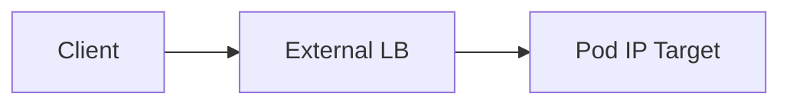

Kelebihan:

- mengurangi hop;
- health check bisa lebih dekat ke Pod;
- traffic distribution bisa lebih direct;
- mengurangi NodePort exposure.

Kekurangan:

- butuh CNI/routing support;
- target churn tinggi saat rollout;
- LB target registration delay mempengaruhi readiness;
- security group/firewall lebih kompleks;
- Pod IP reachability harus dijamin dari LB.

---

## 15. Cross-Zone Load Balancing

Pada cluster multi-zone, external traffic bisa memiliki biaya dan latency berbeda tergantung routing.

Path mahal:

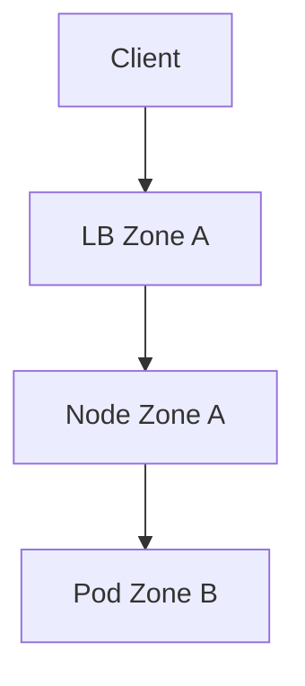

Dengan `externalTrafficPolicy: Cluster`, node di Zone A bisa meneruskan traffic ke Pod di Zone B. Ini bisa menghasilkan cross-zone cost dan latency.

Dengan `externalTrafficPolicy: Local`, traffic hanya ke local endpoint pada node penerima, tetapi load distribution bergantung apakah setiap zone/node memiliki endpoint.

Review questions:

- Apakah cross-zone LB aktif?
- Apakah Service endpoint tersebar per zone?
- Apakah externalTrafficPolicy sesuai kebutuhan source IP/cost?
- Apakah HPA memperhitungkan zone hotspot?
- Apakah dashboard memecah traffic per zone?
- Apakah failure satu zone mengubah traffic ke zone lain dengan aman?

---

## 16. Internal vs External LoadBalancer

Banyak provider mendukung LoadBalancer internal/private dan external/public.

Internal LB digunakan untuk:

- private service antar VPC/VNet;
- private API antar sistem;
- internal gateway;
- data service exposure terbatas;
- hybrid connectivity.

External LB digunakan untuk:

- public internet API;
- public web ingress;
- edge traffic.

Risiko paling serius:

- Service yang seharusnya internal menjadi public;
- public LB dibuat karena annotation hilang;
- subnet/tagging salah;
- DNS public menunjuk endpoint internal atau sebaliknya;
- firewall/security group terlalu permissive.

Admission policy yang sehat:

- default deny public LoadBalancer;
- namespace tertentu saja boleh public;
- require annotation/class tertentu;
- require owner label;
- require security review label;
- restrict allowed ports.

---

## 17. `loadBalancerClass`

Kubernetes mendukung `loadBalancerClass` untuk memilih implementasi LoadBalancer tertentu. Ini berguna ketika cluster memiliki beberapa controller load balancer.

Contoh:

```yaml
apiVersion: v1
kind: Service
metadata:
  name: payment-api
spec:
  type: LoadBalancer
  loadBalancerClass: platform.example.com/private-nlb
  selector:
    app: payment-api
  ports:
    - name: http
      port: 80
      targetPort: 8080
```

Manfaat:

- lebih eksplisit daripada annotation liar;
- memisahkan public/private implementation;
- mendukung platform governance;
- mengurangi ambiguity controller ownership.

Risiko:

- class salah membuat Service pending;
- controller tidak mendukung class;
- tim tidak tahu semantic class;
- migration controller lebih sulit jika class terlanjur menjadi contract luas.

Rule:

> Treat `loadBalancerClass` as platform API. Dokumentasikan semantic-nya seperti Anda mendokumentasikan public interface.

---

## 18. `allocateLoadBalancerNodePorts`

Pada beberapa environment, LoadBalancer Service tidak perlu NodePort. Kubernetes memiliki field `allocateLoadBalancerNodePorts` untuk mengontrol apakah NodePort otomatis dialokasikan untuk LoadBalancer Service.

Contoh:

```yaml
apiVersion: v1
kind: Service
metadata:
  name: payment-api
spec:
  type: LoadBalancer
  allocateLoadBalancerNodePorts: false
  selector:
    app: payment-api
  ports:
    - name: http
      port: 80
      targetPort: 8080
```

Cocok jika:

- LB implementation menargetkan Pod IP langsung;
- NodePort tidak diperlukan;
- ingin mengurangi exposed node surface.

Jangan gunakan tanpa memastikan controller mendukung mode tersebut. Jika controller masih butuh NodePort, Service bisa gagal menerima traffic.

---

## 19. Bare Metal Load Balancing

Di cloud, LoadBalancer Service biasanya dipenuhi provider. Di bare metal, tidak ada cloud LB default. Solusi umum adalah MetalLB atau integrasi network appliance.

MetalLB secara umum menyediakan LoadBalancer untuk cluster bare metal dengan protokol routing standar. Dua model umum:

- Layer 2 mode;
- BGP mode.

### 19.1 Layer 2 Mode

Layer 2 mode mengiklankan IP service pada jaringan lokal dengan menjawab ARP/NDP.

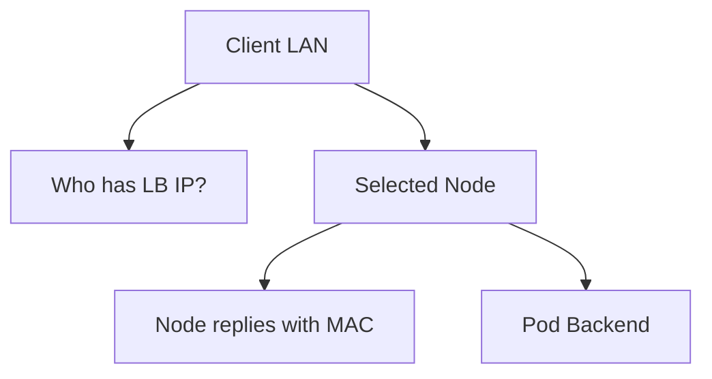

Kelebihan:

- sederhana;
- tidak butuh router BGP;
- cocok untuk lab/small environment.

Kekurangan:

- satu node biasanya menjadi speaker untuk IP tertentu;
- failover bergantung ARP/NDP convergence;
- bandwidth dibatasi node speaker;
- node failure butuh re-announcement;
- tidak sefleksibel BGP untuk scale.

### 19.2 BGP Mode

BGP mode mengiklankan route LoadBalancer IP ke router.

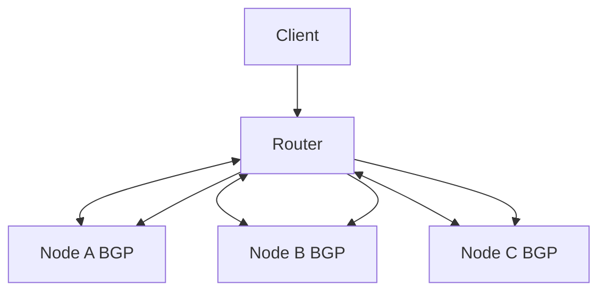

Kelebihan:

- lebih scalable;
- network-native;
- bisa ECMP;
- lebih baik untuk production network dengan router yang mendukung.

Kekurangan:

- butuh skill routing;
- misconfig bisa mempengaruhi jaringan luas;
- observability lintas Kubernetes dan router harus siap;
- policy route dan firewall lebih kompleks.

---

## 20. ARP, NDP, BGP, dan Failure Domain

Bare metal membuat Kubernetes networking bertemu langsung dengan network engineering klasik.

Pertanyaan penting:

- Siapa mengiklankan IP LoadBalancer?
- Apa yang terjadi jika node speaker mati?
- Berapa lama ARP cache client/router expire?
- Apakah switch/router menerima gratuitous ARP?
- Apakah BGP session punya hold timer yang sesuai?
- Apakah ECMP menyebabkan connection rehash?
- Apakah firewall stateful memahami failover path?

Top 1% engineer harus bisa bicara dengan network engineer memakai bahasa yang sama:

- ARP/NDP;
- route advertisement;
- ECMP;
- next-hop;
- asymmetric routing;
- route convergence;
- failure domain;
- stateful firewall.

---

## 21. ExternalIPs

Kubernetes Service mendukung `externalIPs`, tetapi ini bukan load balancer yang otomatis provisioned. Traffic ke external IP tersebut akan diarahkan oleh Kubernetes jika network luar mengirim traffic ke node.

Contoh:

```yaml
apiVersion: v1
kind: Service
metadata:
  name: payment-api
spec:
  externalIPs:
    - 192.0.2.40
  selector:
    app: payment-api
  ports:
    - name: http
      port: 80
      targetPort: 8080
```

Risiko:

- Kubernetes tidak mengatur route external agar IP itu sampai ke node;
- IP ownership bisa ambigu;
- security policy bisa keliru;
- bentrok dengan network infra;
- sulit diaudit.

Gunakan dengan sangat hati-hati. Pada platform besar, lebih baik pakai LoadBalancer/Gateway dengan class dan policy yang jelas.

---

## 22. ExternalName Bukan Load Balancing

`ExternalName` membuat Service sebagai alias DNS CNAME ke nama external.

Contoh:

```yaml
apiVersion: v1
kind: Service
metadata:
  name: external-billing
spec:
  type: ExternalName
  externalName: billing.partner.example.com
```

Ini tidak membuat proxy, NAT, health check, atau load balancing Kubernetes.

Cocok untuk:

- naming abstraction;
- migration DNS;
- menyembunyikan external hostname dari aplikasi.

Tidak cocok untuk:

- traffic policy;
- retries;
- circuit breaking;
- mTLS;
- egress control;
- health-aware failover.

Untuk external dependency dengan policy, pertimbangkan egress gateway, service mesh ServiceEntry, atau dedicated proxy pattern. Ini akan dibahas di Part 029.

---

## 23. Load Balancer Health Check Mismatch

Failure mode klasik:

```text
Load balancer target healthy
Kubernetes endpoint ready
Application still returns 500 for real request
```

Mengapa?

- LB check hanya TCP connect;
- readiness `/ready` terlalu dangkal;
- real path butuh dependency yang tidak dicek;
- route path berbeda dari health path;
- TLS SNI berbeda;
- app overload tetapi health check ringan tetap OK;
- node-level health tidak mengecek Pod readiness.

Health check design:

| Check | Use Case | Hati-hati |
|---|---|---|
| TCP | L4 reachability | tidak tahu app logic |
| HTTP `/healthz` | process/app up | bisa terlalu dangkal |
| HTTP `/ready` | traffic eligibility | jangan terlalu mahal |
| Synthetic transaction | end-to-end confidence | mahal, jangan jadi LB check utama |

Prinsip:

> LB health check harus cukup dekat dengan traffic eligibility, tetapi tidak boleh menjadi dependency amplifier yang membuat sistem flapping.

---

## 24. Idle Timeout dan Long-Lived Connections

External LB sering memiliki idle timeout. Ini penting untuk:

- WebSocket;
- gRPC streaming;
- Server-Sent Events;
- database connections;
- message brokers;
- long polling.

Masalah:

- LB menutup koneksi idle;
- client mengira server reset;
- proxy timeout lebih pendek dari app timeout;
- keepalive tidak sesuai;
- rolling update memutus stream tanpa drain.

Review timeout chain:

```text
client timeout
-> DNS/LB timeout
-> Gateway timeout
-> Service/proxy timeout
-> application server timeout
-> upstream dependency timeout
```

Rule:

> Timeout harus disusun dari luar ke dalam atau dari dalam ke luar secara sadar. Jangan biarkan default tiap layer berkompetisi.

---

## 25. TLS Termination Placement

External traffic sering memakai TLS. Pertanyaan utama: TLS berakhir di mana?

Pilihan:

1. TLS terminate di cloud LB;
2. TLS terminate di Gateway/Ingress;
3. TLS passthrough sampai Pod;
4. TLS terminate lalu re-encrypt ke backend;
5. mTLS internal setelah edge termination.

Diagram:

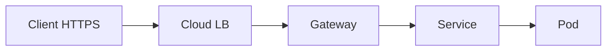

Jika TLS terminate di LB:

- LB melihat HTTP;
- cert dikelola di provider;
- traffic LB ke cluster bisa plaintext kecuali re-encrypt;
- source of truth TLS policy ada di cloud.

Jika TLS terminate di Gateway:

- Kubernetes/Gateway mengelola cert reference;
- route policy lebih dekat ke app;
- LB bisa TCP passthrough;
- operational complexity pindah ke cluster.

Part 013 akan membahas TLS mendalam. Di sini poinnya: load balancer decision dan TLS boundary tidak boleh dipisah dalam review.

---

## 26. Security Boundary: NodePort dan Public Exposure

NodePort bisa menjadi jalur bypass jika firewall membiarkan akses langsung ke node.

Contoh risiko:

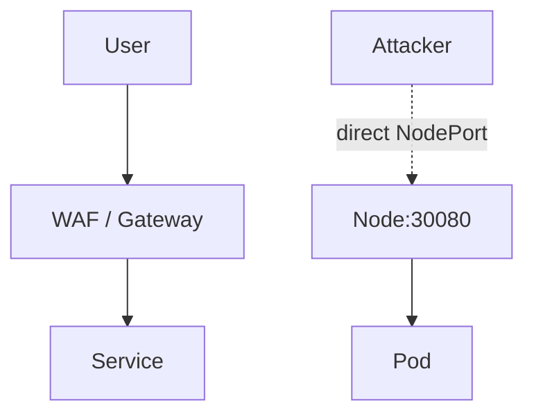

Jika NodePort bisa diakses publik, attacker bisa melewati:

- WAF;
- auth gateway;
- rate limit;
- request normalization;
- TLS policy;
- logging edge;
- bot protection.

Mitigasi:

- firewall node dari internet;
- restrict NodePort range;
- disable/avoid NodePort where possible;
- use private subnets;
- admission policy untuk Service type;
- scan exposure dari luar;
- require Gateway path untuk public services.

---

## 27. LoadBalancer as Platform Contract

Dalam organisasi besar, Service `type: LoadBalancer` tidak boleh menjadi keputusan bebas tiap tim aplikasi.

Kenapa?

- membuat resource cloud berbiaya;
- membuka network surface;
- mengubah DNS dan cert chain;
- mempengaruhi security posture;
- sulit inventory;
- bisa membuat jalur bypass dari Gateway standard.

Platform contract yang lebih sehat:

```yaml
metadata:
  labels:
    platform.example.com/exposure: internal
    platform.example.com/owner: payments
    platform.example.com/data-classification: confidential
spec:
  type: LoadBalancer
  loadBalancerClass: platform.example.com/internal-l4
```

Dengan admission rule:

- public LB hanya namespace tertentu;
- require owner label;
- require approved class;
- reject unknown annotations;
- restrict ports;
- require NetworkPolicy;
- require monitoring annotation.

---

## 28. Debugging External Traffic Path

Debug external traffic harus memisahkan layer.

### 28.1 Cek Service Status

```bash
kubectl get svc -n payments payment-api -o wide
kubectl describe svc -n payments payment-api
```

Cari:

- type;
- external IP/hostname;
- ports;
- nodePort;
- externalTrafficPolicy;
- healthCheckNodePort;
- events.

### 28.2 Cek Endpoint

```bash
kubectl get endpointslice -n payments -l kubernetes.io/service-name=payment-api -o wide
```

Tanpa endpoint sehat, LB yang bagus pun tidak menyelamatkan.

### 28.3 Test Dari Dalam Cluster

```bash
kubectl exec -n payments deploy/debug -- curl -v http://payment-api
kubectl exec -n payments deploy/debug -- curl -v http://<pod-ip>:8080
```

Jika internal gagal, jangan fokus dulu ke LB external.

### 28.4 Test NodePort

```bash
curl -v http://<node-ip>:<node-port>
```

Uji beberapa node. Jika satu node gagal dan node lain berhasil, curigai:

- local endpoint;
- externalTrafficPolicy;
- kube-proxy/eBPF;
- firewall node;
- CNI route.

### 28.5 Cek External LB

Gunakan provider CLI/dashboard untuk mengecek:

- target health;
- health check config;
- listener;
- target group/backend pool;
- security group/firewall;
- subnet;
- cross-zone setting;
- access logs.

---

## 29. Failure Mode: `EXTERNAL-IP` Pending

Gejala:

```bash
kubectl get svc
# EXTERNAL-IP: <pending>
```

Kemungkinan:

- cluster tidak punya cloud controller/LB controller;
- bare metal tanpa MetalLB atau equivalent;
- annotation/class salah;
- quota cloud habis;
- subnet/tagging salah;
- permission controller kurang;
- loadBalancerClass tidak dikenali;
- provider API error.

Debug:

```bash
kubectl describe svc -n payments payment-api
kubectl get events -n payments --sort-by=.lastTimestamp
kubectl logs -n kube-system deploy/<cloud-controller-or-lb-controller>
```

Fix bergantung provider. Jangan membuat NodePort public manual sebagai bypass tanpa review.

---

## 30. Failure Mode: LB Healthy tetapi Request 503

Kemungkinan:

- LB health check hanya TCP;
- Gateway/Ingress backend tidak sehat;
- Service endpoint kosong saat rollout;
- app readiness salah;
- targetPort mismatch;
- policy/mesh mTLS block;
- timeout di proxy;
- connection draining buruk.

Investigation sequence:

```text
External LB target health
-> NodePort reachability
-> Service endpoint existence
-> Pod readiness
-> Direct Pod request
-> Gateway/Ingress logs
-> App logs
-> Policy/mesh telemetry
```

Jangan terpaku pada satu dashboard. Health di satu layer bukan health end-to-end.

---

## 31. Failure Mode: Source IP Hilang

Gejala:

- aplikasi melihat IP node/LB, bukan client;
- rate limit semua user dianggap satu IP;
- audit tidak bisa menelusuri user origin;
- geo policy salah.

Kemungkinan:

- `externalTrafficPolicy: Cluster`;
- LB melakukan proxy/NAT;
- Gateway menulis `X-Forwarded-For` tetapi app tidak membaca;
- header dibersihkan oleh intermediate proxy;
- app mempercayai spoofed header dari client.

Fix strategy:

1. Tentukan apakah butuh network-level source IP atau header-level client identity.
2. Jika network-level, pertimbangkan `externalTrafficPolicy: Local` dan LB mode yang mendukung.
3. Jika header-level, pastikan edge proxy membersihkan dan menulis header terpercaya.
4. Validasi app hanya mempercayai header dari trusted proxy.
5. Tambahkan logging chain.

---

## 32. Failure Mode: Traffic Imbalance

Gejala:

- beberapa Pod menerima traffic jauh lebih banyak;
- zone tertentu overload;
- node tertentu CPU tinggi;
- rollout canary tidak sesuai bobot.

Kemungkinan:

- externalTrafficPolicy Local;
- Pod tidak tersebar merata;
- long-lived connections;
- LB algorithm connection-based;
- sticky sessions;
- cross-zone LB disabled;
- topology-aware routing;
- HPA tidak zone-aware.

Debug:

```bash
kubectl get pod -n payments -l app=payment-api -o wide
kubectl get svc -n payments payment-api -o yaml | grep -E 'externalTrafficPolicy|internalTrafficPolicy|trafficDistribution'
```

Observability wajib:

- requests per Pod;
- connections per target;
- LB target distribution;
- per-zone request rate;
- per-zone error rate;
- endpoint count per zone.

---

## 33. Failure Mode: Bare Metal Failover Lambat

Gejala:

- LoadBalancer IP tetap ada;
- node speaker mati;
- client masih mengirim ke MAC lama;
- beberapa client pulih lebih cepat dari yang lain;
- failover tergantung switch/router behavior.

Kemungkinan Layer 2:

- ARP cache lama;
- gratuitous ARP tidak diterima;
- node failover speaker lambat;
- switch security membatasi MAC move.

Kemungkinan BGP:

- hold timer terlalu lama;
- route withdrawal lambat;
- ECMP rehash memutus connection;
- router policy salah;
- firewall state asymmetric.

Mitigasi:

- test failover nyata;
- ukur convergence time;
- dokumentasikan router/switch behavior;
- gunakan BGP untuk kebutuhan scale/HA yang lebih tinggi;
- monitoring route advertisement;
- game day network failure.

---

## 34. Design Patterns

### 34.1 Public HTTP API Pattern

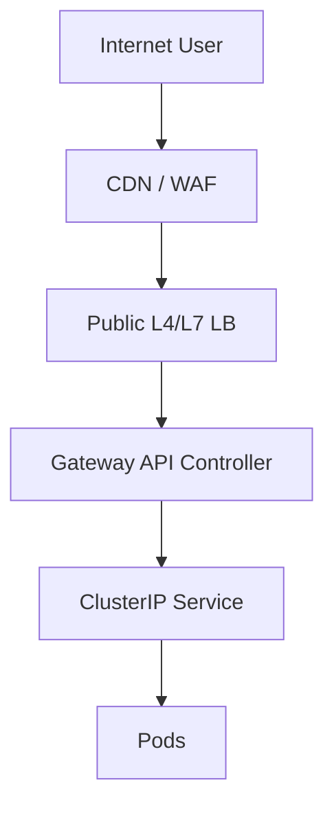

Gunakan ketika:

- butuh route per host/path;
- butuh TLS policy;
- butuh WAF/rate limit;
- banyak team berbagi entrypoint.

### 34.2 Internal L4 Service Pattern

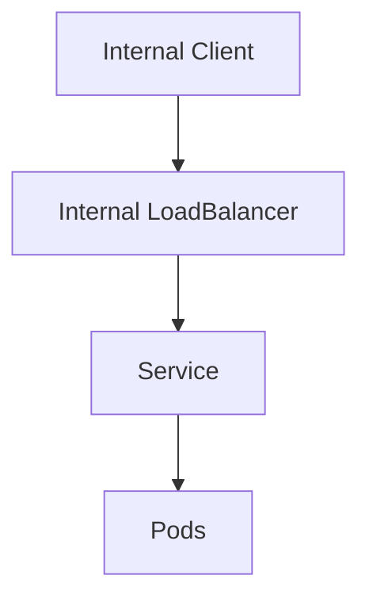

Gunakan ketika:

- protocol bukan HTTP;
- consumer berada di private network;
- butuh stable private IP;
- L7 Gateway tidak relevan.

### 34.3 Bare Metal BGP Pattern

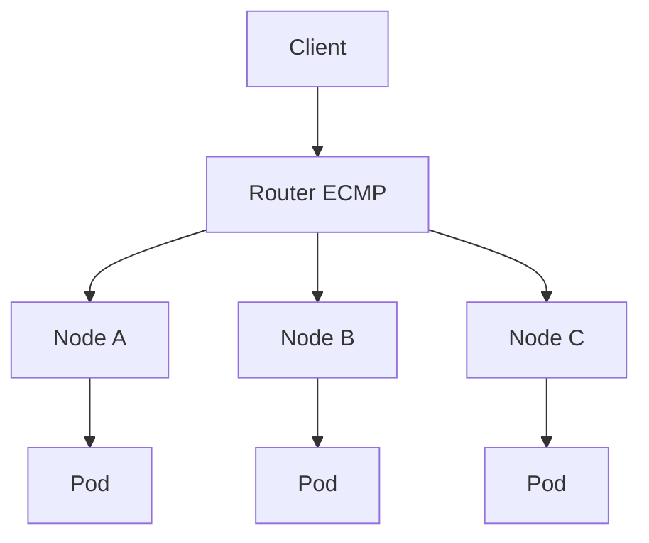

Gunakan ketika:

- punya network team/router support;
- butuh HA lebih baik dari single speaker;
- traffic volume besar;
- ingin network-native advertisement.

---

## 35. Architecture Review Checklist

### 35.1 Exposure

- Apakah Service harus public, internal, atau cluster-only?
- Apakah ada jalur bypass lewat NodePort?
- Apakah firewall/security group sesuai?
- Apakah namespace ini boleh membuat LB?

### 35.2 Load Balancing

- LB memilih node atau Pod?
- Ada berapa tahap load balancing?
- Apakah cross-zone LB aktif?
- Apakah long-lived connection mempengaruhi distribution?
- Apakah algorithm diketahui?

### 35.3 Source IP

- Apakah aplikasi butuh source IP asli?
- Apakah `externalTrafficPolicy` sesuai?
- Apakah trusted proxy header chain aman?
- Apakah app tahan terhadap spoofed `X-Forwarded-For`?

### 35.4 Health Check

- Health check mengukur node, Service, atau app?
- Apakah health check path sama dengan readiness semantic?
- Apakah health check interval terlalu lambat untuk failover?
- Apakah health check bisa menyebabkan flapping?

### 35.5 Cost dan Topology

- Apakah traffic cross-zone dimonitor?
- Apakah endpoint tersebar per zone?
- Apakah failover zone diuji?
- Apakah externalTrafficPolicy Local menyebabkan imbalance?

### 35.6 Provider/Bare Metal

- Apakah annotation/class terdokumentasi?
- Apakah controller support field yang dipakai?
- Apakah LB deletion lifecycle aman?
- Untuk bare metal: apakah ARP/BGP convergence diuji?

---

## 36. Practice Loop Kaufman

### 36.1 Latihan 1 — NodePort Path

Buat Service NodePort, lalu test dari beberapa node.

```bash
kubectl get svc -o wide
curl -v http://<node-a-ip>:<node-port>
curl -v http://<node-b-ip>:<node-port>
```

Target:

- pahami node tidak harus punya Pod lokal;
- lihat perbedaan behavior jika externalTrafficPolicy berubah;
- mapping node-to-pod traffic.

### 36.2 Latihan 2 — Source IP

Deploy echo server yang mencetak remote address dan headers. Bandingkan:

- ClusterIP dari Pod lain;
- NodePort;
- LoadBalancer dengan `externalTrafficPolicy: Cluster`;
- LoadBalancer dengan `externalTrafficPolicy: Local`.

Target:

- pahami kapan source IP berubah;
- pahami trusted proxy header;
- jangan mengandalkan asumsi.

### 36.3 Latihan 3 — Health Check Mismatch

Buat `/healthz` selalu OK tetapi `/ready` gagal saat dependency mati. Lihat bagaimana LB dan Kubernetes bereaksi.

Target:

- bedakan LB health dan app readiness;
- ukur propagation delay;
- rancang health check lebih baik.

### 36.4 Latihan 4 — Bare Metal Simulation

Jika memakai lab lokal, install MetalLB dan coba Layer 2 mode. Matikan node speaker dan ukur failover.

Target:

- pahami ARP/NDP behavior;
- pahami convergence;
- jangan menyamakan bare metal dengan cloud LB.

---

## 37. Key Takeaways

- Load balancing Kubernetes bukan satu layer; external LB, NodePort, Service dataplane, Gateway, dan mesh bisa semuanya mengambil keputusan routing.
- NodePort adalah primitive infrastructure dan harus dikontrol sebagai exposure surface.
- LoadBalancer Service adalah request declarative ke controller/provider, bukan jaminan app-ready external traffic.
- `externalTrafficPolicy: Cluster` memberi fleksibilitas tetapi sering menghilangkan source IP.
- `externalTrafficPolicy: Local` mempertahankan source IP dan locality, tetapi membuat placement dan health check jauh lebih penting.
- Health check harus dipahami sebagai contract: node health, service health, dan app health tidak sama.
- Cloud provider annotations dan `loadBalancerClass` adalah platform API; kelola dengan governance.
- Bare metal load balancing membawa failure mode ARP/NDP/BGP yang harus diuji, bukan diasumsikan.
- Debug external traffic harus layer-by-layer: LB → node/NodePort → Service → EndpointSlice → Pod → policy/proxy/app.

---

## 38. Referensi Utama

- Kubernetes Documentation — Service: https://kubernetes.io/docs/concepts/services-networking/service/
- Kubernetes Documentation — Create an External Load Balancer: https://kubernetes.io/docs/tasks/access-application-cluster/create-external-load-balancer/
- Kubernetes Documentation — Using Source IP: https://kubernetes.io/docs/tutorials/services/source-ip/
- Kubernetes API Reference — Service v1: https://kubernetes.io/docs/reference/kubernetes-api/core/service-v1/
- Kubernetes Documentation — Virtual IPs and Service Proxies: https://kubernetes.io/docs/reference/networking/virtual-ips/
- Kubernetes Documentation — EndpointSlices: https://kubernetes.io/docs/concepts/services-networking/endpoint-slices/
- MetalLB Documentation: https://metallb.io/
- MetalLB Configuration: https://metallb.io/configuration/
