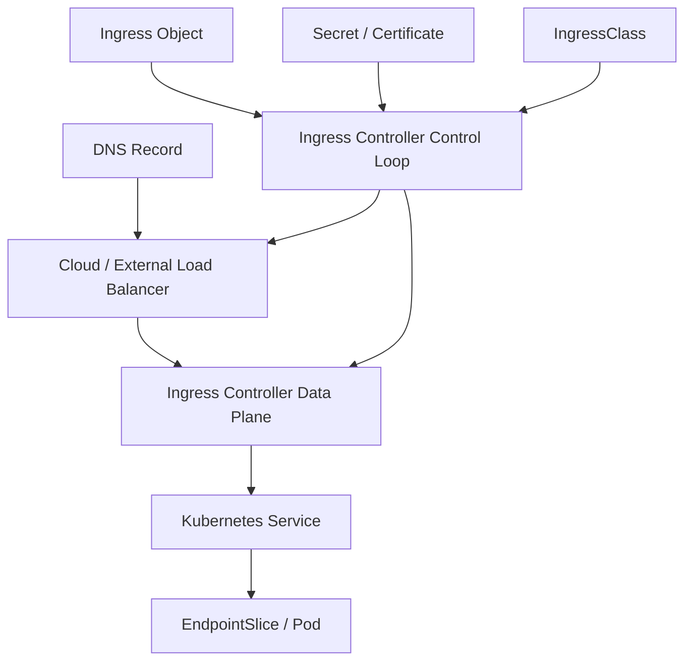
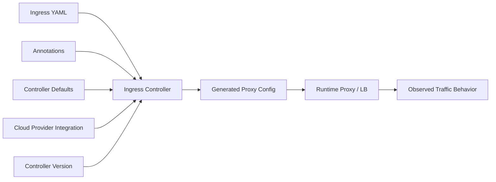
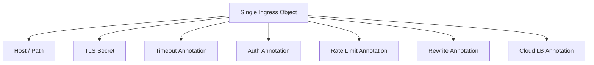
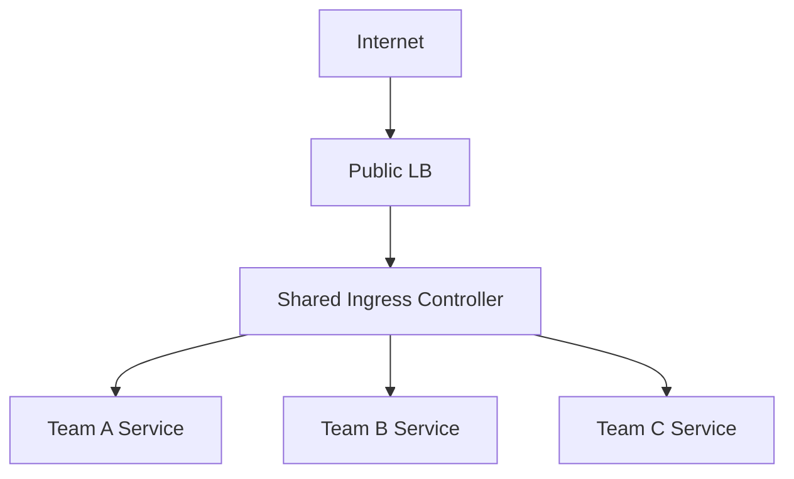
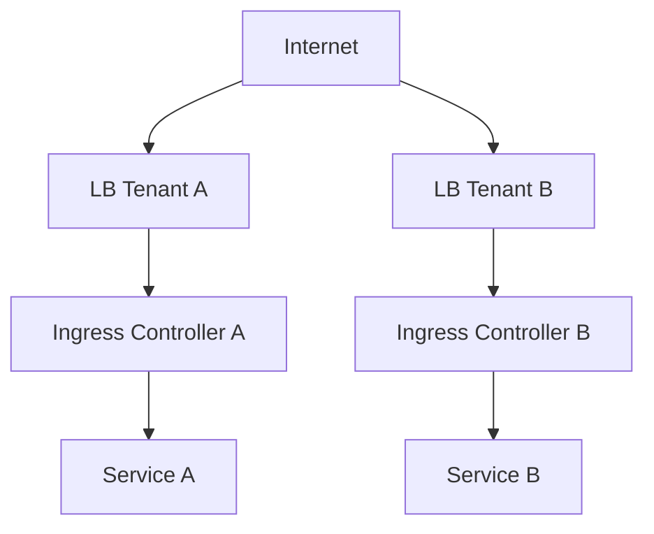
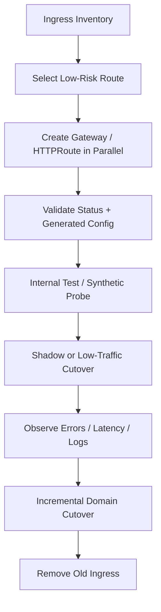

# Part 009 — Ingress Model, Limitations, and Migration Pressure

## 1. Tujuan Part Ini

Pada Part 008 kita membahas external traffic lewat `Service` type `NodePort` dan `LoadBalancer`. Sekarang kita naik satu layer: **Ingress**.

Ingress adalah API Kubernetes yang mengelola akses HTTP/HTTPS dari luar cluster menuju Service di dalam cluster. Secara konseptual, Ingress membuat routing berdasarkan host, path, dan TLS termination. Namun di production, Ingress jarang hanya menjadi “routing YAML”. Ia menjadi titik temu antara:

- cloud load balancer;
- reverse proxy;
- TLS certificate;
- DNS;
- security policy;
- WAF;
- app team ownership;
- platform team ownership;
- annotation-specific controller behavior;
- migration path menuju Gateway API.

Target part ini:

> Anda mampu menjelaskan apa yang Ingress lakukan, apa yang tidak dapat diekspresikan Ingress secara portabel, kenapa annotation-driven design menjadi masalah, dan bagaimana menyiapkan migrasi ke Gateway API secara aman.

Kita tidak akan membahas “cara expose hello world dengan Ingress”. Itu materi basic. Fokus kita adalah membaca Ingress sebagai **contract yang terlalu sempit untuk banyak kebutuhan traffic modern**.

---

## 2. Mental Model: Ingress Bukan Load Balancer, Tetapi Desired Routing Intent

Kesalahan umum:

> “Ingress adalah load balancer.”

Lebih akurat:

> `Ingress` adalah Kubernetes API object yang menyatakan desired HTTP routing behavior. Realisasi behavior tersebut dilakukan oleh **Ingress Controller**, yang biasanya memprogram reverse proxy atau cloud load balancer.

Diagram mentalnya:



Ingress object sendiri tidak mengalirkan packet. Yang bekerja adalah controller dan data plane yang dipilih.

Karena itu, saat debugging Ingress, pertanyaan pertama bukan “YAML-nya benar atau tidak?”. Pertanyaan yang lebih tepat:

1. Apakah ada controller yang mengklaim Ingress ini?
2. Apakah controller berhasil menerjemahkannya ke konfigurasi data plane?
3. Apakah data plane sudah menerima konfigurasi terbaru?
4. Apakah external load balancer/DNS mengarah ke data plane yang benar?
5. Apakah Service dan endpoint backend sehat?
6. Apakah TLS/certificate/hostname cocok?
7. Apakah annotation yang dipakai didukung oleh controller tersebut?

---

## 3. Ingress API Surface: Sederhana, Stabil, tetapi Sempit

Ingress stabil di Kubernetes `networking.k8s.io/v1`. API dasarnya kecil.

Konsep utamanya:

| Elemen | Fungsi |
|---|---|
| `Ingress` | Menyatakan aturan external HTTP/HTTPS routing |
| `IngressClass` | Menghubungkan Ingress ke controller tertentu |
| `rules.host` | Hostname yang dicocokkan |
| `http.paths` | Path match menuju backend |
| `pathType` | Jenis path matching: `Exact`, `Prefix`, atau `ImplementationSpecific` |
| `backend.service` | Service tujuan |
| `tls` | Secret untuk TLS termination |
| annotation | Extension non-portable untuk fitur tambahan |

Contoh minimal:

```yaml
apiVersion: networking.k8s.io/v1
kind: Ingress
metadata:
  name: orders-public
  namespace: app-orders
spec:
  ingressClassName: nginx
  tls:
    - hosts:
        - orders.example.com
      secretName: orders-example-com-tls
  rules:
    - host: orders.example.com
      http:
        paths:
          - path: /api/orders
            pathType: Prefix
            backend:
              service:
                name: orders-api
                port:
                  number: 8080
```

YAML di atas terlihat cukup jelas. Tetapi ia menyembunyikan banyak keputusan penting:

- Siapa yang membuat public load balancer?
- Apakah TLS di-terminate di edge, controller, atau dua-duanya?
- Apakah request header diubah?
- Apakah ada timeout default?
- Apakah ada retry?
- Apakah ada rate limit?
- Apakah client IP dipertahankan?
- Apakah path rewrite terjadi?
- Apakah backend protocol HTTP, HTTPS, HTTP/2, atau gRPC?
- Apakah controller menerima path ini dengan prioritas yang sama dengan controller lain?

Sebagian besar jawaban tidak ada di spec Ingress portable. Jawabannya sering berada di annotation atau dokumentasi controller.

---

## 4. IngressClass: Binding Controller, Bukan Jaminan Behavior

`IngressClass` memberi cara untuk menyatakan controller mana yang seharusnya menangani Ingress.

Contoh:

```yaml
apiVersion: networking.k8s.io/v1
kind: IngressClass
metadata:
  name: nginx
spec:
  controller: k8s.io/ingress-nginx
```

Lalu Ingress memakai:

```yaml
spec:
  ingressClassName: nginx
```

Namun `IngressClass` hanya menyelesaikan **selection problem**. Ia tidak menyelesaikan **semantic portability problem**.

Dua controller bisa sama-sama valid sebagai Ingress controller, tetapi berbeda dalam:

- default timeout;
- path precedence;
- regex support;
- header manipulation;
- rewrite semantics;
- backend protocol detection;
- WebSocket handling;
- gRPC support;
- TLS behavior;
- canary annotation support;
- auth integration;
- rate limiting;
- WAF integration;
- status reporting;
- cloud resource provisioning.

Jadi, `IngressClass` menjawab:

> “Controller mana yang memproses resource ini?”

Ia tidak menjawab:

> “Apakah behavior resource ini portable antar-controller?”

Untuk engineer platform, ini pembeda penting.

---

## 5. Controller adalah Bagian dari Contract

Dalam Kubernetes, kita sering berpikir bahwa API object adalah contract. Untuk Ingress, itu hanya separuh benar. Contract real Ingress adalah:

```text
Ingress API + IngressClass + Controller Implementation + Annotation Set + Data Plane Behavior + Cloud Integration
```

Contoh:



Karena itu, saat melakukan review produksi, jangan hanya review YAML. Review juga:

- versi controller;
- release notes controller;
- CRD tambahan controller;
- annotation yang dipakai;
- default config map controller;
- RBAC controller;
- class ownership;
- cloud load balancer resources yang dibuat;
- generated config jika bisa diinspeksi;
- controller status/error events.

### Review Smell

Jika sebuah platform memiliki banyak annotation seperti ini:

```yaml
metadata:
  annotations:
    nginx.ingress.kubernetes.io/rewrite-target: /
    nginx.ingress.kubernetes.io/proxy-read-timeout: "120"
    nginx.ingress.kubernetes.io/proxy-send-timeout: "120"
    nginx.ingress.kubernetes.io/proxy-body-size: "20m"
    nginx.ingress.kubernetes.io/use-regex: "true"
    nginx.ingress.kubernetes.io/enable-cors: "true"
    nginx.ingress.kubernetes.io/auth-url: "http://auth.ns.svc.cluster.local/verify"
    nginx.ingress.kubernetes.io/limit-rps: "20"
```

Maka resource tersebut tidak lagi “Ingress portable”. Ia adalah resource spesifik untuk NGINX Ingress Controller.

Ini bukan selalu salah. Yang salah adalah **menganggapnya portable**.

---

## 6. Annotation-Driven Extensibility: Kenapa Awalnya Praktis, Lalu Menjadi Beban

Ingress sengaja memiliki API kecil. Untuk kebutuhan advanced, controller memakai annotation. Ini awalnya praktis karena:

- cepat menambah fitur tanpa mengubah Kubernetes API;
- tidak perlu menunggu standardisasi;
- controller bisa mengekspos kemampuan unik;
- kompatibel dengan model metadata Kubernetes.

Namun di skala platform, annotation menghasilkan masalah struktural.

### 6.1 Tidak Strongly Typed

Annotation adalah string map.

```yaml
metadata:
  annotations:
    nginx.ingress.kubernetes.io/proxy-read-timeout: "60"
```

Kubernetes API server tidak tahu apakah `"60"` valid sebagai duration, integer, second, atau string. Validasi ada di controller, sering baru terlihat setelah resource diterima.

Akibatnya:

- manifest valid secara Kubernetes tetapi invalid bagi controller;
- error muncul sebagai event/status yang sering tidak diperiksa pipeline;
- typo bisa tidak terlihat;
- policy enforcement sulit.

### 6.2 Tidak Portable

Annotation `nginx.ingress.kubernetes.io/rewrite-target` tidak otomatis berarti apa pun bagi controller lain.

Jika organisasi pindah dari NGINX ke Envoy, Kong, HAProxy, Traefik, Istio, atau cloud-native LB, annotation harus diterjemahkan manual.

### 6.3 Tidak Memiliki Ownership Model yang Kuat

Annotation sering mencampur concern application dan infrastructure:

| Concern | Seharusnya Dimiliki Oleh | Contoh |
|---|---|---|
| Host/path app | App team | `/api/orders` |
| TLS policy | Platform/security | min TLS version, cipher |
| Rate limit global | Platform/API governance | tenant quota |
| Auth integration | Security/platform | external auth |
| Timeout | App + platform | latency contract |
| Cloud LB config | Infra/platform | private/public LB |

Dalam Ingress, semua bisa ditaruh dalam satu object dengan annotation. Ini memudahkan app team bergerak cepat, tetapi memperbesar risiko privilege dan blast radius.

### 6.4 Sulit Dikomposisikan

Jika beberapa tim perlu memodifikasi behavior route yang sama, annotation tidak memberi model composition yang rapi.

Contoh:

- security ingin menambahkan auth policy;
- platform ingin default timeout;
- app ingin path rewrite;
- SRE ingin rate limit;
- compliance ingin access log policy.

Pada Ingress annotation, semua sering berakhir di satu object. Akibatnya ownership kabur.

---

## 7. Ingress Path Matching: Sumber Banyak Bug

Ingress path matching punya `pathType`:

| `pathType` | Makna |
|---|---|
| `Exact` | Cocok dengan path persis |
| `Prefix` | Cocok berdasarkan prefix path element |
| `ImplementationSpecific` | Diserahkan ke controller |

Contoh:

```yaml
paths:
  - path: /api
    pathType: Prefix
    backend:
      service:
        name: api
        port:
          number: 8080
  - path: /api/admin
    pathType: Prefix
    backend:
      service:
        name: admin
        port:
          number: 8080
```

Pertanyaan review:

- Apakah `/apiadmin` match `/api`?
- Apakah `/api/` dan `/api` diperlakukan sama?
- Jika dua path match, mana yang menang?
- Apakah controller melakukan normalization path?
- Apakah encoded slash diperlakukan sama?
- Apakah trailing slash mengubah backend?

Spec Kubernetes menjelaskan behavior `Exact` dan `Prefix`, tetapi detail controller, rewrite, dan normalisasi masih perlu diuji.

### Production Incident Pattern

```text
/api/admin     -> admin-service
/api           -> public-api-service
```

Jika order/rule precedence atau rewrite salah, request admin bisa jatuh ke backend publik atau sebaliknya.

Ini bukan hanya availability problem. Ini bisa menjadi authorization boundary problem.

---

## 8. TLS di Ingress: Secret Reference Bukan Trust Architecture

Ingress mendukung TLS dengan referensi Secret:

```yaml
spec:
  tls:
    - hosts:
        - api.example.com
      secretName: api-example-com-tls
```

Ini menyatakan bahwa controller boleh memakai Secret tersebut untuk TLS termination pada hostname terkait.

Namun masih ada banyak keputusan arsitektur:

- siapa menerbitkan sertifikat;
- bagaimana renewal dilakukan;
- apakah cert-manager dipakai;
- apakah wildcard cert diperbolehkan;
- apakah private key tersebar ke banyak namespace;
- apakah TLS terminate di cloud LB atau Ingress controller;
- apakah backend connection plaintext atau TLS;
- apakah backend cert diverifikasi;
- apakah mTLS diperlukan;
- apakah HSTS di-set;
- apakah redirect HTTP ke HTTPS dilakukan;
- apakah TLS minimum version dipaksa.

Ingress TLS field tidak cukup untuk menyatakan semua policy tersebut secara portable.

### Anti-Pattern: Secret Sprawl

Banyak namespace memiliki copy certificate wildcard:

```text
team-a/wildcard-example-com-tls
team-b/wildcard-example-com-tls
team-c/wildcard-example-com-tls
```

Risikonya:

- private key tersebar;
- rotation tidak konsisten;
- namespace compromise berdampak luas;
- audit sulit;
- ownership kabur.

Gateway API memperbaiki sebagian masalah ini dengan role separation dan model reference yang lebih eksplisit, tetapi tetap perlu policy platform.

---

## 9. Backend Protocol Problem

Ingress secara historis sangat HTTP/HTTPS oriented. Banyak controller menambah dukungan gRPC, WebSocket, HTTPS backend, atau protocol-specific behavior lewat annotation.

Contoh masalah:

| Kebutuhan | Ingress Portable? | Biasanya Dibutuhkan |
|---|---:|---|
| HTTP path routing | Ya | native rule |
| TLS termination | Ya | `tls.secretName` |
| gRPC routing | Tergantung | annotation/controller behavior |
| HTTP/2 upstream | Tergantung | annotation/controller config |
| Backend TLS verification | Tergantung | annotation/CRD tambahan |
| TCP routing | Tidak sebagai Ingress core | controller-specific CRD/config |
| UDP routing | Tidak sebagai Ingress core | controller-specific CRD/config |
| Rate limiting | Tidak | annotation/CRD/API gateway |
| Retries/timeouts | Tidak portable | annotation/CRD |
| Auth policy | Tidak portable | annotation/CRD |

Ini menjelaskan kenapa banyak platform akhirnya punya “Ingress plus custom CRD plus ConfigMap plus annotation plus sidecar plus API gateway”.

Masalah bukan bahwa solusi itu tidak bisa jalan. Masalahnya: **contract menyebar ke terlalu banyak tempat**.

---

## 10. Multi-Team Cluster: Ingress Tidak Memiliki Role Model yang Cukup

Bayangkan platform shared cluster:

- platform team mengelola load balancer dan controller;
- security team mengatur TLS dan auth baseline;
- app team mengatur host/path milik aplikasi;
- SRE team mengatur timeout dan observability;
- compliance team butuh audit log policy.

Dalam Ingress, object sering terlihat seperti ini:



Semua concern menumpuk di satu object. Ini membuat review dan policy sulit.

### 10.1 Boundary Yang Sering Kabur

App team seharusnya bisa menyatakan:

> “Route `/orders` ke Service `orders-api`.”

Tetapi seharusnya tidak selalu bisa menyatakan:

> “Gunakan public internet-facing load balancer, ubah TLS behavior, bypass auth, disable proxy buffering, dan naikkan body size menjadi 500 MB.”

Pada Ingress annotation, perbedaan ini sering sulit dipaksa tanpa admission control tambahan.

### 10.2 Blast Radius

Satu Ingress controller shared untuk banyak tenant bisa menjadi shared blast radius:

- satu annotation buruk memicu reload besar;
- satu route regex mahal memengaruhi CPU proxy;
- satu wildcard host conflict mengganggu route lain;
- satu config map global mengubah semua behavior;
- satu certificate renewal failure memengaruhi banyak domain.

Top 1% engineer selalu bertanya:

> “Apakah shared ingress layer ini memiliki isolation yang sesuai dengan blast radius bisnis?”

---

## 11. Status, Events, dan Observability Ingress

Ingress memiliki `status.loadBalancer`, tetapi status ini tidak cukup untuk semua behavior.

Contoh:

```yaml
status:
  loadBalancer:
    ingress:
      - hostname: a1b2c3.elb.amazonaws.com
```

Status ini menjawab:

> “Ada address external yang diasosiasikan.”

Ia tidak selalu menjawab:

- apakah route berhasil diprogram;
- apakah TLS secret valid;
- apakah annotation valid;
- apakah backend ditemukan;
- apakah proxy reload sukses;
- apakah cloud LB health check sehat;
- apakah rule conflict terjadi;
- apakah generated config sesuai intent.

Karena itu debugging Ingress harus multi-layer:

```bash
kubectl describe ingress -n app-orders orders-public
kubectl get ingressclass
kubectl logs -n ingress-nginx deploy/ingress-nginx-controller
kubectl get svc -n ingress-nginx
kubectl get endpointslice -n app-orders -l kubernetes.io/service-name=orders-api
kubectl run curl --rm -it --image=curlimages/curl -- sh
```

Untuk controller berbasis Envoy/NGINX/HAProxy, inspect generated config atau admin endpoint sering diperlukan.

---

## 12. Ingress Controller Deployment Topologies

Ingress controller bisa dideploy dengan beberapa model.

### 12.1 Shared Public Controller



Kelebihan:

- murah;
- operasional sederhana;
- mudah untuk small/mid cluster.

Risiko:

- shared blast radius;
- noisy neighbor;
- policy enforcement kompleks;
- tenant isolation lemah;
- config reload besar.

### 12.2 Dedicated Controller per Environment/Tenant



Kelebihan:

- isolation lebih baik;
- failure domain lebih kecil;
- ownership jelas.

Biaya:

- resource lebih tinggi;
- certificate/DNS management lebih banyak;
- governance perlu standar.

### 12.3 Cloud-Native Ingress Controller

Controller memprogram cloud L7 load balancer secara langsung.

Kelebihan:

- integrasi cloud kuat;
- managed dataplane;
- autoscaling/edge integration.

Risiko:

- cloud-specific behavior;
- provisioning latency;
- biaya per route/rule/LB;
- portability rendah.

---

## 13. Common Production Failure Modes

### 13.1 Ingress Accepted oleh API Server, Tetapi Tidak Diproses Controller

Gejala:

- `kubectl apply` sukses;
- tidak ada external address;
- route tidak aktif.

Kemungkinan:

- `ingressClassName` salah;
- tidak ada default IngressClass;
- controller tidak watch namespace tersebut;
- RBAC controller kurang;
- controller crash;
- controller menolak annotation invalid.

Debug:

```bash
kubectl get ingressclass
kubectl describe ingress -n <ns> <name>
kubectl logs -n <controller-ns> deploy/<controller>
```

### 13.2 Host Conflict

Dua Ingress mengklaim hostname/path overlap.

```yaml
# team-a
host: api.example.com
path: /

# team-b
host: api.example.com
path: /billing
```

Jika controller menggabungkan rules, hasilnya bisa valid. Jika ownership tidak jelas, team-b mungkin tanpa sadar menumpang domain team-a.

Mitigasi:

- host ownership registry;
- admission policy;
- namespace delegation model;
- Gateway API `AllowedRoutes`/delegation pattern;
- route inventory.

### 13.3 TLS Secret Salah Namespace

Ingress hanya bisa mereferensikan Secret di namespace yang sama.

Gejala:

- default certificate muncul;
- browser menunjukkan cert mismatch;
- controller log menunjukkan missing secret.

Mitigasi:

- cert-manager per namespace;
- centralized gateway with controlled secret references;
- avoid wildcard secret sprawl;
- automated certificate status checks.

### 13.4 Path Rewrite Mengubah Semantik API

Contoh:

```text
Client: /api/orders/123
Backend expects: /orders/123
```

Rewrite sering controller-specific. Jika migrasi controller, semantics bisa berubah.

Mitigasi:

- test route translation;
- contract test dari edge ke backend;
- avoid hidden rewrite when possible;
- prefer backend supporting stable base path.

### 13.5 Body Size dan Timeout Default Tidak Sesuai

Ingress controller sering punya default body size dan timeout. App upload file besar atau long polling bisa gagal.

Gejala:

- 413 Payload Too Large;
- 504 Gateway Timeout;
- sporadic disconnect;
- WebSocket close.

Mitigasi:

- define app traffic profile;
- default platform policy;
- explicit timeout/body limits;
- SLO-aware route review.

### 13.6 Controller Reload Menjadi Bottleneck

Beberapa controller melakukan reload saat config berubah. Pada jumlah Ingress besar, perubahan kecil bisa memicu reload mahal.

Gejala:

- latency spike saat deploy;
- dropped connection;
- CPU spike di controller;
- config sync lag.

Mitigasi:

- batched rollout;
- controller scaling;
- route segmentation;
- controller dengan dynamic config model;
- avoid large monolithic ingress config.

---

## 14. Ingress vs API Gateway vs Gateway API

Istilah ini sering tertukar.

| Konsep | Apa Itu | Fokus |
|---|---|---|
| Ingress | Kubernetes API object untuk external HTTP/HTTPS routing | Simple routing ke Service |
| Ingress Controller | Controller/data plane yang merealisasikan Ingress | Proxy/LB implementation |
| API Gateway | Produk/pattern untuk API management | Auth, quota, developer portal, API lifecycle, monetization, transformation |
| Gateway API | Kubernetes API family untuk routing L4/L7 yang lebih ekspresif dan role-oriented | Platform networking API |

Gateway API bukan otomatis menggantikan seluruh API gateway product. Gateway API memperbaiki Kubernetes traffic API surface. API gateway bisa tetap dibutuhkan untuk domain API management yang lebih luas.

Decision heuristic:

| Kebutuhan | Ingress | Gateway API | API Gateway Product |
|---|---:|---:|---:|
| Simple host/path routing | Cocok | Cocok | Bisa, mungkin overkill |
| Multi-tenant platform routing | Lemah | Kuat | Tergantung produk |
| Typed route filters | Lemah | Lebih baik | Kuat |
| L4/TCP/UDP route standardization | Lemah | Lebih baik | Tergantung |
| API keys/developer portal | Lemah | Bukan fokus utama | Kuat |
| Rate limit enterprise | Controller-specific | Policy/extension | Kuat |
| Cross-team delegation | Lemah | Kuat | Tergantung |
| Portability | Sedang-rendah | Lebih tinggi | Vendor-specific |

---

## 15. Migration Pressure: Kenapa Banyak Platform Bergerak ke Gateway API

Ingress tetap berguna dan masih banyak dipakai. Namun beberapa tekanan mendorong organisasi menuju Gateway API.

### 15.1 Feature Pressure

Kebutuhan modern:

- canary weighted routing;
- header-based routing;
- request mirroring;
- better TLS policy;
- gRPC awareness;
- TCP/TLS route;
- cross-namespace delegation;
- route status conditions;
- policy attachment;
- multi-controller conformance.

Ingress core tidak mengekspresikan banyak hal ini secara portable.

### 15.2 Ownership Pressure

Shared cluster butuh pemisahan role:

- infra/platform mengelola GatewayClass/Gateway;
- app team mengelola Route;
- security mengelola policy;
- namespace owner diberi delegation terbatas.

Ingress tidak dirancang cukup kuat untuk model ini.

### 15.3 Governance Pressure

Organisasi ingin policy yang bisa divalidasi:

- typed fields;
- status conditions;
- conformance profiles;
- admission policy;
- default/override model;
- inventory linting.

Annotation string map sulit untuk governance besar.

### 15.4 Portability Pressure

Organisasi ingin tidak terkunci terlalu kuat ke satu controller. Gateway API tidak menghilangkan semua lock-in, tetapi memberi standard API surface yang lebih luas.

---

## 16. Cara Berpikir Migrasi dari Ingress ke Gateway API

Migrasi bukan “replace YAML”. Migrasi adalah perubahan ownership dan contract.

### 16.1 Jangan Mulai dari Syntax

Pendekatan lemah:

```text
Ingress YAML -> HTTPRoute YAML
```

Pendekatan lebih baik:

```text
Current Traffic Contract -> Ownership Model -> Gateway Topology -> Route Model -> Policy Model -> Migration Plan
```

### 16.2 Inventory Dulu

Buat inventory Ingress:

| Field | Pertanyaan |
|---|---|
| namespace | siapa owner? |
| hostname | siapa punya domain? |
| path | API mana? |
| service backend | criticality? |
| TLS secret | siapa menerbitkan? |
| ingressClassName | controller mana? |
| annotations | fitur non-portable apa? |
| external LB | public/private? |
| auth/rate-limit | di mana enforcement? |
| timeout/body-size | traffic profile apa? |
| status | address mana? |
| observed traffic | request per second/error rate? |

### 16.3 Klasifikasikan Annotation

Setiap annotation harus masuk kategori:

| Kategori | Contoh | Target Migrasi |
|---|---|---|
| Route semantics | rewrite, regex, canary | HTTPRoute rule/filter atau controller extension |
| Security | auth, whitelist, TLS | Policy attachment/security controller |
| Reliability | timeout, retry | Gateway API policy/mesh/API gateway |
| Resource limit | body size, buffer | implementation-specific policy |
| Cloud infra | LB type, subnet | GatewayClass/Gateway infra config |
| Observability | log format, metrics | platform standard |

Jika tidak diklasifikasi, migrasi hanya memindahkan kompleksitas dari annotation Ingress ke extension Gateway API tanpa governance.

---

## 17. Migration Pattern: Shadow, Parallel, Cutover

Untuk traffic production, hindari big bang.



### 17.1 Parallel Gateway

Buat Gateway baru tanpa langsung memindahkan DNS utama.

```yaml
apiVersion: gateway.networking.k8s.io/v1
kind: Gateway
metadata:
  name: public-gw
  namespace: platform-gateways
spec:
  gatewayClassName: example-gateway-class
  listeners:
    - name: https
      protocol: HTTPS
      port: 443
      hostname: "canary.example.com"
      tls:
        mode: Terminate
        certificateRefs:
          - name: canary-example-com-tls
      allowedRoutes:
        namespaces:
          from: Selector
          selector:
            matchLabels:
              gateway-access: public
```

### 17.2 Route by Route Migration

Mulai dari route rendah risiko:

- internal tool;
- read-only endpoint;
- low traffic service;
- service dengan test coverage baik;
- service dengan owner responsif.

Jangan mulai dari payment, auth, login, atau global API jika platform belum punya confidence.

### 17.3 DNS Cutover vs LB Cutover

Ada dua model:

1. **DNS cutover**: hostname diarahkan dari old LB ke new LB.
2. **Same LB/controller cutover**: controller mendukung Ingress dan Gateway API pada dataplane sama.

DNS cutover punya cache/failback issue. Same dataplane cutover punya coupling issue. Pilih berdasarkan risk profile.

---

## 18. Ingress-to-Gateway Mapping Dasar

Mapping sederhana:

| Ingress | Gateway API |
|---|---|
| `IngressClass` | `GatewayClass` |
| `Ingress` | `Gateway` + `HTTPRoute` |
| `spec.rules.host` | `HTTPRoute.spec.hostnames` atau `Listener.hostname` |
| `spec.rules.http.paths` | `HTTPRoute.spec.rules.matches.path` |
| `backend.service` | `HTTPRoute.spec.rules.backendRefs` |
| `spec.tls.secretName` | `Gateway.spec.listeners.tls.certificateRefs` |
| annotations | Route filters, policy, implementation extension |

Ingress:

```yaml
apiVersion: networking.k8s.io/v1
kind: Ingress
metadata:
  name: orders
  namespace: app-orders
spec:
  ingressClassName: nginx
  tls:
    - hosts:
        - orders.example.com
      secretName: orders-tls
  rules:
    - host: orders.example.com
      http:
        paths:
          - path: /api/orders
            pathType: Prefix
            backend:
              service:
                name: orders-api
                port:
                  number: 8080
```

Gateway API equivalent conceptual:

```yaml
apiVersion: gateway.networking.k8s.io/v1
kind: HTTPRoute
metadata:
  name: orders
  namespace: app-orders
spec:
  parentRefs:
    - name: public-gw
      namespace: platform-gateways
      sectionName: https
  hostnames:
    - orders.example.com
  rules:
    - matches:
        - path:
            type: PathPrefix
            value: /api/orders
      backendRefs:
        - name: orders-api
          port: 8080
```

TLS biasanya pindah ke `Gateway` listener, bukan `HTTPRoute`, jika platform team mengelola certificate boundary.

---

## 19. Risk Register untuk Migrasi

| Risiko | Penyebab | Mitigasi |
|---|---|---|
| Behavior path berubah | Perbedaan path matching/rewrite | contract test per route |
| TLS mismatch | cert boundary berubah | cert validation pipeline |
| Source IP berubah | LB/controller berbeda | log comparison dan header policy |
| Timeout berubah | default controller beda | explicit timeout policy |
| Header berubah | proxy behavior beda | golden request diff |
| Canary berbeda | annotation tidak map langsung | progressive rollout test |
| Observability turun | metrics/log labels berubah | dashboard parity sebelum cutover |
| Rollback lambat | DNS cache | low TTL bukan satu-satunya mitigasi; siapkan parallel path |
| Policy bypass | auth/rate-limit belum migrated | block cutover sampai policy parity |
| Ownership konflik | Gateway shared tanpa delegation | namespace label, AllowedRoutes, admission |

---

## 20. Architecture Decision Record Template

Gunakan ADR untuk setiap migrasi besar.

```md
# ADR: Migrate <domain> from Ingress to Gateway API

## Context
- Current controller:
- Current hostnames:
- Current annotations:
- Current traffic volume:
- Current criticality:

## Decision
- GatewayClass:
- Gateway namespace:
- Route owner namespace:
- TLS ownership:
- Policy ownership:
- Cutover strategy:

## Consequences
- Benefits:
- Risks:
- Rollback path:
- Non-portable extensions accepted:

## Validation
- Synthetic tests:
- Golden request diff:
- Error budget guardrail:
- Logs/metrics parity:
```

---

## 21. Kaufman Deliberate Practice

### Drill 1 — Explain the Actual Contract

Ambil satu Ingress production. Jelaskan contract lengkapnya:

- hostname;
- path;
- backend Service;
- TLS secret;
- ingressClass;
- controller;
- annotations;
- generated LB/proxy resources;
- failure owner.

Jika Anda hanya bisa menjelaskan YAML, belum cukup.

### Drill 2 — Annotation Classification

Klasifikasikan semua annotation pada 10 Ingress berbeda ke kategori:

- route semantics;
- security;
- reliability;
- infra;
- observability;
- unknown.

Target: semua `unknown` harus ditelusuri atau dihapus.

### Drill 3 — Path Precedence Test

Buat route:

```text
/api
/api/admin
/api/admin/internal
/
```

Uji request:

```text
/api
/api/
/apiadmin
/api/admin
/api/admin/
/api/admin%2Finternal
```

Bandingkan behavior antar-controller jika memungkinkan.

### Drill 4 — Migration Dry Run

Ambil satu Ingress sederhana. Buat equivalent Gateway + HTTPRoute. Jangan cutover. Validasi:

- status Accepted/Programmed;
- generated config;
- synthetic request;
- header preservation;
- TLS chain;
- access log parity.

---

## 22. Checklist Review Ingress Production

Sebelum menyetujui Ingress production, periksa:

- [ ] `ingressClassName` eksplisit.
- [ ] Hostname dimiliki oleh team yang benar.
- [ ] Path tidak overlap tanpa aturan ownership.
- [ ] TLS secret valid dan rotasi jelas.
- [ ] Annotation dipahami dan terdokumentasi.
- [ ] Timeout/body size sesuai traffic profile.
- [ ] Auth/rate-limit tidak hanya asumsi.
- [ ] Backend Service punya readiness yang benar.
- [ ] Controller status dan logs bersih.
- [ ] External LB health check sesuai ekspektasi.
- [ ] Rollback path tersedia.
- [ ] Observability route-level tersedia.
- [ ] Security review mencakup route hijacking dan wildcard host.

---

## 23. Ringkasan

Ingress adalah API yang sangat berguna untuk HTTP/HTTPS exposure sederhana. Masalahnya bukan bahwa Ingress “buruk”. Masalahnya adalah banyak organisasi memakainya untuk kebutuhan yang jauh lebih kompleks daripada model aslinya.

Poin utama:

- Ingress adalah desired routing intent, bukan load balancer itu sendiri.
- Behavior nyata ditentukan oleh controller, annotation, data plane, dan cloud integration.
- Annotation memberi fleksibilitas cepat tetapi menghasilkan portability, governance, dan ownership problem.
- `IngressClass` memilih controller, tetapi tidak menjamin semantic portability.
- TLS, auth, timeout, rate limit, rewrite, dan gRPC sering berada di luar API portable.
- Multi-team platform membutuhkan role separation yang lebih kuat.
- Migrasi ke Gateway API harus dimulai dari traffic contract dan ownership model, bukan syntax conversion.

Pada Part 010, kita akan membahas **Gateway API Core Model**: `GatewayClass`, `Gateway`, `Listener`, `Route`, `BackendRef`, `ReferenceGrant`, role-oriented design, dan status condition sebagai contract produksi.

---

## 24. Referensi Resmi

- Kubernetes Documentation — Ingress: https://kubernetes.io/docs/concepts/services-networking/ingress/
- Kubernetes Documentation — Ingress Controllers: https://kubernetes.io/docs/concepts/services-networking/ingress-controllers/
- Kubernetes Documentation — Gateway API: https://kubernetes.io/docs/concepts/services-networking/gateway/
- Gateway API Documentation — Migrating from Ingress: https://gateway-api.sigs.k8s.io/guides/getting-started/migrating-from-ingress/
- Gateway API Documentation — Introduction: https://gateway-api.sigs.k8s.io/
