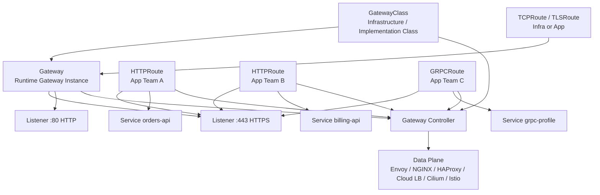
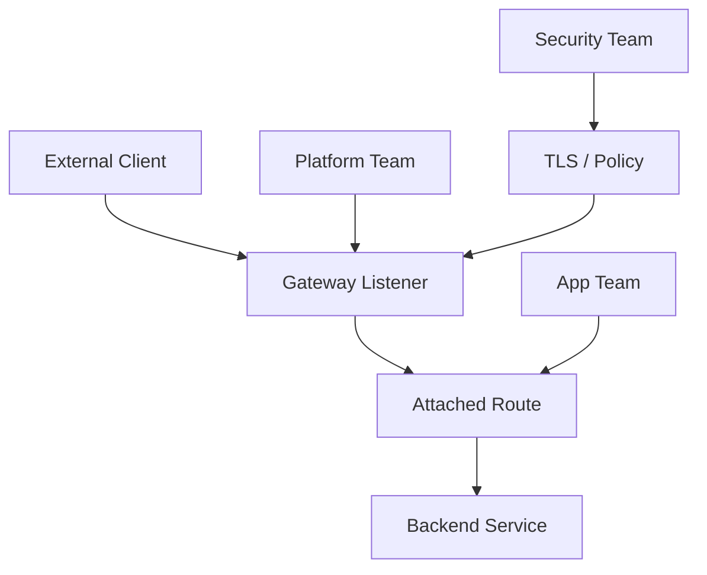
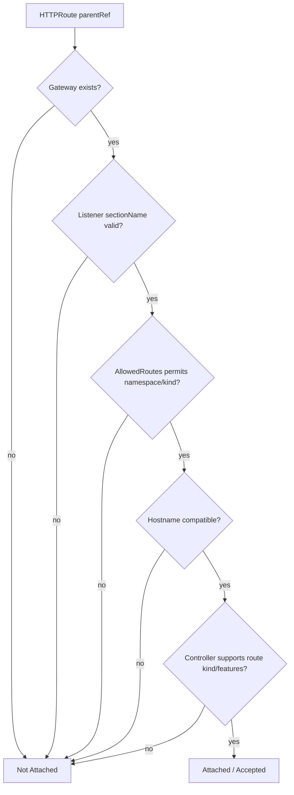

# Part 010 — Gateway API Core Model

## 1. Tujuan Part Ini

Part 009 menjelaskan kenapa Ingress sering tidak cukup untuk traffic platform modern: API surface kecil, annotation-driven extensibility, ownership kabur, dan portability lemah. Part ini masuk ke model penggantinya: **Gateway API**.

Gateway API adalah family of Kubernetes APIs untuk dynamic infrastructure provisioning dan advanced traffic routing. Ia bukan sekadar “Ingress versi baru”. Desainnya mencoba menyelesaikan masalah yang lebih struktural:

- pemisahan role antara infrastructure provider, platform operator, dan application owner;
- routing L4/L7 yang lebih ekspresif;
- typed API daripada annotation string map;
- cross-namespace attachment yang eksplisit;
- status condition sebagai feedback contract;
- conformance model untuk portability;
- extensibility yang lebih terstruktur;
- fondasi untuk north-south dan east-west traffic, termasuk integrasi service mesh.

Target part ini:

> Anda mampu membaca Gateway API bukan sebagai kumpulan YAML, tetapi sebagai distributed contract antara team, controller, infrastructure, route owner, policy, dan data plane.

---

## 2. Gateway API dalam Satu Gambar

Gateway API memisahkan “siapa menyediakan gateway” dari “siapa memasang route”.



Core idea:

- `GatewayClass` memilih implementasi.
- `Gateway` menyatakan gateway instance dan listeners.
- `Route` menyatakan traffic rules yang attach ke Gateway/listener.
- `BackendRef` menyatakan tujuan traffic.
- `ReferenceGrant` mengizinkan referensi lintas namespace tertentu.
- Controller merekonsiliasi resource menjadi konfigurasi data plane.
- Status condition memberi sinyal apakah intent diterima dan diprogram.

---

## 3. Kenapa Gateway API Disebut Role-Oriented

Ingress cenderung memusatkan banyak concern dalam satu object. Gateway API memisahkan concern berdasarkan role.

| Role | Tanggung Jawab | Resource Umum |
|---|---|---|
| Infrastructure Provider | Menyediakan implementation class, cloud/network integration, controller | `GatewayClass` |
| Platform Operator | Membuat Gateway instance, listener, TLS boundary, allowed route policy | `Gateway` |
| Application Developer | Mendeklarasikan routing aplikasi menuju Service | `HTTPRoute`, `GRPCRoute` |
| Security Team | Mendefinisikan policy, certificate boundary, cross-namespace grant | policy resources, `ReferenceGrant` |
| Service Owner | Menjaga Service/backend readiness dan app contract | `Service`, Deployment, health probes |

Model ini penting untuk shared cluster.

Contoh ownership:

```text
platform-gateways/public-gw     owned by platform team
app-orders/orders-route         owned by orders team
app-billing/billing-route       owned by billing team
security/tls-policy             owned by security team
```

Dengan model ini, app team bisa menambahkan route tanpa memiliki seluruh gateway infrastructure.

---

## 4. Resource Core Gateway API

Gateway API memiliki beberapa resource. Fokus awal kita:

| Resource | Level | Fungsi |
|---|---|---|
| `GatewayClass` | cluster-scoped | Mendefinisikan class/implementation Gateway |
| `Gateway` | namespaced | Instance gateway dan listener yang akan diprogram |
| `HTTPRoute` | namespaced | Routing HTTP request |
| `GRPCRoute` | namespaced | Routing gRPC request |
| `TLSRoute` | namespaced | Routing TLS berdasarkan SNI, biasanya passthrough |
| `TCPRoute` | namespaced | Routing TCP |
| `UDPRoute` | namespaced | Routing UDP |
| `ReferenceGrant` | namespaced | Mengizinkan referensi lintas namespace |

Tidak semua resource memiliki maturity/support yang sama di semua controller. Karena itu, selalu cek:

- release channel Gateway API;
- conformance profile controller;
- controller docs;
- status condition;
- implementation-specific extension.

---

## 5. GatewayClass: Implementation Contract

`GatewayClass` adalah cluster-scoped resource yang menyatakan class dari Gateway yang tersedia.

Contoh:

```yaml
apiVersion: gateway.networking.k8s.io/v1
kind: GatewayClass
metadata:
  name: public-envoy
spec:
  controllerName: gateway.envoyproxy.io/gatewayclass-controller
  description: Public Envoy Gateway class managed by the platform team
```

`GatewayClass` menjawab:

> “Controller implementation mana yang bertanggung jawab untuk Gateway dari class ini?”

Ia mirip `IngressClass`, tetapi berada dalam model Gateway API yang lebih luas.

### 5.1 `controllerName`

`controllerName` adalah identifier controller. Controller hanya boleh memproses `GatewayClass` yang controllerName-nya cocok.

Review question:

- Apakah controller yang cocok benar-benar terinstall?
- Apakah controller punya RBAC yang cukup?
- Apakah lebih dari satu controller mengklaim class yang sama?
- Apakah class ini public, private, internal, mesh, atau regional?
- Apakah parameter infra-nya jelas?

### 5.2 Parameters

Banyak implementasi memakai parameter tambahan untuk menghubungkan `GatewayClass` ke infra config.

Contoh konseptual:

```yaml
apiVersion: gateway.networking.k8s.io/v1
kind: GatewayClass
metadata:
  name: public-l7
spec:
  controllerName: example.com/gateway-controller
  parametersRef:
    group: example.com
    kind: GatewayClassConfig
    name: public-l7-defaults
```

`parametersRef` adalah titik di mana portability mulai berkurang karena parameter biasanya implementation-specific.

Prinsip:

> Core Gateway API memberi contract portable; parameter implementation memberi kemampuan spesifik. Jangan mencampur keduanya tanpa sadar.

---

## 6. Gateway: Runtime Instance dan Listener Boundary

`Gateway` adalah namespaced resource yang menyatakan instance gateway.

Contoh:

```yaml
apiVersion: gateway.networking.k8s.io/v1
kind: Gateway
metadata:
  name: public-gw
  namespace: platform-gateways
spec:
  gatewayClassName: public-envoy
  listeners:
    - name: https
      protocol: HTTPS
      port: 443
      hostname: "*.example.com"
      tls:
        mode: Terminate
        certificateRefs:
          - kind: Secret
            name: wildcard-example-com-tls
      allowedRoutes:
        namespaces:
          from: Selector
          selector:
            matchLabels:
              gateway-access: public
```

Gateway menjawab:

- Gateway class mana yang dipakai?
- Listener apa yang tersedia?
- Hostname apa yang diterima listener?
- Protocol/port apa yang dibuka?
- TLS terminate atau passthrough?
- Namespace mana yang boleh attach route?

### 6.1 Gateway sebagai Boundary

`Gateway` adalah boundary operasional:



Boundary ini menjawab pertanyaan produksi:

- siapa boleh membuka hostname publik;
- siapa boleh attach route;
- siapa mengelola TLS certificate;
- siapa bertanggung jawab atas listener availability;
- siapa bertanggung jawab atas backend availability.

### 6.2 Gateway Namespace Strategy

Pola umum:

```text
platform-gateways/public
platform-gateways/private
platform-gateways/partner
platform-gateways/mesh-ingress
```

Jangan asal membuat Gateway di namespace aplikasi untuk semua kebutuhan. Jika Gateway merepresentasikan shared infrastructure, namespace-nya sebaiknya merefleksikan ownership platform.

---

## 7. Listener: Port, Protocol, Hostname, dan Attachment Policy

Listener adalah entry point di dalam Gateway.

Contoh listener HTTPS:

```yaml
listeners:
  - name: https
    protocol: HTTPS
    port: 443
    hostname: "api.example.com"
    tls:
      mode: Terminate
      certificateRefs:
        - name: api-example-com-tls
    allowedRoutes:
      namespaces:
        from: Same
```

Listener memiliki beberapa dimensi:

| Field | Makna |
|---|---|
| `name` | Identifier listener; bisa dipakai oleh `sectionName` pada Route |
| `protocol` | HTTP, HTTPS, TLS, TCP, UDP, dll |
| `port` | Port listener |
| `hostname` | Hostname yang diterima listener |
| `tls` | Mode TLS dan certificate refs |
| `allowedRoutes` | Policy route attachment |

### 7.1 Protocol Matters

`HTTP` dan `HTTPS` bukan sekadar port 80/443. Protocol menentukan jenis Route yang dapat attach.

Contoh:

| Listener Protocol | Route yang Relevan |
|---|---|
| HTTP | `HTTPRoute` |
| HTTPS with Terminate | `HTTPRoute`, `GRPCRoute` tergantung controller/protocol support |
| TLS passthrough | `TLSRoute` |
| TCP | `TCPRoute` |
| UDP | `UDPRoute` |

Top 1% engineer tidak hanya bertanya “port berapa?”. Ia bertanya:

> “Di layer mana keputusan routing dibuat: sebelum TLS, setelah TLS, di HTTP, di gRPC, atau hanya di TCP connection?”

### 7.2 Hostname Boundary

Listener hostname membatasi route yang bisa efektif.

Jika listener:

```yaml
hostname: "*.example.com"
```

Route dengan hostname `orders.example.com` bisa attach jika allowed. Route dengan hostname `orders.internal.example.com` mungkin tidak match tergantung wildcard semantics.

Review question:

- Apakah wildcard terlalu luas?
- Apakah route bisa mengklaim hostname tenant lain?
- Apakah hostname ownership divalidasi?
- Apakah listener hostname dan route hostname overlap dengan benar?

### 7.3 `allowedRoutes`

`allowedRoutes` adalah salah satu fitur paling penting untuk multi-tenant governance.

Contoh hanya namespace berlabel tertentu:

```yaml
allowedRoutes:
  namespaces:
    from: Selector
    selector:
      matchLabels:
        gateway-access: public
```

Contoh hanya namespace yang sama:

```yaml
allowedRoutes:
  namespaces:
    from: Same
```

Contoh semua namespace:

```yaml
allowedRoutes:
  namespaces:
    from: All
```

`All` terlihat nyaman, tetapi berbahaya jika tidak ada hostname ownership/admission policy.

---

## 8. Route: Application Traffic Contract

Route menyatakan rule traffic. Untuk HTTP, resource-nya `HTTPRoute`.

Contoh:

```yaml
apiVersion: gateway.networking.k8s.io/v1
kind: HTTPRoute
metadata:
  name: orders-route
  namespace: app-orders
spec:
  parentRefs:
    - name: public-gw
      namespace: platform-gateways
      sectionName: https
  hostnames:
    - orders.example.com
  rules:
    - matches:
        - path:
            type: PathPrefix
            value: /api/orders
      backendRefs:
        - name: orders-api
          port: 8080
```

Route menjawab:

- attach ke Gateway/listener mana;
- hostname apa;
- match request apa;
- filter apa yang diterapkan;
- backend mana yang menerima traffic;
- weight berapa jika multi-backend.

### 8.1 ParentRefs

`parentRefs` menyatakan parent resource tempat route attach.

```yaml
parentRefs:
  - name: public-gw
    namespace: platform-gateways
    sectionName: https
```

Maknanya:

- attach ke Gateway `public-gw`;
- Gateway berada di namespace `platform-gateways`;
- attach ke listener bernama `https`.

Attachment tidak otomatis sukses. Ia harus diizinkan oleh:

- listener `allowedRoutes`;
- namespace policy;
- hostname compatibility;
- kind compatibility;
- controller support.

### 8.2 Hostnames

Route hostname harus kompatibel dengan listener hostname.

Contoh:

```yaml
# Gateway listener
hostname: "*.example.com"

# HTTPRoute
hostnames:
  - orders.example.com
```

Ini bisa valid.

Namun:

```yaml
hostnames:
  - attacker.com
```

seharusnya tidak attach ke listener `*.example.com`.

### 8.3 Rules

`rules` berisi match, filter, dan backend.

Konseptual:

```text
IF request matches host/path/header/query/method
THEN apply filters
THEN send to backendRefs according to weights
```

Kita akan bahas HTTPRoute detail di Part 012.

---

## 9. BackendRef: Traffic Destination, Bukan Hanya Service Name

`backendRefs` menunjuk tujuan traffic. Umumnya Service:

```yaml
backendRefs:
  - name: orders-api
    port: 8080
```

Dengan weighted traffic:

```yaml
backendRefs:
  - name: orders-api-v1
    port: 8080
    weight: 90
  - name: orders-api-v2
    port: 8080
    weight: 10
```

Review questions:

- Apakah Service ada?
- Apakah port cocok?
- Apakah Service punya EndpointSlice ready?
- Apakah backend namespace sama atau lintas namespace?
- Apakah weight valid?
- Apakah backend protocol sesuai?
- Apakah route-level health hanya melihat Service atau endpoint readiness?

### 9.1 BackendRef dan Cross-Namespace

Jika Route di namespace `app-orders` ingin menuju Service di namespace `shared-services`, itu cross-namespace reference.

Gateway API tidak mengizinkan cross-namespace reference sembarangan. Umumnya perlu `ReferenceGrant` di namespace target.

Mengapa?

Karena tanpa guardrail, namespace A bisa mereferensikan Service namespace B dan mengeksposnya melalui Gateway publik.

---

## 10. ReferenceGrant: Consent untuk Cross-Namespace Reference

`ReferenceGrant` adalah namespaced resource yang memberikan izin dari namespace target.

Contoh: Service `shared-auth/auth-api` mengizinkan HTTPRoute dari namespace `app-orders` untuk mereferensikannya.

```yaml
apiVersion: gateway.networking.k8s.io/v1
kind: ReferenceGrant
metadata:
  name: allow-orders-to-auth
  namespace: shared-auth
spec:
  from:
    - group: gateway.networking.k8s.io
      kind: HTTPRoute
      namespace: app-orders
  to:
    - group: ""
      kind: Service
      name: auth-api
```

Mental model:

> Cross-namespace reference membutuhkan consent dari namespace yang direferensikan.

Ini berbeda dari model “siapa pun bisa menunjuk resource saya”.

### 10.1 Security Value

ReferenceGrant mencegah pola seperti:

```text
attacker-namespace/malicious-route -> backendRef -> payments/internal-admin-service
```

Tanpa ReferenceGrant, route owner bisa mengekspos backend yang bukan miliknya.

### 10.2 Granularity

ReferenceGrant bisa membatasi:

- from group;
- from kind;
- from namespace;
- to group;
- to kind;
- optionally to name.

Jangan gunakan grant terlalu luas tanpa review.

---

## 11. Status Conditions: Feedback Contract, Bukan Dekorasi

Gateway API sangat menekankan status conditions. Ini kritikal untuk operability.

Pada Ingress, status sering hanya external address. Pada Gateway API, resource seperti Gateway dan Route punya conditions seperti:

- `Accepted`;
- `Programmed`;
- `ResolvedRefs`;
- `Conflicted`;
- `Ready` tergantung resource/controller;
- parent-specific route status.

Contoh konseptual:

```yaml
status:
  parents:
    - parentRef:
        name: public-gw
        namespace: platform-gateways
        sectionName: https
      controllerName: gateway.envoyproxy.io/gatewayclass-controller
      conditions:
        - type: Accepted
          status: "True"
          reason: Accepted
        - type: ResolvedRefs
          status: "True"
          reason: ResolvedRefs
```

### 11.1 Accepted vs Programmed

Bedakan dua hal:

| Condition | Makna |
|---|---|
| `Accepted` | Resource valid dan diterima oleh controller/parent secara logis |
| `Programmed` | Desired state sudah diterapkan ke underlying data plane/infrastructure |

Jika Route `Accepted=True` tetapi Gateway/DataPlane belum `Programmed=True`, traffic bisa belum berjalan.

### 11.2 `ResolvedRefs`

`ResolvedRefs=False` sering berarti ada referensi bermasalah:

- Service tidak ada;
- port tidak ada;
- Secret tidak ada;
- ReferenceGrant tidak ada;
- kind tidak didukung;
- namespace tidak diizinkan.

Debugging Gateway API harus selalu membaca status:

```bash
kubectl get gateway -n platform-gateways public-gw -o yaml
kubectl get httproute -n app-orders orders-route -o yaml
kubectl describe httproute -n app-orders orders-route
```

Status condition adalah bagian dari API contract. Pipeline seharusnya bisa gagal jika condition penting tidak True.

---

## 12. Attachment Semantics: Route Tidak “Menempel” Hanya Karena Ada parentRef

Route attachment membutuhkan beberapa kondisi.



Common mistake:

> “HTTPRoute punya parentRef, berarti traffic sudah masuk.”

Tidak. `parentRef` hanya request attachment. Status conditions menunjukkan hasilnya.

---

## 13. Gateway API sebagai Platform Interface

Gateway API memberi cara untuk membuat interface platform yang lebih stabil.

Contoh platform menyediakan:

```text
GatewayClass:
  - public-l7
  - private-l7
  - partner-l7
  - mesh-internal

Gateways:
  - platform-gateways/public-us-east
  - platform-gateways/private-us-east
  - platform-gateways/public-eu-west
```

App team hanya membuat Route:

```yaml
apiVersion: gateway.networking.k8s.io/v1
kind: HTTPRoute
metadata:
  name: orders
  namespace: app-orders
spec:
  parentRefs:
    - name: public-us-east
      namespace: platform-gateways
      sectionName: https
  hostnames:
    - orders.example.com
  rules:
    - matches:
        - path:
            type: PathPrefix
            value: /orders
      backendRefs:
        - name: orders-api
          port: 8080
```

Dengan model ini:

- app team tidak perlu tahu detail cloud LB;
- platform team tidak perlu edit route app;
- security bisa memasang policy pada Gateway/listener/route;
- governance bisa dilakukan lewat admission policy;
- conformance dan status bisa dipakai dalam CI/CD.

---

## 14. Gateway API vs Ingress: Perubahan Mental Model

| Aspek | Ingress | Gateway API |
|---|---|---|
| Primary object | `Ingress` | `Gateway` + `Route` |
| Role separation | Lemah | Desain utama |
| Extensibility | Annotation-heavy | Typed resources + policies/extensions |
| Protocol support | HTTP/HTTPS core | L4/L7 family |
| Cross-namespace model | Terbatas | Explicit attachment + `ReferenceGrant` |
| Status | Relatif sederhana | Conditions lebih kaya |
| Multi-tenancy | Sulit | Lebih natural |
| Route ownership | Dicampur dengan infra | Dipisah |
| Portability | Controller-specific annotation sering besar | Lebih baik, tetap perlu cek conformance |

Namun Gateway API bukan magic:

- implementasi controller tetap berbeda;
- extension tetap bisa vendor-specific;
- policy model masih berkembang di ekosistem;
- migration tetap butuh testing;
- status condition harus dibaca;
- ownership harus didesain, bukan otomatis terjadi.

---

## 15. Minimal Production Example

Berikut contoh model produksi minimal dengan pemisahan namespace.

### 15.1 Namespace Platform

```yaml
apiVersion: v1
kind: Namespace
metadata:
  name: platform-gateways
```

### 15.2 Namespace App

```yaml
apiVersion: v1
kind: Namespace
metadata:
  name: app-orders
  labels:
    gateway-access: public
```

### 15.3 GatewayClass

```yaml
apiVersion: gateway.networking.k8s.io/v1
kind: GatewayClass
metadata:
  name: public-l7
spec:
  controllerName: example.com/gateway-controller
```

### 15.4 Gateway

```yaml
apiVersion: gateway.networking.k8s.io/v1
kind: Gateway
metadata:
  name: public-gw
  namespace: platform-gateways
spec:
  gatewayClassName: public-l7
  listeners:
    - name: https
      protocol: HTTPS
      port: 443
      hostname: "*.example.com"
      tls:
        mode: Terminate
        certificateRefs:
          - name: wildcard-example-com-tls
      allowedRoutes:
        namespaces:
          from: Selector
          selector:
            matchLabels:
              gateway-access: public
```

### 15.5 HTTPRoute

```yaml
apiVersion: gateway.networking.k8s.io/v1
kind: HTTPRoute
metadata:
  name: orders
  namespace: app-orders
spec:
  parentRefs:
    - name: public-gw
      namespace: platform-gateways
      sectionName: https
  hostnames:
    - orders.example.com
  rules:
    - matches:
        - path:
            type: PathPrefix
            value: /api/orders
      backendRefs:
        - name: orders-api
          port: 8080
```

### 15.6 Service

```yaml
apiVersion: v1
kind: Service
metadata:
  name: orders-api
  namespace: app-orders
spec:
  selector:
    app: orders-api
  ports:
    - name: http
      port: 8080
      targetPort: 8080
```

Important nuance:

- TLS certificate is in `platform-gateways` namespace, not app namespace.
- App route is in `app-orders` namespace.
- App namespace must be labeled to attach to public Gateway.
- Route status must be checked after apply.

---

## 16. Failure Modes Core Gateway API

### 16.1 GatewayClass Not Accepted

Gejala:

- Gateway tidak diprogram;
- conditions menunjukkan class invalid;
- controller tidak mengambil resource.

Penyebab:

- `controllerName` salah;
- controller belum berjalan;
- GatewayClass parameters invalid;
- RBAC/controller permission kurang.

Debug:

```bash
kubectl get gatewayclass -o yaml
kubectl get pods -A | grep -i gateway
kubectl logs -n <controller-ns> deploy/<gateway-controller>
```

### 16.2 Gateway Listener Not Programmed

Gejala:

- Gateway exists;
- address tidak tersedia;
- listener condition tidak ready;
- traffic tidak masuk.

Penyebab:

- port conflict;
- TLS Secret missing;
- certificate invalid;
- infra quota exhausted;
- cloud LB provisioning gagal;
- controller tidak support listener config.

### 16.3 HTTPRoute Not Attached

Gejala:

- HTTPRoute dibuat;
- parent status `Accepted=False`;
- request 404/default backend.

Penyebab:

- `parentRefs.namespace` salah;
- `sectionName` salah;
- listener `allowedRoutes` menolak namespace;
- hostname tidak overlap;
- route kind tidak allowed;
- controller tidak support feature.

### 16.4 ResolvedRefs False

Gejala:

- Route accepted sebagian;
- traffic 500/503;
- status menunjukkan ref issue.

Penyebab:

- backend Service tidak ada;
- port salah;
- cross-namespace backend tanpa ReferenceGrant;
- Secret reference invalid;
- unsupported backend kind.

### 16.5 Programmed True, Traffic Still Fails

Gateway API status bisa benar tetapi traffic gagal di layer lain:

- DNS belum menunjuk ke Gateway address;
- firewall/security group menolak traffic;
- Service tidak punya endpoint ready;
- app return error;
- NetworkPolicy menolak traffic;
- TLS client trust gagal;
- proxy health check beda dari real request.

Maka debugging tetap harus end-to-end.

---

## 17. Debugging Workflow Gateway API

Urutan praktis:

```bash
# 1. Lihat GatewayClass
kubectl get gatewayclass
kubectl describe gatewayclass public-l7

# 2. Lihat Gateway
kubectl get gateway -n platform-gateways
kubectl describe gateway -n platform-gateways public-gw
kubectl get gateway -n platform-gateways public-gw -o yaml

# 3. Lihat Route
kubectl get httproute -n app-orders
kubectl describe httproute -n app-orders orders
kubectl get httproute -n app-orders orders -o yaml

# 4. Lihat backend Service dan EndpointSlice
kubectl get svc -n app-orders orders-api
kubectl get endpointslice -n app-orders -l kubernetes.io/service-name=orders-api

# 5. Test DNS dan request
curl -vk https://orders.example.com/api/orders/health
```

Golden rule:

> Jangan debug Gateway API hanya dari manifest. Debug dari **status condition + controller logs + data plane config + real request**.

---

## 18. Production Design Invariants

Gunakan invariants ini sebagai baseline.

### Invariant 1 — Gateway Ownership Harus Jelas

Setiap Gateway harus punya owner:

```yaml
metadata:
  labels:
    owner.team: platform-networking
    exposure: public
    environment: production
```

Jika tidak tahu siapa owner Gateway, jangan attach route production.

### Invariant 2 — Route Attachment Harus Dibatasi

Hindari default `from: All` untuk public Gateway kecuali ada admission policy kuat.

Lebih aman:

```yaml
allowedRoutes:
  namespaces:
    from: Selector
    selector:
      matchLabels:
        gateway-access: public
```

### Invariant 3 — Hostname Ownership Harus Divalidasi

Label namespace saja tidak cukup. Route harus divalidasi terhadap registry/domain ownership.

Contoh policy konseptual:

```text
namespace app-orders may claim:
  - orders.example.com
  - api.example.com/orders/*

namespace app-billing may claim:
  - billing.example.com
  - api.example.com/billing/*
```

### Invariant 4 — Status Conditions Masuk CI/CD Gate

Pipeline route deployment harus menunggu:

- parent accepted;
- refs resolved;
- gateway programmed;
- synthetic test pass.

### Invariant 5 — Cross-Namespace Reference Butuh Consent

Jangan bypass `ReferenceGrant` dengan memberi semua team akses ke namespace shared. Consent harus eksplisit.

### Invariant 6 — Controller Conformance Harus Diketahui

Sebelum memakai feature Gateway API, cek apakah controller mendukungnya. Jangan anggap semua controller sama.

---

## 19. Gateway API dan Service Mesh

Gateway API awalnya sangat kuat untuk north-south routing, tetapi juga berkembang untuk east-west traffic dan mesh use cases melalui GAMMA.

Mental model:

- Route bisa attach ke Gateway untuk ingress/north-south.
- Dalam mesh, Route dapat dipakai untuk service-to-service routing tergantung implementasi.
- Policy attachment dapat menjadi common model untuk platform traffic rules.

Namun jangan lompat terlalu cepat. Untuk memahami mesh Gateway API, kuasai dulu core model:

```text
Parent -> Listener/Service -> Route -> BackendRef -> Policy -> Status
```

Kita akan membahas east-west dan GAMMA pada part berikutnya.

---

## 20. Anti-Patterns

### 20.1 “Gateway API Berarti Tidak Butuh Platform Governance”

Salah. Gateway API memberi primitive lebih baik, tetapi governance tetap harus dibuat.

Tanpa governance:

- semua namespace attach ke public Gateway;
- wildcard hostname dipakai sembarangan;
- route conflict muncul;
- policy tidak konsisten;
- extension controller menjadi annotation hell versi baru.

### 20.2 “Accepted=True Berarti Traffic Aman”

`Accepted=True` hanya satu kondisi. Traffic bisa gagal karena backend, DNS, firewall, certificate, data plane, atau application behavior.

### 20.3 “Gateway API Portable 100%”

Tidak. Core API lebih portable daripada Ingress annotation-heavy pattern, tetapi controller-specific behavior tetap ada.

### 20.4 “App Team Boleh Membuat Gateway Sendiri untuk Production Public Traffic”

Tidak selalu salah, tetapi harus disengaja. Jika public Gateway berarti cloud LB, certificate, public DNS, WAF, compliance logging, dan exposure risk, maka ownership harus jelas.

### 20.5 “ReferenceGrant adalah Formalitas”

ReferenceGrant adalah security boundary. Treat it like permission grant, bukan boilerplate.

---

## 21. Kaufman Deliberate Practice

### Drill 1 — Draw the Resource Graph

Untuk satu route production, gambar:

```text
GatewayClass -> Gateway -> Listener -> HTTPRoute -> BackendRef -> Service -> EndpointSlice -> Pod
```

Tambahkan owner setiap node.

Jika ada node tanpa owner, itu risk.

### Drill 2 — Break Attachment Intentionally

Di lab, buat HTTPRoute yang gagal attach karena:

- wrong sectionName;
- namespace tidak allowed;
- hostname tidak overlap;
- backend Service missing;
- ReferenceGrant missing.

Baca status condition masing-masing. Tujuannya bukan membuat route berhasil, tetapi mengenali failure signature.

### Drill 3 — Build Public/Private Gateway Split

Buat dua Gateway:

```text
public-gw   -> hanya namespace berlabel gateway-access=public
private-gw  -> hanya namespace berlabel gateway-access=private
```

Coba attach route dari namespace yang salah. Pastikan ditolak.

### Drill 4 — Migration Mapping

Ambil satu Ingress lama. Tulis mapping:

```text
IngressClass -> GatewayClass
Ingress TLS -> Gateway listener TLS
Ingress host/path -> HTTPRoute host/path
Ingress annotation -> filter/policy/extension/manual decision
```

Jangan hanya konversi YAML. Jelaskan perubahan ownership.

---

## 22. Review Checklist Gateway API Core

Sebelum mengizinkan Gateway API resource production:

- [ ] `GatewayClass` punya controller yang jelas.
- [ ] Controller sudah diverifikasi berjalan dan support feature yang dipakai.
- [ ] Gateway namespace merefleksikan ownership.
- [ ] Gateway listener hostname tidak terlalu luas tanpa policy.
- [ ] TLS certificate ownership jelas.
- [ ] `allowedRoutes` tidak terlalu permisif.
- [ ] HTTPRoute `parentRefs` eksplisit namespace dan `sectionName` jika perlu.
- [ ] Route hostname sesuai ownership.
- [ ] BackendRef Service dan port valid.
- [ ] Cross-namespace reference memakai `ReferenceGrant` yang sempit.
- [ ] Status conditions dicek setelah deployment.
- [ ] Synthetic test memvalidasi real traffic.
- [ ] Observability route-level tersedia.
- [ ] Rollback path jelas.

---

## 23. Ringkasan

Gateway API memperbaiki banyak kelemahan Ingress dengan memisahkan infrastructure gateway dari application route, memperluas API routing, membuat cross-namespace reference lebih eksplisit, dan menyediakan status condition yang lebih bermakna.

Poin utama:

- `GatewayClass` memilih implementation/controller.
- `Gateway` merepresentasikan runtime gateway dan listener boundary.
- `Listener` menentukan protocol, port, hostname, TLS, dan route attachment policy.
- `Route` menyatakan traffic rule aplikasi.
- `BackendRef` menunjuk tujuan traffic, biasanya Service.
- `ReferenceGrant` memberi consent untuk cross-namespace reference.
- `parentRef` bukan jaminan attachment; baca status conditions.
- Gateway API adalah platform interface, bukan hanya syntax baru.
- Portability lebih baik daripada Ingress annotation-heavy pattern, tetapi tetap perlu cek conformance dan controller behavior.

Pada Part 011, kita akan memperdalam `GatewayClass`, `Gateway`, `Listener`, dan route attachment: bagaimana konflik listener terjadi, bagaimana allowed routes bekerja, bagaimana hostname matching dievaluasi, dan bagaimana mendesain shared gateway untuk multi-team platform.

---

## 24. Referensi Resmi

- Kubernetes Documentation — Gateway API: https://kubernetes.io/docs/concepts/services-networking/gateway/
- Gateway API Documentation — Introduction: https://gateway-api.sigs.k8s.io/
- Gateway API Documentation — API Overview: https://gateway-api.sigs.k8s.io/concepts/api-overview/
- Gateway API Documentation — HTTPRoute: https://gateway-api.sigs.k8s.io/reference/api-types/httproute/
- Gateway API Documentation — API Specification: https://gateway-api.sigs.k8s.io/reference/spec/
- Gateway API Documentation — Migrating from Ingress: https://gateway-api.sigs.k8s.io/guides/getting-started/migrating-from-ingress/
