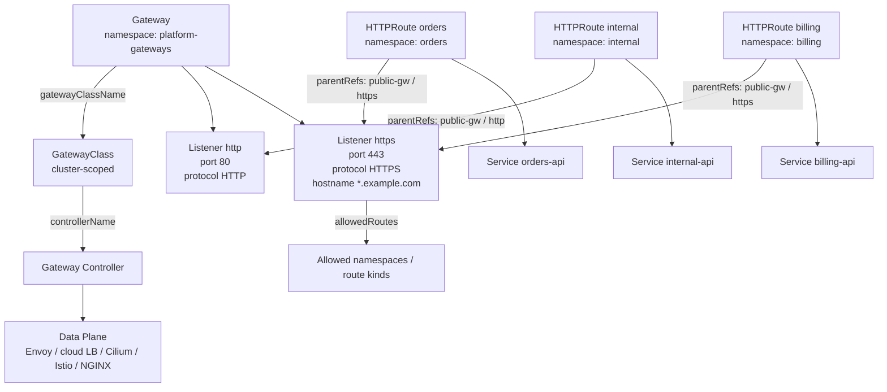
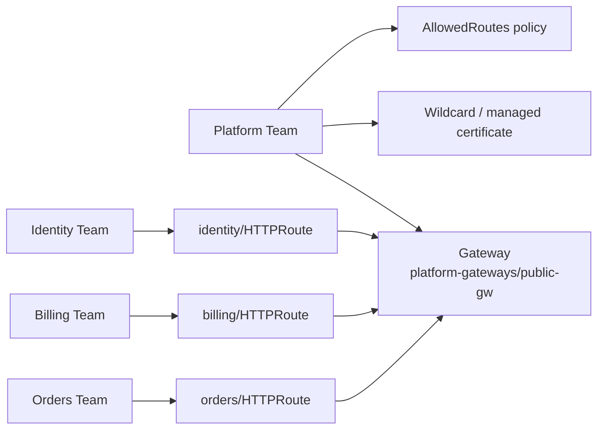
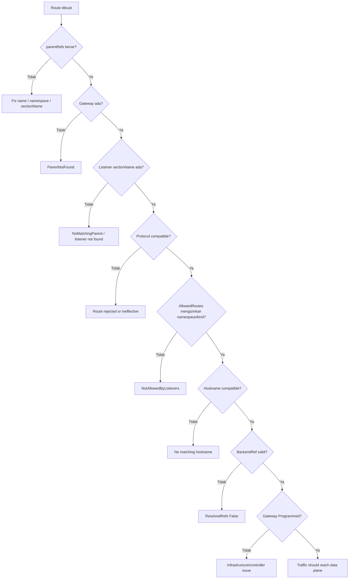
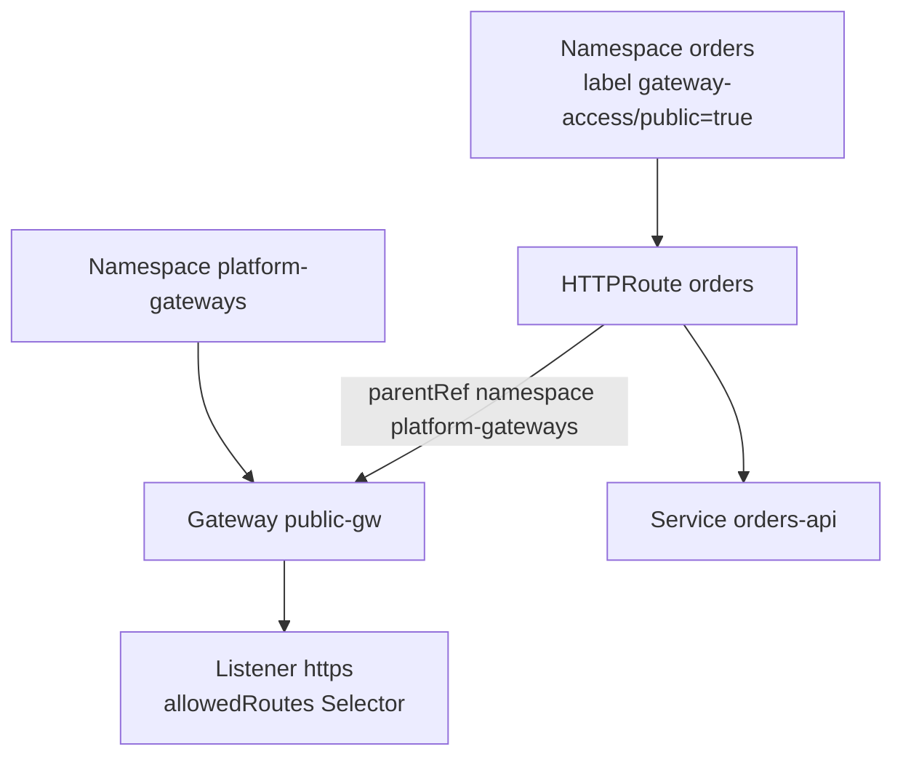
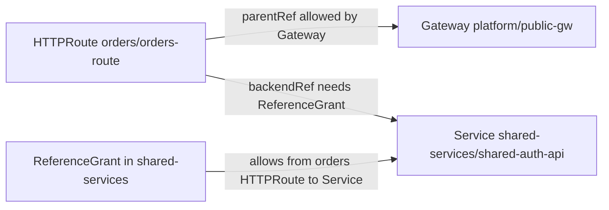
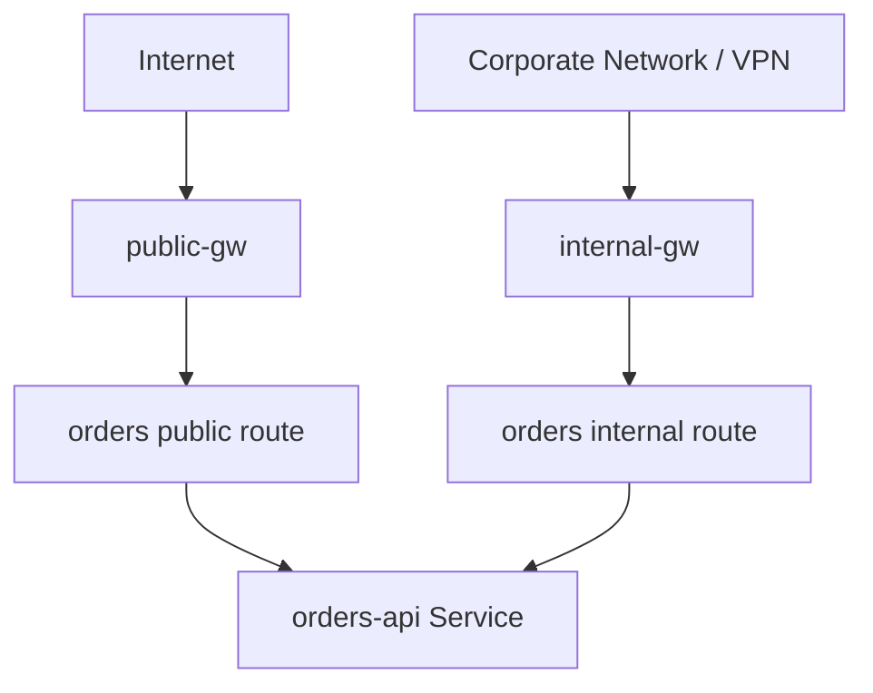
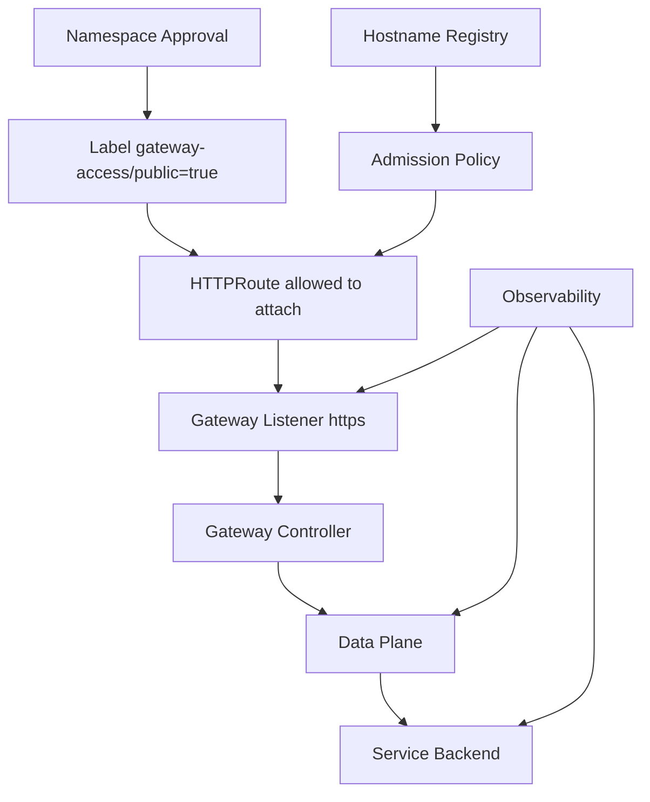

# Part 011 — GatewayClass, Gateway, Listener, and Route Attachment

## 1. Tujuan Part Ini

Part 010 memberi model inti Gateway API. Part ini masuk lebih dalam ke salah satu area yang paling sering menjadi sumber bug produksi: **bagaimana Route benar-benar attach ke Gateway dan Listener**.

Di Gateway API, membuat `HTTPRoute` saja tidak cukup. Route harus:

1. menunjuk parent yang benar;
2. diizinkan oleh `Gateway.spec.listeners[].allowedRoutes`;
3. cocok dengan listener protocol, hostname, dan section name;
4. memiliki backend yang valid;
5. diterima controller;
6. berhasil diprogram ke data plane.

Target part ini:

> Anda mampu menjelaskan kenapa sebuah Route tidak menerima traffic meskipun YAML-nya valid, dan mampu menelusuri dari `GatewayClass` sampai `status.parents.conditions` secara sistematis.

Kita tidak akan memperlakukan Gateway API sebagai “Ingress yang lebih panjang”. Kita akan melihatnya sebagai **contract graph**.

---

## 2. Contract Graph: Dari Class ke Listener ke Route

Secara konseptual, Gateway API membentuk graph seperti ini:



Yang penting: **attachment bukan hanya referensi satu arah dari Route ke Gateway**. Attachment adalah hasil evaluasi dua arah:

- Route berkata: “saya ingin attach ke parent ini”.
- Gateway/listener berkata: “saya mengizinkan jenis Route dari namespace tertentu”.
- Controller berkata: “saya bisa memahami dan memprogram kombinasi ini”.
- Status berkata: “hasil evaluasi ini accepted atau rejected”.

Dengan mental model ini, kita tidak debugging dengan menebak-nebak. Kita membaca contract graph.

---

## 3. GatewayClass: Class of Infrastructure, Bukan Sekadar Label

`GatewayClass` adalah cluster-scoped resource yang mendefinisikan class Gateway yang tersedia. Dalam cluster production, biasanya `GatewayClass` dibuat oleh infrastructure/platform team atau controller installation.

Contoh:

```yaml
apiVersion: gateway.networking.k8s.io/v1
kind: GatewayClass
metadata:
  name: public-envoy
spec:
  controllerName: gateway.envoyproxy.io/gatewayclass-controller
```

Maknanya:

- nama `public-envoy` menjadi class yang bisa dirujuk oleh `Gateway`;
- `controllerName` menentukan controller mana yang bertanggung jawab;
- controller yang cocok akan reconcile Gateway yang menggunakan class ini;
- resource ini adalah entry point dari implementation-specific behavior.

### 3.1 GatewayClass sebagai Boundary Implementasi

Dua `GatewayClass` bisa sama-sama berbasis Gateway API tetapi menghasilkan infrastruktur sangat berbeda.

| GatewayClass | Kemungkinan Implementasi | Karakteristik |
|---|---|---|
| `public-envoy` | Envoy Gateway | L7 rich routing, portable, Kubernetes-native |
| `public-cloud-lb` | cloud load balancer controller | integrasi native provider, fitur tergantung cloud |
| `internal-cilium` | Cilium Gateway API | eBPF datapath, Cilium policy integration |
| `mesh-istio` | Istio Gateway / mesh integration | integrasi kuat dengan mesh, mTLS, telemetry |

Karena itu, `GatewayClass` bukan kosmetik. Ia adalah **architecture decision**.

### 3.2 ParameterRef

Beberapa implementasi memakai `parametersRef` untuk konfigurasi class yang lebih detail.

Contoh konseptual:

```yaml
apiVersion: gateway.networking.k8s.io/v1
kind: GatewayClass
metadata:
  name: public-gateway
spec:
  controllerName: example.net/gateway-controller
  parametersRef:
    group: platform.example.com
    kind: GatewayClassConfig
    name: public-gateway-defaults
```

Gunakan `parametersRef` dengan hati-hati. Ia meningkatkan expressiveness, tetapi juga menurunkan portability karena bentuk parameter biasanya vendor/controller-specific.

### 3.3 Failure Mode GatewayClass

| Symptom | Kemungkinan Penyebab | Cara Membaca |
|---|---|---|
| Gateway tidak mendapat address | controller untuk `controllerName` tidak berjalan atau tidak match | cek `GatewayClass.status.conditions` dan log controller |
| Gateway accepted tapi tidak programmed | infrastructure provisioning gagal | cek `Gateway.status.conditions` |
| Route tidak pernah diproses | Gateway parent memakai class yang tidak ditangani controller aktif | cek controllerName dan installed controller |
| Perilaku berbeda antar cluster | class name sama, controller implementation berbeda | cek actual `controllerName`, bukan hanya nama class |

Rule produksi:

> Jangan pernah menganggap dua Gateway dengan API yang sama punya behavior sama jika `GatewayClass` atau controllernya berbeda.

---

## 4. Gateway: Request for Runtime Gateway Instance

`Gateway` adalah namespaced resource yang meminta satu instance gateway. Ia bukan selalu berarti “satu load balancer fisik”. Tergantung implementasi, satu Gateway bisa dipetakan ke:

- satu cloud load balancer;
- satu Envoy deployment;
- satu shared data plane;
- satu logical config slice;
- satu mesh ingress point;
- satu gateway per node;
- atau kombinasi beberapa resource infrastructure.

Contoh:

```yaml
apiVersion: gateway.networking.k8s.io/v1
kind: Gateway
metadata:
  name: public-gw
  namespace: platform-gateways
spec:
  gatewayClassName: public-envoy
  listeners:
    - name: http
      protocol: HTTP
      port: 80
      hostname: "*.example.com"
      allowedRoutes:
        namespaces:
          from: Selector
          selector:
            matchLabels:
              traffic-access: public
    - name: https
      protocol: HTTPS
      port: 443
      hostname: "*.example.com"
      tls:
        mode: Terminate
        certificateRefs:
          - kind: Secret
            name: wildcard-example-com
      allowedRoutes:
        namespaces:
          from: Selector
          selector:
            matchLabels:
              traffic-access: public
```

### 4.1 Gateway as Platform Boundary

Dalam shared cluster, `Gateway` biasanya dikelola platform team. App team cukup membuat `HTTPRoute` di namespace masing-masing.



Keuntungannya:

- app team tidak perlu akses Secret TLS global;
- app team tidak perlu membuat public load balancer sendiri;
- platform team bisa membatasi namespace mana boleh attach;
- route ownership tetap berada di service owner;
- blast radius lebih terkendali.

### 4.2 Gateway Address

`Gateway.status.addresses` menunjukkan address yang diprogram oleh controller, misalnya IP atau hostname.

Contoh status:

```yaml
status:
  addresses:
    - type: IPAddress
      value: 203.0.113.10
  conditions:
    - type: Accepted
      status: "True"
    - type: Programmed
      status: "True"
```

Interpretasi:

- `Accepted=True`: Gateway valid dan diterima oleh controller;
- `Programmed=True`: konfigurasi telah diprogram ke dataplane/infrastructure;
- address ada: traffic punya entry point eksternal/internal.

Namun address ada bukan berarti backend sehat. Itu hanya berarti gateway entry point tersedia.

---

## 5. Listener: Logical Socket + Protocol Contract

Listener adalah tempat Gateway menerima koneksi. Secara praktis, listener adalah kombinasi:

- name;
- port;
- protocol;
- hostname;
- TLS config;
- allowed route policy.

Contoh:

```yaml
listeners:
  - name: https-api
    protocol: HTTPS
    port: 443
    hostname: "api.example.com"
    tls:
      mode: Terminate
      certificateRefs:
        - name: api-example-com
    allowedRoutes:
      kinds:
        - kind: HTTPRoute
      namespaces:
        from: Selector
        selector:
          matchLabels:
            expose: public
```

### 5.1 Listener Name Itu API Contract

Listener `name` dipakai Route melalui `parentRefs.sectionName`.

```yaml
parentRefs:
  - name: public-gw
    namespace: platform-gateways
    sectionName: https-api
```

Jika platform team mengubah listener name, app route yang menunjuk `sectionName` lama bisa berhenti attach.

Rule produksi:

> Treat listener name as stable API. Jangan rename listener sembarangan tanpa migration plan.

### 5.2 Protocol Compatibility

Tidak semua Route kompatibel dengan semua listener.

| Listener Protocol | Route yang Umumnya Relevan | Catatan |
|---|---|---|
| `HTTP` | `HTTPRoute` | plaintext HTTP |
| `HTTPS` dengan termination | `HTTPRoute` | TLS terminated di gateway, routing HTTP setelah decrypt |
| `TLS` passthrough | `TLSRoute` | routing berdasarkan SNI, payload tetap terenkripsi |
| `TCP` | `TCPRoute` | raw TCP |
| `UDP` | `UDPRoute` | raw UDP |
| `HTTP/2`/gRPC via HTTPS | `GRPCRoute` atau `HTTPRoute` | `GRPCRoute` lebih eksplisit untuk gRPC |

Kesalahan umum:

- memasang `HTTPRoute` ke listener `TLS` passthrough;
- mengira HTTPS listener selalu berarti backend menerima HTTPS;
- mengira TLS termination dan mTLS backend otomatis aktif;
- mencampur gRPC dengan HTTP biasa tanpa memahami HTTP/2 semantics.

### 5.3 Hostname Matching di Listener

Listener dapat memiliki hostname. Route juga dapat memiliki hostnames. Agar Route attach efektif, hostname Route harus kompatibel dengan listener hostname.

Contoh:

```yaml
# Gateway listener
hostname: "*.example.com"

# HTTPRoute
hostnames:
  - "orders.example.com"
```

Ini compatible.

Contoh tidak compatible:

```yaml
# Gateway listener
hostname: "api.internal.example.com"

# HTTPRoute
hostnames:
  - "orders.example.com"
```

Route mungkin ada, tetapi tidak akan menerima traffic melalui listener tersebut.

### 5.4 Listener tanpa Hostname

Listener tanpa hostname berarti menerima semua hostnames yang kompatibel dengan protocol dan Route rules. Ini fleksibel tetapi berisiko di shared gateway.

Gunakan listener hostname spesifik jika:

- gateway dipakai multi-tenant;
- domain ownership penting;
- Anda ingin mencegah route hijacking;
- audit domain-to-team diperlukan.

---

## 6. AllowedRoutes: Permission Model untuk Attachment

`allowedRoutes` adalah mekanisme Gateway untuk mengontrol Route apa yang boleh attach ke listener.

Ada dua dimensi utama:

1. namespace mana yang boleh attach;
2. kind Route apa yang boleh attach.

Contoh:

```yaml
allowedRoutes:
  namespaces:
    from: Selector
    selector:
      matchLabels:
        expose: public
  kinds:
    - group: gateway.networking.k8s.io
      kind: HTTPRoute
```

### 6.1 Namespace Policy

`namespaces.from` biasanya memiliki mode seperti:

| Mode | Makna | Penggunaan |
|---|---|---|
| `Same` | hanya namespace Gateway | gateway private dalam satu namespace |
| `All` | semua namespace boleh attach | cluster kecil/lab; riskan untuk shared production |
| `Selector` | namespace dengan label tertentu | pilihan production yang paling umum |

Contoh production:

```yaml
allowedRoutes:
  namespaces:
    from: Selector
    selector:
      matchLabels:
        gateway-access/public: "true"
```

Lalu namespace app diberi label:

```yaml
apiVersion: v1
kind: Namespace
metadata:
  name: orders
  labels:
    gateway-access/public: "true"
```

Ini membuat attachment menjadi explicit approval.

### 6.2 Allowed Route Kinds

Listener HTTPS yang menerima HTTP routing sebaiknya membatasi kind:

```yaml
allowedRoutes:
  kinds:
    - kind: HTTPRoute
```

Listener khusus gRPC bisa mengizinkan `GRPCRoute`:

```yaml
allowedRoutes:
  kinds:
    - kind: GRPCRoute
```

Namun implementasi controller tidak selalu mendukung semua route kind secara sama. Selalu cek conformance dan status.

### 6.3 AllowedRoutes Bukan Authorization Backend

`allowedRoutes` hanya mengontrol siapa boleh attach ke listener. Ia tidak otomatis mengizinkan route untuk menunjuk backend lintas namespace. Untuk cross-namespace backend reference, gunakan `ReferenceGrant`.

Pisahkan tiga jenis permission:

| Permission | Resource/Field | Pertanyaan |
|---|---|---|
| Route may attach to listener? | `allowedRoutes` | Apakah route ini boleh menempel ke gateway/listener? |
| Route may reference backend in another namespace? | `ReferenceGrant` | Apakah namespace backend mengizinkan referensi? |
| Request may call backend identity? | mesh authz / policy | Apakah caller identity boleh memanggil service? |

Mencampur ketiganya adalah sumber desain yang lemah.

---

## 7. Route ParentRef: Request Attachment dari Route

Route menggunakan `parentRefs` untuk menyatakan parent yang ingin dipakai.

Contoh:

```yaml
apiVersion: gateway.networking.k8s.io/v1
kind: HTTPRoute
metadata:
  name: orders-route
  namespace: orders
spec:
  parentRefs:
    - name: public-gw
      namespace: platform-gateways
      sectionName: https
  hostnames:
    - orders.example.com
  rules:
    - backendRefs:
        - name: orders-api
          port: 8080
```

### 7.1 ParentRef Fields

| Field | Fungsi |
|---|---|
| `group` | API group parent; default Gateway API group untuk Gateway |
| `kind` | kind parent, biasanya `Gateway`; untuk mesh/GAMMA bisa `Service` pada use case tertentu |
| `name` | nama parent |
| `namespace` | namespace parent; jika kosong biasanya namespace Route |
| `sectionName` | listener name tertentu |
| `port` | port listener tertentu, tergantung support/use case |

Yang paling sering penting:

- `name`;
- `namespace`;
- `sectionName`.

### 7.2 sectionName: Attach ke Listener Tertentu

Tanpa `sectionName`, Route mencoba attach ke semua listener yang compatible. Ini bisa valid, tetapi di production biasanya lebih aman eksplisit.

Eksplisit:

```yaml
parentRefs:
  - name: public-gw
    namespace: platform-gateways
    sectionName: https
```

Implisit:

```yaml
parentRefs:
  - name: public-gw
    namespace: platform-gateways
```

Kapan eksplisit lebih baik:

- Gateway punya listener `http` dan `https`;
- Gateway punya hostname berbeda per listener;
- Gateway multi-tenant;
- audit route ownership penting;
- route migration butuh kontrol.

### 7.3 Multiple ParentRefs

Satu Route bisa attach ke lebih dari satu parent.

Contoh:

```yaml
parentRefs:
  - name: public-gw
    namespace: platform-gateways
    sectionName: https
  - name: internal-gw
    namespace: platform-gateways
    sectionName: https
```

Ini memungkinkan satu route diekspose via public dan internal Gateway. Namun hati-hati:

- policy tiap parent bisa berbeda;
- TLS boundary bisa berbeda;
- status per parent harus dibaca satu per satu;
- accidental public exposure lebih mudah terjadi.

Rule produksi:

> Multiple parentRefs harus direview sebagai exposure decision, bukan sekadar routing convenience.

---

## 8. Route Attachment Decision Tree

Ketika `HTTPRoute` tidak mendapat traffic, jangan langsung cek application logs. Mulai dari attachment.



Decision tree ini lebih cepat daripada debugging acak.

---

## 9. Status Conditions: Feedback Contract

Gateway API menggunakan status conditions untuk memberi feedback. Ini sangat penting dalam production.

### 9.1 Gateway Status

Contoh:

```yaml
status:
  conditions:
    - type: Accepted
      status: "True"
      reason: Accepted
    - type: Programmed
      status: "True"
      reason: Programmed
  listeners:
    - name: https
      supportedKinds:
        - group: gateway.networking.k8s.io
          kind: HTTPRoute
      attachedRoutes: 12
      conditions:
        - type: Accepted
          status: "True"
        - type: Programmed
          status: "True"
```

Baca ini sebagai:

- Gateway diterima controller;
- dataplane sudah diprogram;
- listener diterima;
- ada 12 attached route;
- controller mendukung `HTTPRoute` pada listener itu.

### 9.2 Route Status

Contoh:

```yaml
status:
  parents:
    - parentRef:
        name: public-gw
        namespace: platform-gateways
        sectionName: https
      controllerName: gateway.envoyproxy.io/gatewayclass-controller
      conditions:
        - type: Accepted
          status: "True"
          reason: Accepted
        - type: ResolvedRefs
          status: "True"
          reason: ResolvedRefs
```

Route status bersifat **per parent**. Jika ada multiple parentRefs, jangan hanya lihat satu condition.

### 9.3 Common Conditions

| Condition | Resource | Makna Praktis |
|---|---|---|
| `Accepted` | Gateway/Listener/Route | resource valid dan diterima controller |
| `Programmed` | Gateway/Listener | config sudah diprogram ke dataplane/infrastructure |
| `ResolvedRefs` | Route | backend/secret/reference berhasil di-resolve |
| `Conflicted` | Listener/Route | ada konflik hostname/port/rule tergantung implementasi |

Nama exact reason bisa berbeda antar implementasi, tetapi pola bacanya sama: **status adalah contract evidence**.

### 9.4 Jangan Abaikan `observedGeneration`

Condition biasanya memiliki `observedGeneration`. Ini menunjukkan apakah status dibuat untuk spec generation terbaru.

Jika `metadata.generation` lebih tinggi daripada `status.conditions[].observedGeneration`, controller belum memproses perubahan terbaru.

Rule debugging:

> Jangan mengambil kesimpulan dari status lama.

---

## 10. Listener Conflict dan Precedence

Gateway bisa memiliki beberapa listener. Konflik dapat terjadi pada:

- port sama;
- protocol sama/tidak compatible;
- hostname overlap;
- TLS config overlap;
- implementation constraints.

Contoh:

```yaml
listeners:
  - name: api-wildcard
    protocol: HTTPS
    port: 443
    hostname: "*.example.com"
    tls:
      mode: Terminate
      certificateRefs:
        - name: wildcard-cert
  - name: api-specific
    protocol: HTTPS
    port: 443
    hostname: "orders.example.com"
    tls:
      mode: Terminate
      certificateRefs:
        - name: orders-cert
```

Ini mungkin valid di beberapa implementasi, tetapi harus dipahami sebagai overlapping SNI/hostname config. Controller akan menentukan bagaimana precedence diterapkan berdasarkan spec dan implementation behavior.

Prinsip production:

- hindari overlapping listener kecuali sengaja;
- dokumentasikan ownership domain;
- gunakan status listener untuk konflik;
- test dengan SNI dan Host header;
- jangan hanya test IP:port.

---

## 11. Hostname Attachment vs Request Matching

Ada dua tahap berbeda:

1. Route attach ke listener berdasarkan kompatibilitas hostname.
2. Request runtime match ke route berdasarkan Host header/SNI/path/rule.

Contoh:

```yaml
# Listener
hostname: "*.example.com"

# Route
hostnames:
  - "orders.example.com"
```

Route attach karena hostname compatible. Namun request runtime harus memakai Host header:

```bash
curl -H 'Host: orders.example.com' https://<gateway-address>/orders
```

Jika Anda curl langsung ke IP tanpa Host header yang benar, route bisa terlihat “tidak jalan”, padahal request tidak match.

Production debugging:

```bash
# cek SNI + Host untuk HTTPS
curl -vk \
  --resolve orders.example.com:443:203.0.113.10 \
  https://orders.example.com/health
```

Dengan `--resolve`, kita memaksa DNS lokal curl tanpa mengubah public DNS.

---

## 12. Cross-Namespace Attachment Pattern

Pattern umum:

- Gateway ada di namespace `platform-gateways`;
- app route ada di namespace app;
- app namespace diberi label tertentu;
- listener `allowedRoutes` memakai namespace selector.



Contoh manifest:

```yaml
apiVersion: gateway.networking.k8s.io/v1
kind: Gateway
metadata:
  name: public-gw
  namespace: platform-gateways
spec:
  gatewayClassName: public-envoy
  listeners:
    - name: https
      protocol: HTTPS
      port: 443
      hostname: "*.example.com"
      tls:
        mode: Terminate
        certificateRefs:
          - name: wildcard-example-com
      allowedRoutes:
        namespaces:
          from: Selector
          selector:
            matchLabels:
              gateway-access/public: "true"
        kinds:
          - kind: HTTPRoute
---
apiVersion: gateway.networking.k8s.io/v1
kind: HTTPRoute
metadata:
  name: orders
  namespace: orders
spec:
  parentRefs:
    - name: public-gw
      namespace: platform-gateways
      sectionName: https
  hostnames:
    - orders.example.com
  rules:
    - matches:
        - path:
            type: PathPrefix
            value: /
      backendRefs:
        - name: orders-api
          port: 8080
```

### 12.1 Apa yang Diberikan Pattern Ini

| Concern | Mekanisme |
|---|---|
| App team dapat expose route sendiri | `HTTPRoute` di namespace app |
| Platform team mengontrol gateway | `Gateway` di namespace platform |
| Hanya namespace approved boleh attach | `allowedRoutes.namespaces.selector` |
| TLS Secret tidak dibagi ke app namespace | `certificateRefs` di Gateway namespace |
| Domain route eksplisit | `hostnames` di HTTPRoute |

### 12.2 Apa yang Tidak Diberikan Pattern Ini

Pattern ini belum otomatis memberikan:

- WAF;
- auth;
- rate limit;
- backend mTLS;
- per-route ownership validation;
- domain ownership workflow;
- protection dari route conflict jika governance lemah.

Gateway API memberi API surface. Production governance tetap harus dirancang.

---

## 13. BackendRef dan Cross-Namespace Backend

Dalam route, `backendRefs` biasanya menunjuk Service di namespace yang sama.

```yaml
backendRefs:
  - name: orders-api
    port: 8080
```

Untuk backend di namespace lain:

```yaml
backendRefs:
  - name: shared-auth-api
    namespace: shared-services
    port: 8080
```

Ini memerlukan `ReferenceGrant` di namespace target backend.

Walaupun `ReferenceGrant` dibahas lebih dalam di Part 015, penting dipahami di sini bahwa attachment ke Gateway dan reference ke backend adalah dua evaluasi berbeda.



Jika route accepted tetapi `ResolvedRefs=False`, backend reference adalah salah satu tersangka utama.

---

## 14. Route Conflict: Ketika Banyak Route Mengklaim Host/Path

Dalam shared gateway, banyak team bisa membuat route yang mengklaim hostname/path overlap.

Contoh:

```yaml
# Team A
hostnames:
  - api.example.com
rules:
  - matches:
      - path:
          type: PathPrefix
          value: /orders

# Team B
hostnames:
  - api.example.com
rules:
  - matches:
      - path:
          type: PathPrefix
          value: /orders/internal
```

Ini bisa valid jika precedence jelas. Tetapi konflik terjadi jika dua route memiliki match yang sama atau ambigu.

### 14.1 Conflict Governance

Untuk production, jangan hanya mengandalkan controller. Buat domain/path ownership model.

Contoh ownership table:

| Host | Path Prefix | Owner | Namespace | Review Required |
|---|---|---|---|---|
| `api.example.com` | `/orders` | Orders | `orders` | Platform + Security |
| `api.example.com` | `/billing` | Billing | `billing` | Platform + Security |
| `admin.example.com` | `/` | Admin Platform | `admin` | Security mandatory |

### 14.2 Admission Control

Gunakan admission policy untuk mencegah route liar:

- hanya namespace tertentu boleh host tertentu;
- path prefix harus sesuai label team;
- public hostname tidak boleh dari namespace non-public;
- route harus punya owner label;
- route harus punya SLO/audit annotation.

Gateway API tidak menggantikan governance. Ia membuat governance lebih bisa diekspresikan.

---

## 15. Production Pattern: Shared Public Gateway

### 15.1 Struktur Namespace

```text
platform-gateways/
  Gateway public-gw
  Secret wildcard-example-com

orders/
  HTTPRoute orders-public
  Service orders-api

billing/
  HTTPRoute billing-public
  Service billing-api

identity/
  HTTPRoute identity-public
  Service identity-api
```

### 15.2 Gateway

```yaml
apiVersion: gateway.networking.k8s.io/v1
kind: Gateway
metadata:
  name: public-gw
  namespace: platform-gateways
spec:
  gatewayClassName: public-envoy
  listeners:
    - name: https
      protocol: HTTPS
      port: 443
      hostname: "*.example.com"
      tls:
        mode: Terminate
        certificateRefs:
          - name: wildcard-example-com
      allowedRoutes:
        namespaces:
          from: Selector
          selector:
            matchLabels:
              exposure: public
        kinds:
          - kind: HTTPRoute
```

### 15.3 Orders Route

```yaml
apiVersion: gateway.networking.k8s.io/v1
kind: HTTPRoute
metadata:
  name: orders-public
  namespace: orders
  labels:
    app.kubernetes.io/part-of: commerce
    platform.example.com/exposure: public
spec:
  parentRefs:
    - name: public-gw
      namespace: platform-gateways
      sectionName: https
  hostnames:
    - orders.example.com
  rules:
    - matches:
        - path:
            type: PathPrefix
            value: /
      backendRefs:
        - name: orders-api
          port: 8080
```

### 15.4 Review Checklist

Sebelum merge route public:

- Apakah namespace memiliki label exposure yang benar?
- Apakah hostname dimiliki team ini?
- Apakah parentRef explicit ke listener yang benar?
- Apakah backend Service port benar?
- Apakah TLS boundary jelas?
- Apakah auth/rate limit diperlukan?
- Apakah route punya observability labels?
- Apakah rollback route jelas?

---

## 16. Production Pattern: Split Internal and Public Gateway

Jangan mencampur internal dan public exposure jika governance belum matang.



Contoh:

```yaml
# public route
parentRefs:
  - name: public-gw
    namespace: platform-gateways
    sectionName: https
hostnames:
  - orders.example.com

# internal route
parentRefs:
  - name: internal-gw
    namespace: platform-gateways
    sectionName: https
hostnames:
  - orders.internal.example.com
```

Kelebihan:

- public exposure bisa diaudit terpisah;
- internal routing bisa punya auth dan network source berbeda;
- blast radius lebih kecil;
- DNS zone bisa dipisahkan;
- incident lebih mudah diklasifikasi.

---

## 17. Production Pattern: Listener per Domain Boundary

Untuk organisasi besar, satu wildcard listener untuk semua domain bisa terlalu lebar.

Alternatif:

```yaml
listeners:
  - name: api-public
    protocol: HTTPS
    port: 443
    hostname: "api.example.com"
    tls:
      mode: Terminate
      certificateRefs:
        - name: api-example-com
    allowedRoutes:
      namespaces:
        from: Selector
        selector:
          matchLabels:
            domain-access/api-public: "true"
  - name: admin-public
    protocol: HTTPS
    port: 443
    hostname: "admin.example.com"
    tls:
      mode: Terminate
      certificateRefs:
        - name: admin-example-com
    allowedRoutes:
      namespaces:
        from: Selector
        selector:
          matchLabels:
            domain-access/admin-public: "true"
```

Ini membuat domain menjadi policy boundary.

Trade-off:

| Approach | Kelebihan | Kekurangan |
|---|---|---|
| wildcard listener | sederhana, fleksibel | domain hijack risk lebih tinggi |
| listener per domain | governance kuat | config lebih banyak |
| gateway per domain | isolasi tinggi | cost dan ops lebih besar |

---

## 18. Production Pattern: Gateway per Environment

Pisahkan Gateway per environment:

```text
public-gw-prod
public-gw-staging
internal-gw-prod
internal-gw-staging
```

Jangan pakai satu Gateway untuk semua environment kecuali cluster memang environment-specific.

Alasan:

- TLS cert berbeda;
- DNS berbeda;
- rate limit berbeda;
- auth policy berbeda;
- blast radius berbeda;
- data classification berbeda.

---

## 19. Debugging Playbook: Route Tidak Attach

### 19.1 Cek Route Status

```bash
kubectl get httproute -n orders orders-public -o yaml
```

Cari:

```yaml
status:
  parents:
    - parentRef:
        name: public-gw
        namespace: platform-gateways
        sectionName: https
      conditions:
        - type: Accepted
          status: "False"
          reason: NotAllowedByListeners
```

Interpretasi:

- parent ditemukan;
- listener mungkin ditemukan;
- tetapi `allowedRoutes` tidak mengizinkan route ini.

### 19.2 Cek Gateway Listener

```bash
kubectl get gateway -n platform-gateways public-gw -o yaml
```

Cari:

- listener name;
- `allowedRoutes`;
- hostname;
- protocol;
- `status.listeners[].attachedRoutes`;
- listener conditions.

### 19.3 Cek Namespace Label

```bash
kubectl get ns orders --show-labels
```

Jika listener memakai selector:

```yaml
selector:
  matchLabels:
    exposure: public
```

maka namespace harus punya label:

```text
exposure=public
```

### 19.4 Cek sectionName

Pastikan `sectionName` sama dengan listener `name`.

```bash
kubectl get gateway -n platform-gateways public-gw \
  -o jsonpath='{.spec.listeners[*].name}'
```

### 19.5 Cek Hostname Compatibility

Bandingkan:

```bash
kubectl get gateway -n platform-gateways public-gw \
  -o jsonpath='{.spec.listeners[*].hostname}'

kubectl get httproute -n orders orders-public \
  -o jsonpath='{.spec.hostnames[*]}'
```

### 19.6 Cek Backend Resolution

Jika `Accepted=True` tapi traffic tetap gagal, cek `ResolvedRefs`.

```bash
kubectl get httproute -n orders orders-public -o yaml | grep -A20 ResolvedRefs
```

Jika `ResolvedRefs=False`, cek:

- Service name;
- Service namespace;
- Service port;
- ReferenceGrant untuk cross-namespace backend;
- controller support untuk backend kind.

---

## 20. Debugging Playbook: Gateway Tidak Programmed

### 20.1 Cek Gateway Status

```bash
kubectl get gateway -n platform-gateways public-gw -o yaml
```

Cari:

```yaml
conditions:
  - type: Accepted
    status: "True"
  - type: Programmed
    status: "False"
```

Interpretasi umum:

- spec Gateway valid;
- controller menerima;
- tetapi gagal memprogram infrastructure/dataplane.

Kemungkinan penyebab:

- LoadBalancer gagal dibuat;
- IP address pool habis;
- certificate reference invalid;
- controller RBAC kurang;
- class parameters invalid;
- cloud quota habis;
- listener conflict;
- unsupported protocol.

### 20.2 Cek GatewayClass

```bash
kubectl get gatewayclass public-envoy -o yaml
```

Cek:

- `spec.controllerName`;
- status `Accepted`;
- apakah controller yang cocok terinstall.

### 20.3 Cek Controller Logs

Label controller tergantung implementasi. Pattern umum:

```bash
kubectl logs -n gateway-system deploy/<gateway-controller> --tail=200
```

Cari resource key:

```text
platform-gateways/public-gw
```

---

## 21. Debugging Playbook: Route Attach tapi Tidak Ada Traffic

Jika status semua terlihat benar:

- Gateway `Programmed=True`;
- Route `Accepted=True`;
- Route `ResolvedRefs=True`;
- listener `attachedRoutes > 0`;

maka lanjut ke runtime request matching.

### 21.1 Test Host Header dan SNI

```bash
curl -vk \
  --resolve orders.example.com:443:<GATEWAY_IP> \
  https://orders.example.com/
```

Jika HTTP:

```bash
curl -v \
  -H 'Host: orders.example.com' \
  http://<GATEWAY_IP>/
```

### 21.2 Test Path

```bash
curl -vk \
  --resolve orders.example.com:443:<GATEWAY_IP> \
  https://orders.example.com/api/orders/123
```

Jika route memakai `PathPrefix: /orders`, request ke `/api/orders` tidak match.

### 21.3 Cek Backend Service

```bash
kubectl get svc -n orders orders-api -o yaml
kubectl get endpointslice -n orders -l kubernetes.io/service-name=orders-api
```

Pastikan endpoint ready dan port sesuai.

### 21.4 Cek Data Plane Logs

Untuk Envoy-like gateway, cek access log. Untuk cloud LB, cek LB logs/metrics. Untuk Cilium, cek flow visibility. Untuk Istio, cek proxy config dan telemetry.

---

## 22. Anti-Pattern: Gateway API sebagai YAML Copy-Paste

Anti-pattern paling umum:

```yaml
parentRefs:
  - name: gateway
```

Tanpa namespace, tanpa sectionName, tanpa pemahaman listener.

Masalah:

- route hanya mencari gateway di namespace yang sama;
- attach ke listener yang tidak dimaksud;
- migration antar cluster gagal;
- debugging sulit karena intent tidak eksplisit.

Lebih baik:

```yaml
parentRefs:
  - name: public-gw
    namespace: platform-gateways
    sectionName: https
```

Rule:

> Explicit parent reference is cheap documentation.

---

## 23. Anti-Pattern: `allowedRoutes.from: All` di Shared Cluster

Contoh riskan:

```yaml
allowedRoutes:
  namespaces:
    from: All
```

Masalah:

- namespace manapun bisa mencoba attach;
- route conflict lebih mudah;
- accidental public exposure;
- domain governance lemah;
- audit sulit.

Lebih baik:

```yaml
allowedRoutes:
  namespaces:
    from: Selector
    selector:
      matchLabels:
        gateway-access/public: "true"
```

Lalu label namespace melalui proses approval.

---

## 24. Anti-Pattern: Satu Gateway untuk Semua Concern

Satu Gateway besar:

- public traffic;
- internal traffic;
- admin traffic;
- partner traffic;
- staging traffic;
- production traffic;
- experimental traffic.

Ini biasanya buruk.

Masalah:

- blast radius tinggi;
- policy sulit;
- certificate boundary kabur;
- route conflict banyak;
- incident classification sulit;
- audit exposure melemah.

Alternatif:

```text
public-gw-prod
internal-gw-prod
partner-gw-prod
admin-gw-prod
public-gw-staging
```

Tidak harus selalu banyak Gateway, tetapi boundary harus sengaja.

---

## 25. Anti-Pattern: Menganggap Accepted=True Berarti Traffic Sukses

`Accepted=True` hanya berarti Route diterima oleh controller untuk parent tertentu.

Traffic masih bisa gagal karena:

- backend tidak punya endpoint;
- path tidak match;
- Host header salah;
- TLS/SNI salah;
- NetworkPolicy memblokir gateway ke backend;
- backend app return 500;
- timeout;
- proxy config belum propagated;
- DNS eksternal belum mengarah ke gateway address;
- LB health check belum healthy.

Status adalah starting point, bukan akhir debugging.

---

## 26. Design Exercise: Public Gateway untuk 20 Team

Bayangkan Anda platform engineer untuk cluster dengan 20 team. Semua ingin expose API publik.

Desain minimal yang defensible:

1. Buat namespace `platform-gateways`.
2. Buat `GatewayClass` yang jelas dan controller yang supported.
3. Buat `Gateway public-gw` dengan HTTPS listener.
4. Gunakan `allowedRoutes.namespaces.from: Selector`.
5. Buat label approval namespace: `gateway-access/public=true`.
6. Wajibkan `parentRefs.namespace` dan `sectionName`.
7. Wajibkan route owner label.
8. Wajibkan hostname ownership mapping.
9. Gunakan admission policy untuk mencegah unauthorized hostnames.
10. Monitor `Gateway.status.listeners[].attachedRoutes` dan route conditions.

Diagram:



Review question:

- Apa yang terjadi jika namespace label dicabut?
- Apa yang terjadi jika dua team mengklaim hostname sama?
- Siapa boleh mengubah listener hostname?
- Siapa boleh rotate certificate?
- Bagaimana route rollback dilakukan?
- Bagaimana Anda tahu route sudah diprogram?

---

## 27. Failure Model Matrix

| Failure | Layer | Signal | Mitigation |
|---|---|---|---|
| GatewayClass controller mismatch | control plane | Gateway not accepted/programmed | enforce approved GatewayClass list |
| Listener name changed | API contract | Route parent condition false | listener rename migration plan |
| Namespace not allowed | attachment policy | `Accepted=False`, reason not allowed | label-based approval workflow |
| Hostname incompatible | attachment/runtime match | route accepted partially or no traffic | explicit hostname tests |
| Backend Service port wrong | reference resolution | `ResolvedRefs=False` or 503 | service port validation/admission |
| Cross-namespace backend missing grant | reference permission | `ResolvedRefs=False` | ReferenceGrant governance |
| Gateway programmed but LB unhealthy | infrastructure | address exists, request fails | LB health check monitoring |
| Route conflict | route precedence | conflicted condition or unexpected route | hostname/path ownership registry |
| Controller supports subset only | implementation | unsupported kind/filter | conformance check before design |
| Status stale | reconciliation | observedGeneration old | wait/reconcile/controller health check |

---

## 28. Operational Invariants

Pegang invariants berikut:

1. **GatewayClass selects implementation.** Jangan desain tanpa tahu controllernya.
2. **Gateway owns listener boundary.** Listener adalah API contract publik/internal.
3. **Route requests attachment.** Ia tidak otomatis menang.
4. **AllowedRoutes approves attachment.** Ini permission level gateway/listener.
5. **ReferenceGrant approves cross-namespace reference.** Ini permission level backend/secret.
6. **Status is evidence.** Jangan abaikan conditions dan observedGeneration.
7. **Accepted is not Programmed.** Diterima belum tentu diprogram.
8. **Programmed is not Healthy.** Dataplane ada belum tentu backend sehat.
9. **Hostname matching exists twice.** Attachment time dan request time.
10. **Controller behavior matters.** Spec portability tidak sama dengan operational equivalence.

---

## 29. Practice Loop Kaufman

Gunakan 60–90 menit untuk deliberate practice:

### Latihan 1 — Route Attachment

Buat:

- satu Gateway `public-gw`;
- dua listener: `http` dan `https`;
- satu HTTPRoute dengan `sectionName: https`;
- ubah `sectionName` menjadi salah;
- amati status.

Tujuan: internalisasi bahwa listener name adalah contract.

### Latihan 2 — AllowedRoutes

Buat listener dengan namespace selector. Coba attach route dari namespace tanpa label, lalu tambah label.

Tujuan: melihat attachment permission secara nyata.

### Latihan 3 — Hostname Mismatch

Buat listener `*.example.com`, lalu route `foo.internal.example.com`. Test status dan request.

Tujuan: membedakan attachment compatibility dan runtime host matching.

### Latihan 4 — Multiple ParentRefs

Attach satu route ke dua Gateway. Baca `status.parents` satu per satu.

Tujuan: memahami status per parent.

### Latihan 5 — BackendRef Salah

Ubah port backend menjadi salah. Amati `ResolvedRefs` dan runtime failure.

Tujuan: membedakan attachment success dari backend resolution.

---

## 30. Baeldung-Style Summary

Gateway API attachment adalah proses negosiasi antara Route, Gateway listener, namespace policy, hostname compatibility, backend reference, dan controller implementation.

Hal yang harus diingat:

- `GatewayClass` memilih controller/implementation.
- `Gateway` meminta gateway instance dan mendefinisikan listeners.
- Listener adalah logical socket plus protocol/hostname/TLS/allowed route contract.
- `HTTPRoute.parentRefs` meminta attachment ke Gateway/listener tertentu.
- `allowedRoutes` menentukan apakah Route boleh attach.
- `sectionName` mengikat Route ke listener name tertentu.
- Route status harus dibaca per parent.
- `Accepted=True` tidak sama dengan traffic berhasil.
- `Programmed=True` tidak sama dengan backend sehat.
- Production design harus menambahkan ownership, admission, observability, dan review process.

Part berikutnya akan masuk ke routing semantics: `HTTPRoute`, `GRPCRoute`, matching, filters, weighted backend, mirroring, rewriting, dan edge cases yang sering menyebabkan traffic tidak menuju backend yang Anda kira.

---

## References

- Kubernetes Documentation — Gateway API: `https://kubernetes.io/docs/concepts/services-networking/gateway/`
- Gateway API Documentation — API Overview: `https://gateway-api.sigs.k8s.io/concepts/api-overview/`
- Gateway API Documentation — Gateway: `https://gateway-api.sigs.k8s.io/api-types/gateway/`
- Gateway API Documentation — HTTPRoute: `https://gateway-api.sigs.k8s.io/api-types/httproute/`
- Gateway API Documentation — GRPCRoute: `https://gateway-api.sigs.k8s.io/reference/api-types/grpcroute/`
- Gateway API Documentation — ReferenceGrant: `https://gateway-api.sigs.k8s.io/api-types/referencegrant/`
- Gateway API Documentation — Specification: `https://gateway-api.sigs.k8s.io/reference/spec/`
