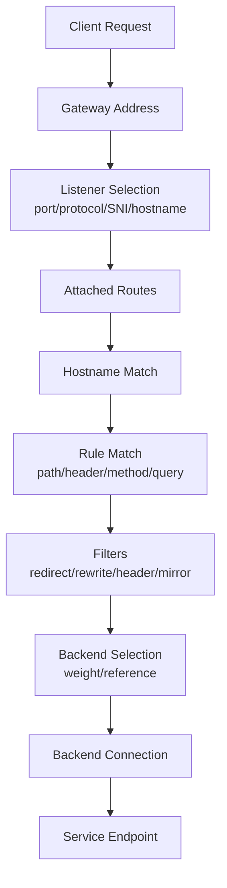
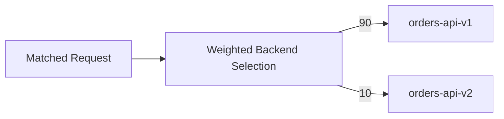
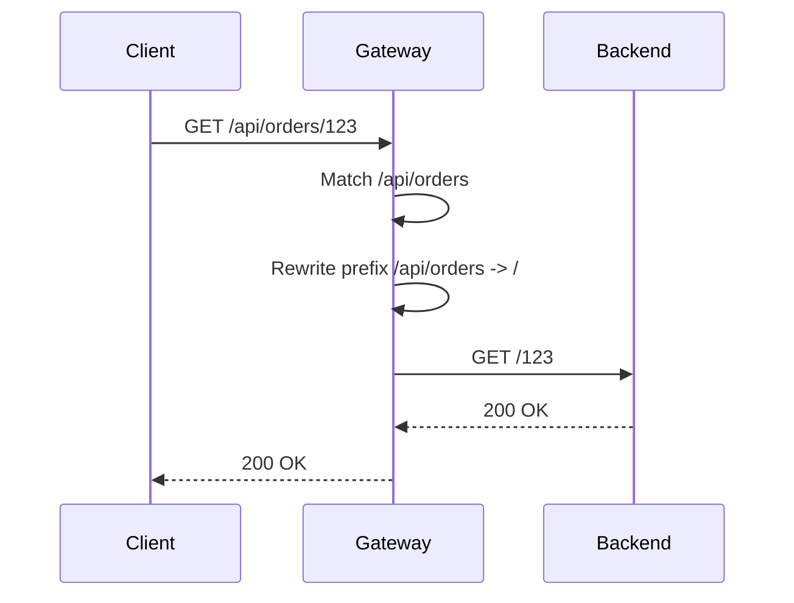
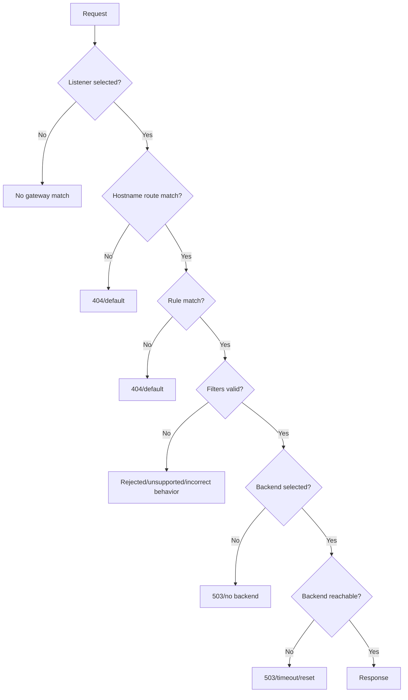

# Part 012 — HTTPRoute, GRPCRoute, and Application Routing Semantics

## 1. Tujuan Part Ini

Part 011 membahas attachment: bagaimana Route menempel ke Gateway/listener. Part ini membahas layer berikutnya: **request routing semantics**.

Jika attachment menjawab:

> “Apakah Route ini boleh menempel ke Gateway?”

maka routing semantics menjawab:

> “Ketika request masuk, rule mana yang match, filter apa yang diterapkan, dan backend mana yang dipilih?”

Target part ini:

> Anda mampu membaca `HTTPRoute` dan `GRPCRoute` sebagai contract aplikasi, bukan hanya route config. Anda mampu memprediksi request mana akan masuk ke backend mana, bagaimana konflik rule diselesaikan, dan failure mode apa yang muncul dari matching, rewriting, mirroring, dan weighted traffic.

Kita akan fokus pada mental model, bukan hafalan YAML.

---

## 2. Request Routing Pipeline

Dalam Gateway API, request yang masuk melewati pipeline konseptual:



Debugging harus mengikuti urutan ini.

Kesalahan umum adalah langsung melihat backend pod, padahal request mungkin gagal di:

- listener selection;
- hostname match;
- path match;
- unsupported filter;
- wrong rewrite;
- backend weight;
- invalid backend reference.

---

## 3. HTTPRoute Anatomy

Contoh minimal:

```yaml
apiVersion: gateway.networking.k8s.io/v1
kind: HTTPRoute
metadata:
  name: orders
  namespace: orders
spec:
  parentRefs:
    - name: public-gw
      namespace: platform-gateways
      sectionName: https
  hostnames:
    - orders.example.com
  rules:
    - matches:
        - path:
            type: PathPrefix
            value: /
      backendRefs:
        - name: orders-api
          port: 8080
```

Komponen utama:

| Field | Fungsi |
|---|---|
| `parentRefs` | Gateway/listener/parent yang ingin dipakai |
| `hostnames` | hostnames yang dimiliki route |
| `rules` | daftar rule matching + filter + backend |
| `matches` | kondisi request yang harus match |
| `filters` | transformasi/aksi terhadap request/response |
| `backendRefs` | tujuan traffic |

Mental model:

> `HTTPRoute` adalah declarative request classifier.

Ia mengklasifikasikan request berdasarkan hostname dan rule, lalu menerapkan filter dan memilih backend.

---

## 4. Hostname Semantics

`spec.hostnames` membatasi Host header yang akan diproses route.

```yaml
hostnames:
  - orders.example.com
```

Request ini match:

```http
GET / HTTP/1.1
Host: orders.example.com
```

Request ini tidak match:

```http
GET / HTTP/1.1
Host: billing.example.com
```

### 4.1 Hostname Kosong

Jika `hostnames` kosong, route dapat match semua hostnames yang compatible dengan listener. Ini mungkin berguna untuk internal route, tetapi berisiko untuk shared public gateway.

Rule production:

> Public HTTPRoute harus eksplisit menyebut hostname kecuali ada alasan kuat.

### 4.2 Wildcard Hostname

Contoh:

```yaml
hostnames:
  - "*.apps.example.com"
```

Gunakan wildcard dengan governance. Wildcard memperluas ownership surface.

Risk:

- team bisa menangkap subdomain terlalu luas;
- conflict dengan route spesifik;
- audit domain ownership lebih sulit;
- incident domain hijack lebih mungkin.

### 4.3 Hostname Attachment vs Hostname Match

Seperti Part 011, hostname muncul pada dua layer:

1. compatibility antara listener dan route;
2. request runtime match.

Contoh:

```yaml
# Gateway listener
hostname: "*.example.com"

# HTTPRoute
hostnames:
  - orders.example.com
```

Route attach. Namun runtime request harus punya Host `orders.example.com`.

Test benar:

```bash
curl -vk \
  --resolve orders.example.com:443:<GATEWAY_IP> \
  https://orders.example.com/api/orders
```

Test yang sering salah:

```bash
curl -vk https://<GATEWAY_IP>/api/orders
```

Tanpa SNI/Host yang benar, hasilnya tidak membuktikan route rusak.

---

## 5. HTTPRoute Rules

`rules` adalah daftar routing rules.

Contoh:

```yaml
rules:
  - matches:
      - path:
          type: PathPrefix
          value: /api/orders
    backendRefs:
      - name: orders-api
        port: 8080
  - matches:
      - path:
          type: PathPrefix
          value: /health
    backendRefs:
      - name: orders-health
        port: 8080
```

Setiap rule dapat memiliki:

- satu atau lebih match;
- nol atau lebih filter;
- satu atau lebih backendRef.

### 5.1 OR dan AND Semantics

Dalam satu match object, beberapa condition biasanya bersifat AND.

Contoh:

```yaml
matches:
  - path:
      type: PathPrefix
      value: /api/orders
    headers:
      - name: X-Region
        value: ap-southeast-1
```

Makna:

```text
path starts with /api/orders AND header X-Region == ap-southeast-1
```

Beberapa match entries dalam satu rule biasanya bersifat OR.

```yaml
matches:
  - path:
      type: PathPrefix
      value: /api/orders
  - path:
      type: PathPrefix
      value: /orders
```

Makna:

```text
path starts with /api/orders OR path starts with /orders
```

Ini penting untuk membaca route kompleks.

---

## 6. Path Matching

HTTPRoute mendukung beberapa tipe path matching.

| Type | Makna | Contoh |
|---|---|---|
| `Exact` | path harus sama persis | `/healthz` |
| `PathPrefix` | path diawali prefix tertentu | `/api/orders` |
| `RegularExpression` | regex, tergantung support/implementation | `^/v[0-9]+/orders` |

### 6.1 Exact Path

```yaml
matches:
  - path:
      type: Exact
      value: /healthz
```

Match:

```text
/healthz
```

Tidak match:

```text
/healthz/
/healthz/live
```

Exact cocok untuk:

- health endpoint;
- callback endpoint;
- static well-known path;
- endpoint yang tidak boleh overlap.

### 6.2 PathPrefix

```yaml
matches:
  - path:
      type: PathPrefix
      value: /api/orders
```

Match:

```text
/api/orders
/api/orders/123
/api/orders/v2/search
```

Berhati-hati terhadap prefix boundary. Pastikan implementasi mengikuti spec semantics. Jangan mengandalkan intuisi string prefix sederhana tanpa test.

### 6.3 RegularExpression

Regex memberi fleksibilitas, tetapi menurunkan portability dan observability.

Gunakan regex hanya jika:

- controller mendukung;
- conformance/compatibility jelas;
- rule sulit diekspresikan dengan exact/prefix;
- test case lengkap;
- route ownership jelas.

Anti-pattern:

```yaml
path:
  type: RegularExpression
  value: ".*"
```

Ini catch-all yang bisa menyembunyikan route lain.

---

## 7. Header Matching

Header matching memungkinkan routing berdasarkan request metadata.

Contoh:

```yaml
matches:
  - path:
      type: PathPrefix
      value: /api/orders
    headers:
      - name: X-Canary
        value: "true"
```

Use case:

- internal canary;
- beta user routing;
- region routing;
- partner-specific traffic;
- mobile app version migration.

### 7.1 Header Routing Risks

Header bisa dipalsukan oleh client kecuali Anda mengontrol boundary.

Jangan gunakan header dari public client untuk security decision tanpa authentication/verification.

Risk:

```text
Client sends X-Internal-User: true
Gateway routes to internal backend
```

Mitigasi:

- strip untrusted headers at edge;
- generate trusted headers after authentication;
- use separate domain/listener for privileged traffic;
- enforce authz in backend/mesh;
- document trusted header boundary.

### 7.2 Header Normalization

HTTP header names case-insensitive, tetapi tool dan logs bisa menampilkan case berbeda. Jangan debugging hanya dengan string visual.

Pastikan:

- header benar-benar dikirim;
- proxy tidak menghapus header;
- CDN/WAF tidak mengubah header;
- route controller mendukung header match yang dipakai.

---

## 8. Query Parameter Matching

Contoh:

```yaml
matches:
  - path:
      type: PathPrefix
      value: /search
    queryParams:
      - name: version
        value: v2
```

Use case:

- migration endpoint;
- compatibility route;
- experiment;
- legacy API support.

Risiko:

- query param mudah dimanipulasi;
- cache behavior bisa berubah;
- observability cardinality meningkat;
- client SDK bisa reorder/encode value secara berbeda.

Gunakan query matching sebagai routing tool, bukan security control.

---

## 9. Method Matching

Contoh:

```yaml
matches:
  - path:
      type: PathPrefix
      value: /api/orders
    method: POST
```

Use case:

- route write traffic ke backend baru;
- route read traffic ke cache/read model;
- isolate mutation endpoint;
- gradual migration command/query separation.

Namun hati-hati:

- HTTP method override header bisa ada di beberapa stack;
- CORS preflight memakai `OPTIONS`;
- health checker mungkin `GET`;
- client retry behavior berbeda untuk idempotent vs non-idempotent method.

Rule:

> Jika routing berdasarkan method, test `OPTIONS`, `HEAD`, dan error path.

---

## 10. Rule Precedence

Ketika banyak rules bisa match request yang sama, precedence menentukan rule pemenang.

Secara mental, lebih spesifik biasanya harus menang dibanding catch-all. Namun detail exact precedence harus selalu mengikuti Gateway API spec dan implementation conformance.

Contoh:

```yaml
rules:
  - matches:
      - path:
          type: PathPrefix
          value: /api/orders/internal
    backendRefs:
      - name: orders-internal
        port: 8080
  - matches:
      - path:
          type: PathPrefix
          value: /api/orders
    backendRefs:
      - name: orders-api
        port: 8080
```

Request:

```text
/api/orders/internal/audit
```

Secara desain, Anda ingin masuk ke `orders-internal`. Jangan hanya bergantung pada urutan YAML jika spec memberi aturan precedence yang berbeda. Test dan baca status/controller behavior.

### 10.1 Avoid Ambiguous Overlap

Lebih baik desain route agar minim overlap.

Buruk:

```text
/api
/api/orders
/api/orders/v1
/api/orders/v1/internal
```

Jika semua dimiliki team berbeda, governance menjadi sulit.

Lebih baik:

```text
/orders
/billing
/identity
/admin/orders
```

atau pisahkan hostname:

```text
orders.example.com
billing.example.com
identity.example.com
admin.example.com
```

---

## 11. BackendRefs dan Weighted Traffic

`backendRefs` menentukan tujuan traffic.

Contoh satu backend:

```yaml
backendRefs:
  - name: orders-api
    port: 8080
```

Contoh weighted split:

```yaml
backendRefs:
  - name: orders-api-v1
    port: 8080
    weight: 90
  - name: orders-api-v2
    port: 8080
    weight: 10
```

Makna: traffic relatif 90:10, bukan jaminan persis per 100 request.

### 11.1 Weighted Traffic Mental Model



Weighted routing cocok untuk:

- canary;
- blue/green transition;
- emergency rollback;
- backend migration;
- performance comparison.

### 11.2 Weight Edge Cases

| Case | Risiko |
|---|---|
| Low traffic service | 90/10 bisa tidak terlihat secara statistik |
| Sticky sessions | distribusi request tidak sesuai weight |
| Long-lived connections | split terjadi per connection, bukan per logical operation |
| Client retry | retry bisa mengubah actual observed ratio |
| Backend latency beda | user experience tidak proporsional dengan traffic weight |
| Mirroring aktif | backend mirror menerima traffic tambahan di luar weight |

Rule:

> Weighted traffic adalah probabilistic control, bukan precise transaction allocator.

### 11.3 Zero Weight

Beberapa pattern memakai `weight: 0` untuk preconfigure backend tetapi belum menerima traffic. Pastikan controller behavior sesuai dan status backend valid.

Use case:

```yaml
backendRefs:
  - name: orders-api-v1
    port: 8080
    weight: 100
  - name: orders-api-v2
    port: 8080
    weight: 0
```

Ini berguna untuk rollout pipeline, tetapi jangan anggap backend v2 sudah sehat hanya karena route accepted.

---

## 12. Filters: Transformasi dan Side Effects

HTTPRoute filters memungkinkan aksi seperti:

- request redirect;
- URL rewrite;
- request header modification;
- response header modification;
- request mirroring;
- extension filters.

Tidak semua filter didukung sama oleh semua controller. Selalu baca status dan conformance.

---

## 13. Request Redirect Filter

Redirect mengembalikan response redirect ke client. Request tidak diteruskan ke backend asli.

Contoh HTTP ke HTTPS:

```yaml
rules:
  - filters:
      - type: RequestRedirect
        requestRedirect:
          scheme: https
          statusCode: 301
```

Use case:

- force HTTPS;
- canonical host redirect;
- path migration;
- domain consolidation.

Risk:

- redirect loop;
- method berubah pada beberapa client untuk 301/302;
- cache browser menyimpan redirect permanen;
- SEO/client behavior berubah;
- redirect terjadi sebelum auth flow yang diharapkan.

Debug:

```bash
curl -v http://orders.example.com/api/orders
```

Cek `Location` header.

---

## 14. URL Rewrite Filter

Rewrite mengubah request sebelum dikirim ke backend. Client tidak tahu path internal berubah.

Contoh:

```yaml
filters:
  - type: URLRewrite
    urlRewrite:
      path:
        type: ReplacePrefixMatch
        replacePrefixMatch: /
```

Jika route match `/api/orders`, backend bisa menerima `/` atau path yang sudah disesuaikan.

### 14.1 Rewrite Mental Model



### 14.2 Rewrite Failure Modes

| Failure | Contoh |
|---|---|
| Backend expects original prefix | backend route `/api/orders/123`, gateway sends `/123` |
| Double prefix | gateway sends `/orders/orders/123` |
| Auth middleware path mismatch | auth policy checks original path, backend sees rewritten path |
| Observability confusion | access log gateway dan app log berbeda |
| Callback URL broken | app generates links based on internal path |

Rule:

> Rewrite harus didokumentasikan sebagai API boundary transform.

Jangan sembunyikan rewrite dari application team.

---

## 15. Header Modifier Filters

Request header modifier:

```yaml
filters:
  - type: RequestHeaderModifier
    requestHeaderModifier:
      set:
        - name: X-Forwarded-Proto
          value: https
      add:
        - name: X-Platform-Gateway
          value: public-gw
      remove:
        - X-Untrusted-Internal-User
```

Response header modifier:

```yaml
filters:
  - type: ResponseHeaderModifier
    responseHeaderModifier:
      set:
        - name: Cache-Control
          value: no-store
```

Use case:

- remove spoofed headers;
- add platform trace metadata;
- normalize forwarding headers;
- set security headers;
- add backend selection metadata for debug.

### 15.1 Trusted Header Boundary

Headers like these are dangerous if not controlled:

```text
X-User-Id
X-User-Roles
X-Internal-Request
X-Forwarded-For
X-Forwarded-Proto
X-Real-IP
```

Pattern aman:

1. edge gateway removes untrusted incoming headers;
2. auth layer validates identity;
3. trusted headers are re-added by trusted component;
4. backend trusts only headers produced after boundary.

Mermaid:


---

## 16. Request Mirroring

Mirroring mengirim salinan request ke backend lain. Response mirror tidak dikembalikan ke client.

Contoh konseptual:

```yaml
filters:
  - type: RequestMirror
    requestMirror:
      backendRef:
        name: orders-api-shadow
        port: 8080
backendRefs:
  - name: orders-api
    port: 8080
```

Use case:

- shadow test backend baru;
- validate read-only behavior;
- compare performance;
- warm cache;
- test observability pipeline.

### 16.1 Mirroring Is Dangerous for Writes

Jika request mirrored adalah `POST /payments`, mirror backend bisa melakukan side effect jika tidak dikunci.

Mitigasi:

- mirror hanya read traffic;
- mirror backend dalam dry-run mode;
- block outbound side effects dari mirror namespace;
- sanitize credentials;
- enforce idempotency/no-write mode;
- use separate database clone;
- add clear telemetry label.

Rule:

> Request mirroring is safe only when side effects are controlled.

### 16.2 Mirror Traffic Capacity

Mirroring dapat menggandakan inbound load ke backend shadow dan sebagian network path.

Jika primary menerima 10k RPS dan mirror 100%, shadow juga menerima 10k RPS.

Pastikan:

- capacity shadow cukup;
- observability cardinality tidak meledak;
- downstream dependencies tidak ikut terbebani;
- rate limit memperhitungkan mirror.

---

## 17. ExtensionRef Filters

Gateway API menyediakan extension mechanism untuk fitur yang tidak ada di core API, seperti:

- auth integration;
- rate limiting;
- WAF;
- custom transformation;
- external processing;
- advanced observability.

Contoh konseptual:

```yaml
filters:
  - type: ExtensionRef
    extensionRef:
      group: example.com
      kind: RateLimitPolicy
      name: orders-ratelimit
```

Trade-off:

| Keuntungan | Risiko |
|---|---|
| fitur production lebih kaya | portability turun |
| integrasi platform spesifik | migration lebih sulit |
| policy bisa distandarkan internal | conformance tidak selalu menjamin behavior |

Rule:

> Core Gateway API gives portability. ExtensionRef gives power. Jangan campur keduanya tanpa sadar trade-off.

---

## 18. HTTPRoute sebagai Application Contract

Route bukan hanya network object. Route adalah public/internal API contract.

Contoh route:

```yaml
hostnames:
  - orders.example.com
rules:
  - matches:
      - path:
          type: PathPrefix
          value: /api/orders
    backendRefs:
      - name: orders-api
        port: 8080
```

Ini menyatakan:

- domain `orders.example.com` adalah entrypoint;
- path `/api/orders` dimiliki service orders;
- backend service `orders-api:8080` menerima traffic;
- Gateway/listener parent adalah exposure boundary.

Karena itu, route harus masuk API review:

- path stability;
- auth requirement;
- rate limit;
- versioning;
- deprecation;
- compatibility;
- observability;
- ownership.

---

## 19. GRPCRoute Anatomy

gRPC berjalan di atas HTTP/2, tetapi secara semantik berbeda dari HTTP REST. `GRPCRoute` membuat intent lebih jelas.

Contoh:

```yaml
apiVersion: gateway.networking.k8s.io/v1
kind: GRPCRoute
metadata:
  name: profile-grpc
  namespace: profile
spec:
  parentRefs:
    - name: public-gw
      namespace: platform-gateways
      sectionName: grpc
  hostnames:
    - profile-grpc.example.com
  rules:
    - matches:
        - method:
            service: user.profile.v1.ProfileService
            method: GetProfile
      backendRefs:
        - name: profile-grpc-api
          port: 9090
```

GRPCRoute dapat mengekspresikan routing berdasarkan:

- hostname;
- gRPC service;
- gRPC method;
- headers;
- backend refs.

### 19.1 Kenapa Bukan HTTPRoute Saja?

Secara teknis, gRPC request memiliki path seperti:

```text
/package.Service/Method
```

Contoh:

```text
/user.profile.v1.ProfileService/GetProfile
```

Anda bisa mencoba route gRPC dengan HTTP path matching, tetapi `GRPCRoute` lebih eksplisit:

- menunjukkan traffic adalah gRPC;
- mengurangi ambiguity;
- memungkinkan gRPC-specific features;
- memudahkan platform policy;
- memudahkan reviewer memahami contract.

Rule:

> Jika Anda tahu traffic adalah gRPC dan controller mendukung GRPCRoute, gunakan GRPCRoute untuk intent clarity.

---

## 20. gRPC Routing Semantics

gRPC routing harus memperhatikan:

- HTTP/2;
- TLS/ALPN;
- service/method naming;
- streaming;
- deadlines;
- status code semantics;
- retry behavior;
- load balancing per connection vs per request;
- proxy support.

### 20.1 Service and Method Match

Contoh route per method:

```yaml
rules:
  - matches:
      - method:
          service: user.profile.v1.ProfileService
          method: GetProfile
    backendRefs:
      - name: profile-query
        port: 9090
  - matches:
      - method:
          service: user.profile.v1.ProfileService
          method: UpdateProfile
    backendRefs:
      - name: profile-command
        port: 9090
```

Use case:

- split read/write;
- migrate method tertentu;
- isolate high-cost RPC;
- route admin RPC ke backend khusus;
- canary method baru.

### 20.2 Streaming RPC

gRPC streaming membuat traffic shaping lebih sulit.

Problem:

- connection bisa long-lived;
- load balancing mungkin terjadi saat connection dibuat;
- retry tidak sederhana;
- mirroring streaming tidak selalu didukung/aman;
- timeout harus selaras dengan deadline gRPC;
- draining butuh waktu lebih lama.

Rule:

> Treat streaming RPC as connection lifecycle, not just request lifecycle.

---

## 21. HTTP/2, TLS, and ALPN

gRPC biasanya membutuhkan HTTP/2. Jika TLS digunakan, ALPN negotiation harus benar.

Failure mode umum:

| Symptom | Kemungkinan Penyebab |
|---|---|
| client mendapat protocol error | gateway/backend tidak negotiate HTTP/2 |
| request masuk sebagai HTTP/1.1 | TLS/ALPN/proxy config salah |
| gRPC health check gagal | health check memakai HTTP biasa |
| route accepted tapi runtime gagal | listener/backend protocol mismatch |

Debugging:

```bash
grpcurl -vv -authority profile-grpc.example.com \
  profile-grpc.example.com:443 \
  list
```

Untuk local DNS override:

```bash
grpcurl -vv \
  -authority profile-grpc.example.com \
  -resolve profile-grpc.example.com:443:<GATEWAY_IP> \
  profile-grpc.example.com:443 \
  list
```

Tool support bisa berbeda; sesuaikan dengan client yang dipakai.

---

## 22. gRPC Status vs HTTP Status

gRPC memiliki status sendiri, misalnya:

- `OK`;
- `CANCELLED`;
- `UNKNOWN`;
- `INVALID_ARGUMENT`;
- `DEADLINE_EXCEEDED`;
- `UNAVAILABLE`;
- `INTERNAL`.

Proxy/gateway bisa melihat HTTP status 200 sementara gRPC status menunjukkan error di trailer.

Observability harus menangkap:

- HTTP status;
- gRPC status;
- method;
- service;
- deadline exceeded;
- reset/cancelled stream;
- upstream reset reason.

Anti-pattern:

> Mengukur gRPC success hanya dari HTTP 2xx.

---

## 23. Backend Protocol and Port Naming

Service backend port harus jelas.

Contoh:

```yaml
apiVersion: v1
kind: Service
metadata:
  name: profile-grpc-api
  namespace: profile
spec:
  selector:
    app: profile-grpc-api
  ports:
    - name: grpc
      port: 9090
      targetPort: 9090
      appProtocol: kubernetes.io/h2c
```

`appProtocol` dapat membantu menyatakan protocol aplikasi, tergantung controller/implementation support.

Untuk TLS backend atau HTTP/2 cleartext, pastikan controller tahu cara berbicara ke backend.

Failure mode:

- Gateway terminate TLS lalu berbicara HTTP/1.1 ke backend gRPC;
- backend mengharapkan h2c tetapi gateway memakai HTTP/1.1;
- backend mengharapkan TLS tetapi gateway plaintext;
- health check memakai protocol salah.

---

## 24. Combining HTTPRoute and GRPCRoute

Satu Gateway bisa melayani HTTP dan gRPC dengan listener berbeda.

```yaml
listeners:
  - name: https-api
    protocol: HTTPS
    port: 443
    hostname: api.example.com
    tls:
      mode: Terminate
      certificateRefs:
        - name: api-example-com
    allowedRoutes:
      kinds:
        - kind: HTTPRoute
  - name: grpc-api
    protocol: HTTPS
    port: 443
    hostname: grpc.example.com
    tls:
      mode: Terminate
      certificateRefs:
        - name: grpc-example-com
    allowedRoutes:
      kinds:
        - kind: GRPCRoute
```

Atau satu hostname dengan path/service separation, tergantung controller.

Design guidance:

- pisahkan hostname jika client/protocol berbeda signifikan;
- pisahkan listener jika policy berbeda;
- jangan mencampur gRPC dan browser HTTP tanpa alasan;
- pastikan observability bisa memisahkan protocol.

---

## 25. Canary with HTTPRoute

Canary sederhana:

```yaml
rules:
  - matches:
      - path:
          type: PathPrefix
          value: /api/orders
    backendRefs:
      - name: orders-api-v1
        port: 8080
        weight: 95
      - name: orders-api-v2
        port: 8080
        weight: 5
```

### 25.1 Header-Based Canary

```yaml
rules:
  - matches:
      - path:
          type: PathPrefix
          value: /api/orders
        headers:
          - name: X-Canary
            value: "v2"
    backendRefs:
      - name: orders-api-v2
        port: 8080
  - matches:
      - path:
          type: PathPrefix
          value: /api/orders
    backendRefs:
      - name: orders-api-v1
        port: 8080
```

Risk:

- public users can spoof `X-Canary`;
- rule order/precedence must be tested;
- canary path may bypass auth if policy attached differently;
- metrics must separate v1/v2.

### 25.2 Canary Checklist

Before increasing weight:

- v2 backend ready endpoints > 0;
- error rate by backend version visible;
- latency by backend version visible;
- business metric guardrails exist;
- rollback is one manifest change;
- sticky/session behavior understood;
- idempotency/retry behavior reviewed;
- database compatibility confirmed.

---

## 26. Blue-Green with HTTPRoute

Blue-green route switch:

```yaml
backendRefs:
  - name: orders-blue
    port: 8080
    weight: 100
  - name: orders-green
    port: 8080
    weight: 0
```

Switch:

```yaml
backendRefs:
  - name: orders-blue
    port: 8080
    weight: 0
  - name: orders-green
    port: 8080
    weight: 100
```

Caveat:

- long-lived connections may remain on old backend;
- DNS/client cache irrelevant if route-level switch;
- backend readiness must be true before switch;
- drain old backend after switch;
- database backward compatibility still required.

---

## 27. Path Versioning Pattern

Example:

```yaml
rules:
  - matches:
      - path:
          type: PathPrefix
          value: /v1/orders
    filters:
      - type: URLRewrite
        urlRewrite:
          path:
            type: ReplacePrefixMatch
            replacePrefixMatch: /orders
    backendRefs:
      - name: orders-v1
        port: 8080
  - matches:
      - path:
          type: PathPrefix
          value: /v2/orders
    filters:
      - type: URLRewrite
        urlRewrite:
          path:
            type: ReplacePrefixMatch
            replacePrefixMatch: /orders
    backendRefs:
      - name: orders-v2
        port: 8080
```

This keeps external API versioned while backend internal path can remain stable.

Risk:

- logs show rewritten path, hiding external version;
- auth policy must evaluate correct path;
- OpenAPI docs must match external path;
- deprecation metrics must use external route label.

---

## 28. Route Design for Regulatory/Enterprise Systems

Untuk sistem regulatory/case management/enforcement, route design harus defensible.

Pertanyaan yang harus dijawab:

- Domain/path mana yang merepresentasikan authoritative API?
- Route mana yang public, partner, internal, admin?
- Apakah write command dan read query dipisahkan?
- Apakah admin path punya gateway/listener terpisah?
- Apakah route punya audit owner?
- Apakah rewrite mengubah jejak audit?
- Apakah mirror traffic bisa membawa data sensitif?
- Apakah canary mengubah determinisme proses bisnis?
- Apakah failover bisa menyebabkan duplicate command?

Route bukan hanya network convenience. Untuk sistem high-accountability, route adalah bagian dari **evidence boundary**.

---

## 29. Debugging Playbook: Request Masuk Backend Salah

### 29.1 Capture Request Identity

Test dengan Host dan path eksplisit:

```bash
curl -vk \
  --resolve orders.example.com:443:<GATEWAY_IP> \
  -H 'X-Debug-Route: manual-test' \
  https://orders.example.com/api/orders/123
```

### 29.2 Cek Route Rules

```bash
kubectl get httproute -n orders orders-public -o yaml
```

Periksa:

- hostnames;
- matches;
- rule overlap;
- filters;
- backend weights.

### 29.3 Cek Access Logs

Cari field:

- host;
- path original;
- path rewritten;
- route name;
- backend cluster/service;
- response code;
- upstream response flags;
- request ID.

### 29.4 Cek Backend Labels

Pastikan Service selector tidak menunjuk pod salah.

```bash
kubectl get svc -n orders orders-api -o yaml
kubectl get pods -n orders -l app=orders-api -o wide
kubectl get endpointslice -n orders -l kubernetes.io/service-name=orders-api -o yaml
```

### 29.5 Cek Weight

Jika weighted backend, traffic salah mungkin sebenarnya expected probabilistic behavior. Lakukan sample cukup besar.

```bash
for i in $(seq 1 1000); do
  curl -s -H 'Host: orders.example.com' http://<GATEWAY_IP>/version
  echo
 done | sort | uniq -c
```

---

## 30. Debugging Playbook: gRPC Route Tidak Bekerja

Checklist:

1. Apakah listener protocol dan TLS mendukung gRPC?
2. Apakah client memakai HTTP/2?
3. Apakah SNI/authority benar?
4. Apakah GRPCRoute accepted?
5. Apakah method service name benar?
6. Apakah backend port benar?
7. Apakah gateway berbicara h2/h2c/TLS sesuai backend?
8. Apakah gRPC health check sesuai?
9. Apakah NetworkPolicy mengizinkan gateway ke backend?
10. Apakah observability membaca gRPC status, bukan hanya HTTP status?

Command:

```bash
kubectl get grpcroute -n profile profile-grpc -o yaml
kubectl get gateway -n platform-gateways public-gw -o yaml
kubectl get svc -n profile profile-grpc-api -o yaml
```

Runtime test:

```bash
grpcurl -vv \
  -authority profile-grpc.example.com \
  profile-grpc.example.com:443 \
  list
```

---

## 31. Failure Model Matrix

| Failure | Layer | Symptom | Mitigation |
|---|---|---|---|
| Host header wrong | runtime match | 404/default backend | test with `--resolve` and correct Host |
| Catch-all route shadows specific route | rule design | request hits wrong backend | avoid ambiguous overlap; admission checks |
| Regex unsupported | implementation | route rejected or ignored | check conformance/status |
| Header spoofing | security boundary | client accesses canary/internal backend | strip/generate trusted headers |
| Rewrite mismatch | filter | backend 404 or auth mismatch | document original vs rewritten path |
| Mirror writes | side effect | duplicate mutation | mirror only safe traffic or dry-run backend |
| Weight misunderstood | rollout | canary receives unexpected traffic | sample statistically; account for stickiness |
| gRPC via HTTP/1.1 | protocol | protocol error | verify HTTP/2/ALPN/backend protocol |
| gRPC status ignored | observability | false success rate | collect gRPC status/trailers |
| BackendRef wrong port | reference/runtime | 503 or `ResolvedRefs=False` | validate Service port and status |

---

## 32. Route Review Checklist

Untuk setiap HTTPRoute/GRPCRoute production:

- Apakah `parentRefs` explicit?
- Apakah `sectionName` benar?
- Apakah hostname dimiliki team ini?
- Apakah path/service/method ownership jelas?
- Apakah ada overlap dengan route lain?
- Apakah rule precedence sudah diuji?
- Apakah filter didukung controller?
- Apakah rewrite terdokumentasi?
- Apakah mirror aman dari side effects?
- Apakah weighted rollout punya metrics?
- Apakah backend port/protocol benar?
- Apakah auth/rate limit/security headers diterapkan di layer yang benar?
- Apakah observability bisa menunjukkan route dan backend terpilih?
- Apakah rollback manifest jelas?

---

## 33. Practice Loop Kaufman

### Latihan 1 — Hostname Runtime Match

Buat `HTTPRoute` dengan hostname `orders.example.com`. Test dengan:

- curl ke IP tanpa Host;
- curl dengan `Host` header;
- curl dengan `--resolve`.

Tujuan: membedakan gateway address dari hostname route.

### Latihan 2 — Path Precedence

Buat dua rules:

- `/api/orders`;
- `/api/orders/internal`.

Test request ke `/api/orders/internal/audit`. Verifikasi backend.

Tujuan: memahami overlap dan precedence.

### Latihan 3 — Header Canary

Route `X-Canary: true` ke v2. Test spoofing dari client.

Tujuan: memahami trusted header boundary.

### Latihan 4 — Rewrite

Rewrite `/api/orders` menjadi `/`. Bandingkan gateway access log dan backend app log.

Tujuan: melihat observability gap.

### Latihan 5 — Weighted Split

Buat 90/10 split. Kirim 1000 request. Hitung distribusi.

Tujuan: memahami probabilistic traffic routing.

### Latihan 6 — gRPC Method Routing

Buat GRPCRoute per method. Test dengan `grpcurl`.

Tujuan: memahami service/method routing dan HTTP/2 boundary.

---

## 34. Mental Model Summary

Pegang model ini:



This is the fastest path to debug.

---

## 35. Baeldung-Style Summary

`HTTPRoute` dan `GRPCRoute` adalah API contract untuk request routing. Keduanya tidak hanya menentukan backend, tetapi juga mendefinisikan hostname, rule matching, filter behavior, protocol semantics, dan rollout strategy.

Hal penting:

- Hostname harus match di attachment dan runtime request.
- `rules.matches` adalah classifier; pahami AND/OR semantics.
- Path matching harus didesain agar tidak ambigu.
- Header/query/method routing berguna, tetapi jangan jadikan security boundary tanpa kontrol.
- Weighted backend adalah probabilistic routing, bukan alokasi transaksi presisi.
- Redirect mengembalikan response ke client; rewrite mengubah request ke backend.
- Mirroring bisa berbahaya untuk write traffic.
- GRPCRoute lebih eksplisit untuk gRPC dibanding memaksakan HTTPRoute path matching.
- gRPC observability harus membaca gRPC status, bukan hanya HTTP status.
- Filter dan advanced behavior bisa berbeda antar controller; cek conformance dan status.

Part berikutnya akan membahas TLS: termination, passthrough, SNI, certificate references, backend TLS, trust boundaries, dan failure mode certificate/TLS yang sering membuat route terlihat benar tetapi traffic gagal.

---

## References

- Kubernetes Documentation — Gateway API: `https://kubernetes.io/docs/concepts/services-networking/gateway/`
- Gateway API Documentation — HTTPRoute: `https://gateway-api.sigs.k8s.io/api-types/httproute/`
- Gateway API Documentation — GRPCRoute: `https://gateway-api.sigs.k8s.io/reference/api-types/grpcroute/`
- Gateway API Documentation — Traffic Splitting: `https://gateway-api.sigs.k8s.io/guides/user-guides/traffic-splitting/`
- Gateway API Documentation — HTTP Redirect and Rewrite: `https://gateway-api.sigs.k8s.io/guides/http-redirect-rewrite/`
- Gateway API Documentation — Request Mirroring: `https://gateway-api.sigs.k8s.io/guides/http-request-mirroring/`
- Gateway API Documentation — Specification: `https://gateway-api.sigs.k8s.io/reference/spec/`
