# Part 013 — TLS Termination, Passthrough, Certificates, and Trust Boundaries

## 1. Tujuan Part Ini

Part 010 sampai Part 012 membangun model Gateway API dari sisi attachment dan routing aplikasi. Sekarang kita masuk ke bagian yang sering terlihat sederhana di YAML, tetapi sangat menentukan keamanan produksi: **TLS boundary**.

Target part ini:

> Anda mampu mendesain jalur TLS Kubernetes dari client sampai backend dengan eksplisit: di mana TLS berakhir, siapa pemilik sertifikat, namespace mana yang boleh mereferensikan Secret, apakah backend connection dienkripsi ulang, dan failure mode apa yang harus dimonitor.

TLS di Kubernetes bukan hanya `secretName`. TLS adalah jawaban untuk beberapa pertanyaan produksi:

- koneksi mana yang dienkripsi;
- identitas siapa yang divalidasi;
- siapa yang memegang private key;
- di mana plaintext muncul;
- siapa yang boleh mengubah sertifikat;
- bagaimana rotasi dilakukan tanpa outage;
- apa bukti audit bahwa traffic sensitif tidak melewati hop plaintext.

---

## 2. Kaufman Deconstruction: TLS Skill Map

Kaufman menyarankan skill kompleks dipecah menjadi sub-skill kecil yang bisa dilatih. Untuk TLS di Kubernetes Gateway API, pecahannya adalah:

| Sub-skill | Pertanyaan yang Harus Bisa Dijawab |
|---|---|
| TLS boundary modelling | Di mana TLS terminate, pass through, atau re-encrypt? |
| Certificate ownership | Siapa yang membuat, menyimpan, dan merotasi private key? |
| SNI routing | Apakah Gateway memilih backend dari hostname HTTP atau SNI TLS? |
| Secret reference safety | Namespace mana yang boleh mereferensikan Secret? |
| Backend TLS | Apakah Gateway memverifikasi sertifikat backend atau hanya membuka koneksi plaintext? |
| Trust store management | CA mana yang dipercaya untuk client-facing dan backend-facing traffic? |
| Debugging | Bagaimana membedakan DNS, listener, SNI, certificate, ALPN, route, dan backend TLS failure? |
| Compliance evidence | Bagaimana membuktikan tidak ada plaintext hop yang tidak diizinkan? |

**Anti-target:** sekadar hafal konfigurasi HTTPS Gateway.

**Target real:** mampu melakukan architecture review terhadap TLS posture sebuah platform Kubernetes.

---

## 3. Mental Model: TLS Bukan Satu Hop, Tapi Rangkaian Boundary

Saat client memanggil service melalui Gateway, setidaknya ada tiga boundary yang mungkin terlibat:

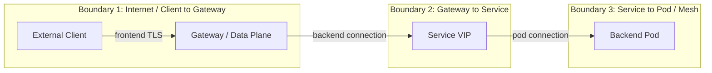

Kesalahan umum: menganggap `https://api.example.com` berarti seluruh jalur terenkripsi. Dalam banyak deployment, HTTPS hanya berlaku dari client ke Gateway. Setelah Gateway terminate TLS, request bisa diteruskan ke backend sebagai HTTP plaintext kecuali Anda secara eksplisit mendesain backend TLS atau mesh mTLS.

Secara konseptual ada empat model:

| Model | Client → Gateway | Gateway → Backend | Kapan Cocok |
|---|---|---|---|
| Edge termination | TLS | Plaintext | Internal network dianggap trusted, kebutuhan sederhana, observability L7 di Gateway penting |
| Re-encryption | TLS | TLS | Compliance membutuhkan encryption in transit end-to-end antar hop |
| Passthrough | TLS passthrough | TLS tetap sampai backend | Backend harus memegang sertifikat dan Gateway tidak boleh melihat HTTP payload |
| Mesh mTLS setelah edge | TLS | mTLS via mesh | Butuh identity-aware service-to-service security dan policy internal |

Tidak ada model universal. Yang penting adalah keputusan eksplisit dan terdokumentasi.

---

## 4. TLS Termination di Gateway API

Model paling umum adalah HTTPS listener dengan TLS termination di Gateway.

```yaml
apiVersion: gateway.networking.k8s.io/v1
kind: Gateway
metadata:
  name: public-gateway
  namespace: platform-ingress
spec:
  gatewayClassName: envoy-gateway
  listeners:
    - name: https
      protocol: HTTPS
      port: 443
      hostname: api.example.com
      tls:
        mode: Terminate
        certificateRefs:
          - kind: Secret
            group: ""
            name: api-example-com-tls
      allowedRoutes:
        namespaces:
          from: Selector
          selector:
            matchLabels:
              gateway-access: public
```

Makna operasionalnya:

1. Gateway menerima koneksi TLS di port 443.
2. Gateway memilih listener berdasarkan address, port, protocol, dan hostname/SNI.
3. Gateway memakai private key dari Kubernetes Secret yang direferensikan `certificateRefs`.
4. TLS terminate di data plane Gateway.
5. Setelah decrypt, Gateway dapat melakukan routing HTTP berdasarkan host/path/header/query/method.
6. Backend connection default-nya bergantung pada route/backend/policy/controller; jangan asumsikan otomatis TLS.

Diagram:

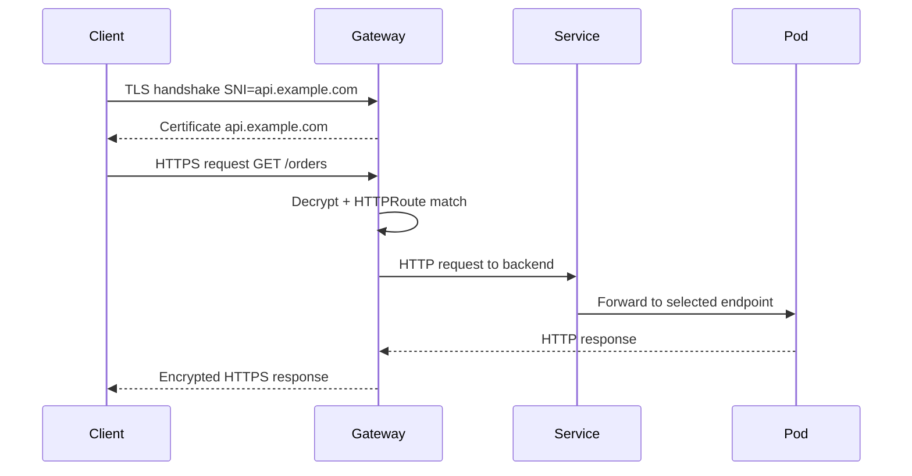

Kelebihan:

- Gateway bisa melakukan L7 routing.
- Gateway bisa menambahkan/menghapus header.
- Gateway bisa melakukan redirect, rewrite, mirroring, auth integration, rate limiting, dan observability HTTP.
- Sertifikat external bisa dikelola terpusat oleh platform team.

Risiko:

- Plaintext muncul di Gateway setelah termination.
- Gateway menjadi trust boundary kritis.
- Private key berada di namespace/platform object tertentu.
- Jika backend hop plaintext, compliance end-to-end encryption belum terpenuhi.

---

## 5. TLS Passthrough

Pada TLS passthrough, Gateway tidak mendekripsi traffic. Gateway hanya melihat metadata TLS yang tersedia sebelum payload dienkripsi penuh, terutama **SNI**.

```yaml
apiVersion: gateway.networking.k8s.io/v1
kind: Gateway
metadata:
  name: passthrough-gateway
  namespace: platform-ingress
spec:
  gatewayClassName: envoy-gateway
  listeners:
    - name: tls-passthrough
      protocol: TLS
      port: 443
      hostname: payments.example.com
      tls:
        mode: Passthrough
      allowedRoutes:
        namespaces:
          from: Same
```

Contoh `TLSRoute`:

```yaml
apiVersion: gateway.networking.k8s.io/v1
kind: TLSRoute
metadata:
  name: payments-tls
  namespace: platform-ingress
spec:
  parentRefs:
    - name: passthrough-gateway
      sectionName: tls-passthrough
  hostnames:
    - payments.example.com
  rules:
    - backendRefs:
        - name: payments-tls-service
          port: 443
```

Makna operasional:

- Gateway menerima TCP connection.
- Gateway membaca SNI dari TLS ClientHello.
- Gateway memilih backend berdasarkan TLS metadata, bukan HTTP path/header.
- Backend pod/service yang melakukan TLS termination.
- Gateway tidak melihat URL, header, body, cookie, atau status HTTP.

Diagram:

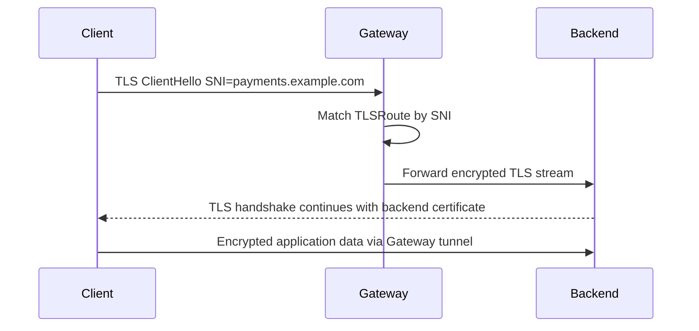

Kelebihan:

- Private key backend tidak perlu berada di Gateway namespace.
- Gateway tidak melihat payload HTTP.
- Cocok untuk workload yang harus melakukan TLS termination sendiri.
- Cocok untuk non-HTTP protocols over TLS.

Keterbatasan:

- Tidak bisa route berdasarkan path/header/query.
- Tidak bisa HTTP rewrite atau header manipulation.
- Observability L7 di Gateway hilang.
- Auth/rate limit berbasis HTTP sulit dilakukan di Gateway.
- Debugging lebih bergantung pada SNI, TCP, dan backend TLS.

---

## 6. Termination vs Passthrough: Decision Matrix

| Kriteria | Terminate di Gateway | Passthrough ke Backend |
|---|---|---|
| HTTP path routing | Ya | Tidak |
| Header-based routing | Ya | Tidak |
| Gateway access logs L7 | Ya | Terbatas ke L4/TLS metadata |
| Gateway melihat payload | Ya | Tidak |
| Private key external cert | Di Gateway/Secret referensi | Di backend |
| Backend owns certificate | Tidak selalu | Ya |
| Central cert automation | Mudah | Lebih tersebar |
| Compliance data confidentiality | Harus cek backend hop | Lebih kuat untuk Gateway opacity |
| Debugging complexity | Sedang | Lebih tinggi |
| Fit untuk API platform | Umumnya bagus | Terbatas |
| Fit untuk sensitive backend-managed TLS | Kadang tidak | Bagus |

Rule praktis:

- Gunakan **termination** jika Anda butuh routing L7, observability L7, centralized certificate, dan platform-level API controls.
- Gunakan **passthrough** jika backend harus memegang TLS identity sendiri, Gateway tidak boleh melihat payload, atau protocol di atas TLS bukan HTTP/gRPC yang ingin dipahami Gateway.
- Gunakan **re-encryption/backend TLS** jika Anda tetap butuh Gateway L7 control tetapi tidak boleh ada plaintext pada hop Gateway → backend.

---

## 7. CertificateRef dan Secret Boundary

Di Gateway API, TLS termination biasanya mereferensikan Kubernetes Secret berisi sertifikat dan private key.

```yaml
tls:
  mode: Terminate
  certificateRefs:
    - group: ""
      kind: Secret
      name: api-example-com-tls
```

Secara security, ini bukan detail kecil.

Sebuah Secret TLS berisi private key. Siapa pun yang bisa membaca Secret itu dapat meniru identitas domain tersebut. Siapa pun yang bisa mengubah Secret itu dapat mengganti sertifikat yang dipresentasikan Gateway.

Karena itu, desain namespace penting:

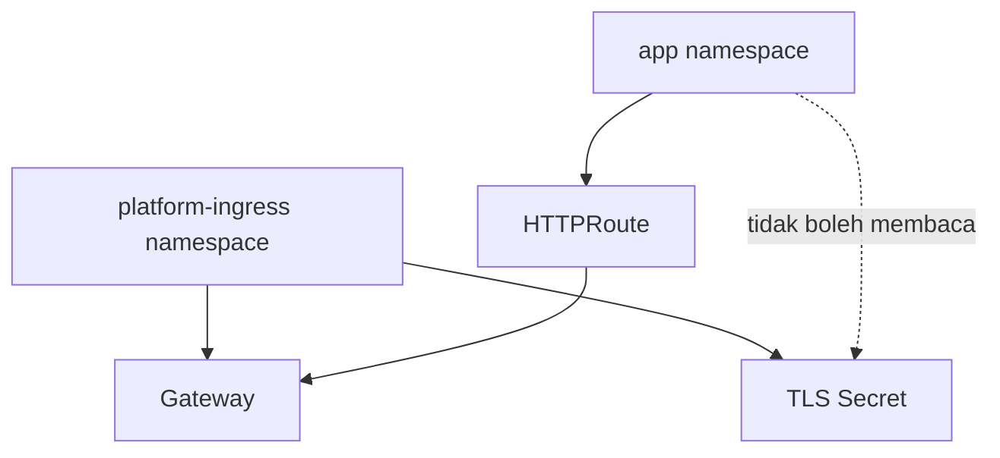

Pola yang sehat:

- Gateway dan TLS Secret external berada di namespace platform/ingress.
- Application namespace hanya membuat Route.
- `allowedRoutes` membatasi namespace aplikasi mana yang boleh attach.
- App team tidak diberi permission membaca private key edge certificate.
- Certificate automation berjalan dengan service account terpisah dan permission minimum.

Pola berbahaya:

- Semua app namespace bisa membuat Secret untuk listener publik.
- Semua app namespace bisa attach ke shared wildcard Gateway tanpa selector.
- Secret wildcard `*.example.com` bisa dibaca banyak team.
- Certificate issuer production bisa dipakai tanpa approval.

---

## 8. Cross-Namespace Certificate Reference dan ReferenceGrant

Gateway API sangat berhati-hati terhadap cross-namespace reference. Alasannya sederhana: cross-namespace reference bisa menjadi privilege escalation.

Misalnya Gateway di namespace `platform-ingress` ingin memakai Secret di namespace `security-certs`.

```yaml
apiVersion: gateway.networking.k8s.io/v1
kind: Gateway
metadata:
  name: public-gateway
  namespace: platform-ingress
spec:
  gatewayClassName: envoy-gateway
  listeners:
    - name: https
      protocol: HTTPS
      port: 443
      tls:
        mode: Terminate
        certificateRefs:
          - kind: Secret
            group: ""
            name: wildcard-example-com
            namespace: security-certs
```

Namespace pemilik Secret harus memberi izin eksplisit:

```yaml
apiVersion: gateway.networking.k8s.io/v1
kind: ReferenceGrant
metadata:
  name: allow-platform-gateway-to-use-cert
  namespace: security-certs
spec:
  from:
    - group: gateway.networking.k8s.io
      kind: Gateway
      namespace: platform-ingress
  to:
    - group: ""
      kind: Secret
```

Mental model:

> ReferenceGrant dibuat oleh namespace yang menjadi target referensi, bukan oleh namespace yang ingin mereferensikan.

Ini penting karena permission harus datang dari pemilik resource sensitif.

Failure mode:

- Gateway listener tidak `Programmed` karena certificate reference ditolak.
- Gateway status menunjukkan `ResolvedRefs=False` atau reason sejenis, tergantung controller.
- Secret ada, tetapi controller tidak boleh membacanya.
- Team salah membuat ReferenceGrant di namespace Gateway, bukan namespace Secret.

---

## 9. Hostname, SNI, dan Certificate Selection

TLS handshake terjadi sebelum HTTP request dikirim. Client biasanya mengirim **SNI** di ClientHello agar server tahu sertifikat mana yang harus dipresentasikan.

SNI bukan HTTP `Host` header.

| Konsep | Layer | Kapan Terlihat | Dipakai Untuk |
|---|---|---|---|
| SNI | TLS | Saat TLS handshake | Certificate/listener/backend TLS route selection |
| HTTP Host | HTTP | Setelah TLS decrypt | HTTPRoute hostname matching |
| SAN certificate | X.509 cert | Saat certificate validation | Membuktikan certificate valid untuk nama tertentu |
| DNS name | DNS | Sebelum connect | Mengubah nama menjadi IP |

Pipeline HTTPS termination:

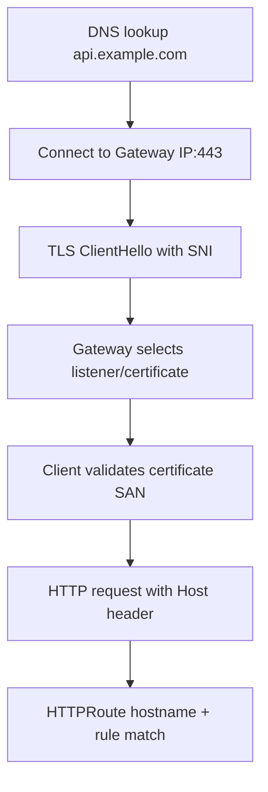

Implikasi:

- DNS bisa benar tetapi SNI salah.
- SNI bisa benar tetapi certificate SAN salah.
- Certificate bisa benar tetapi HTTP Host tidak match route.
- Listener hostname bisa terlalu luas dan menangkap traffic yang seharusnya ditolak.
- Wildcard certificate tidak otomatis berarti wildcard routing aman.

Debugging harus memisahkan empat hal ini.

---

## 10. Wildcard Certificate dan Wildcard Hostname

Wildcard sering dipakai di platform multi-tenant:

```yaml
hostname: "*.apps.example.com"
```

Kelebihan:

- Memudahkan onboarding aplikasi.
- Mengurangi jumlah certificate object.
- Cocok untuk environment internal atau preview apps.

Risiko:

- Blast radius private key besar.
- Subdomain takeover menjadi lebih berbahaya.
- App team bisa mengekspos hostname yang terlihat legitimate.
- Policy hostname harus ketat.

Pola guardrail:

```yaml
allowedRoutes:
  namespaces:
    from: Selector
    selector:
      matchLabels:
        expose-public-gateway: "true"
```

Dan di level policy/admission:

- hanya namespace tertentu boleh membuat `HTTPRoute` untuk `*.prod.example.com`;
- route hostname harus sesuai ownership aplikasi;
- wildcard prod tidak boleh dipakai untuk preview environment;
- certificate wildcard harus berada di namespace controlled by platform/security.

---

## 11. Backend TLS dan Re-Encryption

Edge termination saja tidak cukup jika requirement Anda adalah encryption in transit sampai backend.

Model re-encryption:

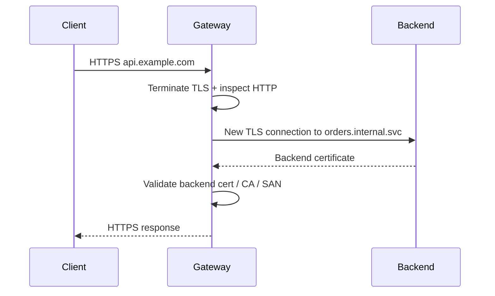

Ada dua hal yang harus dipisahkan:

1. **TLS origination ke backend**: Gateway membuka koneksi TLS ke backend.
2. **Backend certificate validation**: Gateway memverifikasi bahwa backend certificate dipercaya dan cocok dengan identitas yang diharapkan.

Jika Gateway hanya membuka TLS tanpa validasi certificate yang benar, Anda mendapat encryption tanpa strong identity assurance.

Gateway API memiliki `BackendTLSPolicy` untuk mengonfigurasi TLS dari Gateway ke backend melalui Service. Secara konseptual, policy ini menjawab:

- Service mana yang ditargetkan;
- hostname/SNI apa yang digunakan Gateway saat connect ke backend;
- CA mana yang dipercaya;
- SAN apa yang harus cocok;
- bagaimana status policy terhadap parent Gateway/Route.

Contoh konseptual:

```yaml
apiVersion: gateway.networking.k8s.io/v1
kind: BackendTLSPolicy
metadata:
  name: orders-backend-tls
  namespace: orders
spec:
  targetRefs:
    - group: ""
      kind: Service
      name: orders-api
  validation:
    hostname: orders-api.orders.svc.cluster.local
    caCertificateRefs:
      - group: ""
        kind: ConfigMap
        name: orders-backend-ca
```

Catatan penting:

- Implementasi controller harus mendukung field yang Anda gunakan.
- Periksa status policy, bukan hanya manifest.
- Pastikan backend benar-benar menyajikan certificate dengan SAN yang cocok.
- Jangan menyamakan backend TLS dengan mesh mTLS. Backend TLS melindungi hop Gateway → backend; mesh mTLS biasanya menyediakan workload identity service-to-service secara lebih luas.

---

## 12. TLS Termination + Mesh mTLS

Pada cluster dengan service mesh, pola umum adalah:

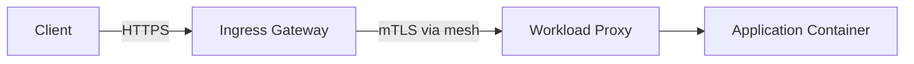

Maknanya:

- Edge Gateway terminate public TLS.
- Request dipahami sebagai HTTP/gRPC di Gateway.
- Koneksi internal ke workload dilindungi mTLS oleh mesh.
- Identitas backend tidak hanya DNS name, tetapi workload/service identity.

Kelebihan:

- L7 routing tetap bisa dilakukan di Gateway.
- Internal hop terenkripsi dan identity-aware.
- AuthorizationPolicy dapat memakai workload identity.
- Telemetry mesh konsisten untuk east-west dan north-south internal segment.

Risiko:

- Double proxy path menambah latency dan resource cost.
- Debugging melibatkan Gateway controller, mesh control plane, dan workload proxy.
- TLS failure bisa terjadi di frontend atau internal mTLS.
- Mixed mode plaintext/mTLS bisa menyebabkan outage yang terlihat seperti network timeout.

---

## 13. Certificate Lifecycle dan Rotation

TLS certificate bukan konfigurasi statis. Ia punya lifecycle:

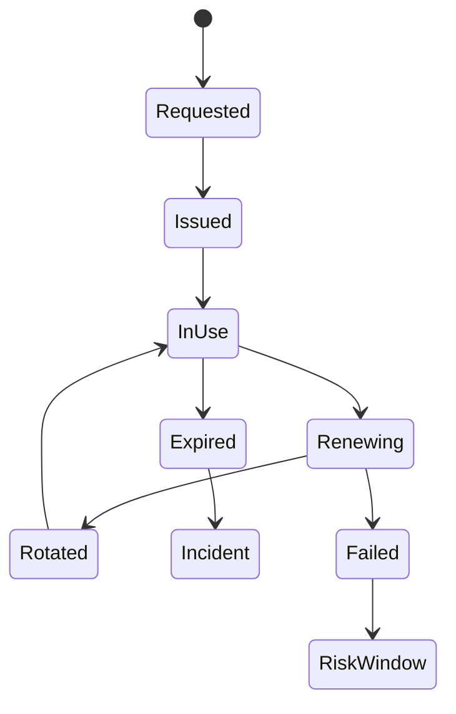

Hal-hal yang harus Anda desain:

- siapa yang request certificate;
- issuer mana yang dipakai;
- apakah certificate public CA atau private CA;
- di namespace mana Secret berada;
- apakah controller reload certificate tanpa restart;
- berapa hari sebelum expiry renewal terjadi;
- alert apa yang berbunyi sebelum certificate expired;
- bagaimana rollback certificate dilakukan;
- bagaimana audit perubahan Secret dilakukan.

Pola dengan cert-manager:

```yaml
apiVersion: cert-manager.io/v1
kind: Certificate
metadata:
  name: api-example-com
  namespace: platform-ingress
spec:
  secretName: api-example-com-tls
  dnsNames:
    - api.example.com
  issuerRef:
    name: letsencrypt-prod
    kind: ClusterIssuer
```

Lalu Gateway mereferensikan Secret:

```yaml
tls:
  mode: Terminate
  certificateRefs:
    - kind: Secret
      group: ""
      name: api-example-com-tls
```

Guardrail:

- production issuer tidak boleh dipakai bebas oleh semua namespace;
- wildcard certificate harus melalui approval;
- certificate expiration harus punya alert minimal beberapa hari sebelum expiry;
- secret change harus tercatat;
- private key tidak boleh diekspor ke pipeline logs.

---

## 14. ALPN, HTTP/2, dan gRPC

Untuk gRPC, TLS bukan hanya certificate. Ada juga ALPN negotiation.

gRPC umumnya berjalan di atas HTTP/2. Saat TLS handshake, client dan server bisa menegosiasikan protocol melalui ALPN, misalnya `h2`.

Failure mode:

- TLS handshake sukses, tetapi gRPC gagal karena HTTP/2 tidak dinegosiasikan.
- Gateway terminate TLS tetapi meneruskan HTTP/1.1 ke backend gRPC.
- Listener dikonfigurasi HTTPS tetapi Route/implementation tidak mendukung gRPC behavior yang diharapkan.
- Backend service port salah diberi nama/annotation sehingga controller salah memilih protocol.

Debugging:

```bash
openssl s_client -connect api.example.com:443 -servername api.example.com -alpn h2
```

Cek:

- certificate chain;
- SAN;
- selected ALPN protocol;
- issuer;
- expiry;
- SNI behavior.

---

## 15. TLS Debugging Workflow

Gunakan workflow berurutan. Jangan langsung mengubah YAML.

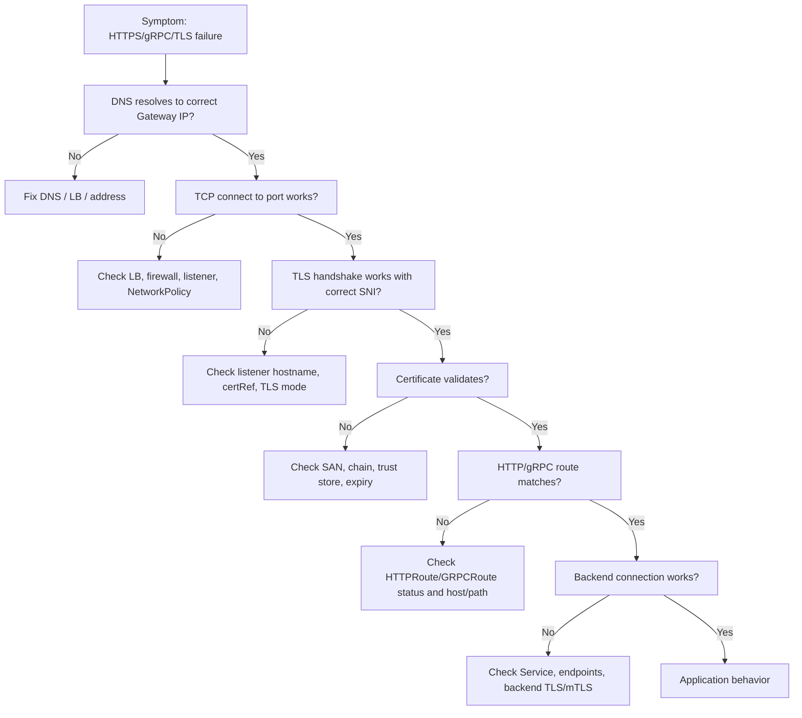

Useful commands:

```bash
# 1. DNS
kubectl run -it --rm dns-debug --image=registry.k8s.io/e2e-test-images/agnhost:2.45 --restart=Never -- nslookup api.example.com

# 2. TLS with SNI
openssl s_client -connect api.example.com:443 -servername api.example.com -showcerts

# 3. HTTP request with explicit resolve
curl -v --resolve api.example.com:443:203.0.113.10 https://api.example.com/health

# 4. Check Gateway and Route status
kubectl describe gateway -n platform-ingress public-gateway
kubectl describe httproute -n orders orders-public
kubectl get gateway -n platform-ingress public-gateway -o yaml

# 5. Check cert Secret exists and type
kubectl get secret -n platform-ingress api-example-com-tls -o jsonpath='{.type}'

# 6. Decode certificate expiry safely
kubectl get secret -n platform-ingress api-example-com-tls -o jsonpath='{.data.tls\.crt}' \
  | base64 -d \
  | openssl x509 -noout -subject -issuer -dates -ext subjectAltName
```

---

## 16. Common Failure Modes

### 16.1 Secret Exists But Listener Is Not Programmed

Symptoms:

- Secret exists.
- Gateway exists.
- HTTPS fails.
- Gateway status has unresolved refs or listener condition false.

Possible causes:

- Secret in wrong namespace.
- Missing `ReferenceGrant` for cross-namespace Secret.
- Secret type invalid.
- Secret lacks `tls.crt` or `tls.key`.
- Controller service account cannot read Secret.
- Certificate chain malformed.

Invariant:

> Existence is not authorization. A controller must be allowed to resolve and consume the reference.

---

### 16.2 SNI Mismatch

Symptoms:

- `curl https://IP` fails.
- `curl --resolve host:443:IP https://host` works.
- Browser says certificate mismatch.

Cause:

- Client did not send expected SNI.
- Listener hostname does not match.
- Certificate SAN does not include requested name.

Fix:

- Test with explicit `-servername` in `openssl`.
- Do not use IP-based HTTPS tests unless you know how SNI is set.
- Align DNS name, listener hostname, certificate SAN, and route hostname.

---

### 16.3 Termination Accidentally Creates Plaintext Backend Hop

Symptoms:

- External HTTPS works.
- Compliance scan asks for end-to-end encryption evidence.
- Packet capture inside cluster shows HTTP plaintext from Gateway to backend.

Cause:

- Gateway terminates TLS and forwards HTTP to backend.
- No backend TLS policy.
- No mesh mTLS.

Fix options:

- Add BackendTLSPolicy where supported.
- Use mesh mTLS.
- Use passthrough if Gateway does not need L7 routing.
- Document trust boundary explicitly.

---

### 16.4 Backend TLS Without Verification

Symptoms:

- Backend connection is encrypted.
- But any certificate is accepted or verification disabled.

Risk:

- Encryption exists, but backend identity is weak.
- Man-in-the-middle inside cluster is harder but not impossible depending on threat model.

Fix:

- Configure CA validation.
- Configure expected backend hostname/SAN.
- Alert on validation failures.

---

### 16.5 Certificate Rotation Outage

Symptoms:

- Certificate renewed.
- Gateway still serves old certificate.
- Or Gateway reloads and drops connections.

Causes:

- Controller does not watch Secret update correctly.
- Data plane reload behavior not graceful.
- Secret name changed instead of content update.
- Certificate chain changed and client trust store incompatible.

Fix:

- Test rotation in staging.
- Monitor served certificate, not just Secret content.
- Prefer stable Secret name with updated data.
- Know controller-specific reload semantics.

---

## 17. Production Design Patterns

### Pattern A — Central Public Gateway, App-Owned Routes

Use when many apps expose public APIs through shared edge.

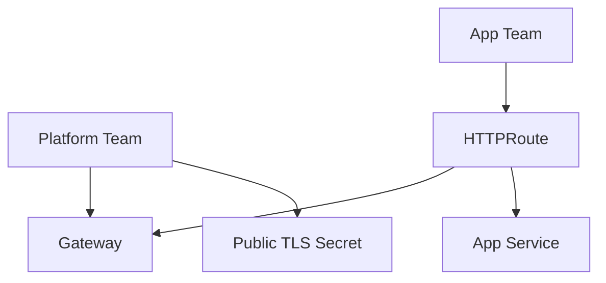

Properties:

- Platform owns certificate and Gateway.
- App owns HTTPRoute and Service.
- `allowedRoutes` gates attachment.
- Admission policy validates hostname ownership.

Good for:

- SaaS API platform;
- shared cluster ingress;
- centralized security controls.

Watch out:

- shared Gateway blast radius;
- route conflict;
- wildcard cert governance.

---

### Pattern B — Sensitive Passthrough Backend

Use when backend must terminate TLS itself.

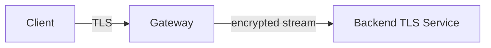

Properties:

- Backend owns certificate/private key.
- Gateway routes by SNI only.
- Gateway cannot inspect HTTP.

Good for:

- payment service requiring backend-held keys;
- non-HTTP protocol over TLS;
- tenant-owned TLS.

Watch out:

- no path/header routing;
- weaker L7 observability at Gateway;
- backend certificate operations distributed.

---

### Pattern C — Edge Termination + Backend TLS

Use when platform wants L7 control and encrypted backend hop.

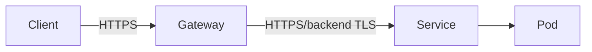

Properties:

- Gateway owns external certificate.
- Gateway validates backend certificate.
- HTTPRoute still works.

Good for:

- regulated APIs;
- internal zero-trust alignment;
- north-south traffic with backend encryption requirement.

Watch out:

- certificate management on both sides;
- trust bundle drift;
- implementation support variability.

---

### Pattern D — Edge Termination + Mesh mTLS

Use when cluster already uses service mesh.

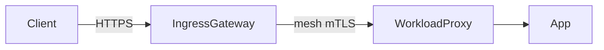

Properties:

- Mesh owns workload certificates.
- Gateway still supports L7 routing.
- Authorization can be identity-aware.

Good for:

- large internal platforms;
- zero-trust service-to-service;
- teams needing uniform telemetry and policy.

Watch out:

- proxy overhead;
- mesh control plane dependency;
- mixed-mode rollout risks.

---

## 18. Architecture Review Checklist

Gunakan checklist ini saat review desain Gateway TLS:

### Frontend TLS

- [ ] Listener protocol dan TLS mode eksplisit.
- [ ] Hostname listener sesuai DNS dan certificate SAN.
- [ ] CertificateRef berada di namespace yang tepat.
- [ ] Cross-namespace Secret reference memakai ReferenceGrant jika diperlukan.
- [ ] Controller punya permission minimal untuk membaca Secret.
- [ ] Wildcard certificate punya governance.
- [ ] Certificate expiration dimonitor.
- [ ] Served certificate dimonitor dari sisi client, bukan hanya Secret object.

### Backend Hop

- [ ] Gateway → backend plaintext/TLS/mTLS diputuskan eksplisit.
- [ ] Jika backend TLS: CA, hostname, SAN validation jelas.
- [ ] Jika mesh mTLS: policy mesh dan ingress integration jelas.
- [ ] Jika passthrough: konsekuensi observability dan routing diterima.
- [ ] Packet path membuktikan tidak ada plaintext hop tidak sengaja.

### Ownership

- [ ] Platform team owns Gateway and edge certificate.
- [ ] App team owns Route and backend Service.
- [ ] Security team owns issuer/trust policy.
- [ ] Admission policy mencegah hostname hijacking.
- [ ] Rotation process diuji.

### Debuggability

- [ ] Gateway status conditions dipantau.
- [ ] Route status conditions dipantau.
- [ ] TLS handshake test tersedia.
- [ ] Certificate expiry alert ada.
- [ ] Backend TLS validation failure terlihat di logs/metrics.

---

## 19. Deliberate Practice

### Latihan 1 — Bedakan Empat Failure

Buat empat skenario:

1. DNS salah.
2. SNI salah.
3. Certificate SAN salah.
4. HTTPRoute hostname salah.

Untuk masing-masing, catat:

- command yang gagal;
- error message;
- status Gateway/Route;
- metric/log yang berubah;
- fix minimal.

Tujuannya bukan membuat konfigurasi benar, tetapi melatih diagnosis layer.

---

### Latihan 2 — Ubah Edge Termination Menjadi Backend TLS

Mulai dari HTTPS listener + HTTPRoute ke backend HTTP.

Lalu ubah menjadi:

- backend menyajikan HTTPS;
- Gateway connect via TLS;
- Gateway memvalidasi CA/SAN;
- curl external tetap sama.

Bandingkan packet capture sebelum dan sesudah.

---

### Latihan 3 — Passthrough vs Termination

Expose service yang sama dengan dua Gateway:

- Gateway A: HTTPS termination + HTTPRoute.
- Gateway B: TLS passthrough + TLSRoute.

Bandingkan:

- access log;
- ability to route by path;
- certificate ownership;
- error saat backend certificate expired;
- observability.

---

## 20. Ringkasan

TLS dalam Kubernetes Gateway API harus dipahami sebagai desain boundary, bukan property YAML.

Hal yang harus melekat:

- `HTTPS` listener dengan `Terminate` berarti Gateway melihat HTTP payload.
- `TLS` listener dengan `Passthrough` berarti backend melakukan TLS termination dan Gateway umumnya hanya bisa route berdasarkan SNI.
- Certificate Secret adalah private-key boundary.
- Cross-namespace certificate reference harus dikontrol dengan ReferenceGrant.
- Edge HTTPS tidak otomatis berarti backend hop terenkripsi.
- Backend TLS dan mesh mTLS adalah dua solusi berbeda untuk problem internal encryption.
- Debugging TLS harus memisahkan DNS, TCP connect, SNI, certificate validation, route match, dan backend connection.

Di part berikutnya, kita akan keluar dari HTTP/gRPC dan membahas **TCP, UDP, TLSRoute, long-lived connections, database exposure, broker exposure, dan non-HTTP routing failure modes**.

---

## 21. Referensi

- Kubernetes Gateway API — TLS Configuration
- Kubernetes Gateway API — Gateway Resource
- Kubernetes Gateway API — TLSRoute
- Kubernetes Gateway API — API Reference
- Kubernetes Blog — Gateway API v1.4 BackendTLSPolicy
- cert-manager — Gateway API usage
