# Part 014 — TCP, UDP, and Non-HTTP Routing

## 1. Tujuan Part Ini

Part 012 fokus pada HTTP/gRPC. Part 013 fokus pada TLS boundary. Sekarang kita masuk ke traffic yang sering lebih sulit dioperasikan: **non-HTTP routing**.

Contoh traffic non-HTTP:

- PostgreSQL;
- MySQL;
- Redis;
- Kafka;
- MQTT;
- AMQP;
- SMTP;
- LDAP;
- DNS over UDP/TCP;
- game server UDP;
- custom binary protocol;
- proprietary vendor protocol;
- TLS-encrypted protocol yang bukan HTTP.

Target part ini:

> Anda mampu memutuskan kapan memakai Service `LoadBalancer`, Gateway API `TCPRoute`/`UDPRoute`/`TLSRoute`, mesh, atau dedicated external infrastructure untuk expose non-HTTP protocol secara aman, predictable, dan debuggable.

Kita tidak akan memperlakukan TCP/UDP sebagai “HTTP tanpa path”. Itu cara berpikir yang salah. Layer-4 traffic punya failure mode berbeda: connection lifetime, backpressure, idle timeout, half-open connection, source IP, session pinning, packet loss, retransmission, NAT port exhaustion, dan UDP stateless behavior.

---

## 2. Mental Model: L4 Routing Tidak Punya Request Semantics

HTTPRoute punya banyak discriminator:

- hostname;
- path;
- header;
- query parameter;
- method.

TCPRoute dan UDPRoute secara umum tidak memiliki request-level discriminator seperti itu. Gateway menerima koneksi/paket pada listener tertentu, lalu meneruskannya ke backend.

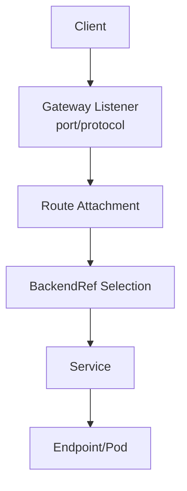

Perbedaan besar:

| Aspek | HTTP/gRPC | TCP | UDP |
|---|---|---|---|
| Unit traffic | Request/stream | Connection/byte stream | Datagram |
| Routing discriminator | Host/path/header/method | Umumnya port/listener | Umumnya port/listener |
| Retry safe? | Tergantung method/idempotency | Biasanya tidak otomatis | Biasanya tidak otomatis |
| Connection state | Per request/stream | Long-lived connection | Stateless-ish, tapi app bisa stateful |
| Observability | Status code, route, latency | bytes, connection, reset | packets, drops, latency app-specific |
| Backpressure | HTTP semantics | TCP flow control | App-level only |
| Timeout risk | request/idle timeout | idle/read/write timeout | flow timeout/NAT timeout |

Rule penting:

> L4 routing memilih kemana koneksi atau paket pergi. Ia tidak memahami maksud aplikasi.

---

## 3. Gateway API Route Types untuk Non-HTTP

Gateway API menyediakan beberapa route type:

| Route | Use Case | Discriminator Utama |
|---|---|---|
| `TCPRoute` | Raw TCP forwarding | Listener/port, backend refs |
| `UDPRoute` | UDP forwarding | Listener/port, backend refs |
| `TLSRoute` | TLS stream routing | SNI/TLS metadata |
| `HTTPRoute` | HTTP/terminated HTTPS | Host/path/header/query/method |
| `GRPCRoute` | gRPC over HTTP/2 | Host/service/method/header |

Secara praktis:

- Gunakan `HTTPRoute` jika Gateway harus membaca HTTP request.
- Gunakan `GRPCRoute` jika protocol adalah gRPC dan Anda butuh semantics gRPC.
- Gunakan `TLSRoute` jika traffic adalah TLS stream dan Anda ingin route berdasarkan SNI tanpa melihat HTTP payload.
- Gunakan `TCPRoute` jika traffic adalah TCP stream dan Anda hanya butuh forward connection.
- Gunakan `UDPRoute` jika traffic adalah UDP datagram.

---

## 4. TCPRoute Mental Model

`TCPRoute` memodelkan forwarding TCP dari listener ke backend.

Contoh konseptual:

```yaml
apiVersion: gateway.networking.k8s.io/v1
kind: Gateway
metadata:
  name: l4-gateway
  namespace: platform-ingress
spec:
  gatewayClassName: envoy-gateway
  listeners:
    - name: postgres
      protocol: TCP
      port: 5432
      allowedRoutes:
        namespaces:
          from: Same
---
apiVersion: gateway.networking.k8s.io/v1
kind: TCPRoute
metadata:
  name: postgres-route
  namespace: platform-ingress
spec:
  parentRefs:
    - name: l4-gateway
      sectionName: postgres
  rules:
    - backendRefs:
        - name: postgres-primary
          port: 5432
```

Packet/connection flow:

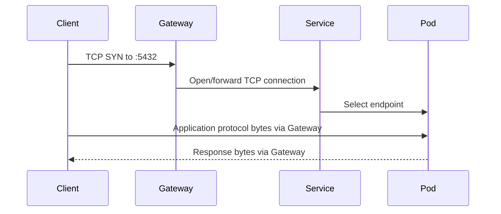

Important invariant:

> Once a TCP connection is established, all bytes in that connection must go to the same backend instance unless the proxy is doing protocol-specific multiplexing. Generic L4 routing cannot split a single TCP connection across multiple pods.

---

## 5. UDPRoute Mental Model

UDP tidak punya connection establishment seperti TCP. Gateway menerima datagram dan meneruskan datagram ke backend.

Contoh konseptual:

```yaml
apiVersion: gateway.networking.k8s.io/v1
kind: Gateway
metadata:
  name: udp-gateway
  namespace: platform-ingress
spec:
  gatewayClassName: nginx-gateway
  listeners:
    - name: dns
      protocol: UDP
      port: 53
      allowedRoutes:
        namespaces:
          from: Same
---
apiVersion: gateway.networking.k8s.io/v1
kind: UDPRoute
metadata:
  name: dns-route
  namespace: platform-ingress
spec:
  parentRefs:
    - name: udp-gateway
      sectionName: dns
  rules:
    - backendRefs:
        - name: dns-backend
          port: 53
```

UDP-specific mental model:

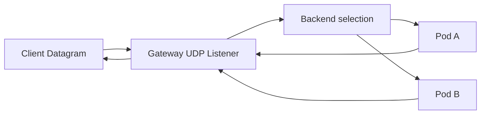

Risiko:

- Tidak ada TCP retransmission.
- Packet loss harus ditangani aplikasi.
- NAT/firewall flow timeout sering pendek.
- Load balancer mungkin menggunakan 5-tuple hashing.
- Response path harus tetap konsisten agar client menerima response.
- Observability sering lebih lemah dibanding HTTP/TCP.

---

## 6. TLSRoute untuk SNI-Based Stream Routing

`TLSRoute` berada di antara HTTPRoute dan TCPRoute. Ia tidak membaca HTTP payload, tetapi bisa memakai TLS metadata seperti SNI.

Use case:

- banyak TLS services berbagi port 443;
- backend harus terminate TLS sendiri;
- protocol di atas TLS bukan HTTP;
- Gateway tidak boleh decrypt payload.

Contoh:

```yaml
apiVersion: gateway.networking.k8s.io/v1
kind: Gateway
metadata:
  name: shared-tls-gateway
  namespace: platform-ingress
spec:
  gatewayClassName: envoy-gateway
  listeners:
    - name: tls
      protocol: TLS
      port: 443
      hostname: "*.secure.example.com"
      tls:
        mode: Passthrough
      allowedRoutes:
        namespaces:
          from: Selector
          selector:
            matchLabels:
              allow-tls-passthrough: "true"
---
apiVersion: gateway.networking.k8s.io/v1
kind: TLSRoute
metadata:
  name: payments-tls
  namespace: payments
spec:
  parentRefs:
    - name: shared-tls-gateway
      namespace: platform-ingress
      sectionName: tls
  hostnames:
    - payments.secure.example.com
  rules:
    - backendRefs:
        - name: payments-tls
          port: 443
```

TLSRoute pipeline:

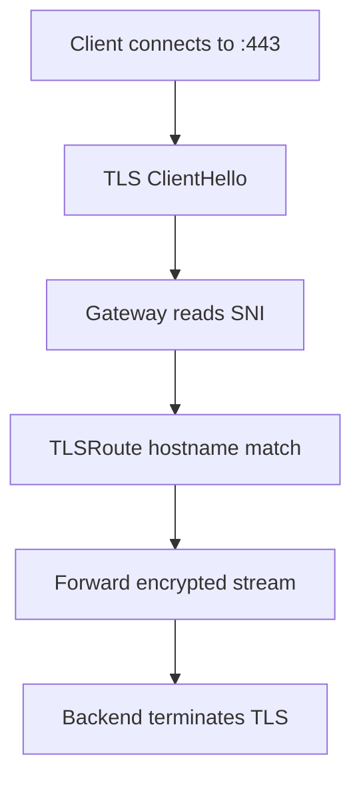

Critical limitation:

> TLSRoute cannot route by HTTP path because HTTP payload is encrypted and not visible to the Gateway in passthrough mode.

---

## 7. Service LoadBalancer vs Gateway API L4 Routes

Sebelum memakai TCPRoute/UDPRoute, tanyakan: apakah `Service type=LoadBalancer` cukup?

```yaml
apiVersion: v1
kind: Service
metadata:
  name: postgres-public
  namespace: data
spec:
  type: LoadBalancer
  ports:
    - name: postgres
      port: 5432
      targetPort: 5432
  selector:
    app: postgres
```

`LoadBalancer` Service cocok jika:

- satu Service butuh satu external load balancer sederhana;
- tidak perlu shared listener across teams;
- tidak perlu attachment model;
- tidak perlu Gateway API status/policy semantics;
- cloud provider LoadBalancer behavior sudah cukup.

Gateway API L4 route cocok jika:

- platform ingin satu API model untuk L4 dan L7;
- ada shared Gateway/listener yang dikelola platform;
- perlu role separation antara infra dan app team;
- perlu conformance/portable routing contract;
- perlu policy attachment dan guardrail;
- ingin menghindari setiap Service membuat load balancer sendiri.

Decision matrix:

| Kriteria | Service LoadBalancer | Gateway API TCP/UDP/TLS Route |
|---|---|---|
| Simplicity | Tinggi | Sedang |
| Shared infra | Terbatas | Lebih baik |
| Multi-team attachment | Lemah | Kuat |
| Policy model | Provider-specific | Gateway API-oriented |
| Controller portability | Cloud-specific | Tergantung implementation conformance |
| L4/L7 unified API | Tidak | Ya |
| Cost control | Bisa mahal jika banyak LB | Bisa lebih efisien jika shared Gateway |
| Maturity per provider | Sering sangat matang | Perlu cek support controller |

---

## 8. Stateful Protocols dan Connection Pinning

Banyak non-HTTP protocols stateful:

- database sessions;
- prepared statements;
- transactions;
- cursor state;
- authentication state;
- pub/sub subscriptions;
- Kafka broker connection;
- AMQP channels;
- MQTT sessions.

Dalam TCP, state hidup di connection. Jika connection pindah backend, state hilang. Karena itu L4 load balancing biasanya memilih backend saat connection dibuat, lalu mempertahankan connection ke backend tersebut.

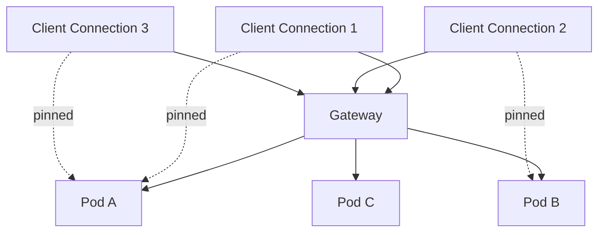

Implikasi rollout:

- Weighted backend bukan berarti active existing connections pindah.
- Canary 10% pada TCP bisa berarti 10% **new connections**, bukan 10% queries.
- Long-lived connections memperlambat rollout dan rollback.
- Draining harus menunggu connection close atau memaksa close.
- Backend pod termination harus mengelola graceful shutdown protocol-specific.

---

## 9. Timeouts: HTTP vs TCP vs UDP

Timeout untuk non-HTTP sering menjadi penyebab incident.

| Timeout | Berlaku Untuk | Failure Mode |
|---|---|---|
| connect timeout | TCP connection establishment | client melihat connection refused/timeout |
| idle timeout | TCP no data period | long-lived idle connection diputus |
| read timeout | byte tidak datang | app menunggu lalu fail |
| write timeout | send buffer/backpressure | app blocked atau reset |
| NAT flow timeout | TCP/UDP through NAT | connection terlihat menggantung |
| UDP flow timeout | UDP pseudo-session | response tidak kembali |
| TLS handshake timeout | TLS over TCP | connection close sebelum app protocol mulai |

Praktik penting:

- Samakan timeout client, Gateway, backend, dan cloud LB.
- Untuk database, hati-hati dengan idle timeout lebih pendek dari connection pool expectation.
- Untuk Kafka/MQTT/WebSocket-like TCP, long-lived connection harus diuji terhadap LB idle timeout.
- Untuk UDP, pahami flow timeout NAT/firewall.

---

## 10. Source IP Preservation

Non-HTTP protocols sering memakai source IP untuk:

- audit;
- allowlist;
- rate limiting;
- fraud detection;
- database access control;
- protocol-level ACL.

Kubernetes path bisa mengubah source IP karena SNAT.

Pertanyaan desain:

- Apakah backend perlu melihat client IP asli?
- Apakah Gateway/LoadBalancer bisa preserve source IP?
- Apakah PROXY protocol didukung oleh backend?
- Apakah application protocol mengizinkan forwarding identity?
- Apakah source IP original lebih baik dimodelkan sebagai authenticated identity daripada network address?

Untuk HTTP, kita sering memakai `X-Forwarded-For`. Untuk raw TCP, pilihan lebih terbatas:

- preserve source IP di network layer;
- PROXY protocol;
- mTLS client certificate;
- app-level authenticated identity;
- audit di Gateway, bukan backend.

Failure mode:

- firewall backend mengizinkan client IP, tetapi backend hanya melihat Gateway node IP;
- audit log database kehilangan real client;
- PROXY protocol dikirim tapi backend tidak mengerti, sehingga handshake protocol rusak;
- source IP preserved tetapi routing menjadi asymmetric.

---

## 11. Protocol-Specific Exposure Patterns

### 11.1 PostgreSQL/MySQL

Default recommendation:

- Jangan expose database publik kecuali sangat terpaksa.
- Prefer private connectivity, bastion, VPN, PrivateLink, service mesh internal, atau managed DB private endpoint.
- Jika expose via Gateway, gunakan TCPRoute dengan strict allowlist, TLS, authentication kuat, audit, dan rate limiting/network controls.

Risiko:

- long-lived connection;
- connection pool pinning;
- failover semantics database;
- client IP expectations;
- TLS certificate validation;
- backend primary/replica routing tidak bisa dipahami L4 generic router.

### 11.2 Redis

Risiko:

- Redis protocol stateful;
- AUTH state per connection;
- pub/sub long-lived connection;
- cluster mode memiliki redirect semantics (`MOVED`, `ASK`);
- exposing Redis publicly sangat berbahaya.

Gunakan:

- private-only access;
- NetworkPolicy;
- TLS if available;
- auth/ACL;
- avoid generic L4 load balancing untuk Redis Cluster tanpa memahami topology.

### 11.3 Kafka

Kafka adalah contoh klasik mengapa L4 forwarding saja sering tidak cukup.

Masalah:

- client connect ke bootstrap broker;
- broker mengembalikan advertised listeners;
- client kemudian connect langsung ke broker tertentu;
- load balancer tunggal bisa tidak cocok jika advertised address salah.

Pola:

- expose broker per listener/per address;
- gunakan operator-aware configuration;
- pastikan advertised listeners sesuai jalur external;
- pahami TLS/SASL;
- jangan menganggap satu TCPRoute ke Service Kafka menyelesaikan semua.

### 11.4 MQTT/AMQP

Masalah:

- long-lived connection;
- session state;
- keepalive;
- retained subscription;
- broker clustering semantics.

Pola:

- idle timeout harus lebih panjang dari keepalive expectation;
- connection draining penting;
- sticky routing mungkin diperlukan;
- mTLS client certificate sering relevan untuk device identity.

### 11.5 DNS UDP/TCP

DNS bisa memakai UDP dan TCP. Jika expose DNS:

- UDPRoute untuk UDP 53;
- TCPRoute untuk TCP 53;
- perhatikan EDNS, truncation, TCP fallback;
- perhatikan amplification risk;
- rate limiting dan access control penting.

---

## 12. Non-HTTP Canary dan Weighted Backend

Gateway API route rules bisa memakai backend refs dengan weight pada beberapa route type/implementasi. Tetapi makna weight berbeda tergantung protocol.

Untuk HTTP:

> 10% weight kira-kira 10% request baru, tergantung implementation dan sampling.

Untuk TCP:

> 10% weight biasanya berarti sekitar 10% connection baru, bukan 10% query/transaction.

Untuk UDP:

> 10% weight bisa berarti datagram atau flow hashing tergantung implementation.

Contoh risk:

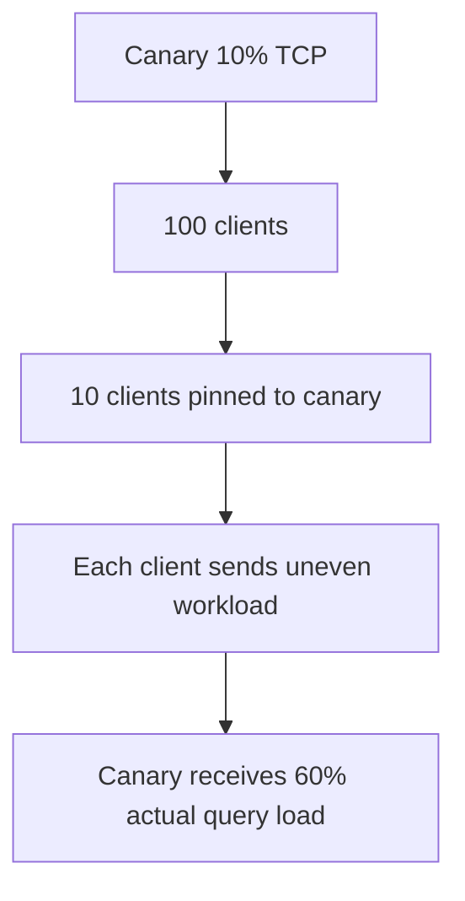

Karena itu, non-HTTP canary harus mengukur actual workload, bukan hanya connection count.

Metrics penting:

- active connections per backend;
- new connections per second;
- bytes in/out;
- application QPS/transactions;
- backend CPU/memory;
- connection resets;
- protocol error count;
- latency application-level.

---

## 13. Draining dan Graceful Shutdown

HTTP graceful shutdown bisa request-aware. TCP generic draining lebih sulit.

Pod termination flow:

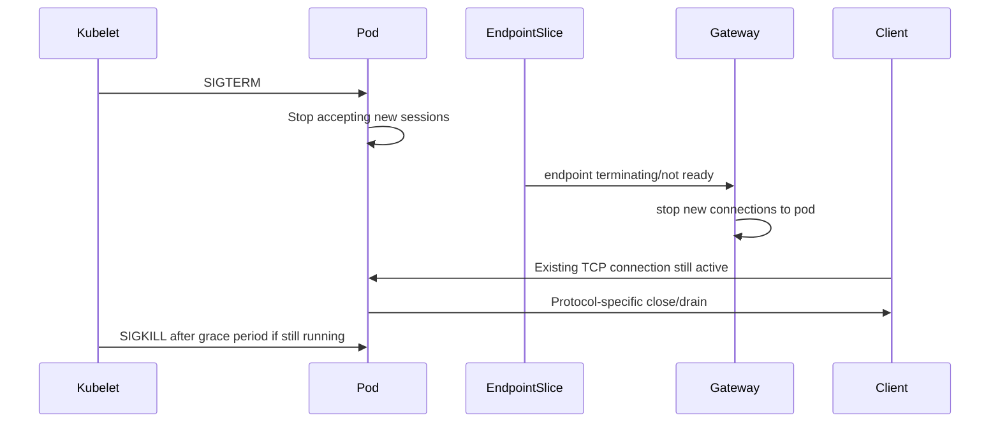

Checklist:

- Backend stops accepting new sessions before shutdown.
- Readiness becomes false before process exits.
- PreStop hook gives controller time to update endpoints.
- Gateway honors terminating endpoints correctly.
- Connection drain timeout is longer than normal short transactions but shorter than unacceptable rollout time.
- Clients reconnect safely.

Failure mode:

- pod exits while client session active;
- Gateway keeps sending new connections to terminating pod;
- long-lived sessions block rollout indefinitely;
- forced close causes transaction failure;
- client reconnect storm overloads remaining pods.

---

## 14. Observability for L4 and UDP

HTTP observability is rich. L4 observability must be built differently.

Useful L4 metrics:

- active connections;
- accepted connections;
- failed connections;
- connection duration;
- bytes sent/received;
- TCP resets;
- backend connection failures;
- listener connection rate;
- idle timeout closes;
- TLS handshake failures;
- SNI match failures;
- UDP datagrams in/out;
- UDP drops;
- flow table usage;
- NAT port usage.

Useful logs:

- connection open/close logs;
- source/destination tuple;
- selected backend;
- close reason;
- TLS SNI;
- TLS handshake error;
- backend connect error.

Debugging commands:

```bash
# TCP connectivity
nc -vz db.example.com 5432

# TCP with timing
curl -v telnet://db.example.com:5432

# TLS stream inspection
openssl s_client -connect payments.example.com:443 -servername payments.example.com

# UDP test with netcat, behavior depends on image/build
nc -vzu dns.example.com 53

# Inside cluster: check listener/route status
kubectl describe gateway -n platform-ingress l4-gateway
kubectl describe tcproute -n platform-ingress postgres-route
kubectl describe udproute -n platform-ingress dns-route
kubectl describe tlsroute -n payments payments-tls

# Node-level socket visibility
ss -tnp
ss -unp

# Packet capture
kubectl debug node/<node-name> -it --image=nicolaka/netshoot
 tcpdump -nn -i any port 5432
```

---

## 15. Security Model for Non-HTTP Exposure

Non-HTTP exposure should be treated as high-risk by default.

Questions:

- Does this protocol have built-in authentication?
- Does it support TLS?
- Does it validate server identity?
- Does it support client identity?
- Can the backend safely face untrusted clients?
- Are error messages information-leaky?
- Can protocol be abused for amplification?
- Is rate limiting available at L4/Gateway?
- Can Gateway inspect enough to enforce policy?
- Is private connectivity a better answer?

Control layers:

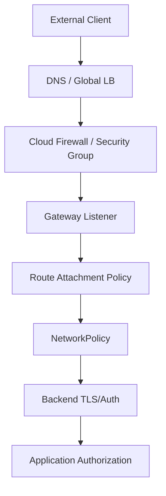

For L4 protocols, application authorization often matters more because Gateway cannot inspect business-level semantics.

---

## 16. NetworkPolicy and L4 Gateway Interaction

NetworkPolicy applies at pod network layer, not at Gateway API semantic layer.

If Gateway forwards traffic to backend pods, backend namespace policy must allow traffic from Gateway data plane identity/source.

Example policy shape:

```yaml
apiVersion: networking.k8s.io/v1
kind: NetworkPolicy
metadata:
  name: allow-from-ingress-gateway
  namespace: data
spec:
  podSelector:
    matchLabels:
      app: postgres-proxy
  policyTypes:
    - Ingress
  ingress:
    - from:
        - namespaceSelector:
            matchLabels:
              kubernetes.io/metadata.name: platform-ingress
          podSelector:
            matchLabels:
              app: gateway-dataplane
      ports:
        - protocol: TCP
          port: 5432
```

Watch out:

- Some managed Gateway controllers are not pods inside your cluster.
- Source may be node IP, cloud LB IP, or Gateway pod IP.
- CNI-specific policy semantics vary.
- If source IP is preserved, policy may need to allow external client CIDRs or use different enforcement point.

---

## 17. Implementation Support Reality

Gateway API defines portable resources, but implementation support matters.

For non-HTTP routing, always verify:

- Does the controller support `TCPRoute`?
- Does it support `UDPRoute`?
- Does it support `TLSRoute`?
- Which API version/channel is installed?
- Is the resource Standard or Experimental in your installed Gateway API version?
- Are conformance tests passed?
- Which filters/policies are supported?
- Does cloud provider Gateway support only HTTPRoute?
- How are load balancer resources provisioned?
- What are timeout defaults?
- Is source IP preserved?
- Are connection metrics exposed?

Never assume because a CRD exists that the controller implements the behavior.

Invariant:

> CRD installation gives Kubernetes schema. Controller support gives runtime behavior.

---

## 18. Failure Models

### 18.1 Route Accepted But No Traffic

Causes:

- Gateway listener protocol/port mismatch.
- Route attached to wrong sectionName.
- Controller does not support route type.
- Load balancer does not expose port.
- Firewall blocks port.
- Backend Service has no endpoints.

Debug:

```bash
kubectl get gateway -A
kubectl get tcproute,udproute,tlsroute -A
kubectl describe gateway -n platform-ingress l4-gateway
kubectl describe tcproute -n platform-ingress postgres-route
kubectl get svc,endpointslice -n data
```

---

### 18.2 TCP Connect Works, Application Fails

Causes:

- Protocol expects TLS but Gateway forwards plaintext.
- PROXY protocol mismatch.
- Backend requires client cert.
- Wrong backend port.
- App-level auth failure.
- Stateful protocol advertised wrong address.

Debug:

- use protocol-native client;
- inspect first bytes with tcpdump if safe;
- check backend logs;
- compare direct pod/service connection vs Gateway path.

---

### 18.3 Idle Connections Reset

Causes:

- Gateway idle timeout shorter than client pool expectation.
- Cloud LB timeout shorter than app keepalive.
- NAT/firewall flow timeout.
- Backend closes idle sessions.

Fix:

- align timeout chain;
- enable TCP keepalive if appropriate;
- configure application connection pool validation;
- prefer shorter client pool lifetime than infrastructure idle timeout.

---

### 18.4 UDP Responses Lost

Causes:

- asymmetric routing;
- NAT state expired;
- backend responds directly instead of via Gateway;
- firewall allows inbound but blocks return;
- conntrack table pressure;
- service/backend hash changes between request and response.

Debug:

- capture both Gateway and backend node;
- check conntrack;
- verify source/destination tuple;
- test from same network segment;
- inspect CNI dataplane logs.

---

### 18.5 TLSRoute SNI Works for One Client But Not Another

Causes:

- old client does not send SNI;
- client uses different hostname;
- wildcard hostname match differs from expectation;
- ALPN/protocol mismatch after passthrough;
- backend certificate does not match client-requested SNI.

Fix:

- require SNI-capable clients;
- use separate port/IP for legacy clients;
- document SNI requirement;
- test with `openssl s_client -servername`.

---

## 19. Architecture Patterns

### Pattern A — Simple L4 Public Exposure

Use only for carefully approved protocols.

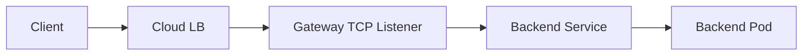

Controls:

- cloud firewall;
- Gateway route status;
- NetworkPolicy;
- backend TLS/auth;
- logs and metrics.

---

### Pattern B — Private L4 Gateway

Use for internal consumers across VPC/VNet or private network.

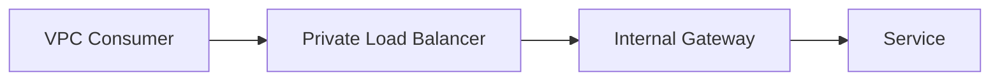

Good for:

- internal database proxy;
- enterprise integration;
- legacy TCP application;
- private service endpoint.

---

### Pattern C — SNI Multiplexed TLS Services

Use when many backend-owned TLS services share 443.

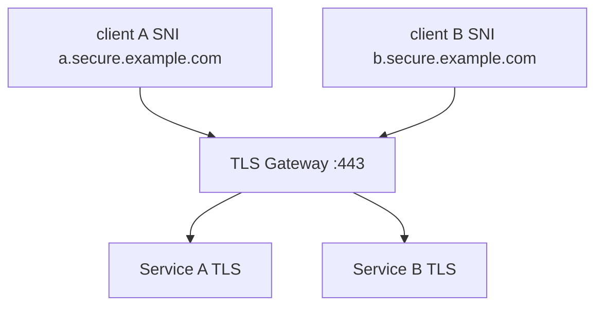

Controls:

- strict hostname ownership;
- TLSRoute namespace attachment policy;
- backend cert validation by clients;
- no L7 Gateway policies assumed.

---

### Pattern D — Protocol-Aware Operator Instead of Generic L4

Use when protocol has topology semantics, such as Kafka.

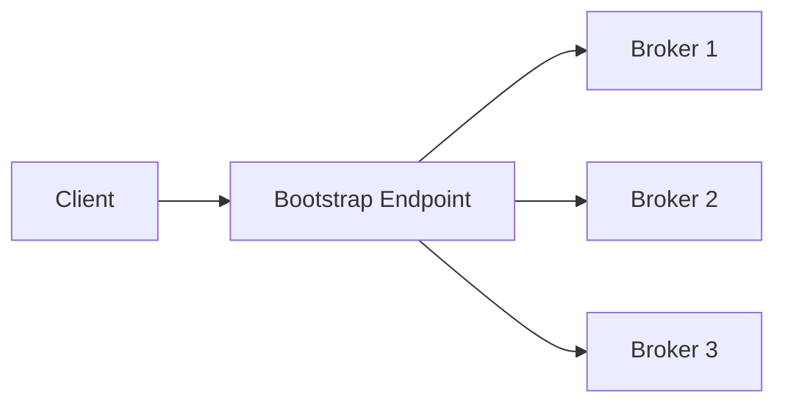

Instead of forcing generic L4 route, use operator/platform integration that understands advertised listeners, broker identity, TLS/SASL, and per-broker exposure.

---

## 20. Decision Framework

Ask these in order:

1. Is this protocol safe to expose outside cluster?
2. Does it need public exposure or private connectivity is enough?
3. Is `Service LoadBalancer` sufficient?
4. Does platform need shared Gateway ownership and policy attachment?
5. Is traffic TCP, UDP, TLS stream, HTTP, or gRPC?
6. Does Gateway need to inspect L7 semantics?
7. Does backend need original source IP?
8. Does protocol require sticky sessions or topology-aware routing?
9. What are timeout and draining requirements?
10. How will we observe failures?
11. How will we test failover and rollout?
12. Does the selected controller support the required route type and features?

Decision table:

| Requirement | Recommended Starting Point |
|---|---|
| Public HTTP API | HTTPS Gateway + HTTPRoute |
| Public gRPC API | HTTPS Gateway + GRPCRoute |
| Backend-owned TLS over 443 | TLS listener + TLSRoute passthrough |
| Simple internal TCP service | ClusterIP or internal LoadBalancer |
| Shared platform TCP ingress | Gateway + TCPRoute |
| UDP game/DNS service | Gateway + UDPRoute or provider-specific UDP LB |
| Database access | Prefer private connectivity; L4 exposure only with strict controls |
| Kafka external access | Operator/protocol-aware exposure, not naive single TCPRoute |
| Need L7 policy | Do not use generic TCPRoute/UDPRoute alone |

---

## 21. Deliberate Practice

### Latihan 1 — TCPRoute PostgreSQL Proxy

Buat TCPRoute ke service PostgreSQL test.

Validasi:

- TCP connect;
- protocol-native login;
- source IP observed by backend;
- idle timeout behavior;
- pod termination during active transaction.

Dokumentasikan:

- route status;
- Gateway status;
- active connection metrics;
- failure saat backend pod dihapus.

---

### Latihan 2 — UDP Echo/DNS Route

Expose UDP echo atau DNS test service.

Validasi:

- request/response path;
- packet capture di Gateway node dan backend pod;
- behavior saat backend endpoint berubah;
- flow timeout behavior.

---

### Latihan 3 — TLSRoute SNI Multiplexing

Expose dua TLS services di port 443 dengan hostname berbeda.

Validasi:

```bash
openssl s_client -connect gateway.example.com:443 -servername a.secure.example.com
openssl s_client -connect gateway.example.com:443 -servername b.secure.example.com
openssl s_client -connect gateway.example.com:443
```

Pertanyaan:

- Apa yang terjadi tanpa SNI?
- Certificate mana yang dikirim backend?
- Apakah Gateway access log melihat HTTP path?
- Bagaimana Route status berubah saat hostname salah?

---

### Latihan 4 — Long-Lived Connection Rollout

Buat client yang membuka TCP connection lama. Lakukan rollout backend.

Amati:

- apakah connection lama tetap hidup;
- apakah new connection pindah ke pod baru;
- berapa lama rollout selesai;
- apakah SIGTERM memutus connection;
- apakah client reconnect storm terjadi.

---

## 22. Ringkasan

Non-HTTP routing di Kubernetes harus diperlakukan sebagai traffic engineering problem, bukan hanya port forwarding.

Hal yang harus melekat:

- `TCPRoute` memilih backend untuk TCP connection/stream, bukan request aplikasi.
- `UDPRoute` meneruskan datagram dan membawa risiko flow/NAT/packet-loss yang berbeda.
- `TLSRoute` memungkinkan SNI-based routing tanpa decrypt payload.
- `Service LoadBalancer` sering lebih sederhana untuk satu service, sedangkan Gateway API lebih cocok untuk shared platform model.
- Stateful protocols membutuhkan connection pinning, draining, timeout alignment, dan protocol-aware rollout.
- Database, Kafka, Redis, MQTT, AMQP, dan DNS memiliki semantics yang tidak bisa dipahami generic L4 proxy sepenuhnya.
- Jangan assume route support hanya karena CRD ada. Verifikasi controller support dan status conditions.

Part berikutnya akan membahas **ReferenceGrant, cross-namespace routing, delegation, dan bagaimana membangun multi-tenant routing model tanpa membuka privilege escalation**.

---

## 23. Referensi

- Kubernetes Gateway API — API Overview
- Kubernetes Gateway API — TCP Routing
- Kubernetes Gateway API — TLSRoute
- Kubernetes Gateway API — API Reference
- Kubernetes Gateway API GitHub repository release/status notes
- NGINX Gateway Fabric — UDPRoute guide
