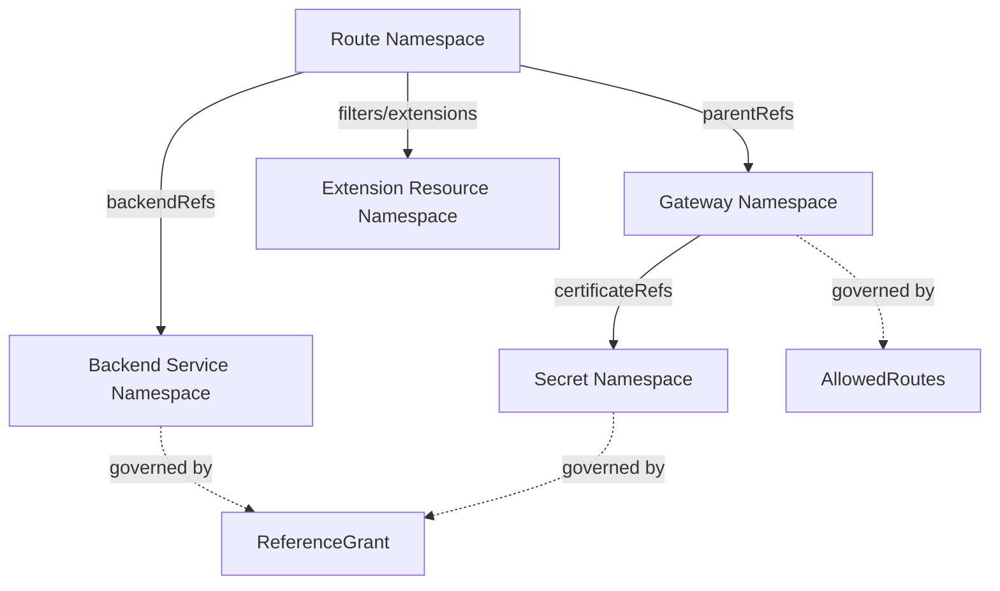
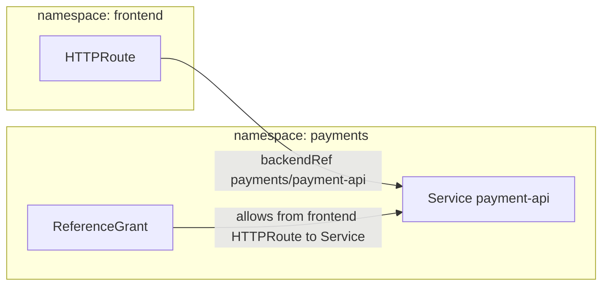
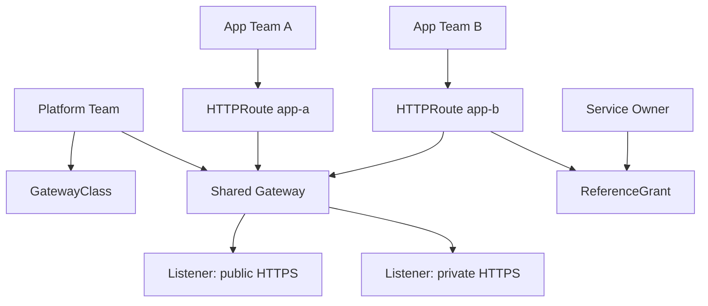
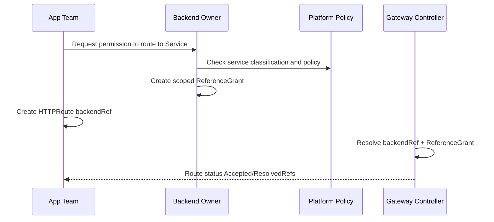
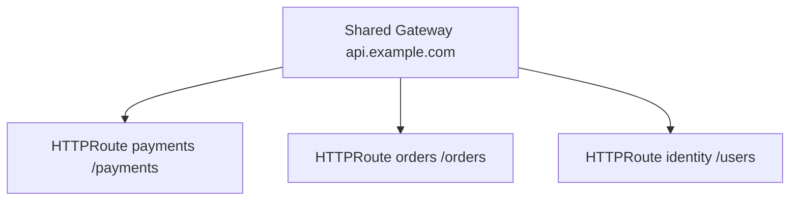
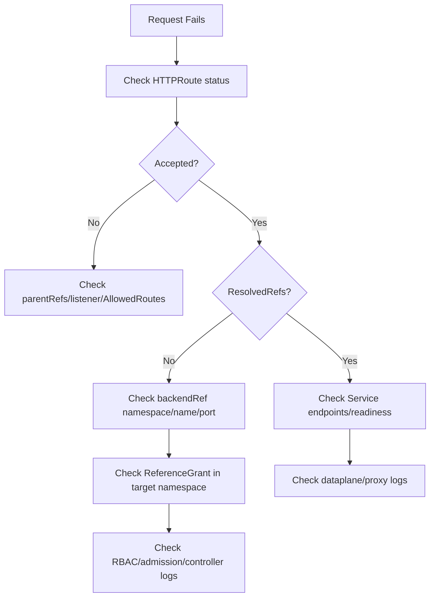

# Part 015 — ReferenceGrant, Cross-Namespace Routing, and Delegation

## 1. Tujuan Part Ini

Part 011 sampai Part 014 membahas attachment, HTTP/gRPC routing, TLS, dan non-HTTP routing. Sekarang kita masuk ke salah satu bagian paling penting untuk platform Kubernetes multi-team: **cross-namespace reference**.

Target part ini:

> Anda mampu mendesain shared Gateway dan delegated routing antar namespace tanpa membuka privilege escalation, route hijacking, atau accidental exposure. Anda juga mampu membaca `ReferenceGrant` sebagai trust contract, bukan sekadar objek YAML tambahan.

`ReferenceGrant` adalah resource Gateway API yang mengizinkan reference lintas namespace secara eksplisit. Dokumentasi Gateway API menjelaskan bahwa resource ini dapat dipakai agar Route bisa forward ke backend di namespace lain, atau Gateway bisa mereferensikan Secret di namespace lain. Tanpa safeguard seperti ini, namespace boundary mudah ditembus secara tidak sengaja.

Mental model yang akan kita gunakan:

> Namespace bukan hanya folder. Dalam cluster multi-team, namespace adalah boundary ownership, blast radius, dan delegation.

---

## 2. Problem Dasar: Reference Lintas Namespace Itu Berbahaya

Di Kubernetes, banyak resource namespaced: `Service`, `Secret`, `ConfigMap`, `HTTPRoute`, `Gateway`, workload, dan lain-lain. Dalam cluster single-team, cross-namespace reference sering dianggap praktis. Dalam platform multi-team, itu bisa menjadi celah besar.

Misalnya:

- namespace `payments` punya Service `payment-api`;
- namespace `frontend` punya `HTTPRoute`;
- `frontend` ingin route `/pay` ke `payments/payment-api`;
- tanpa aturan eksplisit, tim frontend bisa saja mengarahkan traffic ke backend payments tanpa persetujuan pemilik payments.

Masalahnya bukan hanya teknis. Masalahnya adalah **authority**.

Pertanyaan arsitekturalnya:

> Siapa yang berhak menyebabkan traffic masuk ke Service tertentu?

Dalam platform yang defensible, jawaban ini harus jelas.

Jika Route di namespace A bebas menunjuk Service di namespace B, maka namespace B kehilangan kontrol atas siapa yang boleh menjadikan Service-nya sebagai backend. Ini bisa menyebabkan:

- accidental exposure;
- bypass auth layer;
- dependency tersembunyi;
- traffic spike tak terduga;
- compliance boundary dilanggar;
- blast radius antar tim membesar;
- audit trail menjadi ambigu.

---

## 3. Dua Jenis Cross-Namespace Relationship

Gateway API punya beberapa bentuk hubungan lintas namespace. Jangan mencampurnya.



Secara konseptual:

1. **Route menempel ke Gateway di namespace lain**
   - dikontrol oleh `Gateway.spec.listeners[].allowedRoutes`;
   - bukan dikontrol oleh `ReferenceGrant`.

2. **Route menunjuk backend di namespace lain**
   - dikontrol oleh `ReferenceGrant` di namespace backend.

3. **Gateway menunjuk Secret TLS di namespace lain**
   - dikontrol oleh `ReferenceGrant` di namespace Secret.

Ini penting. Banyak incident dan kebingungan muncul karena engineer menganggap semua cross-namespace access diselesaikan dengan satu mekanisme yang sama.

---

## 4. ReferenceGrant Mental Model

`ReferenceGrant` menjawab:

> “Resource dari namespace mana, dengan kind apa, boleh mereferensikan resource kind apa di namespace saya?”

Perhatikan arah trust-nya.

`ReferenceGrant` dibuat di **namespace yang direferensikan**, bukan di namespace yang melakukan reference.

Jika namespace `frontend` ingin `HTTPRoute` menunjuk Service di namespace `payments`, maka `ReferenceGrant` harus dibuat di namespace `payments`.



Kenapa begitu?

Karena pemilik resource yang direferensikan harus punya hak untuk menerima atau menolak reference. Ini mirip prinsip “callee consent”.

Kalau grant dibuat di namespace caller, maka caller bisa memberi izin untuk dirinya sendiri. Itu bukan security control.

---

## 5. Anatomy ReferenceGrant

Contoh:

```yaml
apiVersion: gateway.networking.k8s.io/v1beta1
kind: ReferenceGrant
metadata:
  name: allow-frontend-to-payment-api
  namespace: payments
spec:
  from:
    - group: gateway.networking.k8s.io
      kind: HTTPRoute
      namespace: frontend
  to:
    - group: ""
      kind: Service
      name: payment-api
```

Interpretasi:

- `metadata.namespace: payments`
  - grant ini berlaku untuk resource target di namespace `payments`.

- `from`
  - resource asal yang diberi izin;
  - dalam contoh: `HTTPRoute` dari namespace `frontend`.

- `to`
  - resource target yang boleh direferensikan di namespace `payments`;
  - dalam contoh: `Service/payment-api`.

Jika `name` di `to` dihilangkan, biasanya artinya semua resource dengan kind tersebut di namespace target dapat direferensikan, sesuai spec dan implementasi yang berlaku. Untuk platform produksi, lebih aman gunakan `name` jika tujuannya spesifik.

---

## 6. Cross-Namespace BackendRef

Misalnya `HTTPRoute` di namespace `frontend`:

```yaml
apiVersion: gateway.networking.k8s.io/v1
kind: HTTPRoute
metadata:
  name: checkout-route
  namespace: frontend
spec:
  parentRefs:
    - name: shared-gateway
      namespace: platform-ingress
  hostnames:
    - shop.example.com
  rules:
    - matches:
        - path:
            type: PathPrefix
            value: /checkout
      backendRefs:
        - name: checkout-ui
          port: 8080
    - matches:
        - path:
            type: PathPrefix
            value: /pay
      backendRefs:
        - name: payment-api
          namespace: payments
          port: 8080
```

Route ini punya dua backend:

- `checkout-ui` di namespace lokal `frontend`;
- `payment-api` di namespace `payments`.

Untuk backend lokal, tidak perlu `ReferenceGrant`. Untuk backend lintas namespace, perlu grant di `payments`.

Jika grant tidak ada, controller yang patuh Gateway API tidak boleh memprogram cross-namespace backend tersebut. Status Route harus memberi sinyal seperti `ResolvedRefs=False` atau condition lain sesuai implementasi.

---

## 7. Route-to-Gateway Attachment Bukan ReferenceGrant

Misalnya Gateway ada di namespace `platform-ingress`:

```yaml
apiVersion: gateway.networking.k8s.io/v1
kind: Gateway
metadata:
  name: shared-gateway
  namespace: platform-ingress
spec:
  gatewayClassName: prod-edge
  listeners:
    - name: https
      protocol: HTTPS
      port: 443
      hostname: "*.example.com"
      tls:
        mode: Terminate
        certificateRefs:
          - name: wildcard-example-com
      allowedRoutes:
        namespaces:
          from: Selector
          selector:
            matchLabels:
              expose-public: "true"
```

Route dari namespace lain boleh attach jika namespace-nya memenuhi `allowedRoutes`.

Contoh namespace:

```yaml
apiVersion: v1
kind: Namespace
metadata:
  name: frontend
  labels:
    expose-public: "true"
```

Route:

```yaml
spec:
  parentRefs:
    - name: shared-gateway
      namespace: platform-ingress
      sectionName: https
```

Untuk hubungan ini, yang mengizinkan adalah Gateway owner melalui `allowedRoutes`, bukan backend owner melalui `ReferenceGrant`.

Rule of thumb:

> Route-to-Gateway attachment = izin dari Gateway owner. Route-to-backend reference = izin dari backend owner.

---

## 8. Shared Gateway Delegation Pattern

Salah satu pola produksi yang umum:

- platform team mengelola `GatewayClass` dan `Gateway`;
- application teams mengelola `HTTPRoute` di namespace masing-masing;
- backend owner mengontrol apakah service mereka boleh direferensikan lintas namespace.



Ownership matrix:

| Resource | Owner | Purpose |
|---|---|---|
| `GatewayClass` | Platform/infra | Controller and infrastructure class |
| `Gateway` | Platform/infra | Shared entry point and listener policy |
| `HTTPRoute` | App team | Application routing intent |
| `Service` | App/backend team | Backend exposure inside cluster |
| `ReferenceGrant` | Referenced namespace owner | Consent for cross-namespace reference |
| Policy resources | Platform/security/app depending type | Guardrails and runtime behavior |

Ini memungkinkan self-service tanpa menghilangkan governance.

---

## 9. Delegation Bukan Abdication

Delegation sering disalahartikan sebagai “platform menyerahkan semuanya ke app team”. Itu salah.

Delegation yang sehat punya tiga layer:

1. **Platform guardrail**
   - listener protocol;
   - hostname boundary;
   - allowed namespaces;
   - TLS standard;
   - controller class;
   - global policy.

2. **App routing ownership**
   - path ownership;
   - backend selection;
   - canary weights;
   - header match;
   - app-specific rewrite.

3. **Backend consent**
   - cross-namespace `Service` reference;
   - secret usage;
   - shared backend usage;
   - sensitive internal API exposure.

Jika salah satu layer hilang, shared Gateway menjadi rawan konflik.

---

## 10. Namespace Boundary as Contract

Dalam platform besar, namespace harus punya contract eksplisit:

- siapa owner-nya;
- apakah boleh expose route public;
- apakah boleh attach ke gateway tertentu;
- apakah boleh menjadi backend namespace untuk tim lain;
- label apa yang mengaktifkan kemampuan tertentu;
- policy default apa yang berlaku;
- siapa yang boleh membuat `ReferenceGrant`.

Contoh label strategy:

```yaml
apiVersion: v1
kind: Namespace
metadata:
  name: payments
  labels:
    owner: team-payments
    data-classification: restricted
    public-route-allowed: "false"
    cross-namespace-backend-allowed: "review-required"
```

Label saja tidak menegakkan security, tetapi berguna untuk:

- admission control;
- policy engine seperti Kyverno/Gatekeeper;
- reporting;
- ownership inventory;
- audit.

---

## 11. Secure Cross-Namespace Backend Pattern

Pattern aman untuk backend lintas namespace:



Checklist:

- Grant dibuat oleh owner namespace target.
- Grant spesifik terhadap source namespace.
- Grant spesifik terhadap source kind.
- Grant spesifik terhadap target kind.
- Jika memungkinkan, grant spesifik terhadap target name.
- Route status dipantau.
- Admission policy membatasi siapa yang boleh membuat grant.
- Audit log mencatat pembuatan/perubahan grant.

---

## 12. Bad Pattern: Wildcard Trust

Contoh berbahaya:

```yaml
apiVersion: gateway.networking.k8s.io/v1beta1
kind: ReferenceGrant
metadata:
  name: allow-all-routes-to-all-services
  namespace: payments
spec:
  from:
    - group: gateway.networking.k8s.io
      kind: HTTPRoute
      namespace: '*'
  to:
    - group: ""
      kind: Service
```

Catatan: bentuk wildcard exact tergantung spec field dan implementasi; contoh ini dipakai untuk menjelaskan anti-pattern, bukan sebagai manifest valid universal.

Masalahnya:

- semua namespace bisa mencoba reference;
- semua Service di namespace target dapat menjadi backend;
- sulit diaudit;
- sulit membedakan intended dependency dari accidental dependency;
- melanggar least privilege.

Better:

```yaml
apiVersion: gateway.networking.k8s.io/v1beta1
kind: ReferenceGrant
metadata:
  name: allow-frontend-to-payment-public-api
  namespace: payments
spec:
  from:
    - group: gateway.networking.k8s.io
      kind: HTTPRoute
      namespace: frontend
  to:
    - group: ""
      kind: Service
      name: payment-public-api
```

---

## 13. Cross-Namespace Secret Reference

TLS certificate Secret biasanya ada di namespace Gateway. Tetapi ada kasus di mana certificate dikelola oleh security/cert namespace terpisah.

Misalnya:

- Gateway di namespace `platform-ingress`;
- Secret TLS di namespace `certificates`;
- Gateway ingin `certificateRefs` ke Secret tersebut.

Gateway:

```yaml
apiVersion: gateway.networking.k8s.io/v1
kind: Gateway
metadata:
  name: shared-gateway
  namespace: platform-ingress
spec:
  gatewayClassName: prod-edge
  listeners:
    - name: https
      protocol: HTTPS
      port: 443
      hostname: shop.example.com
      tls:
        mode: Terminate
        certificateRefs:
          - group: ""
            kind: Secret
            name: shop-example-com
            namespace: certificates
```

Grant di namespace `certificates`:

```yaml
apiVersion: gateway.networking.k8s.io/v1beta1
kind: ReferenceGrant
metadata:
  name: allow-platform-gateway-to-shop-cert
  namespace: certificates
spec:
  from:
    - group: gateway.networking.k8s.io
      kind: Gateway
      namespace: platform-ingress
  to:
    - group: ""
      kind: Secret
      name: shop-example-com
```

Security reasoning:

- Gateway owner tidak bisa mengambil Secret sembarang dari namespace certificate.
- Certificate namespace owner memilih Gateway mana yang boleh menggunakan certificate.
- Jika grant dicabut, implementation yang mendukung ReferenceGrant harus mencabut akses efektif tersebut.

---

## 14. Shared Certificate Namespace: Trade-off

Central certificate namespace terlihat rapi, tetapi tidak selalu ideal.

| Model | Kelebihan | Risiko |
|---|---|---|
| Secret di namespace Gateway | Simple, local ownership jelas | Platform team memegang banyak cert |
| Secret di namespace app | App team kontrol cert | Gateway cross-namespace Secret reference meningkat |
| Secret di namespace security/cert | Central governance | ReferenceGrant dan RBAC harus sangat rapi |
| cert-manager sync ke namespace Gateway | Runtime simple | Secret duplication dan rotation complexity |

Prinsipnya:

> Certificate placement harus mengikuti ownership dan rotation model, bukan sekadar preferensi struktur folder.

Pertanyaan review:

- Siapa yang bertanggung jawab jika cert expired?
- Siapa yang boleh membaca Secret?
- Apakah Gateway controller butuh permission lintas namespace?
- Bagaimana revoke dilakukan?
- Apakah audit bisa menjelaskan kenapa Gateway tertentu memakai cert tertentu?

---

## 15. Route Hijacking Scenario

Bayangkan shared Gateway punya wildcard listener:

```yaml
hostname: "*.example.com"
allowedRoutes:
  namespaces:
    from: All
```

Lalu namespace `experimental` membuat route:

```yaml
spec:
  hostnames:
    - api.example.com
  parentRefs:
    - name: shared-gateway
      namespace: platform-ingress
```

Jika tidak ada guardrail, route ini bisa konflik dengan route resmi `api.example.com`.

Gateway API punya rule conflict dan status condition, tetapi platform yang baik tidak bergantung hanya pada conflict resolution controller. Platform harus mencegah kondisi berbahaya sebelum terjadi.

Guardrail:

- `allowedRoutes` jangan `All` untuk public listener kecuali cluster kecil dan controlled.
- Gunakan namespace selector.
- Gunakan admission policy untuk hostname ownership.
- Pisahkan listener/Gateway untuk domain berbeda.
- Gunakan `sectionName` secara eksplisit.
- Audit duplicate hostname.

---

## 16. Hostname Ownership Model

Dalam organisasi besar, hostname adalah resource.

Jangan biarkan setiap namespace bebas mengeklaim hostname.

Model sederhana:

```yaml
apiVersion: platform.example.com/v1
kind: HostnameClaim
metadata:
  name: shop-example-com
  namespace: frontend
spec:
  hostname: shop.example.com
  gateway: platform-ingress/shared-gateway
  owner: team-frontend
  visibility: public
```

Lalu admission policy memvalidasi bahwa `HTTPRoute.spec.hostnames` harus cocok dengan claim.

Jika belum punya CRD internal, minimal pakai convention:

- label namespace untuk domain suffix;
- GitOps ownership file;
- review process;
- CI policy check;
- periodic audit.

Tanpa hostname ownership, shared Gateway akan menjadi arena konflik antar tim.

---

## 17. Delegated Path Ownership

Selain hostname, path juga bisa menjadi resource.

Contoh:

- `api.example.com/payments/*` milik payments;
- `api.example.com/orders/*` milik orders;
- `api.example.com/users/*` milik identity.

Pola:



Masalah muncul ketika satu route memakai prefix terlalu luas:

```yaml
matches:
  - path:
      type: PathPrefix
      value: /
```

Route seperti ini bisa menangkap traffic yang tidak dimaksudkan, tergantung precedence dan conflict behavior.

Guardrail:

- batasi default catch-all route hanya ke namespace platform;
- validasi path prefix per team;
- gunakan explicit ownership registry;
- cek route precedence dalam CI;
- tampilkan route table aktual dari controller.

---

## 18. ReferenceGrant and RBAC

`ReferenceGrant` bukan pengganti RBAC.

RBAC menjawab:

> “User/service account boleh membuat/mengubah resource apa?”

ReferenceGrant menjawab:

> “Cross-namespace reference ini dipercaya oleh target namespace atau tidak?”

Keduanya harus dipakai bersama.

Contoh RBAC strategy:

- app team boleh membuat `HTTPRoute` di namespace sendiri;
- app team tidak boleh membuat `ReferenceGrant` di namespace lain;
- hanya owner namespace atau platform workflow yang boleh membuat `ReferenceGrant`;
- platform controller boleh membaca resource yang dibutuhkan;
- security team bisa audit semua grant.

Jika semua developer bisa membuat `ReferenceGrant` di semua namespace, maka ReferenceGrant kehilangan nilai governance.

---

## 19. ReferenceGrant and Admission Control

Admission control bisa digunakan untuk mencegah grant terlalu luas.

Validasi yang disarankan:

- `ReferenceGrant.spec.from[].namespace` wajib eksplisit;
- `to[].name` wajib eksplisit untuk namespace sensitif;
- tidak boleh grant ke `Secret` kecuali namespace tertentu;
- tidak boleh grant dari namespace dengan label `environment=dev` ke `environment=prod`;
- grant ke namespace restricted butuh annotation approval;
- grant harus punya owner label;
- grant harus punya expiry annotation jika temporary.

Contoh policy intent:

```yaml
metadata:
  annotations:
    platform.example.com/approval-ticket: SEC-1234
    platform.example.com/expires-at: "2026-09-01"
  labels:
    owner: team-payments
    purpose: cross-namespace-routing
```

Ini bukan fitur Gateway API langsung, tetapi bagian dari platform governance.

---

## 20. Debugging Cross-Namespace Backend Failure

Symptom:

- route accepted tetapi backend tidak menerima traffic;
- 503 dari Gateway;
- status `ResolvedRefs=False`;
- controller log menyebut reference not permitted;
- traffic ke backend lokal berhasil, backend lintas namespace gagal.

Debugging pipeline:



Commands:

```bash
kubectl get httproute -n frontend checkout-route -o yaml
kubectl describe httproute -n frontend checkout-route
kubectl get referencegrant -n payments -o yaml
kubectl get service -n payments payment-api -o yaml
kubectl get endpointslice -n payments -l kubernetes.io/service-name=payment-api
```

Look for:

- `status.parents[].conditions`;
- `Accepted`;
- `ResolvedRefs`;
- wrong `parentRef.namespace`;
- wrong `sectionName`;
- wrong backend `port`;
- grant in wrong namespace;
- grant from wrong kind;
- grant from wrong namespace;
- grant target missing `name` expectation.

---

## 21. Debugging Cross-Namespace Secret Failure

Symptom:

- Gateway listener not programmed;
- TLS handshake fails;
- certificate not served;
- controller event says Secret reference not permitted;
- Gateway status shows listener `ResolvedRefs=False`.

Pipeline:

```bash
kubectl describe gateway -n platform-ingress shared-gateway
kubectl get secret -n certificates shop-example-com
kubectl get referencegrant -n certificates -o yaml
kubectl logs -n gateway-system deploy/<gateway-controller>
```

Check:

- Secret exists;
- Secret type is TLS-compatible;
- Gateway `certificateRefs.namespace` correct;
- ReferenceGrant exists in Secret namespace;
- `from.kind` is `Gateway`, not `HTTPRoute`;
- `from.namespace` is Gateway namespace;
- `to.kind` is `Secret`;
- Gateway controller has RBAC to read Secret if permitted by implementation.

Important:

> ReferenceGrant expresses trust. The controller still needs actual Kubernetes permissions to read and program resources.

---

## 22. Multi-Tenant Gateway Design Patterns

### 22.1 Platform-Owned Public Gateway

Use when many apps share public edge.

- Gateway namespace: `platform-ingress`;
- Route namespaces selected by label;
- TLS managed centrally;
- app teams own HTTPRoute;
- security team owns global policies.

Good for:

- consistent TLS;
- WAF integration;
- central public exposure control.

Risk:

- shared blast radius;
- route conflict;
- platform bottleneck if self-service weak.

### 22.2 Team-Owned Gateway

Use when team needs strong isolation.

- each team owns its Gateway;
- platform only provides GatewayClass;
- dedicated LB/address may be provisioned per team.

Good for:

- isolation;
- clear ownership;
- lower route conflict.

Risk:

- cost;
- inconsistent policy;
- certificate sprawl.

### 22.3 Environment-Owned Gateway

Use when separating prod/staging/dev.

- `prod-gateway` only accepts prod namespaces;
- `staging-gateway` accepts staging namespaces;
- different TLS/security policies.

Good for:

- environment isolation;
- lower accidental prod exposure.

Risk:

- duplication;
- drift.

---

## 23. Cross-Namespace Route Delegation Decision Matrix

| Requirement | Prefer |
|---|---|
| Many teams share same domain | Shared Gateway + hostname/path ownership |
| Sensitive backend consumed by another namespace | Scoped ReferenceGrant + review |
| Certificate managed centrally | Cross-namespace Secret grant or Secret sync |
| Strict isolation | Dedicated Gateway per team/domain |
| High compliance workload | Avoid broad cross-namespace reference |
| Temporary migration route | Time-bound ReferenceGrant |
| Internal service composition | Consider mesh/internal route before public Gateway |

---

## 24. Common Failure Modes

### 24.1 Grant Created in Wrong Namespace

Wrong:

```yaml
metadata:
  namespace: frontend
```

But target Service is in `payments`.

Correct:

```yaml
metadata:
  namespace: payments
```

Why it fails:

- target namespace owner must grant permission;
- caller namespace cannot self-authorize.

### 24.2 Wrong Source Kind

Grant allows `Gateway`, but caller is `HTTPRoute`.

```yaml
from:
  - group: gateway.networking.k8s.io
    kind: Gateway
    namespace: frontend
```

But backend reference comes from `HTTPRoute`. Controller should reject.

### 24.3 AllowedRoutes Passes, BackendRef Fails

Route successfully attaches to Gateway, but backend reference is invalid.

This creates confusing symptoms:

- `Accepted=True`;
- `ResolvedRefs=False`;
- route appears attached;
- traffic still fails.

Read status per parent, not just top-level existence.

### 24.4 Cross-Namespace Route Conflict

Two namespaces claim same hostname/path.

Mitigation:

- admission policy;
- route table audit;
- hostname claim;
- path ownership registry.

### 24.5 ReferenceGrant Too Broad

Grant permits too many source namespaces or target Services.

Mitigation:

- least privilege;
- expiry;
- owner labels;
- periodic review;
- policy checks.

---

## 25. Production Review Checklist

For every cross-namespace reference, ask:

1. What namespace initiates the reference?
2. What namespace owns the referenced object?
3. Is there explicit consent from target namespace?
4. Is the grant scoped to the minimum source kind and namespace?
5. Is the target kind/name scoped?
6. Is the relationship temporary or permanent?
7. Is there an owner label?
8. Is there an approval/audit trail?
9. What happens if grant is removed?
10. Is Route status monitored?
11. Can an app team hijack hostname/path?
12. Does RBAC allow only proper owners to create grants?
13. Does admission prevent broad grant patterns?
14. Is this route public, private, or internal?
15. Does the backend expect traffic from this route?

---

## 26. Practical Lab

### Goal

Create a shared Gateway and allow a route in namespace `frontend` to call a backend in namespace `payments` only after explicit consent.

### Setup

```bash
kubectl create namespace platform-ingress
kubectl create namespace frontend
kubectl create namespace payments
kubectl label namespace frontend expose-public=true
```

### Gateway

```yaml
apiVersion: gateway.networking.k8s.io/v1
kind: Gateway
metadata:
  name: shared-gateway
  namespace: platform-ingress
spec:
  gatewayClassName: prod-edge
  listeners:
    - name: http
      protocol: HTTP
      port: 80
      hostname: shop.example.com
      allowedRoutes:
        namespaces:
          from: Selector
          selector:
            matchLabels:
              expose-public: "true"
```

### Services

Create `checkout-ui` in `frontend` and `payment-api` in `payments`.

### HTTPRoute Before Grant

```yaml
apiVersion: gateway.networking.k8s.io/v1
kind: HTTPRoute
metadata:
  name: checkout-route
  namespace: frontend
spec:
  parentRefs:
    - name: shared-gateway
      namespace: platform-ingress
      sectionName: http
  hostnames:
    - shop.example.com
  rules:
    - matches:
        - path:
            type: PathPrefix
            value: /pay
      backendRefs:
        - name: payment-api
          namespace: payments
          port: 8080
```

Expected:

- Route may attach to Gateway;
- backend reference should not resolve until grant exists.

### Add ReferenceGrant

```yaml
apiVersion: gateway.networking.k8s.io/v1beta1
kind: ReferenceGrant
metadata:
  name: allow-frontend-route-to-payment-api
  namespace: payments
spec:
  from:
    - group: gateway.networking.k8s.io
      kind: HTTPRoute
      namespace: frontend
  to:
    - group: ""
      kind: Service
      name: payment-api
```

Expected:

- backend reference resolves;
- traffic can be programmed if Service and endpoints are healthy.

### Remove Grant

```bash
kubectl delete referencegrant -n payments allow-frontend-route-to-payment-api
```

Expected:

- controller should revoke the cross-namespace backend reference;
- status should indicate unresolved reference;
- traffic should fail or route should stop selecting that backend depending implementation.

---

## 27. Engineering Mental Model

Think of `ReferenceGrant` as a three-part sentence:

> “In my namespace, I allow resource kind X from namespace Y to reference resource kind Z, optionally named N.”

This is not routing. This is **authorization for reference resolution**.

A route can be syntactically valid but semantically unauthorized.

A Gateway can be created but not programmed.

A Secret can exist but be unusable by a listener.

A Service can be healthy but unreachable through the intended route because the trust edge is missing.

---

## 28. Summary

Key points:

- Cross-namespace reference is an ownership and security problem, not just a routing feature.
- `ReferenceGrant` must live in the target namespace.
- Route-to-Gateway attachment is controlled by `allowedRoutes`.
- Route-to-backend and Gateway-to-Secret cross-namespace references are controlled by `ReferenceGrant`.
- Shared Gateway works only when hostname, path, route, backend, and certificate ownership are explicit.
- RBAC, admission control, and audit are required around ReferenceGrant.
- In production, broad grants are almost always a smell.

You are now ready for Part 016, where we turn these ownership boundaries into **policy attachment and platform guardrails**.

---

## References

- Gateway API — ReferenceGrant: https://gateway-api.sigs.k8s.io/reference/api-types/referencegrant/
- Gateway API — API specification: https://gateway-api.sigs.k8s.io/reference/api-spec/main/spec/
- Gateway API — GEP-709 Cross Namespace References from Routes: https://gateway-api.sigs.k8s.io/geps/gep-709/
- Gateway API — Gateway resource: https://gateway-api.sigs.k8s.io/api-types/gateway/
- Kubernetes — Gateway API: https://kubernetes.io/docs/concepts/services-networking/gateway/
