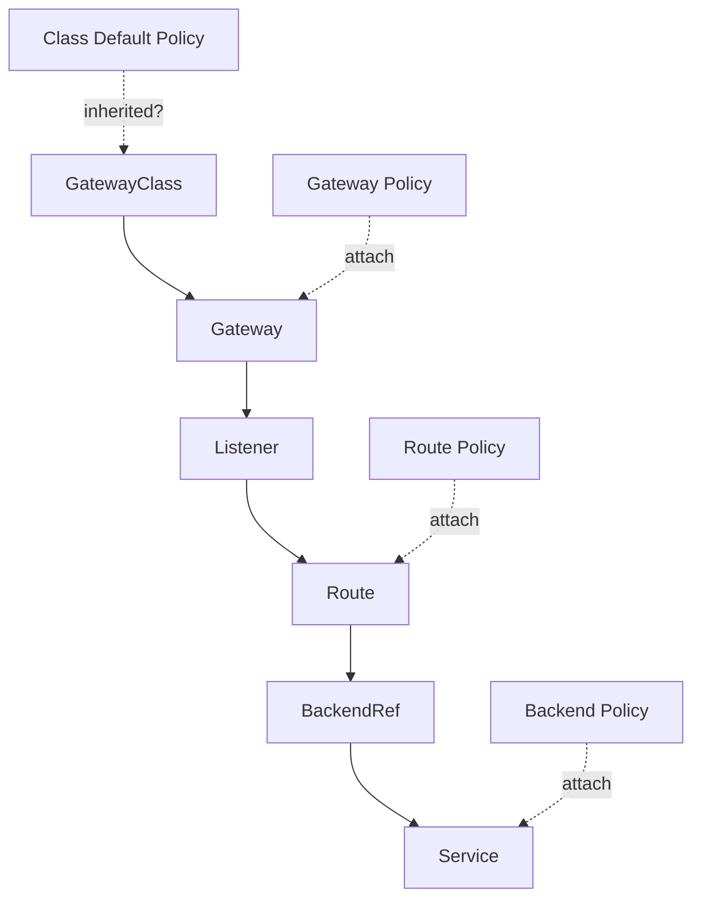
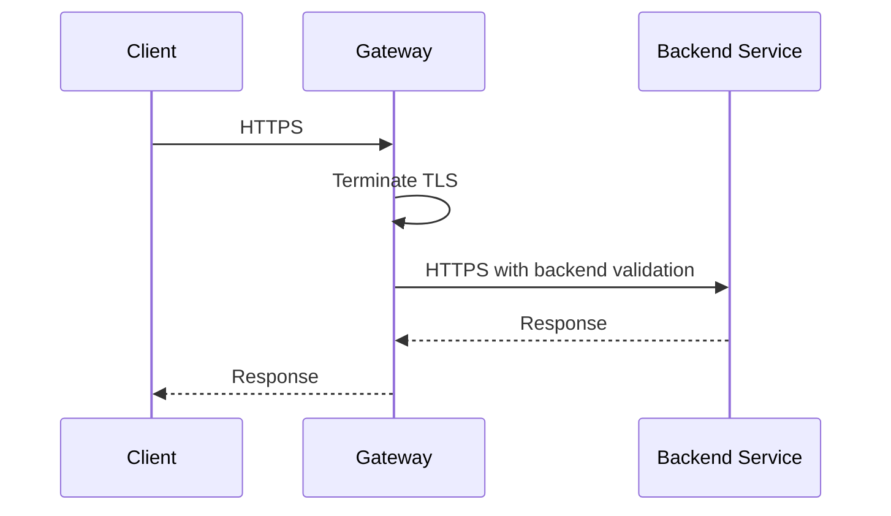
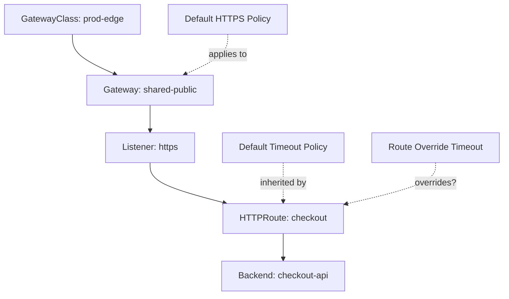
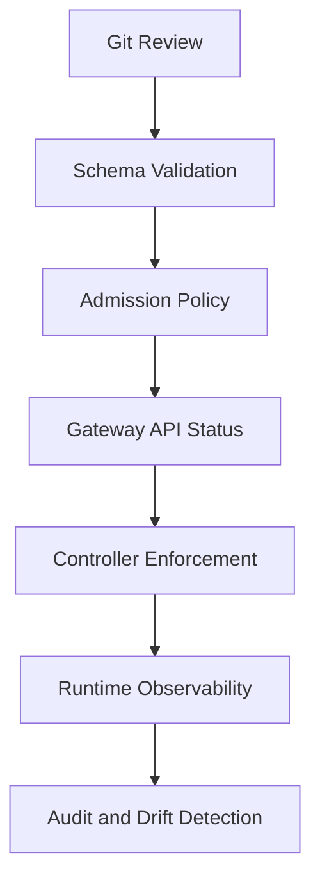
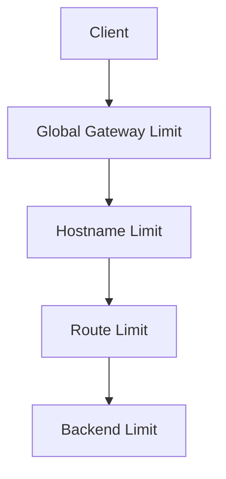
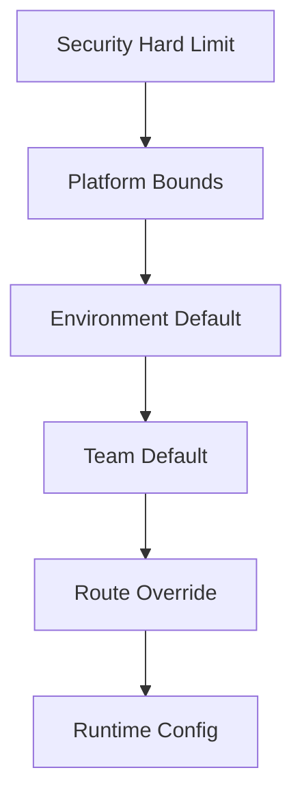
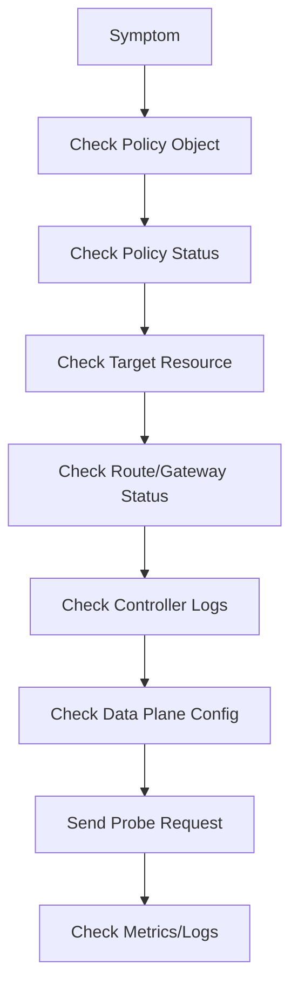

# Part 016 — Gateway API Policy Attachment and Platform Guardrails

## 1. Tujuan Part Ini

Part 015 membahas `ReferenceGrant`, cross-namespace routing, dan delegation. Sekarang kita masuk ke layer yang lebih strategis: **policy attachment**.

Target part ini:

> Anda mampu membedakan routing intent dari platform policy, menempatkan policy di resource yang tepat, memahami direct vs inherited attachment, membaca risiko portability antar controller, dan mendesain guardrail yang membuat self-service routing tetap aman, reliabel, dan defensible.

Gateway API bukan hanya pengganti Ingress. Salah satu ide besarnya adalah memisahkan peran:

- infrastructure/platform owner menyediakan Gateway;
- app owner mendefinisikan Route;
- policy owner mengatur behavior lintas resource;
- security/SRE mengatur guardrail.

Policy attachment adalah mekanisme untuk menghindari anti-pattern lama: semua perilaku dimasukkan ke annotation controller-specific.

---

## 2. Routing vs Policy

Jangan campur dua hal ini:

- **Routing** menjawab: request mana menuju backend mana?
- **Policy** menjawab: bagaimana traffic diperlakukan, dibatasi, diamankan, diamati, dan dikendalikan?

Contoh routing:

```yaml
rules:
  - matches:
      - path:
          type: PathPrefix
          value: /api
    backendRefs:
      - name: api-v1
        port: 8080
```

Contoh policy intent:

- timeout 5 detik;
- retry maksimal 2 kali;
- TLS ke backend harus diverifikasi;
- request body maksimum 2 MiB;
- rate limit 100 RPS per client;
- JWT issuer wajib;
- access log wajib;
- route public harus pakai HTTPS;
- backend restricted tidak boleh dipakai oleh namespace dev.

Jika semua ini dimasukkan ke Route sebagai annotation, Route berubah menjadi dump konfigurasi controller. Portability dan governance runtuh.

---

## 3. Policy Attachment Mental Model

Gateway API mendeskripsikan policy attachment sebagai metaresource yang memengaruhi satu object secara langsung atau object dalam hierarchy. Ada dua pola utama:

1. **Direct Policy Attachment**
   - policy menempel langsung ke target object tertentu;
   - tidak ada inheritance kompleks;
   - contoh penting: `BackendTLSPolicy`.

2. **Inherited Policy Attachment**
   - policy bisa diwariskan dari parent ke child dalam hierarchy;
   - berguna untuk default dan override;
   - lebih kompleks dan masih sangat bergantung pada jenis policy/controller.



Mental model:

> Route should express application traffic intent. Policy should express platform behavior around that intent.

---

## 4. Why Policy Attachment Exists

Ingress sering mengandalkan annotation:

```yaml
metadata:
  annotations:
    nginx.ingress.kubernetes.io/proxy-read-timeout: "60"
    nginx.ingress.kubernetes.io/rewrite-target: /
    nginx.ingress.kubernetes.io/limit-rps: "100"
```

Masalah annotation:

- stringly typed;
- controller-specific;
- sulit divalidasi;
- sulit diwariskan;
- sulit diaudit;
- sulit diberi ownership;
- tidak jelas conflict resolution;
- tidak ada status condition yang kaya;
- mudah silent ignored.

Policy attachment mencoba menyediakan pola lebih formal:

- typed resources;
- targetRef jelas;
- status bisa dilaporkan;
- ownership bisa dibedakan;
- conformance/portability lebih mungkin;
- controller extension lebih terstruktur.

Namun jangan salah paham: tidak semua policy sudah standard, tidak semua controller mendukung policy yang sama, dan sebagian policy masih experimental atau implementation-specific.

---

## 5. Direct Policy Attachment

Direct policy menempel ke target tertentu.

Contoh konsep:

```yaml
apiVersion: gateway.networking.k8s.io/v1
kind: BackendTLSPolicy
metadata:
  name: api-backend-tls
  namespace: payments
spec:
  targetRefs:
    - group: ""
      kind: Service
      name: payment-api
  validation:
    hostname: payment-api.payments.svc.cluster.local
    caCertificateRefs:
      - name: payment-api-ca
        group: ""
        kind: ConfigMap
```

Catatan: field detail dapat berubah mengikuti versi Gateway API/controller. Selalu cek API reference versi yang dipakai cluster Anda.

Inti direct policy:

- policy ada di namespace target;
- target object jelas;
- behavior berlaku pada target tersebut;
- tidak perlu menghitung inheritance dari parent.

Direct policy cocok untuk:

- backend TLS;
- backend health checking;
- backend-specific auth;
- per-route timeout;
- per-route rate limit;
- per-Gateway listener guardrail.

---

## 6. BackendTLSPolicy: Why It Matters

Sebelum ada `BackendTLSPolicy`, Gateway API punya gap: client-to-Gateway TLS bisa didefinisikan, tetapi Gateway-to-backend TLS belum punya API standard yang jelas.

`BackendTLSPolicy` mengisi kebutuhan:

> Ketika Gateway meneruskan traffic ke Service backend, bagaimana Gateway melakukan TLS ke backend dan memverifikasi backend tersebut?

Ini penting untuk:

- compliance;
- backend identity verification;
- re-encryption pattern;
- avoiding accidental plaintext hop;
- separating edge TLS from backend TLS.

Conceptual path:



Tanpa backend TLS policy, banyak platform melakukan salah satu dari dua hal buruk:

- terminate TLS di edge lalu plaintext ke backend tanpa awareness;
- memakai controller-specific annotation untuk backend protocol dan CA validation.

---

## 7. Backend TLS Is Not mTLS

Backend TLS dan mesh mTLS sering dicampur.

| Mechanism | Scope | Main Question |
|---|---|---|
| Client-to-Gateway TLS | External edge | Is client connection encrypted to Gateway? |
| Gateway-to-backend TLS | Gateway backend hop | Does Gateway verify backend TLS identity? |
| Mesh mTLS | Workload-to-workload | Are workloads mutually authenticated inside mesh? |
| Application TLS | App library level | Does app itself own TLS semantics? |

BackendTLSPolicy biasanya mengatur Gateway-to-Service TLS, bukan full workload identity mesh.

Jika cluster memakai service mesh, perlu jelas:

- apakah Gateway berada di mesh?
- apakah backend workload menerima mesh mTLS atau plain HTTP?
- apakah Gateway melakukan TLS origination sendiri?
- apakah double encryption terjadi?
- identity apa yang diverifikasi?

---

## 8. Inherited Policy Attachment

Inherited policy lebih kuat tapi lebih berbahaya jika tidak dipahami.

Contoh conceptual hierarchy:



Pertanyaan sulit:

- policy dari parent diwariskan ke child mana?
- apakah child boleh override?
- bagaimana conflict diselesaikan?
- jika dua policy berlaku, mana yang menang?
- apakah controller melaporkan status conflict?
- apakah behavior ini portable antar implementation?

Karena itu, inherited policy harus dipakai dengan disiplin tinggi.

Rule of thumb:

> Use inherited policy for platform defaults. Use direct policy for explicit behavior with strong ownership.

---

## 9. Policy Ownership Model

Policy harus punya owner yang jelas.

| Policy Type | Typical Owner | Example |
|---|---|---|
| TLS minimum version | Security/platform | Gateway listener policy |
| Backend TLS verification | Backend/security | BackendTLSPolicy on Service |
| Timeout default | SRE/platform | Route timeout policy |
| Retry default | SRE/platform | Route/backend traffic policy |
| Rate limit | Platform/app | Gateway or Route policy |
| AuthN/AuthZ | Security/app | JWT/Auth policy |
| Observability | SRE/platform | Access log/telemetry policy |
| Header normalization | Platform/security | Route filter or policy |

Anti-pattern:

- app team can disable TLS verification;
- app team can increase timeout to 10 minutes without review;
- app team can bypass rate limit by adding route annotation;
- platform applies retry default globally without app awareness;
- security creates policy but does not monitor enforcement status.

---

## 10. Platform Guardrail Layers

A mature Kubernetes traffic platform usually has guardrails in multiple layers:



### 10.1 Git/CI Guardrail

Catches obvious issues before apply:

- invalid hostname;
- unsupported route kind;
- missing owner label;
- unsafe path prefix;
- public route without TLS;
- missing timeout policy;
- broad ReferenceGrant;
- unsupported controller feature.

### 10.2 Admission Guardrail

Prevents unsafe changes at API server boundary:

- block public HTTP listener;
- require `allowedRoutes` selector;
- block broad `ReferenceGrant`;
- require explicit `sectionName` for shared Gateway;
- restrict who can create `BackendTLSPolicy`;
- prevent disabling backend validation.

### 10.3 Runtime Guardrail

Monitors actual behavior:

- Route status conditions;
- Gateway listener programmed;
- policy accepted/enforced;
- route conflict;
- TLS handshake errors;
- backend 5xx;
- retry amplification;
- rate limit reject rate.

---

## 11. Policy Status Is Part of the Contract

A policy resource is not useful unless you can answer:

> Was the policy accepted? Was it enforced? If not, why?

Many policy resources include status conditions, depending on type and controller.

Look for patterns like:

- `Accepted`;
- `ResolvedRefs`;
- `Conflicted`;
- `Programmed`;
- `Invalid`;
- `UnsupportedValue`;
- `NoMatchingParent`;
- controller-specific condition reasons.

Commands:

```bash
kubectl get backendtlspolicy -A
kubectl describe backendtlspolicy -n payments api-backend-tls
kubectl get gateway -A -o yaml
kubectl get httproute -A -o yaml
```

Operational rule:

> Never assume a policy is active because YAML exists. Confirm status and runtime behavior.

---

## 12. Timeout Policy Pattern

Timeouts are reliability controls, not mere performance tuning.

A platform may define:

- default request timeout: 15s;
- max request timeout: 60s;
- connect timeout: 2s;
- idle timeout: 60s;
- streaming route exception: reviewed separately.

Conceptual policy:

```yaml
apiVersion: gateway.example.com/v1alpha1
kind: HTTPRouteTimeoutPolicy
metadata:
  name: checkout-timeouts
  namespace: checkout
spec:
  targetRefs:
    - group: gateway.networking.k8s.io
      kind: HTTPRoute
      name: checkout-route
  requestTimeout: 5s
  backendRequestTimeout: 4s
```

Field names are illustrative; timeout policy is often implementation-specific unless your controller implements a Gateway API standard/experimental policy.

Design reasoning:

- request timeout should align with app deadline;
- gateway timeout should not exceed client timeout by too much;
- backend timeout should leave room for gateway response handling;
- retries must fit inside timeout budget;
- long-running exports need separate route class.

Failure mode:

- client timeout 3s;
- gateway timeout 30s;
- backend continues working after client disconnected;
- retry storm increases load;
- user sees failure while backend does wasted work.

---

## 13. Retry Policy Pattern

Retries are dangerous because they amplify traffic.

A good retry policy defines:

- retryable status codes;
- retryable connect failures;
- max attempts;
- per-try timeout;
- backoff;
- retry budget;
- idempotency constraint.

Bad default:

```txt
retry all 5xx three times globally
```

Why bad:

- non-idempotent operations may duplicate writes;
- overloaded backend receives more traffic;
- incident worsens;
- tail latency increases;
- error budget burns faster.

Better model:

| Route Type | Retry Default |
|---|---|
| GET/read idempotent | Limited retries allowed |
| POST/write | No retry unless idempotency key enforced |
| streaming | Usually no retry at gateway |
| payment/settlement | Application-level retry only |
| internal cache call | Short retry may be acceptable |

Platform guardrail:

- retries require route classification;
- POST retry blocked by default;
- retry attempts capped;
- retry metrics monitored;
- retry policy cannot be configured without timeout policy.

---

## 14. Rate Limiting Policy Pattern

Rate limiting can attach at different layers:

- Gateway/global;
- Listener/hostname;
- Route/path;
- backend/service;
- identity/client;
- token/API key;
- namespace/team.



Design questions:

- What is the identity key?
- IP address, API key, JWT subject, tenant ID, namespace, service account?
- Is limit local to one Gateway pod or global across replicas?
- What happens during failover?
- Is rate limit fail-open or fail-closed?
- Are rejected requests observable?
- Is there a different limit for internal traffic?

Failure mode:

- using source IP behind NAT as identity causes many users to share quota;
- per-pod local rate limit multiplies total allowed traffic by number of replicas;
- global rate limit service outage blocks all traffic;
- fail-open allows attack traffic through;
- fail-closed causes platform outage.

---

## 15. Authentication and Authorization Policy

Gateway API core resources do not standardize every auth behavior. Controllers and meshes often provide extension policies.

Common patterns:

- JWT validation at Gateway;
- OIDC external auth;
- API key validation;
- mTLS client certificate auth;
- service-to-service identity auth;
- path-level authorization;
- namespace-level deny by default.

Placement decision:

| Placement | Good For | Risk |
|---|---|---|
| Edge Gateway | external API auth, central enforcement | app-specific auth complexity |
| Service Mesh | workload identity, east-west auth | mesh dependency |
| Application | domain-specific authorization | duplicated boilerplate |
| External Auth Service | central policy decision | latency and availability dependency |

Rule:

> Gateway auth can verify caller identity and coarse access. Application still owns domain authorization.

Do not put business authorization entirely in Gateway unless the policy language can represent domain rules and lifecycle safely.

---

## 16. Header Policy and Request Normalization

Header manipulation is deceptively dangerous.

Common operations:

- add request header;
- remove request header;
- set response header;
- normalize `X-Forwarded-*`;
- inject request ID;
- remove spoofed identity headers;
- set security headers.

Guardrail:

- clients must not be allowed to spoof trusted identity headers;
- Gateway should sanitize incoming `X-Forwarded-For`, `X-Forwarded-Proto`, and auth-derived headers according to trust boundary;
- apps should know which headers are trustworthy;
- platform should document header contract.

Example policy intent:

```txt
At public edge:
- strip X-User-ID from client request
- validate JWT
- set X-Authenticated-Subject from verified token
- set X-Request-ID if missing
- append trusted X-Forwarded-For
```

Failure mode:

- app trusts `X-User-ID` sent directly by client;
- gateway forwards spoofed header;
- authorization bypass happens without network exploit.

---

## 17. Policy Conflict Handling

Policy conflict is inevitable in large platforms.

Examples:

- platform default timeout = 15s;
- route policy timeout = 60s;
- security policy maximum = 30s;
- controller extension says route policy wins;
- admission policy says max 30s.

You need explicit precedence.

Recommended precedence model:

1. hard security constraints;
2. platform maximum/minimum constraints;
3. environment defaults;
4. team defaults;
5. app-specific overrides;
6. emergency overrides with expiry.



If controller policy semantics are unclear, enforce precedence with admission before resource reaches controller.

---

## 18. Portability Risk

Gateway API core resources are more portable than Ingress annotations, but policy is still an area where portability varies.

Risk dimensions:

| Dimension | Question |
|---|---|
| API channel | Is policy Standard, Experimental, or implementation-specific? |
| Controller support | Does selected controller implement it? |
| Status support | Does controller report enforcement clearly? |
| Semantics | Are field meanings consistent? |
| Failure behavior | What happens if unsupported? |
| Migration | Can another controller express same behavior? |

Example:

- `HTTPRoute` weighted backend is relatively portable.
- Some rate-limit policies are controller-specific.
- Auth policies often differ significantly.
- Retry/timeout policy support may vary by controller and version.

Decision rule:

> Treat policy CRDs as part of your platform API surface. Do not adopt them casually.

---

## 19. Controller Capability Matrix

Before standardizing on policy, build a matrix:

| Capability | Required? | Standard Gateway API? | Controller A | Controller B | Risk |
|---|---:|---:|---:|---:|---|
| HTTPRoute | Yes | Yes | Yes | Yes | Low |
| GRPCRoute | Maybe | Yes/Standard depending version | Yes | Partial | Medium |
| BackendTLSPolicy | Yes | Standard in newer Gateway API versions | Yes | Partial | Medium |
| RateLimitPolicy | Yes | Often extension | Yes | No | High |
| JWT auth | Yes | Extension | Yes | Different CRD | High |
| Retry policy | Yes | Varies | Yes | Partial | Medium |
| Access log policy | Yes | Varies | Yes | Yes | Medium |

Do not confuse “controller supports Gateway API” with “controller supports your platform policy model”.

---

## 20. Policy as Product Surface

Internal platform users experience policy through:

- default behavior;
- allowed overrides;
- documentation;
- error messages;
- status conditions;
- admission errors;
- dashboards;
- examples.

A platform policy that is correct but incomprehensible will be bypassed.

Good policy UX:

- sane defaults;
- small number of profiles;
- clear labels/classification;
- explicit error messages;
- route status surfaced in portal;
- examples for common use cases;
- exception workflow.

Bad policy UX:

- dozens of CRDs for every app;
- unclear precedence;
- YAML copied from Slack;
- denied admission without actionable reason;
- production behavior differs from staging;
- no observability of enforcement.

---

## 21. Policy Profiles

Instead of making every team tune every field, expose profiles.

Example:

| Profile | Use Case | Defaults |
|---|---|---|
| `public-api` | Internet-facing JSON API | HTTPS, auth required, rate limit, 15s timeout |
| `internal-api` | East-west HTTP | mTLS, 5s timeout, no public exposure |
| `streaming` | SSE/gRPC streaming | long idle timeout, no retry |
| `web-ui` | browser UI | security headers, compression, moderate timeout |
| `batch-callback` | webhook/callback | strict source validation, retry-aware |

Implementation options:

- policy CRD with profile field;
- admission mutating default;
- GitOps generator;
- Helm/Kustomize platform module;
- internal developer portal.

Profiles reduce cognitive load and increase consistency.

---

## 22. Guardrail Example: Public Route Must Use HTTPS

Policy requirement:

> Any namespace exposing public route must attach only to HTTPS listener and must not use public HTTP except redirect listener controlled by platform.

Enforcement:

- Gateway has HTTP listener only for redirect;
- app namespaces cannot attach Route to HTTP listener;
- admission blocks `parentRefs.sectionName: http` unless namespace is `platform-ingress`;
- CI checks `HTTPRoute` hostnames and parent refs;
- dashboard shows public routes without TLS.

Why this matters:

- prevents accidental plaintext API exposure;
- makes compliance simple;
- removes app-level negotiation.

---

## 23. Guardrail Example: Backend TLS Required for Restricted Services

Requirement:

> Services labeled `data-classification=restricted` must have backend TLS validation when exposed through public Gateway.

Conceptual resources:

```yaml
apiVersion: v1
kind: Service
metadata:
  name: payment-api
  namespace: payments
  labels:
    data-classification: restricted
```

Policy check:

- if `HTTPRoute` references restricted Service;
- and parent Gateway is public;
- then `BackendTLSPolicy` must target that Service;
- policy must use approved CA reference;
- disabling verification is forbidden.

This kind of rule usually requires admission/controller logic beyond pure Gateway API core.

---

## 24. Guardrail Example: Retry Requires Idempotency Classification

Requirement:

> Routes using retry policy must declare idempotency classification.

Possible annotation:

```yaml
metadata:
  labels:
    platform.example.com/idempotency: read-only
```

Rules:

- `read-only`: retry allowed within budget;
- `idempotent-write`: retry allowed only with idempotency key header enforced;
- `non-idempotent`: gateway retry blocked;
- `streaming`: retry blocked.

This prevents “reliability feature” from becoming data corruption feature.

---

## 25. Guardrail Example: Cross-Namespace Grant Must Be Scoped

From Part 015:

- `ReferenceGrant` target namespace is sensitive;
- broad grant is dangerous.

Policy:

- `from.namespace` must be explicit;
- `to.name` required for `Service` in restricted namespaces;
- grant to `Secret` only allowed from Gateway namespaces;
- grant must have owner and approval label;
- temporary grant must expire.

This is how ReferenceGrant becomes operationally safe.

---

## 26. Observability for Policy Enforcement

You need dashboards for policy state.

Minimum metrics/views:

- number of Gateways by class;
- listeners not programmed;
- Routes not accepted;
- Routes with unresolved refs;
- policies not accepted;
- backend TLS handshake failures;
- requests by route/profile;
- retry attempts by route;
- timeout count by route/backend;
- rate-limit rejects by key/profile;
- auth rejects;
- cross-namespace grants by source/target;
- public routes without owner label.

Without this, policy becomes invisible infrastructure magic.

---

## 27. Debugging Policy Problems

Symptom categories:

### 27.1 Policy YAML Exists but No Effect

Check:

```bash
kubectl get <policy-kind> -A
kubectl describe <policy-kind> -n <ns> <name>
kubectl get gatewayclass,gateway,httproute,service -A
```

Likely causes:

- controller does not support policy kind;
- policy targets wrong object;
- wrong namespace;
- missing `targetRefs`;
- target kind/group mismatch;
- policy rejected by status;
- another policy overrides it;
- implementation requires feature flag.

### 27.2 Route Rejected After Policy Added

Likely causes:

- invalid policy values;
- conflicting policy;
- unsupported filter/policy combination;
- backend reference now requires TLS config;
- admission mutation changed route.

### 27.3 Runtime Behavior Differs from Status

Likely causes:

- stale controller config;
- data plane not updated;
- multiple Gateway controllers watching same resources;
- Envoy config rejected;
- route attached to different listener than expected;
- traffic goes through another path.

Debug flow:



---

## 28. Policy and GitOps

Policy attachment fits GitOps well if ownership is clear.

Recommended repository structure:

```txt
platform-networking/
  gatewayclasses/
  gateways/
  global-policies/
  admission-policies/

apps/
  checkout/
    routes/
    route-policies/
  payments/
    services/
    backend-policies/
    referencegrants/
```

Review rules:

- app team can change route within owned hostname/path;
- backend owner reviews ReferenceGrant;
- security reviews TLS/auth policy;
- SRE reviews retry/timeout exception;
- platform reviews Gateway changes.

This avoids centralizing every route change while keeping sensitive controls protected.

---

## 29. Policy Anti-Patterns

### 29.1 “One Giant Gateway Policy”

A single policy that controls everything:

- TLS;
- retry;
- auth;
- logging;
- rate limit;
- header mutation;
- WAF;
- backend TLS.

Problem:

- ownership unclear;
- overrides dangerous;
- impossible to reason;
- blast radius huge.

Better: separate policies by concern and owner.

### 29.2 “Everything Is App Overrideable”

If app team can override every guardrail, policy is documentation, not enforcement.

### 29.3 “No Escape Hatch”

If platform blocks every exception, teams bypass platform.

Better: controlled exception with:

- approval;
- expiry;
- audit;
- monitoring;
- rollback.

### 29.4 “Unsupported Policy Assumed Active”

YAML exists, controller ignores it or reports unsupported.

Always verify status and runtime.

### 29.5 “Controller-Specific CRDs Become Accidental Platform API”

Teams start depending directly on vendor CRDs. Later migration becomes expensive.

Better: wrap with profiles or internal abstractions if portability matters.

---

## 30. Architecture Decision Framework

When adding a policy, ask:

1. Is this policy security, reliability, observability, or traffic behavior?
2. Who owns the decision?
3. Is the policy standard Gateway API, experimental, or controller-specific?
4. What target object should it attach to?
5. Should it be direct or inherited?
6. Can app teams override it?
7. What are allowed bounds?
8. How is conflict resolved?
9. How is status observed?
10. How is runtime enforcement tested?
11. What happens if controller does not support it?
12. What is migration path to another controller?
13. Is exception workflow defined?
14. Does this policy need audit evidence?
15. Can it be represented as a profile?

---

## 31. Practical Lab

### Goal

Design policy guardrails for a public API route.

Requirements:

- public HTTPS only;
- request timeout 10s;
- retry only for GET;
- backend TLS required;
- route must have owner label;
- no broad ReferenceGrant;
- route status must be monitored.

### Step 1 — Route

```yaml
apiVersion: gateway.networking.k8s.io/v1
kind: HTTPRoute
metadata:
  name: payment-public-route
  namespace: payments
  labels:
    owner: team-payments
    platform.example.com/profile: public-api
    platform.example.com/idempotency: read-only
spec:
  parentRefs:
    - name: shared-gateway
      namespace: platform-ingress
      sectionName: https
  hostnames:
    - payments.example.com
  rules:
    - matches:
        - method: GET
          path:
            type: PathPrefix
            value: /v1/payments
      backendRefs:
        - name: payment-api
          port: 8443
```

### Step 2 — Backend TLS Policy

```yaml
apiVersion: gateway.networking.k8s.io/v1
kind: BackendTLSPolicy
metadata:
  name: payment-api-backend-tls
  namespace: payments
spec:
  targetRefs:
    - group: ""
      kind: Service
      name: payment-api
  validation:
    hostname: payment-api.payments.svc.cluster.local
    caCertificateRefs:
      - group: ""
        kind: ConfigMap
        name: payment-api-ca
```

Validate exact schema against your Gateway API version and controller.

### Step 3 — Policy Checks

Use CI/admission to verify:

```txt
- parentRefs.sectionName must be https
- metadata.labels.owner required
- profile public-api requires BackendTLSPolicy for restricted Service
- retry policy cannot exist for non-idempotent route
- timeout must be <= 30s
- HTTP listener attachment blocked
```

### Step 4 — Runtime Verification

```bash
kubectl describe httproute -n payments payment-public-route
kubectl describe backendtlspolicy -n payments payment-api-backend-tls
curl -vk https://payments.example.com/v1/payments
```

Check:

- Route `Accepted=True`;
- refs resolved;
- Gateway listener programmed;
- backend TLS handshake success;
- timeout/retry/rate-limit metrics visible.

---

## 32. Engineering Mental Model

A Gateway API traffic platform has three contracts:

1. **Route contract**
   - app says where traffic should go.

2. **Policy contract**
   - platform/security/SRE says how traffic must behave.

3. **Status contract**
   - controller says what was actually accepted and programmed.

If you only read YAML, you see intent.

If you read status, logs, metrics, and dataplane config, you see reality.

Top-tier engineers do not stop at “manifest applied successfully”. They ask:

- Was it accepted?
- Was it resolved?
- Was it programmed?
- Was it enforced?
- Was it observed?
- Was it safe?

---

## 33. Summary

Key points:

- Policy attachment separates routing intent from operational/security behavior.
- Direct policy is simpler and good for explicit target behavior such as backend TLS.
- Inherited policy is powerful but needs strict precedence and observability.
- `BackendTLSPolicy` addresses Gateway-to-backend TLS verification and reduces reliance on controller-specific annotations.
- Many policies are still controller-specific; portability risk must be treated explicitly.
- Guardrails require CI, admission, status monitoring, controller enforcement, and runtime observability.
- Policy without ownership is chaos. Policy without status is wishful thinking. Policy without UX will be bypassed.

You are now ready for Part 017, where we evaluate **Gateway API conformance, portability, and controller selection**.

---

## References

- Gateway API — Metaresources and Policy Attachment: https://gateway-api.sigs.k8s.io/reference/policy-attachment/
- Gateway API — GEP-713 Metaresources and Policy Attachment: https://gateway-api.sigs.k8s.io/geps/gep-713/
- Kubernetes Blog — Gateway API GA and BackendTLSPolicy introduction: https://kubernetes.io/blog/2023/11/28/gateway-api-ga/
- Kubernetes Blog — Gateway API v1.4 and BackendTLSPolicy Standard Channel: https://kubernetes.io/blog/2025/11/06/gateway-api-v1-4/
- Gateway API — API specification: https://gateway-api.sigs.k8s.io/reference/api-spec/main/spec/
