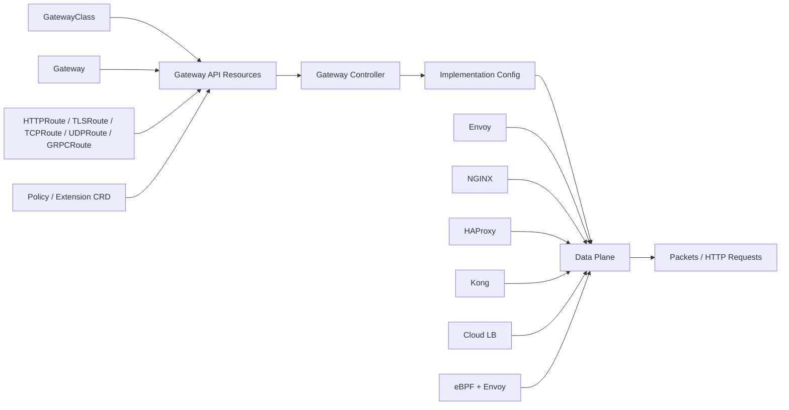
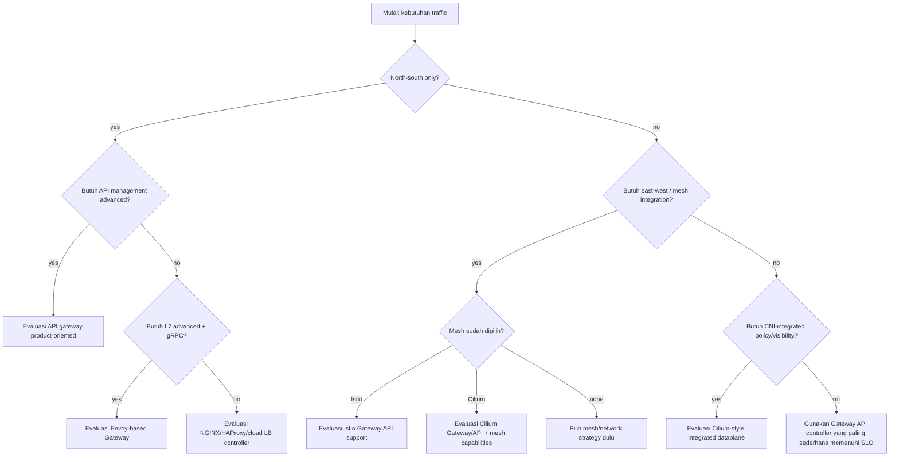
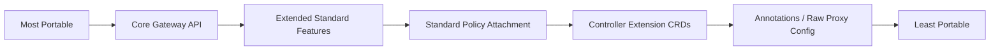
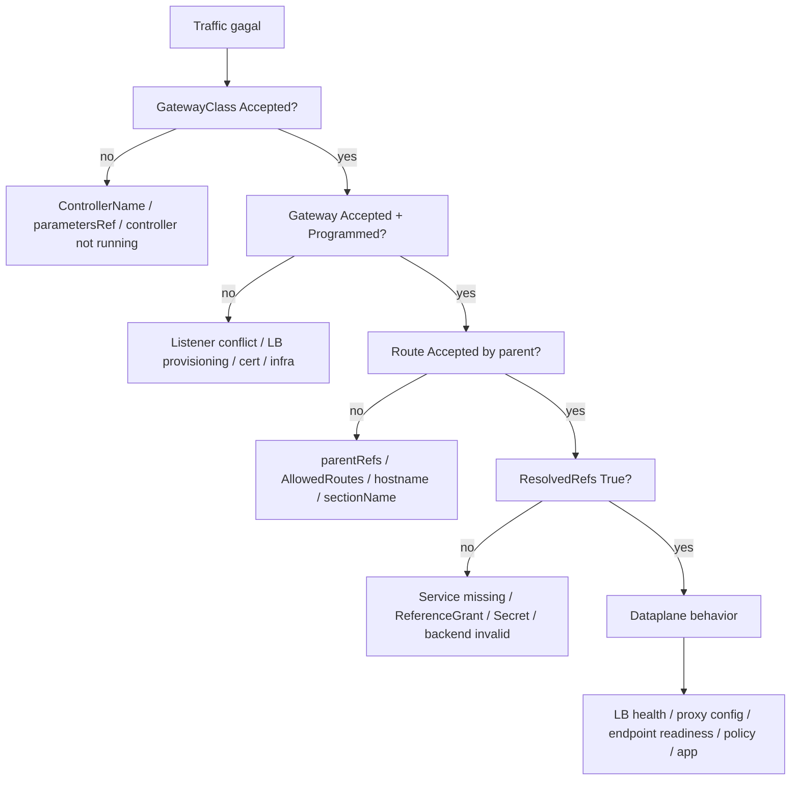
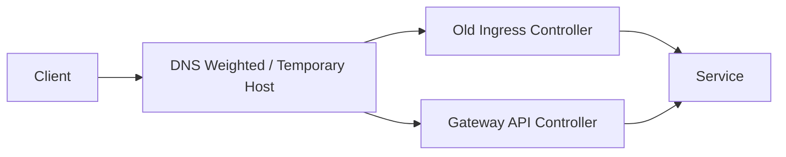

# Part 017 — Gateway API Conformance, Portability, and Controller Selection

## 1. Tujuan Part Ini

Part 016 membahas policy attachment dan platform guardrails. Sekarang kita masuk ke keputusan yang sering terlihat sederhana tetapi berdampak besar di production:

> Gateway API controller mana yang sebaiknya dipakai, bagaimana menilai portability, dan bagaimana membedakan “API-nya sama” dari “perilaku produksinya sama”.

Target part ini:

- memahami arti conformance dalam Gateway API;
- membedakan **Core**, **Extended**, dan **implementation-specific** behavior;
- membuat framework pemilihan controller;
- memahami mengapa dua controller yang sama-sama mendukung `HTTPRoute` tetap bisa sangat berbeda secara operasional;
- menghindari vendor lock-in terselubung melalui extension CRD, annotation, dan policy proprietary;
- mendesain migration path dari Ingress atau controller lama ke Gateway API;
- membaca status Gateway/Route sebagai contract, bukan dekorasi;
- membuat decision record yang bisa dipertanggungjawabkan di lingkungan platform besar.

Gateway API memberi standardisasi besar, tetapi ia bukan magic layer yang menghapus perbedaan data plane. `HTTPRoute` yang sama bisa diterjemahkan ke Envoy, NGINX, HAProxy, Kong, Traefik, cloud load balancer, atau eBPF-assisted dataplane. Control-plane intent bisa sama; dataplane behavior tetap bisa berbeda.

---

## 2. Kaufman Framing: Skill yang Harus Didekonstruksi

Untuk bagian ini, skill yang ingin kita kuasai bukan “install controller X”. Skill sebenarnya adalah:

> mampu memilih, memvalidasi, dan mengoperasikan Gateway API implementation berdasarkan feature contract, failure mode, operability, security boundary, dan lifecycle risk.

Deconstruction:

| Sub-skill | Pertanyaan yang Harus Bisa Dijawab |
|---|---|
| API literacy | Field mana yang Core, Extended, atau implementation-specific? |
| Conformance reading | Apakah controller benar-benar conformant untuk Route/profile yang dibutuhkan? |
| Data plane reasoning | Proxy/data plane apa yang mengeksekusi traffic? |
| Control plane reasoning | Bagaimana controller watch resource, render config, dan publish status? |
| Portability analysis | Bagian konfigurasi mana yang bisa dipindah antar controller tanpa rewrite? |
| Feature maturity | Fitur mana yang aman untuk production dan mana yang experimental? |
| Failure modelling | Jika controller crash, config stale, secret expired, atau route conflict, apa efeknya? |
| Governance | Siapa boleh membuat GatewayClass, Gateway, Route, Policy, Secret, dan ReferenceGrant? |
| Migration | Bagaimana pindah dari Ingress/controller lama tanpa big bang cutover? |

Deliberate practice untuk part ini:

1. ambil satu kebutuhan routing production;
2. tulis versi Gateway API yang hanya memakai Core feature;
3. tulis versi yang memakai Extended feature;
4. tulis versi yang memakai extension controller;
5. nilai konsekuensi portability, operability, dan blast radius.

---

## 3. Mental Model: Gateway API Adalah Contract, Controller Adalah Compiler

Model yang berguna:



Gateway API resource adalah **intent**. Controller adalah **compiler**. Data plane adalah **runtime**.

Jangan hanya bertanya:

> “Apakah controller ini support Gateway API?”

Tanya:

> “Untuk profile, Route type, filter, policy, TLS behavior, status behavior, failure handling, observability, dan upgrade path yang saya butuhkan, apakah controller ini memberi contract yang cukup stabil?”

Ini penting karena conformance tidak selalu berarti semua fitur Gateway API didukung. Conformance terkait profile dan Route type tertentu. Extended feature juga harus dilihat eksplisit.

---

## 4. Core, Extended, dan Implementation-Specific

Gateway API membedakan tingkat dukungan feature. Secara praktis:

| Level | Makna Praktis | Cara Berpikir |
|---|---|---|
| Core | Bagian utama API yang diharapkan portable dalam profile tertentu | Aman sebagai baseline lintas implementation |
| Extended | Fitur standar tetapi tidak wajib untuk semua implementation | Perlu cek conformance report/controller docs |
| Implementation-specific | Fitur di luar standard atau extension milik controller | Kuat, tetapi mengurangi portability |

Contoh:

- `HTTPRoute` path/host matching biasanya menjadi baseline penting.
- Beberapa filter atau lokasi filter bisa memiliki support level berbeda.
- `ExtensionRef` pada filter adalah implementation-specific.
- Policy seperti auth, rate limit, WAF, advanced retry, dan custom logging sering berada di extension CRD controller.

Kesalahan umum:

```txt
Controller mendukung HTTPRoute
=> berarti semua filter HTTPRoute support
=> berarti semua behavior sama dengan controller lain
=> berarti YAML portable
```

Yang benar:

```txt
Controller mendukung profile + route type tertentu
=> cek Core test yang lulus
=> cek Extended feature yang diklaim
=> cek controller-specific extension yang dipakai
=> cek behavior runtime, status, observability, upgrade, dan rollback
```

---

## 5. Conformance: Apa yang Dijamin dan Tidak Dijamin

Conformance test Gateway API membuat resource seperti Gateway dan Route untuk `GatewayClass` tertentu, lalu menguji apakah implementation sesuai spesifikasi. Ini sangat berguna, tetapi jangan salah tafsir.

Conformance membantu menjawab:

- apakah controller mengikuti API contract untuk capability yang diklaim;
- apakah Core feature pada profile tertentu bekerja sesuai ekspektasi;
- apakah Extended feature yang diklaim benar-benar lulus test;
- apakah implementation cukup serius mengikuti evolusi Gateway API.

Conformance tidak sepenuhnya menjawab:

- apakah latency data plane cocok untuk workload Anda;
- apakah memory footprint acceptable;
- apakah controller scaling cocok untuk jumlah route Anda;
- apakah observability cukup untuk incident response;
- apakah extension policy controller kompatibel dengan governance internal;
- apakah upgrade path aman;
- apakah behavior cloud integration cocok dengan network topology Anda;
- apakah operational model cocok dengan tim Anda.

Conformance adalah **minimum evidence**, bukan full production certification.

---

## 6. Profile Thinking

Jangan menilai controller secara global. Nilai berdasarkan profile dan use case.

Contoh profile praktis:

| Profile | Kebutuhan | Route Type Utama | Pertanyaan |
|---|---|---|---|
| Public HTTP ingress | API publik, web app, TLS termination | `HTTPRoute` | Apakah redirect, rewrite, header, timeout, mirroring dibutuhkan? |
| Public gRPC ingress | gRPC API eksternal | `GRPCRoute` atau `HTTPRoute` dengan HTTP/2 | Apakah HTTP/2, ALPN, health check, dan backend protocol jelas? |
| TLS passthrough | Termination di app/backend | `TLSRoute` | Apakah SNI-only routing cukup? |
| TCP exposure | Database/broker/private protocol | `TCPRoute` | Apakah connection draining dan source IP behavior jelas? |
| UDP exposure | DNS/game/telemetry/custom UDP | `UDPRoute` | Apakah observability dan timeout model cukup? |
| Mesh routing | Service-to-service routing | GAMMA/mesh profile | Apakah implementation mendukung internal route attachment? |
| API gateway | Auth, rate limit, transformation, developer API | Gateway API + extension | Seberapa banyak proprietary policy yang masuk? |

Jika profile Anda “public HTTP API with auth, rate limit, JWT, CORS, request transform, external auth, observability, WAF”, maka Core `HTTPRoute` saja tidak cukup. Anda sedang memilih API gateway platform, bukan hanya Gateway API controller.

---

## 7. Controller Selection: Dimensi yang Harus Dinilai

Gunakan matriks berikut untuk architecture review.

| Dimensi | Pertanyaan Kunci | Bukti yang Dibutuhkan |
|---|---|---|
| Conformance | Route/profile apa yang lulus? | Conformance report, docs, test sendiri |
| Data plane | Proxy apa yang menjalankan traffic? | Architecture docs, runtime inspection |
| Feature coverage | Core/Extended apa yang didukung? | Feature matrix |
| Extension model | Extension CRD/annotation apa yang diperlukan? | API docs, examples |
| Security | TLS, mTLS, auth, secret handling, policy boundary? | Threat model, RBAC, audit |
| Reliability | Hot reload, config rejection, fail closed/open? | Failure test |
| Observability | Metrics, logs, traces, status conditions? | Dashboard/runbook |
| Performance | Latency, throughput, config push time? | Load test |
| Scale | Route count, gateway count, endpoint count? | Scale test |
| Multi-tenancy | Namespace delegation, hostname ownership, policy inheritance? | RBAC/admission design |
| Upgrade | Gateway API version compatibility? | Release matrix |
| Ecosystem | cert-manager, ExternalDNS, Argo Rollouts, Flagger, mesh integration? | Integration docs |
| Team fit | Apakah tim sudah paham dataplane-nya? | Operational readiness |
| Cost | CPU/memory/proxy count/cross-zone traffic/logging? | Cost model |

Prinsip:

> Pilih controller berdasarkan failure model dan operational fit, bukan berdasarkan demo YAML paling singkat.

---

## 8. Controller Families

Bagian ini bukan ranking mutlak. Ini mental model untuk membedakan keluarga implementation.

### 8.1 Envoy-Based Gateway

Contoh: Envoy Gateway, Istio ingress gateway, kgateway/Gloo-style implementation, beberapa platform API gateway modern.

Karakter umum:

- kuat di L7 HTTP/gRPC;
- cocok untuk advanced routing;
- banyak fitur reliability/security/observability;
- konfigurasi runtime biasanya dikompilasi ke Envoy/xDS atau model sejenis;
- sangat powerful tetapi operational surface juga besar.

Cocok jika:

- Anda butuh HTTP/gRPC routing kaya;
- butuh mTLS, external auth, JWT, traffic shaping, mirroring, advanced telemetry;
- sudah siap mengoperasikan proxy L7 modern;
- service mesh atau Envoy-based ecosystem sudah menjadi bagian platform.

Risiko:

- config complexity;
- resource overhead;
- xDS/config push issue;
- extension CRD bisa mengunci ke satu implementation;
- tim harus paham Envoy behavior, bukan hanya Kubernetes YAML.

### 8.2 NGINX/HAProxy-Style Gateway

Karakter umum:

- matang untuk ingress/reverse proxy;
- simple dan familiar;
- operational model sering lebih mudah dipahami;
- bisa sangat stabil untuk HTTP ingress umum;
- advanced service mesh semantics biasanya bukan fokus utama.

Cocok jika:

- use case mostly HTTP ingress;
- organisasi sudah berpengalaman dengan NGINX/HAProxy;
- butuh simplicity dan predictable reverse proxy behavior;
- tidak butuh mesh-like policy di Gateway layer.

Risiko:

- advanced Gateway API features mungkin tidak selengkap Envoy-based implementation;
- extension behavior berbeda;
- dynamic reload/config update behavior perlu diuji;
- beberapa L7 modern feature bisa membutuhkan proprietary config.

### 8.3 API Gateway Product-Oriented

Contoh: Kong, Gloo/Kgateway, enterprise API gateway variants.

Karakter umum:

- fokus pada API management;
- plugin ecosystem kuat;
- auth, rate limit, transformation, developer portal, analytics bisa menjadi selling point;
- Gateway API sering menjadi salah satu front-door configuration model.

Cocok jika:

- platform Anda bukan hanya routing, tetapi API product management;
- butuh API key, OAuth/OIDC, JWT, rate limit, quota, request/response plugin;
- developer experience dan governance API menjadi prioritas.

Risiko:

- semakin banyak plugin digunakan, semakin rendah portability;
- licensing/cost;
- operational boundary antara Kubernetes platform dan API platform bisa kabur;
- policy semantics bisa sangat product-specific.

### 8.4 CNI/eBPF-Integrated Gateway

Contoh: Cilium Gateway API.

Karakter umum:

- Gateway API terintegrasi dengan CNI dataplane dan policy;
- bisa memberi source identity/flow visibility yang kuat;
- cocok jika Cilium sudah menjadi network/security foundation;
- Envoy dapat digunakan untuk L7 behavior, sementara eBPF menangani dataplane tertentu.

Cocok jika:

- Anda memakai Cilium sebagai CNI utama;
- ingin integrasi Gateway, NetworkPolicy, observability, dan service mesh/eBPF ecosystem;
- butuh L3/L4/L7 visibility dalam satu platform.

Risiko:

- coupling ke CNI choice;
- debugging memerlukan pemahaman Kubernetes + eBPF + Envoy;
- migration keluar bisa lebih sulit karena Gateway bukan komponen berdiri sendiri;
- separation of concerns antara network team dan platform team harus jelas.

### 8.5 Cloud Provider Gateway/LB Controller

Karakter umum:

- Gateway API diterjemahkan ke managed cloud load balancer;
- operational burden proxy bisa berkurang;
- integrasi IAM/cert/WAF/cloud networking kuat;
- behavior mengikuti cloud provider.

Cocok jika:

- target utama adalah managed ingress;
- organisasi mengutamakan cloud-native integration;
- tidak ingin mengoperasikan proxy sendiri;
- fitur yang dibutuhkan tersedia di managed LB.

Risiko:

- portability cloud rendah;
- provisioning bisa lambat;
- cost model load balancer/LCU/rule/cross-zone perlu dihitung;
- tidak semua fitur Gateway API cocok dengan cloud LB semantics;
- debugging melibatkan Kubernetes dan cloud control plane.

---

## 9. GatewayClass sebagai Boundary Keputusan

`GatewayClass` bukan hanya nama controller. Ia adalah contract antara platform dan user.

Contoh:

```yaml
apiVersion: gateway.networking.k8s.io/v1
kind: GatewayClass
metadata:
  name: public-envoy
spec:
  controllerName: gateway.envoyproxy.io/gatewayclass-controller
```

Di platform besar, jangan hanya punya satu GatewayClass universal. Lebih defensible jika GatewayClass merepresentasikan kelas layanan.

Contoh desain:

| GatewayClass | Tujuan | Exposure | Owner | Guardrail |
|---|---|---|---|---|
| `public-api` | Public API ingress | Internet | Platform edge team | TLS wajib, WAF, auth policy |
| `public-web` | Public web app | Internet | Platform edge team | CDN-friendly, cache header guardrail |
| `private-api` | Internal corporate API | Private network | Platform team | mTLS/private LB |
| `partner-api` | Partner integration | Restricted external | API platform team | rate limit, audit, allowlist |
| `mesh-internal` | East-west mesh route | Cluster/internal | Mesh team | identity-based auth |
| `tcp-private` | TCP private service | Private network | Network team | explicit approval |

Anti-pattern:

```txt
Semua workload pakai GatewayClass default yang sama,
semua behavior dikontrol dengan annotation,
dan siapa pun bisa membuat Gateway internet-facing.
```

Ini bukan self-service; ini blast radius generator.

---

## 10. Decision Tree Pemilihan Controller



Aturan praktis:

- Jika kebutuhan Anda hanya HTTP ingress sederhana, jangan memilih platform paling kompleks hanya karena terlihat modern.
- Jika kebutuhan Anda public API dengan auth/rate limit/audit, jangan berpura-pura `HTTPRoute` Core sudah cukup.
- Jika organisasi sudah punya service mesh, pertimbangkan konsistensi Gateway dan mesh routing.
- Jika CNI menjadi security enforcement utama, Gateway yang terintegrasi dengan CNI bisa mengurangi fragmentasi visibility.
- Jika cloud managed LB sudah memenuhi kebutuhan, jangan operasikan proxy sendiri tanpa alasan kuat.

---

## 11. Portability Spectrum

Tidak semua YAML Gateway API sama-sama portable.



Contoh:

| Konfigurasi | Portability |
|---|---|
| `HTTPRoute` hostname + path + Service backend | Tinggi |
| Weighted backend | Umumnya baik, tetap cek support |
| Request header modifier | Cek support level/lokasi filter |
| Request mirroring | Extended; cek controller |
| Backend TLS policy | Cek versi/support |
| Rate limit via custom CRD | Controller-specific |
| JWT auth via custom policy | Controller-specific |
| Lua/WASM/custom plugin | Sangat implementation-specific |
| Raw EnvoyFilter | Sangat rendah |

Portability bukan binary. Ia spektrum.

Good engineering bukan menghindari semua extension. Good engineering adalah **sadar kapan extension dipakai dan mencatat konsekuensinya**.

---

## 12. Feature Maturity Matrix

Gunakan matrix berikut sebelum mengizinkan feature dipakai luas.

| Feature | API Level | Runtime Risk | Governance Risk | Production Decision |
|---|---:|---:|---:|---|
| Host/path routing | Core | Rendah | Rendah | Default allowed |
| TLS termination | Core/standard behavior | Medium | Medium | Allowed dengan cert policy |
| Weighted backend | Standard/umum | Medium | Medium | Allowed untuk rollout dengan guardrail |
| Header rewrite | Extended/varies | Medium | Medium | Allowed setelah conformance test |
| Request mirror | Extended | Tinggi | Tinggi | Restricted; block write mirror |
| Backend TLS verification | Standard/policy-dependent | Medium | Tinggi | Required untuk sensitive backend |
| External auth | Extended/implementation-specific | Tinggi | Tinggi | Centralized policy only |
| Rate limit | Implementation-specific | Medium | Tinggi | Central platform policy |
| WAF | Implementation/cloud-specific | Medium | Tinggi | Edge-owned |
| Raw proxy customization | Implementation-specific | Sangat tinggi | Sangat tinggi | Exception process only |

Rule:

> Feature yang mengubah security, availability, atau data exposure tidak boleh menjadi per-Route free-for-all.

---

## 13. Status Semantics sebagai API Contract

Gateway API status bukan kosmetik. Status adalah feedback loop.

Minimal yang harus dimonitor:

- `GatewayClass.status.conditions`;
- `Gateway.status.conditions`;
- `Gateway.status.listeners[*].conditions`;
- `HTTPRoute.status.parents[*].conditions`;
- `ResolvedRefs`;
- `Accepted`;
- `Programmed`;
- route attachment status;
- reason/message dari controller.

Contoh workflow:

```bash
kubectl get gatewayclass
kubectl describe gatewayclass public-api

kubectl get gateway -A
kubectl describe gateway -n platform public-gw

kubectl get httproute -A
kubectl describe httproute -n payments payments-api
```

Jangan debug Gateway API hanya dari response `curl`. Pertama validasi apakah controller menerima dan memprogram intent.

Status-driven debugging:



---

## 14. Controller Lifecycle Risk

Controller selection tidak selesai saat install berhasil.

Anda harus menjawab lifecycle questions:

1. Gateway API version apa yang didukung controller ini?
2. Apakah CRD upgrade backward compatible untuk resource Anda?
3. Apakah controller release matrix jelas terhadap Kubernetes version?
4. Bagaimana rollback jika controller upgrade merusak config rendering?
5. Apakah data plane ikut restart saat control plane upgrade?
6. Apakah config lama tetap melayani traffic jika controller down?
7. Apakah secret/cert rotation tetap berjalan jika controller degraded?
8. Apakah status stale bisa dideteksi?
9. Apakah controller mendukung multi-replica HA?
10. Apakah ada leader election?
11. Bagaimana disaster recovery GatewayClass/Gateway/Route resource?
12. Apakah ada conversion webhook risk saat upgrade CRD?

Failure mode nyata:

```txt
CRD upgraded -> controller belum kompatibel -> status update gagal -> route terlihat ada tetapi tidak diprogram -> app team mengubah backend sembarangan -> incident makin parah.
```

Mitigasi:

- staging conformance suite;
- canary controller upgrade;
- snapshot resource sebelum upgrade;
- pinned CRD version;
- release note review;
- synthetic route checks;
- rollback plan;
- strict owner untuk GatewayClass.

---

## 15. Multi-Controller dalam Satu Cluster

Gateway API memungkinkan lebih dari satu implementation di cluster yang sama. Ini powerful, tapi mudah menjadi kacau.

Contoh:

```yaml
kind: GatewayClass
metadata:
  name: public-envoy
spec:
  controllerName: gateway.envoyproxy.io/gatewayclass-controller
---
kind: GatewayClass
metadata:
  name: internal-cilium
spec:
  controllerName: io.cilium/gateway-controller
```

Potensi use case:

- public API lewat Envoy Gateway;
- private internal Gateway lewat Cilium;
- legacy ingress migration lewat controller lama;
- partner API lewat API gateway product.

Risiko:

- controller saling menulis status pada resource yang tidak seharusnya;
- user salah memilih GatewayClass;
- DNS/certificate automation bingung;
- ExternalDNS membuat record untuk Gateway yang salah;
- observability dashboard fragmented;
- cloud load balancer cost meledak;
- policy guardrail tidak konsisten.

Guardrail:

- GatewayClass naming eksplisit;
- RBAC restrict `GatewayClass` creation;
- admission policy membatasi namespace mana boleh memakai GatewayClass apa;
- label/annotation ownership standard;
- status monitor per controller;
- documentation per traffic class;
- cost allocation per GatewayClass.

---

## 16. Extension CRD: Kapan Boleh Dipakai?

Extension CRD bukan dosa. Dalam production, Anda sering butuh fitur yang belum distandardisasi.

Yang salah adalah memakai extension tanpa sadar bahwa Anda sedang keluar dari portability zone.

Decision rule:

```txt
Gunakan Core Gateway API untuk routing intent.
Gunakan Standard/Extended feature jika sudah cukup.
Gunakan extension CRD hanya untuk platform capability yang jelas:
- auth;
- rate limit;
- WAF;
- advanced retry;
- API key;
- custom metrics;
- plugin;
- cloud-specific behavior.
```

Setiap extension harus punya record:

```md
# Gateway Extension Decision Record

- Extension: SecurityPolicy / RateLimitPolicy / EnvoyPatchPolicy / PluginConfig
- Controller: ...
- Owner: Platform Edge Team
- Reason: ...
- Standard alternative: ...
- Portability impact: low/medium/high
- Failure mode: ...
- Rollback: ...
- Allowed namespaces: ...
- Review date: ...
```

Jika tidak bisa menulis record ini, belum layak production-wide.

---

## 17. Migration dari Ingress ke Gateway API

Jangan migrasi dengan pendekatan “replace all Ingress with HTTPRoute”. Migration yang baik memisahkan traffic class.

### 17.1 Inventory

Kumpulkan:

- semua Ingress;
- IngressClass;
- annotations;
- TLS secret;
- host/path;
- backend service;
- auth/rate limit/rewrite annotation;
- external DNS record;
- cert-manager issuer;
- traffic volume;
- criticality;
- owner namespace;
- rollback mechanism.

### 17.2 Classify

| Kategori | Contoh | Migration Strategy |
|---|---|---|
| Simple host/path | web app biasa | Convert ke `HTTPRoute` Core |
| TLS + redirect | HTTPS public app | Gateway listener + HTTPRoute redirect |
| Rewrite/header | API path rewrite | Cek Extended support |
| Auth/rate limit | API eksternal | Controller extension/policy needed |
| gRPC | gRPC service | `GRPCRoute` atau HTTP/2 config |
| TCP/UDP | non-HTTP | `TCPRoute`/`UDPRoute` atau Service LB |
| Exotic annotation | raw config/snippet | Redesign, jangan translasi buta |

### 17.3 Parallel Run

Pattern:



Gunakan:

- temporary hostname;
- shadow route jika aman;
- weighted DNS jika cocok;
- canary host;
- synthetic probe;
- access log comparison;
- error-rate comparison;
- rollback DNS/LB.

### 17.4 Do Not Blindly Translate Annotation

Annotation lama sering merepresentasikan hidden behavior.

Contoh:

```yaml
nginx.ingress.kubernetes.io/proxy-read-timeout: "60"
nginx.ingress.kubernetes.io/rewrite-target: /$1
nginx.ingress.kubernetes.io/auth-url: https://auth.example.com/check
```

Sebelum translasi, tanyakan:

- ini routing, policy, atau proxy tuning?
- apakah Gateway API standard mendukungnya?
- apakah controller baru punya equivalent?
- apakah default behavior berubah?
- apakah app bergantung pada behavior lama?
- apakah test mencakup redirect/rewrite/auth failure?

---

## 18. Production Validation Plan

Sebelum controller dipakai luas, jalankan validation plan.

### 18.1 API Validation

- install CRD versi target;
- create GatewayClass;
- create Gateway;
- create HTTPRoute basic;
- create TLS route;
- create weighted route;
- create route conflict;
- create invalid backend;
- create cross-namespace case;
- lihat status condition.

### 18.2 Dataplane Validation

- request latency baseline;
- throughput baseline;
- connection reuse;
- HTTP/2/gRPC;
- TLS termination;
- source IP behavior;
- backend health;
- endpoint readiness transition;
- pod drain;
- node drain;
- gateway pod restart;
- controller restart.

### 18.3 Failure Validation

- backend service deleted;
- endpoint removed;
- TLS secret deleted;
- invalid cert;
- route conflict;
- ReferenceGrant removed;
- controller scaled to zero;
- data plane proxy killed;
- cloud LB health check fails;
- DNS points to old/new gateway;
- policy extension invalid.

### 18.4 Observability Validation

- per route request rate;
- per route error rate;
- latency histogram;
- upstream reset/error;
- TLS handshake failure;
- route rejected metric;
- config push error;
- access log includes route/service identity;
- trace propagation preserved;
- dashboard by GatewayClass/Gateway/Route/namespace.

---

## 19. Decision Matrix Contoh

Gunakan scoring 1–5. Jangan jadikan angka sebagai kebenaran absolut; angka memaksa diskusi eksplisit.

| Criteria | Weight | Envoy Gateway | Istio Gateway | Cilium Gateway | Kong | NGINX/HAProxy | Cloud LB |
|---|---:|---:|---:|---:|---:|---:|---:|
| Gateway API conformance | 5 |  |  |  |  |  |  |
| HTTP/gRPC feature depth | 5 |  |  |  |  |  |  |
| API management | 4 |  |  |  |  |  |  |
| Mesh integration | 4 |  |  |  |  |  |  |
| CNI/policy integration | 4 |  |  |  |  |  |  |
| Operational simplicity | 5 |  |  |  |  |  |  |
| Observability | 5 |  |  |  |  |  |  |
| Upgrade safety | 5 |  |  |  |  |  |  |
| Extension portability | 4 |  |  |  |  |  |  |
| Team familiarity | 5 |  |  |  |  |  |  |
| Cost | 3 |  |  |  |  |  |  |
| Vendor risk | 3 |  |  |  |  |  |  |

Interpretation:

- skor tinggi di feature depth tetapi rendah di team familiarity = training/runbook wajib;
- skor tinggi di API management tetapi rendah di portability = extension lock-in diterima secara sadar;
- skor tinggi di cloud integration tetapi rendah di portability = cocok untuk single-cloud strategy;
- skor tinggi di simplicity tetapi rendah di advanced policy = cocok untuk basic ingress, bukan API platform.

---

## 20. Architecture Decision Record Template

```md
# ADR: Gateway API Controller Selection

## Context

We need a Kubernetes-native traffic entrypoint for ...

## Requirements

- Public/private exposure:
- Protocols:
- TLS model:
- Auth/rate limit:
- Canary/traffic splitting:
- Observability:
- Multi-tenancy:
- Gateway API version:
- Kubernetes version:
- Expected route count:
- Expected RPS:
- Availability target:

## Options Considered

1. Envoy Gateway
2. Istio Gateway API
3. Cilium Gateway API
4. Kong
5. NGINX/HAProxy
6. Cloud provider Gateway/LB controller

## Evaluation

| Criteria | Option A | Option B | Option C |
|---|---:|---:|---:|
| Conformance |  |  |  |
| Feature coverage |  |  |  |
| Operability |  |  |  |
| Security |  |  |  |
| Observability |  |  |  |
| Portability |  |  |  |
| Cost |  |  |  |

## Decision

We choose ...

## Consequences

Positive:

- ...

Negative:

- ...

Mitigations:

- ...

## Exit Strategy

If this controller no longer meets requirements, we can migrate by ...
```

---

## 21. Anti-Patterns

### Anti-Pattern 1 — “Conformant Means Equivalent”

Dua controller conformant bisa berbeda pada:

- Extended feature;
- proxy implementation;
- default timeout;
- reload behavior;
- status precision;
- observability;
- cloud LB integration;
- policy extension.

### Anti-Pattern 2 — “One GatewayClass for Everything”

Public API, internal service, partner endpoint, and experimental route tidak seharusnya semua memakai class yang sama.

### Anti-Pattern 3 — “App Team Owns Security Policy”

App team boleh mendefinisikan route untuk aplikasinya. Tetapi global auth, public exposure, TLS baseline, and rate limit harus punya guardrail platform/security.

### Anti-Pattern 4 — “Raw Proxy Escape Hatch Everywhere”

EnvoyFilter, NGINX snippet, custom plugin, dan raw config berguna, tetapi harus exception-based. Jika menjadi default, Gateway API kehilangan value sebagai shared contract.

### Anti-Pattern 5 — “No Status Monitoring”

Route rejected selama 30 menit tetapi alert hanya melihat 5xx. Ini telat. Status condition harus masuk control-plane observability.

### Anti-Pattern 6 — “Migrasi Annotation Buta”

Annotation lama adalah behavior lama. Translasi harus lewat semantics, bukan string mapping.

---

## 22. Practical Lab

### Lab 1 — Minimal Portable Route

Buat `Gateway` dan `HTTPRoute` yang hanya memakai baseline portable.

```yaml
apiVersion: gateway.networking.k8s.io/v1
kind: Gateway
metadata:
  name: public-gw
  namespace: platform
spec:
  gatewayClassName: public-api
  listeners:
    - name: http
      protocol: HTTP
      port: 80
      hostname: "api.example.com"
      allowedRoutes:
        namespaces:
          from: Selector
          selector:
            matchLabels:
              gateway-access: public
---
apiVersion: gateway.networking.k8s.io/v1
kind: HTTPRoute
metadata:
  name: payments
  namespace: payments
spec:
  parentRefs:
    - name: public-gw
      namespace: platform
      sectionName: http
  hostnames:
    - "api.example.com"
  rules:
    - matches:
        - path:
            type: PathPrefix
            value: /payments
      backendRefs:
        - name: payments-api
          port: 8080
```

Checklist:

```bash
kubectl describe gateway -n platform public-gw
kubectl describe httproute -n payments payments
kubectl get httproute -n payments payments -o jsonpath='{.status.parents[*].conditions}'
```

### Lab 2 — Add One Extended Feature

Tambahkan weighted backend atau request header modifier. Catat apakah controller mendukungnya.

```yaml
backendRefs:
  - name: payments-api-v1
    port: 8080
    weight: 90
  - name: payments-api-v2
    port: 8080
    weight: 10
```

Pertanyaan:

- apakah status berubah?
- apakah traffic benar-benar terbagi?
- apakah sticky session mengubah distribusi?
- apakah metrics per backend tersedia?

### Lab 3 — Controller-Specific Extension

Tambahkan satu policy extension dari controller Anda, misalnya auth/rate-limit. Buat catatan:

- resource kind;
- owner;
- portability impact;
- failure mode;
- rollback;
- default behavior jika policy invalid.

---

## 23. Production Readiness Checklist

Sebelum Gateway API controller menjadi platform default:

- [ ] Gateway API CRD version dipin dan terdokumentasi.
- [ ] Controller version dan compatibility matrix jelas.
- [ ] GatewayClass hanya dibuat oleh platform team.
- [ ] Namespace access ke GatewayClass dibatasi admission policy.
- [ ] Conformance report dibaca dan dibandingkan dengan kebutuhan.
- [ ] Extended feature yang dipakai tercatat.
- [ ] Extension CRD yang dipakai tercatat di ADR.
- [ ] TLS secret ownership jelas.
- [ ] cert-manager/ExternalDNS integration diuji.
- [ ] Gateway/Route status masuk monitoring.
- [ ] Data plane metrics masuk dashboard.
- [ ] Access log punya route/service identity.
- [ ] Synthetic probe per critical route.
- [ ] Failure test untuk invalid backend/cert/route conflict.
- [ ] Upgrade rollback tested.
- [ ] Cost model dibuat.
- [ ] Migration playbook dari Ingress tersedia.

---

## 24. Ringkasan

Gateway API memberi bahasa bersama untuk traffic routing Kubernetes. Tetapi bahasa bersama bukan berarti semua implementation identik.

Yang harus dibawa dari part ini:

- conformance adalah baseline evidence, bukan jaminan full production suitability;
- nilai controller berdasarkan profile dan Route type yang Anda butuhkan;
- bedakan Core, Extended, dan implementation-specific feature;
- GatewayClass adalah platform contract;
- controller selection harus memasukkan dataplane, lifecycle, observability, security, dan team fit;
- extension CRD boleh dipakai, tetapi harus dicatat sebagai portability trade-off;
- migration dari Ingress harus berbasis semantics, bukan annotation translation;
- status conditions adalah feedback loop utama control plane.

Jika Part 010–016 membangun pemahaman API, Part 017 membangun judgement: kapan sebuah Gateway API platform layak dipakai untuk production.

---

## 25. Referensi

- Kubernetes Gateway API — Concepts and API overview: https://gateway-api.sigs.k8s.io/docs/concepts/api-overview/
- Gateway API — Conformance: https://gateway-api.sigs.k8s.io/concepts/conformance/
- Gateway API — Implementations list: https://gateway-api.sigs.k8s.io/docs/implementations/list/
- Gateway API — v1.4 implementation conformance report tables: https://gateway-api.sigs.k8s.io/docs/implementations/versions/v1.4/
- Gateway API — API reference: https://gateway-api.sigs.k8s.io/reference/api-spec/main/spec/
- Kubernetes docs — Gateway API: https://kubernetes.io/docs/concepts/services-networking/gateway/
- Envoy Gateway docs: https://gateway.envoyproxy.io/docs/
- Istio Gateway API docs: https://istio.io/latest/docs/tasks/traffic-management/ingress/gateway-api/
- Cilium Gateway API docs: https://docs.cilium.io/en/latest/network/servicemesh/gateway-api/gateway-api/
- Kong Gateway docs: https://developer.konghq.com/gateway/
