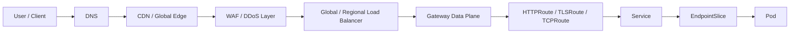
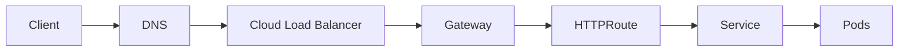
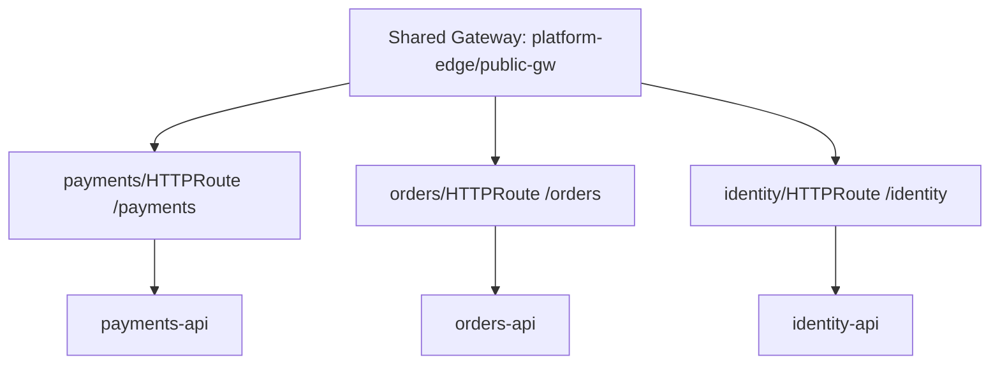
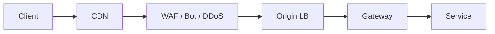
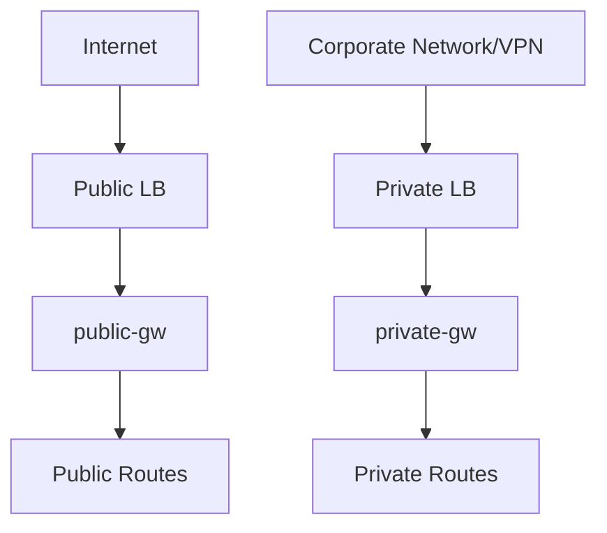
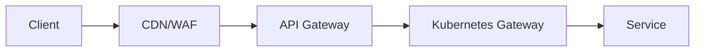
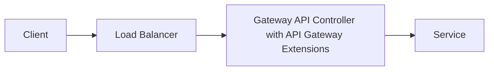
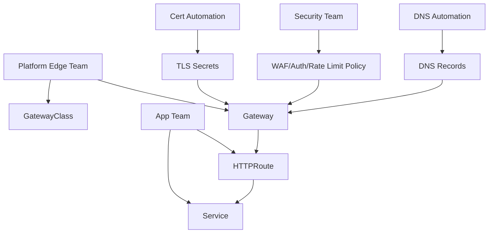
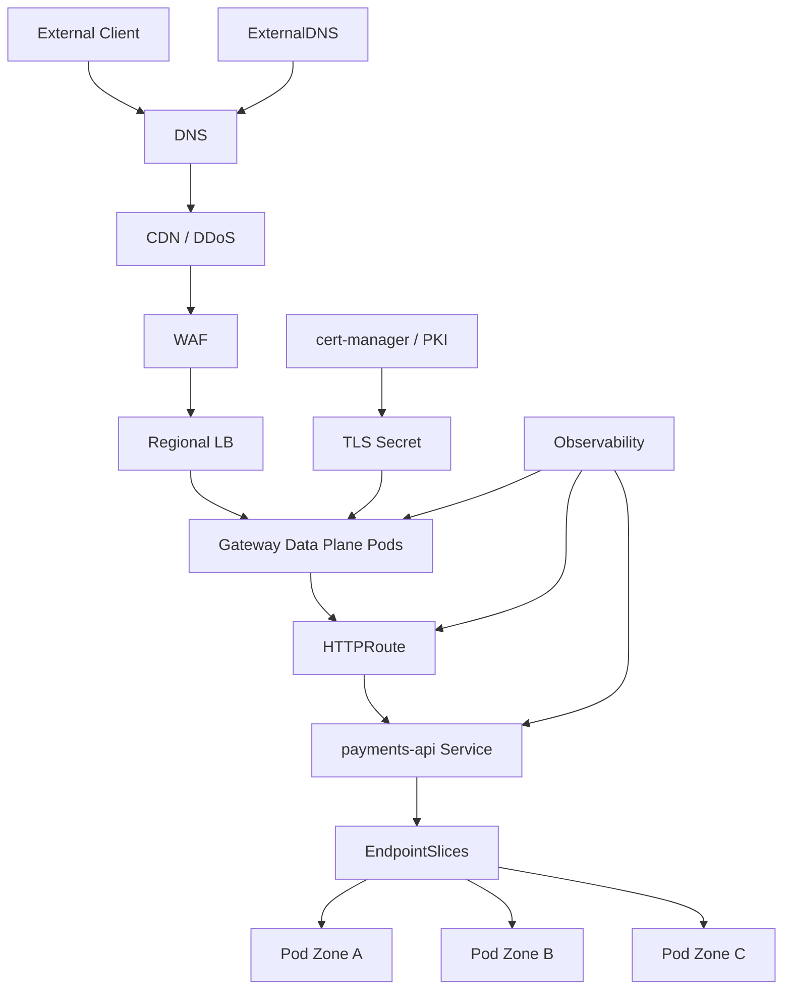

# Part 018 — North-South Traffic Engineering Patterns

## 1. Tujuan Part Ini

Part 017 membahas cara memilih Gateway API implementation secara defensible. Sekarang kita memakai Gateway API dalam konteks production edge.

Target part ini:

> Anda mampu mendesain north-south traffic path dari internet/private client menuju workload Kubernetes dengan batas kepemilikan yang jelas, TLS yang benar, exposure yang terkendali, observability yang cukup, dan failure model yang eksplisit.

North-south traffic adalah traffic yang masuk atau keluar dari boundary cluster/platform. Dalam part ini fokus kita adalah **inbound north-south**:

```txt
client / internet / partner / corporate network
  -> DNS / CDN / WAF / global LB
  -> cloud load balancer / edge proxy
  -> Kubernetes Gateway
  -> Route
  -> Service
  -> EndpointSlice
  -> Pod
```

Ini bukan sekadar “expose service”. Ini adalah public contract yang menyentuh security, reliability, compliance, cost, ownership, dan incident response.

---

## 2. Kaufman Framing: Dari YAML ke Traffic Product

Skill yang ingin dibangun:

> mampu memperlakukan ingress sebagai traffic product, bukan object YAML.

Deconstruct skill:

| Sub-skill | Fokus |
|---|---|
| Edge topology | Di mana request pertama kali masuk? DNS, CDN, WAF, LB, Gateway? |
| TLS boundary | Di mana TLS terminate, re-encrypt, atau passthrough? |
| Routing contract | Host/path/header apa yang menjadi public API contract? |
| Ownership | Siapa punya DNS, cert, Gateway, Route, policy, backend? |
| Isolation | Bagaimana mencegah satu app merusak shared edge? |
| Security | Auth, WAF, rate limit, allowlist, mTLS, audit. |
| Reliability | Health check, drain, retry, timeout, overload, failover. |
| Observability | Apa yang bisa dilihat saat incident? |
| Cost | CDN, LB, cross-zone, logs, proxy CPU, NAT/LB charges. |
| Change safety | Bagaimana route diubah tanpa outage? |

Deliberate practice:

1. pilih satu public API;
2. gambar request path end-to-end;
3. tentukan owner setiap hop;
4. tulis failure mode setiap hop;
5. tulis Gateway/HTTPRoute minimal;
6. tambahkan policy secara sadar;
7. definisikan observability dan rollback.

---

## 3. Mental Model: Edge Adalah Chain of Trust

North-south traffic path adalah chain. Setiap hop bisa mengubah request, identity, TLS state, source IP, headers, dan failure semantics.



Pada setiap hop, tanyakan:

- apakah hop ini terminasi TLS?
- apakah hop ini menambahkan atau menghapus header?
- apakah hop ini punya health check sendiri?
- apakah hop ini bisa retry?
- apakah hop ini bisa cache?
- apakah hop ini bisa rate limit?
- apakah hop ini mengubah source IP?
- apakah hop ini punya log yang bisa dikorelasikan?
- apakah hop ini fail open atau fail closed?

Incident sering terjadi bukan karena satu komponen rusak, tetapi karena asumsi antar hop tidak konsisten.

Contoh:

```txt
CDN retry 3x
+ Gateway retry 2x
+ application retry DB 3x
= satu request user bisa menjadi 18 operasi backend.
```

---

## 4. Pattern 1 — Simple Public HTTP Gateway

Use case:

- public web/API sederhana;
- TLS terminate di Gateway;
- routing berdasarkan host/path;
- no advanced API management.



Gateway:

```yaml
apiVersion: gateway.networking.k8s.io/v1
kind: Gateway
metadata:
  name: public-gw
  namespace: platform-edge
spec:
  gatewayClassName: public-api
  listeners:
    - name: https
      protocol: HTTPS
      port: 443
      hostname: "api.example.com"
      tls:
        mode: Terminate
        certificateRefs:
          - kind: Secret
            name: api-example-com-tls
      allowedRoutes:
        namespaces:
          from: Selector
          selector:
            matchLabels:
              edge-access: public
```

Route:

```yaml
apiVersion: gateway.networking.k8s.io/v1
kind: HTTPRoute
metadata:
  name: payments-public
  namespace: payments
spec:
  parentRefs:
    - name: public-gw
      namespace: platform-edge
      sectionName: https
  hostnames:
    - "api.example.com"
  rules:
    - matches:
        - path:
            type: PathPrefix
            value: /payments
      backendRefs:
        - name: payments-api
          port: 8080
```

Operational contract:

| Concern | Decision |
|---|---|
| DNS | points to LB/Gateway address |
| TLS | terminate at Gateway |
| Route owner | app namespace |
| Gateway owner | platform edge team |
| Cert owner | platform/security or cert-manager automation |
| Logs | Gateway access logs plus app logs |
| Rollback | remove/disable HTTPRoute or change DNS/LB target |

Failure modes:

- Gateway accepted but not programmed;
- TLS secret missing or invalid;
- route not attached because namespace label missing;
- Service has no ready endpoint;
- LB health check passes but backend route fails;
- app returns 404 because path rewrite expectation wrong.

---

## 5. Pattern 2 — Shared Gateway, Delegated Routes

Use case:

- banyak team memakai shared public Gateway;
- platform owns listener/TLS;
- app team owns path/host route;
- strict namespace delegation.



Gateway:

```yaml
allowedRoutes:
  namespaces:
    from: Selector
    selector:
      matchLabels:
        edge-access: public
```

Namespace:

```yaml
apiVersion: v1
kind: Namespace
metadata:
  name: payments
  labels:
    edge-access: public
    owner: payments-team
```

Why it works:

- app team tidak bisa membuat public listener sendiri;
- platform bisa membatasi namespace eligible;
- Gateway listener tetap shared;
- Route tetap self-service.

Tetapi ini belum cukup. Anda juga butuh hostname/path ownership.

Problem:

```txt
Team A membuat route /api
Team B membuat route /api/payments
Precedence dan ownership menjadi konflik.
```

Guardrail:

- admission policy untuk host/path registry;
- route naming convention;
- ownership annotation;
- approval workflow untuk public hostname;
- alert on route conflict;
- route status monitor.

Example ownership labels:

```yaml
metadata:
  labels:
    edge.company.com/exposure: public
    edge.company.com/api-family: payments
    edge.company.com/criticality: tier-1
  annotations:
    edge.company.com/owner: payments-platform
    edge.company.com/change-ticket: CHG-123456
```

---

## 6. Pattern 3 — CDN/WAF Before Gateway

Use case:

- internet-facing high-risk/public traffic;
- DDoS protection;
- WAF rules;
- cache/static acceleration;
- bot mitigation;
- edge TLS and origin TLS.



Key design decisions:

| Decision | Options | Consequence |
|---|---|---|
| TLS at CDN | terminate or passthrough | affects cert ownership and client identity |
| Origin TLS | plaintext, TLS, mTLS | affects trust boundary |
| Source IP | `X-Forwarded-For`, PROXY protocol, preserved IP | affects audit/rate limit |
| WAF ownership | security team or platform team | affects change velocity |
| Cache policy | CDN-owned or app-owned | affects correctness |
| Health check | CDN/LB/Gateway/app | false positive risk |

Origin header contract:

```txt
X-Forwarded-For: original client chain
X-Forwarded-Proto: https
X-Request-Id: stable request correlation id
X-Real-IP: trusted edge client IP if normalized
Forwarded: standardized forwarding metadata if used
```

Do not blindly trust forwarding headers from the internet. Gateway should only trust headers inserted by known upstream edge.

Policy:

```txt
At edge:
- reject direct-to-origin traffic if possible;
- allow only CDN/WAF source ranges or private connectivity;
- normalize headers;
- generate request ID if missing;
- enforce max body size;
- rate limit before app;
- log decision outcome.
```

Failure modes:

- CDN caches error response;
- WAF blocks legitimate traffic;
- origin allows bypass around WAF;
- `X-Forwarded-For` spoofed;
- CDN and Gateway both redirect HTTP->HTTPS causing loop;
- health check path bypasses auth and hides app failure;
- bot mitigation injects JS challenge breaking API clients.

---

## 7. Pattern 4 — Public and Private Gateway Separation

Do not mix public and private exposure casually.



Separation options:

| Level | Separation |
|---|---|
| GatewayClass | `public-api` vs `private-api` |
| Gateway resource | different Gateway objects |
| Namespace | `platform-public-edge` vs `platform-private-edge` |
| Load balancer | public LB vs internal LB |
| Network | public subnet vs private subnet |
| Controller | same or different controller |
| Policy | public stricter, private identity-aware |

Anti-pattern:

```txt
One Gateway with public and private listeners,
plus app teams attach routes freely,
plus no admission policy.
```

Better:

- public GatewayClass restricts allowed namespaces;
- private GatewayClass separate;
- public route requires approval label;
- private route requires network classification;
- public and private cert issuance separated;
- DNS zone ownership separated.

---

## 8. Pattern 5 — API Gateway Layer vs Kubernetes Gateway

Not every Gateway API controller is a full API management platform.

Distinguish:

| Layer | Primary Job |
|---|---|
| Kubernetes Gateway | Kubernetes-native traffic attachment, listener, route, backend binding |
| API Gateway | API product controls: auth, keys, quotas, plans, developer onboarding, transformations |
| Service Mesh | service-to-service identity, mTLS, traffic policy, telemetry |
| WAF/CDN | edge protection, caching, DDoS, bot mitigation |

Possible architecture:



Or combined:



Selection rule:

- If you only need routing/TLS/basic traffic management, Kubernetes Gateway may be enough.
- If you need API keys, quotas, developer portal, monetization, product analytics, and plugin ecosystem, you are in API gateway territory.
- If you need service-to-service mTLS and internal authorization, mesh may be the better control point.

Bad design smell:

```txt
Every concern is placed at the public Gateway because it is the only shared network component.
```

This creates a giant edge monolith.

---

## 9. TLS Strategy for North-South Traffic

TLS decision is trust-boundary decision.

### 9.1 Edge Termination

```txt
Client --TLS--> Gateway --plaintext--> Service
```

Pros:

- simple;
- Gateway can inspect HTTP;
- common for internal trusted clusters.

Cons:

- plaintext inside cluster;
- weaker for regulated/sensitive traffic;
- backend cannot verify client identity unless propagated separately.

### 9.2 Re-Encryption

```txt
Client --TLS--> Gateway --TLS--> Service
```

Pros:

- encryption on both segments;
- Gateway can inspect HTTP;
- backend TLS verification possible.

Cons:

- certificate/trust management more complex;
- backend protocol configuration required;
- debugging TLS failure can be harder.

### 9.3 Passthrough

```txt
Client --TLS--> Gateway --TLS passthrough--> Service
```

Pros:

- backend terminates TLS;
- Gateway does not see plaintext;
- useful for strict end-to-end TLS.

Cons:

- routing limited to SNI/L4-ish behavior;
- no HTTP path/header routing at Gateway;
- Gateway cannot apply HTTP-level WAF/auth/rewrite;
- certificate lifecycle moves to backend/app team.

### 9.4 mTLS Origin

```txt
CDN/WAF --mTLS--> Gateway or Origin
```

Useful when you need to ensure only trusted edge can call origin.

Contract:

- edge client cert issued by trusted CA;
- Gateway validates client cert;
- direct internet traffic rejected;
- source headers trusted only after mTLS validation.

---

## 10. Source IP and Client Identity

North-south traffic often breaks client identity.

Possible mechanisms:

| Mechanism | Layer | Risk |
|---|---|---|
| Preserve source IP | L3/L4 | hard with SNAT/LB topology |
| `externalTrafficPolicy: Local` | Kubernetes Service | uneven load / health check complexity |
| PROXY protocol | L4 | requires proxy/backend support |
| `X-Forwarded-For` | HTTP | spoofing unless normalized/trusted |
| mTLS client cert | TLS | cert lifecycle complexity |
| JWT/API key | Application/API gateway | app integration/governance |

Principle:

> For audit/security, do not rely on a single mutable HTTP header unless every upstream hop is controlled and normalized.

At Gateway boundary:

- drop untrusted forwarding headers from external clients;
- recreate canonical forwarding headers;
- log original edge metadata;
- propagate request ID;
- document which header is authoritative.

---

## 11. Health Check Design

Health check adalah contract antara layers.

Bad health check:

```txt
GET /healthz returns 200 if process is alive.
```

Good layered model:

| Layer | Health Meaning |
|---|---|
| Cloud LB health | Gateway data plane reachable on node/pod |
| Gateway readiness | config loaded, listener active |
| Route synthetic probe | host/path routes to expected backend |
| Service readiness | endpoint eligible |
| App readiness | app can serve required dependency level |
| Business synthetic | critical user journey works |

Common mistake:

```txt
Cloud LB health check hits Gateway /healthz.
Gateway is healthy.
Route config is broken.
Users get 404/503.
LB still sends traffic.
```

Mitigation:

- run synthetic probes per critical route;
- alert on Gateway/Route status conditions;
- dashboard route-level 4xx/5xx;
- use app readiness correctly;
- avoid health check path that bypasses important dependency unless intentionally degraded-mode.

---

## 12. Timeout and Retry Alignment at the Edge

North-south path can have many timeout layers.

```txt
Client timeout
CDN timeout
WAF timeout
Load balancer idle timeout
Gateway request timeout
Service mesh timeout
Application server timeout
Database timeout
```

Rule:

> Outer layers should generally have timeouts slightly longer than inner layers, and retries should be budgeted globally.

Example API timeout budget:

| Layer | Timeout |
|---|---:|
| App DB call | 800 ms |
| App handler | 1.2 s |
| Gateway upstream request | 1.5 s |
| CDN/origin timeout | 2.0 s |
| Client SDK | 2.5 s |

Bad design:

```txt
Gateway timeout 30s
App timeout unlimited
DB timeout 60s
CDN retry enabled
```

This hides overload until everything collapses.

Retry policy:

- do not retry non-idempotent writes by default;
- cap retry attempts;
- use retry budget;
- add jitter;
- do not stack retries at every layer;
- log retry attempts;
- expose retry metrics.

---

## 13. Rate Limiting and Load Shedding

Public edge must protect backend from unbounded demand.

Rate limit dimensions:

| Dimension | Example |
|---|---|
| source IP | 100 RPS/IP |
| API key | 1000 RPM/key |
| user/account | 500 RPM/account |
| route | 5000 RPS `/payments` |
| tenant | 10000 RPM/tenant |
| region | region-level protection |
| global | total platform cap |

Where to apply:

| Layer | Pros | Cons |
|---|---|---|
| CDN/WAF | early drop, protects origin | less app context |
| API Gateway | rich identity/plugin | product-specific |
| Kubernetes Gateway | close to route/backend | may need extension |
| Service mesh | service identity aware | not ideal for internet abuse |
| Application | full business context | too late for volumetric protection |

Production pattern:

```txt
Edge coarse limit
+ API identity limit
+ backend concurrency/load shedding
+ app business limit
```

Failure mode:

- rate limiter dependency down: fail open or fail closed?
- centralized rate limit service becomes bottleneck;
- NAT causes many users to appear from one IP;
- bot rotates IP and bypasses IP limit;
- route-specific limit missing for expensive endpoint.

---

## 14. Request Normalization and Header Policy

Gateway is a good place to normalize edge input.

Examples:

- reject unsupported methods;
- enforce maximum header size;
- enforce maximum body size;
- normalize `X-Forwarded-*`;
- add request ID;
- remove hop-by-hop headers;
- enforce HTTPS redirect;
- set security headers for web apps;
- block invalid hostnames;
- reject ambiguous path encodings.

Do not overdo it:

```txt
If Gateway contains business routing logic, app behavior becomes hard to reason about.
```

Boundary:

| Gateway Should | App Should |
|---|---|
| enforce platform-level protocol hygiene | enforce business authorization |
| normalize trusted forwarding metadata | validate business payload |
| reject obviously invalid transport requests | implement domain behavior |
| protect backend from generic abuse | enforce domain-specific limits |

---

## 15. Multi-Tenant Edge Governance

Shared edge needs governance, otherwise self-service becomes unsafe.

Objects and owners:

| Object | Owner |
|---|---|
| GatewayClass | platform/network team |
| Gateway | platform edge team |
| Listener | platform edge team |
| TLS Secret | platform/security/cert automation |
| HTTPRoute | app team, within guardrail |
| ReferenceGrant | target namespace owner |
| Auth/rate-limit policy | platform/security/API team |
| DNS record | platform/DNS automation |
| WAF policy | security/edge team |

Admission rules examples:

```txt
- only platform team can create Gateway in platform-edge namespace;
- app namespaces can create HTTPRoute only if namespace has edge-access label;
- public hostnames must match approved domain list;
- wildcard hostnames require security approval;
- route path prefix must be registered to namespace owner;
- request mirroring disabled for routes with writes unless approved;
- Gateway listener TLS mode must be Terminate or Passthrough according to class policy;
- backendRef to another namespace requires ReferenceGrant;
- public route must have owner and criticality labels.
```

Mermaid ownership map:



---

## 16. Observability for North-South Traffic

Minimum useful observability:

| Signal | Dimension |
|---|---|
| request rate | Gateway, listener, host, route, backend, status code |
| error rate | 4xx/5xx, upstream reset, TLS failure |
| latency | p50/p90/p95/p99, upstream vs downstream |
| saturation | proxy CPU/memory/connections, LB capacity |
| route status | Accepted/Programmed/ResolvedRefs |
| certificate | expiry, secret missing, SNI mismatch |
| endpoint | ready/serving/terminating count |
| health check | LB/Gateway/app synthetic |
| security | WAF block, auth deny, rate limit reject |
| cost | request volume, egress, cross-zone, logging volume |

Correlation fields:

```txt
request_id
trace_id
host
path_template or route_name
gateway_namespace
gateway_name
route_namespace
route_name
backend_service
backend_namespace
pod
node
zone
client_ip_trusted
edge_pop/region if CDN exists
response_flags/upstream_error
```

Without route identity in logs, debugging shared Gateway becomes painful.

Example incident question:

> “Why is `/payments/authorize` returning 503 only from one region?”

You need to correlate:

- DNS/global LB target;
- CDN POP;
- regional LB;
- Gateway instance;
- route name;
- backend endpoint zone;
- pod readiness;
- upstream reset reason;
- timeout/retry behavior.

---

## 17. Scaling the Edge

North-south Gateway scaling has two dimensions:

1. **request/data plane scaling**;
2. **configuration/control plane scaling**.

Data plane concerns:

- RPS;
- concurrent connections;
- TLS handshakes;
- HTTP/2 streams;
- keepalive;
- large uploads;
- WebSockets;
- gRPC streams;
- CPU/memory;
- kernel socket limits;
- load balancer distribution;
- cross-zone traffic.

Control plane concerns:

- number of Gateway resources;
- number of Routes;
- number of Services/backends;
- EndpointSlice churn;
- Secret/cert rotation;
- config generation time;
- config push time;
- status update pressure;
- API server watch pressure.

Failure mode:

```txt
Request traffic is moderate,
but 5,000 routes + frequent endpoint churn cause controller config push lag.
Traffic serves stale config for minutes.
```

Scaling tests should include:

- many routes;
- many hostnames;
- many TLS certs;
- frequent deployments;
- endpoint churn;
- Gateway pod restart;
- controller restart;
- large config push;
- cert rotation storm.

---

## 18. Cost Model

North-south traffic cost is often hidden.

Cost drivers:

| Cost | Source |
|---|---|
| cloud LB hourly | each Service/Gateway/LB |
| LB capacity unit | request/connection/rule/TLS processing |
| cross-zone data | LB sends traffic across zones |
| CDN egress | internet response volume |
| logging | access logs at high RPS |
| tracing | sampling/storage |
| proxy CPU/memory | Gateway data plane pods/nodes |
| WAF rules | managed rule/request charge |
| public IPv4 | cloud provider address charge |
| NAT/egress | origin calls outbound during request |

Cost-aware design:

- share Gateway where governance allows;
- separate Gateway only for real isolation needs;
- use topology-aware routing for backends where possible;
- avoid logging full payload or high-cardinality fields;
- sample traces intentionally;
- choose CDN cache only for cache-safe endpoints;
- estimate TLS handshake CPU;
- avoid accidental cross-zone load balancing explosion.

---

## 19. Security Threat Model

North-south Gateway is attack surface.

Threats:

- direct origin bypass;
- host header injection;
- path traversal/normalization ambiguity;
- oversized header/body DoS;
- slowloris/connection exhaustion;
- TLS downgrade/misconfig;
- expired cert outage;
- WAF bypass;
- route hijacking by another namespace;
- wildcard hostname abuse;
- backendRef to sensitive service;
- spoofed `X-Forwarded-For`;
- request smuggling across proxies;
- accidental public exposure of internal app;
- credential leakage in access logs.

Controls:

| Threat | Control |
|---|---|
| origin bypass | private origin, source allowlist, mTLS |
| route hijack | AllowedRoutes, admission path/host registry |
| spoofed headers | strip/recreate forwarding headers |
| public exposure | GatewayClass RBAC/admission |
| cert outage | cert expiry alert, automated rotation, fallback plan |
| L7 attacks | WAF, request normalization, body/header limits |
| overload | rate limit, concurrency cap, load shedding |
| backend abuse | authz policy, network policy, service identity |
| sensitive logs | log redaction, structured logging policy |

---

## 20. Failure Modelling

### 20.1 DNS Failure

Symptoms:

- users cannot resolve hostname;
- some regions fail;
- old IP remains cached;
- failover slow.

Mitigation:

- low but sane TTL;
- DNS change runbook;
- health-aware DNS if needed;
- synthetic DNS checks;
- avoid depending on instant DNS failover.

### 20.2 CDN/WAF Failure

Symptoms:

- 403 spike;
- challenge page returned to API client;
- cached 500;
- origin unreachable from edge.

Mitigation:

- WAF rule staged rollout;
- bypass plan for critical API;
- cache-control correctness;
- log WAF decision id;
- synthetic checks through CDN.

### 20.3 Load Balancer Failure

Symptoms:

- LB health green but app broken;
- only one zone affected;
- source IP changed;
- idle timeout disconnects long requests.

Mitigation:

- route-level synthetic checks;
- zone-aware dashboard;
- idle timeout alignment;
- source IP contract;
- backend health check design.

### 20.4 Gateway Data Plane Failure

Symptoms:

- 503/502 from Gateway;
- TLS handshake failures;
- route-specific outage;
- CPU high on Gateway pods;
- config rejected.

Mitigation:

- HPA/capacity planning;
- config validation;
- route status alert;
- data plane golden signals;
- canary route changes.

### 20.5 Route Misconfiguration

Symptoms:

- 404 for valid path;
- route not attached;
- wrong backend;
- canary gets 100%;
- path rewrite breaks app.

Mitigation:

- admission validation;
- route ownership registry;
- pre-merge tests;
- status monitoring;
- synthetic probes.

### 20.6 Backend Endpoint Failure

Symptoms:

- Gateway works but upstream 503;
- only new deployment affected;
- readiness flaps;
- terminating pods receive traffic.

Mitigation:

- readiness accuracy;
- graceful shutdown;
- EndpointSlice monitoring;
- deployment surge/drain tuning;
- backend timeout and retry budget.

---

## 21. Debugging Playbook

Start from symptom, then walk the chain.

```bash
# 1. DNS
nslookup api.example.com
curl -v https://api.example.com/payments/health

# 2. Gateway address and status
kubectl get gateway -A
kubectl describe gateway -n platform-edge public-gw

# 3. Route attachment
kubectl get httproute -A
kubectl describe httproute -n payments payments-public

# 4. Backend refs
kubectl get svc -n payments payments-api
kubectl get endpointslice -n payments -l kubernetes.io/service-name=payments-api

# 5. Pods
kubectl get pods -n payments -o wide
kubectl describe pod -n payments <pod>

# 6. Logs/metrics
kubectl logs -n platform-edge deploy/<gateway-controller>
kubectl logs -n platform-edge deploy/<gateway-data-plane>
```

Question sequence:

1. Does DNS point to expected edge?
2. Does LB forward to Gateway data plane?
3. Is Gateway `Programmed=True`?
4. Is listener healthy?
5. Is Route attached to intended parent?
6. Is `ResolvedRefs=True`?
7. Does backend Service exist?
8. Are EndpointSlices populated with ready endpoints?
9. Is NetworkPolicy blocking?
10. Does Gateway access log show upstream error or downstream error?
11. Is app returning error or Gateway generating error?
12. Did a recent cert/route/policy/deployment change happen?

---

## 22. Reference Architecture: Production Public API Edge



Architecture notes:

- CDN/WAF handles volumetric and generic L7 protection.
- Regional LB exposes Gateway data plane.
- Gateway terminates TLS or validates origin mTLS.
- HTTPRoute owns application path mapping.
- Service/EndpointSlice represent backend eligibility.
- Observability connects route, backend, pod, node, and zone.
- DNS/cert automation is part of platform, not app-side manual work.

---

## 23. Production Checklist

Before exposing a route publicly:

- [ ] hostname ownership approved;
- [ ] public/private classification set;
- [ ] GatewayClass allowed for namespace;
- [ ] TLS mode decided;
- [ ] certificate issued and expiry monitored;
- [ ] HTTP to HTTPS redirect behavior tested;
- [ ] route attached and `Accepted=True`;
- [ ] references resolved and `ResolvedRefs=True`;
- [ ] backend Service has ready endpoints;
- [ ] synthetic probe configured;
- [ ] access logs include route/backend identity;
- [ ] rate limit/load protection decision made;
- [ ] WAF/CDN behavior tested if applicable;
- [ ] source IP/header trust contract documented;
- [ ] timeout/retry budget aligned;
- [ ] rollback path documented;
- [ ] owner and criticality labels present;
- [ ] security review complete for public API;
- [ ] route conflict check passed;
- [ ] dashboard and alert exist.

---

## 24. Ringkasan

North-south traffic engineering adalah desain public/private edge contract. Gateway API memberi model Kubernetes-native untuk listener, route, backend, dan delegation. Tetapi production edge membutuhkan lebih dari `HTTPRoute`:

- DNS, CDN, WAF, LB, Gateway, Service, EndpointSlice, dan Pod harus dipahami sebagai satu chain;
- TLS strategy menentukan trust boundary;
- source IP dan forwarding header harus dinormalisasi;
- shared Gateway butuh governance host/path ownership;
- health check harus route-aware, bukan sekadar process-aware;
- timeout/retry harus disejajarkan lintas layer;
- rate limit dan load shedding harus melindungi backend sebelum overload;
- observability harus bisa menjawab route mana, backend mana, zone mana, dan error di hop mana;
- failure modelling harus mencakup DNS, WAF, LB, Gateway, Route, Service, EndpointSlice, dan app.

Part berikutnya akan masuk ke **east-west traffic dan service-to-service routing**, yaitu bagaimana traffic internal antar service dikelola dengan ClusterIP, Gateway API GAMMA, dan service mesh semantics.

---

## 25. Referensi

- Kubernetes docs — Gateway API: https://kubernetes.io/docs/concepts/services-networking/gateway/
- Gateway API — API overview: https://gateway-api.sigs.k8s.io/docs/concepts/api-overview/
- Gateway API — Gateway resource: https://gateway-api.sigs.k8s.io/api-types/gateway/
- Gateway API — HTTPRoute resource: https://gateway-api.sigs.k8s.io/api-types/httproute/
- Gateway API — TLS guide: https://gateway-api.sigs.k8s.io/guides/tls/
- Gateway API — ReferenceGrant: https://gateway-api.sigs.k8s.io/reference/api-types/referencegrant/
- Gateway API — Policy attachment: https://gateway-api.sigs.k8s.io/reference/policy-attachment/
- Kubernetes docs — Services, load balancing, and networking: https://kubernetes.io/docs/concepts/services-networking/
- Kubernetes docs — EndpointSlices: https://kubernetes.io/docs/concepts/services-networking/endpoint-slices/
- Kubernetes docs — Ingress: https://kubernetes.io/docs/concepts/services-networking/ingress/
