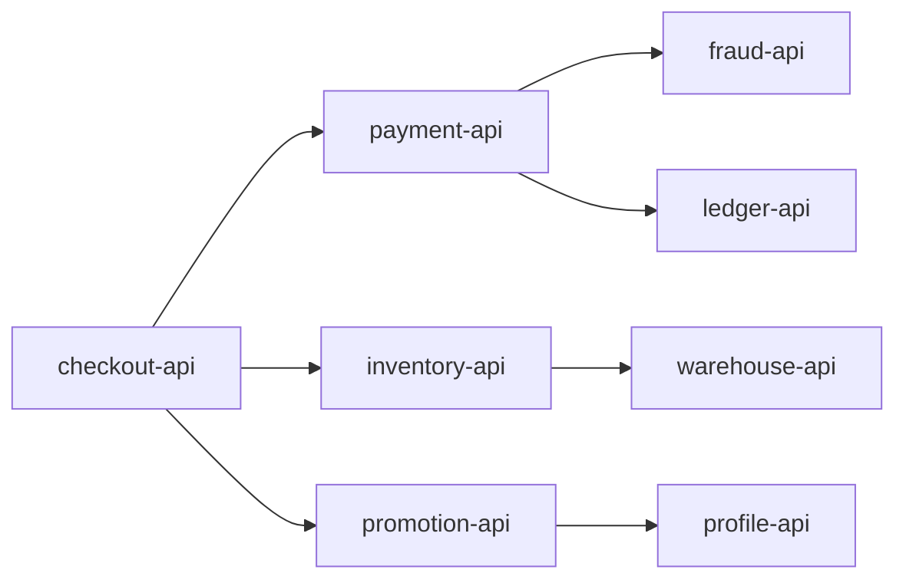
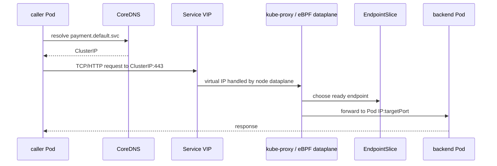
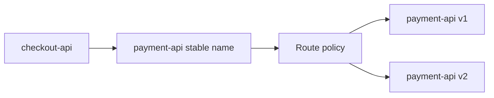
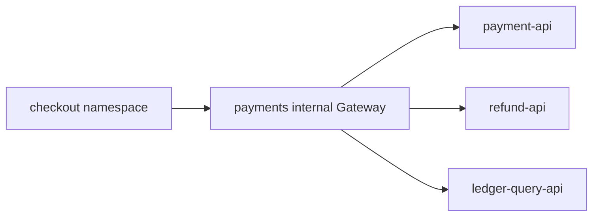
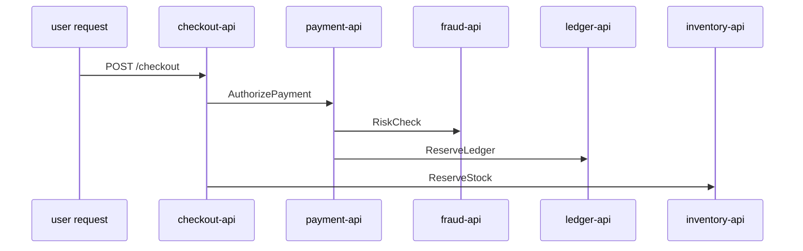
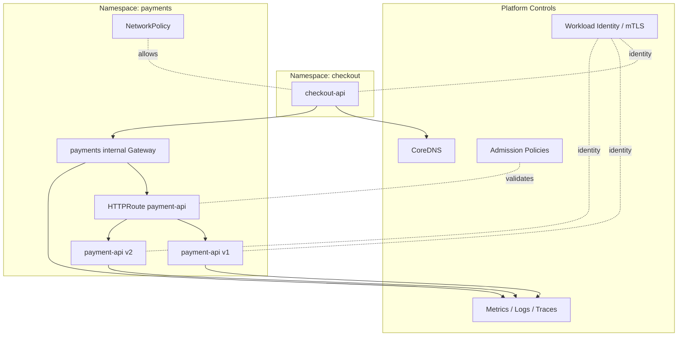

# Part 019 — East-West Traffic and Service-to-Service Routing

## 1. Tujuan Part Ini

Part 018 membahas **north-south traffic**: client dari luar boundary platform masuk ke workload Kubernetes. Part ini membahas arah yang sering jauh lebih besar volumenya dalam sistem produksi: **east-west traffic**, yaitu komunikasi service-to-service di dalam platform.

Target part ini:

> Anda mampu mendesain, mengontrol, mengobservasi, dan men-debug traffic antar service di Kubernetes tanpa terjebak pada asumsi naif bahwa `Service` + DNS sudah cukup untuk semua kebutuhan produksi.

East-west traffic bukan hanya “service A call service B”. Di sistem nyata, call tersebut membawa konsekuensi:

- latency tail;
- retry amplification;
- fan-out explosion;
- implicit dependency graph;
- identity dan authorization;
- blast radius;
- cross-zone cost;
- progressive delivery;
- circuit breaking;
- observability;
- ownership antar team.

Part ini menjadi jembatan menuju Part 020, yaitu service mesh architecture. Kita akan membahas kapan routing native Kubernetes cukup, kapan Gateway API internal cukup, dan kapan service mesh masuk akal.

---

## 2. Kaufman Framing: Skill yang Ingin Dibangun

Dalam framework Kaufman, kita tidak memulai dari tool. Kita mulai dari **target performance level**.

Untuk east-west traffic, targetnya bukan:

> “Bisa membuat Service YAML.”

Target yang benar:

> “Bisa menjelaskan dan mengendalikan jalur request antar workload dari DNS resolution sampai endpoint selection, policy enforcement, retry/timeout behavior, telemetry emission, dan failure containment.”

Deconstruct skill:

| Sub-skill | Yang Harus Bisa Dijelaskan |
|---|---|
| Discovery | Bagaimana caller menemukan callee? DNS? Service? mesh registry? external name? |
| Routing | Traffic diarahkan oleh kube-proxy/eBPF, Gateway API, mesh proxy, atau client library? |
| Eligibility | Pod mana yang boleh menerima traffic? Readiness? EndpointSlice? topology? |
| Locality | Apakah traffic tetap node-local/zone-local/cluster-local? |
| Policy | Siapa boleh call siapa? NetworkPolicy? mesh AuthorizationPolicy? app auth? |
| Identity | Apakah identity berbasis IP, DNS name, service account, certificate, SPIFFE? |
| Resilience | Siapa mengatur timeout, retry, circuit breaking, load shedding? |
| Observability | Di mana log/metric/trace dibuat? Apakah source/destination reliable? |
| Change safety | Bagaimana canary, mirror, rollback, dan route delegation dilakukan? |
| Failure model | Apa yang terjadi saat DNS, endpoint, proxy, policy, atau dependency gagal? |

Deliberate practice dalam part ini:

1. ambil satu dependency antar service;
2. gambar request path dari caller sampai callee;
3. identifikasi semua decision point;
4. tentukan komponen yang bertanggung jawab pada tiap decision;
5. desain failure model;
6. desain observability minimum;
7. tentukan apakah perlu mesh atau tidak.

---

## 3. Mental Model: East-West Traffic Adalah Dependency Graph, Bukan Network Graph

Network graph hanya menunjukkan siapa bisa terhubung ke siapa. Dependency graph menunjukkan siapa bergantung pada siapa, dengan failure propagation.



Secara network, semua edge di atas mungkin hanya `ClusterIP` biasa. Secara reliability, edge-edge tersebut punya karakter berbeda:

| Edge | Karakter |
|---|---|
| checkout → payment | critical, low tolerance for stale response |
| checkout → promotion | optional, bisa degrade gracefully |
| payment → fraud | critical but timeout-sensitive |
| payment → ledger | write path, retry harus idempotent |
| inventory → warehouse | bisa cached, tidak harus strict real-time |

Kesalahan umum engineer menengah:

> memperlakukan semua service-to-service call sama karena semuanya lewat Service DNS yang sama.

Engineer senior/platform harus melihat edge sebagai **runtime contract**:

```txt
caller identity
+ destination identity
+ route selection
+ endpoint eligibility
+ timeout budget
+ retry budget
+ authorization policy
+ telemetry requirement
+ failure semantics
```

---

## 4. Baseline: Native Kubernetes Service-to-Service Path

Jalur paling dasar:

```txt
Pod A
  -> DNS query: payment.default.svc.cluster.local
  -> CoreDNS returns ClusterIP
  -> Pod A opens TCP connection to ClusterIP:port
  -> node dataplane rewrites/selects backend endpoint
  -> packet reaches Pod B
```

Diagram:



Kubernetes Service memberi stable virtual IP/name untuk set Pod yang dinamis. EndpointSlice menyimpan endpoint yang eligible untuk Service, termasuk condition seperti readiness/serving/terminating. Ini cukup untuk banyak workload internal, tetapi tidak otomatis menyelesaikan masalah L7 seperti per-request routing, retries, authz berbasis identity, atau distributed tracing.

### 4.1 Decision point pada path native

| Decision | Siapa yang Mengambil Keputusan |
|---|---|
| Nama service resolve ke apa? | CoreDNS + Kubernetes DNS records |
| Service memilih backend mana? | node dataplane: kube-proxy/IPVS/eBPF |
| Endpoint eligible atau tidak? | EndpointSlice controller + readiness state |
| Traffic boleh lewat atau tidak? | CNI NetworkPolicy enforcement, bila ada |
| Timeout berapa? | client library / application / framework |
| Retry berapa kali? | client library / application / framework |
| Request log di mana? | application atau sidecar/proxy jika ada |
| Caller identity apa? | biasanya IP/service account secara tidak langsung, kecuali ada mesh/app auth |

Native Service adalah primitive yang kuat, tetapi sebagian besar semantic penting berada di luar Service itu sendiri.

---

## 5. Tiga Mode East-West Routing

Untuk production platform, ada tiga mode besar.

### 5.1 Mode A — Native Kubernetes Service

```txt
caller -> ClusterIP Service -> ready endpoint
```

Cocok untuk:

- simple internal RPC;
- traffic volume tinggi tetapi semantics sederhana;
- aplikasi sudah punya client-side resilience yang matang;
- tidak butuh L7 policy terpusat;
- tidak butuh transparent mTLS;
- service ownership masih sederhana.

Kelebihan:

- sederhana;
- dependency rendah;
- overhead kecil;
- debugging packet path relatif langsung;
- failure surface lebih kecil.

Kekurangan:

- L7 routing terbatas;
- timeout/retry/circuit breaker tidak distandardisasi;
- identity biasanya lemah jika hanya berbasis IP;
- telemetry per-hop harus dibuat aplikasi;
- canary internal butuh mekanisme lain;
- authz service-to-service tersebar di aplikasi.

### 5.2 Mode B — Internal Gateway API

```txt
caller -> internal Gateway / Route -> Service -> endpoint
```

Cocok untuk:

- internal API yang ingin punya routing contract eksplisit;
- multi-team platform dengan route delegation;
- internal canary/blue-green berbasis HTTPRoute;
- shared internal API gateway;
- separation antara service implementation dan API routing contract.

Kelebihan:

- route object eksplisit;
- HTTP semantics bisa dikelola platform;
- weighted backend, header/path matching, mirroring bisa distandardisasi;
- ownership lebih jelas dibanding annotation-based ingress;
- bisa dipakai untuk internal/private API tanpa exposure publik.

Kekurangan:

- menambah hop/proxy;
- tidak otomatis mengamankan semua service-to-service traffic;
- traffic hanya yang diarahkan lewat Gateway;
- bukan pengganti mTLS mesh penuh;
- controller support dan policy support bervariasi.

### 5.3 Mode C — Service Mesh / GAMMA-style Routing

```txt
caller -> mesh data plane -> service identity + route policy -> destination workload
```

Cocok untuk:

- zero-trust internal networking;
- mTLS transparan;
- service-to-service authorization;
- uniform telemetry;
- traffic shaping internal;
- multi-cluster service discovery;
- organisasi multi-team dengan banyak dependency;
- runtime policy yang tidak ingin ditanam di aplikasi.

Kelebihan:

- identity lebih kuat;
- policy lebih konsisten;
- telemetry lebih seragam;
- traffic management lebih kaya;
- security posture lebih kuat.

Kekurangan:

- kompleksitas operasional tinggi;
- overhead CPU/memory/latency;
- failure surface bertambah;
- debugging membutuhkan skill tambahan;
- bisa menjadi distributed system di atas distributed system.

---

## 6. Gateway API untuk East-West: GAMMA Mental Model

Gateway API awalnya banyak diasosiasikan dengan ingress. Tetapi service mesh membutuhkan model routing yang seragam untuk traffic internal. Inilah area **GAMMA**: Gateway API for Mesh Management and Administration.

Tujuan mental model GAMMA:

> memakai Route API yang sama untuk mengekspresikan traffic policy service-to-service, tanpa selalu memaksa adanya Gateway resource sebagai edge listener.

Dalam pola mesh, `HTTPRoute` dapat digunakan untuk mengatur traffic menuju Service internal. Route dapat melekat pada Service sebagai parent, bukan hanya pada Gateway.

Contoh konseptual:

```yaml
apiVersion: gateway.networking.k8s.io/v1
kind: HTTPRoute
metadata:
  name: payment-internal-route
  namespace: payments
spec:
  parentRefs:
    - group: ""
      kind: Service
      name: payment-api
      port: 8080
  rules:
    - matches:
        - headers:
            - name: x-canary
              value: "true"
      backendRefs:
        - name: payment-api-v2
          port: 8080
    - backendRefs:
        - name: payment-api-v1
          port: 8080
          weight: 90
        - name: payment-api-v2
          port: 8080
          weight: 10
```

Interpretasi:

- caller tetap memanggil `payment-api.payments.svc.cluster.local`;
- mesh/controller membaca `HTTPRoute`;
- route policy menentukan apakah request masuk v1/v2;
- aplikasi caller tidak perlu tahu detail backend version;
- route menjadi API object yang bisa diaudit.

Catatan penting:

- support tergantung mesh/controller;
- status condition harus dibaca, jangan hanya apply YAML;
- tidak semua filter/feature Gateway API otomatis support di semua implementation;
- route internal tetap harus dipadukan dengan identity, policy, dan observability.

---

## 7. Service-to-Service Contract: Apa yang Harus Diekspresikan

Untuk setiap dependency, definisikan contract berikut.

| Dimensi | Pertanyaan |
|---|---|
| Discovery | Nama apa yang dipanggil caller? Apakah stable? |
| Protocol | HTTP/1.1, HTTP/2, gRPC, TCP custom? |
| Port | Apakah named port konsisten? |
| Identity | Siapa caller yang sah? |
| Authorization | Operasi apa yang boleh dilakukan caller? |
| Timeout | Berapa total budget dari caller? |
| Retry | Apakah safe untuk retry? Berapa retry budget? |
| Idempotency | Apakah request write path idempotent? |
| Routing | Apakah ada canary/version/header split? |
| Locality | Harus node-local, zone-local, region-local, atau global? |
| Observability | Metric/log/trace apa wajib tersedia? |
| Failure semantics | Fail closed, fail open, fallback, cached, degraded? |

Contoh contract ringkas:

```yaml
serviceContract:
  caller: checkout-api
  callee: payment-api
  protocol: gRPC
  identityRequired: true
  mtls: strict
  authz:
    allowMethods:
      - PaymentService.Authorize
      - PaymentService.Capture
  timeoutBudget:
    endToEnd: 900ms
    callerToPayment: 300ms
  retry:
    safeOnlyFor:
      - Authorize with idempotency-key
    maxAttempts: 2
  routing:
    canary: header x-release-channel=beta
  observability:
    requiredLabels:
      - source_workload
      - destination_workload
      - response_code
      - grpc_status
  failureMode:
    fallback: reject checkout with explicit payment-unavailable
```

Contract seperti ini bisa hidup sebagai ADR, service catalog, Backstage metadata, CRD internal, atau policy pack.

---

## 8. Internal Traffic Locality

East-west traffic sering terlihat murah karena “masih internal”. Ini asumsi berbahaya.

Traffic internal bisa tetap mahal atau lambat jika:

- crossing availability zone;
- crossing node boundary tanpa perlu;
- crossing cluster boundary;
- crossing region boundary;
- melewati NAT/firewall/proxy tambahan;
- melewati gateway global;
- route internal salah mengarah ke public endpoint.

### 8.1 internalTrafficPolicy

Kubernetes memiliki `internalTrafficPolicy` untuk membatasi traffic internal agar hanya menuju endpoint lokal node ketika diset `Local`.

Contoh:

```yaml
apiVersion: v1
kind: Service
metadata:
  name: metrics-agent
spec:
  internalTrafficPolicy: Local
  selector:
    app: metrics-agent
  ports:
    - name: http
      port: 8080
      targetPort: 8080
```

Kapan masuk akal:

- DaemonSet per node;
- node-local collector;
- node-local cache;
- traffic yang sebaiknya tidak keluar node;
- mengurangi latency dan cross-node traffic.

Risiko:

- jika tidak ada endpoint lokal, traffic drop;
- caller harus siap menghadapi unavailability lokal;
- bukan general-purpose load balancing strategy.

### 8.2 Topology-aware routing

Topology-aware routing membantu memprioritaskan endpoint dekat secara topology, misalnya zone. Ini berguna untuk:

- mengurangi cross-zone cost;
- mengurangi latency;
- menjaga fault isolation;
- menghindari satu zone menarik traffic dari zone lain secara tidak perlu.

Tetapi locality bukan selalu benar. Untuk service stateful, traffic lokal bisa memperparah hotspot. Untuk service dengan capacity imbalance, locality bisa membuat overload lokal sementara zone lain idle.

Decision rule:

```txt
Gunakan locality preference jika:
  endpoint tersebar seimbang
  failure antar zone bisa ditoleransi
  capacity per zone cukup
  observability bisa menunjukkan skew

Jangan gunakan locality secara buta jika:
  service punya uneven load
  traffic sangat bursty
  failover policy belum jelas
  database/write path cross-zone lebih rumit
```

---

## 9. Cross-Namespace Service-to-Service Routing

Namespace sering dipakai sebagai boundary team, environment, atau domain. Tetapi Service DNS membuat cross-namespace call sangat mudah:

```txt
http://payment-api.payments.svc.cluster.local
```

Kemudahan ini bisa menjadi governance problem.

### 9.1 Problem

Tanpa guardrail, service mana pun bisa mencoba call service mana pun. Jika NetworkPolicy default allow, cluster menjadi flat network.

Risiko:

- dependency liar;
- bypass API gateway/internal contract;
- coupling antar domain;
- data access tanpa audit;
- blast radius lebih besar;
- sulit membuat compliance evidence.

### 9.2 Policy layer

Layer yang bisa dipakai:

| Layer | Fungsi |
|---|---|
| RBAC | Mengatur siapa boleh membuat resource, bukan runtime call antar Pod. |
| NetworkPolicy | Mengatur L3/L4 connectivity antar Pod/IP/port. |
| Gateway API ReferenceGrant | Mengatur cross-namespace object reference pada Gateway API. |
| Mesh authorization | Mengatur service identity dan L7 operation. |
| Application auth | Mengatur user/business-level permission. |
| Admission policy | Mencegah config berbahaya masuk cluster. |

Top 1% engineer tidak memilih satu layer dan menganggap selesai. Mereka menyusun layered control:

```txt
admission guardrail
+ namespace ownership
+ NetworkPolicy default deny
+ mesh identity authz
+ application authorization
+ audit trail
```

---

## 10. East-West Routing Patterns

### 10.1 Pattern: Plain Service Call

```txt
checkout-api -> payment-api Service -> payment-api Pods
```

Gunakan ketika:

- dependency sederhana;
- tidak perlu canary per request;
- tidak perlu central L7 policy;
- caller dan callee satu domain/team;
- security requirement bisa dipenuhi app + NetworkPolicy.

Anti-pattern:

- memakai mesh hanya karena “best practice” padahal dependency sederhana dan tim belum siap mengoperasikan mesh.

### 10.2 Pattern: Service per Version

```txt
payment-api-v1
payment-api-v2
```

Caller memilih sendiri version.

Kelebihan:

- sederhana;
- eksplisit;
- tidak butuh L7 routing layer;
- cocok untuk backward-incompatible API.

Kekurangan:

- caller coupling ke version;
- rollout logic tersebar;
- sulit melakukan global traffic shifting;
- dependency graph menjadi lebih rumit.

Contoh:

```yaml
apiVersion: v1
kind: Service
metadata:
  name: payment-api-v2
  namespace: payments
spec:
  selector:
    app: payment-api
    version: v2
  ports:
    - name: http
      port: 8080
      targetPort: 8080
```

### 10.3 Pattern: Stable Service + Weighted Routing

Caller tetap memanggil stable service, platform mengatur split.



Cocok untuk:

- canary;
- progressive delivery;
- rollback cepat;
- shared routing ownership antara app dan platform.

Risiko:

- percentage request tidak selalu sama dengan percentage user;
- long-lived connection bisa membuat split tidak presisi;
- sticky session mengubah distribusi;
- retry bisa memperbesar traffic ke canary.

### 10.4 Pattern: Header-Based Internal Canary

```yaml
apiVersion: gateway.networking.k8s.io/v1
kind: HTTPRoute
metadata:
  name: payment-canary
  namespace: payments
spec:
  parentRefs:
    - group: ""
      kind: Service
      name: payment-api
      port: 8080
  rules:
    - matches:
        - headers:
            - name: x-internal-release
              value: canary
      backendRefs:
        - name: payment-api-v2
          port: 8080
    - backendRefs:
        - name: payment-api-v1
          port: 8080
```

Gunakan untuk:

- internal beta tester;
- contract validation;
- synthetic tests;
- service consumer migration.

Guardrail:

- header tidak boleh bisa dipalsukan dari public edge tanpa sanitization;
- route harus punya owner;
- backend harus punya readiness dan observability terpisah;
- rollback harus jelas.

### 10.5 Pattern: Request Mirroring / Shadowing

```txt
real request -> stable backend
copy request -> shadow backend
```

Cocok untuk:

- membandingkan behavior v1/v2;
- validating parser;
- warm-up cache;
- load testing dengan traffic realistis.

Bahaya besar:

> Jangan mirror write request ke backend yang bisa menimbulkan side effect.

Mitigasi:

- shadow backend read-only;
- disable external side effects;
- scrub PII jika perlu;
- tandai request dengan header shadow;
- jangan ikutkan shadow response ke caller;
- monitor resource impact.

### 10.6 Pattern: Internal Gateway as Domain Boundary



Gateway internal dapat menjadi boundary untuk domain tertentu:

- semua consumer payments masuk lewat internal Gateway;
- route ownership dipegang payments/platform;
- auth/rate-limit/logging bisa konsisten;
- backend internal tidak langsung diekspos ke semua namespace.

Cocok untuk:

- domain API besar;
- shared platform API;
- internal partner API;
- regulatory/audit boundary.

Kekurangan:

- menambah hop;
- bisa menjadi bottleneck;
- harus HA;
- jangan sampai hanya memindahkan monolith gateway ke dalam cluster.

---

## 11. Identity: IP, DNS, ServiceAccount, atau Certificate?

East-west security sering gagal karena identity yang dipakai salah.

| Identity | Kelebihan | Masalah |
|---|---|---|
| Pod IP | Mudah diobservasi | Ephemeral, bukan identity semantic. |
| Service DNS | Stable name | Tidak membuktikan caller. |
| Namespace | Useful boundary | Terlalu kasar untuk authorization detail. |
| ServiceAccount | Lebih dekat ke workload identity | Butuh enforcement layer. |
| mTLS certificate | Cryptographic identity | Butuh CA, rotation, trust management. |
| SPIFFE ID | Standard workload identity | Butuh SPIRE/mesh/integrasi. |

Prinsip:

```txt
Gunakan IP untuk routing dan low-level troubleshooting.
Gunakan service identity untuk authorization.
Gunakan user/business identity untuk domain permission.
```

Jangan mencampur:

- IP allowlist sebagai satu-satunya authz service-to-service;
- namespace sebagai bukti service identity;
- DNS name sebagai bukti caller;
- JWT end-user sebagai pengganti workload identity.

---

## 12. Timeout dan Retry untuk East-West

East-west traffic adalah tempat retry storm lahir.

Contoh buruk:

```txt
checkout timeout: 5s, retry 3x
payment timeout: 5s, retry 3x
fraud timeout: 5s, retry 3x
ledger timeout: 5s, retry 3x
```

Satu request checkout bisa berkembang menjadi banyak request downstream saat dependency lambat.

### 12.1 Timeout budget

Gunakan budget top-down:

```txt
User-facing API SLO target: p95 1000ms
Edge/Gateway overhead: 50ms
checkout business logic: 150ms
payment dependency budget: 300ms
inventory dependency budget: 200ms
promotion dependency budget: 100ms
buffer: 200ms
```

Maka payment tidak boleh punya timeout 5s jika checkout harus selesai 1s.

### 12.2 Retry budget

Retry harus dibatasi oleh:

- idempotency;
- remaining timeout budget;
- error type;
- downstream overload signal;
- circuit breaker state;
- global retry budget.

Rule praktis:

```txt
Retry hanya untuk transient failure.
Retry write path hanya jika idempotency key valid.
Retry tidak boleh melewati caller deadline.
Retry harus memakai jitter.
Retry harus berhenti saat downstream menunjukkan overload.
```

Service mesh dapat membantu menstandardisasi retry, tetapi tidak membuat retry otomatis aman. Policy retry yang salah di mesh justru bisa membuat incident lebih besar karena berlaku luas.

---

## 13. Observability untuk Service-to-Service

Minimal setiap edge dependency harus bisa dijawab:

1. siapa caller?
2. siapa callee?
3. route mana?
4. endpoint mana?
5. status code/gRPC status apa?
6. latency berapa?
7. timeout atau reset terjadi di mana?
8. retry terjadi berapa kali?
9. request terkena policy apa?
10. apakah traffic melewati proxy/gateway/mesh?

### 13.1 RED metrics per dependency edge

| Metric | Meaning |
|---|---|
| Rate | request per second dari caller ke callee |
| Errors | HTTP 5xx, gRPC non-OK, reset, timeout |
| Duration | latency distribution, bukan average |

Dimensi penting:

- `source_namespace`;
- `source_workload`;
- `destination_namespace`;
- `destination_workload`;
- `destination_service`;
- `route_name`;
- `response_code`;
- `grpc_status`;
- `zone`;
- `cluster`;
- `attempt` atau retry count jika tersedia.

Hati-hati cardinality. Jangan label metric dengan user id, order id, raw path unbounded, atau dynamic header.

### 13.2 Trace propagation

Trace membantu melihat fan-out:



Tetapi trace hanya berguna jika:

- context propagation konsisten;
- proxy tidak memutus header trace;
- sampling tidak menyembunyikan error rare;
- service name konsisten;
- clock skew terkendali.

---

## 14. NetworkPolicy dalam East-West

NetworkPolicy adalah L3/L4 control. Ia menjawab:

> Pod mana boleh connect ke Pod mana pada port apa?

Ia tidak menjawab:

- HTTP method apa yang boleh dipanggil;
- gRPC method apa yang boleh dipanggil;
- user mana yang boleh melakukan operasi;
- apakah request mengandung token valid;
- apakah request body valid.

Baseline production:

```txt
default deny ingress
+ allow DNS egress
+ allow required dependencies explicitly
+ allow health/metrics path sesuai model
+ audit policy drift
```

Contoh sederhana:

```yaml
apiVersion: networking.k8s.io/v1
kind: NetworkPolicy
metadata:
  name: allow-checkout-to-payment
  namespace: payments
spec:
  podSelector:
    matchLabels:
      app: payment-api
  policyTypes:
    - Ingress
  ingress:
    - from:
        - namespaceSelector:
            matchLabels:
              name: checkout
          podSelector:
            matchLabels:
              app: checkout-api
      ports:
        - protocol: TCP
          port: 8080
```

Caveat:

- label governance harus kuat;
- CNI harus mendukung enforcement;
- policy additive, bukan ordered firewall rules;
- DNS dan control-plane dependencies sering terlupakan;
- NodePort/hostNetwork path bisa memunculkan bypass tergantung CNI/config.

---

## 15. Decision Framework: Native Service vs Internal Gateway vs Mesh

Gunakan pertanyaan berikut.

| Pertanyaan | Jika Ya, Pertimbangkan |
|---|---|
| Butuh stable service discovery saja? | Native Service |
| Butuh L4/L3 isolation saja? | Service + NetworkPolicy |
| Butuh internal HTTP routing/canary? | Gateway API internal atau mesh GAMMA |
| Butuh per-request header/path routing untuk service-to-service? | Gateway API/GAMMA/mesh |
| Butuh transparent mTLS antar workload? | Service mesh |
| Butuh identity-based authz antar service? | Service mesh + policy |
| Butuh uniform telemetry tanpa perubahan aplikasi besar? | Service mesh |
| Traffic hanya beberapa service critical? | Internal gateway atau library mungkin cukup |
| Organisasi belum siap operasikan mesh? | Jangan mulai dari mesh global |
| Perlu multi-cluster service identity/routing? | Mesh atau multi-cluster traffic platform |

Rule praktis:

```txt
Mulai dari native Service.
Tambahkan NetworkPolicy untuk isolation.
Tambahkan internal Gateway saat butuh L7 routing boundary.
Tambahkan mesh saat butuh identity, mTLS, uniform policy, dan observability pada skala dependency graph.
```

Jangan membalik urutan menjadi:

```txt
install mesh dulu -> cari problem belakangan
```

---

## 16. Failure Model East-West

### 16.1 DNS failure

Symptom:

- intermittent `UnknownHostException`;
- latency spike sebelum connection;
- CoreDNS CPU tinggi;
- query amplification karena `ndots`;
- hanya workload tertentu gagal.

Debug:

```bash
kubectl exec -n checkout deploy/checkout-api -- cat /etc/resolv.conf
kubectl exec -n checkout deploy/checkout-api -- nslookup payment-api.payments.svc.cluster.local
kubectl -n kube-system logs deploy/coredns
kubectl -n kube-system top pod -l k8s-app=kube-dns
```

### 16.2 Endpoint eligibility failure

Symptom:

- Service exists, DNS works, request fails;
- connection refused;
- no endpoints;
- only new version receives no traffic.

Debug:

```bash
kubectl -n payments get svc payment-api
kubectl -n payments get endpointslice -l kubernetes.io/service-name=payment-api -o wide
kubectl -n payments get pods -l app=payment-api -o wide
kubectl -n payments describe pod <pod>
```

### 16.3 Policy failure

Symptom:

- timeout, not immediate refusal;
- works from one namespace but not another;
- DNS works but TCP hangs;
- metrics show no request reaching callee.

Debug:

```bash
kubectl get networkpolicy -A
kubectl -n payments describe networkpolicy allow-checkout-to-payment
kubectl exec -n checkout deploy/checkout-api -- nc -vz payment-api.payments.svc.cluster.local 8080
```

### 16.4 Routing policy failure

Symptom:

- canary gets wrong traffic;
- route accepted false;
- header match not working;
- mirror traffic causing load spike;
- backendRef invalid.

Debug:

```bash
kubectl -n payments get httproute payment-canary -o yaml
kubectl -n payments describe httproute payment-canary
kubectl -n payments get svc payment-api-v1 payment-api-v2
kubectl -n payments get endpointslice -l app=payment-api
```

### 16.5 Retry storm

Symptom:

- downstream latency naik;
- RPS downstream jauh lebih tinggi dari caller RPS;
- error rate naik setelah retry enabled;
- CPU proxy/app naik;
- queue depth meningkat.

Debug:

- cek retry policy di client/mesh/gateway;
- bandingkan request rate caller vs callee;
- cek timeout alignment;
- cek idempotency;
- disable retry untuk isolasi jika aman;
- cari overload signal.

---

## 17. Anti-Patterns

### 17.1 “Semua Service Internal Aman”

Salah. Internal bukan trusted. Cluster internal bisa berisi compromised workload, buggy job, misconfigured namespace, atau service dari team lain.

Better:

```txt
internal == lower exposure, not automatically trusted
```

### 17.2 “NetworkPolicy Sudah Cukup untuk Zero Trust”

NetworkPolicy bagus untuk connectivity boundary, tetapi bukan cryptographic workload identity dan bukan L7 authorization.

Better:

```txt
NetworkPolicy untuk L3/L4 segmentation.
Mesh/application auth untuk identity dan operation-level authorization.
```

### 17.3 “Service Mesh Menggantikan Application Resilience”

Mesh bisa membantu timeout/retry/circuit breaker, tetapi aplikasi tetap harus memahami:

- idempotency;
- business fallback;
- partial failure;
- user-visible semantics;
- data consistency.

### 17.4 “Canary 10% Berarti 10% User”

Weighted routing sering berbasis request/connection, bukan user. Long-lived connection, sticky session, HTTP/2 multiplexing, retry, dan client behavior bisa mengubah distribusi.

### 17.5 “Internal Gateway untuk Semua Hal”

Jika setiap service-to-service call harus melewati gateway pusat, Anda bisa menciptakan bottleneck dan coupling baru. Gateway bagus sebagai boundary domain, bukan selalu sebagai universal hub.

---

## 18. Reference Architecture: East-West Traffic Platform Bertahap



Phased adoption:

1. native Service + clear service contracts;
2. default deny NetworkPolicy for critical namespaces;
3. internal Gateway for domain APIs;
4. route-based canary and mirroring;
5. mesh for mTLS/identity/policy/telemetry if justified;
6. multi-cluster routing only after single-cluster behavior matang.

---

## 19. Practice Lab

### Lab 1 — Draw Actual Path

Pilih dua service internal. Tulis:

```txt
caller pod:
caller namespace:
callee service:
callee namespace:
DNS name:
Service type:
port:
targetPort:
EndpointSlice count:
ready endpoints:
NetworkPolicy involved:
route involved:
mesh involved:
timeout:
retry:
observability:
```

Jika Anda tidak bisa mengisi salah satu field, itu blind spot.

### Lab 2 — Build Internal Canary

Buat:

- `payment-api-v1`;
- `payment-api-v2`;
- stable route/service;
- 90/10 split;
- header-based override;
- metric dashboard per version.

Validasi:

```bash
for i in {1..100}; do curl -s http://payment-api/pay | jq .version; done
curl -H 'x-internal-release: canary' http://payment-api/pay
```

### Lab 3 — Break Endpoint Readiness

- buat deployment yang readiness probe-nya terlalu cepat;
- kirim traffic saat startup;
- observe 5xx/connection reset;
- perbaiki readiness;
- tambahkan preStop/drain;
- observe perbaikan.

### Lab 4 — Trigger Retry Amplification

- buat downstream lambat;
- aktifkan retry di caller;
- aktifkan retry di route/proxy;
- bandingkan RPS caller vs downstream;
- turunkan retry budget;
- tambahkan timeout alignment.

---

## 20. Checklist Top 1% untuk East-West Traffic

Sebelum menyetujui desain service-to-service production, jawab:

- Apakah setiap dependency punya owner?
- Apakah service discovery path jelas?
- Apakah endpoint eligibility bergantung pada readiness yang benar?
- Apakah cross-namespace call disengaja dan diaudit?
- Apakah ada default deny untuk namespace critical?
- Apakah caller identity bisa dipercaya?
- Apakah authorization berada di layer yang tepat?
- Apakah timeout budget end-to-end konsisten?
- Apakah retry aman secara idempotency?
- Apakah canary/mirroring tidak memicu side effect?
- Apakah metric bisa menunjukkan source dan destination?
- Apakah trace propagation konsisten?
- Apakah cross-zone/cross-cluster traffic disengaja?
- Apakah failure mode ditulis sebelum incident?
- Apakah rollback route/policy bisa dilakukan cepat?

---

## 21. Ringkasan

East-west traffic adalah jantung runtime distributed system di Kubernetes. Native Service memberi discovery dan load balancing dasar, tetapi production service-to-service membutuhkan lebih banyak hal: identity, policy, observability, locality, resilience, progressive delivery, dan failure containment.

Mental model utama:

```txt
Service-to-service traffic bukan hanya koneksi.
Ia adalah dependency contract yang harus bisa diaudit, diubah, diamankan, dan di-debug.
```

Gunakan native Kubernetes Service untuk simplicity. Tambahkan NetworkPolicy untuk connectivity boundary. Gunakan internal Gateway API/GAMMA-style routing ketika butuh L7 route contract. Gunakan service mesh ketika problem yang Anda punya benar-benar identity, mTLS, uniform telemetry, traffic policy, dan dependency graph governance pada skala besar.

Part berikutnya masuk ke fondasi service mesh: control plane, data plane, proxy, xDS, identity distribution, telemetry, dan mengapa mesh bisa sangat powerful sekaligus berbahaya jika dipakai tanpa operating model.

---

## 22. Referensi

- Kubernetes Documentation — Services, Load Balancing, and Networking: https://kubernetes.io/docs/concepts/services-networking/
- Kubernetes Documentation — Service: https://kubernetes.io/docs/concepts/services-networking/service/
- Kubernetes Documentation — EndpointSlices: https://kubernetes.io/docs/concepts/services-networking/endpoint-slices/
- Kubernetes Documentation — Service Internal Traffic Policy: https://kubernetes.io/docs/concepts/services-networking/service-traffic-policy/
- Kubernetes Documentation — Network Policies: https://kubernetes.io/docs/concepts/services-networking/network-policies/
- Gateway API Documentation — Introduction: https://gateway-api.sigs.k8s.io/
- Gateway API Documentation — GAMMA Initiative: https://gateway-api.sigs.k8s.io/mesh/gamma/
- Gateway API GEP-1324 — Service Mesh in Gateway API: https://gateway-api.sigs.k8s.io/geps/gep-1324/
