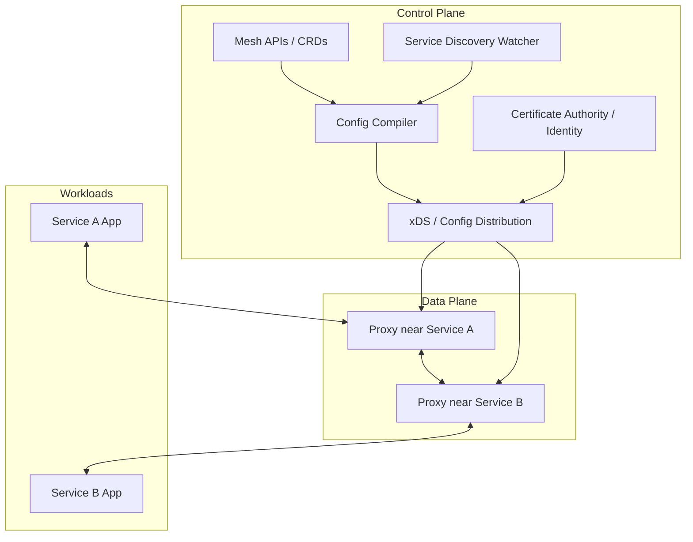
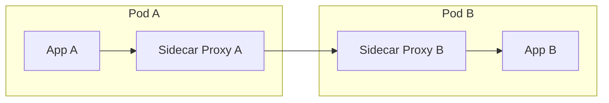
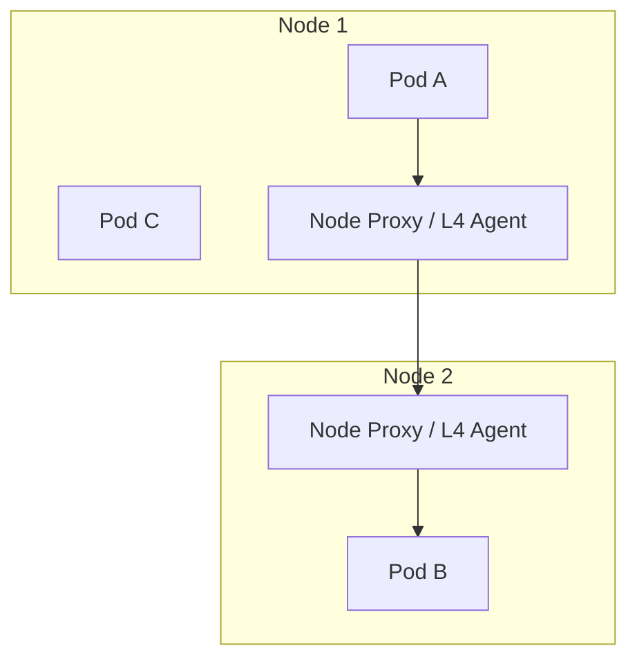
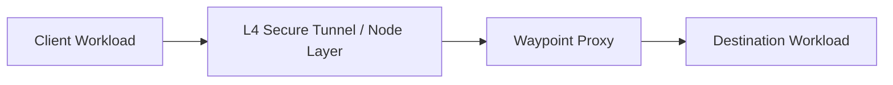
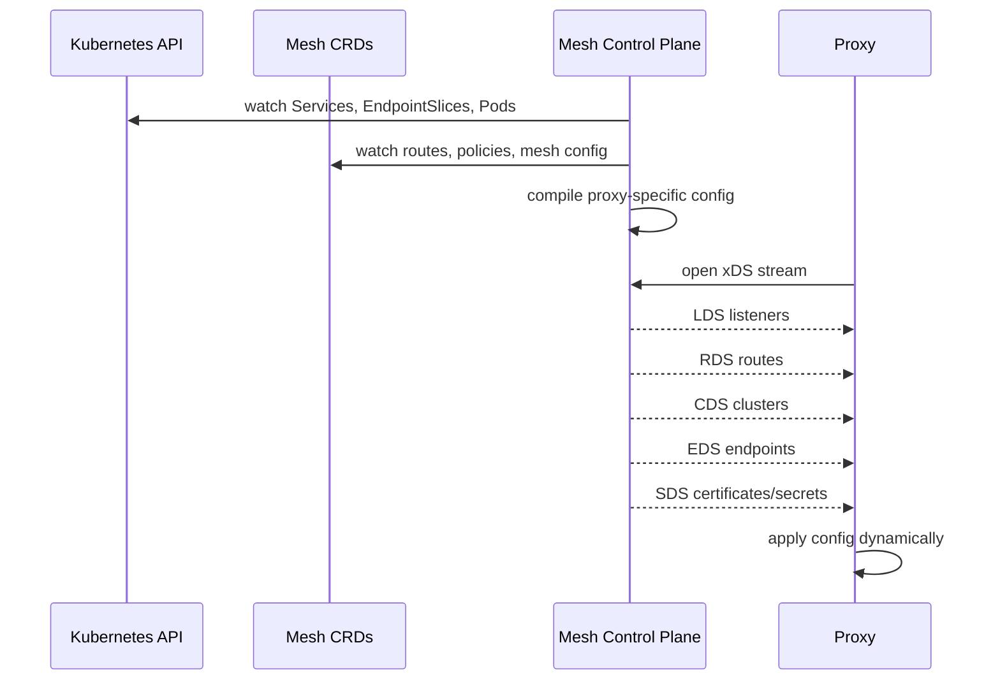
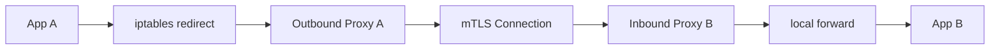
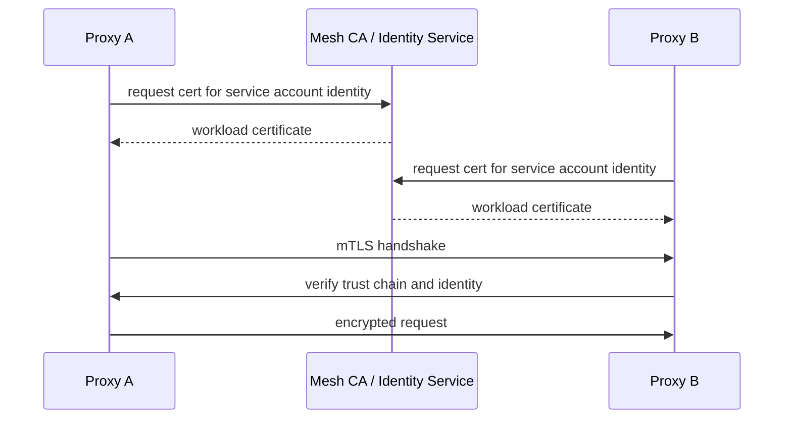
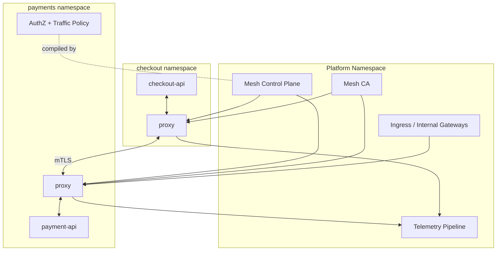

# Part 020 — Service Mesh Architecture: Control Plane, Data Plane, and Proxies

## 1. Tujuan Part Ini

Part 019 menjelaskan east-west traffic sebagai dependency contract. Part ini membahas machinery yang sering dipakai untuk mengelola dependency contract tersebut pada skala besar: **service mesh**.

Target part ini:

> Anda mampu menjelaskan service mesh sebagai distributed traffic control system yang terdiri dari control plane, data plane, identity plane, policy plane, dan telemetry plane — bukan sekadar “sidecar Envoy”.

Setelah part ini, Anda harus bisa menjawab:

- Apa problem asli yang diselesaikan service mesh?
- Apa bedanya control plane dan data plane?
- Bagaimana proxy mengetahui route, endpoint, certificate, policy, dan telemetry config?
- Apa itu xDS secara mental model?
- Bagaimana sidecar interception bekerja?
- Apa trade-off sidecar vs sidecarless/ambient?
- Bagaimana mTLS, identity, authorization, traffic shaping, dan observability dioperasikan?
- Failure mode apa yang muncul karena mesh?
- Kapan mesh sebaiknya tidak dipakai?

---

## 2. Kaufman Framing: Jangan Mulai dari Istio YAML

Dalam framework Kaufman, kita mulai dari performance target, bukan dokumentasi tool.

Target kemampuan:

> “Bisa menentukan apakah service mesh diperlukan, mendesain operating model-nya, menjelaskan request path-nya, dan men-debug failure yang muncul di aplikasi, proxy, control plane, certificate, policy, dan dataplane.”

Deconstruction:

| Skill | Fokus |
|---|---|
| Problem framing | Mesh menyelesaikan problem apa? Identity? Policy? Telemetry? Routing? |
| Architecture | Control plane vs data plane vs identity plane. |
| Proxy model | Listener, route, cluster, endpoint, filter, certificate. |
| Config distribution | Bagaimana config sampai ke proxy? xDS/SDS/watch. |
| Traffic interception | Bagaimana traffic masuk/keluar dialihkan ke proxy? |
| Security | mTLS, cert rotation, trust domain, authz. |
| Reliability | timeout, retry, circuit breaker, outlier detection. |
| Observability | metrics, logs, traces, topology graph. |
| Operations | upgrade, injection, resource overhead, blast radius. |
| Debugging | app vs proxy vs control plane vs network vs policy. |

Deliberate practice:

1. ambil satu request antar service;
2. gambar path tanpa mesh;
3. gambar path dengan mesh;
4. identifikasi keputusan yang pindah dari aplikasi ke proxy;
5. identifikasi config yang harus dikirim control plane;
6. tulis failure mode baru;
7. ukur overhead dan manfaat.

---

## 3. Definisi: Service Mesh sebagai Runtime Control Layer

Service mesh adalah layer infrastruktur untuk mengelola komunikasi service-to-service. Ia biasanya menyediakan:

- service discovery integration;
- traffic routing;
- load balancing;
- mTLS;
- workload identity;
- authorization policy;
- retries dan timeouts;
- circuit breaking/outlier detection;
- telemetry;
- distributed tracing integration;
- traffic mirroring/canary;
- multi-cluster connectivity.

Definisi yang lebih presisi:

```txt
Service mesh = control plane yang mendistribusikan traffic/security/telemetry policy
ke data plane proxy yang berada dekat dengan workload,
sehingga komunikasi antar service bisa dikontrol tanpa menanam semua concern itu di aplikasi.
```

Penting:

> Mesh tidak menghilangkan kompleksitas. Mesh memindahkan sebagian kompleksitas dari aplikasi ke platform runtime.

Jika platform runtime tidak siap, kompleksitas tersebut tetap ada — hanya lebih tersembunyi.

---

## 4. Architecture Map



Control plane tidak seharusnya berada di hot request path untuk setiap request. Data plane proxy berada di request path.

Jika control plane down:

- existing proxy config mungkin tetap bekerja;
- new config tidak tersebar;
- certificate rotation bisa terganggu;
- new workload mungkin tidak mendapatkan config;
- endpoint update bisa tertunda;
- behavior tergantung implementation dan cache state.

Jika data plane proxy down/misconfigured:

- request path langsung terdampak;
- aplikasi mungkin terlihat healthy tetapi tidak reachable;
- mTLS/authorization/routing bisa gagal;
- telemetry bisa hilang.

---

## 5. Planes dalam Service Mesh

### 5.1 Control Plane

Tugas:

- membaca Kubernetes API dan mesh CRD;
- mengamati Service, EndpointSlice, Pod, ServiceAccount, Namespace;
- mengkompilasi desired policy menjadi proxy config;
- mendistribusikan config ke proxy;
- mengelola certificate/identity;
- memvalidasi config;
- menyediakan status/diagnostics.

Contoh:

- Istio `istiod`;
- Linkerd destination/identity/proxy-injector components;
- Consul control plane;
- Kuma/Kong Mesh control plane;
- Cilium agent/operator plus Envoy integration untuk beberapa mode.

### 5.2 Data Plane

Tugas:

- menerima outbound/inbound traffic;
- melakukan mTLS handshake;
- memeriksa policy;
- memilih upstream endpoint;
- menjalankan retry/timeout/circuit breaker;
- menghasilkan metrics/logs/traces;
- menerapkan route/filter;
- melakukan load balancing.

Bentuk data plane:

| Model | Deskripsi |
|---|---|
| Sidecar proxy | Proxy per Pod, biasanya Envoy/Linkerd proxy. |
| Node proxy | Proxy per node, menangani beberapa workload. |
| Waypoint proxy | Proxy L7 shared untuk service/namespace tertentu. |
| Sidecarless eBPF + proxy | eBPF untuk L3/L4, proxy untuk L7 saat perlu. |
| Proxyless | Client library/gRPC menerima config langsung tanpa proxy umum. |

### 5.3 Identity Plane

Tugas:

- menentukan workload identity;
- menerbitkan certificate;
- melakukan rotation;
- mengelola trust domain;
- mendistribusikan trust bundle;
- mendukung federation jika multi-cluster.

Identity yang matang biasanya tidak berbasis IP. IP adalah locator, bukan identity.

### 5.4 Policy Plane

Tugas:

- authentication policy;
- authorization policy;
- routing policy;
- retry/timeout policy;
- telemetry policy;
- rate limiting/ext authz integration;
- egress policy.

Policy plane adalah sumber banyak incident karena policy sering terlihat valid secara YAML tetapi salah secara semantics.

### 5.5 Telemetry Plane

Tugas:

- metrics;
- access logs;
- traces;
- topology graph;
- policy decision logs;
- mTLS/authz error visibility.

Telemetry mesh harus menjawab:

```txt
who called whom, over what protocol, with what identity,
through which route, with what status, how long it took,
and where it failed.
```

---

## 6. Data Plane Deployment Models

### 6.1 Sidecar Mode

Dalam sidecar mode, setiap workload Pod mendapatkan proxy tambahan.



Kelebihan:

- policy dekat dengan workload;
- per-workload isolation kuat;
- L7 feature kaya;
- telemetry detail;
- mature ecosystem, khususnya Envoy-based mesh.

Kekurangan:

- overhead per Pod;
- startup/shutdown ordering;
- sidecar injection complexity;
- resource sizing lebih sulit;
- upgrade proxy menyentuh banyak workload;
- config explosion pada cluster besar;
- debugging dua container dalam satu Pod.

Failure mode khas:

- app ready sebelum proxy ready;
- proxy crash tetapi app masih running;
- sidecar tidak terinject;
- initContainer iptables gagal;
- proxy memory pressure;
- drain tidak sinkron dengan app shutdown.

### 6.2 Node Proxy / Sidecarless L4

Node proxy menangani traffic untuk banyak workload pada node.



Kelebihan:

- overhead lebih rendah dibanding sidecar per Pod;
- onboarding workload lebih mudah;
- upgrade lebih sedikit objek;
- cocok untuk L4 security/identity baseline.

Kekurangan:

- L7 semantics tidak selalu tersedia di setiap hop;
- isolation per workload bisa lebih kompleks;
- traffic bypass harus dipahami;
- debugging memerlukan pemahaman node-level dataplane.

### 6.3 Waypoint Proxy

Waypoint proxy memproses L7 traffic untuk service/namespace tertentu.



Kelebihan:

- L4 secure overlay bisa default;
- L7 policy hanya diaktifkan jika diperlukan;
- tidak perlu sidecar per workload;
- biaya bisa lebih rendah untuk workload sederhana.

Kekurangan:

- mental model L4/L7 split lebih rumit;
- policy placement harus sangat jelas;
- waypoint bisa menjadi shared bottleneck;
- tidak semua fitur sidecar otomatis sama;
- mixed mode butuh governance.

### 6.4 Proxyless

Proxyless berarti client library menerima config dari control plane dan melakukan behavior mesh langsung.

Cocok untuk:

- gRPC-heavy systems;
- environment yang ingin menghindari sidecar;
- client library bisa distandardisasi.

Risiko:

- polyglot language support;
- library upgrade governance;
- behavior bisa berbeda antar bahasa;
- tidak transparent untuk semua workload.

---

## 7. Envoy Mental Model

Banyak mesh memakai Envoy sebagai data plane. Agar tidak menghafal config mentah, pahami building block-nya.

### 7.1 Listener

Listener adalah socket yang menerima connection.

```txt
0.0.0.0:15001 outbound listener
0.0.0.0:15006 inbound listener
0.0.0.0:8080 app listener or gateway listener
```

Listener punya filter chain. Filter chain bisa berbeda berdasarkan:

- SNI;
- transport protocol;
- ALPN;
- destination port;
- source/destination metadata;
- TLS presence.

### 7.2 Route

Route menentukan request HTTP/gRPC diarahkan ke cluster/upstream mana.

Route matching bisa berdasarkan:

- host;
- path;
- method;
- header;
- query;
- gRPC service/method;
- weighted backend;
- rewrite/redirect/mirror.

### 7.3 Cluster

Cluster dalam Envoy adalah upstream logical group. Jangan bingung dengan Kubernetes cluster.

Contoh upstream cluster:

```txt
outbound|8080||payment-api.payments.svc.cluster.local
```

Cluster menentukan:

- load balancing policy;
- endpoint discovery;
- circuit breaker;
- outlier detection;
- connection pool;
- TLS context ke upstream.

### 7.4 Endpoint

Endpoint adalah concrete backend instance:

```txt
10.2.1.15:8080
10.2.3.41:8080
10.2.5.20:8080
```

Endpoint biasanya berasal dari Service/EndpointSlice/registry mesh.

### 7.5 Filter

Filter memproses traffic.

Jenis umum:

- HTTP connection manager;
- router filter;
- JWT authn;
- external authz;
- rate limit;
- telemetry;
- RBAC;
- fault injection;
- compression;
- Lua/WASM/extensibility.

Mental model:

```txt
Listener receives connection
-> filter chain selected
-> HTTP/gRPC route selected
-> cluster selected
-> endpoint selected
-> connection to upstream
```

---

## 8. xDS: Cara Control Plane Mengajari Proxy

xDS adalah keluarga API discovery yang dipakai Envoy untuk dynamic configuration. Huruf `x` berarti banyak jenis discovery service.

Mental model:

```txt
control plane watches Kubernetes + mesh APIs
-> compiles desired traffic/security config
-> sends typed resources to proxies via xDS
-> proxies update listeners/routes/clusters/endpoints/secrets
```

Jenis xDS penting:

| xDS | Resource | Fungsi |
|---|---|---|
| LDS | Listener Discovery Service | Mengirim listener config. |
| RDS | Route Discovery Service | Mengirim route config. |
| CDS | Cluster Discovery Service | Mengirim upstream cluster config. |
| EDS | Endpoint Discovery Service | Mengirim endpoint/backend instance. |
| SDS | Secret Discovery Service | Mengirim certificate/secret/TLS material. |
| ADS | Aggregated Discovery Service | Multiplex beberapa xDS stream. |

Diagram:



Critical insight:

> Proxy config adalah hasil kompilasi dari banyak resource. Saat request gagal, root cause bisa berada di Service, EndpointSlice, Route, DestinationRule, AuthorizationPolicy, PeerAuthentication, Secret, ServiceAccount, atau control plane compiler.

---

## 9. Traffic Interception dalam Sidecar

Sidecar mesh harus membuat traffic aplikasi melewati proxy tanpa aplikasi sadar.

Umumnya dilakukan dengan:

- init container mengubah iptables/nftables;
- CNI plugin mengatur redirection;
- transparent proxying;
- port interception;
- inbound/outbound listener.

Simplified path outbound:

```txt
App A opens connection to payment-api:8080
-> iptables redirects outbound traffic to local proxy
-> proxy applies route/policy/mTLS
-> proxy connects to destination proxy/workload
```

Simplified path inbound:

```txt
remote proxy connects to Pod IP
-> iptables redirects inbound traffic to local proxy
-> proxy terminates mTLS and checks policy
-> proxy forwards plaintext/local traffic to app container
```

Diagram:



Caveat:

- app melihat peer sebagai localhost/proxy dalam beberapa mode;
- source IP bisa berubah;
- health checks bisa bypass atau melewati proxy tergantung config;
- startup/shutdown harus sinkron;
- debugging harus membedakan app port dan proxy admin/listener port.

---

## 10. mTLS dan Identity Distribution

mTLS mesh biasanya melakukan:

1. workload mendapatkan identity;
2. proxy mendapatkan certificate untuk identity tersebut;
3. proxy melakukan TLS handshake dengan peer proxy;
4. peer identity diverifikasi;
5. authorization policy dievaluasi;
6. traffic diteruskan ke aplikasi.



### 10.1 Identity harus stabil secara semantic

Contoh identity:

```txt
spiffe://cluster.local/ns/payments/sa/payment-api
```

Lebih baik daripada:

```txt
10.2.5.21
```

Karena IP berubah, sedangkan namespace + service account lebih dekat ke workload identity.

### 10.2 Failure mode mTLS

| Failure | Symptom |
|---|---|
| Cert expired | TLS handshake failure. |
| Trust domain mismatch | peer rejected. |
| Permissive mode tidak disengaja | plaintext masih bisa lewat. |
| Strict mode terlalu cepat | legacy workload gagal connect. |
| CA unavailable | new workload/cert rotation gagal. |
| Clock skew | cert terlihat not yet valid/expired. |

Debug angle:

- cek policy mTLS;
- cek cert lifetime;
- cek trust domain;
- cek proxy logs;
- cek control plane CA status;
- cek workload service account;
- cek apakah traffic masuk mesh atau bypass.

---

## 11. Authorization Policy

Mesh authorization biasanya berbasis identity dan metadata request.

Contoh conceptual policy:

```yaml
apiVersion: security.istio.io/v1
kind: AuthorizationPolicy
metadata:
  name: allow-checkout-to-payment
  namespace: payments
spec:
  selector:
    matchLabels:
      app: payment-api
  action: ALLOW
  rules:
    - from:
        - source:
            principals:
              - cluster.local/ns/checkout/sa/checkout-api
      to:
        - operation:
            methods: ["POST"]
            paths: ["/v1/payments/authorize"]
```

Mental model:

```txt
NetworkPolicy: can a packet connect to this port?
Mesh AuthorizationPolicy: can this workload identity perform this operation?
Application authorization: can this user/business actor perform this action?
```

Jangan mengganti application authorization dengan mesh authorization. Mesh tahu workload identity, bukan seluruh domain business permission.

---

## 12. Traffic Management dalam Mesh

Service mesh dapat menerapkan:

- weighted routing;
- header-based routing;
- mirror traffic;
- timeout;
- retry;
- circuit breaker;
- outlier detection;
- fault injection;
- locality load balancing;
- failover;
- connection pool limits.

Tetapi power ini berbahaya jika tidak ada governance.

Contoh incident pattern:

```txt
team A menambahkan retry 3x di mesh
team B sudah punya retry 2x di client
team C downstream sedang degraded
hasil: overload downstream naik 6x
```

Prinsip:

- timeout harus mengikuti end-to-end budget;
- retry harus punya idempotency requirement;
- circuit breaker harus diuji;
- outlier detection harus dipantau;
- policy perubahan harus punya rollout dan rollback;
- traffic management tidak boleh menjadi hidden behavior yang tidak diketahui app team.

---

## 13. Observability Mesh

Mesh telemetry sering menjadi alasan utama adopsi.

### 13.1 Metrics

Umum:

- request total;
- request duration histogram;
- response code;
- gRPC status;
- TCP bytes;
- connection open/close;
- mTLS status;
- source/destination workload;
- source/destination namespace;
- route/service.

Nilai besar mesh:

> telemetry bisa konsisten meskipun aplikasi berbeda bahasa/framework.

Risiko:

- high-cardinality labels;
- double counting;
- proxy metrics dianggap app metrics;
- missing telemetry untuk bypass traffic;
- sampling trace menyembunyikan rare failures.

### 13.2 Access logs

Access logs proxy berguna untuk:

- debug policy;
- audit dependency;
- melihat response code sebelum app logs;
- melihat mTLS identity;
- melihat upstream cluster/endpoint.

Tetapi access logs mahal. Jangan aktifkan full verbose logs tanpa retention/cost model.

### 13.3 Distributed tracing

Mesh dapat membantu trace propagation, tetapi aplikasi tetap perlu instrumentasi untuk span bisnis yang bermakna.

Proxy span menjawab:

```txt
traffic melewati hop mana?
```

Application span menjawab:

```txt
operasi bisnis apa yang lambat?
```

Keduanya saling melengkapi.

---

## 14. Mesh Control Plane as Compiler

Cara berpikir yang sangat berguna:

> Mesh control plane adalah compiler dari desired state Kubernetes + mesh API menjadi proxy runtime config.

Input:

- Service;
- EndpointSlice;
- Pod;
- Namespace;
- ServiceAccount;
- Gateway/Route;
- mesh traffic policy;
- authn/authz policy;
- telemetry config;
- secrets/cert config.

Output:

- listeners;
- routes;
- clusters;
- endpoints;
- filters;
- certificates;
- runtime metadata.

Compiler bisa gagal karena:

- resource invalid;
- conflict;
- missing reference;
- unsupported feature;
- stale cache;
- control plane overload;
- version skew;
- namespace/label mismatch;
- policy precedence tidak dipahami.

Maka debugging mesh harus mencakup:

```txt
source YAML
+ status condition
+ compiled proxy config
+ proxy runtime state
+ actual packet/request behavior
```

---

## 15. Request Path: Tanpa Mesh vs Dengan Mesh

### 15.1 Tanpa mesh

```txt
checkout app
-> DNS payment-api
-> ClusterIP
-> node dataplane
-> payment pod
```

### 15.2 Dengan sidecar mesh

```txt
checkout app
-> local outbound proxy
-> route/policy/telemetry/mTLS
-> remote inbound proxy
-> authorization
-> payment app
```

Comparison:

| Concern | Tanpa Mesh | Dengan Mesh |
|---|---|---|
| Discovery | DNS/Service | DNS/Service + mesh registry/config |
| Load balancing | kube-proxy/eBPF/client | proxy L7/L4 LB |
| mTLS | app/library/manual | transparent proxy-managed |
| Authz | app/network policy | proxy identity policy + app auth |
| Retry/timeout | app/client | proxy and/or app |
| Telemetry | app/CNI/gateway | proxy uniform telemetry |
| Failure surface | app + kube networking | app + kube networking + proxy + control plane |

---

## 16. Mesh Adoption Decision Framework

Gunakan matrix ini.

| Requirement | Mesh Value | Alternative |
|---|---|---|
| Uniform mTLS | High | app TLS libraries, ingress-only TLS |
| Workload identity authz | High | app auth, NetworkPolicy limited |
| Service dependency observability | High | OpenTelemetry instrumentation, CNI flow logs |
| Internal canary | Medium/High | Gateway API internal, rollout controller |
| Retry/timeout standardization | Medium | client libraries/platform SDK |
| L7 policy | High | API gateway/internal gateway |
| Simple Service discovery | Low | native Kubernetes Service |
| Small cluster/simple team | Often low | native K8s + discipline |
| Multi-cluster service identity | High | custom PKI + DNS + LB |

Do not adopt mesh because:

- “microservices harus pakai mesh”;
- “semua perusahaan besar pakai Istio”;
- “ingin dashboard bagus”;
- “ingin menyelesaikan semua reliability problem otomatis”.

Adopt mesh when you can name the operational problem and accept the operational cost.

---

## 17. Operating Model

Mesh butuh owner. Tanpa owner, mesh menjadi shared mystery layer.

### 17.1 Ownership

| Area | Owner Ideal |
|---|---|
| Mesh control plane | platform/networking team |
| Mesh CRDs/versioning | platform team |
| Identity/trust domain | platform + security |
| Authorization policy templates | security + platform |
| Service-specific policy | app team with guardrails |
| Traffic policy | app team + SRE review |
| Telemetry standards | platform + observability team |
| Incident response | shared runbook |

### 17.2 Change management

Semua perubahan berikut harus dianggap production-impacting:

- mesh upgrade;
- proxy image upgrade;
- CA/trust domain change;
- mTLS mode change;
- authorization default change;
- retry/timeout global default;
- telemetry cardinality change;
- sidecar injection label change;
- CNI/interception mode change.

### 17.3 Resource model

Sidecar mesh menambah:

- CPU per proxy;
- memory per proxy;
- startup time;
- config memory;
- log volume;
- metric volume;
- xDS connection count;
- certificate rotation workload;
- upgrade blast radius.

Jangan sizing hanya aplikasi. Sizing Pod harus mencakup proxy.

---

## 18. Failure Model Service Mesh

### 18.1 Sidecar missing

Symptom:

- workload bisa bypass mTLS;
- policy tidak berlaku;
- telemetry hilang;
- service A bisa call B, service C tidak bisa;
- only some pods fail.

Check:

```bash
kubectl -n payments get pod -l app=payment-api -o jsonpath='{range .items[*]}{.metadata.name}{" containers="}{.spec.containers[*].name}{"\n"}{end}'
```

### 18.2 Proxy config stale

Symptom:

- route baru tidak berlaku;
- endpoint lama masih dipakai;
- satu Pod behavior beda;
- proxy connected tetapi tidak update.

Check:

- proxy sync status;
- control plane logs;
- xDS push errors;
- proxy config dump;
- version skew.

### 18.3 Authorization deny

Symptom:

- HTTP 403 dari proxy;
- gRPC permission denied;
- app logs tidak melihat request;
- metric menunjukkan denied policy.

Check:

- source principal;
- destination selector;
- namespace policy;
- default deny;
- path/method normalization;
- mTLS mode.

### 18.4 mTLS handshake failure

Symptom:

- TLS error;
- connection reset;
- upstream connect error;
- works plaintext but fails strict.

Check:

- peer authn mode;
- cert validity;
- trust domain;
- service account;
- clock skew;
- destination has proxy or not.

### 18.5 Control plane overload

Symptom:

- config propagation slow;
- new pods not receiving cert/config;
- CPU high on control plane;
- xDS push queue grows;
- large config changes cause latency.

Mitigation:

- scope config;
- reduce watched namespaces where possible;
- reduce route/policy explosion;
- tune resources;
- shard/revision control plane if supported;
- avoid global config churn.

### 18.6 Proxy resource pressure

Symptom:

- proxy OOMKill;
- app connection reset;
- p99 latency naik;
- Envoy hot restart issue;
- CPU throttling.

Check:

```bash
kubectl top pod -n <ns>
kubectl describe pod <pod>
kubectl logs <pod> -c istio-proxy
```

Mitigation:

- set resource requests/limits realistically;
- reduce access log volume;
- reduce route/config scope;
- tune connection pools;
- evaluate sidecarless/ambient model for high-density workload.

---

## 19. Debugging Workflow Mesh

Gunakan urutan ini, jangan random edit YAML.

### Step 1 — Is it app or mesh?

- Apakah request sampai app logs?
- Apakah response code berasal dari app atau proxy?
- Apakah request gagal sebelum app?
- Apakah bypass proxy berhasil? Jangan lakukan di production tanpa kontrol.

### Step 2 — Identify source and destination identity

- source namespace/workload/service account;
- destination namespace/workload/service account;
- mTLS principal;
- trust domain.

### Step 3 — Check service discovery

```bash
kubectl get svc -n <dest-ns>
kubectl get endpointslice -n <dest-ns> -l kubernetes.io/service-name=<svc>
```

### Step 4 — Check policy

- authentication policy;
- authorization policy;
- traffic policy;
- route policy;
- namespace default policy.

### Step 5 — Check proxy config

Depending on mesh:

```bash
istioctl proxy-status
istioctl proxy-config listeners <pod> -n <ns>
istioctl proxy-config routes <pod> -n <ns>
istioctl proxy-config clusters <pod> -n <ns>
istioctl proxy-config endpoints <pod> -n <ns>
istioctl proxy-config secret <pod> -n <ns>
```

Equivalent concepts exist in other meshes, though commands differ.

### Step 6 — Check dataplane and packet path

- CNI policy;
- iptables/nft redirection;
- node routing;
- DNS;
- port binding;
- MTU;
- conntrack.

Mesh does not eliminate Kubernetes networking debugging. It adds another layer.

---

## 20. Mesh and Gateway API

Gateway API and service mesh are converging conceptually:

- Gateway API handles declarative traffic routing;
- GAMMA defines how Gateway API can configure mesh traffic;
- mesh can implement Gateway API resources;
- internal service routes can use familiar Route semantics;
- north-south and east-west can share a more consistent API surface.

But do not assume:

- every mesh supports every Gateway API feature;
- every Gateway API controller behaves the same;
- Ingress/Gateway config and mesh config have identical semantics;
- conformance at one layer means full operational portability.

Better mental model:

```txt
Gateway API = intent surface
Mesh = one possible implementation/runtime for parts of that intent
Controller = compiler from API objects to dataplane behavior
```

---

## 21. Service Mesh vs API Gateway vs Kubernetes Gateway

| Capability | Kubernetes Service | Kubernetes Gateway | API Gateway | Service Mesh |
|---|---|---|---|---|
| Stable service discovery | Yes | Indirect | Sometimes | Yes |
| North-south routing | Limited via LB Service | Strong | Strong | Sometimes via ingress gateway |
| East-west routing | Basic | Emerging/GAMMA/internal | Possible but centralized | Strong |
| End-user API management | No | Limited | Strong | Usually no |
| Workload mTLS | No | Not universal | Edge-focused | Strong |
| Service-to-service authz | No | Limited | Centralized | Strong |
| Uniform telemetry | No | Gateway hop | Gateway hop | Strong |
| Retry/timeout policy | No | Route/controller dependent | Yes | Yes |
| Blast radius | Small | Medium | Gateway-centric | Mesh-wide if not governed |

Interpretasi:

- Kubernetes Service adalah primitive discovery/connectivity.
- Kubernetes Gateway adalah routing API/platform interface.
- API Gateway adalah product/API management layer untuk consumer-facing APIs.
- Service mesh adalah runtime communication control layer antar workload.

Mereka bisa saling melengkapi, bukan selalu saling menggantikan.

---

## 22. Reference Architecture: Mesh with Clear Boundaries



Important boundaries:

- platform owns mesh lifecycle;
- security owns trust baseline;
- app team owns service-specific route intent;
- SRE owns SLO/error budget review;
- policy changes are reviewed like code;
- telemetry cost is budgeted.

---

## 23. Practice Lab

### Lab 1 — Compare request path

Ambil service `checkout-api -> payment-api`. Gambar dua path:

1. tanpa mesh;
2. dengan sidecar mesh.

Untuk tiap hop, tulis:

```txt
component:
port:
protocol:
TLS state:
identity:
policy decision:
telemetry emitted:
failure symptom:
```

### Lab 2 — Inspect proxy config

Jika memakai Istio:

```bash
istioctl proxy-status
istioctl proxy-config listeners deploy/checkout-api -n checkout
istioctl proxy-config routes deploy/checkout-api -n checkout
istioctl proxy-config clusters deploy/checkout-api -n checkout
istioctl proxy-config endpoints deploy/checkout-api -n checkout
istioctl proxy-config secret deploy/checkout-api -n checkout
```

Tujuan bukan hafal command, tetapi memahami mapping:

```txt
Service/EndpointSlice -> cluster/endpoints
Route policy -> routes
mTLS/cert -> secrets
port interception -> listeners
```

### Lab 3 — Break authorization intentionally

- buat policy hanya mengizinkan `checkout-api` call `payment-api`;
- call dari namespace lain;
- observe 403/deny;
- lihat proxy logs/metrics;
- perbaiki policy;
- validasi source principal.

### Lab 4 — Measure overhead

Bandingkan sebelum/sesudah mesh:

- CPU per Pod;
- memory per Pod;
- p50/p95/p99 latency;
- startup time;
- log volume;
- metrics cardinality;
- config propagation time.

Mesh adoption tanpa measurement adalah spekulasi.

---

## 24. Top 1% Checklist untuk Service Mesh Architecture

Sebelum mengadopsi atau mengubah mesh, jawab:

- Problem spesifik apa yang mesh selesaikan?
- Apa yang tidak akan diselesaikan mesh?
- Siapa owner control plane?
- Bagaimana certificate diterbitkan dan dirotasi?
- Apa trust domain-nya?
- Bagaimana workload identity ditentukan?
- Apakah mTLS default strict, permissive, atau phased?
- Bagaimana legacy workload berinteraksi?
- Bagaimana sidecar/ambient enrollment dikontrol?
- Bagaimana policy diuji sebelum production?
- Bagaimana route/retry/timeout direview?
- Bagaimana proxy resource di-sizing?
- Apa blast radius saat control plane down?
- Apa blast radius saat CA down?
- Bagaimana upgrade dilakukan canary?
- Bagaimana observability cost dikendalikan?
- Bagaimana app team tahu behavior yang diterapkan proxy?
- Apa runbook untuk 403, TLS failure, route miss, stale config, dan proxy OOM?

---

## 25. Ringkasan

Service mesh adalah layer runtime untuk mengontrol komunikasi service-to-service. Ia sangat kuat karena bisa menstandardisasi identity, mTLS, policy, traffic shaping, dan telemetry. Tetapi ia juga menambah distributed system baru di jalur produksi.

Mental model utama:

```txt
Mesh control plane mengkompilasi desired state menjadi proxy config.
Mesh data plane menerapkan config itu pada setiap request/connection.
```

Service mesh bukan magic reliability layer. Ia adalah platform capability yang harus punya operating model, owner, rollout discipline, measurement, dan failure playbook.

Part berikutnya akan masuk lebih spesifik ke **Istio sidecar mode**: resource model, VirtualService, DestinationRule, PeerAuthentication, AuthorizationPolicy, telemetry, sidecar scoping, upgrade risk, dan failure mode produksi.

---

## 26. Referensi

- Istio Documentation — Sidecar or ambient?: https://istio.io/latest/docs/overview/dataplane-modes/
- Istio Documentation — Ambient Mode Overview: https://istio.io/latest/docs/ambient/overview/
- Istio Documentation — Traffic Management: https://istio.io/latest/docs/concepts/traffic-management/
- Istio Documentation — Security: https://istio.io/latest/docs/concepts/security/
- Envoy Documentation — xDS Protocol: https://www.envoyproxy.io/docs/envoy/latest/api-docs/xds_protocol
- Envoy Documentation — Dynamic Configuration / xDS overview: https://www.envoyproxy.io/docs/envoy/latest/intro/arch_overview/operations/dynamic_configuration
- Gateway API Documentation — GAMMA Initiative: https://gateway-api.sigs.k8s.io/mesh/gamma/
- Kubernetes Documentation — Services, Load Balancing, and Networking: https://kubernetes.io/docs/concepts/services-networking/
