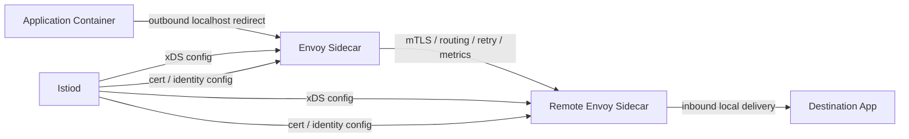
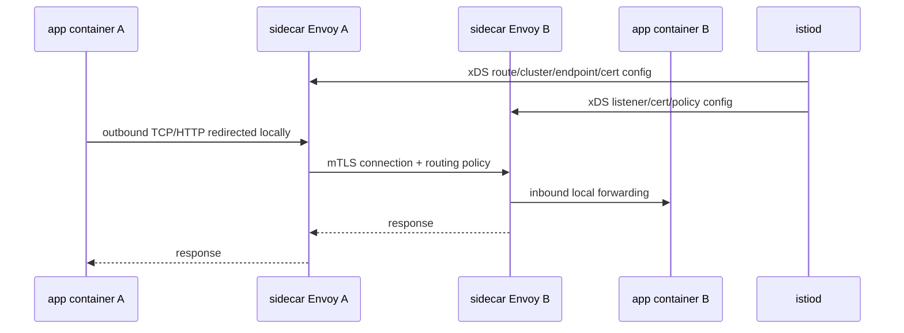
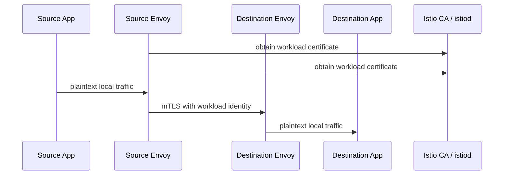

# Part 021 — Istio Sidecar Mode: Traffic, Security, and Telemetry

## 1. Tujuan Part Ini

Part 020 menjelaskan service mesh sebagai distributed traffic control system. Part ini memperdalam mode Istio yang paling klasik dan paling banyak ditemui di produksi: **sidecar mode**.

Target part ini:

> Anda mampu membaca, mendesain, mengaudit, dan men-debug Istio sidecar mode sebagai kombinasi traffic management, workload identity, mTLS, authorization, dan telemetry — bukan sekadar “tambahkan label namespace lalu semua aman”.

Setelah part ini, Anda harus bisa menjawab:

- Bagaimana Envoy sidecar masuk ke Pod?
- Bagaimana inbound dan outbound traffic dialihkan ke proxy?
- Resource Istio mana yang memengaruhi route, cluster, endpoint, TLS, authn, authz, dan telemetry?
- Apa bedanya `VirtualService`, `DestinationRule`, `Gateway`, `ServiceEntry`, dan `Sidecar`?
- Bagaimana mTLS bekerja pada sidecar mode?
- Bagaimana policy diterapkan dan mengapa policy bisa terlihat benar tetapi tidak efektif?
- Bagaimana men-debug 404, 503, TLS handshake failure, 403, stale config, dan sidecar OOM?
- Kapan sidecar mode adalah pilihan tepat, dan kapan operational cost-nya terlalu tinggi?

---

## 2. Kaufman Framing: Mulai dari Traffic Capability, Bukan CRD

Framework Kaufman meminta kita memecah skill menjadi unit kecil yang bisa dilatih dan dikoreksi cepat. Untuk Istio sidecar mode, jangan mulai dari hafalan CRD. Mulai dari pertanyaan operasi:

> “Untuk satu request dari service A ke service B, keputusan apa saja yang sekarang diambil oleh proxy, dari mana proxy mendapat keputusan itu, dan bagaimana kita membuktikan keputusan itu benar?”

Deconstruction:

| Skill | Pertanyaan Latihan |
|---|---|
| Injection | Apakah proxy benar-benar ada di Pod dan disiapkan sebelum traffic produksi? |
| Interception | Apakah outbound/inbound traffic benar-benar melewati sidecar? |
| Routing | Rule mana yang memilih destination subset, weight, timeout, retry, mirror, atau fault injection? |
| Destination policy | Apakah mTLS, load balancing, outlier detection, dan connection pool diterapkan ke host yang benar? |
| Identity | Principal apa yang dipakai source dan destination? |
| AuthN | Apakah workload menerima plaintext, mTLS, JWT, atau kombinasi? |
| AuthZ | Apakah policy allow/deny cocok dengan source principal, method, path, port, host, dan namespace? |
| Telemetry | Apakah metrics/log/trace merepresentasikan request path yang benar? |
| Debugging | Apakah failure berasal dari aplikasi, Envoy, Istiod, cert, DNS, endpoint, policy, atau route? |

Prinsip latihan:

1. ambil satu request;
2. prediksi route dan policy yang berlaku;
3. lihat konfigurasi Envoy aktual;
4. kirim request;
5. bandingkan hasil dengan prediksi;
6. ubah satu variabel;
7. ulangi sampai mental model stabil.

---

## 3. Sidecar Mode dalam Satu Kalimat

Dalam Istio sidecar mode:

```txt
Setiap workload Pod mendapatkan Envoy proxy di Pod yang sama; traffic inbound dan outbound dialihkan melalui proxy; Istiod mengirim config, certificate, policy, dan telemetry behavior ke proxy tersebut.
```

Istio documentation menjelaskan service mesh sebagai split antara data plane dan control plane. Pada sidecar mode, data plane terdiri dari Envoy proxy yang berjalan sebagai sidecar dan memediasi komunikasi antar microservice. Control plane mengelola dan mengonfigurasi proxy untuk routing traffic.

Mental model:



---

## 4. Apa yang Sebenarnya Berubah Saat Sidecar Ditambahkan?

Tanpa mesh:

```txt
app A -> DNS -> Service VIP -> kube-proxy/CNI -> endpoint Pod B -> app B
```

Dengan sidecar mode:

```txt
app A -> local redirect -> Envoy A -> mTLS/routing/policy -> Envoy B -> local delivery -> app B
```

Perubahan penting:

| Area | Tanpa Mesh | Dengan Sidecar Mode |
|---|---|---|
| TLS | aplikasi/library | Envoy sidecar |
| retry | aplikasi/client library | Envoy route policy |
| timeout | aplikasi/client library | Envoy route/cluster policy plus app timeout |
| identity | IP, token, app-level identity | workload principal/certificate |
| authz | app, API gateway, network policy | Envoy policy enforcement plus app |
| telemetry | app instrumentation | proxy telemetry plus app telemetry |
| traffic split | deployment/LB/client logic | proxy route policy |
| failure surface | app + Kubernetes network | app + Kubernetes network + proxy + control plane |

Top 1% engineer tidak hanya bertanya “apakah Istio aktif?” Mereka bertanya:

> “Keputusan mana yang pindah dari kode aplikasi ke proxy, dan siapa yang bertanggung jawab atas correctness keputusan itu?”

---

## 5. Sidecar Injection Lifecycle

Istio sidecar bisa ditambahkan secara otomatis melalui namespace/pod label atau secara manual memakai `istioctl kube-inject`. Pada automatic injection, admission webhook memodifikasi Pod saat dibuat.

Typical namespace enrollment:

```bash
kubectl label namespace payments istio-injection=enabled
```

Atau revision-based enrollment:

```bash
kubectl label namespace payments istio.io/rev=1-30-2
```

Revision-based injection lebih cocok untuk produksi karena memungkinkan canary upgrade control plane/proxy.

### 5.1 Apa yang Ditambahkan ke Pod?

Biasanya Anda akan melihat:

- container `istio-proxy`;
- init container atau CNI-based traffic redirection setup;
- volume untuk certificate/config;
- environment variables;
- readiness/liveness untuk proxy;
- annotations berisi status injection;
- security context tertentu.

Validasi cepat:

```bash
kubectl get pod -n payments checkout-abc -o jsonpath='{.spec.containers[*].name}'
kubectl describe pod -n payments checkout-abc | grep -i istio
istioctl proxy-status
```

### 5.2 Injection Failure Mode

| Symptom | Kemungkinan Penyebab | Cara Validasi |
|---|---|---|
| Pod tidak punya `istio-proxy` | namespace label salah, webhook down, pod dibuat sebelum label | `kubectl get ns --show-labels`, `kubectl describe pod` |
| Pod stuck init | iptables/init permission, CNI issue, image pull | `kubectl logs -c istio-init`, event Pod |
| Proxy ada tapi tidak ready | tidak bisa reach Istiod, cert issue, config reject | `istioctl proxy-status`, proxy logs |
| Beberapa Pod injected, beberapa tidak | mixed namespace labels, rollout lama | compare ReplicaSet generation |
| Upgrade proxy tidak merata | workload belum restart | check proxy image/version |

Rule praktis:

> Label namespace tidak mengubah Pod yang sudah ada. Untuk mendapat sidecar atau proxy revision baru, Pod harus dibuat ulang.

---

## 6. Traffic Interception: Kenapa App Tidak Perlu Tahu Envoy?

Sidecar mode bekerja karena traffic dari/ke aplikasi dialihkan secara transparan ke Envoy.

Typical outbound path:



Traffic interception can be implemented through init container iptables programming or Istio CNI. In production clusters with stricter pod security controls, Istio CNI is often preferred because it reduces the need for privileged init container behavior inside application Pod lifecycle.

Key point:

```txt
The application still thinks it is connecting to the service.
The kernel redirects the connection to the proxy.
The proxy decides what actually happens next.
```

This is powerful but dangerous. You can change production traffic behavior without modifying application code. Therefore, route and policy review must be treated like code review.

---

## 7. Istio Resource Map: Jangan Campur Semuanya

Istio sidecar mode has a large API surface. The productive mental model is to group resources by decision type.

| Decision Type | Main Resources |
|---|---|
| External ingress | `Gateway`, `VirtualService` |
| Internal routing | `VirtualService` |
| Destination behavior | `DestinationRule` |
| External dependency modeling | `ServiceEntry` |
| Egress control | `ServiceEntry`, `DestinationRule`, egress gateway pattern |
| Proxy config scoping | `Sidecar` |
| Peer authentication / mTLS mode | `PeerAuthentication` |
| Request authentication / JWT | `RequestAuthentication` |
| Authorization | `AuthorizationPolicy` |
| Telemetry behavior | `Telemetry` |
| Low-level extension | `EnvoyFilter` |

Avoid this anti-pattern:

```txt
Every team writes arbitrary VirtualService/DestinationRule/EnvoyFilter because “it works”.
```

Better:

```txt
Platform team owns mesh defaults and guardrails.
App team owns explicit route intent inside allowed boundary.
Security team owns identity/authz baseline.
SRE team owns runtime SLO and failure playbooks.
```

---

## 8. VirtualService: Route Intent

`VirtualService` describes traffic routing rules. It can match by host, path, header, method, port, URI, and other attributes depending on protocol.

Common use cases:

- route by URI prefix;
- route by header;
- traffic split between versions;
- timeout;
- retry;
- fault injection;
- mirroring;
- rewrite;
- redirect.

Example: weighted internal canary.

```yaml
apiVersion: networking.istio.io/v1
kind: VirtualService
metadata:
  name: checkout
  namespace: payments
spec:
  hosts:
    - checkout.payments.svc.cluster.local
  http:
    - route:
        - destination:
            host: checkout.payments.svc.cluster.local
            subset: stable
          weight: 90
        - destination:
            host: checkout.payments.svc.cluster.local
            subset: canary
          weight: 10
      timeout: 2s
      retries:
        attempts: 2
        perTryTimeout: 500ms
        retryOn: connect-failure,refused-stream,unavailable,cancelled,retriable-status-codes
```

Mental model:

```txt
VirtualService chooses where a request should go and what HTTP-level behavior applies.
DestinationRule defines what the destination subsets mean and how connections to that destination behave.
```

---

## 9. DestinationRule: Destination Behavior

`DestinationRule` applies policies after routing has selected a destination host. It commonly defines:

- subsets;
- load balancing policy;
- connection pool;
- outlier detection;
- TLS mode;
- locality load balancing;
- port-level settings.

Example:

```yaml
apiVersion: networking.istio.io/v1
kind: DestinationRule
metadata:
  name: checkout
  namespace: payments
spec:
  host: checkout.payments.svc.cluster.local
  trafficPolicy:
    loadBalancer:
      simple: LEAST_REQUEST
    connectionPool:
      tcp:
        maxConnections: 100
      http:
        http1MaxPendingRequests: 1000
        maxRequestsPerConnection: 100
    outlierDetection:
      consecutive5xxErrors: 5
      interval: 10s
      baseEjectionTime: 30s
  subsets:
    - name: stable
      labels:
        version: stable
    - name: canary
      labels:
        version: canary
```

Failure mode yang sering terjadi:

| Problem | Root Cause |
|---|---|
| `VirtualService` references subset but traffic 503 | subset tidak didefinisikan atau label tidak cocok |
| traffic split tidak terjadi | host mismatch antara Service name pendek vs FQDN |
| mTLS gagal | `DestinationRule` TLS mode conflict dengan mesh setting |
| connection reset saat rollout | connection pool/drain tidak aligned dengan app termination |
| canary tidak mendapat traffic | route match precedence salah |

---

## 10. Gateway vs Kubernetes Gateway API

Istio memiliki resource `Gateway` sendiri dari awal. Gateway API Kubernetes adalah API berbeda dengan group `gateway.networking.k8s.io`.

| Area | Istio `Gateway` | Kubernetes Gateway API |
|---|---|---|
| API group | `networking.istio.io` | `gateway.networking.k8s.io` |
| Era desain | Istio-native | Kubernetes SIG Network standardization |
| Route binding | `VirtualService.gateways` | `parentRefs` dari Route ke Gateway/Service |
| Portability | Istio-specific | lebih portable secara API, tergantung controller conformance |
| Mesh integration | native Istio | GAMMA / implementation support |

Dalam sidecar mode yang sudah lama berjalan, Anda akan sering menemukan Istio `Gateway` + `VirtualService`. Pada platform baru, Gateway API biasanya lebih masuk akal sebagai public platform contract, tetapi migration harus hati-hati karena behavior controller-specific tetap bisa berbeda.

---

## 11. ServiceEntry: Modeling External Dependencies

`ServiceEntry` memungkinkan Istio mengetahui external service yang tidak ada sebagai Kubernetes Service biasa.

Use cases:

- allow-list external host;
- egress telemetry untuk external dependency;
- TLS origination;
- external service failover;
- modeling VM/bare-metal workload;
- egress gateway pattern.

Example:

```yaml
apiVersion: networking.istio.io/v1
kind: ServiceEntry
metadata:
  name: payment-provider
  namespace: payments
spec:
  hosts:
    - api.payment-provider.example
  ports:
    - number: 443
      name: tls
      protocol: TLS
  resolution: DNS
  location: MESH_EXTERNAL
```

Top 1% consideration:

> `ServiceEntry` is not a firewall by itself. It models traffic for the mesh. Real egress control usually needs mesh config, sidecar scoping, NetworkPolicy/CNI policy, DNS discipline, and cloud firewall/NAT controls.

---

## 12. Sidecar Resource: Scope the Proxy, Reduce Blast Radius

The `Sidecar` resource controls the configuration scope for sidecar proxies. Without careful scoping, every proxy may receive configuration for many services it does not need.

Why this matters:

- large clusters can create huge xDS config;
- proxy memory grows;
- Istiod push cost grows;
- route ambiguity increases;
- debugging gets harder.

Example boundary:

```yaml
apiVersion: networking.istio.io/v1
kind: Sidecar
metadata:
  name: payments-default
  namespace: payments
spec:
  egress:
    - hosts:
        - "./*"
        - "shared-observability/*"
        - "istio-system/*"
```

Interpretation:

- `./*` means services in the same namespace;
- explicit namespaces can be allowed;
- everything else is not automatically visible from the proxy config perspective.

Sidecar scoping is not a substitute for authorization. It is a config distribution boundary and operational scaling mechanism.

---

## 13. mTLS in Sidecar Mode

Istio sidecar mode can automatically provide mutual TLS between workloads with sidecars. The destination sidecar terminates mTLS and forwards plaintext to the local app unless the app itself also uses TLS.

Conceptual flow:



Important distinction:

| Term | Meaning |
|---|---|
| transport encryption | traffic encrypted on the wire between proxies |
| workload identity | certificate principal used by proxy on behalf of workload |
| application TLS | app itself speaks TLS |
| mesh mTLS | proxy-to-proxy mutual TLS |
| end-to-end TLS | encryption from app client to app server, not terminated by mesh proxy |

If compliance requires app-level end-to-end encryption, mesh mTLS alone may not satisfy the requirement.

---

## 14. PeerAuthentication: What Does the Destination Accept?

`PeerAuthentication` controls what kind of peer authentication/mTLS mode destination workloads accept.

Common modes:

| Mode | Meaning | Production Use |
|---|---|---|
| `PERMISSIVE` | accept plaintext and mTLS | migration phase |
| `STRICT` | require mTLS | mature mesh baseline |
| `DISABLE` | disable mTLS | rare, risky, compatibility only |
| `UNSET` | inherit parent/default | useful for hierarchy |

Example namespace strict mTLS:

```yaml
apiVersion: security.istio.io/v1
kind: PeerAuthentication
metadata:
  name: default
  namespace: payments
spec:
  mtls:
    mode: STRICT
```

Failure modes:

| Symptom | Likely Root Cause |
|---|---|
| plaintext client fails after strict mTLS | source not in mesh or no sidecar |
| intermittent TLS failure | some pods injected, some not |
| policy appears applied but no effect | namespace/workload selector mismatch |
| legacy service breaks | migration skipped permissive observation period |

---

## 15. RequestAuthentication: JWT Verification

`RequestAuthentication` tells Istio how to validate JWT tokens. It verifies tokens but does not, by itself, authorize business access. Authorization is typically expressed with `AuthorizationPolicy`.

Example:

```yaml
apiVersion: security.istio.io/v1
kind: RequestAuthentication
metadata:
  name: checkout-jwt
  namespace: payments
spec:
  selector:
    matchLabels:
      app: checkout
  jwtRules:
    - issuer: "https://issuer.example"
      jwksUri: "https://issuer.example/.well-known/jwks.json"
```

Pair it with authorization:

```yaml
apiVersion: security.istio.io/v1
kind: AuthorizationPolicy
metadata:
  name: checkout-require-jwt
  namespace: payments
spec:
  selector:
    matchLabels:
      app: checkout
  action: ALLOW
  rules:
    - from:
        - source:
            requestPrincipals: ["*"]
```

Mental model:

```txt
RequestAuthentication proves token validity.
AuthorizationPolicy decides whether the request is allowed.
```

---

## 16. AuthorizationPolicy: Allow/Deny with Workload Identity

`AuthorizationPolicy` can allow or deny based on attributes such as source principal, namespace, IP, request principal, method, path, host, and port.

Example: allow only checkout service account to call payment API.

```yaml
apiVersion: security.istio.io/v1
kind: AuthorizationPolicy
metadata:
  name: payment-api-allow-checkout
  namespace: payments
spec:
  selector:
    matchLabels:
      app: payment-api
  action: ALLOW
  rules:
    - from:
        - source:
            principals:
              - cluster.local/ns/payments/sa/checkout
      to:
        - operation:
            methods: ["POST"]
            paths: ["/payments/*"]
```

Critical invariant:

> Authorization enforced by the destination proxy is only as strong as the traffic path guarantee that traffic reaches that proxy.

Therefore validate:

- destination Pod has sidecar;
- traffic is captured;
- mTLS identity exists;
- policy selector matches the destination workload;
- request protocol is correctly detected as HTTP if matching path/method;
- policy is not shadowed by broader allow/deny behavior.

---

## 17. DENY, ALLOW, and Dry-Run Discipline

A safe production policy rollout usually follows this sequence:

1. observe traffic with telemetry;
2. define intended callers;
3. create dry-run policy if supported for the scenario;
4. test in staging with representative traffic;
5. apply namespace-level default deny carefully;
6. apply explicit allow rules;
7. verify metrics/logs;
8. run rollback plan.

Dangerous pattern:

```yaml
# Looks secure, but can break everything if callers are not fully enumerated.
action: ALLOW
rules:
  - from:
      - source:
          principals:
            - cluster.local/ns/payments/sa/checkout
```

Better migration posture:

```txt
Observe -> report -> dry-run -> partial enforcement -> strict enforcement -> continuous drift detection
```

---

## 18. Telemetry: Proxy Observability Is Not Application Truth

Istio can generate detailed metrics, access logs, and traces from proxy behavior. This is powerful because it does not require every application team to instrument basic service-to-service visibility from scratch.

Telemetry dimensions commonly include:

- source workload;
- destination workload;
- namespace;
- service;
- response code;
- response flags;
- latency;
- request protocol;
- mTLS status;
- reporter source/destination.

But proxy telemetry has limits:

| Proxy Sees | Proxy May Not Know |
|---|---|
| HTTP status | business success/failure semantics |
| transport latency | DB/query/internal app timing |
| request path | internal business operation state |
| mTLS identity | user identity unless propagated/verified |
| upstream reset | exact application exception |

Use proxy telemetry to answer:

```txt
Who called whom, through which path, with what transport result?
```

Use application telemetry to answer:

```txt
What business operation happened, and why did application logic succeed or fail?
```

---

## 19. Telemetry API Example

Example: enable access logging for namespace.

```yaml
apiVersion: telemetry.istio.io/v1
kind: Telemetry
metadata:
  name: payments-access-logs
  namespace: payments
spec:
  accessLogging:
    - providers:
        - name: envoy
```

Example tracing sampling should be used carefully:

```yaml
apiVersion: telemetry.istio.io/v1
kind: Telemetry
metadata:
  name: payments-tracing
  namespace: payments
spec:
  tracing:
    - providers:
        - name: otel
      randomSamplingPercentage: 5.0
```

Production warning:

> More telemetry is not automatically better. High-cardinality labels and verbose access logs can become a reliability and cost incident.

---

## 20. Protocol Detection and Port Naming

Istio behavior depends heavily on protocol awareness. If Istio cannot infer that traffic is HTTP/gRPC, L7 features like path-based authz, route matching, retries, and metrics may not behave as expected.

Good Service port naming:

```yaml
ports:
  - name: http-api
    port: 8080
    targetPort: 8080
```

Bad or ambiguous:

```yaml
ports:
  - name: web
    port: 8080
```

Failure mode:

| Symptom | Possible Cause |
|---|---|
| path-based AuthorizationPolicy not applied | port treated as TCP |
| HTTP metrics missing | protocol detection failed |
| gRPC behaves like opaque TCP | wrong port naming or ALPN issue |
| route match ignored | request is not seen as HTTP by Envoy |

---

## 21. Timeouts, Retries, and the Retry Storm Trap

Istio makes it easy to configure retries. That is not the same as making retries safe.

Retry budget mental model:

```txt
total downstream request budget >= application work + upstream timeout + retry attempts + queueing + network variance
```

Bad pattern:

```yaml
retries:
  attempts: 5
  perTryTimeout: 2s
```

If the caller has a 3s timeout, this config is logically inconsistent. It may cause wasted work and cascading load.

Better reasoning:

| Parameter | Question |
|---|---|
| caller timeout | How long can user/business workflow wait? |
| per-try timeout | How long before one upstream attempt is considered failed? |
| attempts | How many attempts fit the caller budget? |
| retryOn | Which failures are safe to retry? |
| idempotency | Is the operation safe to replay? |
| circuit breaker | What prevents amplification during outage? |

Never configure retries on non-idempotent writes unless you have a clear idempotency key or deduplication contract.

---

## 22. Debugging Workflow: From Symptom to Proxy Config

Use a hypothesis-driven path. Do not randomly edit YAML.

### 22.1 Check Mesh Enrollment

```bash
kubectl get pod -n payments checkout-abc -o jsonpath='{.spec.containers[*].name}'
istioctl proxy-status
istioctl proxy-status | grep checkout
```

### 22.2 Inspect Effective Config

```bash
istioctl proxy-config listeners deploy/checkout -n payments
istioctl proxy-config routes deploy/checkout -n payments
istioctl proxy-config clusters deploy/checkout -n payments
istioctl proxy-config endpoints deploy/checkout -n payments
istioctl proxy-config secret deploy/checkout -n payments
```

### 22.3 Analyze Istio Objects

```bash
istioctl analyze -A
kubectl get virtualservice,destinationrule,peerauthentication,authorizationpolicy -A
```

### 22.4 Compare Source and Destination

```bash
istioctl proxy-config cluster deploy/checkout -n payments | grep payment-api
istioctl proxy-config listener deploy/payment-api -n payments
kubectl logs deploy/payment-api -c istio-proxy -n payments
```

### 22.5 Reason by Error Class

| Error | Usual Layer |
|---|---|
| 404 from Envoy | route/host/path mismatch |
| 503 UF | upstream connection failure |
| 503 NR | no route |
| 503 UH | no healthy upstream |
| 403 | AuthorizationPolicy/JWT/peer identity |
| TLS handshake failure | mTLS mode/cert/trust domain/DestinationRule |
| intermittent failure | mixed injected/non-injected pods, endpoint churn, locality, stale config |

---

## 23. Production Failure Modes

| Failure Mode | Why It Happens | Prevention |
|---|---|---|
| Sidecar missing | namespace label drift or rollout history | admission policy, mesh enrollment dashboard |
| Mixed proxy versions | canary upgrade incomplete | revision-based upgrade plan |
| Envoy OOM | config explosion, high concurrency, access log volume | Sidecar scoping, resource sizing, telemetry budget |
| Retry storm | unsafe retry policy | retry budget, idempotency review, circuit breaker |
| Route shadowing | broad match before specific match | route review, tests, `istioctl analyze` |
| mTLS strict breaks legacy | source lacks proxy | phased migration, permissive observation |
| AuthZ denies valid caller | wrong principal or selector | policy dry-run, log denied principal |
| AuthZ allows too much | namespace wildcard or broad principals | least privilege review |
| Telemetry cardinality explosion | dynamic path/header labels | label hygiene |
| Stale config | Istiod/proxy sync issue | proxy-status, canary restart, watch Istiod metrics |
| Egress bypass | traffic not captured or external IP path | NetworkPolicy/CNI/cloud firewall plus mesh egress |
| EnvoyFilter incident | unsafe low-level patch | strict ownership, tests, avoid unless necessary |

---

## 24. Architecture Decision: When Sidecar Mode Is a Good Fit

Sidecar mode is usually strong when:

- you need mature L7 traffic management per workload;
- app teams run heterogeneous languages/frameworks;
- mTLS and identity must be standardized;
- you need fine-grained HTTP/gRPC authorization;
- you need battle-tested behavior and ecosystem maturity;
- you can afford per-Pod proxy overhead;
- platform team can operate Istio as production infrastructure.

Sidecar mode is weak when:

- workloads are extremely resource constrained;
- startup latency and Pod density are critical;
- most traffic only needs L4 encryption/policy;
- many short-lived jobs make injection overhead painful;
- app teams cannot tolerate proxy-in-path complexity;
- mesh ownership is unclear.

Decision invariant:

```txt
Adopt sidecar mode only when the value of per-workload L7 control exceeds the operational tax of per-workload proxies.
```

---

## 25. Lab 1 — Trace One Request Through Sidecar Mode

Goal: prove the request path.

Steps:

1. deploy `frontend` and `backend` in injected namespace;
2. call `backend` from `frontend`;
3. inspect source routes and clusters;
4. inspect destination listeners;
5. confirm mTLS secret exists;
6. enable access logs;
7. compare source and destination telemetry.

Commands:

```bash
kubectl exec -n payments deploy/frontend -c app -- curl -sS http://backend:8080/health
istioctl proxy-config routes deploy/frontend -n payments
istioctl proxy-config clusters deploy/frontend -n payments | grep backend
istioctl proxy-config listeners deploy/backend -n payments
istioctl proxy-config secret deploy/frontend -n payments
```

Expected learning:

```txt
The Kubernetes Service gives identity/rendezvous.
Envoy applies route/policy/telemetry.
Istiod provides the config that makes Envoy behavior possible.
```

---

## 26. Lab 2 — Break mTLS Intentionally

Goal: distinguish mTLS failure from route failure.

Steps:

1. set namespace `PeerAuthentication` to `STRICT`;
2. call destination from injected source;
3. call destination from non-injected source;
4. inspect Envoy logs and response code;
5. return to safe state.

Expected result:

- injected source works;
- non-injected source fails;
- failure is transport/authentication, not HTTP route.

---

## 27. Lab 3 — Break Authorization Intentionally

Goal: learn principal-based allow list.

Steps:

1. create `AuthorizationPolicy` allowing only `checkout` service account;
2. call from `checkout`;
3. call from `debug` pod;
4. inspect denied source principal;
5. fix policy.

Key question:

```txt
Did we deny by workload identity, namespace, path, method, or accidental protocol mismatch?
```

---

## 28. Lab 4 — Validate Canary Route

Goal: prove VirtualService + DestinationRule behavior.

Steps:

1. deploy `backend` with `version: stable` and `version: canary`;
2. define subsets;
3. configure 90/10 split;
4. generate 1000 requests;
5. observe distribution;
6. change to 50/50;
7. rollback.

Watch for:

- sticky sessions;
- small sample size distortion;
- subset label mismatch;
- route host mismatch;
- telemetry reporter confusion.

---

## 29. Top 1% Checklist untuk Istio Sidecar Mode

Sebelum production rollout, pastikan:

- namespace enrollment jelas;
- revision-based upgrade strategy ada;
- proxy resource request/limit disizing;
- default mTLS posture terdokumentasi;
- legacy traffic migration plan ada;
- AuthorizationPolicy punya owner dan review process;
- protocol naming benar;
- timeout/retry policy konsisten dengan app SLO;
- DestinationRule subset label tervalidasi;
- Sidecar scoping dipertimbangkan untuk cluster besar;
- EnvoyFilter dibatasi ketat;
- telemetry cardinality dikontrol;
- proxy access log tidak membanjiri storage;
- `istioctl analyze` masuk CI/CD atau release gate;
- runbook untuk 403, 404, 503, TLS failure, and proxy OOM tersedia;
- app teams tahu behavior yang dipindahkan ke mesh.

---

## 30. Ringkasan

Istio sidecar mode memberi kontrol L7 yang kuat karena Envoy berada di setiap Pod. Itu memungkinkan mTLS, traffic shaping, authorization, telemetry, retry, timeout, mirroring, dan circuit-breaking tanpa mengubah semua aplikasi.

Tetapi konsekuensinya besar:

```txt
Every workload gets a proxy.
Every proxy needs config.
Every config decision can affect production traffic.
```

Sidecar mode bukan hanya fitur security atau observability. Ia adalah runtime traffic governance layer. Engineer yang kuat tidak hanya bisa menulis `VirtualService`, tetapi bisa membuktikan bagaimana request benar-benar diproses oleh Envoy, policy mana yang berlaku, cert mana yang dipakai, dan failure mana yang sedang terjadi.

Part berikutnya akan membahas **Istio ambient mesh**: ztunnel, waypoint, HBONE, split L4/L7, sidecarless trade-off, enrollment, policy migration, dan failure mode baru yang berbeda dari sidecar mode.

---

## 31. Referensi

- Istio Documentation — Sidecar or ambient?: https://istio.io/latest/docs/overview/dataplane-modes/
- Istio Documentation — Architecture: https://istio.io/latest/docs/ops/deployment/architecture/
- Istio Documentation — Installing the Sidecar: https://istio.io/latest/docs/setup/additional-setup/sidecar-injection/
- Istio Documentation — Traffic Management: https://istio.io/latest/docs/concepts/traffic-management/
- Istio Documentation — Security: https://istio.io/latest/docs/concepts/security/
- Istio Documentation — Mutual TLS Migration: https://istio.io/latest/docs/tasks/security/authentication/mtls-migration/
- Istio Documentation — Authorization Policy Reference: https://istio.io/latest/docs/reference/config/security/authorization-policy/
- Istio Documentation — Telemetry API: https://istio.io/latest/docs/reference/config/telemetry/
- Istio Documentation — Observability: https://istio.io/latest/docs/concepts/observability/
- Istio Documentation — Performance and Scalability: https://istio.io/latest/docs/ops/deployment/performance-and-scalability/
- Envoy Documentation — xDS Protocol: https://www.envoyproxy.io/docs/envoy/latest/api-docs/xds_protocol
