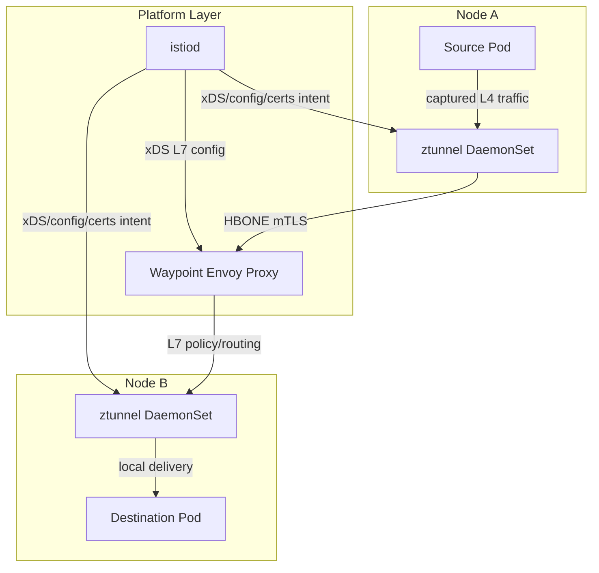
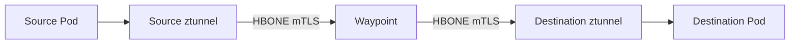

# Part 022 — Istio Ambient Mesh: ztunnel, Waypoint, and L4/L7 Split

## 1. Tujuan Part Ini

Part 021 membahas Istio sidecar mode. Sidecar mode kuat, matang, dan kaya fitur, tetapi membayar biaya per-Pod proxy. Part ini membahas alternatif Istio modern: **ambient mesh**.

Target part ini:

> Anda mampu menjelaskan ambient mesh sebagai service mesh sidecarless yang memisahkan L4 secure overlay dari L7 processing, menggunakan ztunnel untuk L4/mTLS dan waypoint proxy untuk L7 policy/traffic management.

Setelah part ini, Anda harus bisa menjawab:

- Problem apa yang ingin diselesaikan ambient mesh dibanding sidecar mode?
- Apa itu `ztunnel`?
- Apa itu waypoint proxy?
- Apa itu HBONE dan mengapa penting?
- Bagaimana request path berbeda untuk workload out-of-mesh, in-mesh L4-only, dan in-mesh dengan waypoint?
- Policy mana yang berlaku di ztunnel, dan policy mana yang perlu waypoint?
- Mengapa Gateway API lebih penting di ambient mode?
- Apa migration trap dari `VirtualService`/selector-based policy ke ambient?
- Failure mode baru apa yang muncul karena L4/L7 split?

---

## 2. Kaufman Framing: Pisahkan Capability, Jangan Sekadar “Sidecarless”

Kesalahan umum adalah mendefinisikan ambient mesh sebagai “Istio tanpa sidecar”. Itu benar secara permukaan, tetapi tidak cukup untuk desain produksi.

Mental model yang lebih baik:

```txt
Ambient mesh memecah service mesh menjadi dua lapisan:
1. L4 secure overlay: ztunnel, mTLS, identity, basic L4 policy, TCP telemetry.
2. L7 processing: waypoint proxy, HTTP/gRPC routing, L7 authorization, request telemetry, filters.
```

Dalam framework Kaufman, skill ini dideconstruct menjadi:

| Skill | Fokus |
|---|---|
| Enrollment | Workload mana yang masuk ambient mesh? |
| L4 path | Bagaimana ztunnel menangkap, mengamankan, dan meneruskan traffic? |
| Identity | Cert siapa yang dipakai saat ztunnel mewakili workload? |
| L7 opt-in | Kapan perlu waypoint? |
| Gateway API | Bagaimana `HTTPRoute` melekat ke Service/waypoint? |
| Policy placement | Policy ini harus ditegakkan di ztunnel atau waypoint? |
| Migration | Apa yang tidak bisa dipindahkan 1:1 dari sidecar mode? |
| Debugging | Apakah request melewati ztunnel, waypoint, keduanya, atau bypass? |

Deliberate practice:

1. jalankan workload tanpa mesh;
2. masukkan ke ambient L4-only;
3. aktifkan mTLS dan L4 authz;
4. tambahkan waypoint;
5. pindahkan satu L7 policy ke waypoint;
6. lihat perubahan telemetry;
7. uji traffic dari source yang out-of-mesh;
8. catat bypass dan failure mode.

---

## 3. Mengapa Ambient Mesh Ada?

Sidecar mode memberi kontrol L7 per workload, tetapi memiliki biaya:

- satu proxy per Pod;
- memory/CPU overhead per workload;
- startup/shutdown coordination;
- injection lifecycle;
- proxy upgrade harus menyentuh workload;
- config distribution besar;
- operational burden untuk setiap team;
- debugging app vs sidecar sering membingungkan.

Ambient mesh mencoba mengubah cost model:

```txt
Tidak semua workload butuh L7 proxy per Pod.
Banyak workload cukup butuh mTLS, identity, L4 authorization, dan TCP telemetry.
L7 proxy hanya ditambahkan saat fitur L7 memang dibutuhkan.
```

Istio documentation menjelaskan ambient mode sebagai pemisahan dua layer: ztunnel secure overlay untuk routing dan zero-trust security, serta waypoint proxy opsional untuk full range fitur L7.

---

## 4. Core Architecture



Components:

| Component | Role |
|---|---|
| `ztunnel` | node-level proxy for ambient L4 traffic, mTLS, identity, L4 authorization, TCP telemetry |
| waypoint proxy | Envoy deployment for L7 processing for selected workloads/services/namespaces |
| Istiod | control plane for identity/config distribution |
| Gateway API | API model used for waypoint and L7 traffic management in ambient |
| CNI/redirect layer | redirects workload traffic into ambient data plane |

---

## 5. Workload Categories in Ambient Mesh

Istio ambient data plane documentation classifies workload behavior roughly into these categories:

| Category | Meaning | Capabilities |
|---|---|---|
| Out of Mesh | ordinary Pod, ambient not enabled | no ambient mTLS/policy/telemetry |
| In Mesh | traffic intercepted at L4 by ztunnel | mTLS, L4 authz, TCP telemetry |
| In Mesh + Waypoint | traffic also uses waypoint for L7 | HTTP/gRPC routing, L7 authz, request telemetry, filters |

This is the most important ambient mental model:

```txt
Ambient enrollment gives L4 mesh.
Waypoint enrollment gives L7 mesh.
```

Do not assume that adding a workload to ambient automatically gives all sidecar-mode L7 behavior.

---

## 6. ztunnel: The L4 Secure Overlay

`ztunnel` runs as a node-level component, commonly as a DaemonSet. It handles traffic for ambient-enrolled workloads on that node.

Responsibilities:

- transparent L4 interception;
- workload identity on behalf of local pods;
- mTLS tunnel establishment;
- L4 authorization enforcement;
- TCP telemetry;
- forwarding to destination ztunnel or waypoint;
- certificate fetch/rotation for node-local workload identities.

What ztunnel is **not**:

- not a full L7 HTTP router;
- not equivalent to sidecar Envoy;
- not where path/method/header-based HTTP policy should live;
- not the place to run arbitrary Envoy filters for app-layer behavior.

Mental model:

```txt
ztunnel is the ambient mesh transport and identity layer.
Waypoint is the optional application protocol layer.
```

---

## 7. HBONE: mTLS Tunnel as Ambient Transport

HBONE stands for HTTP-Based Overlay Network Environment. Istio documents it as a secure tunneling protocol between Istio components that multiplexes TCP streams for many application connections over a mutual-TLS encrypted network connection.

Conceptual layers:

```txt
Application TCP stream
  -> captured by ambient redirect
  -> encapsulated into HBONE
  -> protected by mTLS
  -> forwarded between ztunnel/waypoint components
  -> decapsulated near destination
```

Simplified view:


With waypoint:



Operational implication:

> When debugging ambient, you must identify whether the failure happened before capture, inside ztunnel, inside HBONE transport, inside waypoint L7 processing, or after destination delivery.

---

## 8. Waypoint Proxy: L7 Only Where Needed

A waypoint proxy is an Envoy-based proxy deployed as infrastructure, not injected into every application Pod. It provides L7 processing for selected workloads, services, service accounts, or namespaces depending on configuration pattern and Istio version capabilities.

Waypoint enables:

- HTTP/gRPC routing;
- L7 AuthorizationPolicy;
- RequestAuthentication/JWT enforcement;
- Telemetry at request level;
- Wasm/Lua-style extensions where supported;
- traffic splitting;
- retries/timeouts;
- Gateway API `HTTPRoute` behavior.

Waypoint does not mean every traffic path automatically passes through it. A key documented behavior: when destination is waypoint-enabled, an ambient source ztunnel sends the request through the waypoint. A workload outside the mesh does not know about waypoint proxies and can send directly to destination unless separate controls prevent that.

Production invariant:

```txt
If an L7 policy is security-critical, prove that all relevant sources are forced through the waypoint.
```

---

## 9. Request Path Matrix

| Source | Destination | Waypoint? | Expected Path |
|---|---|---|---|
| out-of-mesh | out-of-mesh | no | normal Kubernetes networking |
| ambient | ambient | no | source pod -> source ztunnel -> HBONE -> dest ztunnel -> dest pod |
| ambient | ambient | yes | source pod -> source ztunnel -> waypoint -> dest ztunnel -> dest pod |
| out-of-mesh | ambient | destination waypoint-enabled | may bypass waypoint unless controlled separately |
| sidecar/gateway source | ambient waypoint-enabled | implementation/version dependent; verify behavior | do not assume waypoint path without proof |
| ambient | external service | depends on config | ztunnel capture plus egress behavior/policy design |

The table is intentionally conservative. Production designs should validate behavior against the exact Istio version, CNI mode, cloud networking, Gateway API objects, and policy resources in use.

---

## 10. Ambient Enrollment

Ambient mode is commonly enabled with namespace or workload labeling, for example:

```bash
kubectl label namespace payments istio.io/dataplane-mode=ambient
```

Verify:

```bash
kubectl get ns payments --show-labels
kubectl get pods -n payments -o wide
istioctl ztunnel-config workloads -n payments
```

Important properties:

- no sidecar container is added to application Pods;
- existing Pods may need restart depending on capture/enrollment behavior and operational policy;
- traffic is captured by the ambient data plane rather than sidecar iptables inside each Pod;
- ztunnel becomes critical node infrastructure.

Failure mode:

| Symptom | Possible Root Cause |
|---|---|
| no mTLS observed | namespace/workload not enrolled |
| only some Pods protected | label/rollout drift |
| traffic bypasses ztunnel | CNI/redirect issue or source not enrolled |
| L4 policy not applied | workload not in ambient or selector/target mismatch |

---

## 11. Waypoint Deployment and Gateway API

Waypoints are configured using Kubernetes Gateway API concepts. Istio provides commands to generate/apply waypoint resources, but the important mental model is that waypoint is an infrastructure proxy associated with selected traffic scope.

Typical flow:

```bash
istioctl waypoint apply -n payments
kubectl label namespace payments istio.io/use-waypoint=waypoint
```

Then L7 traffic management commonly uses Gateway API routes.

Example `HTTPRoute` parented to a Service:

```yaml
apiVersion: gateway.networking.k8s.io/v1
kind: HTTPRoute
metadata:
  name: checkout-route
  namespace: payments
spec:
  parentRefs:
    - group: ""
      kind: Service
      name: checkout
      port: 8080
  rules:
    - matches:
        - path:
            type: PathPrefix
            value: /v2
      backendRefs:
        - name: checkout-v2
          port: 8080
    - backendRefs:
        - name: checkout-v1
          port: 8080
```

Key shift from sidecar mode:

```txt
Sidecar mode often uses VirtualService/DestinationRule.
Ambient stable L7 traffic management is increasingly Gateway API-oriented, especially with waypoints.
```

---

## 12. L4 vs L7 Policy Placement

The most common ambient mistake is applying a policy at the wrong layer.

| Requirement | Placement |
|---|---|
| allow only service account A to connect to service B on port 8080 | ztunnel/L4 AuthorizationPolicy |
| require HTTP path `/admin` only from admin service | waypoint/L7 AuthorizationPolicy |
| require JWT claim for HTTP request | waypoint/RequestAuthentication + AuthorizationPolicy |
| mTLS between workloads | ztunnel ambient layer |
| retry HTTP 503 twice | waypoint L7 route policy |
| route `/v2` to canary backend | waypoint + HTTPRoute |
| TCP telemetry | ztunnel |
| HTTP response code telemetry | waypoint |

In ambient migration guides, policies enforced by waypoint use `targetRefs` pointing to resources such as Service or Gateway rather than relying on old selector-based assumptions. Treat this as a semantic migration, not a YAML translation.

---

## 13. Example: L4 Authorization in Ambient

Allow only `checkout` service account to connect to `payment-api` at L4 level:

```yaml
apiVersion: security.istio.io/v1
kind: AuthorizationPolicy
metadata:
  name: payment-api-l4-allow-checkout
  namespace: payments
spec:
  targetRefs:
    - group: ""
      kind: Service
      name: payment-api
  action: ALLOW
  rules:
    - from:
        - source:
            principals:
              - cluster.local/ns/payments/sa/checkout
      to:
        - operation:
            ports: ["8080"]
```

This is a connection/security boundary, not an HTTP path boundary.

---

## 14. Example: L7 Authorization with Waypoint

Require `/payments/admin/*` to be called only by admin workload identity:

```yaml
apiVersion: security.istio.io/v1
kind: AuthorizationPolicy
metadata:
  name: payment-api-admin-l7
  namespace: payments
spec:
  targetRefs:
    - group: ""
      kind: Service
      name: payment-api
  action: ALLOW
  rules:
    - from:
        - source:
            principals:
              - cluster.local/ns/payments/sa/admin-console
      to:
        - operation:
            methods: ["POST"]
            paths: ["/payments/admin/*"]
```

This requires the relevant traffic to pass through waypoint. Without waypoint path guarantee, the policy may not protect the intended path.

Security invariant:

```txt
L7 policy is only enforceable at an L7 proxy.
In ambient mesh, the L7 proxy is the waypoint.
```

---

## 15. Example: Traffic Splitting with HTTPRoute

```yaml
apiVersion: gateway.networking.k8s.io/v1
kind: HTTPRoute
metadata:
  name: checkout-canary
  namespace: payments
spec:
  parentRefs:
    - group: ""
      kind: Service
      name: checkout
      port: 8080
  rules:
    - backendRefs:
        - name: checkout-v1
          port: 8080
          weight: 90
        - name: checkout-v2
          port: 8080
          weight: 10
```

Debug questions:

- Is the destination Service waypoint-enabled?
- Is the source in ambient mesh?
- Is the `HTTPRoute` accepted?
- Does status show correct parent binding?
- Is protocol recognized as HTTP?
- Is the waypoint receiving requests?
- Are response metrics emitted at L7?

---

## 16. Telemetry in Ambient Mode

Telemetry is split by layer.

| Layer | What You See |
|---|---|
| ztunnel | TCP connection metrics, source/destination identity, bytes, connection result |
| waypoint | HTTP/gRPC request metrics, response code, path/method-level behavior where configured |
| application | business metrics, domain errors, internal timings |

This means a dashboard that looked complete in sidecar mode may become misleading after ambient migration if some traffic is L4-only.

Example interpretation:

```txt
If traffic uses only ztunnel, you may see successful TCP connection metrics but no HTTP status code.
If traffic uses waypoint, you can observe L7 request behavior at the waypoint.
```

Top 1% observability model:

```txt
Always tag dashboards by dataplane mode: out-of-mesh, ambient L4-only, ambient with waypoint, sidecar.
```

---

## 17. Identity and Certificate Handling

In sidecar mode, each sidecar obtains certificates for its workload. In ambient mode, ztunnel handles certificates for node-local workload identities. Istio documentation notes that ztunnel manages multiple workload certificates on behalf of proxied workloads and that CA enforcement must ensure ztunnel may request only identities for workloads on that node.

This matters because ztunnel is node-level infrastructure.

Threat model questions:

- What happens if a node is compromised?
- Can ztunnel request identity for workloads not on the node?
- How are certificates rotated?
- How is trust domain configured?
- How are service account tokens protected?
- How is node-level proxy access audited?

Ambient does not remove identity complexity. It moves part of the identity machinery from per-Pod sidecar to node-level proxy.

---

## 18. Security Boundary: Ambient Is Not Automatic Zero Trust

Ambient makes mTLS and L4 identity easier to adopt broadly, but secure posture still requires design discipline.

Required controls:

- explicit enrollment policy;
- default deny at appropriate layer;
- waypoint path guarantee for L7 policy;
- NetworkPolicy/CNI controls for bypass paths;
- ingress/gateway controls for external traffic;
- egress controls for external dependencies;
- audit of out-of-mesh workloads;
- policy tests in CI/CD.

Bad assumption:

```txt
Namespace is labeled ambient, therefore every security requirement is enforced.
```

Better assumption:

```txt
Namespace is labeled ambient, therefore eligible traffic may get L4 mesh behavior. Each security requirement still needs a proven enforcement point.
```

---

## 19. Migration from Sidecar to Ambient

Migration is not purely mechanical.

Sidecar mode features that need careful migration:

| Sidecar Construct | Ambient Consideration |
|---|---|
| `VirtualService` for internal HTTP routing | prefer/require Gateway API `HTTPRoute` for stable waypoint L7 use |
| selector-based L7 policy | may need `targetRefs` to Service/Gateway for waypoint enforcement |
| per-workload EnvoyFilter | may not map cleanly to waypoint/ambient |
| sidecar access logs | split into ztunnel TCP logs and waypoint L7 logs |
| sidecar resource sizing | replaced by ztunnel DaemonSet + waypoint sizing |
| per-Pod proxy failure | replaced by node-level ztunnel and shared waypoint failure domains |

Migration phases:

1. inventory current Istio resources;
2. classify each feature as L4, L7, ingress, egress, telemetry, or extension;
3. identify workloads needing only L4;
4. identify workloads needing waypoint;
5. migrate policies to correct target model;
6. validate request path;
7. compare telemetry before/after;
8. roll out namespace by namespace;
9. keep rollback path to sidecar mode where possible.

---

## 20. Failure Mode: Waypoint Bypass

This is one of the most important ambient-specific failure modes.

Scenario:

```txt
payment-api has waypoint-enabled L7 authz.
checkout is in ambient mesh and calls payment-api through waypoint.
debug pod outside mesh calls payment-api directly.
```

Result:

- checkout path enforces L7 policy;
- out-of-mesh debug path may bypass waypoint unless separate controls prevent direct access;
- if L4 policy allows plaintext/no identity or NetworkPolicy is too broad, security intent fails.

Prevention:

- require ambient enrollment for caller namespaces;
- use L4 AuthorizationPolicy to reject unauthenticated/plaintext sources;
- use Kubernetes NetworkPolicy/CNI policy to restrict direct paths;
- validate with out-of-mesh test pods;
- alert on traffic with no peer identity.

---

## 21. Failure Mode: Wrong Layer Policy

Example:

```txt
Team writes path-based AuthorizationPolicy but workload has no waypoint.
```

Possible result:

- policy is ineffective;
- policy is rejected;
- policy applies differently than expected;
- traffic is only L4-observed.

Review rule:

```txt
Every policy must declare its enforcement layer: ztunnel L4 or waypoint L7.
```

Add this to code review template:

- What resource is targeted?
- Which proxy enforces it?
- What proof shows traffic passes through that proxy?
- What happens for out-of-mesh source?
- What happens for sidecar source?
- What metrics/logs prove enforcement?

---

## 22. Failure Mode: ztunnel as Node-Level Blast Radius

Sidecar mode blast radius is often per-Pod proxy. Ambient introduces node-level ztunnel.

If ztunnel on one node fails:

- multiple workloads on that node can be affected;
- L4 mTLS/policy/telemetry for ambient workloads on that node can degrade;
- node-local traffic may be impacted;
- failures may correlate by node, not by app deployment.

Operational controls:

- ztunnel DaemonSet health SLO;
- node-level alerting;
- Pod-to-node correlation in dashboards;
- safe ztunnel upgrade strategy;
- canary node pool;
- disruption budget and rollout maxUnavailable controls;
- CNI/redirect health checks.

---

## 23. Failure Mode: Waypoint as Shared L7 Chokepoint

Waypoint reduces proxy count, but shared proxy means shared fate.

Risks:

- under-sized waypoint creates latency for many workloads;
- bad route/policy affects multiple services;
- waypoint OOM causes broad L7 outage;
- scale target mismatch under burst;
- noisy service dominates shared waypoint;
- waypoint rollout impacts all attached workloads.

Design choices:

| Pattern | Benefit | Risk |
|---|---|---|
| namespace waypoint | simple ownership | shared blast radius |
| service waypoint | narrow blast radius | more proxies to operate |
| service-account waypoint | identity-oriented grouping | complexity |
| dedicated critical-service waypoint | isolation | higher cost |

Top 1% rule:

```txt
Waypoint scope is an SLO and blast-radius decision, not a naming preference.
```

---

## 24. Debugging Ambient Mesh

### 24.1 First Questions

Ask:

1. Is source out-of-mesh, ambient, sidecar, or gateway?
2. Is destination out-of-mesh, ambient, sidecar, or waypoint-enabled?
3. Is traffic L4-only or L7 through waypoint?
4. Is failure connection-level, TLS-level, policy-level, routing-level, or app-level?
5. Which proxy should have logged the decision?

### 24.2 Useful Commands

```bash
kubectl get ns --show-labels
kubectl get pods -n payments -o wide
kubectl get gateway,httproute -n payments
kubectl get authorizationpolicy,peerauthentication,requestauthentication -n payments
istioctl ztunnel-config workloads -n payments
istioctl ztunnel-config services -n payments
istioctl proxy-status
```

Inspect waypoint:

```bash
kubectl get pods -n payments -l gateway.networking.k8s.io/gateway-name=waypoint
istioctl proxy-config routes deploy/waypoint -n payments
istioctl proxy-config listeners deploy/waypoint -n payments
kubectl logs deploy/waypoint -n payments
```

Inspect ztunnel:

```bash
kubectl get pods -n istio-system -l app=ztunnel -o wide
kubectl logs -n istio-system ds/ztunnel
```

### 24.3 Error Interpretation

| Symptom | Likely Layer |
|---|---|
| no mTLS identity | enrollment/cert/ztunnel issue |
| TCP connects but no HTTP metrics | L4-only path, no waypoint |
| 403 at waypoint | L7 AuthorizationPolicy/JWT |
| connection denied at L4 | ztunnel AuthorizationPolicy |
| route ignored | HTTPRoute not attached or no waypoint path |
| failure by node | ztunnel/CNI/node issue |
| only out-of-mesh sources bypass policy | missing capture/L4 deny/NetworkPolicy |

---

## 25. Performance and Cost Model

Ambient changes where resources are spent.

| Dimension | Sidecar Mode | Ambient Mode |
|---|---|---|
| proxy count | per Pod | per node ztunnel + optional waypoints |
| L4-only workload cost | high relative overhead | lower, shared node proxy |
| L7-heavy workload cost | per-workload sidecar | shared/dedicated waypoint |
| upgrade app impact | proxy upgrade often requires workload restart | ztunnel/waypoint upgrade can be infra-level |
| blast radius | Pod-local proxy | node-level ztunnel, shared waypoint |
| telemetry granularity | per-sidecar L7 | split L4/L7 by path |
| config distribution | many sidecars | fewer proxies, but waypoint scope matters |

Cost model questions:

- How many workloads only need mTLS/L4 policy?
- How many need L7 routing/authz?
- What is acceptable waypoint blast radius?
- What is p99 latency target?
- What is acceptable node-level proxy overhead?
- How will ztunnel and waypoint autoscaling work?
- How will observability cost change?

---

## 26. Architecture Decision: Sidecar or Ambient?

Ambient is usually attractive when:

- broad mTLS adoption is needed;
- many workloads do not need advanced L7 behavior;
- per-Pod sidecar overhead is painful;
- platform team wants infrastructure-managed proxy lifecycle;
- you are willing to adopt Gateway API-oriented L7 routing;
- you can design waypoint scopes carefully.

Sidecar may still be better when:

- every workload needs rich L7 behavior;
- you depend heavily on existing sidecar-specific features;
- EnvoyFilter/custom extension behavior is central;
- teams already have mature sidecar operating model;
- ambient feature maturity for your exact use case is not sufficient;
- migration risk exceeds resource savings.

Decision invariant:

```txt
Ambient is not “sidecar but cheaper”.
Ambient is a different enforcement topology.
```

---

## 27. Lab 1 — Compare No Mesh, Ambient L4, and Waypoint L7

Goal: observe how capability changes by dataplane mode.

Steps:

1. deploy `frontend` and `backend` without mesh;
2. call backend and record baseline;
3. label namespace with ambient mode;
4. verify ztunnel sees workloads;
5. call backend again;
6. observe mTLS/TCP telemetry;
7. create waypoint;
8. attach namespace/service to waypoint;
9. add HTTPRoute;
10. observe L7 telemetry.

Expected learning:

```txt
No mesh: Kubernetes network only.
Ambient L4: ztunnel identity/mTLS/TCP telemetry.
Waypoint L7: HTTP routing/policy/metrics.
```

---

## 28. Lab 2 — Prove Waypoint Bypass Risk

Goal: prove that L7 waypoint policy is path-dependent.

Steps:

1. create destination with waypoint;
2. apply path-based L7 AuthorizationPolicy;
3. call from ambient source;
4. call from out-of-mesh source;
5. add L4 policy requiring authenticated source;
6. add NetworkPolicy to restrict direct path;
7. retest.

Expected learning:

```txt
Waypoint policy protects traffic that reaches waypoint.
Security design must handle sources that do not reach waypoint.
```

---

## 29. Lab 3 — Migrate One Sidecar Route to Ambient HTTPRoute

Goal: convert one internal canary from `VirtualService` to Gateway API.

Steps:

1. capture existing `VirtualService` behavior;
2. define equivalent `HTTPRoute` parented to Service;
3. ensure waypoint exists;
4. validate route status;
5. generate traffic;
6. compare split and telemetry;
7. remove old resource;
8. document difference.

Watch for:

- header/path match differences;
- route precedence;
- unsupported filters;
- VirtualService mixed with Gateway API behavior;
- missing waypoint.

---

## 30. Top 1% Checklist untuk Ambient Mesh

Before production rollout:

- ambient enrollment boundaries are explicit;
- out-of-mesh workload inventory exists;
- ztunnel health is monitored per node;
- waypoint scope is chosen as blast-radius decision;
- L4 vs L7 policy placement is documented;
- waypoint path guarantee is tested;
- L7 policies use correct target model;
- HTTPRoute status is checked in rollout gates;
- telemetry dashboards distinguish L4-only vs L7;
- mTLS identity is validated;
- CNI/redirect behavior is tested after node upgrades;
- out-of-mesh bypass is blocked or accepted explicitly;
- migration from `VirtualService` is validated semantically;
- rollback strategy exists;
- performance is measured before and after;
- app teams know which features require waypoint.

---

## 31. Ringkasan

Ambient mesh changes the service mesh cost and enforcement topology.

Sidecar mode says:

```txt
Put an L4/L7 proxy beside every workload.
```

Ambient mode says:

```txt
Use node-level ztunnel for L4 secure overlay.
Add waypoint proxy only where L7 behavior is needed.
```

This is powerful, but it requires sharper reasoning. You must know whether traffic is out-of-mesh, ambient L4-only, or ambient with waypoint. You must know whether a policy is enforced by ztunnel or waypoint. You must prove that security-critical L7 traffic actually passes through the waypoint.

Ambient is not a free simplification. It removes sidecar injection overhead, but introduces shared node-level and waypoint-level failure domains. Used well, it can reduce operational cost and broaden mTLS adoption. Used carelessly, it creates policy gaps hidden behind the phrase “the namespace is in the mesh.”

Part berikutnya akan membandingkan **Linkerd, Cilium, dan sidecarless mesh trade-offs**: kapan memilih simplicity, eBPF integration, Envoy/Gateway API power, atau minimal operational surface.

---

## 32. Referensi

- Istio Documentation — Sidecar or ambient?: https://istio.io/latest/docs/overview/dataplane-modes/
- Istio Documentation — Ambient Mode Overview: https://istio.io/latest/docs/ambient/overview/
- Istio Documentation — Ambient Data Plane: https://istio.io/latest/docs/ambient/architecture/data-plane/
- Istio Documentation — HBONE: https://istio.io/latest/docs/ambient/architecture/hbone/
- Istio Documentation — Configure waypoint proxies: https://istio.io/latest/docs/ambient/usage/waypoint/
- Istio Documentation — Use Layer 4 security policy: https://istio.io/latest/docs/ambient/usage/l4-policy/
- Istio Documentation — Use Layer 7 features: https://istio.io/latest/docs/ambient/usage/l7-features/
- Istio Documentation — Migrate from Sidecar to Ambient: https://istio.io/latest/docs/ambient/migrate/before-you-begin/
- Istio Documentation — Performance and Scalability: https://istio.io/latest/docs/ops/deployment/performance-and-scalability/
- Gateway API Documentation — GAMMA Initiative: https://gateway-api.sigs.k8s.io/mesh/gamma/
