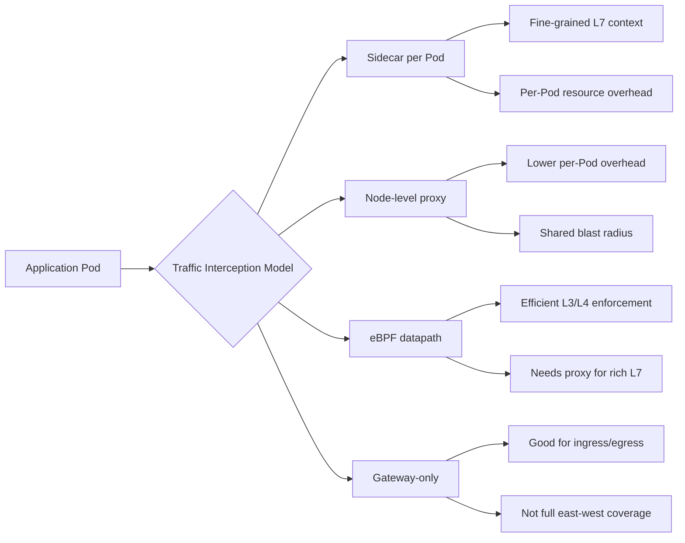
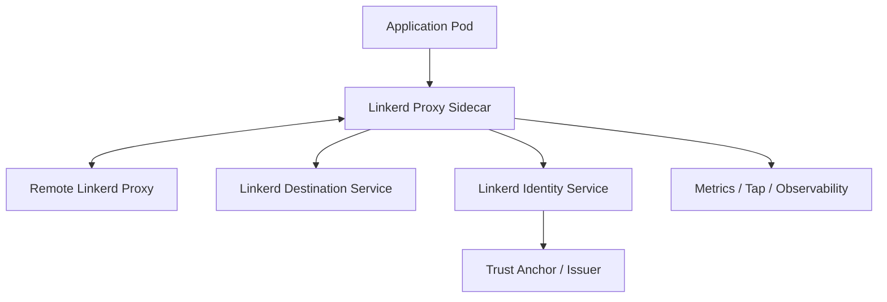
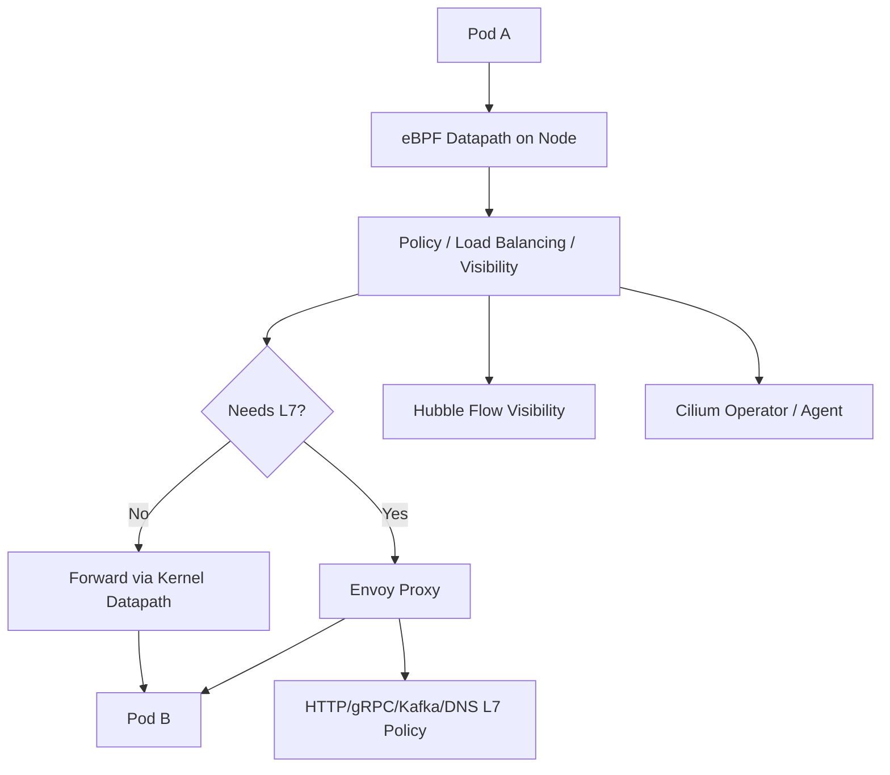
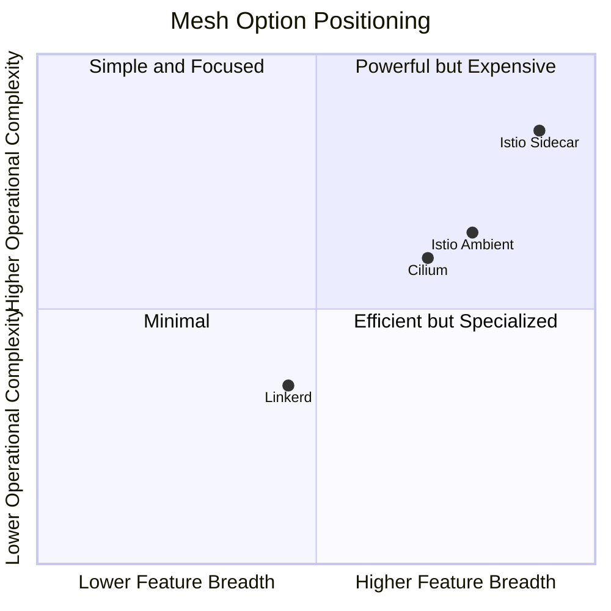
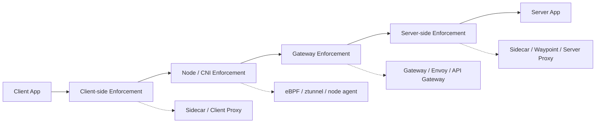
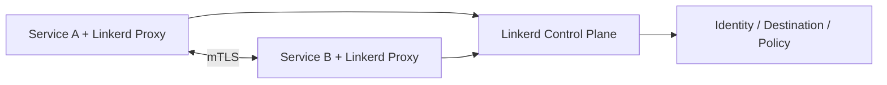
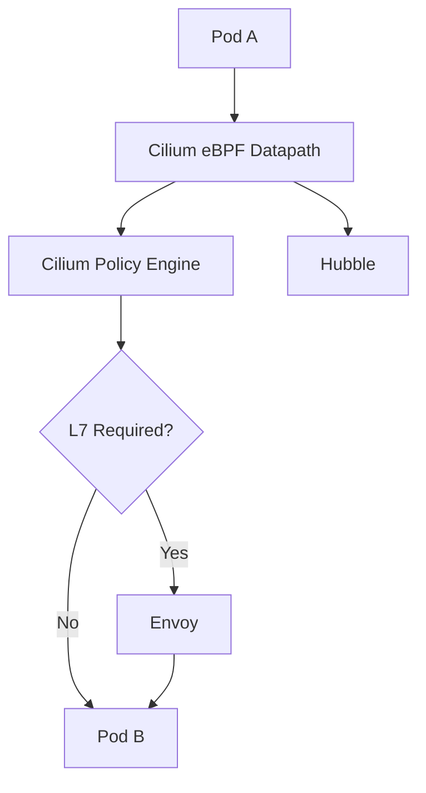
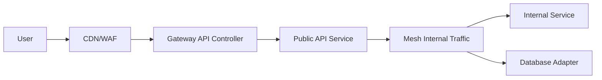

# Part 023 — Linkerd, Cilium, and Sidecarless Mesh Trade-offs

## 1. Tujuan Part Ini

Part 020 membangun model umum service mesh. Part 021 dan Part 022 memakai Istio sebagai studi utama untuk sidecar mode dan ambient mode. Part ini memperluas sudut pandang supaya keputusan arsitektur tidak menjadi **tool-driven**.

Target part ini:

> Anda mampu mengevaluasi Linkerd, Cilium Service Mesh, dan model sidecarless secara arsitektural, bukan dari hype, benchmark tunggal, atau checklist fitur.

Setelah part ini, Anda harus bisa menjawab:

- Kapan mesh sederhana lebih baik daripada mesh kaya fitur?
- Apa konsekuensi memilih sidecar proxy per-Pod?
- Apa konsekuensi memilih dataplane eBPF + optional Envoy?
- Apa yang benar-benar berarti dari “sidecarless”?
- Bagaimana Linkerd berbeda dari Istio secara philosophy dan operating model?
- Bagaimana Cilium menyatukan CNI, NetworkPolicy, observability, Gateway API, dan service mesh?
- Kapan sidecarless mesh mengurangi operational tax, dan kapan justru memindahkan kompleksitas ke layer yang lebih rendah?
- Bagaimana memilih mesh berdasarkan invariant produksi, bukan preferensi vendor?

---

## 2. Kaufman Framing: Jangan Belajar Mesh sebagai Brand

Framework Kaufman menyarankan skill dipecah menjadi komponen yang bisa dilatih secara terpisah. Untuk service mesh, komponen pentingnya bukan “Istio vs Linkerd vs Cilium”, tetapi capability berikut:

| Capability | Pertanyaan Desain |
|---|---|
| Traffic interception | Traffic ditangkap di Pod, node, socket, eBPF hook, iptables, atau Gateway? |
| Identity | Identitas workload berasal dari ServiceAccount, SPIFFE ID, certificate, label, atau IP? |
| Encryption | mTLS default, opt-in, strict, permissive, atau external? |
| Authorization | Policy berlaku di L3/L4, L7, identity layer, namespace layer, atau route layer? |
| Routing | Apakah mendukung weighted routing, failover, mirroring, header match, gRPC semantics? |
| Observability | Apakah flow terlihat di kernel, proxy, Gateway, app, atau trace context? |
| Failure isolation | Jika control plane rusak, apakah data plane tetap jalan? |
| Upgrade model | Apakah upgrade menyentuh setiap Pod, setiap node, atau hanya control plane? |
| Resource tax | Overhead terjadi per Pod, per node, per request, atau per route? |
| Portability | Apakah policy berbasis standard API atau CRD spesifik implementasi? |

Deliberate practice untuk part ini:

1. ambil satu requirement nyata: `all service-to-service traffic must be encrypted and observable`;
2. implementasikan mental design memakai Linkerd;
3. implementasikan mental design memakai Cilium;
4. bandingkan failure mode dan operational burden;
5. pilih bukan berdasarkan fitur paling banyak, tetapi berdasarkan risk paling kecil untuk konteks organisasi.

---

## 3. The Mesh Selection Trap

Kesalahan umum engineer senior sekalipun:

```txt
Kami butuh service mesh.
Berarti kami butuh Istio.
Berarti semua workload harus punya sidecar.
Berarti semua traffic management harus pindah ke mesh.
```

Itu chain reasoning yang lemah.

Pertanyaan yang lebih tepat:

```txt
Concern apa yang tidak layak lagi dikerjakan oleh aplikasi sendiri?
Concern itu lebih tepat ditegakkan di CNI, Gateway, sidecar, node proxy, atau application library?
```

Service mesh bukan tujuan. Service mesh adalah mekanisme untuk memindahkan concern tertentu keluar dari application code:

- mTLS;
- workload identity;
- service-to-service authorization;
- retries/timeouts/outlier detection;
- traffic splitting;
- telemetry;
- policy distribution;
- service discovery enhancement.

Namun setiap concern punya tempat terbaik. Tidak semua concern harus ditaruh di mesh.

Contoh:

| Concern | Biasanya Lebih Tepat di |
|---|---|
| Public API authentication | Edge gateway / API gateway |
| Inter-service mTLS | Mesh / CNI identity layer |
| L3/L4 isolation | NetworkPolicy / CNI policy |
| HTTP route delegation | Gateway API |
| Retry semantics | Mesh atau application client, tergantung idempotency |
| Business authorization | Application layer |
| Egress allowlist | Egress Gateway / firewall / CNI policy |
| Packet flow visibility | CNI/eBPF observability |
| Request semantics | Proxy / app / trace instrumentation |

Top 1% engineer tidak bertanya “mesh mana yang paling populer?”. Mereka bertanya:

> Di mana enforcement point paling defensible untuk invariant ini?

---

## 4. Taxonomy: Sidecar, Node Proxy, eBPF, and Hybrid Mesh

Sebelum membandingkan tool, pahami modelnya.



### 4.1 Sidecar Mesh

Sidecar mesh menambahkan proxy ke setiap workload Pod.

Kelebihan:

- traffic context dekat dengan workload;
- L7 policy kaya;
- mTLS identity per workload;
- isolasi proxy per Pod;
- established model;
- cocok untuk HTTP/gRPC traffic shaping.

Biaya:

- resource overhead per Pod;
- upgrade sering butuh restart workload;
- startup ordering;
- config explosion;
- debugging lebih kompleks;
- latency tambahan;
- operational overhead tinggi untuk fleet besar.

### 4.2 Node-Level / Sidecarless Mesh

Sidecarless mesh memindahkan sebagian fungsi ke node atau shared proxy.

Kelebihan:

- tidak perlu inject proxy ke setiap Pod;
- lebih sedikit container;
- upgrade dapat lebih terpusat;
- overhead per workload lebih rendah;
- onboarding workload lebih mudah.

Biaya:

- shared component menjadi blast radius baru;
- L7 policy sering butuh proxy tambahan;
- traffic attribution bisa lebih rumit;
- bypass path harus dipahami;
- semantic gap antara L4 dan L7 bisa membingungkan.

### 4.3 eBPF-Assisted Mesh

eBPF memungkinkan observability, policy, load balancing, dan traffic redirection dilakukan di kernel datapath.

Kelebihan:

- efisien untuk L3/L4;
- sangat baik untuk flow visibility;
- mengurangi dependency iptables;
- cocok untuk CNI-integrated platform;
- bisa menggabungkan networking, security, dan observability.

Batas:

- L7 tetap membutuhkan parser/proxy seperti Envoy;
- debugging eBPF membutuhkan skill kernel/networking lebih dalam;
- portability antar CNI tidak gratis;
- failure bisa terlihat sebagai kernel datapath issue, bukan proxy issue.

---

## 5. Linkerd: Mesh yang Sengaja Sederhana

Linkerd sering diposisikan sebagai service mesh yang lebih ringan dan fokus. Ia bukan “Istio kecil”; ia mengambil keputusan desain berbeda.

Mental model:

```txt
Linkerd = simple, transparent, secure-by-default sidecar mesh.
```

Linkerd terdiri dari:

- control plane;
- data plane proxy;
- identity service;
- destination service;
- policy components;
- tap/metrics/telemetry components;
- CLI dan dashboard tooling.



### 5.1 Data Plane

Linkerd data plane menggunakan proxy ringan yang berjalan di Pod sebagai sidecar. Proxy ini menangani inbound dan outbound traffic secara transparan.

Secara konseptual:

```txt
application -> localhost/proxy -> network -> remote proxy -> remote application
```

Proxy bertanggung jawab untuk:

- mTLS;
- load balancing;
- retries untuk traffic tertentu;
- metrics;
- traffic policy enforcement;
- service discovery integration;
- connection management.

### 5.2 Identity dan Automatic mTLS

Salah satu value utama Linkerd adalah automatic mTLS. Workload identity biasanya dikaitkan dengan Kubernetes ServiceAccount.

Model sederhananya:

```txt
Pod runs as ServiceAccount
      ↓
Linkerd proxy obtains identity certificate
      ↓
Proxy establishes mTLS with peer proxy
      ↓
Policy can reason over authenticated workload identity
```

Ini penting karena network identity berbasis IP tidak stabil di Kubernetes. Pod IP berubah, node berubah, endpoint berubah. ServiceAccount identity lebih stabil sebagai runtime principal.

### 5.3 Philosophy Linkerd

Linkerd cenderung mengoptimalkan:

- simple install;
- secure defaults;
- minimal CRD surface;
- low cognitive load;
- day-2 operability;
- automatic mTLS;
- golden metrics;
- safer adoption path.

Trade-off-nya:

- tidak selalu sekaya Istio untuk complex routing;
- tidak selalu fleksibel untuk enterprise edge routing yang sangat custom;
- tetap sidecar-based;
- ekstensi L7 tertentu tidak seluas Envoy/Istio ecosystem;
- advanced policy model bisa lebih terbatas dibanding Cilium/Istio untuk beberapa skenario.

### 5.4 Kapan Linkerd Cocok

Linkerd cocok bila requirement dominan adalah:

- encrypt service-to-service traffic;
- get reliable service metrics quickly;
- add identity-based policy without huge platform redesign;
- keep app teams productive;
- avoid high-complexity mesh configuration;
- prefer opinionated defaults;
- operate small-to-medium platform team.

Contoh situasi:

```txt
Perusahaan punya 60 microservices.
Traffic mostly HTTP/gRPC internal.
Pain utama: tidak ada mTLS, tidak ada service-level metrics, tidak jelas service dependency graph.
Team belum siap mengoperasikan Istio complexity.
```

Linkerd sering menjadi pilihan defensible.

### 5.5 Kapan Linkerd Kurang Cocok

Kurang cocok bila requirement utama:

- extremely complex L7 routing;
- heavy API gateway integration;
- deep Envoy customization;
- advanced multi-cluster traffic steering;
- strong need for CNI-integrated L3/L7 security policy;
- desire to remove sidecars entirely;
- large platform already standardized on Envoy extensions.

---

## 6. Cilium Service Mesh: CNI-Native, eBPF-First, Envoy When Needed

Cilium berbeda karena berangkat dari CNI dan eBPF networking, bukan murni dari service mesh proxy model.

Mental model:

```txt
Cilium = Kubernetes networking/security/observability dataplane using eBPF,
         with service mesh capabilities through Gateway API, Envoy, identity, and policy.
```



### 6.1 What eBPF Changes

eBPF lets Cilium attach programs to kernel hooks and implement networking behavior without relying only on iptables chains or per-Pod proxy interception.

Capabilities commonly associated with Cilium include:

- CNI networking;
- kube-proxy replacement;
- service load balancing;
- NetworkPolicy enforcement;
- identity-aware policy;
- L7 policy via Envoy;
- Hubble observability;
- Gateway API support;
- ingress integration;
- egress gateway patterns;
- cluster mesh capabilities.

The key architectural point:

> Cilium can make service mesh a property of the cluster dataplane rather than an extra proxy container in every workload.

### 6.2 Sidecarless Does Not Mean Proxyless

This distinction matters.

```txt
sidecarless != no proxy
sidecarless == no proxy injected beside every workload
```

For L3/L4 policy, service load balancing, and flow visibility, eBPF can handle much of the path efficiently. But for rich L7 semantics such as HTTP header matching, gRPC method awareness, Kafka parsing, or HTTP policy, Cilium still relies on Envoy-style proxying.

So the accurate model is:

```txt
L3/L4: eBPF datapath
L7: Envoy when required
```

### 6.3 Gateway API in Cilium

Cilium supports Gateway API as a way to express ingress and service traffic routing through Kubernetes-native resources.

Why this matters:

- Gateway API reduces controller-specific annotation reliance;
- platform teams can expose shared Gateway resources;
- app teams can attach routes;
- Envoy handles protocol-aware L7 behavior;
- Cilium can integrate routing with network policy and identity.

### 6.4 Cilium Identity Model

Cilium assigns security identities based on workload labels. Instead of making IP the primary identity, Cilium maps endpoint labels to numeric identities and enforces policy based on those identities.

Implication:

```txt
Pod IP is location.
Cilium identity is security context.
Policy should reason over identity, not ephemeral IP.
```

This identity model is powerful for NetworkPolicy and microsegmentation, especially when combined with eBPF enforcement.

### 6.5 Observability with Hubble

Cilium’s Hubble gives network flow visibility.

A strong production value of Cilium is that platform engineers can answer:

- who talked to whom;
- over which port/protocol;
- whether policy allowed or denied it;
- whether DNS was involved;
- whether flow was dropped;
- which identity was associated with the flow.

This is different from proxy-only telemetry. Proxy telemetry is request-aware. eBPF/CNI telemetry is path-aware.

Top-level mental model:

| Observability Plane | Best At |
|---|---|
| Application logs | Business result |
| Traces | Request causal chain |
| Proxy metrics | HTTP/gRPC behavior |
| CNI/eBPF flows | Packet/connection path and policy decision |
| Gateway status | Routing/control plane state |
| Cloud LB metrics | Edge health and external traffic |

### 6.6 Kapan Cilium Cocok

Cilium cocok bila requirement dominan:

- strong Kubernetes networking platform;
- eBPF-based policy and visibility;
- kube-proxy replacement;
- advanced NetworkPolicy/microsegmentation;
- desire to avoid sidecars for broad mesh capability;
- Gateway API adoption;
- flow-level observability;
- multi-cluster networking through Cilium Cluster Mesh;
- platform team comfortable with Linux networking/eBPF concepts.

Contoh situasi:

```txt
Platform menjalankan ratusan namespace multi-tenant.
Security team butuh identity-aware network policy dan flow audit.
Service mesh requirement mostly mTLS, policy, observability, Gateway API.
Team ingin menghindari sidecar injection across all workloads.
```

Cilium menjadi opsi kuat.

### 6.7 Kapan Cilium Kurang Cocok

Kurang cocok bila:

- organisasi belum siap mengoperasikan eBPF dataplane;
- team debugging masih lemah di Linux networking;
- workload butuh mesh semantics yang sangat Envoy/Istio-specific;
- standardisasi sudah kuat di Istio CRD ecosystem;
- platform tidak ingin CNI dan mesh menjadi satu vendor/control surface;
- requirement L7 sangat kompleks dan ingin proxy-per-workload isolation.

---

## 7. Linkerd vs Cilium vs Istio: Jangan Bandingkan sebagai Checklist

Checklist fitur sering menyesatkan karena semua tool bisa menulis “mTLS: yes”. Pertanyaan sebenarnya:

```txt
mTLS implemented where, identified by what, configured through what API,
observed how, failed how, upgraded how, and debugged by whom?
```

## 7.1 Comparison Matrix

| Axis | Linkerd | Cilium Service Mesh | Istio Sidecar | Istio Ambient |
|---|---|---|---|---|
| Primary origin | Service mesh | CNI/eBPF networking | Service mesh / Envoy | Service mesh redesign |
| Data plane | Sidecar micro-proxy | eBPF + Envoy when needed | Envoy sidecar | ztunnel + waypoint |
| Main strength | Simplicity, mTLS, metrics | Network/security/observability integration | Rich L7 features | Sidecarless Istio semantics |
| L7 richness | Moderate | Envoy-backed where enabled | Very high | High with waypoint |
| Resource model | Per-Pod sidecar | Mostly node/datapath + Envoy | Per-Pod Envoy | Per-node + waypoint |
| Upgrade burden | Sidecar restart often needed | CNI/agent/proxy components | Sidecar fleet management | ztunnel/waypoint management |
| Policy center | Mesh policy | CNI identity/policy + Gateway | Istio security/networking CRDs | Istio + Gateway API style |
| Observability | Service metrics/tap | Flow visibility + proxy telemetry | Rich Envoy telemetry | Split L4/L7 telemetry |
| Cognitive load | Lower | Medium-high | High | Medium-high |
| Best fit | Secure-by-default service mesh | Platform networking/security convergence | Advanced traffic management | Istio capability with less sidecar tax |

### 7.2 Feature Depth vs Operational Risk



This chart is intentionally approximate. Its value is not numerical precision. Its value is forcing the right conversation:

- How much feature breadth do we need?
- How much complexity can we operate safely?
- Which failure mode are we willing to own?

---

## 8. Sidecar vs Sidecarless: Real Trade-offs

## 8.1 Resource Isolation

Sidecar:

```txt
Each workload has its own proxy.
Failure of one proxy affects mostly that Pod.
```

Sidecarless/node-level:

```txt
Shared components serve many workloads.
Failure can affect a wider node or namespace scope.
```

Trade-off:

| Model | Isolation | Efficiency |
|---|---|---|
| Sidecar | Stronger per-workload isolation | Higher overhead |
| Node/shared | Lower per-workload overhead | Larger shared blast radius |

## 8.2 Upgrade Model

Sidecar upgrade:

- update injection template;
- restart workloads;
- coordinate app team windows;
- handle mixed proxy versions;
- verify telemetry and mTLS after rollout.

Sidecarless upgrade:

- update node agents/proxies;
- fewer workload restarts;
- but node-level failure affects many workloads;
- requires careful rolling upgrade and fallback.

## 8.3 Debugging Model

Sidecar debugging asks:

```txt
Did this Pod get the right proxy config?
Did iptables redirect traffic to the sidecar?
Is Envoy cluster/route/listener correct?
Is mTLS configured between this pair?
```

Sidecarless/eBPF debugging asks:

```txt
Did datapath attach correctly?
Was flow redirected?
Which identity was assigned?
Did policy drop it?
Did traffic enter Envoy for L7?
Was there a bypass path?
```

Neither is objectively simpler. They require different expertise.

## 8.4 Security Boundary

Sidecar security boundary:

- proxy runs next to app;
- app and proxy share Pod boundary;
- compromised Pod may interact with local network namespace;
- policy enforcement is close to workload;
- certs often scoped to proxy/workload identity.

Sidecarless security boundary:

- node agent/proxy represents multiple workloads;
- kernel datapath participates in enforcement;
- node compromise has broader impact;
- fewer per-Pod secrets/proxies;
- bypass prevention must be proven.

The key invariant:

> Security architecture must state exactly where identity is bound, where traffic is intercepted, and where policy is enforced.

---

## 9. The Enforcement Point Model

Every mesh decision should identify enforcement points.



Ask for every policy:

| Policy | Best Enforcement Point | Reason |
|---|---|---|
| Namespace isolation | CNI / NetworkPolicy | Packet-level default deny |
| Service-to-service identity auth | Mesh / identity-aware proxy | Needs authenticated principal |
| HTTP path authz | L7 proxy / application | Needs request semantics |
| Business permission | Application | Needs domain state |
| Egress allowlist | Egress gateway / firewall / CNI | Needs central audit/control |
| Public rate limit | Edge Gateway/API gateway | Protects platform boundary |
| Canary traffic split | Gateway or mesh | Needs route-level traffic control |

Bad design example:

```txt
Use mesh AuthorizationPolicy to enforce business permission:
"only investigator assigned to case can approve enforcement action".
```

That is wrong. The mesh can identify service principal, not domain-level human assignment state. Business authorization belongs in application/domain logic.

Good design example:

```txt
Mesh policy: only case-service can call sanction-service /internal/evaluate.
Application policy: only assigned enforcement officer can approve the sanction.
```

---

## 10. Gateway API as the Mesh Abstraction Layer

Gateway API reduces the need to learn every controller-specific routing API first. It provides a Kubernetes-native language for:

- HTTP routes;
- gRPC routes;
- TCP/UDP/TLS routes;
- backend references;
- route delegation;
- listener ownership;
- policy attachment.

For mesh, Gateway API matters because it can express east-west traffic intent more consistently.

Example mental model:

```yaml
apiVersion: gateway.networking.k8s.io/v1
kind: HTTPRoute
metadata:
  name: payments-canary
  namespace: checkout
spec:
  parentRefs:
    - group: ""
      kind: Service
      name: payments
      namespace: payments
  rules:
    - backendRefs:
        - name: payments-v1
          port: 8080
          weight: 90
        - name: payments-v2
          port: 8080
          weight: 10
```

This kind of route may be interpreted by a mesh implementation that supports Gateway API for mesh use cases.

The important architecture question:

> Are we committing to Gateway API as a platform contract, or to implementation-specific CRDs as the contract?

Implementation-specific CRDs are not bad. But they are a stronger coupling.

---

## 11. Production Decision Framework

Use this framework before selecting mesh.

## 11.1 Requirement Classification

| Requirement | Weight | Notes |
|---|---:|---|
| Automatic mTLS | High | Most mesh products can do this, but identity model differs. |
| L7 traffic shaping | Medium/High | Istio strongest; Cilium/Linkerd vary by capability. |
| NetworkPolicy integration | High | Cilium strong due to CNI origin. |
| Minimal operational complexity | High | Linkerd often strong. |
| Sidecarless adoption | Medium/High | Cilium/Istio ambient stronger. |
| Envoy extensibility | High | Istio/Cilium stronger. |
| Gateway API strategy | High | Check conformance and supported features. |
| Flow observability | High | Cilium/Hubble strong. |
| Multi-cluster | High | Implementation-specific maturity matters. |
| Compliance audit | High | Need identity, policy, logs, cert rotation proof. |

## 11.2 Team Capability Fit

| Team Strength | Better Fit Bias |
|---|---|
| Strong SRE, weak networking | Linkerd or managed mesh |
| Strong Linux/eBPF networking | Cilium |
| Strong Envoy/Istio expertise | Istio |
| Need simple platform adoption | Linkerd |
| Need integrated CNI + policy + visibility | Cilium |
| Need advanced traffic management | Istio sidecar or ambient with waypoint |

## 11.3 Risk Questions

Before adopting any mesh, answer:

1. What traffic paths are in mesh and out of mesh?
2. What is the default mTLS mode?
3. What breaks if the identity issuer is down?
4. What breaks if control plane is down?
5. What breaks if node agent/proxy is down?
6. Can workloads bypass mesh?
7. How are certificates rotated?
8. How do we audit who called whom?
9. How do app teams debug rejected traffic?
10. What is the rollback plan?
11. Which APIs are standard and which are vendor-specific?
12. What is the per-Pod or per-node resource budget?

---

## 12. Failure Mode Catalog

## 12.1 Sidecar Injection Drift

Symptom:

```txt
Some Pods have mesh behavior, others do not.
```

Causes:

- namespace label missing;
- webhook failed;
- manual Pod creation bypassed injection;
- workload restarted before injection config updated;
- excluded port annotation wrong.

Detection:

```bash
kubectl get pod -n payments -o jsonpath='{range .items[*]}{.metadata.name}{"\t"}{.spec.containers[*].name}{"\n"}{end}'
```

Invariant:

```txt
Every workload that is expected to be in mesh must be provably in mesh.
```

## 12.2 mTLS Partial Deployment

Symptom:

```txt
Traffic works between some workloads, fails between others.
```

Causes:

- one workload not meshed;
- permissive mode hiding plaintext;
- trust bundle mismatch;
- cert expired;
- identity service unavailable during rotation.

Mitigation:

- define strict/permissive migration phases;
- create mesh enrollment inventory;
- expose mTLS success/failure metrics;
- test with out-of-mesh clients deliberately.

## 12.3 eBPF Policy Drop Misdiagnosed as App Failure

Symptom:

```txt
Client sees timeout. Server logs show nothing.
```

Causes:

- CNI policy denied packet before server;
- DNS egress blocked;
- identity mismatch;
- stale endpoint identity;
- node datapath issue.

Debugging direction:

```txt
If server logs show nothing, debug path before request reaches application.
```

Use flow visibility, policy verdicts, and packet path tools.

## 12.4 L7 Policy Requires Proxy but Traffic Stayed L4

Symptom:

```txt
L4 connectivity works, but HTTP policy is not enforced.
```

Causes:

- traffic never redirected to L7 proxy;
- missing waypoint;
- protocol not detected;
- port not named correctly;
- controller does not support feature;
- policy attached to wrong resource.

Invariant:

```txt
L7 policy requires L7 observation point.
```

## 12.5 Shared Node Component Blast Radius

Symptom:

```txt
Multiple unrelated workloads on one node lose mesh behavior simultaneously.
```

Causes:

- node-level proxy crash;
- CNI agent failure;
- eBPF program issue;
- ztunnel-like component failure;
- host network conflict.

Trade-off:

```txt
Sidecarless reduces per-workload overhead but can increase node-scoped blast radius.
```

## 12.6 Feature Works in One Controller but Not Another

Symptom:

```txt
Gateway API resource is accepted in dev but behaves differently in prod.
```

Causes:

- different implementation conformance;
- extended feature not supported;
- controller-specific interpretation;
- implementation-specific policy CRD;
- version skew.

Mitigation:

- test against actual `GatewayClass`;
- verify status conditions;
- use conformance docs;
- avoid assuming Gateway API means complete portability.

---

## 13. Design Patterns

## 13.1 Simple Secure Mesh Pattern

Use when:

- internal services need mTLS;
- app team should not manage certs;
- request routing needs are modest;
- platform team values simplicity.

Architecture:



Characteristics:

- mesh is transparent;
- policy surface is constrained;
- operating model is simpler;
- good first mesh for many organizations.

Risk:

- advanced traffic management may require another layer;
- still carries sidecar lifecycle cost.

## 13.2 CNI-Native Security Platform Pattern

Use when:

- platform needs NetworkPolicy and flow audit;
- security team needs identity-aware enforcement;
- service mesh is only one part of networking platform;
- eBPF expertise exists.

Architecture:



Characteristics:

- traffic policy and observability start at CNI layer;
- fewer sidecars;
- strong flow visibility;
- L7 uses Envoy when needed.

Risk:

- requires deeper networking skill;
- CNI becomes high criticality platform dependency.

## 13.3 Hybrid Gateway + Mesh Pattern

Use when:

- public APIs need Gateway/API gateway;
- internal services need mTLS;
- only selected services need advanced L7 routing;
- want avoid full-mesh complexity everywhere.

Architecture:



Principle:

```txt
Do not mesh everything just because mesh exists.
Mesh the trust boundary and dependency paths that need mesh capabilities.
```

## 13.4 Progressive Mesh Adoption Pattern

Phases:

1. observe only;
2. enable mTLS in permissive mode;
3. inventory out-of-mesh calls;
4. move to strict mTLS for selected namespaces;
5. add authorization policy;
6. add L7 traffic management;
7. add multi-cluster only after single-cluster invariants are proven.

Avoid:

```txt
Day 1: install mesh, enable strict mTLS globally, add retries, add authz, enable canary, enable multi-cluster.
```

That is not engineering maturity. That is blast radius manufacturing.

---

## 14. Performance and Cost Model

## 14.1 Cost Dimensions

| Cost | Sidecar | Sidecarless/eBPF |
|---|---|---|
| CPU per workload | Higher | Lower per workload |
| Memory per workload | Higher | Lower per workload |
| Node component criticality | Medium | High |
| L7 proxy cost | Per Pod | Shared/selected |
| Upgrade coordination | Workload-heavy | Platform-heavy |
| Debugging expertise | Proxy-heavy | Kernel/CNI-heavy |
| Telemetry cardinality | High | High, but different layer |

## 14.2 Latency Model

Every proxy hop can add latency. But the dangerous part is not only average latency. It is tail latency and failure amplification.

Questions:

- Does every request cross two proxies?
- Does mTLS handshake reuse connection pooling?
- Are retries performed at app and mesh layer simultaneously?
- Are timeouts aligned?
- Is telemetry synchronous or buffered?
- Does Envoy filter chain include expensive processing?
- Does L7 policy require request body inspection?

Bad pattern:

```txt
Application retries 3x.
Mesh retries 3x.
Gateway retries 2x.
One user request can become 18 backend attempts.
```

Good pattern:

```txt
Define retry budget globally.
Apply retries only at the layer with enough semantics to know idempotency.
```

---

## 15. Security and Compliance Model

For regulated systems, the mesh decision must produce audit artifacts.

You need to prove:

- what identity each workload has;
- how certificates are issued;
- how certificates rotate;
- which services can talk;
- which requests were denied;
- which traffic is encrypted;
- which namespaces are exempt;
- who can change policy;
- how emergency rollback works;
- how policy changes are reviewed.

Mesh security is weak if it cannot answer:

```txt
At 2026-07-01T10:00:00Z,
was service A allowed to call service B on route /internal/approve,
under which identity,
using which certificate chain,
and where is the evidence?
```

---

## 16. Lab: Compare Three Mesh Designs

Use one system:

```txt
frontend -> checkout -> payment -> ledger
checkout -> fraud
payment -> bank-adapter
```

Requirements:

- all internal traffic encrypted;
- checkout can call payment;
- frontend cannot call ledger directly;
- payment can call bank-adapter only through egress path;
- canary payment v2 at 10%;
- observe request success rate and denied flows;
- rollback within five minutes.

### 16.1 Design A: Linkerd

Answer:

- Where is mTLS configured?
- How are identities assigned?
- Which policy blocks frontend -> ledger?
- How do you observe denied calls?
- How do you do payment canary?
- What requires additional tooling?

### 16.2 Design B: Cilium

Answer:

- Which Cilium identities exist?
- Which NetworkPolicy/CiliumNetworkPolicy applies?
- Does payment canary use Gateway API or app-level routing?
- Does L7 require Envoy?
- How does Hubble show denied flows?
- What happens if Cilium agent on a node fails?

### 16.3 Design C: Istio Ambient

Answer:

- Which namespaces are ambient enrolled?
- Which traffic is L4-only via ztunnel?
- Which service needs waypoint?
- Where is HTTPRoute attached?
- Which AuthorizationPolicy applies at L4 vs L7?
- What bypass risks exist?

Deliverable:

```txt
One architecture decision record explaining which design you choose and why.
```

---

## 17. Architecture Decision Record Template

```md
# ADR: Service Mesh Selection

## Context
We need workload-to-workload encryption, service identity, policy enforcement, observability, and selected traffic shaping for Kubernetes workloads.

## Decision
We choose <Linkerd/Cilium/Istio/...> for <scope>.

## Scope
- Included namespaces:
- Excluded namespaces:
- North-south traffic:
- East-west traffic:
- Egress traffic:

## Invariants
- All in-scope service-to-service traffic must use mTLS.
- Authorization must be identity-based, not IP-based.
- L7 policy may only be used where L7 proxying is proven active.
- Retry budget must be centrally defined.

## Alternatives Considered
- Linkerd:
- Cilium:
- Istio sidecar:
- Istio ambient:

## Consequences
- Operational cost:
- Security posture:
- Debugging model:
- Upgrade model:
- Lock-in:

## Rollback Plan
- Disable policy:
- Disable mesh enrollment:
- Restore previous Gateway path:
- Verify plaintext fallback is not accidentally permanent:

## Evidence Required
- mTLS metrics:
- flow logs:
- policy audit:
- conformance test:
- failure drill:
```

---

## 18. Review Checklist

Use this checklist before production rollout.

### Architecture

- [ ] Mesh scope is explicit.
- [ ] Out-of-mesh traffic paths are known.
- [ ] North-south and east-west responsibilities are separated.
- [ ] Gateway API role is defined.
- [ ] CNI policy role is defined.
- [ ] Business authorization is not delegated to mesh.

### Security

- [ ] Workload identity model is documented.
- [ ] mTLS mode is explicit.
- [ ] Certificate rotation is tested.
- [ ] Policy default is understood.
- [ ] Denied traffic is observable.
- [ ] Break-glass process exists.

### Operations

- [ ] Control plane failure behavior is tested.
- [ ] Data plane failure behavior is tested.
- [ ] Upgrade plan is tested.
- [ ] Rollback plan is tested.
- [ ] Resource overhead is measured.
- [ ] Tail latency is measured.

### Debugging

- [ ] App team can identify whether request entered mesh.
- [ ] Platform team can trace flow from client to server.
- [ ] Policy denial reason is visible.
- [ ] mTLS handshake failure is distinguishable from network drop.
- [ ] Gateway status and mesh status are both checked.

---

## 19. Summary

Linkerd, Cilium, Istio sidecar, and Istio ambient are not interchangeable labels for “service mesh”. They are different choices about where traffic is intercepted, where identity is bound, where policy is enforced, where telemetry is generated, and where operational complexity lives.

Key takeaways:

- Linkerd is strong when simplicity, secure defaults, and fast adoption matter.
- Cilium is strong when networking, security, observability, and service mesh should converge at the CNI/eBPF layer.
- Sidecarless reduces per-Pod overhead but introduces shared dataplane and debugging trade-offs.
- eBPF is powerful for L3/L4 enforcement and visibility, but rich L7 behavior still needs a proxy.
- Gateway API can become a stable platform contract, but controller support and conformance must be verified.
- A mature mesh decision starts from invariants, not product preference.

The next part goes deeper into the security foundation behind all serious mesh designs: **mTLS, SPIFFE, identity, trust domain, and zero-trust service networking**.

---

## 20. References

- Linkerd Architecture: https://linkerd.io/2-edge/reference/architecture/
- Linkerd Automatic mTLS: https://linkerd.io/2-edge/features/automatic-mtls/
- Cilium Service Mesh: https://docs.cilium.io/en/stable/network/servicemesh/
- Cilium Gateway API: https://docs.cilium.io/en/stable/network/servicemesh/gateway-api/gateway-api/
- Gateway API Implementations: https://gateway-api.sigs.k8s.io/docs/implementations/list/
- Istio Data Plane Modes: https://istio.io/latest/docs/overview/dataplane-modes/
