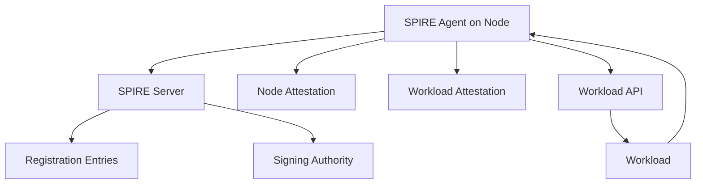
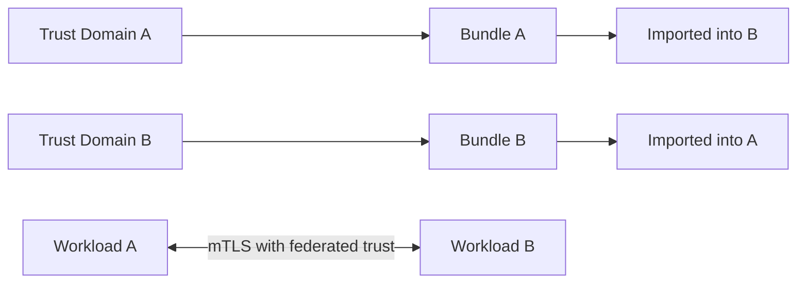
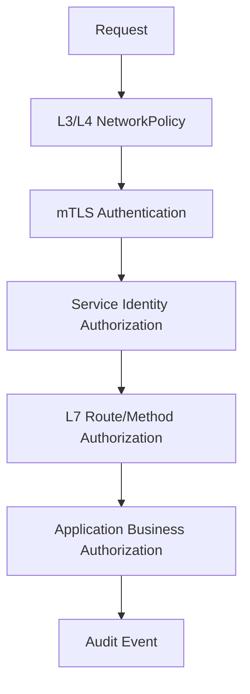
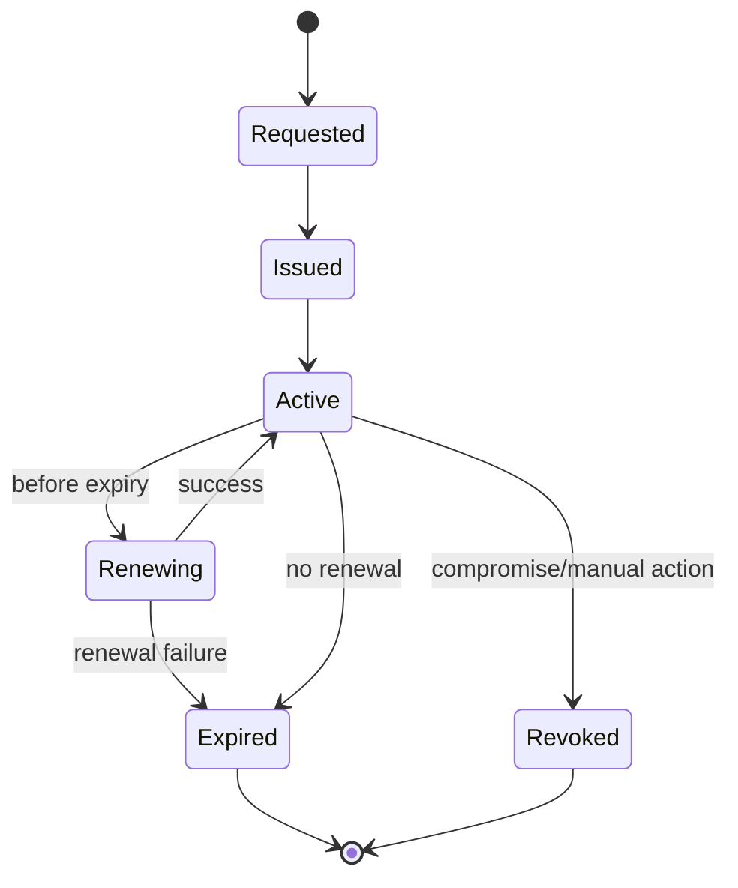
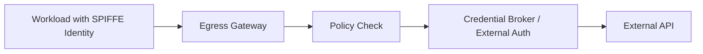

# Part 024 — mTLS, SPIFFE, Identity, and Zero-Trust Service Networking

## 1. Tujuan Part Ini

Part 023 membandingkan beberapa service mesh implementation. Part ini masuk ke fondasi yang lebih penting daripada produk: **identity**.

Target part ini:

> Anda mampu mendesain service-to-service security model berbasis workload identity, mTLS, SPIFFE/SPIRE, trust domain, certificate rotation, dan authorization policy yang defensible untuk sistem produksi.

Setelah part ini, Anda harus bisa menjawab:

- Mengapa IP address bukan identitas yang cukup di Kubernetes?
- Apa perbedaan authentication, encryption, dan authorization?
- Apa yang sebenarnya dibuktikan oleh mTLS?
- Apa itu SPIFFE ID?
- Apa itu SVID?
- Apa itu trust domain?
- Apa peran SPIRE server dan SPIRE agent?
- Bagaimana workload mendapatkan identity document?
- Bagaimana identity dipakai untuk policy?
- Bagaimana certificate rotation gagal di produksi?
- Bagaimana mendesain zero-trust service networking tanpa berlebihan?

---

## 2. Kaufman Framing: Pisahkan “Secure” Menjadi Skill Kecil

Kata “secure” terlalu besar dan sering tidak operasional. Dengan pendekatan Kaufman, pecah menjadi skill kecil:

| Skill | Pertanyaan Praktis |
|---|---|
| Identity | Siapa caller dan callee secara cryptographic? |
| Authentication | Bagaimana caller membuktikan identity? |
| Encryption | Apakah traffic dilindungi dari interception? |
| Authorization | Apakah identity ini boleh melakukan aksi ini? |
| Attestation | Bagaimana platform tahu workload ini benar-benar workload yang diklaim? |
| Rotation | Bagaimana credential berganti tanpa downtime? |
| Revocation/expiry | Apa yang terjadi ketika credential tidak valid? |
| Federation | Bagaimana trust bekerja lintas cluster/domain? |
| Audit | Bukti apa yang tersedia setelah kejadian? |

Deliberate practice:

1. definisikan identity scheme;
2. aktifkan mTLS;
3. tulis policy berbasis identity;
4. rotasi certificate;
5. simulasikan expired cert;
6. simulasikan trust domain mismatch;
7. audit call path;
8. dokumentasikan invariant.

---

## 3. Problem: Kubernetes Network Location Is Not Identity

Kubernetes membuat network location sangat dinamis:

- Pod IP berubah;
- Pod dipindahkan antar node;
- Service memilih endpoint yang berubah;
- autoscaling menambah/mengurangi replica;
- rollout mencampur versi lama dan baru;
- node bisa diganti;
- cluster bisa dibuat ulang;
- multi-cluster membuat endpoint lintas lokasi.

Jadi ini lemah:

```txt
Allow 10.42.3.17 to call 10.42.8.21
```

Karena `10.42.3.17` bukan principal. Itu hanya alamat sementara.

Model yang lebih kuat:

```txt
Allow workload identity spiffe://prod.example.com/ns/payments/sa/checkout
    to call workload identity spiffe://prod.example.com/ns/ledger/sa/ledger-api
    on operation POST /internal/posting
```

Top 1% mental model:

```txt
IP answers: where is it?
Identity answers: who is it?
Policy needs both, but must not confuse them.
```

---

## 4. Authentication, Encryption, Authorization: Jangan Dicampur

Banyak incident security terjadi karena tiga hal ini dicampur.

| Concept | Meaning | Example |
|---|---|---|
| Authentication | Membuktikan siapa caller/callee | mTLS certificate validates workload identity |
| Encryption | Melindungi data in transit | TLS encrypts TCP connection |
| Authorization | Memutuskan boleh/tidak | checkout may call payment, but not ledger |

mTLS memberi authentication dan encryption. mTLS **tidak otomatis** memberi authorization domain.

Bad assumption:

```txt
Traffic sudah mTLS, berarti aman.
```

Better:

```txt
Traffic mTLS berarti encrypted dan peer identity dapat diverifikasi.
Kita tetap perlu policy yang menyatakan identity mana boleh melakukan apa.
```

---

## 5. What mTLS Actually Does

TLS biasa:

```txt
Client verifies server.
Server usually does not verify client certificate.
```

mTLS:

```txt
Client verifies server certificate.
Server verifies client certificate.
Both sides authenticate each other cryptographically.
```

```mermaid
sequenceDiagram
    participant C as Client Workload Proxy
    participant S as Server Workload Proxy
    participant CA as Mesh / SPIFFE CA

    C->>CA: obtain client certificate / SVID
    S->>CA: obtain server certificate / SVID
    C->>S: ClientHello + supported params
    S->>C: Server certificate
    C->>C: verify server identity and trust chain
    C->>S: Client certificate
    S->>S: verify client identity and trust chain
    C<->>S: encrypted authenticated channel
```

mTLS answers:

- is the peer certificate signed by a trusted authority?
- is the certificate still valid?
- does the certificate identity match expected identity?
- can both sides negotiate a secure session?

mTLS does not answer:

- is this business action allowed?
- is this request idempotent?
- is this user assigned to the case?
- is this transaction below approval threshold?
- is the callee healthy?

---

## 6. SPIFFE: Portable Workload Identity

SPIFFE stands for **Secure Production Identity Framework for Everyone**. It defines a standard way to identify workloads.

Core idea:

```txt
Every workload gets a cryptographic identity that is independent from IP address, host name, or manually distributed secret.
```

A SPIFFE ID has this shape:

```txt
spiffe://<trust-domain>/<workload-identifier>
```

Example:

```txt
spiffe://prod.example.com/ns/payments/sa/checkout
spiffe://prod.example.com/ns/ledger/sa/ledger-api
spiffe://prod.example.com/ns/fraud/sa/fraud-engine
```

The trust domain is the root administrative/security domain:

```txt
spiffe://prod.example.com/...
```

The workload identifier is the path:

```txt
/ns/payments/sa/checkout
```

Important:

> SPIFFE ID is an identity name. It is not by itself a credential.

The credential that carries/verifies identity is called an **SVID**.

---

## 7. SVID: SPIFFE Verifiable Identity Document

SVID stands for **SPIFFE Verifiable Identity Document**.

Two common forms:

| SVID Type | Used For |
|---|---|
| X.509-SVID | mTLS and certificate-based workload authentication |
| JWT-SVID | Token-based authentication to systems that consume JWT |

### 7.1 X.509-SVID

An X.509-SVID is an X.509 certificate containing a SPIFFE ID. It is commonly used in mTLS.

Conceptual certificate subject identity:

```txt
URI SAN: spiffe://prod.example.com/ns/payments/sa/checkout
```

During mTLS:

1. client presents X.509-SVID;
2. server validates certificate chain;
3. server extracts SPIFFE ID;
4. server policy decides whether that SPIFFE ID is allowed.

### 7.2 JWT-SVID

JWT-SVID is useful when the target system expects bearer token style authentication. Example:

- service calling cloud API through identity bridge;
- workload authenticating to internal API that accepts JWT;
- integration with non-mTLS systems.

JWT-SVID still needs careful audience, expiry, and replay protection.

---

## 8. SPIRE: Runtime System for Issuing SPIFFE Identities

SPIRE is a production-ready implementation of SPIFFE APIs. Its purpose is to attest workloads and issue SVIDs.

High-level components:



## 8.1 SPIRE Server

SPIRE Server is responsible for:

- managing registration entries;
- signing SVIDs;
- maintaining trust bundle;
- authenticating agents;
- serving identity data;
- integrating with upstream CA if configured.

## 8.2 SPIRE Agent

SPIRE Agent runs on nodes and is responsible for:

- node attestation;
- workload attestation;
- exposing Workload API locally;
- requesting SVIDs from server;
- rotating SVIDs;
- caching identity material.

## 8.3 Node Attestation

Node attestation answers:

```txt
Is this node allowed to participate in this trust domain?
```

Depending on environment, node attestation may use:

- cloud instance identity;
- Kubernetes node identity;
- TPM;
- join token;
- X.509;
- platform-specific attestor.

## 8.4 Workload Attestation

Workload attestation answers:

```txt
Which workload is this process/container/pod?
```

In Kubernetes, selectors may involve:

- namespace;
- ServiceAccount;
- Pod labels;
- container image;
- node attributes;
- workload metadata.

Example registration intent:

```txt
If workload runs in namespace payments
and uses ServiceAccount checkout
then issue SPIFFE ID:
spiffe://prod.example.com/ns/payments/sa/checkout
```

---

## 9. Identity Binding in Kubernetes

A common mapping:

```txt
Kubernetes namespace + ServiceAccount -> workload identity
```

Example:

| Namespace | ServiceAccount | SPIFFE ID |
|---|---|---|
| `checkout` | `frontend` | `spiffe://prod.example.com/ns/checkout/sa/frontend` |
| `payments` | `payment-api` | `spiffe://prod.example.com/ns/payments/sa/payment-api` |
| `ledger` | `ledger-api` | `spiffe://prod.example.com/ns/ledger/sa/ledger-api` |
| `fraud` | `fraud-engine` | `spiffe://prod.example.com/ns/fraud/sa/fraud-engine` |

This mapping is practical because ServiceAccount already represents workload runtime principal in Kubernetes.

But do not overtrust namespace/ServiceAccount alone.

Ask:

- Who can create ServiceAccounts?
- Who can bind Deployments to ServiceAccounts?
- Who can change namespace labels?
- Who can deploy into privileged namespaces?
- Who can mutate sidecar/mesh annotations?
- Who can create ReferenceGrant or Gateway route attachment?

Identity security is only as strong as the control plane permissions that assign identity.

---

## 10. Trust Domain Design

Trust domain is not just naming. It defines the root of trust.

Examples:

```txt
spiffe://prod.example.com/ns/payments/sa/payment-api
spiffe://staging.example.com/ns/payments/sa/payment-api
spiffe://corp.example.com/k8s/prod/ns/payments/sa/payment-api
```

Design options:

| Option | Example | Pros | Cons |
|---|---|---|---|
| One trust domain per environment | `prod.example.com`, `staging.example.com` | Clear isolation | Federation needed for cross-env calls |
| One trust domain per org | `example.com` | Simpler internal federation | Larger blast radius |
| One trust domain per cluster | `cluster-a.prod.example.com` | Strong cluster isolation | Harder multi-cluster identity policy |
| One trust domain per business unit | `payments.example.com` | Business isolation | Cross-BU integration complexity |

Recommended mental model:

```txt
Trust domain should follow administrative trust boundary, not arbitrary cluster naming.
```

If two clusters are operated by the same platform team with same security policy and same production boundary, they may share a trust domain. If they differ in control plane ownership, compliance scope, or root CA control, separate trust domains are safer.

---

## 11. Trust Bundle and Federation

A trust bundle contains trust anchors for validating SVIDs in a trust domain.

Without federation:

```txt
Workload in prod-a trusts only prod-a bundle.
```

With federation:

```txt
Workload in prod-a can validate identities from prod-b because it has prod-b trust bundle.
```



Federation is useful for:

- multi-cluster service mesh;
- cross-region service calls;
- platform migration;
- merger/acquisition integration;
- shared services across domains.

Risks:

- overly broad trust;
- unclear policy semantics across domains;
- stale bundle propagation;
- inconsistent identity naming;
- emergency revocation complexity.

Invariant:

```txt
Federation should enable authentication, not automatically grant authorization.
```

Just because workload A can validate workload B’s identity does not mean A should accept every request from B.

---

## 12. Zero-Trust Service Networking

Zero trust is often misused. In service networking, a practical definition is:

```txt
No service-to-service call is trusted merely because it is inside the cluster, namespace, VPC, subnet, or mesh.
Every call should be authenticated, authorized, encrypted where appropriate, observable, and revocable.
```

Zero-trust service networking includes:

1. strong workload identity;
2. mTLS for service-to-service traffic;
3. authorization based on identity and least privilege;
4. network policy for segmentation;
5. explicit egress control;
6. audit logs and flow visibility;
7. short-lived credentials;
8. automated rotation;
9. no permanent static shared secrets;
10. tested failure and revocation paths.

## 12.1 Layered Enforcement



Each layer answers a different question:

| Layer | Question |
|---|---|
| NetworkPolicy | Can packets flow between these workloads? |
| mTLS | Is peer identity cryptographically verified? |
| Mesh authz | Is this service identity allowed to call that service/path? |
| App authz | Is this user/action/domain state allowed? |
| Audit | Can we prove what happened later? |

---

## 13. Policy Design with Identity

## 13.1 Bad Policy: IP-Based

```txt
Allow 10.2.0.0/16 to call ledger.
```

Problems:

- too broad;
- does not identify caller;
- changes with cluster CIDR;
- poor audit trail;
- weak in multi-cluster;
- susceptible to workload placement changes.

## 13.2 Better Policy: Namespace-Based

```txt
Allow namespace payments to call ledger.
```

Better, but still broad. Any workload in `payments` may call ledger.

## 13.3 Stronger Policy: Workload Identity-Based

```txt
Allow spiffe://prod.example.com/ns/payments/sa/payment-api
  to call spiffe://prod.example.com/ns/ledger/sa/ledger-api
  on port 8443
```

## 13.4 Strongest Practical Policy: Identity + Operation

```txt
Allow payment-api identity
  to call ledger-api identity
  only on POST /internal/entries
  only through mTLS
  with audit logging
```

This requires L7 enforcement. L4-only systems cannot know HTTP method/path.

---

## 14. Example: Istio AuthorizationPolicy by Identity

Conceptual example:

```yaml
apiVersion: security.istio.io/v1
kind: AuthorizationPolicy
metadata:
  name: allow-payment-to-ledger
  namespace: ledger
spec:
  selector:
    matchLabels:
      app: ledger-api
  action: ALLOW
  rules:
    - from:
        - source:
            principals:
              - cluster.local/ns/payments/sa/payment-api
      to:
        - operation:
            methods: ["POST"]
            paths: ["/internal/entries"]
```

The exact identity format depends on mesh trust domain and implementation. The pattern matters:

```txt
source principal + destination workload + operation
```

## 14.1 Avoid Overfitting to Mesh Policy

Mesh policy should not encode domain logic like:

```txt
Only officers assigned to case ID 123 may approve sanction.
```

That belongs in application/business authorization.

Mesh policy can encode:

```txt
Only case-service may call sanction-service internal decision endpoint.
```

---

## 15. Example: CNI Policy + Mesh Identity Policy

For strong defense, combine layers.

Layer 1: NetworkPolicy-style segmentation:

```yaml
apiVersion: networking.k8s.io/v1
kind: NetworkPolicy
metadata:
  name: ledger-default-deny
  namespace: ledger
spec:
  podSelector: {}
  policyTypes:
    - Ingress
    - Egress
```

Layer 2: allow only payment namespace/workload at network layer:

```yaml
apiVersion: networking.k8s.io/v1
kind: NetworkPolicy
metadata:
  name: allow-payment-to-ledger
  namespace: ledger
spec:
  podSelector:
    matchLabels:
      app: ledger-api
  policyTypes:
    - Ingress
  ingress:
    - from:
        - namespaceSelector:
            matchLabels:
              kubernetes.io/metadata.name: payments
      ports:
        - protocol: TCP
          port: 8443
```

Layer 3: mesh/service identity authorization:

```txt
Only payment-api ServiceAccount identity can call ledger-api.
```

Layer 4: app domain authorization:

```txt
Only authorized business operation can post ledger entry.
```

This layered design is defensible because each control is limited to what it can know.

---

## 16. Certificate Lifecycle

Short-lived certificates are good only if rotation is reliable.

Certificate lifecycle:



Production questions:

- What is certificate TTL?
- When does renewal start?
- What happens if CA is unreachable?
- Does data plane cache existing certs?
- How long can workload continue after control plane outage?
- Are expired cert failures visible before user-facing outage?
- Can certificate rotation cause connection reset?
- Is trust bundle rotation tested?

## 16.1 Rotation Failure Mode

Symptom:

```txt
Traffic suddenly starts failing across many services around the same time.
```

Possible causes:

- root/issuer cert expired;
- workload certs expired;
- CA unavailable during renewal window;
- trust bundle update failed;
- clock skew;
- proxy did not hot-reload certificate;
- new cert signed by untrusted intermediate.

Mitigation:

- monitor certificate expiry at all layers;
- alert long before expiry;
- test rotation in staging;
- support overlapping trust bundles;
- keep workload clock synchronized;
- avoid manual CA operations without runbook.

## 16.2 Clock Skew

TLS validation depends on time.

A cert can appear invalid if node time is wrong:

```txt
notBefore is in the future
notAfter is in the past
```

In Kubernetes, this can look like random mTLS failure on a subset of nodes.

Debugging hint:

```bash
kubectl get nodes
# then inspect node time through your node management / observability system
```

---

## 17. Identity and Authorization in Multi-Cluster

Multi-cluster makes identity harder.

Questions:

- Do clusters share a trust domain?
- Are namespaces considered “same” across clusters?
- Are ServiceAccounts globally meaningful?
- Does `payments/payment-api` in cluster A equal `payments/payment-api` in cluster B?
- Are both clusters equally trusted?
- Who controls the root CA?
- How does policy distinguish cluster origin?

## 17.1 Same Trust Domain

Example:

```txt
spiffe://prod.example.com/ns/payments/sa/payment-api
```

This identity may exist in multiple clusters.

Pros:

- simpler policy;
- easier service migration;
- consistent identity.

Cons:

- identity collision risk;
- cluster origin hidden unless encoded separately;
- larger blast radius.

## 17.2 Cluster-Scoped Trust Domain

Example:

```txt
spiffe://cluster-a.prod.example.com/ns/payments/sa/payment-api
spiffe://cluster-b.prod.example.com/ns/payments/sa/payment-api
```

Pros:

- clearer cluster boundary;
- less collision;
- stronger isolation.

Cons:

- more complex policy;
- federation required;
- service migration needs policy updates.

## 17.3 Path Encoding Cluster

Example:

```txt
spiffe://prod.example.com/k8s/cluster-a/ns/payments/sa/payment-api
```

This preserves one trust domain while encoding cluster as identity attribute.

Trade-off:

- easier federation;
- more explicit policy;
- longer identity paths;
- needs consistent naming governance.

---

## 18. Egress and External Identity

mTLS inside cluster does not solve external service trust.

For egress, ask:

- does external system understand SPIFFE?
- does it require public CA TLS?
- do we need client cert authentication?
- do we need static source IP?
- do we need HTTP proxy?
- do we need credential broker?
- should workload receive external credential directly?

Pattern:



Avoid giving every workload long-lived API keys.

Better:

```txt
Workload authenticates to internal broker with SPIFFE identity.
Broker issues short-lived external credential if policy allows.
```

This is especially important for compliance-heavy systems.

---

## 19. Observability and Audit

For service identity, observe at least:

- source workload identity;
- destination workload identity;
- mTLS status;
- certificate issuer/trust domain;
- policy decision;
- route/method/path where applicable;
- response code;
- latency;
- denied reason;
- workload namespace/service account;
- cluster/region.

Example audit event shape:

```json
{
  "timestamp": "2026-07-01T10:12:33Z",
  "source_identity": "spiffe://prod.example.com/ns/payments/sa/payment-api",
  "destination_identity": "spiffe://prod.example.com/ns/ledger/sa/ledger-api",
  "method": "POST",
  "path": "/internal/entries",
  "mtls": true,
  "policy": "allow-payment-to-ledger",
  "decision": "ALLOW",
  "cluster": "prod-idn-a",
  "region": "ap-southeast-3",
  "trace_id": "..."
}
```

A denied event is just as important:

```json
{
  "timestamp": "2026-07-01T10:13:01Z",
  "source_identity": "spiffe://prod.example.com/ns/frontend/sa/web",
  "destination_identity": "spiffe://prod.example.com/ns/ledger/sa/ledger-api",
  "method": "GET",
  "path": "/internal/entries",
  "mtls": true,
  "policy": "default-deny-ledger",
  "decision": "DENY",
  "reason": "source principal not allowed"
}
```

In regulated environments, denied events prove control effectiveness.

---

## 20. Failure Mode Catalog

## 20.1 Identity Spoofing Through Misconfigured RBAC

Symptom:

```txt
Unexpected workload successfully authenticates as privileged service identity.
```

Cause:

- attacker can create Pod using privileged ServiceAccount;
- namespace admin can bind sensitive ServiceAccount;
- admission control does not restrict ServiceAccount usage;
- identity policy assumes namespace is trusted.

Mitigation:

- restrict who can use privileged ServiceAccounts;
- use admission policies;
- require namespace ownership model;
- audit ServiceAccount usage;
- avoid broad namespace-based authorization.

## 20.2 Permissive mTLS Hides Plaintext

Symptom:

```txt
Migration appears successful, but some calls are still plaintext.
```

Cause:

- permissive mode accepts both mTLS and plaintext;
- metrics not checked;
- out-of-mesh caller still allowed;
- policy not strict.

Mitigation:

- inventory plaintext traffic;
- define migration deadline;
- alert on plaintext;
- switch namespace/service to strict mode after validation.

## 20.3 Trust Domain Mismatch

Symptom:

```txt
mTLS handshake fails after migration or multi-cluster integration.
```

Cause:

- peer identity belongs to unexpected trust domain;
- trust bundle not federated;
- policy principal format incorrect;
- cluster renamed but identity path unchanged.

Mitigation:

- document trust domain naming;
- test federation explicitly;
- use staged policy;
- monitor authentication failure reason.

## 20.4 Expired Root or Intermediate CA

Symptom:

```txt
Large-scale mesh outage.
```

Cause:

- root CA expired;
- intermediate expired;
- workload certs cannot renew;
- no alert or alert ignored;
- manual rotation failed.

Mitigation:

- root/intermediate expiry monitoring;
- annual/quarterly rotation drill;
- overlapping trust bundle rollout;
- documented emergency CA rotation runbook.

## 20.5 L7 Authorization Applied at L4 Enforcement Point

Symptom:

```txt
Policy expected to block GET /admin, but request still passes.
```

Cause:

- enforcement point only sees TCP identity;
- traffic did not pass L7 proxy;
- waypoint/sidecar missing;
- route attachment wrong.

Invariant:

```txt
You cannot enforce HTTP method/path at a layer that only sees TCP connection metadata.
```

## 20.6 Business Authorization Accidentally Delegated to Mesh

Symptom:

```txt
Service identity is allowed, but individual user action should have been denied.
```

Cause:

- mesh policy only sees service identity;
- application skipped domain authorization;
- internal endpoint trusted caller too much.

Mitigation:

- keep business authorization in application;
- pass user/actor context with verifiable token;
- audit both service identity and business actor;
- use defense-in-depth, not replacement.

---

## 21. Debugging Playbook

When service-to-service call fails under mTLS/identity policy:

### Step 1 — Identify Symptom Class

```txt
DNS failure?
TCP timeout?
TLS handshake failure?
HTTP 403?
HTTP 503?
Connection reset?
Policy deny?
```

### Step 2 — Confirm Source and Destination Identity

Ask:

- what ServiceAccount is source Pod using?
- what identity did proxy/SPIRE issue?
- what identity does server expect?
- is the trust domain correct?

### Step 3 — Confirm Certificate Validity

Check:

- notBefore;
- notAfter;
- issuer;
- SAN/SPIFFE ID;
- trust chain;
- bundle version;
- clock skew.

### Step 4 — Confirm Policy

Ask:

- is there default deny?
- is ALLOW policy present?
- is source principal format correct?
- is destination selector correct?
- is L7 policy attached to actual L7 proxy path?

### Step 5 — Confirm Data Path

Ask:

- did request enter sidecar/waypoint/proxy?
- did CNI policy drop it first?
- did Gateway route attach?
- did endpoint exist and was it ready?

### Step 6 — Confirm Application Authorization

If mTLS succeeds and mesh policy allows but app returns 403, check domain authorization.

That is not a mesh failure. That may be correct behavior.

---

## 22. Production Invariants

For a mature platform, write these as hard rules.

```txt
Invariant 1:
All in-scope service-to-service traffic must use authenticated encryption.

Invariant 2:
Authorization must be based on authenticated workload identity, not Pod IP.

Invariant 3:
Namespace-level permission is insufficient for high-risk services.

Invariant 4:
L7 authorization requires proven L7 enforcement point.

Invariant 5:
Business authorization remains in application/domain layer.

Invariant 6:
Trust domain, issuer, and certificate expiry must be observable.

Invariant 7:
Certificate rotation must be tested before production reliance.

Invariant 8:
Federated trust does not imply authorization.

Invariant 9:
Denied calls must be observable and auditable.

Invariant 10:
Break-glass must not silently become permanent bypass.
```

---

## 23. Architecture Review Questions

Use these in design review:

1. What is our workload identity format?
2. What is the trust domain boundary?
3. Who controls the root CA?
4. How are workload certificates issued?
5. What metadata is used for workload attestation?
6. Can namespace admins impersonate privileged identities?
7. Are certs short-lived?
8. How is rotation monitored?
9. What happens if CA is unavailable?
10. Are mTLS failures visible separately from network drops?
11. Is policy L4 or L7?
12. Which services require identity-based allowlist?
13. Which endpoints require app-level authorization?
14. Are out-of-mesh clients allowed?
15. How do we migrate from permissive to strict mTLS?
16. How do we revoke compromised workload identity?
17. How does multi-cluster trust work?
18. Does egress use workload identity?
19. What audit evidence is retained?
20. How does incident response disable a bad identity without disabling the whole mesh?

---

## 24. Lab: Build an Identity Model for a Regulatory Workflow

Scenario:

```txt
case-api -> decision-engine
case-api -> evidence-store
decision-engine -> sanction-service
sanction-service -> notification-service
notification-service -> external-email-provider
```

Requirements:

- all internal service-to-service traffic uses mTLS;
- `case-api` may call `decision-engine`;
- `decision-engine` may call `sanction-service`;
- `case-api` may not call `sanction-service` directly;
- `notification-service` is the only service allowed to call external email provider;
- business authorization remains in application;
- every denied call must be auditable.

Deliverables:

1. SPIFFE ID naming scheme;
2. trust domain decision;
3. namespace/ServiceAccount mapping;
4. L4 NetworkPolicy boundary;
5. mesh identity authorization policy;
6. egress identity policy;
7. certificate rotation runbook;
8. debugging playbook;
9. audit event schema.

Example identity scheme:

```txt
spiffe://reg-prod.example.com/ns/case/sa/case-api
spiffe://reg-prod.example.com/ns/decision/sa/decision-engine
spiffe://reg-prod.example.com/ns/sanction/sa/sanction-service
spiffe://reg-prod.example.com/ns/notification/sa/notification-service
```

Example invariant:

```txt
No service may invoke sanction-service except decision-engine identity.
Even if case-api has network connectivity, mesh authorization must deny direct sanction call.
```

---

## 25. Summary

mTLS, SPIFFE, and workload identity are the foundation of serious Kubernetes service security. The core shift is from location-based trust to cryptographic identity-based trust.

Key takeaways:

- Pod IP is location, not identity.
- mTLS authenticates both peers and encrypts traffic, but does not replace authorization.
- SPIFFE standardizes workload identity names.
- SVID is the verifiable identity document used to prove identity.
- SPIRE can issue and rotate SVIDs after node and workload attestation.
- Trust domain design is an architecture decision, not a naming detail.
- Federation enables cross-domain authentication but must not grant implicit authorization.
- L7 authorization requires an L7 enforcement point.
- Business authorization must remain in the application/domain layer.
- Certificate rotation and expiry are production failure modes, not administrative details.

The next part will use these identity foundations for **traffic shaping: canary, blue-green, mirroring, and failover**.

---

## 26. References

- SPIFFE Concepts: https://spiffe.io/docs/latest/spiffe-about/spiffe-concepts/
- SPIFFE ID and SVID Specification: https://spiffe.io/docs/latest/spiffe-specs/spiffe-id/
- SPIRE Concepts: https://spiffe.io/docs/latest/spire-about/spire-concepts/
- SPIRE Kubernetes Quickstart: https://spiffe.io/docs/latest/try/getting-started-k8s/
- SPIFFE X.509-SVID with Envoy: https://spiffe.io/docs/latest/microservices/envoy-x509/readme/
- Istio Security Concepts: https://istio.io/latest/docs/concepts/security/
- Kubernetes ServiceAccount: https://kubernetes.io/docs/concepts/security/service-accounts/
- Kubernetes NetworkPolicy: https://kubernetes.io/docs/concepts/services-networking/network-policies/
