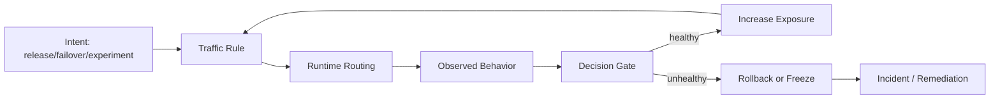
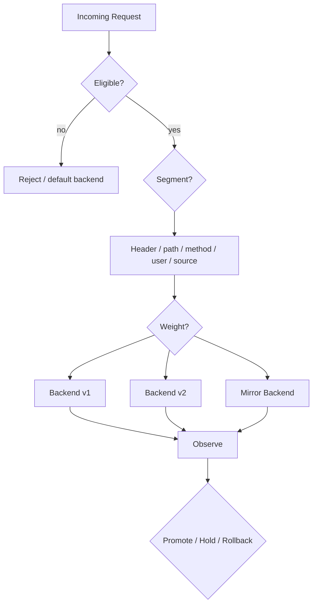
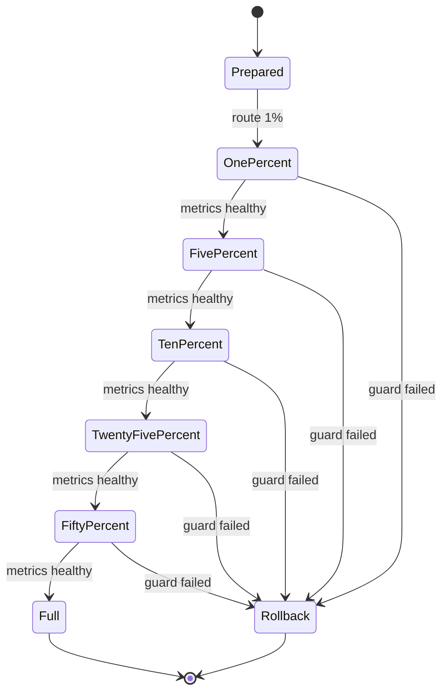
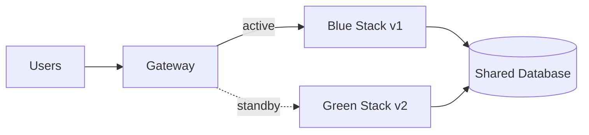
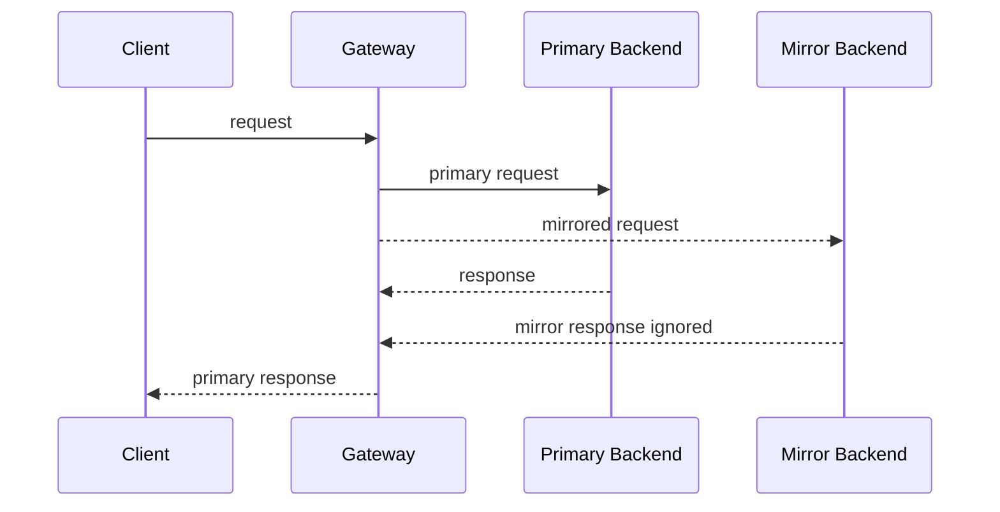
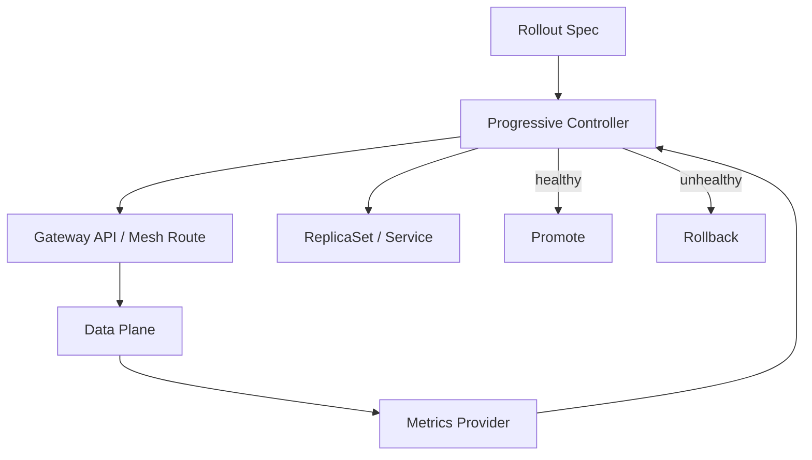
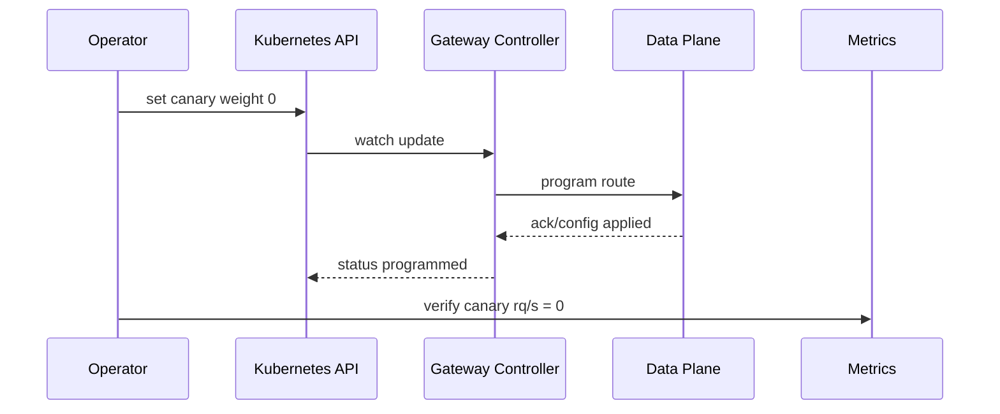

# Part 025 — Traffic Shaping, Canary, Blue-Green, Mirroring, and Failover

## 1. Tujuan Part Ini

Part 024 membahas identity dan zero-trust service networking. Part ini masuk ke sisi operasional traffic: bagaimana mengarahkan request secara bertahap tanpa menjadikan production sebagai roulette.

Target part ini:

> Anda mampu mendesain traffic shaping untuk rollout, canary, blue-green, dark launch, mirroring, dan failover dengan invariant yang jelas, observability yang cukup, dan rollback yang benar-benar menghentikan exposure.

Setelah part ini, Anda harus bisa menjawab:

- Apa perbedaan canary, blue-green, dark launch, mirroring, A/B test, dan failover?
- Kapan memakai Gateway API, service mesh, progressive delivery controller, atau feature flag?
- Mengapa weighted routing bukan persentase user yang presisi?
- Mengapa request mirroring berbahaya untuk write path?
- Apa yang harus diamati sebelum menaikkan traffic?
- Bagaimana memastikan rollback bukan hanya “apply YAML lama”?
- Bagaimana membuat canary defensible untuk sistem regulated?
- Bagaimana failover berbeda dari rollout?

---

## 2. Kaufman Framing: Jangan Belajar “Canary YAML”; Belajar Control Loop

Kesalahan umum: belajar canary sebagai template YAML.

Itu dangkal. Untuk level senior/top 1%, traffic shaping harus dipahami sebagai **closed-loop control system**:



Dengan pendekatan Kaufman, pecah skill menjadi bagian kecil:

| Sub-skill | Pertanyaan Praktis |
|---|---|
| Segmentation | Request mana yang masuk ke versi baru? |
| Weighting | Berapa exposure yang diberikan? |
| Eligibility | Backend mana yang boleh menerima traffic? |
| Safety gates | Sinyal apa yang mencegah kenaikan traffic? |
| Rollback | Bagaimana exposure dihentikan cepat dan terbukti? |
| Observability | Bukti apa yang menunjukkan versi baru sehat/tidak sehat? |
| Semantics | Apakah traffic shaping terjadi per request, per connection, per user, atau per session? |
| Governance | Siapa boleh mengubah route dan dengan approval apa? |

Latihan deliberate:

1. kirim 1% traffic ke versi baru;
2. amati latency/error/saturation per backend version;
3. naikkan ke 5%, 10%, 25%, 50%;
4. inject error di canary;
5. buktikan rollback menghentikan traffic;
6. coba request mirroring read-only;
7. buktikan write path tidak diduplikasi;
8. dokumentasikan invariants dan failure mode.

---

## 3. Mental Model: Traffic Shaping Adalah Runtime Decision, Bukan Deployment Strategy

Deployment strategy menjawab: **apa yang berjalan di cluster?**

Traffic strategy menjawab: **request mana pergi ke workload mana?**

Keduanya berbeda.

| Layer | Contoh | Concern |
|---|---|---|
| Deployment | Deployment `v1`, Deployment `v2` | Replica, image, config, lifecycle |
| Service discovery | Service selector, EndpointSlice | Backend eligibility |
| Routing | HTTPRoute, VirtualService, Gateway | Request-to-backend decision |
| Policy | timeout, retry, auth, rate limit | Safety envelope |
| Observability | metrics/logs/traces | Feedback loop |
| Governance | RBAC, admission, approval | Change control |

Canary yang bagus bukan hanya “v2 ada 1 replica”. Canary yang bagus adalah:

1. versi baru bisa dibedakan;
2. traffic ke versi baru bisa dikontrol;
3. health versi baru bisa diukur terpisah;
4. rollback bisa menghentikan exposure;
5. safety gate mencegah kenaikan otomatis jika sinyal buruk;
6. perubahan route bisa diaudit.

---

## 4. Taxonomy Traffic Shaping

Jangan campur semua istilah. Masing-masing punya semantics berbeda.

| Pattern | Definisi | Cocok Untuk | Risiko Utama |
|---|---|---|---|
| Canary | Sebagian kecil traffic real ke versi baru | Release safety | Sampel tidak representatif |
| Blue-green | Dua environment/stack, switch traffic antar stack | Fast rollback, major upgrade | State/data compatibility |
| Weighted rollout | Traffic dibagi berdasarkan bobot | Progressive exposure | Bobot bukan user guarantee |
| Header routing | Route berdasarkan header/user segment | Internal testing, beta users | Header spoofing, rule leak |
| Mirroring/shadowing | Copy request ke backend lain, response diabaikan | Read-only validation | Write duplication, side effect |
| Dark launch | Fitur aktif internal tapi tidak terlihat ke user | Warm-up, hidden validation | Hidden cost, hidden dependency |
| A/B test | Segment user untuk eksperimen produk | Product experiment | Bias, inconsistent session |
| Failover | Alihkan traffic dari lokasi/backend rusak | Availability | Split brain, data consistency |
| Brownout | Kurangi fitur non-critical saat overload | Resilience | User experience degradation |

Rule penting:

> Canary dan failover memakai mekanisme routing yang mirip, tetapi tujuan operasionalnya berbeda. Canary menguji perubahan; failover mempertahankan layanan saat kegagalan.

---

## 5. Dimensi Routing Decision

Traffic shaping selalu menjawab lima pertanyaan:



Pertanyaan desain:

1. **Who** — request/user/client mana?
2. **What** — route/path/method/API apa?
3. **Where** — backend/cluster/region mana?
4. **How much** — berapa traffic?
5. **Until when** — kapan promote, freeze, atau rollback?

Jika salah satu tidak jelas, rollout tidak terkendali.

---

## 6. Gateway API Weighted Backend Pattern

Gateway API `HTTPRoute` dapat mengarahkan request ke beberapa backend dengan bobot. Ini berguna untuk canary dan progressive delivery.

Contoh konseptual:

```yaml
apiVersion: gateway.networking.k8s.io/v1
kind: HTTPRoute
metadata:
  name: orders-route
  namespace: orders
spec:
  parentRefs:
    - name: internal-gateway
      namespace: platform-gateway
  hostnames:
    - orders.internal.example.com
  rules:
    - matches:
        - path:
            type: PathPrefix
            value: /api/orders
      backendRefs:
        - name: orders-v1
          port: 8080
          weight: 95
        - name: orders-v2
          port: 8080
          weight: 5
```

Interpretasi:

- request matching `/api/orders` diarahkan ke dua Service;
- bobot relatif `95:5`;
- implementasi controller yang memprogram data plane menentukan detail randomization/load balancing;
- hasil aktual pada window kecil bisa deviasi dari angka teoritis;
- connection reuse, HTTP/2 multiplexing, gRPC long-lived stream, dan sticky session bisa membuat distribusi tidak sederhana.

Production invariant:

> Jangan menganggap `weight: 5` berarti tepat 5% user. Anggap itu target probabilistik per routing decision, kecuali controller dan protocol semantics membuktikan sebaliknya.

---

## 7. Canary: Pattern Produksi

Canary adalah exposure kecil terhadap perubahan.

Tujuannya bukan “meluncurkan perlahan”. Tujuannya adalah **mendeteksi perubahan buruk sebelum blast radius besar**.

### 7.1 Canary Preconditions

Sebelum canary:

| Area | Syarat |
|---|---|
| Versioning | v1 dan v2 bisa dibedakan di metric/log/trace |
| Compatibility | v2 kompatibel dengan schema/data/API saat traffic campuran |
| Readiness | v2 tidak ready sebelum dependency siap |
| Observability | metrics per version tersedia |
| Rollback | route rollback sudah diuji |
| Capacity | v1 cukup menampung traffic jika v2 dihapus |
| Policy | timeout/retry/auth konsisten |
| Audit | perubahan route tercatat |

### 7.2 Canary Ramp

Ramp yang defensible:

```txt
0%  -> deploy dark / no traffic
1%  -> smoke with real production traffic
5%  -> low blast radius validation
10% -> normal heterogeneity begins
25% -> meaningful load validation
50% -> equal comparison
100% -> promote
```

Setiap step punya gate:

- error rate tidak naik di atas threshold;
- p95/p99 latency tidak memburuk signifikan;
- saturation tidak naik abnormal;
- business/domain invariant tidak gagal;
- security/audit event tidak abnormal;
- dependency downstream tidak overload;
- no new critical logs.

### 7.3 Canary Decision Loop



### 7.4 What Makes Canary Hard

Canary sulit karena distribusi traffic tidak selalu representatif:

- 1% traffic mungkin tidak mencakup rare path;
- user premium mungkin tidak terkena canary;
- traffic malam berbeda dari traffic jam kerja;
- cache hit/miss berbeda;
- long-lived gRPC connection tidak rebalanced cepat;
- retries bisa meningkatkan exposure canary tanpa terlihat;
- sticky sessions membuat user tertentu terus kena v2;
- downstream dependency menerima pola request berbeda.

Untuk sistem regulated, tambahkan:

- route change approval;
- evidence capture;
- rollback proof;
- canary decision log;
- trace sample untuk path kritis;
- explicit sign-off untuk schema/data migration.

---

## 8. Header-Based Canary

Header-based routing cocok untuk internal testing, beta users, synthetic checks, atau safe exposure sebelum random canary.

Contoh Gateway API:

```yaml
apiVersion: gateway.networking.k8s.io/v1
kind: HTTPRoute
metadata:
  name: orders-header-canary
  namespace: orders
spec:
  parentRefs:
    - name: internal-gateway
      namespace: platform-gateway
  hostnames:
    - orders.internal.example.com
  rules:
    - matches:
        - path:
            type: PathPrefix
            value: /api/orders
          headers:
            - name: x-release-track
              value: canary
      backendRefs:
        - name: orders-v2
          port: 8080
    - matches:
        - path:
            type: PathPrefix
            value: /api/orders
      backendRefs:
        - name: orders-v1
          port: 8080
```

Design notes:

- letakkan rule paling spesifik lebih dulu;
- jangan expose header internal ke public tanpa sanitization;
- gunakan auth/identity untuk memastikan user tidak bisa spoof header;
- observability harus menandai route decision;
- route fallback harus eksplisit.

Anti-pattern:

```txt
Client public bebas mengirim x-release-track: canary
```

Itu bukan beta test; itu bypass control.

---

## 9. Blue-Green Deployment

Blue-green bukan sekadar dua Deployment. Ini adalah dua **serving environment** yang dapat menerima traffic secara bergantian.



Kelebihan:

- cutover cepat;
- rollback cepat;
- validasi environment baru sebelum aktif;
- cocok untuk major runtime/config upgrade.

Risiko:

- database schema compatibility;
- shared state;
- cache warm-up;
- background job duplication;
- event consumer duplication;
- scheduler/cron double-run;
- sticky session migration;
- hidden dependency dari stack lama.

### 9.1 Blue-Green Checklist

Sebelum switch:

- green menerima synthetic traffic;
- readiness green valid;
- cache warmed;
- background workers controlled;
- schema backward/forward compatible;
- migration complete;
- observability tags stack=`blue|green`;
- rollback route tested;
- old stack capacity masih cukup;
- TTL DNS/LB tidak membuat traffic ghost terlalu lama.

### 9.2 Traffic Switch Example

```yaml
apiVersion: gateway.networking.k8s.io/v1
kind: HTTPRoute
metadata:
  name: payments-route
  namespace: payments
spec:
  parentRefs:
    - name: edge-gateway
      namespace: platform-gateway
  hostnames:
    - payments.example.com
  rules:
    - backendRefs:
        - name: payments-green
          port: 8080
          weight: 100
        - name: payments-blue
          port: 8080
          weight: 0
```

Rollback bukan sekadar set blue 100. Anda juga harus memastikan:

- in-flight request drained;
- green background jobs stopped jika perlu;
- green consumers tidak lagi consume event;
- generated side effects sudah diketahui;
- client cache/session tidak mengarah ke state incompatible.

---

## 10. Request Mirroring / Shadow Traffic

Request mirroring mengirim copy request ke backend lain dan mengabaikan response dari backend mirror.



Mirroring berguna untuk:

- membandingkan latency versi baru;
- menguji parser baru;
- menguji read path baru;
- warm-up cache;
- memvalidasi observability pipeline;
- dark launch ML/rule engine;
- compatibility test terhadap traffic real.

Mirroring berbahaya untuk:

- write request;
- idempotency lemah;
- payment/order mutation;
- email/SMS/push notification;
- external API call berbayar;
- audit event yang tidak boleh double;
- regulatory action/decision yang harus tunggal.

Production invariant:

> Mirror backend tidak boleh menghasilkan side effect eksternal yang tidak dapat dibedakan dari primary backend.

### 10.1 Gateway API RequestMirror Example

```yaml
apiVersion: gateway.networking.k8s.io/v1
kind: HTTPRoute
metadata:
  name: risk-shadow-route
  namespace: risk
spec:
  parentRefs:
    - name: internal-gateway
      namespace: platform-gateway
  rules:
    - matches:
        - path:
            type: PathPrefix
            value: /risk/evaluate
      backendRefs:
        - name: risk-engine-v1
          port: 8080
      filters:
        - type: RequestMirror
          requestMirror:
            backendRef:
              name: risk-engine-v2-shadow
              port: 8080
```

Guardrails:

- shadow service uses isolated credentials;
- outbound egress denied except approved dependencies;
- writes redirected to sandbox storage;
- events tagged `shadow=true`;
- logs/traces include mirror route;
- mirror response ignored by client path;
- alerts separate primary and shadow.

### 10.2 Percentage-Based Mirroring

Jika controller mendukung percentage/fraction mirroring, gunakan untuk mengontrol cost dan risk.

```yaml
filters:
  - type: RequestMirror
    requestMirror:
      backendRef:
        name: recommendation-v2-shadow
        port: 8080
      percent: 5
```

Gunakan fraction untuk high-QPS service:

```yaml
filters:
  - type: RequestMirror
    requestMirror:
      backendRef:
        name: recommendation-v2-shadow
        port: 8080
      fraction:
        numerator: 1
        denominator: 10000
```

Caution:

- tidak semua controller/version mendukung semua field;
- cek Gateway API conformance dan implementation docs;
- jangan deploy field yang controller abaikan secara diam-diam;
- verify lewat metrics mirror backend.

---

## 11. Dark Launch

Dark launch berarti komponen baru hidup dan mungkin menerima internal signal, tetapi belum mempengaruhi user visible outcome.

Contoh:

- route v2 menerima mirrored read traffic;
- model scoring baru menghitung hasil tapi tidak dipakai;
- fraud rule baru menulis decision candidate ke audit table;
- API parser baru memvalidasi request tapi tidak menolak request;
- cache baru di-warm tanpa jadi source of truth.

Dark launch bagus untuk:

- validasi performa;
- capacity planning;
- compatibility testing;
- gathering evidence;
- reducing release uncertainty.

Risiko:

- dark path menghabiskan resource;
- dark path memanggil dependency external;
- dark result bocor ke user;
- audit bingung karena ada decision ganda;
- operator lupa dark path aktif.

Design rule:

> Dark launch harus memiliki kill switch, budget, dan observability sendiri.

---

## 12. Failover: Jangan Samakan dengan Canary

Failover adalah mekanisme availability. Tujuannya mengalihkan traffic saat backend/lokasi gagal.

Canary bertanya:

> Apakah versi baru aman dinaikkan exposure-nya?

Failover bertanya:

> Apakah primary path tidak layak menerima traffic, dan secondary path cukup aman untuk mengambil alih?

### 12.1 Failover Modes

| Mode | Description | Trade-off |
|---|---|---|
| Manual failover | Operator switch route | Lebih aman, lebih lambat |
| Automated failover | Health-based route change | Cepat, rawan false positive |
| Active-active | Semua lokasi menerima traffic | Capacity bagus, consistency sulit |
| Active-passive | Secondary standby | Simpler consistency, capacity idle |
| Locality failover | Prefer local, fallback remote | Latency optimal, routing kompleks |
| Brownout failover | Fitur non-critical dimatikan sebelum failover penuh | Mengurangi blast radius |

### 12.2 Failover Invariants

Sebelum automated failover:

- health check merepresentasikan dependency penting;
- secondary punya capacity;
- data replication lag diketahui;
- idempotency token bekerja;
- DNS/LB TTL dipahami;
- sticky sessions ditangani;
- auth/session/token valid lintas lokasi;
- audit trail tidak terputus;
- failback plan tersedia.

### 12.3 Failover Is Not Always Correct

Jangan failover otomatis jika:

- secondary memakai database stale untuk keputusan kritis;
- primary sebenarnya sehat tetapi health check salah;
- masalah ada di downstream global dependency;
- failover menyebabkan double writer;
- failover menghilangkan evidence/audit.

Untuk sistem enforcement/regulatory, failover harus mempertahankan:

- decision ordering;
- case state consistency;
- audit event uniqueness;
- legal clock/timestamp semantics;
- reviewer assignment integrity;
- escalation deadline correctness.

---

## 13. Service Mesh Traffic Shaping

Service mesh biasanya memberi kontrol L7 lebih kaya untuk east-west traffic.

Contoh Istio-style traffic split:

```yaml
apiVersion: networking.istio.io/v1
kind: VirtualService
metadata:
  name: orders
  namespace: orders
spec:
  hosts:
    - orders.orders.svc.cluster.local
  http:
    - route:
        - destination:
            host: orders.orders.svc.cluster.local
            subset: v1
          weight: 90
        - destination:
            host: orders.orders.svc.cluster.local
            subset: v2
          weight: 10
```

Dengan `DestinationRule`:

```yaml
apiVersion: networking.istio.io/v1
kind: DestinationRule
metadata:
  name: orders
  namespace: orders
spec:
  host: orders.orders.svc.cluster.local
  subsets:
    - name: v1
      labels:
        version: v1
    - name: v2
      labels:
        version: v2
```

Mesh cocok jika:

- traffic shaping internal antar service;
- mTLS/identity penting;
- route by service version/subset;
- perlu per-route retries/timeouts;
- perlu L7 telemetry per workload;
- ingin policy konsisten antar namespace.

Gateway API cocok jika:

- traffic masuk melalui shared Gateway;
- ownership app/platform dipisahkan;
- ingin Kubernetes-native route API;
- multi-controller portability penting;
- ingress/north-south adalah concern utama;
- mesh menggunakan GAMMA/HTTPRoute untuk internal routing.

Feature flag cocok jika:

- perubahan ada di business logic;
- segmentasi user kompleks;
- butuh deterministic user bucketing;
- route-level traffic split terlalu kasar;
- exposure bukan hanya request-to-backend.

---

## 14. Progressive Delivery Controllers

Manual weight update bisa bekerja untuk latihan, tetapi production sering butuh controller seperti Argo Rollouts atau Flagger.

Controller progressive delivery biasanya melakukan:

1. deploy canary ReplicaSet/Service;
2. update route weight;
3. wait interval;
4. query metrics provider;
5. promote atau rollback;
6. emit event/status.



Design review questions:

- Apakah controller mengubah route yang sama dengan app team?
- Apakah rollback weight dan workload rollback sinkron?
- Apa metric query yang dipakai?
- Berapa analysis interval?
- Berapa minimum sample size?
- Apa yang terjadi jika metrics provider down?
- Apakah failure membuka traffic atau freeze?
- Apakah manual override tersedia?

Anti-pattern:

```txt
Progressive controller gagal membaca Prometheus, lalu rollout dianggap sukses.
```

Default aman biasanya: **freeze atau rollback, bukan promote**.

---

## 15. Observability untuk Traffic Shaping

Traffic shaping tanpa observability adalah random rollout.

Minimal dimensions:

- route name;
- gateway name;
- namespace;
- service;
- backend version;
- workload;
- response code;
- latency bucket;
- retry count;
- upstream cluster;
- source workload;
- destination workload;
- trace ID;
- release/canary label.

### 15.1 Metrics

| Metric | Gunanya |
|---|---|
| `request_total{version}` | Validasi distribusi traffic |
| `error_rate{version}` | Deteksi regression |
| `latency_p95/p99{version}` | Tail degradation |
| `upstream_rq_retry` | Retry amplification |
| `upstream_rq_timeout` | Timeout mismatch |
| `upstream_cx_overflow` | Circuit breaker/load issue |
| `saturation` | CPU/memory/connection pool |
| domain metric | Validasi outcome bisnis |

Untuk sistem case management/regulatory, tambahkan:

- case transition error;
- duplicate decision event;
- invalid escalation state;
- SLA deadline mutation error;
- audit write failure;
- reviewer assignment mismatch;
- policy decision divergence.

### 15.2 Logs

Log harus menjawab:

- request masuk route mana?
- backend mana dipilih?
- versi apa?
- apakah mirrored?
- apakah retried?
- apakah request id sama?
- apakah shadow path punya side effect?
- apakah rule yang dipakai sesuai expected?

### 15.3 Traces

Trace membantu membedakan:

- client latency;
- gateway latency;
- service latency;
- downstream latency;
- retry attempts;
- mirrored span;
- fallback path;
- dependency fan-out.

---

## 16. Rollback Semantics

Rollback yang benar harus menghentikan exposure, bukan hanya mengubah niat.

Rollback checklist:

1. route weight canary menjadi 0;
2. route status menunjukkan programmed;
3. data plane config sudah diterima;
4. canary backend request count turun ke 0 atau expected drain;
5. in-flight request selesai/drained;
6. background consumers dihentikan jika perlu;
7. canary deployment tidak menerima traffic langsung via Service lain;
8. feature flag dimatikan jika perubahan juga ada di app layer;
9. audit dicatat;
10. incident hypothesis dibuat.



Jika tidak ada verification step, rollback belum terbukti.

---

## 17. Failure Mode Catalog

| Failure | Root Cause | Detection | Mitigation |
|---|---|---|---|
| Canary menerima terlalu banyak traffic | Weight semantics salah, HTTP/2 connection reuse, retry | Request count per version | Lower weight, per-connection awareness, retry cap |
| Canary tidak menerima traffic | Route conflict, backend invalid, status ignored | Backend v2 request count zero | Check route conditions, backendRefs, Gateway status |
| Mirrored write duplicate | Mirror applied to mutation path | Duplicate order/payment/event | Block side effects, mirror only safe paths |
| Rollback tidak efektif | Data plane stale, route status ignored | v2 still receives traffic | Verify programmed status and live metrics |
| Blue-green double consumer | Both stacks consume event | Duplicate processing | Consumer fencing, lease, queue partition control |
| Header canary spoofed | Public client controls header | Unexpected beta exposure | Strip/sanitize header at edge |
| Canary hides rare path failure | Sample too small | Error after 100% promote | Synthetic tests, path-based canary |
| Metrics provider down | Analysis cannot validate | Missing metrics | Freeze/rollback on unknown |
| Failover loops | Health check flaps | Frequent route switching | Hysteresis, manual gate, dampening |
| Failover corrupts state | Secondary stale or double writer | Data divergence | Consistency gate, read-only failover, fencing |
| Traffic split breaks session | User requests hit both versions | Session errors | Sticky routing or compatibility |
| Shadow backend overload | Mirroring doubles QPS | Mirror saturation | Percent/fraction mirror, rate cap |

---

## 18. Production Design Patterns

### 18.1 Safe Canary for API Service

Use when API is stateless and backward-compatible.

Design:

- deploy v2;
- expose v2 through separate Service;
- route 1% traffic;
- monitor per-version metrics;
- raise traffic gradually;
- rollback by setting v2 weight 0;
- remove v1 only after stable window.

Invariants:

- v1 and v2 both accept current schema;
- DB migration backward-compatible;
- no background job duplication;
- route status verified.

### 18.2 Header-Gated Internal Beta

Use when only internal users/test clients should hit v2.

Design:

- edge strips user-controlled beta headers;
- auth layer injects trusted header;
- HTTPRoute matches trusted header;
- v2 logs `release_track=beta`;
- no random exposure yet.

Invariants:

- public cannot spoof;
- beta path has separate dashboard;
- fallback route explicit.

### 18.3 Shadow Read Path

Use when v2 should evaluate real requests but not affect clients.

Design:

- mirror only GET/read/evaluate endpoints;
- shadow backend uses isolated DB/schema;
- outbound side effects blocked;
- compare primary and shadow outputs asynchronously;
- no client response from shadow.

Invariants:

- shadow result never modifies official state;
- shadow audit separated;
- cost budget enforced.

### 18.4 Blue-Green for Major Runtime Upgrade

Use when rollout changes runtime, base image, proxy, JVM, native library, or large config.

Design:

- green stack fully deployed;
- run synthetic read/write smoke tests;
- freeze background jobs in inactive stack;
- switch traffic;
- keep blue warm for rollback;
- retire blue after stable window.

Invariants:

- green uses compatible DB schema;
- only active stack runs scheduled jobs;
- rollback is tested.

### 18.5 Failover with Manual Approval

Use for regulated/high-risk systems where false failover is dangerous.

Design:

- health signal raises incident;
- operator reviews data consistency;
- route switch requires approval;
- secondary starts in limited mode if data stale;
- failback requires separate runbook.

Invariants:

- no double writer;
- audit continuity preserved;
- user-visible degradation documented.

---

## 19. Governance and Ownership

Traffic shaping touches release risk, availability, security, and compliance. Ownership must be explicit.

| Actor | Owns |
|---|---|
| Platform team | GatewayClass, shared Gateway, controller, policy defaults |
| App team | HTTPRoute, backend Services, canary intent |
| SRE team | SLO gates, rollback procedure, incident response |
| Security team | header trust, public exposure, auth policy |
| Compliance team | audit evidence, release approval, change record |

Useful controls:

- RBAC: app team can update Route in namespace but not Gateway listener;
- admission: reject public route without approved hostname label;
- policy: force timeout/retry defaults;
- audit: record route diff;
- progressive delivery: require metric gate;
- GitOps: route changes reviewed as code;
- emergency break-glass: explicit and logged.

---

## 20. Practical Debugging Workflow

Symptom: “Canary broke users.”

Debug order:

1. Confirm route config:

```bash
kubectl get httproute -n orders orders-route -o yaml
kubectl describe httproute -n orders orders-route
```

2. Confirm Gateway attachment/status:

```bash
kubectl describe gateway -n platform-gateway internal-gateway
```

3. Confirm backend Services and endpoints:

```bash
kubectl get svc -n orders orders-v1 orders-v2
kubectl get endpointslice -n orders -l kubernetes.io/service-name=orders-v2
```

4. Confirm live traffic split:

```txt
sum(rate(http_requests_total{service="orders",version="v1"}[5m]))
sum(rate(http_requests_total{service="orders",version="v2"}[5m]))
```

5. Confirm errors by version:

```txt
sum(rate(http_requests_total{service="orders",version="v2",status=~"5.."}[5m]))
/
sum(rate(http_requests_total{service="orders",version="v2"}[5m]))
```

6. Confirm retry/timeout:

```txt
rate(envoy_cluster_upstream_rq_retry_total{upstream_cluster=~".*orders-v2.*"}[5m])
rate(envoy_cluster_upstream_rq_timeout{upstream_cluster=~".*orders-v2.*"}[5m])
```

7. Rollback and verify:

```bash
kubectl patch httproute -n orders orders-route --type='json' \
  -p='[{"op":"replace","path":"/spec/rules/0/backendRefs/1/weight","value":0}]'
```

Then verify v2 request rate.

---

## 21. Practice Plan

### Drill 1 — Weighted Canary

Goal:

- deploy v1/v2 service;
- route 95/5;
- generate 10,000 requests;
- measure actual distribution;
- change to 50/50;
- verify distribution again.

Learning:

- weight is probabilistic;
- sample size matters;
- controller behavior matters.

### Drill 2 — Header Canary

Goal:

- route `x-release-track: canary` to v2;
- strip header at edge;
- inject trusted header internally;
- prove public spoof fails.

Learning:

- traffic shaping is security-sensitive.

### Drill 3 — Request Mirroring

Goal:

- mirror read request to shadow backend;
- ensure client receives primary response;
- make shadow backend fail;
- verify primary response unaffected.

Learning:

- mirror response must not affect client.

### Drill 4 — Mirrored Write Hazard

Goal:

- simulate write endpoint;
- mirror it to shadow;
- observe duplicate side effects;
- add guardrail to block writes.

Learning:

- mirroring is not safe by default.

### Drill 5 — Canary Rollback Proof

Goal:

- route 10% to v2;
- inject 500 error;
- rollback weight to 0;
- prove v2 request rate stops.

Learning:

- rollback must be verified in dataplane metrics.

---

## 22. Decision Framework

Use this selection table:

| Need | Prefer |
|---|---|
| Public API traffic split | Gateway API HTTPRoute |
| Internal service-to-service split with mTLS | Mesh routing / GAMMA |
| Deterministic user targeting | Feature flag |
| Read-only production replay | Request mirroring |
| Major stack switch | Blue-green |
| Automated metric-gated rollout | Progressive delivery controller |
| Regional outage response | Failover routing / global LB |
| Product experiment | Feature flag + analytics |
| Compliance-heavy release | Manual gate + auditable route change |

Rule of thumb:

> Route-level traffic shaping is good at deciding **where a request goes**. It is weak at deciding **what business behavior a user sees**. Use feature flags for business behavior and route rules for network/backend selection.

---

## 23. Review Checklist

Before approving a production traffic shaping design:

- [ ] v1 and v2 are separately observable.
- [ ] Route status is part of rollout verification.
- [ ] Backend endpoint readiness is correct.
- [ ] Canary traffic has minimum sample size.
- [ ] Rollback path has been tested.
- [ ] Retry/timeout policy will not amplify canary failures.
- [ ] Mirroring excludes unsafe write paths.
- [ ] Public headers cannot spoof internal routing.
- [ ] Blue-green does not double-run jobs/consumers.
- [ ] Failover does not create double writer.
- [ ] Compliance/audit evidence is captured.
- [ ] Ownership of route/Gateway/policy is clear.
- [ ] Metrics provider failure behavior is safe.
- [ ] Manual override exists.

---

## 24. Mental Model Summary

Traffic shaping is not a YAML trick.

It is a production control loop:

1. define exposure intent;
2. encode route decision;
3. observe actual traffic;
4. compare against safety gates;
5. promote, hold, or rollback;
6. preserve evidence.

The top 1% difference is not knowing that `weight` exists. It is knowing when `weight` is insufficient, when mirroring is unsafe, when blue-green breaks state, when failover corrupts consistency, and how to prove the route you intended is actually the route your dataplane is serving.

---

## 25. Source Notes

This part is aligned with:

- Kubernetes Gateway API HTTPRoute documentation: `https://gateway-api.sigs.k8s.io/api-types/httproute/`
- Gateway API HTTP request mirroring guide: `https://gateway-api.sigs.k8s.io/guides/user-guides/http-request-mirroring/`
- Kubernetes Gateway API v1.2 release blog for percentage-based mirroring and retry context: `https://kubernetes.io/blog/2024/11/21/gateway-api-v1-2/`
- Istio traffic management concepts: `https://istio.io/latest/docs/concepts/traffic-management/`
- Istio request routing, traffic shifting, mirroring, and fault injection task documentation.

Lanjut ke Part 026: resilience policy — timeouts, retries, circuit breaking, outlier detection, and load shedding.
