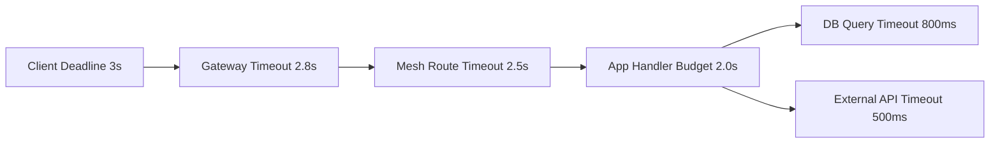
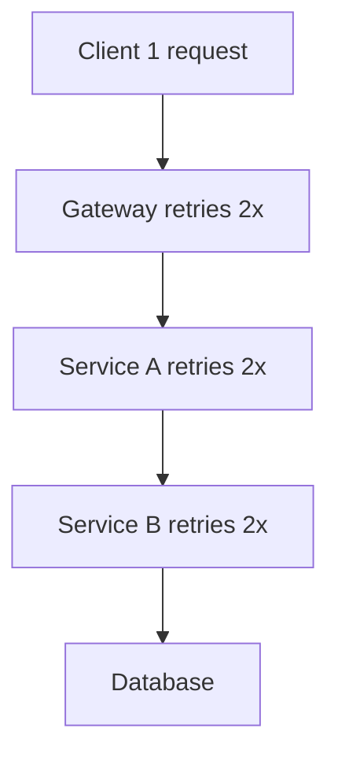
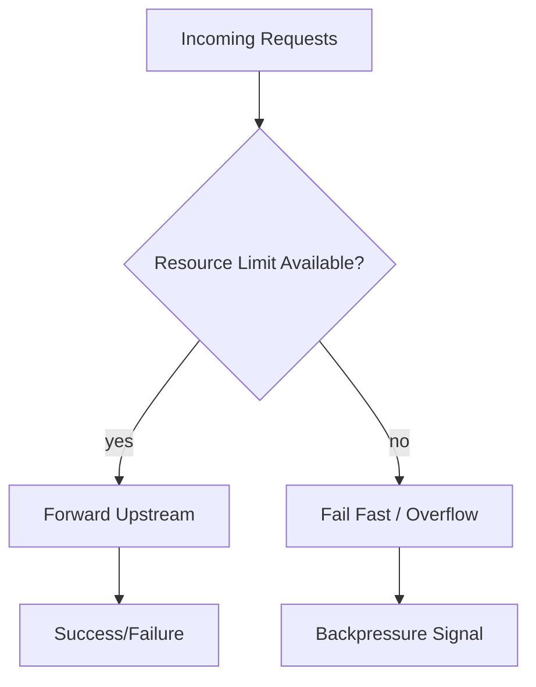
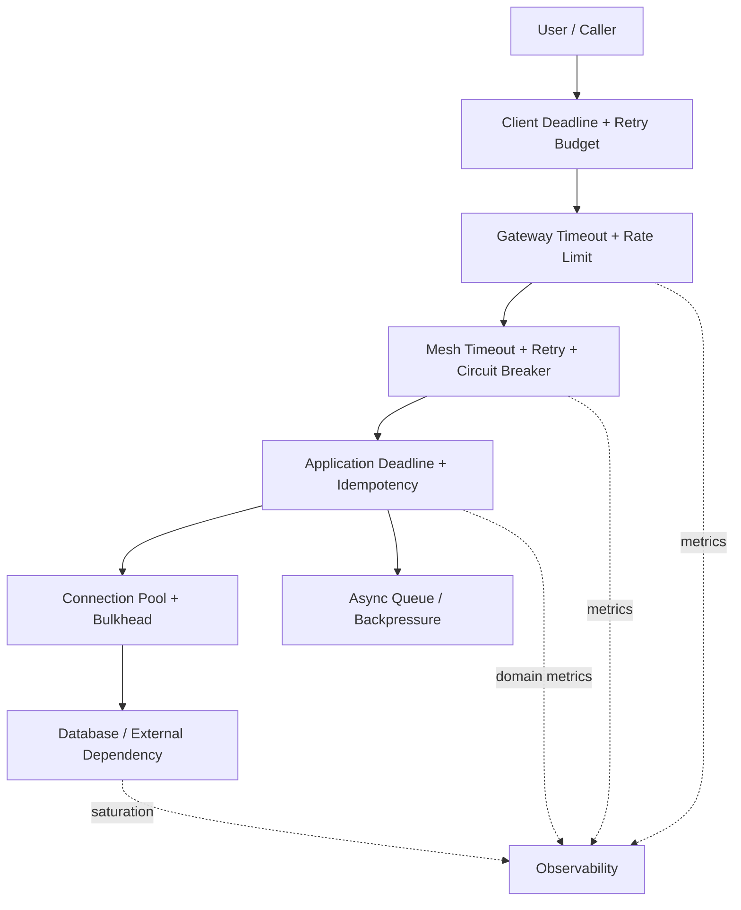

# Part 026 — Resilience, Timeouts, Retries, Circuit Breaking, and Load Shedding

## 1. Tujuan Part Ini

Part 025 membahas traffic shaping untuk rollout dan failover. Part ini membahas safety envelope yang membuat traffic tidak berubah menjadi cascading failure: timeout, retry, circuit breaking, outlier detection, load shedding, dan backpressure.

Target part ini:

> Anda mampu mendesain resilience policy lintas client, Gateway, mesh, service, dependency, dan database sehingga failure cepat terdeteksi, tidak diamplifikasi, dan tidak menyebar ke seluruh platform.

Setelah part ini, Anda harus bisa menjawab:

- Timeout mana yang harus lebih kecil: client, Gateway, mesh, app, atau database?
- Kapan retry membantu, dan kapan retry menjadi serangan DDoS internal?
- Apa perbedaan circuit breaking dan outlier detection?
- Bagaimana load shedding berbeda dari rate limiting?
- Apa itu retry budget?
- Mengapa timeout default sering berbahaya?
- Bagaimana membaca symptom `503`, `504`, reset, dan timeout dalam mesh?
- Bagaimana membuat resilience policy defensible untuk sistem regulated?

---

## 2. Kaufman Framing: Reliability Bukan “Tambah Retry”

Kesalahan umum:

```txt
Service lambat? Tambahkan retry.
```

Itu sering memperburuk incident.

Dengan pendekatan Kaufman, pecah resilience menjadi primitive:

| Primitive | Pertanyaan |
|---|---|
| Timeout | Berapa lama kita rela menunggu? |
| Retry | Kegagalan apa yang layak dicoba ulang? |
| Retry budget | Berapa retry yang boleh terjadi sebelum merusak sistem? |
| Circuit breaker | Kapan kita fail fast agar tidak menambah beban? |
| Outlier detection | Instance mana yang harus dikeluarkan sementara dari load balancing? |
| Load shedding | Request mana yang harus ditolak untuk menyelamatkan sistem? |
| Backpressure | Bagaimana memberi sinyal ke caller agar melambat? |
| Bulkhead | Bagaimana mencegah satu dependency menghabiskan semua resource? |
| Brownout | Fitur mana yang bisa dikurangi saat overload? |

Deliberate practice:

1. set timeout terlalu tinggi dan amati queue buildup;
2. set retry tanpa budget dan amati amplification;
3. trip circuit breaker;
4. eject bad endpoint dengan outlier detection;
5. shed load non-critical;
6. align timeout antar layer;
7. dokumentasikan failure contract.

---

## 3. Mental Model: Resilience Policy Adalah Budget Allocation

Setiap request memiliki budget:

- time budget;
- concurrency budget;
- retry budget;
- connection budget;
- CPU/memory budget;
- downstream dependency budget;
- error budget;
- human response budget.

Reliability terjadi ketika budget dialokasikan secara sadar.



Jika downstream timeout lebih besar dari upstream timeout, maka caller bisa menyerah lebih dulu sementara callee masih bekerja. Itu menghasilkan:

- wasted compute;
- zombie work;
- queue growth;
- connection exhaustion;
- duplicate retry;
- misleading metrics.

Production invariant:

> Deadline harus mengalir dari caller ke callee. Semakin dalam call chain, budget harus semakin kecil atau minimal sadar terhadap upstream deadline.

---

## 4. Timeout Taxonomy

Timeout bukan satu angka.

| Timeout | Layer | Arti |
|---|---|---|
| Client timeout | Client/browser/mobile/service caller | Batas total menunggu response |
| Gateway request timeout | Edge/Gateway | Batas request end-to-end di gateway |
| Backend request timeout | Gateway/mesh to backend | Batas waktu menunggu backend response |
| Connect timeout | TCP/client/proxy | Batas membuat koneksi |
| TLS handshake timeout | TLS layer | Batas negosiasi TLS |
| Idle timeout | LB/proxy/connection | Batas koneksi idle |
| Stream timeout | HTTP/2/gRPC | Batas stream panjang |
| Per-try timeout | Retry policy | Batas tiap attempt |
| Drain timeout | rollout/shutdown | Waktu menyelesaikan in-flight request |
| Database query timeout | DB client/server | Batas query |
| External dependency timeout | App/outbound proxy | Batas call ke sistem luar |

### 4.1 Timeout Alignment

Bad alignment:

```txt
Client timeout:      3s
Gateway timeout:     10s
App timeout:         8s
DB timeout:          30s
```

Akibat:

- client sudah pergi pada 3s;
- Gateway/app/DB masih bekerja;
- retry client bisa membuat duplicate work;
- thread/connection pool habis;
- incident terlihat sebagai high CPU/DB load, bukan timeout mismatch.

Better alignment:

```txt
Client timeout:      3s
Gateway timeout:     2.8s
App deadline:        2.5s
DB query timeout:    700ms
External call:       500ms
```

Bukan angka ini yang penting. Yang penting adalah ordering dan reasoning.

### 4.2 Timeout and User Journey

Untuk sistem case/regulatory:

| Operation | Timeout Strategy |
|---|---|
| Search/list case | short timeout, degrade gracefully |
| Submit enforcement decision | stricter consistency, idempotency, clear failure |
| Generate report | async job, no long sync wait |
| Audit write | must complete or fail closed depending regulation |
| Notification send | async, retry with idempotency |
| SLA escalation check | bounded job, checkpointed progress |

Rule:

> Jangan memakai timeout network yang sama untuk semua domain action. Business criticality mempengaruhi timeout strategy.

---

## 5. Gateway API Timeouts

Gateway API `HTTPRoute` memiliki model timeouts pada rule untuk mengontrol request behavior, tetapi dukungan detail bergantung pada versi API dan implementation/controller.

Contoh konseptual:

```yaml
apiVersion: gateway.networking.k8s.io/v1
kind: HTTPRoute
metadata:
  name: reviews
  namespace: reviews
spec:
  parentRefs:
    - group: ""
      kind: Service
      name: reviews
      port: 9080
  rules:
    - backendRefs:
        - name: reviews-v2
          port: 9080
      timeouts:
        request: 500ms
```

Interpretasi:

- `request` membatasi total request processing pada route;
- controller harus mendukung field tersebut;
- status/conformance harus dicek;
- app-level timeout yang lebih kecil tetap bisa menang;
- client-level timeout yang lebih kecil juga bisa menang.

Production advice:

- jangan deploy timeout hanya karena field tersedia;
- verify actual behavior dengan delayed backend;
- monitor timeout response code;
- dokumentasikan siapa pemilik timeout: platform atau app team;
- jangan override domain-level deadline tanpa approval.

---

## 6. Retry: Useful, Dangerous, and Often Misunderstood

Retry membantu jika kegagalan bersifat transient:

- koneksi reset;
- upstream endpoint sedang restart;
- 503 sementara;
- network blip;
- idempotent read request;
- load balancer memilih endpoint buruk.

Retry berbahaya jika:

- request tidak idempotent;
- downstream overload;
- failure permanen;
- retry terjadi di banyak layer;
- tidak ada jitter/backoff;
- tidak ada retry budget;
- timeout per attempt terlalu panjang;
- semua caller retry bersamaan.

### 6.1 Retry Amplification



Jika setiap layer melakukan 2 retry, satu request bisa menjadi banyak attempt downstream.

```txt
attempts = 1 * 3 * 3 * 3 = 27
```

Itu bukan resilience. Itu internal traffic multiplier.

### 6.2 Retry Budget

Retry budget membatasi total retry relatif terhadap request volume.

Contoh policy:

```txt
retry rate must not exceed 10% of original request rate over 5 minutes
```

Jika service menerima 10,000 request/menit, maksimal retry adalah 1,000 retry/menit.

Manfaat:

- mencegah retry storm;
- menjaga downstream tetap hidup;
- membuat alert lebih meaningful;
- memaksa pemilik service memilih retry secara sadar.

### 6.3 Retry Conditions

Retry hanya untuk kondisi tertentu:

| Condition | Retry? | Catatan |
|---|---:|---|
| HTTP 500 | sometimes | Bisa permanen, hati-hati |
| HTTP 502/503/504 | often | Cocok jika transient |
| connect failure | often | Endpoint/network transient |
| reset before response | often | Aman untuk idempotent operation |
| timeout | maybe | Bisa memperburuk overload |
| HTTP 400/401/403 | no | Client/auth error |
| HTTP 409 | depends | Domain conflict, biasanya jangan blind retry |
| write request | only with idempotency key | Tanpa idempotency berbahaya |

---

## 7. Gateway API Retries

Gateway API memiliki perkembangan retry support untuk `HTTPRoute`; beberapa versi/fitur bersifat experimental atau implementation-dependent. Treat retries as portability-sensitive.

Contoh konseptual:

```yaml
apiVersion: gateway.networking.k8s.io/v1
kind: HTTPRoute
metadata:
  name: face-with-retries
  namespace: faces
spec:
  parentRefs:
    - name: my-gateway
      kind: Gateway
      port: 80
  rules:
    - matches:
        - path:
            type: PathPrefix
            value: /face
      backendRefs:
        - name: face
          port: 80
      retry:
        codes: [500, 502, 503, 504]
        attempts: 3
        backoff: 500ms
```

Production caution:

- cek apakah controller mendukung `retry` field;
- jangan retry semua status code;
- jangan retry mutation tanpa idempotency;
- set per-try timeout;
- pastikan total request timeout membatasi semua attempts;
- alert pada retry rate, bukan hanya final status.

---

## 8. Istio Timeout and Retry Pattern

Istio dapat mengatur timeout/retry pada `VirtualService` atau, dalam mode tertentu, melalui Gateway API route.

Contoh Istio-style:

```yaml
apiVersion: networking.istio.io/v1
kind: VirtualService
metadata:
  name: payments
  namespace: payments
spec:
  hosts:
    - payments.payments.svc.cluster.local
  http:
    - timeout: 2s
      retries:
        attempts: 2
        perTryTimeout: 500ms
        retryOn: connect-failure,refused-stream,unavailable,reset
      route:
        - destination:
            host: payments.payments.svc.cluster.local
            subset: v1
```

Interpretasi:

- total route timeout 2s;
- tiap attempt maksimal 500ms;
- maksimal 2 retry after original attempt tergantung implementation semantics;
- retry conditions dibatasi;
- retry tidak boleh mengalahkan domain deadline.

Common bug:

```txt
App has 3s timeout, mesh has 10s timeout, DB has 30s timeout.
```

Mesh policy terlihat “lebih sabar”, tetapi client sudah menyerah. Ini membuang resource.

---

## 9. Circuit Breaking

Circuit breaker membatasi resource/attempt agar sistem gagal cepat saat overload atau dependency buruk.

Circuit breaking bukan health check. Circuit breaker adalah **resource protection**.

Envoy circuit breaker dapat membatasi beberapa hal seperti:

- maximum connections;
- maximum pending requests;
- maximum requests;
- maximum retries;
- connection pool pressure.

Mental model:



### 9.1 Why Fail Fast Is Better

Tanpa circuit breaker:

- request menumpuk;
- latency naik;
- caller timeout;
- caller retry;
- downstream makin overload;
- semua service ikut lambat.

Dengan circuit breaker:

- sebagian request gagal cepat;
- queue tidak tumbuh tanpa batas;
- resource diselamatkan untuk request yang masih bisa diproses;
- caller bisa degrade atau back off.

### 9.2 Istio DestinationRule Example

```yaml
apiVersion: networking.istio.io/v1
kind: DestinationRule
metadata:
  name: httpbin
  namespace: httpbin
spec:
  host: httpbin.httpbin.svc.cluster.local
  trafficPolicy:
    connectionPool:
      tcp:
        maxConnections: 100
      http:
        http1MaxPendingRequests: 50
        maxRequestsPerConnection: 10
    outlierDetection:
      consecutive5xxErrors: 5
      interval: 10s
      baseEjectionTime: 30s
      maxEjectionPercent: 50
```

Notes:

- `connectionPool` membatasi penggunaan resource;
- `outlierDetection` mengeluarkan endpoint buruk sementara;
- angka harus dituning berdasarkan load test, bukan copy-paste;
- terlalu ketat menyebabkan false rejection;
- terlalu longgar tidak melindungi apa pun.

---

## 10. Outlier Detection

Outlier detection adalah passive health checking: proxy mengamati host yang performanya berbeda/buruk lalu mengeluarkannya sementara dari load balancing set.

Perbedaan:

| Mechanism | Apa yang Dilindungi | Trigger |
|---|---|---|
| Readiness probe | Endpoint eligibility di Kubernetes | Probe kubelet/app |
| Active health check | Health dari checker eksplisit | Periodic check |
| Outlier detection | Load balancing set di proxy | Error/timeout/reset observed |
| Circuit breaker | Resource budget | Limit exceeded |

Outlier detection berguna jika:

- satu pod rusak tetapi masih ready;
- satu zone lambat;
- endpoint intermittent reset;
- beberapa backend return 5xx lebih sering.

Risiko:

- semua endpoint dieject saat downstream global bermasalah;
- false positive pada traffic rendah;
- ejection menyebabkan load makin berat ke endpoint tersisa;
- bad deployment terlihat seperti bad endpoint;
- app-level error dilihat sebagai network/backend health issue.

Production invariant:

> Outlier detection harus memiliki max ejection limit dan observability. Jangan biarkan proxy menghilangkan seluruh capacity tanpa operator tahu.

---

## 11. Load Shedding

Load shedding adalah menolak sebagian request agar sistem tetap hidup.

Ini berbeda dari rate limiting:

| Mechanism | Basis | Tujuan |
|---|---|---|
| Rate limiting | Policy quota per client/user/token | Fairness/protection |
| Load shedding | Current saturation/priority | Survival under overload |
| Circuit breaking | Resource limit per upstream/cluster | Prevent cascading failure |
| Backpressure | Signal caller to slow down | Coordinated stability |

Load shedding bisa berdasarkan:

- request priority;
- user tier;
- endpoint criticality;
- queue depth;
- CPU/memory;
- DB pool saturation;
- latency SLO burn;
- downstream health.

### 11.1 Brownout

Brownout menonaktifkan fitur non-critical saat overload.

Contoh:

- disable recommendation widget;
- skip expensive enrichment;
- return cached summary;
- delay report generation;
- queue notification;
- degrade search relevance;
- switch to read-only mode.

Untuk case management/regulatory:

| Feature | Brownout Candidate? | Reason |
|---|---:|---|
| Dashboard aggregate | yes | Bisa stale/cached |
| Recommendation/assistive scoring | maybe | Bergantung governance |
| Enforcement decision commit | no | Harus jelas sukses/gagal |
| Audit log write | no/strict | Compliance-critical |
| Notification | yes async | Bisa retry later |
| SLA escalation | careful | Deadline-sensitive |

Rule:

> Load shedding harus menolak request yang paling murah secara domain impact, bukan request yang kebetulan datang terakhir.

---

## 12. Backpressure

Backpressure berarti downstream memberi sinyal bahwa caller harus melambat.

Bentuk:

- HTTP `429 Too Many Requests`;
- HTTP `503 Service Unavailable` dengan `Retry-After`;
- gRPC `RESOURCE_EXHAUSTED`;
- queue admission rejection;
- token bucket empty;
- circuit breaker overflow;
- client-side adaptive concurrency.

Backpressure efektif hanya jika caller menghormatinya.

Anti-pattern:

```txt
Downstream returns 429, caller immediately retries aggressively.
```

Better:

- exponential backoff;
- jitter;
- retry budget;
- respect `Retry-After`;
- propagate deadline;
- drop low-priority work;
- record rejection as protection, not just failure.

---

## 13. Bulkheads

Bulkhead membatasi blast radius antar resource pool.

Contoh:

- separate connection pool for critical vs non-critical calls;
- separate worker pool for report generation;
- separate route for admin vs public traffic;
- separate Gateway for internal vs external;
- separate namespace/service account for high-risk workloads;
- separate database pool for read-heavy queries.

Tanpa bulkhead:

```txt
Slow report export consumes all threads, submit decision fails.
```

Dengan bulkhead:

```txt
Report export pool saturated, decision submit pool remains healthy.
```

Mesh/proxy dapat membantu dengan per-upstream connection pool limits, tetapi app tetap perlu domain-aware priority.

---

## 14. Policy Placement

Di mana resilience policy diletakkan?

| Layer | Cocok Untuk | Tidak Cocok Untuk |
|---|---|---|
| Client library | Domain-aware retry, idempotency, deadline propagation | Fleet-wide policy consistency |
| Gateway | Edge request timeout, rate limit, coarse retry | Deep business semantics |
| Service mesh | East-west timeout/retry/circuit breaker | User-level deterministic behavior |
| Application | Business fallback, idempotency, compensation | Generic connection protection |
| Database/client | Query timeout, pool limit | Cross-service routing policy |
| Queue | Async backpressure, dead-letter | Low-latency sync response |

Rule:

> Network layer can protect transport and dependency budget. Application layer must protect business semantics.

Contoh: proxy bisa retry `GET /case/123`, tetapi tidak boleh blind retry `POST /case/123/decision` tanpa idempotency key dan domain confirmation.

---

## 15. Resilience Stack Diagram



Review setiap layer:

- apakah timeout lebih kecil dari caller?
- apakah retry dikalikan oleh layer lain?
- apakah request idempotent?
- apakah rejection terlihat sebagai protection?
- apakah downstream saturation menjadi signal?
- apakah fallback aman secara domain?

---

## 16. Common Production Failure Modes

### 16.1 Retry Storm

Symptom:

- QPS ke downstream naik saat error rate naik;
- latency meningkat;
- CPU/downstream pool saturated;
- final success tidak membaik.

Root cause:

- retry di client, gateway, mesh, app bersamaan;
- no retry budget;
- no backoff/jitter;
- retry non-idempotent writes.

Mitigation:

- centralize retry policy;
- cap retries;
- set per-try timeout;
- disable retries for unsafe methods;
- implement retry budget;
- use backoff + jitter;
- shed load.

### 16.2 Timeout Mismatch

Symptom:

- client sees timeout;
- server still working;
- database load remains high;
- duplicate requests appear.

Root cause:

- downstream timeout longer than upstream;
- app ignores cancellation/deadline;
- DB query timeout too high.

Mitigation:

- propagate deadline;
- set query timeout;
- cancel work on client disconnect when safe;
- align gateway/app/db timeouts.

### 16.3 Circuit Breaker Too Strict

Symptom:

- sudden 503/overflow despite backend mostly healthy;
- low utilization but high rejection;
- release fails under normal burst.

Root cause:

- copied small thresholds;
- no load test;
- traffic burst underestimated;
- long-lived connection counted unexpectedly.

Mitigation:

- baseline capacity;
- tune thresholds;
- separate pool by priority;
- watch overflow metrics.

### 16.4 Outlier Detection Ejects Too Much

Symptom:

- capacity collapses after errors;
- few pods receive all traffic;
- ejections flap.

Root cause:

- max ejection too high;
- traffic low/noisy;
- global downstream error treated as endpoint-specific;
- bad deploy across all pods.

Mitigation:

- cap ejection percent;
- require enough volume;
- combine with readiness and active health;
- alert on ejection.

### 16.5 Load Shedding Without Product Semantics

Symptom:

- critical operations rejected;
- non-critical traffic still served;
- user harm/regulatory risk.

Root cause:

- shedding based only on arrival order;
- no priority classes;
- no domain-aware policy.

Mitigation:

- classify endpoints;
- priority-aware rejection;
- brownout non-critical features;
- preserve critical transaction path.

---

## 17. Observability for Resilience

Metrics to collect:

| Metric | Why |
|---|---|
| request rate | Baseline traffic |
| error rate by code | Failure classification |
| latency p50/p95/p99 | Tail and saturation |
| timeout count | Deadline violations |
| retry count/rate | Amplification |
| per-try timeout | Retry behavior |
| circuit breaker overflow | Resource protection triggered |
| outlier ejection count | Endpoint health decision |
| connection pool usage | Saturation |
| queue depth | Backpressure signal |
| load shed count | Survival behavior |
| deadline exceeded | Budget propagation issue |
| domain failure metric | Business impact |

Logs should include:

- request ID;
- route;
- upstream cluster;
- retry attempt;
- timeout reason;
- response flag;
- circuit breaker overflow flag;
- caller identity;
- idempotency key;
- deadline remaining;
- domain operation.

Trace annotations:

- `retry.attempt`;
- `timeout.ms`;
- `deadline.remaining_ms`;
- `circuit_breaker.open`;
- `load_shed.reason`;
- `fallback.used`;
- `idempotency.key`;
- `priority.class`.

---

## 18. Debugging Playbooks

### 18.1 User Sees 504

Hypotheses:

- Gateway timeout;
- upstream service slow;
- mesh route timeout;
- app dependency timeout;
- DB query slow;
- network connectivity issue.

Steps:

```bash
kubectl describe httproute -n <ns> <route>
kubectl describe gateway -n <gateway-ns> <gateway>
kubectl get endpointslice -n <ns> -l kubernetes.io/service-name=<svc>
```

Check:

- route timeout config;
- gateway/controller logs;
- upstream latency;
- app logs around request id;
- DB query duration;
- retry count.

### 18.2 503 Spike After Enabling Circuit Breaker

Hypotheses:

- breaker threshold too low;
- backend unavailable;
- mTLS/policy error;
- connection pool exhausted;
- outlier ejection reduced capacity.

Check:

```txt
upstream_cx_overflow
upstream_rq_pending_overflow
upstream_rq_retry_overflow
outlier_detection_ejections_total
```

Mitigation:

- rollback threshold;
- increase capacity;
- reduce retry;
- split pool;
- shed low-priority load.

### 18.3 Retry Storm

Hypotheses:

- retry at multiple layers;
- dependency overloaded;
- missing jitter;
- retrying non-idempotent writes.

Check:

```txt
original_request_rate
retry_request_rate
upstream_error_rate
per_method_retry_rate
retry_by_status_code
```

Mitigation:

- disable mesh retry temporarily;
- enforce retry budget;
- lower attempts;
- increase backoff;
- shed load;
- scale downstream only if bottleneck is capacity, not correctness.

### 18.4 Slow But No Errors

Hypotheses:

- timeout too high;
- queue buildup;
- saturation not measured;
- retries eventually succeed;
- p99 hidden by averages.

Check:

- p95/p99 latency;
- connection pool usage;
- pending request queue;
- thread pool;
- CPU throttling;
- GC pause;
- downstream saturation.

Mitigation:

- reduce timeout;
- add load shedding;
- cap concurrency;
- profile app;
- add bulkheads.

---

## 19. Resilience Policy for Regulated Systems

Regulated systems need more than availability. They need defensible failure behavior.

Examples:

| Domain Operation | Failure Policy |
|---|---|
| Enforcement decision submit | fail clearly, idempotent, no hidden retry without key |
| Case state transition | transactional consistency, audit required |
| Audit append | fail closed or durable queue depending legal model |
| SLA escalation | checkpointed, bounded retry, explicit missed-deadline evidence |
| Notification | async retry, dedupe, delivery evidence |
| Report generation | async job, resumable, user-visible status |
| Search/dashboard | cache/degrade allowed |

Important distinction:

```txt
Availability failure is not always worse than correctness failure.
```

For enforcement lifecycle systems, it may be better to reject a decision than to commit it twice, commit it without audit, or commit it under ambiguous identity.

---

## 20. Testing Resilience

### 20.1 Timeout Test

- inject 2s delay downstream;
- set route timeout 500ms;
- verify response fails at expected time;
- verify downstream work cancelled or bounded;
- verify metrics show timeout reason.

### 20.2 Retry Test

- make backend return 503 once then success;
- verify retry happens;
- make backend return 400;
- verify retry does not happen;
- make POST without idempotency key;
- verify retry denied.

### 20.3 Circuit Breaker Test

- lower connection/request threshold in test;
- generate concurrent load;
- verify overflow metrics;
- verify p99 does not explode unbounded;
- verify alert fires.

### 20.4 Outlier Test

- make one pod return 500;
- verify proxy ejects it if configured;
- verify ejection does not exceed max percent;
- restore pod;
- verify reintroduction.

### 20.5 Load Shedding Test

- saturate dependency;
- verify low-priority endpoints rejected first;
- verify critical operation remains available;
- verify user-visible message is clear;
- verify audit records rejection reason.

---

## 21. Practical Configuration Review

For every service route, fill this table:

| Question | Answer |
|---|---|
| What is the end-user/client timeout? |  |
| What is the Gateway timeout? |  |
| What is the app handler deadline? |  |
| What are downstream dependency timeouts? |  |
| Which status codes are retried? |  |
| Are writes retried? Under what idempotency rule? |  |
| What is the retry budget? |  |
| What circuit breaker protects the upstream? |  |
| What outlier detection is enabled? |  |
| What load shedding policy exists? |  |
| What fallback/degradation is allowed? |  |
| What metric proves each policy fired? |  |
| What is the rollback procedure? |  |
| Who owns changes to this policy? |  |

If a team cannot answer this, resilience policy is accidental.

---

## 22. Safe Defaults

These are not universal numbers, but safe starting principles:

- Prefer explicit timeouts over infinite/default waits.
- Prefer lower retry attempts with jitter/backoff.
- Do not retry unsafe methods without idempotency key.
- Keep total timeout below caller deadline.
- Use per-try timeout smaller than total timeout.
- Treat retry rate as a first-class metric.
- Fail fast when queues grow beyond useful bounds.
- Cap outlier ejection percentage.
- Shed low-priority work before critical work.
- Make rejection observable and intentional.
- Align app semantics with network policy.
- Test policies under failure, not only happy path.

---

## 23. Anti-Patterns

| Anti-pattern | Why Bad | Better |
|---|---|---|
| Infinite timeout | Resource leak under failure | Explicit deadline |
| Retry every failure | Amplifies overload | Retry only transient/idempotent |
| Retry at every layer | Multiplicative attempts | Single owner or budgeted retries |
| Circuit breaker copied from blog | Wrong capacity assumptions | Load-test and tune |
| No per-version metrics | Canary hides regression | Version-tagged telemetry |
| Load shedding by random arrival | Rejects critical work | Priority-aware shedding |
| App ignores cancellation | Zombie work | Deadline propagation |
| DB timeout > client timeout | Wasted work | Align budgets |
| Outlier ejection 100% | Capacity collapse | Max ejection cap |
| Mesh retry on POST | Duplicate side effects | Idempotency-based retry |

---

## 24. Mental Model Summary

Resilience engineering is controlled failure.

- Timeout decides when waiting is no longer useful.
- Retry decides when trying again is worth the risk.
- Retry budget prevents retries from becoming an attack.
- Circuit breaker protects scarce resource.
- Outlier detection removes suspicious endpoints temporarily.
- Load shedding preserves the system by rejecting less important work.
- Backpressure asks callers to slow down.
- Bulkheads prevent one failure from consuming every pool.
- Brownout trades feature richness for survivability.

The top 1% skill is not adding these mechanisms. It is aligning them with protocol semantics, domain correctness, SLOs, data consistency, and auditability.

---

## 25. Source Notes

This part is aligned with:

- Gateway API HTTPRoute documentation: `https://gateway-api.sigs.k8s.io/api-types/httproute/`
- Kubernetes Gateway API v1.2 release blog for HTTPRoute retry context: `https://kubernetes.io/blog/2024/11/21/gateway-api-v1-2/`
- Istio traffic management concepts: `https://istio.io/latest/docs/concepts/traffic-management/`
- Istio request timeouts task: `https://istio.io/latest/docs/tasks/traffic-management/request-timeouts/`
- Istio circuit breaking task: `https://istio.io/latest/docs/tasks/traffic-management/circuit-breaking/`
- Istio fault injection task: `https://istio.io/latest/docs/tasks/traffic-management/fault-injection/`
- Envoy circuit breaking architecture overview: `https://www.envoyproxy.io/docs/envoy/latest/intro/arch_overview/upstream/circuit_breaking`
- Envoy outlier detection architecture overview: `https://www.envoyproxy.io/docs/envoy/latest/intro/arch_overview/upstream/outlier`

Lanjut ke Part 027: observability — access logs, metrics, traces, and flow visibility.
