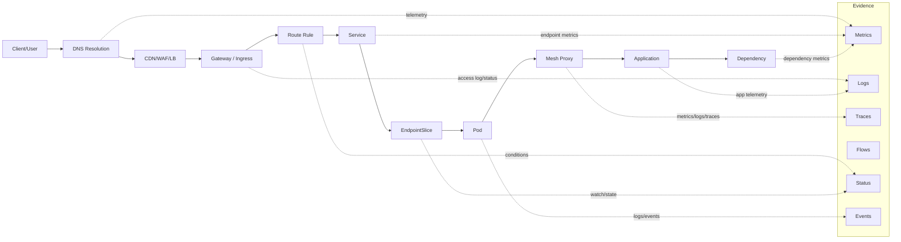
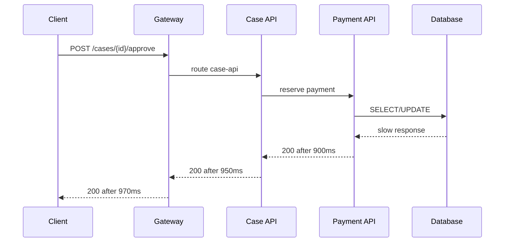
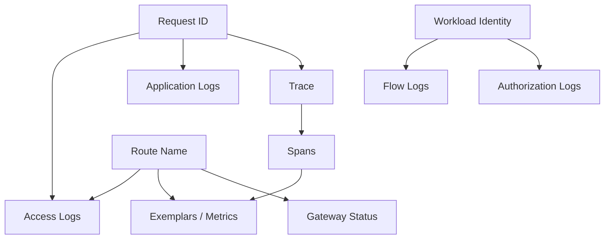

# Part 027 — Observability, Access Logs, Metrics, Traces, and Flow Visibility

## 1. Tujuan Part Ini

Part 026 membahas resilience policy: timeout, retry, circuit breaker, outlier detection, dan load shedding. Semua mekanisme itu berbahaya jika tidak terlihat. Part ini membahas bagaimana membuat traffic platform dapat diamati dari sisi Kubernetes object, Gateway API, service mesh, CNI, DNS, node, dan aplikasi.

Target part ini:

> Anda mampu membangun observability model yang dapat menjawab “request ini gagal di mana, oleh siapa, karena policy apa, dalam versi mana, dari identitas mana, pada node/zone/cluster mana, dan apakah failure tersebut transient, systemic, atau policy-driven?”

Setelah part ini, Anda harus bisa menjawab:

- Apa bedanya metrics, logs, traces, events, status conditions, dan network flows?
- Mengapa Kubernetes traffic debugging tidak cukup dengan application log?
- Bagaimana membaca `HTTPRoute` accepted/programmed status bersama Envoy/Istio metrics?
- Kapan access log lebih berguna daripada trace?
- Kapan flow log lebih berguna daripada L7 log?
- Bagaimana membedakan `503` karena no endpoint, mTLS failure, connection reset, outlier ejection, atau policy deny?
- Bagaimana membuat dashboard yang tidak hanya cantik, tetapi menyempitkan hypothesis space?
- Bagaimana menghindari cardinality explosion?
- Apa minimum observability contract untuk sistem regulated?

---

## 2. Kaufman Framing: Observability Sebagai Feedback Loop

Josh Kaufman menekankan skill acquisition melalui deliberate practice dan feedback cepat. Dalam traffic engineering, observability adalah feedback loop.

Tanpa observability:

```txt
Change route -> traffic gagal -> engineer menebak -> edit YAML acak -> incident membesar
```

Dengan observability:

```txt
Change route -> status condition berubah -> metric anomaly muncul -> access log menunjukkan upstream reset -> trace menunjukkan hop lambat -> flow log menunjukkan policy deny -> fix spesifik
```

Skill yang ingin dibangun bukan “bisa memasang Prometheus/Grafana”. Skill yang ingin dibangun adalah kemampuan membuat pertanyaan operasional menjadi dapat dijawab.

Kaufman deconstruction untuk observability:

| Layer | Pertanyaan |
|---|---|
| Intent | Object apa yang menyatakan routing/policy desired state? |
| Status | Apakah controller menerima dan memprogram intent itu? |
| Discovery | Backend mana yang eligible untuk menerima traffic? |
| Data plane | Apakah packet/request benar-benar bergerak sesuai intent? |
| Identity | Siapa caller dan callee yang sebenarnya? |
| Policy | Apakah allow/deny terjadi karena policy eksplisit? |
| Protocol | Error terjadi di DNS, TCP, TLS, HTTP, gRPC, atau app? |
| Timing | Latency muncul di hop mana? |
| Saturation | Resource apa yang sedang habis? |
| Change | Deployment/config/policy mana yang berubah sebelum symptom? |

Deliberate practice:

1. pecahkan DNS, amati telemetry yang berubah;
2. hapus endpoint, amati `503` dan status route;
3. aktifkan NetworkPolicy deny, amati flow log;
4. pecahkan mTLS trust, amati TLS/mesh metric;
5. tambahkan retry berlebihan, amati retry amplification;
6. injeksi latency, amati trace dan histogram;
7. overload Gateway, amati saturation dan queue.

---

## 3. Observability Bukan Monitoring

Monitoring menjawab:

```txt
Apakah ada sesuatu yang rusak?
```

Observability menjawab:

```txt
Mengapa sesuatu rusak, di mana rusaknya, siapa terdampak, dan apa evidence-nya?
```

Untuk Kubernetes networking, observability harus mencakup beberapa jenis evidence.

| Evidence | Contoh | Berguna Untuk |
|---|---|---|
| Metrics | request rate, p95 latency, 5xx, DNS latency | Trend, alert, SLO |
| Logs | access log, controller log, app log | Request-level forensic |
| Traces | span antar service | Latency decomposition |
| Events | Kubernetes events | Lifecycle anomaly |
| Status conditions | `Accepted`, `Programmed`, `ResolvedRefs` | Intent/controller state |
| Flow logs | L3/L4/L7 flow verdict | Policy/data-plane truth |
| Packet capture | `tcpdump`, eBPF trace | Last-mile packet proof |
| Config dump | Envoy config, controller state | Control-plane to data-plane translation |

Top engineer tidak memilih satu. Mereka menyusun evidence chain.

---

## 4. Traffic Observability Mental Model

Setiap request melewati beberapa planes.



Debugging yang baik berjalan dari symptom ke evidence.

```txt
Symptom -> protocol -> hop -> object -> data plane -> policy -> identity -> change -> fix
```

Contoh:

```txt
User sees 504
  -> HTTP timeout, not DNS
  -> Gateway access log shows upstream request timeout
  -> route exists and Programmed=True
  -> backend endpoint exists
  -> mesh metric shows retries exhausted
  -> trace shows dependency DB wait
  -> fix is not Gateway; fix is app/dependency timeout budget
```

---

## 5. The Observability Contract

Sebuah platform traffic produksi harus memiliki observability contract minimal.

| Contract | Minimum Evidence |
|---|---|
| Route admitted? | Gateway API status condition |
| Listener bound? | Gateway status + controller log |
| Backend resolved? | `ResolvedRefs` + EndpointSlice |
| Request received? | Gateway/proxy access log |
| Request routed? | route/backend label in metric/log |
| Upstream selected? | upstream cluster/backend in access log |
| Upstream failed? | response flag / reset reason / 5xx detail |
| Policy denied? | CNI/mesh flow verdict |
| Identity verified? | mTLS identity / SPIFFE ID / principal |
| Latency source? | histogram + trace breakdown |
| DNS issue? | CoreDNS metrics/logs + client `resolv.conf` |
| Node issue? | node network metrics + conntrack + packet capture |
| Change correlation? | deployment/config/policy timeline |

Jika satu baris tidak bisa dijawab, platform memiliki blind spot.

---

## 6. Status Conditions: Observability di API Layer

Kubernetes dan Gateway API memakai status sebagai feedback dari controller ke user. Status bukan dekorasi.

Untuk Gateway API, status condition seperti ini sangat penting:

| Condition | Pertanyaan |
|---|---|
| `Accepted` | Apakah object diterima oleh controller? |
| `Programmed` | Apakah desired state sudah diprogram ke data plane? |
| `ResolvedRefs` | Apakah reference ke Service/Secret/Backend valid? |
| `Conflicted` | Apakah ada conflict antar route/listener? |

Contoh inspection:

```bash
kubectl get gateway -A
kubectl describe gateway -n platform public-gateway
kubectl get httproute -A
kubectl describe httproute -n payments payments-api
```

Yang dicari:

```txt
Status:
  Parents:
    Conditions:
    - Type: Accepted
      Status: True
    - Type: ResolvedRefs
      Status: True
```

Interpretasi:

| Status | Arti Operasional |
|---|---|
| `Accepted=False` | Controller menolak intent. Jangan debug packet dulu. |
| `ResolvedRefs=False` | Backend/Secret/reference bermasalah. |
| `Programmed=False` | Intent belum sampai ke data plane. |
| No parent status | Route tidak attach ke Gateway. |
| Stale `observedGeneration` | Controller belum memproses generasi terbaru. |

Rule:

> Jangan mulai dengan `tcpdump` jika API status sudah mengatakan route tidak diterima.

---

## 7. Kubernetes Events: Low-Level Timeline, Not Source of Truth

Events berguna untuk timeline cepat.

```bash
kubectl get events -A --sort-by=.lastTimestamp
kubectl events -n payments --for httproute/payments-api
kubectl describe pod -n payments payments-api-7d9f...
```

Events dapat menunjukkan:

- failed scheduling;
- failed image pull;
- readiness probe failure;
- Service endpoint update;
- load balancer provisioning issue;
- certificate reference issue;
- Gateway/Route conflict;
- NetworkPolicy admission issue if controller emits it.

Tetapi events punya keterbatasan:

- tidak selalu lengkap;
- retention pendek;
- bukan audit log penuh;
- format tidak stabil untuk automation berat;
- tidak cukup untuk latency analysis.

Gunakan events sebagai index awal, bukan forensic store utama.

---

## 8. Metrics: Trend, Alert, SLO, and Saturation

Metrics harus menjawab empat kelas pertanyaan:

| Class | Pertanyaan |
|---|---|
| Traffic | Berapa request/connection/flow masuk? |
| Success | Berapa success/error/deny/reset? |
| Latency | Berapa waktu yang dihabiskan? |
| Saturation | Resource mana mendekati limit? |

Untuk traffic platform, jangan hanya kumpulkan app metrics. Kumpulkan per layer.

| Layer | Metrics |
|---|---|
| DNS | query rate, error, latency, cache hit/miss |
| Gateway | request rate, 4xx/5xx, upstream latency, downstream latency |
| Mesh | request count, retry, mTLS, policy deny, connection pool, outlier ejection |
| Service | endpoint count, no endpoint events, kube-proxy sync |
| CNI | dropped packet, policy verdict, flow count, conntrack pressure |
| Node | CPU, memory, network rx/tx, conntrack, socket, packet drops |
| App | business operation latency, domain error, dependency latency |
| Control plane | controller reconciliation latency, workqueue depth |

---

## 9. RED, USE, and Saturation Model

Untuk request path, RED model sering cocok.

| RED | Meaning |
|---|---|
| Rate | Request per second |
| Errors | Error rate/count |
| Duration | Request latency distribution |

Untuk resource, USE model lebih cocok.

| USE | Meaning |
|---|---|
| Utilization | Resource busy percentage |
| Saturation | Queue/backlog/waiting work |
| Errors | Failures at resource level |

Mapping ke Kubernetes networking:

| Component | RED | USE |
|---|---|---|
| Gateway | RPS, 5xx, latency | CPU, memory, active connections, pending requests |
| Envoy sidecar | upstream/downstream request metrics | connection pool saturation, circuit breaker open |
| CoreDNS | DNS QPS, SERVFAIL/NXDOMAIN, latency | CPU, cache pressure, upstream timeout |
| CNI | flow count, deny/drop count | conntrack table, map pressure, agent CPU |
| Node | packet rate, retransmits | NIC utilization, softirq, conntrack saturation |

Top skill: tahu model mana yang sesuai. Jangan pakai RPS chart untuk mendiagnosis conntrack exhaustion.

---

## 10. Histogram, Percentile, and Tail Latency

Traffic engineering harus menggunakan histogram, bukan hanya average.

Average menipu:

```txt
1000 requests:
- 990 requests = 20 ms
- 10 requests = 10 seconds
Average terlihat mungkin masih “lumayan”
User p99 mengalami disaster
```

Metrics penting:

- p50: baseline normal;
- p90: minor tail;
- p95/p99: user-visible tail;
- max: sering noisy, tapi berguna untuk forensic;
- bucket distribution: lebih jujur daripada percentile tunggal.

Per layer latency:

| Metric | Meaning |
|---|---|
| downstream duration | client to gateway total perception |
| upstream duration | gateway/proxy to backend time |
| app handler duration | app processing time |
| dependency duration | downstream dependency time |
| DNS duration | name resolution time |
| TCP connect duration | network/connectivity delay |
| TLS handshake duration | crypto/trust delay |

Jika hanya punya total latency, Anda tidak bisa tahu apakah lambat di Gateway, mesh, app, atau DB.

---

## 11. Cardinality: Observability Bisa Menjadi Outage

Label berlebihan dapat membuat metrics backend collapse.

High-cardinality labels:

- full URL path dengan ID;
- user ID;
- session ID;
- request ID;
- IP address;
- unbounded error message;
- raw header;
- pod UID jika retention panjang dan churn tinggi;
- dynamic route name generated per deployment.

Better labels:

| Bad | Better |
|---|---|
| `/cases/123456/evidence/998` | `/cases/{caseId}/evidence/{evidenceId}` |
| raw user ID | tenant tier / internal/external / role class |
| raw source IP | source namespace/workload/zone |
| exception message | error class/code |
| pod UID | workload, version, namespace |

Golden rule:

> Metrics labels harus bounded. Logs/traces boleh memuat detail request-level yang lebih granular.

---

## 12. Access Logs: Request-Level Truth at Boundary

Access log menjawab:

```txt
Request apa masuk, dari siapa, ke route mana, ke backend mana, hasilnya apa, dan berapa lama?
```

Minimum access log fields:

| Field | Why |
|---|---|
| timestamp | timeline |
| request ID | correlation |
| method | semantics |
| authority/host | route selection |
| normalized path | route debugging |
| response code | result |
| response flags | proxy-level failure reason |
| duration | total request time |
| upstream service/cluster | backend selection |
| upstream host | endpoint forensic |
| source identity | caller attribution |
| route name | config correlation |
| namespace | ownership |
| user agent | client class |
| trace ID | trace correlation |

Example structured access log:

```json
{
  "ts": "2026-07-01T10:15:30.128Z",
  "request_id": "01J...",
  "trace_id": "7f3...",
  "method": "POST",
  "host": "api.example.com",
  "path_template": "/cases/{caseId}/actions",
  "route": "payments-write-route",
  "gateway": "public-gateway",
  "source_namespace": "web",
  "source_workload": "case-portal",
  "source_principal": "spiffe://prod/ns/web/sa/case-portal",
  "upstream_service": "payments-api.payments.svc.cluster.local",
  "upstream_pod": "payments-api-7649d7",
  "status": 503,
  "response_flags": "UH",
  "duration_ms": 82,
  "upstream_duration_ms": 0,
  "retry_attempts": 0,
  "mtls": true
}
```

This log is useful because it links request, route, identity, backend, and failure type.

---

## 13. Envoy/Istio Response Flags: 503 Is Not One Error

In proxy-based systems, `503` is a family of failures.

Common Envoy-style response flag semantics to understand:

| Flag | Typical Meaning |
|---|---|
| `UH` | No healthy upstream |
| `UF` | Upstream connection failure |
| `UO` | Upstream overflow / circuit breaker |
| `UT` | Upstream request timeout |
| `URX` | Retry attempts exhausted |
| `NR` | No route configured |
| `DC` | Downstream connection termination |
| `LH` | Local service failed health check |
| `RL` | Rate limited |

Practical interpretation:

| Symptom | Likely Layer |
|---|---|
| `NR` | Route/config mismatch |
| `UH` | Endpoint/outlier/health issue |
| `UF` | TCP/TLS/backend connection issue |
| `UT` | Timeout budget/upstream slow |
| `URX` | Retry policy exhausted |
| `UO` | Circuit breaker/pool saturation |
| `RL` | Rate limit policy |

Do not say “Gateway returned 503” as root cause. That is symptom.

---

## 14. Distributed Tracing: Latency Decomposition

Tracing answers:

```txt
Where did time go across services?
```

A trace is a tree/graph of spans.



What trace shows:

- service hop sequence;
- parent/child relationship;
- latency per span;
- error annotations;
- retry attempts if instrumented;
- sampling context;
- correlation with logs.

What trace does not always show:

- packet drops before app/proxy;
- NetworkPolicy deny if request never creates app span;
- DNS failure before request span starts;
- TLS handshake failure unless instrumented at proxy;
- kernel-level conntrack issue.

Rule:

> Tracing is excellent for successful or partially successful request paths. Flow logs and packet captures are better for traffic that never reaches the app/proxy span.

---

## 15. Trace Context Propagation

Without propagation, distributed trace breaks.

Common headers:

- `traceparent` / `tracestate` from W3C Trace Context;
- `b3` / `x-b3-*` in older systems;
- `x-request-id`;
- vendor-specific headers.

Proxy can help, but application must not drop context during outbound calls.

Bad pattern:

```java
// New HTTP client request but no trace headers copied
httpClient.post(url, body);
```

Better pattern:

```txt
Inbound trace context -> application context -> outbound client instrumentation -> downstream span
```

For regulatory systems, trace context is not the same as audit identity. Do not use trace ID as authorization identity. Use it as correlation key.

---

## 16. Sampling Strategy

Tracing every request may be expensive. Sampling must be intentional.

| Strategy | Use Case | Risk |
|---|---|---|
| Head-based sampling | Simple high-volume systems | May miss rare errors |
| Tail-based sampling | Keep traces after seeing result | More infrastructure complexity |
| Error-biased sampling | Preserve failures | May underrepresent latency-only issues |
| Route-based sampling | Critical APIs get more traces | Needs route taxonomy |
| Tenant/tier sampling | Regulated/critical tenants get more visibility | Privacy/governance needed |

Recommended platform rule:

- sample normal high-volume routes conservatively;
- keep all 5xx traces if feasible;
- keep high-latency traces above threshold;
- keep low-volume critical workflow traces;
- document retention and privacy policy.

---

## 17. Flow Visibility: Data Plane Truth

Flow logs answer:

```txt
Did traffic actually move between identity A and identity B? Was it forwarded, dropped, denied, redirected, or reset?
```

Flow visibility is strongest when:

- traffic does not reach application;
- NetworkPolicy is suspected;
- DNS is blocked;
- CNI dataplane drops packets;
- L3/L4 identity matters;
- source/destination IP identity is confusing;
- cross-node/cross-zone routing is suspected.

Flow fields worth collecting:

| Field | Why |
|---|---|
| timestamp | timeline |
| source identity | caller |
| destination identity | callee |
| source pod/namespace/node | placement |
| destination pod/namespace/node | placement |
| source IP/port | packet forensic |
| destination IP/port | packet forensic |
| protocol | TCP/UDP/ICMP/HTTP/gRPC/DNS |
| verdict | forwarded/dropped/denied |
| drop reason | policy, CT, unknown, invalid |
| DNS query | name-resolution forensic |
| HTTP method/path/status if available | L7 correlation |

Example Hubble-style investigation:

```bash
hubble observe --namespace payments
hubble observe --from-pod web/case-portal --to-namespace payments
hubble observe --verdict DROPPED
hubble observe --protocol dns
hubble observe --http-status 503
```

Flow logs are the bridge between Kubernetes object intent and packet reality.

---

## 18. DNS Observability

DNS failures often look like application latency or random connection failures.

Minimum DNS signals:

| Signal | Why |
|---|---|
| CoreDNS QPS | volume |
| SERVFAIL rate | upstream/plugin failure |
| NXDOMAIN rate | bad name/client config |
| latency histogram | DNS bottleneck |
| cache hit ratio | cache effectiveness |
| upstream timeout | external resolver issue |
| per-node DNS latency | node-local problem |
| client `ndots` behavior | query amplification |

Debug commands:

```bash
kubectl -n kube-system logs deploy/coredns
kubectl -n kube-system top pod -l k8s-app=kube-dns
kubectl exec -n payments deploy/payments-api -- cat /etc/resolv.conf
kubectl exec -n payments deploy/payments-api -- nslookup postgres.db.svc.cluster.local
kubectl exec -n payments deploy/payments-api -- dig +search postgres
```

DNS failure patterns:

| Pattern | Evidence |
|---|---|
| CoreDNS overloaded | high CPU, latency, timeout |
| `ndots` amplification | many search-domain queries before final answer |
| wrong namespace | NXDOMAIN for unqualified name |
| egress DNS blocked | flow logs show deny to UDP/TCP 53 |
| stale client cache | app resolves old IP after endpoint change |
| NodeLocal DNS issue | only pods on specific node affected |

---

## 19. Gateway API Observability

Gateway API gives observability at desired-state level.

Important object views:

```bash
kubectl get gatewayclass
kubectl get gateway -A
kubectl get httproute -A
kubectl get grpcroutes -A
kubectl get referencegrant -A
kubectl describe gateway -n platform public-gateway
kubectl describe httproute -n payments payments-api
```

Questions:

| Question | Evidence |
|---|---|
| Which controller owns this GatewayClass? | `GatewayClass.spec.controllerName` |
| Did Gateway bind listener? | Gateway listener status |
| Did Route attach? | Route parent status |
| Did BackendRef resolve? | `ResolvedRefs` |
| Is hostname matching expected? | listener + route hostname |
| Is route conflict present? | status condition/message |
| Is cross-namespace reference allowed? | `ReferenceGrant` |

Gateway API observability should be joined with controller-specific telemetry.

| Gateway API Object | Controller Evidence |
|---|---|
| Gateway | load balancer / Envoy listener / dataplane resource |
| Listener | port binding / TLS secret loaded |
| HTTPRoute | route config programmed |
| BackendRef | upstream cluster/endpoints |
| Policy | filter/extension config |

---

## 20. Envoy Config Dump: When Status Says Programmed but Traffic Fails

Sometimes API status says `Programmed=True`, but dataplane behavior is wrong. Then inspect proxy config.

Typical Envoy inspection areas:

| Config | Meaning |
|---|---|
| listeners | ports/protocols accepted |
| routes | host/path/header matching |
| clusters | upstream services/pools |
| endpoints | actual backend instances |
| secrets | TLS cert/trust material |
| filters | auth/rate-limit/headers/retry behavior |

Istio examples:

```bash
istioctl proxy-status
istioctl proxy-config listener <pod> -n <ns>
istioctl proxy-config route <pod> -n <ns>
istioctl proxy-config cluster <pod> -n <ns>
istioctl proxy-config endpoint <pod> -n <ns>
istioctl proxy-config secret <pod> -n <ns>
```

Decision rule:

```txt
API status wrong -> debug Kubernetes/controller state
API status right but proxy behavior wrong -> debug translated dataplane config
Proxy config right but packet fails -> debug CNI/node/kernel/policy
```

---

## 21. Mesh Metrics

Mesh metrics should answer:

- who called whom;
- whether mTLS was used;
- which response code/class occurred;
- request duration;
- retries;
- circuit breaker overflow;
- outlier ejection;
- connection pool state;
- authorization allow/deny;
- policy enforcement.

Useful dimensions:

| Dimension | Why |
|---|---|
| source workload | caller ownership |
| source namespace | tenant/team boundary |
| destination workload | callee ownership |
| destination namespace | target boundary |
| destination service | logical dependency |
| response code/class | failure semantics |
| request protocol | HTTP/gRPC/TCP |
| security policy | mTLS/authz state |
| route/canonical service | rollout correlation |
| revision/version | canary correlation |

Avoid using raw URL path as metric label unless normalized.

---

## 22. Access Log vs Metrics vs Trace vs Flow

Use the right evidence.

| Question | Best First Evidence |
|---|---|
| Is error rate above SLO? | Metrics |
| Which request failed? | Access logs |
| Where did latency occur? | Trace |
| Did packet get denied? | Flow logs |
| Did route attach? | Status conditions |
| Was TLS secret loaded? | Proxy config / Gateway status |
| Did DNS fail? | DNS metrics/logs + flow logs |
| Did NetworkPolicy block traffic? | Flow verdict + policy object |
| Did controller process object? | Controller logs + status observedGeneration |
| Is node dropping packets? | Node metrics + packet capture |

The best debugging workflow usually combines them.

---

## 23. Request Correlation Model

A production platform should enforce correlation across layers.



Minimum correlation fields:

- request ID;
- trace ID;
- route name;
- service name;
- workload name;
- namespace;
- version/revision;
- source identity;
- destination identity;
- node/zone/cluster;
- response code;
- response flag;
- policy verdict.

For regulated systems, add:

- actor classification;
- tenant/organization classification;
- case/workflow classification if safe;
- policy version;
- decision reason;
- audit event ID.

Do not log sensitive evidence or personal data casually. Use classification and redaction.

---

## 24. Observability for Traffic Shaping

For canary/blue-green/mirroring, observability must be version-aware.

Required labels:

| Label | Why |
|---|---|
| route | which traffic rule |
| backendRef | which backend path |
| version/revision | canary vs stable |
| weight | expected traffic split |
| source segment | header/user/tenant targeting |
| mirror flag | shadow traffic visibility |
| rollout ID | controller correlation |

Canary dashboard:

| Panel | Purpose |
|---|---|
| stable vs canary RPS | verify split |
| stable vs canary 5xx | detect regression |
| stable vs canary p95/p99 | detect latency regression |
| canary dependency errors | catch downstream mismatch |
| retry rate by version | detect hidden failure |
| business metric by version | detect semantic failure |
| rollback events | lifecycle trace |

Anti-pattern:

```txt
Canary observed only at aggregate service level.
```

That hides version-specific failure.

---

## 25. Observability for Resilience Policies

Every resilience mechanism must produce evidence.

| Mechanism | Evidence |
|---|---|
| Timeout | timeout count, timeout layer, duration before timeout |
| Retry | retry attempts, retry reason, retry success/failure |
| Retry budget | budget consumed, budget exhausted |
| Circuit breaker | open/close/half-open state, overflow count |
| Outlier detection | ejection count, ejection reason, ejected host |
| Load shedding | rejection count, priority class, reason |
| Rate limiting | limit key, decision, remaining quota if safe |
| Backpressure | queue depth, rejected work, `Retry-After` |
| Brownout | degraded feature count, saved capacity |

If a policy can change user-visible behavior, it must be observable.

---

## 26. Observability for mTLS and Identity

mTLS failures are often invisible to app logs because the request never reaches the app.

Signals:

| Signal | Why |
|---|---|
| mTLS mode | STRICT/PERMISSIVE/DISABLE equivalent |
| source principal | caller identity |
| destination principal | callee identity |
| certificate expiry | rotation risk |
| trust domain | federation issue |
| handshake failure | TLS auth failure |
| authorization deny | policy vs authentication |

Debug questions:

- Did caller present a valid workload identity?
- Did callee trust caller trust domain?
- Did authorization policy deny an authenticated identity?
- Is failure TLS handshake, authn, authz, or app-level 403?
- Is identity based on service account, namespace, or SPIFFE ID?

Do not conflate:

| Symptom | Could Mean |
|---|---|
| 401 | app authn, JWT authn, mesh authn |
| 403 | app authz, mesh AuthorizationPolicy, external authz |
| 503 | TLS handshake failure, no healthy upstream, policy-generated local reply |
| reset | mTLS mismatch, protocol mismatch, connection pool issue |

---

## 27. Observability for NetworkPolicy

NetworkPolicy is invisible if you only inspect app logs.

Evidence to collect:

- policy objects;
- selected pods;
- selected namespaces;
- denied flow logs;
- allowed flow logs for expected baseline;
- DNS flow visibility;
- CNI agent logs;
- policy verdict reason if available;
- packet capture for ambiguous cases.

Debug sequence:

```bash
kubectl get netpol -A
kubectl describe netpol -n payments allow-case-api-to-payments
kubectl get pod -n payments --show-labels
kubectl get ns --show-labels
hubble observe --verdict DROPPED --to-namespace payments
```

Questions:

| Question | Why |
|---|---|
| Does policy select destination pod? | If not, it does nothing. |
| Is pod isolated for ingress/egress? | Policy behavior changes after isolation. |
| Are namespace labels correct? | NamespaceSelector errors are common. |
| Is DNS allowed? | Egress deny often blocks DNS first. |
| Does CNI enforce policy? | Kubernetes API alone does not enforce. |
| Is traffic actually to Pod IP or Service IP? | Policy evaluation is CNI-specific in implementation details. |

---

## 28. Node and Kernel-Level Observability

When all higher-level objects look correct, debug node.

Important node signals:

| Signal | Why |
|---|---|
| conntrack usage | NAT/Service path failure |
| TCP retransmits | network loss/congestion |
| socket states | connection leak |
| packet drops | kernel/NIC/CNI issue |
| softirq CPU | packet processing pressure |
| network interface errors | physical/virtual NIC issue |
| MTU mismatch | fragmentation/path issue |
| iptables/nft/eBPF map state | dataplane programming |

Commands:

```bash
ss -s
ss -tanp
ip addr
ip route
ip neigh
conntrack -S
conntrack -L | head
iptables-save | less
nft list ruleset
ethtool -S eth0
```

Packet capture:

```bash
tcpdump -i any host <pod-ip>
tcpdump -i any port 53
tcpdump -i any tcp and port 443
```

Use packet capture carefully in production. It may expose sensitive data unless encrypted and filtered.

---

## 29. Control Plane Observability

Traffic behavior depends on controllers.

Examples:

| Controller | Why It Matters |
|---|---|
| Gateway controller | translates Gateway/Route to dataplane |
| Ingress controller | manages edge proxy/LB |
| Service controller | provisions cloud load balancer |
| EndpointSlice controller | maintains backend endpoint records |
| CNI agent/operator | programs network and policy |
| cert-manager | issues/renews certificates |
| mesh control plane | pushes xDS/identity/policy |
| external-dns | manages DNS records |

Controller metrics:

- reconciliation latency;
- reconciliation errors;
- workqueue depth;
- API server watch errors;
- config push latency;
- number of generated resources;
- stale generation count.

Common failure:

```txt
YAML is correct, but controller is stuck or overloaded.
```

Evidence:

```bash
kubectl logs -n <controller-ns> deploy/<controller>
kubectl get events -n <controller-ns>
kubectl get lease -n <controller-ns>
kubectl top pod -n <controller-ns>
```

---

## 30. Debugging Playbook: 404

Symptom:

```txt
Client receives 404.
```

Possible causes:

| Cause | Evidence |
|---|---|
| CDN/WAF route missing | edge logs |
| Gateway listener hostname mismatch | Gateway/Route status |
| HTTPRoute path mismatch | access log route field / no route flag |
| Application returned 404 | upstream status and app log |
| Wrong namespace/service | BackendRef/EndpointSlice |

Debug:

```bash
kubectl describe httproute -n <ns> <route>
kubectl describe gateway -n <ns> <gateway>
# Check host/path/method/header match
# Check access log: route name present or no route?
```

Interpretation:

- no route selected: routing config issue;
- route selected and upstream status 404: application issue;
- CDN returned 404 before Gateway: external edge issue.

---

## 31. Debugging Playbook: 503

Symptom:

```txt
Client receives 503.
```

Possible causes:

| Cause | Evidence |
|---|---|
| no healthy upstream | response flag `UH`, zero ready endpoints |
| connection failure | response flag `UF`, TCP reset/connect error |
| circuit breaker overflow | response flag `UO` |
| route missing | response flag `NR` |
| mTLS mismatch | TLS handshake metric/log |
| policy local reply | authz/flow verdict |
| backend pod terminating | EndpointSlice terminating state |

Debug:

```bash
kubectl get endpointslice -n <ns> -l kubernetes.io/service-name=<svc>
kubectl get pod -n <ns> -l app=<app>
kubectl describe httproute -n <ns> <route>
# Inspect access log response flag
# Inspect mesh/proxy cluster health
```

Decision tree:

```txt
503 + no endpoint -> readiness/selector/rollout issue
503 + UH -> health/outlier/endpoint issue
503 + UF -> TCP/TLS/backend connect issue
503 + UO -> circuit breaker/saturation issue
503 + NR -> route config issue
503 + authz deny -> policy issue
```

---

## 32. Debugging Playbook: 504 / Timeout

Symptom:

```txt
Client receives 504 or timeout.
```

Possible causes:

| Cause | Evidence |
|---|---|
| Gateway timeout shorter than app | access log upstream timeout |
| app waiting on dependency | trace span |
| DNS delay | DNS latency metrics |
| TCP connect slow | proxy connect timeout metrics |
| retry exhaustion | retry attempt metrics |
| queue buildup | app/thread/connection pool saturation |
| cross-zone/cross-region latency | zone/cluster labels |

Debug:

1. Look at access log total duration and upstream duration.
2. Look at response flag for upstream timeout.
3. Look at trace span tree.
4. Check dependency metrics.
5. Check retry count.
6. Check queue/pool saturation.
7. Check route/gateway timeout config.

Rule:

> Timeout error location is not always root cause. It only tells you who stopped waiting.

---

## 33. Debugging Playbook: DNS Timeout

Symptom:

```txt
Application intermittently cannot resolve service names.
```

Evidence sequence:

```bash
kubectl exec -n <ns> deploy/<app> -- cat /etc/resolv.conf
kubectl exec -n <ns> deploy/<app> -- dig <svc>.<ns>.svc.cluster.local
kubectl -n kube-system logs deploy/coredns --tail=100
kubectl -n kube-system top pod -l k8s-app=kube-dns
hubble observe --protocol dns --from-namespace <ns>
```

Common root causes:

- CoreDNS overloaded;
- NodeLocal DNSCache issue;
- `ndots` query amplification;
- NetworkPolicy blocking DNS;
- upstream resolver slow;
- client DNS cache stale;
- pod-specific resolver config mutation.

Fix is contextual. Do not blindly scale CoreDNS if the root cause is `ndots` or egress policy.

---

## 34. Debugging Playbook: Policy Deny

Symptom:

```txt
Service A cannot call Service B after NetworkPolicy rollout.
```

Evidence:

```bash
kubectl get netpol -n <target-ns>
kubectl get pod -n <source-ns> --show-labels
kubectl get pod -n <target-ns> --show-labels
kubectl get ns --show-labels
hubble observe --from-namespace <source-ns> --to-namespace <target-ns> --verdict DROPPED
```

Questions:

- Was destination pod selected by an ingress policy?
- Was source namespace label correct?
- Was source pod label correct?
- Was port/protocol correct?
- Was DNS egress allowed?
- Did traffic go through sidecar/waypoint/egress gateway changing source identity?
- Does CNI support the policy feature used?

---

## 35. Debugging Playbook: mTLS Failure

Symptom:

```txt
Service calls fail only when mesh strict mTLS is enabled.
```

Evidence:

```bash
istioctl proxy-status
istioctl authn tls-check <pod>.<ns>
istioctl proxy-config secret <pod> -n <ns>
istioctl proxy-config cluster <pod> -n <ns>
```

Questions:

| Question | Meaning |
|---|---|
| Is workload in mesh? | sidecar/ambient enrollment |
| Is PeerAuthentication strict? | plaintext disallowed |
| Does client originate mTLS? | client proxy behavior |
| Are certificates valid? | expiry/trust |
| Are trust domains aligned? | federation/trust issue |
| Is AuthorizationPolicy denying after authn? | not TLS, but authz |

Failure classes:

- plaintext client to strict mTLS server;
- expired workload certificate;
- wrong trust domain;
- external workload not modeled;
- policy denies authenticated identity.

---

## 36. Observability Dashboard Architecture

Do not build one giant dashboard. Build question-oriented dashboards.

Recommended dashboards:

| Dashboard | Primary User | Questions |
|---|---|---|
| Edge/Gateway Overview | Platform/SRE | Is external traffic healthy? |
| Route Health | App/Platform | Which route/backend is failing? |
| Service Dependency | App Team | Who calls whom and how healthy? |
| Mesh Security | Security/Platform | Is mTLS/authz working? |
| DNS Health | Platform | Is service discovery healthy? |
| NetworkPolicy Impact | Security/Platform | What is being denied? |
| Node Network | Infra/SRE | Is dataplane saturated? |
| Multi-Zone Traffic | Platform/FinOps | Is traffic local/cost-efficient? |
| Rollout/Canary | App/SRE | Is new version safe? |

Each dashboard should include:

- current state;
- recent change marker;
- error/latency breakdown;
- ownership labels;
- drill-down links;
- runbook link.

---

## 37. Alert Design

Bad alert:

```txt
Gateway 5xx > 0
```

Better alert:

```txt
For route=payments-write, 5xx ratio > 2% for 5m and request rate > minimum traffic threshold, burn rate exceeds SLO budget.
```

Alert principles:

- alert on user impact or imminent saturation;
- include route/service/namespace/owner;
- include first diagnostic links;
- avoid alerting on every low-volume blip;
- distinguish page vs ticket;
- use SLO burn rate for critical APIs;
- alert on missing telemetry for critical paths.

Important traffic alerts:

| Alert | Why |
|---|---|
| elevated 5xx by route | user impact |
| p99 latency by route | tail degradation |
| no healthy upstream | hard outage |
| route not programmed | config outage |
| CoreDNS high latency/error | platform-wide risk |
| conntrack near limit | node-level outage risk |
| policy deny spike | security/config regression |
| mTLS cert expiry | upcoming outage |
| retry amplification | cascading failure risk |
| circuit breaker overflow | saturation |

---

## 38. Change Correlation

Most incidents follow change.

Correlate telemetry with:

- Deployment rollout;
- Gateway/Route change;
- NetworkPolicy change;
- mesh policy change;
- certificate rotation;
- CNI upgrade;
- node replacement;
- DNS change;
- cloud LB change;
- autoscaler event;
- config map/secret change.

Implementation pattern:

```txt
Every deploy/config change emits event annotation -> metrics/log timeline overlays -> incident review references change ID
```

Useful metadata:

- Git SHA;
- image tag/digest;
- rollout ID;
- Helm release/version;
- ArgoCD app revision;
- policy version;
- route generation;
- `observedGeneration`;
- controller version.

---

## 39. Privacy, Security, and Compliance

Traffic observability can expose sensitive data.

Risks:

- URL path contains personal/case IDs;
- query string contains token or PII;
- headers contain authorization data;
- packet capture contains payload;
- trace attributes contain raw business objects;
- logs over-retained beyond policy;
- cross-team dashboards expose tenant names;
- source identity reveals sensitive internal topology.

Controls:

| Control | Purpose |
|---|---|
| path templating | reduce PII/cardinality |
| query redaction | avoid secret leakage |
| header allowlist | prevent token logging |
| field-level classification | governance |
| access-controlled dashboards | least privilege |
| retention policy | regulatory minimization |
| sampling policy | cost/privacy control |
| audit trail | who accessed forensic data |

For regulatory systems, observability must be defensible. You need enough detail to prove behavior, but not so much that telemetry becomes a privacy liability.

---

## 40. Incident Evidence Bundle

For serious incidents, collect a consistent evidence bundle.

Template:

```txt
Incident: <name>
Time window: <start/end>
User impact: <routes/tenants/workflows>
First symptom: <metric/log/user report>
Recent changes: <deploy/config/policy/cert/network>
Gateway status: <Accepted/Programmed/ResolvedRefs>
Route status: <parent/status conditions>
Endpoint status: <ready/serving/terminating>
Access log sample: <request_id/trace_id/status/flag>
Metrics: <RPS/error/latency/retry/saturation>
Trace: <trace IDs>
Flow logs: <allow/deny/drop evidence>
DNS evidence: <latency/error>
Node evidence: <conntrack/drop/CPU>
Policy evidence: <NetworkPolicy/AuthzPolicy/RateLimit>
Root cause: <specific mechanism>
Contributing factors: <gaps>
Fix: <change>
Prevention: <guardrail/test/alert>
```

---

## 41. Observability Maturity Model

| Level | Behavior |
|---|---|
| 0 | Only application logs, no route/backend visibility |
| 1 | Basic cluster metrics and pod logs |
| 2 | Gateway/Ingress metrics and access logs |
| 3 | Mesh metrics, traces, and service dependency graph |
| 4 | Flow logs, policy verdicts, DNS/node visibility |
| 5 | Correlated route-service-identity-policy-change model |
| 6 | SLO/burn-rate, automated evidence bundle, game-day verified |

Top 1% target: Level 5+ for critical paths.

---

## 42. Anti-Patterns

| Anti-pattern | Why Bad | Better |
|---|---|---|
| Only app logs | misses network/proxy/policy failures | collect boundary logs and flows |
| Aggregate service metrics only | hides canary/route failure | label by route/version/backend |
| Full URL as metric label | cardinality explosion | normalized route template |
| No access logs at Gateway | cannot prove request path | structured boundary logs |
| Trace without logs | weak forensic detail | correlate trace ID with logs |
| Logs without request ID | cannot join evidence | enforce request ID propagation |
| No DNS telemetry | DNS failures misdiagnosed as app issue | CoreDNS + flow visibility |
| No policy verdicts | NetworkPolicy debugging by guess | CNI flow logs |
| Alert on every 5xx | noisy | SLO/burn-rate and threshold-aware alerts |
| Packet capture first | expensive and risky | start from status/metrics/logs |
| No privacy controls | telemetry becomes liability | redaction/classification/retention |

---

## 43. Practice Lab

Build a small environment:

- `frontend` calls `case-api`;
- `case-api` calls `payments-api`;
- `payments-api` calls `ledger-api`;
- traffic enters through Gateway API;
- mesh optional but recommended;
- CNI with flow visibility if available.

Exercises:

1. Create a normal dashboard for route health.
2. Add structured access logs with route/backend/request ID.
3. Add OpenTelemetry trace propagation.
4. Break `HTTPRoute` hostname and observe status/access logs.
5. Scale backend to zero and observe `503` evidence.
6. Add NetworkPolicy deny and observe flow verdict.
7. Block DNS egress and observe DNS failure.
8. Add latency to dependency and inspect trace.
9. Add retry and observe retry metrics.
10. Roll out canary and compare stable/canary metrics.

Success criteria:

- You can identify failure layer in under 5 minutes.
- You can provide evidence, not guess.
- You can explain whether fix belongs to app, Gateway, mesh, CNI, DNS, or platform.

---

## 44. Architecture Review Checklist

| Question | Answer |
|---|---|
| Do all critical routes have route/backend/version metrics? |  |
| Do Gateways and Routes expose status conditions in dashboards? |  |
| Are access logs structured and queryable? |  |
| Is request ID propagated across Gateway, mesh, and app? |  |
| Is trace context propagated by all services? |  |
| Are high-cardinality labels controlled? |  |
| Are DNS metrics and logs available? |  |
| Are NetworkPolicy denies observable? |  |
| Are mTLS/authz decisions observable? |  |
| Are conntrack/node packet drops monitored? |  |
| Are canary metrics version-aware? |  |
| Are resilience policies observable? |  |
| Are dashboards question-oriented? |  |
| Are alerts tied to SLO/user impact? |  |
| Is telemetry access controlled and redacted? |  |
| Are runbooks linked from alerts? |  |

---

## 45. Mental Model Summary

Observability is not a tool stack. It is an evidence architecture.

For Kubernetes networking, you need:

- status conditions to know if intent was accepted;
- events to see lifecycle timeline;
- metrics to detect trend and SLO impact;
- access logs to identify request-level boundary behavior;
- traces to decompose latency across services;
- flow logs to prove data-plane and policy behavior;
- node/kernel signals to catch dataplane saturation;
- change metadata to correlate cause;
- privacy controls to keep telemetry safe.

Top 1% engineers do not ask “what graph should I build?” first. They ask:

> What question must be answerable during the worst 10 minutes of an incident?

Then they design telemetry backward from that question.

---

## 46. Source Notes

This part is aligned with:

- Kubernetes observability documentation: `https://kubernetes.io/docs/concepts/cluster-administration/observability/`
- Gateway API documentation and status conditions: `https://gateway-api.sigs.k8s.io/`
- Istio observability concepts: `https://istio.io/latest/docs/concepts/observability/`
- Istio observability tasks for metrics, logs, and distributed tracing: `https://istio.io/latest/docs/tasks/observability/`
- Istio Envoy access log task: `https://istio.io/latest/docs/tasks/observability/logs/access-log/`
- OpenTelemetry observability concepts: `https://opentelemetry.io/docs/concepts/observability-primer/`
- Cilium Hubble network observability documentation: `https://docs.cilium.io/en/stable/observability/hubble/`
- Envoy access logging and response flags documentation: `https://www.envoyproxy.io/docs/envoy/latest/`

Lanjut ke Part 028: NetworkPolicy, CNI policy, and microsegmentation.
