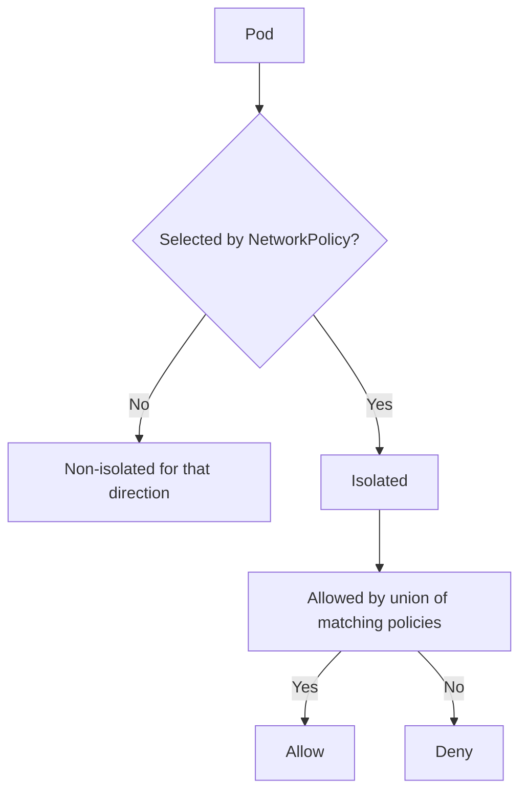
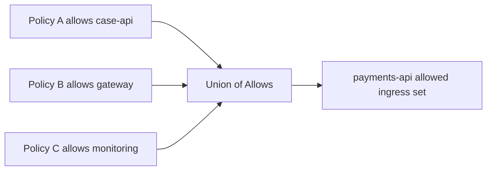
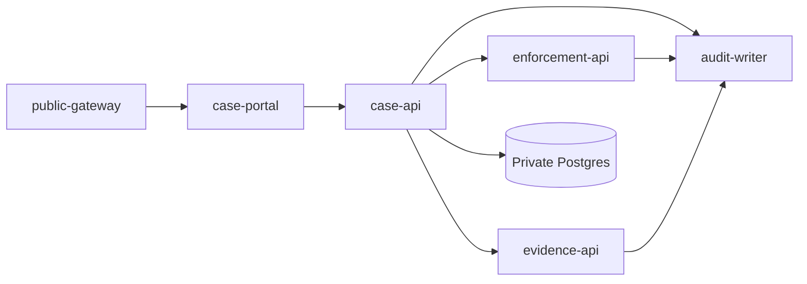
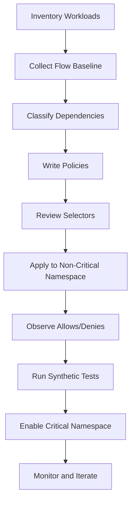

# Part 028 — NetworkPolicy, CNI Policy, and Microsegmentation

## 1. Tujuan Part Ini

Part 027 membahas bagaimana melihat traffic. Part ini membahas bagaimana mengendalikan traffic di level Kubernetes network policy dan CNI policy.

Target part ini:

> Anda mampu mendesain microsegmentation Kubernetes yang aman, dapat dioperasikan, tidak memutus dependency penting seperti DNS/health check/mesh, dan dapat dibuktikan melalui observability.

Setelah part ini, Anda harus bisa menjawab:

- Apa sebenarnya yang dilakukan Kubernetes `NetworkPolicy`?
- Mengapa `NetworkPolicy` adalah allow-list model, bukan urutan firewall rules tradisional?
- Apa arti pod menjadi isolated untuk ingress atau egress?
- Mengapa policy bersifat additive?
- Bagaimana `podSelector`, `namespaceSelector`, dan `ipBlock` berinteraksi?
- Mengapa default-deny sering memutus DNS duluan?
- Apa batas Kubernetes NetworkPolicy standar?
- Kapan butuh Calico/Cilium policy extension?
- Bagaimana menulis policy yang aman untuk service mesh?
- Bagaimana melakukan rollout microsegmentation tanpa outage?
- Bagaimana membuktikan policy bekerja di sistem regulated?

---

## 2. Kaufman Framing: Security Skill = Decompose Access Paths

Kesalahan umum:

```txt
Kita butuh zero trust. Tambahkan NetworkPolicy default-deny.
```

Lalu incident:

- DNS mati;
- readiness probe gagal;
- Gateway tidak bisa reach backend;
- mesh proxy tidak bisa reach control plane;
- cert rotation gagal;
- app tidak bisa call dependency;
- external egress penting terblokir;
- observability pipeline mati.

Dengan pendekatan Kaufman, pecah skill menjadi primitive:

| Primitive | Pertanyaan |
|---|---|
| Asset | Pod/workload mana yang dilindungi? |
| Caller | Siapa yang boleh memanggil? |
| Callee | Tujuan mana yang boleh diakses? |
| Direction | Ingress, egress, atau dua-duanya? |
| Protocol | TCP/UDP/SCTP/ICMP? |
| Port | Port target apa yang benar? |
| Identity | Berdasarkan label, namespace, service account, SPIFFE, atau IP? |
| Bootstrap | Apa dependency dasar yang harus tetap jalan? |
| Observability | Bagaimana membuktikan allow/deny? |
| Rollout | Bagaimana mengaktifkan tanpa outage? |

Deliberate practice:

1. buat namespace tanpa policy;
2. tambahkan default-deny ingress;
3. tambahkan allow caller spesifik;
4. tambahkan default-deny egress;
5. izinkan DNS eksplisit;
6. izinkan dependency internal;
7. izinkan control-plane/mesh dependency;
8. amati flow logs;
9. pecahkan policy sengaja dan debug;
10. lakukan review policy seperti code review.

---

## 3. Kubernetes NetworkPolicy Mental Model

`NetworkPolicy` adalah Kubernetes API untuk menyatakan traffic flow yang diizinkan untuk Pod yang dipilih.

Model paling penting:

```txt
NetworkPolicy selects pods.
Selected pods become isolated for ingress and/or egress.
Allowed traffic is union of all policies that select the pod.
Anything not allowed is denied for that direction.
```

Mermaid:



Important:

- policy is namespace-scoped;
- policy selects destination pods for ingress rules;
- policy selects source pods for egress rules;
- multiple policies are additive;
- there is no explicit deny in standard NetworkPolicy;
- rule order does not matter;
- enforcement requires CNI/plugin support;
- NetworkPolicy is generally L3/L4, not full application policy.

---

## 4. NetworkPolicy Is Not a Service ACL

A common weak assumption:

```txt
I allow traffic to Service X.
```

Standard NetworkPolicy does not primarily think in terms of Service names. It selects Pods and peers. The Service abstraction can be involved in the packet path, but the policy model is about selected Pods, namespaces, IP blocks, ports, and directions.

This distinction matters because:

- Service selector may select multiple Pod versions;
- headless Service exposes Pod IPs directly;
- traffic may go through Gateway, sidecar, egress gateway, or node proxy;
- CNI-specific implementation may evaluate pre-NAT or post-NAT differently;
- `ExternalName` is DNS-level indirection, not a Pod selector;
- Service name does not automatically mean policy identity.

Mental model:

```txt
Service is discovery/load-balancing abstraction.
NetworkPolicy is traffic permission abstraction.
```

---

## 5. Basic Anatomy

Example policy:

```yaml
apiVersion: networking.k8s.io/v1
kind: NetworkPolicy
metadata:
  name: allow-case-api-to-payments
  namespace: payments
spec:
  podSelector:
    matchLabels:
      app: payments-api
  policyTypes:
    - Ingress
  ingress:
    - from:
        - namespaceSelector:
            matchLabels:
              name: case-management
          podSelector:
            matchLabels:
              app: case-api
      ports:
        - protocol: TCP
          port: 8080
```

Meaning:

```txt
For pods in namespace payments with app=payments-api:
  isolate ingress;
  allow TCP/8080 only from pods with app=case-api in namespaces labeled name=case-management.
```

It does not mean:

- allow every pod in `case-management`;
- allow every port;
- allow egress from `payments-api`;
- allow DNS;
- allow traffic from Gateway unless Gateway matches selector;
- enforce anything if CNI does not support NetworkPolicy.

---

## 6. Isolation Semantics

A pod is isolated for a direction only when selected by a policy for that direction.

| Policy Situation | Ingress Behavior | Egress Behavior |
|---|---|---|
| No policy selects pod | allow all | allow all |
| Ingress policy selects pod | only allowed ingress | egress still allow all |
| Egress policy selects pod | ingress still allow all | only allowed egress |
| Both select pod | only allowed ingress | only allowed egress |

Example default deny ingress:

```yaml
apiVersion: networking.k8s.io/v1
kind: NetworkPolicy
metadata:
  name: default-deny-ingress
  namespace: payments
spec:
  podSelector: {}
  policyTypes:
    - Ingress
```

Example default deny egress:

```yaml
apiVersion: networking.k8s.io/v1
kind: NetworkPolicy
metadata:
  name: default-deny-egress
  namespace: payments
spec:
  podSelector: {}
  policyTypes:
    - Egress
```

`podSelector: {}` means all pods in the policy namespace.

---

## 7. Additive Policy Semantics

NetworkPolicy does not have rule order or explicit deny.

If two policies allow different peers, both are allowed.



Consequence:

- you cannot create standard NetworkPolicy “deny this specific source” if another policy allows it;
- least privilege requires knowing all policies selecting the same pod;
- review must be workload-centric, not file-centric.

Workload-centric inspection:

```bash
kubectl get netpol -n payments
kubectl get pod -n payments --show-labels
# Determine all policies whose podSelector matches target pod
```

For complex clusters, use CNI tooling that can show effective policy.

---

## 8. Selector Semantics: The Most Common Source of Mistakes

NetworkPolicy selectors are powerful but easy to misuse.

### 8.1 `podSelector` Alone

```yaml
from:
  - podSelector:
      matchLabels:
        app: case-api
```

Meaning:

```txt
Pods with app=case-api in the same namespace as the policy.
```

It does not select pods from all namespaces.

### 8.2 `namespaceSelector` Alone

```yaml
from:
  - namespaceSelector:
      matchLabels:
        team: case-management
```

Meaning:

```txt
All pods in namespaces labeled team=case-management.
```

Danger: all pods in that namespace are allowed.

### 8.3 `namespaceSelector` + `podSelector` in Same Item

```yaml
from:
  - namespaceSelector:
      matchLabels:
        team: case-management
    podSelector:
      matchLabels:
        app: case-api
```

Meaning:

```txt
Pods with app=case-api inside namespaces labeled team=case-management.
```

### 8.4 `namespaceSelector` and `podSelector` as Separate Items

```yaml
from:
  - namespaceSelector:
      matchLabels:
        team: case-management
  - podSelector:
      matchLabels:
        app: case-api
```

Meaning:

```txt
All pods in team=case-management namespaces OR pods app=case-api in same namespace.
```

This difference is production-critical.

---

## 9. Namespace Labels Are Security Boundaries

If policy depends on namespace labels, namespace label management becomes security-critical.

Bad:

```yaml
namespaceSelector:
  matchLabels:
    environment: prod
```

Problem:

- too broad;
- many namespaces may be prod;
- accidental label grants access;
- weak ownership.

Better:

```yaml
namespaceSelector:
  matchLabels:
    platform.example.com/tenant: case-management
    platform.example.com/network-zone: internal-apps
```

Recommended controls:

- restrict who can mutate namespace labels;
- use admission policy for label schema;
- avoid ambiguous labels like `name` if not controlled;
- document label ownership;
- audit namespace label changes;
- treat namespace labels used in policy as privileged fields.

---

## 10. Port Semantics

NetworkPolicy ports refer to destination ports for the selected direction.

Ingress example:

```yaml
ingress:
  - from:
      - podSelector:
          matchLabels:
            app: case-api
    ports:
      - protocol: TCP
        port: 8080
```

Meaning:

```txt
Allow traffic from case-api to selected pod's TCP/8080.
```

Egress example:

```yaml
egress:
  - to:
      - podSelector:
          matchLabels:
            app: ledger-api
    ports:
      - protocol: TCP
        port: 8080
```

Meaning:

```txt
Allow selected pod to connect to ledger-api TCP/8080.
```

Named ports can be used, but require careful consistency:

```yaml
ports:
  - protocol: TCP
    port: http
```

Risks:

- container port name mismatch;
- multiple containers with confusing ports;
- Service targetPort differs from containerPort;
- app actually listens on different port;
- mesh sidecar interception changes apparent port path.

---

## 11. Default Deny Strategy

Default deny is desirable but must be staged.

Bad rollout:

```txt
Apply default-deny to all namespaces at once.
```

Better rollout:

```txt
observe -> generate baseline -> dry-run/recommend -> shadow/alert -> apply to one namespace -> verify -> expand
```

Namespace phases:

| Phase | Behavior |
|---|---|
| 0 Observe | collect flows, no enforcement change |
| 1 Ingress default deny | protect workload from callers |
| 2 Explicit ingress allow | allow known callers |
| 3 Egress baseline | map outbound dependencies |
| 4 Egress default deny | restrict outbound |
| 5 Continuous review | detect drift |

Default deny should always come with emergency rollback procedure.

---

## 12. DNS: The First Thing You Break

If you enable egress default deny, DNS usually breaks unless explicitly allowed.

Example allow DNS to kube-dns/CoreDNS namespace:

```yaml
apiVersion: networking.k8s.io/v1
kind: NetworkPolicy
metadata:
  name: allow-dns-egress
  namespace: payments
spec:
  podSelector: {}
  policyTypes:
    - Egress
  egress:
    - to:
        - namespaceSelector:
            matchLabels:
              kubernetes.io/metadata.name: kube-system
          podSelector:
            matchLabels:
              k8s-app: kube-dns
      ports:
        - protocol: UDP
          port: 53
        - protocol: TCP
          port: 53
```

Caveats:

- CoreDNS labels vary by cluster;
- NodeLocal DNSCache may use node-local IP;
- managed Kubernetes may have different DNS implementation;
- FQDN policy requires CNI extension, not standard NetworkPolicy;
- egress to external DNS resolvers may be disallowed by design.

Debug:

```bash
kubectl exec -n payments deploy/payments-api -- nslookup kubernetes.default
hubble observe --protocol dns --from-namespace payments
```

---

## 13. Health Checks and Probes

NetworkPolicy can break health checks.

Sources may include:

- kubelet on node;
- node IP;
- cloud load balancer health checker;
- ingress/gateway controller;
- mesh proxy;
- synthetic monitoring pods;
- Prometheus scraper;
- external uptime probe.

Checklist:

| Probe Type | Policy Consideration |
|---|---|
| kubelet readiness/liveness | may originate from node network |
| cloud LB health check | source CIDR/provider-specific |
| Gateway health check | gateway namespace/workload |
| Prometheus scrape | monitoring namespace/workload |
| mesh health | sidecar/agent control traffic |

Do not allow broad CIDR casually. Prefer known workload selectors when possible. For cloud LB health check CIDRs, document provider-specific dependency.

---

## 14. Gateway and Ingress Traffic

If traffic enters through Gateway, the source seen by NetworkPolicy may not be the original user.

Possible source identities:

- Gateway controller pod;
- Envoy gateway pod;
- ingress controller pod;
- node IP due to SNAT;
- external LB IP;
- original client IP if source preservation applies;
- mesh waypoint proxy;
- egress/ingress gateway workload identity.

Policy must allow the real source at the enforcement point.

Example allow from Gateway namespace:

```yaml
apiVersion: networking.k8s.io/v1
kind: NetworkPolicy
metadata:
  name: allow-public-gateway-to-payments
  namespace: payments
spec:
  podSelector:
    matchLabels:
      app: payments-api
  policyTypes:
    - Ingress
  ingress:
    - from:
        - namespaceSelector:
            matchLabels:
              platform.example.com/network-zone: ingress
          podSelector:
            matchLabels:
              app: public-gateway
      ports:
        - protocol: TCP
          port: 8080
```

Validate with flow logs. Do not assume source identity.

---

## 15. Service Mesh and NetworkPolicy Interaction

Mesh changes traffic path.

Sidecar mode:

```txt
app -> local sidecar -> remote sidecar -> app
```

Ambient/waypoint mode:

```txt
app -> ztunnel -> waypoint? -> ztunnel -> app
```

Policy implications:

- traffic source may be proxy, not app process;
- ports may include proxy admin/capture ports;
- control plane connectivity is required;
- certificate rotation requires CA/control-plane access;
- DNS and xDS must be reachable;
- mTLS authorization and NetworkPolicy can both deny.

Do not make NetworkPolicy fight the mesh without understanding dataplane path.

Minimum mesh dependencies:

| Dependency | Why |
|---|---|
| mesh control plane | config push |
| CA/cert service | identity rotation |
| DNS | service discovery |
| telemetry backend | observability |
| gateway/waypoint | L7 routing/policy |

---

## 16. Egress Policy

Egress policy is harder than ingress because destinations can be:

- internal Pod IP;
- Service ClusterIP;
- external IP;
- DNS name;
- cloud metadata endpoint;
- NAT gateway;
- egress gateway;
- proxy;
- SaaS endpoint with changing IPs;
- private link endpoint;
- database outside cluster.

Standard NetworkPolicy supports `ipBlock`, but not FQDN semantics.

Example allow egress to private CIDR:

```yaml
egress:
  - to:
      - ipBlock:
          cidr: 10.20.0.0/16
    ports:
      - protocol: TCP
        port: 5432
```

Risk:

- CIDR may include more than intended;
- cloud IPs may change;
- NAT may obscure source;
- DNS name may resolve to many IPs;
- provider endpoints may use shared ranges.

For serious egress governance, combine:

- NetworkPolicy;
- CNI FQDN policy if available;
- egress gateway/proxy;
- static egress IP;
- firewall rules;
- DNS policy;
- audit logs.

---

## 17. `ipBlock` and External Addresses

`ipBlock` is useful but sharp.

Example:

```yaml
ipBlock:
  cidr: 203.0.113.0/24
  except:
    - 203.0.113.128/25
```

Use cases:

- external fixed dependency;
- on-prem CIDR;
- private endpoint range;
- health checker CIDR if unavoidable.

Risks:

- provider IP ranges change;
- broad CIDR allows unintended targets;
- overlapping pod/service CIDR confusion;
- NAT changes apparent destination/source;
- policy semantics around pre/post NAT can differ by CNI.

Guideline:

> Prefer identity/selector policy inside the cluster. Use `ipBlock` for external/static network boundaries, with ownership and review.

---

## 18. CNI Support Matters

Kubernetes defines the API. CNI/plugin enforces.

If plugin does not support NetworkPolicy enforcement, creating policy objects may do nothing.

Validate:

```bash
kubectl get netpol -A
# Then test actual connectivity and inspect CNI docs/tooling.
```

Questions before relying on policy:

| Question | Why |
|---|---|
| Does this CNI enforce NetworkPolicy? | API alone is not enough |
| Does it support egress? | Some limitations may exist |
| How does it handle Service/NAT? | troubleshooting |
| Does it support named ports? | correctness |
| Does it support SCTP? | protocol-specific |
| Does it expose deny logs? | audit/debug |
| Does it support L7/FQDN extensions? | advanced policy |
| What happens during agent failure? | fail-open/fail-closed risk |

---

## 19. Cilium Policy Model

Cilium extends policy with identity-aware and L7-aware capabilities.

Useful concepts:

- endpoint identity decoupled from IP;
- `CiliumNetworkPolicy`;
- `CiliumClusterwideNetworkPolicy`;
- L3/L4/L7 policy;
- DNS/FQDN policy;
- HTTP/gRPC/Kafka/DNS visibility depending on configuration;
- Hubble flow observability;
- eBPF dataplane enforcement.

Example conceptual Cilium L7 HTTP policy:

```yaml
apiVersion: cilium.io/v2
kind: CiliumNetworkPolicy
metadata:
  name: allow-case-api-specific-http
  namespace: payments
spec:
  endpointSelector:
    matchLabels:
      app: payments-api
  ingress:
    - fromEndpoints:
        - matchLabels:
            k8s:io.kubernetes.pod.namespace: case-management
            app: case-api
      toPorts:
        - ports:
            - port: "8080"
              protocol: TCP
          rules:
            http:
              - method: "POST"
                path: "/payments/reservations"
```

Use carefully:

- L7 policy increases semantic power;
- proxy involvement may add latency/complexity;
- policy portability decreases;
- path matching must be normalized;
- app API changes can break network policy.

---

## 20. Calico Policy Model

Calico commonly adds capabilities beyond standard NetworkPolicy.

Useful concepts:

- namespaced `NetworkPolicy` extension;
- `GlobalNetworkPolicy`;
- explicit deny/pass/log actions;
- tiers/order depending on Calico model;
- host endpoints;
- network sets;
- egress gateways in some editions/configurations;
- policy preview/tooling depending on setup.

Conceptual use cases:

- cluster-wide default guardrails;
- namespace/team-specific allow policies;
- explicit deny for known-bad destinations;
- host network policy;
- staged policy rollout.

Trade-off:

```txt
More expressive policy -> stronger control -> more implementation-specific operational knowledge required.
```

Do not write Calico-specific policy if portability to another CNI is a hard requirement.

---

## 21. AdminNetworkPolicy and Cluster-Level Guardrails

Standard `NetworkPolicy` is namespace-scoped and app/team-owned in many platforms. Cluster operators often need guardrails that apply above namespace policy.

The emerging Network Policy API family includes resources such as AdminNetworkPolicy/BaselineAdminNetworkPolicy in the SIG Network ecosystem.

Use cases:

- platform-wide deny to sensitive infrastructure;
- allow mandatory DNS/control-plane traffic;
- baseline isolation for namespaces;
- security team guardrails independent of app teams;
- cluster-level segmentation policies.

Design principle:

```txt
Cluster-level policy should define guardrails.
Namespace-level policy should define application intent.
```

Avoid platform policies that are so broad they make namespace policies meaningless.

---

## 22. Microsegmentation Strategy

Microsegmentation is not “one policy per service” blindly. It is dependency minimization with operational safety.

Steps:

1. classify workloads;
2. map inbound callers;
3. map outbound dependencies;
4. identify shared platform dependencies;
5. define namespace zones;
6. define default deny posture;
7. write explicit allow policies;
8. observe actual flows;
9. enforce gradually;
10. continuously detect drift.

Workload classification example:

| Zone | Description |
|---|---|
| `edge` | Gateway/Ingress/API edge |
| `app` | internal application services |
| `data` | databases/stateful backends |
| `platform` | DNS, mesh, cert, telemetry |
| `security` | auth, policy, audit |
| `external` | egress gateway/proxy |

Policy direction:

```txt
edge -> app -> data
app -> platform dependencies
app -> external only via egress control
no lateral by default
```

---

## 23. Regulatory Case Management Example

Assume workloads:

- `case-portal` in namespace `web`;
- `case-api` in namespace `case-management`;
- `enforcement-api` in namespace `enforcement`;
- `evidence-api` in namespace `evidence`;
- `audit-writer` in namespace `audit`;
- `postgres` outside cluster through private endpoint;
- `public-gateway` in namespace `platform-ingress`.

Desired flow:



Policy principles:

- Gateway may call portal only;
- portal may call case-api only;
- case-api may call enforcement/evidence/audit;
- enforcement/evidence may write audit;
- direct portal-to-evidence denied;
- lateral app-to-app denied unless explicit;
- DB access only from approved APIs;
- all egress through controlled path;
- DNS/mesh/telemetry allowed as platform dependency.

This is defensible because it maps domain workflow to network permission.

---

## 24. Example: Ingress Default Deny + Explicit Gateway Allow

```yaml
apiVersion: networking.k8s.io/v1
kind: NetworkPolicy
metadata:
  name: default-deny-ingress
  namespace: web
spec:
  podSelector: {}
  policyTypes:
    - Ingress
---
apiVersion: networking.k8s.io/v1
kind: NetworkPolicy
metadata:
  name: allow-public-gateway-to-case-portal
  namespace: web
spec:
  podSelector:
    matchLabels:
      app: case-portal
  policyTypes:
    - Ingress
  ingress:
    - from:
        - namespaceSelector:
            matchLabels:
              platform.example.com/network-zone: ingress
          podSelector:
            matchLabels:
              app: public-gateway
      ports:
        - protocol: TCP
          port: 8080
```

Review questions:

- Is `platform.example.com/network-zone=ingress` controlled?
- Is `app=public-gateway` stable and owned?
- Does actual Gateway traffic source match this selector?
- Does Gateway call port 8080 directly or sidecar capture port?
- Are health checks also covered?

---

## 25. Example: Case API Egress to Enforcement and Evidence

```yaml
apiVersion: networking.k8s.io/v1
kind: NetworkPolicy
metadata:
  name: case-api-egress-domain-dependencies
  namespace: case-management
spec:
  podSelector:
    matchLabels:
      app: case-api
  policyTypes:
    - Egress
  egress:
    - to:
        - namespaceSelector:
            matchLabels:
              platform.example.com/domain: enforcement
          podSelector:
            matchLabels:
              app: enforcement-api
      ports:
        - protocol: TCP
          port: 8080
    - to:
        - namespaceSelector:
            matchLabels:
              platform.example.com/domain: evidence
          podSelector:
            matchLabels:
              app: evidence-api
      ports:
        - protocol: TCP
          port: 8080
```

This permits only explicit domain dependencies, assuming egress default deny is active.

Need separate policies for:

- DNS;
- mesh control plane;
- telemetry;
- database/private endpoint;
- audit writer;
- certificate authority if used.

---

## 26. Example: Monitoring Scrape Allow

Prometheus/metrics scraping often breaks after ingress default deny.

```yaml
apiVersion: networking.k8s.io/v1
kind: NetworkPolicy
metadata:
  name: allow-monitoring-scrape
  namespace: payments
spec:
  podSelector:
    matchLabels:
      metrics: enabled
  policyTypes:
    - Ingress
  ingress:
    - from:
        - namespaceSelector:
            matchLabels:
              platform.example.com/network-zone: monitoring
          podSelector:
            matchLabels:
              app: prometheus
      ports:
        - protocol: TCP
          port: 9090
```

Review:

- Are metrics endpoints safe to expose cross-namespace?
- Is metrics port separate from app port?
- Is scraping over mTLS or plain HTTP?
- Are sensitive labels hidden?

---

## 27. Example: Egress to External Database via Private CIDR

```yaml
apiVersion: networking.k8s.io/v1
kind: NetworkPolicy
metadata:
  name: allow-postgres-private-endpoint
  namespace: case-management
spec:
  podSelector:
    matchLabels:
      app: case-api
  policyTypes:
    - Egress
  egress:
    - to:
        - ipBlock:
            cidr: 10.42.15.0/28
      ports:
        - protocol: TCP
          port: 5432
```

Production notes:

- document CIDR owner;
- confirm no unintended service in CIDR;
- combine with DB auth and TLS;
- monitor egress flow;
- prefer private endpoint or egress gateway when possible;
- consider NAT/source IP expectations.

---

## 28. Policy for Job, CronJob, and Batch Workloads

Batch workloads are often forgotten.

Questions:

- Do Jobs inherit same labels as long-running app?
- Do migration jobs need DB access?
- Do CronJobs need external API egress?
- Are one-off admin jobs over-permitted?
- Do cleanup jobs need object storage access?
- Is observability available for short-lived pods?

Risk:

```txt
Temporary migration job runs with broad egress and becomes permanent pattern.
```

Recommendation:

- separate service account;
- separate labels;
- time-bounded policy if supported operationally;
- explicit egress;
- audit job image and command;
- delete policy after migration if truly temporary.

---

## 29. Policy and Stateful Workloads

Stateful workloads have additional needs:

- peer-to-peer replication;
- leader election;
- backup/export;
- monitoring;
- admin access;
- storage-sidecar access;
- DNS via headless Service;
- stable identity.

Example for database replicas:

```txt
postgres-0 <-> postgres-1 <-> postgres-2 replication port
backup job -> postgres backup port/API
monitoring -> metrics port
app -> client port
no app -> replication port
```

Do not expose replication ports broadly because “same namespace” feels safe. Namespace is often too coarse.

---

## 30. Policy and Node/HostNetwork Pods

Some components use `hostNetwork` or run as DaemonSets.

Examples:

- CNI agents;
- node-local DNS;
- ingress/gateway variants;
- monitoring agents;
- log collectors;
- security agents;
- kube-proxy;
- storage CSI components.

Standard NetworkPolicy primarily applies to Pods in normal pod networking. HostNetwork behavior and host endpoint policy vary by CNI.

Design principle:

```txt
Do not assume NetworkPolicy protects node-level traffic unless your CNI explicitly supports and documents host policy.
```

---

## 31. Policy and Kubernetes API Server Access

Many workloads should not need Kubernetes API access. Some do:

- controllers/operators;
- service mesh components;
- cert-manager;
- external-dns;
- admission/controller components;
- custom platform agents.

NetworkPolicy may not be the only control. Combine with:

- RBAC;
- service account minimization;
- egress policy;
- API server audit logs;
- admission controls;
- workload identity.

Denying API server egress can break controllers. Allowing API server egress broadly can increase blast radius. Treat it as privileged dependency.

---

## 32. Testing NetworkPolicy

Testing must include both allowed and denied paths.

Test matrix:

| Source | Destination | Port | Expected |
|---|---|---|---|
| allowed app | target API | app port | allow |
| same namespace random pod | target API | app port | deny |
| other namespace app | target API | app port | deny |
| allowed app | target API | wrong port | deny |
| target API | DNS | 53 | allow |
| target API | unknown external | 443 | deny |
| monitoring | metrics port | 9090 | allow |
| monitoring | app port | 8080 | deny |

Tools:

```bash
kubectl run tmp-shell -n <ns> --rm -it --image=curlimages/curl -- sh
curl -v http://service.namespace.svc.cluster.local:8080/health
nc -vz service.namespace.svc.cluster.local 8080
nslookup kubernetes.default
```

Always verify with flow logs when possible.

---

## 33. Policy Rollout Workflow

Recommended workflow:



Rollout requirements:

- owner approval;
- rollback command;
- flow baseline;
- synthetic connectivity test;
- dashboard/alerts;
- clear maintenance window for high-risk namespaces;
- post-rollout review.

Rollback example:

```bash
kubectl delete netpol -n payments default-deny-egress
# or revert GitOps commit
```

Prefer GitOps rollback, but know emergency direct command.

---

## 34. Policy Review Checklist

For each policy:

| Question | Answer |
|---|---|
| What workload is selected? |  |
| Is selector too broad? |  |
| Does policy isolate ingress, egress, or both? |  |
| What exact peers are allowed? |  |
| Are namespace labels controlled? |  |
| Are ports correct? |  |
| Are DNS/control-plane/mesh dependencies handled? |  |
| Is monitoring/scraping handled? |  |
| Is external egress handled safely? |  |
| Are denied paths tested? |  |
| Is there observability for allow/deny? |  |
| Is rollback documented? |  |
| Is policy portable or CNI-specific? |  |
| Who owns future changes? |  |

---

## 35. Failure Mode Catalog

| Failure | Cause | Evidence | Fix |
|---|---|---|---|
| DNS breaks | egress deny without DNS allow | DNS timeout, flow deny UDP/53 | allow DNS path |
| Gateway cannot reach backend | ingress policy excludes gateway source | 503/UH/flow deny | allow actual gateway workload/source |
| Prometheus scrape fails | monitoring namespace not allowed | scrape target down | allow metrics scraper |
| mTLS breaks | mesh control plane/CA blocked | cert/xDS errors | allow mesh dependencies |
| App cannot call DB | egress DB CIDR missing | connect timeout/flow deny | allow private endpoint path |
| Canary fails only new version | labels not matching policy | flow deny to canary pod | align labels/policy |
| Same namespace pod still allowed | no egress/ingress isolation | connectivity succeeds unexpectedly | add default deny + explicit allow |
| Broad namespace access | namespaceSelector too broad | unexpected caller allowed | constrain podSelector too |
| Policy does nothing | CNI not enforcing | traffic unchanged | use enforcing CNI/plugin |
| Node health check fails | source is node/LB CIDR | LB marks unhealthy | allow health checker path |

---

## 36. Anti-Patterns

| Anti-pattern | Why Bad | Better |
|---|---|---|
| Apply default-deny globally first | instant outage risk | staged rollout |
| Allow whole namespace | too broad | namespace + pod selector |
| Use mutable labels for security | privilege escalation | controlled label schema |
| Forget DNS | common egress outage | explicit DNS allow |
| Forget monitoring | blind after enforcement | allow scraper/telemetry |
| Assume Service name is policy identity | wrong abstraction | select pods/identities |
| No denied-path tests | false confidence | test allow and deny |
| No flow visibility | hard to debug | enable CNI flow logs |
| Mix too many CNI-specific features silently | lock-in/confusion | document portability boundary |
| Use `ipBlock 0.0.0.0/0` | defeats egress control | egress gateway/proxy/FQDN policy |
| Copy policy YAML across services | selector drift | derive from dependency contract |

---

## 37. Microsegmentation Maturity Model

| Level | Behavior |
|---|---|
| 0 | No NetworkPolicy |
| 1 | Ingress default deny in some namespaces |
| 2 | Explicit ingress allow by workload |
| 3 | Egress default deny and DNS/platform dependencies handled |
| 4 | Flow-observed and tested allow/deny paths |
| 5 | CNI-specific advanced controls for FQDN/L7/cluster guardrails |
| 6 | Policy-as-code, automated review, drift detection, audit evidence |

Top 1% target: Level 4+ for most workloads, Level 6 for regulated critical paths.

---

## 38. Policy-as-Code Guardrails

Use admission/GitOps checks to prevent unsafe policy.

Examples:

- reject policies with broad namespace selectors unless annotated;
- require owner label;
- require description of dependency;
- require DNS policy when egress default deny is present;
- block `ipBlock: 0.0.0.0/0` without exception approval;
- require generated connectivity tests;
- require namespace label schema;
- warn on policy selecting zero pods;
- warn on policy allowing all pods in namespace;
- detect policies not referenced in dependency inventory.

Policy metadata example:

```yaml
metadata:
  annotations:
    platform.example.com/owner: payments-platform
    platform.example.com/reason: case-api calls payments-api for payment reservation
    platform.example.com/review-ticket: SEC-1842
    platform.example.com/expiry: none
```

---

## 39. Runtime Drift Detection

Policies rot as services evolve.

Detect:

- allowed flows that no longer occur;
- denied flows that happen repeatedly;
- new flows without dependency record;
- workloads without policy;
- policies selecting zero pods;
- namespace labels changed;
- CNI agent failures;
- policy enforcement disabled;
- broad egress patterns;
- direct access bypassing Gateway/egress proxy.

Drift report:

```txt
Workload: case-api
Expected dependencies: enforcement-api, evidence-api, audit-writer, postgres
Observed new denied dependency: sanctions-api:8080
Observed unused allow: legacy-risk-api:8080
Action: review dependency change; remove unused allow if obsolete
```

---

## 40. Incident Playbook: Policy Rollout Breaks Service

Symptom:

```txt
After NetworkPolicy rollout, service-to-service calls fail.
```

Steps:

1. Identify source and destination workload.
2. Confirm destination pod labels.
3. Confirm source pod/namespace labels.
4. List all policies selecting destination ingress.
5. List all policies selecting source egress.
6. Check DNS separately.
7. Check flow logs for deny verdict.
8. Confirm actual source identity if Gateway/mesh involved.
9. Temporarily apply narrow emergency allow if needed.
10. Revert or fix policy through GitOps.

Commands:

```bash
kubectl get pod -n source-ns --show-labels
kubectl get pod -n dest-ns --show-labels
kubectl get ns --show-labels
kubectl get netpol -n source-ns
kubectl get netpol -n dest-ns
hubble observe --from-namespace source-ns --to-namespace dest-ns --verdict DROPPED
```

---

## 41. Mental Model Summary

NetworkPolicy is not a firewall file. It is a workload permission model.

Core invariants:

- policies select pods;
- selected pods become isolated by direction;
- allowed traffic is union of matching policies;
- no explicit deny exists in standard NetworkPolicy;
- selector semantics are the most common mistake;
- DNS/platform dependencies must be explicit under egress deny;
- enforcement depends on CNI;
- Gateway/mesh can change apparent traffic source;
- microsegmentation must be observed, tested, and rolled out gradually;
- policy is only defensible when tied to dependency intent and audit evidence.

Top 1% engineers can look at a failed connection and reason:

```txt
Is this missing ingress allow, missing egress allow, DNS block, wrong selector, wrong namespace label, mesh source identity, CNI enforcement issue, or non-policy failure?
```

That reasoning beats random YAML edits.

---

## 42. Source Notes

This part is aligned with:

- Kubernetes NetworkPolicy concepts: `https://kubernetes.io/docs/concepts/services-networking/network-policies/`
- Kubernetes NetworkPolicy API reference: `https://kubernetes.io/docs/reference/kubernetes-api/networking/network-policy-v1/`
- Kubernetes Service and networking concepts: `https://kubernetes.io/docs/concepts/services-networking/`
- Cilium network policy documentation: `https://docs.cilium.io/en/stable/security/policy/`
- Cilium Hubble observability documentation: `https://docs.cilium.io/en/stable/observability/hubble/`
- Calico network policy documentation: `https://docs.tigera.io/calico/latest/network-policy/`
- Kubernetes Network Policy API SIG documentation: `https://network-policy-api.sigs.k8s.io/`
- Istio security and authorization policy documentation: `https://istio.io/latest/docs/concepts/security/`

Lanjut ke Part 029: egress control — NAT, firewalls, proxies, egress gateways, and private connectivity.
