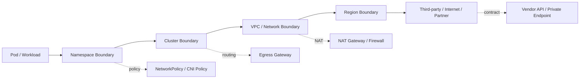
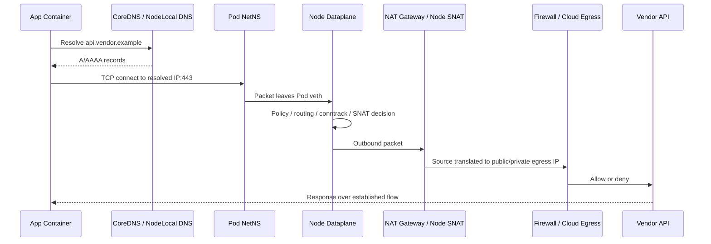
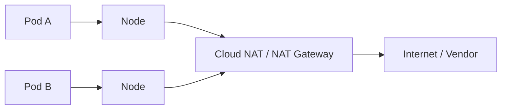
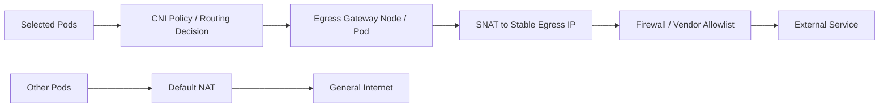
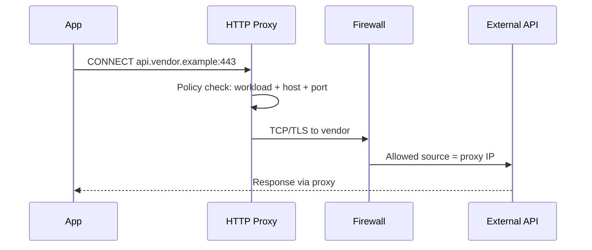
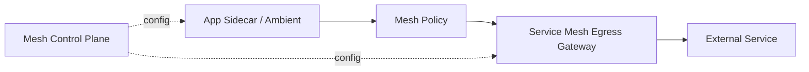
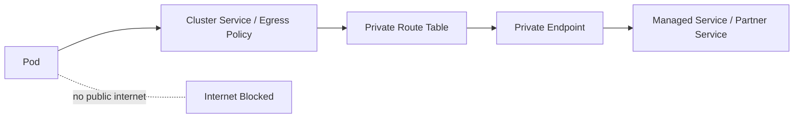
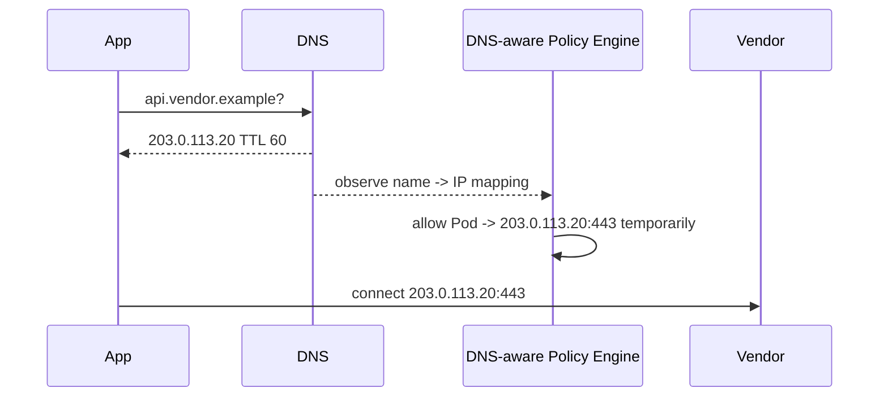
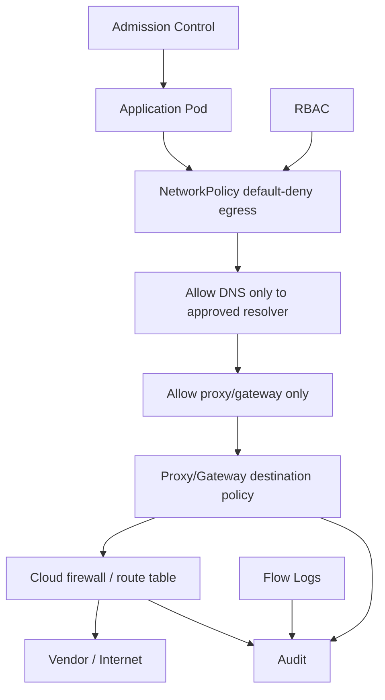
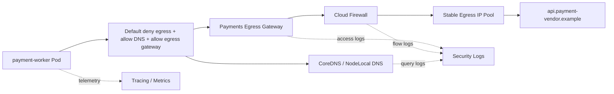

# Part 029 — Egress Control: NAT, Firewalls, Proxies, and Private Connectivity

## 1. Tujuan Part Ini

Part 028 membahas microsegmentation di dalam cluster. Part ini membahas arah traffic yang paling sering menjadi titik buta platform: **egress**, yaitu koneksi dari workload Kubernetes menuju sesuatu di luar boundary langsung workload tersebut.

Target part ini:

> Anda mampu mendesain egress architecture yang predictable, auditable, policy-driven, tidak mudah dibypass, dan cukup stabil untuk kebutuhan regulated systems seperti allowlist firewall, third-party integration, anti-exfiltration, dan incident reconstruction.

Setelah part ini, Anda harus bisa menjawab:

- Mengapa egress lebih sulit daripada ingress?
- Apa beda egress control, egress observability, dan egress identity?
- Mengapa source IP Pod hampir tidak pernah cocok untuk firewall enterprise?
- Kapan cukup memakai NAT Gateway cloud?
- Kapan butuh egress gateway per namespace/team/app?
- Kapan HTTP proxy lebih baik daripada egress gateway L3/L4?
- Bagaimana DNS, FQDN policy, dan TLS SNI membantu tetapi juga berbahaya jika dianggap absolut?
- Bagaimana service mesh mengontrol external service access?
- Bagaimana menghindari NAT port exhaustion?
- Bagaimana membuat egress policy dapat diaudit untuk sistem regulasi?

---

## 2. Kaufman Framing: Egress Skill = Decompose External Dependency Paths

Kesalahan umum:

```txt
Aplikasi butuh akses ke vendor API.
Buka egress ke internet.
```

Di production, ini terlalu lemah. Pertanyaan yang benar:

```txt
Workload mana?
Dari namespace mana?
Ke destination apa?
Lewat jalur apa?
Dengan source identity apa?
Dengan source IP apa?
Pada port/protocol apa?
Dengan TLS verification apa?
Dengan audit evidence apa?
Dengan fallback apa?
Dengan blast radius apa jika rule salah?
```

Dengan pendekatan Kaufman, skill egress dipecah menjadi primitive berikut:

| Primitive | Pertanyaan Operasional |
|---|---|
| Workload origin | Pod/service account mana yang boleh keluar? |
| Destination identity | Tujuan dikenali sebagai IP, CIDR, DNS name, SNI, SPIFFE, service registry, atau private endpoint? |
| Egress path | Langsung via node, NAT Gateway, egress gateway, proxy, service mesh, atau private link? |
| Source representation | Destination melihat IP siapa: Pod, node, NAT, gateway, proxy, atau LB? |
| Policy layer | Enforcement di NetworkPolicy, CNI extension, mesh policy, proxy ACL, firewall, atau cloud routing? |
| Name resolution | DNS dikontrol, dicache, dilog, dan divalidasi di mana? |
| TLS posture | Verify certificate, pin CA, mTLS, atau sekadar encrypted tanpa authorization? |
| Observability | Bisa menjawab siapa mengakses apa, kapan, berapa banyak, dan lewat jalur mana? |
| Failure behaviour | Apa yang terjadi saat DNS gagal, gateway down, NAT exhausted, vendor lambat, atau firewall berubah? |
| Compliance evidence | Bukti apa yang bisa ditunjukkan ke auditor atau investigator? |

Deliberate practice untuk part ini:

1. ambil satu workload yang memanggil external API;
2. gambar egress path aktual dari Pod sampai destination;
3. catat source IP yang dilihat destination;
4. matikan akses internet default;
5. izinkan DNS secara eksplisit;
6. izinkan hanya satu dependency eksternal;
7. paksa traffic lewat egress gateway atau proxy;
8. logging destination, source workload, status, latency, dan bytes;
9. simulasikan vendor timeout;
10. simulasikan NAT/gateway failure;
11. buat audit evidence bundle.

---

## 3. Mental Model: Egress Bukan “Outbound Internet”

Egress adalah **keluar dari trust boundary tertentu**, bukan selalu keluar ke internet.

Contoh boundary:

- Pod keluar dari namespace;
- service keluar dari mesh;
- workload keluar dari cluster;
- cluster keluar dari VPC/VNet;
- region keluar ke region lain;
- sistem internal keluar ke vendor;
- data regulated keluar ke environment non-regulated;
- workload production keluar ke endpoint development;
- service private keluar ke public internet.

Model yang lebih presisi:

```txt
Egress = controlled movement from one trust domain to another.
```

Diagram:



Setiap boundary punya pertanyaan berbeda:

| Boundary | Pertanyaan |
|---|---|
| Pod → namespace | Apakah workload ini berhak keluar? |
| Namespace → cluster | Apakah dependency internal diizinkan? |
| Cluster → VPC | Source IP apa yang dipakai? |
| VPC → internet | Apakah firewall memperbolehkan? |
| Mesh → external | Apakah external service dimodelkan? |
| Org → third party | Apakah ada contract, audit, dan data classification? |

---

## 4. Mengapa Egress Lebih Sulit daripada Ingress

Ingress biasanya punya entry point eksplisit:

```txt
client -> DNS -> CDN/WAF/LB -> Gateway -> Service -> Pod
```

Egress sering implicit:

```txt
Pod -> node routing -> NAT -> internet -> unknown dependency
```

Ingress relatif mudah dilihat karena service publik butuh DNS, cert, gateway, dan route. Egress bisa muncul dari:

- library telemetry;
- package manager;
- external auth provider;
- payment gateway;
- email provider;
- object storage;
- metadata service;
- webhook;
- SaaS API;
- database managed service;
- AI/ML API;
- observability agent;
- debug shell;
- malicious code path.

Masalah utama egress:

| Masalah | Dampak |
|---|---|
| Destination tersebar | Sulit inventory dependency |
| IP destination berubah | Firewall CIDR allowlist rapuh |
| DNS dynamic | Policy berbasis IP cepat stale |
| Source IP tidak stabil | Vendor allowlist gagal |
| SNAT menyembunyikan Pod | Audit kehilangan workload identity |
| TLS mengenkripsi payload | Firewall L4 tidak tahu application intent |
| Banyak layer NAT | Debugging rumit |
| Retry ke vendor | Outage eksternal bisa menjadi overload internal |
| Default internet allow | Data exfiltration risk |

Prinsip:

```txt
Ingress is about protecting what comes in.
Egress is about controlling what can leave and proving why it left.
```

---

## 5. Baseline Egress Packet Path

Contoh workload memanggil `https://api.vendor.example`.

Simplified path:



Di setiap hop, ada state yang berbeda:

| Hop | State Penting |
|---|---|
| App | DNS cache, connection pool, timeout, retry |
| Pod netns | route, source IP, local port |
| CNI | policy, masquerade, eBPF state |
| Node | conntrack, routing table, SNAT, ephemeral port |
| NAT gateway | translation table, port capacity, public IP |
| Firewall | allowlist, state table, TLS/SNI inspection jika ada |
| Vendor | rate limit, IP allowlist, TLS certificate |

Debugging egress harus mengikuti path, bukan menebak dari YAML.

---

## 6. Source IP: Yang Dilihat Destination Belum Tentu Yang Anda Kira

Destination eksternal biasanya tidak melihat Pod IP. Kemungkinan source yang terlihat:

| Egress Path | Source IP yang Dilihat Destination |
|---|---|
| Pod langsung routed tanpa SNAT | Pod IP, jika routable sampai destination |
| Pod via node masquerade | Node IP |
| Pod via cloud NAT Gateway | NAT Gateway public/private IP |
| Pod via egress gateway node | Egress node IP atau egress IP khusus |
| Pod via HTTP proxy | Proxy IP |
| Pod via service mesh egress gateway | Egress gateway IP |
| Pod via private endpoint | Private source address sesuai cloud fabric |

Konsekuensi:

- firewall vendor biasanya tidak bisa allowlist Pod IP;
- Pod pindah node dapat mengubah source IP jika egress lewat node;
- NAT Gateway menyatukan banyak workload menjadi satu IP, bagus untuk allowlist tetapi buruk untuk attribution;
- egress gateway memberi source IP lebih stabil, tetapi menjadi choke point;
- proxy memberi L7 visibility, tetapi memerlukan client/proxy compatibility.

Mental model:

```txt
Source IP stability and workload attribution are separate goals.
```

Anda bisa punya source IP stabil tanpa tahu workload mana yang keluar. Anda juga bisa tahu workload identity di mesh tetapi destination tetap melihat NAT IP yang sama.

---

## 7. NAT, SNAT, Masquerade, dan Conntrack

NAT mengubah address/port packet. Untuk egress Kubernetes, yang paling relevan adalah SNAT.

Contoh:

```txt
Before SNAT:
10.244.3.17:45122 -> 203.0.113.20:443

After SNAT:
198.51.100.10:62001 -> 203.0.113.20:443
```

Conntrack menyimpan mapping agar response bisa dikembalikan:

```txt
203.0.113.20:443 -> 198.51.100.10:62001
translated back to
203.0.113.20:443 -> 10.244.3.17:45122
```

Failure penting:

| Failure | Gejala |
|---|---|
| Conntrack table penuh | koneksi baru timeout/random fail |
| NAT port exhausted | sebagian destination gagal, terutama high fan-out |
| Idle timeout terlalu pendek | connection pool reuse gagal |
| Asymmetric routing | SYN keluar, SYN-ACK tidak kembali ke path yang sama |
| Multiple NAT layer | attribution sulit dan timeout mismatch |
| Long-lived connection + NAT rotation | koneksi putus setelah failover |

NAT port exhaustion sering muncul saat banyak Pod memanggil destination yang sama dengan source IP NAT yang sama. Karena flow biasanya dibedakan oleh tuple seperti source IP, source port, destination IP, destination port, protocol, kapasitas port efektif per destination terbatas.

Prinsip desain:

```txt
The more workloads share one egress IP, the more carefully you must manage connection reuse, rate, retry, and port capacity.
```

---

## 8. Egress Pattern 1: Default Node/Cloud NAT

Pattern paling umum:



Kelebihan:

- sederhana;
- native cloud;
- tidak perlu aplikasi aware proxy;
- cocok untuk general outbound access;
- operasional relatif familiar bagi network team.

Kekurangan:

- semua workload terlihat sebagai NAT IP yang sama atau pool NAT;
- policy workload-level biasanya lemah jika hanya mengandalkan NAT;
- audit butuh korelasi flow log + Kubernetes metadata;
- NAT bisa menjadi bottleneck;
- vendor allowlist mudah tetapi attribution sulit;
- sulit membedakan traffic app vs agent vs debug tool.

Gunakan saat:

- egress risk rendah;
- destination tidak perlu policy per workload;
- hanya butuh stable outbound IP;
- cluster tidak memproses data sensitif;
- observability cukup di cloud flow logs.

Jangan andalkan pattern ini sendirian untuk:

- regulated data outbound;
- strict third-party access;
- per-team egress accountability;
- multi-tenant cluster;
- anti-exfiltration posture;
- high-volume single-destination traffic tanpa capacity modelling.

---

## 9. Egress Pattern 2: Egress Gateway L3/L4

Egress gateway memaksa traffic workload tertentu lewat node/gateway tertentu agar source IP dan policy lebih terkendali.

Diagram:



Kelebihan:

- source IP lebih predictable;
- bisa per namespace/team/app;
- firewall allowlist lebih bersih;
- dapat menjadi choke point observability;
- mengurangi random node IP exposure;
- cocok untuk partner integration.

Kekurangan:

- gateway adalah failure domain baru;
- route/policy harus tepat;
- capacity harus dihitung;
- HA dan failover harus jelas;
- dapat menambah latency;
- jika hanya L3/L4, tidak memahami HTTP method/path/user intent.

Contoh use case:

- payment gateway hanya menerima source IP tertentu;
- regulator API perlu allowlist IP;
- mainframe/legacy system hanya menerima koneksi dari firewall tertentu;
- third-party SaaS butuh fixed source IP;
- production namespace harus punya egress IP berbeda dari staging.

Design checklist:

| Concern | Pertanyaan |
|---|---|
| Selection | Pod mana yang diarahkan ke egress gateway? |
| Destination | Semua traffic atau CIDR tertentu? |
| HA | Ada berapa gateway node? |
| Failover | Jika gateway down, traffic drop atau fallback? |
| Source IP | IP mana yang muncul di destination? |
| Capacity | Berapa koneksi aktif dan throughput? |
| Policy | Siapa boleh menggunakan gateway? |
| Observability | Apakah flow log punya workload metadata? |
| Security | Bisa dibypass lewat hostNetwork atau node path lain? |

---

## 10. Egress Pattern 3: HTTP/HTTPS Proxy

Proxy L7 memindahkan egress control ke level application protocol.

Diagram:



Kelebihan:

- bisa policy berdasarkan hostname;
- bisa logging HTTP metadata jika TLS terminated atau explicit proxy metadata tersedia;
- stable source IP;
- familiar bagi enterprise security;
- bisa centralize allowlist, denylist, DLP, malware scanning, auth;
- cocok untuk developer tooling dan SaaS access.

Kekurangan:

- aplikasi harus support proxy atau env var;
- CONNECT hanya memberi host:port, bukan full HTTP path jika TLS tidak diinspeksi;
- TLS interception menambah trust dan compliance complexity;
- non-HTTP traffic tidak cocok;
- proxy outage bisa memutus banyak workload;
- bypass harus dicegah dengan NetworkPolicy/CNI/cloud firewall.

Proxy cocok saat:

- destination berbasis domain, bukan fixed IP;
- security butuh centralized outbound policy;
- enterprise sudah punya proxy governance;
- traffic mayoritas HTTP/HTTPS;
- perlu audit `who accessed which host`.

Proxy kurang cocok saat:

- protocol bukan HTTP;
- low-latency high-throughput binary protocol;
- workload tidak bisa dikonfigurasi proxy;
- mTLS end-to-end tidak boleh diintercept;
- dependency butuh raw TCP semantics.

---

## 11. Egress Pattern 4: Service Mesh Egress Gateway

Service mesh egress gateway memodelkan traffic keluar dari mesh sebagai traffic yang tetap bisa dikendalikan oleh mesh features.

Diagram:



Kemampuan umum:

- force external traffic melalui gateway;
- apply route rules;
- telemetry keluar mesh;
- mTLS internal sampai egress gateway;
- TLS origination dari egress gateway;
- external service modeling;
- per-host policy;
- centralized egress audit.

Trade-off:

| Area | Benefit | Cost |
|---|---|---|
| Visibility | External call masuk telemetry mesh | Butuh konfigurasi mesh benar |
| Security | Traffic keluar bisa dipaksa via gateway | Bypass harus ditutup dengan network policy |
| TLS | TLS origination bisa dikelola terpusat | Trust boundary berubah |
| Routing | External traffic bisa diroute/shift | Mesh config complexity |
| Operations | Satu pattern untuk east-west dan egress | Gateway capacity dan HA harus dijaga |

Anti-pattern:

```txt
Service mesh egress gateway dipakai, tetapi default network tetap membolehkan Pod keluar langsung ke internet.
```

Itu bukan control, hanya optional path.

Control yang benar:

1. mesh config mengarahkan external traffic via egress gateway;
2. NetworkPolicy/CNI policy menolak direct external egress dari app Pod;
3. hanya egress gateway yang boleh keluar ke destination;
4. firewall/cloud route hanya allow egress gateway source;
5. logs di gateway dikorelasikan ke workload identity.

---

## 12. Egress Pattern 5: Private Connectivity

Tidak semua egress harus lewat internet. Untuk dependency kritikal, lebih baik gunakan private path.

Contoh:

- private endpoint;
- VPC endpoint;
- PrivateLink-style service;
- peering;
- transit gateway;
- VPN;
- dedicated interconnect;
- internal load balancer;
- service mesh multi-cluster;
- partner private connectivity.

Diagram:



Kelebihan:

- mengurangi public internet exposure;
- lebih cocok untuk database/queue/object storage managed service;
- lebih mudah membatasi path di routing layer;
- latency dan reliability sering lebih baik;
- compliance posture lebih kuat.

Kekurangan:

- DNS split-horizon complexity;
- routing table dan CIDR overlap risk;
- cross-account/cross-project governance;
- private endpoint quota/cost;
- debugging lebih network-team-heavy;
- multi-region failover lebih rumit.

Prinsip:

```txt
Use public egress for public dependency.
Use private connectivity for platform-critical or regulated dependency when available.
```

---

## 13. DNS-Based Egress Control: Berguna, Tapi Jangan Naif

Banyak organisasi ingin policy seperti:

```txt
payments namespace boleh akses api.payment-vendor.example
```

Masalahnya, network packet membawa IP, bukan domain. DNS-based policy bekerja dengan mengamati resolusi nama ke IP lalu mengizinkan IP tersebut untuk periode tertentu.

Flow:



Kelebihan:

- cocok untuk SaaS/vendor yang IP-nya berubah;
- policy lebih manusiawi;
- mengurangi CIDR allowlist luas;
- dapat digabung dengan namespace/workload identity.

Failure modes:

| Failure | Penjelasan |
|---|---|
| DNS bypass | App memakai hardcoded IP atau custom resolver |
| Shared IP | Banyak domain berada di IP/CDN yang sama |
| TTL mismatch | Policy cache lebih lama/pendek dari DNS client cache |
| CNAME chain | Policy tidak menangkap semua resolusi |
| Split horizon | Pod mendapat jawaban berbeda dari policy engine |
| Wildcard terlalu luas | `*.example.com` membuka terlalu banyak surface |
| DNS-over-HTTPS | Resolver tersembunyi dari cluster DNS observability |

Prinsip:

```txt
DNS-based egress policy is an approximation of destination identity.
It is stronger than raw CIDR allowlist for dynamic services, but weaker than authenticated service identity.
```

Mitigasi:

- blokir custom DNS keluar;
- paksa Pod memakai cluster DNS;
- izinkan DNS hanya ke CoreDNS/NodeLocal DNSCache;
- gunakan FQDN policy dari CNI jika tersedia;
- gabungkan dengan TLS SNI/HTTP proxy jika butuh hostname validation;
- jangan gunakan wildcard luas tanpa review;
- log DNS query dan flow secara bersama.

---

## 14. TLS, SNI, dan Egress Identity

TLS menyelesaikan encryption, bukan otomatis authorization.

Pada HTTPS, beberapa informasi mungkin terlihat sebelum payload terenkripsi:

- destination IP;
- destination port;
- SNI pada TLS ClientHello, kecuali ECH/teknologi privacy lain;
- certificate chain dari server;
- ALPN;
- connection timing/volume.

Jika proxy melakukan TLS passthrough, proxy tidak melihat path/method/body. Jika proxy melakukan TLS termination/interception, proxy melihat HTTP detail tetapi menjadi man-in-the-middle yang harus dipercaya oleh client dan organisasi.

Decision table:

| Need | Pattern |
|---|---|
| Hanya stable source IP | NAT / egress gateway |
| Hostname allowlist | HTTP CONNECT proxy atau DNS/FQDN policy |
| HTTP method/path policy | Explicit proxy dengan TLS termination atau service-specific gateway |
| End-to-end vendor TLS tanpa intercept | Egress gateway + SNI/logging + cert validation di app |
| Mutual auth ke vendor | App mTLS atau egress gateway TLS origination dengan strong ownership |
| Audit payload | Proxy termination, tetapi perlu legal/security approval |

Prinsip regulasi:

```txt
Do not inspect encrypted traffic by default just because it is technically possible.
Make the trust boundary explicit.
```

---

## 15. Kubernetes NetworkPolicy untuk Egress

NetworkPolicy standar bisa mengontrol egress berdasarkan:

- pod selector;
- namespace selector;
- IP block;
- port/protocol.

Contoh default-deny egress:

```yaml
apiVersion: networking.k8s.io/v1
kind: NetworkPolicy
metadata:
  name: default-deny-egress
  namespace: payments
spec:
  podSelector: {}
  policyTypes:
    - Egress
  egress: []
```

Contoh izinkan DNS ke kube-system:

```yaml
apiVersion: networking.k8s.io/v1
kind: NetworkPolicy
metadata:
  name: allow-dns
  namespace: payments
spec:
  podSelector: {}
  policyTypes:
    - Egress
  egress:
    - to:
        - namespaceSelector:
            matchLabels:
              kubernetes.io/metadata.name: kube-system
      ports:
        - protocol: UDP
          port: 53
        - protocol: TCP
          port: 53
```

Contoh izinkan CIDR vendor:

```yaml
apiVersion: networking.k8s.io/v1
kind: NetworkPolicy
metadata:
  name: allow-vendor-cidr
  namespace: payments
spec:
  podSelector:
    matchLabels:
      app: payment-worker
  policyTypes:
    - Egress
  egress:
    - to:
        - ipBlock:
            cidr: 203.0.113.0/24
      ports:
        - protocol: TCP
          port: 443
```

Keterbatasan:

- tidak native FQDN;
- tidak native HTTP path/method;
- tidak native TLS SNI;
- tidak native service account identity;
- enforcement tergantung CNI;
- IPBlock untuk external IP bisa rapuh jika vendor berubah.

Gunakan NetworkPolicy standar sebagai baseline, bukan satu-satunya control untuk advanced egress.

---

## 16. CNI Egress Extensions

Beberapa CNI menyediakan fitur yang melebihi Kubernetes NetworkPolicy standar.

Contoh kategori:

| Feature | Tujuan |
|---|---|
| FQDN policy | Allow/deny berdasarkan DNS name |
| Egress gateway | Paksa workload keluar via gateway node/IP |
| L7 policy | HTTP/Kafka/DNS-aware enforcement |
| Identity-based policy | Policy berdasarkan workload identity, bukan IP saja |
| Flow visibility | Lihat allowed/dropped flow dengan metadata Kubernetes |
| Cluster mesh policy | Policy lintas cluster |

Kelebihan CNI extension:

- enforcement lebih dekat ke dataplane;
- bisa mencegah bypass lebih kuat;
- punya metadata Kubernetes;
- performa bisa lebih baik jika eBPF-based;
- cocok untuk microsegmentation dan egress posture.

Risiko:

- non-portable;
- upgrade CNI menjadi high-risk operation;
- policy semantics berbeda antar vendor;
- debugging butuh skill CNI spesifik;
- fitur bisa beta/enterprise/implementation-specific.

Decision rule:

```txt
Use standard NetworkPolicy for portable baseline.
Use CNI-specific policy when the risk justifies tighter enforcement and operational coupling.
```

---

## 17. Egress Gateway vs Proxy vs NAT

| Dimension | NAT Gateway | Egress Gateway | HTTP Proxy | Mesh Egress Gateway |
|---|---|---|---|---|
| Stable source IP | Ya | Ya | Ya | Ya |
| Workload-level selection | Lemah kecuali digabung policy | Kuat jika CNI/route mendukung | Kuat jika auth/proxy config benar | Kuat jika mesh identity benar |
| Hostname policy | Tidak native | Tidak native L3/L4 | Ya | Ya/tergantung config |
| HTTP path policy | Tidak | Tidak | Ya jika termination | Ya jika L7 mesh routing |
| Non-HTTP support | Ya | Ya | Terbatas | Ya, tergantung mesh/protocol |
| App change needed | Tidak | Tidak | Kadang ya | Tidak/kadang tergantung mesh |
| Audit detail | Rendah | Sedang | Tinggi | Tinggi |
| Bypass risk | Tinggi jika default allow | Sedang | Tinggi jika direct egress tetap allowed | Sedang jika network policy tidak menutup bypass |
| Complexity | Rendah | Sedang | Sedang/Tinggi | Tinggi |

Tidak ada pattern universal. Yang paling baik tergantung requirement:

- **vendor allowlist sederhana:** NAT Gateway atau egress gateway;
- **per-team source IP:** egress gateway;
- **SaaS domain governance:** HTTP proxy atau FQDN policy;
- **mesh-managed external dependencies:** mesh egress gateway;
- **regulated private dependency:** private endpoint/connectivity;
- **anti-exfiltration:** kombinasi default-deny egress + DNS control + proxy/gateway + cloud firewall.

---

## 18. Anti-Bypass Design

Control egress tidak berarti apa-apa jika workload bisa memilih path lain.

Bypass umum:

- direct internet via node NAT;
- custom DNS resolver;
- DNS-over-HTTPS;
- hardcoded IP;
- hostNetwork Pod;
- privileged Pod manipulating network;
- sidecar/mesh disabled;
- init container downloading dependency;
- node-level daemon with broad egress;
- externalName service pointing ke destination tidak direview;
- wildcard domain policy;
- service account yang bisa membuat permissive policy.

Layered anti-bypass:



Prinsip:

```txt
Every egress control must have a matching bypass control.
```

Jika Anda memaksa traffic ke proxy, maka direct egress ke internet harus ditolak. Jika Anda mengandalkan DNS policy, maka custom DNS harus ditolak. Jika Anda mengandalkan mesh gateway, maka Pod non-mesh tidak boleh punya jalur keluar yang sama.

---

## 19. Egress Inventory dan Dependency Classification

Sebelum membuat policy, inventory dependency.

Template dependency record:

| Field | Contoh |
|---|---|
| Owning service | payment-worker |
| Namespace | payments |
| Service account | payment-worker-sa |
| Destination | api.payment-vendor.example |
| Destination type | third-party SaaS |
| Protocol | HTTPS |
| Port | 443 |
| Data classification | payment metadata, no PAN |
| Auth | OAuth client credentials |
| TLS | public CA, verify required |
| Source IP requirement | vendor allowlist |
| Required availability | high |
| Timeout | 2s connect, 5s request |
| Retry | max 1 retry, budgeted |
| Fallback | queue and retry later |
| Audit need | request count, status, destination, source workload |
| Owner | payments team |
| Review cadence | quarterly |

Classification:

| Class | Example | Egress Pattern |
|---|---|---|
| Platform-critical private | managed DB, queue, object storage | private endpoint + policy |
| Regulated third-party | payment, regulator, KYC | egress gateway/proxy + audit |
| Public SaaS operational | Slack webhook, email provider | proxy/FQDN policy |
| Observability | metrics/log shipping | dedicated policy + rate guard |
| Package/download | artifact repo | proxy + repository mirror |
| Unknown | dynamic internet | deny by default |

---

## 20. NAT Port Exhaustion and Capacity Modelling

NAT Gateway atau egress IP memiliki finite port space per destination tuple.

High-risk pattern:

```txt
10,000 pods -> same vendor IP:443 via one NAT IP
```

Gejala:

- intermittent connect timeout;
- error meningkat saat peak;
- retry memperburuk;
- hanya destination tertentu yang gagal;
- DNS tampak normal;
- Pod dan Service tampak sehat;
- NAT metrics menunjukkan port allocation error atau connection count tinggi.

Capacity variables:

| Variable | Dampak |
|---|---|
| Number of NAT IPs | Semakin banyak IP, semakin banyak source port capacity |
| Destination cardinality | Satu destination populer lebih berisiko |
| Connection reuse | Reuse mengurangi port churn |
| Keepalive | Mengurangi handshake tetapi memegang port lebih lama |
| Idle timeout | Terlalu pendek memutus pool; terlalu panjang memegang port |
| Retry rate | Meningkatkan connection attempts |
| Client concurrency | Meningkatkan active flows |

Mitigation:

- tambah NAT IP/pool;
- shard egress per namespace/app;
- gunakan connection pooling;
- batasi retry;
- gunakan backoff dan jitter;
- monitor NAT port allocation;
- gunakan private endpoint jika tersedia;
- kurangi fan-out langsung dari semua Pod;
- gunakan queue/worker rate limiting.

Prinsip:

```txt
Egress capacity is not only bandwidth. It is also connection state, source port space, gateway CPU, memory, and downstream rate limit.
```

---

## 21. Egress untuk Regulated Systems

Dalam sistem regulated, pertanyaan auditor bukan hanya “apakah traffic terenkripsi?”. Pertanyaannya:

```txt
Siapa yang boleh mengirim data ke luar?
Ke mana?
Data apa?
Dengan dasar proses apa?
Apakah bisa dibuktikan?
Apakah ada review?
Apakah ada alert jika menyimpang?
```

Control matrix:

| Control | Evidence |
|---|---|
| Default deny egress | NetworkPolicy/CNI policy manifests |
| Approved destination inventory | Egress registry / CMDB / ADR |
| Stable source IP | NAT/egress gateway config |
| Workload identity | service account, SPIFFE, mesh identity |
| Destination authorization | proxy/gateway policy |
| DNS control | DNS logs, resolver policy |
| TLS verification | app config, gateway policy, cert validation evidence |
| Runtime monitoring | flow logs, proxy logs, mesh telemetry |
| Change approval | pull request, policy review, ticket |
| Exception handling | time-bound exception record |
| Incident reconstruction | correlated logs by workload/destination/time |

Recommended evidence bundle per external dependency:

```txt
- owner
- business purpose
- data classification
- hostname/CIDR
- protocol/port
- source namespace/service account
- egress path
- source IP seen by destination
- policy manifests
- last successful validation
- last review date
- alert/dashboard link
- rollback plan
```

---

## 22. Observability for Egress

Minimum egress observability:

| Signal | Why It Matters |
|---|---|
| DNS queries | Mengetahui intended destination names |
| Flow logs | Mengetahui actual IP/port connections |
| Proxy/gateway logs | Mengetahui policy decision dan response status |
| NAT metrics | Mengetahui capacity/port exhaustion |
| Firewall logs | Mengetahui allow/deny at perimeter |
| App metrics | Mengetahui user/business impact |
| Trace spans | Menghubungkan external call dengan request internal |
| Kubernetes metadata | Menghubungkan IP ke Pod/namespace/service account |

Correlation key yang ideal:

```txt
timestamp
source namespace
source pod
source workload
source service account
source node
egress gateway/proxy
translated source IP
destination hostname
destination IP
destination port
protocol
policy decision
bytes
latency
status/error
trace id
```

Problem umum:

```txt
Firewall log hanya tahu NAT IP, bukan Pod.
Kubernetes log tahu Pod, tapi tidak tahu translated IP.
Proxy log tahu hostname, tapi tidak tahu original request context.
```

Solusinya bukan satu log aja. Solusinya adalah **joinable telemetry**.

---

## 23. Debugging Playbook: External API Timeout

Symptom:

```txt
payment-worker sering timeout ke api.vendor.example
```

Urutan debug:

### 23.1 Pastikan DNS

```bash
kubectl -n payments exec deploy/payment-worker -- nslookup api.vendor.example
kubectl -n payments exec deploy/payment-worker -- getent hosts api.vendor.example
```

Pertanyaan:

- resolver mana yang dipakai?
- jawaban IP apa?
- TTL berapa?
- intermittent atau konsisten?
- CoreDNS error/latency meningkat?

### 23.2 Pastikan TCP connect

```bash
kubectl -n payments exec deploy/payment-worker -- sh -c 'nc -vz api.vendor.example 443'
```

Pertanyaan:

- gagal connect atau gagal TLS?
- hanya dari namespace tertentu?
- hanya dari node tertentu?
- hanya saat peak?

### 23.3 Cek policy

```bash
kubectl -n payments get networkpolicy
kubectl -n payments describe networkpolicy allow-vendor
```

Pertanyaan:

- default deny aktif?
- DNS diizinkan?
- destination CIDR benar?
- CNI drop logs ada?

### 23.4 Cek egress path

- apakah via NAT Gateway?
- via egress gateway?
- via proxy?
- apakah source IP sesuai allowlist vendor?
- apakah Pod bisa bypass path?

### 23.5 Cek gateway/NAT/firewall

- connection count;
- port allocation;
- dropped packets;
- firewall deny;
- route table;
- NAT idle timeout;
- gateway CPU/memory.

### 23.6 Cek TLS/application

```bash
kubectl -n payments exec deploy/payment-worker -- openssl s_client -connect api.vendor.example:443 -servername api.vendor.example
```

Pertanyaan:

- certificate valid?
- SNI benar?
- CA trust benar?
- vendor rate limit?
- HTTP 429/5xx?
- timeout mismatch?

### 23.7 Tentukan layer failure

| Layer | Evidence |
|---|---|
| DNS | query timeout/NXDOMAIN/wrong IP |
| NetworkPolicy | drop at CNI |
| Routing | no route/asymmetric path |
| NAT | port exhaustion/translation error |
| Firewall | deny log |
| TLS | handshake/cert/SNI error |
| Vendor | HTTP 429/5xx/latency |
| App | pool/retry/timeout issue |

---

## 24. Common Failure Modes

### 24.1 Stable IP Without Stable Policy

Vendor allowlist memakai NAT IP, tetapi semua namespace bisa keluar lewat NAT yang sama.

Dampak:

- vendor tidak bisa membedakan service;
- compromised workload bisa mengakses vendor;
- audit hanya menunjukkan NAT IP.

Mitigasi:

- per-workload policy;
- egress gateway per trust group;
- proxy auth;
- correlate NAT logs dengan Pod metadata.

### 24.2 DNS Allowed Too Broadly

Policy mengizinkan egress UDP/TCP 53 ke internet.

Dampak:

- Pod bisa pakai resolver luar;
- DNS logging cluster hilang;
- DNS-based policy bisa dibypass;
- DoH endpoint bisa digunakan.

Mitigasi:

- izinkan DNS hanya ke CoreDNS/NodeLocal;
- deny outbound DNS lain;
- monitor direct DNS attempts;
- restrict DoH endpoints jika posture membutuhkan.

### 24.3 Proxy Configured But Direct Egress Still Open

Aplikasi memakai proxy, tetapi network tetap bisa direct internet.

Dampak:

- attacker/library bisa bypass proxy;
- policy tidak enforce;
- logs tidak lengkap.

Mitigasi:

- default deny egress;
- only allow proxy IP/port;
- cloud firewall deny direct internet;
- admission policy untuk proxy env/sidecar jika required.

### 24.4 Egress Gateway Single Point of Failure

Semua traffic critical lewat satu gateway.

Dampak:

- gateway node down memutus external dependency;
- retry storm;
- incident besar walaupun vendor sehat.

Mitigasi:

- HA gateway nodes;
- readiness/health check;
- capacity autoscaling;
- fallback yang aman;
- SLO gateway;
- chaos test.

### 24.5 NAT Port Exhaustion

Banyak Pod memanggil same destination via satu egress IP.

Mitigasi:

- tambah NAT IP;
- connection pooling;
- rate limit;
- retry budget;
- private endpoint;
- shard gateway;
- monitor port allocation.

### 24.6 Private Endpoint DNS Drift

DNS private endpoint salah resolve ke public endpoint.

Dampak:

- traffic keluar internet;
- firewall deny;
- data path melanggar compliance expectation.

Mitigasi:

- split-horizon DNS test;
- policy deny public endpoint;
- route validation;
- synthetic probe dari Pod.

---

## 25. Production Design Reference: Payments Vendor Egress

Requirement:

```txt
payment-worker di namespace payments harus mengakses api.payment-vendor.example:443.
Vendor membutuhkan source IP allowlist.
Traffic membawa regulated payment metadata.
Harus ada audit per workload.
Default internet access tidak boleh terbuka.
```

Architecture:



Controls:

| Layer | Control |
|---|---|
| Namespace | Default deny egress |
| DNS | Only cluster DNS allowed |
| CNI | Only selected Pod can use egress gateway |
| Gateway | Only vendor destination allowed |
| Cloud firewall | Only gateway IP can reach vendor CIDR/IP/FQDN if supported |
| Vendor | Only stable egress IP allowlisted |
| App | TLS verify enabled, retry budget bounded |
| Observability | DNS + gateway + firewall + trace correlation |

Failure stance:

```txt
If egress gateway is unavailable, fail closed.
If vendor is unavailable, queue and retry later with bounded retry.
If DNS changes unexpectedly, alert and require review.
If traffic attempts direct internet, block and alert.
```

---

## 26. Practice Lab

### Lab 1 — Discover Actual Egress

Goal: find all outbound destinations from one namespace.

Tasks:

1. deploy sample app that calls several external hosts;
2. collect DNS logs;
3. collect flow logs if CNI supports it;
4. map hostname to IP;
5. classify destination;
6. remove unknown egress.

Expected learning:

```txt
You cannot control what you have not inventoried.
```

### Lab 2 — Default Deny Egress Without Breaking DNS

Tasks:

1. apply default-deny egress;
2. observe DNS failure;
3. add DNS allow policy;
4. test HTTP external call;
5. add specific CIDR allow;
6. verify other destinations fail.

Expected learning:

```txt
Default deny is easy. Useful allow-list is the skill.
```

### Lab 3 — Proxy-Only Egress

Tasks:

1. deploy HTTP proxy;
2. configure app to use proxy;
3. deny direct internet;
4. allow only proxy;
5. log destination host;
6. attempt bypass with direct curl;
7. prove bypass fails.

Expected learning:

```txt
Proxy without network enforcement is convention, not control.
```

### Lab 4 — Egress Gateway Failure

Tasks:

1. route selected Pod via gateway;
2. kill gateway Pod/node;
3. observe failure behavior;
4. test failover;
5. inspect retry storm;
6. apply bounded retry/backoff.

Expected learning:

```txt
Every control point is also a failure point.
```

---

## 27. Review Checklist

Sebelum menyetujui egress design, tanya:

- Apakah default egress posture allow atau deny?
- Workload mana yang butuh egress?
- Destination external sudah di-inventory?
- Apakah destination berbasis domain, CIDR, private endpoint, atau service identity?
- Source IP apa yang dilihat destination?
- Apakah source IP itu stabil?
- Apakah source IP stabil itu juga memberikan attribution?
- Apakah DNS bisa dibypass?
- Apakah direct internet bisa dibypass?
- Apakah hostNetwork/privileged Pod dikendalikan?
- Apakah egress gateway/proxy HA?
- Apakah NAT/gateway capacity dihitung?
- Apakah timeout/retry app cocok dengan proxy/NAT/firewall?
- Apakah ada observability untuk DNS, flow, proxy, firewall, dan app?
- Apakah ada audit evidence per dependency?
- Apakah exception punya expiry?
- Apakah policy direview secara berkala?

---

## 28. Key Takeaways

- Egress adalah movement antar trust domain, bukan sekadar outbound internet.
- Source IP stability dan workload attribution adalah dua problem berbeda.
- NAT sederhana, tetapi menyembunyikan workload identity dan bisa mengalami port exhaustion.
- Egress gateway memberi jalur stabil, tetapi menjadi failure domain baru.
- HTTP proxy memberi L7 policy dan audit, tetapi harus dipaksa dengan network enforcement.
- DNS/FQDN policy berguna, tetapi bisa dibypass jika DNS tidak dikontrol.
- Private connectivity lebih kuat untuk dependency kritikal dan regulated, tetapi membawa kompleksitas DNS/routing.
- Service mesh egress gateway efektif hanya jika direct egress ditutup.
- Egress control tanpa observability tidak defensible.
- Untuk regulated systems, setiap external dependency harus punya owner, purpose, data classification, policy, path, evidence, dan review cadence.

---

## 29. Referensi Faktual

- Kubernetes Documentation — Network Policies.
- Kubernetes Documentation — Services and Source IP behavior.
- Kubernetes Documentation — Service Internal Traffic Policy.
- Istio Documentation — Egress Gateways.
- Cilium Documentation — Egress Gateway.
- CNCF / Kubernetes ecosystem documentation on CNI and policy behavior.
