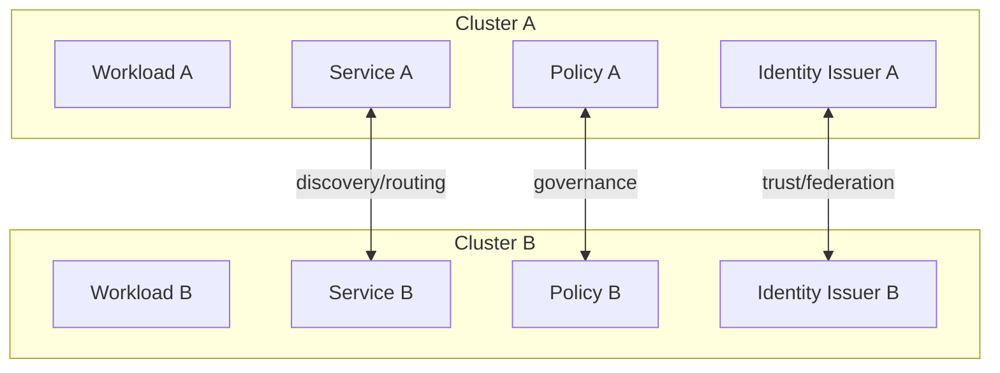
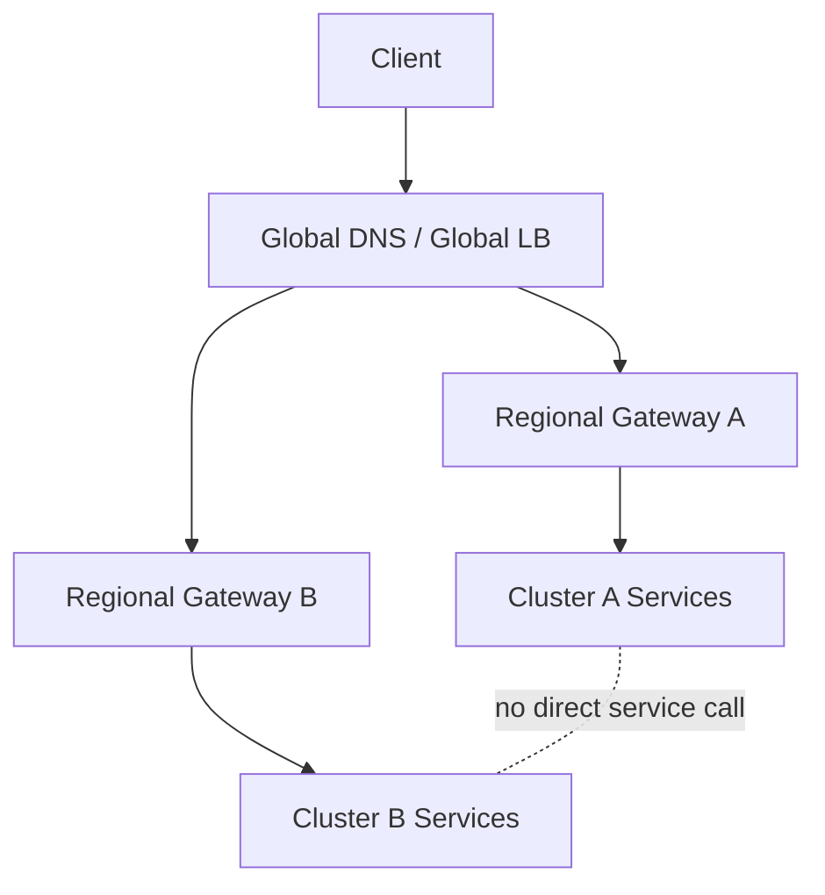
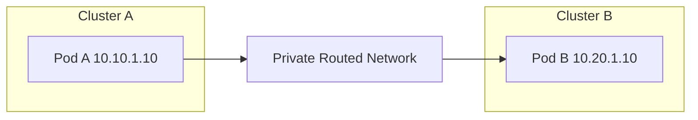
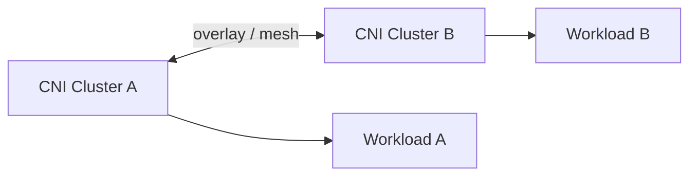
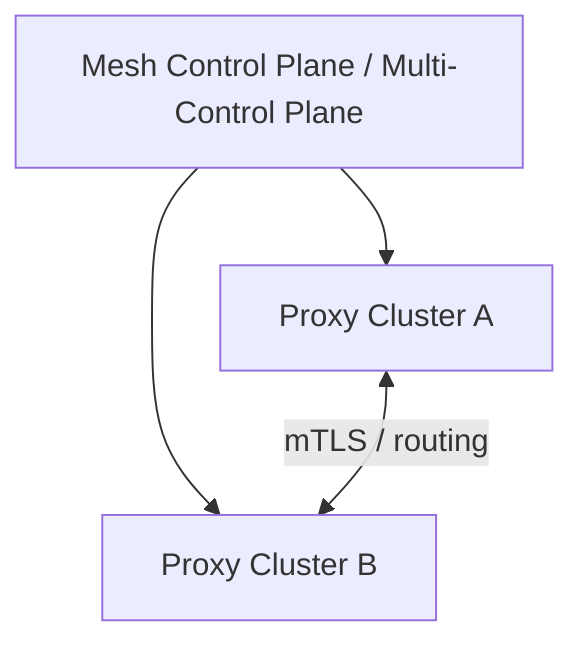
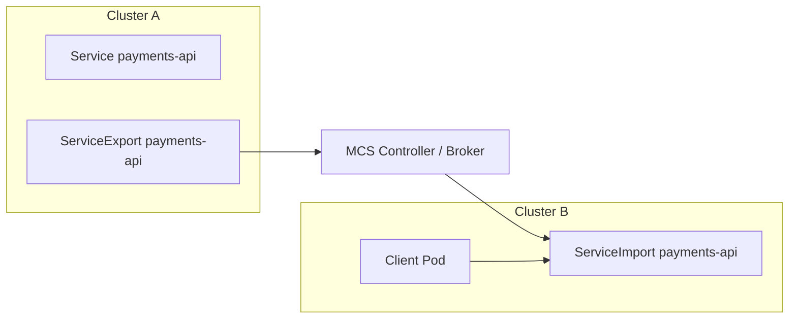

# Part 030 — Multi-Cluster Networking Foundation

## 1. Tujuan Part Ini

Part 029 membahas egress dari satu cluster. Part ini memulai blok multi-cluster: bagaimana memikirkan traffic, identity, discovery, routing, policy, dan failure domain ketika satu cluster tidak lagi cukup.

Target part ini:

> Anda mampu mendesain fondasi multi-cluster networking yang realistis: tahu kapan multi-cluster diperlukan, bagaimana traffic menemukan service lintas cluster, bagaimana identity dan policy tetap konsisten, dan bagaimana menghindari desain yang terlihat high availability tetapi sebenarnya memperbesar blast radius.

Setelah part ini, Anda harus bisa menjawab:

- Mengapa organisasi memakai banyak cluster?
- Apa beda multi-cluster untuk availability, scale, compliance, tenancy, dan lifecycle?
- Apa konsekuensi networking dari cluster boundary?
- Bagaimana memilih flat network, routed network, overlay, gateway-mediated, atau mesh-based topology?
- Mengapa overlapping CIDR adalah bom waktu?
- Bagaimana service discovery bekerja lintas cluster?
- Apa hubungan DNS, ServiceExport/ServiceImport, Gateway, dan mesh?
- Bagaimana latency dan locality memengaruhi routing?
- Bagaimana identity dan trust domain dikelola antar cluster?
- Bagaimana menghindari failover yang menyebabkan split-brain atau data corruption?

---

## 2. Kaufman Framing: Multi-Cluster Skill = Decompose Failure Domains

Kesalahan umum:

```txt
Kita butuh high availability. Deploy ke dua cluster.
```

Ini belum tentu benar. Dua cluster bisa membuat sistem lebih available, tetapi juga bisa membuat:

- debugging lebih sulit;
- network path lebih panjang;
- data consistency lebih rapuh;
- policy tidak konsisten;
- identity tidak sinkron;
- traffic failover salah arah;
- biaya cross-region naik;
- outage satu dependency menjadi outage global;
- split-brain.

Dengan pendekatan Kaufman, pecah multi-cluster menjadi primitive:

| Primitive | Pertanyaan |
|---|---|
| Purpose | Multi-cluster untuk availability, scale, compliance, tenancy, migration, atau blast-radius isolation? |
| Boundary | Cluster merepresentasikan boundary apa: region, environment, team, data domain, lifecycle? |
| Network reachability | Apakah Pod/Service antar cluster saling routable? |
| Addressing | Apakah Pod CIDR dan Service CIDR unik? |
| Discovery | Bagaimana service di cluster A menemukan service di cluster B? |
| Identity | Apakah workload identity valid lintas cluster? |
| Policy | Apakah policy semantics konsisten? |
| Traffic routing | Local-first, active-active, active-passive, weighted, atau failover? |
| Data dependency | Apakah backend state aman untuk multi-cluster traffic? |
| Observability | Bisa trace request lintas cluster? |
| Operations | Siapa owner cluster, gateway, mesh, DNS, cert, dan failover? |

Deliberate practice:

1. desain dua cluster lokal/managed;
2. pastikan CIDR tidak overlap;
3. buat service lokal di masing-masing cluster;
4. expose service lintas cluster dengan DNS/manual gateway;
5. ukur latency dan failure behavior;
6. tambahkan locality rule;
7. simulasikan cluster failure;
8. lihat apakah failover aman untuk data layer;
9. tambahkan identity/mTLS;
10. buat runbook failback.

---

## 3. Multi-Cluster Bukan Satu Pattern

Ada banyak alasan memakai lebih dari satu cluster. Setiap alasan menghasilkan desain networking berbeda.

| Reason | Networking Implication |
|---|---|
| Regional availability | Butuh global ingress, locality, failover, health signal akurat |
| Blast-radius isolation | Jangan terlalu banyak shared control plane/network dependency |
| Compliance/data residency | Traffic tidak boleh lintas wilayah/data boundary sembarangan |
| Team tenancy | Discovery dan policy harus mencegah cross-team coupling liar |
| Cluster lifecycle | Butuh migration/drain path antar cluster |
| Scale limit | Butuh sharding discovery, telemetry, policy, dan gateway capacity |
| Edge/latency | Butuh route ke cluster terdekat, bukan sekadar available |
| Platform migration | Butuh coexistence antara old/new cluster |
| Disaster recovery | Butuh recovery objective, data replication, DNS/failover runbook |

Anti-pattern:

```txt
Menganggap multi-cluster selalu berarti active-active global traffic.
```

Kadang desain terbaik adalah:

- active-passive;
- warm standby;
- per-region isolated active;
- per-tenant cluster;
- blue/green cluster migration;
- management-plane multi-cluster tanpa data-plane connectivity;
- global ingress only, no east-west cross-cluster service calls.

Prinsip:

```txt
Start from failure domain and data ownership, not from tools.
```

---

## 4. Cluster Boundary sebagai Architectural Boundary

Cluster bukan sekadar tempat menjalankan Pod. Dalam produksi, cluster sering menjadi boundary untuk:

- identity;
- policy;
- blast radius;
- network address space;
- certificate issuance;
- platform ownership;
- quota;
- upgrade lifecycle;
- compliance scope;
- incident domain.

Jika Anda membuat service lintas cluster seolah-olah semuanya satu cluster besar, Anda mungkin menghapus boundary yang sebenarnya dibutuhkan.

Mental model:



Pertanyaan review:

```txt
Jika Cluster A compromised, apa yang bisa diakses di Cluster B?
Jika policy di Cluster B salah, apakah traffic dari Cluster A bisa masuk?
Jika identity issuer A gagal, apakah B tetap bisa memverifikasi workload A?
Jika DNS global salah, apakah semua cluster terdampak?
```

---

## 5. Topologi Multi-Cluster Networking

### 5.1 Isolated Clusters with Global Edge Only

Cluster tidak saling memanggil secara langsung. User traffic masuk lewat global DNS/LB ke cluster yang sesuai.



Cocok untuk:

- stateless regional service;
- strong blast-radius isolation;
- data residency;
- low cross-cluster coupling.

Kelemahan:

- service dependency harus regionalized;
- failover bergantung global edge;
- data replication harus diselesaikan di layer lain.

### 5.2 Routed Network Between Clusters

Pod/Service CIDR dapat diroute antar cluster.



Cocok untuk:

- private cloud;
- underlay network kuat;
- strict IPAM governance;
- low-latency private connectivity.

Risiko:

- CIDR overlap fatal;
- policy semantics harus konsisten;
- routing leak bisa membuka akses luas;
- debugging melibatkan network team.

### 5.3 Overlay / Cluster Mesh

CNI membangun connectivity lintas cluster melalui tunnel/overlay atau identity-aware network.



Cocok untuk:

- CNI yang mendukung cluster mesh;
- identity-aware networking;
- multi-cluster service discovery terintegrasi;
- policy enforcement yang konsisten dalam satu implementation.

Risiko:

- vendor/implementation coupling;
- control plane dependency baru;
- MTU/encapsulation issue;
- upgrade dan compatibility harus disiplin.

### 5.4 Gateway-Mediated Inter-Cluster Traffic

Cluster tidak expose Pod network langsung. Cross-cluster call lewat gateway.


Cocok untuk:

- boundary jelas;
- policy/audit di gateway;
- non-overlapping atau overlapping internal CIDR;
- cross-org/partner-like cluster model;
- regulated service boundary.

Kelemahan:

- gateway capacity;
- extra hops;
- L7 config complexity;
- availability gateway menentukan path.

### 5.5 Service Mesh Multi-Cluster

Mesh menyediakan service discovery, identity, mTLS, routing, dan policy lintas cluster.



Cocok untuk:

- service-to-service identity;
- mTLS across clusters;
- locality-aware routing;
- traffic splitting/failover;
- unified telemetry.

Risiko:

- mesh config complexity;
- trust domain design;
- control plane blast radius;
- sidecar/ambient compatibility;
- failure can become global if mesh is too centralized.

---

## 6. CIDR and IPAM: The Boring Part That Saves You

Multi-cluster networking gagal cepat jika IP address planning buruk.

Anda harus mengelola:

- Pod CIDR;
- Service CIDR;
- node CIDR;
- VPC/VNet CIDR;
- peering/transit CIDR;
- load balancer subnet;
- private endpoint subnet;
- egress NAT IP range;
- mesh tunnel CIDR jika ada;
- cluster DNS/service discovery domain.

Failure modes:

| Failure | Dampak |
|---|---|
| Pod CIDR overlap | Pod A mencoba call Pod B tetapi route lokal menang |
| Service CIDR overlap | Virtual IP ambiguous lintas cluster |
| Node subnet overlap | Peering/transit routing gagal |
| Private endpoint overlap | Managed service tidak bisa diroute |
| NAT range overlap | Firewall attribution salah |
| DNS domain collision | service name resolve ke cluster salah |

Prinsip:

```txt
CIDR planning is part of application availability.
```

Minimal IPAM record:

| Field | Example |
|---|---|
| Cluster name | prod-id-jkt-01 |
| Region | ap-southeast-3 |
| Environment | production |
| Pod CIDR | 10.120.0.0/16 |
| Service CIDR | 10.121.0.0/16 |
| Node CIDR | 10.122.0.0/20 |
| Egress IP pool | 198.51.100.10/31 |
| DNS domain | cluster.local / custom internal domain |
| Mesh network | network-jakarta-prod |
| Owner | platform-networking |
| Change window | monthly |

---

## 7. Service Discovery Lintas Cluster

Service discovery lintas cluster menjawab:

```txt
Jika service A di cluster X ingin memanggil service B,
nama apa yang dipakai dan endpoint mana yang dikembalikan?
```

Pilihan umum:

### 7.1 Global DNS

```txt
api.example.com -> regional/global LB -> cluster gateway
```

Cocok untuk north-south atau cross-cluster via public/private gateway.

Kelebihan:

- sederhana;
- language agnostic;
- tidak butuh Pod network routability;
- cocok untuk externalized service contracts.

Kekurangan:

- DNS failover tidak instant;
- health signal bisa coarse;
- client caching bisa membuat failover lambat;
- kurang cocok untuk high-frequency service-to-service routing.

### 7.2 Internal DNS Delegation

```txt
service.ns.global.internal -> cluster-local gateway/service
```

Cocok untuk private service discovery antar cluster.

Risiko:

- split-horizon complexity;
- stale records;
- namespace collision;
- discovery tidak otomatis mengikuti readiness endpoint.

### 7.3 Multi-Cluster Services API

MCS memperkenalkan konsep `ServiceExport` dan `ServiceImport` agar Service dapat diekspor dan direpresentasikan di cluster lain.

High-level model:



Kelebihan:

- Kubernetes-native abstraction;
- Service-oriented;
- cocok untuk multi-cluster service discovery;
- bisa preserve familiar Service model.

Risiko:

- implementation-dependent;
- namespace sameness harus disiplin;
- endpoint freshness dan failover semantics harus dipahami;
- tidak otomatis menyelesaikan auth, policy, atau data consistency.

### 7.4 Mesh Service Discovery

Mesh control plane menggabungkan service registry antar cluster dan mengkonfigurasi proxy.

Kelebihan:

- identity + routing + telemetry terintegrasi;
- locality-aware load balancing;
- mTLS antar cluster;
- traffic policy detail.

Risiko:

- mesh-specific;
- control plane complexity;
- service visibility terlalu luas jika governance lemah;
- proxy config scale.

---

## 8. Namespace Sameness and Naming Governance

Dalam multi-cluster, nama bukan detail kecil.

Jika service `payments/api` diekspor dari dua cluster, apakah itu service yang sama?

Model namespace sameness biasanya mengasumsikan:

```txt
Namespace dengan nama sama di cluster berbeda merepresentasikan logical namespace yang sama.
```

Contoh:

```txt
cluster-a: payments/payment-api
cluster-b: payments/payment-api
```

Bisa dianggap satu global service.

Risiko:

| Risiko | Contoh |
|---|---|
| Name collision | cluster dev mengekspor `payments/payment-api` ke prod registry |
| Ownership ambiguity | namespace sama tetapi owner berbeda |
| Environment leak | staging service ditemukan production client |
| Policy mismatch | namespace label sama tetapi meaning berbeda |
| Accidental export | service lokal menjadi global |

Governance:

- cluster identity harus eksplisit;
- environment boundary tidak boleh hanya bergantung nama;
- ServiceExport butuh approval/label/OPA policy;
- namespace owner harus konsisten;
- naming convention harus membedakan prod/staging/dev jika registry shared;
- discovery domain harus jelas.

Prinsip:

```txt
A service name is a contract. In multi-cluster, it is also a federation decision.
```

---

## 9. Identity and Trust Across Clusters

Single cluster identity biasanya bergantung pada:

- namespace;
- service account;
- projected token;
- mesh workload identity;
- certificate issuer;
- cluster-local trust root.

Dalam multi-cluster, pertanyaan baru muncul:

```txt
Apakah service account `payments/payment-api` di Cluster A sama dengan service account `payments/payment-api` di Cluster B?
Apakah workload dari Cluster A dipercaya oleh Cluster B?
Trust root apa yang digunakan?
Bagaimana revocation dan rotation dilakukan?
```

Model umum:

### 9.1 Separate Trust Domains

Setiap cluster punya trust root sendiri.

Kelebihan:

- blast radius lebih kecil;
- kompromi satu cluster tidak otomatis kompromi semua;
- cocok untuk compliance boundary.

Kekurangan:

- federation lebih kompleks;
- authorization lintas cluster perlu mapping identity;
- certificate trust bundle harus dikelola.

### 9.2 Shared Trust Domain

Cluster berbagi trust domain/root.

Kelebihan:

- service identity konsisten;
- mesh multi-cluster lebih mudah;
- policy lebih sederhana.

Kekurangan:

- blast radius trust lebih besar;
- identity collision lebih berbahaya;
- issuer compromise berdampak luas.

### 9.3 Federated Trust

Masing-masing cluster punya trust domain, tetapi saling mempercayai melalui federation.

Kelebihan:

- boundary tetap jelas;
- cross-cluster auth possible;
- lebih cocok untuk multi-region/multi-org.

Kekurangan:

- operasional lebih rumit;
- trust bundle distribution penting;
- policy harus menyebut trust domain.

Prinsip:

```txt
Do not make identity global unless ownership and revocation are also global.
```

---

## 10. Policy Across Clusters

Policy multi-cluster punya tiga level:

| Level | Contoh |
|---|---|
| Local policy | NetworkPolicy di cluster masing-masing |
| Federation policy | ServiceExport approval, namespace sameness, trust mapping |
| Traffic policy | locality, failover, retry, timeout, mTLS, authorization |

Problem:

```txt
Cluster A mengizinkan egress ke Cluster B.
Cluster B tidak mengizinkan ingress dari identity Cluster A.
Mesh route mengirim traffic ke B saat failover.
Result: failover terjadi, tetapi semua request 403/timeout.
```

Policy harus diuji sebagai matrix:

| Source Cluster | Source Workload | Destination Cluster | Destination Service | Allowed? | Evidence |
|---|---|---|---|---|---|
| A | payments/api | A | ledger/api | yes | local path |
| A | payments/api | B | ledger/api | yes during failover | mTLS identity + policy |
| B | unknown/debug | A | ledger/api | no | deny flow |
| staging | payments/api | prod | ledger/api | no | env boundary |

Prinsip:

```txt
Multi-cluster policy must be tested from both sides: source egress and destination ingress/authorization.
```

---

## 11. Locality, Latency, and Traffic Cost

Multi-cluster traffic sering gagal bukan karena packet tidak bisa lewat, tetapi karena latency dan locality diabaikan.

Contoh:

```txt
User Jakarta -> Cluster Jakarta -> Service Singapore -> Database Jakarta
```

Ini menghasilkan hairpin lintas region.

Locality dimensions:

- same Pod/node;
- same zone;
- same region;
- same cluster;
- same network;
- same compliance domain;
- same data shard.

Routing strategy:

| Strategy | Behavior |
|---|---|
| Local-only | Traffic hanya ke cluster lokal; gagal jika tidak ada endpoint lokal |
| Local-preferred | Pakai lokal jika sehat, remote jika tidak |
| Weighted | Persentase traffic antar cluster |
| Latency-based | Pilih cluster berdasarkan latency/client geography |
| Failover-priority | Urutan cluster cadangan eksplisit |
| Shard-aware | Route berdasarkan tenant/user/data shard |

Cost model:

| Traffic | Cost/Risk |
|---|---|
| Same node | murah, cepat |
| Same zone | murah relatif |
| Cross-zone | bisa berbiaya dan latency naik |
| Cross-region | mahal, latency signifikan |
| Internet path | security dan cost risk |
| Private interconnect | lebih predictable tetapi tetap capacity-bound |

Prinsip:

```txt
A working route is not necessarily a good route.
```

---

## 12. Active-Active vs Active-Passive

### 12.1 Active-Active

Dua atau lebih cluster menerima production traffic bersamaan.

Kelebihan:

- kapasitas tersebar;
- failover lebih cepat;
- cluster sudah warm;
- maintenance lebih mudah jika app stateless.

Risiko:

- data consistency;
- request ordering;
- duplicate processing;
- idempotency;
- global rate limit;
- session affinity;
- cross-region latency;
- debugging split traffic.

Cocok untuk:

- stateless read-heavy service;
- region-local data;
- idempotent APIs;
- event-driven architecture dengan dedupe;
- service yang memang dirancang multi-writer.

### 12.2 Active-Passive

Satu cluster utama menerima traffic, cluster lain standby.

Kelebihan:

- data model lebih sederhana;
- operational state lebih jelas;
- lebih mudah untuk legacy systems;
- risiko split-brain lebih rendah.

Kekurangan:

- failover lebih lambat;
- passive cluster bisa drift;
- kapasitas standby harus diuji;
- failback perlu runbook.

Cocok untuk:

- stateful critical service;
- database primary di satu region;
- regulatory system dengan strict ordering;
- sistem yang belum idempotent.

Decision rule:

```txt
Do not choose active-active at networking layer if application and data layer are active-passive.
```

---

## 13. Global Ingress vs Cross-Cluster East-West

Dua problem berbeda:

```txt
Global ingress: client dari luar memilih cluster masuk.
Cross-cluster east-west: service di cluster A memanggil service di cluster B.
```

Global ingress bisa diselesaikan dengan:

- global DNS;
- global load balancer;
- CDN/WAF;
- regional Gateway;
- health check;
- traffic weights.

Cross-cluster east-west membutuhkan:

- service discovery;
- private connectivity;
- identity;
- authorization;
- timeout/retry;
- locality;
- observability;
- data consistency.

Anti-pattern:

```txt
Karena global ingress sudah bisa route ke dua cluster,
kita menganggap service-to-service antar cluster juga sudah aman.
```

Tidak sama. East-west lintas cluster jauh lebih banyak dependency dan state.

---

## 14. Failure Modes Multi-Cluster

### 14.1 Split-Brain

Dua cluster menganggap dirinya primary dan menerima write traffic yang sama.

Gejala:

- duplicate order;
- conflicting case state;
- inconsistent ledger;
- audit trail bercabang;
- reconciliation manual.

Mitigasi:

- single-writer invariant;
- leader election external yang kuat;
- global lock yang benar-benar reliable;
- idempotency keys;
- conflict resolution;
- explicit failover state machine;
- write fencing token.

### 14.2 Stale Endpoint Discovery

Cluster A masih melihat endpoint Cluster B yang sebenarnya sudah tidak sehat.

Mitigasi:

- health signal dari data plane, bukan hanya object existence;
- readiness propagated correctly;
- short but safe TTL;
- outlier detection;
- synthetic probes;
- fail closed jika health unknown.

### 14.3 Policy Drift

Cluster A dan B punya policy berbeda karena manual change.

Mitigasi:

- GitOps;
- policy templates;
- conformance tests;
- admission control;
- drift detection;
- cluster-specific overlay yang eksplisit.

### 14.4 Overlapping CIDR

Peering gagal atau route salah.

Mitigasi:

- centralized IPAM;
- CIDR reservation;
- preflight validation;
- avoid cluster creation outside governance;
- gateway-mediated traffic jika overlap tidak bisa dihindari.

### 14.5 Failover to Cold Cluster

Traffic dialihkan ke cluster yang endpoint-nya ada tetapi kapasitas/cache/dependency belum siap.

Mitigasi:

- warm standby;
- synthetic production-like probes;
- capacity reservation;
- autoscaling pre-warm;
- dependency validation;
- game days.

### 14.6 Global Dependency Outage

Semua cluster bergantung pada satu global control plane/DNS/cert issuer/mesh CP.

Mitigasi:

- regionalize control planes;
- local cache;
- fail-static configuration;
- separate trust roots or federated trust;
- test control-plane loss.

---

## 15. Data Consistency Is a Networking Concern

Networking bisa mengirim request ke cluster manapun. Pertanyaan: apakah aplikasi boleh menerima request di cluster manapun?

Contoh buruk:

```txt
Global LB mengirim write request untuk same customer ke dua cluster berbeda.
Masing-masing cluster menulis ke database lokal.
Reconciliation dianggap masalah backend nanti.
```

Dalam regulated workflows, state transitions harus defensible. Misalnya case enforcement lifecycle:

```txt
OPEN -> UNDER_REVIEW -> ESCALATED -> SANCTIONED -> CLOSED
```

Jika dua cluster memproses transition bersamaan, audit validity rusak.

Routing harus memahami data ownership:

| Data Model | Routing Implication |
|---|---|
| Single primary DB | Route writes ke primary region only |
| Read replicas | Reads bisa regional, writes primary |
| Tenant sharded | Route berdasarkan tenant shard |
| Event-sourced with global log | Route writes ke log owner/partition |
| Strong consistency required | Hindari active-active write tanpa protocol kuat |
| Eventually consistent | Butuh idempotency dan conflict resolution |

Prinsip:

```txt
Traffic routing must preserve application invariants.
```

---

## 16. Multi-Cluster Observability

Minimal cross-cluster observability:

| Signal | Tujuan |
|---|---|
| Cluster label | Mengetahui source/destination cluster |
| Region/zone | Locality/cost analysis |
| Service identity | Authorization/debugging |
| Gateway logs | Boundary traffic evidence |
| Mesh telemetry | Service-to-service path |
| DNS logs | Discovery decision |
| Endpoint health | Why route selected |
| Trace propagation | End-to-end request path |
| Policy decisions | Deny/allow evidence |
| Failover events | Traffic shift audit |

Trace harus menunjukkan:

```txt
client -> global edge -> cluster A gateway -> service A -> cluster B service -> dependency
```

Jika trace berhenti di cluster boundary, debugging multi-cluster akan kembali menjadi guesswork.

Label standar yang disarankan:

```txt
cluster
region
zone
environment
namespace
workload
service_account
mesh_id
trust_domain
route_name
gateway_name
traffic_policy
failover_state
```

---

## 17. Governance: Siapa Boleh Menghubungkan Cluster?

Multi-cluster traffic adalah governance problem.

Pertanyaan:

- Siapa boleh mengekspor service?
- Siapa boleh mengimpor service?
- Siapa boleh membuat global route?
- Siapa boleh membuat cross-cluster trust?
- Siapa boleh membuka CIDR route?
- Siapa approve data crossing region?
- Siapa memutuskan failover?
- Siapa melakukan failback?

Recommended ownership:

| Resource | Owner |
|---|---|
| Cluster creation/IPAM | Platform networking |
| CNI/mesh topology | Platform networking + SRE |
| ServiceExport approval | Service owner + platform |
| Cross-cluster auth policy | Security + service owner |
| Global ingress weights | SRE/platform |
| Data residency policy | Compliance/data governance |
| Failover runbook | SRE + app owner |
| Incident review | Joint ownership |

Admission policies:

- deny ServiceExport without approved label;
- deny cross-environment export;
- deny global route from non-platform namespace;
- require owner annotation;
- require data classification;
- require expiry for exceptions;
- require health check configuration.

---

## 18. Migration Pattern: Single Cluster to Multi-Cluster

Jangan langsung active-active. Gunakan staged migration.

### Stage 1 — Inventory

- service dependencies;
- stateful dependencies;
- external egress;
- ingress routes;
- policy;
- certificates;
- DNS;
- observability.

### Stage 2 — Build Second Cluster Isolated

- unique CIDR;
- same baseline policies;
- same observability labels;
- same identity model or explicit difference;
- no production traffic yet.

### Stage 3 — Shadow/Read-Only

- deploy workloads;
- run synthetic traffic;
- validate dependency access;
- compare metrics;
- no production write.

### Stage 4 — Controlled Ingress Shift

- small percentage read traffic;
- monitor latency/error;
- validate logs/traces;
- rollback ready.

### Stage 5 — Regional Ownership or Failover

- define ownership model;
- define failover trigger;
- define failback procedure;
- game day.

### Stage 6 — Optional East-West

Only add cross-cluster east-west if the service dependency model justifies it.

Prinsip:

```txt
Multi-cluster migration should increase confidence before it increases coupling.
```

---

## 19. Debugging Playbook: Cross-Cluster Call Fails

Symptom:

```txt
service-a in cluster-a cannot call service-b in cluster-b
```

Debug order:

### 19.1 Identify Intended Path

Pertanyaan:

- via global DNS?
- via MCS ServiceImport?
- via mesh registry?
- via east-west gateway?
- via private endpoint?
- direct Pod/Service CIDR routing?

### 19.2 Resolve Name

```bash
kubectl --context cluster-a -n app exec deploy/service-a -- nslookup service-b.app.svc.clusterset.local
```

Check:

- name correct?
- cluster/domain correct?
- answer points local import/gateway/endpoint?
- stale DNS?

### 19.3 Check Reachability

```bash
kubectl --context cluster-a -n app exec deploy/service-a -- nc -vz <target> 443
```

Check:

- SYN leaves source?
- route exists?
- firewall allows?
- gateway reachable?
- destination listener open?

### 19.4 Check Destination Policy

Di cluster-b:

- NetworkPolicy ingress;
- mesh AuthorizationPolicy;
- gateway route attachment;
- certificate trust;
- namespace/service account mapping.

### 19.5 Check Identity

- source identity apa yang terlihat?
- trust domain recognized?
- cert valid?
- mTLS handshake?
- policy expects identity from cluster-a?

### 19.6 Check Endpoint Health

- service-b endpoints ready?
- imported endpoints fresh?
- gateway health check accurate?
- locality/failover rule selecting dead cluster?

### 19.7 Check Application Semantics

- timeout terlalu pendek untuk cross-region?
- retry storm?
- auth token audience wrong?
- service-b rejects region/tenant?
- request routed to cluster with no data shard?

---

## 20. Design Review Checklist

Sebelum menyetujui multi-cluster networking design:

- Apa alasan bisnis/teknis multi-cluster?
- Boundary apa yang direpresentasikan cluster?
- Apakah active-active benar-benar dibutuhkan?
- Apakah application/data layer mendukung active-active?
- Apakah Pod/Service CIDR tidak overlap?
- Bagaimana service discovery lintas cluster dilakukan?
- Apakah namespace sameness valid?
- Siapa boleh mengekspor service?
- Apakah direct Pod network routability diperlukan?
- Apakah gateway-mediated path lebih aman?
- Bagaimana identity lintas cluster diverifikasi?
- Apakah trust domain shared, separate, atau federated?
- Bagaimana policy source dan destination diuji?
- Bagaimana locality dan failover ditentukan?
- Apakah global edge health check cukup akurat?
- Bagaimana traffic cost dihitung?
- Bagaimana trace melewati cluster boundary?
- Apa failure mode split-brain?
- Bagaimana failback dilakukan?
- Apakah ada game day?

---

## 21. Mini Architecture Decision Framework

### Pilih Isolated Regional Clusters Jika

- layanan bisa regionalized;
- data residency penting;
- cross-cluster service calls tidak perlu;
- blast radius isolation prioritas utama.

### Pilih Gateway-Mediated Cross-Cluster Jika

- butuh boundary jelas;
- audit penting;
- CIDR overlap mungkin terjadi;
- hanya beberapa service boleh lintas cluster;
- traffic contract ingin L7 dan eksplisit.

### Pilih CNI Cluster Mesh Jika

- Anda butuh integrated multi-cluster service connectivity;
- CNI implementation dipilih strategis;
- policy dan observability CNI matang;
- tim platform siap mengoperasikan dataplane tersebut.

### Pilih Service Mesh Multi-Cluster Jika

- mTLS identity dan L7 traffic policy lintas cluster penting;
- service-to-service routing kompleks;
- telemetry unified dibutuhkan;
- mesh already mature di single cluster.

### Hindari Multi-Cluster East-West Jika

- dependency graph belum dipahami;
- data layer belum siap;
- observability belum cross-cluster;
- policy belum konsisten;
- tim belum bisa debug single-cluster networking dengan baik.

---

## 22. Key Takeaways

- Multi-cluster bukan sinonim high availability; ia adalah desain boundary dan failure domain.
- Alasan multi-cluster menentukan topology networking.
- CIDR/IPAM adalah fondasi availability, bukan administrasi sekunder.
- Service discovery lintas cluster harus punya ownership dan namespace governance.
- MCS, global DNS, Gateway, CNI cluster mesh, dan service mesh menyelesaikan problem yang berbeda.
- Identity lintas cluster harus eksplisit: shared, separate, atau federated trust domain.
- Active-active hanya aman jika data/application invariants mendukung.
- Cross-cluster east-west traffic jauh lebih kompleks daripada global ingress.
- Observability harus membawa label cluster/region/trust-domain agar incident bisa direkonstruksi.
- Desain terbaik sering membatasi cross-cluster coupling, bukan memaksimalkannya.

---

## 23. Referensi Faktual

- Kubernetes SIG Multicluster — Multi-Cluster Services API concepts.
- Kubernetes SIG Multicluster — ServiceExport and ServiceImport API types.
- Kubernetes Documentation — Services and networking concepts.
- Gateway API SIG Documentation — Gateway API and mesh/GAMMA concepts.
- Istio Documentation — multi-cluster and data plane modes.
- Cilium Documentation — Cluster Mesh and Multi-Cluster Services API support.
