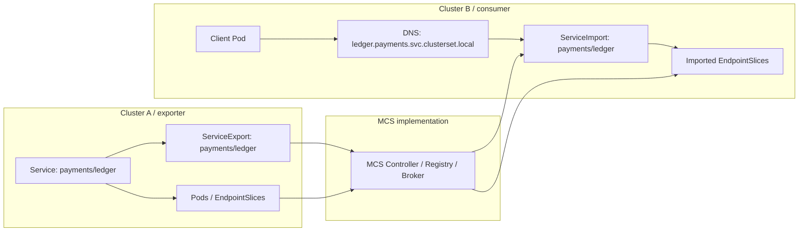
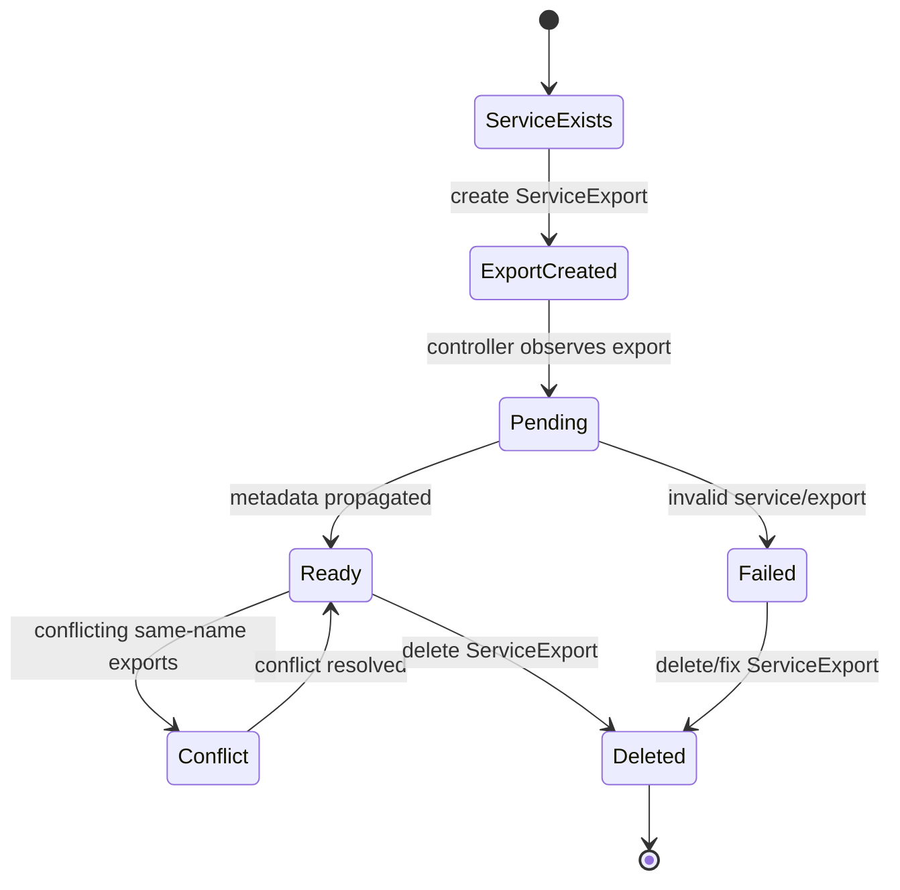
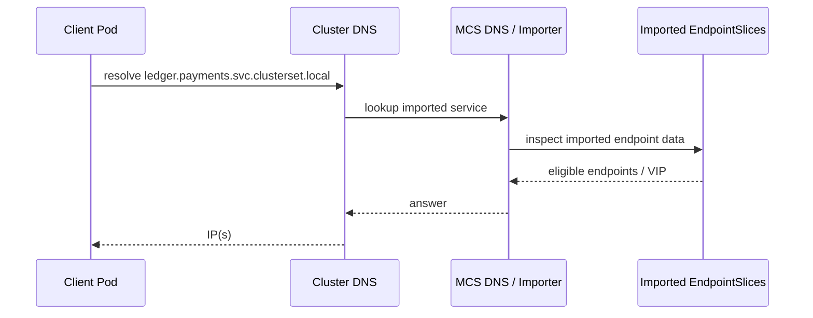
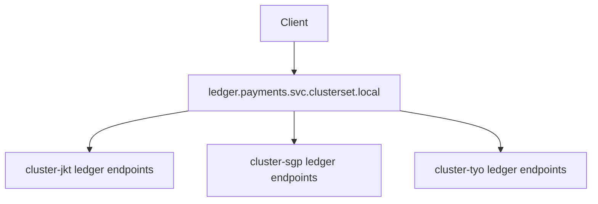
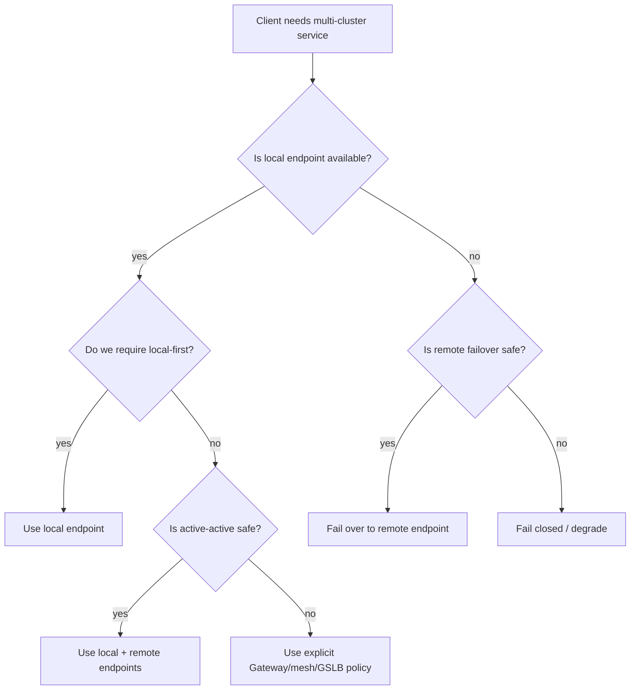
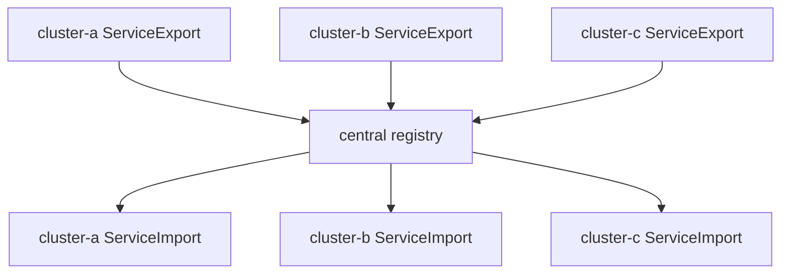
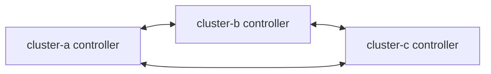

# Part 031 — Multi-Cluster Services API and Service Export/Import

## 1. Tujuan Part Ini

Part 030 membangun fondasi multi-cluster: boundary, topology, CIDR, identity, trust, policy, locality, dan failure domain. Part ini masuk ke API yang paling dekat dengan pengalaman developer: **Multi-Cluster Services API** atau **MCS API**.

Target part ini:

> Anda mampu menjelaskan, mendesain, mengoperasikan, dan men-debug service discovery lintas cluster menggunakan `ServiceExport`, `ServiceImport`, EndpointSlice lintas cluster, DNS `clusterset.local`, dan contract namespace sameness — tanpa menganggap MCS sebagai “magic global Service”.

Setelah part ini, Anda harus bisa menjawab:

- Apa problem yang diselesaikan MCS API?
- Apa yang *tidak* diselesaikan MCS API?
- Mengapa `ServiceExport` adalah intent, bukan dataplane?
- Bagaimana `ServiceImport` menjadi discovery surface untuk consumer cluster?
- Apa arti namespace sameness secara operasional?
- Bagaimana DNS `svc.clusterset.local` berbeda dari `svc.cluster.local`?
- Bagaimana EndpointSlice dipakai untuk menyebarkan backend lintas cluster?
- Bagaimana conflict terjadi ketika beberapa cluster mengekspor Service bernama sama?
- Bagaimana readiness, locality, failover, dan health diekspresikan?
- Kapan MCS cukup, dan kapan perlu Gateway, service mesh, GSLB, atau custom traffic manager?

---

## 2. Source Anchors

Materi ini memakai referensi utama berikut:

- SIG Multicluster: Multi-Cluster Services API Overview — `https://multicluster.sigs.k8s.io/concepts/multicluster-services-api/`
- SIG Multicluster: ServiceExport — `https://multicluster.sigs.k8s.io/api-types/service-export/`
- SIG Multicluster: ClusterSet — `https://multicluster.sigs.k8s.io/api-types/cluster-set/`
- SIG Multicluster: Namespace Sameness — `https://multicluster.sigs.k8s.io/concepts/namespace-sameness/`
- Kubernetes Enhancement Proposal KEP-1645 — `https://github.com/kubernetes/enhancements/tree/master/keps/sig-multicluster/1645-multi-cluster-services-api`
- Gateway API GEP-1748: Gateway API Interaction with Multi-Cluster Services — `https://gateway-api.sigs.k8s.io/geps/gep-1748/`
- MCS API repository — `https://github.com/kubernetes-sigs/mcs-api`

Fakta penting dari referensi tersebut:

- MCS API memperluas konsep Kubernetes Service lintas cluster.
- MCS dibangun di atas konsep **namespace sameness**.
- Intent MCS adalah membuat ClusterIP dan headless Service “bekerja seperti yang diharapkan” lintas cluster.
- `ServiceExport` menandai Service lokal untuk diekspor.
- `ServiceImport` dibuat di namespace yang sama pada cluster lain untuk merepresentasikan imported service.
- Tidak ada satu reference implementation universal; behavior operasional tetap bergantung pada implementation.
- GEP-1748 mendefinisikan bagaimana Gateway API dapat berinteraksi dengan MCS, misalnya Route backend mengarah ke imported service.

---

## 3. Kaufman Framing: MCS Skill = Decompose “Service” Across Clusters

Kesalahan umum:

```txt
Kita punya Service di cluster A. Pakai MCS supaya cluster B bisa call Service itu.
```

Itu benar sebagai niat awal, tetapi terlalu dangkal. Dalam produksi, pertanyaan yang lebih penting:

```txt
Apa yang dimaksud dengan “service yang sama” ketika instance-nya tersebar di banyak cluster?
```

Untuk belajar cepat ala Kaufman, pecah MCS menjadi primitive:

| Primitive | Pertanyaan Engineering |
|---|---|
| Export intent | Service mana yang boleh terlihat lintas cluster? |
| Import surface | Object apa yang dilihat consumer di cluster lokal? |
| Namespace sameness | Apakah namespace bernama sama punya ownership, policy, dan meaning yang sama? |
| ClusterSet | Cluster mana yang dianggap satu trust/management set? |
| DNS | Nama apa yang dipakai consumer? |
| Endpoint distribution | Bagaimana backend lintas cluster dikirim ke consumer? |
| Health/readiness | Apakah endpoint remote benar-benar eligible? |
| Conflict | Apa yang terjadi jika dua cluster mengekspor Service dengan nama sama tapi port/type berbeda? |
| Locality | Apakah traffic harus local-first, nearest, weighted, atau failover-only? |
| Security | Siapa boleh export, siapa boleh import, dan siapa boleh consume? |
| Observability | Bagaimana tahu request pergi ke cluster mana? |
| Failure | Apa yang terjadi jika exporter, importer, DNS, broker, controller, atau network antar cluster rusak? |

MCS bukan sekadar API. Ia adalah **service identity and discovery contract across cluster boundaries**.

---

## 4. Problem Statement: Cluster Boundary Membuat Service Menjadi Lokal

Dalam Kubernetes biasa:

```txt
client Pod -> DNS -> Service -> EndpointSlice -> Pod endpoint
```

Semua ini berlaku di dalam satu cluster. `Service` adalah object lokal. `EndpointSlice` adalah object lokal. DNS `svc.cluster.local` adalah namespace discovery lokal.

Ketika ada dua cluster:

```txt
cluster-a:
  namespace payments
  Service ledger
  Pods ledger-v1

cluster-b:
  namespace checkout
  Pod checkout-api
```

`checkout-api` di cluster B tidak otomatis tahu bahwa `ledger.payments.svc.cluster.local` ada di cluster A. Bahkan jika network routable, discovery metadata tetap tidak ada.

Tanpa MCS, solusi biasanya menjadi bespoke:

- hardcoded external DNS;
- ExternalName Service;
- custom CoreDNS forwarding;
- manually managed EndpointSlice;
- mesh ServiceEntry;
- cloud private DNS;
- global load balancer;
- custom controller;
- service registry tambahan.

Masalahnya bukan hanya teknis. Masalahnya adalah tidak ada **standard Kubernetes API** untuk berkata:

```txt
Service ini boleh diekspor dari cluster ini dan dikonsumsi sebagai service yang sama oleh cluster lain dalam satu ClusterSet.
```

MCS API mencoba membuat standard minimum untuk itu.

---

## 5. Core Mental Model

MCS API memperkenalkan dua object utama:



Interpretasi:

- `ServiceExport` dibuat di cluster yang memiliki Service sumber.
- MCS implementation melihat export intent.
- Implementation menyebarkan discovery metadata ke cluster lain.
- Consumer cluster melihat `ServiceImport` dan EndpointSlice import.
- Consumer memakai DNS `clusterset.local` atau backend object yang direpresentasikan oleh implementation.

Yang penting:

> MCS API mendefinisikan contract API dan behavior umum. Ia tidak mendefinisikan satu dataplane tunggal untuk semua environment.

Implementasi bisa memakai:

- broker/registry;
- cloud DNS;
- traffic director;
- direct EndpointSlice sync;
- CNI cluster mesh;
- Submariner/Lighthouse;
- Cilium ClusterMesh;
- cloud-provider specific fleet;
- custom controller.

---

## 6. ClusterSet: Boundary Kepercayaan dan Manajemen

**ClusterSet** adalah sekumpulan cluster yang diperlakukan sebagai satu set untuk fitur multi-cluster.

Secara operasional, ClusterSet biasanya berarti:

- ada otoritas manajemen bersama;
- ada trust relationship antar cluster;
- namespace sameness berlaku;
- service discovery dapat disebarkan;
- cluster identity bisa dipakai untuk telemetry dan policy;
- controller lintas cluster punya izin membaca/membuat object tertentu.

Ini bukan sekadar label.

Jika cluster masuk ClusterSet, Anda sedang membuat asumsi:

```txt
Cluster-cluster ini cukup saling percaya untuk berbagi informasi service discovery dan mungkin route traffic workload.
```

### 6.1 ClusterSet Anti-Pattern

| Anti-pattern | Dampak |
|---|---|
| Memasukkan semua cluster perusahaan ke satu ClusterSet | Blast radius terlalu besar. |
| Mencampur prod dan non-prod | Risiko data leak dan policy confusion. |
| Mencampur jurisdiction berbeda tanpa model data residency | Compliance boundary kabur. |
| ClusterSet tanpa owner jelas | Tidak ada pihak yang accountable saat export conflict. |
| ClusterSet tanpa inventory | Debugging menjadi “cluster mana saja yang terlibat?” |

### 6.2 ClusterSet Design Rule

Gunakan ClusterSet sebagai **operational trust set**, bukan sebagai convenience grouping.

Contoh boundary yang masuk akal:

| ClusterSet | Cluster |
|---|---|
| `prod-id-payments-apac` | Jakarta, Singapore, Tokyo payment clusters |
| `prod-id-public-api` | regional public API clusters untuk satu business domain |
| `migration-erp-v2` | old/new cluster selama migration window |
| `regulated-case-management` | cluster yang tunduk pada governance evidence yang sama |

Contoh boundary buruk:

```txt
clusterset: all-prod
clusters:
  - every-prod-cluster-in-every-region-every-team
```

Itu bukan design. Itu global blast radius.

---

## 7. Namespace Sameness

MCS bergantung pada konsep **namespace sameness**:

> Namespace dengan nama yang sama di cluster berbeda dianggap memiliki permissions dan characteristics yang konsisten.

Contoh:

```txt
cluster-a: namespace payments
cluster-b: namespace payments
cluster-c: namespace payments
```

Dalam ClusterSet, `payments` di ketiga cluster harus berarti domain/owner/policy yang sama.

### 7.1 Mengapa Ini Penting?

Karena `ServiceExport` dan `ServiceImport` bekerja berdasarkan namespaced name.

Jika cluster A mengekspor:

```txt
payments/ledger
```

maka cluster B mengimpor:

```txt
payments/ledger
```

Jika `payments` di cluster B sebenarnya dimiliki tim lain, MCS menciptakan ambiguity berbahaya:

```txt
payments di cluster-a = financial ledger team
payments di cluster-b = experimental payment UI team
```

Akibatnya:

- service discovery salah domain;
- RBAC tidak sejalan;
- NetworkPolicy tidak sejalan;
- ownership alert salah;
- compliance evidence salah;
- traffic bisa masuk ke domain yang tidak diharapkan.

### 7.2 Namespace Sameness Checklist

Sebelum mengaktifkan MCS untuk namespace:

| Check | Pertanyaan |
|---|---|
| Owner | Apakah owner namespace sama lintas cluster? |
| Purpose | Apakah namespace merepresentasikan bounded context yang sama? |
| RBAC | Apakah privilege admin/deployer konsisten? |
| Labels | Apakah label governance sama? |
| NetworkPolicy | Apakah default deny/allow setara? |
| Secrets | Apakah secret management compatible? |
| Compliance | Apakah data classification sama? |
| Observability | Apakah telemetry labels menggunakan domain yang sama? |
| Incident owner | Siapa on-call jika imported service rusak? |

### 7.3 Guardrail

Minimal guardrail:

- namespace owner registry;
- admission policy untuk `ServiceExport`;
- label wajib seperti `platform.company.com/namespace-owner`;
- `ServiceExport` hanya boleh dibuat oleh service owner;
- export hanya boleh dari namespace yang masuk allowlist;
- audit log untuk create/update/delete `ServiceExport`;
- policy yang melarang export dari namespace non-prod ke prod ClusterSet.

---

## 8. ServiceExport: Intent untuk Mengekspor Service

`ServiceExport` adalah CRD namespaced yang dibuat dengan nama sama seperti Service yang ingin diekspor.

Contoh minimal:

```yaml
apiVersion: multicluster.x-k8s.io/v1alpha1
kind: ServiceExport
metadata:
  name: ledger
  namespace: payments
```

Service lokal:

```yaml
apiVersion: v1
kind: Service
metadata:
  name: ledger
  namespace: payments
spec:
  selector:
    app: ledger
  ports:
    - name: http
      port: 8080
      targetPort: 8080
```

Makna:

```txt
Export Service payments/ledger dari cluster ini ke ClusterSet.
```

### 8.1 ServiceExport Bukan Service Baru

`ServiceExport` tidak otomatis berarti:

- public exposure;
- global load balancing;
- active-active failover;
- mTLS;
- authorization;
- traffic shifting;
- data replication;
- regional failover safety;
- backend health semantic sempurna.

Ia hanya intent API untuk membuat Service eligible untuk discovery lintas cluster.

### 8.2 ServiceExport Lifecycle



### 8.3 Export Eligibility Questions

Sebelum mengekspor Service, jawab:

| Question | Why it matters |
|---|---|
| Apakah Service stateless? | Active-active lebih aman untuk stateless. |
| Apakah Service membaca/menulis data lokal region? | Cross-region traffic bisa merusak consistency. |
| Apakah client idempotent? | Failover/retry lintas cluster butuh idempotency. |
| Apakah Service punya readiness akurat? | Endpoint remote hanya aman jika health benar. |
| Apakah Service aman dikonsumsi namespace lain? | Cross-cluster bukan berarti cross-team bebas. |
| Apakah latency remote acceptable? | Multi-cluster discovery bisa membuat call lebih lambat. |
| Apakah observability cluster-aware? | Debugging butuh tahu target cluster. |

---

## 9. ServiceImport: Local Representation untuk Imported Service

`ServiceImport` merepresentasikan Service yang diekspor ke ClusterSet.

Biasanya object ini dibuat oleh MCS controller di cluster consumer.

Mental model:

```txt
ServiceExport = publisher intent
ServiceImport = consumer discovery surface
```

### 9.1 Bentuk Konseptual

```yaml
apiVersion: multicluster.x-k8s.io/v1alpha1
kind: ServiceImport
metadata:
  name: ledger
  namespace: payments
spec:
  type: ClusterSetIP
  ips:
    - 10.42.0.17
  ports:
    - name: http
      protocol: TCP
      port: 8080
```

Beberapa implementation dapat membuat derived Service lokal agar kube-proxy/CoreDNS dapat memperlakukan imported service seperti Service lokal. Detail ini implementation-specific.

### 9.2 ServiceImport Type

Secara konseptual ada dua bentuk penting:

| Type | Makna |
|---|---|
| `ClusterSetIP` | Imported service punya virtual IP untuk ClusterSet. |
| `Headless` | Imported service tidak punya VIP; discovery mengarah ke endpoint individual. |

Gunakan `ClusterSetIP` saat client hanya butuh satu stable service name.

Gunakan headless-style discovery ketika client/protocol perlu melihat endpoint individual, misalnya beberapa stateful protocol. Namun, jangan otomatis menganggap headless multi-cluster aman untuk database quorum atau broker cluster. Discovery bukan consistency protocol.

---

## 10. DNS: `svc.clusterset.local`

MCS memperkenalkan domain discovery lintas ClusterSet:

```txt
<service>.<namespace>.svc.clusterset.local
```

Contoh:

```txt
ledger.payments.svc.clusterset.local
```

Bandingkan:

| DNS Name | Scope |
|---|---|
| `ledger.payments.svc.cluster.local` | Service lokal dalam satu cluster. |
| `ledger.payments.svc.clusterset.local` | Multi-cluster service dalam ClusterSet. |

### 10.1 Mental Model DNS



### 10.2 DNS Contract

`clusterset.local` bukan sekadar nama panjang. Ia menyatakan:

```txt
Saya secara eksplisit ingin multi-cluster service, bukan cluster-local service.
```

Ini penting. Jika aplikasi memakai `svc.cluster.local`, ia tetap memilih local Service. Jika memakai `svc.clusterset.local`, ia memilih ClusterSet service.

### 10.3 DNS Failure Modes

| Symptom | Possible Cause | Probe |
|---|---|---|
| `NXDOMAIN` untuk `clusterset.local` | ServiceExport belum ready / DNS plugin belum mendukung MCS | `kubectl get serviceexport,serviceimport` |
| DNS resolve tapi TCP gagal | Endpoint remote tidak reachable | `tcpdump`, flow logs, gateway/CNI status |
| DNS kadang mengarah ke remote saat local ada | locality policy implementation-specific | cek MCS controller docs |
| DNS stale setelah export dihapus | DNS cache/client cache/CoreDNS cache | cek TTL dan app resolver |
| Query explosion | client `ndots`, search domain, retry behavior | cek CoreDNS metrics |

---

## 11. EndpointSlice Lintas Cluster

Dalam Kubernetes modern, Service backend direpresentasikan melalui EndpointSlice. MCS memakai konsep yang mirip untuk membuat imported endpoints tersedia di cluster consumer.

ServiceExport dapat menyebabkan EndpointSlice untuk Service sumber direpresentasikan di cluster lain. Satu pola umum:

```txt
cluster-a exports payments/ledger
  -> endpoint data from cluster-a propagated
cluster-b imports payments/ledger
  -> EndpointSlice in cluster-b represents remote endpoints
```

### 11.1 EndpointSlice Harus Membawa Cluster Identity

Imported endpoint tanpa cluster identity adalah observability bug.

Anda perlu tahu:

- endpoint berasal dari cluster mana;
- region/zone mana;
- network mana;
- apakah endpoint local atau remote;
- apakah endpoint ready/serving/terminating;
- apakah path via gateway atau direct pod route.

### 11.2 Endpoint Eligibility

Endpoint remote harus dianggap eligible hanya jika:

- workload backing Pod ready;
- Service selector benar;
- EndpointSlice propagated;
- network path tersedia;
- policy mengizinkan traffic;
- protocol/port match;
- health semantics tidak stale;
- remote cluster tidak dalam degraded mode.

MCS API menyediakan building block discovery. Ia tidak otomatis memahami application-level correctness.

---

## 12. Combined Service: Beberapa Cluster Mengekspor Nama yang Sama

MCS memungkinkan beberapa cluster mengekspor Service dengan namespaced name yang sama.

Contoh:

```txt
cluster-jkt exports payments/ledger
cluster-sgp exports payments/ledger
cluster-tyo exports payments/ledger
```

Consumer melihat satu multi-cluster Service:

```txt
ledger.payments.svc.clusterset.local
```

Secara konseptual:



Ini berguna untuk:

- active-active stateless service;
- regional scale-out;
- migration old cluster ke new cluster;
- regional read-only service;
- failover discovery.

Namun berbahaya untuk:

- primary-only database writer;
- payment mutation service tanpa idempotency;
- service dengan sticky session lokal;
- service yang mengandalkan regional data locality;
- service yang punya schema/data version berbeda antar cluster.

### 12.1 Same Name Does Not Mean Same Behavior

Ini invariant penting:

> Dua Service bernama sama di namespace sama harus kompatibel secara contract, bukan hanya sama secara Kubernetes name.

Compatibility meliputi:

- API semantics;
- protocol;
- port names;
- TLS expectation;
- authn/authz;
- timeout behavior;
- idempotency;
- data consistency;
- version compatibility;
- observability labels;
- error contract.

---

## 13. Conflict Handling

Jika beberapa cluster mengekspor Service dengan namespaced name yang sama tetapi spec tidak kompatibel, conflict bisa terjadi.

Contoh conflict:

| Conflict | Example |
|---|---|
| Port conflict | cluster A port `8080`, cluster B port `9090` untuk name/protocol yang sama. |
| Type conflict | satu ClusterIP, satu headless. |
| SessionAffinity conflict | satu `ClientIP`, satu `None`. |
| Label/annotation export conflict | metadata exported berbeda. |
| Traffic policy conflict | internal traffic/locality setting berbeda. |
| IP family conflict | satu IPv4-only, satu dual-stack/IPv6-only. |

### 13.1 Conflict Is a Design Smell

Conflict bukan sekadar warning. Ia berarti platform tidak dapat membuktikan bahwa combined service punya behavior konsisten.

Production response:

1. Stop rollout jika conflict muncul.
2. Jangan mengandalkan precedence implementation sebagai safety mechanism.
3. Periksa semua `ServiceExport` dengan namespaced name sama.
4. Validasi Service spec, ports, protocol, session affinity, labels, annotations.
5. Pastikan version compatibility aplikasi.
6. Tambahkan admission policy untuk mencegah conflict berulang.

### 13.2 Example: Port Conflict

```yaml
# cluster-a
apiVersion: v1
kind: Service
metadata:
  name: ledger
  namespace: payments
spec:
  ports:
    - name: http
      port: 8080
      protocol: TCP
```

```yaml
# cluster-b
apiVersion: v1
kind: Service
metadata:
  name: ledger
  namespace: payments
spec:
  ports:
    - name: http
      port: 9090
      protocol: TCP
```

Walaupun dua-duanya bernama `ledger`, combined service tidak punya contract port yang jelas.

Correct pattern:

```txt
Jika semantik berbeda, beri nama berbeda:
  ledger-v1.payments.svc.clusterset.local
  ledger-v2.payments.svc.clusterset.local

Atau gunakan Gateway/Route untuk traffic migration eksplisit.
```

---

## 14. Locality and Traffic Distribution

MCS API menyediakan discovery lintas cluster. Namun policy distribusi traffic bergantung pada implementation.

Pertanyaan yang harus dijawab:

| Policy | Meaning |
|---|---|
| Local-first | Pakai endpoint cluster lokal jika ada, remote hanya fallback. |
| Nearest | Pilih region/zone terdekat. |
| Weighted | Bagi traffic berdasarkan bobot. |
| Failover-only | Remote hanya dipakai saat local unavailable. |
| Active-active | Semua endpoint eligible. |
| Cluster-specific | Path/host/header mengarah ke cluster tertentu. |

Jangan mengasumsikan MCS otomatis memilih traffic paling benar untuk bisnis Anda.

### 14.1 Locality Decision Tree



### 14.2 Regulatory Systems Rule

Untuk sistem regulasi/enforcement/case management:

> Default multi-cluster traffic harus fail-closed kecuali data consistency, audit trail, authorization, and jurisdiction constraints sudah eksplisit.

Contoh salah:

```txt
Case mutation API aktif di Jakarta dan Singapore tanpa region ownership rule.
```

Contoh lebih aman:

```txt
Reads dapat active-active.
Writes diarahkan ke region owner.
Failover write membutuhkan incident command + data consistency mode.
```

---

## 15. MCS vs Gateway vs Mesh vs GSLB

MCS sering disalahpahami sebagai pengganti semua global traffic system.

| Capability | MCS | Gateway API | Service Mesh | GSLB/DNS LB |
|---|---:|---:|---:|---:|
| Standard service export/import | Strong | Indirect | Implementation-specific | Weak |
| Cross-cluster service discovery | Strong | With MCS or implementation | Strong in mesh | DNS-level only |
| HTTP routing by path/header | Weak | Strong | Strong | Weak |
| mTLS workload identity | Not core | Not core | Strong | No |
| L7 policy | Not core | Strong | Strong | No |
| Global public ingress | Not core | Strong with controller | Sometimes | Strong |
| Internal east-west routing | Discovery-level | Increasing via GAMMA/MCS | Strong | Weak |
| Failover semantics | Implementation-specific | Controller-specific | Stronger | Strong but coarse |
| Traffic shaping | Limited | Strong | Strong | Coarse |
| Endpoint health | Basic/imported metadata | Controller-specific | Stronger | LB health checks |

Mental model:

```txt
MCS answers: What is the same service across clusters?
Gateway answers: How should traffic be routed to backends?
Mesh answers: How should service-to-service communication be secured, observed, and controlled?
GSLB answers: Where should client traffic enter globally?
```

---

## 16. Gateway API + MCS Interaction

GEP-1748 menjelaskan bahwa MCS dapat digunakan dalam Gateway API di tempat Service digunakan. Perbedaan utamanya: Service lokal menunjuk endpoint lokal; imported service dapat menunjuk endpoint dalam ClusterSet.

Konseptual:

```yaml
apiVersion: gateway.networking.k8s.io/v1
kind: HTTPRoute
metadata:
  name: ledger-route
  namespace: payments
spec:
  parentRefs:
    - name: internal-gateway
  rules:
    - matches:
        - path:
            type: PathPrefix
            value: /ledger
      backendRefs:
        - group: multicluster.x-k8s.io
          kind: ServiceImport
          name: ledger
          port: 8080
```

Catatan:

- Exact syntax dan support bergantung pada controller.
- Pastikan controller Anda mendukung MCS backend references.
- Jangan menganggap semua Gateway API implementation mendukung object MCS dengan cara sama.

### 16.1 Pattern: Regional Route by ServiceImport

```txt
/store/us -> store-us ServiceImport
/store/eu -> store-eu ServiceImport
/store/apac -> store-apac ServiceImport
```

Ini lebih eksplisit daripada satu global `store` jika aplikasi punya region-specific behavior.

### 16.2 Pattern: One Public Route, MCS Backend

```txt
client -> global Gateway -> HTTPRoute -> ServiceImport -> endpoints in ClusterSet
```

Bagus jika:

- service stateless;
- controller health-aware;
- observability cluster-aware;
- failover semantics diuji;
- conflict guardrail ada.

Berbahaya jika:

- backend region punya data berbeda;
- health check hanya L4;
- write request bisa pergi ke non-owner region;
- rollback tidak memutus traffic ke cluster bermasalah.

---

## 17. Implementation Models

MCS implementation biasanya jatuh ke beberapa model.

### 17.1 Central Registry/Broker



Kelebihan:

- global view sederhana;
- conflict detection lebih mudah;
- central audit point.

Risiko:

- registry menjadi dependency kritis;
- eventual consistency;
- outage registry bisa menghambat propagation;
- governance harus kuat.

### 17.2 Decentralized Sync



Kelebihan:

- tidak harus ada central broker tunggal;
- bisa lebih dekat ke cluster.

Risiko:

- conflict resolution lebih kompleks;
- debug propagation lebih sulit;
- version skew antar controller.

### 17.3 Cloud Fleet Control Plane

Cloud provider dapat menyediakan fleet/global control plane untuk MCS.

Kelebihan:

- integrasi DNS/firewall/LB lebih matang;
- health dan endpoint management terkelola.

Risiko:

- portability berkurang;
- behavior provider-specific;
- quota/cost/control plane failure harus dimodelkan.

### 17.4 CNI/Cluster Mesh-Based

CNI seperti Cilium ClusterMesh dapat menyatukan service discovery dan dataplane lintas cluster.

Kelebihan:

- tight integration dengan networking dataplane;
- identity/flow visibility bisa lebih baik;
- routing dan policy bisa lebih native.

Risiko:

- coupling ke CNI kuat;
- upgrade risk tinggi;
- debugging membutuhkan skill eBPF/CNI.

---

## 18. Production Export Policy

Jangan izinkan semua developer membuat `ServiceExport` sembarangan di prod.

### 18.1 Export Classification

| Class | Meaning | Required Review |
|---|---|---|
| Internal read-only | Data read non-sensitive / already replicated | App owner + platform |
| Internal mutation | Write side-effect | App owner + data owner + SRE |
| Regulated data | PII/case/enforcement/financial | Security + compliance + architecture review |
| Public path backend | Exposed via global ingress | Platform + security + API owner |
| Cross-jurisdiction | Cross-region/country | Legal/compliance + data residency owner |

### 18.2 Admission Policy Concept

Pseudo-policy:

```rego
package kubernetes.admission

deny[msg] {
  input.request.kind.kind == "ServiceExport"
  ns := input.request.namespace
  not namespace_has_label(ns, "platform.company.com/mcs-export-allowed", "true")
  msg := sprintf("namespace %s is not approved for ServiceExport", [ns])
}

deny[msg] {
  input.request.kind.kind == "ServiceExport"
  not user_in_group(input.request.userInfo, "platform-mcs-exporters")
  msg := "user is not allowed to create ServiceExport"
}
```

### 18.3 Required Labels

```yaml
metadata:
  labels:
    platform.company.com/owner: payments-platform
    platform.company.com/data-classification: restricted
    platform.company.com/export-class: internal-read
    platform.company.com/cluster-scope: prod-apac
```

---

## 19. Observability Contract

Untuk MCS, observability harus menjawab:

```txt
Dari cluster mana request berasal?
Ke cluster mana request pergi?
ServiceImport mana yang dipakai?
Endpoint remote mana yang dipilih?
Apakah endpoint local atau remote?
Apakah traffic via gateway, mesh, CNI tunnel, atau direct routing?
```

### 19.1 Required Labels

Standardisasi label telemetry:

| Label | Example |
|---|---|
| `source_cluster` | `jkt-prod-1` |
| `destination_cluster` | `sgp-prod-1` |
| `clusterset` | `prod-apac-payments` |
| `service_namespace` | `payments` |
| `service_name` | `ledger` |
| `service_import` | `payments/ledger` |
| `route_policy` | `local-first` |
| `network_path` | `east-west-gateway` |

### 19.2 Metrics

Minimal metrics:

- `mcs_serviceexport_ready`;
- `mcs_serviceexport_conflict`;
- `mcs_serviceimport_ready`;
- imported endpoint count by cluster;
- local vs remote request ratio;
- cross-cluster latency p50/p95/p99;
- cross-cluster error rate;
- DNS resolution errors for `clusterset.local`;
- propagation lag from export to import;
- stale endpoint age;
- cross-cluster bytes and cost.

### 19.3 Logs

Request log harus mengandung:

```json
{
  "source_cluster": "jkt-prod-1",
  "destination_cluster": "sgp-prod-1",
  "clusterset": "prod-apac-payments",
  "service": "payments/ledger",
  "service_import": "payments/ledger",
  "endpoint_cluster": "sgp-prod-1",
  "route_policy": "failover",
  "request_id": "...",
  "trace_id": "..."
}
```

Tanpa ini, multi-cluster incident berubah menjadi tebak-tebakan.

---

## 20. Debugging Playbook

Symptom:

```txt
Client di cluster B tidak bisa call ledger.payments.svc.clusterset.local
```

### 20.1 Check Export

```bash
kubectl --context cluster-a -n payments get svc ledger
kubectl --context cluster-a -n payments get serviceexport ledger -o yaml
```

Pertanyaan:

- Service ada?
- Service punya endpoint ready?
- `ServiceExport` ada?
- status `Ready` true?
- ada condition `Conflict` atau `Failed`?

### 20.2 Check Import

```bash
kubectl --context cluster-b -n payments get serviceimport ledger -o yaml
```

Pertanyaan:

- `ServiceImport` dibuat?
- type `ClusterSetIP` atau `Headless` sesuai expectation?
- ports benar?
- IPs ada jika ClusterSetIP?
- status condition sehat?

### 20.3 Check EndpointSlices

```bash
kubectl --context cluster-b -n payments get endpointslice \
  -l multicluster.kubernetes.io/service-name=ledger -o wide
```

Pertanyaan:

- endpoint remote muncul?
- cluster source bisa diidentifikasi?
- endpoint ready/serving?
- port/protocol benar?

### 20.4 Check DNS

```bash
kubectl --context cluster-b -n payments run -it --rm dns-debug \
  --image=registry.k8s.io/e2e-test-images/agnhost:2.45 \
  --restart=Never -- sh

nslookup ledger.payments.svc.clusterset.local
```

Pertanyaan:

- DNS resolve?
- record sesuai ServiceImport?
- TTL masuk akal?
- CoreDNS plugin/forwarding MCS aktif?

### 20.5 Check Network Reachability

```bash
curl -v http://ledger.payments.svc.clusterset.local:8080/healthz
```

Jika DNS resolve tapi connect timeout:

- cek firewall antar cluster;
- cek CNI cluster mesh;
- cek east-west gateway;
- cek NetworkPolicy;
- cek route table;
- cek security group;
- cek MTU;
- cek mTLS jika traffic via mesh.

### 20.6 Check Application Semantics

Jika connect sukses tapi response salah:

- apakah request pergi ke cluster yang benar?
- apakah data region cocok?
- apakah auth token valid di remote cluster?
- apakah version API kompatibel?
- apakah remote dependency tersedia?
- apakah request mutation idempotent?

---

## 21. Failure Mode Catalog

| Failure | Root Cause | Blast Radius | Detection | Mitigation |
|---|---|---|---|---|
| Missing import | Controller propagation gagal | Consumers remote | `ServiceImport` absent | controller health, retry, alert |
| Stale endpoint | EndpointSlice sync lag | Wrong routing | endpoint age metric | TTL, reconciliation, readiness gate |
| Export conflict | Spec mismatch same name | All consumers of combined service | condition `Conflict` | admission, contract testing |
| DNS stale | cache/TTL issue | Clients with cached record | DNS metrics/logs | shorter TTL, client resolver tuning |
| Remote path blocked | firewall/CNI/gateway issue | Cross-cluster calls | flow logs/connect timeout | network policy/firewall test |
| Locality violation | implementation default misunderstood | latency/cost/data residency | remote ratio metric | explicit routing policy |
| Split-brain write | active-active unsafe | data corruption | business invariant breach | region owner write routing |
| Namespace mismatch | namespace sameness broken | security/ownership | namespace registry audit | namespace governance |
| Controller outage | MCS controller down | propagation/control-plane | controller metrics | HA controller, SLO |
| ClusterSet overreach | too many unrelated clusters | global blast radius | architecture review | smaller ClusterSets |

---

## 22. Testing Matrix

### 22.1 Functional Tests

| Test | Expected Result |
|---|---|
| Export Service from cluster A | ServiceExport Ready. |
| Import appears in cluster B | ServiceImport exists. |
| DNS resolves in cluster B | `svc.clusterset.local` resolves. |
| Client in B calls A | Request succeeds. |
| Delete export | Import/endpoints eventually removed. |
| Change Service port | Conflict or propagated update handled predictably. |
| Make local endpoint unavailable | Remote failover behavior matches design. |
| Restore local endpoint | Locality returns to expected state. |

### 22.2 Failure Tests

| Fault | Expected Behavior |
|---|---|
| Kill MCS controller | Existing traffic continues if data plane independent; propagation alerts fire. |
| Break broker/registry | No silent stale success without alert. |
| Block cross-cluster network | DNS may resolve but traffic fails; clear alert path. |
| Remove remote endpoints | Imported endpoint count drops. |
| Create conflicting ServiceExport | Conflict condition and rollout block. |
| Delete namespace in one cluster | Import/export cleanup predictable. |

### 22.3 Regulatory/Compliance Tests

| Test | Expected Behavior |
|---|---|
| Attempt export from unapproved namespace | Denied by admission. |
| Attempt export restricted-data Service without approval label | Denied. |
| Cross-jurisdiction remote traffic | Blocked unless explicit exception. |
| Audit query for ServiceExport changes | Complete evidence trail. |
| Traffic log query by destination cluster | Complete cluster-aware traceability. |

---

## 23. Design Patterns

### 23.1 Migration Bridge Pattern

Use MCS to expose the same service from old and new clusters during migration.

```txt
old-cluster exports app/api
new-cluster exports app/api
clients resolve app.api.svc.clusterset.local
traffic policy gradually shifts or local-first uses nearest cluster
```

Guardrails:

- API compatibility tests;
- explicit traffic weights via Gateway/mesh if needed;
- no schema-incompatible rollout;
- telemetry by endpoint cluster;
- rollback tested.

### 23.2 Read-Replica Pattern

Use MCS for read-only service replicas.

```txt
catalog-read.catalog.svc.clusterset.local
```

Rules:

- service is read-only;
- stale read tolerance defined;
- write path not exposed via same combined service;
- response includes data freshness where needed.

### 23.3 Regional Owner Write Pattern

Expose region-specific names instead of one global write service.

```txt
case-write-jkt.case.svc.clusterset.local
case-write-sgp.case.svc.clusterset.local
```

Route based on case ownership.

Do not hide ownership semantics behind one global Service unless you have a strong consistency/leader election design.

### 23.4 Failover-Only Pattern

MCS discovery exists, but traffic manager only uses remote endpoints after declared failure.

```txt
normal: local endpoints only
incident: remote endpoint allowed
restore: drain remote writes, return local
```

This is common for regulated systems where correctness beats automatic failover.

---

## 24. Anti-Patterns

### 24.1 “Global Service” Without Contract

```txt
All regions export payments/api as one service.
```

No one defines:

- which requests are safe cross-region;
- which region owns write state;
- how auth propagates;
- what failover means;
- how audit trail records destination cluster.

This is not high availability. It is ambiguity at scale.

### 24.2 Exporting Stateful Primaries

Exporting database primary via MCS can make discovery easier but can also hide leader/follower semantics.

Safer:

- use database-native discovery/HA;
- expose read replicas separately;
- use explicit writer endpoint;
- integrate with failover controller.

### 24.3 Relying on DNS for Fine-Grained Traffic Shaping

DNS is coarse. Client caching can preserve old answers. Use Gateway/mesh/load balancer for request-level routing when precision matters.

### 24.4 Namespace Sameness by Naming Convention Only

Just because two namespaces are called `payments` does not make them the same operational domain. Enforce it.

---

## 25. Architecture Review Checklist

Sebelum approve MCS adoption:

### Scope

- [ ] ClusterSet purpose jelas.
- [ ] Cluster membership documented.
- [ ] Namespace sameness registry ada.
- [ ] Export owners jelas.
- [ ] Consumer owners jelas.

### Service Contract

- [ ] Service API compatible across exporting clusters.
- [ ] Ports/protocol/type consistent.
- [ ] Read/write semantics jelas.
- [ ] Data locality rules jelas.
- [ ] Version skew tolerated.

### Networking

- [ ] Cross-cluster reachability tested.
- [ ] Firewall/security group rules documented.
- [ ] CNI/gateway path known.
- [ ] MTU tested.
- [ ] Source/destination cluster visible.

### Security

- [ ] RBAC restricts `ServiceExport`.
- [ ] Admission policy validates namespace/export labels.
- [ ] NetworkPolicy/mesh policy handles remote traffic.
- [ ] mTLS/identity plan exists if needed.
- [ ] Audit evidence available.

### Reliability

- [ ] Readiness accurate.
- [ ] Endpoint propagation lag monitored.
- [ ] Failover behavior tested.
- [ ] Conflict detection alerts.
- [ ] Controller health alerts.

### Observability

- [ ] Metrics include cluster dimension.
- [ ] Logs include source/destination cluster.
- [ ] Traces cross cluster boundary.
- [ ] DNS query/error metrics collected.
- [ ] Incident dashboard exists.

---

## 26. Practice: Build a Mental Simulation

Ambil scenario:

```txt
ClusterSet: prod-apac-payments
Clusters: jkt-prod-1, sgp-prod-1
Namespace: payments
Service: ledger
Port: 8080
Mode: local-first read, explicit owner write
```

Jawab tanpa melihat dokumentasi:

1. Object apa dibuat di exporting cluster?
2. Object apa muncul di consuming cluster?
3. DNS name apa yang dipakai client?
4. Bagaimana tahu endpoint berasal dari cluster mana?
5. Apa yang terjadi jika cluster SGP juga mengekspor `payments/ledger` dengan port berbeda?
6. Bagaimana mencegah tim non-owner membuat ServiceExport?
7. Bagaimana membedakan local traffic dan remote failover di metrics?
8. Apakah write request aman active-active?
9. Bagaimana rollback jika export merusak traffic?
10. Apa dashboard minimum untuk on-call?

Jika jawaban Anda masih “tergantung tool”, itu benar tetapi belum cukup. Engineer top-tier akan menambahkan:

```txt
Tergantung implementation, maka kita harus mengunci implementation contract dan membuat test/observability untuk behavior yang kita butuhkan.
```

---

## 27. Key Takeaways

- MCS API memperluas konsep Service lintas cluster, tetapi tidak menghapus kebutuhan untuk desain traffic, security, dan consistency.
- `ServiceExport` adalah publisher intent; `ServiceImport` adalah consumer discovery surface.
- Namespace sameness adalah invariant keamanan dan ownership, bukan sekadar naming convention.
- `svc.clusterset.local` menyatakan konsumsi Service lintas ClusterSet secara eksplisit.
- Combined service aman hanya jika exporting Services kompatibel secara API, port, protocol, data semantics, dan operational behavior.
- Conflict condition harus dianggap production risk, bukan sekadar status noise.
- MCS cocok untuk discovery standard; Gateway/mesh/GSLB tetap diperlukan untuk routing, policy, identity, traffic shaping, dan global ingress yang lebih kaya.
- Untuk regulated systems, default multi-cluster mutation harus konservatif: explicit ownership, auditability, and fail-closed behavior.

---

## 28. What Comes Next

Part berikutnya membahas bagaimana MCS berinteraksi dengan Gateway, service mesh, dan global traffic routing:

```txt
learn-kubernetes-networking-traffic-part-032-multi-cluster-gateway-mesh-and-global-traffic-routing.mdx
```

Fokus berikutnya:

- global ingress;
- multi-cluster Gateway;
- regional routing;
- active-active vs active-passive;
- east-west gateway;
- multi-cluster mesh;
- DNS/GSLB;
- global failover;
- failure modelling untuk traffic lintas region.
