# Part 032 — Multi-Cluster Gateway, Mesh, and Global Traffic Routing

## 1. Tujuan Part Ini

Part 031 membahas MCS API: `ServiceExport`, `ServiceImport`, ClusterSet, namespace sameness, DNS `clusterset.local`, EndpointSlice, conflict, dan import/export lifecycle.

Part ini membahas lapisan di atasnya: **bagaimana traffic global benar-benar diarahkan ke cluster, region, service, dan workload yang tepat**.

Target part ini:

> Anda mampu mendesain global and multi-cluster traffic architecture menggunakan kombinasi Gateway API, MCS, service mesh, east-west gateway, DNS/GSLB, cloud load balancer, health-aware failover, locality, dan operational guardrails — tanpa menyamakan “multi-cluster” dengan “high availability otomatis”.

Setelah part ini, Anda harus bisa menjawab:

- Apa beda global ingress, multi-cluster Gateway, multi-cluster mesh, dan MCS?
- Kapan memakai DNS/GSLB, kapan memakai Gateway API, kapan memakai mesh?
- Bagaimana route public request ke region/cluster/service yang benar?
- Bagaimana east-west gateway berbeda dari north-south gateway?
- Apa desain active-active yang aman?
- Apa desain active-passive yang tidak memicu split-brain?
- Bagaimana health check dan readiness harus dibedakan?
- Bagaimana menghindari failover yang memperburuk outage?
- Bagaimana observability harus dibuat agar destination cluster/region terlihat?
- Bagaimana membuat design review untuk regulated global traffic?

---

## 2. Source Anchors

Materi ini memakai referensi utama berikut:

- Gateway API GEP-1748: Gateway API Interaction with Multi-Cluster Services — `https://gateway-api.sigs.k8s.io/geps/gep-1748/`
- Kubernetes Gateway API concepts — `https://kubernetes.io/docs/concepts/services-networking/gateway/`
- Gateway API project docs — `https://gateway-api.sigs.k8s.io/`
- SIG Multicluster MCS API Overview — `https://multicluster.sigs.k8s.io/concepts/multicluster-services-api/`
- Istio Deployment Models — `https://istio.io/latest/docs/ops/deployment/deployment-models/`
- Istio Primary-Remote Multicluster — `https://istio.io/latest/docs/setup/install/multicluster/primary-remote/`
- Istio Primary-Remote on Different Networks — `https://istio.io/latest/docs/setup/install/multicluster/primary-remote_multi-network/`
- Istio Multi-Primary on Different Networks — `https://istio.io/latest/docs/setup/install/multicluster/multi-primary_multi-network/`
- GKE Multi-Cluster Gateways — `https://docs.cloud.google.com/kubernetes-engine/docs/concepts/multi-cluster-gateways`

Fakta penting dari referensi tersebut:

- Gateway API dapat berinteraksi dengan MCS; imported multi-cluster service dapat digunakan sebagai backend di beberapa model controller.
- GEP-1748 masih berada di jalur experimental untuk interaksi Gateway API dan MCS.
- Istio multi-cluster punya model primary/remote, multi-primary, single-network, multi-network, dan external control plane.
- Untuk cluster di network berbeda, Istio memakai east-west gateway agar service lintas cluster bisa saling mencapai.
- Beberapa cloud provider menyediakan multi-cluster Gateway yang merekonsiliasi resource Gateway/HTTPRoute menjadi global/regional load balancing infrastructure.

---

## 3. Kaufman Framing: Global Traffic Skill = Separate Entry, Discovery, Routing, and Trust

Kesalahan umum:

```txt
Kita punya dua cluster. Taruh global load balancer di depan. Selesai.
```

Itu terlalu dangkal. Global traffic memiliki beberapa plane:

| Plane | Pertanyaan |
|---|---|
| Entry plane | Dari mana request pertama kali masuk? DNS, CDN, LB, Gateway? |
| Discovery plane | Bagaimana backend service ditemukan lintas cluster? MCS, mesh registry, cloud NEG, DNS? |
| Routing plane | Apa aturan pemilihan cluster/backend? local, nearest, weighted, failover? |
| Health plane | Apa definisi sehat? LB health, Pod readiness, app dependency, business readiness? |
| Trust plane | Bagaimana identity, mTLS, cert, and auth lintas cluster? |
| Policy plane | Siapa boleh expose, route, mirror, failover? |
| Data plane | Packet melewati apa? LB, gateway, proxy, tunnel, direct route? |
| Control plane | Siapa reconcile config dan apa blast radiusnya? |
| Observability plane | Bagaimana bukti request path dikumpulkan? |
| Failure plane | Apa yang terjadi saat satu plane rusak? |

Untuk skill top-tier, jangan mulai dari tool. Mulai dari **traffic invariant**.

---

## 4. Global Traffic Invariants

Sebelum memilih arsitektur, tulis invariants.

Contoh:

```txt
Invariant 1: Public API traffic must terminate TLS at approved edge only.
Invariant 2: Mutation request for a case must be routed to the owning region.
Invariant 3: Read-only catalog requests may be served by nearest healthy region.
Invariant 4: Failover must not send writes to a region with stale data ownership.
Invariant 5: Every request log must show source region, entry region, destination cluster, and service version.
Invariant 6: Global routing changes must be auditable and reversible.
```

Tanpa invariant, global routing hanya “best effort magic”.

---

## 5. Four Different Things People Confuse

### 5.1 MCS

MCS menjawab:

```txt
Apa service yang sama di banyak cluster, dan bagaimana cluster lain menemukan service itu?
```

### 5.2 Gateway API

Gateway API menjawab:

```txt
Bagaimana traffic dari listener tertentu diarahkan ke backend tertentu dengan aturan L4/L7?
```

### 5.3 Service Mesh

Service mesh menjawab:

```txt
Bagaimana service-to-service traffic diamankan, diamati, dan dikontrol dengan identity-aware policy?
```

### 5.4 GSLB / Global Load Balancing

GSLB menjawab:

```txt
Ke region/cluster mana client global diarahkan sebelum masuk ke Kubernetes?
```

### 5.5 Combined View

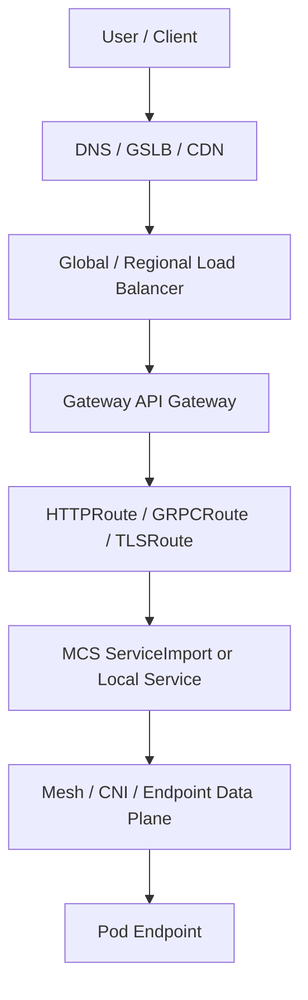

Setiap layer punya failure mode sendiri.

---

## 6. North-South Multi-Cluster Pattern

North-south berarti traffic dari luar platform masuk ke cluster.

### 6.1 Pattern A — DNS/GSLB to Per-Cluster Gateway

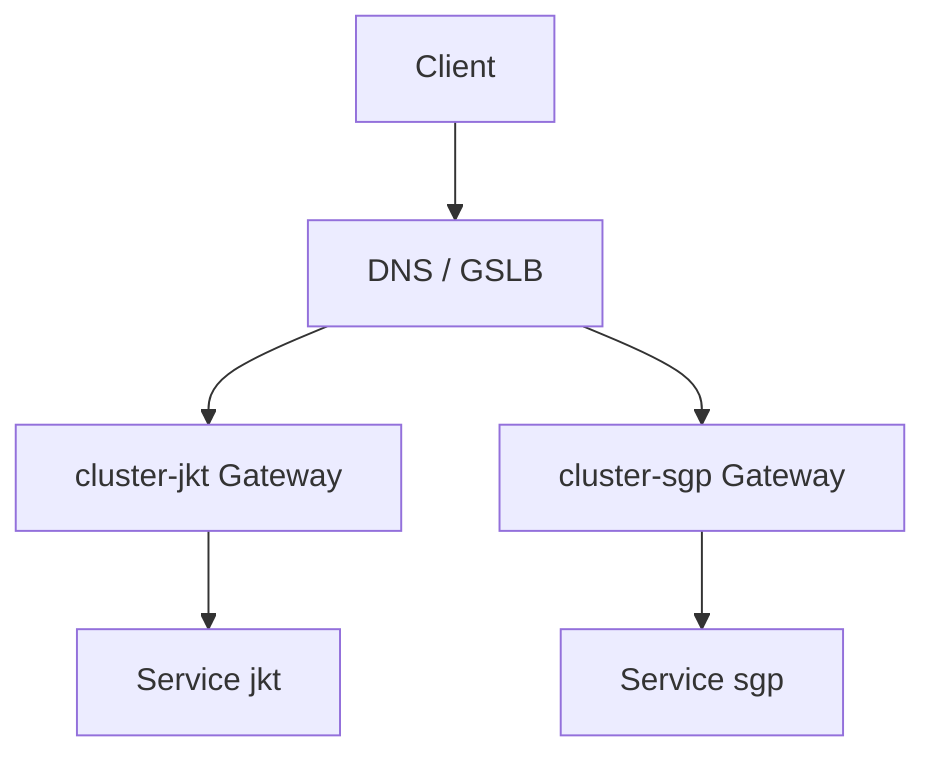

Kelebihan:

- sederhana secara konseptual;
- tiap cluster punya Gateway lokal;
- failure cluster bisa dikelola di DNS/GSLB;
- cocok untuk active-active regional edge.

Kekurangan:

- DNS caching membuat failover tidak instant;
- route config duplicated per cluster;
- consistency routing policy harus dijaga;
- health signal GSLB sering coarse;
- per-request traffic shaping terbatas.

Cocok untuk:

- service public stateless;
- region-local apps;
- latency-based routing;
- independent regional operations.

Tidak cocok untuk:

- strict per-request routing;
- immediate failover requirement;
- complex L7 policy global;
- one centralized route governance model.

### 6.2 Pattern B — Global LB to Multi-Cluster Gateway Controller

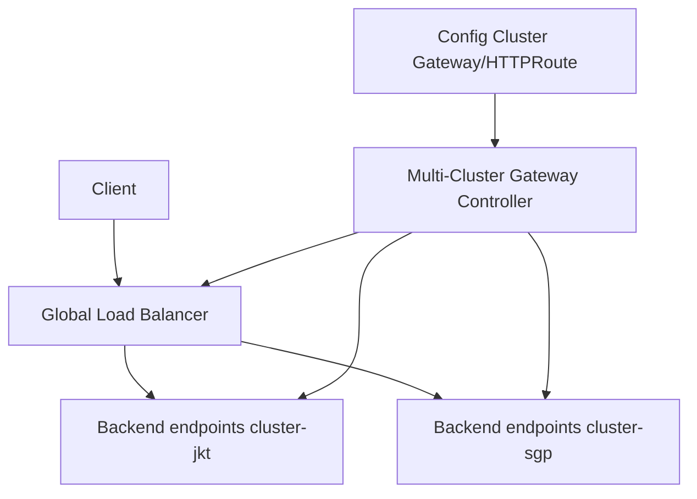

Dalam model ini, resource Gateway/Route dikonfigurasi di config cluster atau fleet control point. Controller merekonsiliasi global/regional LB dan backend multi-cluster.

Kelebihan:

- centralized traffic config;
- global LB dapat melakukan health-aware routing;
- bisa route langsung ke healthy Pods/endpoints;
- cocok untuk enterprise fleet.

Kekurangan:

- provider/controller-specific;
- config cluster menjadi control-plane dependency;
- portability lebih rendah;
- cloud quota/cost/limits perlu dimodelkan;
- behavior MCS/Gateway support harus diverifikasi.

Cocok untuk:

- organization dengan standard cloud fleet;
- public API multi-region;
- centralized edge governance;
- traffic mirroring/failover/capacity-aware LB jika didukung controller.

### 6.3 Pattern C — CDN/WAF/API Gateway Before Kubernetes Gateway

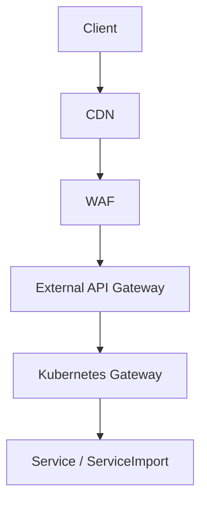

Kelebihan:

- strong public edge control;
- centralized authentication/rate-limit/WAF;
- Kubernetes Gateway fokus ke cluster/platform routing;
- cocok untuk API product management.

Kekurangan:

- double gateway complexity;
- timeout/retry mismatch;
- header/source IP propagation harus benar;
- tracing harus melewati semua layer.

Cocok untuk:

- regulated external APIs;
- partner/customer APIs;
- strong API governance.

---

## 7. East-West Multi-Cluster Pattern

East-west berarti traffic antar service internal.

### 7.1 Direct Pod-to-Pod Across Clusters

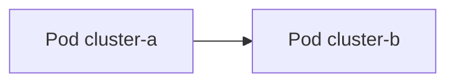

Kelebihan:

- low overhead;
- path sederhana jika network flat/routed;
- cocok untuk cluster dalam satu VPC/routed network.

Kekurangan:

- membutuhkan unique Pod CIDR;
- firewall antar cluster harus benar;
- identity/policy bisa sulit;
- source IP semantics harus jelas;
- blast radius jaringan lebih besar.

### 7.2 Gateway-Mediated East-West

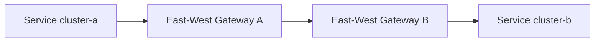

Kelebihan:

- tidak perlu direct pod routability;
- cocok untuk network berbeda;
- gateway menjadi enforcement/observability point;
- firewall bisa lebih sempit.

Kekurangan:

- gateway bottleneck;
- additional latency;
- capacity planning lebih penting;
- failure gateway dapat memutus cross-cluster traffic.

Istio memakai east-west gateway dalam multi-network multicluster agar workload antar cluster dapat berkomunikasi tidak langsung melalui gateway yang reachable antar network.

### 7.3 Mesh-Mediated East-West

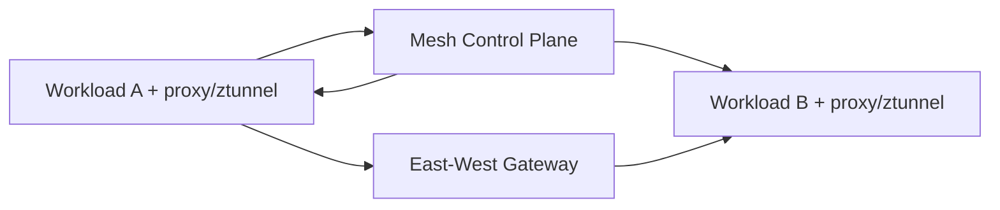

Kelebihan:

- identity-aware traffic;
- mTLS;
- service discovery lintas cluster;
- traffic policy;
- telemetry;
- locality/failover policy lebih kaya.

Kekurangan:

- mesh complexity;
- control plane access antar cluster;
- certificate/trust-domain design;
- upgrade/version skew;
- xDS/config propagation failure.

---

## 8. Istio Multi-Cluster Deployment Models

Istio membedakan beberapa model utama.

### 8.1 Primary Cluster

Cluster yang menjalankan control plane sendiri.

```txt
primary = has Istio control plane
```

### 8.2 Remote Cluster

Cluster tanpa control plane lokal yang dikelola oleh primary atau external control plane.

```txt
remote = data plane cluster, config from primary/external control plane
```

### 8.3 Single Network

Pod antar cluster dapat saling reach secara langsung.

```txt
cluster-a pod -> cluster-b pod direct
```

### 8.4 Multi-Network

Pod antar cluster tidak punya direct reachability. Traffic memakai east-west gateway.

```txt
cluster-a pod -> east-west gateway -> cluster-b service
```

### 8.5 Multi-Primary

Setiap cluster menjalankan control plane sendiri. Untuk endpoint discovery lintas cluster, control plane perlu mengamati API server cluster lain atau memakai remote secrets/attachment model.

### 8.6 Primary-Remote

Satu primary control plane mengelola remote cluster. Primary perlu akses ke API server remote untuk discovery dan authentication request.

### 8.7 External Control Plane

Control plane dipisah dari data plane clusters. Cocok untuk separation of duties, tetapi menambah dependency akses control plane eksternal.

### 8.8 Decision Matrix

| Model | Strength | Risk |
|---|---|---|
| Multi-primary same network | autonomy per cluster, direct path | config duplication, direct network blast radius |
| Multi-primary multi-network | autonomy + network isolation | east-west gateway complexity |
| Primary-remote same network | simpler centralized control | primary dependency |
| Primary-remote multi-network | centralized + isolated networks | control plane/gateway dependency |
| External control plane | management/data plane separation | external control plane reachability/SLO |

---

## 9. Multi-Cluster Gateway + MCS

Gateway API + MCS memberikan pola:

```txt
Route -> ServiceImport -> endpoints across ClusterSet
```

Contoh konseptual:

```yaml
apiVersion: gateway.networking.k8s.io/v1
kind: HTTPRoute
metadata:
  name: checkout
  namespace: storefront
spec:
  parentRefs:
    - name: public-gateway
  hostnames:
    - shop.example.com
  rules:
    - matches:
        - path:
            type: PathPrefix
            value: /checkout
      backendRefs:
        - group: multicluster.x-k8s.io
          kind: ServiceImport
          name: checkout
          port: 8080
```

Important caveat:

> Support untuk ServiceImport sebagai Gateway backend bergantung pada Gateway implementation/controller dan status GEP terkait masih perlu dicek terhadap controller yang dipakai.

### 9.1 Explicit Regional Backend Pattern

Daripada satu imported service global:

```yaml
backendRefs:
  - group: multicluster.x-k8s.io
    kind: ServiceImport
    name: checkout-jkt
    port: 8080
    weight: 90
  - group: multicluster.x-k8s.io
    kind: ServiceImport
    name: checkout-sgp
    port: 8080
    weight: 10
```

Gunakan jika:

- Anda perlu canary regional;
- Anda ingin traffic split eksplisit;
- Anda perlu emergency drain satu region;
- Anda perlu audit perubahan bobot.

### 9.2 Path-Based Regional Routing

```txt
/id/* -> cluster-jkt backend
/sg/* -> cluster-sgp backend
/jp/* -> cluster-tyo backend
```

Cocok untuk:

- jurisdiction routing;
- data residency;
- regional ownership;
- debugging yang jelas.

### 9.3 Implicit Nearest Routing

```txt
example.com/* -> nearest healthy cluster
```

Cocok untuk:

- stateless reads;
- cacheable content;
- low regulatory risk;
- cloud LB dengan health/locality support.

Tidak cocok untuk:

- write ownership ketat;
- case file mutation;
- region-bound authorization;
- data residency strict.

---

## 10. Active-Active Design

Active-active berarti lebih dari satu cluster/region melayani traffic secara bersamaan.

### 10.1 Active-Active Safe Candidates

| Workload | Active-active suitability |
|---|---|
| Static content | High |
| Idempotent read API | High |
| Stateless compute with replicated data | Medium-high |
| Search API with eventual consistency | Medium |
| Payment mutation | Low unless strongly designed |
| Case mutation workflow | Low unless ownership/sharding explicit |
| Primary database writer | Very low |

### 10.2 Required Invariants

Active-active aman hanya jika:

- data replication semantics jelas;
- conflict resolution jelas;
- request idempotency jelas;
- region ownership atau global consensus jelas;
- session/state externalized;
- retries tidak menggandakan side effect;
- auth/session valid lintas region;
- observability membedakan destination region;
- rollback bisa memutus region tertentu.

### 10.3 Active-Active Architecture

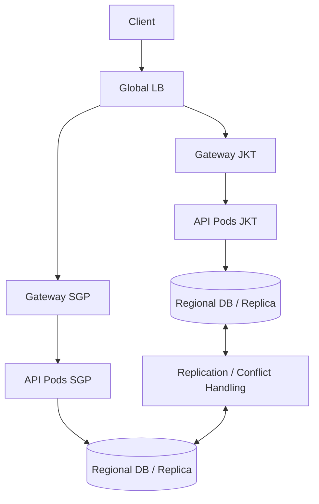

### 10.4 Active-Active Failure Modes

| Failure | Example | Consequence |
|---|---|---|
| Data conflict | same case updated in two regions | inconsistent enforcement record |
| Partial replication lag | read in SGP misses JKT write | user sees stale state |
| Asymmetric failover | JKT sends to SGP but SGP still sends to JKT | loops/overload |
| Auth skew | token valid in one region only | random 401/403 |
| Version skew | new API in one cluster only | random semantic errors |
| Sticky state | session local to region | login/logout inconsistency |

---

## 11. Active-Passive Design

Active-passive berarti satu region utama melayani traffic, region lain standby.

### 11.1 Architecture

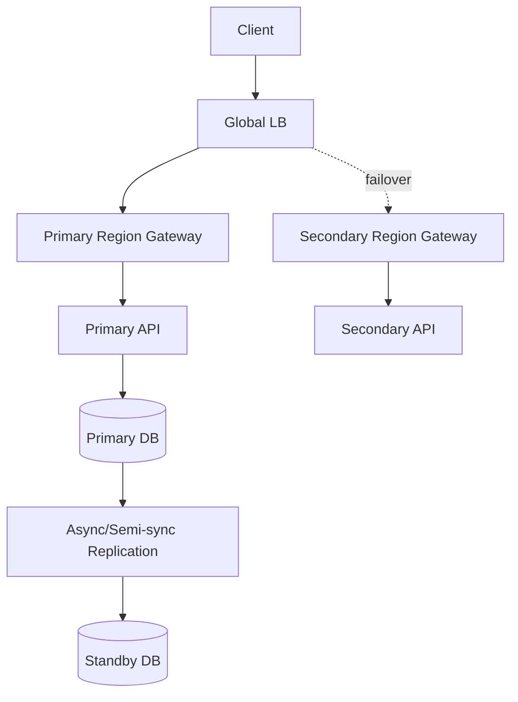

### 11.2 Active-Passive Questions

| Question | Why |
|---|---|
| Siapa trigger failover? | Automatic failover bisa berbahaya untuk writes. |
| Apa health threshold? | LB health != business health. |
| Apakah standby warm? | Cold standby RTO lebih lama. |
| Apakah data caught up? | Failover dengan lag bisa kehilangan data. |
| Bagaimana failback? | Failback sering lebih sulit dari failover. |
| Bagaimana DNS/LB propagation? | Client caching bisa tetap ke old primary. |
| Bagaimana audit? | Regulated system butuh evidence keputusan failover. |

### 11.3 Failover Is a State Machine

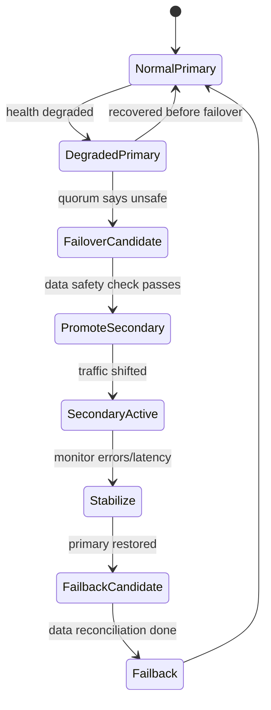

Treat failover as controlled operational workflow, not as a single DNS switch.

---

## 12. Health: The Most Common Lie in Global Routing

Global routing depends on health. But “healthy” is multi-layered.

| Health Type | Example | Problem |
|---|---|---|
| LB health | `/healthz` returns 200 | app dependencies may be broken |
| Pod readiness | Pod Ready true | regional dependency may be down |
| Gateway programmed | route accepted | backend may be bad |
| Mesh endpoint health | proxy sees endpoint | business operation may fail |
| Synthetic transaction | full user flow works | more expensive but more accurate |
| Business health | can create case/payment | hardest but most meaningful |

### 12.1 Health Contract

For global routing, define:

```txt
Liveness: should process be restarted?
Readiness: should Pod receive local traffic?
Regional readiness: should region receive user traffic?
Failover readiness: is secondary safe to accept traffic?
Business readiness: can critical transaction complete correctly?
```

### 12.2 Health Check Anti-Pattern

```yaml
readinessProbe:
  httpGet:
    path: /healthz
    port: 8080
```

`/healthz` hanya cek process hidup.

Untuk global failover, butuh probe yang menjawab:

- apakah DB connection sehat?
- apakah message broker reachable?
- apakah signing key tersedia?
- apakah regional dependency available?
- apakah data replication lag acceptable?
- apakah region allowed to serve writes?

Jangan membuat readiness terlalu berat untuk setiap Pod, tetapi jangan pakai probe dangkal sebagai global failover truth.

Solusi umum:

```txt
Pod readiness: local process + critical local dependency.
Regional health endpoint: aggregate service dependency + SLO condition.
Synthetic canary: end-to-end transaction outside hot path.
Traffic manager health: consumes regional health, not raw pod health only.
```

---

## 13. Locality, Capacity, and Cost

Global routing bukan hanya availability. Ia juga cost model.

### 13.1 Locality Policy

| Policy | Use Case | Risk |
|---|---|---|
| nearest | latency-sensitive reads | wrong for data residency |
| local-first | service-to-service regional dependency | remote failover must be safe |
| weighted | canary/migration | percentage != user/session distribution |
| capacity-aware | overloaded region protection | requires accurate capacity signal |
| failover-only | DR | RTO/RPO and split-brain complexity |

### 13.2 Cross-Region Cost

Perhatikan:

- inter-region data transfer;
- NAT gateway charges;
- load balancer data processing;
- logging/tracing volume;
- mesh proxy CPU/memory;
- cross-region retry amplification;
- duplicate synthetic checks.

### 13.3 Capacity-Aware Routing

Jika satu region capacity 30% dan region lain 70%, weighted traffic harus mencerminkan capacity, bukan sekadar equality.

```txt
region-jkt capacity: 40 units
region-sgp capacity: 80 units
initial weight: jkt 33%, sgp 67%
```

Tetapi capacity bukan static:

- node pool autoscaling lag;
- pod cold start;
- database pool capacity;
- dependency quota;
- regional outage degraded mode.

---

## 14. Multi-Cluster Mesh Traffic

Service mesh multi-cluster memberikan:

- service discovery lintas cluster;
- mTLS identity;
- authorization policy;
- L7 traffic management;
- telemetry;
- locality-aware load balancing;
- failover policy;
- east-west gateway for multi-network.

### 14.1 Mesh Control Plane Topology

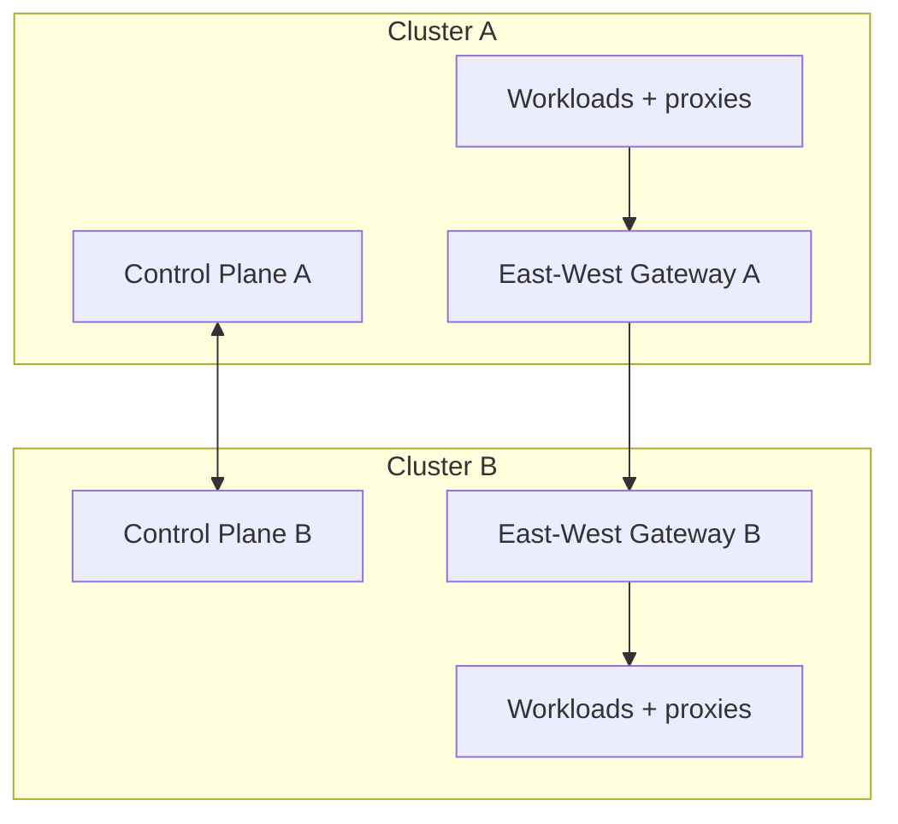

### 14.2 Mesh Locality Example

```txt
Prefer same zone
Then same region
Then remote region
Then fail closed if mutation not allowed
```

### 14.3 Mesh Failure Modes

| Failure | Symptom | Mitigation |
|---|---|---|
| Remote API server access lost | endpoint discovery stale | alert on control plane watch errors |
| East-west gateway down | cross-cluster traffic fails | HA gateway, regional route drain |
| Trust bundle mismatch | mTLS failure | trust-domain validation, cert monitoring |
| Config divergence | routes/policies differ | GitOps drift detection |
| Proxy overload | latency/error rise | capacity planning, sidecar/resource tuning |
| Endpoint stale | traffic to dead remote workloads | endpoint age metric |

### 14.4 Mesh Is Not a Data Consistency System

Even with perfect mTLS and routing, mesh cannot decide whether a write is semantically safe in remote region. That remains application/data architecture.

---

## 15. Gateway vs Mesh for Cross-Cluster Internal Traffic

| Need | Prefer Gateway | Prefer Mesh |
|---|---|---|
| Route HTTP by path/header between internal services | yes | yes |
| Workload identity/mTLS by default | possible but not core | strong |
| Fine-grained service-to-service authorization | limited/controller-specific | strong |
| Global public ingress | strong | not primary purpose |
| East-west L7 telemetry | controller-specific | strong |
| Minimize proxy footprint | maybe | depends on mesh mode |
| Platform team owns routing, app team owns routes | strong | possible |
| Strong portability across controllers | variable | variable by mesh |

Rule:

```txt
Gateway is a routing API.
Mesh is an identity/policy/telemetry fabric.
They can overlap, but they are not the same control surface.
```

---

## 16. Global DNS and GSLB

DNS/GSLB remains common because it is universal.

### 16.1 DNS-Based Failover

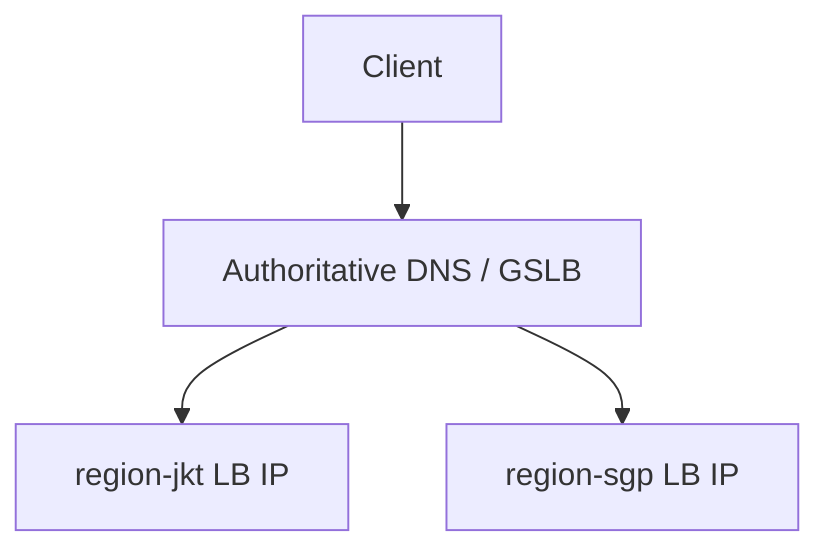

Kelebihan:

- works across providers;
- simple client entry;
- can do latency/geo/failover routing;
- no Kubernetes-specific dependency at client edge.

Kekurangan:

- caching/TTL;
- clients may ignore TTL;
- not request-level;
- failover propagation not instant;
- health may be coarse;
- weighted DNS does not guarantee exact traffic split.

### 16.2 DNS Rule

Use DNS/GSLB for:

- coarse region selection;
- public entry point;
- disaster failover;
- latency/geolocation selection.

Use Gateway/mesh/LB for:

- request-level routing;
- path/header routing;
- per-service policy;
- mTLS/identity;
- canary/mirroring;
- precise failover.

---

## 17. End-to-End Architecture Patterns

### 17.1 Public API, Multi-Region, Read-Heavy

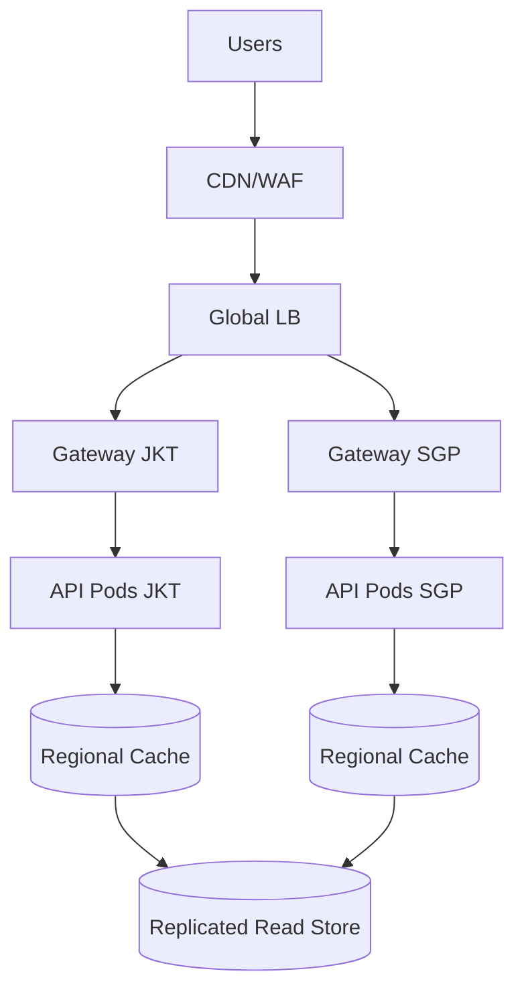

Design notes:

- active-active reads;
- regional cache;
- writes routed separately;
- CDN cache keys include safe dimensions;
- telemetry includes region/cluster.

### 17.2 Regulated Case Management

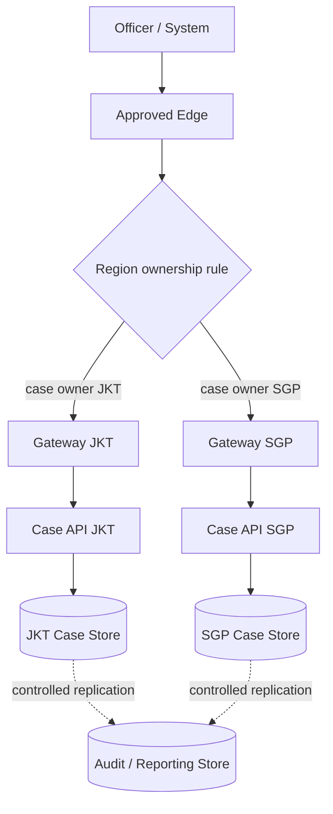

Design notes:

- write region decided by case ownership;
- no implicit nearest routing for mutations;
- cross-region failover requires state machine;
- audit trail records route decision;
- emergency override requires approval and evidence.

### 17.3 Internal Platform Service with MCS + Mesh

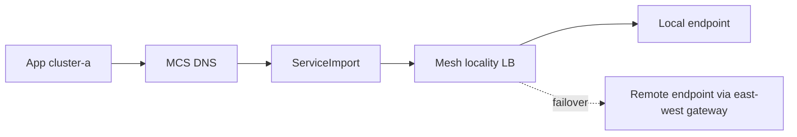

Design notes:

- MCS supplies discovery;
- mesh supplies mTLS/identity/policy/locality;
- failover remote only if policy allows;
- metrics show local vs remote.

---

## 18. Control Plane Failure Modelling

A global traffic architecture has many control planes.

| Control Plane | Example | Failure Effect |
|---|---|---|
| DNS/GSLB | authoritative DNS | stale or wrong region selection |
| Cloud LB controller | Gateway controller | route not reconciled |
| Kubernetes API | config cluster | no new route updates |
| MCS controller | export/import sync | imported endpoints stale/missing |
| Mesh control plane | istiod/linkerd/cilium | proxy config stale |
| Cert authority | SPIRE/Istio CA | mTLS rotation failure |
| GitOps | Argo/Flux | config drift or stuck rollout |

Rule:

> Existing dataplane may continue during control plane outage, but you must know which changes stop, which health data becomes stale, and when stale config becomes dangerous.

### 18.1 Control Plane SLO Questions

- What happens if config cluster is down?
- Can existing traffic continue?
- Can failover be triggered?
- Can bad route be rolled back?
- Can certificates rotate?
- Can endpoints update?
- Can health state refresh?
- How old can routing data be before fail-closed?

---

## 19. Data Plane Failure Modelling

| Data Plane | Failure | Symptom |
|---|---|---|
| CDN/WAF | edge block/misconfig | global 403/5xx |
| Global LB | bad backend health | traffic blackhole/wrong region |
| Gateway | overload/config error | 502/503/504 |
| East-west gateway | cross-cluster failure | local works, remote fails |
| Mesh proxy | xDS/cert/resource issue | service-specific failure |
| CNI | route/tunnel/policy issue | timeout/packet loss |
| DNS | stale/NXDOMAIN | client cannot resolve |
| NAT | port exhaustion | egress/inter-region timeout |

### 19.1 Blackhole Pattern

Common blackhole:

```txt
Global LB thinks region healthy -> Gateway accepts -> backend endpoints unhealthy -> requests fail.
```

Prevention:

- health checks should reflect backend availability;
- route should remove unhealthy backend cluster;
- synthetic checks must exercise critical path;
- Gateway should expose backend health metrics;
- failover logic must detect partial regional failure.

---

## 20. Failover Design

### 20.1 Automatic Failover Is Not Always Good

Automatic failover is safe when:

- workload stateless or data consistency safe;
- secondary has capacity;
- health signal accurate;
- no split-brain risk;
- failback plan tested.

Automatic failover is dangerous when:

- writes require single owner;
- replication lag can lose data;
- auth/session state not replicated;
- secondary dependency not warmed;
- false positive health can route to worse region.

### 20.2 Failover Decision Matrix

| Workload | Failover Mode |
|---|---|
| static read content | automatic |
| read-only catalog | automatic with stale-read budget |
| idempotent compute | automatic with capacity check |
| payment write | manual or guarded automatic |
| enforcement case mutation | manual/guarded with audit evidence |
| database writer | database-native failover only |

### 20.3 Failover Guardrail

Before shifting traffic:

- [ ] secondary region health green;
- [ ] dependency health green;
- [ ] capacity available;
- [ ] data replication lag acceptable;
- [ ] write ownership safe;
- [ ] route change approved or policy-authorized;
- [ ] telemetry ready;
- [ ] rollback path known;
- [ ] incident timeline recording active.

---

## 21. Traffic Mirroring and Shadowing Across Clusters

Mirroring can validate new region/cluster without impacting user response.

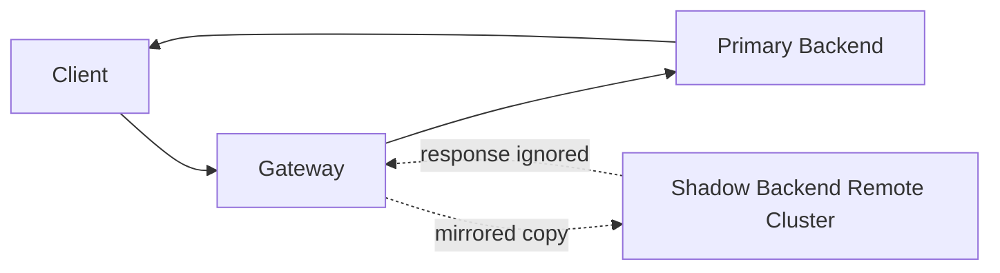

Rules:

- mirror only safe/idempotent traffic;
- never mirror non-idempotent writes unless backend is explicitly shadow-safe;
- strip or neutralize side-effect headers;
- isolate shadow database/output;
- mark traffic as shadow;
- alert on shadow errors separately;
- compare latency/semantic result offline.

Failure mode:

```txt
Mirrored production write triggers duplicate downstream side effect.
```

Mitigation:

- shadow service must reject external side effects;
- use read-only dependencies;
- replay sanitized traffic;
- add `X-Shadow-Traffic: true` and enforce it.

---

## 22. Security and Trust Boundaries

Global traffic crosses trust boundaries.

### 22.1 Trust Questions

- Where does public TLS terminate?
- Is traffic re-encrypted to cluster Gateway?
- Is backend TLS verified?
- Is service-to-service mTLS required?
- Are trust domains shared or federated?
- Can a workload in cluster A impersonate service in cluster B?
- Are auth policies cluster-local or global?
- Is emergency failover allowed to bypass normal policy?

### 22.2 Certificate Strategy

| Layer | Certificate Concern |
|---|---|
| CDN/WAF | public cert, customer domain |
| Global LB | edge cert or passthrough |
| Kubernetes Gateway | listener cert, namespace Secret boundary |
| Mesh | workload cert/SVID, trust domain |
| Backend app | app TLS, client verification |

### 22.3 Anti-Pattern: One Global Secret Everywhere

Copying the same TLS/private key to every cluster is operationally simple but risky:

- compromise blast radius global;
- rotation complexity;
- unclear ownership;
- audit difficulty.

Prefer:

- cert-manager with controlled issuer;
- Secret distribution policy;
- per-region cert where feasible;
- external secret manager;
- automated rotation;
- cert expiry alerting.

---

## 23. Governance Model

Global traffic changes should be treated like production code.

### 23.1 Ownership

| Resource | Typical Owner |
|---|---|
| GatewayClass | platform networking |
| Gateway | platform / environment owner |
| HTTPRoute/GRPCRoute | app owner with delegated domain |
| ServiceExport | service owner with platform approval |
| ServiceImport | controller-owned |
| Mesh policy | platform + service owner |
| Global DNS/GSLB | edge/platform networking |
| Failover policy | SRE + service owner + business owner |

### 23.2 Change Classes

| Change | Risk |
|---|---|
| Add route to new path | medium |
| Change backend weight | medium-high |
| Add new region backend | high |
| Enable active-active writes | critical |
| Change failover policy | critical |
| Modify GatewayClass/controller | high |
| Change trust domain/cert issuer | critical |

### 23.3 Required Evidence

For regulated systems:

- change request ID;
- route diff;
- approval record;
- rollout window;
- test result;
- synthetic check result;
- traffic metrics before/after;
- rollback command;
- incident link if emergency;
- post-change validation.

---

## 24. Observability for Global Traffic

### 24.1 Required Dimensions

Every edge/gateway/mesh log should preserve:

| Dimension | Example |
|---|---|
| `request_id` | globally unique ID |
| `trace_id` | distributed trace ID |
| `entry_region` | `ap-southeast-1` |
| `entry_cluster` | `sgp-edge-1` |
| `destination_region` | `ap-southeast-3` |
| `destination_cluster` | `jkt-prod-1` |
| `gateway` | `public-gateway` |
| `route` | `checkout-route` |
| `service` | `checkout/api` |
| `service_import` | `checkout/api` if MCS |
| `backend_version` | `v2026.07.01` |
| `failover_mode` | `normal`, `degraded`, `failover` |

### 24.2 Dashboards

Minimum dashboards:

- global request volume by region/cluster;
- 4xx/5xx by route/backend/cluster;
- p50/p95/p99 latency by entry and destination;
- local vs remote traffic ratio;
- failover state;
- health check status by region;
- Gateway programmed/accepted status;
- ServiceImport endpoint count by cluster;
- mesh mTLS error rate;
- east-west gateway saturation;
- cross-region data transfer cost;
- synthetic journey success.

### 24.3 Alerts

Good alerts:

```txt
Remote traffic ratio for mutation API > 0 outside approved failover window.
```

```txt
Global route checkout-route has 5xx > 2% in destination_cluster=jkt-prod-1 for 5m.
```

```txt
MCS imported endpoint age > 10m for payments/ledger in cluster sgp-prod-1.
```

Bad alerts:

```txt
HTTP 500 somewhere.
```

Global systems need dimensional alerts.

---

## 25. Debugging Playbook: User Sees Intermittent 503

Symptom:

```txt
Users in Singapore intermittently get 503 from shop.example.com/checkout.
```

### 25.1 Locate Entry

- Which DNS answer did client receive?
- Which CDN edge?
- Which global LB frontend?
- Which region/cluster Gateway?

### 25.2 Locate Route

```bash
kubectl --context config-cluster get gateway -A
kubectl --context config-cluster get httproute -A
kubectl --context config-cluster describe httproute checkout -n storefront
```

Check:

- `Accepted` condition;
- `ResolvedRefs`;
- backend refs;
- weights;
- route conflicts;
- programmed status.

### 25.3 Locate Backend

If backend is MCS:

```bash
kubectl --context sgp-prod-1 -n storefront get serviceimport checkout -o yaml
kubectl --context sgp-prod-1 -n storefront get endpointslice \
  -l multicluster.kubernetes.io/service-name=checkout -o wide
```

If backend is local Service:

```bash
kubectl --context sgp-prod-1 -n storefront get svc checkout
kubectl --context sgp-prod-1 -n storefront get endpointslice -l kubernetes.io/service-name=checkout
```

### 25.4 Inspect Gateway and Proxy Logs

Look for:

- upstream cluster;
- upstream host;
- reset reason;
- TLS handshake failure;
- no healthy upstream;
- timeout;
- circuit breaker overflow;
- route not found;
- mTLS SAN mismatch.

### 25.5 Check Regional Health

- Pod readiness;
- app dependency health;
- DB/broker/cache health;
- synthetic transaction;
- endpoint count by cluster;
- east-west gateway saturation;
- mesh control plane errors;
- cert expiry/rotation errors.

### 25.6 Decide Remediation

| Finding | Action |
|---|---|
| bad route config | rollback route/GitOps commit |
| one region bad | drain region / set weight 0 |
| imported endpoint stale | restart/fix MCS controller, fail closed if unsafe |
| east-west gateway overloaded | scale gateway, reduce remote traffic |
| dependency regional outage | trigger failover state machine |
| mTLS failure | rotate/fix trust bundle/cert policy |
| retry storm | reduce retry, enable load shedding |

---

## 26. Failure Mode Catalog

| Failure | Detection | Mitigation |
|---|---|---|
| DNS points to unhealthy region | synthetic checks fail by region | remove region from GSLB, lower TTL, fix health source |
| Gateway route accepted but backend dead | 503/no healthy upstream | endpoint health alert, route rollback |
| MCS import stale | endpoint age high | controller repair, fail closed for critical services |
| East-west gateway outage | remote traffic timeout | HA gateway, local-first, emergency drain |
| Mesh trust mismatch | mTLS errors | trust bundle validation, cert canary |
| Active-active split-brain | conflicting writes | stop remote writes, reconcile, owner routing |
| Config cluster outage | no route reconciliation | HA config cluster, break-glass process |
| False failover | secondary overloaded | capacity-aware health, staged failover |
| Global retry storm | traffic spikes after partial failure | retry budget, load shedding, circuit breaking |
| Observability blind spot | cannot identify destination cluster | enforce log schema before rollout |

---

## 27. Architecture Decision Framework

### 27.1 Start with Requirement

| Requirement | Likely Architecture |
|---|---|
| Low-latency global reads | DNS/GSLB + per-region Gateway |
| Centralized public edge governance | multi-cluster Gateway / cloud global LB |
| Internal service failover | MCS + mesh/locality policy |
| Cross-network service mesh | east-west gateways |
| Regulated regional writes | explicit region routing + manual/guarded failover |
| Migration between clusters | MCS + Gateway weighted routing |
| Strong identity-based service policy | service mesh |
| Provider-neutral basic discovery | MCS API implementation |

### 27.2 Then Define Invariants

Example for payment service:

```txt
- Reads can be served by nearest region if data freshness <= 5s.
- Writes must go to ledger owner region.
- Failover writes require declared incident state.
- Every mutation must include idempotency key.
- Destination cluster must be recorded in audit event.
```

### 27.3 Then Choose Control Surface

| Control Surface | Use For |
|---|---|
| DNS/GSLB | coarse global entry selection |
| Gateway API | L4/L7 routing into Kubernetes backends |
| MCS | service discovery across ClusterSet |
| Mesh | identity, mTLS, service policy, internal traffic control |
| GitOps | reproducible route/policy changes |
| Admission policy | guardrails for unsafe exposure/export |

### 27.4 Then Model Failure

For every route, document:

- what if source cluster down?
- what if destination cluster down?
- what if Gateway down?
- what if MCS stale?
- what if mesh control plane down?
- what if DNS stale?
- what if health check lies?
- what if failover starts and primary recovers?
- what if route rollback fails?

---

## 28. Capstone Exercise for This Part

Design this:

```txt
A regulated public API platform runs in three clusters:
- jkt-prod-1
- sgp-prod-1
- tyo-prod-1

Services:
- public-case-api: external API, read/write
- case-search-api: read-only, eventually consistent
- audit-ingest-api: internal write-only

Requirements:
- public reads should use nearest healthy region
- writes must go to case-owner region
- case-search can be active-active
- audit-ingest must never duplicate writes
- failover must be auditable
- every request must log destination cluster
```

Your design must specify:

1. DNS/GSLB strategy.
2. Gateway topology.
3. Route ownership model.
4. MCS usage, if any.
5. Mesh usage, if any.
6. Failover state machine.
7. Health model.
8. Observability dimensions.
9. Admission guardrails.
10. Anti-patterns explicitly rejected.

A strong answer will *not* say:

```txt
Use active-active everywhere.
```

A strong answer says:

```txt
Use active-active only where semantic correctness is safe. Use explicit regional routing for mutations. Use failover as governed state transition, not automatic DNS magic.
```

---

## 29. Key Takeaways

- Multi-cluster traffic architecture is not one technology; it is composition of entry, discovery, routing, health, trust, policy, dataplane, control plane, observability, and failure handling.
- MCS defines service discovery across clusters; Gateway API defines route attachment and traffic routing; service mesh defines identity-aware internal communication; DNS/GSLB defines coarse global entry.
- Global routing without business invariants is dangerous.
- Active-active is safe only when data semantics, idempotency, ownership, and rollback are designed.
- Active-passive failover is a state machine, not just a weight change.
- Health check quality determines routing correctness; shallow health checks cause false failover and blackholes.
- East-west gateway is a critical network/security/observability point in multi-network designs.
- For regulated systems, destination cluster/region must be part of the audit evidence.
- Controller support varies. Always test the actual Gateway/MCS/mesh implementation you deploy.

---

## 30. What Comes Next

Part berikutnya berfokus pada failure modelling dan debugging playbooks lintas seluruh seri:

```txt
learn-kubernetes-networking-traffic-part-033-failure-models-chaos-testing-and-debugging-playbooks.mdx
```

Fokus berikutnya:

- taxonomy failure Kubernetes networking;
- chaos testing;
- packet path debugging;
- Gateway/mesh/MCS incident playbooks;
- evidence collection;
- game day design;
- preventing random YAML debugging.
