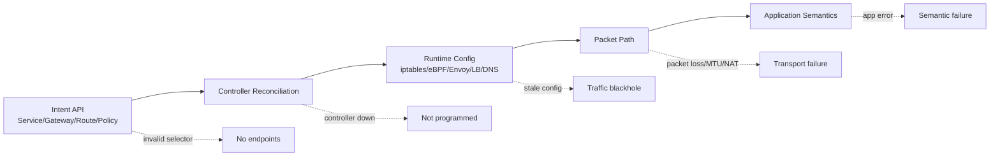
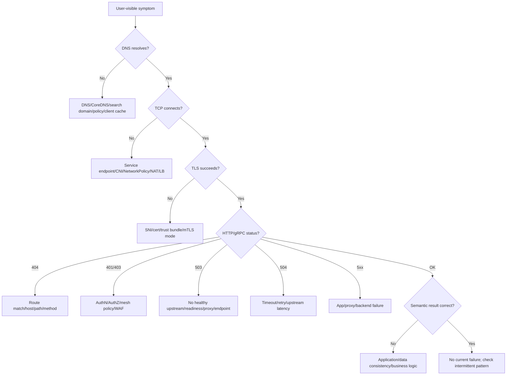

# Part 033 — Failure Models, Chaos Testing, and Debugging Playbooks

## 1. Tujuan Part Ini

Part 001 sampai Part 032 membangun stack Kubernetes networking dari bawah ke atas:

- Linux networking dan CNI.
- Pod networking dan Service VIP.
- DNS dan EndpointSlice.
- Ingress dan Gateway API.
- TLS, ReferenceGrant, policy attachment, dan controller portability.
- North-south dan east-west traffic.
- Service mesh, mTLS, SPIFFE, traffic shaping, resilience, observability, NetworkPolicy, egress, dan multi-cluster.

Part ini mengubah seluruh pemahaman itu menjadi **failure operating model**.

Target part ini:

> Anda mampu men-debug incident Kubernetes networking secara sistematis, memisahkan symptom dari failure domain, membuktikan hipotesis dengan evidence, menjalankan chaos experiment yang aman, dan menghasilkan playbook yang dapat dipakai ulang oleh tim platform, SRE, security, dan application engineering.

Yang ingin kita hindari:

```txt
Incident terjadi
  ↓
Semua orang menjalankan kubectl random
  ↓
Ada yang restart CoreDNS
  ↓
Ada yang edit Gateway
  ↓
Ada yang rollout ulang deployment
  ↓
Symptom berubah
  ↓
Root cause tidak pernah diketahui
  ↓
Incident yang sama muncul lagi bulan depan
```

Seorang engineer top-tier tidak hanya bertanya:

> “Apa YAML-nya benar?”

Ia bertanya:

> “Di failure domain mana traffic berhenti, evidence apa yang membuktikannya, blast radius-nya apa, mitigasi paling aman apa, dan invariant apa yang harus kita tambahkan agar failure ini tidak diam-diam kembali?”

---

## 2. Source Anchors

Materi ini memakai referensi utama berikut:

- Kubernetes Debug Services — `https://kubernetes.io/docs/tasks/debug/debug-application/debug-service/`
- Kubernetes Debug Pods — `https://kubernetes.io/docs/tasks/debug/debug-application/debug-pods/`
- Kubernetes Services, Load Balancing, and Networking — `https://kubernetes.io/docs/concepts/services-networking/`
- Kubernetes Service — `https://kubernetes.io/docs/concepts/services-networking/service/`
- Kubernetes DNS for Services and Pods — `https://kubernetes.io/docs/concepts/services-networking/dns-pod-service/`
- Kubernetes EndpointSlices — `https://kubernetes.io/docs/concepts/services-networking/endpoint-slices/`
- Kubernetes Network Policies — `https://kubernetes.io/docs/concepts/services-networking/network-policies/`
- Gateway API Troubleshooting and Status — `https://gateway-api.sigs.k8s.io/docs/concepts/troubleshooting/`
- Gateway API API Reference — `https://gateway-api.sigs.k8s.io/reference/api-spec/main/spec/`
- Istio Operations and Troubleshooting — `https://istio.io/latest/docs/ops/diagnostic-tools/`
- Envoy Admin Interface — `https://www.envoyproxy.io/docs/envoy/latest/operations/admin`
- Cilium Troubleshooting — `https://docs.cilium.io/en/stable/operations/troubleshooting/`
- Chaos Mesh Overview — `https://chaos-mesh.org/docs/`
- AWS Well-Architected Reliability Pillar — `https://docs.aws.amazon.com/wellarchitected/latest/reliability-pillar/welcome.html`

Fakta penting yang menjadi anchor:

- Kubernetes menyediakan task resmi untuk debugging Service, termasuk menjalankan command dari Pod agar melihat apa yang dilihat workload.
- Gateway API menekankan bahwa troubleshooting harus dimulai dari `status.conditions` object Gateway API.
- NetworkPolicy hanya efektif jika network plugin mendukung enforcement.
- Service, DNS, EndpointSlice, dan policy adalah object terpisah; object valid tidak menjamin packet path sehat.
- Chaos engineering harus memvalidasi hipotesis reliability, bukan sekadar “mematikan sesuatu” untuk terlihat canggih.

---

## 3. Kaufman Framing: Debugging Is a Skill, Not a Heroic Mood

Dalam framework Kaufman, skill kompleks harus didekonstruksi menjadi sub-skill yang bisa dilatih.

Untuk Kubernetes networking, debugging bisa dipecah menjadi enam sub-skill:

| Sub-skill | Pertanyaan Utama | Output |
|---|---|---|
| Symptom framing | Apa yang user atau system lihat? | Incident statement |
| Failure domain isolation | Layer mana yang rusak? | Narrowed fault domain |
| Evidence collection | Bukti apa yang mendukung atau menolak hipotesis? | Evidence bundle |
| Safe mitigation | Perubahan apa yang mengurangi impact tanpa memperbesar blast radius? | Mitigation action |
| Root cause analysis | Kenapa sistem mengizinkan failure itu terjadi? | Causal chain |
| Learning loop | Guardrail apa yang mencegah recurrence? | Test, policy, alert, runbook |

Tujuan 20 jam deliberate practice bukan menghafal semua command. Tujuannya adalah membangun **debugging reflex**:

```txt
Symptom → Hypothesis → Evidence → Narrowing → Mitigation → Root cause → Guardrail
```

---

## 4. Core Mental Model: Packet Path + Control Path + Intent Path

Jangan debug Kubernetes networking sebagai satu sistem monolitik. Pecah menjadi tiga path.

### 4.1 Intent Path

Intent path adalah deklarasi yang Anda tulis:

- `Service`
- `EndpointSlice`
- `Ingress`
- `Gateway`
- `HTTPRoute`
- `GRPCRoute`
- `TCPRoute`
- `NetworkPolicy`
- `AuthorizationPolicy`
- `VirtualService`
- `DestinationRule`
- `ServiceExport`
- `ServiceImport`

Intent path menjawab:

> “Apa yang kita inginkan?”

### 4.2 Control Path

Control path adalah proses controller membaca intent lalu mengubahnya menjadi konfigurasi runtime:

- kube-controller-manager membuat EndpointSlice.
- kube-proxy membaca Service dan EndpointSlice.
- CoreDNS membaca Service dan Endpoint data.
- Gateway controller membaca Gateway dan Route.
- Mesh control plane membuat proxy config.
- CNI agent membuat route, policy, atau eBPF map.
- Cloud controller manager membuat load balancer.

Control path menjawab:

> “Apakah intent sudah diterjemahkan menjadi state yang bisa dipakai dataplane?”

### 4.3 Packet Path

Packet path adalah realitas:

- DNS query.
- TCP handshake.
- TLS handshake.
- HTTP/2 stream.
- Proxy forwarding.
- CNI routing.
- Node NAT.
- Conntrack.
- Endpoint selection.
- Application response.

Packet path menjawab:

> “Apakah paket benar-benar sampai, diterima, diproses, dan dibalas?”

### 4.4 Debugging Rule

```txt
Jangan percaya intent sampai control path membuktikan intent diterima.
Jangan percaya control path sampai packet path membuktikan traffic berjalan.
Jangan percaya packet success sampai user-visible semantic success terbukti.
```

Mermaid model:



---

## 5. Failure Taxonomy

Top-tier debugging dimulai dari taxonomy, bukan command.

### 5.1 Failure by Layer

| Layer | Example Symptom | Common Root Cause |
|---|---|---|
| DNS | `could not resolve host` | CoreDNS overload, wrong namespace, `ndots`, blocked DNS egress |
| Service selection | Service exists but no traffic | Selector mismatch, no ready endpoint |
| Endpoint lifecycle | Intermittent 503 during deploy | readiness too early, termination drain wrong |
| Node dataplane | Only some nodes fail | kube-proxy/eBPF map stale, conntrack issue, CNI agent broken |
| CNI routing | cross-node Pod traffic fails | overlay issue, MTU mismatch, route propagation failure |
| NetworkPolicy | timeout after policy rollout | missing DNS/health/mesh exceptions |
| Gateway attachment | Route not served | `Accepted=False`, wrong listener, namespace not allowed |
| TLS | handshake failure | SNI mismatch, expired cert, wrong trust bundle |
| Mesh identity | 403/503 from proxy | mTLS mode mismatch, policy deny, stale xDS |
| Resilience policy | cascading failure | retry storm, timeout mismatch, circuit breaker misconfigured |
| Multi-cluster | only remote region fails | MCS import stale, east-west gateway down, trust domain mismatch |

### 5.2 Failure by Plane

| Plane | What Fails | Debug Evidence |
|---|---|---|
| API plane | Object invalid, rejected, conflict | `kubectl describe`, status conditions, events |
| Control plane | Controller cannot reconcile | controller logs, status, metrics, leader election |
| Data plane | Runtime cannot forward | packet capture, proxy config, eBPF maps, iptables, conntrack |
| Identity plane | Workload cannot prove identity | cert chain, SPIFFE ID, trust bundle, mTLS mode |
| Policy plane | Traffic denied or allowed incorrectly | policy objects, audit logs, proxy deny logs, flow logs |
| Discovery plane | Client resolves wrong destination | DNS result, service import, EndpointSlice, client cache |
| Observability plane | Failure invisible | missing labels, high cardinality, sampled trace gap |

### 5.3 Failure by Time Pattern

| Pattern | Meaning | Example |
|---|---|---|
| Constant | Always fails | wrong selector, missing route, invalid cert |
| Intermittent | Some requests fail | endpoint readiness, node-specific dataplane, conntrack |
| Periodic | Fails at interval | cert rotation, DNS TTL, controller resync, autoscaler cycle |
| Load-dependent | Fails under traffic | CoreDNS saturation, NAT port exhaustion, proxy memory |
| Deploy-correlated | Fails during rollout | readiness/termination, connection drain, canary route |
| Region-correlated | Fails by geography | GSLB, cross-region latency, local gateway health |

---

## 6. First 10 Minutes of a Networking Incident

Pada incident nyata, waktu awal sangat mahal. Tujuan 10 menit pertama bukan root cause sempurna, tetapi **impact containment dan failure domain narrowing**.

### 6.1 Incident Statement Template

```txt
Since: <time>
Who is affected: <users/services/regions/namespaces>
Symptom: <timeout/5xx/403/DNS/TLS/latency>
Entry point: <public gateway/internal service/mesh/multi-cluster>
Blast radius: <single route/single namespace/single node/single region/global>
Current mitigation: <none/rollback/scale/traffic shift/disable route>
Unknowns: <what we still need to prove>
```

Example:

```txt
Since: 10:07 UTC
Who is affected: mobile-api users in ap-southeast-1
Symptom: 40% HTTP 503 from checkout-api
Entry point: public Gateway api-gw / HTTPRoute checkout-route
Blast radius: route-level, not all services
Current mitigation: canary weight reduced from 20% to 0%
Unknowns: whether 503 is Gateway backend failure, mesh mTLS failure, or app readiness issue
```

### 6.2 Initial Triage Questions

Ask in order:

1. Is it name resolution, connection, TLS, HTTP, or application semantic failure?
2. Is it one client, one namespace, one service, one node, one zone, one cluster, or global?
3. Did anything change recently?
4. Is the route/control object accepted and programmed?
5. Are there ready endpoints?
6. Does traffic fail from inside the cluster too?
7. Does traffic fail when bypassing Gateway/mesh?
8. Is policy blocking it?
9. Are only new pods affected?
10. Are only remote clusters/regions affected?

### 6.3 Do Not Start With These Actions

Avoid reflex actions unless impact requires emergency mitigation:

- Restarting CoreDNS without evidence.
- Restarting all app pods.
- Deleting EndpointSlices.
- Editing multiple Gateway/Route objects simultaneously.
- Disabling NetworkPolicy globally.
- Turning off mTLS globally.
- Scaling every component randomly.
- Flushing conntrack on all nodes without blast-radius analysis.

These actions destroy evidence and may increase blast radius.

---

## 7. Evidence Bundle Standard

For regulated systems and serious production environments, every incident should produce an evidence bundle.

### 7.1 Minimum Evidence

```txt
incident/
  00-summary.md
  01-timeline.md
  02-impact.md
  03-recent-changes.md
  04-kubernetes-objects/
  05-status-conditions/
  06-events/
  07-controller-logs/
  08-dataplane-evidence/
  09-packet-captures/
  10-metrics-screenshots-or-exports/
  11-traces/
  12-mitigation-actions.md
  13-root-cause.md
  14-follow-ups.md
```

### 7.2 Commands to Capture Baseline

```bash
kubectl get ns
kubectl get nodes -o wide
kubectl get pods -A -o wide
kubectl get svc -A -o wide
kubectl get endpointslices -A
kubectl get events -A --sort-by=.lastTimestamp
```

Gateway API:

```bash
kubectl get gatewayclass -A
kubectl get gateway -A
kubectl get httproute -A
kubectl get grpcroute -A
kubectl get tcproute -A
kubectl get tlsroute -A
kubectl get referencegrant -A
```

Describe the precise object:

```bash
kubectl -n <namespace> describe gateway <gateway>
kubectl -n <namespace> describe httproute <route>
kubectl -n <namespace> describe svc <service>
kubectl -n <namespace> describe endpointslice -l kubernetes.io/service-name=<service>
```

Mesh:

```bash
istioctl proxy-status
istioctl analyze -A
istioctl proxy-config clusters <pod> -n <namespace>
istioctl proxy-config routes <pod> -n <namespace>
istioctl proxy-config listeners <pod> -n <namespace>
istioctl proxy-config endpoints <pod> -n <namespace>
```

Cilium examples:

```bash
cilium status
cilium connectivity test
cilium service list
cilium endpoint list
hubble observe --namespace <namespace>
```

Node-level examples:

```bash
ip route
ip addr
ss -antp
conntrack -S
iptables-save | head
nft list ruleset | head
tcpdump -ni any host <ip>
```

---

## 8. Debugging Decision Tree

A practical decision tree:



---

## 9. Playbook: DNS Failure

### 9.1 Symptoms

- `no such host`
- `Temporary failure in name resolution`
- high latency before every outbound request
- intermittent timeout with low app CPU
- only some namespaces affected
- only Java/Go/Node clients affected due to caching/resolver behavior

### 9.2 Hypotheses

| Hypothesis | Evidence |
|---|---|
| CoreDNS unavailable | CoreDNS pods not ready, errors, high CPU |
| DNS egress blocked | NetworkPolicy denies UDP/TCP 53 to kube-dns |
| wrong namespace resolution | query resolves unexpected service |
| `ndots` amplification | many search-domain queries per request |
| NodeLocal DNSCache issue | affected only on nodes with cache failure |
| client cache stale | DNS correct from debug pod but app still wrong |

### 9.3 Commands

```bash
kubectl -n kube-system get pods -l k8s-app=kube-dns -o wide
kubectl -n kube-system logs deploy/coredns --tail=200
kubectl -n kube-system describe svc kube-dns
kubectl -n kube-system get endpointslices -l kubernetes.io/service-name=kube-dns
```

Run from same namespace:

```bash
kubectl run -n <namespace> dns-debug \
  --rm -it --restart=Never \
  --image=registry.k8s.io/e2e-test-images/agnhost:2.45 \
  -- /bin/sh
```

Inside pod:

```bash
cat /etc/resolv.conf
nslookup <service>
nslookup <service>.<namespace>.svc.cluster.local
time nslookup <service>.<namespace>.svc.cluster.local
```

### 9.4 Packet Capture

```bash
tcpdump -ni any port 53
```

Look for:

- query sent but no response
- repeated search domain attempts
- TCP fallback
- high DNS response time
- SERVFAIL/NXDOMAIN

### 9.5 Common Fixes

| Root Cause | Safer Fix |
|---|---|
| NetworkPolicy blocks DNS | Add explicit DNS egress to kube-dns/CoreDNS |
| CoreDNS saturated | scale CoreDNS, tune cache, deploy NodeLocal DNSCache |
| bad service name | use FQDN or correct namespace |
| client cache stale | restart only affected clients or lower TTL design |
| `ndots` amplification | use FQDN for external calls, tune resolver when justified |

### 9.6 Anti-pattern

```txt
Restarting CoreDNS every time DNS feels slow.
```

This hides whether the problem is query volume, policy, node-level cache, or client resolver behavior.

---

## 10. Playbook: Service Exists but Traffic Fails

### 10.1 Symptoms

- `curl service:port` times out
- Service has ClusterIP but no response
- Gateway returns `503 no healthy upstream`
- some pods can reach service, others cannot
- only cross-node traffic fails

### 10.2 Object Chain

```txt
Service selector
  → Pod labels
  → EndpointSlice addresses
  → Endpoint readiness
  → kube-proxy/eBPF service table
  → CNI route
  → Pod listener
```

### 10.3 Commands

```bash
kubectl -n <ns> get svc <svc> -o yaml
kubectl -n <ns> get pods --show-labels
kubectl -n <ns> get endpointslices -l kubernetes.io/service-name=<svc> -o yaml
kubectl -n <ns> describe svc <svc>
```

Check app listening:

```bash
kubectl -n <ns> exec <pod> -- ss -lntp
kubectl -n <ns> exec <pod> -- curl -v localhost:<targetPort>
```

From another pod:

```bash
kubectl -n <ns> run curl-debug --rm -it --restart=Never --image=curlimages/curl -- sh
curl -v http://<svc>:<port>/health
curl -v http://<pod-ip>:<targetPort>/health
```

### 10.4 Interpretation Matrix

| ClusterIP | Pod IP | Meaning |
|---|---|---|
| fails | succeeds | Service/kube-proxy/eBPF/EndpointSlice issue |
| succeeds | fails | unusual; maybe wrong target pod or network path |
| fails | fails | app listener, NetworkPolicy, CNI, pod network issue |
| succeeds sometimes | succeeds sometimes | readiness, node-specific dataplane, rollout, conntrack |

### 10.5 EndpointSlice Fields to Inspect

```yaml
endpoints:
  - addresses:
      - 10.42.1.27
    conditions:
      ready: true
      serving: true
      terminating: false
    nodeName: worker-1
    zone: ap-southeast-1a
```

Interpretation:

| Field | Meaning |
|---|---|
| `ready` | should receive normal traffic |
| `serving` | still serving during termination if supported |
| `terminating` | endpoint is being removed |
| `nodeName` | useful for node-specific failure |
| `zone` | useful for topology-aware routing |

---

## 11. Playbook: Gateway API Route Not Working

### 11.1 Rule Zero

Gateway API troubleshooting starts with status.

```bash
kubectl -n <ns> describe gateway <gateway>
kubectl -n <ns> describe httproute <route>
```

Look for:

- `Accepted`
- `Programmed`
- `ResolvedRefs`
- listener conditions
- route parent status
- attached route count
- reason/message fields

### 11.2 Status Meaning

| Condition | What It Means |
|---|---|
| `Accepted=True` | Object accepted by controller for this parent/listener |
| `Accepted=False` | Object rejected; route may be ignored |
| `Programmed=True` | Implementation has applied config to dataplane |
| `ResolvedRefs=False` | BackendRef, Secret, or cross-namespace ref problem |
| `Conflicted=True` | Hostname/listener/route conflict |

### 11.3 Debugging Attachment

Check `Gateway`:

```bash
kubectl -n platform get gateway public-gw -o yaml
```

Check listener:

```yaml
listeners:
  - name: https
    hostname: "api.example.com"
    port: 443
    protocol: HTTPS
    allowedRoutes:
      namespaces:
        from: Selector
        selector:
          matchLabels:
            shared-gateway-access: "true"
```

Check namespace label:

```bash
kubectl get ns <app-ns> --show-labels
```

Check `HTTPRoute`:

```yaml
parentRefs:
  - name: public-gw
    namespace: platform
    sectionName: https
hostnames:
  - api.example.com
```

### 11.4 Common Failure Patterns

| Symptom | Likely Cause |
|---|---|
| Route ignored | namespace not allowed by listener |
| `ResolvedRefs=False` | backend cross-namespace reference missing `ReferenceGrant` |
| 404 | host/path did not match route |
| 503 | route matched but no healthy backend |
| TLS cert error | listener certificate problem |
| works in one controller not another | non-portable extension or conformance gap |

### 11.5 Safe Mitigation

- Reduce canary weight to 0.
- Detach broken route from listener.
- Move hostname to fallback route.
- Roll back route object only.
- Avoid changing GatewayClass during incident.
- Avoid replacing Gateway controller unless the controller is proven to be the fault domain.

---

## 12. Playbook: TLS or mTLS Failure

### 12.1 Symptom Classes

| Symptom | Layer |
|---|---|
| `certificate has expired` | TLS certificate lifecycle |
| `x509: certificate signed by unknown authority` | trust bundle |
| `no required SSL certificate was sent` | mTLS client cert |
| `tls: handshake failure` | TLS version/cipher/SNI/mTLS mismatch |
| HTTP 503 after enabling STRICT mTLS | mesh identity/policy mismatch |
| works with `curl -k` only | validation disabled hides trust problem |

### 12.2 Debug External TLS

```bash
openssl s_client -connect api.example.com:443 -servername api.example.com -showcerts
```

Inspect:

- certificate chain
- SAN
- expiration
- issuer
- SNI behavior
- ALPN

### 12.3 Debug Gateway TLS Secret

```bash
kubectl -n <gateway-ns> get secret <tls-secret> -o yaml
kubectl -n <gateway-ns> describe gateway <gateway>
```

If Secret is in another namespace, check `ReferenceGrant`.

### 12.4 Debug Mesh mTLS

Istio examples:

```bash
istioctl authn tls-check <pod>.<ns>
istioctl proxy-config secret <pod> -n <ns>
istioctl proxy-config cluster <pod> -n <ns> | grep tls
```

Check:

- workload has sidecar/ambient enrollment
- PeerAuthentication mode
- DestinationRule TLS mode
- AuthorizationPolicy
- trust domain alias
- certificate expiry

### 12.5 Common Root Cause

```txt
Plaintext client → STRICT mTLS workload
```

or:

```txt
Sidecar workload → non-mesh workload
DestinationRule assumes ISTIO_MUTUAL
```

---

## 13. Playbook: NetworkPolicy Regression

### 13.1 Symptoms

- sudden timeout after policy rollout
- DNS no longer works
- health checks fail
- mesh sidecar cannot talk to control plane
- app can receive but cannot respond
- only cross-namespace traffic fails

### 13.2 Isolation Model

NetworkPolicy is allow-list oriented once isolation applies. Multiple policies are additive.

Questions:

1. Is the pod selected by any ingress policy?
2. Is the pod selected by any egress policy?
3. Are DNS paths allowed?
4. Are health check paths allowed?
5. Are mesh control plane paths allowed?
6. Are node-local agents required?
7. Are external dependencies allowed?
8. Is the CNI enforcing Kubernetes NetworkPolicy or using extensions?

### 13.3 Commands

```bash
kubectl -n <ns> get networkpolicy
kubectl -n <ns> describe networkpolicy <policy>
kubectl -n <ns> get pod <pod> --show-labels
kubectl get ns --show-labels
```

Test from selected pod:

```bash
kubectl -n <ns> exec <pod> -- nslookup kubernetes.default.svc.cluster.local
kubectl -n <ns> exec <pod> -- curl -v http://<dependency>.<dep-ns>.svc.cluster.local:<port>/health
```

### 13.4 Minimum Default-Deny Exceptions

Usually you need explicit allows for:

- DNS.
- Metrics scraping.
- Health checks.
- Mesh control plane.
- Identity/certificate agents.
- Required intra-namespace calls.
- Required cross-namespace calls.
- Required egress gateway/proxy.

Example pattern:

```yaml
apiVersion: networking.k8s.io/v1
kind: NetworkPolicy
metadata:
  name: allow-dns-egress
  namespace: payments
spec:
  podSelector: {}
  policyTypes:
    - Egress
  egress:
    - to:
        - namespaceSelector:
            matchLabels:
              kubernetes.io/metadata.name: kube-system
      ports:
        - protocol: UDP
          port: 53
        - protocol: TCP
          port: 53
```

Note: namespace label examples differ by cluster setup. Validate actual labels.

---

## 14. Playbook: Mesh Proxy Failure

### 14.1 Symptoms

- app container healthy, but request fails
- proxy returns 503/403/504
- only mesh-enabled workloads affected
- failure appears after mesh config change
- `curl pod-ip` works from node but service-to-service fails

### 14.2 Proxy Failure Classes

| Class | Examples |
|---|---|
| Config distribution | stale xDS, control plane unavailable |
| Identity | certificate not issued, mTLS mismatch |
| Policy | AuthorizationPolicy deny, JWT validation fail |
| Routing | VirtualService/DestinationRule conflict |
| Resource | Envoy memory/cpu pressure |
| Interception | sidecar injection missed, iptables redirection broken |
| Protocol detection | port name wrong, HTTP treated as TCP |

### 14.3 Istio Debug Commands

```bash
istioctl analyze -A
istioctl proxy-status
istioctl proxy-config listeners <pod> -n <ns>
istioctl proxy-config routes <pod> -n <ns>
istioctl proxy-config clusters <pod> -n <ns>
istioctl proxy-config endpoints <pod> -n <ns>
istioctl proxy-config secret <pod> -n <ns>
```

Check sidecar injection:

```bash
kubectl -n <ns> get pod <pod> -o jsonpath='{.spec.containers[*].name}'
kubectl -n <ns> get ns --show-labels
```

Check proxy logs:

```bash
kubectl -n <ns> logs <pod> -c istio-proxy --tail=200
```

### 14.4 Envoy Admin Checks

If admin access is available:

```bash
curl localhost:15000/config_dump
curl localhost:15000/clusters
curl localhost:15000/listeners
curl localhost:15000/stats
```

### 14.5 Common Mistake

```txt
Seeing 503 and blaming the app.
```

In mesh, 503 can mean:

- no healthy upstream
- cluster not found
- connection failure
- mTLS failure
- circuit breaker overflow
- outlier ejection
- upstream reset
- route config issue

Always identify the response flag and proxy log context.

---

## 15. Playbook: CNI or Node Dataplane Failure

### 15.1 Symptoms

- only pods on one node fail
- pod-to-pod same node works, cross-node fails
- ClusterIP fails but Pod IP works
- new pods cannot get IP
- packet loss under load
- node restarts correlate with networking issue

### 15.2 Node-Specific Narrowing

```bash
kubectl get pods -A -o wide | grep <node>
kubectl get nodes -o wide
kubectl describe node <node>
```

Test same-node vs cross-node:

```txt
pod-a on node-1 → pod-b on node-1
pod-a on node-1 → pod-c on node-2
pod-d on node-2 → pod-c on node-2
```

Interpretation:

| Same Node | Cross Node | Meaning |
|---|---|---|
| works | fails | CNI routing/overlay/MTU/node route issue |
| fails | fails | local pod listener/policy/dataplane issue |
| works only on some nodes | mixed | node agent or route state issue |

### 15.3 Linux Checks

```bash
ip addr
ip route
ip rule
ss -s
conntrack -S
cat /proc/sys/net/netfilter/nf_conntrack_count
cat /proc/sys/net/netfilter/nf_conntrack_max
```

Capture:

```bash
tcpdump -ni any host <pod-ip>
tcpdump -ni <cni-interface> host <pod-ip>
```

### 15.4 MTU Check

```bash
ping -M do -s 1472 <destination-ip>
ping -M do -s 1372 <destination-ip>
```

Adjust values based on network and encapsulation overhead.

### 15.5 eBPF/Cilium Checks

```bash
cilium status
cilium endpoint list
cilium service list
cilium bpf lb list
cilium monitor
hubble observe --from-pod <ns>/<pod>
```

### 15.6 Safe Mitigation

- cordon affected node
- drain only if safe for workload
- restart CNI agent on affected node only
- remove node from LB target group if needed
- reduce traffic locality dependence
- avoid cluster-wide CNI rollout during incident unless proven necessary

---

## 16. Playbook: External Load Balancer / NodePort Failure

### 16.1 Symptoms

- public endpoint fails but internal Service works
- only some client geographies affected
- health check passes but request fails
- source IP unexpectedly changed
- only `externalTrafficPolicy: Local` services fail on some nodes

### 16.2 Debug Path

```txt
Client
  → DNS/GSLB/CDN
  → cloud/bare-metal load balancer
  → node target
  → NodePort / healthCheckNodePort
  → kube-proxy/eBPF
  → EndpointSlice
  → Pod
```

### 16.3 Commands

```bash
kubectl -n <ns> get svc <svc> -o yaml
kubectl -n <ns> describe svc <svc>
kubectl get nodes -o wide
kubectl -n <ns> get endpointslices -l kubernetes.io/service-name=<svc> -o wide
```

Check from outside:

```bash
curl -v https://api.example.com/health
curl -v --resolve api.example.com:443:<lb-ip> https://api.example.com/health
```

### 16.4 Key Fields

| Field | Risk |
|---|---|
| `externalTrafficPolicy: Local` | preserves source IP but only nodes with local endpoints should receive traffic |
| `healthCheckNodePort` | LB health may not equal app health |
| `loadBalancerSourceRanges` | may block clients or health checkers |
| `sessionAffinity` | can distort load distribution |
| `internalTrafficPolicy` | can create node-local blackhole if no local endpoint |

---

## 17. Playbook: Egress Failure

### 17.1 Symptoms

- app cannot call external API
- only external calls fail, internal calls work
- external firewall sees unexpected source IP
- NAT gateway port exhaustion
- TLS works from debug pod but not app
- proxy returns 407/502/504

### 17.2 Debug Path

```txt
Pod
  → NetworkPolicy/CNI egress policy
  → mesh egress policy / ServiceEntry
  → egress gateway or proxy
  → node SNAT
  → NAT gateway/firewall
  → external DNS/TLS endpoint
```

### 17.3 Commands

```bash
kubectl -n <ns> exec <pod> -- nslookup api.vendor.com
kubectl -n <ns> exec <pod> -- curl -v https://api.vendor.com/health
kubectl -n <ns> exec <pod> -- curl -v --connect-timeout 3 https://<ip>
```

Check source IP:

```bash
kubectl -n <ns> exec <pod> -- curl -s https://ifconfig.me
```

### 17.4 Interpret Failure Type

| Failure | Likely Domain |
|---|---|
| DNS fails | DNS policy/CoreDNS/external resolver |
| TCP timeout | NetworkPolicy/NAT/firewall/routing |
| TLS unknown authority | trust bundle/corporate proxy |
| HTTP 407 | proxy auth |
| HTTP 403 from vendor | source IP allowlist/API auth |
| intermittent timeout under load | NAT port exhaustion/proxy saturation |

---

## 18. Playbook: Multi-Cluster Failure

### 18.1 Symptoms

- local cluster works, remote cluster fails
- service exists in one cluster but not imported elsewhere
- failover does not happen
- failover happens but worsens outage
- cross-cluster mTLS fails
- only one region sees stale backend endpoints

### 18.2 Debug Path

```txt
Cluster identity
  → namespace sameness
  → ServiceExport
  → ServiceImport
  → imported DNS
  → endpoint aggregation
  → global Gateway/GSLB/mesh route
  → east-west gateway
  → trust bundle
  → backend readiness
```

### 18.3 MCS Checks

```bash
kubectl -n <ns> get serviceexport
kubectl -n <ns> get serviceimport
kubectl -n <ns> describe serviceexport <svc>
kubectl -n <ns> describe serviceimport <svc>
```

DNS:

```bash
nslookup <svc>.<ns>.svc.clusterset.local
```

Endpoint evidence:

```bash
kubectl -n <ns> get endpointslices -l multicluster.kubernetes.io/service-name=<svc> -o yaml
```

Actual labels vary by implementation. Validate your provider.

### 18.4 Global Routing Checks

- Which region did DNS/GSLB return?
- Which Gateway received the request?
- Which cluster handled the request?
- Which backend version served the request?
- Was failover manual or automatic?
- Did control plane health differ from data plane health?
- Are data dependencies also failed over?

### 18.5 Dangerous Pattern

```txt
Application traffic fails in region A.
Global traffic manager shifts all traffic to region B.
Region B does not have enough capacity or fresh data.
Incident becomes global.
```

Failover is a workload behavior, not only a networking behavior.

---

## 19. Chaos Engineering for Kubernetes Networking

Chaos engineering is not random destruction. It is controlled hypothesis testing.

### 19.1 Good Experiment Template

```txt
Title: <experiment name>
Hypothesis: <what should remain true under failure>
Scope: <namespace/service/route/node/cluster>
Blast radius: <expected maximum impact>
Steady state metric: <what proves system is healthy>
Fault: <what is injected>
Duration: <how long>
Abort condition: <when to stop>
Expected behavior: <fallback/degradation>
Evidence to capture: <metrics/logs/traces/events>
Rollback: <how to restore>
Owner: <team>
```

### 19.2 Bad Experiment

```txt
Let's kill random nodes in production and see what happens.
```

This is not engineering. This is gambling.

### 19.3 Networking Fault Types

| Fault | What It Tests |
|---|---|
| DNS latency | client resolver behavior, retry budget |
| DNS failure | fallback and caching |
| packet loss | TCP/gRPC resilience |
| network delay | timeout alignment |
| bandwidth limit | backpressure/load shedding |
| pod-to-service block | policy and dependency visibility |
| gateway unavailable | global routing/failover |
| endpoint termination | graceful drain |
| certificate expiry simulation | rotation alarms |
| control plane disconnect | proxy config staleness |

### 19.4 Chaos Experiment: DNS Latency

Hypothesis:

```txt
If DNS latency increases by 500ms for checkout-api, request p95 should increase less than 100ms because clients reuse connections and do not resolve per request.
```

If p95 increases by 500ms, the client may be resolving too often.

### 19.5 Chaos Experiment: Endpoint Drain

Hypothesis:

```txt
During rollout, terminating pods should stop receiving new requests within 10 seconds, while existing requests complete within 30 seconds.
```

Evidence:

- EndpointSlice `terminating` state.
- Gateway/backend access logs.
- app graceful shutdown logs.
- 5xx rate during rollout.

### 19.6 Chaos Experiment: Gateway Controller Down

Hypothesis:

```txt
If Gateway controller is unavailable for 10 minutes, already programmed routes keep serving traffic, but new route changes are not applied.
```

This separates control plane availability from data plane availability.

### 19.7 Chaos Experiment: Mesh Control Plane Down

Hypothesis:

```txt
Existing mesh traffic continues using cached proxy config, but certificate rotation and new service discovery may degrade after a defined interval.
```

Check:

- xDS staleness.
- cert expiration window.
- new pod behavior.
- telemetry impact.

---

## 20. Incident Debugging Anti-Patterns

### 20.1 YAML Staring

Reading YAML forever without packet path evidence.

Better:

```txt
YAML → status → runtime config → packet test → semantic test
```

### 20.2 Global Disablement

Turning off all policy/mTLS/routing because one service fails.

Better:

```txt
Narrow to route/service/namespace/source identity.
Apply minimal emergency exception with expiry.
```

### 20.3 Restart Therapy

Restarting components until symptom changes.

Better:

```txt
Capture state before restart.
Restart smallest proven failure domain.
Record exactly what changed.
```

### 20.4 Dashboard Anchoring

Believing green dashboards while users fail.

Better:

```txt
Use synthetic probes and user-path telemetry.
Dashboards are evidence, not truth.
```

### 20.5 Blaming the Last Change Without Proof

Recent change correlation is useful. It is not proof.

Better:

```txt
Recent change → hypothesis → reproducible evidence → mitigation.
```

---

## 21. Runbook Design

A runbook should encode decision-making, not only commands.

### 21.1 Runbook Sections

```txt
1. Scope
2. Symptoms
3. Severity mapping
4. Impact questions
5. Decision tree
6. Evidence commands
7. Safe mitigations
8. Dangerous mitigations
9. Escalation criteria
10. Recovery validation
11. Post-incident artifacts
```

### 21.2 Example: Gateway Route Runbook

```md
# Gateway Route Failure Runbook

## Symptoms
- 404 from public Gateway
- 503 from public Gateway
- TLS handshake failure
- route accepted but not serving

## First checks
- describe Gateway
- describe HTTPRoute
- inspect status.conditions
- inspect listener attachedRoutes
- inspect backend Service and EndpointSlice

## Mitigation
- set canary backend weight to 0
- rollback last route change
- detach hostname from broken route
- shift DNS/GSLB if regional impact proven

## Do not
- replace GatewayClass during incident
- delete shared Gateway
- disable TLS validation globally
```

---

## 22. Recovery Validation

A mitigation is not done when alerts become green. Validate multiple layers.

### 22.1 Validation Checklist

| Layer | Validation |
|---|---|
| DNS | correct name resolves from affected namespace/client |
| TCP | connection succeeds within expected time |
| TLS | cert valid, correct SNI, correct trust chain |
| HTTP/gRPC | status code correct, headers correct |
| App semantic | business operation succeeds |
| Observability | logs/metrics/traces show correct route/backend |
| Policy | no emergency allow remains open unintentionally |
| Rollout | bad version no longer receives traffic |
| Multi-cluster | traffic returns to intended locality/failover state |

### 22.2 Synthetic Probe Design

A good probe should include:

- DNS name used by real clients.
- TLS validation enabled.
- production-like headers.
- expected status code.
- semantic body check.
- route/backend label capture.
- region/cluster identity capture.

Bad probe:

```bash
curl -k http://pod-ip:8080/health
```

That proves only a local process responds. It does not prove the user path.

---

## 23. Post-Incident Review Model

### 23.1 Causal Chain

Use chain, not single root cause.

```txt
Bad route change
  → controller accepted route
  → backend had no ready endpoints
  → Gateway returned 503
  → canary alert only watched app metrics, not Gateway 5xx
  → rollback required manual YAML edit
  → incident lasted 28 minutes
```

### 23.2 Better Remediation

| Weak Remediation | Strong Remediation |
|---|---|
| “Be more careful” | pre-merge route validation |
| “Watch dashboard” | alert on Gateway 5xx by route/backend |
| “Document rollback” | automated canary abort |
| “Ask platform team” | self-service status debugging guide |
| “Do training” | chaos experiment and regression test |

### 23.3 Regulatory Lens

For regulated systems, capture:

- who changed what
- when it changed
- approval path
- impact window
- affected users/entities
- evidence used for diagnosis
- mitigation decision rationale
- data integrity impact
- residual risk
- preventive controls

---

## 24. Practice Lab Sequence

### Lab 1 — Selector Mismatch

Inject:

```yaml
selector:
  app: wrong-name
```

Expected skill:

- identify Service has no EndpointSlice addresses
- distinguish app health from Service routing

### Lab 2 — DNS Blocked by Policy

Inject default deny egress without DNS exception.

Expected skill:

- prove DNS failure from same namespace
- add minimal DNS egress rule

### Lab 3 — Gateway Route Not Attached

Inject namespace without allowed label.

Expected skill:

- inspect route parent status
- fix namespace label or listener policy

### Lab 4 — TLS SNI Mismatch

Inject wrong hostname/cert.

Expected skill:

- use `openssl s_client -servername`
- identify SNI/cert SAN mismatch

### Lab 5 — mTLS Mode Mismatch

Enable STRICT mTLS for workload while caller is outside mesh.

Expected skill:

- identify proxy-level failure
- fix enrollment or policy, not app code

### Lab 6 — Retry Storm

Configure retries without budget against slow backend.

Expected skill:

- identify increased upstream request volume
- tune timeout/retry/load shedding

### Lab 7 — Cross-Node CNI Failure

Simulate node-specific network loss.

Expected skill:

- compare same-node vs cross-node traffic
- isolate node dataplane

### Lab 8 — Multi-Cluster Import Stale

Break service import propagation.

Expected skill:

- inspect ServiceExport/ServiceImport
- validate `clusterset.local` discovery

---

## 25. Top 1% Debugging Checklist

Before changing anything, answer:

```txt
1. What is the exact symptom?
2. Who is affected?
3. What is the blast radius?
4. What changed recently?
5. What failure layer is most likely?
6. What evidence supports that?
7. What evidence disproves alternatives?
8. What is the smallest safe mitigation?
9. What evidence must be preserved?
10. What will prove recovery?
```

During incident:

```txt
- keep timeline
- isolate one variable at a time
- prefer read-only inspection before mutation
- mutate smallest proven scope
- verify from user path, not only pod path
- record exact commands and timestamps
```

After incident:

```txt
- produce causal chain
- add regression test
- add guardrail
- add alert if missing
- improve runbook
- remove emergency exceptions
- schedule game day
```

---

## 26. Mental Model Summary

Kubernetes networking debugging is not “knowing many commands”.

It is the discipline of mapping symptoms to layers:

```txt
User symptom
  → application semantic
  → HTTP/gRPC status
  → TLS/mTLS
  → route match
  → Gateway/mesh proxy
  → Service
  → EndpointSlice
  → Pod listener
  → CNI/node dataplane
  → DNS/discovery
  → policy/identity
  → external dependency
```

The most important invariant:

> Every production networking system must be debuggable from intent, control-plane status, dataplane state, packet evidence, and user-visible semantics.

If you cannot produce evidence at each of those layers, the architecture is not mature yet.

---

## 27. Part 033 Completion Check

Anda selesai dengan Part 033 jika dapat:

- Membuat incident statement yang jelas.
- Mengisolasi failure domain berdasarkan symptom.
- Men-debug DNS, Service, EndpointSlice, Gateway API, TLS, NetworkPolicy, mesh, CNI, egress, dan multi-cluster failures.
- Menggunakan `status.conditions` Gateway API sebagai evidence, bukan dekorasi.
- Memisahkan intent path, control path, dan packet path.
- Mendesain chaos experiment dengan hypothesis, scope, abort condition, dan evidence.
- Membuat runbook yang berisi keputusan, bukan hanya command.
- Menulis post-incident causal chain yang menghasilkan guardrail.

Part berikutnya akan membahas **Production Architecture Review and Decision Framework**: bagaimana mengevaluasi CNI, Gateway controller, mesh, multi-cluster, policy, egress, observability, cost, ownership, migration, dan regulatory defensibility dalam satu review framework.
